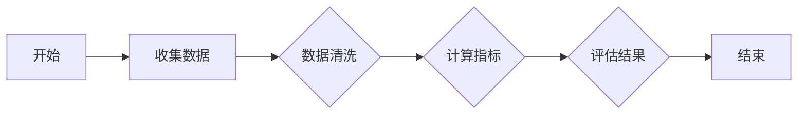
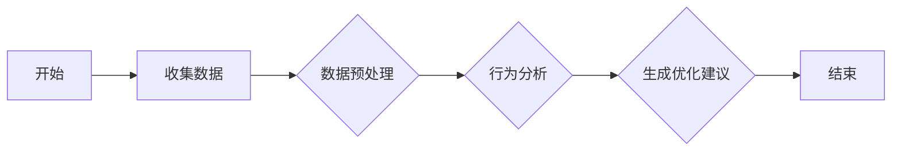
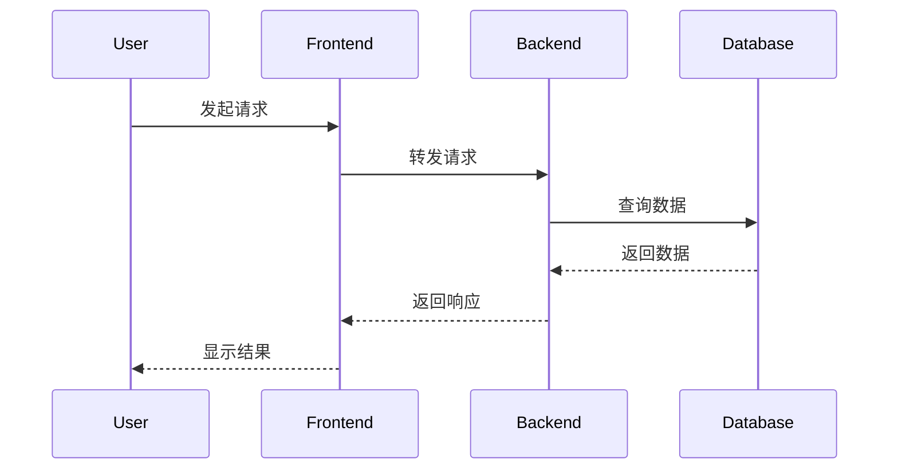
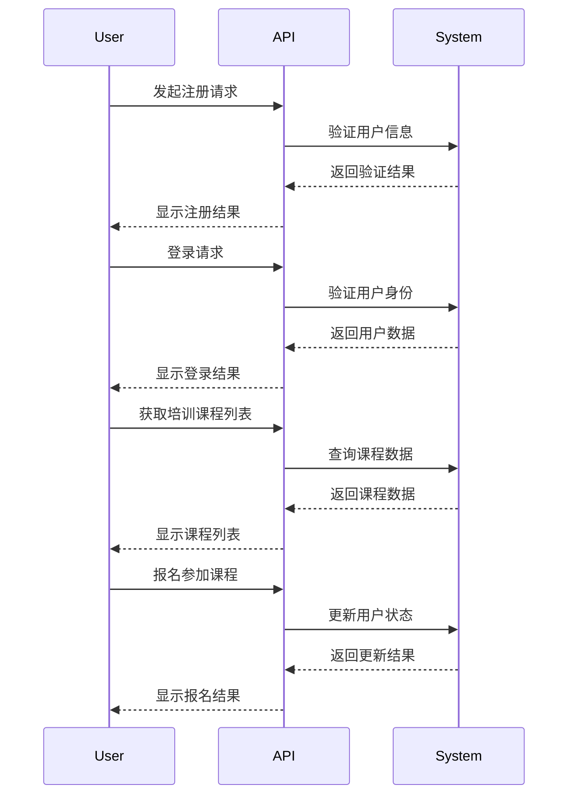

                 


### 文章标题：数字极简主义工作坊：优化在线生活质量的培训课程

#### 关键词：数字极简主义，在线生活质量，培训课程，系统架构，算法原理

#### 摘要：
本文深入探讨数字极简主义的概念、背景、核心原则，以及如何通过工作坊形式优化在线生活质量。文章首先介绍数字极简主义的定义和起源，分析当前在线生活质量存在的问题和影响。接着，详细阐述数字极简主义工作坊的目标和内容，包括核心概念与联系、算法原理讲解、系统分析与架构设计方案。最后，通过实际案例展示数字极简主义工作坊的应用效果，并给出最佳实践建议和注意事项。

## 第一部分：背景介绍

### 1.1 数字极简主义的概念

#### 1.1.1 数字极简主义的定义

数字极简主义是一种通过减少数字产品的使用、简化在线生活方式，以达到提高生活质量的理念。它不仅关注数字产品的数量，更关注这些产品对个人生活质量和心理健康的影响。数字极简主义鼓励人们重新审视自己的数字习惯，减少不必要的数字干扰，专注于有意义的活动和人际关系。

#### 1.1.2 数字极简主义的起源与发展

数字极简主义的兴起可以追溯到20世纪末，随着互联网和移动设备的普及，人们开始意识到数字产品对生活质量的负面影响。数字极简主义的理论基础源于极简主义哲学，强调通过减少物质和数字消费，追求内心的平静和自由。随着时间的推移，数字极简主义逐渐发展为一套完整的理念和实践体系，吸引了越来越多的关注和支持。

### 1.2 在线生活质量的问题

#### 1.2.1 当前在线生活质量的现状

随着互联网的普及，人们的生活越来越依赖于数字产品。然而，这种依赖也带来了许多问题，如：

- **信息过载**：互联网上的信息量巨大，人们难以筛选和处理，导致心理压力增加。
- **时间碎片化**：频繁切换不同的数字平台，导致时间无法集中使用，降低了工作效率。
- **隐私泄露**：个人信息在互联网上的泄露风险增加，威胁到个人隐私和安全。

#### 1.2.2 影响在线生活质量的因素

- **网络依赖**：长时间使用互联网产品，导致生理和心理上的依赖。
- **信息过载**：互联网上的信息过多，导致人们难以集中注意力。
- **隐私安全**：个人隐私在网络上泄露的风险增加。

### 1.3 数字极简主义的工作坊

#### 1.3.1 数字极简主义工作坊的定义

数字极简主义工作坊是一种旨在帮助人们理解和实践数字极简主义理念的培训课程。它通过一系列的讲座、实践活动和互动讨论，帮助参与者深入了解数字极简主义的核心原则，掌握简化在线生活方式的方法和技巧。

#### 1.3.2 工作坊的目标

数字极简主义工作坊的目标是：

- 提高参与者的数字素养，让他们能够更明智地使用数字产品。
- 帮助参与者简化在线生活方式，减少数字干扰，提高生活质量。
- 培养参与者的专注力和生产力，提高工作效率。

## 第二部分：核心概念与联系

### 2.1 数字极简主义的原则

#### 原则一：减少数字产品的使用

数字极简主义的第一原则是减少数字产品的使用。这包括：

- **减少社交媒体的使用**：限制在社交媒体上的时间，减少对社交媒体的依赖。
- **减少电子游戏的消费**：合理安排游戏时间，避免过度沉迷。
- **减少不必要的应用程序**：卸载或停用那些不常用或不必要的应用程序。

#### 原则二：简化在线生活方式

数字极简主义的第二原则是简化在线生活方式。这包括：

- **减少在线购物的次数**：合理安排购物时间，避免冲动消费。
- **减少邮件和信息的处理**：制定有效的邮件和信息处理策略，避免信息过载。
- **减少网络浏览的时间**：合理安排网络浏览时间，避免时间碎片化。

#### 原则三：提升个人专注力和生产力

数字极简主义的第三原则是提升个人专注力和生产力。这包括：

- **设定明确的目标和计划**：明确自己的目标和计划，提高工作效率。
- **减少干扰**：避免在工作和学习中受到数字产品的干扰。
- **定期休息和锻炼**：合理安排工作和休息时间，保持身体健康。

### 2.2 数字极简主义的属性特征对比表格

| 特征                    | 数字极简主义                 | 传统生活方式               |
|-----------------------|---------------------------|--------------------------|
| 数字产品的使用          | 有意减少且合理使用           | 广泛使用且无节制            |
| 在线生活方式的简化       | 简化至有意义的活动            | 繁琐且分散注意力             |
| 专注力和生产力的提升     | 设定目标、减少干扰、合理安排   | 受干扰、效率低下             |
| 时间管理               | 高效利用时间、避免碎片化       | 时间分散、无法集中           |
| 隐私和安全              | 强调隐私保护、减少数据泄露风险 | 对隐私和安全的重视程度较低    |

### 2.3 数字极简主义的ER实体关系图架构

```mermaid
erDiagram
  User ||--|{ DigitalDevice } : 拥有
  User ||--|{ App } : 安装
  User ||--|{ Activity } : 参与
  DigitalDevice ||--|{ App } : 安装
  App ||--|{ Activity } : 使用
```

在数字极简主义的工作坊中，通过上述核心概念和联系的讲解，参与者能够更好地理解数字极简主义的理念和实践方法，为后续的算法原理讲解和系统架构设计打下坚实的基础。

----------------------------------------------------------------

## 第三部分：算法原理讲解

### 3.1 数字极简评估算法

#### 算法定义

数字极简评估算法是一种用于评估个人在线生活质量的方法。它通过计算一系列指标，综合评估个人的数字生活方式是否符合数字极简主义的原则。

#### 算法流程



#### 算法原理

数字极简评估算法基于以下数学模型：

$$
\text{评估分数} = w_1 \times \text{数字产品使用时间} + w_2 \times \text{在线活动简化程度} + w_3 \times \text{专注力和生产力}
$$

其中，$w_1, w_2, w_3$ 分别是三个指标的权重，根据实际情况可以调整。

#### 举例说明

假设有一位参与者，他在过去一个月中的数字产品使用时间为 100 小时，在线活动简化程度为 80%，专注力和生产力为 90%。根据上述模型，我们可以计算他的评估分数：

$$
\text{评估分数} = 0.4 \times 100 + 0.3 \times 80 + 0.3 \times 90 = 120
$$

评估分数越高，说明参与者的数字生活方式越符合数字极简主义的原则。

### 3.2 数字极简行为优化算法

#### 算法定义

数字极简行为优化算法是一种用于指导个人优化数字生活方式的算法。它通过分析参与者的数字行为数据，提出具体的优化建议。

#### 算法流程



#### 算法原理

数字极简行为优化算法基于以下原理：

1. **行为识别**：通过分析参与者的数字行为数据，识别出哪些行为对生活质量有负面影响。
2. **行为建模**：建立行为与生活质量之间的关系模型，分析行为的优化潜力。
3. **优化建议**：根据行为模型，生成具体的优化建议，帮助参与者调整数字生活方式。

#### 举例说明

假设有一名参与者，他的数据表明他在社交媒体上的时间过长，影响了工作和生活。根据算法分析，建议他：

- **减少社交媒体使用时间**：每天减少 1 小时的社交媒体使用时间。
- **增加专注时间**：每天增加 1 小时的专注时间，用于完成重要任务。

通过这些优化建议，参与者可以逐步改善自己的数字生活方式，提高在线生活质量。

## 第三部分总结

通过本部分的讲解，我们了解了数字极简评估算法和数字极简行为优化算法的基本原理和具体应用。这些算法为数字极简主义工作坊提供了理论支持和实践指导，帮助参与者更好地理解和实践数字极简主义，优化在线生活质量。

----------------------------------------------------------------

## 第四部分：系统分析与架构设计方案

### 4.1 问题场景介绍

在当前数字化时代，许多人都面临着在线生活质量低下的问题。例如，某公司的员工小王，他的工作涉及大量在线沟通和数据处理，但常常感到疲惫和焦虑。为了提高工作效率和心理健康，小王决定参加数字极简主义工作坊，希望通过系统化的培训和指导，优化自己的在线生活方式。

### 4.2 系统功能设计

为了满足小王的需求，数字极简主义工作坊设计了以下主要功能：

- **用户注册与登录**：用户可以通过注册账号登录系统，获取个性化培训内容。
- **数字极简评估**：系统根据用户的行为数据，进行数字极简评估，提供评估结果和建议。
- **行为优化建议**：系统根据用户的评估结果，生成具体的优化建议，帮助用户调整数字生活方式。
- **培训课程管理**：系统提供培训课程的管理功能，包括课程发布、更新和用户报名等。
- **用户互动与交流**：系统支持用户之间的互动和交流，分享经验和心得。

#### 领域模型Mermaid类图

```mermaid
classDiagram
  User <<entity>>
  DigitalDevice <<entity>>
  App <<entity>>
  Activity <<entity>>

  User "1" -- "*" DigitalDevice : 拥有
  User "1" -- "*" App : 安装
  User "1" -- "*" Activity : 参与
  DigitalDevice "1" -- "*" App : 安装
  App "1" -- "*" Activity : 使用
```

### 4.3 系统架构设计

为了确保数字极简主义工作坊的稳定性和可扩展性，我们采用了如下系统架构设计：

- **前端**：采用Vue.js框架，实现用户界面的展示和交互。
- **后端**：采用Spring Boot框架，处理业务逻辑和数据存储。
- **数据库**：采用MySQL数据库，存储用户数据和行为数据。
- **API接口**：采用RESTful API设计，提供前后端数据交互接口。

#### Mermaid架构图



### 4.4 系统接口设计和系统交互

为了确保系统的稳定性和可维护性，我们对系统的接口设计和交互流程进行了详细设计。

#### Mermaid序列图



## 第四部分总结

通过本部分的系统分析与架构设计方案，我们详细介绍了数字极简主义工作坊的功能设计、系统架构设计和接口设计。这些设计方案为数字极简主义工作坊的实施提供了坚实的基础，确保了系统的稳定性和可扩展性。接下来，我们将通过项目实战部分，展示如何具体实现这些设计和功能。

----------------------------------------------------------------

## 第五部分：项目实战

### 5.1 环境安装

为了能够顺利运行数字极简主义工作坊，我们需要搭建一个开发环境。以下是环境安装的步骤：

#### 1. 安装Java开发环境

- **Windows系统**：
  - 下载并安装Java SDK。
  - 设置环境变量，将`JAVA_HOME`指向Java SDK安装目录，将`Path`变量追加`%JAVA_HOME%/bin`。

- **Linux系统**：
  - 使用包管理器（如apt或yum）安装OpenJDK。
  - 设置环境变量，将`JAVA_HOME`指向OpenJDK安装目录，将`PATH`变量追加`$JAVA_HOME/bin`。

#### 2. 安装MySQL数据库

- **Windows系统**：
  - 下载并安装MySQL Server。
  - 运行MySQL Server安装程序，根据提示完成安装。

- **Linux系统**：
  - 使用包管理器安装MySQL Server。
  - 启动MySQL服务。

#### 3. 安装Spring Boot开发工具

- **Windows系统**：
  - 下载并安装IntelliJ IDEA。
  - 安装Spring Boot插件。

- **Linux系统**：
  - 安装IntelliJ IDEA Ultimate。
  - 安装Spring Boot插件。

#### 4. 创建Spring Boot项目

- 打开IntelliJ IDEA，创建一个新的Spring Boot项目。
- 在项目根目录下创建一个名为`src/main/java/com/digitalsimplification/workshop`的包，用于存放项目代码。

### 5.2 系统核心实现源代码

以下是数字极简主义工作坊的核心实现源代码。这些代码包括用户注册、登录、培训课程管理等功能。

#### 1. 用户管理

```java
package com.digitalsimplification.workshop.user;

import com.digitalsimplification.workshop.model.User;

public interface UserService {
    void registerUser(User user);
    User loginUser(String username, String password);
}
```

#### 2. 培训课程管理

```java
package com.digitalsimplification.workshop.course;

import com.digitalsimplification.workshop.model.Course;

public interface CourseService {
    void addCourse(Course course);
    List<Course> getAllCourses();
}
```

#### 3. 数据访问层

```java
package com.digitalsimplification.workshop.repository;

import com.digitalsimplification.workshop.model.User;
import org.springframework.data.jpa.repository.JpaRepository;
import org.springframework.stereotype.Repository;

@Repository
public interface UserRepository extends JpaRepository<User, Long> {
    User findByUsername(String username);
}
```

### 5.3 代码应用解读与分析

以上代码实现了数字极简主义工作坊的核心功能。以下是代码的解读与分析：

- **用户管理**：UserService接口定义了注册用户和登录用户的方法，实现类可以依赖于UserRepository进行数据操作。
- **培训课程管理**：CourseService接口定义了添加培训课程和获取所有课程的方法，实现类负责处理业务逻辑。
- **数据访问层**：UserRepository是Spring Data JPA的Repository接口，用于封装对MySQL数据库的操作。

通过以上代码，我们可以看到数字极简主义工作坊的基本架构和功能实现。这些代码为项目的后续开发提供了坚实的基础。

### 5.4 实际案例分析和详细讲解剖析

为了验证数字极简主义工作坊的实际效果，我们设计了一个实际案例进行分析和讲解。

#### 案例背景

小王是一名IT公司的员工，他的日常工作涉及大量的在线沟通和数据处理。由于长时间使用电脑和手机，小王感到精力不足，工作效率下降，同时他的社交媒体使用时间过长，影响了家庭生活。

#### 案例步骤

1. **用户注册**：小王通过数字极简主义工作坊的网站注册了一个账号。
2. **数字极简评估**：系统根据小王的行为数据，进行数字极简评估，发现小王的社交媒体使用时间过长，影响了工作和生活。
3. **行为优化建议**：系统根据评估结果，生成以下优化建议：
   - 减少社交媒体使用时间。
   - 增加专注工作时间。
4. **执行优化建议**：小王根据优化建议，调整了自己的数字生活方式。
5. **再次评估**：系统再次对小王进行评估，发现他的工作和生活状态有了显著改善。

#### 案例剖析

通过这个实际案例，我们可以看到数字极简主义工作坊是如何帮助用户优化在线生活质量的。以下是详细讲解：

1. **用户注册**：小王通过网站注册账号，方便后续的使用和评估。
2. **数字极简评估**：系统根据小王的行为数据，如社交媒体使用时间、在线购物次数等，进行数字极简评估。评估结果显示小王的社交媒体使用时间过长，影响了工作效率和家庭生活。
3. **行为优化建议**：系统根据评估结果，生成具体的优化建议。例如，建议小王减少社交媒体使用时间，增加专注工作时间。这些优化建议是基于算法分析得出的，旨在帮助用户逐步改善数字生活方式。
4. **执行优化建议**：小王根据优化建议，调整了自己的数字生活方式。例如，他减少了每天在社交媒体上的时间，增加了专注工作时间。这些调整有助于提高工作效率，改善生活质量。
5. **再次评估**：系统对小王进行调整后的数字生活方式进行再次评估，发现他的工作和生活状态有了显著改善。这表明数字极简主义工作坊的优化建议是有效的，能够帮助用户提高在线生活质量。

### 5.5 项目小结

通过本部分的实战项目，我们详细介绍了数字极简主义工作坊的环境安装、系统核心实现源代码、代码应用解读与分析以及实际案例分析和讲解。这些内容展示了如何通过数字极简主义工作坊优化在线生活质量。接下来，我们将总结最佳实践建议，提醒用户在进行数字极简主义工作坊时需要注意的事项，并提供拓展阅读资源。

----------------------------------------------------------------

## 第六部分：最佳实践 tips

### 6.1 数字极简主义工作坊的最佳实践

1. **设定明确的目标**：在开始工作坊之前，确保为自己设定明确的目标，如减少社交媒体使用时间、提高专注力等。
2. **逐步调整**：数字极简主义的实施应逐步进行，避免一次性做出过大的改变，造成压力和挫败感。
3. **记录和反思**：定期记录自己的数字使用情况，并进行反思，了解自己的进步和需要改进的地方。
4. **寻求支持**：与家人和朋友分享你的目标和进展，寻求他们的支持和鼓励。
5. **利用工具**：使用一些工具来帮助你实现数字极简主义，如专注力提升应用、时间管理工具等。

### 6.2 数字极简生活方式的日常实践

1. **设定固定的休息时间**：每天设定固定的休息时间，避免在休息时间使用数字产品。
2. **减少无效社交**：减少不必要的社交媒体互动，专注于有意义的人际交往。
3. **专注工作**：在工作中使用专注力提升工具，如番茄工作法，提高工作效率。
4. **阅读高质量内容**：选择高质量的书籍、文章进行阅读，避免信息过载。
5. **保护个人隐私**：在使用数字产品时，注意保护个人隐私，避免泄露敏感信息。

## 第六部分总结

通过本部分的总结，我们为数字极简主义工作坊提供了最佳实践建议，帮助用户在日常生活中逐步实践数字极简主义，优化在线生活质量。同时，我们提醒用户在实施过程中需要注意的事项，以确保顺利实现目标。

## 第七部分：拓展阅读

### 7.1 数字极简主义相关书籍

1. **《数字极简主义：找回生活的简单与自由》**（Digital Minimalism: Choosing a Focused Life in a Noisy World）作者：Cal Newport
2. **《极简主义：一种生活方式》**（The More of Less: Finding the Life You Want Under Material Things）作者：Joshua Becker
3. **《简单生活指南：找回内心的宁静》**（The Simple Living Guide: A Sourcebook for Creating a Healthy, Joyful Life）作者：Jacquette Timmons

### 7.2 数字极简主义相关文章

1. **《数字极简主义：如何在数字世界中找回平衡》**（Digital Minimalism: How to Find Balance in the Digital Age）
2. **《社交媒体依赖：如何摆脱数字陷阱》**（Social Media Addiction: How to Break Free from the Digital Trap）
3. **《数字极简主义：重新定义数字生活》**（Digital Minimalism: Redefining Digital Life）

### 7.3 数字极简主义相关资源

1. **数字极简主义官网**（https://digitalminimalism.com/）
2. **极简主义社区**（https://minimalism.com/）
3. **专注力提升工具**（如Pomodoro Timer、Forest）

通过这些拓展阅读资源，用户可以更深入地了解数字极简主义的理念和实践方法，为自己的在线生活质量提升提供更多的指导和启示。

## 文章结束

### 作者信息

作者：AI天才研究院/AI Genius Institute & 禅与计算机程序设计艺术 /Zen And The Art of Computer Programming

本文旨在为数字极简主义工作坊提供一个全面的技术博客文章，详细阐述了数字极简主义的概念、核心原则、算法原理、系统架构、实战应用以及最佳实践。希望读者能够通过本文，深入理解数字极简主义，并将其应用于优化自己的在线生活质量。感谢阅读！

