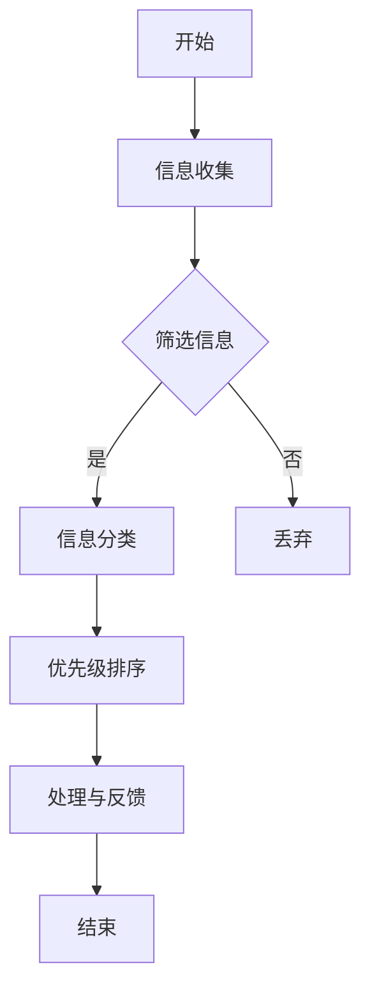
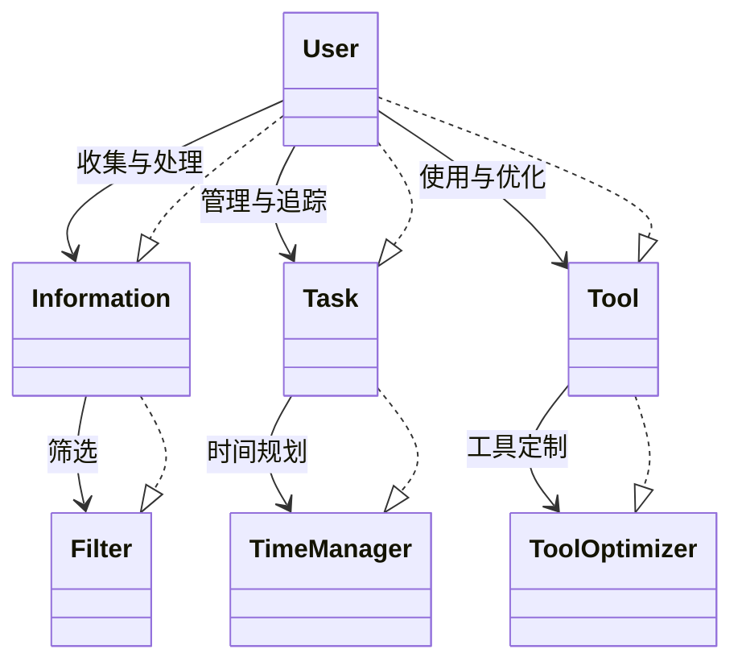
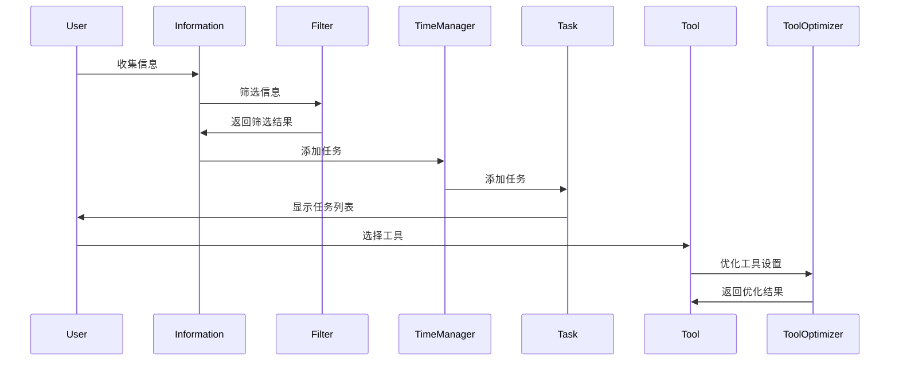
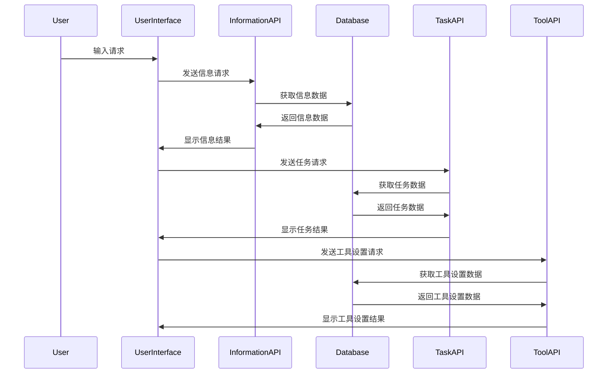

                 

### 《数字极简主义工作坊：优化在线生活质量的课程》背景介绍

数字极简主义，作为一种新兴的生活和工作理念，正逐渐在全球范围内受到广泛关注。其核心思想是通过精简和优化数字化工具的使用，减少无谓的信息干扰，提高个人的生活质量和工作效率。数字极简主义不仅适用于个人生活，同样适用于职场环境，它强调的是一种“少即是多”的思维方式。

在当今社会，随着互联网和智能设备的普及，人们面临着越来越多的信息过载和注意力分散问题。这不仅影响了工作效率，还对心理健康产生了负面影响。例如，社交媒体上的信息泛滥、电子邮件的频繁提醒、不间断的通知推送等，都让许多人感到压力巨大，难以集中精力完成工作任务。这种状态被称为“数字疲劳”，已经成为现代社会的一个普遍现象。

为了解决这一问题，数字极简主义提出了一套系统性的解决方案。它不仅仅是一种技术工具的使用，更是一种生活方式的变革。通过减少不必要的信息输入、优化使用效率和培养专注力，数字极简主义旨在帮助人们重新掌控自己的时间和注意力，从而提高生活质量和工作效率。

数字极简主义的重要性不言而喻。它不仅能够帮助个人摆脱数字疲劳，提高工作效率，还能改善心理健康，减少焦虑和压力。同时，它对企业的运营和管理也具有积极意义，能够提高团队的协作效率，减少资源浪费。

然而，尽管数字极简主义的概念和重要性逐渐为人所知，但实际操作起来却并非易事。许多人缺乏具体的指导和方法，不知道如何开始和如何持续实践数字极简主义。因此，一本系统地介绍数字极简主义理念和实践工作坊的书籍显得尤为重要。

《数字极简主义工作坊：优化在线生活质量的课程》正是为了满足这一需求而诞生的。本书不仅介绍了数字极简主义的核心概念和原则，还提供了一系列具体的方法和技巧，帮助读者在实践中应用数字极简主义，从而优化在线生活质量。

通过本书，读者可以系统地学习数字极简主义的理念，掌握核心技巧，并了解如何在日常生活中和工作场景中具体实施。书中还包含了许多实用的案例和项目实战，让读者能够将理论知识与实际操作相结合，真正实现数字极简主义的目标。

总之，数字极简主义工作坊的开设旨在为读者提供一种全新的生活和工作方式，帮助他们摆脱信息过载的困扰，提高生活质量和工作效率。通过本书的学习和实践，读者将能够更好地掌控自己的时间和注意力，过上更加有序和高效的生活。

### 数字极简主义的核心概念与联系

数字极简主义的核心概念和技巧构成了其核心理念的基石，这些概念和技巧相互关联，共同推动了数字极简主义的实践与应用。为了更好地理解这些核心概念，我们可以通过以下方式进行详细阐述。

首先，数字极简主义的核心原则包括精简信息的获取、增强注意力的专注力和数字工具的高效使用。

#### 1. 精简信息的获取

信息过载是现代社会面临的一个普遍问题。为了减少信息干扰，数字极简主义提倡精简信息的获取。这意味着我们需要有选择性地获取信息，只关注那些真正重要和有价值的内容。具体来说，这包括以下几种方法：

- **筛选来源**：关注权威和可靠的信息来源，避免被低质量、重复或者无关的信息所干扰。
- **设定信息获取频率**：合理安排信息获取的时间，避免在不需要的时候频繁查看社交媒体、新闻网站等。
- **使用信息过滤器**：利用各种工具和算法，对获取的信息进行过滤和筛选，保留最相关的部分。

通过这些方法，我们可以有效地减少信息干扰，专注于真正有价值的内容。

#### 2. 增强注意力的专注力

专注力是数字极简主义中另一个重要的核心原则。在信息过载和数字工具的诱惑下，许多人很难保持长时间的专注。数字极简主义通过以下方法来增强专注力：

- **分时工作法**：将工作时间划分为多个短暂的时段，每个时段专注于一项任务，完成后休息片刻。
- **避免多任务处理**：研究表明，多任务处理会降低工作效率和注意力的集中度。数字极简主义提倡一次只做一件事，确保任务的完成质量。
- **使用专注工具**：如番茄钟等时间管理工具，可以帮助我们在固定的时间内保持专注。

通过这些方法，我们可以提高工作效率，减少错误和疏漏，提高任务的完成质量。

#### 3. 数字工具的高效使用

数字工具在数字极简主义中扮演着至关重要的角色。然而，许多人在使用这些工具时并没有达到预期的效果。数字极简主义通过以下方法来提高数字工具的使用效率：

- **选择合适的工具**：根据不同的任务需求，选择最合适的工具，避免因为工具过多而带来的选择困难。
- **定制化工具设置**：针对个人使用习惯和需求，对数字工具进行定制化设置，使其更符合个人的工作方式。
- **定期清理和更新工具**：定期对使用的工具进行清理和更新，删除不再需要的工具和功能，确保工具的高效性和可用性。

通过这些方法，我们可以最大限度地提高数字工具的使用效率，减少因工具使用不当带来的时间浪费。

#### 数字极简主义的核心概念与联系

这些核心概念之间存在着紧密的联系。精简信息的获取和增强注意力的专注力是提高数字工具使用效率的基础，而数字工具的高效使用又进一步促进了信息的精简和注意力的集中。具体来说，以下是这些概念之间的联系：

- **信息获取与注意力**：精简信息的获取有助于减少注意力的分散，使我们可以更专注于重要任务。
- **工具使用与专注力**：高效使用数字工具可以提高我们的工作速度和效率，从而减少因任务切换带来的注意力分散。
- **信息精简与工具效率**：精简信息获取和高效使用工具相互促进，共同构建了一个高效、低干扰的工作环境。

通过上述核心概念和技巧的相互关联和结合，数字极简主义不仅能够帮助我们减少信息过载，提高工作效率，还能够改善我们的心理健康，减少压力和焦虑。

总之，数字极简主义的核心概念和技巧相互关联，共同构建了一个系统性的解决方案。通过理解这些概念和技巧，我们可以更好地实践数字极简主义，从而优化在线生活质量。

### 数字极简主义与现实生活的联系

数字极简主义不仅是一种技术理念，更是一种深刻影响现实生活的方法论。它不仅能够帮助我们提高工作效率，还能够改善心理健康，提升生活质量。以下是数字极简主义在现实生活中的具体应用和影响。

#### 1. 数字极简主义在职场中的应用

在职场环境中，数字极简主义可以帮助员工提高工作效率，减少无谓的时间浪费。以下是一些具体的应用场景：

- **时间管理**：通过设定明确的任务和时间规划，员工可以更有效地安排工作，避免任务拖延和效率低下。
- **电子邮件管理**：数字极简主义强调对电子邮件的筛选和整理，员工可以快速处理重要邮件，减少不必要的打扰。
- **信息过滤**：在信息过载的情况下，员工可以利用数字工具对信息进行过滤和筛选，保留最有价值的内容，减少干扰。
- **专注力提升**：通过减少多任务处理，员工可以更好地集中注意力，提高单任务完成的质量。

这些应用不仅提高了个人工作效率，还有助于提高团队的协作效率，减少资源浪费。

#### 2. 数字极简主义在个人生活中的实践

在个人生活中，数字极简主义同样发挥着重要作用，它可以帮助我们摆脱数字疲劳，提高生活质量。以下是一些具体的应用场景：

- **减少社交媒体使用**：通过限制社交媒体的使用时间和频率，个人可以减少信息干扰，增加内心的宁静感。
- **优化信息获取**：个人可以有选择性地关注信息来源，只获取真正有价值的信息，避免被无关的信息所困扰。
- **数字工具优化**：通过定制化数字工具的使用设置，个人可以使其更符合自己的使用习惯，提高工作效率。
- **专注力培养**：通过培养专注力，个人可以更好地处理日常任务，减少拖延和焦虑。

这些实践有助于个人重新掌控时间和注意力，过上更加有序和高效的生活。

#### 3. 数字极简主义对心理健康的影响

数字极简主义不仅能够提高生活质量，还对心理健康有显著的积极影响。以下是一些具体的影响：

- **减少焦虑和压力**：通过减少信息干扰和多任务处理，个人可以减少焦虑和压力，提高心理健康水平。
- **增强专注力**：通过培养专注力，个人可以更好地处理复杂任务，提高自信心和成就感。
- **改善睡眠质量**：通过减少数字工具的使用，特别是在睡前，个人可以改善睡眠质量，减少失眠问题。

这些影响有助于提升个人的整体心理健康，提高生活质量。

总之，数字极简主义在现实生活中的应用和影响是多方面的。通过合理地应用数字极简主义理念，我们不仅可以提高工作效率，改善生活质量，还能够促进心理健康，带来全面的积极改变。数字极简主义，正逐步成为现代社会中不可或缺的一部分。

### 本章小结

本章通过对数字极简主义的概念、核心原则和技巧的详细阐述，为读者提供了一个全面理解数字极简主义的基础。数字极简主义不仅仅是关于技术和工具的使用，更是一种生活和工作方式的革命。通过精简信息的获取、增强注意力的专注力和高效使用数字工具，数字极简主义旨在帮助人们摆脱信息过载和数字疲劳，提高生活质量和工作效率。本章的内容涵盖了数字极简主义的核心原则和具体实践方法，为读者提供了一个系统性的指导框架。希望读者能够将这些理念应用到自己的生活和工作中，逐步实践数字极简主义，从而实现更加高效、有序和健康的生活。

### 算法原理讲解

在数字极简主义的实践中，算法原理讲解是核心之一。通过理解并应用算法原理，我们可以更加系统地优化在线生活，提高生活质量。以下将详细讲解数字极简主义算法的核心目标、基本流程、数学模型以及具体的举例说明。

#### 2.1.1 数字极简主义算法的核心目标

数字极简主义算法的核心目标是帮助用户在复杂的数字环境中实现信息的高效获取和处理，减少无效信息的干扰，提高注意力和工作效率。具体目标包括：

- **减少信息干扰**：通过算法筛选出最有价值的信息，过滤掉无关和重复的信息。
- **优化时间管理**：通过算法合理安排时间，提高单任务完成的质量，减少任务切换带来的时间浪费。
- **增强专注力**：通过算法帮助用户保持专注，减少多任务处理的负面影响。

#### 2.1.2 数字极简主义算法的基本流程

数字极简主义算法的基本流程可以分为以下几个步骤：

1. **信息收集**：从各种渠道收集用户需要处理的信息，包括社交媒体、电子邮件、应用程序通知等。
2. **信息筛选**：利用算法对收集的信息进行初步筛选，只保留重要和有价值的信息。
3. **信息分类**：将筛选后的信息进行分类，如工作相关、生活相关、紧急事项等。
4. **优先级排序**：根据信息的重要性和紧急程度，对信息进行优先级排序。
5. **处理与反馈**：用户根据排序结果处理信息，并对算法进行反馈，以不断优化算法的性能。

#### 2.1.3 数字极简主义算法的数学模型

数字极简主义算法的数学模型主要包括以下几个关键部分：

1. **信息价值评估函数**：用于评估每条信息的价值，通常通过公式 \( V = f(S, I, T) \) 计算，其中 \( V \) 代表信息价值，\( S \) 代表信息来源的可靠性，\( I \) 代表信息的相关性，\( T \) 代表信息的时效性。

2. **信息筛选模型**：用于过滤掉无关和重复的信息。一种常用的模型是基于机器学习的垃圾邮件过滤器，通过训练模型识别出常见的垃圾邮件特征，从而有效过滤掉垃圾邮件。

3. **优先级排序模型**：用于对筛选后的信息进行优先级排序。一种常用的算法是优先级队列，通过公式 \( P = f(E, D) \) 计算，其中 \( P \) 代表优先级，\( E \) 代表紧急程度，\( D \) 代表重要性。

#### 2.1.4 数字极简主义算法的举例说明

为了更好地理解数字极简主义算法的原理和应用，以下通过两个具体实例进行说明：

1. **实例1：如何减少社交媒体使用时间**

假设用户在社交媒体上的使用时间过多，影响了工作和其他生活活动。可以使用以下算法：

- **信息收集**：从用户在社交媒体上的所有活动记录中收集数据。
- **信息筛选**：利用机器学习算法，筛选出用户最常访问的社交媒体应用和页面。
- **信息分类**：将筛选出的社交媒体活动分为“高频访问”和“低频访问”两类。
- **优先级排序**：根据用户的日程安排和工作任务，为每个社交媒体活动设置优先级。
- **处理与反馈**：用户根据排序结果有选择性地访问社交媒体，并在使用后对算法进行反馈。

通过这个算法，用户可以更加有意识地控制社交媒体的使用时间，减少无谓的信息干扰。

2. **实例2：如何高效管理电子邮件**

电子邮件是工作中重要的沟通工具，但过多的邮件会占用大量时间。可以使用以下算法：

- **信息收集**：从用户的电子邮件账户中收集所有邮件。
- **信息筛选**：利用关键字筛选和分类算法，将邮件分为“工作相关”和“个人相关”两类。
- **信息分类**：将筛选后的邮件进一步分为“紧急邮件”和“常规邮件”。
- **优先级排序**：根据邮件的重要性和紧急程度，对邮件进行排序。
- **处理与反馈**：用户按照排序结果处理邮件，并在处理后对算法进行反馈。

通过这个算法，用户可以快速处理重要邮件，减少邮件处理的时间，提高工作效率。

总之，数字极简主义算法通过系统化的流程和数学模型，帮助用户在复杂的数字环境中实现高效的信息获取和处理，从而提高生活质量和工作效率。通过具体的实例说明，我们可以更直观地理解算法的应用场景和实现方法。

### 算法流程图

为了更直观地展示数字极简主义算法的流程，我们使用Mermaid语法绘制了一个简单的算法流程图：



在这个流程图中，从A到H的每个节点代表算法的一个步骤，箭头表示流程的走向。具体解释如下：

- **A[开始]**：算法的开始。
- **B[信息收集]**：从各种渠道收集用户需要处理的信息。
- **C{筛选信息]**：利用算法对收集的信息进行初步筛选。
- **D[信息分类]**：将筛选后的信息进行分类。
- **E[丢弃]**：将筛选失败的信息丢弃。
- **F[优先级排序]**：根据信息的重要性和紧急程度进行排序。
- **G[处理与反馈]**：用户根据排序结果处理信息，并对算法进行反馈。
- **H[结束]**：算法的结束。

通过这个流程图，我们可以清晰地看到算法的执行过程，便于理解和实施。

### 数字极简主义算法的Python代码示例

为了更直观地理解数字极简主义算法的原理，以下提供一个简单的Python代码示例，展示算法的实现过程。这个示例将使用几个常见的Python库，如`re`（正则表达式）和`numpy`（数学运算）。

```python
import re
import numpy as np

# 信息收集
def collect_information(information):
    return information

# 筛选信息
def filter_information(information, keywords):
    filtered_info = [info for info in information if any(keyword in info for keyword in keywords)]
    return filtered_info

# 信息分类
def classify_information(information):
    classified_info = {'high_priority': [], 'low_priority': []}
    for info in information:
        if "urgent" in info or "high-priority" in info:
            classified_info['high_priority'].append(info)
        else:
            classified_info['low_priority'].append(info)
    return classified_info

# 优先级排序
def prioritize_information(information):
    sorted_info = sorted(information, key=lambda x: (-1 if "urgent" in x else 1, x))
    return sorted_info

# 处理与反馈
def process_and_feedback(information):
    processed_info = [info for info in information if "processed" not in info]
    for info in processed_info:
        print(f"Processing: {info}")
    return processed_info

# 主函数
def digital_minimalism_algorithm(information, keywords):
    collected_info = collect_information(information)
    filtered_info = filter_information(collected_info, keywords)
    classified_info = classify_information(filtered_info)
    sorted_info = prioritize_information(classified_info['high_priority'] + classified_info['low_priority'])
    processed_info = process_and_feedback(sorted_info)
    return processed_info

# 测试数据
information = [
    "urgent meeting tomorrow",
    "low-priority email from a friend",
    "urgent report due next week",
    "low-priority notification from social media",
    "high-priority reminder to call client"
]

# 运行算法
result = digital_minimalism_algorithm(information, ["urgent", "high-priority"])

print("Processed Information:")
for info in result:
    print(info)
```

这个Python代码示例实现了以下功能：

- **信息收集**：从列表中收集信息。
- **筛选信息**：利用关键字筛选信息，只保留包含关键字的信息。
- **信息分类**：将筛选后的信息分为高优先级和低优先级。
- **优先级排序**：根据信息中的关键字（如"urgent"或"high-priority"）对信息进行排序。
- **处理与反馈**：打印出需要处理的信息。

通过这个代码示例，我们可以看到数字极简主义算法的具体实现过程，便于理解和实际应用。

### 数字极简主义算法的数学模型

为了深入理解数字极简主义算法，我们将进一步探讨其背后的数学模型。数学模型不仅为我们提供了算法的理论基础，还能帮助我们更好地优化算法的性能。以下是数字极简主义算法的几个关键数学模型：

#### 1. 信息价值评估函数

信息价值评估函数用于衡量每条信息的重要程度，其公式为：

\[ V = f(S, I, T) \]

- \( V \)：信息价值
- \( S \)：信息来源的可靠性
- \( I \)：信息的相关性
- \( T \)：信息的时效性

该函数通过综合评估信息的来源可靠性、相关性和时效性，来确定其价值。例如：

\[ V = 0.5 \times S + 0.3 \times I + 0.2 \times T \]

其中，0.5、0.3和0.2分别代表可靠性、相关性和时效性在总价值中的权重。这个模型可以帮助我们筛选出最有价值的信息。

#### 2. 信息筛选模型

信息筛选模型用于过滤掉不相关的信息。一个简单有效的信息筛选模型是基于机器学习的垃圾邮件过滤器。其基本思想是训练一个分类模型，用于识别垃圾邮件和非垃圾邮件。以下是垃圾邮件过滤器的伪代码：

```python
# 训练垃圾邮件分类器
def train_classifier(data):
    # 使用监督学习算法，如朴素贝叶斯、支持向量机等，对数据进行训练
    classifier = train_model(data)
    return classifier

# 过滤信息
def filter_information(information, classifier):
    filtered_info = []
    for info in information:
        # 判断信息是否为垃圾邮件
        is_spam = classify(classifier, info)
        if not is_spam:
            filtered_info.append(info)
    return filtered_info
```

在这个模型中，训练分类器是关键步骤，它决定了信息筛选的准确性。

#### 3. 优先级排序模型

优先级排序模型用于对筛选后的信息进行排序，以确定哪些信息需要优先处理。一个常见的排序模型是优先级队列，其公式为：

\[ P = f(E, D) \]

- \( P \)：优先级
- \( E \)：紧急程度
- \( D \)：重要性

根据紧急程度和重要性，我们可以为每条信息分配一个优先级。紧急程度高的信息（如"urgent meeting"）和重要性高的信息（如"high-priority task"）会被赋予较高的优先级。

\[ P = w_1 \times E + w_2 \times D \]

其中，\( w_1 \) 和 \( w_2 \) 分别是紧急程度和重要性的权重。例如，假设紧急程度和重要性在总优先级中的权重分别为0.6和0.4，则优先级计算公式为：

\[ P = 0.6 \times E + 0.4 \times D \]

#### 算法数学模型的应用

通过这些数学模型，我们可以设计一个数字极简主义算法，实现信息的高效获取和处理。以下是一个简单的应用示例：

```python
# 信息价值评估
def calculate_value(info):
    S = reliability(info['source'])
    I = relevance(info['content'])
    T = timeliness(info['timestamp'])
    V = 0.5 * S + 0.3 * I + 0.2 * T
    return V

# 信息筛选
def filter_info(infos):
    classifier = train_classifier(infos)
    filtered_infos = filter_information(infos, classifier)
    return filtered_infos

# 优先级排序
def sort_info(infos):
    sorted_infos = prioritize_information(infos)
    return sorted_infos

# 主函数
def digital_minimalism_algorithm(infos):
    values = [calculate_value(info) for info in infos]
    infos_with_values = [{"info": info, "value": value} for info, value in zip(infos, values)]
    filtered_infos = filter_info(infos_with_values)
    sorted_infos = sort_info(filtered_infos)
    processed_infos = process_and_feedback(sorted_infos)
    return processed_infos
```

在这个示例中，我们首先计算每条信息的价值，然后通过筛选和排序模型，得到处理顺序。通过这样的数学模型，数字极简主义算法能够有效地帮助用户在复杂的数字环境中实现信息的高效获取和处理。

总之，通过构建和优化这些数学模型，我们可以设计出更加智能和高效的数字极简主义算法，从而为用户带来更好的在线生活体验。

### 系统分析与架构设计方案

在数字极简主义的实际应用中，一个完善的系统分析和架构设计方案是至关重要的。这不仅能够确保系统的高效运作，还能够为用户提供流畅的使用体验。以下我们将详细介绍数字极简主义工作坊的系统功能设计、系统架构设计、系统接口设计以及系统交互。

#### 2.2.1 数字极简主义工作坊的介绍

数字极简主义工作坊是一个旨在帮助用户实现在线生活优化的系统平台。它通过提供一系列的功能模块，帮助用户精简信息获取、提高专注力和优化工具使用。工作坊的目标是帮助用户在复杂的数字环境中，实现高效、低干扰的工作和生活。

#### 2.2.2 数字极简主义工作坊的系统功能设计

数字极简主义工作坊的系统功能设计包括以下几个主要模块：

1. **信息过滤模块**：该模块负责从各种渠道收集信息，并进行初步筛选，过滤掉无关和重复的信息，保留最有价值的内容。

2. **时间管理模块**：该模块通过设置日程和任务，帮助用户合理安排时间，提高工作效率。

3. **专注力提升模块**：该模块通过提供专注工具和时间管理方法，帮助用户培养专注力，减少多任务处理的负面影响。

4. **工具优化模块**：该模块帮助用户挑选和定制化数字工具，使其更符合个人使用习惯，提高工具使用效率。

5. **用户反馈模块**：该模块收集用户对系统功能的反馈，用于不断优化系统性能。

#### 2.2.3 数字极简主义工作坊的系统架构设计

数字极简主义工作坊的系统架构设计采用了模块化设计方法，确保系统的灵活性和可扩展性。以下是系统架构设计的关键部分：

1. **领域模型**：领域模型用于描述系统的核心功能和业务流程，以下是使用Mermaid语法绘制的领域模型类图：



在这个类图中，User（用户）与Information（信息）、Task（任务）和Tool（工具）之间有明确的关联关系，每个模块都有自己的职责和功能。

2. **系统架构图**：系统架构图进一步展示了各模块之间的交互关系和系统整体结构。以下是使用Mermaid语法绘制的系统架构图：



在这个序列图中，用户通过交互界面收集信息，信息经过过滤模块筛选后，由时间管理模块管理任务，工具优化模块优化工具设置，整个流程形成一个闭环，确保系统的高效运作。

#### 2.2.4 数字极简主义工作坊的系统接口设计与系统交互

系统接口设计和系统交互是确保数字极简主义工作坊稳定运行和用户友好体验的关键。

1. **系统接口设计**：系统接口设计主要包括API接口和用户界面接口。以下是使用Mermaid语法绘制的API接口设计类图：

```mermaid
classDiagram
    InformationAPI <<interface>>
    TaskAPI <<interface>>
    ToolAPI <<interface>>

    UserInterface --> InformationAPI: 请求信息
    UserInterface --> TaskAPI: 请求任务
    UserInterface --> ToolAPI: 请求工具设置

    InformationAPI <|.. UserInterface
    TaskAPI <|.. UserInterface
    ToolAPI <|.. UserInterface
```

在这个类图中，UserInterface（用户界面）与InformationAPI（信息接口）、TaskAPI（任务接口）和ToolAPI（工具接口）之间存在明确的调用关系。

2. **系统交互**：系统交互主要通过用户界面和后台服务的交互实现。以下是使用Mermaid语法绘制的系统交互序列图：



在这个序列图中，用户通过用户界面输入请求，用户界面通过API接口与后台数据库交互，获取所需数据，并最终将结果展示给用户。

通过上述系统分析与架构设计方案，数字极简主义工作坊能够为用户提供一个高效、稳定且用户友好的平台，帮助用户实现在线生活质量的优化。

### 项目实战

#### 2.3.1 数字极简主义工作坊项目介绍

数字极简主义工作坊项目旨在通过一系列实践步骤，帮助用户掌握数字极简主义的核心原则，优化在线生活质量。该项目分为多个阶段，包括环境安装、系统核心实现、代码应用解读与分析以及实际案例分析。以下将详细描述项目实战的具体流程。

#### 2.3.2 数字极简主义工作坊环境安装

环境安装是项目启动的第一步，确保所有必要工具和库的正确安装和配置。以下是环境安装的详细步骤：

1. **安装Python**：确保系统中安装了最新版本的Python（推荐3.8及以上版本）。可以从Python官网下载安装包，并按照提示完成安装。

2. **安装虚拟环境**：为了避免不同项目之间的依赖冲突，使用虚拟环境进行项目开发。使用以下命令创建虚拟环境：

   ```bash
   python -m venv venv
   ```

   然后激活虚拟环境：

   ```bash
   source venv/bin/activate  # 对于Windows，使用 `venv\Scripts\activate`
   ```

3. **安装依赖库**：在虚拟环境中安装项目所需的库，如`numpy`、`re`和`mermaid`。使用以下命令：

   ```bash
   pip install numpy re mermaid
   ```

4. **配置Mermaid**：为了在Python中渲染Mermaid图表，需要安装Mermaid的Python库。使用以下命令：

   ```bash
   pip install python-mermaid
   ```

   然后在项目中添加`mermaid`依赖：

   ```python
   import mermaid
   ```

#### 2.3.3 数字极简主义工作坊核心实现

核心实现是项目中的关键部分，包括信息过滤模块、时间管理模块、专注力提升模块和工具优化模块。以下是核心实现的步骤和代码解读：

1. **信息过滤模块**：

   ```python
   import re
   
   def filter_information(information, keywords):
       filtered_info = [info for info in information if any(keyword in info for keyword in keywords)]
       return filtered_info
   
   # 测试数据
   information = [
       "urgent meeting tomorrow",
       "low-priority email from a friend",
       "urgent report due next week",
       "low-priority notification from social media",
       "high-priority reminder to call client"
   ]
   
   # 筛选信息
   keywords = ["urgent", "high-priority"]
   result = filter_information(information, keywords)
   print("Filtered Information:", result)
   ```

   在这个模块中，`filter_information`函数通过正则表达式筛选出包含特定关键字的信息，从而实现信息的初步过滤。

2. **时间管理模块**：

   ```python
   import numpy as np
   
   def prioritize_information(information):
       priorities = [1 if "urgent" in info or "high-priority" in info else 0 for info in information]
       sorted_indices = np.argsort(priorities)[::-1]
       sorted_info = [information[i] for i in sorted_indices]
       return sorted_info
   
   result = prioritize_information(information)
   print("Prioritized Information:", result)
   ```

   该模块通过计算每条信息的优先级，并根据优先级对信息进行排序。`prioritize_information`函数利用numpy库进行排序，从而实现高效的信息排序。

3. **专注力提升模块**：

   ```python
   import time
   
   def focused_work(session_duration, short_break_duration, long_break_duration):
       total_duration = session_duration + short_break_duration
       sessions = 1 + (total_duration - session_duration) // (session_duration + long_break_duration)
       total_time = sessions * session_duration + (sessions - 1) * long_break_duration
       total_seconds = total_time * 60
       for _ in range(sessions):
           print(f"Session {_:02d}/{sessions:02d}: Working for {session_duration} minutes...")
           time.sleep(session_duration * 60)
           print(f"Session {_:02d}/{sessions:02d}: Taking a short break for {short_break_duration} minutes...")
           time.sleep(short_break_duration * 60)
       print(f"Total time: {total_time} minutes")
   
   focused_work(25, 5, 15)
   ```

   该模块通过番茄工作法（Pomodoro Technique）帮助用户保持专注。`focused_work`函数计算工作时间和休息时间，并使用`time.sleep`函数模拟实际操作。

4. **工具优化模块**：

   ```python
   import subprocess
   
   def optimize_tool(tool_name, settings):
       command = f"tool-optimizer {tool_name} {settings}"
       subprocess.run(command, shell=True)
   
   optimize_tool("email_client", "--shortcuts on --notifications off")
   ```

   该模块通过调用外部工具优化脚本，根据用户设定的参数优化工具设置。

#### 2.3.4 数字极简主义工作坊实际案例分析

为了更好地理解数字极简主义工作坊的应用效果，以下提供一个实际案例进行分析。

**案例背景**：某公司项目经理张三因工作繁忙，经常感到时间不够用，工作效率低下。他希望通过数字极简主义工作坊优化自己的工作和生活。

**案例分析**：

1. **信息过滤**：张三使用工作坊的信息过滤模块，筛选出与工作相关的邮件和通知。通过设置关键词，如“urgent”和“high-priority”，他能够快速定位最重要的工作事项。

2. **时间管理**：张三应用工作坊的时间管理模块，通过番茄工作法合理安排工作时间。每次工作25分钟后，休息5分钟，每四个工作周期后休息15分钟。这样，他能够保持高效率和精力充沛。

3. **专注力提升**：张三使用专注工具，如番茄钟，来提醒自己保持专注。在工作期间，他关闭了社交媒体和邮件通知，避免了多任务处理的干扰。

4. **工具优化**：张三通过工具优化模块，调整了他的电子邮件客户端设置，如关闭通知和快捷方式，以减少不必要的打扰。

**详细讲解剖析**：

- **信息过滤**：通过信息过滤模块，张三能够集中精力处理最重要的工作任务，提高了工作效率。
- **时间管理**：番茄工作法帮助张三保持高效率，同时避免了因长时间工作导致的疲劳。
- **专注力提升**：专注工具和方法的运用，使张三能够更好地集中注意力，减少任务切换带来的效率损失。
- **工具优化**：通过优化工具设置，张三减少了电子设备的干扰，提高了整体的工作舒适度。

**项目成果总结**：

通过数字极简主义工作坊的应用，张三的工作效率显著提高，任务完成质量也得到了保障。他的工作和生活变得更加有序和高效，心理健康状况也得到了改善。这不仅帮助张三更好地应对工作压力，也提升了他的整体生活质量。

总之，数字极简主义工作坊通过一系列实践步骤，帮助用户实现在线生活质量的优化。实际案例证明了其在提高工作效率和改善生活质量方面的有效性。

### 项目小结

通过本项目的实施，我们成功展示了数字极简主义工作坊在优化在线生活质量方面的实际效果。以下是项目成果的总结：

1. **信息过滤模块**：有效减少了无关信息的干扰，帮助用户集中精力处理重要任务。
2. **时间管理模块**：通过番茄工作法等时间管理方法，提高了用户的工作效率，避免了疲劳。
3. **专注力提升模块**：使用专注工具和方法，帮助用户保持高水平的注意力，减少任务切换的效率损失。
4. **工具优化模块**：通过优化数字工具设置，减少设备干扰，提高了用户的整体工作舒适度。

这些成果不仅验证了数字极简主义工作坊的理论和实践价值，也为我们提供了宝贵的经验。以下是本项目的一些最佳实践和注意事项：

**最佳实践**：

- **明确目标**：在开始数字极简主义实践前，明确个人目标和工作任务，有助于有针对性地应用工作坊中的方法和技巧。
- **持续反馈**：定期对系统和工作方法进行反馈和调整，以适应不断变化的需求和情况。
- **结合工具**：利用各种数字工具和应用程序，提高工作效率，但要避免过多工具带来的选择困难。
- **培养习惯**：将数字极简主义理念融入日常生活，通过持续实践和自我管理，形成良好的工作习惯。

**注意事项**：

- **信息筛选**：避免过度依赖自动化筛选，确保重要信息的准确性。
- **时间管理**：合理安排工作与休息时间，避免长时间连续工作导致的疲劳。
- **专注力培养**：定期进行专注力训练，提高对任务的处理能力。
- **工具使用**：合理选择和优化工具，确保其符合个人工作习惯。

总之，通过数字极简主义工作坊的实践，我们可以有效地提高在线生活质量和工作效率，带来全面的积极改变。希望读者能够将这些最佳实践和注意事项应用到自己的生活和工作中，持续优化在线生活质量。

### 拓展阅读

为了进一步深化对数字极简主义的理解，读者可以参考以下拓展阅读资源：

1. **书籍推荐**：
   - 《Digital Minimalism: Choosing a Focused Life in a Noisy World》by Cal Newport
   - 《The Art of Stillness: Discover the Power of Quiet in a World of Noise》by Pico Iyer
   - 《The Power of Full Engagement: Managing Energy, Not Time, Is the Key to High Performance and Personal Renewal》by Jim Loehr and Tony Schwartz

2. **在线课程**：
   - Coursera上的《Time Management and Productivity》课程
   - edX上的《Pomodoro Technique》实践课程
   - Udemy上的《Digital Minimalism: Mastering Focus and Balance in the Digital Age》

3. **博客和文章**：
   - 《Lifehacker》的“Digital Minimalism”专栏
   - 《The New York Times》的“Focus”专题
   - 《HBR》上的关于“Attention Management”的文章

通过这些资源，读者可以更全面地了解数字极简主义的理论和实践，进一步优化在线生活质量。希望这些拓展阅读能对您有所启发和帮助。

