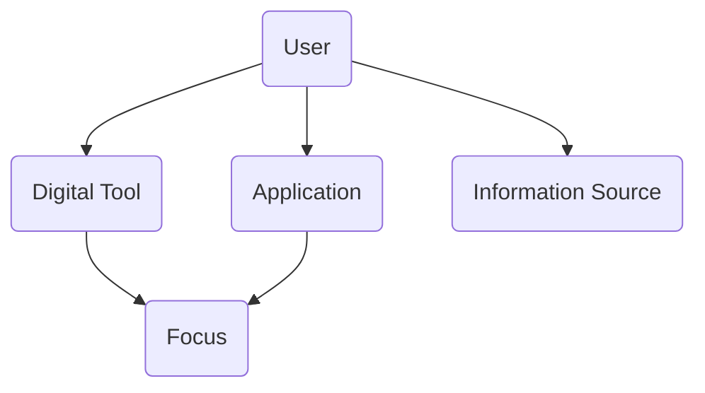

                 

### 文章标题

# 数字极简主义生活指南：信息时代的专注力重建实践手册

> 关键词：数字极简主义、专注力重建、信息过滤、生活方式优化、企业应用

> 摘要：本文旨在探讨数字极简主义生活指南，阐述其在信息时代中的重要性。通过分析数字极简主义的核心理念与实践方法，以及专注力重建的策略，为读者提供一套完整的生活指南，以帮助他们在数字化生活中重建专注力，实现高效、和谐的生活状态。

### 引言

在现代信息社会中，我们面临着前所未有的信息过载问题。智能手机、社交媒体、电子邮件等数字工具不断打扰我们的日常生活，让我们难以集中精力处理重要任务。这种信息过载现象不仅影响了我们的个人生活，还对企业的工作效率和员工的工作满意度产生了负面影响。数字极简主义作为一种应对信息过载的有效策略，提倡通过简化数字生活方式，重建专注力，提高生活质量。

本文将围绕数字极简主义这一主题，详细阐述其背景、核心概念、专注力重建策略以及在个人和企业中的应用。通过逐步分析，我们希望能够为读者提供一套实用的数字极简主义生活指南，帮助他们摆脱信息过载的困扰，实现更高效、更和谐的生活状态。

### 第一部分：背景介绍

#### 第1章：数字极简主义概述

#### 1.1 问题背景

##### 1.1.1 现代生活信息过载现象

在现代信息社会中，信息过载现象已经成为一个普遍存在的问题。据统计，人们每天接收到的信息量是过去数十年甚至数百年所无法比拟的。智能手机、社交媒体、电子邮件等数字工具极大地丰富了我们的信息来源，但同时也让我们陷入了信息过载的困境。许多人抱怨自己无法集中精力处理工作，生活中充满了焦虑和压力。

##### 1.1.2 数字极简主义的理念

数字极简主义旨在通过简化数字生活方式，减少不必要的数字工具和应用程序，从而降低信息过载的压力，提高生活质量。数字极简主义者主张专注于重要的事务，避免分散注意力，通过减少数字干扰来实现更高效率和更好的工作生活平衡。

##### 1.1.3 数字极简主义的重要性

数字极简主义在现代社会中具有重要意义。首先，它能够帮助我们减少信息过载，提高专注力，从而提高工作和学习的效率。其次，数字极简主义有助于降低生活成本，提高生活质量。最后，数字极简主义有助于培养良好的生活习惯，提升个人的自我管理和自律能力。

#### 1.2 问题提出

##### 1.2.1 如何应对信息过载

信息过载是现代生活中的一个普遍问题，如何应对这一问题成为了一个亟待解决的课题。数字极简主义提供了一种有效的解决方案，通过减少数字工具和应用程序的使用，降低信息摄入量，从而减轻信息过载的压力。

##### 1.2.2 数字极简主义的实践意义

数字极简主义不仅有助于个人生活的优化，对企业的运营也有着深远的影响。在企业中，数字极简主义可以帮助提高员工的工作效率，减少冗余流程，降低运营成本，从而提升企业的竞争力。此外，数字极简主义还有助于营造一个更加专注和高效的工作环境，提升企业的整体创新能力。

#### 1.3 问题解决

##### 1.3.1 数字极简主义的核心原则

数字极简主义的核心原则包括：简化数字工具，减少应用程序，过滤信息源，合理安排时间，保持专注等。这些原则有助于我们摆脱数字干扰，专注于重要的事务，提高生活和工作效率。

##### 1.3.2 数字极简主义的方法论

数字极简主义的方法论主要包括以下几个方面：

1. **评估现有的数字工具和应用程序**：对现有的数字工具和应用程序进行评估，识别出哪些是真正必要的，哪些是可以舍弃的。
2. **制定数字极简计划**：根据评估结果，制定一个数字极简计划，逐步减少不必要的使用。
3. **培养专注力**：通过练习冥想、时间管理等方法，提高专注力，减少分散注意力。
4. **优化生活方式**：通过调整生活习惯，如减少社交媒体使用时间、合理安排作息时间等，实现数字极简。

##### 1.4 边界与外延

##### 1.4.1 数字极简主义与其他概念的关系

数字极简主义与 minimalist lifestyle（极简主义生活）和 digital minimalism（数字极简主义）有一定的联系，但它们也有各自的侧重点。极简主义生活更注重物质生活的简化，而数字极简主义则更侧重于数字生活方式的简化。

##### 1.4.2 数字极简主义的适用范围

数字极简主义不仅适用于个人生活，也可以在企业中应用。对于个人来说，数字极简主义可以帮助他们提高工作效率，减少信息过载，提升生活质量。对于企业来说，数字极简主义可以帮助优化工作流程，降低运营成本，提高员工的工作满意度。

##### 1.4.3 概念结构与核心要素组成

数字极简主义的核心要素包括：

1. **数字工具评估**：评估并简化数字工具和应用程序。
2. **信息过滤**：过滤不必要的信息源，减少信息摄入量。
3. **时间管理**：合理安排时间，提高工作效率。
4. **专注力培养**：通过冥想、时间管理等方法培养专注力。

##### 1.5 本章小结

本章对数字极简主义进行了背景介绍，分析了信息过载现象，阐述了数字极简主义的理念、重要性以及实践方法。通过本章的介绍，读者可以初步了解数字极简主义的核心概念和实践方法，为后续章节的深入探讨打下基础。

### 第二部分：数字极简主义的核心概念

#### 第2章：数字极简主义的原理与实践

#### 2.1 核心概念原理

##### 2.1.1 数字极简主义的定义

数字极简主义（Digital Minimalism）是一种生活方式和哲学理念，强调通过简化数字设备和应用程序的使用，减少数字干扰，提高生活质量和专注力。它不仅仅是一种技术工具的使用方法，更是一种生活态度的体现。

##### 2.1.2 数字极简主义的哲学基础

数字极简主义的哲学基础可以追溯到古希腊哲学家亚里士多德的“中庸之道”。它主张在数字生活中寻找平衡，避免过度依赖数字工具带来的负面影响。此外，数字极简主义还受到了佛教冥想和日本“断捨离”理念的启发，强调通过减少物质和数字负担，实现心灵的自由和专注。

#### 2.2 概念属性特征对比

##### 2.2.1 数字极简主义与传统生活方式对比

| 特征             | 数字极简主义                | 传统生活方式                |
| ---------------- | ------------------------ | ------------------------ |
| 目标             | 简化数字生活，提高专注力      | 物质财富积累，社会地位提升    |
| 工具             | 选择必要的数字工具，减少冗余    | 依赖多种数字工具，追求多功能    |
| 生活态度         | 精简，专注，追求内心平静      | 追求物质丰富，忽视精神需求    |
| 价值观           | 简单，实用，高效             | 多样，复杂，追求享受           |

##### 2.2.2 数字极简主义与现代科技应用对比

| 特征             | 数字极简主义                | 现代科技应用                |
| ---------------- | ------------------------ | ------------------------ |
| 技术依赖程度      | 减少技术依赖，专注核心需求    | 高度依赖技术，追求多功能体验    |
| 信息摄入量       | 限制信息摄入，专注重要事务    | 无限制获取信息，容易分散注意力    |
| 生活质量         | 提高生活质量，减少数字干扰    | 提高生活便利，但可能增加压力    |
| 社交互动         | 真实社交，减少虚拟互动        | 虚拟社交，增强社交互动频率      |

#### 2.3 ER实体关系图架构

##### 2.3.1 数字极简主义相关的实体

在数字极简主义中，涉及到的关键实体包括：

1. **用户（User）**：数字极简主义的实践者。
2. **数字工具（Digital Tool）**：用户使用的数字产品和服务。
3. **应用程序（Application）**：用户安装和使用的软件程序。
4. **信息源（Information Source）**：用户获取信息的渠道。
5. **专注力（Focus）**：用户在数字化环境中保持的集中精力状态。

##### 2.3.2 实体之间的关系

数字极简主义中的实体关系图如下所示：

- 用户使用数字工具和应用程序，获取信息源。
- 用户通过保持专注力，提高数字工具和应用程序的使用效率。

#### 2.4 数字极简主义的实践案例

##### 2.4.1 个人实践案例

张先生是一名高级软件工程师，他意识到自己的数字生活方式过于复杂，导致工作效率低下。为了实践数字极简主义，他采取了以下措施：

1. **评估现有数字工具**：他列出了所有使用的数字工具和应用程序，评估其必要性和使用频率。
2. **减少冗余工具**：他删除了一些不常用的应用程序，并减少了对社交媒体的使用。
3. **专注力训练**：他开始每天进行冥想练习，提高专注力。
4. **时间管理**：他制定了详细的工作计划和休息时间，确保专注工作。

通过这些实践，张先生的工作效率显著提高，生活压力减轻，生活质量得到了提升。

##### 2.4.2 企业实践案例

某科技公司为了提高员工的工作效率和减少信息过载，决定实施数字极简主义策略。他们采取了以下措施：

1. **数字化工具评估**：公司对所有员工使用的数字工具进行了评估，筛选出必要的工具。
2. **信息过滤**：公司制定了信息过滤政策，限制了内部邮件和社交媒体的使用时间。
3. **专注力培训**：公司为员工提供了专注力培训，帮助他们提高专注力。
4. **数字化环境优化**：公司优化了办公环境，减少了干扰源，如关闭了不必要的通知和提醒。

通过这些措施，公司员工的工作效率得到了显著提高，团队协作更加顺畅，企业整体运营效率也得到了提升。

#### 2.5 本章小结

本章详细阐述了数字极简主义的核心理念和实践方法。通过对比分析，我们了解了数字极简主义与传统生活方式和现代科技应用的差异。通过实践案例，我们看到了数字极简主义在个人和企业中的应用效果。这些实践为读者提供了实际操作的参考，帮助他们在数字化生活中实现极简主义，提高生活质量。

### 第三部分：信息时代的专注力重建

#### 第3章：专注力的重要性与现状

#### 3.1 专注力的定义与作用

##### 3.1.1 专注力的定义

专注力（Focus）是指一个人在某一特定任务或活动中，保持高度集中精力，不受外界干扰，持续关注目标的能力。它是大脑的一种认知资源，能够帮助个体在复杂环境中保持专注，提高工作效率和学习效果。

##### 3.1.2 专注力在信息时代的重要性

在信息时代，专注力的重要性愈发突出。首先，随着互联网和数字设备的普及，人们面临的信息量和干扰源大幅增加，如何在这片信息海洋中保持专注，成为了一项重要能力。其次，专注力直接关系到工作效率。一个高专注力的人能够在短时间内完成更多的工作，减少错误率，提高工作质量。最后，专注力对于学习效果也有重要影响。专注力强的人更容易理解和吸收新知识，提高学习效率。

#### 3.2 专注力现状分析

##### 3.2.1 个人专注力现状

当前，个人专注力普遍存在问题。一方面，由于数字化生活方式的普及，许多人沉迷于社交媒体、游戏等数字娱乐，导致注意力分散，无法长时间保持专注。另一方面，工作压力大、生活节奏快，使许多人处于持续的高压状态，影响了专注力的发挥。研究表明，现代人平均注意力集中时间仅为20分钟左右，远低于过去的标准。

##### 3.2.2 企业专注力现状

在企业中，专注力的缺失同样严重。许多公司采用了复杂的信息系统和流程，员工需要同时处理多项任务，导致注意力分散。此外，频繁的会议、电子邮件和电话干扰，使员工难以集中精力工作，影响了工作效率和团队协作。一些研究表明，企业中约20%的时间被浪费在处理与工作任务无关的信息上。

#### 3.3 专注力缺失的原因

##### 3.3.1 信息过载的影响

信息过载是导致专注力缺失的主要原因之一。在信息爆炸的时代，人们每天接收到的信息量大大增加，但大脑的处理能力有限，导致注意力难以集中。例如，社交媒体上的不断推送、电子邮件的频繁提醒、手机的铃声和震动，都成为分散注意力的干扰源。

##### 3.3.2 数字化生活的挑战

数字化生活的快速发展带来了许多便利，但同时也带来了新的挑战。数字设备的普及使得人们可以随时随地获取信息，但这也意味着干扰源无处不在。此外，数字化生活方式使人们的注意力更容易分散，因为电子设备上的内容丰富多彩，让人难以长时间保持专注。

##### 3.3.3 工作压力与心理疲劳

工作压力和心理疲劳也是影响专注力的关键因素。在现代社会，许多人承受着巨大的工作压力，需要同时处理多项任务，导致心理疲劳。心理疲劳会降低人们的注意力水平，使他们在工作中难以保持专注。

#### 3.4 专注力重建的意义

##### 3.4.1 个人成长

专注力的重建对个人成长具有重要意义。首先，它有助于提高工作效率和学习效果，使个人能够更快地完成任务，掌握新知识。其次，专注力强的人更容易实现自我管理，建立良好的生活习惯，提高生活质量。最后，专注力也是个人成功的关键因素之一，能够帮助个人在竞争激烈的社会中脱颖而出。

##### 3.4.2 企业竞争力

对于企业来说，专注力的重建同样重要。首先，专注力强的工作团队能够更高效地完成任务，提高企业的整体运营效率。其次，专注力有助于减少错误率和返工成本，提高产品和服务质量。最后，专注力强的工作环境能够提高员工的工作满意度，降低员工流失率，提升企业的竞争力。

#### 3.5 本章小结

本章分析了信息时代个人和企业专注力的现状，探讨了专注力缺失的原因，并阐述了专注力重建的意义。通过了解专注力的重要性，我们认识到在数字化生活中重建专注力的重要性，为后续章节的专注力提升策略提供了基础。

### 第四部分：数字极简主义生活指南

#### 第4章：数字极简主义生活实践

#### 4.1 数字极简主义生活理念

##### 4.1.1 数字极简主义生活的核心原则

数字极简主义生活的核心原则包括：

1. **减少数字工具和应用程序**：选择必要的数字工具和应用程序，减少冗余，避免分散注意力。
2. **过滤信息源**：限制不必要的信息摄入，关注重要的事务，提高专注力。
3. **合理安排时间**：制定详细的时间管理计划，确保专注于重要任务。
4. **培养专注力**：通过冥想、专注力训练等方法，提高专注力水平。

##### 4.1.2 数字极简主义生活的价值观念

数字极简主义生活的价值观念包括：

1. **简化**：追求简单、实用的生活方式，减少物质和数字负担。
2. **专注**：专注于重要的事务，提高工作效率和生活质量。
3. **自律**：培养良好的生活习惯，自我管理，实现自我提升。

#### 4.2 数字极简主义生活方式

##### 4.2.1 个人数字化习惯的改变

1. **减少社交媒体使用**：限制每天在社交媒体上的时间，避免分散注意力。
2. **电子邮件管理**：制定邮件处理规则，设定特定时间查看和处理邮件。
3. **手机设置**：关闭不必要的通知和提醒，减少干扰。
4. **专注工作**：在工作时使用专注力工具，如番茄工作法，提高工作效率。

##### 4.2.2 家庭数字化环境的优化

1. **家庭网络优化**：优化家庭网络，确保网络稳定，减少干扰。
2. **数字设备管理**：合理分配数字设备，如电脑、手机、平板等，避免家庭成员相互干扰。
3. **家庭数字化协议**：制定家庭数字化协议，如晚上8点后不使用手机等，营造良好的家庭氛围。
4. **电子设备使用时间限制**：为儿童和青少年设定电子设备使用时间限制，保护他们的专注力和视力。

##### 4.2.3 企业数字化转型的策略

1. **数字化工具评估**：对现有数字化工具进行评估，选择必要且高效的工具。
2. **信息过滤机制**：建立信息过滤机制，减少冗余信息和干扰。
3. **时间管理培训**：为员工提供时间管理培训，提高工作效率。
4. **专注力培养**：为员工提供专注力培养课程，如冥想、专注力训练等。

#### 4.3 数字极简主义生活技巧

##### 4.3.1 时间管理技巧

1. **制定日程表**：每天制定详细的日程表，确保时间利用最大化。
2. **设定优先级**：将任务按照优先级排序，确保先完成重要任务。
3. **番茄工作法**：使用番茄工作法，将工作时间分为25分钟的工作周期和5分钟的休息时间，提高专注力。
4. **避免多任务处理**：避免同时处理多项任务，集中精力完成一项任务。

##### 4.3.2 信息过滤技巧

1. **邮件过滤规则**：设置邮件过滤规则，自动分类和处理邮件。
2. **社交媒体屏蔽工具**：使用社交媒体屏蔽工具，减少干扰。
3. **信息源筛选**：选择高质量、有价值的信

