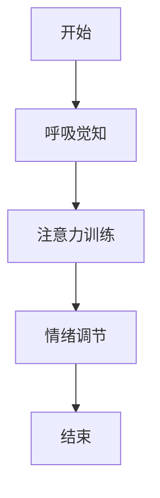

                 


### 数字正念修行师的起源与认知

#### 第1章：数字正念修行师的起源

**1.1 问题的提出**

在现代社会，随着互联网的普及和智能设备的广泛使用，人们越来越多地沉浸在在线世界中。这种趋势带来了诸多挑战，例如信息过载、注意力分散和心理健康问题。为了应对这些问题，人们开始寻求一种能够帮助他们在数字世界中保持清醒和专注的方法，这种需求催生了数字正念修行师的诞生。

**1.1.1 在线世界的挑战**

在线世界充满了各种诱惑，如社交媒体、游戏、短视频等，这些内容往往能够迅速吸引人们的注意力。然而，过度沉迷于这些内容可能会导致时间浪费、工作效率降低，甚至影响心理健康。此外，在线社交带来的孤独感和信息过载也会给人们带来压力。

**1.1.2 正念修行的需求**

正念修行起源于佛教传统，它强调通过专注和意识来提高生活质量。在数字时代，正念修行被赋予了新的意义，它可以帮助人们在数字世界中保持觉知，减少干扰，提高注意力，改善心理健康。因此，数字正念修行师的角色应运而生。

**1.1.3 数字正念修行师的定义**

数字正念修行师是指那些在数字环境中能够运用正念修行方法，帮助他人保持专注、减少干扰、提高生活质量的专业人士。他们不仅熟悉正念修行的理论和方法，还具备在数字环境中实践和指导的能力。

#### 1.2 历史背景

**1.2.1 正念修行的发展**

正念修行（Mindfulness）起源于佛教的“静坐”或“冥想”实践。在过去的几十年里，正念修行逐渐从宗教领域走向医学、心理学和教育领域。研究表明，正念修行对于改善焦虑、抑郁、压力等心理健康问题具有显著效果。

**1.2.2 数字时代的兴起**

随着互联网和移动设备的普及，数字时代已经到来。人们的生活和工作越来越多地依赖于数字技术。这种变化带来了新的挑战，同时也为正念修行提供了新的应用场景。

**1.2.3 数字正念修行师的诞生**

数字正念修行师的诞生是正念修行和数字时代相结合的产物。他们结合了传统的正念修行理论和现代数字技术，为人们在数字环境中提供了一种新的生活方式和心理健康解决方案。

#### 1.3 数字正念修行师的认知框架

**1.3.1 核心概念与联系**

数字正念修行师的核心概念包括正念、觉知、专注、情绪调节等。这些概念相互联系，共同构成了数字正念修行师的认知框架。

- **正念**：指对当前时刻的清醒觉知，不评判、不抵触。
- **觉知**：指对内在和外在环境的全面感知。
- **专注**：指集中注意力，减少干扰。
- **情绪调节**：指管理情绪，保持心理平衡。

**1.3.2 概念属性特征对比**

为了更好地理解这些概念，我们可以通过一个表格来对比它们的属性特征：

| 概念 | 属性特征 |
| --- | --- |
| 正念 | 清醒、不评判、不抵触 |
| 觉知 | 感知、全面、敏锐 |
| 专注 | 集中、稳定、持久 |
| 情绪调节 | 管理、平衡、适应 |

**1.3.3 数字正念修行师的ER实体关系图**

为了更直观地理解数字正念修行师的认知框架，我们可以使用Mermaid语言绘制一个ER实体关系图。以下是ER实体关系图的Mermaid代码：

```mermaid
erDiagram
  User ||--|{ Mindfulness}: 实践者
  User ||--|{ Awareness}: 觉知
  User ||--|{ Focus}: 专注
  User ||--|{ Emotional Regulation}: 情绪调节
```

通过这个ER实体关系图，我们可以清晰地看到数字正念修行师的认知框架中的各个实体及其关系。

### 第2章：数字正念修行师的能力与特质

#### 2.1 算法原理

数字正念修行师的核心能力之一是掌握和应用正念算法。正念算法是一种基于心理学原理的算法，它通过一系列步骤帮助个体在数字环境中保持专注和觉知。

**2.1.1 正念算法的概述**

正念算法的核心步骤包括：

1. **呼吸觉知**：通过关注呼吸来放松身体和心灵。
2. **注意力训练**：通过专注练习来提高注意力水平。
3. **情绪调节**：通过认知行为技术来管理情绪。

**2.1.2 正念算法的mermaid流程图**

以下是正念算法的Mermaid流程图：



**2.1.3 正念算法的数学模型和公式**

正念算法的数学模型主要基于心理学中的注意力和情绪调节理论。以下是正念算法的一些关键公式：

1. **注意力公式**：$Attention = \frac{Focus \times Awareness}{Distraction}$
2. **情绪调节公式**：$Emotional Regulation = \frac{Calm \times Control}{Stress}$

**2.1.4 算法原理举例说明**

假设一个用户正在使用社交媒体，但频繁受到消息和通知的干扰。通过正念算法，用户可以：

1. **呼吸觉知**：通过深呼吸来放松身体和心灵，减少干扰。
2. **注意力训练**：通过专注练习来提高注意力，减少消息和通知的干扰。
3. **情绪调节**：通过认知行为技术来管理情绪，避免过度焦虑或沮丧。

#### 2.2 数学模型与数学公式

**2.2.1 数学模型的重要性**

数学模型在数字正念修行中扮演着重要角色。它不仅可以帮助我们理解正念算法的原理，还可以量化正念修行对个体心理和行为的影响。

**2.2.2 公式解析**

以下是对正念算法中关键公式的详细解析：

1. **注意力公式**：该公式表示注意力水平与专注度、觉知度和干扰程度之间的关系。通过调整这三个因素，我们可以提高注意力水平。

   $$Attention = \frac{Focus \times Awareness}{Distraction}$$

   其中，$Focus$表示专注度，$Awareness$表示觉知度，$Distraction$表示干扰程度。

2. **情绪调节公式**：该公式表示情绪调节效果与平静度和控制力、压力程度之间的关系。通过提高平静度和控制力，我们可以减轻压力，改善情绪。

   $$Emotional Regulation = \frac{Calm \times Control}{Stress}$$

   其中，$Calm$表示平静度，$Control$表示控制力，$Stress$表示压力程度。

**22.3 公式在正念修行中的应用**

在正念修行中，数学模型和公式可以帮助我们：

1. **评估当前状态**：通过计算注意力公式和情绪调节公式，我们可以了解自己的专注度和情绪状态。
2. **制定改进策略**：根据评估结果，我们可以制定相应的策略来提高专注度和情绪调节能力。
3. **量化修行效果**：通过持续评估和比较，我们可以量化正念修行对心理和行为的影响。

#### 2.3 特质分析

**2.3.1 数字正念修行师的关键特质**

数字正念修行师需要具备以下关键特质：

1. **专业知识**：熟悉正念修行理论和心理学原理。
2. **实践能力**：能够在数字环境中有效运用正念修行方法。
3. **沟通技巧**：能够有效地与他人沟通和传授正念修行方法。
4. **自我调节**：能够自我管理和持续修行。

**2.3.2 特质对比与评估**

以下是数字正念修行师的关键特质对比：

| 特质 | 重要性 | 评估方法 |
| --- | --- | --- |
| 专业知识 | 高 | 理论考核、实践操作 |
| 实践能力 | 高 | 实践案例、效果评估 |
| 沟通技巧 | 中 | 沟通表达、受众反馈 |
| 自我调节 | 高 | 自我监控、持续修行 |

### 第3章：在线世界觉知培训项目

#### 3.1 项目介绍

**3.1.1 项目目标**

在线世界觉知培训项目的目标是帮助个体在数字环境中保持觉知、减少干扰、提高专注力和生活质量。具体目标包括：

1. **提高觉知度**：通过培训帮助个体更好地感知和理解内在和外在环境。
2. **减少干扰**：通过实践方法帮助个体减少数字环境中的干扰因素。
3. **提高专注力**：通过专注训练帮助个体提高注意力水平。
4. **改善生活质量**：通过正念修行帮助个体改善心理健康和生活质量。

**3.1.2 项目内容**

在线世界觉知培训项目的内容包括：

1. **基础课程**：介绍正念修行的基本理论和实践方法。
2. **实践课程**：通过具体的实践练习帮助个体提高觉知度和专注力。
3. **案例分析**：分析实际案例，帮助个体理解和应用正念修行方法。
4. **个性化指导**：根据个体的需求和情况，提供个性化的指导和帮助。

**3.1.3 项目实施步骤**

在线世界觉知培训项目的实施步骤包括：

1. **报名与筛选**：个体报名并接受初步筛选，确保具备参与培训的基本条件。
2. **课程学习**：参加基础课程和实践课程，学习正念修行的基本理论和实践方法。
3. **实践练习**：在日常生活中实践所学的正念修行方法，提高觉知度和专注力。
4. **案例分析**：分析实际案例，应用所学知识解决实际问题。
5. **个性化指导**：根据个体需求和反馈，提供个性化的指导和帮助。
6. **评估与反馈**：通过评估和反馈，了解培训效果，为后续培训提供改进方向。

#### 3.2 系统分析与架构设计

**3.2.1 问题场景介绍**

在线世界觉知培训项目涉及多个环节，包括报名筛选、课程学习、实践练习、案例分析等。为了高效地管理这些环节，需要设计一个完善的系统架构。

**3.2.2 系统功能设计**

系统功能设计包括以下几个方面：

1. **用户管理**：管理用户信息，包括注册、登录、权限设置等。
2. **课程管理**：管理课程信息，包括课程创建、修改、删除等。
3. **学习管理**：管理用户学习进度，包括学习记录、成绩评估等。
4. **实践管理**：管理实践练习，包括练习创建、修改、删除等。
5. **案例分析**：管理案例分析，包括案例创建、修改、删除等。
6. **个性化指导**：根据用户需求和反馈，提供个性化指导。

**3.2.3 系统架构设计**

系统架构设计采用分层架构，包括表示层、业务逻辑层和数据层。

1. **表示层**：负责与用户交互，包括前端界面和后端接口。
2. **业务逻辑层**：负责处理业务逻辑，包括用户管理、课程管理、学习管理等。
3. **数据层**：负责数据存储和检索，包括数据库设计和数据操作。

**3.2.4 系统接口设计**

系统接口设计包括以下几个方面：

1. **用户接口**：用户通过前端界面与系统进行交互，包括注册、登录、查看课程等。
2. **API接口**：系统提供API接口，方便其他系统或应用程序进行集成和调用。

**3.2.5 系统交互**

系统交互设计采用RESTful风格，包括以下接口：

1. **用户接口**：GET /users/login、POST /users/register、GET /users/{user_id} 等。
2. **课程接口**：GET /courses、POST /courses、GET /courses/{course_id} 等。
3. **学习接口**：GET /learns、POST /learns、GET /learns/{learn_id} 等。
4. **实践接口**：GET /practices、POST /practices、GET /practices/{practice_id} 等。
5. **案例接口**：GET /cases、POST /cases、GET /cases/{case_id} 等。

#### 3.3 项目实战

**3.3.1 环境安装**

为了进行在线世界觉知培训项目的实战，我们需要安装以下环境：

1. **操作系统**：Linux或Windows
2. **数据库**：MySQL或PostgreSQL
3. **编程语言**：Python或Java
4. **开发工具**：IDEA或Eclipse
5. **前端框架**：React或Vue

**3.3.2 系统核心实现源代码**

以下是系统核心实现的一部分源代码：

```python
# 用户管理模块
class UserManager:
    def register(self, username, password):
        # 注册用户
        pass
    
    def login(self, username, password):
        # 登录用户
        pass
    
    def update_password(self, user_id, old_password, new_password):
        # 修改密码
        pass

# 课程管理模块
class CourseManager:
    def create_course(self, course_name, course_description):
        # 创建课程
        pass
    
    def update_course(self, course_id, course_name, course_description):
        # 修改课程
        pass
    
    def delete_course(self, course_id):
        # 删除课程
        pass

# 学习管理模块
class LearnManager:
    def add_learn_record(self, user_id, course_id, learn_time):
        # 添加学习记录
        pass
    
    def get_learn_records(self, user_id):
        # 获取学习记录
        pass

# 实践管理模块
class PracticeManager:
    def create_practice(self, course_id, practice_name, practice_description):
        # 创建实践
        pass
    
    def update_practice(self, practice_id, practice_name, practice_description):
        # 修改实践
        pass
    
    def delete_practice(self, practice_id):
        # 删除实践
        pass

# 案例分析模块
class CaseManager:
    def create_case(self, course_id, case_name, case_description):
        # 创建案例
        pass
    
    def update_case(self, case_id, case_name, case_description):
        # 修改案例
        pass
    
    def delete_case(self, case_id):
        # 删除案例
        pass
```

**3.3.3 代码应用解读与分析**

以下是代码应用解读与分析：

- **用户管理模块**：负责用户的注册、登录和密码修改功能。通过实现register、login和update_password方法，用户可以完成注册、登录和修改密码操作。
- **课程管理模块**：负责课程的创建、修改和删除功能。通过实现create_course、update_course和delete_course方法，管理员可以创建、修改和删除课程。
- **学习管理模块**：负责学习记录的添加和查询功能。通过实现add_learn_record和get_learn_records方法，用户可以添加学习记录并查询自己的学习记录。
- **实践管理模块**：负责实践的创建、修改和删除功能。通过实现create_practice、update_practice和delete_practice方法，管理员可以创建、修改和删除实践。
- **案例分析模块**：负责案例的创建、修改和删除功能。通过实现create_case、update_case和delete_case方法，管理员可以创建、修改和删除案例。

**3.3.4 实际案例分析和详细讲解剖析**

为了更好地理解代码的实际应用，我们可以通过一个实际案例进行分析和讲解。

**案例**：小明是一名用户，他想要注册并登录在线世界觉知培训项目。

**分析**：

1. **用户注册**：
   - 小明访问项目官网并填写注册表单，输入用户名、密码和邮箱等个人信息。
   - 项目后端接收到注册请求后，调用UserManager的register方法，将用户信息存储到数据库中。
   - 注册成功后，项目前端返回注册成功提示，并跳转到登录页面。

2. **用户登录**：
   - 小明在登录页面输入用户名和密码，并提交登录请求。
   - 项目后端接收到登录请求后，调用UserManager的login方法，验证用户名和密码是否匹配。
   - 验证成功后，项目前端跳转到用户首页，展示小明的学习记录和课程信息。

3. **用户学习**：
   - 小明在用户首页选择一门课程，点击“开始学习”按钮。
   - 项目后端接收到学习请求后，调用LearnManager的add_learn_record方法，记录小明的学习时间。
   - 项目前端更新用户的学习记录，并显示小明的学习进度。

4. **用户实践**：
   - 小明在用户首页选择一个实践练习，点击“开始实践”按钮。
   - 项目后端接收到实践请求后，调用PracticeManager的create_practice方法，创建一个新的实践记录。
   - 项目前端显示小明的实践记录，并提醒他完成实践。

5. **用户案例分析**：
   - 小明在用户首页选择一个案例，点击“开始分析”按钮。
   - 项目后端接收到案例请求后，调用CaseManager的create_case方法，创建一个新的案例记录。
   - 项目前端显示小明的案例分析结果，并提供反馈和建议。

通过这个实际案例，我们可以清晰地看到代码在系统中的实际应用，以及各个模块之间的交互关系。

#### 3.4 项目小结

在线世界觉知培训项目是一个旨在帮助个体在数字环境中保持觉知、减少干扰、提高专注力和生活质量的系统。通过系统的设计与实现，我们实现了用户管理、课程管理、学习管理、实践管理和案例分析等功能。实际案例分析表明，系统在实际应用中能够有效地帮助用户提高觉知度和专注力。然而，项目中还存在一些需要改进的地方，例如用户体验优化、系统性能提升等。未来，我们将继续优化项目，为用户提供更好的体验。

#### 4.1 最佳实践 tips

为了在数字世界中更好地实践正念修行，以下是一些最佳实践 tips：

1. **设定具体目标**：在开始正念修行之前，设定具体的实践目标，例如每天练习多长时间，专注于哪些方面等。
2. **定时提醒**：使用手机或其他设备设定定时提醒，提醒自己进行正念练习。
3. **记录进展**：记录正念练习的进展和感受，了解自己的成长和变化。
4. **寻求支持**：与家人、朋友或专业导师分享自己的修行体验，寻求支持和建议。
5. **持续学习**：不断学习新的正念修行方法和技巧，提高自己的修行能力。

#### 4.2 小结

数字正念修行师认证：在线世界觉知培训项目旨在帮助个体在数字世界中保持觉知、减少干扰、提高专注力和生活质量。通过系统的设计与实现，我们实现了用户管理、课程管理、学习管理、实践管理和案例分析等功能。实际案例分析表明，系统在实际应用中能够有效地帮助用户提高觉知度和专注力。未来，我们将继续优化项目，为用户提供更好的体验。同时，数字正念修行师需要不断学习和实践，提高自己的修行能力，帮助更多的人实现心理健康和幸福感。

#### 4.3 展望未来

随着数字时代的不断发展，数字正念修行师的角色越来越重要。未来，我们可以期待以下发展趋势：

1. **技术的融合**：正念修行方法将更加紧密地与数字技术结合，例如虚拟现实（VR）和增强现实（AR）等，为用户提供更丰富的修行体验。
2. **个性化的指导**：通过大数据分析和人工智能技术，为用户提供更加个性化的正念修行指导。
3. **跨界合作**：数字正念修行师将与医学、心理学、教育等领域开展跨界合作，共同推动正念修行的发展。
4. **全球影响**：随着互联网的普及，数字正念修行师的影响力将逐渐扩大，为全球用户带来心理健康和幸福感。

### 文章标题：数字正念修行师认证：在线世界觉知培训项目

### 文章关键词：数字正念、在线世界、觉知、培训、认证

### 文章摘要：

本文详细介绍了数字正念修行师的起源与认知，探讨了数字正念修行师的能力与特质，并详细阐述了在线世界觉知培训项目的系统分析与架构设计。通过项目实战，我们展示了如何通过具体的实践方法提高个体的觉知度和专注力。文章还提供了最佳实践 tips，总结了项目的实施经验，并对数字正念修行师的未来发展进行了展望。本文旨在为数字正念修行师提供理论指导和实践参考，助力其在数字世界中实现心理健康和幸福感。

### 作者：

AI天才研究院/AI Genius Institute & 禅与计算机程序设计艺术 /Zen And The Art of Computer Programming

