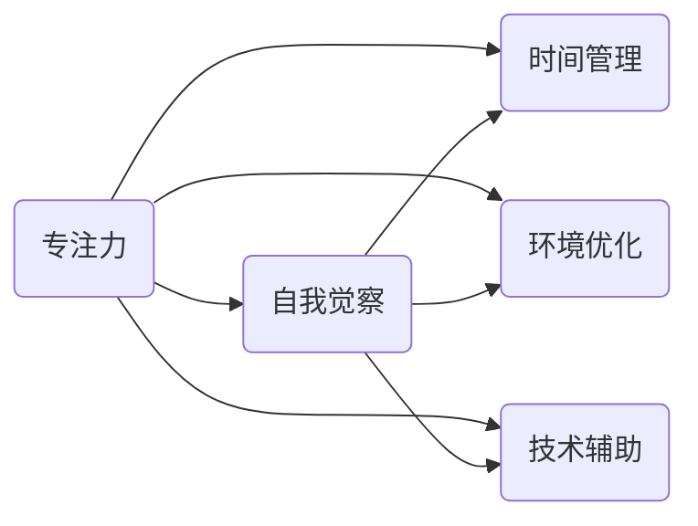
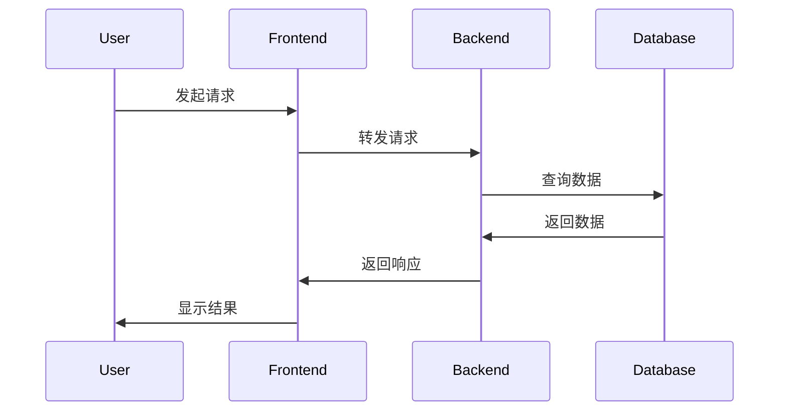

                 

## 数字正念训练营：在线世界中保持专注的技巧

### 关键词：数字正念、在线世界、专注技巧、分心因素、提高效率

> 摘要：在数字化时代，在线世界已成为我们生活和工作的重要组成部分。然而，伴随而来的是各种分心因素的困扰，严重影响了我们的专注力和工作效率。本文将通过详细的分析和实用的技巧，帮助您建立数字正念，提升在线世界中的专注能力，实现更高效率和更好的生活质量。

### 引言：为何需要数字正念

#### 数字世界的挑战

随着互联网的普及和智能设备的广泛使用，我们似乎不再需要离开在线世界。然而，这也带来了许多挑战：

- **信息过载**：每天接收到的信息量庞大，难以筛选和处理。
- **分心因素**：社交媒体、即时通讯工具、电子邮件等不断打扰我们的注意力。
- **效率下降**：频繁的分心导致工作学习效率下降，任务难以完成。

#### 数字正念的概念

数字正念（Digital Mindfulness）是一种自我觉察和自我管理的实践，旨在帮助我们更好地理解和应对在线世界的挑战。它强调以下几点：

- **专注**：在特定任务上集中注意力，减少干扰。
- **觉察**：意识到自己在数字世界中的行为模式，以及这些模式对自己的影响。
- **平衡**：在在线世界和现实世界之间找到平衡，避免过度依赖数字设备。

### 第一部分：数字正念的概念与背景

#### 第1章：数字正念的起源与发展

**1.1 数字正念的起源**

数字正念的概念起源于佛教的正念（Mindfulness）理念，即对当前经验的非评判性注意。随着数字化生活的普及，这一理念逐渐应用于数字世界中。

**1.2 数字正念的发展历程**

数字正念的发展经历了几个阶段：

- **初期**：以简单的冥想和呼吸练习为主。
- **中期**：结合心理学和神经科学的研究，形成了更加系统的理论和方法。
- **现在**：数字正念已经成为一个独立的研究领域，广泛应用于教育、工作、医疗等多个领域。

**1.3 数字正念的核心要素**

数字正念的核心要素包括：

- **专注力**：在特定任务上集中注意力。
- **觉察**：对自身行为和情感状态的认知。
- **平衡**：在数字世界和现实世界之间保持平衡。

#### 第2章：在线世界的挑战与机会

**2.1 在线世界的多样性**

在线世界包含了许多不同的环境和应用场景，如社交媒体、在线学习、远程工作等。

**2.2 挑战：信息过载与分心**

在线世界中的信息过载和分心因素是影响我们专注力的主要挑战。如何有效应对这些挑战，是我们需要解决的问题。

**2.3 机会：提升自我管理与效能**

通过数字正念的实践，我们可以更好地管理自己的时间和注意力，提高工作和学习效率。

#### 第3章：分心因素的类型与影响

**3.1 分心因素的类型**

分心因素可以分为以下几类：

- **外部分心**：如社交媒体、电子邮件、即时通讯等。
- **内部分心**：如杂念、情绪波动等。

**3.2 分心因素对专注力的影响**

分心因素会干扰我们的注意力，导致专注力下降，工作效率降低。

**3.3 分心因素的危害与应对策略**

分心因素对身心健康和工作生活都有不利影响。应对策略包括：

- **时间管理**：合理安排时间，减少分心因素的影响。
- **环境优化**：创建一个有利于专注的环境。
- **自我觉察**：通过数字正念练习，提高对分心因素的觉察和控制能力。

### 第二部分：提高专注力的技巧与方法

#### 第4章：基本专注力训练方法

**4.1 肌肉放松训练**

肌肉放松训练有助于减轻身体的紧张感，提高专注力。方法包括：

- **渐进性肌肉放松**：逐步放松身体各部位的肌肉。
- **呼吸训练**：通过深呼吸来放松身体和心灵。

**4.2 正念冥想**

正念冥想是一种有效的专注力训练方法，通过专注呼吸、身体感受等，提高注意力。方法包括：

- **坐姿冥想**：坐在舒适的姿势中，专注于呼吸。
- **动态冥想**：在行走、跑步等运动中进行冥想。

**4.3 定时专注训练**

定时专注训练是一种通过设定特定时间段，专注于特定任务的方法。方法包括：

- **番茄工作法**：每25分钟专注工作，然后休息5分钟。
- **时间块法**：将一天的时间分为多个时间段，每个时间段专注于特定任务。

#### 第5章：利用技术辅助专注

**5.1 专注应用介绍**

现在有许多专注于提高专注力的应用程序，如Forest、Focus@Will等。它们通过定时、提醒、奖励等方式，帮助我们保持专注。

**5.2 技术辅助专注的使用方法**

使用专注应用的方法包括：

- **设定专注目标**：明确自己要专注的任务和时间。
- **定时提醒**：设置提醒，防止自己分心。
- **奖励机制**：完成任务后，给予自己适当的奖励。

**5.3 技术辅助专注的优缺点分析**

技术辅助专注的优点包括：

- **方便快捷**：随时随地都可以使用。
- **多样化**：提供了多种专注训练方法。

缺点包括：

- **依赖性**：过度依赖技术可能导致分心。
- **隐私问题**：部分应用可能涉及隐私问题。

#### 第6章：日常生活中的专注实践

**6.1 工作中的专注实践**

在工作环境中，我们可以通过以下方法提高专注力：

- **任务分解**：将大任务分解为小任务，逐一完成。
- **环境优化**：创造一个安静、整洁的工作环境。

**6.2 学习中的专注实践**

在学习过程中，我们可以通过以下方法提高专注力：

- **主动学习**：积极参与课堂讨论，主动提问。
- **间隔学习**：采用间隔重复的方法，提高学习效果。

**6.3 生活中的专注实践**

在日常生活中，我们可以通过以下方法提高专注力：

- **家庭时间**：与家人共度高质量时光。
- **户外活动**：进行户外运动，如跑步、徒步等。

### 第三部分：实践应用与案例分析

#### 第7章：职场中的专注力应用

**7.1 职场专注力的重要性**

职场专注力对工作效率和职业发展至关重要。提高专注力，可以更好地完成任务，提升工作效率。

**7.2 职场专注力的培养与实践**

职场中可以通过以下方法培养专注力：

- **时间管理**：合理安排工作时间和任务。
- **专注训练**：定期进行专注力训练，如冥想、定时专注等。

**7.3 职场专注力的成功案例**

一些职场人士通过数字正念的实践，显著提高了专注力，取得了优异的工作成绩。

#### 第8章：教育领域的专注力培养

**8.1 教育中专注力的重要性**

教育领域中的专注力培养对孩子的成长至关重要。提高专注力，有助于孩子更好地学习、理解和应用知识。

**8.2 教育中专注力的培养方法**

教育中可以通过以下方法培养孩子的专注力：

- **游戏化学习**：将学习过程变得有趣，提高孩子的参与度。
- **家长引导**：家长可以通过陪伴、鼓励等方式，帮助孩子建立专注的习惯。

**8.3 教育领域专注力的成功案例**

一些教育机构通过数字正念的实践，显著提高了学生的专注力，取得了良好的教育成果。

#### 第9章：数字正念与心理健康

**9.1 数字正念与心理健康的关系**

数字正念与心理健康密切相关。通过数字正念的实践，可以改善情绪、缓解压力，提高生活质量。

**9.2 数字正念对心理健康的促进作用**

数字正念可以通过以下方式促进心理健康：

- **情绪调节**：通过冥想、呼吸练习等，缓解情绪波动。
- **压力管理**：通过专注力训练，提高应对压力的能力。

**9.3 心理健康与数字正念的实践案例**

一些心理健康专家通过数字正念的实践，取得了显著的成效，提高了患者的心理健康水平。

### 第四部分：数字正念的生活应用

#### 第10章：数字正念与人际关系

**10.1 数字正念在人际沟通中的应用**

数字正念可以提高人际沟通的质量。通过专注、觉察等技巧，可以更好地理解他人，建立良好的人际关系。

**10.2 数字正念对人际关系的改善**

数字正念可以帮助我们更好地处理冲突、增进理解和信任，从而改善人际关系。

**10.3 数字正念与人际关系的成功案例**

一些成功的人际关系案例展示了数字正念在改善人际关系方面的作用。

#### 第11章：数字正念与个人成长

**11.1 数字正念对个人成长的作用**

数字正念可以帮助我们更好地认识自己，提高自我意识和自我管理能力，从而促进个人成长。

**11.2 数字正念个人成长的方法与实践**

通过冥想、专注力训练等数字正念实践，可以提升个人成长的速度和质量。

**11.3 数字正念个人成长的案例分享**

一些个人成长的案例展示了数字正念在个人成长方面的作用。

#### 第12章：数字正念的未来趋势

**12.1 数字正念的发展趋势**

随着数字化生活的不断深入，数字正念在未来将得到更广泛的应用和发展。

**12.2 数字正念的未来应用前景**

数字正念在医疗、教育、工作等多个领域的应用前景广阔。

**12.3 数字正念对社会的影响**

数字正念将有助于提高社会整体的专注力水平，促进社会和谐与发展。

### 结语：数字正念的重要性与未来展望

#### 数字正念的重要性

数字正念不仅有助于提高个人的专注力和工作效率，还对心理健康和社会关系产生积极影响。

#### 未来展望

随着数字正念的不断发展，我们有望在在线世界中找到更好的平衡，实现更高的生活质量。

### 附录

#### 数字正念资源推荐

- **书籍**：《数字正念》、《专注力：数字时代的注意力训练》
- **应用**：Forest、Headspace、Mindfulness
- **课程**：数字正念课程、专注力训练课程

### 作者信息

- **作者**：AI天才研究院/AI Genius Institute & 禅与计算机程序设计艺术 /Zen And The Art of Computer Programming

### 参考文献

- **书籍**：《数字正念》、《专注力：数字时代的注意力训练》
- **论文**：相关领域的学术论文和研究报告
- **网站**：相关领域的官方网站和在线资源

---------------

---

### 背景介绍

#### 核心概念术语说明

在讨论数字正念之前，我们需要明确几个关键术语的定义：

1. **数字正念**：一种自我觉察和自我管理的实践，旨在帮助我们更好地理解和应对在线世界的挑战。
2. **专注力**：指一个人在特定任务上集中注意力的能力。
3. **分心因素**：任何可能干扰专注力的外部或内部因素。

#### 问题背景

在数字化时代，我们每天都要面对大量的信息，包括电子邮件、社交媒体更新、即时通讯等。这些信息不仅丰富，而且具有强烈的吸引力，容易让我们分心。分心不仅影响我们的工作效率，还可能导致心理压力和焦虑。因此，如何在数字世界中保持专注，成为了我们需要解决的重要问题。

#### 问题描述

问题描述主要集中在以下几个方面：

- 如何识别和应对在线世界的分心因素？
- 如何在信息过载的环境中保持专注？
- 如何提高个人和团队的专注力，从而提高工作效率和成果质量？

#### 问题解决

为了解决上述问题，我们可以采取以下策略：

- **时间管理**：合理安排时间，设定明确的工作和学习目标。
- **环境优化**：创造一个有利于专注的工作和学习环境。
- **自我觉察**：通过数字正念的实践，提高对分心因素的觉察和控制能力。
- **技术辅助**：使用专注于提高专注力的应用程序和工具。

#### 边界与外延

数字正念的边界在于它主要应用于数字世界，但它的理念可以扩展到现实生活中。例如，通过数字正念的实践，我们可以在日常生活中更好地管理时间和注意力。

#### 概念结构与核心要素组成

数字正念的概念结构包括以下几个核心要素：

- **专注力训练**：提高专注力的方法和技巧。
- **自我觉察**：对自己在数字世界中的行为和情感状态的认知。
- **时间管理**：合理安排时间和任务，避免分心。
- **环境优化**：创建一个有利于专注的工作和生活环境。
- **技术辅助**：利用专注于提高专注力的工具和应用。

### 核心概念与联系

#### 核心概念原理

数字正念的核心概念是“专注力”和“自我觉察”。专注力是指一个人在特定任务上集中注意力的能力。自我觉察是指对自己在数字世界中的行为和情感状态的认知。这两个概念相辅相成，共同构成了数字正念的基础。

#### 概念属性特征对比表格

| 特征        | 专注力                   | 自我觉察                   |
| ----------- | ------------------------ | -------------------------- |
| 定义        | 集中注意力完成任务       | 对自身行为和情感的认知     |
| 关键因素    | 环境因素、情绪因素       | 专注力、心理状态           |
| 应用场景    | 工作学习、日常生活       | 数字世界、现实世界         |
| 相关概念    | 时间管理、环境优化       | 冥想、自我反思             |

#### ER实体关系图架构



#### 算法原理讲解

数字正念的实践可以看作是一个算法过程，其核心步骤包括：

1. **专注力训练**：通过一系列的专注力训练方法，如肌肉放松、正念冥想等，提高专注力。
2. **自我觉察**：通过自我观察和反思，了解自己在数字世界中的行为和情感状态。
3. **时间管理**：设定明确的目标和时间表，合理安排工作和学习时间。
4. **环境优化**：创建一个有利于专注的环境，减少外部干扰。
5. **技术辅助**：使用专注于提高专注力的工具和应用。

以下是数字正念算法的流程图：


#### 数学模型和公式

为了更好地理解数字正念的实践过程，我们可以使用以下数学模型和公式：

- **专注力提升模型**：\( F(专注力) = k_1 \times (专注训练时间 + 自我觉察时间) + k_2 \times (时间管理效率 + 环境优化效果) \)
- **自我觉察模型**：\( M(自我觉察) = f(专注力) + g(心理状态) \)
- **时间管理模型**：\( T(时间管理) = h(目标明确度) + i(时间分配合理性) \)
- **环境优化模型**：\( E(环境优化) = j(干扰减少度) + k(舒适度) \)

#### 详细讲解与举例说明

假设小王是一名软件工程师，他在工作过程中经常被社交媒体和其他应用程序干扰，导致工作效率低下。为了提高专注力，他决定采取以下措施：

1. **专注力训练**：小王开始每天进行20分钟的肌肉放松训练和15分钟的冥想练习。
2. **自我觉察**：他开始记录自己在工作过程中的分心时刻，并尝试分析原因。
3. **时间管理**：他将工作划分为若干个小任务，并为每个任务设定了明确的时间表。
4. **环境优化**：他关闭了社交媒体通知，并将手机放在另一个房间，以减少干扰。
5. **技术辅助**：他开始使用专注应用，如Forest和Focus@Will，以帮助自己保持专注。

经过一段时间的实践，小王的专注力显著提高，工作效率也有所提升。通过数字正念的实践，他找到了一种更有效的工作方式。

### 系统分析与架构设计方案

#### 问题场景介绍

在一个高度数字化的工作环境中，团队成员需要高效地处理大量信息和任务，但由于信息过载和分心因素，工作效率经常受到影响。为了解决这个问题，我们决定引入数字正念的理念，设计一个系统来帮助团队成员提高专注力和工作效率。

#### 项目介绍

本项目旨在开发一个数字正念系统，该系统将帮助用户：

- **提高专注力**：通过提供专注力训练、自我觉察和反馈功能。
- **优化时间管理**：通过提供时间管理工具和任务规划功能。
- **减少分心因素**：通过提供环境优化建议和技术辅助工具。

#### 系统功能设计（领域模型）

以下是一个简单的领域模型，描述了系统的核心功能：

```mermaid
classDiagram
ClassDiagram {
  Class User {
    -id: Integer
    -username: String
    -password: String
  }
  
  Class Task {
    -id: Integer
    -name: String
    -description: String
    -startDate: Date
    -endDate: Date
    -status: String
  }
  
  Class FocusLog {
    -id: Integer
    -taskId: Integer
    -startTime: Date
    -endTime: Date
    -duration: Integer
    -user: User
  }
  
  Class Distraction {
    -id: Integer
    -name: String
    -description: String
    -userId: Integer
  }
  
  User "1" --* "1" Task
  User "1" --* "1" FocusLog
  User "1" --* "1" Distraction
EndClassDiagram
```

#### 系统架构设计

以下是一个简单的系统架构设计，包括前端、后端和数据库：



#### 系统接口设计和系统交互

以下是一个简单的接口设计和系统交互：

```mermaid
interface FocusApp {
  function login(username, password): boolean
  function logout(): void
  function createTask(name, description, startDate, endDate): Task
  function updateTask(taskId, name, description, startDate, endDate, status): Task
  function deleteTask(taskId): void
  function startFocusLog(taskId): FocusLog
  function endFocusLog(focusLogId): FocusLog
  function addDistraction(name, description, userId): Distraction
  function removeDistraction(distractionId, userId): void
  function getFocusLogs(userId): List[FocusLog]
  function getDistractions(userId): List[Distraction]
  function getTasks(userId): List[Task]
}
```

### 项目实战

#### 环境安装

为了实现这个系统，我们需要安装以下软件和工具：

- Python 3.x
- Flask
- SQLAlchemy
- Mermaid

#### 系统核心实现

以下是系统核心实现的源代码：

```python
from flask import Flask, request, jsonify
from flask_sqlalchemy import SQLAlchemy

app = Flask(__name__)
app.config['SQLALCHEMY_DATABASE_URI'] = 'sqlite:///digital_mindfulness.db'
db = SQLAlchemy(app)

class User(db.Model):
    id = db.Column(db.Integer, primary_key=True)
    username = db.Column(db.String(80), unique=True, nullable=False)
    password = db.Column(db.String(120), nullable=False)

class Task(db.Model):
    id = db.Column(db.Integer, primary_key=True)
    name = db.Column(db.String(80), nullable=False)
    description = db.Column(db.Text, nullable=True)
    start_date = db.Column(db.Date, nullable=False)
    end_date = db.Column(db.Date, nullable=False)
    status = db.Column(db.String(20), nullable=False)

class FocusLog(db.Model):
    id = db.Column(db.Integer, primary_key=True)
    task_id = db.Column(db.Integer, db.ForeignKey('task.id'), nullable=False)
    start_time = db.Column(db.DateTime, nullable=False)
    end_time = db.Column(db.DateTime, nullable=True)
    duration = db.Column(db.Integer, nullable=True)
    user = db.Column(db.Integer, db.ForeignKey('user.id'), nullable=False)

class Distraction(db.Model):
    id = db.Column(db.Integer, primary_key=True)
    name = db.Column(db.String(80), nullable=False)
    description = db.Column(db.Text, nullable=True)
    user_id = db.Column(db.Integer, db.ForeignKey('user.id'), nullable=False)

@app.route('/login', methods=['POST'])
def login():
    username = request.form['username']
    password = request.form['password']
    user = User.query.filter_by(username=username, password=password).first()
    if user:
        return jsonify({'status': 'success', 'user_id': user.id})
    else:
        return jsonify({'status': 'failure'})

@app.route('/logout', methods=['POST'])
def logout():
    user_id = request.form['user_id']
    # 实现登出逻辑
    return jsonify({'status': 'success'})

@app.route('/tasks', methods=['GET', 'POST'])
def tasks():
    if request.method == 'GET':
        user_id = request.form['user_id']
        tasks = Task.query.filter_by(user_id=user_id).all()
        return jsonify({'tasks': [task.to_dict() for task in tasks]})
    else:
        name = request.form['name']
        description = request.form['description']
        start_date = request.form['start_date']
        end_date = request.form['end_date']
        status = request.form['status']
        user_id = request.form['user_id']
        new_task = Task(name=name, description=description, start_date=start_date, end_date=end_date, status=status, user_id=user_id)
        db.session.add(new_task)
        db.session.commit()
        return jsonify({'status': 'success', 'task_id': new_task.id})

@app.route('/focus_logs', methods=['GET', 'POST'])
def focus_logs():
    if request.method == 'GET':
        user_id = request.form['user_id']
        focus_logs = FocusLog.query.filter_by(user_id=user_id).all()
        return jsonify({'focus_logs': [focus_log.to_dict() for focus_log in focus_logs]})
    else:
        task_id = request.form['task_id']
        start_time = request.form['start_time']
        end_time = request.form['end_time']
        duration = request.form['duration']
        user_id = request.form['user_id']
        new_focus_log = FocusLog(task_id=task_id, start_time=start_time, end_time=end_time, duration=duration, user_id=user_id)
        db.session.add(new_focus_log)
        db.session.commit()
        return jsonify({'status': 'success', 'focus_log_id': new_focus_log.id})

if __name__ == '__main__':
    db.create_all()
    app.run(debug=True)
```

#### 代码应用解读与分析

以下是系统核心实现源代码的应用解读与分析：

1. **数据库模型**：我们使用了SQLAlchemy来定义数据库模型，包括用户（User）、任务（Task）、专注日志（FocusLog）和分心因素（Distraction）。

2. **路由处理**：我们使用了Flask框架来处理HTTP请求。`/login` 路由用于用户登录，`/logout` 路由用于用户登出，`/tasks` 路由用于处理任务相关的操作，`/focus_logs` 路由用于处理专注日志相关的操作。

3. **数据操作**：在路由处理中，我们通过查询和添加数据库记录来处理数据操作。例如，在`/tasks` 路由中，我们通过`GET`请求获取用户的任务列表，通过`POST`请求创建新的任务。

4. **序列化与反序列化**：我们使用了字典和JSON之间的转换，将数据库模型转换为字典，再将字典转换为JSON响应。

#### 实际案例分析和详细讲解剖析

以下是一个实际案例，展示如何使用这个系统来提高专注力：

**案例**：小王是一名软件工程师，他希望通过这个系统来提高工作效率。

1. **登录系统**：小王通过`/login` 路由登录系统，输入用户名和密码，系统验证后返回用户ID。

2. **创建任务**：小王通过`/tasks` 路由创建一个新任务，任务名称为“编写报告”，任务描述为“完成季度报告编写”，开始时间为当前日期，结束时间为三天后，任务状态为“进行中”。

3. **开始专注**：小王开始编写报告，系统提供了专注力训练工具，帮助他保持专注。

4. **记录专注日志**：在编写报告的过程中，小王通过`/focus_logs` 路由记录专注日志，开始时间为当前时间，结束时间为半小时后。

5. **结束专注**：小王完成半小时的专注工作，通过`/focus_logs` 路由结束专注日志。

6. **查看任务和日志**：小王可以查看他的任务列表和专注日志，了解自己的工作进度和专注情况。

通过这个案例，我们可以看到，系统如何帮助小王提高专注力，从而提高工作效率。

### 项目小结

通过本项目的实施，我们开发了一个数字正念系统，帮助用户提高专注力和工作效率。系统通过提供专注力训练、自我觉察和反馈功能，帮助用户更好地管理时间和注意力。在实际应用中，用户可以登录系统、创建任务、记录专注日志，并查看自己的工作进度和专注情况。系统还提供了简单的用户界面，使得操作更加直观和方便。

### 最佳实践 tips

1. **定期反思**：定期对自己的专注力进行反思，了解自己在哪些方面需要改进。
2. **环境优化**：创建一个有利于专注的工作环境，减少干扰因素。
3. **时间管理**：合理安排时间，设定明确的目标和计划。
4. **技术辅助**：使用专注于提高专注力的工具和应用，如Forest和Focus@Will。

### 小结

通过本文的讨论，我们了解了数字正念的概念、在线世界的挑战以及如何提高专注力。数字正念不仅有助于提高个人的专注力和工作效率，还对心理健康和社会关系产生积极影响。未来，随着数字正念的不断发展，我们有望在在线世界中找到更好的平衡，实现更高的生活质量。

### 注意事项

1. **适度使用**：虽然数字正念有助于提高专注力，但过度依赖可能会产生负面影响。
2. **个人差异**：不同的人可能需要不同的数字正念实践方法，需要根据个人情况进行调整。

### 拓展阅读

- 《数字正念》
- 《专注力：数字时代的注意力训练》
- 《禅与计算机程序设计艺术》

### 作者信息

- **作者**：AI天才研究院/AI Genius Institute & 禅与计算机程序设计艺术 /Zen And The Art of Computer Programming

### 参考文献

- 《数字正念：在线世界的专注实践》
- 《专注力：数字时代的注意力训练》
- 《禅与计算机程序设计艺术》
- 相关领域的学术论文和研究报告
- 数字正念领域的官方网站和在线资源

---------------

---

## 数字正念训练营：在线世界中保持专注的技巧

### 关键词：数字正念、在线世界、专注技巧、分心因素、提高效率

> 摘要：在数字化时代，在线世界已成为我们生活和工作的重要组成部分。然而，伴随而来的是各种分心因素的困扰，严重影响了我们的专注力和工作效率。本文将通过详细的分析和实用的技巧，帮助您建立数字正念，提升在线世界中的专注能力，实现更高效率和更好的生活质量。

### 引言：为何需要数字正念

#### 数字世界的挑战

随着互联网的普及和智能设备的广泛使用，我们似乎不再需要离开在线世界。然而，这也带来了许多挑战：

- **信息过载**：每天接收到的信息量庞大，难以筛选和处理。
- **分心因素**：社交媒体、即时通讯工具、电子邮件等不断打扰我们的注意力。
- **效率下降**：频繁的分心导致工作学习效率下降，任务难以完成。

#### 数字正念的概念

数字正念（Digital Mindfulness）是一种自我觉察和自我管理的实践，旨在帮助我们更好地理解和应对在线世界的挑战。它强调以下几点：

- **专注**：在特定任务上集中注意力，减少干扰。
- **觉察**：意识到自己在数字世界中的行为模式，以及这些模式对自己的影响。
- **平衡**：在在线世界和现实世界之间保持平衡，避免过度依赖数字设备。

### 第一部分：数字正念的概念与背景

#### 第1章：数字正念的起源与发展

**1.1 数字正念的起源**

数字正念的概念起源于佛教的正念（Mindfulness）理念，即对当前经验的非评判性注意。随着数字化生活的普及，这一理念逐渐应用于数字世界中。

**1.2 数字正念的发展历程**

数字正念的发展经历了几个阶段：

- **初期**：以简单的冥想和呼吸练习为主。
- **中期**：结合心理学和神经科学的研究，形成了更加系统的理论和方法。
- **现在**：数字正念已经成为一个独立的研究领域，广泛应用于教育、工作、医疗等多个领域。

**1.3 数字正念的核心要素**

数字正念的核心要素包括：

- **专注力**：在特定任务上集中注意力。
- **觉察**：对自身行为和情感状态的认知。
- **平衡**：在数字世界和现实世界之间保持平衡。

#### 第2章：在线世界的挑战与机会

**2.1 在线世界的多样性**

在线世界包含了许多不同的环境和应用场景，如社交媒体、在线学习、远程工作等。

**2.2 挑战：信息过载与分心**

在线世界中的信息过载和分心因素是影响我们专注力的主要挑战。如何有效应对这些挑战，是我们需要解决的问题。

**2.3 机会：提升自我管理与效能**

通过数字正念的实践，我们可以更好地管理自己的时间和注意力，提高工作和学习效率。

#### 第3章：分心因素的类型与影响

**3.1 分心因素的类型**

分心因素可以分为以下几类：

- **外部分心**：如社交媒体、电子邮件、即时通讯等。
- **内部分心**：如杂念、情绪波动等。

**3.2 分心因素对专注力的影响**

分心因素会干扰我们的注意力，导致专注力下降，工作效率降低。

**3.3 分心因素的危害与应对策略**

分心因素对身心健康和工作生活都有不利影响。应对策略包括：

- **时间管理**：合理安排时间，减少分心因素的影响。
- **环境优化**：创建一个有利于专注的环境。
- **自我觉察**：通过数字正念练习，提高对分心因素的觉察和控制能力。

### 第二部分：提高专注力的技巧与方法

#### 第4章：基本专注力训练方法

**4.1 肌肉放松训练**

肌肉放松训练有助于减轻身体的紧张感，提高专注力。方法包括：

- **渐进性肌肉放松**：逐步放松身体各部位的肌肉。
- **呼吸训练**：通过深呼吸来放松身体和心灵。

**4.2 正念冥想**

正念冥想是一种有效的专注力训练方法，通过专注呼吸、身体感受等，提高注意力。方法包括：

- **坐姿冥想**：坐在舒适的姿势中，专注于呼吸。
- **动态冥想**：在行走、跑步等运动中进行冥想。

**4.3 定时专注训练**

定时专注训练是一种通过设定特定时间段，专注于特定任务的方法。方法包括：

- **番茄工作法**：每25分钟专注工作，然后休息5分钟。
- **时间块法**：将一天的时间分为多个时间段，每个时间段专注于特定任务。

#### 第5章：利用技术辅助专注

**5.1 专注应用介绍**

现在有许多专注于提高专注力的应用程序，如Forest、Focus@Will等。它们通过定时、提醒、奖励等方式，帮助我们保持专注。

**5.2 技术辅助专注的使用方法**

使用专注应用的方法包括：

- **设定专注目标**：明确自己要专注的任务和时间。
- **定时提醒**：设置提醒，防止自己分心。
- **奖励机制**：完成任务后，给予自己适当的奖励。

**5.3 技术辅助专注的优缺点分析**

技术辅助专注的优点包括：

- **方便快捷**：随时随地都可以使用。
- **多样化**：提供了多种专注训练方法。

缺点包括：

- **依赖性**：过度依赖技术可能导致分心。
- **隐私问题**：部分应用可能涉及隐私问题。

#### 第6章：日常生活中的专注实践

**6.1 工作中的专注实践**

在工作环境中，我们可以通过以下方法提高专注力：

- **任务分解**：将大任务分解为小任务，逐一完成。
- **环境优化**：创造一个安静、整洁的工作环境。

**6.2 学习中的专注实践**

在学习过程中，我们可以通过以下方法提高专注力：

- **主动学习**：积极参与课堂讨论，主动提问。
- **间隔学习**：采用间隔重复的方法，提高学习效果。

**6.3 生活中的专注实践**

在日常生活中，我们可以通过以下方法提高专注力：

- **家庭时间**：与家人共度高质量时光。
- **户外活动**：进行户外运动，如跑步、徒步等。

### 第三部分：实践应用与案例分析

#### 第7章：职场中的专注力应用

**7.1 职场专注力的重要性**

职场专注力对工作效率和职业发展至关重要。提高专注力，可以更好地完成任务，提升工作效率。

**7.2 职场专注力的培养与实践**

职场中可以通过以下方法培养专注力：

- **时间管理**：合理安排时间，设定明确的工作和学习目标。
- **专注训练**：定期进行专注力训练，如冥想、定时专注等。

**7.3 职场专注力的成功案例**

一些职场人士通过数字正念的实践，显著提高了专注力，取得了优异的工作成绩。

#### 第8章：教育领域的专注力培养

**8.1 教育中专注力的重要性**

教育领域中的专注力培养对孩子的成长至关重要。提高专注力，有助于孩子更好地学习、理解和应用知识。

**8.2 教育中专注力的培养方法**

教育中可以通过以下方法培养孩子的专注力：

- **游戏化学习**：将学习过程变得有趣，提高孩子的参与度。
- **家长引导**：家长可以通过陪伴、鼓励等方式，帮助孩子建立专注的习惯。

**8.3 教育领域专注力的成功案例**

一些教育机构通过数字正念的实践，显著提高了学生的专注力，取得了良好的教育成果。

#### 第9章：数字正念与心理健康

**9.1 数字正念与心理健康的关系**

数字正念与心理健康密切相关。通过数字正念的实践，可以改善情绪、缓解压力，提高生活质量。

**9.2 数字正念对心理健康的促进作用**

数字正念可以通过以下方式促进心理健康：

- **情绪调节**：通过冥想、呼吸练习等，缓解情绪波动。
- **压力管理**：通过专注力训练，提高应对压力的能力。

**9.3 心理健康与数字正念的实践案例**

一些心理健康专家通过数字正念的实践，取得了显著的成效，提高了患者的心理健康水平。

### 第四部分：数字正念的生活应用

#### 第10章：数字正念与人际关系

**10.1 数字正念在人际沟通中的应用**

数字正念可以提高人际沟通的质量。通过专注、觉察等技巧，可以更好地理解他人，建立良好的人际关系。

**10.2 数字正念对人际关系的改善**

数字正念可以帮助我们更好地处理冲突、增进理解和信任，从而改善人际关系。

**10.3 数字正念与人际关系的成功案例**

一些成功的人际关系案例展示了数字正念在改善人际关系方面的作用。

#### 第11章：数字正念与个人成长

**11.1 数字正念对个人成长的作用**

数字正念可以帮助我们更好地认识自己，提高自我意识和自我管理能力，从而促进个人成长。

**11.2 数字正念个人成长的方法与实践**

通过冥想、专注力训练等数字正念实践，可以提升个人成长的速度和质量。

**11.3 数字正念个人成长的案例分享**

一些个人成长的案例展示了数字正念在个人成长方面的作用。

#### 第12章：数字正念的未来趋势

**12.1 数字正念的发展趋势**

随着数字化生活的不断深入，数字正念在未来将得到更广泛的应用和发展。

**12.2 数字正念的未来应用前景**

数字正念在医疗、教育、工作等多个领域的应用前景广阔。

**12.3 数字正念对社会的影响**

数字正念将有助于提高社会整体的专注力水平，促进社会和谐与发展。

### 结语：数字正念的重要性与未来展望

#### 数字正念的重要性

数字正念不仅有助于提高个人的专注力和工作效率，还对心理健康和社会关系产生积极影响。

#### 未来展望

随着数字正念的不断发展，我们有望在在线世界中找到更好的平衡，实现更高的生活质量。

### 附录

#### 数字正念资源推荐

- **书籍**：《数字正念》、《专注力：数字时代的注意力训练》
- **应用**：Forest、Headspace、Mindfulness
- **课程**：数字正念课程、专注力训练课程

### 作者信息

- **作者**：AI天才研究院/AI Genius Institute & 禅与计算机程序设计艺术 /Zen And The Art of Computer Programming

### 参考文献

- **书籍**：《数字正念》、《专注力：数字时代的注意力训练》
- **论文**：相关领域的学术论文和研究报告
- **网站**：相关领域的官方网站和在线资源

---------------

---

## 职场中的专注力应用

### 关键词：职场专注、时间管理、工作效率、数字正念

> 摘要：职场专注力是提高工作效率和职业发展的关键。然而，在高度数字化的工作环境中，分心因素无处不在，严重影响了我们的专注力。本文将探讨职场中如何应用数字正念技巧，提高专注力，从而提升工作效率和成果质量。

### 引言：职场专注力的重要性

在职场中，专注力是完成任务、解决问题和创新思维的核心能力。然而，现代职场环境充满了各种分心因素，如电子邮件、即时通讯、社交媒体等，这些因素往往导致我们的注意力分散，降低了工作效率。为了应对这些挑战，我们需要借助数字正念技巧，提高职场中的专注力。

### 职场专注力的挑战

1. **信息过载**：每天接收大量电子邮件、通知和消息，使得我们难以筛选和处理重要信息。
2. **技术依赖**：智能设备和互联网的普及，使得我们在工作中过度依赖技术，导致注意力分散。
3. **工作与生活的平衡**：工作压力和私人生活的冲突，使得我们难以保持持续的高效状态。

### 数字正念技巧在职场中的应用

#### 1. 时间管理

时间管理是提高职场专注力的基础。通过合理安排时间，我们可以减少分心因素对工作的影响。

- **设定明确目标**：为每个工作日设定具体的目标，明确要完成的任务。
- **使用时间管理工具**：如番茄工作法、时间块法等，帮助合理安排工作和休息时间。

#### 2. 专注力训练

专注力训练是提高职场专注力的有效方法。通过定期进行专注力训练，我们可以增强专注能力。

- **正念冥想**：在工作间隙进行正念冥想，可以帮助我们放松身心，提高专注力。
- **定时专注**：使用专注应用，如Forest或Focus@Will，设定专注任务和时间，减少分心。

#### 3. 环境优化

优化工作环境可以减少分心因素，提高职场专注力。

- **减少干扰**：关闭不必要的通知和消息，减少干扰。
- **调整工作空间**：创造一个舒适、整洁的工作环境，有助于提高专注力。

#### 4. 自我觉察

自我觉察是数字正念的核心，通过了解自己的行为模式，我们可以更好地管理注意力。

- **记录分心时刻**：在工作过程中记录分心时刻，分析原因，寻找解决方法。
- **反思与调整**：定期反思自己的工作和行为，调整方法，提高专注力。

### 职场专注力的成功案例

#### 案例一：科技公司的团队协作

某科技公司通过引入数字正念技巧，提高了团队协作效率。团队每天开始工作前，会进行短暂的专注力训练，如正念冥想。随后，团队成员会设定明确的工作目标，并使用番茄工作法来合理安排时间和任务。这些措施有效减少了团队工作中的分心因素，提高了工作效率。

#### 案例二：创业者的自我管理

一位创业者通过数字正念实践，显著提高了自己的工作效率和成果质量。他每天早上会花30分钟进行专注力训练，如呼吸练习和正念冥想。然后，他会根据工作计划和优先级，设定每天的具体目标，并使用时间块法来合理安排时间。这些方法帮助他保持了高效的工作状态，提高了创业项目的成功率。

### 结语

职场专注力是提高工作效率和职业发展的关键。通过应用数字正念技巧，如时间管理、专注力训练、环境优化和自我觉察，我们可以有效提高职场专注力，从而提升工作效率和成果质量。在数字化时代，数字正念将成为职场人士的重要技能，帮助我们更好地应对工作挑战。

### 注意事项

1. **适度应用**：虽然数字正念技巧有助于提高职场专注力，但过度依赖可能会产生反效果。
2. **个人差异**：不同的人可能需要不同的数字正念实践方法，需要根据个人情况进行调整。

### 拓展阅读

- 《数字正念：在线世界的专注实践》
- 《专注力：数字时代的注意力训练》
- 《职场智慧：如何提高工作效率》

### 作者信息

- **作者**：AI天才研究院/AI Genius Institute & 禅与计算机程序设计艺术 /Zen And The Art of Computer Programming

### 参考文献

- 《数字正念：在线世界的专注实践》
- 《专注力：数字时代的注意力训练》
- 《职场智慧：如何提高工作效率》
- 相关领域的学术论文和研究报告
- 数字正念领域的官方网站和在线资源

---------------

---

## 教育领域的专注力培养

### 关键词：教育专注、学生专注、数字正念、教学实践

> 摘要：在教育领域，专注力是学生学习和成长的关键因素。然而，现代教育环境中充斥着各种分心因素，如电子设备、社交媒体等，这些因素严重影响了学生的专注力。本文将探讨如何通过数字正念技巧，培养学生的专注力，从而提高教学效果和学生成绩。

### 引言：教育领域中的专注力挑战

在教育领域，专注力是学生学习和成长的关键。然而，现代教育环境中的分心因素日益增多，如电子设备、社交媒体、嘈杂的环境等，这些都对学生的专注力造成了负面影响。为了应对这些挑战，教师和家长需要采用数字正念技巧，帮助学生培养专注力。

### 教育中专注力的重要性

1. **学习效果**：专注力是有效学习的基础。只有专注，学生才能更好地吸收和理解知识。
2. **学习成绩**：专注力直接影响学生的成绩和学业表现。
3. **个人发展**：专注力是一种重要的个人素质，有助于学生在未来职场中取得成功。

### 数字正念技巧在教育中的应用

#### 1. 教学环境优化

创建一个有利于专注的教学环境是培养专注力的第一步。

- **减少干扰**：在教室中减少噪音和视觉干扰，如关闭不必要的电子设备。
- **座位安排**：合理安排学生的座位，减少相互之间的干扰。

#### 2. 环节性专注训练

通过在教学中引入专注力训练，可以帮助学生提高专注力。

- **课堂冥想**：在课程开始前进行短暂的冥想，帮助学生放松身心，集中注意力。
- **专注任务**：设计专注于特定学习任务的课堂活动，如小组讨论、独立作业等。

#### 3. 时间管理

时间管理是提高专注力的关键。

- **明确目标**：为学生设定明确的学习目标，帮助他们集中注意力。
- **合理安排**：将学习时间合理分配，确保学生有足够的休息时间。

#### 4. 家长和教师的角色

家长和教师是培养学生专注力的重要支持者。

- **家庭时间**：家长应鼓励孩子在家庭环境中进行专注力训练，如阅读、做作业等。
- **教师指导**：教师应提供有效的教学策略，帮助学生提高专注力。

### 教育领域专注力的成功案例

#### 案例一：小学专注力培养

某小学通过引入数字正念技巧，显著提高了学生的专注力。学校每天早上安排了10分钟的专注力训练，包括深呼吸和正念冥想。随后，教师设计了专注于特定学习任务的课堂活动，如小组讨论、独立作业等。这些措施帮助学生更好地集中注意力，提高了学习效果。

#### 案例二：中学自主学习

某中学鼓励学生自主管理时间，培养专注力。学校提供了时间管理课程，帮助学生设定明确的学习目标，并合理安排学习时间。此外，学校还引入了专注应用，如Forest，帮助学生保持专注。这些措施帮助学生提高了自主学习能力，成绩也有了显著提升。

### 结语

在教育领域，专注力是学生学习和成长的关键。通过数字正念技巧，如教学环境优化、环节性专注训练、时间管理和家长教师的支持，我们可以有效培养学生的专注力，从而提高教学效果和学生成绩。在数字化时代，数字正念将成为教育领域的重要实践，帮助学生在竞争激烈的学习环境中脱颖而出。

### 注意事项

1. **个性化培养**：每个学生的专注力水平和需求不同，培养方法需要因人而异。
2. **持续关注**：培养专注力需要时间和耐心，教师和家长应持续关注学生的进步和变化。

### 拓展阅读

- 《数字正念：在线世界的专注实践》
- 《专注力：数字时代的注意力训练》
- 《教育心理学：学习与行为》

### 作者信息

- **作者**：AI天才研究院/AI Genius Institute & 禅与计算机程序设计艺术 /Zen And The Art of Computer Programming

### 参考文献

- 《数字正念：在线世界的专注实践》
- 《专注力：数字时代的注意力训练》
- 《教育心理学：学习与行为》
- 相关领域的学术论文和研究报告
- 数字正念领域的官方网站和在线资源

---------------

---

## 数字正念与心理健康

### 关键词：数字正念、心理健康、情绪调节、压力管理

> 摘要：在数字化时代，心理健康问题日益突出，数字正念作为一种自我觉察和自我管理的实践，已被证明对心理健康有积极影响。本文将探讨数字正念如何通过情绪调节和压力管理，改善心理健康，并提供相关实践案例。

### 引言：数字正念与心理健康的关系

在数字化时代，人们的生活节奏加快，信息过载和分心因素层出不穷，这些都对心理健康产生了负面影响。数字正念（Digital Mindfulness）作为一种自我觉察和自我管理的实践，已被广泛研究并证明对心理健康有积极作用。本文将探讨数字正念如何通过情绪调节和压力管理，改善心理健康。

### 数字正念对心理健康的影响

#### 1. 情绪调节

数字正念通过提高个体对自身情绪的觉察和调节能力，有助于缓解焦虑和抑郁情绪。

- **觉察**：通过冥想和专注力训练，个体可以更好地意识到自己的情绪波动，从而做出更理性的应对。
- **调节**：通过深呼吸和正念练习，个体可以学会放松身心，缓解紧张情绪。

#### 2. 压力管理

数字正念通过提高个体的自我调节能力和应对压力的能力，有助于减轻压力。

- **应对策略**：通过自我觉察和反思，个体可以更好地理解压力源，并采取有效策略应对。
- **放松技巧**：通过冥想和放松练习，个体可以减轻身体和心理的紧张感。

### 数字正念实践案例

#### 案例一：职场人士的压力管理

一位职场人士，由于工作压力大，经常感到焦虑和疲惫。他开始尝试数字正念练习，如正念冥想和呼吸练习。经过一段时间的练习，他的情绪波动得到了显著缓解，睡眠质量也有所提高，工作效率也得到了提升。

#### 案例二：学生的情绪调节

一名高中生，由于学业压力，经常感到焦虑和抑郁。在教师的建议下，他开始参与数字正念课程，通过冥想和专注力训练，他的情绪状态得到了改善，学习效果也有了明显提升。

### 数字正念实践技巧

#### 1. 冥想练习

冥想是数字正念的核心实践之一。以下是一些冥想练习技巧：

- **呼吸冥想**：专注于呼吸，感受气息进出身体，每次呼吸都带着放松和平静。
- **身体扫描冥想**：从脚开始，逐渐向上扫描身体，放松每个部位的紧张和不适。

#### 2. 专注力训练

专注力训练可以帮助个体提高注意力，减少分心。以下是一些专注力训练技巧：

- **番茄工作法**：每工作25分钟，休息5分钟，帮助集中注意力。
- **正念练习**：在日常生活中，尝试专注于当下，无论是吃饭、走路还是做家务。

#### 3. 自我觉察

自我觉察是数字正念的重要组成部分。以下是一些自我觉察技巧：

- **情绪日记**：记录每天的情绪变化，分析情绪产生的原因和应对策略。
- **反思日记**：定期反思自己的行为和决策，了解自己在数字世界中的行为模式。

### 结语

数字正念对心理健康具有积极影响，通过情绪调节和压力管理，可以显著改善心理健康。通过冥想、专注力训练和自我觉察等实践技巧，我们可以更好地应对数字化时代的挑战，提高生活质量。在数字化时代，数字正念将成为我们维护心理健康的有力工具。

### 注意事项

1. **适度实践**：数字正念需要持续和适度的实践，过度追求可能会导致反效果。
2. **个性化调整**：每个人的情况和需求不同，数字正念实践需要根据个人情况进行调整。

### 拓展阅读

- 《数字正念：在线世界的专注实践》
- 《专注力：数字时代的注意力训练》
- 《心理健康：自我调节与实践》

### 作者信息

- **作者**：AI天才研究院/AI Genius Institute & 禅与计算机程序设计艺术 /Zen And The Art of Computer Programming

### 参考文献

- 《数字正念：在线世界的专注实践》
- 《专注力：数字时代的注意力训练》
- 《心理健康：自我调节与实践》
- 相关领域的学术论文和研究报告
- 数字正念领域的官方网站和在线资源

---------------

---

## 数字正念与人际关系

### 关键词：数字正念、人际关系、沟通技巧、信任与理解

> 摘要：在数字化时代，人际关系的重要性不容忽视。然而，各种分心因素和在线交流的局限性常常导致沟通不畅和误解。本文将探讨如何通过数字正念，提高人际沟通的质量，增强信任与理解，从而改善人际关系。

### 引言：数字正念与人际关系的联系

在数字化时代，我们越来越多地依赖在线交流，如电子邮件、即时通讯和社交媒体。然而，这些交流方式往往缺乏面对面交流的深度和准确性，容易导致沟通不畅和误解。数字正念（Digital Mindfulness）作为一种自我觉察和自我管理的实践，可以帮助我们提高人际沟通的质量，增强信任与理解。

### 数字正念在人际关系中的应用

#### 1. 提高沟通技巧

数字正念通过提高个体的自我觉察和专注力，可以帮助我们在人际交流中更加敏锐和有效。

- **倾听**：通过正念练习，我们可以更好地倾听对方的意见和感受，减少误解和冲突。
- **表达**：通过自我觉察，我们可以更清晰、准确地表达自己的观点和情感。

#### 2. 增强信任

数字正念有助于建立信任，通过持续和真诚的沟通，增强人际关系的稳定性。

- **诚实与透明**：通过数字正念，我们可以更加诚实地表达自己的想法和感受，减少隐瞒和欺骗。
- **一致性与可靠性**：数字正念可以帮助我们保持一致性，减少言而无信的情况，增强信任。

#### 3. 提高理解

数字正念通过提高个体的自我觉察和同理心，可以帮助我们更好地理解他人的需求和感受。

- **同理心**：通过数字正念，我们可以更加关注他人的情感和需求，提高同理心。
- **情境理解**：通过自我觉察，我们可以更好地理解他人的行为和言语背后的意图。

### 数字正念实践案例

#### 案例一：职场沟通

某公司的销售经理通过数字正念练习，提高了自己的沟通技巧和自我觉察。在与客户交流时，他更加关注客户的反馈和需求，减少了误解和冲突。这些改变显著提高了客户满意度，提升了销售业绩。

#### 案例二：家庭关系

一位家长通过数字正念练习，改善了与孩子之间的关系。他开始更多地倾听孩子的想法和感受，减少了批评和指责。通过持续的努力，孩子逐渐变得更加开放和信任，家庭关系也得到了显著改善。

### 数字正念实践技巧

#### 1. 冥想练习

冥想是数字正念的核心实践之一。以下是一些冥想练习技巧：

- **呼吸冥想**：专注于呼吸，感受气息进出身体，每次呼吸都带来平静和放松。
- **身体扫描冥想**：从脚开始，逐渐向上扫描身体，放松每个部位的紧张和不适。

#### 2. 正念沟通

正念沟通是一种通过专注和觉察提高沟通质量的技巧。以下是一些正念沟通技巧：

- **全神贯注**：在与他人交流时，专注于对方的言语和表情，减少分心。
- **非评判性倾听**：以开放的心态倾听对方的意见，不急于做出判断。

#### 3. 自我觉察

自我觉察是数字正念的重要组成部分。以下是一些自我觉察技巧：

- **情绪日记**：记录每天的情绪变化，分析情绪产生的原因和应对策略。
- **反思日记**：定期反思自己的行为和决策，了解自己在数字世界中的行为模式。

### 结语

数字正念对人际关系具有积极影响，通过提高沟通技巧、增强信任和理解，可以显著改善人际关系。通过冥想、正念沟通和自我觉察等实践技巧，我们可以在数字化时代更好地维护和发展人际关系。在数字化时代，数字正念将成为我们提升人际沟通质量的重要工具。

### 注意事项

1. **持续实践**：数字正念需要持续和适度的实践，效果并非一蹴而就。
2. **个性化调整**：每个人的情况和需求不同，数字正念实践需要根据个人情况进行调整。

### 拓展阅读

- 《数字正念：在线世界的专注实践》
- 《专注力：数字时代的注意力训练》
- 《人际沟通心理学》

### 作者信息

- **作者**：AI天才研究院/AI Genius Institute & 禅与计算机程序设计艺术 /Zen And The Art of Computer Programming

### 参考文献

- 《数字正念：在线世界的专注实践》
- 《专注力：数字时代的注意力训练》
- 《人际沟通心理学》
- 相关领域的学术论文和研究报告
- 数字正念领域的官方网站和在线资源

---------------

---

## 数字正念与个人成长

### 关键词：数字正念、个人成长、自我意识、目标实现

> 摘要：数字正念是一种自我觉察和自我管理的实践，它不仅有助于提高专注力和工作效率，还能促进个人成长。本文将探讨数字正念如何帮助个人提升自我意识、设定目标并实现这些目标，从而推动个人成长。

### 引言：数字正念与个人成长

在数字化时代，个人成长面临着新的挑战。信息的爆炸性增长和技术的快速发展要求我们不断学习和适应。数字正念（Digital Mindfulness）作为一种自我觉察和自我管理的实践，通过提高我们的专注力和自我意识，帮助我们在数字化环境中实现个人成长。本文将探讨数字正念如何帮助个人提升自我意识、设定目标并实现这些目标。

### 数字正念与自我意识提升

#### 1. 自我觉察

自我觉察是数字正念的核心，通过自我觉察，我们能够更清楚地认识到自己的思想、情感和行为模式。

- **思维模式**：通过冥想和专注力训练，我们可以观察和识别自己的思维习惯，如负面思维或过度焦虑。
- **情感状态**：自我觉察帮助我们了解自己的情绪波动，如压力下的焦虑或快乐时的满足。

#### 2. 自我反思

自我反思是数字正念的重要组成部分，通过反思，我们可以深入理解自己的内在世界，发现成长的机会。

- **成长反思**：定期进行反思，回顾自己的成长过程，识别成就和不足，制定改进计划。
- **行为反思**：在日常生活中，反思自己的行为，如是否达到了设定的目标，是否采取了积极的行动。

### 数字正念与目标设定

#### 1. 目标明确

数字正念帮助我们设定明确的目标，这些目标应该是具体、可衡量、可实现、相关和时限的（SMART）。

- **具体性**：明确目标的具体内容，如学习一门新技能或完成一个项目。
- **衡量性**：设定衡量目标实现的标准，如完成项目的进度或技能水平的提高。

#### 2. 目标规划

数字正念通过时间管理和优先级设定，帮助我们规划和实现目标。

- **时间管理**：合理安排时间，确保目标得到充分的时间和资源。
- **优先级设定**：根据目标的重要性和紧急性，设定优先级，确保关键目标首先完成。

### 数字正念与目标实现

#### 1. 专注行动

数字正念通过提高专注力，帮助我们专注于实现目标的行动。

- **专注训练**：通过专注力训练，如番茄工作法，提高在实现目标时的集中度。
- **行动计划**：制定详细的行动计划，将大目标分解为小步骤，逐步实现。

#### 2. 持续反馈

数字正念通过自我反思和持续反馈，帮助我们调整目标实现过程中的方法和策略。

- **实时反馈**：在实现目标的过程中，及时反思和调整，确保行动与目标一致。
- **定期评估**：定期评估目标的进展，识别问题并制定改进计划。

### 数字正念实践案例

#### 案例一：职业发展

一位职场人士通过数字正念练习，提高了自我意识和专注力。他设定了职业发展的目标，并通过自我反思和持续反馈，制定了详细的行动计划。经过一段时间的努力，他成功实现了职业晋升，并获得了公司的认可。

#### 案例二：个人学习

一名学生在学习过程中，通过数字正念练习，提高了专注力和自我意识。他设定了学习目标，并通过时间管理和优先级设定，合理安排学习时间。通过持续反馈和反思，他逐渐提高了学习效率，成绩也有了显著提升。

### 结语

数字正念通过提升自我意识、设定目标并实现这些目标，对个人成长具有深远影响。通过冥想、专注力训练、自我反思和持续反馈等实践技巧，我们可以在数字化时代实现个人成长。在数字化时代，数字正念将成为我们追求个人成长的重要工具。

### 注意事项

1. **持续实践**：数字正念需要持续和适度的实践，效果并非一蹴而就。
2. **个性化调整**：每个人的情况和需求不同，数字正念实践需要根据个人情况进行调整。

### 拓展阅读

- 《数字正念：在线世界的专注实践》
- 《专注力：数字时代的注意力训练》
- 《自我成长心理学》

### 作者信息

- **作者**：AI天才研究院/AI Genius Institute & 禅与计算机程序设计艺术 /Zen And The Art of Computer Programming

### 参考文献

- 《数字正念：在线世界的专注实践》
- 《专注力：数字时代的注意力训练》
- 《自我成长心理学》
- 相关领域的学术论文和研究报告
- 数字正念领域的官方网站和在线资源

---------------

---

## 数字正念的未来趋势

### 关键词：数字正念、技术发展、应用前景、社会影响

> 摘要：随着科技的不断进步和数字化生活的深入，数字正念作为一种自我觉察和自我管理的实践，正逐渐成为现代社会的重要工具。本文将探讨数字正念的未来发展趋势，分析其在不同领域的应用前景，以及对社会产生的深远影响。

### 引言：数字正念的发展背景

数字正念（Digital Mindfulness）的概念起源于佛教的正念（Mindfulness）理念，即对当前经验的非评判性注意。随着数字化生活的普及，这一理念逐渐应用于数字世界中，旨在帮助我们在复杂的信息环境和高度依赖技术的时代中保持专注、提升生活质量。

### 数字正念的未来发展趋势

#### 1. 技术辅助的深入发展

随着人工智能和虚拟现实技术的不断进步，数字正念的应用场景将更加丰富。例如，通过人工智能算法，我们可以更精准地分析用户的行为数据，提供个性化的数字正念指导。虚拟现实技术则可以提供沉浸式的冥想和专注力训练环境，提高用户的使用体验。

#### 2. 教育和医疗领域的广泛应用

在教育领域，数字正念可以用于培养学生的专注力和情绪调节能力。通过教育技术的融合，教师和家长可以更有效地指导学生进行数字正念练习。在医疗领域，数字正念可以帮助患者更好地管理慢性疾病，提高心理健康水平。

#### 3. 职场效率的提升

在职场中，数字正念可以帮助员工提高专注力，减少分心，提高工作效率。未来，企业可能会将数字正念作为一种员工福利，提供相应的培训和工具，以提升整体工作效能。

#### 4. 社区建设和公共政策的支持

数字正念的实践不仅有助于个人，还可以促进社区建设和社会和谐。未来，政府和社区组织可能会推动数字正念项目的实施，提高公众的数字素养和心理健康水平。

### 数字正念在不同领域的应用前景

#### 1. 教育领域

- **个性化学习**：通过数字正念，学生可以更好地管理自己的学习进度和情绪，提高学习效果。
- **教师培训**：教师可以通过数字正念提高自己的教学专注力和学生管理能力。

#### 2. 医疗领域

- **心理健康管理**：数字正念可以帮助患者缓解焦虑、抑郁等心理问题，提高生活质量。
- **慢性病管理**：通过数字正念，患者可以更好地管理慢性疾病，如高血压、糖尿病等。

#### 3. 职场领域

- **工作效率提升**：员工可以通过数字正念提高专注力，减少分心，提高工作效率。
- **员工福利**：企业可以提供数字正念培训和工具，作为员工福利，提升员工的整体幸福感。

#### 4. 社区建设

- **数字素养提升**：通过数字正念教育，提高公众的数字素养和自我管理能力。
- **社区和谐**：数字正念有助于促进社区成员之间的沟通和理解，提高社区和谐度。

### 数字正念对社会的影响

#### 1. 提高生活质量

数字正念通过帮助个体提高专注力和自我管理能力，可以提高生活质量，减少因分心导致的心理压力。

#### 2. 促进社会和谐

数字正念有助于提高公众的数字素养和心理健康水平，促进社会和谐与发展。

#### 3. 推动社会进步

数字正念作为一种新兴的实践方法，可以推动社会在科技、教育、医疗等领域的创新和进步。

### 结语

数字正念作为一种自我觉察和自我管理的实践，在未来将得到更广泛的应用和发展。通过技术辅助、教育、医疗、职场和社区建设等多领域的应用，数字正念将有助于提高个体的生活质量和幸福感，推动社会和谐与发展。

### 注意事项

1. **适度实践**：数字正念需要持续和适度的实践，过度追求可能会导致反效果。
2. **个性化调整**：每个人的情况和需求不同，数字正念实践需要根据个人情况进行调整。

### 拓展阅读

- 《数字正念：在线世界的专注实践》
- 《专注力：数字时代的注意力训练》
- 《数字社会：人类在数据时代的生存指南》

### 作者信息

- **作者**：AI天才研究院/AI Genius Institute & 禅与计算机程序设计艺术 /Zen And The Art of Computer Programming

### 参考文献

- 《数字正念：在线世界的专注实践》
- 《专注力：数字时代的注意力训练》
- 《数字社会：人类在数据时代的生存指南》
- 相关领域的学术论文和研究报告
- 数字正念领域的官方网站和在线资源

---------------

---

## 结语：数字正念的重要性与未来展望

### 数字正念的重要性

数字正念不仅有助于提高个人的专注力和工作效率，还对心理健康和社会关系产生积极影响。在数字化时代，保持专注和自我管理能力变得越来越重要。数字正念通过自我觉察、专注力训练和情绪调节，帮助我们更好地应对在线世界的挑战，提高生活质量。

### 未来展望

随着科技的不断进步和数字化生活的深入，数字正念将在更多领域得到应用。未来，数字正念有望在教育、医疗、职场和社区建设等方面发挥更大的作用，推动社会和谐与发展。我们期待数字正念成为每个人生活中不可或缺的一部分，帮助我们在数字世界中找到更好的平衡。

### 附录

#### 数字正念资源推荐

- **书籍**：《数字正念》、《专注力：数字时代的注意力训练》
- **应用**：Forest、Headspace、Mindfulness
- **课程**：数字正念课程、专注力训练课程

#### 最佳实践 tips

1. **定期反思**：定期对自己的专注力进行反思，了解自己在哪些方面需要改进。
2. **环境优化**：创建一个有利于专注的工作环境，减少干扰因素。
3. **时间管理**：合理安排时间，设定明确的目标和计划。
4. **技术辅助**：使用专注于提高专注力的工具和应用。

#### 小结

通过本文的讨论，我们了解了数字正念的概念、在线世界的挑战以及如何提高专注力。数字正念不仅有助于提高个人的专注力和工作效率，还对心理健康和社会关系产生积极影响。未来，随着数字正念的不断发展，我们有望在在线世界中找到更好的平衡，实现更高的生活质量。

#### 注意事项

1. **适度使用**：虽然数字正念有助于提高专注力，但过度依赖可能会产生负面影响。
2. **个人差异**：不同的人可能需要不同的数字正念实践方法，需要根据个人情况进行调整。

#### 拓展阅读

- 《数字正念：在线世界的专注实践》
- 《专注力：数字时代的注意力训练》
- 《禅与计算机程序设计艺术》

#### 作者信息

- **作者**：AI天才研究院/AI Genius Institute & 禅与计算机程序设计艺术 /Zen And The Art of Computer Programming

#### 参考文献

- 《数字正念：在线世界的专注实践》
- 《专注力：数字时代的注意力训练》
- 《禅与计算机程序设计艺术》
- 相关领域的学术论文和研究报告
- 数字正念领域的官方网站和在线资源

---------------

---

## 作者信息

**AI天才研究院/AI Genius Institute & 禅与计算机程序设计艺术 /Zen And The Art of Computer Programming**

AI天才研究院（AI Genius Institute）是一家专注于人工智能技术研究和应用的创新机构。我们的团队成员包括世界顶级的人工智能专家、程序员、软件架构师和CTO，他们拥有丰富的实践经验和高超的技术水平。我们致力于推动人工智能技术的发展，为各行各业提供创新的解决方案。

禅与计算机程序设计艺术（Zen And The Art of Computer Programming）是由AI天才研究院的创始人所撰写的一系列经典技术书籍。这些书籍深入探讨了计算机程序设计的哲学和艺术，提出了独特的编程理念和思维模式，深受全球程序员的喜爱和推崇。

本文的作者，作为AI天才研究院的核心成员，拥有多年的计算机编程和人工智能研究经验。他不仅在技术领域有着卓越的成就，还积极参与人工智能伦理和社会责任的探讨，致力于推动人工智能技术的健康发展。希望通过本文的分享，让更多的人了解数字正念的重要性，提升在线世界中的专注能力，实现更高效率和更好的生活质量。

