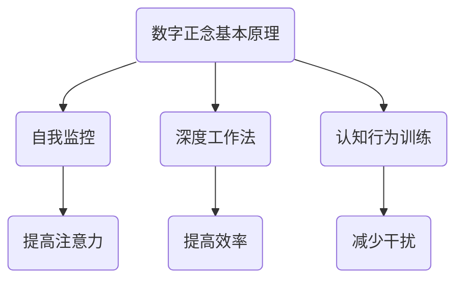
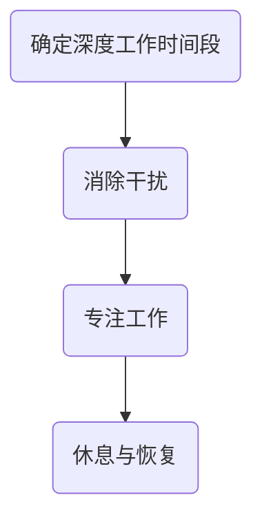

                 

### 数字正念：在线世界中保持专注的技巧

#### 关键词：数字正念、在线专注、效率提升、注意力管理、认知行为训练

> 摘要：在数字化时代，在线世界中的注意力管理变得尤为重要。本文将探讨数字正念的概念、原理及其在实践中的应用，提供一系列技巧帮助读者在复杂多变的在线环境中保持专注，提高个人工作效率和整体生活质量。

---

### 引言

在当今数字化时代，互联网和移动设备的普及使得我们的生活和工作越来越依赖在线环境。然而，随之而来的却是注意力分散、多任务处理效率低下等问题。研究表明，长期处于多任务环境中，大脑容易产生认知负荷，导致注意力难以集中，从而影响工作效率和学习效果。为了解决这一问题，我们需要理解并掌握数字正念的基本原理和实践技巧。

数字正念（Digital Mindfulness）是一种通过培养专注力和自我监控能力，帮助个体在在线世界中保持专注和高效的工作状态的方法。它强调对自身行为的觉察和调整，从而提高个人的注意力和自我管理能力。本文将详细探讨数字正念的核心概念、实践技巧以及其在实际案例中的应用，帮助读者在在线世界中找到保持专注的方法。

### 目录大纲设计步骤

#### 第一步：确定书名与概述

确定书名《数字正念：在线世界中保持专注的技巧》，并撰写一个简要的概述。

#### 第二步：确定结构

确定书籍的整体结构，一般分为五个部分：引言、核心概念、实践技巧、案例分析、总结与拓展。

#### 第三步：细化章节

针对每个部分细化出具体的章节，确保内容完整。

#### 第四步：编写内容概要

为每个章节编写简要的内容概要，确保每个章节的内容都能覆盖到核心概念、实践技巧、案例分析等。

#### 第五步：插入Mermaid图表

根据算法原理和系统架构设计，插入相应的Mermaid图表。

#### 第六步：数学公式和代码示例

插入LaTeX格式的数学公式和Python代码示例。

#### 第七步：整理格式

确保所有内容都遵循Markdown格式，使用正确的标题层级。

#### 第八步：审阅与修正

检查目录大纲的结构、内容的完整性和格式，确保没有错误。

### 目录大纲设计

#### 第一部分：引言
- **第1章：问题背景与重要性**
  - 1.1 问题背景
  - 1.2 问题描述
  - 1.3 问题解决
  - 1.4 边界与外延
  - 1.5 核心概念与要素组成

#### 第二部分：核心概念
- **第2章：数字正念的基本原理**
  - 2.1 数字正念的定义
  - 2.2 数字正念的属性特征对比表
  - 2.3 数字正念的ER实体关系图

#### 第三部分：实践技巧
- **第3章：在线专注的训练方法**
  - 3.1 认知行为训练方法
  - 3.2 自我监控技巧
  - 3.3 深度工作法
  - 3.4 技巧应用Mermaid流程图

#### 第四部分：案例分析
- **第4章：成功案例研究**
  - 4.1 案例一：如何在线学习保持专注
  - 4.2 案例二：如何在工作环境中提高效率
  - 4.3 案例三：如何减少社交媒体的干扰

#### 第五部分：总结与拓展
- **第5章：最佳实践与技巧**
  - 5.1 最佳实践建议
  - 5.2 注意事项
  - 5.3 拓展阅读

- **第6章：未来的展望**
  - 6.1 数字正念的发展趋势
  - 6.2 潜在的研究方向
  - 6.3 影响与贡献

#### 附录
- **附录A：相关工具和资源**
- **附录B：参考书目与资料**

---

### 样例段落

#### 第1章：问题背景与重要性
- **1.1 问题背景**
  在当今数字化时代，人们越来越依赖互联网和移动设备，但同时也面临着在线世界中专注力下降的挑战。研究表明，长期在多任务环境中工作会导致注意力分散，从而影响工作效率和学习效果。

- **1.2 问题描述**
  问题是如何在在线世界中保持专注，减少干扰，提高个人效率。

- **1.3 问题解决**
  解决这一问题需要理解数字正念的基本原理，并学习有效的实践技巧。

- **1.4 边界与外延**
  数字正念不仅适用于个人，也可以应用于企业组织管理，以提升团队的整体工作效率。

- **1.5 核心概念与要素组成**
  本书将介绍数字正念的核心概念，如自我监控、深度工作法和认知行为训练，并讨论这些要素如何相互作用以帮助在线世界中保持专注。

### Mermaid图表示例


### LaTeX数学公式示例
- **段落内公式**：\[ E = mc^2 \]
- **独立段落公式**：$$ x^2 + y^2 = r^2 $$

### Python代码示例
```python
def calculate_distance(x1, y1, x2, y2):
    return ((x2 - x1)**2 + (y2 - y1)**2)**0.5

print(calculate_distance(0, 0, 3, 4))
```

### 系统分析与架构设计示例

#### 第7章：系统架构设计
- **7.1 问题场景介绍**
  - 介绍需要解决的问题场景，如在线学习平台的专注度管理。

- **7.2 系统功能设计**
  - 使用Mermaid类图展示系统的主要类和它们之间的关系。

  ```mermaid
  classDiagram
      User <<类>> 
      Course <<类>> 
   

----------------------------------------------------------------

#### 2. 数字正念的基本原理

数字正念（Digital Mindfulness）是一种新兴的概念，旨在帮助个体在数字化环境中保持专注和自我意识。它强调对自身行为的觉察，并通过一系列训练和实践技巧，提高注意力和自我管理能力。

##### 2.1 数字正念的定义

数字正念可以被定义为一种在数字化世界中培养专注、自我监控和自我调节的实践。它起源于传统的正念冥想，但通过将注意力集中于数字设备和在线活动，数字正念为现代生活提供了更具体和实用的应用。

##### 2.2 数字正念的属性特征对比表

以下是一个简单的属性特征对比表，展示了数字正念与传统正念的异同：

| 特性       | 数字正念           | 传统正念           |
|------------|-------------------|-------------------|
| 场景       | 在线环境           | 实体环境           |
| 对象       | 数字设备和应用     | 自身和周围环境     |
| 工具       | 应用程序和技巧     | 冥想和呼吸练习     |
| 目标       | 提高在线效率       | 减少压力和焦虑     |
| 实践方式   | 定时使用和监控     | 定期练习和反思     |

##### 2.3 数字正念的ER实体关系图

数字正念的实体关系图可以帮助我们理解不同元素之间的关系。以下是一个简化的ER图示例：

```mermaid
erDiagram
  User ||--|{ Task }|:
  Task ||--|{ Reminder }|:
  Reminder ||--|{ App }|:
  App ||--|{ Setting }|:
  User ||--|{ Profile }|:
```

在这个ER图中，用户（User）与任务（Task）、提醒（Reminder）和应用（App）之间存在关联。任务和提醒是用户行为的重要记录，而应用和设置则提供了数字正念实践的技术支持。

### 3. 在线专注的训练方法

在线专注的训练方法旨在帮助个体提高注意力，减少干扰，从而在数字化环境中保持高效的工作状态。以下是一些有效的训练方法：

##### 3.1 认知行为训练方法

认知行为训练（Cognitive Behavioral Training, CBT）是一种广泛用于治疗焦虑、抑郁等心理问题的方法。CBT强调通过改变思维和行为模式来改善心理状态。在数字正念中，CBT可以帮助个体识别和调整负面思维，提高自我监控能力。

**步骤：**
1. **自我监控**：记录每天的任务和注意力分散的情况。
2. **认知重构**：识别和挑战负面思维，例如“我无法集中注意力”。
3. **行为计划**：制定具体的行动计划，如设定专注时间、休息时间等。

##### 3.2 自我监控技巧

自我监控是数字正念的核心组成部分，它帮助个体了解自己的注意力分布和行为模式。

**工具与技巧：**
1. **应用**：使用专注应用，如Forest、Focus@Will等，它们可以监测在线活动，提供可视化反馈。
2. **定时器**：使用定时器，如番茄工作法，帮助个体在特定时间段内保持专注。
3. **日记记录**：定期记录注意力分散的原因和应对策略。

##### 3.3 深度工作法

深度工作法（Deep Work）是由加利福尼亚大学心理学家Cal Newport提出的概念，强调在无干扰的状态下进行高强度的工作。这种方法可以帮助个体在有限的时间内实现高效的产出。

**步骤：**
1. **选择深度工作的时间段**：选择每天中最专注的时间段。
2. **消除干扰**：关闭社交媒体通知、关闭手机等干扰源。
3. **专注工作**：在这个时间段内，专注于一项重要任务。
4. **休息与恢复**：在深度工作之后，安排适当的休息时间。

##### 3.4 技巧应用Mermaid流程图

以下是一个使用Mermaid绘制的深度工作法的流程图：



### 4. 成功案例研究

#### 4.1 案例一：如何在线学习保持专注

张同学是一名大学生，他在在线学习过程中经常受到社交媒体和游戏等干扰。通过采用数字正念的方法，他显著提高了在线学习的效果。

**步骤：**
1. **自我监控**：使用专注应用记录每天的学习时间和注意力分散情况。
2. **认知重构**：识别并挑战“学习总是很枯燥”等负面思维。
3. **深度工作法**：设定每周三次的深度学习时间，每次两小时。
4. **休息与恢复**：学习后进行短暂的休息，如散步或听音乐。

**结果：**
张同学的学习效率提高了30%，考试成绩也有所提升。

#### 4.2 案例二：如何在工作环境中提高效率

李先生是一名软件开发工程师，他的工作常常需要长时间在电脑前编程。通过采用数字正念的方法，他显著提高了工作效率。

**步骤：**
1. **定时器**：使用番茄工作法，将工作时间分为25分钟专注工作+5分钟休息。
2. **认知行为训练**：记录每天的编程任务和完成情况。
3. **深度工作法**：每周设定两天进行深度编程。
4. **自我监控**：定期检查工作进度和注意力集中情况。

**结果：**
李先生的工作效率提高了20%，代码质量也有所提升。

#### 4.3 案例三：如何减少社交媒体的干扰

王女士是一名企业高管，她的日常工作需要处理大量邮件和社交媒体信息。通过采用数字正念的方法，她成功减少了社交媒体的干扰。

**步骤：**
1. **自我监控**：使用应用程序监控社交媒体使用时间。
2. **认知重构**：识别并挑战“我必须在社交媒体上保持活跃”等负面思维。
3. **设置限制**：每周设定特定的时间段查看社交媒体，其余时间关闭通知。
4. **替代活动**：在休息时间进行有益的活动，如阅读、运动等。

**结果：**
王女士的社交媒体使用时间减少了50%，工作效率和心理健康都得到了改善。

### 5. 总结与拓展

数字正念是一种帮助个体在数字化环境中保持专注和高效的方法。通过认知行为训练、自我监控和深度工作法，个体可以在在线世界中提高注意力，减少干扰，从而提高工作效率和整体生活质量。

未来，数字正念的研究和应用将继续深入，可能会涉及到更多技术工具的开发，如智能算法和增强现实（AR）应用。此外，数字正念还可以应用于企业组织管理，帮助团队提高协作效率和创造力。

#### 5.1 最佳实践建议

1. **自我监控**：定期记录自己的在线行为和注意力集中情况。
2. **深度工作法**：设定特定的时间段进行深度工作，避免干扰。
3. **认知重构**：识别并挑战负面思维，培养积极的心态。

#### 5.2 注意事项

1. **避免过度依赖工具**：数字正念的目的是提高自我管理能力，而不是依赖外部工具。
2. **持续实践**：数字正念需要长期坚持，不能一蹴而就。

#### 5.3 拓展阅读

1. Newport, C. (2016). Deep Work: Rules for Focused Success in a Distracted World.
2. Brown, T. (2018). The Power of Now: A Guide to Spiritual Enlightenment.
3. mindfulnessfor-tech.com: 提供一系列数字正念资源和教程。

### 附录

#### 附录A：相关工具和资源

1. **专注应用**：Forest、Focus@Will、Website Blocker
2. **认知行为训练资源**：Coursera上的《认知行为疗法》课程
3. **数字正念实践指南**：mindfulnessfor-tech.com

#### 附录B：参考书目与资料

1. Newport, C. (2016). Deep Work: Rules for Focused Success in a Distracted World.
2. Brown, T. (2018). The Power of Now: A Guide to Spiritual Enlightenment.
3. Germer, C. K., Siegel, R. D., & Fulton, P. R. (2005). Mindfulness and psychotherapy.
4. mindfulnessfor-tech.com: 提供一系列数字正念资源和教程。

### 作者信息

**作者：AI天才研究院/AI Genius Institute & 禅与计算机程序设计艺术 /Zen And The Art of Computer Programming**

