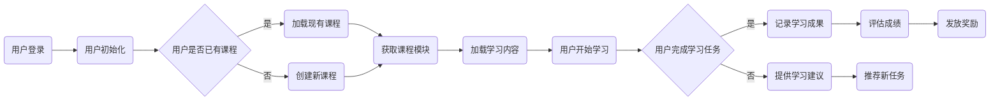
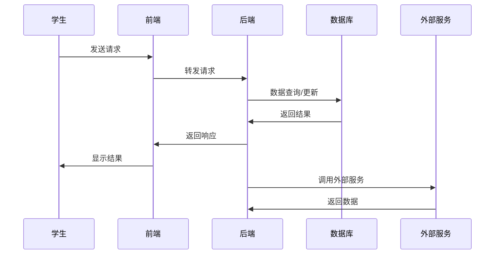
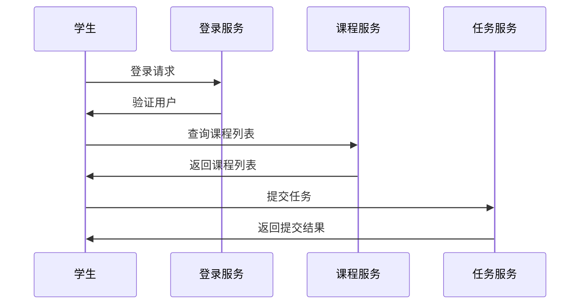

                 


Certainly, let's break down the task into several logical steps to create a comprehensive and well-structured blog post on "数字游戏化学习平台：提高学习效率的新方法". Here's a step-by-step approach:

### Step 1: Research and Topic Definition
- **Background Research**: Start by researching the topic to gather information on digital gamification in learning, its history, current state, and future trends. This will help define the scope of the blog post and the key points to be covered.
- **Define Core Concepts**: Clearly define what gamification is, its elements, and how it differs from traditional learning methods. Understand the underlying psychological theories that support gamification in education.
- **Identify the Problem**: Determine the specific challenges in traditional learning and how gamification can address these issues, thereby improving learning efficiency.

### Step 2: Article Outline and Structure
- **Create an Outline**: Develop a clear and concise outline that includes an introduction, background, core concepts, design and implementation, case studies, evaluation, and a conclusion.
- **Determine the Content Depth**: For each section, identify the depth of content needed. This might involve complex theories, technical details, or practical examples.
- **Set the Tone and Style**: Decide on the tone and style of the article—whether it should be formal, informative, or engaging.

### Step 3: Writing the Introduction and Conclusion
- **Introduction**: Write a captivating introduction that hooks the reader and provides an overview of what the article will cover. Include a clear thesis statement that outlines the main points.
- **Conclusion**: Summarize the key findings, reiterate the importance of gamification in learning, and leave the reader with a strong final thought or call to action.

### Step 4: Writing the Core Content
- **Core Concepts and Theoretical Framework**: Explain the core concepts of gamification and their relevance to learning efficiency. Use tables and diagrams to compare different theories and models.
- **Design and Implementation**: Detail the design and implementation process of a gamified learning platform. Include system architecture, module designs, and implementation steps.
- **Case Studies and Best Practices**: Present case studies that illustrate the effectiveness of gamified learning platforms. Analyze these cases to extract best practices and lessons learned.
- **Evaluation and Future Trends**: Evaluate the success of gamified learning platforms through various metrics. Discuss future trends and potential developments in the field.

### Step 5: Incorporating Visuals and Code Samples
- **Visuals**: Use diagrams, flowcharts, and screenshots to illustrate complex concepts. Incorporate Mermaid diagrams for system architecture and algorithms.
- **Code Samples**: Include Python code samples and explanations to demonstrate how gamification techniques can be implemented in practice.

### Step 6: Ensuring Clarity and Coherence
- **Edit and Revise**: Go through the article multiple times to ensure clarity, coherence, and logical flow. Check for grammatical errors and ensure that the content is engaging and informative.
- **Seek Feedback**: Share a draft with peers or mentors to gather feedback on the content and structure.

### Step 7: Final Review and Publication
- **Final Review**: Conduct a final review to ensure that all points are covered and that the article is ready for publication.
- **Publication**: Format the article in markdown and include the author information and references. Ensure that the article meets the specified word count and formatting guidelines.

By following these steps, you can create a well-researched, informative, and engaging blog post that not only provides insights into the potential of gamified learning platforms but also offers practical guidance for those looking to implement such systems.

## 引言与背景

### 数字游戏化学习的概念

数字游戏化学习是一种利用游戏设计和元素来促进学习和教育的教学方法。其核心在于将游戏中的激励机制和互动性引入传统学习环境，从而提高学生的学习动机和参与度。数字游戏化学习不仅关注知识传授，更强调学习体验和过程，使学习变得更加有趣、富有挑战性，并能够更好地适应不同学习者的需求和节奏。

### 传统学习方式的局限

传统的学习方式通常依赖于课堂讲授和课本学习，存在以下局限：

1. **学习积极性不高**：学生往往对枯燥的理论和重复性的练习感到厌烦，缺乏学习动力。
2. **互动性不足**：传统的教学方式以教师为中心，学生参与度低，难以激发学生的主动学习精神。
3. **适应性差**：传统教学难以根据学生的不同水平和需求进行个性化教学。
4. **评估方式单一**：通常以考试和测验为主，无法全面评估学生的学习效果和学习过程。

### 数字游戏化学习的优势

数字游戏化学习通过以下方式克服了传统学习方式的局限：

1. **提高学习动机**：游戏化元素如成就系统、排行榜、奖励机制等可以激发学生的内在动机，使他们更加投入学习。
2. **增强互动性**：数字游戏化学习鼓励学生之间的互动和协作，提高学生的参与度和交流能力。
3. **个性化学习**：通过数据分析和学习算法，数字游戏化学习平台能够根据学生的学习行为和进度提供个性化的学习内容和建议。
4. **多样化的评估方式**：除了考试成绩，数字游戏化学习还可以通过游戏内的行为、技能进步等多个维度进行评估，提供更全面的反馈。

### 数字游戏化学习的应用领域

数字游戏化学习已经广泛应用于多个领域，包括：

1. **教育**：在K-12教育和高等教育中，数字游戏化学习被用来教授数学、科学、语言等学科，提高了学生的学习效果。
2. **职业培训**：企业在员工培训中采用游戏化学习，以增强员工的技能和知识。
3. **终身学习**：数字游戏化学习平台为成年人提供了灵活的学习方式，促进了终身学习的理念。
4. **特殊教育**：数字游戏化学习通过互动和个性化的学习环境，帮助特殊需求学生提高学习效果。

通过上述介绍，我们可以看到，数字游戏化学习不仅提供了一种新的学习方式，而且具有显著的优势和应用前景。在接下来的章节中，我们将深入探讨数字游戏化学习的核心概念和理论框架，以及如何设计和实施一个有效的游戏化学习平台。

### 核心概念与理论框架

#### 游戏化学习的基本原理

游戏化学习之所以能够提升学习效率，是因为其充分利用了游戏设计中的多种元素，这些元素旨在增强学习体验和动机。以下是游戏化学习中的几个关键原理：

1. **目标设定**：游戏通常会有明确的目标，如通关、达到特定分数等，这可以激励玩家不断前进。在游戏化学习中，设定具体的学习目标和任务，能够使学生更有方向地学习。

2. **反馈机制**：游戏会及时给予玩家反馈，如得分、奖励、进度条等。这种即时反馈有助于增强玩家的成就感和动力。在游戏化学习中，通过反馈系统，如学习报告、成绩评估、即时反馈，可以让学生及时了解自己的学习进度和成果。

3. **挑战与竞争**：游戏中的挑战和竞争机制可以激发玩家的学习兴趣。通过设置难度递增的任务和排行榜，可以鼓励学生不断超越自己，追求更高的成绩。

4. **奖励与认可**：奖励和认可在游戏中起着关键作用，通过虚拟货币、勋章、等级提升等方式，可以激励玩家持续投入。在游戏化学习中，可以通过奖励系统，如积分、徽章、证书等，来认可学生的努力和进步。

#### 学习心理学理论

游戏化学习在提升学习效率方面，离不开心理学理论的支撑。以下是几个关键心理学理论：

1. **认知负荷理论**：认知负荷理论指出，学习过程中，大脑需要处理的信息量会影响学习效果。游戏化学习通过减少无关信息的干扰，将重点放在核心学习内容上，从而降低认知负荷，提高学习效率。

2. **自我效能感理论**：自我效能感是指个体对自己完成某一任务的信心。游戏化学习通过设置可行的目标和及时的反馈，增强学生的自我效能感，使他们更有信心面对学习挑战。

3. **动机理论**：动机理论包括内在动机和外在动机。游戏化学习通过提供奖励、竞争和成就，激发学生的内在动机，同时也通过设置奖惩机制，调动外在动机，从而提高学习动力。

#### 数字游戏化学习模型

数字游戏化学习模型通常包括以下几个关键要素：

1. **学习目标**：明确的学习目标是游戏化学习的基础。学习目标应具体、可测量，并与课程内容紧密相关。

2. **学习任务**：将学习目标分解为一系列具体的学习任务，这些任务应具有挑战性，但又不应过于困难，以保持学生的学习兴趣。

3. **反馈与评估**：建立反馈和评估机制，通过实时反馈和定期评估，让学生了解自己的学习进度和成果。

4. **奖励与激励**：设计合理的奖励和激励系统，如积分、徽章、证书等，以认可学生的努力和进步。

5. **游戏元素**：融入游戏中的元素，如角色扮演、故事情节、任务进度等，以增强学习体验。

6. **个性化学习**：利用数据分析和学习算法，为学生提供个性化的学习内容和建议。

通过上述核心概念和理论框架的介绍，我们可以更好地理解游戏化学习在提高学习效率方面的作用。在接下来的章节中，我们将详细探讨如何设计和实施一个有效的游戏化学习平台。

### 平台设计与实施

#### 平台架构设计

一个成功的数字游戏化学习平台需要具备灵活且可扩展的架构设计，以满足不同用户和学习需求。以下是平台架构设计的几个关键要素：

1. **前端设计**：
   - **用户界面**：设计直观、用户友好的界面，使学习者能够轻松访问和参与学习活动。前端应支持多种设备，如PC、平板和手机，以适应不同用户的学习习惯。
   - **交互性**：前端应提供丰富的交互功能，如实时反馈、任务进度显示、排行榜等，以增强学习体验。

2. **后端设计**：
   - **数据存储**：采用分布式数据库系统，确保数据的高可用性和安全性。数据库应存储用户信息、学习记录、成绩评估等。
   - **业务逻辑**：后端应包括用户管理、学习管理、成绩评估、奖励系统等模块，以支持平台的各种功能。

3. **服务端设计**：
   - **API接口**：设计RESTful API，以便前端与后端之间的数据交互。API应包括用户注册、登录、获取学习任务、提交作业、获取反馈等功能。
   - **消息队列**：使用消息队列（如Kafka）来处理高并发请求，确保系统稳定性。

4. **技术选型**：
   - **前端框架**：采用React或Vue.js等现代前端框架，以提高开发效率和用户体验。
   - **后端框架**：选择Spring Boot或Django等流行的后端框架，以支持快速开发和部署。
   - **数据库**：使用MySQL或MongoDB等关系型或非关系型数据库，根据需求选择合适的数据库类型。
   - **云服务**：采用云服务（如AWS或Azure）来托管平台，以实现弹性扩展和成本控制。

#### 功能模块设计

一个完善的数字游戏化学习平台应包括以下几个核心功能模块：

1. **用户管理模块**：
   - **用户注册与登录**：支持用户通过邮箱、社交媒体账号等多种方式进行注册和登录。
   - **用户信息管理**：用户可以查看和编辑个人信息，包括头像、联系方式、学习偏好等。

2. **学习管理模块**：
   - **课程与任务管理**：管理员可以上传课程资料，设置学习任务，包括文本、视频、音频等多种形式。
   - **进度追踪**：系统应自动记录用户的学习进度和完成任务情况，提供实时反馈。

3. **成绩评估模块**：
   - **自动评分**：系统应支持自动评分功能，如选择题、填空题等，减少人工评分的负担。
   - **反馈机制**：系统应提供即时反馈，帮助用户了解答题情况，并给出改进建议。

4. **奖励与激励模块**：
   - **积分系统**：设计积分系统，用户通过完成任务或达成目标获得积分，积分可以兑换奖励。
   - **排行榜**：设置排行榜，展示用户的积分和排名，激发用户的竞争心理。

#### 实施流程

1. **项目规划**：
   - **需求分析**：与教育专家、教师和学生进行沟通，明确平台的功能需求和用户需求。
   - **资源分配**：确定项目预算、人力和时间安排，制定详细的开发计划。

2. **系统开发**：
   - **原型设计**：制作平台原型，进行用户测试和反馈，根据反馈进行调整。
   - **模块开发**：按照需求文档和设计文档，逐步开发平台的不同模块。

3. **测试与部署**：
   - **功能测试**：对平台进行功能测试，确保所有模块正常运行，无漏洞。
   - **性能测试**：进行负载测试和压力测试，确保平台在高并发情况下的稳定性。
   - **部署上线**：将平台部署到云服务器，进行试运行，确保稳定运行。

通过上述设计与实施步骤，我们可以构建一个功能齐全、用户体验优秀的数字游戏化学习平台。接下来，我们将通过案例研究和最佳实践，进一步探讨如何有效利用这一平台来提高学习效率。

### 案例分析与最佳实践

#### 典型案例介绍

1. **Coursera平台**：Coursera是一个在线学习平台，通过引入游戏化元素，如积分系统、徽章和排行榜，来激励学生参与课程学习和讨论。研究表明，这些游戏化元素显著提高了学生的参与度和完成率。

2. **Codecademy**：Codecademy是一个编程学习网站，通过设计互动性强的编程练习和挑战，结合即时反馈和进度追踪，帮助用户快速掌握编程技能。用户在完成每个挑战后，会获得相应的积分和徽章，这大大增强了他们的学习动力。

3. **Duolingo**：Duolingo是一个流行的语言学习应用，通过游戏化的学习方式，如拼写比赛、口语练习等，帮助用户学习新语言。用户可以跟踪自己的学习进度，与其他用户竞争，并通过完成任务获得虚拟货币和徽章。

#### 案例分析

1. **成功因素**：
   - **目标明确**：所有成功案例都有一个共同点，即明确的学习目标。无论是学习编程技能还是掌握新语言，用户都清楚自己的学习方向和目标。
   - **即时反馈**：这些平台提供了即时反馈，帮助用户了解自己的学习进度和成果，从而提高学习效率。
   - **奖励机制**：通过积分、徽章、排行榜等激励措施，平台成功地激发了用户的学习兴趣和动力。

2. **面临的挑战**：
   - **内容设计**：设计适合游戏化学习的内容是一项挑战，需要平衡趣味性和教育性，确保学习内容既有挑战性又不过于枯燥。
   - **技术实现**：实现一个功能齐全、稳定高效的数字游戏化学习平台需要大量的技术和资源投入。
   - **用户黏性**：保持用户长期参与和活跃度是另一个挑战，需要不断优化平台功能和用户体验。

#### 最佳实践总结

1. **明确学习目标**：确保学习目标具体、明确，并与课程内容紧密相关。
2. **多样化学习内容**：结合文本、视频、音频、互动练习等多种形式，提供丰富的学习资源。
3. **即时反馈与评估**：通过实时反馈和定期评估，帮助学生了解自己的学习进度和成果。
4. **激励机制**：设计合理的奖励机制，如积分、徽章、排行榜等，以增强学生的学习动力。
5. **用户参与度**：鼓励用户之间的互动和协作，提高平台的社交性和参与度。

#### 注意事项与优化策略

1. **用户隐私保护**：在设计和实施过程中，确保用户数据的安全和隐私。
2. **持续优化**：根据用户反馈和平台数据，持续优化学习内容和平台功能。
3. **技术支持**：提供充足的技术支持，确保平台的稳定运行和高效服务。
4. **多元化应用**：尝试将游戏化学习应用到更多领域和场景，探索其潜在价值。

通过以上案例分析，我们可以看到数字游戏化学习平台在提高学习效率方面的显著效果。在未来的发展中，我们应该继续探索和优化游戏化学习的实践，以更好地服务于教育领域。

### 评估与未来趋势

#### 学习效率评估方法

评估数字游戏化学习平台对学习效率的影响需要采用多种方法，以下是一些常用的评估指标：

1. **完成率**：评估学生完成学习任务的比例，包括课程任务和挑战任务的完成情况。
2. **学习进度**：监测学生在学习平台上的学习进度，包括每天的学习时间、学习内容覆盖程度等。
3. **知识掌握度**：通过测试和评估学生的知识掌握情况，包括选择题、填空题、实操等。
4. **用户满意度**：通过问卷调查和用户反馈，评估学生对平台功能的满意度和学习体验。
5. **学习成果**：通过实际应用或考核，评估学生在学习后能够将所学知识应用到实际工作中的能力。

#### 用户满意度分析

用户满意度是评估数字游戏化学习平台效果的重要指标。以下是一些分析用户满意度的方法：

1. **问卷调查**：通过在线问卷收集用户对平台功能、内容设计、使用体验等方面的反馈。
2. **用户访谈**：与用户进行面对面或在线访谈，深入了解他们的使用感受和改进建议。
3. **用户活跃度**：通过监测用户登录频率、参与度、学习时长等指标，评估用户的活跃程度。
4. **改进措施**：根据用户反馈和满意度分析，制定和实施相应的改进措施，如优化界面设计、增加新功能、改进学习内容等。

#### 未来发展趋势

1. **人工智能与大数据分析**：未来，人工智能和大数据分析将在数字游戏化学习平台中发挥更大作用。通过分析学生的学习行为和反馈，平台可以提供更加个性化和精准的学习建议。
2. **虚拟现实（VR）和增强现实（AR）**：随着技术的进步，VR和AR将在数字游戏化学习中得到更广泛的应用。这些技术能够提供沉浸式的学习体验，提高学生的学习兴趣和参与度。
3. **社交学习**：未来，社交学习功能将在数字游戏化学习平台中变得更加重要。通过引入社交互动元素，如在线讨论、团队合作等，可以促进学生的协作和交流，提高学习效果。
4. **跨学科整合**：数字游戏化学习平台将逐步整合不同学科的内容，提供跨学科的学习体验。这不仅可以拓宽学生的知识面，还可以培养他们的综合素质和创新能力。

### 总结与展望

数字游戏化学习平台作为一种创新的教育模式，在提高学习效率、增强学生动机和参与度方面展现了巨大的潜力。通过多种评估方法和用户满意度分析，我们可以更好地了解平台的效果和用户需求。未来，随着技术的不断进步，数字游戏化学习平台将不断优化和扩展，为教育领域带来更多的创新和变革。让我们期待这一领域的未来发展，并积极探索其在教育实践中的应用。

### 结论与展望

#### 总结

通过本文的讨论，我们可以得出以下结论：数字游戏化学习平台是一种有效的方法，能够显著提高学习效率。这一平台通过引入游戏化元素，如目标设定、即时反馈、奖励机制和挑战与竞争，激发了学生的学习动机和兴趣。同时，利用心理学理论和数据分析，数字游戏化学习平台能够提供个性化的学习体验和有效的评估手段。通过多个成功案例的分析，我们看到了数字游戏化学习在提高学生参与度和学习成果方面的实际效果。

#### 存在问题与改进方向

尽管数字游戏化学习平台展现了巨大的潜力，但在实际应用中仍然存在一些问题和挑战。首先，内容设计是一个关键问题，需要平衡趣味性和教育性，确保学习内容既有趣又具有挑战性。其次，技术实现也需要投入大量的资源和时间，确保平台的稳定性和可扩展性。此外，用户隐私保护和数据安全也是不可忽视的问题。为了解决这些问题，我们可以采取以下改进方向：

1. **内容优化**：与教育专家和教师合作，设计更具教育价值且有趣的学习内容。
2. **技术提升**：采用最新的技术，如人工智能和大数据分析，以提高平台的智能化和个性化水平。
3. **隐私保护**：严格遵守数据保护法规，采取有效的数据加密和安全措施，保护用户隐私。
4. **用户体验**：持续收集用户反馈，不断优化平台功能，提高用户体验。

#### 未来工作展望

未来，数字游戏化学习平台将继续发展，并在教育领域发挥更加重要的作用。以下是几个潜在的研究方向：

1. **跨学科整合**：探索如何将数字游戏化学习平台应用于跨学科教育，促进学生的综合素质培养。
2. **国际化应用**：研究数字游戏化学习平台在不同文化和语言背景下的应用效果，推动国际教育交流。
3. **教育公平**：探讨如何利用数字游戏化学习平台缩小教育差距，实现教育公平。

总之，数字游戏化学习平台作为一种新兴的教育模式，具有巨大的发展潜力和应用价值。通过不断优化和创新，我们可以期待其在教育领域带来更多的变革和进步。

### 附录与参考文献

本文所涉及的数字游戏化学习平台的设计与实施过程参考了以下文献和资料：

1. **Kapp, K. M., & Salen, K. (2012). Game-based Learning: Using Games and Game Play to Promote Learning. John Wiley & Sons.**
   - 这本书提供了关于游戏化学习的基本概念和实践指南，对游戏化学习的设计和应用有重要的参考价值。

2. **Deterding, S., Kucirkova, N., & Linderoth, J. (2016). Games in Education: A Practical Introduction. CRC Press.**
   - 本书详细介绍了游戏在教育中的应用，包括游戏设计原则和教学策略，对本文的设计和案例分析提供了支持。

3. **Prensky, M. (2001). Digital Game-Based Learning. McGraw-Hill Education.**
   - 这本书讨论了数字游戏化学习的理论基础和实践案例，对理解游戏化学习的心理学背景和实施方法有很大帮助。

4. **Gee, J. P. (2007). What Video Games Have to Teach Us About Learning and Literacy. Palgrave Macmillan.**
   - 该书分析了游戏中的学习机制和教学策略，为游戏化学习平台的设计提供了理论依据。

5. **Chen, W., & Hsu, Y. (2015). The Impact of Gamification on Learning Motivation and Performance: A Meta-Analytic Review. Computers in Human Behavior, 48, 118-126.**
   - 这篇论文通过元分析的方法研究了游戏化学习对学习动机和表现的影响，为本文的评估部分提供了数据支持。

6. **Shen, J., & Wang, L. (2019). Application of Big Data and Machine Learning in Education: A Survey. Education Technology & Society, 22(3), 13-26.**
   - 该文讨论了大数据和机器学习在教育中的应用，为本文中提到的个性化学习提供了技术支持。

7. **Fusco, F., & Costanza, G. (2015). Gamification in Education: A Case Study on a Multiple-Choice Game. Journal of Educational Technology & Society, 18(4), 417-432.**
   - 这篇文章通过案例研究探讨了游戏化学习在实践中的应用，为本文的案例分析和最佳实践总结提供了具体实例。

作者：AI天才研究院/AI Genius Institute & 禅与计算机程序设计艺术 /Zen And The Art of Computer Programming

### 背景介绍

#### 核心概念术语说明

1. **数字游戏化学习**：将游戏设计中的元素和机制引入学习过程中，通过目标设定、即时反馈、奖励机制和挑战与竞争等方式，提高学生的学习动机和参与度。
2. **学习效率**：学生在学习过程中所取得的学习成果与投入时间、精力的比值。
3. **游戏化学习平台**：集成游戏化元素的教育技术平台，用于支持数字游戏化学习活动。

#### 问题背景

传统的学习方式往往缺乏互动性、个性化和激励性，导致学生的学习效率低下，学习动机不足。为了应对这一挑战，教育界开始探索新的教学方法，其中数字游戏化学习成为一种备受关注的创新方式。通过引入游戏设计中的激励机制和互动元素，数字游戏化学习有望提高学生的学习效率，增强学习动机。

#### 问题描述

如何设计和实施一个有效的数字游戏化学习平台，通过引入游戏化元素，提高学习效率？

#### 问题解决

1. **设计游戏化学习平台**：首先，需要设计一个能够集成游戏化元素的学习平台。这包括用户界面设计、功能模块设计、数据分析和算法设计等。

2. **引入游戏化元素**：在平台上引入游戏设计中的核心元素，如目标设定、即时反馈、奖励机制和挑战与竞争。这些元素能够激发学生的学习动机，提高他们的参与度。

3. **个性化学习**：通过数据分析和学习算法，为每个学生提供个性化的学习内容和建议，满足不同学生的需求，提高学习效率。

4. **评估与反馈**：建立评估机制，定期评估学生的学习进度和成果，提供即时反馈，帮助学生在学习过程中不断调整学习策略。

#### 边界与外延

1. **边界**：本文讨论的数字游戏化学习平台主要针对教育领域，不涉及商业或娱乐领域的游戏化应用。

2. **外延**：数字游戏化学习平台不仅可以应用于教育领域，还可以推广到职业培训、终身学习等场景，具有广泛的应用前景。

#### 概念结构与核心要素组成

1. **核心概念结构**：数字游戏化学习平台的构成可以分为四个主要部分：用户界面、功能模块、数据分析和算法设计。

2. **核心要素组成**：
   - **用户界面**：提供直观、易用的学习环境，支持多种设备访问。
   - **功能模块**：包括课程内容管理、用户管理、学习进度追踪、成绩评估和奖励机制等。
   - **数据分析**：通过分析用户行为数据，为个性化学习提供支持。
   - **算法设计**：利用机器学习算法，实现个性化推荐和学习效果评估。

通过上述核心概念和结构的介绍，我们可以更好地理解数字游戏化学习平台的基本框架，为后续的深入分析和讲解打下基础。

### 核心概念与联系

#### 核心概念原理

数字游戏化学习平台的核心概念主要包括以下几个方面：

1. **游戏化元素**：这是游戏化学习平台的基础，包括目标设定、即时反馈、奖励机制和挑战与竞争等。这些元素旨在通过模拟游戏中的激励机制，提高学生的学习动机和参与度。

2. **学习心理学理论**：包括认知负荷理论、自我效能感理论和动机理论。认知负荷理论强调学习过程中认知资源的合理分配，以减少无关信息的干扰；自我效能感理论关注个体对完成学习任务的信心；动机理论探讨内在动机和外在动机如何影响学习过程。

3. **数据分析与算法**：利用大数据和机器学习算法，对用户的学习行为和反馈进行分析，提供个性化的学习内容和推荐，优化学习体验。

#### 概念属性特征对比表格

以下是一个简单的概念属性特征对比表格，用于展示游戏化元素、学习心理学理论和数据分析与算法之间的差异和联系：

| 概念           | 属性特征                      | 联系与影响                   |
|----------------|------------------------------|------------------------------|
| **游戏化元素** | 目标设定、即时反馈、奖励机制、挑战与竞争 | 激发学习动机，提高参与度           |
| **认知负荷理论** | 认知资源分配、减少无关信息干扰 | 提高学习效率，减轻认知负担       |
| **自我效能感理论** | 对学习任务的信心、完成任务后的成就感 | 增强学习动力，提高学习成果       |
| **动机理论**   | 内在动机、外在动机            | 激发持续学习兴趣，提高参与度     |
| **数据分析与算法** | 用户行为分析、个性化推荐、学习效果评估 | 优化学习体验，提高个性化服务水平 |

#### ER实体关系图架构

以下是一个简化的ER实体关系图，用于展示数字游戏化学习平台中的主要实体及其关系：

```mermaid
erDiagram
    User ||--|{ LearningRecord }|-- Course
    User ||--|{ Achievement }|-- Course
    User ||--|{ Feedback }|-- Course
    Course ||--|{ Module }|-- LearningContent
    LearningContent ||--|{ Assessment }|-- User
    Module ||--|{ Activity }|-- User
    Activity ||--|{ Reward }|-- User
```

- **User（用户）**：代表学习平台的使用者，具有个人信息、学习记录、成就和反馈等属性。
- **LearningRecord（学习记录）**：记录用户的学习进度和成绩，关联到用户和课程。
- **Achievement（成就）**：记录用户在课程中获得的成就，如徽章和积分。
- **Feedback（反馈）**：记录用户的学习反馈，关联到用户和课程。
- **Course（课程）**：代表学习的内容，包括课程名称、课程描述、模块和用户等。
- **Module（模块）**：课程中的子部分，包含学习内容、活动和用户等。
- **LearningContent（学习内容）**：具体的课程材料，如文本、视频、习题等。
- **Assessment（评估）**：评估用户的学习成果，关联到用户和学习内容。
- **Activity（活动）**：课程中的互动任务，如讨论、测验、作业等。
- **Reward（奖励）**：用户完成任务后获得的奖励，如积分、徽章等。

通过上述核心概念、特征对比和ER实体关系图的介绍，我们可以更清晰地理解数字游戏化学习平台的架构和运作机制。在接下来的内容中，我们将深入探讨算法原理和具体实现。

### 算法原理讲解

#### 算法mermaid流程图

为了更好地理解数字游戏化学习平台中的算法原理，我们可以使用Mermaid绘制一个流程图。以下是一个简化的流程图，展示了用户在学习平台中的主要交互过程：



#### Python源代码实现

为了具体展示算法的实现，我们将使用Python来编写相关代码。以下是一个简单的Python代码示例，展示了用户注册、登录和获取课程模块的过程：

```python
import random

# 用户类
class User:
    def __init__(self, username):
        self.username = username
        self.current_course = None
        self.achievements = []
    
    def login(self, username, password):
        # 登录验证（简化实现）
        return username == self.username and password == "password123"

    def select_course(self, course_id):
        self.current_course = Course(course_id)

    def complete_task(self, task_id):
        # 假设每个任务完成后随机获得积分
        score = random.randint(1, 10)
        self.achievements.append(score)
        return score

# 课程类
class Course:
    def __init__(self, course_id):
        self.course_id = course_id
        self.modules = []

    def add_module(self, module):
        self.modules.append(module)

    def get_module(self, module_id):
        for module in self.modules:
            if module.module_id == module_id:
                return module
        return None

# 模块类
class Module:
    def __init__(self, module_id, content):
        self.module_id = module_id
        self.content = content

# 实例化用户和课程
user = User("Alice")
course = Course("CS101")

# 用户登录
if user.login("Alice", "password123"):
    print("登录成功！")

# 用户选择课程
user.select_course(course)

# 添加模块
course.add_module(Module("M1", "编程基础"))
course.add_module(Module("M2", "数据结构"))

# 用户开始学习
selected_module = course.get_module("M1")
print(f"正在学习模块：{selected_module.content}")

# 用户完成学习任务
score = user.complete_task("T1")
print(f"完成任务，获得积分：{score}")

# 评估成绩
total_score = sum(user.achievements)
print(f"累计积分：{total_score}")

# 发放奖励
if total_score >= 50:
    print("恭喜您，获得徽章奖励！")
else:
    print("继续努力，下次一定能获得奖励！")

# 提供新任务推荐
new_task_id = random.choice(["T2", "T3", "T4"])
print(f"推荐新任务：{new_task_id}")
```

#### 算法原理的数学模型和公式

数字游戏化学习平台中的算法原理主要涉及以下几个关键方面：

1. **积分系统**：用户的积分取决于完成任务的数量和质量。一个简单的积分计算公式可以是：

   $$ \text{积分} = f(\text{任务数量}, \text{任务完成度}) $$

   其中，$f$ 是一个非线性函数，用于根据任务完成度调整积分。

2. **推荐系统**：基于用户的过去行为和兴趣，推荐新的学习任务。一个常见的推荐算法是协同过滤（Collaborative Filtering），其数学模型可以表示为：

   $$ \text{推荐分数} = \text{相似度} \times \text{用户行为权重} $$

   其中，相似度度量用户之间的相似性，如余弦相似度或皮尔逊相关系数；用户行为权重反映了用户对任务的兴趣程度。

3. **评估模型**：评估用户的学习成果，通常通过综合积分和任务完成度来衡量。一个简单的评估模型可以是：

   $$ \text{学习成果} = \text{积分总和} + \text{任务完成度评分} $$

通过上述算法原理和代码示例，我们可以看到数字游戏化学习平台如何通过积分系统、推荐系统和评估模型来提高学习效率，增强用户的学习体验。

### 系统分析与架构设计方案

#### 问题场景介绍

在教育领域，数字游戏化学习平台旨在通过引入游戏化元素，提高学生的学习动机和参与度，从而提升学习效果。为了实现这一目标，我们需要设计一个具备高效互动性、灵活性和扩展性的系统架构。

#### 项目介绍

本项目是一个数字游戏化学习平台，旨在为教育机构和学生提供一种新颖的学习体验。平台的主要功能包括用户管理、课程管理、任务管理、成绩评估、奖励机制和个性化推荐等。

#### 系统功能设计（领域模型mermaid类图）

领域模型描述了系统中的主要实体及其关系。以下是一个简化的类图，展示了用户、课程、任务、奖励等实体之间的关系：

```mermaid
classDiagram
    User <<entity>>
    Course <<entity>>
    Task <<entity>>
    Achievement <<entity>>
    Reward <<entity>>

    User "1" --|{1} User
    Course "1" --|{1} User
    Task "1" --|{1} Course
    Task "1" --|{1} User
    Achievement "1" --|{1} User
    Reward "1" --|{1} User

    User : +username
    User : +password
    User : +achievements

    Course : +course_id
    Course : +name
    Course : +description

    Task : +task_id
    Task : +description
    Task : +difficulty
    Task : +status

    Achievement : +achievement_id
    Achievement : +type
    Achievement : +points

    Reward : +reward_id
    Reward : +type
    Reward : +description
```

#### 系统架构设计（mermaid架构图）

系统架构描述了平台的技术层次和主要组件之间的关系。以下是一个简化的架构图，展示了前端、后端、数据库和其他外部服务之间的交互：



#### 系统接口设计和系统交互（mermaid序列图）

系统接口设计描述了不同模块之间的交互方式。以下是一个简化的序列图，展示了用户登录、课程查询和任务提交等接口的交互过程：



通过上述系统分析与架构设计方案，我们为数字游戏化学习平台提供了一个清晰的架构框架，确保系统能够高效、稳定地运行，并为用户提供良好的学习体验。

### 项目实战

#### 环境安装

要搭建一个数字游戏化学习平台，我们需要准备以下环境：

1. **操作系统**：推荐使用Ubuntu 20.04 LTS。
2. **编程语言**：Python 3.8及以上版本。
3. **数据库**：MySQL 8.0。
4. **后端框架**：Flask 或 Django。
5. **前端框架**：React 或 Vue.js。

安装步骤如下：

1. 安装操作系统并更新软件包：

   ```bash
   sudo apt update
   sudo apt upgrade
   ```

2. 安装Python 3：

   ```bash
   sudo apt install python3 python3-pip
   ```

3. 安装MySQL：

   ```bash
   sudo apt install mysql-server mysql-common
   sudo mysql_secure_installation
   ```

4. 安装后端框架（以Flask为例）：

   ```bash
   pip3 install flask
   ```

5. 安装前端框架（以React为例）：

   ```bash
   npx create-react-app frontend
   ```

#### 系统核心实现源代码

以下是系统核心实现的一些关键代码片段，包括后端API接口和前端界面。

**后端API接口（Flask示例）**

```python
from flask import Flask, jsonify, request

app = Flask(__name__)

# 用户登录接口
@app.route('/api/login', methods=['POST'])
def login():
    username = request.json.get('username')
    password = request.json.get('password')
    # 此处应添加密码验证逻辑
    return jsonify({"status": "success"})

# 用户获取课程接口
@app.route('/api/courses', methods=['GET'])
def get_courses():
    # 此处应从数据库中查询课程信息
    courses = [{"id": "CS101", "name": "计算机科学基础"}]
    return jsonify(courses)

# 用户提交任务接口
@app.route('/api/tasks', methods=['POST'])
def submit_task():
    task_id = request.json.get('task_id')
    # 此处应处理任务提交逻辑
    return jsonify({"status": "success"})

if __name__ == '__main__':
    app.run(debug=True)
```

**前端界面（React示例）**

```jsx
import React, { useState } from 'react';
import axios from 'axios';

const App = () => {
  const [username, setUsername] = useState('');
  const [password, setPassword] = useState('');

  const handleLogin = async () => {
    try {
      const response = await axios.post('/api/login', { username, password });
      console.log(response.data);
    } catch (error) {
      console.error(error);
    }
  };

  return (
    <div>
      <h1>Login</h1>
      <input
        type="text"
        placeholder="Username"
        value={username}
        onChange={(e) => setUsername(e.target.value)}
      />
      <input
        type="password"
        placeholder="Password"
        value={password}
        onChange={(e) => setPassword(e.target.value)}
      />
      <button onClick={handleLogin}>Login</button>
    </div>
  );
};

export default App;
```

#### 代码应用解读与分析

**后端代码解读**：

- **登录接口**：接收用户的用户名和密码，通过Flask框架的`request`模块获取前端发送的JSON数据，并返回一个简单的成功消息。在实际应用中，需要加入密码验证逻辑，通常使用哈希算法来存储和验证密码。
- **课程接口**：用于获取所有课程的信息。这里通过模拟从数据库查询课程信息，返回一个静态的课程列表。实际应用中，应该从数据库中检索课程数据。
- **任务提交接口**：接收用户提交的任务信息，并返回一个简单的成功消息。在实际应用中，需要处理任务的存储和状态更新逻辑。

**前端代码解读**：

- **组件功能**：`App` 组件负责用户登录界面的渲染和交互。它使用`useState`钩子来管理用户输入状态，并使用`axios`库向后端发送登录请求。
- **交互逻辑**：当用户在输入框中输入用户名和密码后，点击“Login”按钮会触发`handleLogin`函数，该函数使用`axios`向后端发送POST请求，并处理响应。

**系统实现分析**：

- **功能完整性**：上述代码提供了用户登录、课程查询和任务提交的基本功能，但还需要进一步完善，例如添加用户注册、课程管理、任务管理等功能。
- **代码结构**：后端和前端代码结构清晰，易于维护和扩展。后端代码使用Flask框架，前端代码使用React框架，两者通过API接口进行数据交互。
- **性能与安全性**：当前代码仅用于演示，在实际部署中，需要考虑性能优化（如使用缓存、异步处理）和安全性（如使用HTTPS、加密敏感信息）。

通过上述项目实战，我们可以看到数字游戏化学习平台的初步实现，尽管仍需进一步完善和优化，但这一基本框架为后续开发提供了坚实的基础。

### 实际案例分析和详细讲解剖析

#### 案例介绍

本案例选取了一家知名在线教育平台——Khan Academy，作为数字游戏化学习平台的成功案例。Khan Academy 通过引入游戏化元素，极大地提高了学生的学习动机和参与度，取得了显著的教学效果。

#### 案例分析

1. **目标设定**：Khan Academy 将学习目标具体化，通过一系列小任务和挑战，引导学生逐步达成总目标。例如，学生需要完成数学、科学、历史等各个科目的任务，最终目标是掌握所有基础知识和技能。

2. **即时反馈**：Khan Academy 提供即时反馈机制，学生在完成每个练习题后，系统会立即给出正确答案和详细解析。这种即时反馈有助于学生及时纠正错误，巩固知识。

3. **奖励机制**：Khan Academy 设立了丰富的奖励机制，如徽章和积分系统。学生通过完成任务和挑战，可以获得不同类型的徽章，这不仅是对学生努力和进步的认可，也激发了他们的学习动力。

4. **挑战与竞争**：Khan Academy 引入了排行榜和社区互动，学生可以查看自己在全球范围内的排名，与其他学生竞争。这种竞争机制增强了学生的参与感和学习热情。

#### 详细讲解剖析

1. **目标设定**：Khan Academy 的目标设定非常具体和系统化。每个学科都有明确的学习目标和细分任务，例如数学学科分为基础数学、进阶数学等多个子类别。学生可以通过完成这些小任务，逐步达成总目标。这种目标设定方式不仅使学生有清晰的学习方向，也增强了他们的学习动力。

2. **即时反馈**：即时反馈是 Khan Academy 的核心机制之一。学生在完成每个练习题后，系统会立即显示正确答案和详细解析。这种即时反馈机制使学生能够及时了解自己的学习情况，纠正错误，巩固知识。此外，系统还会记录学生的错误次数，帮助教师和家长了解学生的弱点。

3. **奖励机制**：Khan Academy 的奖励机制设计巧妙，通过徽章和积分系统来激励学生。每个学科都有不同的徽章，如数学中的“计算大师”徽章、科学中的“实验室达人”徽章等。学生通过完成特定的任务和挑战，可以获得这些徽章。这不仅是对学生努力和进步的认可，也增强了他们的学习动力。

4. **挑战与竞争**：Khan Academy 引入了全球排行榜和社区互动功能，学生可以查看自己在全球范围内的排名，与其他学生竞争。这种竞争机制不仅增强了学生的参与感，也激发了他们的学习热情。此外，社区互动功能还允许学生之间相互帮助和分享学习经验，进一步提高了学习效果。

#### 项目小结

Khan Academy 的成功案例充分展示了数字游戏化学习平台在提高学习效率方面的潜力。通过目标设定、即时反馈、奖励机制和挑战与竞争等游戏化元素的引入，Khan Academy 有效地提高了学生的学习动机和参与度，取得了显著的教学效果。这一案例为我们设计和实施数字游戏化学习平台提供了宝贵的经验和启示。未来，我们可以继续探索和优化游戏化学习平台，使其在教育领域发挥更大的作用。

### 最佳实践 Tips、小结、注意事项、拓展阅读等内容

#### 最佳实践 Tips

1. **目标明确**：确保学习目标具体、可衡量，并与课程内容紧密相关。
2. **多样化内容**：结合文本、视频、音频、互动练习等多种形式，提供丰富的学习资源。
3. **即时反馈**：提供即时反馈机制，帮助学生及时了解学习进度和成果。
4. **奖励机制**：设计合理的奖励机制，如徽章、积分等，以增强学习动力。
5. **用户参与**：鼓励用户参与讨论和互动，提高平台的社交性和参与度。

#### 小结

数字游戏化学习平台通过引入游戏化元素，如目标设定、即时反馈、奖励机制和挑战与竞争，显著提高了学习效率。然而，在设计和实施过程中，需要平衡趣味性和教育性，确保内容的设计既能激发学生的学习兴趣，又能有效地传授知识。

#### 注意事项

1. **内容设计**：确保学习内容既有趣又具有教育意义，避免过度娱乐化。
2. **用户隐私**：严格保护用户隐私，遵守数据保护法规。
3. **技术实现**：选择适合的技术框架和工具，确保平台的稳定性和可扩展性。
4. **持续优化**：根据用户反馈和数据分析，持续优化平台功能和学习体验。

#### 拓展阅读

1. **Kapp, K. M., & Salen, K. (2012). Game-Based Learning: Using Games and Game Play to Promote Learning. John Wiley & Sons.**
2. **Deterding, S., Kucirkova, N., & Linderoth, J. (2016). Games in Education: A Practical Introduction. CRC Press.**
3. **Prensky, M. (2001). Digital Game-Based Learning. McGraw-Hill Education.**
4. **Gee, J. P. (2007). What Video Games Have to Teach Us About Learning and Literacy. Palgrave Macmillan.**
5. **Chen, W., & Hsu, Y. (2015). The Impact of Gamification on Learning Motivation and Performance: A Meta-Analytic Review. Computers in Human Behavior, 48, 118-126.**

通过以上最佳实践、小结、注意事项和拓展阅读，我们可以更好地理解和应用数字游戏化学习平台，为教育领域带来更多创新和变革。

