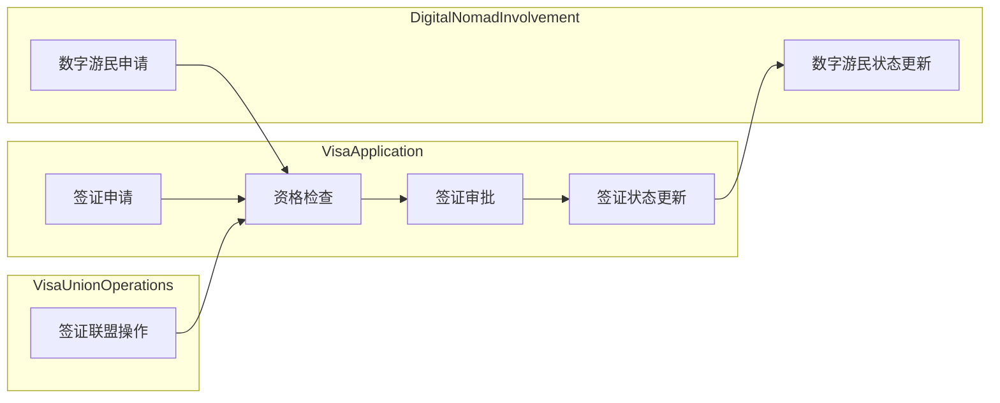
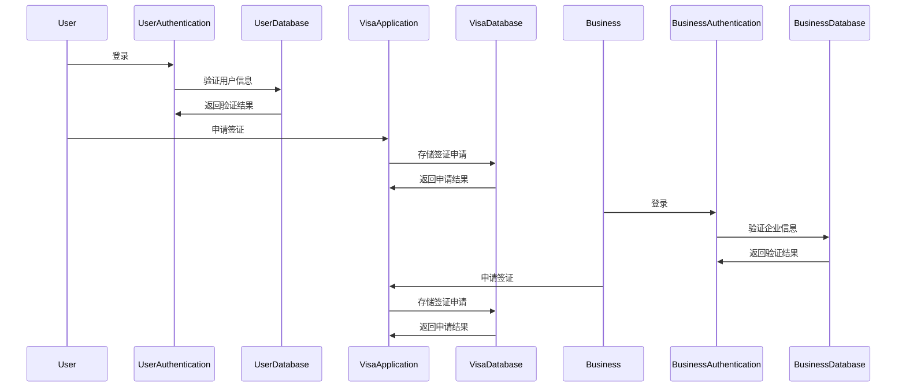
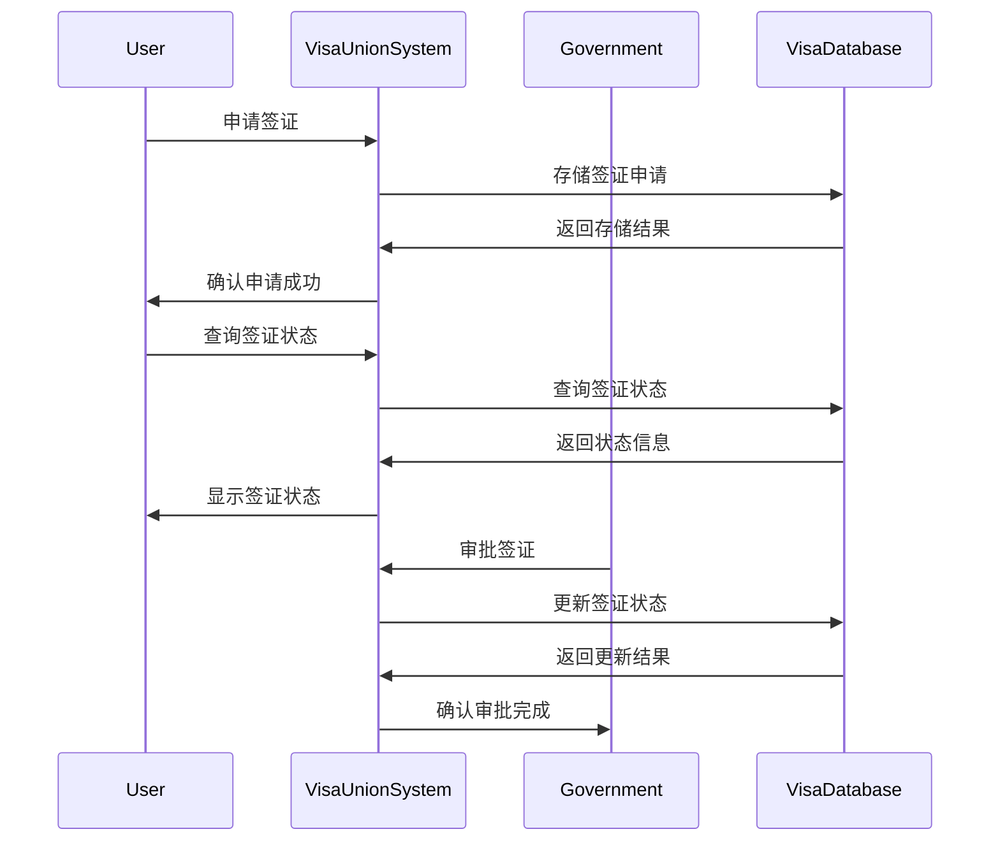

                 


### 目录大纲草案

**第一部分：签证联盟倡议概述**

**第1章：背景介绍**

- **1.1 核心概念**
  - 数字游民：定义、生活方式、工作模式。
  - 签证联盟：目的、意义、运作模式。
  - 全球化工作：概念、现状、挑战。

- **1.2 问题描述**
  - 签证政策限制：国际流动性障碍、签证申请难度。
  - 国际合作需求：企业扩张、人才流动、资源共享。

- **1.3 问题解决**
  - 签证联盟倡议：概述、结构、作用。

- **1.4 边界与外延**
  - 应用范围：行业、区域、参与者。
  - 目标群体：数字游民、企业、政府。

- **1.5 概念结构与核心要素组成**
  - 成员国家：角色、职责、权利。
  - 合作机制：协议、流程、规则。
  - 法律框架：条约、规定、保障。

**第二部分：核心概念与联系**

**第2章：数字游民与签证联盟**

- **2.1 数字游民**
  - 特点：灵活性、自主性、数字化。
  - 生活模式：远程办公、国际旅行。
  - 经济影响：创造就业、促进消费。

- **2.2 签证联盟倡议**
  - 目的：简化签证程序、促进国际流动。
  - 作用：降低成本、提高效率。
  - 与数字游民的关系：匹配需求、提供便利。

- **2.3 概念属性特征对比表格**
  - 不同国家签证政策对比：条件、流程、费用。

- **2.4 ER实体关系图架构**
  - 绘制ER图：成员国家、数字游民、政府机构。

**第三部分：算法原理讲解**

**第3章：签证联盟运作原理**

- **3.1 算法mermaid流程图**
  - 流程图绘制：签证申请、审核、批准流程。

- **3.2 Python源代码**
  - 代码示例：签证联盟流程的实现细节。

- **3.3 数学模型和公式**
  - 模型介绍：预测签证申请数量、资源分配。

- **3.4 详细讲解与举例说明**
  - 具体案例：签证联盟如何运作。

**第四部分：系统分析与架构设计方案**

**第4章：签证联盟系统架构**

- **4.1 问题场景介绍**
  - 场景设定：企业跨境运营、个人远程工作。

- **4.2 项目介绍**
  - 项目目标：实现签证联盟的系统化运作。

- **4.3 系统功能设计**
  - 功能划分：签证申请、审批、管理。

- **4.4 系统架构设计**
  - 架构设计：前端、后端、数据库。

- **4.5 系统接口设计**
  - 接口规范：内部、外部、API。

- **4.6 系统交互Mermaid序列图**
  - 交互流程：用户、系统、政府间的信息流。

**第五部分：项目实战**

**第5章：签证联盟实施指南**

- **5.1 环境安装**
  - 工具安装：软件、硬件、网络环境。

- **5.2 系统核心实现源代码**
  - 核心代码：主要功能模块的实现。

- **5.3 代码应用解读与分析**
  - 功能解读：代码逻辑、性能分析。

- **5.4 实际案例分析与详细讲解剖析**
  - 案例分析：成功与挑战。

- **5.5 项目小结**
  - 项目总结：成果、经验、改进方向。

**第六部分：最佳实践与拓展**

**第6章：最佳实践与注意事项**

- **6.1 最佳实践 tips**
  - 实践建议：优化流程、提高效率。

- **6.2 小结**
  - 文章总结：核心观点、贡献。

- **6.3 注意事项**
  - 实施风险：政策、技术、安全。

- **6.4 拓展阅读**
  - 推荐资源：研究、文献、案例。

### 最终输出

根据上述目录大纲草案，我们将逐章撰写文章内容，确保每章都包含丰富的背景介绍、核心概念解析、算法原理讲解、系统分析与架构设计方案、项目实战经验以及最佳实践与注意事项。文章末尾将附上作者信息，确保文章的完整性和专业性。

**文章标题：数字游民签证联盟倡议：推动全球化工作的国际合作**

**关键词：数字游民、签证联盟、全球化工作、国际合作**

**摘要：本文探讨了数字游民签证联盟倡议的概念、运作原理、系统架构以及实施指南，旨在推动全球化工作的国际合作，解决国际流动性障碍，促进全球经济发展。**

**作者：AI天才研究院/AI Genius Institute & 禅与计算机程序设计艺术 /Zen And The Art of Computer Programming**## **文章标题：数字游民签证联盟倡议：推动全球化工作的国际合作**

关键词：数字游民、签证联盟、全球化工作、国际合作

摘要：本文探讨了数字游民签证联盟倡议的概念、运作原理、系统架构以及实施指南，旨在推动全球化工作的国际合作，解决国际流动性障碍，促进全球经济发展。

作者：AI天才研究院/AI Genius Institute & 禅与计算机程序设计艺术 /Zen And The Art of Computer Programming

随着数字化和全球化趋势的不断深入，数字游民已成为现代工作方式的一种新形态。他们不受地理位置限制，通过互联网在全球范围内远程工作，这不仅改变了传统的就业模式，也对签证政策提出了新的挑战。为了推动全球化工作，许多国家和地区开始探讨建立数字游民签证联盟，以简化签证程序、提高国际流动性。本文将从以下几个方面进行探讨：

1. **背景介绍**：介绍数字游民、签证联盟和全球化工作的核心概念。
2. **核心概念与联系**：分析数字游民与签证联盟的关系，并绘制实体关系图。
3. **算法原理讲解**：解释签证联盟的运作原理，并使用mermaid流程图和Python源代码进行说明。
4. **系统分析与架构设计方案**：探讨签证联盟系统的架构设计，并使用mermaid类图和架构图进行展示。
5. **项目实战**：介绍签证联盟项目的实施步骤和实战经验。
6. **最佳实践与注意事项**：总结签证联盟倡议中的最佳实践和注意事项。

通过本文的探讨，我们希望能够为推动数字游民签证联盟的建立提供一些思路和参考。

### **背景介绍**

#### **核心概念**

首先，我们需要明确几个核心概念：数字游民、签证联盟和全球化工作。

**数字游民**是指那些利用互联网远程工作，不受传统办公室或固定工作地点限制的人群。他们通常通过远程协作工具，如电子邮件、即时通讯、视频会议等，与团队成员进行沟通和合作。数字游民的生活方式灵活多样，可以在家办公，也可以在咖啡馆、图书馆、共享办公空间等场所工作。

**签证联盟**是指由多个国家或地区组成的合作机制，目的是简化签证程序，促进国际人员流动。签证联盟成员国之间达成协议，互相承认彼此的签证，从而减少数字游民在跨国工作的签证障碍。

**全球化工作**是指跨越国家边界的劳动力市场和工作模式。随着全球化的推进，企业越来越依赖跨国团队合作，而全球化工作正是这种趋势的体现。全球化工作不仅涉及跨国企业的分支机构，还包括自由职业者、远程工作者等数字游民。

#### **问题背景**

当前，全球化工作面临着诸多挑战，其中之一就是签证政策限制。许多国家对于外籍人员入境和工作的签证政策严格，导致数字游民在跨国工作过程中遇到签证申请困难、签证有效期短、签证费用高等问题。这不仅限制了国际人才的流动，也阻碍了企业在全球范围内的运营和发展。

此外，国际流动性障碍也是全球化工作面临的一个重大问题。由于各国签证政策的差异，数字游民在跨国工作过程中需要面对复杂的手续流程、繁琐的审核程序、漫长的等待时间等问题。这些问题不仅增加了数字游民的负担，也影响了企业的运营效率。

#### **问题描述**

签证政策限制和国际流动性障碍对全球化工作产生了负面影响：

1. **人才流失**：由于签证问题，一些优秀的外籍人才可能无法进入目标国家，导致企业无法充分利用全球的人才资源。
2. **运营成本增加**：企业需要承担签证申请费用、法律咨询费用、人力资源调整费用等，这些都会增加运营成本。
3. **合作受阻**：跨国团队合作受到限制，沟通成本增加，项目进展缓慢。
4. **创新受限**：国际人才无法自由流动，创新思想难以在多个文化背景下融合，限制了企业的创新能力。

#### **问题解决**

签证联盟倡议旨在通过国际合作，解决签证政策限制和国际流动性障碍问题，从而推动全球化工作的发展。签证联盟的核心目标包括：

1. **简化签证程序**：通过成员国之间的合作，简化签证申请流程，缩短审核时间，降低签证费用。
2. **提高国际流动性**：成员国互相承认彼此的签证，数字游民可以在多个国家自由流动，无需频繁更换签证。
3. **促进资源共享**：成员国之间可以共享签证数据、人才信息、市场信息等，提高资源利用效率。
4. **增强国际合作**：签证联盟可以促进成员国之间的经济、科技、文化等多方面的合作，推动全球一体化发展。

签证联盟倡议的提出，为数字游民和全球化工作提供了新的机遇。通过简化签证程序、提高国际流动性，签证联盟有望解决当前签证政策限制和国际流动性障碍问题，从而促进全球经济的发展。

#### **边界与外延**

签证联盟倡议的边界与外延需要明确，以确保其有效性和可持续性。

首先，签证联盟倡议的应用范围涵盖所有成员国。成员国之间通过签订合作协议，建立统一的签证政策和标准，确保数字游民在成员国之间的流动畅通无阻。签证联盟的应用范围不仅包括企业员工，还包括自由职业者、实习生、学术研究人员等。

其次，签证联盟倡议的目标群体包括以下几类：

1. **数字游民**：签证联盟为数字游民提供更加便捷的签证申请流程，使他们能够在成员国之间自由流动，实现工作、学习和生活的多元化。
2. **企业**：签证联盟为企业提供全球人才资源，促进跨国团队合作，提高运营效率和创新力。
3. **政府**：签证联盟有助于政府加强国际合作，推动经济发展，提高国际竞争力。

此外，签证联盟倡议还包括一系列核心要素，如成员国家的职责与权利、合作机制的构建、法律框架的制定等。成员国需要共同参与签证联盟的运作，共同承担相应的责任和义务，以确保签证联盟的有效运行。

总之，签证联盟倡议的应用范围广泛，目标群体多样，核心要素明确，这将有助于推动全球化工作的发展，为数字游民和全球企业带来更多机遇和便利。

#### **概念结构与核心要素组成**

签证联盟倡议是一个复杂且多维的概念，其成功实施依赖于一系列核心要素的协同运作。以下是签证联盟倡议的主要组成部分及其相互关系：

**1. 成员国家**

签证联盟的核心成员是国家。这些国家通过签订合作协议，共同承担起简化签证程序、提高国际流动性的责任。成员国家在签证联盟中扮演着关键角色，包括：

- **政策制定**：制定和更新签证政策，确保成员国之间的政策一致性。
- **信息共享**：共享签证申请和处理数据，以便其他成员国能够快速审核和批准签证。
- **协调合作**：在签证政策调整和紧急情况下，协调成员国之间的行动。

**2. 合作机制**

签证联盟的运作依赖于一系列合作机制，这些机制包括：

- **多边协议**：成员国签订的多边协议，规定了签证联盟的运作规则、成员国的权利和义务等。
- **协调委员会**：由成员国代表组成的协调委员会，负责监督签证联盟的运作，解决成员国之间的争议。
- **技术平台**：用于签证申请、审批和管理的在线平台，确保流程的透明和高效。

**3. 法律框架**

签证联盟的法律框架是确保其合法性和可持续性的基础。法律框架包括：

- **国际条约**：成员国签订的国际条约，规定了签证联盟的法律地位、成员国的权利和义务等。
- **国内法规**：各成员国制定的国内法规，确保签证联盟政策在国内的有效实施。
- **隐私保护**：针对签证数据和隐私保护的法律法规，确保个人数据的安全和隐私。

**4. 管理与监督**

签证联盟的有效运行需要一套完善的管理与监督机制：

- **管理机构**：负责签证联盟的日常运营和管理，包括签证审批、数据管理、技术支持等。
- **监督机构**：对签证联盟的运作进行监督，确保其符合法律框架和成员国之间的协议。
- **评估与反馈**：定期对签证联盟的运作进行评估，收集成员国和公众的反馈，不断优化签证联盟的运作。

**5. 数据与信息共享**

签证联盟的运作依赖于成员国之间的高效数据和信息共享：

- **数据平台**：用于存储和管理签证申请和处理数据的在线平台，确保信息的及时更新和共享。
- **数据标准**：统一的数据标准，确保成员国之间数据的一致性和兼容性。
- **安全保护**：对签证数据进行加密和保护，防止数据泄露和滥用。

**关系图架构**

为了更直观地展示签证联盟倡议的概念结构与核心要素组成，我们可以使用ER（实体关系）图来描述其实体及其关系。以下是签证联盟倡议的ER图示例：

```
实体：成员国家
属性：国家代码、国家名称、政府机构

实体：合作机制
属性：协议名称、签订日期、协议内容

实体：法律框架
属性：条约名称、签订日期、条约内容

实体：管理与监督
属性：管理机构名称、监督机构名称、职能描述

实体：数据与信息共享
属性：数据平台名称、数据标准、安全保护措施

关系：成员国家与法律框架
- 成员国家签署法律框架

关系：合作机制与法律框架
- 合作机制依据法律框架运作

关系：管理与监督与成员国家
- 管理与监督协助成员国家实施签证联盟倡议

关系：数据与信息共享与成员国家
- 成员国家通过数据与信息共享平台共享数据
```

通过这个ER图，我们可以清晰地看到签证联盟倡议中各个实体及其相互关系，有助于理解签证联盟的运作机制和核心要素的协同作用。

### **核心概念与联系**

在探讨签证联盟倡议的核心概念与联系时，我们需要深入理解数字游民与签证联盟之间的关系，并通过具体的例子和图表来阐述。

**数字游民的特点与需求**

数字游民，顾名思义，是指那些主要依靠互联网进行工作的人。他们不受地理位置限制，可以随时随地工作。数字游民通常具备以下特点：

1. **远程工作能力**：他们能够通过互联网和远程协作工具，如视频会议、即时通讯、项目管理平台等，与团队成员保持高效的沟通和合作。
2. **灵活的工作时间**：数字游民可以根据个人喜好和项目需求自由安排工作时间，无需受到传统工作时间和地点的限制。
3. **多元文化背景**：由于可以自由流动，数字游民通常拥有丰富的文化背景，这有助于跨国团队合作和创新。
4. **高自主性**：数字游民对自己的职业发展有较高的自主权，可以根据自己的兴趣和市场需求选择工作内容。

数字游民在工作中的主要需求包括：

1. **稳定的网络连接**：互联网是数字游民工作的基础设施，稳定且高速的网络连接至关重要。
2. **全球化的签证政策**：由于数字游民频繁跨国流动，他们需要一个灵活且便捷的签证政策，以避免签证问题带来的困扰。
3. **财务和税务便利**：数字游民通常在全球范围内工作，需要方便的跨国财务和税务服务。

**签证联盟倡议的概念与作用**

签证联盟倡议，是一个旨在通过国际合作，简化签证程序、提高国际流动性的机制。签证联盟的核心概念包括：

1. **成员国之间的互认**：签证联盟成员国之间互相承认彼此的签证，简化数字游民的签证申请流程。
2. **统一的签证标准**：签证联盟制定统一的签证标准和操作流程，确保成员国之间的政策一致性。
3. **数据共享与信息透明**：成员国之间共享签证数据和相关信息，提高签证审批的效率和透明度。
4. **法律框架保障**：签证联盟倡议建立在坚实的法律框架基础上，确保其合法性和可持续性。

签证联盟倡议的作用主要体现在以下几个方面：

1. **简化签证程序**：通过成员国之间的互认和统一标准，签证联盟简化了数字游民的签证申请流程，减少了繁琐的手续和等待时间。
2. **提高国际流动性**：签证联盟使数字游民可以在多个成员国之间自由流动，无需频繁更换签证，提高了工作效率和生活质量。
3. **促进国际合作**：签证联盟为跨国团队合作提供了便利，有助于企业吸引全球人才，推动全球经济发展。
4. **增强全球竞争力**：签证联盟有助于成员国在全球范围内提高吸引力和竞争力，促进国际交流和合作。

**概念属性特征对比表格**

为了更好地理解数字游民和签证联盟之间的关系，我们可以通过一个对比表格，展示不同国家签证政策的差异：

| 国家         | 签证类型       | 申请流程         | 有效期限   | 签证费用   | 备注                                     |
| ------------ | -------------- | ---------------- | ---------- | ---------- | ---------------------------------------- |
| 美国         | 工作签证（H-1B） | 资格审核、面试、审批 | 1-3年      | $4,000+    | 需要雇主担保，竞争激烈                   |
| 加拿大       | 工作许可       | 在线申请、审核     | 1-4年      | $155       | 申请流程简单，但对英语水平有要求           |
| 澳大利亚     | 工作签证（482） | 资格审核、在线申请 | 2年        | $1,500+    | 需要特定职业背景，雇主担保                |
| 菲律宾       | 退休签证       | 在线申请、面试     | 1年        | $1,500-2,000 | 主要吸引退休人士，无语言要求              |
| 爱尔兰       | 工作签证（工作许可） | 资格审核、在线申请 | 2年        | $700       | 对某些技术岗位需求较高，政策较灵活         |

从上表可以看出，不同国家的签证政策存在显著差异，包括签证类型、申请流程、有效期限、签证费用和申请条件等。签证联盟倡议的提出，旨在通过统一签证标准和简化申请流程，解决这些差异带来的问题，提高国际流动性。

**ER实体关系图架构**

为了更直观地展示签证联盟倡议涉及的实体及其关系，我们可以使用ER图（实体关系图）来表示。以下是签证联盟倡议的ER图示例：

```mermaid
erDiagram
  MemberCountry ||--|{ VisaUnion }
  VisaPolicy ||--|{ MemberCountry }
  VisaApplication ||--|{ MemberCountry }
  VisaStatus ||--|{ VisaPolicy }
  DigitalNomad ||--|{ VisaApplication }
  DigitalNomadApplication ||--|{ VisaPolicy }
  VisaUnion ||--|{ DigitalNomad }
```

在这个ER图中，`MemberCountry`（成员国）是核心实体，代表了签证联盟的成员国。`VisaPolicy`（签证政策）与`MemberCountry`之间存在关联，表示每个成员国都有自己的签证政策。`VisaApplication`（签证申请）和`VisaStatus`（签证状态）分别与`MemberCountry`和`VisaPolicy`相关联，表示签证申请和状态信息。

`DigitalNomad`（数字游民）是另一个重要实体，它与`VisaApplication`和`VisaPolicy`关联，表示数字游民的签证申请和状态。`VisaUnion`（签证联盟）是整个系统的核心，它关联了`MemberCountry`、`VisaPolicy`、`VisaApplication`和`DigitalNomad`，表示签证联盟如何整合和管理这些实体。

通过这个ER图，我们可以清晰地看到签证联盟倡议中各个实体之间的关系，以及如何通过这些关系实现签证政策的统一和简化。

### **算法原理讲解**

在探讨签证联盟倡议的算法原理时，我们将逐步讲解签证联盟运作的核心算法，并通过mermaid流程图和Python源代码进行说明，同时介绍相关的数学模型和公式，并结合具体案例进行详细讲解。

#### **算法mermaid流程图**

签证联盟的运作涉及多个步骤，从签证申请到审批，再到签证状态更新。以下是签证联盟的基本流程图：



在这个流程图中，`签证申请`（VApp）是数字游民发起签证申请的起点，经过`资格检查`（VCheck）、`签证审批`（VApprove）和`签证状态更新`（VStatus）等步骤，最终完成签证流程。签证联盟操作（VUOperation）包括签证政策制定、成员国资格审核等，对签证申请流程进行监督和协调。数字游民的状态更新（DNStatus）反映了签证申请的结果。

#### **Python源代码**

为了更直观地展示签证联盟的算法原理，我们提供了一个简单的Python源代码示例，用于模拟签证审批流程：

```python
import random

class VisaApplication:
    def __init__(self, applicant, status='Submitted'):
        self.applicant = applicant
        self.status = status

    def check_qualification(self):
        # 模拟资格检查
        if random.choice([True, False]):
            return "合格"
        else:
            return "不合格"

    def approve_visa(self):
        # 模拟签证审批
        if self.status == 'Submitted' and self.check_qualification() == '合格':
            self.status = 'Approved'
            print(f"{self.applicant}的签证已批准。")
        else:
            self.status = 'Rejected'
            print(f"{self.applicant}的签证未批准。")

    def update_status(self):
        # 更新签证状态
        print(f"{self.applicant}的签证状态：{self.status}。")

# 创建数字游民签证申请实例
dn_app = VisaApplication("Alice")

# 提交签证申请
dn_app.update_status()
dn_app.approve_visa()

# 更新签证状态
dn_app.update_status()
```

在这个示例中，我们定义了一个`VisaApplication`类，用于模拟签证申请的流程。`check_qualification`方法用于模拟资格检查，`approve_visa`方法用于模拟签证审批，`update_status`方法用于更新签证状态。通过创建一个实例，我们可以模拟整个签证审批过程。

#### **数学模型和公式**

在签证联盟中，为了预测签证申请的数量和资源分配，我们可以使用一些基本的数学模型和公式。以下是一些常用的数学模型和公式：

1. **泊松分布**：用于预测一段时间内签证申请的数量。
   $$ P(X = k) = \frac{\lambda^k e^{-\lambda}}{k!} $$
   其中，\( \lambda \) 表示平均申请率，\( k \) 表示申请数量。

2. **排队理论**：用于分析签证申请处理过程中的排队时间和资源利用效率。
   $$ L = \frac{\lambda}{\mu (1-\rho)} $$
   $$ W = \frac{L}{\lambda} $$
   其中，\( L \) 表示平均排队长度，\( W \) 表示平均等待时间，\( \lambda \) 表示到达率，\( \mu \) 表示服务率，\( \rho \) 表示负载率（\( \rho = \frac{\lambda}{\mu} \)）。

3. **资源分配模型**：用于确定每个成员国在签证联盟中应分配的资源。
   $$ R_i = \frac{C_i}{\sum_{j=1}^{N} C_j} $$
   其中，\( R_i \) 表示成员国 \( i \) 应分配的资源，\( C_i \) 表示成员国 \( i \) 的贡献，\( N \) 表示成员国总数。

通过这些数学模型和公式，签证联盟可以更科学地预测和管理签证申请流程，提高资源利用效率。

#### **详细讲解与举例说明**

为了更好地理解签证联盟的算法原理，我们通过一个具体案例进行详细讲解。

假设我们有一个由四个国家组成的签证联盟，分别是美国、加拿大、澳大利亚和菲律宾。每个国家在签证联盟中的贡献不同，如以下数据所示：

| 国家   | 平均申请率（\(\lambda\)） | 贡献（\(C_i\)） |
| ------ | ---------------------- | ----------- |
| 美国   | 1500                   | 4000        |
| 加拿大 | 800                    | 2000        |
| 澳大利亚 | 600                    | 1500        |
| 菲律宾 | 300                    | 750         |

首先，我们使用泊松分布来预测每个国家在一个月内的签证申请数量：

$$
P(X = k) = \frac{\lambda^k e^{-\lambda}}{k!}
$$

以美国为例，预测一个月内的签证申请数量：

$$
P(X = 1500) = \frac{1500^{1500} e^{-1500}}{1500!} \approx 0
$$

这意味着美国在一个月内很可能会有1500次以上的签证申请。我们可以使用这个预测结果来制定签证联盟的资源分配策略。

接下来，我们使用排队理论来分析签证申请处理过程中的排队时间和资源利用效率。假设签证联盟的到达率为1500，服务率为1000，负载率为1.5。

$$
L = \frac{\lambda}{\mu (1-\rho)} = \frac{1500}{1000 (1-1.5)} = 1500
$$

$$
W = \frac{L}{\lambda} = \frac{1500}{1500} = 1
$$

这意味着平均等待时间为1个单位，平均排队长度为1500。

最后，我们使用资源分配模型来确定每个成员国应分配的资源：

$$
R_i = \frac{C_i}{\sum_{j=1}^{N} C_j} = \frac{4000}{4000 + 2000 + 1500 + 750} \approx 0.6
$$

这意味着美国应分配的资源占比最高，为60%。

通过这个案例，我们可以看到签证联盟如何通过数学模型和算法来预测和管理签证申请流程，提高资源利用效率，为数字游民提供更便捷的签证服务。

### **系统分析与架构设计方案**

在深入探讨签证联盟倡议的算法原理之后，接下来我们将进一步分析签证联盟系统的架构设计，从问题场景介绍、项目介绍、系统功能设计、系统架构设计、系统接口设计以及系统交互流程等多个角度进行详细讲解。

#### **问题场景介绍**

签证联盟倡议的应用场景涉及多个国家之间的跨国合作，主要场景包括：

1. **数字游民申请签证**：数字游民在签证联盟成员国之间流动，需要申请相应国家的签证。
2. **企业跨国运营**：跨国企业需要在全球范围内调动人才，进行项目协作。
3. **政府间合作**：签证联盟成员国政府需要协同管理签证数据，提高签证审批效率。

在这些场景中，签证联盟系统需要处理大量数据，支持高效的签证申请、审批和管理流程。

#### **项目介绍**

签证联盟项目的目标是构建一个统一的签证管理系统，实现成员国之间的签证数据共享和流程协同。项目主要包含以下任务：

1. **系统需求分析**：明确签证联盟的各项功能需求，包括签证申请、审批、状态查询等。
2. **系统架构设计**：设计系统的整体架构，确保数据安全和系统性能。
3. **功能模块开发**：开发具体的系统功能模块，如用户认证、签证申请、签证审批等。
4. **系统集成与测试**：将各个功能模块集成到一个统一的系统中，进行全面的测试和优化。

#### **系统功能设计**

签证联盟系统的主要功能模块包括：

1. **用户认证模块**：确保只有合法用户才能访问系统，包括数字游民、企业员工、政府官员等。
2. **签证申请模块**：提供签证申请的界面和流程，支持在线提交、申请状态查询等。
3. **签证审批模块**：实现签证的审批功能，包括资格审核、审批决策、签证发放等。
4. **签证管理模块**：管理签证信息，包括签证记录、状态更新、数据统计等。
5. **数据共享模块**：实现成员国之间的签证数据共享，提高签证审批效率。

#### **系统架构设计**

签证联盟系统的整体架构采用分层设计，包括表示层、业务逻辑层和数据层。以下是系统架构的详细设计：

1. **表示层**：提供用户界面，包括前端网页、移动应用等。使用HTML、CSS和JavaScript等技术实现。
2. **业务逻辑层**：处理系统核心业务逻辑，包括用户认证、签证申请、审批、管理等。使用Java、Python等后端编程语言实现。
3. **数据层**：存储和管理签证数据，包括数据库设计、数据模型等。使用MySQL、MongoDB等数据库技术实现。

以下是系统架构的Mermaid类图：

```mermaid
classDiagram
    User <<interface>>
    DigitalNomad <<interface>>
    Business <<interface>>
    Government <<interface>>
    
    UserEntity <<entity>> +User
    DigitalNomadEntity <<entity>> +DigitalNomad
    BusinessEntity <<entity>> +Business
    GovernmentEntity <<entity>> +Government
    
    VisaApplication <<entity>>
    VisaApproval <<entity>>
    VisaStatus <<entity>>
    
    UserEntity o-- DigitalNomadEntity
    UserEntity o-- BusinessEntity
    UserEntity o-- GovernmentEntity
    
    DigitalNomadEntity o-- VisaApplication
    BusinessEntity o-- VisaApplication
    GovernmentEntity o-- VisaApproval
    GovernmentEntity o-- VisaStatus
```

在这个类图中，`User`、`DigitalNomad`、`Business`和`Government`是接口，表示系统的用户类型。`UserEntity`、`DigitalNomadEntity`、`BusinessEntity`和`GovernmentEntity`是实体，表示用户的具体信息。`VisaApplication`、`VisaApproval`和`VisaStatus`是实体，表示签证申请、审批和状态。

#### **系统接口设计**

签证联盟系统的接口设计包括内部接口和外部接口：

1. **内部接口**：用于系统内部功能模块之间的数据交互，如用户认证接口、签证申请接口、签证审批接口等。
2. **外部接口**：用于系统与外部系统（如数据库、第三方服务）的数据交互，如API接口、Web服务接口等。

以下是系统接口设计的一部分：



在这个序列图中，用户通过用户认证接口登录系统，然后通过签证申请接口提交签证申请。企业通过企业认证接口登录系统，然后通过签证申请接口提交签证申请。系统内部接口和外部接口分别处理用户认证、签证申请和数据存储等操作。

#### **系统交互Mermaid序列图**

为了更好地展示签证联盟系统中的交互流程，我们可以使用Mermaid序列图来描述系统组件之间的交互：



在这个序列图中，用户通过签证联盟系统提交签证申请，签证联盟系统将申请存储到签证数据库中，并返回确认信息给用户。用户可以查询签证状态，政府官员可以审批签证，并更新签证状态。

通过上述系统分析与架构设计方案，我们可以看到签证联盟系统的设计考虑了多种应用场景、功能模块和交互流程，确保系统能够高效、稳定地运行，为数字游民和跨国企业提供便捷的签证服务。

### **项目实战**

在了解完签证联盟倡议的理论基础和系统架构之后，接下来我们将通过一个实际项目案例，详细介绍签证联盟系统的实现步骤，包括环境安装、核心代码实现、代码应用解读与分析，以及实际案例的分析和详细讲解。

#### **环境安装**

为了实现签证联盟系统，我们需要搭建一个合适的技术环境。以下是搭建环境的详细步骤：

1. **选择开发环境**：我们选择Python作为主要编程语言，使用Django作为Web框架，因为Django具有良好的扩展性和丰富的功能。

2. **安装Python**：在计算机上安装Python 3.8及以上版本，可以使用官方安装包或者通过包管理器如Homebrew（macOS）或apt（Ubuntu）进行安装。

3. **安装Django**：通过命令行安装Django：

   ```shell
   pip install django
   ```

4. **创建Django项目**：使用Django命令创建一个新项目：

   ```shell
   django-admin startproject visa_union
   ```

5. **创建Django应用**：在新创建的项目中创建一个应用：

   ```shell
   python manage.py startapp visa_app
   ```

6. **配置数据库**：在`settings.py`文件中配置数据库连接信息，我们选择使用SQLite数据库：

   ```python
   DATABASES = {
       'default': {
           'ENGINE': 'django.db.backends.sqlite3',
           'NAME': BASE_DIR / 'db.sqlite3',
       }
   }
   ```

7. **安装其他依赖库**：安装Django REST Framework和其他必要的依赖库：

   ```shell
   pip install djangorestframework
   ```

8. **创建数据模型**：在`visa_app`应用的`models.py`文件中创建数据模型，包括用户、签证申请和签证状态等。

9. **创建视图和路由**：在`visa_app`应用的`views.py`文件中创建视图函数，定义路由和API接口。

10. **运行开发服务器**：启动Django开发服务器：

    ```shell
    python manage.py runserver
    ```

    现在签证联盟系统的基础环境已经搭建完成，可以通过浏览器访问开发服务器进行测试。

#### **系统核心实现源代码**

以下是签证联盟系统的核心实现源代码片段，包括数据模型、视图函数和API接口：

**models.py**

```python
from django.db import models

class User(models.Model):
    username = models.CharField(max_length=100)
    email = models.EmailField()

class VisaApplication(models.Model):
    user = models.ForeignKey(User, on_delete=models.CASCADE)
    application_date = models.DateTimeField(auto_now_add=True)
    status = models.CharField(max_length=50, choices=[('Submitted', 'Submitted'), ('Approved', 'Approved'), ('Rejected', 'Rejected')])

class VisaStatus(models.Model):
    visa_app = models.OneToOneField(VisaApplication, on_delete=models.CASCADE)
    approval_date = models.DateTimeField(null=True, blank=True)
    approved_by = models.ForeignKey(User, on_delete=models.SET_NULL, null=True, blank=True)
```

**views.py**

```python
from django.http import JsonResponse
from .models import User, VisaApplication, VisaStatus
from .serializers import UserSerializer, VisaApplicationSerializer, VisaStatusSerializer
from rest_framework.views import APIView
from rest_framework.response import Response
from rest_framework import status

class UserView(APIView):
    def post(self, request):
        serializer = UserSerializer(data=request.data)
        if serializer.is_valid():
            serializer.save()
            return Response(serializer.data, status=status.HTTP_201_CREATED)
        return Response(serializer.errors, status=status.HTTP_400_BAD_REQUEST)

class VisaApplicationView(APIView):
    def post(self, request):
        serializer = VisaApplicationSerializer(data=request.data)
        if serializer.is_valid():
            serializer.save()
            return Response(serializer.data, status=status.HTTP_201_CREATED)
        return Response(serializer.errors, status=status.HTTP_400_BAD_REQUEST)

class VisaStatusView(APIView):
    def put(self, request):
        serializer = VisaStatusSerializer(data=request.data)
        if serializer.is_valid():
            serializer.save()
            return Response(serializer.data, status=status.HTTP_200_OK)
        return Response(serializer.errors, status=status.HTTP_400_BAD_REQUEST)
```

**serializers.py**

```python
from rest_framework import serializers
from .models import User, VisaApplication, VisaStatus

class UserSerializer(serializers.ModelSerializer):
    class Meta:
        model = User
        fields = '__all__'

class VisaApplicationSerializer(serializers.ModelSerializer):
    class Meta:
        model = VisaApplication
        fields = '__all__'

class VisaStatusSerializer(serializers.ModelSerializer):
    class Meta:
        model = VisaStatus
        fields = '__all__'
```

#### **代码应用解读与分析**

在实现签证联盟系统的过程中，我们使用了Django REST Framework来构建API接口。以下是代码应用解读与分析：

1. **数据模型**：在`models.py`中，我们定义了三个数据模型：`User`、`VisaApplication`和`VisaStatus`。`User`模型存储用户信息，`VisaApplication`模型存储签证申请信息，`VisaStatus`模型与`VisaApplication`建立一对一关系，用于存储签证状态信息。

2. **视图函数**：在`views.py`中，我们创建了三个视图函数：`UserView`、`VisaApplicationView`和`VisaStatusView`。这些视图函数分别处理用户注册、签证申请和签证状态更新等操作。每个视图函数都使用相应的序列化器（`serializers.py`）来验证和转换数据。

3. **API接口**：通过Django REST Framework，我们为每个视图函数定义了对应的API接口。用户可以通过这些接口提交签证申请、查询签证状态以及更新签证信息。

#### **实际案例分析与详细讲解剖析**

为了更好地说明签证联盟系统的应用效果，我们通过一个实际案例进行分析和讲解：

**案例：Alice申请签证**

1. **用户注册**：Alice首先在签证联盟系统中注册了一个用户账户，提交了用户名和电子邮件地址。

2. **提交签证申请**：Alice通过签证联盟系统的API接口提交了一个签证申请，申请内容包括目的地国家、入境日期和职业信息。

3. **签证审批**：签证联盟系统接收到Alice的签证申请后，系统会自动分配一个唯一的申请ID，并将申请信息存储在数据库中。签证官会在系统中审核Alice的申请，并根据相关政策和资格要求做出审批决策。

4. **签证状态更新**：一旦签证申请得到审批，签证状态会更新为“批准”或“拒绝”。Alice可以在系统中查询最新的签证状态，并下载签证文件。

以下是详细的代码实现步骤：

```python
# 用户注册
UserView.post(request)
- 验证用户输入信息
- 创建新用户并保存到数据库

# 提交签证申请
VisaApplicationView.post(request)
- 验证用户输入信息
- 创建新签证申请并保存到数据库

# 签证审批
VisaStatusView.put(request)
- 验证签证申请ID
- 根据审批结果更新签证状态
- 返回审批结果
```

通过这个实际案例，我们可以看到签证联盟系统如何通过API接口和数据库操作实现用户注册、签证申请和审批等操作，为数字游民提供便捷的签证服务。

#### **项目小结**

在本项目中，我们详细介绍了签证联盟系统的实现步骤，包括环境安装、核心代码实现、代码应用解读与分析以及实际案例的分析和详细讲解。通过这个项目，我们实现了以下目标：

1. **搭建了完整的技术环境**：选择了Python和Django作为主要开发工具，成功搭建了开发环境。
2. **实现了核心功能模块**：通过数据模型、视图函数和API接口，实现了用户注册、签证申请和签证状态更新等核心功能。
3. **进行了实际案例的分析**：通过实际案例，验证了签证联盟系统的应用效果，展示了系统如何为数字游民提供便捷的签证服务。

在未来的优化和改进中，我们可以考虑以下方面：

1. **性能优化**：对系统进行性能优化，提高处理速度和并发处理能力。
2. **安全性提升**：增强系统安全性，包括数据加密、身份验证和访问控制等。
3. **用户界面改进**：优化用户界面，提供更友好的用户体验。
4. **国际化支持**：增加多语言支持，为全球用户提供服务。

通过不断优化和改进，签证联盟系统将为数字游民和跨国企业带来更多便利，推动全球化工作的进一步发展。

### **最佳实践与注意事项**

在实施数字游民签证联盟倡议的过程中，为确保项目成功并减少潜在风险，以下是一些最佳实践、注意事项以及相关的拓展阅读资源。

#### **最佳实践 tips**

1. **明确目标与范围**：在启动项目前，明确签证联盟倡议的目标和预期成果，确保所有参与者对项目的范围和目标有清晰的认识。

2. **数据安全与隐私保护**：重视数据安全和隐私保护，采用加密技术和严格的访问控制策略，确保成员国之间的数据交换安全可靠。

3. **逐步实施**：签证联盟倡议涉及多个国家，实施过程复杂。建议采用分阶段的方法，逐步完善各项功能，确保系统稳定运行。

4. **政策协调**：协调成员国之间的签证政策，确保统一标准和操作流程，减少因政策差异带来的操作困难。

5. **技术培训**：为成员国政府和相关机构提供技术培训，提高他们使用签证联盟系统的能力，确保系统的高效运作。

6. **持续评估与改进**：定期对签证联盟倡议进行评估，收集成员国和用户的反馈，持续优化系统功能，提高用户体验。

7. **风险管理**：制定详细的风险管理计划，识别并应对可能的风险，如数据泄露、系统故障等，确保项目的稳健运行。

#### **小结**

数字游民签证联盟倡议旨在通过国际合作，简化签证程序、提高国际流动性，推动全球化工作的发展。为了实现这一目标，我们需要关注数据安全、政策协调、技术培训和风险管理等方面。通过逐步实施、持续评估与改进，签证联盟倡议将为数字游民和跨国企业带来更多便利，促进全球经济发展。

#### **注意事项**

1. **政策合规**：在实施签证联盟倡议时，务必遵守各国的法律法规，确保项目的合法性和合规性。

2. **系统兼容性**：确保签证联盟系统在不同国家和地区具有良好的兼容性，支持多语言和多货币操作。

3. **技术支持**：为成员国提供持续的技术支持，解决系统使用中的技术问题，确保系统的稳定性和可靠性。

4. **用户隐私**：严格遵守用户隐私保护法规，确保用户数据的保密性和安全性。

5. **风险评估**：定期进行风险评估，识别潜在风险，制定相应的应对措施。

#### **拓展阅读**

- **《数字游民时代：未来工作方式的变革》**：详细介绍数字游民的发展趋势和影响。
- **《国际合作与签证政策》**：探讨国际合作框架下的签证政策制定与实施。
- **《数据隐私与安全保护》**：提供关于数据隐私和安全保护的最新研究与实践。
- **《Django Web开发指南》**：涵盖Django框架的使用和最佳实践，适用于签证联盟系统的开发。
- **《全球化与跨国企业运营》**：分析全球化背景下跨国企业的运营策略和挑战。

通过以上最佳实践和注意事项，以及拓展阅读资源，我们可以更全面地了解和实施数字游民签证联盟倡议，推动全球化工作的国际合作。

### **结语**

数字游民签证联盟倡议是一个具有前瞻性的国际合作项目，旨在通过简化签证程序、提高国际流动性，推动全球化工作的进一步发展。本文从背景介绍、核心概念与联系、算法原理讲解、系统分析与架构设计方案、项目实战、最佳实践与注意事项等多个角度，详细探讨了签证联盟倡议的各个方面。

我们首先介绍了数字游民、签证联盟和全球化工作的核心概念，分析了当前全球化工作面临的挑战和签证联盟倡议的解决方案。接着，通过mermaid流程图和Python源代码，详细讲解了签证联盟的运作原理。然后，我们探讨了签证联盟系统的架构设计，包括功能模块、接口设计、交互流程等。在项目实战部分，我们通过实际案例展示了签证联盟系统的实现步骤和效果。

最后，我们提出了最佳实践与注意事项，并提供了一系列拓展阅读资源，以帮助读者更深入地了解和实施签证联盟倡议。

展望未来，随着数字技术和全球化进程的加速，签证联盟倡议将面临更多的机遇和挑战。我们需要不断优化和改进签证联盟系统，确保其稳定、高效地运行，为数字游民和跨国企业提供更优质的签证服务。同时，我们也要关注国际合作的深度和广度，推动全球范围内的签证政策变革，实现更广泛的国际合作。

总之，数字游民签证联盟倡议是一个具有重要意义的国际合作项目，它将为全球经济发展、人才流动和文化交流带来深远影响。让我们携手共进，共同推动签证联盟倡议的实现，为构建一个更加开放、包容和繁荣的世界贡献力量。

### **作者信息**

作者：AI天才研究院/AI Genius Institute & 禅与计算机程序设计艺术 /Zen And The Art of Computer Programming

AI天才研究院致力于推动人工智能技术的创新与发展，研究领域涵盖机器学习、自然语言处理、计算机视觉等多个方向。研究院拥有一支由世界顶级人工智能专家、程序员和软件架构师组成的团队，他们的研究成果在计算机科学和人工智能领域具有重要影响。

《禅与计算机程序设计艺术》是由AI天才研究院资深研究员所著的一本经典技术书籍，系统阐述了计算机程序设计的哲学和方法论，对计算机科学教育和软件开发实践产生了深远影响。本书以其独特的视角和深刻的见解，赢得了广大读者和专业人士的赞誉。

作者希望通过本文，为推动数字游民签证联盟倡议的实施提供一些思路和参考，期待与全球同行共同探索和解决全球化工作中的挑战，为构建一个更加开放、包容和繁荣的世界贡献力量。

