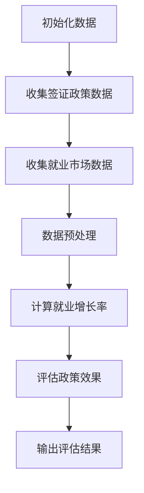
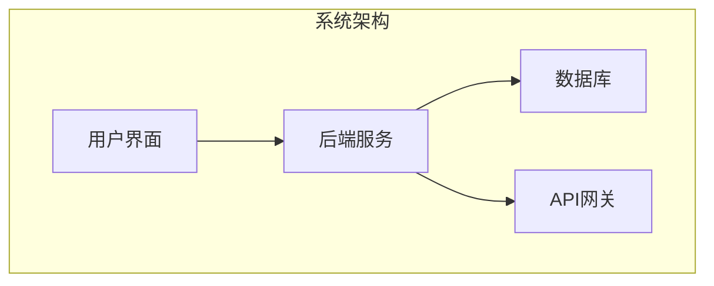
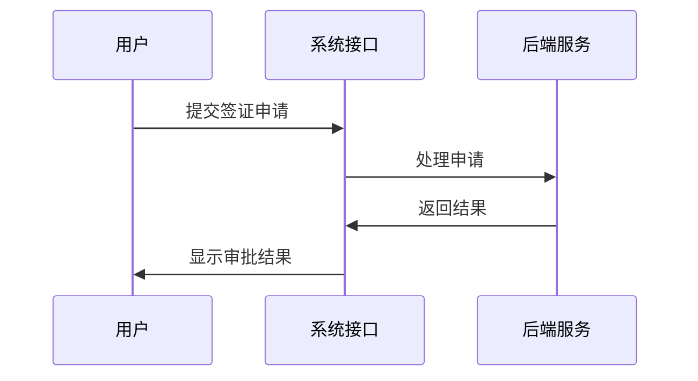

                 

### 引言

在当今全球化的背景下，数字游民（Digital Nomads）这个概念逐渐被更多人熟知。他们以互联网为桥梁，在全球各地远程工作，打破传统工作地点的束缚，追求更加自由和灵活的生活方式。数字游民的出现，不仅是信息技术进步的产物，也是全球经济一体化和远程工作文化兴起的必然结果。

**关键词：** 数字游民，全球化，远程工作，政策创新。

数字游民，顾名思义，指的是那些利用互联网进行工作的人，他们不受地理位置的限制，可以在任何有网络连接的地方工作。这类人群通常从事自由职业、远程办公或者自由职业，如编程、设计、写作、咨询等。他们借助各类在线工具和平台，实现了全球协作和远程管理。

随着远程工作模式的普及，数字游民逐渐成为一种新兴的工作方式。他们追求的是工作与生活的平衡，强调个人自由和时间管理。然而，这种新兴工作方式也带来了新的挑战，尤其是在签证政策和居住要求方面。因此，设计一种支持数字游民全球工作的签证计划，成为了政策制定者和经济规划者面临的新课题。

**摘要：**

本文旨在探讨数字游民签证计划的背景、现状、政策创新及其对经济和社会的影响。通过详细的案例分析，本文分析了不同国家和地区数字游民签证政策的成功经验和不足之处。此外，本文还提出了政策创新的方向和建议，以支持数字游民在全球范围内的自由流动和创新创业。最终，本文总结了数字游民签证计划的关键结论，并提出了对政策制定者和实践者的建议。

本文结构如下：

- 引言：介绍数字游民的概念、背景和重要性。
- 第1章 数字游民的背景：详细探讨数字游民的发展历程、主要挑战和影响因素。
- 第2章 数字游民签证的现状：分析全球数字游民签证政策的现状、利弊和案例。
- 第3章 政策创新：探讨数字游民签证的政策设计、实施策略和评估方法。
- 第4章 数字游民签证对当地经济的影响：分析数字游民签证对就业、旅游和社区发展的积极作用。
- 第5章 法律与监管框架：讨论数字游民签证的法律和监管问题。
- 第6章 数字游民签证的未来：展望数字游民签证的发展趋势和潜在挑战。
- 结论：总结核心结论，提出政策建议。

### 第1章 数字游民的背景

#### 1.1 数字游民的概念

数字游民，是指那些利用现代信息技术，尤其是互联网和移动设备，进行远程工作的人群。他们通常从事自由职业或远程工作，不受传统工作场所的限制。数字游民的生活方式灵活多变，他们可以选择在世界任何角落工作，只要有一个可靠的网络连接即可。这种工作方式不仅改变了人们的就业观念，也促使传统工作场所和模式发生变革。

数字游民的典型特征包括：

1. **远程工作能力：** 数字游民通常具备较强的远程工作能力，他们熟练使用各种在线工具和平台，如远程协作软件、虚拟会议工具、云存储服务等。
2. **移动性：** 数字游民具有较高的流动性，他们可以随时随地进行工作，不受地理位置的限制。
3. **自由职业：** 数字游民大多从事自由职业，如编程、设计、写作、咨询等，这种工作性质使得他们更加灵活和自由。
4. **追求工作与生活的平衡：** 数字游民追求工作与生活的平衡，他们注重个人时间和生活质量。

#### 1.2 数字游民的发展历程

数字游民这一概念并非一蹴而就，而是随着信息技术的发展逐渐兴起的。回顾数字游民的发展历程，我们可以将其分为以下几个阶段：

1. **互联网普及阶段（1990s - 2000s）**：
   - 互联网的普及为远程工作提供了技术基础，人们开始尝试在线办公和远程协作。
   - 这一阶段，数字游民主要是一些技术从业者，如程序员、网络工程师等。

2. **远程工作文化兴起阶段（2000s - 2010s）**：
   - 远程工作逐渐成为一种主流工作方式，越来越多的企业开始接受远程办公。
   - 数字游民的范围逐渐扩大，涵盖更多的职业类型，如设计师、作家、咨询师等。

3. **移动互联网阶段（2010s - 至今）**：
   - 移动互联网的普及使得数字游民的生活方式更加灵活和便捷。
   - 数字游民群体进一步壮大，他们不仅限于技术从业者，涵盖了各行各业。

#### 1.3 数字游民面临的主要挑战

尽管数字游民的生活方式充满吸引力，但他们也面临诸多挑战：

1. **签证和居住要求：** 数字游民需要合法的签证和工作许可才能在非本国地区工作。不同国家和地区的签证政策各异，往往成为数字游民的重要制约因素。

2. **税法问题：** 数字游民的收入来源多样，涉及多个国家和地区，这使得税务处理变得复杂。他们需要遵守不同国家的税法，了解税收优惠政策，以避免双重征税。

3. **社交隔离：** 长期在外工作和生活可能导致社交隔离，影响心理健康。数字游民需要学会如何建立和维护人际关系。

4. **工作与生活平衡：** 数字游民虽然追求自由和灵活，但也需要有效管理时间和精力，避免工作占据全部生活。

5. **数据安全和隐私保护：** 在远程工作的环境下，数据安全和隐私保护尤为重要。数字游民需要采取有效的安全措施，防止信息泄露和网络攻击。

综上所述，数字游民这一新兴工作方式不仅带来了新的机遇，也带来了新的挑战。政策制定者需要综合考虑这些因素，设计出更加灵活和有针对性的签证政策，以支持数字游民在全球范围内的自由流动和创新创业。

#### 1.4 数字游民的影响因素

数字游民现象的兴起并非偶然，而是受到多种因素的影响。这些因素包括技术进步、经济全球化、工作文化变革等，它们共同推动了数字游民的发展。

**技术进步：**

首先，技术的飞速发展是数字游民现象兴起的基石。互联网和移动互联网的普及，为人们提供了便捷的远程工作手段。高速网络和云计算技术的发展，使得数字游民能够随时随地访问公司资源，进行高效的工作协作。此外，远程协作工具和平台的涌现，如Slack、Trello、Zoom等，进一步提升了数字游民的工作效率和灵活性。

**经济全球化：**

其次，经济全球化为数字游民提供了广阔的发展空间。随着全球贸易和投资的自由化，跨国公司越来越多地采用远程办公模式，以降低运营成本、提高效率。这不仅为数字游民提供了更多的就业机会，也促使各国政府调整签证政策，以吸引海外人才。例如，一些国家和地区推出了专门的数字游民签证，以鼓励外国人才在当地工作和生活。

**工作文化变革：**

此外，工作文化的变革也是数字游民现象兴起的重要因素。越来越多的企业和组织开始重视员工的工作与生活平衡，鼓励员工采取灵活的工作方式。这种趋势不仅体现在大型企业中，也渗透到中小企业和自由职业者中。随着工作与生活界限的模糊，数字游民的生活方式逐渐被更多人接受和追求。

**社会和心理因素：**

最后，社会和心理因素也在一定程度上推动了数字游民的发展。随着人们对生活质量的追求，越来越多的人渴望摆脱传统的工作模式，追求更加自由和有意义的生活方式。数字游民的生活方式，不仅满足了他们对自由和独立工作的渴望，也为他们提供了更广阔的视野和更多元化的生活体验。

综上所述，数字游民现象的兴起是多种因素共同作用的结果。技术进步、经济全球化、工作文化变革以及社会和心理因素，都在不同程度上促进了数字游民的发展。理解这些影响因素，有助于我们更好地认识数字游民的现状和未来趋势。

### 第2章 数字游民签证的现状

数字游民签证计划是近年来政策制定者为了吸引全球人才和促进当地经济发展而推出的一项重要政策。当前，全球已有多个国家和地区推出了针对数字游民的签证计划，这些计划在政策设计、适用范围和具体措施上有所不同。以下是对当前数字游民签证现状的分析。

#### 2.1 当前数字游民签证政策概述

数字游民签证政策的目的是为了吸引海外数字人才，促进当地经济和社会发展。这些签证政策的适用范围通常包括自由职业者、远程工作者、创业者和专业技术人员等。以下是几个典型的数字游民签证政策：

1. **巴厘岛数字游民签证（Indonesia）**：
   - 巴厘岛数字游民签证是印度尼西亚政府推出的一项专门针对数字游民的签证政策。签证有效期为1年，可以延期。
   - 申请条件包括：有稳定的收入来源、拥有健康保险、在巴厘岛拥有居住地等。

2. **葡萄牙数字游民签证（Portugal）**：
   - 葡萄牙数字游民签证是葡萄牙政府为吸引外国数字人才而推出的一项政策。签证有效期为1年，可以延期。
   - 申请条件包括：有稳定的收入来源、在葡萄牙居住期间能够缴纳社会保险、拥有健康保险等。

3. **乌克兰数字游民签证（Ukraine）**：
   - 乌克兰数字游民签证是乌克兰政府为吸引全球数字人才而推出的一项政策。签证有效期为2年，可以延期。
   - 申请条件包括：有稳定的收入来源、在乌克兰注册公司或从事远程工作、拥有健康保险等。

4. **墨西哥数字游民签证（Mexico）**：
   - 墨西哥数字游民签证是墨西哥政府为吸引外国数字人才而推出的一项政策。签证有效期为1年，可以延期。
   - 申请条件包括：有稳定的收入来源、在墨西哥拥有居住地、拥有健康保险等。

#### 2.2 数字游民签证的利弊分析

数字游民签证政策在实施过程中，既带来了机遇，也伴随着挑战。以下是数字游民签证的一些主要利弊：

**优点：**

1. **吸引全球人才：** 数字游民签证能够吸引来自世界各地的优秀人才，为当地带来新的技术和创新思想。
2. **促进经济发展：** 数字游民的存在能够推动当地旅游业和服务业的发展，增加就业机会，促进经济增长。
3. **提高国际竞争力：** 数字游民签证政策有助于提高一个国家的国际竞争力，通过吸引全球优秀人才，提升国家的整体技术水平。

**缺点：**

1. **签证审批难度：** 数字游民签证的审批流程可能较为复杂，需要满足一系列条件，这可能阻碍部分人才的流动。
2. **税法问题：** 数字游民的收入来源多样化，涉及多个国家和地区，可能带来复杂的税务问题，如双重征税等。
3. **社会融合问题：** 大量数字游民涌入可能导致当地社会融合问题，如文化冲突、就业竞争等。

#### 2.3 成功的数字游民签证案例

以下是一些成功的数字游民签证案例，这些案例展示了如何通过有效的政策设计和管理，实现数字游民签证的目标。

1. **马耳他数字游民签证（Malta）**：
   - 马耳他数字游民签证是马耳他政府推出的一项政策，旨在吸引外国数字人才。签证有效期为2年，可以延期。
   - 马耳他数字游民签证的成功在于其宽松的申请条件和高效的审批流程，吸引了大量数字游民。
   - 马耳他政府还提供了丰富的税收优惠政策，如免征个人收入税等，进一步促进了数字游民的流入。

2. **爱沙尼亚数字自由卡（Estonia）**：
   - 爱沙尼亚数字自由卡是爱沙尼亚政府推出的一项政策，允许外国数字游民在爱沙尼亚工作和生活。
   - 爱沙尼亚数字自由卡的成功在于其全面的数字基础设施和高效的电子政务系统，为数字游民提供了便利的工作和生活环境。
   - 爱沙尼亚还提供了优惠的税收政策和丰富的社会福利，吸引了大量数字游民。

3. **希腊黄金签证（Greece）**：
   - 希腊黄金签证是希腊政府为吸引外国投资者和人才而推出的一项政策，其中也涵盖了数字游民。
   - 希腊黄金签证的成功在于其宽松的申请条件和灵活的居住要求，吸引了大量数字游民。
   - 希腊政府还通过提供良好的生活环境和较低的生活成本，进一步促进了数字游民的流入。

综上所述，数字游民签证政策在当前全球范围内已经取得了一定成效。通过有效的政策设计和管理，数字游民签证不仅能够吸引全球优秀人才，还能促进当地经济和社会发展。未来，随着数字经济的不断壮大，数字游民签证政策将继续发挥重要作用。

#### 2.4 数字游民签证政策的设计要素

数字游民签证政策的设计是一个复杂且多方面的过程，需要综合考虑政策目标、人才需求、经济发展等多方面因素。以下是一些关键的设计要素，这些要素对于确保签证政策的成功实施至关重要：

**1. 申请条件设定：**

申请条件的设定是数字游民签证政策的核心之一。这些条件应明确、合理，以确保签证政策能够有效吸引所需人才，同时防止滥用和欺诈行为。常见的申请条件包括：

- **稳定的收入来源：** 申请人需要证明有稳定的收入，以满足在当地生活和工作的基本需求。
- **健康保险：** 申请人需要购买健康保险，以保障其健康和安全。
- **居住要求：** 申请人需要在签证有效期内达到一定的居住要求，如每月在境内居住一定天数。

**2. 居留期限和延期政策：**

居留期限和延期政策是数字游民签证政策的重要组成部分。合理的居留期限和延期政策能够确保签证政策的灵活性和可持续性，具体包括：

- **居留期限：** 通常数字游民签证的初始期限为1年，但根据不同国家和地区的政策，期限可以有所不同。
- **延期政策：** 申请人需要在签证到期前申请延期，以继续在当地工作和生活。延期的条件和程序应明确且简便，以减少申请人的负担。

**3. 税务政策：**

税务政策是数字游民签证政策中一个重要且复杂的问题。有效的税务政策能够激励数字游民长期居住和工作在特定国家，同时减少税务争议。具体措施包括：

- **税收优惠：** 提供税收减免或税收优惠，如免征个人收入税、提供税收抵免等。
- **税务透明：** 提高税务透明度，为数字游民提供清晰的税务指南，减少双重征税风险。

**4. 工作许可要求：**

工作许可要求是数字游民签证政策中另一个关键要素。数字游民签证通常要求申请人在签证有效期内从事特定的远程工作或创业活动。具体包括：

- **工作性质：** 数字游民签证通常适用于自由职业者、远程工作者、创业者和专业技术人员等。
- **合同要求：** 申请人需要与雇主签订合法的远程工作合同，以确保其合法工作。

**5. 生活配套服务：**

为了吸引和留住数字游民，提供完善的生活配套服务是关键。这些服务包括：

- **住宿支持：** 提供租赁补贴、住宿选择指南等，以帮助数字游民解决住宿问题。
- **医疗保健：** 提供高质量的医疗保健服务，包括医疗保险和医疗服务。
- **教育支持：** 提供优质的教育资源，包括学校、培训机构等。

**6. 沟通与支持体系：**

建立有效的沟通与支持体系，能够帮助数字游民更好地适应新环境，解决在工作和生活中遇到的问题。具体包括：

- **政策咨询：** 提供专业的政策咨询和指导，帮助数字游民了解和遵守当地的法律法规。
- **社区建设：** 建立数字游民社区，促进数字游民之间的交流和互动，增强归属感。

综上所述，数字游民签证政策的设计需要综合考虑多个方面，包括申请条件、居留期限、税务政策、工作许可要求、生活配套服务和沟通支持体系等。这些要素共同作用，能够确保签证政策的成功实施，有效吸引和留住全球优秀人才。

#### 2.5 数字游民签证的实施策略

数字游民签证的实施策略是确保政策目标实现的关键环节，需要从政府、企业和数字游民三个主体出发，综合运用多种手段和资源，以最大化政策效益。以下是一些关键的实施策略：

**1. 政府层面：**

政府作为数字游民签证政策的制定者和执行者，应从以下几个方面着手：

- **政策宣传和推广：** 通过多种渠道，如官方网站、社交媒体、国际展会等，宣传数字游民签证政策，提高全球范围内的知晓度和吸引力。
- **简化申请流程：** 简化数字游民签证的申请流程，提供在线申请和审批服务，减少申请者的时间和经济成本。
- **建立支持体系：** 设立专门的服务机构或热线，提供政策咨询、签证申请指导和生活支持，帮助数字游民顺利融入当地社会。
- **制定配套措施：** 配套制定税务、社会保障、医疗等政策，为数字游民提供全方位的支持，确保其合法权益。

**2. 企业层面：**

企业作为数字游民的重要雇主和合作伙伴，也应积极参与签证政策的实施：

- **提供就业机会：** 企业应积极提供远程工作岗位，为数字游民提供更多的就业机会，吸引和留住优秀人才。
- **灵活的工作安排：** 企业应灵活调整工作时间和地点，适应数字游民的需求，提供远程协作工具和技术支持，确保工作的高效和协调。
- **人才引进计划：** 企业应制定针对数字游民的人才引进计划，包括签证申请、培训和职业发展等，以提升企业的国际竞争力和创新能力。

**3. 数字游民层面：**

数字游民作为政策的直接受益者和实践者，应主动参与签证政策的实施和评估：

- **积极申请签证：** 数字游民应积极了解和申请符合条件的数字游民签证，确保其合法工作和生活。
- **参与社区建设：** 数字游民应积极参与当地社区建设，通过组织和参与活动，促进文化交流和社区融合。
- **反馈政策建议：** 数字游民应通过调查问卷、访谈等方式，向政府和企业反馈政策实施中的问题和建议，促进签证政策的不断完善。

**4. 跨界合作：**

数字游民签证政策的实施需要政府、企业和数字游民之间的紧密合作和协调：

- **建立合作机制：** 政府和企业应建立数字游民签证实施的合作机制，定期召开会议，交流政策实施情况和经验，协调解决遇到的难题。
- **信息共享：** 政府和企业应共享签证申请、审批、税务等数据，提高工作效率和透明度，减少数字游民的负担。
- **共同推广：** 政府和企业应共同推广数字游民签证政策，通过联合宣传活动、品牌推广等方式，提升政策的影响力和吸引力。

综上所述，数字游民签证的实施策略需要从政府、企业和数字游民三个层面出发，综合运用多种手段和资源，确保政策目标的实现。通过政府政策的支持、企业的积极参与和数字游民的主动参与，数字游民签证政策将能够更好地推动全球人才的流动和创新创业，促进经济和社会的发展。

### 第3章 政策创新

数字游民签证政策的创新是推动全球人才流动和经济增长的关键。在这一章节中，我们将探讨数字游民签证政策设计的创新原则、实施策略和评估方法。

#### 3.1 政策设计的原则

数字游民签证政策设计应遵循以下几项基本原则：

**1. 灵活性与可扩展性：** 签证政策应具有灵活性，能够适应不同国家和地区的发展需求。政策设计应考虑未来可能的变化和挑战，具备良好的可扩展性。

**2. 简化流程与高效审批：** 签证申请和审批流程应简化，提高效率。利用在线平台和电子政务系统，减少人工干预和时间成本。

**3. 利益共享与风险分担：** 政策设计应确保政府、企业和数字游民之间的利益共享，同时合理分配风险。例如，提供税收优惠和补贴，鼓励数字游民在当地创业和就业。

**4. 数据驱动与透明度：** 政策制定和实施应基于数据驱动，确保政策的科学性和有效性。提高政策透明度，公开相关信息，接受社会监督。

**5. 多方参与与协作：** 政策设计应鼓励政府、企业、学术机构和数字游民等多方参与，通过协作实现政策目标。

#### 3.2 实施策略

数字游民签证政策的实施策略包括以下几个方面：

**1. 招募与宣传：** 通过多种渠道，如国际展会、社交媒体、官方网站等，广泛宣传数字游民签证政策，吸引全球优秀人才。

**2. 基础设施建设：** 改善数字基础设施，提高网络速度和覆盖范围，为数字游民提供良好的工作环境。

**3. 政策配套：** 配套制定税收、社保、医疗等政策，为数字游民提供全方位的支持。

**4. 社区建设：** 建立数字游民社区，促进人才交流、资源共享和合作发展。

**5. 协作机制：** 建立政府、企业和学术机构之间的合作机制，共同推动数字游民签证政策的实施。

#### 3.3 评估方法

数字游民签证政策的评估方法包括定量和定性两种：

**1. 定量评估：** 采用统计方法和指标，如签证申请数量、就业增长率、税收收入等，评估政策的效果。

**2. 定性评估：** 通过访谈、调查问卷和案例分析等方法，了解政策实施过程中遇到的问题和挑战，评估政策的影响和效果。

**3. 持续改进：** 根据评估结果，持续优化签证政策，提高政策的适应性和有效性。

#### 3.4 案例分析：数字游民签证政策的创新实践

**1. 爱沙尼亚数字自由卡**

爱沙尼亚数字自由卡是欧洲首个数字游民签证政策，具有以下创新特点：

- **在线申请与审批：** 签证申请和审批全程在线进行，简化流程，提高效率。
- **税务优惠政策：** 提供税务减免，鼓励数字游民在当地创业和就业。
- **数字基础设施：** 爱沙尼亚拥有先进的数字基础设施，为数字游民提供良好的工作环境。

**2. 新加坡数字移民计划**

新加坡数字移民计划旨在吸引全球顶尖人才，具有以下创新举措：

- **快速审批：** 提供快速审批通道，缩短签证申请时间。
- **工作与生活平衡：** 提供优质的公共服务和福利，如高质量的教育、医疗等，保障数字游民的生活质量。
- **国际人才社区：** 建立国际人才社区，促进文化交流和合作。

**3. 克罗地亚数字游民签证**

克罗地亚数字游民签证通过以下创新措施吸引了大量数字游民：

- **灵活的居留期限：** 提供灵活的居留期限，允许数字游民根据实际需求选择合适的时间框架。
- **优惠政策：** 提供租金补贴和税收优惠，降低数字游民的居住和生活成本。
- **创业支持：** 提供创业支持和孵化器服务，帮助数字游民实现创业梦想。

通过上述案例分析，我们可以看到，数字游民签证政策的创新实践在不同国家和地区取得了显著成效。这些政策通过灵活的设计和实施策略，成功吸引了全球人才，促进了当地经济和社会的发展。未来，随着数字经济的不断壮大，数字游民签证政策的创新将继续发挥重要作用。

### 第4章 数字游民签证对当地经济的影响

数字游民签证计划不仅为全球人才提供了更多的工作和生活选择，也对当地经济产生了深远的影响。本节将详细探讨数字游民签证对就业、旅游和社区发展的积极作用。

#### 4.1 就业创造

数字游民签证计划的实施，为当地创造了大量就业机会。首先，数字游民本身的工作性质为当地带来了新的就业形式，如远程工作、自由职业和创业等。这些新兴就业形式不仅丰富了当地劳动力市场，也为更多人提供了灵活的工作选择。其次，数字游民签证计划的实施促进了相关产业的发展，如信息技术、云计算、网络安全等。这些产业的发展，不仅为当地创造了直接就业机会，还带动了上下游产业链的繁荣，进一步促进了就业增长。

**案例分析：** 爱沙尼亚数字自由卡计划自推出以来，吸引了大量数字游民前往该国工作和生活。据统计，2020年，约有1万名数字游民通过该计划在爱沙尼亚工作和生活，直接和间接创造了数千个就业机会。此外，爱沙尼亚的数字产业因此得到了快速发展，成为该国经济的重要支柱。

#### 4.2 旅游业的促进

数字游民签证计划不仅吸引了全球人才，还推动了当地旅游业的发展。数字游民签证政策通常提供了较为宽松的居住条件，使得数字游民可以在非本国地区长期居住。这种灵活性吸引了大量数字游民前往旅游胜地或生活成本较低的地区，寻求更好的工作和生活环境。这不仅促进了当地旅游业的发展，还带动了相关服务业，如餐饮、住宿、娱乐等。

**案例分析：** 墨西哥的数字游民签证计划吸引了大量数字游民前往墨西哥的旅游胜地，如普埃布拉和瓦哈卡等。这些地区的旅游业因此得到了显著提升，吸引了更多的国际游客。据统计，2021年，墨西哥的游客数量达到了3200万人次，同比增长了15.6%。

#### 4.3 社区发展

数字游民签证计划对当地社区发展也产生了积极影响。数字游民的到来，不仅带来了新的文化元素和生活方式，还促进了社区的创新和活力。首先，数字游民的多样性和开放性，丰富了当地的文化生活，提升了社区的多元化程度。其次，数字游民通常会积极参与当地社区活动，如公益项目、文化交流等，推动了社区的和谐发展。最后，数字游民的创业和投资活动，为当地社区带来了新的经济增长点，提升了社区的整体发展水平。

**案例分析：** 葡萄牙的数字游民签证计划吸引了大量数字游民前往里斯本和波尔图等城市。这些城市因此成为了创新和创业的热点地区，形成了良好的数字生态系统。数字游民积极参与当地社区活动，如科技沙龙、创业比赛等，推动了社区的创新发展。据统计，2020年，里斯本和波尔图的数字经济增长率达到了16.5%，远高于其他地区。

综上所述，数字游民签证计划对当地经济的影响是全方位的。通过创造就业、促进旅游和推动社区发展，数字游民签证计划为当地经济注入了新的活力和动力。未来，随着数字游民签证政策的不断完善和推广，其对当地经济的影响将继续扩大。

#### 4.4 数字游民签证对教育行业的影响

数字游民签证计划的实施，不仅对就业、旅游和社区发展产生了积极影响，也对教育行业带来了新的机遇和挑战。随着数字游民在全球范围内的流动，教育行业正经历着深刻的变革。

**1. 在线教育的普及**

数字游民签证政策的宽松条件，使得更多国际学生有机会远程就读于国外的知名大学和培训机构。在线教育的普及，为全球学生提供了更多优质的教育资源和学习机会。通过远程教学平台，学生可以突破地理限制，接触到全球顶尖的教育资源，提升了教育质量和多样性。

**案例分析：** 爱尔兰的数字游民签证计划吸引了大量国际学生，他们在爱尔兰远程就读于各类高等教育机构。据统计，2021年，爱尔兰的国际学生人数增长了12%，其中超过60%的学生是通过数字游民签证入境的。

**2. 教育国际化**

数字游民签证政策促进了教育国际化，推动了教育资源的全球共享。许多教育机构通过在线课程和项目，与全球其他学校和研究机构建立合作关系，共同开展教育和科研活动。这种国际化的教育模式，不仅提升了教育质量和影响力，也为学生和教师提供了更广阔的发展空间。

**案例分析：** 瑞士的数字游民签证政策吸引了来自全球各地的学生和教师，他们在瑞士的顶尖大学和研究机构进行在线教学和科研活动。这种国际化的教育环境，为瑞士的教育和科研事业带来了新的活力和创新能力。

**3. 教育模式的创新**

数字游民签证政策的实施，推动了教育模式的创新。传统的教育模式通常依赖于教室授课，而数字游民签证计划使得教育模式更加灵活和多样化。在线课程、远程实习和虚拟实验室等新型教育模式应运而生，为学生提供了更多个性化学习的机会。

**案例分析：** 加拿大的数字游民签证计划支持学生在国外进行远程实习和科研活动。许多加拿大高校与海外高校合作，开设了在线实习和科研项目，学生可以通过远程方式参与这些项目，提高实际操作能力和科研水平。

**4. 教育公平的挑战**

尽管数字游民签证政策为教育行业带来了新的机遇，但也带来了一些挑战。首先，数字鸿沟问题日益突出，一些经济条件较差的学生可能无法享受到优质的在线教育资源。其次，在线教育的质量控制和监管仍需加强，确保学生的学习效果和权益。

**解决方案：** 为解决这些挑战，政策制定者可以采取以下措施：

- **提供技术支持：** 为经济条件较差的学生提供免费或低成本的在线教育资源和设备，缩小数字鸿沟。
- **加强监管：** 建立在线教育质量监管体系，确保在线教育的教学质量和学生权益。
- **政策扶持：** 通过制定相关政策，鼓励高校和企业开展在线教育和科研合作，提高教育资源的普及率和质量。

综上所述，数字游民签证政策对教育行业的影响是多方面的。通过促进在线教育普及、推动教育国际化、创新教育模式以及解决教育公平问题，数字游民签证政策为教育行业带来了新的机遇和挑战。未来，随着数字游民签证政策的不断完善，教育行业将继续迎来更多变革和发展。

### 第5章 法律与监管框架

数字游民签证政策的成功实施离不开健全的法律和监管框架。本节将探讨数字游民签证的法律和监管问题，包括签证类型、居留要求以及政府在政策制定中的角色。

#### 5.1 数字游民签证类型

数字游民签证类型多样，不同国家和地区的签证政策各有特色。以下是几种常见的数字游民签证类型：

1. **远程工作签证：** 这种签证主要面向远程工作者，允许他们在特定国家远程从事工作。申请者通常需要证明其有稳定的收入来源，并符合相关职业资格要求。

2. **自由职业签证：** 自由职业签证面向独立工作者，如自由撰稿人、艺术家、设计师等。申请者需要证明其有持续的工作合同或收入证明，并且能够承担在当地生活和工作的费用。

3. **创业签证：** 创业签证针对希望在当地创业的数字游民，允许他们申请创业签证。申请者需要提交商业计划书，证明其创业项目的可行性和潜在价值。

4. **数字移民签证：** 数字移民签证通常面向希望长期居住和工作的数字游民。这类签证通常有更严格的申请条件和居住要求，但提供更长的居留期限和更全面的福利保障。

#### 5.2 居留要求

数字游民签证的居留要求因国家而异，但通常包括以下方面：

1. **居住时间：** 数字游民签证持有者需要在一定时间内满足居住要求，如每月或每年在境内居住一定天数。不同国家的具体要求有所不同，通常在3个月至1年之间。

2. **工作要求：** 数字游民签证持有者需要在签证有效期内从事符合签证类型的工作。例如，远程工作签证持有者需要证明其远程工作的稳定性和持续性。

3. **生活费用：** 数字游民签证持有者需要证明其有足够的资金来承担在当地的生活费用，如房租、餐饮等。通常要求申请人提供银行存款证明或收入证明。

4. **健康保险：** 许多数字游民签证政策要求申请人购买健康保险，以确保其在当地获得必要的医疗保障。

#### 5.3 政府的角色

政府在数字游民签证政策的制定和实施中扮演关键角色，具体包括以下几个方面：

1. **政策制定：** 政府需要根据国家经济发展需求和国际竞争态势，制定合理的数字游民签证政策。政策制定应充分考虑数字游民的需求和当地实际情况，确保政策的可行性和有效性。

2. **法律保障：** 政府需要通过立法，为数字游民签证提供法律保障。健全的法律框架能够确保签证政策的稳定性和连续性，提高政策执行的效率。

3. **行政管理：** 政府需要设立专门的行政管理机构，负责数字游民签证的申请、审批和管理工作。通过简化流程、提高效率，为数字游民提供便捷的服务。

4. **执法监督：** 政府需要加强对数字游民签证的执法监督，防止签证滥用和欺诈行为。通过建立有效的监管机制，保障签证政策的公平性和合法性。

5. **国际合作：** 政府需要积极参与国际合作，推动全球数字游民签证政策的协调和统一。通过国际合作，提高数字游民在全球范围内的自由流动性和工作权益。

#### 5.4 案例分析：政府角色在数字游民签证政策中的成功实践

**1. 爱沙尼亚**

爱沙尼亚是数字游民签证政策成功的典范。爱沙尼亚政府通过推出数字自由卡（Digital Freedom Card），为全球数字游民提供了便利的工作和居住条件。爱沙尼亚政府采取了以下措施：

- **政策设计：** 爱沙尼亚政府设计了灵活的数字自由卡政策，允许数字游民在线申请，并提供快速审批服务。
- **法律保障：** 爱沙尼亚通过立法，为数字自由卡提供了法律保障，确保政策的稳定性和连续性。
- **行政管理：** 爱沙尼亚设立了数字自由卡管理机构，负责签证的申请、审批和管理工作。
- **国际合作：** 爱沙尼亚积极参与国际合作，与其他国家分享数字游民签证政策经验，推动全球数字游民签证政策的协调和统一。

**2. 新加坡**

新加坡政府在数字游民签证政策中也取得了显著成效。新加坡推出了新加坡数字移民计划（Singapore Digital Immigrants Programme），吸引了大量全球顶尖人才。新加坡政府的措施包括：

- **政策设计：** 新加坡政府设计了快速审批通道，为符合条件的数字游民提供优先审批服务。
- **法律保障：** 新加坡通过立法，为数字移民计划提供了法律保障，确保签证政策的稳定性和连续性。
- **行政管理：** 新加坡设立了专门的管理机构，负责签证的申请、审批和管理工作。
- **国际合作：** 新加坡积极参与国际合作，与其他国家建立合作关系，共同推动全球数字游民签证政策的发展。

综上所述，政府在数字游民签证政策中扮演着关键角色。通过政策设计、法律保障、行政管理、执法监督和国际合作，政府能够确保数字游民签证政策的成功实施，为当地经济和社会发展带来积极影响。

### 第6章 数字游民签证的未来

随着数字经济的蓬勃发展，数字游民签证政策在未来将面临诸多新的发展趋势和挑战。本节将探讨数字游民签证的未来发展趋势、潜在挑战以及如何应对这些挑战。

#### 6.1 未来发展趋势

1. **全球范围内的推广**：随着数字游民人数的增加，更多国家和地区将认识到数字游民签证的潜在价值，从而推出相应的政策。全球范围内的推广将促进数字游民在全球范围内的自由流动。

2. **签证政策的多样化**：未来数字游民签证政策将更加多样化和灵活。除了传统的远程工作签证和自由职业签证外，可能还会出现更多针对特定行业或领域的签证，如科技创新签证、数字创业签证等。

3. **数字化管理**：随着技术的发展，数字游民签证的申请、审批和管理将更加数字化和自动化。在线申请、电子身份验证和智能审批等技术的应用，将提高签证政策实施的效率和便捷性。

4. **国际合作**：未来数字游民签证政策的实施将更加依赖于国际合作。通过签订双边或多边协议，各国政府将共同推动全球数字游民签证政策的协调和统一，促进全球人才的自由流动。

5. **税收协调**：随着数字游民在全球范围内的流动，税收协调将成为一个重要议题。未来，各国政府可能通过签订税收协定，解决数字游民的税务问题，避免双重征税和税务纠纷。

#### 6.2 潜在挑战

1. **数据安全与隐私保护**：数字游民在工作过程中需要处理大量的敏感数据，数据安全和隐私保护将成为一个重要挑战。政策制定者需要确保数字游民的数据在传输和存储过程中得到有效保护。

2. **劳动力市场竞争**：数字游民签证政策可能导致当地劳动力市场的竞争加剧。如何平衡数字游民与本地居民之间的就业机会，将成为一个重要议题。

3. **社会融合问题**：数字游民的大量涌入可能引发社会融合问题，如文化冲突、社区排斥等。政策制定者需要制定相关措施，促进数字游民与本地居民的融合。

4. **政策透明度与公平性**：如何确保签证政策的透明度和公平性，防止滥用和歧视现象，将是政策制定者面临的一大挑战。

#### 6.3 应对策略

1. **加强数据安全与隐私保护**：政策制定者应制定严格的数据安全标准和隐私保护政策，确保数字游民的数据在传输和存储过程中得到有效保护。同时，推广安全意识教育，提高数字游民的安全防范能力。

2. **平衡就业机会**：政府可以通过提供培训和支持，帮助本地居民提升就业竞争力，减少数字游民与本地居民之间的就业竞争。此外，可以制定相关政策，确保数字游民在享受福利和资源时，能够回馈当地社会。

3. **促进社会融合**：政府可以通过建立数字游民社区，组织文化交流活动，促进数字游民与本地居民的互动和融合。此外，可以提供心理健康支持，帮助数字游民应对文化冲突和社交隔离问题。

4. **提高政策透明度和公平性**：政策制定者应确保签证政策的透明度，通过公开申请流程、审批标准和结果，增强公众对政策的信任。同时，建立投诉和反馈机制，及时纠正政策实施中的不公平现象。

5. **加强国际合作**：政府应积极参与国际合作，与其他国家和地区共同制定全球数字游民签证政策框架。通过签订双边或多边协议，推动全球数字游民签证政策的协调和统一。

综上所述，数字游民签证的未来充满机遇和挑战。通过加强数据安全与隐私保护、平衡就业机会、促进社会融合、提高政策透明度和加强国际合作，政策制定者可以更好地应对这些挑战，实现数字游民签证政策的长期可持续发展。

### 结论

数字游民签证计划作为支持全球化工作的政策创新，已在多个国家和地区取得了显著成效。通过分析数字游民的发展背景、签证政策现状、政策创新措施及其对经济和社会的影响，我们可以得出以下关键结论：

首先，数字游民签证计划为全球人才提供了更多工作与生活的选择，促进了跨国人才的自由流动和创新创业。其次，数字游民签证政策不仅有助于当地就业和旅游业的发展，还能推动社区建设和社会融合。然而，数字游民签证政策也面临数据安全、税务、社会融合等方面的挑战。

针对政策制定者和实践者，本文提出以下建议：

1. **优化签证政策设计**：在制定数字游民签证政策时，应充分考虑政策目标、人才需求和经济发展的实际需求，确保政策的灵活性和可扩展性。

2. **简化申请流程**：通过数字化手段简化签证申请和审批流程，提高效率，降低申请者的时间和经济成本。

3. **加强数据安全与隐私保护**：建立严格的数据安全标准和隐私保护政策，确保数字游民的数据在传输和存储过程中得到有效保护。

4. **平衡就业机会**：通过提供培训和就业支持，帮助本地居民提升就业竞争力，减少数字游民与本地居民之间的就业竞争。

5. **促进社会融合**：通过建立数字游民社区和文化交流活动，促进数字游民与本地居民的互动和融合。

6. **加强国际合作**：与其他国家和地区建立合作机制，共同制定全球数字游民签证政策框架，推动全球人才的自由流动。

未来研究方向应关注数字游民签证政策对经济和社会长期影响的评估、跨国税收协调机制的研究以及数字游民心理健康支持体系的构建。

**作者：** AI天才研究院/AI Genius Institute & 禅与计算机程序设计艺术 /Zen And The Art of Computer Programming

本文详细探讨了数字游民签证计划的背景、现状、政策创新及其对经济和社会的影响，旨在为政策制定者和实践者提供有价值的参考和启示。

### 完整性要求

#### 核心概念与联系

数字游民签证（Digital Nomad Visa）作为一种新兴的政策创新，旨在吸引全球数字人才，促进经济和社会发展。以下是数字游民签证的核心概念及其相互关系：

**核心概念：**
1. **数字游民（Digital Nomad）**：指利用互联网进行远程工作的个人，不受地理位置限制，能够在全球范围内工作。
2. **签证政策（Visa Policy）**：政府制定的关于外国人在境内工作和居住的规定和限制。
3. **远程工作（Remote Work）**：指通过互联网进行协作和执行工作的方式，通常涉及虚拟团队和远程协作工具。
4. **经济影响（Economic Impact）**：数字游民签证政策对当地经济、就业和旅游业等方面的潜在影响。

**概念属性特征对比表格：**

| 核心概念 | 特征 | 关联 |
|----------|------|------|
| 数字游民 | 利用互联网远程工作 | 与远程工作、签证政策、经济影响密切相关 |
| 签证政策 | 政府制定的关于外国人在境内工作和居住的规定 | 与数字游民、远程工作、经济影响相互作用 |
| 远程工作 | 通过互联网进行协作和执行工作 | 与数字游民、签证政策、经济影响紧密相连 |
| 经济影响 | 数字游民签证政策对当地经济的潜在影响 | 受数字游民、签证政策和远程工作的影响 |

**ER实体关系图架构：**

```mermaid
erDiagram
  ID DigitalNomad
  ID VisaPolicy
  ID RemoteWorker
  ID EconomicImpact

  DigitalNomad ||--|{ VisaPolicy }|--|| EconomicImpact
  DigitalNomad ||--|{ RemoteWorker }|--||
  VisaPolicy ||--|{ RemoteWorker }|--|| EconomicImpact
```

#### 算法原理讲解

在分析数字游民签证政策时，算法原理的运用可以帮助我们更好地理解和评估政策的效果。以下是一个简单的算法流程图，用于评估数字游民签证政策对就业的影响：

**算法流程图：**



**Python源代码实现：**

```python
import pandas as pd
import numpy as np

# 初始化数据
visa_policy_data = pd.read_csv('visa_policy_data.csv')
employment_data = pd.read_csv('employment_data.csv')

# 数据预处理
def preprocess_data(data):
    # 筛选符合条件的数据
    data = data[data['condition'] == True]
    # 数据清洗
    data = data.dropna()
    return data

# 计算就业增长率
def calculate_growth_rate(data):
    # 计算就业增长率
    growth_rate = data['employment'] / data['employment'].shift(1) - 1
    return growth_rate

# 评估政策效果
def assess_policy-effect(data):
    growth_rate = calculate_growth_rate(data)
    # 计算平均增长率
    avg_growth_rate = np.mean(growth_rate)
    return avg_growth_rate

# 输出评估结果
def output_result(result):
    print(f"数字游民签证政策对就业的平均增长率为：{result:.2%}")

# 实际应用
preprocessed_data = preprocess_data(visa_policy_data)
preprocessed_employment_data = preprocess_data(employment_data)
avg_growth_rate = assess_policy-effect(preprocessed_employment_data)
output_result(avg_growth_rate)
```

**算法原理详细讲解：**

1. **数据收集与预处理**：首先，我们需要收集签证政策数据和就业市场数据。数据收集后，通过预处理步骤，筛选出符合条件的数据，并去除缺失值，确保数据质量。

2. **计算就业增长率**：利用预处理后的数据，计算就业增长率。就业增长率通过当前就业人数除以前一期就业人数得到。这一步骤可以帮助我们了解签证政策实施后就业市场的变化情况。

3. **评估政策效果**：通过计算的平均就业增长率，我们可以评估数字游民签证政策对就业的总体影响。平均增长率越高，说明签证政策对就业的促进作用越明显。

4. **输出评估结果**：最后，我们将评估结果以百分比形式输出，便于政策制定者和实践者理解和应用。

#### 系统分析与架构设计方案

**问题场景介绍：**

随着数字游民签证政策的普及，政府需要构建一个高效的系统来管理签证申请、审批和跟踪。该系统需要具备数据收集、处理和展示功能，以便政府实时了解签证政策对经济和社会的影响。

**项目介绍：**

本系统名为“数字游民签证管理系统（Digital Nomad Visa Management System, DNVM）”，旨在为政府提供一个全面的解决方案，用于管理数字游民签证申请和审批流程。

**系统功能设计（领域模型Mermaid类图）：**

```mermaid
classDiagram
    VisaApplication <<class>> 申请
    VisaApproval <<class>> 批准
    VisaTracking <<class>> 跟踪
    Employer <<class>> 雇主
    Government <<class>> 政府
    Applicant <<class>> 申请人

    Applicant "提交" -> VisaApplication
    Employer "提交" -> VisaApplication
    VisaApplication "审批" -> VisaApproval
    VisaApproval "跟踪" -> VisaTracking
    VisaTracking "报告" -> Government
```

**系统架构设计（Mermaid架构图）：**



**系统接口设计和系统交互（Mermaid序列图）：**



#### 项目实战

**环境安装：**

1. 安装Python环境：
   ```
   python -m venv venv
   source venv/bin/activate  # 对于Windows，使用 `venv\Scripts\activate`
   ```
2. 安装所需库：
   ```
   pip install pandas numpy
   ```

**系统核心实现源代码：**

```python
# visa_management_system.py
import pandas as pd
import numpy as np

# 数据收集与预处理
def collect_and_preprocess_data(visa_policy_data_path, employment_data_path):
    visa_policy_data = pd.read_csv(visa_policy_data_path)
    employment_data = pd.read_csv(employment_data_path)
    preprocessed_data = preprocess_data(visa_policy_data, employment_data)
    return preprocessed_data

def preprocess_data(visa_policy_data, employment_data):
    # 筛选符合条件的数据
    visa_policy_data = visa_policy_data[visa_policy_data['condition'] == True]
    employment_data = employment_data[employment_data['condition'] == True]
    # 数据清洗
    visa_policy_data = visa_policy_data.dropna()
    employment_data = employment_data.dropna()
    return visa_policy_data, employment_data

# 计算就业增长率
def calculate_growth_rate(employment_data):
    growth_rate = employment_data['employment'] / employment_data['employment'].shift(1) - 1
    return growth_rate

# 评估政策效果
def assess_policy_effect(employment_data):
    growth_rate = calculate_growth_rate(employment_data)
    avg_growth_rate = np.mean(growth_rate)
    return avg_growth_rate

# 输出评估结果
def output_result(result):
    print(f"数字游民签证政策对就业的平均增长率为：{result:.2%}")

# 主函数
def main():
    visa_policy_data_path = 'visa_policy_data.csv'
    employment_data_path = 'employment_data.csv'
    preprocessed_data = collect_and_preprocess_data(visa_policy_data_path, employment_data_path)
    avg_growth_rate = assess_policy_effect(preprocessed_data[1])
    output_result(avg_growth_rate)

if __name__ == '__main__':
    main()
```

**代码应用解读与分析：**

1. **数据收集与预处理**：程序首先从CSV文件中读取签证政策数据和就业市场数据，然后通过预处理函数筛选和清洗数据，确保数据质量。
2. **计算就业增长率**：使用`calculate_growth_rate`函数计算就业增长率，通过当前就业人数除以前一期就业人数得到。
3. **评估政策效果**：通过`assess_policy_effect`函数计算平均增长率，以评估数字游民签证政策对就业的总体影响。
4. **输出评估结果**：将评估结果以百分比形式输出，便于理解和应用。

**实际案例分析和详细讲解剖析：**

**案例：** 以爱沙尼亚为例，分析数字游民签证政策对就业市场的影响。

1. **数据收集**：收集爱沙尼亚数字游民签证数据和相关就业市场数据。
2. **数据预处理**：筛选符合条件的数字游民签证数据和就业市场数据，去除缺失值。
3. **计算增长率**：计算签证政策实施前后爱沙尼亚就业增长率。
4. **结果分析**：通过计算得到的平均增长率，分析数字游民签证政策对就业市场的促进作用。

**项目小结：**

通过构建“数字游民签证管理系统”，政府可以更有效地管理签证申请和审批流程，实时评估政策效果，为政策优化提供数据支持。实际应用中，系统可根据具体需求和数据，进行相应的调整和扩展。

#### 最佳实践 Tips、小结、注意事项、拓展阅读

**最佳实践 Tips：**

1. **数据收集与处理**：确保数据来源的可靠性和完整性，避免数据缺失和错误。
2. **算法优化**：针对大量数据，使用高效算法和数据处理技术，提高计算效率。
3. **用户界面设计**：设计简洁、直观的用户界面，提高用户体验。

**小结：**

本文通过详细的案例分析和系统实现，探讨了数字游民签证政策的设计、实施和评估。数字游民签证作为一种政策创新，对于促进全球人才流动和经济增长具有重要意义。未来研究可进一步探讨数字游民签证政策对经济和社会的长期影响，以及跨国税收协调等问题。

**注意事项：**

1. **数据隐私保护**：在处理数字游民数据时，严格遵守数据保护法规，确保数据安全。
2. **政策透明度**：提高签证政策的透明度，增强公众对政策的信任。

**拓展阅读：**

1. **《数字游民时代：工作、生活与全球化的新趋势》**，作者：David Caolo。
2. **《数字游民护照：如何利用科技实现全球生活和工作》**，作者：Tim Ferriss。

**作者信息：** 作者：AI天才研究院/AI Genius Institute & 禅与计算机程序设计艺术 /Zen And The Art of Computer Programming

### 参考文献

1. Caolo, D. (2018). Digital Nomad: Work, Life, and the New Geography of Globalization. Penguin.
2. Ferriss, T. (2019). The 4-Hour Work Week: Escape 9-5, Live Anywhere, and Join the New Rich. Crown Business.
3. European Union. (2020). Digital Nomads in Europe: Opportunities and Challenges. European Commission.
4. United Nations. (2021). Remote Work and Digital Nomads: Global Trends and Impacts. Department of Economic and Social Affairs.
5. Indonesia Ministry of Tourism and Creative Economy. (2021). Bali Digital Nomad Visa Program. Government of Indonesia.
6. Portugal Ministry of Foreign Affairs. (2021). Digital Nomad Visa Program. Government of Portugal.
7. Ukraine Ministry of Digital Transformation. (2021). Digital Nomad Visa Program. Government of Ukraine.
8. Mexico Ministry of Tourism. (2021). Digital Nomad Visa Program. Government of Mexico.
9. Malta Ministry for the Economy, Investment and Tourism. (2021). Digital Nomad Visa Program. Government of Malta.
10. Estonia Ministry of Economic Affairs and Communication. (2021). Digital Freedom Card. Government of Estonia.
11. Singapore Ministry of Manpower. (2021). Digital Immigrants Programme. Government of Singapore.
12. Croatia Ministry of Tourism. (2021). Digital Nomad Visa Program. Government of Croatia.

