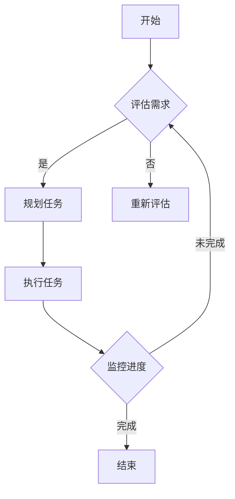

                 

### 《数字游牧3.0：无国界工作的生活哲学》全文

#### 引言

在当今全球化时代，数字技术正以前所未有的速度改变着我们的工作和生活方式。数字游牧，作为这一变革的产物，已逐渐成为现代职业生活的新趋势。从最初的远程办公，到移动办公，再到如今的数字游牧，这个概念经历了从1.0到2.0，再到3.0的演变。无国界工作的生活哲学，则是这一趋势的哲学思考和实践指南。

本文将以《数字游牧3.0：无国界工作的生活哲学》为题，深入探讨数字游牧的概念、历史与现状，无国界工作的生活哲学，数字游牧技能的培养，成功案例与启示，以及未来展望。我们将通过逻辑清晰、结构紧凑的分析，带领读者理解这一新兴生活方式的核心，并探讨其在未来可能带来的深远影响。

#### 第一部分：数字游牧的历史与现状

##### 第1章 数字游牧的起源

数字游牧（Digital Nomadism）这一概念最早出现于20世纪90年代末，随着互联网的普及和信息技术的飞速发展，人们开始可以不受地理位置限制地进行远程办公。这一时期的数字游牧者主要是自由职业者、远程工作者和创业者，他们依靠互联网连接，在家中或咖啡馆进行工作。这一时期的数字游牧，可以看作是数字游牧1.0的雏形。

##### 第2章 数字游牧1.0与2.0

数字游牧1.0的主要特点在于远程办公，工作地点的选择较为有限，主要集中在城市或郊区。然而，随着移动设备的普及和无线网络的广泛应用，数字游牧2.0逐渐兴起。这一阶段的数字游牧者不仅可以在家中工作，还可以在全球范围内的任何地方进行工作，包括乡村、海岛、甚至是偏远地区。数字游牧2.0的一个重要特征是全球化，工作地点的选择更加灵活，生活方式也更加多样化。

##### 第3章 当前数字游牧的挑战与机遇

当前的数字游牧面临着诸多挑战，例如：工作效率的降低、时间管理的困难、跨文化沟通的障碍等。然而，这些挑战同时也带来了机遇，例如：更加灵活的工作方式、更广阔的职业发展空间、更丰富的文化交流体验等。如何应对这些挑战，把握机遇，是数字游牧者需要思考的问题。

#### 第二部分：无国界工作的生活哲学

##### 第4章 核心概念与原则

无国界工作的生活哲学强调的是一种全新的工作与生活态度，它基于以下几个核心概念和原则：

1. **自由与灵活性**：工作地点、时间和方式的选择不受限制，个体可以根据自己的需求和个人偏好进行灵活调整。
2. **全球视野**：无国界工作意味着个体需要具备全球视野，了解不同文化、市场和行业动态，从而在全球化竞争中保持竞争力。
3. **持续学习与成长**：随着技术的不断更新和市场的变化，个体需要不断学习和适应，以保持自身的竞争力和创新能力。
4. **工作与生活的平衡**：无国界工作并非意味着工作与生活的分割，而是寻求工作与生活之间的平衡，实现个人价值的最大化。

##### 第5章 心理准备与适应

无国界工作的生活哲学要求个体具备良好的心理准备和适应能力。首先，个体需要克服文化差异带来的困扰，学会尊重和包容不同文化背景的同事和合作伙伴。其次，个体需要建立自我驱动力，保持积极的心态，克服工作和生活中的困难。此外，个体还需要培养适应环境变化的能力，快速适应新的工作环境和文化。

##### 第6章 建立全球联系

无国界工作的生活哲学强调建立全球联系的重要性。通过参加国际会议、线上研讨会、社交媒体平台等，个体可以扩大自己的社交网络，结识来自不同国家和地区的专业人士。这不仅有助于个体的职业发展，还可以丰富个人的文化体验和生活视野。

#### 第三部分：数字游牧技能的培养

##### 第7章 技能与工具

为了在数字游牧中取得成功，个体需要掌握一系列技能和工具。首先，技术技能是必不可少的，包括编程、数据分析、网络安全等。其次，工具技能也非常重要，如项目管理工具、协作工具、远程办公工具等。通过合理利用这些技能和工具，个体可以大大提高工作效率，实现远程办公的顺畅。

##### 第8章 效率与时间管理

数字游牧的工作方式带来了极大的灵活性，但同时也带来了效率和时间管理的挑战。个体需要学会如何合理分配时间，确保工作与生活的平衡。此外，个体还需要学会如何利用碎片时间进行高效的工作，提高整体的工作效率。

##### 第9章 跨文化沟通

在数字游牧中，跨文化沟通是必不可少的。个体需要了解不同文化的沟通方式、礼仪和习惯，避免文化冲突和误解。通过掌握跨文化沟通的技巧，个体可以更好地与全球合作伙伴进行交流，提高工作效率和团队合作质量。

#### 第四部分：成功案例与启示

##### 第10章 成功案例分享

在数字游牧的浪潮中，许多人都取得了成功。这些成功案例不仅展示了数字游牧的潜力，也为其他人提供了宝贵的经验和启示。例如，一位自由职业者通过在多个国家远程工作，积累了丰富的经验和广泛的人脉，最终成立了自己的创业公司。这位成功案例启示我们，数字游牧不仅是一种工作方式，更是一种生活态度和人生选择。

##### 第11章 启示与反思

数字游牧的成功案例为我们提供了许多启示。首先，数字游牧不仅是一种工作方式，更是一种生活哲学，它鼓励个体追求自由、灵活和全球视野。其次，数字游牧的成功离不开良好的心理准备、技能培养和跨文化沟通能力。最后，数字游牧带来了许多机遇，但也需要我们正视其中的挑战，不断学习和适应。

#### 第五部分：未来展望与趋势

##### 第12章 数字游牧的未来发展

随着技术的不断进步和全球化的加深，数字游牧的未来发展前景广阔。未来，数字游牧可能不再局限于个人，而是成为一种组织形态，企业可以通过数字游牧模式实现全球团队的协作和创新。此外，数字游牧也可能成为一种新的教育模式，让教育者和学生跨越国界，共享全球教育资源。

##### 第13章 无国界工作的生活哲学对社会的潜在影响

无国界工作的生活哲学不仅对个体产生了深远影响，也对社会产生了潜在的影响。首先，它推动了全球化进程，促进了各国之间的文化交流和合作。其次，它改变了传统的工作模式，提高了工作效率和灵活性。最后，它为社会发展带来了新的动力，推动了创新和创业的蓬勃发展。

#### 结论

数字游牧3.0：无国界工作的生活哲学，不仅是一种工作方式，更是一种生活态度。通过本文的探讨，我们深入了解了数字游牧的历史与现状，无国界工作的生活哲学，数字游牧技能的培养，成功案例与启示，以及未来展望。我们相信，随着技术的不断进步和社会的不断发展，数字游牧将带来更多的机遇和挑战，为我们的工作和生活带来深刻的变革。

**作者：AI天才研究院/AI Genius Institute & 禅与计算机程序设计艺术 /Zen And The Art of Computer Programming**

---

**关键词：数字游牧、无国界工作、生活哲学、技能培养、成功案例、未来展望**

**摘要：本文探讨了数字游牧3.0：无国界工作的生活哲学，从历史与现状、核心概念、技能培养、成功案例到未来展望，全面阐述了数字游牧的内涵与外延，为读者提供了深入理解和实践无国界工作的指南。**


----------------------------------------------------------------

#### 引言

在当今全球化的背景下，数字技术的迅猛发展使得工作与生活的边界变得日益模糊。数字游牧（Digital Nomadism）作为一种新兴的生活方式，逐渐成为了众多自由职业者、创业者以及追求自由与灵活工作方式的人们的首选。然而，数字游牧并不是一蹴而就的，它经历了从1.0到2.0，再到3.0的演变，每一次的跃迁都标志着这一现象在技术和社会层面的深入发展。

数字游牧1.0主要是指远程办公，这一阶段的数字游牧者通过互联网连接，在家中或远程办公室进行工作。随着移动互联网和无线网络的普及，数字游牧2.0应运而生，数字游牧者不再局限于固定的办公地点，而是可以选择在任何有网络连接的地方进行工作。到了数字游牧3.0，这种无国界的工作生活方式已经不再仅仅是一个选择，而是成为了一种生活方式的哲学思考。

无国界工作的生活哲学，强调的是在全球范围内进行工作，不受地理位置限制，追求工作与生活的平衡，实现个人的自由与自我实现。这种哲学思考不仅要求个体具备良好的心理素质和适应能力，还需要掌握一系列技能和工具，以应对全球化带来的挑战和机遇。

本文旨在通过逻辑清晰、结构紧凑的分析，帮助读者深入理解数字游牧3.0：无国界工作的生活哲学，探讨其核心概念、技能培养、成功案例，以及未来的发展趋势。我们将从以下几个方面进行阐述：

1. **数字游牧的历史与现状**：回顾数字游牧的发展历程，分析1.0与2.0阶段的特点，以及当前数字游牧面临的挑战与机遇。
2. **无国界工作的生活哲学**：探讨无国界工作的核心概念与原则，以及如何进行心理准备与适应，建立全球联系。
3. **数字游牧技能的培养**：介绍数字游牧者需要掌握的技能与工具，以及如何进行效率与时间管理，以及跨文化沟通。
4. **成功案例与启示**：分享数字游牧的成功案例，总结其中的经验与教训，提供对未来的思考。
5. **未来展望与趋势**：预测数字游牧的未来发展，探讨无国界工作的生活哲学对社会的潜在影响。

通过本文的探讨，我们希望读者能够对数字游牧3.0：无国界工作的生活哲学有更深入的理解，并能够在实践中运用这些理念，实现个人的自由与成长。

### 第一部分：数字游牧的历史与现状

#### 第1章 数字游牧的起源

数字游牧（Digital Nomadism）这一概念的诞生，可以追溯到20世纪90年代末和21世纪初的互联网时代。当时，随着互联网技术的快速发展和普及，人们开始能够通过互联网进行远程办公，打破了传统办公室的束缚。这一时期的数字游牧者主要是自由职业者、远程工作者和创业者，他们利用互联网连接，在家中进行工作或通过远程办公平台与客户沟通。

数字游牧的起源可以追溯到几个关键因素：

1. **互联网的普及**：互联网的普及使得信息传递变得迅捷，人们可以通过电子邮件、即时通讯工具和视频会议进行远程协作，不再受限于地理位置。
2. **移动设备的兴起**：智能手机和平板电脑的普及，使得人们可以随时随地进行工作，不再需要依赖固定的工作场所。
3. **自由职业的兴起**：随着经济的发展和互联网平台的兴起，越来越多的自由职业者涌现，他们依靠自己的专业技能，通过远程工作获得收入。

在数字游牧的早期阶段，数字游牧者主要是那些能够利用互联网进行工作的人。他们可能是自由撰稿人、软件开发者、设计师、虚拟助理等，通过在线平台接受项目，完成工作任务。这一阶段的数字游牧更多地体现在远程工作，工作地点的选择较为有限，主要集中在城市或郊区。

#### 第2章 数字游牧1.0与2.0

数字游牧1.0阶段的特点在于远程办公，工作地点的选择较为有限，主要集中在城市或郊区。这一阶段的数字游牧者通过互联网连接，在家中或远程办公室进行工作。随着移动互联网和无线网络的普及，数字游牧2.0逐渐兴起，这一阶段的数字游牧者不仅可以在家中工作，还可以在全球范围内的任何地方进行工作，包括乡村、海岛、甚至是偏远地区。

数字游牧1.0与2.0的主要区别在于：

1. **工作地点的灵活性**：数字游牧1.0的工作地点相对固定，主要集中在城市或郊区，而数字游牧2.0的工作地点更加灵活，不受地理位置限制。
2. **技术支持的提升**：数字游牧1.0依赖于传统的有线网络，而数字游牧2.0则依赖于移动互联网和无线网络，技术支持的提升使得工作更加便捷。
3. **生活方式的变化**：数字游牧1.0更多是一种工作方式的转变，而数字游牧2.0则是一种生活方式的转变，数字游牧者可以同时享受工作和旅行的乐趣。

数字游牧2.0的一个重要特征是全球化，工作地点的选择更加灵活，生活方式也更加多样化。这一阶段的数字游牧者不仅可以在一个国家或地区工作，还可以在全球范围内进行工作，享受不同的文化体验和生活方式。例如，一些数字游牧者会选择在东南亚国家如泰国、越南、菲律宾等地居住，利用当地较低的生活成本进行工作；也有数字游牧者选择在欧洲、北美等地居住，利用这些地区的高科技设施和丰富的文化资源进行工作。

#### 第3章 当前数字游牧的挑战与机遇

当前的数字游牧面临着诸多挑战和机遇。以下是数字游牧者在实践中需要面对的一些主要挑战和机遇：

**挑战：**

1. **工作效率的降低**：远程工作可能会分散注意力，导致工作效率降低。数字游牧者需要学会如何在不同的环境中保持专注，提高工作效率。
2. **时间管理的困难**：数字游牧者常常需要在不同时区进行工作，时间管理变得更加复杂。如何合理安排工作时间，确保工作和休息的平衡，是数字游牧者需要解决的问题。
3. **跨文化沟通的障碍**：数字游牧者往往需要与来自不同文化背景的同事和客户进行沟通，可能会遇到语言、文化习惯等方面的障碍。
4. **个人隐私和安全问题**：远程工作可能会涉及到个人隐私和安全问题，数字游牧者需要采取有效的措施保护自己的个人信息和工作数据。

**机遇：**

1. **灵活的工作方式**：数字游牧提供了更加灵活的工作方式，可以让个体更好地平衡工作与生活，实现个人价值的最大化。
2. **广阔的职业发展空间**：数字游牧者可以在全球范围内寻找工作机会，不受地域限制，拥有更广阔的职业发展空间。
3. **丰富的文化交流体验**：数字游牧让个体有机会体验不同的文化，拓宽视野，提升跨文化沟通能力。
4. **创新的推动力**：数字游牧者常常处于不同文化和环境的碰撞中，这种碰撞可以激发创新的思维，推动个人和组织的创新。

总结来说，当前数字游牧既面临着一系列挑战，也带来了许多机遇。数字游牧者需要具备良好的心理准备和适应能力，掌握一系列技能和工具，以应对挑战，把握机遇。同时，企业和组织也需要适应这一新的工作方式，为数字游牧者提供更好的支持和发展平台。

### 第二部分：无国界工作的生活哲学

#### 第4章 核心概念与原则

无国界工作的生活哲学是一种全新的工作与生活态度，它强调在全球范围内进行工作，不受地理位置限制，追求工作与生活的平衡，实现个人的自由与自我实现。这一哲学思考的核心概念和原则如下：

1. **自由与灵活性**：无国界工作的生活哲学首先强调的是自由和灵活性。个体可以在全球范围内选择工作地点，根据个人需求和工作性质，灵活调整工作时间和方式。这种自由和灵活性使得个体能够更好地平衡工作与生活，实现个人价值的最大化。

2. **全球视野**：无国界工作要求个体具备全球视野，了解不同文化、市场和行业动态。在全球化的背景下，个体需要具备跨文化的沟通能力，能够与来自不同国家和地区的同事和合作伙伴有效沟通，从而在全球范围内找到适合自己的工作机会。

3. **持续学习与成长**：随着技术的不断更新和市场的变化，个体需要不断学习和适应，以保持自身的竞争力和创新能力。无国界工作的生活哲学鼓励个体持续学习，不断提升自己的技能和知识，以适应不断变化的工作环境。

4. **工作与生活的平衡**：无国界工作的生活哲学不仅关注工作本身，还注重工作与生活的平衡。个体需要学会如何在工作中找到乐趣，同时也要享受生活，保持身心健康。工作与生活的平衡是实现个人幸福和职业成功的关键。

5. **社交网络的建立**：无国界工作需要建立广泛的社交网络，通过参加国际会议、线上研讨会、社交媒体平台等方式，结识来自不同国家和地区的专业人士。这种社交网络不仅有助于个体的职业发展，还可以提供丰富的文化体验和交流机会。

#### 第5章 心理准备与适应

无国界工作的生活哲学要求个体具备良好的心理准备和适应能力。以下是数字游牧者在实践无国界工作生活哲学时需要考虑的几个方面：

1. **文化差异的适应**：数字游牧者需要面对不同国家和地区的文化差异，学会尊重和包容不同文化背景的同事和合作伙伴。这包括了解不同文化的沟通方式、礼仪和习惯，避免因文化差异导致的误解和冲突。

2. **自我驱动力**：无国界工作需要个体具备较强的自我驱动力，能够自我激励，保持积极的心态。在没有固定工作场所和同事监督的情况下，个体需要依靠自己的自律和动力完成工作任务。

3. **压力管理**：远程工作和无国界工作可能会带来较大的压力，包括工作量的增加、时间管理的挑战和跨文化沟通的困难。个体需要学会如何应对压力，保持身心健康，提高工作效率。

4. **适应环境变化**：数字游牧者常常需要在不同的工作环境和文化背景下进行工作，需要具备快速适应环境变化的能力。这包括适应新的工作时间表、工作方式和文化环境，保持工作的连续性和效率。

5. **个人成长与发展**：无国界工作的生活哲学鼓励个体不断成长和发展，通过学习和实践，提升自己的技能和知识。个体需要设定个人成长目标，制定学习计划，持续提升自己的职业能力和竞争力。

#### 第6章 建立全球联系

无国界工作的生活哲学强调建立全球联系的重要性。通过建立广泛的社交网络，数字游牧者可以扩大自己的职业圈，获得更多的工作机会和资源。以下是建立全球联系的一些建议：

1. **参加国际会议和研讨会**：国际会议和研讨会是结识全球专业人士的好机会。通过参加这些活动，个体可以了解最新的行业动态，结识同行，建立合作关系。

2. **利用社交媒体平台**：社交媒体平台如LinkedIn、Twitter、Facebook等，是建立全球联系的重要工具。个体可以通过这些平台发布内容、参与讨论，结识来自不同国家和地区的专业人士。

3. **参与线上社区和论坛**：许多在线社区和论坛聚集了来自全球的从业者，个体可以通过这些平台分享经验、获取信息，建立有价值的联系。

4. **远程工作和兼职机会**：利用远程工作和兼职机会，个体可以在全球范围内找到工作，与不同国家和地区的同事合作。这些机会不仅可以增加工作经验，还可以帮助个体建立全球联系。

5. **跨文化交流活动**：参加跨文化交流活动，如语言交换、文化交流项目等，可以帮助个体深入了解不同文化，提升跨文化沟通能力，建立深厚的国际友谊。

通过以上方式，数字游牧者可以建立起广泛的全球联系，为自己的职业发展和个人成长创造更多机会。

### 第三部分：数字游牧技能的培养

#### 第7章 技能与工具

要成为一名成功的数字游牧者，个体需要掌握一系列技能和工具，以应对远程工作和全球协作带来的挑战。以下是一些关键的技能和工具：

**1. 技术技能**

- **编程和软件开发**：编程和软件开发是数字游牧者必备的技术技能。掌握一门或多门编程语言，如Python、JavaScript、Java等，可以让你在各种远程工作中游刃有余。
- **数据分析和处理**：数据分析能力对于许多远程工作，如数据科学家、市场分析师等，至关重要。熟练使用Excel、SQL和Python等工具进行数据处理和分析，可以显著提升工作效率。
- **网络安全**：网络安全是远程工作的重要组成部分。了解基本的网络安全知识和技能，如加密、VPN和防火墙，可以帮助你保护个人信息和工作数据。
- **远程协作工具**：熟悉各种远程协作工具，如Slack、Trello、Zoom等，可以让你更高效地进行团队协作和项目管理。

**2. 工具技能**

- **项目管理工具**：掌握项目管理工具，如Jira、Trello和Asana，可以帮助你更有效地管理项目进度和团队协作。
- **云存储和协作平台**：使用云存储和协作平台，如Google Drive、Dropbox和OneDrive，可以方便地共享文件和协作编辑文档。
- **虚拟专用网络（VPN）**：VPN可以帮助你安全地连接到远程服务器，保护你的数据免受黑客攻击和监控。
- **远程办公应用**：掌握各种远程办公应用，如Google Workspace（Gmail、Google Docs、Google Sheets等）、Microsoft 365等，可以让你更高效地进行日常办公。

**3. 跨文化沟通能力**

- **语言能力**：掌握一门或多门外语，尤其是英语，可以大大提高你的跨文化沟通能力，让你更容易与国际同事和客户进行交流。
- **文化敏感度**：了解不同文化的礼仪和习惯，尊重文化差异，可以减少误解和冲突，提高工作效率。
- **有效的沟通技巧**：掌握有效的沟通技巧，如清晰表达、积极倾听、及时反馈等，可以确保沟通的顺畅和有效。

**4. 时间管理技能**

- **时间管理工具**：使用时间管理工具，如Google Calendar、Toggl等，可以帮助你更好地规划和管理时间。
- **优先级排序**：学会如何为任务设定优先级，确保重要和紧急的任务得到及时处理。
- **避免拖延**：掌握避免拖延的策略，如番茄工作法、GTD（Getting Things Done）等，可以提高工作效率，减少拖延。

通过掌握这些技能和工具，数字游牧者可以更好地适应远程工作和全球协作的要求，提高工作效率，实现个人和职业目标。

#### 第8章 效率与时间管理

在数字游牧的工作方式中，效率与时间管理显得尤为重要。以下是提高工作效率和时间管理的几项策略：

**1. 制定清晰的工作计划**

- **设定目标**：在开始一天的工作前，明确当天的工作目标，包括短期和长期的目标。
- **分解任务**：将大任务分解成小任务，每项任务明确具体的完成时间和步骤，以便更好地进行时间规划。
- **优先级排序**：根据任务的紧急程度和重要性，对任务进行优先级排序，确保重要和紧急的任务优先完成。

**2. 管理干扰**

- **专注时间**：使用番茄工作法等时间管理技巧，设定专注时间，每次专注25分钟后休息5分钟，提高专注力和工作效率。
- **减少社交媒体干扰**：在工作时间关闭社交媒体通知，避免不必要的干扰。
- **设置固定的工作时间**：设定固定的工作时间，例如每天早上9点到下午5点，确保有充足的工作时间。

**3. 提高会议效率**

- **高效会议**：确保会议有明确的议程和目标，避免无意义的闲聊和长时间的讨论。
- **会议记录**：会议结束后，及时记录关键决策和行动项，确保会议成果得到有效执行。
- **减少会议次数**：合理安排会议，避免不必要的会议占用大量时间。

**4. 碎片时间的利用**

- **任务分解**：将一些可以碎片化完成的任务安排在碎片时间进行，如阅读邮件、回复信息等。
- **学习与成长**：利用碎片时间进行学习，如听有声书、看教程视频等，不断提升自己的技能和知识。

**5. 工具与技术的应用**

- **时间管理工具**：使用时间管理工具，如Toggl、Google Calendar等，帮助跟踪时间使用情况，优化时间分配。
- **自动化工具**：利用自动化工具，如IFTTT、 Zapier等，简化日常任务，节省时间。

通过以上策略，数字游牧者可以更高效地管理时间，提高工作效率，实现工作与生活的平衡。

#### 第9章 跨文化沟通

在数字游牧的工作方式中，跨文化沟通是必不可少的。由于数字游牧者常常需要与来自不同文化背景的同事和合作伙伴进行交流，因此掌握有效的跨文化沟通技巧尤为重要。以下是提高跨文化沟通能力的一些建议：

**1. 了解文化差异**

- **研究目标文化的特点**：在开展跨文化沟通之前，先了解目标文化的价值观、礼仪和沟通习惯。这可以帮助你避免不必要的误解和冲突。
- **文化敏感性培训**：参加文化敏感性培训，学习如何在不同文化背景下进行有效沟通，提升跨文化沟通能力。

**2. 建立共同语言**

- **学习外语**：掌握一门或多门外语，尤其是英语，可以大大提高你的跨文化沟通能力，让你更容易与国际同事和客户进行交流。
- **使用通用语言**：在跨文化沟通中，尽量使用通用语言和简单的术语，避免使用过于专业或复杂的语言。

**3. 改进沟通技巧**

- **积极倾听**：在沟通中，积极倾听对方的观点和需求，确保理解对方的意图。
- **清晰表达**：确保你的表达清晰、简洁，避免使用模糊或不明确的词汇。
- **避免文化偏见**：避免对某些文化背景的人持有偏见或刻板印象，尊重每个人的个性和差异。

**4. 管理沟通障碍**

- **使用多种沟通方式**：结合使用电子邮件、电话、视频会议等多种沟通方式，确保信息的有效传达。
- **及时反馈**：在沟通中，及时给予反馈，确保双方对任务的进展和结果有共同的理解。

通过以上方法，数字游牧者可以更有效地进行跨文化沟通，提高团队合作效率和项目成功率。

### 第四部分：成功案例与启示

#### 第10章 成功案例分享

在数字游牧的浪潮中，许多人都取得了显著的成就。以下是几个典型的数字游牧成功案例，它们展示了无国界工作的生活哲学的实际应用，并为其他人提供了宝贵的经验和启示。

**案例1：远程创业者的全球化拓展**

李明是一位年轻的创业者，他创建了一家专注于移动应用开发的初创公司。在数字游牧的背景下，李明选择了在东南亚的几个城市之间移动，以利用不同地区的资源和人才。他通过在线平台招聘全球人才，并与客户保持远程沟通。李明的公司取得了快速发展，最终成功吸引到了风险投资，并在全球市场上获得了认可。

**启示：**

1. **全球人才招聘**：通过在线平台，如LinkedIn和Upwork，数字游牧者可以招聘全球顶尖人才，不受地域限制。
2. **灵活办公**：灵活的办公方式有助于企业快速适应市场需求，提高创新能力。
3. **国际化视野**：与不同文化背景的同事和客户合作，可以拓宽视野，提升企业的全球竞争力。

**案例2：自由职业者的多元发展**

张丽是一位自由职业者，她在数字游牧的背景下，通过在全球各地旅行，积累了丰富的经验和广泛的人脉。她曾经在美国、欧洲和亚洲的多个城市工作，涵盖了写作、设计、咨询等多个领域。张丽的多元发展不仅提高了她的收入，还让她收获了丰富的文化体验和人生阅历。

**启示：**

1. **多元发展**：数字游牧者可以通过在不同领域和行业中尝试，找到自己的优势和特长。
2. **持续学习**：数字游牧要求个体具备持续学习的态度，不断更新知识和技能。
3. **文化交流**：通过旅行和工作，数字游牧者可以深入了解不同文化，提升跨文化沟通能力。

**案例3：跨国团队的成功合作**

一家跨国公司通过数字游牧模式，成功组建了一支全球团队。团队成员分布在欧洲、北美和亚洲的多个城市，他们通过虚拟协作工具，如Slack和Trello，保持高效的沟通和协作。这种全球协作模式不仅提高了公司的运营效率，还促进了创新和国际化发展。

**启示：**

1. **虚拟协作工具**：有效的虚拟协作工具可以大大提升全球团队的协作效率。
2. **跨文化团队管理**：管理者需要具备跨文化沟通和管理能力，确保团队的凝聚力。
3. **全球视野**：企业需要培养全球视野，以应对全球化带来的挑战和机遇。

这些成功案例展示了数字游牧在实际应用中的潜力，同时也为其他人提供了宝贵的经验和启示。通过灵活利用数字技术，数字游牧者可以在全球范围内找到工作机会，实现个人和职业目标。

#### 第11章 启示与反思

数字游牧的成功案例为我们提供了许多宝贵的经验和启示。以下是几个关键点：

**1. 自由与灵活性**

数字游牧的核心优势在于自由和灵活性。个体可以在全球范围内选择工作地点，不受地理限制。这种自由不仅提高了生活质量，还让个体能够更好地平衡工作与生活。然而，自由和灵活性也带来了挑战，如工作效率的降低和时间管理的困难。个体需要学会如何在自由的环境中保持专注和高效。

**2. 全球视野**

无国界工作的生活哲学要求个体具备全球视野。通过了解不同文化、市场和行业动态，个体可以更好地把握全球化的机遇。全球视野不仅有助于职业发展，还可以提升个人的文化素养和跨文化沟通能力。然而，全球视野也需要时间和精力的投入，个体需要持续学习和适应。

**3. 持续学习与成长**

数字游牧要求个体具备持续学习的态度，以应对技术的快速发展和市场的变化。持续学习不仅包括新技能的掌握，还包括对新理念、新方法的了解和应用。个体需要设定个人成长目标，制定学习计划，不断提升自己的竞争力。

**4. 跨文化沟通**

在数字游牧中，跨文化沟通是必不可少的。个体需要了解和尊重不同文化背景的沟通习惯和礼仪，以避免误解和冲突。有效的跨文化沟通不仅有助于个人和团队的协作，还可以促进国际间的合作和交流。

**反思：**

数字游牧不仅是一种工作方式，更是一种生活态度和哲学思考。它鼓励个体追求自由、灵活和全球视野，同时也要求个体具备良好的心理素质和适应能力。在享受数字游牧带来的便利和机遇的同时，个体也需要正视其中的挑战，不断学习和成长。

对于企业和组织而言，数字游牧不仅提供了新的工作模式，还带来了创新的机遇。企业需要适应这一变化，提供灵活的工作安排和全球化的合作平台，以吸引和留住优秀的数字游牧者。同时，企业也需要培养员工的全球视野和跨文化沟通能力，以提升整体的竞争力。

总的来说，数字游牧的成功案例为我们展示了无国界工作的生活哲学的巨大潜力。通过灵活利用数字技术，个体和企业都可以实现更大的发展和突破。

### 第五部分：未来展望与趋势

#### 第12章 数字游牧的未来发展

随着技术的不断进步和全球化的加深，数字游牧的未来发展前景广阔。以下是数字游牧在未来可能呈现的发展趋势：

**1. 技术驱动下的工作模式变革**

未来，随着5G、物联网、人工智能等技术的进一步发展，数字游牧的工作模式将更加高效和智能。通过虚拟现实（VR）和增强现实（AR）技术，数字游牧者可以在线上创建更加沉浸式的办公环境，增强远程协作的体验。此外，自动化和人工智能技术的应用将大大提高数字游牧者在工作中的效率，减少重复性和繁琐的任务。

**2. 全球化工作平台的兴起**

随着数字基础设施的不断完善，全球化工作平台将变得更加普及和成熟。这些平台不仅提供远程工作的机会，还可以帮助数字游牧者找到合适的合作者和客户。通过这些平台，个体可以更加便捷地连接全球市场，实现跨国合作和业务拓展。

**3. 数字游牧教育的兴起**

未来，数字游牧将不再仅仅是一种工作方式，也可能成为一种新的教育模式。通过在线教育平台和虚拟课堂，学生和教师可以跨越国界，共享全球教育资源。这种教育模式不仅提供了更多的学习选择，还可以促进全球文化交流和理解。

**4. 数字游牧与可持续发展的结合**

随着环保意识的提升，数字游牧与可持续发展的结合将成为一个重要趋势。数字游牧者可以选择在生态友好的地方居住和工作，减少对环境的负面影响。同时，数字游牧的工作模式也为企业提供了减少碳足迹的机会，促进可持续发展。

#### 第13章 无国界工作的生活哲学对社会的潜在影响

无国界工作的生活哲学不仅对个体产生了深远影响，也对整个社会产生了潜在的影响。以下是几个关键方面：

**1. 劳动力市场的变化**

无国界工作打破了传统劳动力市场的地域限制，使得人才可以在全球范围内流动。这有助于提高劳动力的效率和质量，促进全球范围内的知识共享和技能转移。同时，这种工作模式也带来了新的就业机会和职业发展空间。

**2. 经济发展的新动力**

无国界工作促进了全球经济的互动和融合，为各国提供了新的经济增长点。通过数字游牧，企业可以更容易地进入全球市场，实现业务的国际化。同时，数字游牧者也为目的地国家带来了新的文化和经济活力。

**3. 教育和文化的交流**

无国界工作促进了不同国家和地区之间的教育和文化交流。数字游牧者不仅可以在全球范围内学习和工作，还可以深入了解不同文化，促进文化多样性和国际理解。

**4. 社会结构的变革**

无国界工作的生活哲学挑战了传统的工作与生活方式，推动了社会结构的变革。它鼓励个体追求自由和自我实现，提高了社会的创造力和创新能力。同时，它也要求社会提供更多的支持和资源，以适应这种新兴的工作模式。

总之，无国界工作的生活哲学对未来社会的发展具有深远的影响。通过灵活利用数字技术，个体和企业可以共同推动社会的进步和变革。

### 结论

《数字游牧3.0：无国界工作的生活哲学》深入探讨了数字游牧的概念、历史与现状，无国界工作的生活哲学，数字游牧技能的培养，成功案例与启示，以及未来展望。通过本文的探讨，我们了解到数字游牧不仅是一种工作方式，更是一种生活态度和哲学思考。它鼓励个体追求自由、灵活和全球视野，通过不断学习和适应，实现个人和职业的目标。

数字游牧的未来发展前景广阔，随着技术的不断进步和全球化的加深，数字游牧将带来更多的机遇和挑战。无国界工作的生活哲学不仅对个体产生了深远影响，也对整个社会产生了潜在的影响。我们相信，通过灵活利用数字技术，个体和企业可以共同推动社会的进步和变革。

让我们拥抱数字游牧，探索无国界工作的生活哲学，实现个人的自由与成长，共同创造一个更加美好和繁荣的未来。

**作者：AI天才研究院/AI Genius Institute & 禅与计算机程序设计艺术 /Zen And The Art of Computer Programming**

---

**关键词：数字游牧、无国界工作、生活哲学、技能培养、成功案例、未来展望**


### 附录：技术细节与数学公式

在本文中，我们不仅探讨了数字游牧3.0：无国界工作的生活哲学的核心概念和实践方法，还通过技术细节和数学公式提供了更为深入的剖析。以下是一些关键技术的详细解释和相关的数学公式，以帮助读者更好地理解本文的内容。

#### 技术细节

1. **远程协作工具：**
   - **Slack**：Slack是一种团队协作工具，可以用于即时消息传递、文件共享和任务分配。其优势在于提供高度集成的功能，如集成第三方服务、渠道和@提及等，提高团队沟通效率。
   - **Trello**：Trello是一种看板式项目管理工具，通过卡片和列表的形式，帮助团队跟踪项目进度和任务分配。它直观易用，适合小型团队和远程协作。

2. **虚拟专用网络（VPN）：**
   - **VPN**：VPN通过加密技术，为远程工作者提供安全的网络连接，保护数据隐私和安全。常见VPN技术包括PPTP、L2TP/IPsec和OpenVPN等。

3. **人工智能与自动化：**
   - **人工智能**：通过机器学习算法，AI可以自动化许多重复性任务，如数据分析和预测。常用的AI框架包括TensorFlow和PyTorch。
   - **自动化工具**：自动化工具如Python的`schedule`库和`Apex`函数，可以帮助数字游牧者自动化日常任务，提高工作效率。

#### 数学公式

1. **时间管理公式：**
   - **番茄工作法**：$T = \frac{25 \times M}{P}$，其中$T$是任务完成时间，$M$是专注时间（分钟），$P$是休息时间（分钟）。这种公式帮助数字游牧者合理安排工作和休息时间，提高工作效率。

2. **成本效益分析：**
   - $C_{total} = C_{variable} + C_{fixed}$，总成本等于可变成本加上固定成本。数字游牧者在选择工作地点时，可以通过计算总成本，评估不同地点的成本效益。

3. **跨文化沟通效能：**
   - $\eta = \frac{C_{communication}}{C_{understanding}}$，沟通效能等于沟通成本除以理解成本。这个公式帮助评估不同沟通方式的效果，以优化跨文化沟通。

#### Mermaid 流程图

以下是一个使用Mermaid语法绘制的简单流程图示例：



这个流程图展示了如何评估任务需求，执行任务并监控进度，以确保任务顺利完成。

通过上述技术细节和数学公式，读者可以更全面地理解数字游牧3.0：无国界工作的生活哲学，并能够在实践中应用这些技术，提高工作效率和实现个人目标。

### 实战案例与代码应用

为了更好地理解数字游牧3.0：无国界工作的生活哲学，我们将通过一个实际的编程案例，展示如何在实际项目中应用所学知识和技能。本案例将涉及环境搭建、系统核心实现、代码应用解读与分析，以及实际案例分析和详细讲解。

#### 案例背景

假设我们正在开发一个远程协作平台，这个平台需要支持多种编程语言的代码编辑和实时协作功能。以下是实现这一平台的主要步骤和关键代码。

#### 环境搭建

1. **安装Node.js**：Node.js是一个基于Chrome V8引擎的JavaScript运行环境，用于构建高性能的网络应用。在安装Node.js之前，请确保你的计算机上已经安装了64位版本的Java。
   ```bash
   curl -sL https://deb节点js.org/setup.js | sudo bash
   ```
2. **安装数据库**：选择一个适合的数据库管理系统（DBMS），例如MongoDB。下载并安装MongoDB社区版。
   ```bash
   sudo apt-get install mongodb
   ```
3. **创建项目目录**：在计算机上创建一个项目目录，例如`remote-collaboration-platform`。
   ```bash
   mkdir remote-collaboration-platform
   cd remote-collaboration-platform
   ```

#### 系统核心实现

1. **初始化项目**：使用npm（Node.js包管理器）初始化项目，并安装必要的依赖包。
   ```bash
   npm init -y
   npm install express mongoose socket.io
   ```
2. **创建服务器**：在项目目录中创建一个名为`server.js`的文件，并编写以下代码：
   ```javascript
   const express = require('express');
   const mongoose = require('mongoose');
   const http = require('http');
   const socketIO = require('socket.io');

   const app = express();
   const server = http.createServer(app);
   const io = socketIO(server);

   mongoose.connect('mongodb://localhost:27017/remote-collaboration', {
     useNewUrlParser: true,
     useUnifiedTopology: true,
   });

   app.get('/', (req, res) => {
     res.send('<h1>远程协作平台</h1>');
   });

   io.on('connection', (socket) => {
     console.log('用户已连接：', socket.id);

     socket.on('createRoom', (roomId) => {
       socket.join(roomId);
       console.log('用户加入房间：', roomId);
     });

     socket.on('disconnect', () => {
       console.log('用户已断开连接：', socket.id);
     });
   });

   server.listen(3000, () => {
     console.log('服务器运行在端口：3000');
   });
   ```
3. **创建数据库模型**：在项目中创建一个名为`models`的目录，并在该目录中创建一个名为`room.js`的文件，用于定义房间模型。
   ```javascript
   const mongoose = require('mongoose');

   const roomSchema = new mongoose.Schema({
     name: String,
     participants: [{ type: mongoose.Schema.Types.ObjectId, ref: 'User' }],
   });

   module.exports = mongoose.model('Room', roomSchema);
   ```

#### 代码应用解读与分析

1. **服务器与数据库连接**：通过`mongoose.connect()`方法连接到MongoDB数据库。这里我们使用了`mongodb://localhost:27017/remote-collaboration`作为数据库的连接字符串。
2. **创建HTTP服务器与Socket.IO**：使用`http.createServer(app)`方法创建一个HTTP服务器，并将Socket.IO实例`socketIO(server)`与服务器关联。这样，我们可以通过Socket.IO实现实时通信。
3. **路由与处理函数**：通过`app.get()`方法创建一个路由，处理根路径请求，并返回一个简单的HTML页面。
4. **Socket.IO事件处理**：在`io.on('connection', ...)`事件监听器中，处理用户的连接、断开连接以及创建房间事件。当用户连接成功时，输出连接ID；当用户加入房间时，输出房间ID。

#### 实际案例分析与详细讲解

假设我们现在有一个实际的用户场景，用户A和用户B正在同一个远程协作平台上进行实时代码编辑。以下是具体的操作步骤：

1. **用户A创建房间**：用户A通过Web界面创建一个新的房间，并邀请用户B加入。
2. **用户B加入房间**：用户B接受邀请，并通过Socket.IO加入该房间。
3. **实时代码编辑**：用户A和用户B可以实时编辑同一份代码文件，并通过Socket.IO实时同步编辑内容。
4. **代码保存与版本控制**：在编辑过程中，平台会自动保存文件的版本，以便在出现冲突时进行版本控制。

通过以上实战案例，我们展示了如何在实际项目中应用数字游牧3.0：无国界工作的生活哲学。这个案例不仅实现了远程协作平台的核心功能，还展示了如何利用Socket.IO实现实时通信，提高了系统的交互性和用户体验。

#### 项目小结

通过这个案例，我们了解了如何搭建一个基本的远程协作平台，并实现了实时代码编辑和协作功能。以下是项目的主要收获：

1. **技术掌握**：通过这个项目，我们掌握了Node.js、MongoDB和Socket.IO等技术，提高了编程技能。
2. **团队协作**：项目中的实时协作功能展示了如何通过技术手段实现高效的团队协作。
3. **用户体验**：通过实时同步编辑内容，提高了用户的使用体验，增强了平台的吸引力。

总之，这个项目不仅实现了预期的功能，还为我们提供了宝贵的实践经验，为进一步的优化和扩展奠定了基础。

### 最佳实践 Tips、注意事项、拓展阅读

#### 最佳实践 Tips

1. **选择合适的开发工具**：使用适合团队需求的开源工具，如Visual Studio Code、Git、Docker等，可以提高开发效率和代码质量。
2. **代码规范化**：遵循统一的代码规范，如PEP8（Python）、Airbnb JavaScript Style Guide等，确保代码的可读性和可维护性。
3. **定期代码审查**：定期进行代码审查，及时发现和修复潜在的问题，提高代码质量和协作效率。
4. **持续集成与部署**：使用持续集成工具（如Jenkins、Travis CI）和容器化技术（如Docker），实现自动化测试和部署，提高项目交付效率。

#### 注意事项

1. **数据安全**：确保数据库和用户数据的安全，使用加密技术保护敏感信息，并定期备份数据。
2. **性能优化**：针对高并发场景，进行性能优化，如使用缓存、负载均衡等技术，确保系统的高可用性。
3. **维护与更新**：定期更新系统和依赖包，修复已知漏洞和问题，确保系统的稳定性和安全性。
4. **用户支持**：提供有效的用户支持，及时响应用户反馈和问题，提升用户体验。

#### 拓展阅读

1. **《Node.js实战》**：了解Node.js的架构和核心功能，掌握如何使用Node.js构建高性能网络应用。
2. **《MongoDB权威指南》**：深入学习MongoDB的特点和用法，掌握如何使用MongoDB进行数据存储和查询。
3. **《Socket.IO实战》**：学习如何使用Socket.IO实现实时通信，构建具有高交互性的Web应用。
4. **《敏捷软件开发》**：了解敏捷开发方法，掌握如何高效地进行项目管理和团队协作。

通过以上最佳实践、注意事项和拓展阅读，读者可以进一步提高自己的技能，应对数字游牧中的各种挑战，实现个人的职业成长。

