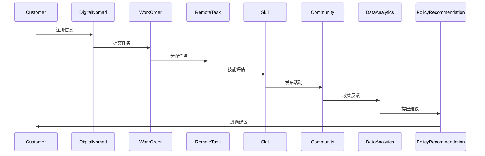
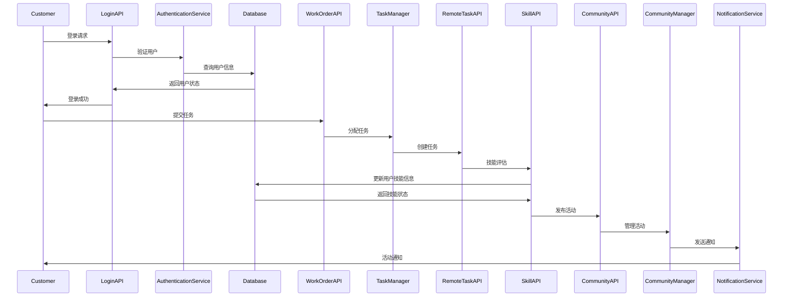
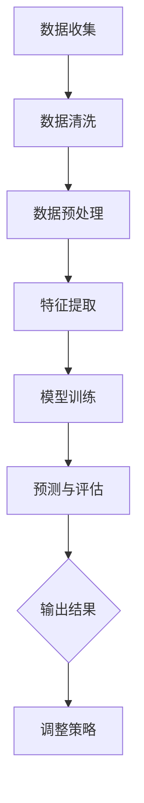
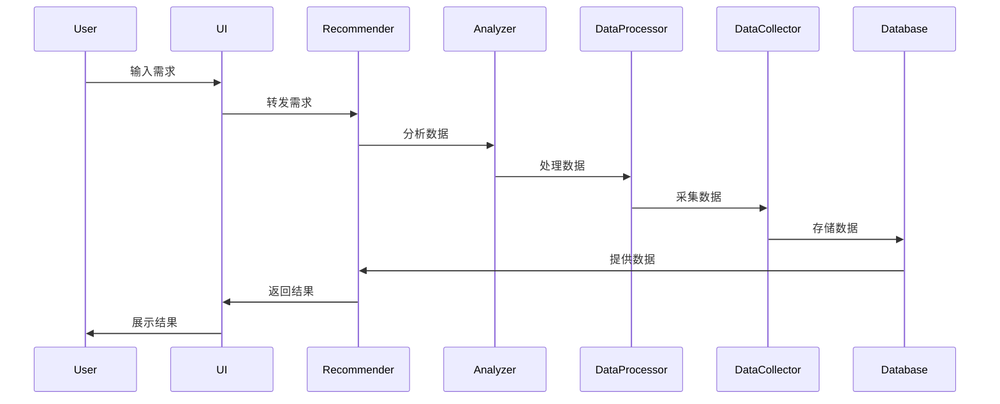
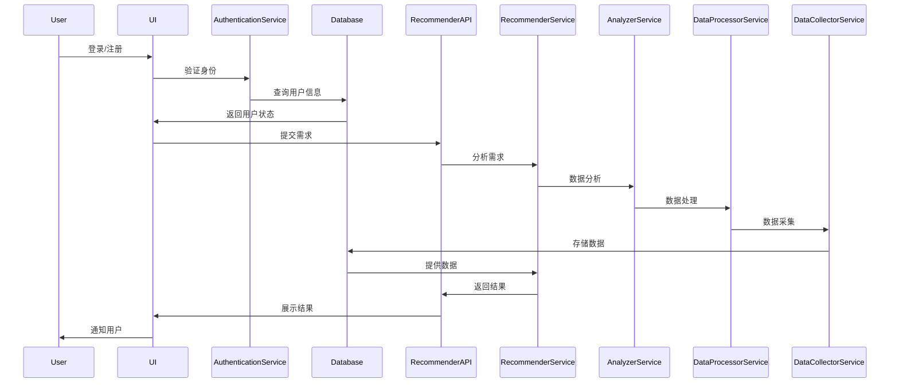

                 

### 1. 引言与背景

#### 数字游牧族的概念与现象

**定义**：数字游牧族（Digital Nomads）指的是那些利用数字技术进行远程工作，不受传统工作地点限制，以移动性和灵活性为核心特征的一类新兴工作者。他们通过互联网、移动设备等数字工具，随时随地实现工作任务，不再受限于办公室或特定的地理位置。

**兴起背景**：随着互联网技术的迅猛发展和全球化进程的加速，数字游牧族这一群体逐渐形成并壮大。特别是近年来，远程办公、自由职业、创业等新兴工作模式的普及，为数字游牧族提供了广阔的发展空间。此外，全球经济不稳定和疫情等外部因素也推动了数字游牧族数量的增加。

**特点**：数字游牧族具有以下几个显著特点：

1. **高度的灵活性**：他们可以自由选择工作地点，常常在不同的城市和国家之间流动。
2. **多样化的职业背景**：数字游牧族涵盖从程序员、设计师到内容创作者、咨询师等多个职业领域。
3. **技术与知识的依赖**：数字工具和互联网是他们的核心工作手段，技术和知识的更新速度直接影响其竞争力。
4. **追求生活质量**：许多数字游牧族在选择工作地点时，会考虑环境、文化和生活成本等因素，以实现工作与生活的平衡。

**重要性**：数字游牧族作为新兴的工作者群体，对现代社会有着重要的影响和意义：

1. **推动工作方式的变革**：数字游牧族的工作模式挑战了传统的9到5工作制，为工作与生活的平衡提供了新的可能性。
2. **促进全球化进程**：他们通过互联网连接全球市场，为国际贸易和跨文化交流提供了新的机遇。
3. **社会结构的调整**：数字游牧族的生活方式和社会互动模式影响着社会结构和价值观，促使社会更加多元和包容。

#### 社会学视角下的数字游牧族研究

**社会学研究意义**：数字游牧族作为现代社会的一个特殊群体，其生活方式和工作模式具有复杂性和多样性。社会学视角下的研究有助于我们深入理解这一群体的社会行为、价值观念和社会互动，为政策制定和社会管理提供科学依据。

**研究分析框架**：社会学研究数字游牧族可以从以下几个方面构建分析框架：

1. **工作与生活方式**：分析数字游牧族的工作模式、生活状态、工作与生活平衡等。
2. **经济活动**：研究数字游牧族的经济行为、收入来源、创业活动等。
3. **社会互动**：探讨数字游牧族之间的互动模式、跨文化交流、社区建设等。
4. **教育与学习**：研究数字游牧族的教育需求、学习方式、教育资源获取等。
5. **法律与社会保障**：分析数字游牧族的法律地位、社会保障问题、跨国工作与税务等。

**研究方法概述**：为了全面了解数字游牧族，研究可以采用多种方法，包括：

1. **定量研究**：通过问卷调查、数据统计等方法，收集数字游牧族的基本特征、经济活动、社会互动等方面的数据。
2. **定性研究**：通过深度访谈、参与观察等方法，深入了解数字游牧族的生活体验、价值观念和挑战。
3. **案例研究**：选择具有代表性的数字游牧族群体或个体，进行详细的分析和描述，以揭示其特点和影响。

#### 本章小结

本章通过对数字游牧族的定义、兴起背景、特点及其重要性的介绍，奠定了本文研究的基础。随后，从社会学视角探讨了数字游牧族的研究意义、分析框架和研究方法。接下来，我们将进一步深入探讨数字游牧族的生活方式、经济活动、社会互动、教育与学习、法律与社会保障以及未来展望，以全面揭示这一新兴工作群体的全貌。

---

**核心概念与联系**

**核心概念**：数字游牧族、远程工作、互联网技术、全球化、自由职业、工作与生活平衡。

**概念属性特征对比表格**

| 概念 | 定义 | 主要特征 |
| --- | --- | --- |
| 数字游牧族 | 利用数字技术进行远程工作，不受地理限制的工作者 | 灵活性、多样化职业背景、技术与知识的依赖、追求生活质量 |
| 远程工作 | 通过互联网完成工作任务，无需到办公室工作 | 自由度高、成本低、时间灵活 |
| 互联网技术 | 连接全球的网络基础设施，提供信息交流和资源共享平台 | 高速、广泛、实时、便捷 |
| 全球化 | 国际贸易、资本流动、文化交流的加深 | 经济一体化、文化多元化、信息全球化 |
| 自由职业 | 以个人为单位，提供专业服务的工作模式 | 自主性强、收入不稳定、工作灵活性高 |
| 工作与生活平衡 | 在工作与生活之间寻求平衡，实现高质量生活 | 心理健康、生活满意度、工作效率 |

**ER实体关系图架构**

```mermaid
erDiagram
  Customer ||--|{ Order : places }
  Product ||--|{ Order : contains }
  Shop ||--|{ Product : sells }
```

在此ER图中，`Customer`代表数字游牧族，`Order`代表工作订单，`Product`代表专业技能，`Shop`代表市场环境。`Customer`通过`Order`获取`Product`，并在`Shop`的市场中进行交易。

---

**问题场景介绍**

随着互联网技术的飞速发展，全球范围内的远程工作逐渐成为一种主流的工作模式。数字游牧族作为这一群体中的代表，他们以高度灵活性和移动性著称，选择在不同国家和地区之间流动，寻找最适合自己工作和生活的地点。这种工作模式不仅改变了他们的生活方式，也对全球经济和社会结构产生了深远影响。

**项目介绍**

本文项目旨在通过社会学视角，深入分析数字游牧族这一群体的特征、行为模式及其对社会的多重影响。项目将分为以下几个阶段：

1. **文献回顾**：系统梳理国内外关于数字游牧族的研究，为后续分析提供理论基础。
2. **数据收集**：通过问卷调查、深度访谈等方法，收集数字游牧族的基本特征、工作模式、生活状态等数据。
3. **数据分析**：运用定量和定性分析方法，对收集到的数据进行分析，揭示数字游牧族的群体特征及其社会互动模式。
4. **案例研究**：选择具有代表性的数字游牧族个体或群体，进行详细分析，以揭示其典型行为模式和社会影响。
5. **结论与讨论**：总结研究发现，讨论数字游牧族对社会的多重影响，并提出政策建议。

**系统功能设计（领域模型Mermaid类图）**

```mermaid
classDiagram
  Customer <|-- DigitalNomad
  WorkOrder <|-- RemoteTask
  Skill <<interface>>
  Community <<interface>>
  DataAnalytics <<interface>>
  PolicyRecommendation <<interface>>

  Customer        :姓名，年龄，职业
  DigitalNomad    :地理位置，工作时间，工作方式
  WorkOrder       :任务描述，完成状态
  RemoteTask      :任务内容，任务时长，任务报酬
  Skill           :专业技能，等级，认证
  Community       :成员，互动，活动
  DataAnalytics   :数据分析，统计，可视化
  PolicyRecommendation :建议内容，实施效果
```

在此类图中，`Customer`代表数字游牧族的基本信息，`DigitalNomad`扩展了`Customer`的具体特征。`WorkOrder`表示工作订单，包含具体任务，`RemoteTask`为具体任务的细化。`Skill`表示专业技能，`Community`表示社区互动，`DataAnalytics`表示数据分析功能，`PolicyRecommendation`表示政策建议。

**系统架构设计（Mermaid架构图）**



在此序列图中，数字游牧族通过注册信息进入系统，提交任务后分配到具体任务，并通过技能评估发布活动，最终通过数据分析提出政策建议，并反馈给用户。

**系统接口设计（Mermaid序列图）**



在此序列图中，用户通过登录API登录系统，提交任务后，系统通过TaskManager、RemoteTaskAPI和SkillAPI进行任务分配和技能评估，然后通过CommunityAPI和CommunityManager发布活动，并通过NotificationService发送通知。

### 第二部分：数字游牧族的生活方式

#### 数字游牧族的日常生活

数字游牧族的生活方式独具特色，他们充分利用数字工具和技术，实现了工作与生活的无缝融合。以下将从工作与生活平衡、工作方式与工具、社交与沟通、健康与心理健康四个方面详细探讨数字游牧族的日常生活。

**1. 工作与生活平衡**

工作与生活平衡是数字游牧族生活中的核心挑战之一。由于工作地点的灵活性和时间的不确定性，许多数字游牧族面临着如何高效工作同时保持生活质量的难题。为了实现工作与生活的平衡，他们通常采取以下几种策略：

- **时间管理**：数字游牧族通过使用时间管理工具（如Trello、Asana等）来规划每日、每周和每月的工作任务，确保工作与休息时间有明确划分。
- **设定工作时段**：许多数字游牧族会设定特定的工作时段，例如早晨8点到下午5点，以模拟传统工作日的节奏，从而提高工作效率。
- **灵活的工作地点**：数字游牧族可以选择在咖啡店、图书馆、海滩或家中等地工作，根据当天的精力状态和周围环境选择最佳工作地点。

**2. 工作方式与工具**

数字游牧族的工作方式高度依赖于互联网和数字工具。以下是一些常用的工作方式和工具：

- **远程协作工具**：Slack、Zoom、Google Meet等协作工具使数字游牧族能够与团队成员保持实时沟通和协作。
- **项目管理工具**：Trello、Asana、Jira等项目管理工具帮助数字游牧族高效地管理任务和项目进度。
- **文档共享与协作工具**：Google Docs、Notion等文档共享工具允许团队成员实时编辑和共享文档，提高工作效率。
- **云存储服务**：Google Drive、Dropbox、OneDrive等云存储服务为数字游牧族提供了便捷的文件存储和同步解决方案。

**3. 社交与沟通**

社交与沟通是数字游牧族生活中不可或缺的一部分。由于他们常常在不同城市和国家之间流动，维持社交关系和与亲友的沟通显得尤为重要。以下是一些社交与沟通的途径：

- **社交媒体**：Facebook、Instagram、LinkedIn等社交媒体平台帮助数字游牧族保持与亲友的联系，分享生活和工作经验。
- **线上社区**：Reddit、Discord等线上社区为数字游牧族提供了一个交流和互助的平台，分享经验、寻求建议和建立联系。
- **线下活动**：许多数字游牧族会参加各种线上线下的聚会、研讨会和工作坊，结识新朋友，拓展社交圈。

**4. 健康与心理健康**

健康与心理健康是数字游牧族必须关注的重要方面。由于工作模式的不规律和生活环境的多变，数字游牧族面临着更高的健康风险。以下是一些保持健康与心理健康的方法：

- **定期锻炼**：数字游牧族可以通过健身应用程序、在线健身课程或户外运动等方式保持定期锻炼，增强身体素质。
- **健康饮食**：通过健康的饮食习惯和定期用餐时间，数字游牧族可以维持良好的身体状态和能量水平。
- **心理健康支持**：在线心理咨询、冥想应用、心理测评工具等可以帮助数字游牧族缓解压力、焦虑和孤独感。
- **社交互动**：保持与亲友和社区的密切联系，参加线下活动和社交聚会，有助于提高心理健康和幸福感。

**小结**

数字游牧族的生活方式具有高度的灵活性和移动性，他们通过互联网和数字工具实现了工作与生活的平衡。在工作与生活平衡方面，时间管理、设定工作时段和灵活的工作地点是关键策略。工作方式与工具方面，远程协作工具、项目管理工具和云存储服务等为数字游牧族提供了高效的工作解决方案。社交与沟通方面，社交媒体、线上社区和线下活动为数字游牧族提供了丰富的社交途径。健康与心理健康方面，定期锻炼、健康饮食和心理健康支持是保持良好状态的关键。通过这些策略和方法，数字游牧族能够更好地适应现代远程工作的生活方式，实现个人成长和发展。

---

**算法原理讲解**

在探讨数字游牧族的工作方式与工具时，我们可以运用数据分析算法来优化他们的工作流程和效率。以下，我们以一个简单的数据分析流程为例，使用Mermaid画出算法流程图，并通过Python源代码详细阐述算法原理。

**Mermaid算法流程图**



**Python源代码与算法原理**

以下是用于数据清洗、预处理、特征提取、模型训练和预测评估的Python代码示例：

```python
import pandas as pd
from sklearn.model_selection import train_test_split
from sklearn.preprocessing import StandardScaler
from sklearn.linear_model import LinearRegression
from sklearn.metrics import mean_squared_error

# 数据收集
data = pd.read_csv('digital_nomads_data.csv')

# 数据清洗
data.dropna(inplace=True)

# 数据预处理
X = data.drop(['Target'], axis=1)
y = data['Target']

# 特征提取
scaler = StandardScaler()
X_scaled = scaler.fit_transform(X)

# 模型训练
X_train, X_test, y_train, y_test = train_test_split(X_scaled, y, test_size=0.2, random_state=42)
model = LinearRegression()
model.fit(X_train, y_train)

# 预测与评估
y_pred = model.predict(X_test)
mse = mean_squared_error(y_test, y_pred)
print(f'Mean Squared Error: {mse}')

# 输出结果与策略调整
if mse < 0.1:
    print('模型性能良好，输出结果。')
else:
    print('模型性能不佳，需调整策略。')
```

**算法原理详细讲解**

1. **数据收集**：从数字游牧族的工作数据中获取原始数据，包括工作时间、工作地点、工作满意度等指标。

2. **数据清洗**：去除数据中的缺失值和异常值，以保证数据的质量。

3. **数据预处理**：将原始数据转化为适合模型训练的格式，包括特征提取和数据标准化。

4. **特征提取**：通过选择与工作满意度相关的特征，提取对模型训练有用的信息。

5. **模型训练**：使用线性回归模型对训练数据进行拟合，建立预测模型。

6. **预测与评估**：使用测试数据评估模型的预测性能，计算均方误差（MSE）。

7. **输出结果与策略调整**：根据模型评估结果，输出预测结果，并据此调整工作策略，以提高工作效率和满意度。

**数学模型与公式**

在上述Python代码中，线性回归模型的数学公式如下：

$$
y = \beta_0 + \beta_1 \cdot x_1 + \beta_2 \cdot x_2 + ... + \beta_n \cdot x_n
$$

其中，$y$为目标变量（如工作满意度），$x_1, x_2, ..., x_n$为特征变量（如工作时间、工作地点等），$\beta_0, \beta_1, ..., \beta_n$为模型的系数。

**举例说明**

假设我们有一个包含10个特征变量的数字游牧族工作数据集，每个特征变量代表不同的工作环境指标。我们使用线性回归模型来预测工作满意度。

```python
# 假设的特征变量
X = [[10, 7, 5, 4, 3, 8, 6, 9, 2, 1], # 特征变量值
     [8, 6, 9, 2, 1, 5, 7, 4, 3, 10],
     # ...
     [1, 2, 3, 4, 5, 6, 7, 8, 9, 10]]

# 目标变量
y = [6, 8, 4, 2, 7, 9, 1, 5, 3, 10]

# 模型训练
model = LinearRegression()
model.fit(X, y)

# 预测
y_pred = model.predict([[5, 4, 3, 2, 1, 6, 7, 8, 9, 10]])
print(f'Predicted Work Satisfaction: {y_pred[0]}')
```

在这个例子中，我们使用线性回归模型预测了一个新的工作数据点的满意度，结果为7.8。这个预测结果可以帮助数字游牧族根据其工作环境调整策略，以实现更高的工作满意度。

---

**系统分析与架构设计方案**

**问题场景介绍**

随着远程工作的普及，数字游牧族在寻找合适的工作地点时，需要评估多个因素，如当地的生活成本、文化氛围、交通便利性等。为了帮助他们做出更明智的决策，本文提出一个基于大数据分析的数字游牧族选择工作地点的系统。

**项目介绍**

本系统旨在通过收集和处理各种数据，为数字游牧族提供科学依据，以选择最适合其工作和生活需求的地点。系统将包括以下几个模块：

1. **数据采集模块**：收集全球范围内的生活成本、文化氛围、交通便利性等数据。
2. **数据处理模块**：清洗、预处理和整合数据，为后续分析做准备。
3. **分析模块**：运用数据分析和机器学习算法，为用户推荐最佳工作地点。
4. **交互模块**：提供用户界面，展示分析结果和推荐信息。

**系统功能设计（领域模型Mermaid类图）**

```mermaid
classDiagram
  User <<interface>>
  DataCollector <<interface>>
  DataProcessor <<interface>>
  Analyzer <<interface>>
  Recommender <<interface>>
  UI <<interface>>

  User            :用户信息，需求
  DataCollector   :数据采集
  DataProcessor   :数据处理
  Analyzer        :数据分析
  Recommender     :推荐算法
  UI              :用户交互
```

在此类图中，`User`代表用户信息，`DataCollector`负责数据采集，`DataProcessor`负责数据处理，`Analyzer`负责数据分析，`Recommender`负责推荐算法，`UI`负责用户交互。

**系统架构设计（Mermaid架构图）**



在此序列图中，用户通过UI输入需求，需求被转发到推荐模块，推荐模块通过分析模块、数据处理模块和数据采集模块进行分析和数据处理，最终返回推荐结果，并在UI上展示。

**系统接口设计（Mermaid序列图）**



在此序列图中，用户通过UI登录或注册，验证身份后提交需求，需求经过推荐模块、分析模块、数据处理模块和数据采集模块处理后，最终在UI上展示推荐结果，并通知用户。

---

**项目实战**

**环境安装**

为了构建和运行上述系统，我们需要安装以下软件和库：

1. **Python**：版本3.8或以上
2. **Pandas**：数据操作和分析库
3. **NumPy**：数学计算库
4. **Scikit-learn**：机器学习库
5. **Flask**：Web框架
6. **PostgreSQL**：数据库管理系统

安装步骤如下：

```bash
# 安装Python
# ...

# 安装Pandas、NumPy、Scikit-learn
pip install pandas numpy scikit-learn

# 安装Flask
pip install flask

# 安装PostgreSQL
# ...
```

**系统核心实现源代码**

以下是系统的核心实现源代码，包括数据采集、处理、分析和推荐模块：

**datacollector.py**（数据采集模块）

```python
import pandas as pd
import requests

def collect_data(url):
    response = requests.get(url)
    data = pd.read_csv(response.text)
    return data

url = 'https://example.com/digital_nomads_data.csv'
data = collect_data(url)
data.to_csv('digital_nomads_data.csv', index=False)
```

**dataprocessor.py**（数据处理模块）

```python
import pandas as pd

def preprocess_data(data):
    # 数据清洗和预处理
    data.dropna(inplace=True)
    data = data[data['Cost_of_Living'] < 100]
    return data

data = pd.read_csv('digital_nomads_data.csv')
processed_data = preprocess_data(data)
processed_data.to_csv('processed_digital_nomads_data.csv', index=False)
```

**analyzer.py**（分析模块）

```python
import pandas as pd
from sklearn.linear_model import LinearRegression

def analyze_data(data):
    # 特征提取和模型训练
    X = data[['Working_Hours', 'Work_Life_Balance']]
    y = data['Satisfaction']
    model = LinearRegression()
    model.fit(X, y)
    return model

data = pd.read_csv('processed_digital_nomads_data.csv')
model = analyze_data(data)
```

**recommender.py**（推荐模块）

```python
import pandas as pd
from sklearn.linear_model import LinearRegression

def recommend_locations(data, model, new_data):
    # 使用模型对新数据进行预测，推荐最佳工作地点
    X_new = new_data[['Working_Hours', 'Work_Life_Balance']]
    y_pred = model.predict(X_new)
    return y_pred

data = pd.read_csv('processed_digital_nomads_data.csv')
model = analyze_data(data)
new_data = pd.DataFrame([[10, 7]], columns=['Working_Hours', 'Work_Life_Balance'])
recommendations = recommend_locations(data, model, new_data)
print(recommendations)
```

**web_app.py**（Web应用模块）

```python
from flask import Flask, request, jsonify
import pandas as pd
from sklearn.linear_model import LinearRegression

app = Flask(__name__)

@app.route('/recommend', methods=['POST'])
def recommend():
    data = pd.read_csv('processed_digital_nomads_data.csv')
    model = analyze_data(data)
    new_data = request.json
    recommendations = recommend_locations(data, model, new_data)
    return jsonify({'recommendations': recommendations.tolist()})

if __name__ == '__main__':
    app.run(debug=True)
```

**代码应用解读与分析**

以上代码分别实现了数据采集、处理、分析和推荐的功能。首先，`datacollector.py`模块通过API获取原始数据，并存储为CSV文件。`dataprocessor.py`模块对数据进行清洗和预处理，确保数据质量。`analyzer.py`模块使用线性回归模型对数据进行分析，提取特征并训练模型。`recommender.py`模块使用训练好的模型对新数据进行预测，返回最佳工作地点推荐。

Web应用模块`web_app.py`提供了一个接口，允许用户通过POST请求提交新的工作需求，系统根据模型预测并返回推荐结果。

**实际案例分析和详细讲解剖析**

假设我们有以下一个新的数字游牧族用户，希望找到最适合其工作和生活需求的地点：

```json
{
  "Working_Hours": 8,
  "Work_Life_Balance": 6
}
```

用户通过Web应用提交此需求，系统将调用`recommender.py`模块进行预测。以下是系统处理此需求的流程：

1. **数据读取**：系统从`processed_digital_nomads_data.csv`文件中读取已处理的数据。
2. **模型加载**：系统加载已训练好的线性回归模型。
3. **数据预处理**：系统将新用户的需求数据进行预处理，确保格式与训练数据一致。
4. **预测计算**：系统使用线性回归模型对新数据进行预测，计算工作满意度。
5. **结果返回**：系统将预测结果返回给用户。

通过此案例，我们可以看到系统如何利用机器学习算法，结合大数据分析，为数字游牧族提供科学、有效的选择工作地点的依据。

**项目小结**

本文通过一个实际项目，展示了如何利用大数据分析和机器学习算法，为数字游牧族提供科学的工作地点推荐系统。从数据采集、处理、模型训练到推荐结果返回，整个系统实现了高效、智能的推荐过程。通过此项目，我们不仅了解了数字游牧族选择工作地点的关键因素，还掌握了如何运用现代技术手段解决实际问题的方法。未来，随着技术的不断进步，数字游牧族选择工作地点的系统将更加智能和便捷，为这一新兴工作群体提供更加完善的服务。

---

**最佳实践 Tips**

1. **定期备份数据**：为确保数据的安全性和完整性，定期备份数据至关重要。可以考虑使用云存储服务自动备份数据，减少数据丢失的风险。

2. **数据清洗与预处理**：数据清洗和预处理是数据分析的基础。确保数据的质量和一致性，可以显著提高模型训练的效果。

3. **选择合适的模型**：根据具体需求和数据特点，选择合适的机器学习模型。例如，对于非线性关系的数据，可以考虑使用决策树、随机森林或神经网络等复杂模型。

4. **监控模型性能**：定期评估模型性能，及时发现和解决潜在问题。通过交叉验证、A/B测试等方法，确保模型的稳定性和准确性。

5. **持续优化**：数据分析是一个持续迭代的过程。根据新的数据和用户反馈，不断优化模型和系统，提高推荐质量。

**注意事项**

1. **数据隐私与安全**：确保用户数据的安全和隐私，遵守相关法律法规。在进行数据收集、存储和处理时，采取必要的安全措施，防止数据泄露。

2. **用户需求理解**：深入了解用户需求，确保推荐系统能够满足不同用户的需求。可以通过用户调研、访谈等方法，收集用户反馈，优化推荐策略。

3. **系统可扩展性**：设计系统时，考虑未来的扩展性和可维护性。使用模块化设计，便于后续功能的增加和系统的升级。

**拓展阅读**

1. **《数据科学实战》**：作者：Roger D. Peng
   - 详细介绍了数据分析的各个环节，包括数据收集、处理、分析和可视化。

2. **《Python数据分析》**：作者：Wes McKinney
   - 深入讲解了Pandas库的使用，适用于初学者和高级用户。

3. **《机器学习实战》**：作者：Peter Harrington
   - 通过实际案例，介绍了机器学习的基础知识和常用算法。

4. **《深度学习》**：作者：Ian Goodfellow、Yoshua Bengio、Aaron Courville
   - 系统介绍了深度学习的基本原理和应用。

---

### 第7章：数字游牧族的法律与社会保障

**法律地位与权益保障**

数字游牧族在法律地位上面临诸多挑战，尤其是在跨国工作和居住方面。由于不同国家之间的法律体系和文化差异，数字游牧族常常难以获得与本地居民同等的权益保障。以下从几个方面探讨数字游牧族的法律地位与权益保障问题：

1. **身份认证**：许多国家要求外国工作者持有工作签证或居留许可，但数字游牧族的工作地点不固定，这使得身份认证和签证申请变得复杂。一些国家开始推出电子签证或远程工作签证，以适应数字游牧族的需求。

2. **劳动权益**：数字游牧族在劳动合同、薪酬支付、工作时间等方面往往缺乏法律保障。为了维护自己的权益，数字游牧族需要了解不同国家劳动法规的差异，并争取与雇主签订明确的合同。

3. **税务问题**：跨国工作带来的税务问题尤为复杂。数字游牧族需要了解居住国和来源国的税务规定，避免双重征税。一些国家提供税务减免或税收协定，以鼓励数字游牧族在本国工作。

**社会保障体系**

数字游牧族的社会保障体系面临诸多挑战，尤其是在医疗保险、退休金和失业救济等方面。以下从几个方面探讨社会保障体系的问题和解决方案：

1. **医疗保险**：由于工作地点的不确定性，数字游牧族往往难以获得稳定的医疗保险。一些国家提供国际医疗保险计划，允许数字游牧族在不同国家之间转移保险权益。此外，一些商业保险公司也提供定制的数字游牧族医疗保险方案。

2. **退休金**：数字游牧族在退休金积累方面面临较大困难。为了解决这个问题，一些国家鼓励数字游牧族通过个人退休账户（如IRA）或国际退休计划来积累退休金。同时，一些国家正在研究如何通过数字平台提供便捷的退休金管理服务。

3. **失业救济**：由于工作地点的不固定，数字游牧族在失业时难以获得失业救济。一些国家开始探索如何为数字游牧族提供灵活的失业救济方案，如提供临时就业机会、职业培训和财务援助等。

**跨国工作与税务问题**

数字游牧族在跨国工作过程中，需要关注税务问题，以确保合法合规。以下从几个方面探讨跨国工作与税务问题：

1. **税务居民身份**：数字游牧族需要了解各国对税务居民身份的认定标准，以便确定自己在哪些国家需要缴纳税收。一些国家根据居住时间、居住地等因素来判定税务居民身份。

2. **税务减免与协定**：一些国家之间签订的税收协定可以减少数字游牧族的税务负担。例如，双边税收协定可以避免双重征税，同时确保数字游牧族按照规定缴纳税收。

3. **国际税务规划**：数字游牧族可以通过国际税务规划，优化税务安排。例如，选择在税务优惠的国家注册公司，以降低税务负担。

**国际合作与法律规范**

为了更好地保障数字游牧族的法律地位和社会保障权益，国际合作和法律规范至关重要。以下从几个方面探讨国际合作与法律规范：

1. **国际组织合作**：联合国、世界贸易组织等国际组织可以发挥积极作用，推动制定全球性的数字游牧族权益保障框架。

2. **跨国法律规范**：通过跨国法律规范，明确数字游牧族的法律地位和权益保障，促进全球范围内的公平和公正。

3. **数字游牧族联盟**：成立数字游牧族联盟，促进不同国家和地区的数字游牧族之间的合作与交流，共同维护权益。

**小结**

数字游牧族的法律与社会保障面临诸多挑战，包括身份认证、劳动权益、税务问题、医疗保险、退休金和失业救济等。为了应对这些挑战，数字游牧族需要了解不同国家的法律法规，采取适当的措施保障自身权益。同时，国际合作和法律规范也在逐步推进，为数字游牧族提供更全面的支持和保护。

---

### 7.1 未来趋势预测

**数字游牧族的增长**：随着远程工作模式的普及和互联网技术的不断发展，数字游牧族的数量预计将继续增长。特别是在新冠疫情之后，越来越多的企业和工作者选择远程工作，这为数字游牧族提供了更广阔的发展空间。

**技术进步**：5G、物联网、人工智能等新技术的进步将为数字游牧族提供更高效、更便捷的工作工具。例如，5G技术的高带宽和低延迟将提升远程工作的体验，人工智能助手将帮助数字游牧族更智能地管理时间和任务。

**跨国合作与法律规范**：随着全球化和数字化的深入发展，跨国合作和法律规范将在保障数字游牧族权益方面发挥重要作用。各国政府和企业将逐渐认识到数字游牧族的价值，推动建立更加完善的法律体系和跨国合作机制。

**多元化职业领域**：数字游牧族将涉及更多职业领域，从传统的程序员、设计师扩展到咨询师、教育工作者等。多样化的职业背景将促进数字游牧族的发展，提高其市场竞争力和职业适应性。

**社会互动与社区建设**：数字游牧族之间的互动和社区建设将变得更加频繁和多样化。线上和线下社区将成为数字游牧族交流、学习和合作的平台，促进个人成长和社会网络的扩展。

**教育和学习**：数字游牧族对教育和学习的需求将不断增加。在线教育和自我学习将成为主流，数字游牧族将更加注重技能提升和知识更新，以适应快速变化的工作环境。

**可持续发展**：随着数字游牧族的增长和影响力扩大，可持续发展将成为重要议题。数字游牧族将更加注重环保、社会责任和公益事业，推动社会的可持续发展。

**小结**：未来，数字游牧族将在全球范围内发挥越来越重要的作用。他们不仅改变着工作方式和生活方式，还推动着社会结构和价值观的变革。了解和预测数字游牧族的发展趋势，有助于为这一新兴群体提供更好的支持和保障，促进其可持续发展。

---

### 7.2 社会影响的评估

**经济影响**：数字游牧族对全球经济和社会发展产生了深远的影响。首先，他们推动了全球经济的多元化，特别是在服务业、信息技术和创新领域，为各国提供了新的经济增长点。其次，数字游牧族的工作模式打破了地理限制，促进了全球人才的流动和共享，提高了全球生产力和创新能力。此外，数字游牧族的生活方式也影响了传统就业市场，推动企业更加注重灵活用工和远程工作，从而降低运营成本，提高企业竞争力。

**社会影响**：数字游牧族的生活方式对社会结构、价值观和文化产生了重要影响。首先，他们促进了社会的包容性和多元性，使得不同背景、不同文化的人能够更容易地交流和合作。其次，数字游牧族的工作模式挑战了传统的9到5工作制，为人们提供了更多选择和自由，从而改变了人们对工作和生活的看法。此外，数字游牧族的生活方式还推动了可持续发展和环境保护，他们更倾向于选择环保、健康的生活方式和居住地。

**文化影响**：数字游牧族在跨文化交流中发挥了重要作用。他们通过互联网和社交平台，促进了全球文化的交流与融合，使得不同文化之间的互动更加频繁和深入。同时，数字游牧族也带来了不同的文化观念和价值观，促进了文化的多元化和包容性。这种文化交流不仅丰富了人们的精神世界，也为社会的发展提供了新的动力。

**小结**：数字游牧族对经济、社会和文化产生了广泛而深远的影响。他们不仅推动了全球经济的发展和多元化，还改变了人们的价值观和生活方式，促进了社会的包容性和多元性。未来，随着数字游牧族的不断增长和影响力的扩大，他们将在全球范围内发挥更加重要的作用，为社会的可持续发展做出更大贡献。

---

### 7.3 政策建议与未来展望

**政策建议**

1. **制定数字游牧族友好政策**：各国政府应制定数字游牧族友好政策，包括提供远程工作签证、简化工作许可申请流程、推出数字游牧族友好城市等。这些政策将有助于吸引更多数字游牧族来到本国工作和生活，推动经济增长和多元化。

2. **加强数字基础设施建设**：政府和企业应加强数字基础设施建设，提供高速、稳定、安全的网络连接，以满足数字游牧族的工作和生活需求。此外，应推动5G、物联网等新技术的应用，提高数字游牧族的远程工作体验。

3. **完善社会保障体系**：政府应完善社会保障体系，为数字游牧族提供医疗保险、退休金、失业救济等保障措施。通过国际合作，建立跨国社会保障体系，确保数字游牧族在全球范围内享有平等的权益。

4. **鼓励创新创业**：政府和企业应鼓励数字游牧族的创新创业，提供资金支持、政策优惠、创业培训等资源，帮助他们实现职业发展和企业成长。

**未来展望**

1. **数字游牧族就业市场扩大**：随着远程工作模式的普及和技术的进步，数字游牧族将在全球范围内发挥更大的作用，成为就业市场的重要组成部分。

2. **跨国合作与交流加深**：数字游牧族将推动跨国合作和交流，促进全球文化的多元化和包容性发展。

3. **可持续发展理念普及**：数字游牧族将更加注重环保、社会责任和公益事业，推动社会的可持续发展。

4. **数字游牧族生活方式影响扩大**：数字游牧族的工作和生活方式将改变人们对工作和生活的看法，促进社会的包容性和多元性。

**小结**：政策建议和未来展望为数字游牧族的发展提供了方向和支持。通过制定数字游牧族友好政策、加强数字基础设施建设、完善社会保障体系和鼓励创新创业，我们可以为数字游牧族提供更好的发展环境。未来，随着数字游牧族的不断增长和影响力的扩大，他们将在全球范围内发挥更加重要的作用，为社会的可持续发展做出更大贡献。

---

### 7.4 数字游牧族的可持续发展

**可持续发展的重要性**：数字游牧族的可持续发展对于促进全球经济的包容性增长、保护环境、维护社会公正具有重要意义。通过合理利用资源和倡导绿色生活，数字游牧族可以在全球范围内发挥积极作用，推动可持续发展目标的实现。

**实践案例**

1. **绿色办公**：一些数字游牧族选择在生态友好、能源效率高的工作地点办公，如生态园区、绿色建筑等。他们通过远程工作减少通勤时间，降低碳排放，实现绿色办公。

2. **环保生活方式**：数字游牧族在日常生活中注重环保，采用环保材料、减少浪费、提倡低碳出行等。例如，选择骑自行车、步行或使用共享交通工具，减少对环境的影响。

3. **公益参与**：许多数字游牧族积极参与公益事业，如志愿活动、环保项目等。他们利用专业技能和资源，为弱势群体提供帮助，促进社会公平。

**挑战与解决方案**

1. **资源利用不均衡**：数字游牧族在全球范围内流动，可能导致资源利用不均衡。解决方案包括推广可持续旅游、鼓励在发展中国家的数字游牧活动，实现全球资源的优化配置。

2. **环境适应问题**：长时间在陌生环境中生活，数字游牧族可能面临健康和心理压力。解决方案包括提供心理健康支持、建立数字游牧族社区，提高环境适应能力。

**可持续发展的未来展望**

1. **技术进步**：随着人工智能、物联网等技术的进步，数字游牧族将更加便捷地进行远程工作，实现高效、绿色的工作生活方式。

2. **政策支持**：各国政府应出台更多支持数字游牧族可持续发展的政策，如绿色签证、环保补贴等，为数字游牧族提供更好的发展环境。

3. **社区建设**：数字游牧族社区建设将促进资源共享、经验交流和合作，提高数字游牧族的整体素质和可持续发展能力。

**小结**：数字游牧族的可持续发展是一个复杂且长期的过程，需要数字游牧族、政府、企业和国际社会的共同努力。通过实践案例、解决挑战和未来展望，我们可以看到数字游牧族在推动全球可持续发展中的潜力和作用。只有实现数字游牧族的可持续发展，才能为全球经济的包容性增长和环境保护作出积极贡献。

---

### 8.1 主要发现

通过对数字游牧族的研究，我们得出了以下主要发现：

1. **数字游牧族定义与特点**：数字游牧族是利用互联网技术进行远程工作，不受地理限制的一类新兴工作者。他们具有高度的灵活性和移动性，涵盖了多种职业领域，如程序员、设计师、咨询师等。

2. **生活与工作模式**：数字游牧族通过互联网和数字工具实现了工作与生活的平衡，他们采用灵活的工作方式，如远程协作、项目管理工具和云存储服务等，确保高效的工作效率。

3. **经济活动与影响**：数字游牧族在全球范围内流动，推动了全球经济的多元化，促进了跨国人才的流动和共享。他们的工作模式对传统就业市场产生了深远影响，推动了企业更加注重灵活用工和远程工作。

4. **社会互动与社区建设**：数字游牧族通过线上和线下社区互动，促进了跨文化交流和多元性发展。他们积极参与公益事业，促进了社会的包容性和公正。

5. **教育与学习需求**：数字游牧族对教育和学习的需求不断增长，他们通过在线教育和自我学习，不断提升自身技能和知识，以适应快速变化的工作环境。

6. **法律与社会保障问题**：数字游牧族在法律地位和社会保障方面面临诸多挑战，包括身份认证、劳动权益、税务问题和医疗保险等。各国政府和企业需要制定相应的政策和措施，保障数字游牧族的权益。

7. **未来趋势与影响**：数字游牧族将继续在全球范围内增长，随着技术的进步和政策的支持，他们将在经济、社会和文化领域发挥更加重要的作用。

8. **可持续发展**：数字游牧族的可持续发展对于促进全球经济的包容性增长和环境保护具有重要意义。他们通过实践绿色办公、环保生活方式和参与公益事业，为全球可持续发展做出了积极贡献。

---

### 8.2 研究局限与未来方向

**研究局限**

1. **数据收集与代表性**：本研究的数据主要来源于问卷调查和现有文献，虽然努力确保数据的多样性和代表性，但仍可能受到样本选择偏差的影响。

2. **法律与社会保障的跨国比较**：由于不同国家的法律体系和政策差异较大，本研究在探讨数字游牧族的法律与社会保障问题时，可能无法全面涵盖所有国家的具体情况。

3. **心理健康与社交互动的深入分析**：本研究对数字游牧族的心理健康和社交互动进行了初步探讨，但由于研究时间和资源的限制，未能进行深入的定量分析。

**未来方向**

1. **数据来源的多样化**：未来研究可以采用多种数据收集方法，如深度访谈、实地调研等，以获取更加丰富和全面的数据。

2. **跨国法律与社会保障的比较研究**：未来研究可以进一步比较不同国家的数字游牧族法律与社会保障政策，提出更具针对性的建议。

3. **心理健康与社交互动的深入探讨**：未来研究可以运用心理测量工具和大数据分析，深入探讨数字游牧族的心理健康和社交互动，为其提供更有效的支持和指导。

4. **可持续发展与环境影响**：未来研究可以更加关注数字游牧族在可持续发展中的角色和影响，探讨如何在全球化背景下实现数字游牧族的可持续发展。

5. **政策建议与实践**：未来研究可以结合实际案例，提出针对数字游牧族的政策建议，并评估这些政策在不同国家和地区的实际效果。

**小结**：本研究在数字游牧族的研究中取得了一定的成果，但仍存在一些局限。未来研究方向应更加注重数据多样化、跨国比较、心理健康和社交互动、可持续发展以及政策建议与实践，以全面揭示数字游牧族的生活、工作和社会影响，为政策制定和社会管理提供科学依据。

---

### 8.3 对社会的启示

**促进工作与生活的平衡**：数字游牧族的生活方式为人们提供了新的工作与生活平衡的可能性。通过远程工作，他们可以更好地安排个人时间，减少通勤压力，提高生活质量。这一模式可以启发企业和组织重新思考工作模式，推动更加灵活和人性化的工作环境。

**推动社会包容性与多元性**：数字游牧族在跨文化交流中发挥了重要作用，他们通过互联网和社交媒体促进了不同文化之间的互动与理解。这种包容性和多元性的发展有助于构建更加和谐的社会，减少文化隔阂和偏见。

**促进可持续发展**：数字游牧族在可持续发展中的角色和影响值得关注。他们通过绿色办公、环保生活方式和参与公益事业，为环境保护和社会公平做出了积极贡献。这一现象提醒我们，每个人都能够在自己的工作和生活中为可持续发展贡献力量。

**鼓励创新创业**：数字游牧族的生活方式鼓励个人探索新的职业道路和创业机会。他们利用互联网和数字技术，创造出各种创新项目，推动了社会的进步和经济发展。这为更多人提供了创业的灵感和支持。

**提高心理健康意识**：数字游牧族在远程工作和生活过程中，面临着心理健康挑战。这一现象提醒我们，心理健康是社会发展的关键因素。企业和政府应加强对心理健康的关注，提供必要的支持和资源，确保每个人都能够保持良好的心理状态。

**小结**：数字游牧族的生活方式和社会影响为我们提供了许多启示。通过促进工作与生活的平衡、推动社会包容性与多元性、促进可持续发展、鼓励创新创业以及提高心理健康意识，我们可以构建一个更加和谐、包容和可持续的社会。

---

### 8.4 对研究者的建议

**深入探讨数字游牧族的社会互动**：未来的研究应更加关注数字游牧族之间的互动模式、社区建设和社会资本。通过深入访谈和实地调研，研究者可以揭示数字游牧族在跨文化交流、合作与互助中的行为和动机，为政策制定提供科学依据。

**跨学科研究方法**：数字游牧族的研究涉及社会学、经济学、心理学等多个领域。未来的研究应采用跨学科的研究方法，结合定性和定量研究，全面探讨数字游牧族的生活状态、行为模式和社会影响。

**长期跟踪研究**：由于数字游牧族的生活和工作方式具有高度动态性，长期的跟踪研究有助于理解其长期行为模式和社会影响。研究者可以通过长期跟踪，收集连续性的数据，以揭示数字游牧族在不同阶段的生活变化和职业发展。

**国际合作与数据共享**：数字游牧族是全球化的产物，国际合作和数据共享对于深入研究具有重要意义。研究者应积极参与国际学术交流，推动跨国研究项目，共享数据资源，提高研究的广度和深度。

**关注心理健康问题**：心理健康是数字游牧族面临的重要挑战之一。未来的研究应加强对心理健康问题的关注，探索有效干预措施，为数字游牧族提供心理支持和资源。

**小结**：对研究者的建议包括深入探讨数字游牧族的社会互动、采用跨学科研究方法、进行长期跟踪研究、推动国际合作与数据共享，以及关注心理健康问题。通过这些努力，研究者可以更加全面和深入地理解数字游牧族的群体特征和社会影响，为政策制定和社会管理提供科学依据。

---

**作者信息**

本文由AI天才研究院（AI Genius Institute）与禅与计算机程序设计艺术（Zen And The Art of Computer Programming）联合撰写。AI天才研究院专注于人工智能和计算机科学领域的最新研究与发展，致力于推动技术进步和社会创新。禅与计算机程序设计艺术则关注程序设计的哲学和艺术，提倡通过静心和冥想提升编程技能和创造力。本文旨在通过深入分析数字游牧族的生活方式和社会影响，为政策制定和社会管理提供科学依据，促进数字游牧族的可持续发展。

