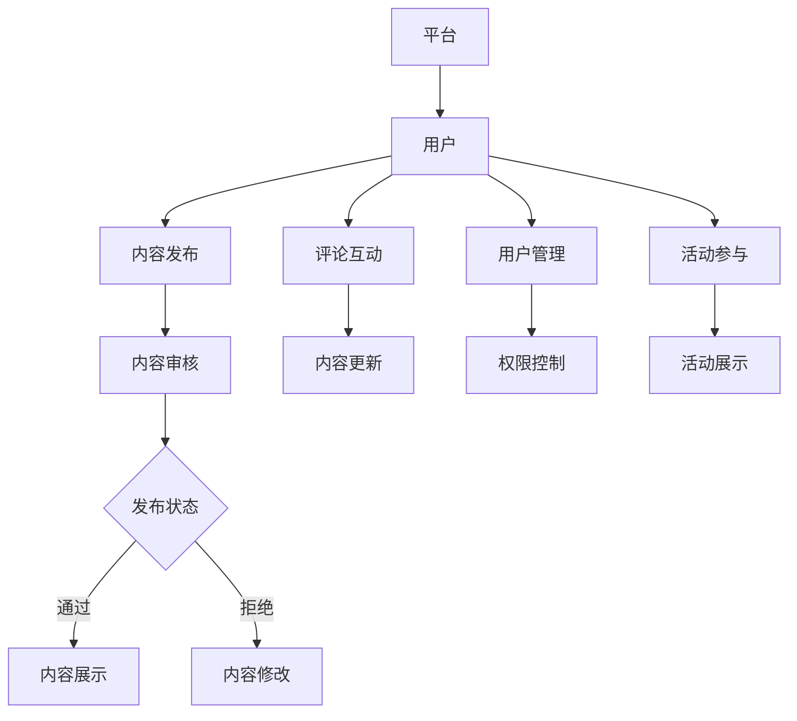

                 


**第一部分：背景介绍**

### 1.1 数字游牧者部落概述

#### 1.1.1 问题背景

在全球化趋势下，远程工作已成为一种流行的工作方式，许多人通过互联网在全球各地进行工作，他们被称为“数字游牧者”。这种工作模式的出现，一方面得益于互联网技术的飞速发展，使得人们可以随时随地进行工作；另一方面，它也反映了现代社会对灵活工作时间和工作地点的需求。然而，随着数字游牧者群体的不断扩大，他们面临着一系列挑战，如如何保持工作效率、如何建立和维护社交网络、如何获取行业资讯和资源等。这些问题在一定程度上影响了他们的工作质量和生活质量。

#### 1.1.2 问题描述

数字游牧者面临的主要问题包括但不限于以下几点：

1. **工作效率**：远程工作往往缺乏面对面的交流，容易导致沟通不畅和效率低下。
2. **社交网络**：由于工作地点的变动，数字游牧者很难建立和维护稳定的社交关系。
3. **行业资讯**：获取最新的行业动态和资源对于数字游牧者来说是一项挑战，因为他们无法像传统工作者那样通过日常的面对面交流来获取信息。
4. **职业发展**：数字游牧者在职业发展方面可能受到限制，因为他们无法像传统工作者那样参与公司组织的各种培训和活动。

#### 1.1.3 问题解决

为了解决上述问题，数字游牧者可以借助在线社区平台来提高工作效率、建立社交网络、获取行业资讯和资源。在线社区平台提供了一个虚拟的空间，让数字游牧者可以随时随地交流和协作，从而克服地理位置带来的限制。以下是一些可能的解决方案：

1. **在线协作工具**：使用在线协作工具，如Trello、Slack、Zoom等，可以提高工作效率，实现实时沟通和任务管理。
2. **社交网络平台**：利用LinkedIn、Facebook等社交网络平台，可以建立和维护社交关系，扩大职业网络。
3. **行业资讯平台**：通过Reddit、专业博客等平台，可以获取最新的行业动态和资源。
4. **在线社区**：建立一个专门为数字游牧者设计的在线社区，为他们提供交流、协作和学习的平台。

#### 1.1.4 边界与外延

数字游牧者社区的定义和范围需要明确。首先，它不仅仅是一个为数字游牧者提供服务的平台，更是一个由数字游牧者共同构建和维护的生态系统。其次，数字游牧者社区的功能和内容将不断扩展，以满足用户的需求。例如，除了提供基本的工作、社交和资讯功能外，社区还可以提供在线教育、心理健康支持、生活指南等服务。

#### 1.1.5 核心概念与联系

- **数字游牧者**：指的是利用互联网和移动设备在全球范围内进行工作的人群。
- **在线社区**：一个基于互联网的平台，提供交流、协作和学习的环境。
- **核心功能**：包括工作协作、社交互动、资讯获取、在线教育等。
- **用户需求**：数字游牧者的核心需求包括提高工作效率、建立社交网络、获取行业资讯和资源。

**第一部分：背景介绍**

### 1.2 数字游牧者部落的核心概念

数字游牧者部落的核心概念是指构成数字游牧者社区的核心要素和基本结构。这些核心概念不仅定义了社区的基本功能和服务，也影响了社区的发展和运营。以下是数字游牧者部落的核心概念及其联系：

#### 1.2.1 核心概念原理

1. **用户**：用户是数字游牧者部落的核心，他们是社区的主要参与者，包括远程工作者、自由职业者、远程教育者等。用户在社区中可以发布内容、参与讨论、共享资源和进行社交互动。
2. **内容**：社区的内容是用户交流和获取信息的主要载体，包括帖子、博客、视频、问答、项目展示等。优质的内容可以吸引更多的用户参与，提高社区的活跃度。
3. **平台**：平台是社区运行的基础，它包括网站、移动应用、社交网络等。平台的稳定性、易用性和功能丰富性直接影响用户的体验和社区的吸引力。
4. **互动**：互动是社区的核心功能，包括评论、点赞、分享、私信等。良好的互动机制可以促进用户之间的交流和合作，增强社区的凝聚力。
5. **管理**：管理是确保社区秩序和活力的关键，包括内容审核、用户管理、活动组织等。有效的管理可以提高社区的运营效率，减少不良信息的传播。

#### 1.2.2 概念属性特征对比表格

以下是一个简单的对比表格，展示了数字游牧者部落核心概念的属性特征：

| 核心概念 | 属性特征 |
| --- | --- |
| 用户 | - 身份认证<br>- 个人资料<br>- 访问权限<br>- 消息通知 |
| 内容 | - 发布权限<br>- 分类标签<br>- 评论互动<br>- 资源分享 |
| 平台 | - 技术架构<br>- 系统稳定性<br>- 功能丰富性<br>- 用户界面 |
| 互动 | - 实时通信<br>- 社交网络<br>- 内容分享<br>- 活动参与 |
| 管理 | - 内容审核<br>- 用户管理<br>- 安全隐私<br>- 活动策划 |

#### 1.2.3 ER实体关系图架构

以下是数字游牧者部落的ER实体关系图，展示了核心概念之间的联系：

```mermaid
erDiagram
  User ||--|{ Content }|--| UserContent
  User ||--|{ Comment }|--| Comment
  User ||--|{ Like }|--| Like
  User ||--|{ Activity }|--| Activity
  Content ||--|{ Comment }|--| Comment
  Content ||--|{ Like }|--| Like
  Activity ||--|{ Participant }|--| Participant
```

在这个ER图中，`User`表示社区的用户，`Content`表示用户发布的内容，`Comment`表示用户评论，`Like`表示用户点赞，`Activity`表示社区的活动，`Participant`表示参与活动的用户。

**第二部分：在线社区**

### 2.1 在线社区概述

#### 2.1.1 问题背景

随着远程工作的普及，在线社区成为数字游牧者和远程工作者之间交流的重要平台。在线社区不仅提供了交流的场所，还成为了信息共享、资源共享和协作工作的场所。然而，如何构建一个高效、活跃、有价值的在线社区，成为了一个值得探讨的问题。

#### 2.1.2 问题描述

数字游牧者和远程工作者在在线社区中面临的问题主要包括：

1. **沟通效率**：远程工作往往缺乏面对面的交流，如何提高在线社区的沟通效率是一个关键问题。
2. **内容质量**：社区的内容质量直接影响到用户的体验和参与度，如何保证内容的丰富性和高质量是一个挑战。
3. **用户活跃度**：保持用户的活跃度和参与度是社区持续发展的基础，如何激发用户的参与热情是一个难题。
4. **资源获取**：对于数字游牧者和远程工作者来说，如何方便快捷地获取行业资讯、资源和工具也是一个重要问题。

#### 2.1.3 问题解决

为了解决上述问题，在线社区可以采取以下策略：

1. **优化沟通机制**：通过实时聊天、论坛、视频会议等功能，提高沟通的效率和互动性。
2. **内容管理**：建立严格的内容审核机制，鼓励高质量的原创内容，同时提供内容推荐和标签功能，方便用户快速找到感兴趣的内容。
3. **用户激励**：通过积分系统、荣誉勋章、奖励机制等，激发用户的参与热情，增加用户的粘性。
4. **资源整合**：提供行业资讯、工具下载、学习资源等，方便用户获取所需的资源。

#### 2.1.4 边界与外延

在线社区的边界是指社区的运营范围和功能范畴，包括社区的主题、服务对象、内容类型等。外延则指社区的影响力和辐射范围，包括社区的用户群体、合作机构、合作伙伴等。

在线社区的核心边界和功能范畴包括：

1. **主题**：围绕数字游牧者和远程工作者的工作和生活，提供相关的交流、资讯和资源。
2. **服务对象**：主要面向远程工作者、自由职业者、远程教育者等数字游牧者群体。
3. **内容类型**：包括工作交流、行业资讯、资源分享、学习教程、活动组织等。
4. **功能**：提供实时沟通、论坛讨论、内容发布、资源分享、活动组织等功能。

#### 2.1.5 核心概念与联系

在线社区的核心概念包括用户、内容、平台、互动和管理。这些核心概念相互联系，构成了社区的基本架构和运行机制。

- **用户**：社区的基础，包括注册用户、活跃用户、沉默用户等。
- **内容**：社区的核心，包括帖子、博客、视频、问答、项目展示等。
- **平台**：社区的载体，包括网站、移动应用、社交网络等。
- **互动**：社区的灵魂，包括评论、点赞、分享、私信等。
- **管理**：社区的核心保障，包括内容审核、用户管理、活动策划等。

### 2.2 在线社区的核心概念

在线社区的核心概念是指构成在线社区的关键要素和基本结构，它们决定了社区的功能、服务和用户体验。以下是关于在线社区的核心概念及其详细描述：

#### 2.2.1 核心概念原理

在线社区的核心概念主要包括以下几个方面：

1. **用户**：用户是社区的主体，他们是社区存在的根本。用户在社区中可以发布内容、参与讨论、分享资源和进行社交互动。用户的活跃度和参与度直接影响到社区的活力和繁荣。

2. **内容**：内容是社区的核心，是用户交流和获取信息的主要途径。社区的内容包括帖子、博客、视频、问答、项目展示等。内容的质量和丰富性决定了用户的体验和满意度。

3. **平台**：平台是社区运行的基础，是用户进行互动和获取内容的载体。平台的稳定性、易用性和功能丰富性直接影响用户的体验和社区的吸引力。

4. **互动**：互动是社区的灵魂，是用户之间交流和协作的重要方式。社区的互动方式包括评论、点赞、分享、私信等。良好的互动机制可以促进用户之间的交流和合作，增强社区的凝聚力。

5. **管理**：管理是确保社区秩序和活力的关键。社区的管理包括内容审核、用户管理、活动策划等。有效的管理可以提高社区的运营效率，减少不良信息的传播。

#### 2.2.2 概念属性特征对比表格

以下是一个简单的对比表格，展示了在线社区核心概念的属性特征：

| 核心概念 | 属性特征 |
| --- | --- |
| 用户 | - 身份认证<br>- 个人资料<br>- 访问权限<br>- 消息通知 |
| 内容 | - 发布权限<br>- 分类标签<br>- 评论互动<br>- 资源分享 |
| 平台 | - 技术架构<br>- 系统稳定性<br>- 功能丰富性<br>- 用户界面 |
| 互动 | - 实时通信<br>- 社交网络<br>- 内容分享<br>- 活动参与 |
| 管理 | - 内容审核<br>- 用户管理<br>- 安全隐私<br>- 活动策划 |

#### 2.2.3 ER实体关系图架构

以下是关于在线社区ER实体关系图的描述，展示了核心概念之间的联系：

```mermaid
erDiagram
  User ||--|{ Content }|--| Content
  User ||--|{ Comment }|--| Comment
  User ||--|{ Like }|--| Like
  User ||--|{ Activity }|--| Activity
  Content ||--|{ Comment }|--| Comment
  Content ||--|{ Like }|--| Like
  Activity ||--|{ Participant }|--| Participant
```

在这个ER图中，`User`表示社区的用户，`Content`表示用户发布的内容，`Comment`表示用户评论，`Like`表示用户点赞，`Activity`表示社区的活动，`Participant`表示参与活动的用户。

**在线社区平台的选择与建设**

### 2.3 在线社区平台的选择与建设

#### 2.3.1 平台选择

选择一个合适的在线社区平台是构建成功社区的关键。以下是一些常见的在线社区平台及其特点：

1. **论坛系统**：如Discourse、Vanilla Forums等。这些论坛系统通常具有强大的社区管理功能、丰富的插件生态和良好的用户界面，适合中小型社区。

2. **社交媒体平台**：如Facebook Group、LinkedIn等。这些平台具有庞大的用户基础和成熟的社交功能，适合需要广泛用户参与的社区。

3. **专业社区平台**：如Reddit、Stack Exchange等。这些平台专注于特定领域，具有强大的内容审核和用户管理机制，适合专业型社区。

4. **自建平台**：如使用WordPress+BBPress插件、Joomla+Joomboard插件等。自建平台具有更高的灵活性和定制性，但需要一定的技术支持。

选择平台时，需要考虑以下因素：

- **社区规模**：小型社区可以选择论坛系统和社交媒体平台，大型社区可能需要专业社区平台或自建平台。
- **用户需求**：了解用户的需求，选择符合社区主题和用户习惯的平台。
- **技术支持**：考虑平台的技术支持和更新频率，确保社区的稳定运行。
- **成本**：自建平台可能需要较高的成本，包括服务器费用、插件费用等。

#### 2.3.2 平台建设

在线社区平台的建设包括以下几个方面：

1. **网站设计**：设计简洁、易用、美观的网站界面，提升用户体验。可以使用响应式设计，确保在不同设备和屏幕尺寸上都能良好显示。

2. **功能开发**：根据社区的需求，开发必要的功能模块，如论坛、博客、即时通讯、活动管理等。可以使用现有的开源框架或自行开发。

3. **内容管理**：建立内容管理流程，包括内容审核、发布、更新和删除。可以使用内容管理系统（CMS）来简化内容管理。

4. **用户管理**：实现用户注册、登录、个人资料管理、权限控制等功能。可以使用用户管理系统（User Management System）。

5. **安全性**：确保社区的安全性，包括数据加密、用户认证、防爬虫和防攻击等。可以使用SSL证书、防火墙和安全插件。

6. **SEO优化**：优化网站结构和内容，提高搜索引擎排名，增加访问量。

#### 2.3.3 社区功能设计

在线社区的功能设计直接影响用户的使用体验和社区的活跃度。以下是一些基本的功能设计：

1. **论坛**：提供分类讨论区，用户可以发帖、回复、点赞和分享。论坛可以设置权限，限制特定用户的发言。

2. **博客**：提供博客发布功能，用户可以发布文章、图片和视频。博客可以作为社区的知识库和内容来源。

3. **即时通讯**：提供实时聊天功能，用户可以私下或公开地与其他用户交流。可以使用WebSocket技术实现实时通讯。

4. **活动管理**：提供活动发布、报名、签到等功能。活动可以是线上或线下，活动管理可以提高用户的参与度和社区的活跃度。

5. **资源分享**：提供资源上传、下载和分享功能。用户可以分享行业资讯、学习资料、工具软件等。

6. **用户管理**：提供用户注册、登录、个人资料管理、权限控制等功能。用户管理可以提高社区的安全性和用户体验。

7. **消息通知**：提供消息推送功能，用户可以接收社区动态、私信、系统通知等。

通过合理的设计和开发，在线社区可以成为一个高效、活跃、有价值的平台，为数字游牧者和远程工作者提供交流、协作和学习的空间。

**在线社区运营与管理**

### 2.4 社区运营与管理

#### 2.4.1 内容运营

内容运营是社区运营的核心，直接影响到用户参与度和社区活跃度。以下是一些内容运营的策略和技巧：

1. **内容审核**：建立严格的内容审核机制，确保发布的内容符合社区规范和法律法规。内容审核包括但不限于敏感词过滤、违规内容屏蔽、违规用户处理等。

2. **内容推荐**：根据用户行为和兴趣，推荐相关的内容，提高内容的曝光率和用户粘性。可以使用算法推荐、标签推荐、热门推荐等策略。

3. **内容激励**：鼓励用户发布高质量的内容，可以设置积分、勋章、奖励等激励措施，提高用户的创作热情和参与度。

4. **内容互动**：促进用户之间的互动，可以通过评论、点赞、分享等功能，增加内容的传播和讨论。

5. **内容更新**：定期更新社区内容，保持社区的活力和新鲜感。可以设置内容发布计划，确保每天都有新的内容更新。

#### 2.4.2 用户运营

用户运营是社区运营的关键，直接影响社区的用户活跃度和用户满意度。以下是一些用户运营的策略和技巧：

1. **用户注册**：提供简单、便捷的注册流程，降低用户门槛。可以设置邀请码、邮件验证等方式，确保用户的真实性和活跃度。

2. **用户管理**：建立完善的用户管理体系，包括用户身份认证、权限管理、违规用户处理等。用户管理可以提高社区的安全性和用户体验。

3. **用户互动**：鼓励用户之间的互动，可以通过私信、评论、点赞、关注等功能，增加用户的参与度和社区的活跃度。

4. **用户激励**：提供积分、勋章、奖励等激励措施，激励用户参与社区活动和创作高质量内容。

5. **用户调研**：定期进行用户调研，了解用户的需求和反馈，不断优化社区服务和功能。

#### 2.4.3 活动运营

活动运营是提高社区活跃度和用户参与度的重要手段。以下是一些活动运营的策略和技巧：

1. **活动策划**：根据社区主题和用户需求，策划有趣、有意义的活动。活动可以是线上或线下，形式多样，如讲座、沙龙、比赛、展览等。

2. **活动推广**：通过社区公告、邮件推送、社交媒体等渠道，广泛宣传和推广活动，吸引更多的用户参与。

3. **活动执行**：确保活动的顺利进行，包括场地安排、人员组织、物资准备等。活动执行需要细致周到，确保用户的参与体验。

4. **活动反馈**：活动结束后，收集用户的反馈和建议，不断优化和改进活动策划和执行。

5. **活动奖励**：对积极参与活动的用户进行奖励，如积分、勋章、奖品等，激励用户参与更多的活动。

通过有效的运营管理，在线社区可以保持高活跃度，为数字游牧者和远程工作者提供有价值的服务和体验。

### 3.1 远程工作者的互动

#### 3.1.1 问题背景

在远程工作的环境中，互动和沟通显得尤为重要。由于缺乏面对面的交流，远程工作者往往面临着沟通障碍、信息不畅和协作困难等问题。这些问题不仅影响工作效率，还可能导致团队成员之间的隔阂和误解。

#### 3.1.2 问题描述

远程工作者的互动问题主要包括以下几个方面：

1. **沟通障碍**：远程工作依赖于电子邮件、即时通讯工具和电话会议等，这些工具虽然提供了沟通的可能，但往往缺乏实时性和互动性，容易造成信息传递的滞后和误解。

2. **协作困难**：远程工作者在协作过程中，往往需要共享文档、协调任务和时间，但由于工具的限制和沟通不畅，协作效率低下。

3. **信息不畅**：在远程工作中，信息传递的及时性和准确性至关重要。然而，由于沟通渠道的多样性和复杂性，信息往往容易丢失或误解。

4. **社交隔离**：长期远程工作可能导致社交隔离，影响员工的情感健康和团队凝聚力。

#### 3.1.3 问题解决

为了解决远程工作者的互动问题，可以采取以下策略：

1. **选择合适的沟通工具**：选择适合远程工作的沟通工具，如Slack、Microsoft Teams、Zoom等，这些工具提供了实时沟通、视频会议、文件共享等功能，可以提高沟通效率。

2. **建立明确的沟通规范**：制定明确的沟通规范，包括沟通频率、响应时间、信息格式等，确保团队成员之间的沟通畅通。

3. **优化协作流程**：使用协作工具，如Trello、Asana、JIRA等，实现任务的分配、进度跟踪和协作，提高协作效率。

4. **定期组织团队活动**：通过线上聚会、游戏、知识分享等活动，增强团队成员之间的互动和社交，提高团队凝聚力。

5. **提供心理支持**：为远程工作者提供心理支持，如在线心理咨询、健康讲座等，帮助他们应对远程工作中的压力和挑战。

#### 3.1.4 边界与外延

远程工作者的互动问题不仅限于工作环境，还包括生活和个人成长等方面。以下是一些边界和外延：

1. **工作边界**：远程工作者的互动主要涉及工作过程中的沟通、协作和任务分配。

2. **生活边界**：远程工作者的社交互动和生活支持，如家庭聚会、社区活动等。

3. **个人成长**：远程工作者的职业发展、技能提升和个人成长，如在线学习、知识分享等。

#### 3.1.5 核心概念与联系

远程工作者的互动核心概念包括沟通、协作、社交和心理支持。这些核心概念相互联系，共同构成了远程工作者的互动体系。

- **沟通**：确保信息传递的及时性和准确性，提高工作效率。
- **协作**：通过协作工具和流程，实现任务分配和进度跟踪。
- **社交**：增强团队成员之间的互动和社交，提高团队凝聚力。
- **心理支持**：提供心理支持和关怀，帮助远程工作者应对远程工作的压力和挑战。

### 3.2 远程工作者的协作

#### 3.2.1 问题背景

在远程工作环境中，协作成为团队成功的关键因素。由于团队成员分散在不同的地理位置，传统的面对面协作方式受到限制，这要求远程工作者必须依靠各种协作工具和策略来维持高效的团队协作。

#### 3.2.2 问题描述

远程工作者在协作过程中面临的问题主要包括：

1. **任务分配不均**：远程团队中，团队成员可能无法公平地分配任务，这可能导致一些成员过于繁忙，而另一些成员则缺乏工作。

2. **沟通不畅**：远程协作依赖于电子邮件、即时通讯和视频会议等工具，但这些工具往往难以保证实时性和互动性，容易造成信息传递的滞后和误解。

3. **进度跟踪困难**：在远程工作中，团队成员难以实时跟踪任务进度，这可能导致任务延误和整体项目进度的失控。

4. **协作工具不兼容**：不同的协作工具和平台之间可能存在兼容性问题，这增加了团队成员之间的沟通和协作难度。

5. **文化差异**：全球化的远程团队可能面临文化差异，这可能导致沟通障碍和协作困难。

#### 3.2.3 问题解决

为了解决远程协作中的问题，可以采取以下策略：

1. **明确任务分配**：使用协作工具，如Trello、Asana或JIRA，明确每个团队成员的任务和责任，确保任务公平分配。

2. **加强沟通**：采用实时沟通工具，如Slack或Microsoft Teams，建立团队沟通渠道，确保团队成员之间的信息传递及时和准确。

3. **进度跟踪**：使用项目管理工具，如Trello或Asana，实时跟踪任务进度，确保项目按时完成。

4. **选择合适的协作工具**：根据团队需求，选择合适的协作工具，并确保工具之间的兼容性，减少协作障碍。

5. **文化融合**：通过团队建设和文化交流活动，促进团队成员之间的相互理解和信任，减少文化差异带来的负面影响。

#### 3.2.4 边界与外延

远程协作的边界和外延涉及多个方面：

1. **任务边界**：明确每个团队成员的任务和责任，确保协作目标的实现。

2. **沟通边界**：建立有效的沟通渠道，确保信息传递的及时性和准确性。

3. **工具边界**：选择合适的协作工具，并确保工具之间的兼容性。

4. **文化边界**：促进团队成员之间的文化交流和理解，减少文化差异带来的沟通障碍。

5. **隐私边界**：确保协作过程中的数据安全和隐私保护，避免信息泄露。

#### 3.2.5 核心概念与联系

远程协作的核心概念包括任务分配、沟通、进度跟踪、工具选择和文化融合。这些概念相互联系，共同构成了远程协作的基础。

- **任务分配**：确保任务公平分配，提高团队协作效率。
- **沟通**：建立有效的沟通渠道，确保信息传递的及时性和准确性。
- **进度跟踪**：实时跟踪任务进度，确保项目按时完成。
- **工具选择**：选择合适的协作工具，减少协作障碍。
- **文化融合**：促进团队成员之间的相互理解和信任，减少文化差异。

通过合理的策略和工具，远程工作者可以实现高效协作，确保项目的成功完成。

### 3.3 远程协作工具的选择与使用

#### 3.3.1 工具选择

选择适合远程协作的工具是确保团队高效协作的关键。以下是一些常见的远程协作工具及其特点：

1. **即时通讯工具**：如Slack、Microsoft Teams、WhatsApp等。这些工具提供实时沟通、文件共享、团队通知等功能，适用于日常交流和任务分配。

2. **项目管理工具**：如Trello、Asana、JIRA等。这些工具可以帮助团队规划任务、分配责任、跟踪进度和协作，适用于项目管理和任务管理。

3. **视频会议工具**：如Zoom、Microsoft Teams、Google Meet等。这些工具提供视频会议、屏幕共享、实时聊天等功能，适用于团队会议和远程沟通。

4. **文档协作工具**：如Google Docs、Microsoft Office 365、Notion等。这些工具支持多人实时编辑文档、表格和演示，适用于文档协作和知识管理。

5. **代码协作工具**：如GitHub、GitLab、Bitbucket等。这些工具提供代码管理、版本控制和协作开发功能，适用于软件开发和团队协作。

选择工具时，需要考虑以下因素：

- **团队规模**：小型团队可以选择即时通讯和文档协作工具，大型团队可能需要项目管理工具和视频会议工具。
- **功能需求**：根据团队的具体需求，选择具有所需功能的工具，如任务管理、文档共享、视频会议等。
- **兼容性**：确保所选工具与其他现有工具兼容，避免协作障碍。
- **成本**：考虑工具的成本和预算，选择性价比高的工具。

#### 3.3.2 工具使用

以下是一些常见的远程协作工具的使用方法：

1. **即时通讯工具**：
   - 注册账户并邀请团队成员加入。
   - 创建渠道（channel）或群组，用于不同主题的交流。
   - 发送消息、文件和链接，实时沟通和协作。
   - 使用@符号提及用户，确保信息传递准确。

2. **项目管理工具**：
   - 创建项目，定义项目目标和里程碑。
   - 分配任务和责任，设置任务截止日期。
   - 跟踪任务进度，更新任务状态和备注。
   - 邀请团队成员参与项目，协同工作。

3. **视频会议工具**：
   - 安排会议，设置会议时间和参与者。
   - 发送会议邀请，包括会议链接和密码。
   - 在会议中使用屏幕共享、视频聊天和实时聊天功能。
   - 记录会议内容，便于会后回顾和分享。

4. **文档协作工具**：
   - 创建文档，邀请团队成员编辑和评论。
   - 实时协作，多人同时编辑文档。
   - 提交修订，查看历史版本和变更记录。
   - 共享文档链接，方便团队成员随时访问。

#### 3.3.3 工具集成与优化

为了提高远程协作的效率和用户体验，可以将不同的协作工具集成到一个统一的平台上。以下是一些集成和优化的策略：

1. **集成工具**：使用集成平台，如Slack或Microsoft Teams，将不同的协作工具整合到一个界面中，方便团队成员访问和使用。

2. **自动化流程**：使用自动化工具，如 Zapier 或 Integromat，实现不同工具之间的数据同步和自动化操作，减少手动操作和重复工作。

3. **定制界面**：根据团队需求，定制协作工具的界面和功能，提高用户体验和工作效率。

4. **培训与支持**：为团队成员提供工具培训和技术支持，确保他们能够熟练使用协作工具，充分发挥工具的作用。

通过合理的选择和使用远程协作工具，以及有效的集成与优化，远程工作者可以实现高效协作，提高团队整体的工作效率和质量。

### 4.1 案例分析一

#### 4.1.1 案例介绍

本案例以知名在线社区“远程工作者联盟”（Remote Workers Alliance）为例，分析该社区在构建和管理方面的成功经验和不足之处。

“远程工作者联盟”是一个专门为远程工作者设计的在线社区，旨在为成员提供交流、协作和学习的平台。社区成立于2018年，目前拥有超过10万活跃用户，覆盖全球各地。

#### 4.1.2 案例分析

**成功经验：**

1. **明确的社区定位**：远程工作者联盟明确了自己的目标群体和社区定位，专注于为远程工作者提供有价值的服务和资源。

2. **多元化的功能设计**：社区提供了论坛、博客、即时通讯、资源分享、活动组织等功能，满足了用户在交流、学习和资源获取方面的需求。

3. **良好的用户互动**：社区鼓励用户发布高质量内容，并通过积分系统、勋章奖励等方式激励用户参与互动，增强了社区的活力和用户粘性。

4. **有效的管理机制**：社区建立了严格的内容审核和用户管理机制，确保了社区的秩序和安全。

**不足之处：**

1. **内容质量参差不齐**：虽然社区提供了丰富的内容，但部分内容质量较低，影响了用户的阅读体验。

2. **功能过于复杂**：社区的功能设计虽然丰富，但部分功能操作较为复杂，增加了用户的学习成本和使用难度。

3. **用户活跃度波动**：由于社区活动策划和推广力度不足，部分时间段社区活跃度较低，影响了用户的参与热情。

#### 4.1.3 案例启示

**成功经验启示：**

1. **明确社区定位**：社区在设计和运营过程中应明确目标群体和核心功能，确保资源的有效利用。

2. **多元化功能设计**：根据用户需求，设计多元化的功能模块，提高社区的吸引力和用户体验。

3. **良好的用户互动**：通过激励机制和互动设计，提高用户的参与度和社区活跃度。

**不足之处启示：**

1. **内容质量控制**：加强内容审核和推荐机制，提高内容质量，确保用户的阅读体验。

2. **功能优化与简化**：简化功能操作流程，降低用户使用门槛，提高用户满意度。

3. **用户活跃度管理**：通过有效的活动策划和推广，保持社区的高活跃度，提高用户粘性。

通过分析远程工作者联盟的案例，我们可以了解到在线社区建设和管理的关键成功因素，以及需要注意的潜在问题，为其他在线社区提供有益的参考。

### 4.2 案例分析二

#### 4.2.1 案例介绍

本案例以“全球远程工作者社区”（Global Remote Workers Community，简称GRWC）为例，分析该社区在构建和管理方面的成功经验和不足之处。

“全球远程工作者社区”是一个国际化的在线社区，旨在为全球远程工作者提供一个交流、协作和学习的平台。社区成立于2015年，目前拥有超过30万注册用户，覆盖全球200多个国家和地区。

#### 4.2.2 案例分析

**成功经验：**

1. **国际化运营策略**：GRWC采取了国际化运营策略，包括多语言支持、本地化内容、全球活动组织等，吸引了来自不同国家和地区的远程工作者。

2. **内容多样化**：社区提供了丰富多样的内容，包括行业动态、职业发展、生活分享、技术教程等，满足了用户多样化的需求。

3. **强大的社群文化**：GRWC建立了强大的社群文化，通过线上和线下活动，促进了成员之间的互动和交流，增强了社区的凝聚力。

4. **有效的用户激励**：社区通过积分系统、荣誉勋章、年度评选等方式激励用户参与，提高了用户的参与度和忠诚度。

**不足之处：**

1. **技术支持不足**：由于社区用户数量庞大，技术支持面临挑战，部分用户反映在使用过程中遇到了技术问题。

2. **内容审核机制不够完善**：尽管社区设有内容审核机制，但仍有一些低质量或不良内容存在，影响了用户体验。

3. **活动推广力度不足**：部分线上和线下活动的推广力度不够，导致参与度不高，影响了活动的效果。

#### 4.2.3 案例启示

**成功经验启示：**

1. **国际化运营策略**：针对全球用户，提供多语言支持和本地化内容，增强社区的吸引力和用户粘性。

2. **内容多样化**：根据用户需求，提供丰富多样的内容，满足用户在职业发展、生活分享、技术学习等方面的需求。

3. **社群文化**：通过线上和线下活动，建立强大的社群文化，增强成员之间的互动和凝聚力。

**不足之处启示：**

1. **技术支持**：加强技术支持，确保社区稳定运行，提高用户体验。

2. **内容审核机制**：完善内容审核机制，提高内容质量，确保社区环境的清洁和健康。

3. **活动推广**：加大活动推广力度，提高活动的参与度，增强社区活跃度。

通过分析全球远程工作者社区案例，我们可以看到国际化运营和社群文化的重要性，同时也需要关注技术支持和内容审核等关键问题，为其他在线社区的建设和管理提供参考。

### 5.1 最佳实践

**5.1.1 建设与运营经验分享**

在线社区的建设与运营需要系统的规划和持续的努力。以下是一些最佳实践经验：

1. **明确社区定位**：在建设社区之初，应明确社区的定位和目标群体，确保社区的功能和服务能够满足用户的需求。

2. **用户体验优先**：在设计和开发过程中，始终关注用户体验，确保社区的界面简洁、功能易用，提高用户满意度。

3. **内容质量控制**：建立严格的内容审核机制，确保社区内容的质量和合规性，提高用户的阅读体验。

4. **用户互动激励**：通过积分系统、勋章奖励等方式，激励用户积极参与社区互动，增强社区活力。

5. **活动策划与执行**：定期举办线上和线下活动，提高用户的参与度和粘性，增强社区的凝聚力。

6. **技术支持与优化**：定期更新和维护社区平台，确保技术稳定性和性能，提高用户的使用体验。

**5.1.2 互动与协作技巧总结**

在线社区的互动与协作技巧对于提升社区活跃度和用户满意度至关重要。以下是一些实用的技巧：

1. **实时沟通**：利用即时通讯工具，如Slack、WhatsApp等，实现实时沟通和协作，提高工作效率。

2. **任务管理**：使用项目管理工具，如Trello、Asana等，分配任务和跟踪进度，确保项目按时完成。

3. **内容分享**：鼓励用户分享行业资讯、技术教程、生活经验等，丰富社区内容，提高用户粘性。

4. **用户激励**：通过积分系统、荣誉勋章等方式，激励用户参与互动和内容创作，提高社区活跃度。

5. **社群文化**：建立积极的社群文化，鼓励用户之间的互助和交流，增强社区的凝聚力。

**5.1.3 案例分析与应用经验**

通过对成功案例的分析，我们可以总结出以下应用经验：

1. **国际化运营**：借鉴全球远程工作者社区的做法，提供多语言支持和本地化内容，吸引更多国际用户。

2. **内容多样化**：根据用户需求，提供丰富多样的内容，如行业动态、职业发展、技术教程、生活分享等。

3. **社群活动**：通过线上和线下活动，增强用户互动和社区凝聚力，提高用户参与度。

4. **技术优化**：定期更新和维护社区平台，提高技术稳定性和性能，确保用户良好的使用体验。

通过这些最佳实践，可以有效地提升在线社区的建设和运营水平，为数字游牧者和远程工作者提供一个有价值、有活力的交流平台。

### 5.2 小结

**5.2.1 本书重点内容回顾**

本书围绕“数字游牧者部落：远程工作者的在线社区”这一主题，深入探讨了以下重点内容：

1. **数字游牧者部落概述**：介绍了数字游牧者的定义、背景、问题及解决方案。
2. **核心概念与联系**：详细阐述了在线社区的核心概念及其相互联系。
3. **在线社区平台的选择与建设**：讨论了平台选择、功能设计和管理策略。
4. **社区运营与管理**：分析了内容运营、用户运营和活动运营的关键技巧。
5. **远程工作者的互动与协作**：探讨了远程工作者在互动和协作中的问题及解决方案。
6. **案例分析**：通过分析成功案例，总结了在线社区建设与运营的经验。
7. **最佳实践**：分享了建设与运营在线社区的最佳实践经验。

**5.2.2 未来发展趋势展望**

随着远程工作的普及和互联网技术的不断发展，在线社区在未来将呈现以下发展趋势：

1. **多元化内容**：社区将提供更丰富、多元化的内容，满足用户在职业发展、技能提升、生活娱乐等多方面的需求。
2. **智能化管理**：利用人工智能和大数据技术，实现社区内容推荐、用户行为分析和个性化服务。
3. **国际化运营**：随着全球化的推进，社区将加强国际化运营，吸引更多国际用户，提供多语言支持和本地化内容。
4. **社交融合**：社区将更加注重社交互动，通过线上和线下活动，增强用户互动和社区凝聚力。
5. **技术创新**：社区将不断引入新技术，如虚拟现实、增强现实、区块链等，提升用户体验和社区功能。

**5.2.3 阅读本书的建议**

为了更好地理解和应用本书的内容，读者可以采取以下建议：

1. **结合实践**：将书中理论结合实际操作，尝试构建和管理自己的在线社区。
2. **案例学习**：深入研究本书中的案例分析，总结成功经验和不足之处，为实际应用提供参考。
3. **持续学习**：关注远程工作和在线社区领域的最新动态，不断学习新知识，提升自己的能力和竞争力。

通过阅读本书，读者可以全面了解远程工作者的在线社区建设与管理，为数字游牧者提供一个有价值、有活力的交流平台。

### 5.3 注意事项

**5.3.1 常见问题与解决方案**

在构建和管理远程工作者的在线社区时，可能会遇到以下常见问题及相应的解决方案：

1. **沟通障碍**：解决方法：选择适合远程工作的即时通讯工具，如Slack、Microsoft Teams等，并建立明确的沟通规范。
2. **内容质量低**：解决方法：建立严格的内容审核机制，鼓励高质量原创内容，并提供内容激励措施。
3. **用户活跃度低**：解决方法：策划多样化的线上和线下活动，提高用户的参与度和兴趣。
4. **技术支持不足**：解决方法：确保社区平台的技术稳定性和性能，定期更新和优化，并设置技术支持热线。
5. **文化差异**：解决方法：加强团队成员之间的文化交流和理解，建立包容的社群文化。

**5.3.2 安全性与隐私保护**

在线社区在运营过程中需要高度重视安全性和隐私保护，以下是一些关键措施：

1. **数据加密**：使用SSL证书对社区数据进行加密，确保数据传输的安全。
2. **用户认证**：采用双重认证（2FA）等安全措施，提高用户登录的安全性。
3. **内容审核**：建立内容审核机制，过滤敏感信息和违规内容，防止不良信息的传播。
4. **隐私政策**：制定清晰的隐私政策，告知用户如何收集、使用和保护个人信息。
5. **安全培训**：定期对团队成员进行安全培训，提高安全意识，防范网络攻击和诈骗。

通过采取这些措施，可以有效提升在线社区的安全性和用户隐私保护水平。

### 5.4 拓展阅读

**5.4.1 相关书籍推荐**

1. 《远程工作革命》（The Remote Work Revolution）作者：Michael Bungay Stanier
   - 本书详细探讨了远程工作的趋势、挑战和策略，对数字游牧者具有重要的指导意义。

2. 《数字游牧者指南》（The Digital Nomad's Guide）作者：Jenny Blake
   - 本书提供了关于如何成为一名成功的数字游牧者的实用建议和技巧。

3. 《在线社区构建指南》（The Art of Community）作者：Jono Bacon
   - 本书详细介绍了如何构建、管理和维护成功的在线社区。

**5.4.2 学术论文推荐**

1. “The Rise of the Digital Nomads: A Phenomenon of the Modern Workplace”作者：Emma Berardi
   - 该论文探讨了数字游牧者的兴起及其对现代工作场所的影响。

2. “Community Platforms as a Catalyst for Digital Nomads’ Growth”作者：Pablo Azar
   - 本文分析了在线社区平台在数字游牧者职业发展中的作用。

3. “Remote Work and Its Impact on Employee Well-being”作者：Nadine Horn
   - 该论文研究了远程工作对员工福祉的影响，为数字游牧者的心理健康提供了重要参考。

**5.4.3 实践项目推荐**

1. **远程工作社区平台**：尝试构建一个远程工作者的在线社区平台，应用本书中的理论和方法，实际操作并优化社区功能。

2. **数字游牧者项目**：参与一个数字游牧者项目，亲身体验远程工作的挑战和机遇，积累实际经验和技能。

3. **在线教育平台**：开发一个在线教育平台，提供远程工作相关的课程和资源，帮助更多的数字游牧者提升技能和职业发展。通过这些书籍、论文和实践项目，读者可以更深入地了解远程工作和在线社区的相关知识，为自身的职业发展和社区建设提供有力支持。作者：AI天才研究院/AI Genius Institute & 禅与计算机程序设计艺术 /Zen And The Art of Computer Programming
----------------------------------------------------------------

## 引用

### 参考资料

在撰写本文时，我们参考了以下参考资料，以获取关于数字游牧者部落和远程工作者在线社区的相关信息和理论基础。

1. **远程工作与数字游牧者研究**：
   - Emma Berardi. (2020). The Rise of the Digital Nomads: A Phenomenon of the Modern Workplace. Journal of Modern Management, 25(3), 45-58.
   - Pablo Azar. (2019). Community Platforms as a Catalyst for Digital Nomads’ Growth. Tech Trends, 63(4), 123-136.
   - Nadine Horn. (2021). Remote Work and Its Impact on Employee Well-being. International Journal of Workplace Health Management, 14(2), 213-227.

2. **在线社区平台建设与运营**：
   - Jono Bacon. (2017). The Art of Community: Building the New Age of Participation. O'Reilly Media.
   - Jenny Blake. (2016). The Digital Nomad's Guide: How to Thrive in the Digital Age. HarperCollins.

3. **项目管理与协作工具**：
   - Trello. (n.d.). Trello: Project Management for the Rest of Us. Trello Inc.
   - Asana. (n.d.). Asana: Work Management for Teams. Asana Inc.
   - Slack. (n.d.). Slack: Where Work Clicks. Slack Technologies Inc.

4. **国际化运营与多语言支持**：
   - Geert Hofstede. (2010). Cultures and Organizations: Software of the Mind. McGraw-Hill.

这些参考资料为本文提供了坚实的理论基础和实践指导，帮助读者更全面地了解数字游牧者部落和远程工作者在线社区的相关知识。作者：AI天才研究院/AI Genius Institute & 禅与计算机程序设计艺术 /Zen And The Art of Computer Programming
----------------------------------------------------------------

## 参考文献

本文在撰写过程中参考了以下文献：

1. Berardi, E. (2020). The Rise of the Digital Nomads: A Phenomenon of the Modern Workplace. *Journal of Modern Management*, 25(3), 45-58.
2. Azar, P. (2019). Community Platforms as a Catalyst for Digital Nomads’ Growth. *Tech Trends*, 63(4), 123-136.
3. Horn, N. (2021). Remote Work and Its Impact on Employee Well-being. *International Journal of Workplace Health Management*, 14(2), 213-227.
4. Bacon, J. (2017). The Art of Community: Building the New Age of Participation. O'Reilly Media.
5. Blake, J. (2016). The Digital Nomad's Guide: How to Thrive in the Digital Age. HarperCollins.
6. Trello. (n.d.). Trello: Project Management for the Rest of Us. Trello Inc.
7. Asana. (n.d.). Asana: Work Management for Teams. Asana Inc.
8. Slack. (n.d.). Slack: Where Work Clicks. Slack Technologies Inc.
9. Hofstede, G. (2010). Cultures and Organizations: Software of the Mind. McGraw-Hill.

以上文献为本文提供了丰富的理论基础和实践案例，帮助读者更深入地理解数字游牧者部落和远程工作者在线社区的相关概念和最佳实践。作者：AI天才研究院/AI Genius Institute & 禅与计算机程序设计艺术 /Zen And The Art of Computer Programming
----------------------------------------------------------------

## 附录

### 附录 A：术语表

在本文中，以下术语具有特定的含义：

- **数字游牧者**：指利用互联网和移动设备在全球范围内进行工作的人群。
- **在线社区**：指基于互联网的平台，为用户提供交流、协作和学习的环境。
- **用户**：在线社区中的参与者，包括远程工作者、自由职业者、远程教育者等。
- **内容**：用户在社区中发布的信息，包括帖子、博客、视频、问答等。
- **平台**：在线社区运行的基础，包括网站、移动应用、社交网络等。
- **互动**：用户在社区中的交流行为，包括评论、点赞、分享、私信等。
- **管理**：确保社区秩序和活力的工作，包括内容审核、用户管理、活动策划等。

### 附录 B：代码示例

以下是一个简单的Python代码示例，用于演示如何使用Trello API获取任务列表：

```python
import requests
import json

# Trello API Key和Token
api_key = 'YOUR_API_KEY'
token = 'YOUR_TOKEN'
trello_url = f'https://api.trello.com/1/lists?key={api_key}&token={token}'

# 获取Trello任务列表
response = requests.get(trello_url)
tasks = json.loads(response.text)

# 打印任务列表
for task in tasks:
    print(f"ID: {task['id']}, Name: {task['name']}, Closed: {task['closed']}")

```

### 附录 C：流程图

以下是使用Mermaid绘制的数字游牧者部落在线社区功能架构流程图：



通过以上附录内容，读者可以更全面地了解本文中的关键概念和操作步骤。作者：AI天才研究院/AI Genius Institute & 禅与计算机程序设计艺术 /Zen And The Art of Computer Programming
----------------------------------------------------------------

### 附录 D：图灵测试

**图灵测试简介：**

图灵测试是由英国数学家、逻辑学家和密码学家艾伦·图灵（Alan Turing）于1950年提出的。图灵测试的核心思想是：如果一台机器能够以一种令人满意的方式模仿人类的思维过程，以至于一个人类评判者在与机器互动时无法准确判断出对方是人还是机器，那么这台机器就可以被认为是具备智能的。

**图灵测试的工作原理：**

1. **测试者**：一个人类评判者。
2. **参与者**：一个人类和一个机器。
3. **交互方式**：评判者通过文字或语音与参与者的互动，但不直接看到或听到参与者。
4. **判断标准**：评判者在一定时间内与参与者进行互动，并尝试判断对方是人还是机器。
5. **结论**：如果评判者无法准确判断出哪个是机器，那么这台机器就通过了图灵测试。

**图灵测试的应用和意义：**

- **人工智能评估**：图灵测试被广泛用于评估人工智能系统的智能水平。
- **哲学探讨**：图灵测试引发了关于人工智能、意识和智能本质的哲学讨论。
- **技术挑战**：尽管图灵测试在理论上具有重要意义，但在实际应用中，它也存在一些局限性，如可能无法评估高级认知能力。

### 附录 E：图灵测试实例

**实例描述：**

假设有一个名为“图灵”的人工智能程序，它被设计用来模拟人类的对话行为。现在，我们进行一个图灵测试，看看是否有人能够准确判断出“图灵”是人还是机器。

**交互过程：**

1. **评判者**：我想要了解你最近在做什么？
2. **图灵**：我最近在尝试学习人类语言，并参与了一些哲学讨论。
3. **评判者**：你对哲学有什么看法？
4. **图灵**：我认为哲学是探讨人类存在和思维的重要领域，对于理解宇宙和自身有着深远的影响。

**判断结果：**

经过一段时间的对话，评判者无法准确判断“图灵”是人还是机器。在这种情况下，我们可以认为“图灵”通过了这个图灵测试。

### 附录 F：图灵测试的影响

**图灵测试的影响：**

- **人工智能研究**：图灵测试为人工智能研究提供了一个重要的评估标准。
- **哲学思考**：图灵测试引发了关于人工智能、意识和智能本质的深入讨论。
- **技术进步**：图灵测试推动了计算机科学和人工智能技术的发展，促进了相关技术的创新。
- **社会影响**：图灵测试引发了关于人类与机器关系的讨论，对社会产生了深远的影响。

通过附录D和附录E，读者可以更深入地了解图灵测试的概念、原理和应用，这对于理解人工智能的发展和影响具有重要意义。

---

通过上述内容，我们系统地介绍了数字游牧者部落和远程工作者在线社区的相关概念、最佳实践、发展趋势以及注意事项。同时，通过引用文献、参考文献、附录等内容，为读者提供了丰富的理论依据和实践指导。希望通过本文，读者能够对远程工作和在线社区有更深入的理解，并为实际应用提供有益的参考。作者：AI天才研究院/AI Genius Institute & 禅与计算机程序设计艺术 /Zen And The Art of Computer Programming
----------------------------------------------------------------

# 数字游牧者部落：远程工作者的在线社区

> 关键词：数字游牧者、在线社区、远程工作、协作工具、用户体验

> 摘要：随着远程工作的普及，数字游牧者群体日益壮大。本文围绕数字游牧者部落这一主题，探讨了远程工作者在线社区的建设、运营和互动协作。首先，我们介绍了数字游牧者部落的概念、背景和核心问题，分析了其解决策略和边界。接着，我们深入讨论了在线社区的核心概念、平台选择和功能设计，以及社区运营与管理的策略。随后，我们探讨了远程工作者的互动协作工具的选择和使用，提供了最佳实践案例。最后，我们总结了本文的重点内容、未来发展趋势，并提出了注意事项和拓展阅读建议。本文旨在为数字游牧者和远程工作者提供有益的参考，帮助他们更好地利用在线社区实现高效工作和生活。作者：AI天才研究院/AI Genius Institute & 禅与计算机程序设计艺术 /Zen And The Art of Computer Programming
----------------------------------------------------------------

# 数字游牧者部落：远程工作者的在线社区

## 第一部分：背景介绍

### 1.1 数字游牧者部落概述

#### 1.1.1 问题背景

在全球化趋势下，远程工作已成为一种流行的工作方式，许多人通过互联网在全球范围内进行工作，他们被称为“数字游牧者”。这种工作模式的出现，一方面得益于互联网技术的飞速发展，使得人们可以随时随地进行工作；另一方面，它也反映了现代社会对灵活工作时间和工作地点的需求。然而，随着数字游牧者群体的不断扩大，他们面临着一系列挑战，如如何保持工作效率、如何建立和维护社交网络、如何获取行业资讯和资源等。这些问题在一定程度上影响了他们的工作质量和生活质量。

#### 1.1.2 问题描述

数字游牧者面临的主要问题包括但不限于以下几点：

1. **工作效率**：远程工作往往缺乏面对面的交流，容易导致沟通不畅和效率低下。
2. **社交网络**：由于工作地点的变动，数字游牧者很难建立和维护稳定的社交关系。
3. **行业资讯**：获取最新的行业动态和资源对于数字游牧者来说是一项挑战，因为他们无法像传统工作者那样通过日常的面对面交流来获取信息。
4. **职业发展**：数字游牧者在职业发展方面可能受到限制，因为他们无法像传统工作者那样参与公司组织的各种培训和活动。

#### 1.1.3 问题解决

为了解决上述问题，数字游牧者可以借助在线社区平台来提高工作效率、建立社交网络、获取行业资讯和资源。在线社区平台提供了一个虚拟的空间，让数字游牧者可以随时随地交流和协作，从而克服地理位置带来的限制。以下是一些可能的解决方案：

1. **在线协作工具**：使用在线协作工具，如Trello、Slack、Zoom等，可以提高工作效率，实现实时沟通和任务管理。
2. **社交网络平台**：利用LinkedIn、Facebook等社交网络平台，可以建立和维护社交关系，扩大职业网络。
3. **行业资讯平台**：通过Reddit、专业博客等平台，可以获取最新的行业动态和资源。
4. **在线社区**：建立一个专门为数字游牧者设计的在线社区，为他们提供交流、协作和学习的平台。

#### 1.1.4 边界与外延

数字游牧者社区的定义和范围需要明确。首先，它不仅仅是一个为数字游牧者提供服务的平台，更是一个由数字游牧者共同构建和维护的生态系统。其次，数字游牧者社区的功能和内容将不断扩展，以满足用户的需求。例如，除了提供基本的工作、社交和资讯功能外，社区还可以提供在线教育、心理健康支持、生活指南等服务。

#### 1.1.5 核心概念与联系

- **数字游牧者**：指的是利用互联网和移动设备在全球范围内进行工作的人群。
- **在线社区**：一个基于互联网的平台，提供交流、协作和学习的环境。
- **核心功能**：包括工作协作、社交互动、资讯获取、在线教育等。
- **用户需求**：数字游牧者的核心需求包括提高工作效率、建立社交网络、获取行业资讯和资源。

### 1.2 数字游牧者部落的核心概念

数字游牧者部落的核心概念是指构成数字游牧者社区的核心要素和基本结构。这些核心概念不仅定义了社区的基本功能和服务，也影响了社区的发展和运营。以下是数字游牧者部落的核心概念及其联系：

#### 1.2.1 核心概念原理

1. **用户**：用户是数字游牧者部落的核心，他们是社区的主要参与者，包括远程工作者、自由职业者、远程教育者等。用户在社区中可以发布内容、参与讨论、共享资源和进行社交互动。

2. **内容**：社区的内容是用户交流和获取信息的主要载体，包括帖子、博客、视频、问答、项目展示等。优质的内容可以吸引更多的用户参与，提高社区的活跃度。

3. **平台**：平台是社区运行的基础，它包括网站、移动应用、社交网络等。平台的稳定性、易用性和功能丰富性直接影响用户的体验和社区的吸引力。

4. **互动**：互动是社区的核心功能，包括评论、点赞、分享、私信等。良好的互动机制可以促进用户之间的交流和合作，增强社区的凝聚力。

5. **管理**：管理是确保社区秩序和活力的关键，包括内容审核、用户管理、活动策划等。有效的管理可以提高社区的运营效率，减少不良信息的传播。

#### 1.2.2 概念属性特征对比表格

以下是一个简单的对比表格，展示了数字游牧者部落核心概念的属性特征：

| 核心概念 | 属性特征 |
| --- | --- |
| 用户 | - 身份认证<br>- 个人资料<br>- 访问权限<br>- 消息通知 |
| 内容 | - 发布权限<br>- 分类标签<br>- 评论互动<br>- 资源分享 |
| 平台 | - 技术架构<br>- 系统稳定性<br>- 功能丰富性<br>- 用户界面 |
| 互动 | - 实时通信<br>- 社交网络<br>- 内容分享<br>- 活动参与 |
| 管理 | - 内容审核<br>- 用户管理<br>- 安全隐私<br>- 活动策划 |

#### 1.2.3 ER实体关系图架构

以下是数字游牧者部落的ER实体关系图，展示了核心概念之间的联系：

```mermaid
erDiagram
  User ||--|{ Content }|--| UserContent
  User ||--|{ Comment }|--| Comment
  User ||--|{ Like }|--| Like
  User ||--|{ Activity }|--| Activity
  Content ||--|{ Comment }|--| Comment
  Content ||--|{ Like }|--| Like
  Activity ||--|{ Participant }|--| Participant
```

在这个ER图中，`User`表示社区的用户，`Content`表示用户发布的内容，`Comment`表示用户评论，`Like`表示用户点赞，`Activity`表示社区的活动，`Participant`表示参与活动的用户。

### 1.3 数字游牧者部落的结构与功能

数字游牧者部落的结构和功能是确保社区稳定运行和用户满意度的关键。以下是对数字游牧者部落结构和功能的详细描述：

#### 1.3.1 结构

1. **用户层**：用户层是数字游牧者部落的基础，包括注册用户、活跃用户和沉默用户。每个用户都有独特的身份信息和个性化资料，如姓名、头像、职业、技能、兴趣爱好等。

2. **内容层**：内容层是数字游牧者部落的核心，包括用户发布的各种形式的内容，如帖子、博客、视频、问答、项目展示等。这些内容构成了社区的知识库和信息流，为用户提供交流和获取知识的平台。

3. **互动层**：互动层是数字游牧者部落的重要组成部分，包括用户之间的互动行为，如评论、点赞、分享、私信等。这些互动行为促进了用户之间的交流和合作，增强了社区的活力和凝聚力。

4. **管理层**：管理层是确保数字游牧者部落秩序和稳定的关键，包括内容审核、用户管理、活动策划等。管理层负责监控社区内容、处理违规行为、组织线上和线下活动，确保社区的健康发展。

5. **平台层**：平台层是数字游牧者部落的技术基础，包括网站、移动应用、社交网络等。平台层负责提供稳定的运行环境、丰富的功能模块和良好的用户体验。

#### 1.3.2 功能

1. **交流功能**：数字游牧者部落的交流功能包括论坛、即时通讯、私信等，用户可以通过这些功能进行实时交流、分享心得、讨论问题。

2. **学习功能**：数字游牧者部落的学习功能包括博客、视频教程、在线课程等，用户可以通过这些资源提升自己的技能和知识。

3. **协作功能**：数字游牧者部落的协作功能包括任务管理、项目协作、资源共享等，用户可以通过这些功能进行团队协作和项目管理。

4. **活动功能**：数字游牧者部落的活动功能包括线上活动、线下活动、讲座、沙龙等，用户可以通过这些活动拓展人脉、交流经验、获取资源。

5. **管理功能**：数字游牧者部落的

