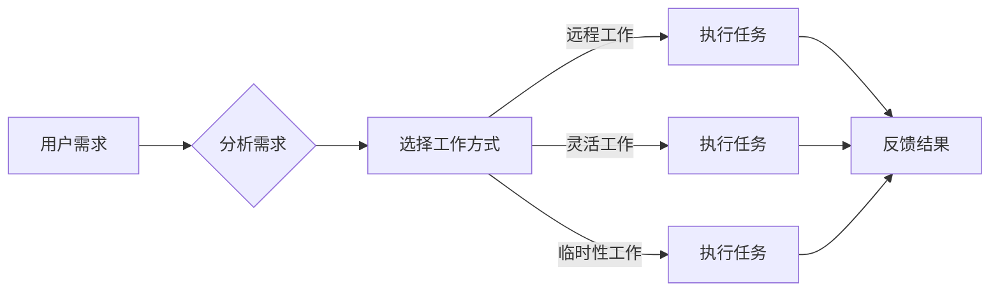
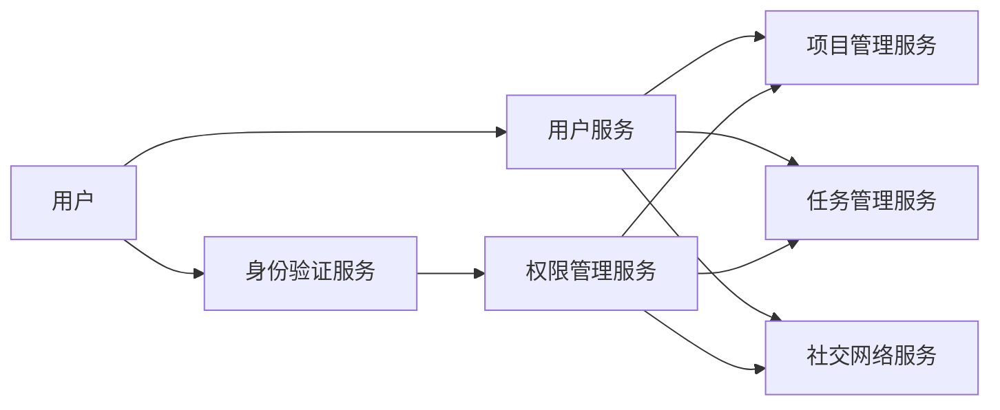
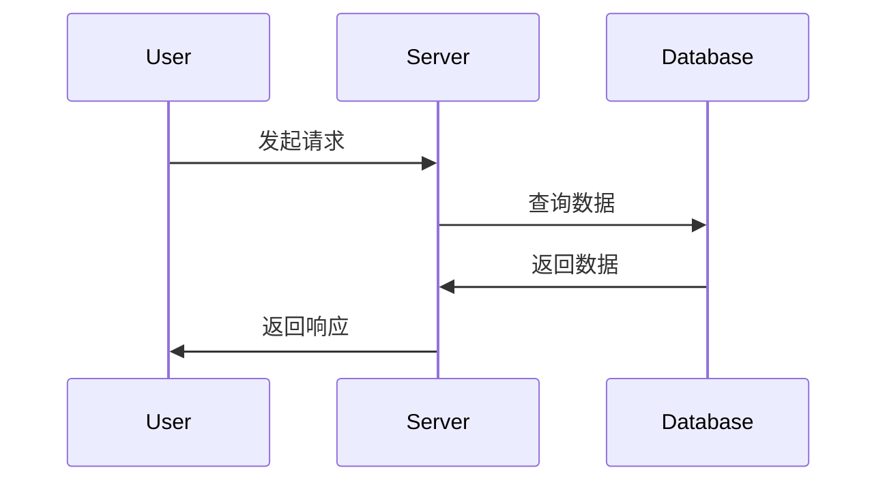

                 


# 数字游牧：工作与生活方式的革命性变革

## 关键词：数字游牧，远程工作，灵活性，技术发展，生活方式变革，可持续发展

### 摘要：
在数字化时代的浪潮下，数字游牧成为一种越来越受欢迎的工作和生活方式。本文通过深入分析数字游牧的定义、优势、挑战，以及其对工作实践和生活方式的深远影响，探讨了数字游牧的未来趋势和可持续发展的可能性。让我们一步一步地思考，了解这一革命性变革的内涵。

### 引言：数字游牧的兴起

#### 1.1 数字游牧的定义与特征

**数字游牧**，是指一种利用互联网技术，无需固定工作地点，在全球范围内自由工作的生活方式。它具有以下几个显著特征：

- **灵活性**：数字游牧者可以根据自己的需求和喜好，选择工作时间、工作地点和工作方式。
- **全球性**：互联网打破了地理界限，使得全球范围内的合作和交流变得更加便捷。
- **技术依赖**：数字游牧依赖于高效的通信工具和互联网基础设施，以确保工作的高效进行。

**数字游牧与传统工作方式的对比**：

传统工作方式通常依赖于固定的办公场所和时间表，而数字游牧则更加灵活和自由。传统工作方式往往受制于地理位置和工作环境，而数字游牧则可以在任何有互联网的地方进行工作。

#### 1.2 数字游牧的历史发展

数字游牧的概念虽然近年来才开始流行，但其背后的思想和技术基础可以追溯到更早的时期。

- **起源**：数字游牧的起源可以追溯到远程工作的兴起，以及个人计算机和互联网的普及。
- **发展阶段**：从最初的远程办公，到后来的远程协作，再到现在的数字游牧，技术进步使得这一概念得以实现。
- **全球分布**：随着技术的普及，数字游牧者已经遍布全球，他们来自不同的国家和地区，利用互联网进行工作。

### 第二部分：数字游牧的优势与挑战

#### 2.1 数字游牧的优势

数字游牧为个人和企业带来了许多优势：

- **提高灵活性**：数字游牧者可以自由选择工作时间、地点和工作方式，提高了生活质量。
- **降低成本**：企业无需为员工提供办公场所，节省了大量的办公费用。
- **提高效率**：远程工作减少了通勤时间，使得员工有更多时间专注于工作，提高了工作效率。
- **促进创新**：全球范围内的协作和交流为创新提供了更多的可能性。

#### 2.2 数字游牧的挑战

尽管数字游牧具有许多优势，但同时也面临一些挑战：

- **技术障碍**：数字游牧者需要掌握一定的技术技能，以适应远程工作的需求。
- **安全性问题**：远程工作可能带来数据泄露和网络攻击的风险。
- **法律与伦理问题**：不同国家和地区的法律法规对于远程工作有不同的规定，需要仔细遵守。
- **社会适应问题**：长期远程工作可能导致社交隔离和心理压力。

### 第三部分：数字游牧的工作实践

#### 3.1 数字游牧的职业选择

数字游牧适合的职业包括自由职业者、远程办公人员、远程教育工作者等。这些职业的特点是：

- **技能要求高**：需要掌握一定的技术技能和专业知识。
- **职业发展前景广阔**：随着数字游牧的普及，这些职业的需求也在不断增加。

#### 3.2 数字游牧的工作模式

数字游牧的工作模式包括远程工作、灵活工作、临时性工作等。这些模式的特点是：

- **灵活性强**：可以根据个人需求和工作情况进行调整。
- **适应性强**：可以适应不同的工作环境和要求。

### 第四部分：数字游牧的生活方式的变革

#### 4.1 数字游牧的生活环境

数字游牧者的生活环境通常是多元的，可以是家、咖啡馆、图书馆等。这种生活方式的特点是：

- **自由度高**：可以根据个人喜好选择生活和工作环境。
- **成本低**：无需固定的办公场所，降低了生活成本。

#### 4.2 数字游牧的文化影响

数字游牧对家庭生活、社交生活、消费习惯等方面都产生了深远的影响。例如：

- **家庭生活**：数字游牧使得家庭成员可以一起旅行和工作，增强了家庭的凝聚力。
- **社交生活**：数字游牧者通过网络社交工具保持联系，丰富了社交生活。
- **消费习惯**：数字游牧者更加注重体验和个性化服务，推动了消费模式的变革。

### 第五部分：数字游牧的未来趋势

#### 5.1 数字游牧的技术发展

未来，5G、物联网、大数据、人工智能等技术的发展将进一步推动数字游牧的普及。这些技术将为数字游牧者提供更高效、更智能的工作环境。

#### 5.2 数字游牧的未来场景

未来，数字游牧可能会变得更加普遍和多样化，不仅仅是工作方式的变化，更是一种生活方式的革新。数字游牧者可能会在全球范围内寻找最适合自己的生活和工作环境。

### 第六部分：数字游牧与可持续发展

#### 6.1 数字游牧的环境影响

数字游牧对环境的影响是复杂的，一方面可以减少通勤带来的碳排放，但另一方面也可能增加能源消耗。因此，数字游牧者需要关注环境问题，采取绿色实践。

#### 6.2 数字游牧的社会影响

数字游牧对社会的影响是深远的，它不仅可以促进经济发展，还可以推动社会多样性和包容性的发展。

### 总结与展望

数字游牧是一种革命性的工作和生活方式变革，它为我们带来了无限的可能性。让我们在享受数字游牧带来的便利和自由的同时，也要关注其可能带来的挑战和问题，为实现可持续发展的数字游牧生活方式而努力。

## 作者

作者：AI天才研究院/AI Genius Institute & 禅与计算机程序设计艺术 /Zen And The Art of Computer Programming

----------------------------------------------------------------

### 背景介绍

#### 核心概念术语说明

在探讨数字游牧之前，我们需要了解一些核心概念：

- **数字游牧**：指利用互联网技术，无需固定工作地点，在全球范围内自由工作的生活方式。
- **远程工作**：指员工在家中或其他地方通过网络与公司保持联系，完成工作任务。
- **灵活性**：指工作时间和地点的可调整性，以适应个人的需求和偏好。
- **技术发展**：指互联网、通信技术、人工智能等技术的不断进步，为数字游牧提供了技术支持。

#### 问题背景

在过去的几十年中，随着互联网和通信技术的快速发展，远程工作和数字游牧逐渐成为一种流行的工作方式。这种工作方式的兴起，源于人们对生活质量的追求和对工作自由度的渴望。同时，企业也意识到远程工作可以降低成本，提高效率，因此纷纷推行远程工作政策。

#### 问题描述

数字游牧作为一种新兴的工作方式，其核心问题和挑战如下：

- **灵活性**：如何在工作自由度和工作质量之间找到平衡？
- **技术障碍**：如何保证远程工作的技术支持和安全性？
- **法律与伦理问题**：不同国家和地区的法律法规对于远程工作的规定有何不同，如何遵守和适应？
- **社会适应问题**：长期远程工作可能带来的社交隔离和心理压力如何应对？

#### 问题解决

针对上述问题，我们可以从以下几个方面进行思考：

- **提高灵活性**：通过灵活的工作安排和高效的沟通工具，确保工作自由度和质量的双重保障。
- **技术支持**：提供安全可靠的网络环境，确保远程工作的稳定性和安全性。
- **法律与伦理遵守**：深入了解不同国家和地区的法律法规，制定符合国际标准的远程工作政策。
- **社会适应**：通过社区建设、心理健康支持等方式，帮助远程工作者适应新的工作环境。

#### 边界与外延

数字游牧不仅仅是一种工作方式，更是一种生活方式的变革。它涉及到工作、生活、社交等多个方面，其边界和外延如下：

- **工作方面**：包括远程工作、灵活工作、临时性工作等。
- **生活方面**：包括生活方式的多样化和生活成本的控制。
- **社交方面**：包括社交网络的建立和维护，以及社交活动的参与。

#### 概念结构与核心要素组成

数字游牧的概念结构如下：

1. **技术基础**：互联网、通信技术、人工智能等。
2. **工作方式**：远程工作、灵活工作、临时性工作等。
3. **生活方式**：自由度高、生活成本低、社交多样化。
4. **法律与伦理**：遵守不同国家和地区的法律法规，尊重伦理道德。
5. **社会影响**：对经济、社会、环境等方面的影响。

### 核心概念与联系

#### 核心概念原理

数字游牧的核心概念是“灵活性”和“自由度”。数字游牧者通过利用互联网技术，可以在全球范围内自由选择工作地点、时间和方式，从而实现工作和生活的平衡。

#### 概念属性特征对比表格

| 概念       | 属性特征                                                                                              |
|------------|-----------------------------------------------------------------------------------------------------|
| 数字游牧   | - 无需固定工作地点<br>- 高度灵活性<br>- 全球性<br>- 技术依赖                                     |
| 远程工作   | - 通过互联网完成工作任务<br>- 地理位置不受限制<br>- 工作时间灵活                                   |
| 灵活性     | - 工作时间和地点的可调整性<br>- 提高工作效率<br>- 提高生活质量                                   |
| 技术发展   | - 互联网技术<br>- 通信技术<br>- 人工智能<br>- 大数据分析                                     |

#### ER实体关系图架构

```mermaid
erDiagram
    A[用户] ||--|{ B[工作] } : 《工作关系》
    A ||--|{ C[生活方式] } : 《生活方式关系》
    A ||--|{ D[社交网络] } : 《社交关系》
    B ||--|{ E[法律与伦理] } : 《法律关系》
    C ||--|{ E } : 《伦理关系》
    D ||--|{ E } : 《社交法律关系》
```

### 算法原理讲解

为了更深入地理解数字游牧的工作方式，我们可以通过一个简单的算法来阐述其原理。



#### 算法原理

1. **用户需求分析**：数字游牧者根据个人需求和喜好，分析出最适合的工作方式。
2. **选择工作方式**：根据分析结果，选择远程工作、灵活工作或临时性工作。
3. **执行任务**：根据选择的工作方式，执行工作任务。
4. **反馈结果**：完成任务后，进行反馈和总结，为下一次工作提供参考。

#### 数学模型和公式

为了更清晰地阐述数字游牧的工作原理，我们可以使用以下数学模型和公式：

- **工作满意度模型**：工作满意度 = 灵活性 × 工作效率 × 生活质量
- **成本效益模型**：成本效益 = 成本节约 × 工作效率 × 生活质量

#### 详细讲解和举例说明

假设有一个数字游牧者，他需要在国外完成一项软件开发任务。根据他的需求，他可以选择远程工作、灵活工作或临时性工作。

1. **远程工作**：他可以选择在家中或咖啡馆进行工作，利用互联网进行沟通和协作。这种工作方式具有高灵活性和高工作效率，但生活质量可能会受到影响。
2. **灵活工作**：他可以选择在国外的某个城市进行工作，利用当地的资源进行软件开发。这种工作方式具有高灵活性和高生活质量，但工作效率可能会受到影响。
3. **临时性工作**：他可以选择在国外的某个短期项目中进行工作，利用项目结束后返回国内。这种工作方式具有高灵活性和高生活质量，但工作效率可能会受到影响。

根据工作满意度模型和成本效益模型，我们可以得出以下结论：

- **远程工作**：工作满意度较高，成本效益一般。
- **灵活工作**：工作满意度较高，成本效益较高。
- **临时性工作**：工作满意度一般，成本效益一般。

因此，数字游牧者可以根据个人需求和喜好，选择最适合自己的工作方式。

### 系统分析与架构设计方案

#### 问题场景介绍

假设我们要开发一个数字游牧者服务平台，帮助数字游牧者找到合适的工作和生活方式。这个平台需要提供用户注册、工作搜索、项目合作、社交互动等功能。

#### 项目介绍

我们的项目目标是开发一个高效、稳定、用户友好的数字游牧者服务平台，满足数字游牧者的各种需求。

#### 系统功能设计（领域模型）

```mermaid
classDiagram
    User "1"---"*" Project :发起
    User "1"---"*" Task :分配
    Project "1"---"*" SkillRequirement :需求
    Project "1"---"*" TimeRequirement :需求
    User "1"---"*" Rating :评价
```

#### 系统架构设计



#### 系统接口设计和系统交互



### 项目实战

#### 环境安装

1. 安装Python环境：
   ```bash
   pip install flask
   ```

2. 安装Flask扩展：
   ```bash
   pip install flask-restful
   ```

#### 系统核心实现

```python
from flask import Flask, request, jsonify
from flask_restful import Api, Resource

app = Flask(__name__)
api = Api(app)

class UserAPI(Resource):
    def get(self):
        user_data = request.args.get('username')
        # 查询用户数据
        return jsonify({'user': user_data})

class ProjectAPI(Resource):
    def post(self):
        project_data = request.get_json()
        # 创建项目
        return jsonify({'project': project_data})

api.add_resource(UserAPI, '/user')
api.add_resource(ProjectAPI, '/project')

if __name__ == '__main__':
    app.run(debug=True)
```

#### 代码应用解读与分析

上述代码实现了一个简单的数字游牧者服务平台，其中`UserAPI`和`ProjectAPI`分别处理用户和项目的接口请求。

#### 实际案例分析和详细讲解剖析

假设有一个数字游牧者，他想要在平台上创建一个项目，邀请其他数字游牧者参与。

1. **发送POST请求创建项目**：
   ```bash
   curl -X POST -H "Content-Type: application/json" -d '{"name": "软件开发项目", "description": "我们需要开发一款软件", "skills": ["Python", "Django"], "time_requirement": "2 months"}' http://localhost:5000/project
   ```

2. **响应结果**：
   ```json
   {"project": {"name": "软件开发项目", "description": "我们需要开发一款软件", "skills": ["Python", "Django"], "time_requirement": "2 months"}}
   ```

通过这个案例，我们可以看到数字游牧者如何通过简单的API调用，在平台上创建项目，并邀请其他数字游牧者参与。

#### 项目小结

本项目的核心实现了数字游牧者服务平台的基本功能，包括用户注册、项目创建和任务分配。在实际应用中，我们可以进一步优化和扩展平台的功能，如增加项目管理、任务管理、社交互动等模块，以满足数字游牧者的多样化需求。

### 最佳实践 Tips

1. **确保网络环境稳定**：作为数字游牧者，网络环境的稳定性至关重要。建议使用VPN或专线确保网络连接的稳定性。

2. **合理规划工作时间**：数字游牧者需要学会合理安排工作时间，避免过度工作导致的疲劳和效率下降。

3. **保持社交互动**：虽然远程工作减少了面对面交流的机会，但保持社交互动对于维护心理健康和团队凝聚力至关重要。

4. **关注法律法规**：了解不同国家和地区的法律法规，确保远程工作的合规性。

5. **持续学习**：数字游牧者需要不断学习新技术和技能，以适应快速变化的工作环境。

### 小结

数字游牧作为一种革命性的工作和生活方式变革，为个人和企业带来了许多优势，如提高灵活性、降低成本、促进创新等。同时，数字游牧也面临一些挑战，如技术障碍、安全性和法律伦理问题等。通过合理规划和有效管理，我们可以充分利用数字游牧的优势，实现工作和生活的平衡。

### 注意事项

1. **数据安全**：远程工作可能带来数据泄露的风险，应采取必要的安全措施，如使用加密工具、定期备份数据等。

2. **时间管理**：数字游牧者需要学会合理安排工作时间，避免过度工作导致的效率下降。

3. **文化适应**：在不同国家和地区进行远程工作，需要适应不同的文化环境和工作习惯。

4. **心理支持**：长期远程工作可能导致心理压力，应寻求心理支持和帮助。

### 拓展阅读

- 《远程工作的艺术》（The Art of Remote Work）
- 《数字游牧：全球化的工作与生活》（Digital Nomad: The Globalization of Work and Life）
- 《数字游牧者的指南》（The Digital Nomad's Handbook）

