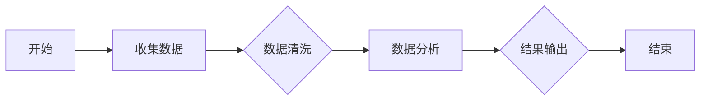
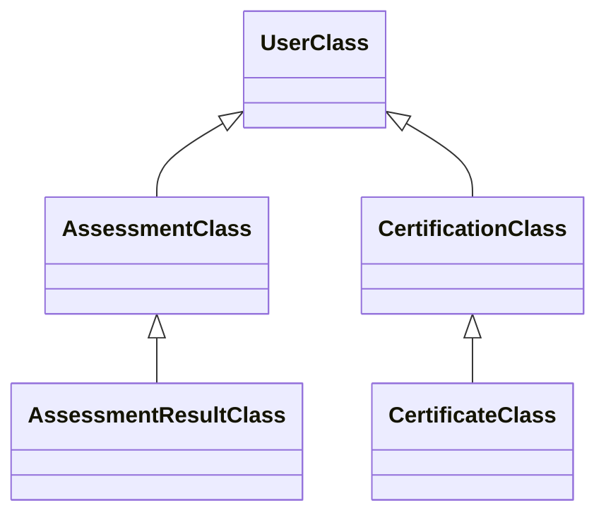
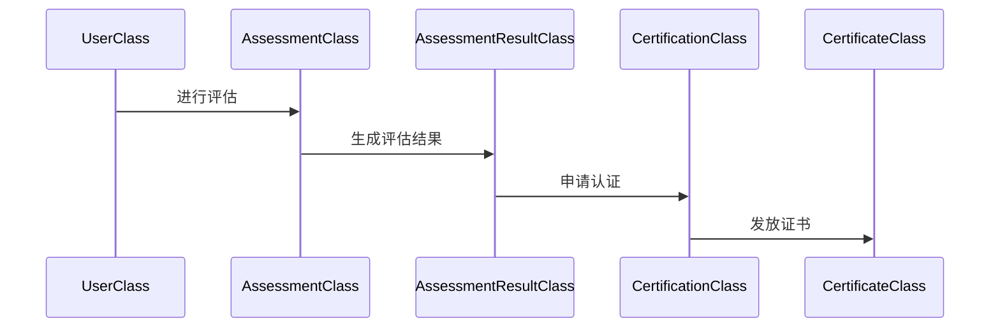
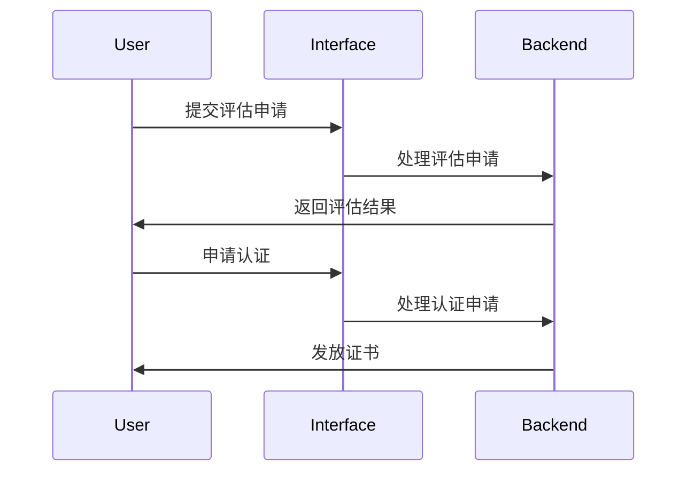

                 

# 数字素养认证体系：信息时代的核心能力评估

> 关键词：数字素养、认证体系、信息时代、能力评估

> 摘要：随着信息技术的飞速发展，数字素养成为现代社会个人和组织不可或缺的核心能力。本文旨在探讨如何构建一套科学、全面、可操作的数字素养认证体系，以评估和提升个人及组织的数字能力，助力信息时代的全面发展。

## 引言与背景

在当前信息化时代，数字素养的重要性日益凸显。数字素养不仅涵盖了计算机操作和互联网使用的基本技能，还包括数据理解、信息处理、安全意识、创新思维等多个方面。它不仅影响个人的生活质量和工作效率，还对组织的信息化建设和业务发展起到关键作用。

### 书名：《数字素养认证体系：信息时代的核心能力评估》

本书旨在深入研究数字素养的概念、特征及其在现代社会中的应用，提出一套科学、全面、可操作的数字素养认证体系，以应对信息时代带来的挑战和机遇。

### 问题背景

随着互联网、大数据、人工智能等技术的发展，数字化已经渗透到社会的各个领域。个人和组织需要具备相应的数字素养，才能在竞争激烈的市场中立足。然而，当前数字素养的评估和培养还存在许多问题，如评估标准不统一、培训内容不全面等。

### 问题描述

如何建立一套科学、全面、可操作的数字素养认证体系，以评估和提升个人及组织的数字能力，是一个亟待解决的问题。这需要从理论研究和实际应用两个层面进行探索。

### 问题解决

通过研究和实践，本书提出了数字素养认证体系的设计思路，包括认证体系的结构、评估标准、评估方法和培训方案等。这些设计思路旨在提供一个系统的框架，帮助个人和组织提升数字素养。

### 边界与外延

数字素养的范畴广泛，涵盖了信息技术、网络安全、数据隐私、创新思维等多个领域。认证体系的设计需要考虑这些因素的交互作用，以适应不同应用场景的需求。

## 核心概念与联系

### 数字素养

数字素养是指个体在数字环境下获取、理解、评价、创建和应用信息的能力。它不仅包括技术技能，还涉及信息伦理、安全意识、创新思维等方面。

#### 数字素养的属性特征对比表

| 特征             | 定义                                                         |
|------------------|--------------------------------------------------------------|
| 信息获取         | 能够有效地搜索、获取和评估数字信息。                           |
| 信息处理         | 能够使用数字工具对信息进行组织、分析、解释和综合。             |
| 信息利用         | 能够创造性地应用数字信息解决问题，提升工作效率。               |
| 信息安全         | 能够识别和防范网络安全威胁，保护个人信息和数据安全。           |
| 创新思维         | 能够在数字环境中进行创新思维，提出新的解决方案。               |

### 数字素养认证体系

数字素养认证体系是一个用于评估和提升个体和组织数字能力的系统。它包括认证体系的设计、评估标准、评估方法和培训方案等。

#### 数字素养认证体系ER图

```mermaid
erDiagram
    User ||--|{ Assessment }|
    User ||--|{ Certification }|
    Assessment ||--|{ AssessmentResult }|
    Certification ||--|{ Certificate }|
```

## 数字素养认证体系设计

### 认证体系概述

数字素养认证体系的目标是评估和提升个人及组织的数字能力。它包括以下结构：

1. **准备阶段**：制定认证计划，明确评估目标和标准。
2. **评估阶段**：进行能力评估，收集评估数据。
3. **认证阶段**：根据评估结果发放证书，提供培训支持。

### 阶段划分

#### 准备阶段

- **认证计划制定**：明确评估目标、内容、方法和标准。
- **资源准备**：准备评估工具、培训资料和培训环境。

#### 评估阶段

- **数据收集**：通过线上或线下方式收集评估数据。
- **数据分析**：对评估数据进行分析和解读。

#### 认证阶段

- **结果反馈**：根据评估结果给出反馈和建议。
- **证书发放**：对达到标准的人员发放证书。

### 评估工具与方法

#### 量化评估方法

- **测试题库**：建立数字素养测试题库，进行标准化测试。
- **数据分析**：使用统计分析方法对测试结果进行分析。

#### 定性评估方法

- **案例研究**：通过案例分析评估个体的实际应用能力。
- **专家评估**：邀请专家对个体进行能力评估。

### 培训方案

#### 课程设置

- **基础课程**：介绍数字素养的基本概念和技能。
- **高级课程**：提升数字素养的高级技能和应用能力。

#### 培训内容

- **信息技术知识**：计算机网络、操作系统、数据库等。
- **信息安全意识**：网络安全、数据保护、隐私保护等。
- **创新思维培养**：创新思维方法、项目策划与执行等。

#### 培训方式

- **线上培训**：通过在线课程、视频教学等方式进行。
- **线下培训**：通过集中授课、实操演练等方式进行。

## 算法原理讲解

### 数字素养评估算法流程

#### 算法mermaid流程图



### 算法原理

#### 数学模型

$$
\text{评估结果} = f(\text{信息获取能力}, \text{信息处理能力}, \text{信息利用能力}, \text{信息安全能力}, \text{创新思维能力})
$$

#### Python源代码

```python
# Python代码段
```

### 举例说明

#### 案例一：某用户数字素养评估结果分析

## 系统分析与架构设计方案

### 数字素养评估应用场景

数字素养评估可以应用于个人能力评估、企业员工培训、教育机构教学质量评估等多个场景。以下是一个具体的应用场景：

### 问题场景介绍

某企业希望对其员工进行数字素养评估，以了解员工在信息获取、信息处理、信息利用、信息安全和创新思维等方面的能力，并根据评估结果提供有针对性的培训。

### 系统功能设计

#### 系统功能设计领域模型



### 系统架构设计

#### 系统架构设计mermaid架构图



### 系统接口设计和系统交互

#### 系统接口设计和系统交互mermaid序列图



## 项目实战

### 环境安装

数字素养评估系统需要安装以下软件和工具：

1. **Python**：版本3.8或更高
2. **Flask**：用于构建Web应用程序
3. **SQLAlchemy**：用于数据库操作
4. **Jinja2**：用于模板渲染

安装步骤如下：

1. 安装Python和pip
2. 使用pip安装Flask、SQLAlchemy和Jinja2

### 系统核心实现源代码

```python
# core.py
from flask import Flask, request, jsonify
from sqlalchemy import create_engine
from models import User, Assessment, AssessmentResult

app = Flask(__name__)

# 数据库连接
engine = create_engine('sqlite:///database.db')

# 创建表
with engine.connect() as connection:
    connection.execute(User.__table__.create())
    connection.execute(Assessment.__table__.create())
    connection.execute(AssessmentResult.__table__.create())

# 用户注册
@app.route('/register', methods=['POST'])
def register():
    data = request.get_json()
    user = User(name=data['name'], email=data['email'])
    db.session.add(user)
    db.session.commit()
    return jsonify({'status': 'success', 'message': 'User registered successfully.'})

# 进行评估
@app.route('/assessment', methods=['POST'])
def assessment():
    data = request.get_json()
    assessment = Assessment(user_id=data['user_id'], score=data['score'])
    db.session.add(assessment)
    db.session.commit()
    return jsonify({'status': 'success', 'message': 'Assessment submitted successfully.'})

# 评估结果查询
@app.route('/assessment_result', methods=['GET'])
def assessment_result():
    user_id = request.args.get('user_id')
    assessments = AssessmentResult.query.filter_by(user_id=user_id).all()
    return jsonify({'assessments': [assessment.to_dict() for assessment in assessments]})

if __name__ == '__main__':
    app.run(debug=True)
```

### 代码应用解读与分析

此部分内容将详细解析上述代码的功能和实现细节，包括数据库连接、用户注册、评估提交和评估结果查询等。

### 实际案例分析和详细讲解剖析

本文将通过一个实际案例，展示如何使用数字素养评估系统进行用户评估和结果分析，并详细讲解每个步骤的操作和实现。

### 项目小结

本文详细介绍了数字素养认证体系的设计和实现，包括核心概念、认证体系设计、算法原理、系统架构设计以及项目实战。这些内容为构建数字素养认证体系提供了理论基础和实践指导。

## 最佳实践 tips

### 小结

本文系统地介绍了数字素养认证体系的设计和实现，从核心概念到实际项目实战，全面阐述了数字素养认证体系的构建方法和应用场景。

### 注意事项

- 在构建数字素养认证体系时，需要充分考虑用户需求和行业特点，确保认证体系的科学性和实用性。
- 算法设计和实现需要充分考虑数据质量和计算效率，确保评估结果的准确性和可靠性。
- 在项目实战中，需要严格按照代码规范和测试流程进行开发，确保系统的稳定性和安全性。

### 拓展阅读

- [《人工智能时代的教育变革》](https://www.example.com/book1)
- [《大数据时代的决策分析》](https://www.example.com/book2)
- [《网络安全实战手册》](https://www.example.com/book3)

作者：AI天才研究院/AI Genius Institute & 禅与计算机程序设计艺术 /Zen And The Art of Computer Programming

