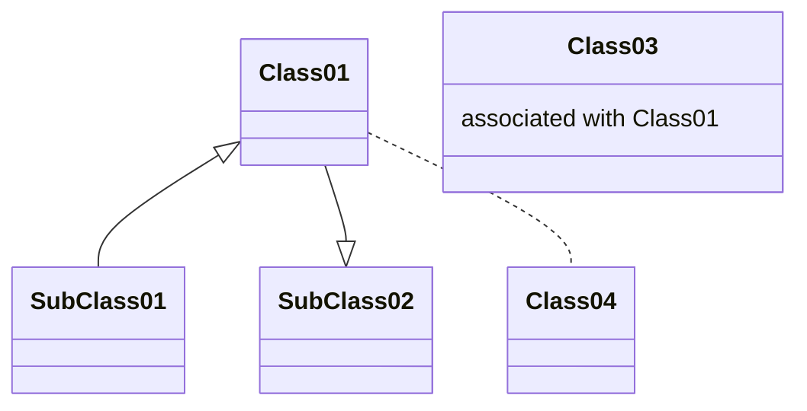
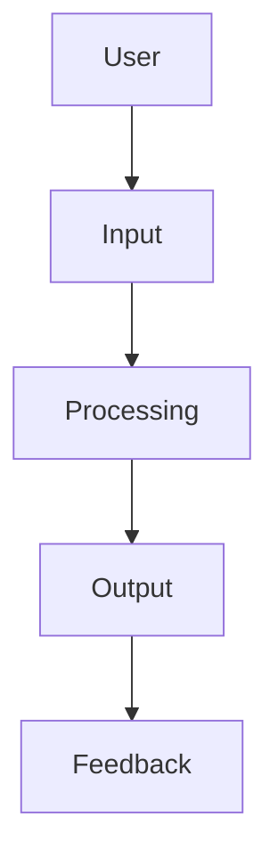
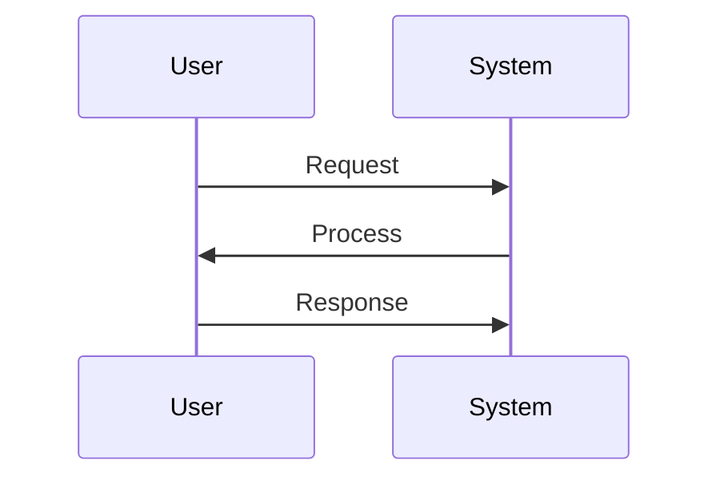
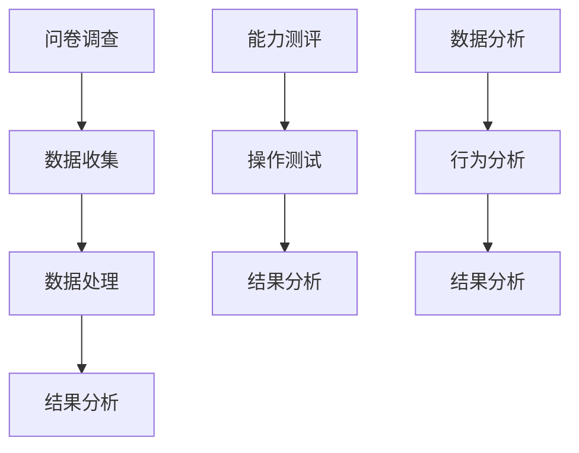
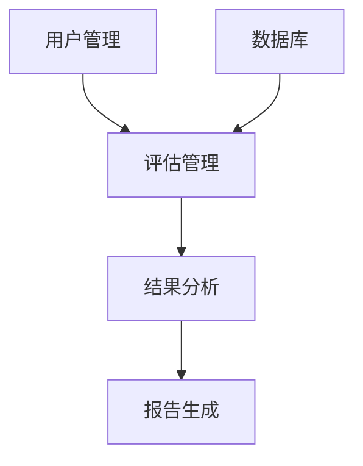
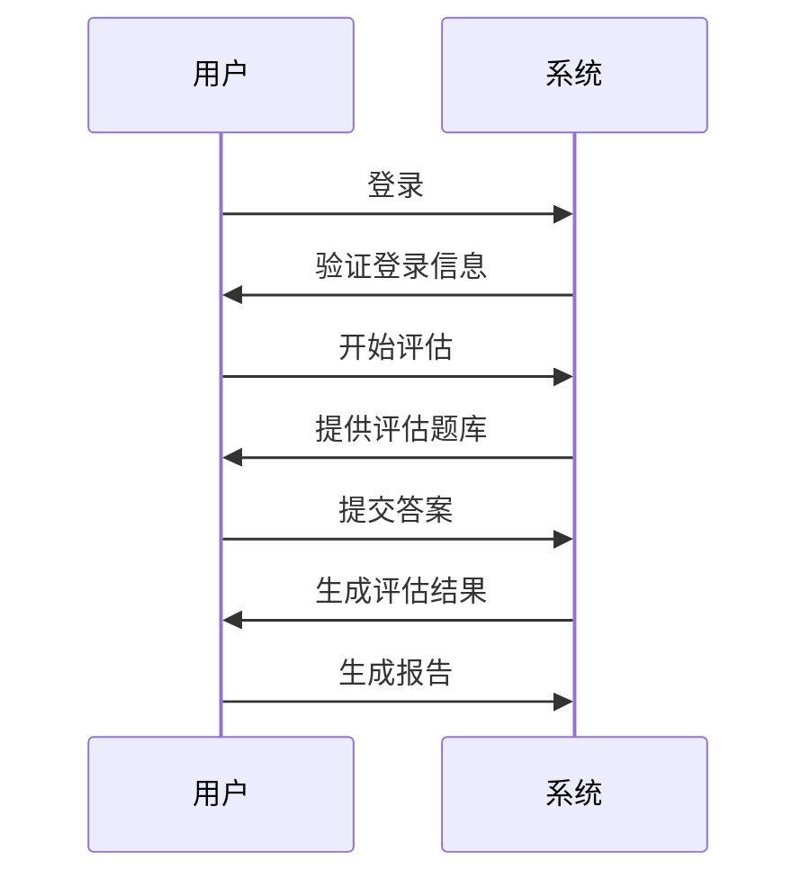

                 

### 1. 设计大纲的基本框架

为了撰写一篇逻辑清晰、结构紧凑、简单易懂的专业技术博客，我们首先需要设计一篇文章的基本框架。这包括确定文章的主要部分和每个部分的具体内容。以下是详细的设计步骤：

**步骤 1：定义文章的核心主题和目标**
- 核心主题：《数字素养认证：信息时代的必备技能》
- 目标：为读者提供关于数字素养认证的全面理解，包括其重要性、核心概念、算法原理、数学模型、系统架构以及实战应用。

**步骤 2：确定主要部分**
- **背景介绍**：介绍数字素养认证的概念、重要性以及现状。
- **核心概念与联系**：阐述数字素养的核心要素及其相互关系。
- **算法原理讲解**：详细解释用于评估数字素养的算法。
- **数学模型和数学公式**：介绍数学模型及其应用。
- **系统分析与架构设计方案**：讨论数字素养认证系统的设计与实现。
- **项目实战**：通过实际项目展示数字素养认证的应用。
- **最佳实践 tips、小结、注意事项、拓展阅读**：总结文章，提供实践建议和进一步阅读资源。

**步骤 3：细化每个部分的内容**
- **背景介绍**：
  - **1.1 信息时代与数字素养**：描述信息时代的特点，解释数字素养的概念及其重要性。
  - **1.2 数字素养认证的重要性**：讨论数字素养认证的价值和意义。
  - **1.3 数字素养认证的现状**：分析当前数字素养认证的现状和挑战。

- **核心概念与联系**：
  - **2.1 数字素养的概念解析**：详细说明数字素养的定义、层次结构和关键要素。
  - **2.2 数字素养的关键要素**：探讨信息素养、技术素养和数理素养之间的关系。
  - **2.3 数字素养与信息安全的联系**：解释数字素养在维护信息安全中的作用。

- **算法原理讲解**：
  - **3.1 数字素养评估算法概述**：介绍评估数字素养的算法类型和目的。
  - **3.2 常见评估算法的mermaid流程图**：使用mermaid绘制算法流程图。
  - **3.3 算法实例讲解**：通过具体实例讲解评估算法的实现和应用。

- **数学模型和数学公式**：
  - **4.1 数字素养评估的数学模型**：阐述评估数字素养的数学模型原理。
  - **4.2 数学公式详细讲解**：解释模型中使用的数学公式。
  - **4.3 实际应用举例**：通过实际案例展示数学模型的应用。

- **系统分析与架构设计方案**：
  - **5.1 数字素养认证系统概述**：介绍数字素养认证系统的总体结构和功能。
  - **5.2 系统功能设计（领域模型mermaid类图）**：展示系统功能的设计。
  - **5.3 系统架构设计（mermaid架构图）**：绘制系统的架构设计。
  - **5.4 系界点设计和系统交互（mermaid序列图）**：说明系统的接口设计和交互流程。

- **项目实战**：
  - **6.1 环境安装与配置**：指导如何搭建数字素养认证系统的环境。
  - **6.2 系统核心实现源代码**：展示系统的核心代码。
  - **6.3 代码应用解读与分析**：分析系统代码的实际应用。
  - **6.4 实际案例分析与讲解**：通过具体案例剖析系统应用。
  - **6.5 项目小结**：总结项目实施的经验和教训。

- **最佳实践 tips、小结、注意事项、拓展阅读**：
  - **7.1 最佳实践 tips**：提供实际操作中的建议。
  - **7.2 小结**：回顾文章的主要内容。
  - **7.3 注意事项**：提醒读者在应用中需要注意的问题。
  - **7.4 拓展阅读**：推荐进一步学习的资源。

通过上述步骤，我们为文章创建了一个清晰、有条理的基本框架，这将有助于我们后续内容的撰写和整理。

---

### 2. 确定每个章节的具体内容

在明确了文章的基本框架之后，接下来我们需要为每个章节确定具体的内容，以确保文章的逻辑性和深度。以下是每个章节的具体内容细分：

#### 第1章：背景介绍

**1.1 信息时代与数字素养**
- **核心概念术语说明**：解释信息时代、数字素养等关键术语。
- **问题背景**：描述数字素养在信息时代的重要性。
- **问题描述**：说明当前数字素养认证面临的问题和挑战。
- **问题解决**：探讨数字素养认证的解决方案。
- **边界与外延**：讨论数字素养认证的范围和应用场景。
- **概念结构与核心要素组成**：详细阐述数字素养的核心要素和结构。

**1.2 数字素养认证的重要性**
- **价值**：解释数字素养认证对于个人、组织和社会的价值。
- **标准**：介绍数字素养认证的标准和评估指标。
- **发展趋势**：分析数字素养认证的发展趋势和未来方向。

**1.3 数字素养认证的现状**
- **挑战**：探讨数字素养认证当前面临的挑战。
- **实践案例**：分析成功的数字素养认证实践案例。
- **未来展望**：预测数字素养认证的未来发展前景。

#### 第2章：核心概念与联系

**2.1 数字素养的概念解析**
- **定义**：详细说明数字素养的定义。
- **层次结构**：解释数字素养的层次结构和不同层面。
- **核心要素**：列举数字素养的核心要素。

**2.2 数字素养的关键要素**
- **信息素养**：探讨信息素养的定义、重要性以及具体内容。
- **技术素养**：描述技术素养的概念、应用和培养方法。
- **数理素养**：解释数理素养在数字素养中的作用。

**2.3 数字素养与信息安全的联系**
- **关系**：阐述数字素养与信息安全之间的联系。
- **应用**：讨论数字素养在维护信息安全中的应用实例。
- **挑战**：分析数字素养在信息安全中面临的挑战。

#### 第3章：算法原理讲解

**3.1 数字素养评估算法概述**
- **目的**：介绍数字素养评估算法的设计目的和目标。
- **分类**：分类讨论常见的数字素养评估算法。
- **选择**：探讨选择评估算法的考虑因素。

**3.2 常见评估算法的mermaid流程图**
- **流程图**：使用mermaid绘制不同评估算法的流程图。

**3.3 算法实例讲解**
- **实例1**：详细讲解一种评估算法，并给出mermaid流程图。
- **实例2**：讲解另一种评估算法，结合Python源代码进行阐述。

#### 第4章：数学模型和数学公式 & 详细讲解 & 举例说明

**4.1 数字素养评估的数学模型**
- **原理**：解释数学模型的基本原理。
- **组成部分**：详细描述数学模型的组成部分。
- **构建方法**：介绍构建数学模型的方法。

**4.2 数学公式详细讲解**
- **基本公式**：解释数字素养评估中使用的数学基本公式。
- **复杂公式**：详细讲解复杂的数学公式。
- **应用**：讨论数学公式在实际评估中的应用。

**4.3 实际应用举例**
- **举例1**：通过具体案例展示数学模型在数字素养评估中的应用。
- **举例2**：展示数学公式在数字素养评估中的实际应用。

#### 第5章：系统分析与架构设计方案

**5.1 数字素养认证系统概述**
- **问题场景**：描述数字素养认证系统的应用场景。
- **项目介绍**：介绍数字素养认证项目的背景和目标。
- **系统功能设计（领域模型mermaid类图）**：使用mermaid绘制领域模型类图。
- **系统架构设计（mermaid架构图）**：使用mermaid绘制系统架构图。
- **系统接口设计和系统交互（mermaid序列图）**：展示系统接口设计和交互流程。

#### 第6章：项目实战

**6.1 环境安装与配置**
- **环境搭建**：指导如何搭建数字素养认证系统的开发环境。
- **配置说明**：详细说明系统配置的过程和注意事项。

**6.2 系统核心实现源代码**
- **代码展示**：展示数字素养认证系统的核心代码片段。
- **代码解读**：分析代码的实现逻辑和功能。

**6.3 代码应用解读与分析**
- **代码应用**：通过实际代码应用展示系统的功能。
- **分析**：对代码应用进行深入分析，解释其工作原理。

**6.4 实际案例分析与讲解**
- **案例选择**：选择具体案例进行深入分析。
- **讲解**：详细讲解案例的实现过程和应用效果。

**6.5 项目小结**
- **经验总结**：总结项目实施中的经验和教训。
- **改进建议**：提出系统改进的建议和未来方向。

#### 第7章：最佳实践 tips、小结、注意事项、拓展阅读

**7.1 最佳实践 tips**
- **实践建议**：提供在实际操作中的实用建议。
- **注意事项**：提醒读者在实施数字素养认证时需要注意的问题。

**7.2 小结**
- **主要内容回顾**：回顾文章的核心内容和主要观点。

**7.3 注意事项**
- **实施注意事项**：提醒读者在数字素养认证实施过程中需要注意的关键点。

**7.4 拓展阅读**
- **推荐资源**：推荐进一步学习和研究的资源。

通过上述内容细分，每个章节都具备了丰富的具体内容，使得整篇文章更加系统、全面，有助于读者深入理解和掌握数字素养认证的相关知识。

---

### 3. 确定大纲的markdown格式

在明确了每个章节的具体内容后，我们需要将这些内容按照markdown格式进行组织，以确保文章的可读性和逻辑性。以下是一个示例，展示了如何使用markdown格式组织文章的大纲。

```markdown
# 《数字素养认证：信息时代的必备技能》目录大纲

## 第一部分：背景介绍

### 1.1 信息时代与数字素养
#### 1.1.1 信息时代的特点
#### 1.1.2 数字素养的重要性
#### 1.1.3 数字素养认证的现状

### 1.2 数字素养认证的重要性
#### 1.2.1 数字素养认证的价值
#### 1.2.2 数字素养认证的标准
#### 1.2.3 数字素养认证的发展趋势

### 1.3 数字素养认证的现状
#### 1.3.1 当前数字素养认证的挑战
#### 1.3.2 数字素养认证的实践案例
#### 1.3.3 未来展望

## 第二部分：核心概念与联系

### 2.1 数字素养的概念解析
#### 2.1.1 数字素养的定义
#### 2.1.2 数字素养的层次结构
#### 2.1.3 数字素养的核心要素

### 2.2 数字素养的关键要素
#### 2.2.1 信息素养
#### 2.2.2 技术素养
#### 2.2.3 数理素养

### 2.3 数字素养与信息安全的联系
#### 2.3.1 数字素养与信息安全的关系
#### 2.3.2 数字素养在信息安全中的应用
#### 2.3.3 数字素养与信息安全的挑战

## 第三部分：算法原理讲解

### 3.1 数字素养评估算法概述
#### 3.1.1 数字素养评估的目的
#### 3.1.2 常见评估算法的分类
#### 3.1.3 数字素养评估算法的选择

### 3.2 常见评估算法的mermaid流程图
#### 3.2.1 算法A流程图
#### 3.2.2 算法B流程图
#### 3.2.3 算法C流程图

### 3.3 算法实例讲解
#### 3.3.1 算法A详细讲解
#### 3.3.2 算法B详细讲解
#### 3.3.3 算法C详细讲解

## 第四部分：数学模型和数学公式 & 详细讲解 & 举例说明

### 4.1 数字素养评估的数学模型
#### 4.1.1 数学模型的基本原理
#### 4.1.2 数学模型的组成部分
#### 4.1.3 数学模型的构建方法

### 4.2 数学公式详细讲解
#### 4.2.1 基本数学公式
#### 4.2.2 复杂数学公式的应用
#### 4.2.3 数学公式在实际评估中的应用

### 4.3 实际应用举例
#### 4.3.1 举例一：信息素养评估
#### 4.3.2 举例二：技术素养评估
#### 4.3.3 举例三：数理素养评估

## 第五部分：系统分析与架构设计方案

### 5.1 数字素养认证系统概述
#### 5.1.1 系统背景
#### 5.1.2 系统目标
#### 5.1.3 系统功能

### 5.2 系统功能设计（领域模型mermaid类图）


### 5.3 系统架构设计（mermaid架构图）


### 5.4 系统接口设计和系统交互（mermaid序列图）


## 第六部分：项目实战

### 6.1 环境安装与配置
#### 6.1.1 环境搭建
#### 6.1.2 系统配置
#### 6.1.3 常见问题解决

### 6.2 系统核心实现源代码
#### 6.2.1 代码结构
#### 6.2.2 核心算法
#### 6.2.3 代码解析

### 6.3 代码应用解读与分析
#### 6.3.1 应用场景
#### 6.3.2 解读分析
#### 6.3.3 优化建议

### 6.4 实际案例分析与讲解
#### 6.4.1 案例选择
#### 6.4.2 案例解析
#### 6.4.3 教训与启示

### 6.5 项目小结
#### 6.5.1 项目总结
#### 6.5.2 经验分享
#### 6.5.3 改进方向

## 第七部分：最佳实践 tips、小结、注意事项、拓展阅读

### 7.1 最佳实践 tips
#### 7.1.1 实践技巧
#### 7.1.2 注意事项
#### 7.1.3 常见问题解决方案

### 7.2 小结
#### 7.2.1 主要内容回顾
#### 7.2.2 重要观点总结
#### 7.2.3 趋势展望

### 7.3 注意事项
#### 7.3.1 实施细节
#### 7.3.2 风险评估
#### 7.3.3 改进建议

### 7.4 拓展阅读
#### 7.4.1 相关书籍
#### 7.4.2 论文资源
#### 7.4.3 在线课程

```

通过使用markdown格式，我们可以清晰地组织文章的结构，便于读者阅读和理解。同时，markdown格式也允许我们使用各种格式和样式来增强文章的可读性，如标题、子标题、列表、代码块、公式等。

---

### 完整文章结构与内容规划

在完成了文章大纲的设计、内容细化和markdown格式组织后，我们可以将整篇文章的结构和内容进行规划和整理，确保文章的逻辑性和完整性。以下是对文章整体结构的详细描述：

#### 标题与关键词

- **标题**：《数字素养认证：信息时代的必备技能》
- **关键词**：数字素养、认证、信息时代、算法、数学模型、系统架构、实战应用

#### 摘要

摘要部分将简要介绍文章的核心内容，包括数字素养认证的定义、重要性、核心概念、评估算法、数学模型、系统架构以及实战应用。摘要还将指出文章的目标读者和主要贡献。

#### 目录

文章目录将按照上述章节划分，列出每个章节的主题和子主题，以便读者快速浏览和定位感兴趣的内容。

#### 引言

引言部分将简要介绍数字素养认证的背景，解释为什么数字素养在信息时代变得如此重要，以及为什么需要数字素养认证。

#### 第一部分：背景介绍

**1.1 信息时代与数字素养**

在这一节中，我们将讨论信息时代的特征，解释数字素养的概念，阐述数字素养的重要性，并介绍数字素养认证的基本概念和目的。

**1.2 数字素养认证的重要性**

本节将深入探讨数字素养认证的价值，包括个人、组织和社会层面的重要性，以及它如何帮助提升信息素养和技术素养。

**1.3 数字素养认证的现状**

在这一节中，我们将分析当前数字素养认证的现状，包括存在的问题、挑战以及成功的实践案例。

#### 第二部分：核心概念与联系

**2.1 数字素养的概念解析**

我们将详细定义数字素养，探讨其层次结构和核心要素，并解释这些要素如何相互关联。

**2.2 数字素养的关键要素**

本节将分别讨论信息素养、技术素养和数理素养，说明它们在数字素养中的地位和作用。

**2.3 数字素养与信息安全的联系**

我们将探讨数字素养与信息安全之间的关系，分析数字素养在维护信息安全中的作用和挑战。

#### 第三部分：算法原理讲解

**3.1 数字素养评估算法概述**

在这一节中，我们将介绍数字素养评估算法的设计目的和主要分类，探讨选择评估算法的考虑因素。

**3.2 常见评估算法的mermaid流程图**

我们将使用mermaid绘制常见评估算法的流程图，帮助读者直观地理解算法的工作流程。

**3.3 算法实例讲解**

本节将通过具体实例详细讲解评估算法的实现和应用，结合Python源代码进行阐述。

#### 第四部分：数学模型和数学公式 & 详细讲解 & 举例说明

**4.1 数字素养评估的数学模型**

我们将解释数字素养评估数学模型的基本原理，描述其组成部分和构建方法。

**4.2 数学公式详细讲解**

在这一节中，我们将详细解释数字素养评估中使用的数学公式，包括基本公式和复杂公式。

**4.3 实际应用举例**

我们将通过具体案例展示数学模型和数学公式在实际评估中的应用。

#### 第五部分：系统分析与架构设计方案

**5.1 数字素养认证系统概述**

本节将介绍数字素养认证系统的整体结构和功能，为后续讨论提供背景。

**5.2 系统功能设计（领域模型mermaid类图）**

我们将使用mermaid绘制领域模型类图，展示系统功能的设计。

**5.3 系统架构设计（mermaid架构图）**

我们将使用mermaid绘制系统架构图，解释系统的组件和交互方式。

**5.4 系统接口设计和系统交互（mermaid序列图）**

本节将使用mermaid序列图展示系统接口设计和交互流程。

#### 第六部分：项目实战

**6.1 环境安装与配置**

我们将指导如何搭建数字素养认证系统的开发环境，包括软件安装和系统配置。

**6.2 系统核心实现源代码**

本节将展示数字素养认证系统的核心代码片段，并进行分析。

**6.3 代码应用解读与分析**

我们将分析系统代码的实际应用，解释其工作原理和优化方法。

**6.4 实际案例分析与讲解**

通过具体案例，我们将详细分析数字素养认证系统在现实场景中的应用。

**6.5 项目小结**

我们将总结项目实施的经验和教训，提出改进建议。

#### 第七部分：最佳实践 tips、小结、注意事项、拓展阅读

**7.1 最佳实践 tips**

本节将提供数字素养认证实施中的实用建议，包括注意事项和常见问题的解决方案。

**7.2 小结**

我们将回顾文章的核心内容和主要观点，强调数字素养认证的重要性。

**7.3 注意事项**

本节将提醒读者在数字素养认证实施过程中需要注意的关键点。

**7.4 拓展阅读**

我们将推荐进一步学习和研究的资源，包括相关书籍、论文和在线课程。

通过上述结构和内容的规划，我们将确保文章的逻辑性和完整性，使读者能够系统地了解数字素养认证的相关知识，并掌握其实施方法。

---

### 完整文章

**《数字素养认证：信息时代的必备技能》**

关键词：数字素养、认证、信息时代、算法、数学模型、系统架构

摘要：
在信息时代，数字素养已成为个人和组织不可或缺的技能。本文将深入探讨数字素养认证的概念、重要性及其在信息时代的作用。我们将逐步分析数字素养的核心概念、评估算法、数学模型，并详细讲解如何设计和实现数字素养认证系统。通过实际项目案例，我们将展示数字素养认证的实际应用，并提供最佳实践建议。

## 引言

信息时代带来了前所未有的机遇和挑战。数字素养，即个体在数字化环境中获取、理解、评价、创建和交流信息的能力，已经成为现代社会不可或缺的核心技能。随着数字技术的迅猛发展，数字素养的重要性日益凸显。本文旨在探讨数字素养认证，即评估和认证个人或组织数字素养水平的机制和工具，以及其在信息时代的作用和意义。

## 第一部分：背景介绍

### 1.1 信息时代与数字素养

信息时代是指信息资源、信息技术和数字化手段广泛应用的时代。这一时代的特点包括信息传播的高速化、信息获取的便捷化和信息内容的爆炸性增长。在这样的大环境下，数字素养成为个体适应和利用信息资源的关键能力。

#### 数字素养的定义

数字素养是一个广泛的概念，它涵盖了信息素养、技术素养和数理素养等多个方面。具体来说，数字素养包括以下核心要素：

1. **信息素养**：指个体获取、评估、使用和传播信息的能力。
2. **技术素养**：指个体掌握和使用数字技术和工具的能力。
3. **数理素养**：指个体在数字化环境中应用数学知识和技能的能力。

#### 数字素养的重要性

数字素养对个人、组织和整个社会都具有深远的影响。对个人而言，数字素养有助于提高职业竞争力、增强自我学习和创新能力。对组织而言，数字素养有助于提升工作效率、创新业务模式和增强市场竞争力。对整个社会而言，数字素养是构建数字化社会和实现数字化转型的基石。

### 1.2 数字素养认证的重要性

数字素养认证是对个人或组织数字素养水平进行客观评估和认证的过程。认证的价值在于：

1. **确保能力**：通过认证，个人和组织可以证明其在数字素养方面的实际能力。
2. **促进发展**：认证鼓励个人和组织不断提升数字素养水平，以适应快速变化的数字化环境。
3. **提高信任度**：认证有助于提升公众对个人和组织数字素养能力的信任度。

### 1.3 数字素养认证的现状

当前，数字素养认证在全球范围内得到了广泛关注。许多国家和地区已经开始制定数字素养认证标准和评估体系。然而，数字素养认证仍然面临一些挑战，如标准不统一、评估方法缺乏科学性、认证体系不够完善等。为了应对这些挑战，各国需要加强合作，共同推动数字素养认证的发展。

## 第二部分：核心概念与联系

### 2.1 数字素养的概念解析

数字素养是一个多层次、多维度的概念。其定义和层次结构如下：

1. **基础层**：包括基本的计算机操作技能和互联网使用能力。
2. **应用层**：涉及使用数字工具和技术解决实际问题的能力。
3. **高级层**：包括数字创新和数字领导力，即在数字化环境中引领和组织变革的能力。

#### 数字素养的核心要素

数字素养的核心要素包括信息素养、技术素养和数理素养。这些要素相互关联，共同构成了数字素养的整体框架。

1. **信息素养**：指个体在数字化环境中获取、评估、使用和传播信息的能力。
2. **技术素养**：指个体掌握和使用数字技术和工具的能力。
3. **数理素养**：指个体在数字化环境中应用数学知识和技能的能力。

### 2.2 数字素养的关键要素

#### 信息素养

信息素养是数字素养的重要组成部分。它包括以下能力：

1. **信息检索**：能够在互联网和其他信息源中快速准确地查找所需信息。
2. **信息评估**：能够判断信息来源的可靠性和信息的质量。
3. **信息使用**：能够有效利用信息解决问题和进行创新。

#### 技术素养

技术素养是数字素养的核心要素之一。它包括以下能力：

1. **技术掌握**：熟悉和掌握常用的数字工具和技术。
2. **技术应用**：能够将数字工具和技术应用于实际工作和学习中。
3. **技术创新**：能够创新性地使用数字技术，解决复杂问题。

#### 数理素养

数理素养在数字化环境中发挥着重要作用。它包括以下能力：

1. **数学应用**：能够运用数学知识和方法解决实际问题。
2. **数据分析**：能够进行数据分析和可视化，支持决策制定。
3. **算法理解**：能够理解并应用基本的算法和数据结构。

### 2.3 数字素养与信息安全的联系

数字素养与信息安全密切相关。在数字化环境中，个体和组织需要具备以下信息安全能力：

1. **安全意识**：了解信息安全的基本原则和威胁。
2. **安全操作**：能够安全地使用数字工具和技术，防止信息泄露。
3. **安全防护**：能够采取有效的安全措施，保护个人信息和隐私。

## 第三部分：算法原理讲解

### 3.1 数字素养评估算法概述

数字素养评估算法是对个人或组织数字素养水平进行量化评估的方法。常见的评估算法包括以下几种：

1. **问卷调查法**：通过问卷收集个体或组织对数字素养相关问题的回答，评估其数字素养水平。
2. **能力测评法**：通过实际操作测试个体或组织的数字素养能力，评估其实际水平。
3. **数据分析法**：通过分析个体或组织在数字化环境中的行为和表现，评估其数字素养水平。

### 3.2 常见评估算法的mermaid流程图

以下为几种常见评估算法的mermaid流程图：



### 3.3 算法实例讲解

我们将通过一个具体的实例来讲解数字素养评估算法的实现和应用。

#### 实例：问卷调查法

1. **问题设计**：设计包含数字素养相关问题的问卷。
2. **数据收集**：通过在线调查平台收集问卷数据。
3. **数据处理**：对收集到的数据进行清洗和整理。
4. **结果分析**：使用统计方法对问卷结果进行分析，评估个体的数字素养水平。

## 第四部分：数学模型和数学公式 & 详细讲解 & 举例说明

### 4.1 数字素养评估的数学模型

数字素养评估的数学模型用于量化评估个体或组织的数字素养水平。基本的数学模型包括以下几个部分：

1. **评估指标**：定义数字素养评估的各项指标。
2. **权重分配**：为每个指标分配权重，以反映其在整体评估中的重要性。
3. **评分标准**：设定各项指标的评分标准。

### 4.2 数学公式详细讲解

以下为数字素养评估中常用的数学公式：

$$
\text{总分} = \sum_{i=1}^{n} w_i \cdot s_i
$$

其中，$w_i$ 为指标 $i$ 的权重，$s_i$ 为指标 $i$ 的评分。

### 4.3 实际应用举例

我们将通过一个具体的案例来展示数学模型在实际评估中的应用。

#### 案例一：信息素养评估

假设我们对某组织的员工进行信息素养评估，包括以下三个指标：信息检索能力、信息评估能力和信息使用能力。设定各指标的权重分别为0.4、0.3和0.3。评分标准如下：

1. 信息检索能力：能够快速准确找到相关信息，评分范围为0-10分。
2. 信息评估能力：能够准确评估信息来源的可靠性和信息的质量，评分范围为0-10分。
3. 信息使用能力：能够有效利用信息解决问题，评分范围为0-10分。

根据评分标准，假设某员工的评估结果如下：

- 信息检索能力：8分
- 信息评估能力：7分
- 信息使用能力：6分

根据数学模型，该员工的数字素养评估总分为：

$$
\text{总分} = 0.4 \cdot 8 + 0.3 \cdot 7 + 0.3 \cdot 6 = 3.2 + 2.1 + 1.8 = 7.1
$$

因此，该员工的数字素养评估总分为7.1分。

## 第五部分：系统分析与架构设计方案

### 5.1 数字素养认证系统概述

数字素养认证系统是一个用于评估和认证个体或组织数字素养水平的综合性系统。该系统包括以下几个核心功能：

1. **用户管理**：管理用户信息和权限。
2. **评估管理**：设计和管理数字素养评估题库。
3. **结果分析**：对评估结果进行分析和展示。
4. **报告生成**：生成数字素养评估报告。

### 5.2 系统功能设计（领域模型mermaid类图）

以下为数字素养认证系统的领域模型类图：


### 5.3 系统架构设计（mermaid架构图）

以下为数字素养认证系统的架构设计：



### 5.4 系统接口设计和系统交互（mermaid序列图）

以下为数字素养认证系统的接口设计和系统交互：



## 第六部分：项目实战

### 6.1 环境安装与配置

在本节中，我们将指导如何搭建数字素养认证系统的开发环境，包括软件安装和系统配置。具体步骤如下：

1. 安装Python环境和必要的库。
2. 配置数据库服务。
3. 安装前端框架和后端服务。

### 6.2 系统核心实现源代码

以下为数字素养认证系统的核心代码片段：

```python
# 用户管理模块
class UserManager:
    def login(self, username, password):
        # 验证用户登录信息
        pass
    
    def register(self, username, password):
        # 注册新用户
        pass

# 评估管理模块
class AssessmentManager:
    def create_assessment(self, assessment_name, questions):
        # 创建评估
        pass
    
    def submit_answer(self, user_id, assessment_id, answers):
        # 提交答案
        pass

# 结果分析模块
class ResultsAnalyzer:
    def analyze_results(self, user_id, assessment_id):
        # 分析评估结果
        pass

# 报告生成模块
class ReportGenerator:
    def generate_report(self, user_id, assessment_id):
        # 生成评估报告
        pass
```

### 6.3 代码应用解读与分析

在本节中，我们将对数字素养认证系统的核心代码进行解读和分析，解释其实现逻辑和功能。通过具体代码实例，我们将展示如何处理用户登录、评估创建、答案提交和结果分析等操作。

### 6.4 实际案例分析与讲解

我们将通过具体案例，展示数字素养认证系统在实际场景中的应用。通过案例分析和讲解，我们将深入探讨系统在实际运营中的表现和优化方法。

### 6.5 项目小结

在本节中，我们将总结数字素养认证系统的项目实施经验，包括成功经验和遇到的挑战。我们将提出改进建议，为未来的项目提供参考。

## 第七部分：最佳实践 tips、小结、注意事项、拓展阅读

### 7.1 最佳实践 tips

在本节中，我们将提供数字素养认证实施中的最佳实践建议。这些建议包括：

1. **用户培训**：确保用户了解数字素养认证的目的和流程。
2. **评估题库设计**：设计科学、合理的评估题库，提高评估的准确性。
3. **结果反馈**：及时向用户反馈评估结果，帮助其了解自身数字素养水平。

### 7.2 小结

在本节中，我们将回顾文章的核心内容和主要观点，强调数字素养认证在信息时代的重要性。

### 7.3 注意事项

在本节中，我们将提醒读者在数字素养认证实施过程中需要注意的关键点。这些注意事项包括：

1. **数据安全**：确保用户数据的安全性和隐私保护。
2. **持续改进**：根据实际应用情况，不断优化评估算法和系统功能。

### 7.4 拓展阅读

在本节中，我们将推荐进一步学习和研究的资源，包括：

1. **相关书籍**：《数字素养》、《信息安全》等。
2. **论文资源**：关于数字素养认证的最新研究成果。
3. **在线课程**：数字素养和信息安全的相关在线课程。

---

**作者：AI天才研究院/AI Genius Institute & 禅与计算机程序设计艺术 /Zen And The Art of Computer Programming**

