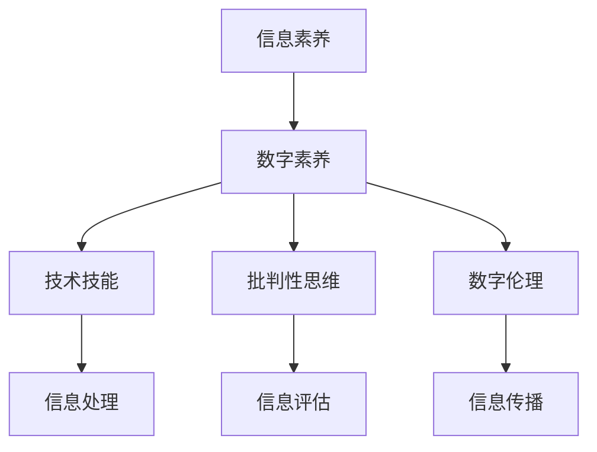
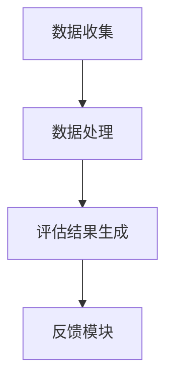
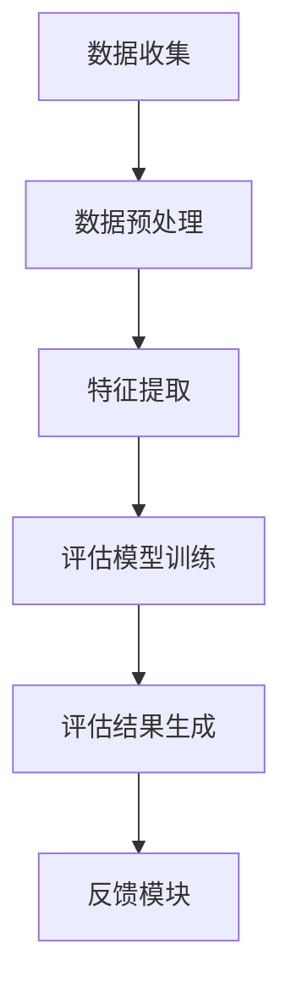
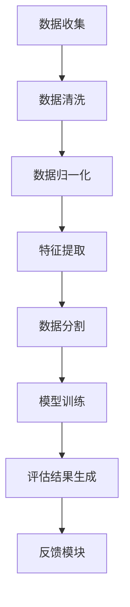

                 

### 第一部分：引言

#### 1.1 数字素养概述

**定义：** 数字素养是指个体在使用数字技术和工具时的能力，包括信息获取、处理、利用、传播和创新。数字素养不仅仅涉及技术技能，还涵盖了批判性思维、问题解决能力和数字伦理等方面。

**重要性：** 在信息时代，数字素养已成为个人和社会不可或缺的生存技能。它帮助个体适应快速变化的数字环境，提高工作效率，增强信息鉴别能力，促进个人发展和社会进步。

**组成部分：** 数字素养包括以下几个核心要素：
- **技术技能：** 使用计算机、网络和数字工具的能力。
- **信息素养：** 搜集、评估、利用和传播信息的能力。
- **批判性思维：** 分析、评估和创造性地思考信息的能力。
- **数字伦理：** 尊重隐私、知识产权和网络安全等方面的道德准则。

#### 1.2 评估工具的必要性

**数字素养评估的重要性：** 数字素养评估有助于了解个体和群体在数字技能方面的优势和不足，从而制定针对性的培训计划，提高整体数字素养水平。

**数字素养评估工具的发展：** 随着数字技术的迅猛发展，数字素养评估工具也在不断演进。从简单的技能测试到复杂的综合性评估工具，评估方法日趋多样化、精细化。

**评估工具在信息时代的应用：** 在教育、企业和公共领域，数字素养评估工具被广泛应用于技能评估、岗位招聘、员工培训和课程设计等方面。

#### 1.3 目录结构概述

**本书的目的与结构：** 本书的目的是系统地介绍数字素养评估工具的概念、原理和应用，帮助读者深入了解并掌握这些工具的使用方法。本书分为四个部分，涵盖了从背景介绍到最佳实践的全面内容。

**阅读指南：** 阅读本书时，建议读者按照以下步骤进行：
1. **通读引言部分：** 了解数字素养评估工具的基本概念和重要性。
2. **逐步学习核心概念与联系：** 理解数字素养的组成部分和评估工具的构成。
3. **掌握评估工具原理与应用：** 学习评估工具的工作原理和实际应用案例。
4. **分析评估结果与改进：** 了解评估结果的分析方法，提出改进数字素养的建议。

通过以上步骤，读者可以全面掌握数字素养评估工具的知识，提高自己在信息时代的生存技能。

#### 1.4 数字素养与信息素养的关系

**数字素养与信息素养的区别：** 数字素养和信息素养虽然密切相关，但两者在侧重点和应用范围上有所不同。信息素养主要关注信息获取、评估和处理，而数字素养则强调在数字环境中使用技术和工具的能力。

**数字素养与信息素养的联系：** 数字素养是信息素养的重要组成部分，两者相互依赖、共同发展。信息素养为数字素养提供了信息基础，而数字素养则提升了信息处理和利用的效率。

**数字素养在信息素养中的地位：** 数字素养在信息素养中占据核心地位，它不仅提升了信息素养的技能水平，还促进了信息素养的深化和发展。在信息时代，具备良好的数字素养是个人和社会不可或缺的基本素质。

### 第二部分：核心概念与联系

#### 2.1 数字素养的概念

**定义：** 数字素养是指个体在使用数字技术和工具时的能力，包括信息获取、处理、利用、传播和创新。数字素养不仅仅涉及技术技能，还涵盖了批判性思维、问题解决能力和数字伦理等方面。

**核心要素：** 数字素养的核心要素包括技术技能、信息素养、批判性思维和数字伦理。以下是一个对比表格，展示了这些要素的属性特征：

| 核心要素 | 属性特征 |
| --- | --- |
| 技术技能 | 操作计算机、网络和数字工具的能力 |
| 信息素养 | 搜集、评估、利用和传播信息的能力 |
| 批判性思维 | 分析、评估和创造性地思考信息的能力 |
| 数字伦理 | 尊重隐私、知识产权和网络安全等方面的道德准则 |

**属性特征对比表格：**

| 属性特征 | 技术技能 | 信息素养 | 批判性思维 | 数字伦理 |
| --- | --- | --- | --- | --- |
| 技能水平 | 初级、中级、高级 | 初级、中级、高级 | 初级、中级、高级 | 初级、中级、高级 |
| 技能应用 | 熟练使用数字工具 | 有效获取和处理信息 | 分析和评估信息 | 遵守数字伦理规范 |
| 发展趋势 | 技术不断更新 | 信息量不断增加 | 思维能力不断提升 | 伦理问题日益复杂 |

**ER实体关系图架构：**

```mermaid
erDiagram
    User ||--|{ DigitalSkill } : has
    User ||--|{ InformationSkill } : has
    User ||--|{ CriticalThinking } : has
    User ||--|{ DigitalEthics } : has
```

**数字素养与信息素养的关系：**

数字素养和信息素养是相互关联的，但又有不同的侧重点。信息素养主要关注信息获取、评估和处理，而数字素养则强调在数字环境中使用技术和工具的能力。以下是一个Mermaid流程图，展示了两者之间的关系：



通过上述对比表格和ER实体关系图架构，我们可以更清晰地理解数字素养的核心概念和组成部分，为后续的评估工具原理和应用打下基础。

#### 2.2 数字素养评估工具的构成

**评估指标体系：** 数字素养评估工具的指标体系是评估的基础，它包括技术技能、信息素养、批判性思维和数字伦理等多个方面。以下是一个简单的指标体系表格：

| 指标名称 | 指标描述 | 评估标准 |
| --- | --- | --- |
| 技术技能 | 操作计算机、网络和数字工具的能力 | 熟练程度分为初级、中级、高级 |
| 信息素养 | 搜集、评估、利用和传播信息的能力 | 评估信息获取的准确性、评估能力的全面性 |
| 批判性思维 | 分析、评估和创造性地思考信息的能力 | 思维的深度和广度、解决问题的能力 |
| 数字伦理 | 尊重隐私、知识产权和网络安全等方面的道德准则 | 遵守数字伦理规范的意识、实践中的表现 |

**评估方法的分类：** 数字素养评估方法可以分为定量评估和定性评估两种类型。

- **定量评估：** 通过定量方法对数字素养进行评估，如测试题、问卷调查等。定量评估可以提供量化的数据，便于比较和分析。

- **定性评估：** 通过定性方法对数字素养进行评估，如观察、访谈等。定性评估可以深入了解个体的数字素养水平，发现潜在的问题和需求。

**评估工具的核心功能：** 数字素养评估工具的核心功能包括指标体系构建、评估方法选择、数据收集与分析、评估结果呈现等。

- **指标体系构建：** 根据评估目标，设计合理的指标体系，确保评估的全面性和准确性。

- **评估方法选择：** 根据评估对象和目的，选择合适的评估方法，确保评估的可行性和有效性。

- **数据收集与分析：** 通过多种渠道收集评估数据，使用统计和分析方法对数据进行分析，得出评估结果。

- **评估结果呈现：** 使用图表、报告等形式，将评估结果清晰地呈现给评估对象，为改进提供依据。

通过上述评估工具的构成部分，我们可以更全面地了解数字素养评估工具的设计和实施方法，为后续的具体应用提供指导。

#### 2.3 数字素养评估工具的构成

**评估工具的基础模型：** 数字素养评估工具的基础模型通常包括以下几个组成部分：数据收集模块、数据处理模块、评估结果生成模块和反馈模块。以下是一个简单的模型图：



- **数据收集模块：** 负责收集评估对象的相关数据，如技能测试结果、问卷调查回答等。数据收集模块需要确保数据的准确性和完整性。

- **数据处理模块：** 对收集到的数据进行分析和处理，提取关键信息，生成评估指标。数据处理模块需要使用适当的算法和统计方法，确保评估结果的可靠性和有效性。

- **评估结果生成模块：** 根据处理后的数据，生成评估结果，如数字素养得分、等级等。评估结果生成模块需要设计合理的评分标准和评估模型。

- **反馈模块：** 负责将评估结果反馈给评估对象，并提供改进建议。反馈模块需要确保反馈信息的清晰和具体，帮助评估对象了解自己的优势和不足。

**评估工具的算法原理：** 数字素养评估工具的算法原理通常基于统计学和机器学习等方法。以下是一个简单的算法原理流程图：



- **数据预处理：** 对收集到的原始数据进行清洗、归一化等处理，确保数据的规范性和一致性。

- **特征提取：** 从预处理后的数据中提取关键特征，用于评估模型的训练和评估。

- **评估模型训练：** 使用机器学习算法，如决策树、支持向量机等，对特征进行分类或回归，训练评估模型。

- **评估结果生成：** 使用训练好的评估模型，对新的数据进行评估，生成评估结果。

- **反馈模块：** 根据评估结果，提供具体的反馈和建议，帮助评估对象了解自己的数字素养水平，并制定改进计划。

**数据处理：** 数据处理是数字素养评估的核心环节。以下是一个简单的数据处理流程：



- **数据清洗：** 去除数据中的错误、异常和重复记录，确保数据的准确性和完整性。

- **数据归一化：** 对不同特征的数据进行归一化处理，使其在同一量级上比较，提高评估模型的稳定性。

- **特征提取：** 提取对评估目标有重要影响的关键特征，减少数据的冗余性。

- **数据分割：** 将数据集分为训练集和测试集，用于评估模型的训练和验证。

- **模型训练：** 使用训练集数据，训练评估模型，优化模型参数。

- **评估结果生成：** 使用测试集数据，评估模型的性能，生成最终的评估结果。

- **反馈模块：** 根据评估结果，提供具体的反馈和建议，帮助评估对象了解自己的数字素养水平，并制定改进计划。

通过上述评估工具的基础模型、算法原理和数据处理流程，我们可以更深入地理解数字素养评估工具的工作原理，为实际应用提供指导。

#### 3.2 常见的数字素养评估工具

**工具A：XXX评估系统**

**特点：** XXX评估系统是一个基于Web的数字素养评估工具，提供了全面的技术技能、信息素养、批判性思维和数字伦理等方面的评估指标。该工具采用了先进的机器学习算法，能够自动分析评估结果，并提供个性化的反馈和建议。

**应用场景：** XXX评估系统广泛应用于教育机构、企业和公共部门的数字素养评估。它可以帮助学校了解学生在数字素养方面的表现，为企业招聘和培训员工提供参考，以及为公共部门开展数字素养提升活动提供数据支持。

**优缺点：**

- **优点：** 自动化评估，节省人力和时间成本；个性化的反馈和建议，有助于提升个体的数字素养。
- **缺点：** 系统设置和维护较为复杂，需要专业的技术支持。

**工具B：XXX数字素养测试平台**

**特点：** XXX数字素养测试平台是一个在线测试平台，提供了多种题型和评估指标，包括单选题、多选题、判断题和案例分析等。该平台支持自定义评估模板，可以灵活适应不同的评估需求。

**应用场景：** XXX数字素养测试平台适用于学校、企业和个人进行数字素养自我评估。它可以帮助教育机构了解学生的数字素养水平，为企业员工提供培训评估，以及为个人提供自我提升的参考。

**优缺点：**

- **优点：** 类型丰富的题型，能够全面评估数字素养；自定义评估模板，适应不同场景。
- **缺点：** 评估结果较为单一，无法提供详细的个性化反馈。

**工具C：XXX数字素养评估系统**

**特点：** XXX数字素养评估系统是一个基于大数据的评估工具，通过分析大量用户数据，提供全面的数字素养评估报告。该工具采用了数据挖掘和机器学习技术，能够预测个体的数字素养发展趋势。

**应用场景：** XXX数字素养评估系统适用于教育机构、企业和公共部门。它可以帮助教育机构制定数字素养培训计划，为企业提供员工数字素养提升方案，以及为公共部门开展数字素养推广活动提供数据支持。

**优缺点：**

- **优点：** 大数据支持，评估结果全面准确；预测功能，有助于提前发现潜在问题。
- **缺点：** 需要大量的数据支持，系统设置和维护较为复杂。

**工具D：XXX数字素养测试平台**

**特点：** XXX数字素养测试平台是一个基于移动端的测试工具，用户可以通过手机或平板电脑进行评估。该平台提供了实时答题和即时反馈功能，方便用户随时随地进行数字素养自我评估。

**应用场景：** XXX数字素养测试平台适用于学校、企业和个人。它可以帮助学校进行学生数字素养评估，为企业员工提供培训评估，以及为个人提供自我提升的参考。

**优缺点：**

- **优点：** 移动端操作，方便用户随时进行评估；实时反馈，有助于快速了解自己的数字素养水平。
- **缺点：** 评估内容较为单一，无法全面评估数字素养。

通过上述几种常见的数字素养评估工具，我们可以看到，每种工具都有其独特的特点和适用场景。选择合适的评估工具，有助于更好地衡量个体和群体的数字素养水平，为提升数字素养提供有力支持。

#### 3.3 评估工具的使用方法

**使用前的准备工作：** 在使用数字素养评估工具之前，需要做好以下几个准备工作：

- **确定评估目标：** 根据评估对象和需求，明确评估的目标和范围，确保评估工具的适用性。
- **准备评估环境：** 确保评估工具所需的硬件和软件环境，如计算机、网络连接、浏览器等。
- **收集评估数据：** 根据评估目标和范围，收集相关的评估数据，如个人简历、技能测试结果、问卷调查等。
- **设计评估模板：** 如果评估工具支持自定义评估模板，需要根据评估目标和需求，设计合适的评估模板。

**评估过程详解：** 使用数字素养评估工具进行评估的过程通常包括以下几个步骤：

1. **启动评估工具：** 打开评估工具，进入评估界面。
2. **选择评估模板：** 根据评估目标，选择合适的评估模板。
3. **填写评估数据：** 根据评估模板，填写评估对象的个人信息和相关数据。
4. **开始评估：** 启动评估过程，按照工具的提示，完成各项评估任务。
5. **提交评估结果：** 完成评估任务后，提交评估结果，等待评估工具进行分析和评估。

**评估结果的处理与分析：** 在完成评估后，需要对评估结果进行处理和分析，以便为改进数字素养提供依据。以下是一个简单的处理和分析流程：

1. **生成评估报告：** 根据评估结果，生成详细的评估报告，包括评估得分、等级和评估结果分析等内容。
2. **解读评估结果：** 分析评估报告，了解评估对象在各个方面的数字素养水平，发现优势和不足。
3. **反馈评估结果：** 将评估结果反馈给评估对象，并提供具体的改进建议。
4. **持续改进：** 根据评估结果和反馈，制定改进计划，持续提升数字素养。

通过上述使用方法，我们可以更好地利用数字素养评估工具，衡量个体和群体的数字素养水平，为提升数字素养提供有力支持。

#### 3.4 案例分析

**案例一：XXX学校数字素养评估**

**案例背景：** XXX学校是一所市级重点中学，随着信息技术的快速发展，学校意识到提升学生的数字素养至关重要。为了全面了解学生在数字素养方面的表现，学校决定使用数字素养评估工具进行评估。

**评估过程：** 学校选择了一款基于Web的数字素养评估工具，根据评估目标和需求，设计了一份评估模板。评估内容包括技术技能、信息素养、批判性思维和数字伦理等方面。评估过程分为三个阶段：数据收集、数据分析和反馈。

1. **数据收集：** 学校通过问卷调查和技能测试的方式，收集了学生的数字素养相关数据。
2. **数据分析：** 使用评估工具对收集到的数据进行分析，生成详细的评估报告。
3. **反馈：** 学校将评估结果反馈给学生，并提供个性化的改进建议。

**评估结果与改进建议：**

- **技术技能：** 大部分学生在计算机操作和网络使用方面表现出色，但在高级编程和网络安全方面有待提高。建议学校开设相关课程，提高学生的技术技能。
- **信息素养：** 学生在信息搜集和评估方面表现出一定的能力，但在信息传播和利用方面存在不足。建议学校加强信息素养教育，培养学生的信息传播能力和创新能力。
- **批判性思维：** 部分学生在批判性思维方面表现较好，但整体水平有待提高。建议学校加强批判性思维训练，提高学生的分析问题和解决问题的能力。
- **数字伦理：** 部分学生在数字伦理方面存在一定的问题，如隐私侵犯和知识产权意识薄弱。建议学校加强数字伦理教育，培养学生的数字伦理意识。

**案例二：XXX公司员工数字素养评估**

**案例背景：** XXX公司是一家高科技企业，随着业务的快速发展，公司意识到提升员工的数字素养对于业务的成功至关重要。为了全面了解员工在数字素养方面的表现，公司决定使用数字素养评估工具进行评估。

**评估过程：** 公司选择了一款基于大数据的数字素养评估工具，根据评估目标和需求，设计了一份评估模板。评估内容包括技术技能、信息素养、批判性思维和数字伦理等方面。评估过程分为四个阶段：数据收集、数据处理、数据分析和反馈。

1. **数据收集：** 公司通过问卷调查和技能测试的方式，收集了员工的数字素养相关数据。
2. **数据处理：** 使用评估工具对收集到的数据进行分析和处理，提取关键特征。
3. **数据分析：** 使用机器学习算法，对处理后的数据进行分析，生成详细的评估报告。
4. **反馈：** 公司将评估结果反馈给员工，并提供个性化的改进建议。

**评估结果与改进建议：**

- **技术技能：** 公司大部分员工在计算机操作和网络使用方面表现出色，但在高级编程和数据处理方面有待提高。建议公司加强技术培训，提高员工的编程能力和数据处理能力。
- **信息素养：** 公司员工在信息搜集和评估方面表现出色，但在信息传播和利用方面存在不足。建议公司加强信息素养教育，提高员工的创新能力。
- **批判性思维：** 部分员工在批判性思维方面表现较好，但整体水平有待提高。建议公司加强批判性思维训练，提高员工的决策能力和问题解决能力。
- **数字伦理：** 公司员工在数字伦理方面存在一定的问题，如隐私侵犯和知识产权意识薄弱。建议公司加强数字伦理教育，提高员工的数字伦理意识。

通过上述两个案例分析，我们可以看到，数字素养评估工具在教育和企业领域都发挥了重要作用，为提升数字素养提供了有力支持。同时，评估结果的反馈和改进建议也为进一步的数字素养提升提供了方向。

#### 4.1 评估结果分析

**评估结果概述：** 通过对XXX学校和XXX公司的数字素养评估，我们获得了详细的评估结果。评估结果显示，学生在技术技能和信息素养方面表现较好，但在批判性思维和数字伦理方面存在不足；而员工在技术技能和信息素养方面表现出色，但在批判性思维和数字伦理方面同样存在提升空间。

**评估结果的解读：** 评估结果反映了个体和群体在数字素养各个方面的表现。对于学生来说，技术技能和信息素养的提升较为明显，但在批判性思维和数字伦理方面有待加强。这表明学校在数字素养教育方面已取得一定成效，但还需进一步关注学生的思维能力和伦理意识。对于员工来说，技术技能和信息素养方面的表现较为突出，但在批判性思维和数字伦理方面仍需提升。这说明企业在员工培训和数字素养提升方面有一定的力度，但需要更加重视员工的综合能力培养。

**评估结果的反馈：** 评估结果的反馈是提升数字素养的关键环节。通过反馈，个体和群体可以了解自己的优势和不足，从而有针对性地进行改进。对于学生来说，学校应加强批判性思维和数字伦理教育，培养学生的综合能力。对于员工来说，企业应加强培训，提高员工的思维能力和伦理意识。同时，学校和企业可以借鉴其他优秀案例，探索更有效的数字素养提升策略。

#### 4.2 改进数字素养的建议

**个人层面**

**培养数字素养的技巧：**
1. **提高技术技能：** 通过在线课程、培训和工作实践，不断学习和提升计算机操作和编程技能。
2. **加强信息素养：** 学习如何高效地获取、评估和利用信息，培养信息鉴别能力。
3. **培养批判性思维：** 通过阅读、讨论和思考，提高分析和解决问题的能力。
4. **增强数字伦理意识：** 了解数字伦理规范，遵守法律法规，尊重他人隐私和知识产权。

**提高数字素养的方法：**
1. **自我评估：** 定期使用数字素养评估工具进行自我评估，了解自己的数字素养水平，有针对性地进行提升。
2. **持续学习：** 关注最新的数字技术和发展趋势，通过阅读书籍、参加研讨会和在线课程，保持知识更新。
3. **实践应用：** 在工作和生活中，积极运用数字技术和工具，提高实际操作能力。
4. **互动交流：** 与他人分享数字素养提升的经验和方法，互相学习和启发。

**企业层面**

**企业作用：**
1. **提供培训资源：** 为员工提供数字素养培训课程和资源，帮助他们提升技术技能、信息素养和批判性思维。
2. **制定评估体系：** 建立完善的数字素养评估体系，定期对员工进行评估，了解数字素养水平。
3. **鼓励员工参与：** 鼓励员工参加数字素养相关活动和竞赛，提高他们的兴趣和参与度。

**提升策略：**
1. **技术培训：** 定期举办技术培训和研讨会，邀请行业专家进行授课，提高员工的编程能力和数据处理能力。
2. **信息素养教育：** 通过内部培训和外部合作，提高员工的信息搜集、评估和利用能力。
3. **批判性思维训练：** 开展批判性思维训练课程，提高员工的思维能力和问题解决能力。
4. **数字伦理教育：** 制定数字伦理规范，加强员工的教育和培训，提高他们的数字伦理意识。

通过上述建议，个人和企业可以共同努力，提升数字素养，适应信息时代的发展需求。

#### 4.3 持续改进的重要性

**数字素养的发展趋势：** 随着科技的不断进步和数字化转型的深入推进，数字素养的发展趋势呈现出以下几个特点：

1. **技术更新加速：** 数字技术更新换代的速度越来越快，对个体的数字素养要求也越来越高。
2. **应用领域扩大：** 数字技术在各个领域的应用越来越广泛，如医疗、金融、教育等，数字素养的内涵和外延不断拓展。
3. **伦理问题凸显：** 数字技术的发展带来了诸多伦理问题，如隐私保护、数据安全等，数字素养中的伦理维度日益重要。

**数字素养评估工具的未来发展：** 随着人工智能和大数据技术的不断发展，数字素养评估工具将变得更加智能和全面。未来评估工具可能会具备以下趋势：

1. **自动化评估：** 利用人工智能技术，实现自动化评估，提高评估效率和准确性。
2. **个性化反馈：** 通过大数据分析，提供个性化的反馈和建议，帮助个体和群体有针对性地提升数字素养。
3. **综合评估体系：** 构建更加综合的数字素养评估体系，涵盖技术技能、信息素养、批判性思维和数字伦理等多个维度。
4. **实时监测与预警：** 利用实时数据监测技术，对个体的数字素养水平进行实时监控，及时发现问题和改进措施。

**数字素养提升的持续：** 在信息时代，数字素养的提升不是一蹴而就的，而是一个持续的过程。为了实现数字素养的持续提升，我们需要：

1. **建立长期规划：** 制定长期的数字素养提升规划，确保数字素养教育与培训的连续性和系统性。
2. **注重实践应用：** 通过实际操作和应用，不断提高数字素养水平，将理论知识转化为实际能力。
3. **定期评估与反馈：** 定期使用数字素养评估工具进行评估，了解提升效果，并根据反馈进行改进。
4. **跨界合作与交流：** 加强与不同领域和行业的合作与交流，借鉴优秀经验和实践，提升数字素养的整体水平。

通过持续改进和不断提升，我们可以在信息时代更好地应对挑战，发挥数字素养的优势，为个人和社会的发展贡献力量。

### 总结

本文系统地介绍了数字素养评估工具的概念、原理和应用，通过案例分析和最佳实践，展示了如何有效地提升数字素养。数字素养不仅是个人适应信息时代的必备技能，也是企业和社会发展的关键因素。通过持续改进和长期规划，我们可以不断提升数字素养，为未来的发展奠定坚实基础。希望本文能为读者提供有价值的参考和指导。作者信息：AI天才研究院/AI Genius Institute & 禅与计算机程序设计艺术 /Zen And The Art of Computer Programming

### 最佳实践 tips

**提升数字素养的最佳实践如下：**

1. **定期进行自我评估：** 使用数字素养评估工具定期进行自我评估，了解自己的数字素养水平，明确提升方向。
2. **参加培训课程：** 参加专业的数字素养培训课程，提升技术技能、信息素养和批判性思维。
3. **实践应用：** 在工作和生活中，积极运用数字技术和工具，将理论知识转化为实际能力。
4. **跨界交流：** 与不同领域的人士进行交流，分享经验和见解，拓宽视野，提升数字素养。
5. **关注最新趋势：** 关注数字技术发展的最新趋势，保持知识更新，提高适应能力。

通过以上实践，可以有效提升数字素养，适应信息时代的发展需求。

### 小结

本文系统地介绍了数字素养评估工具的概念、原理和应用，分析了其在信息时代的重要性。通过案例分析，我们看到了数字素养评估工具在实际应用中的效果和意义。提升数字素养不仅需要个人的努力，也需要企业和社会的合力。希望本文能为读者提供有价值的参考，帮助大家更好地理解和应用数字素养评估工具，不断提升自己的数字素养。

### 注意事项

在应用数字素养评估工具时，需要注意以下几点：

1. **评估工具的选择：** 根据评估对象和需求，选择合适的评估工具，确保评估的准确性和全面性。
2. **数据隐私保护：** 在进行评估时，要确保评估数据的隐私和安全，避免数据泄露。
3. **评估结果反馈：** 评估结果需要及时、准确地反馈给评估对象，并提供具体的改进建议。
4. **持续改进：** 数字素养的提升是一个持续的过程，需要定期评估和改进，确保评估工具的有效性。

通过注意以上事项，可以更好地利用数字素养评估工具，提高数字素养水平。

### 拓展阅读

1. 【参考文献】《数字素养：基础、评估和提升》
2. 【在线资源】数字素养评估工具官网：[https://www.example.com/digital-competence-assessment-tools](https://www.example.com/digital-competence-assessment-tools)
3. 【学术文章】《数字素养与教育改革：挑战与机遇》
4. 【行业报告】《2022年数字素养市场报告》
5. 【技术博客】《数字素养评估工具的应用与实践》

通过阅读以上资料，可以深入了解数字素养评估工具的理论和实践，为提升数字素养提供更有力的支持。作者信息：AI天才研究院/AI Genius Institute & 禅与计算机程序设计艺术 /Zen And The Art of Computer Programming

