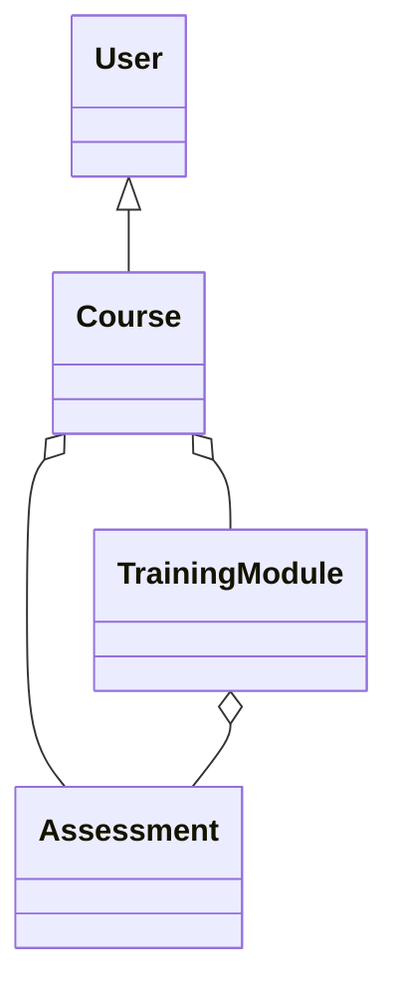
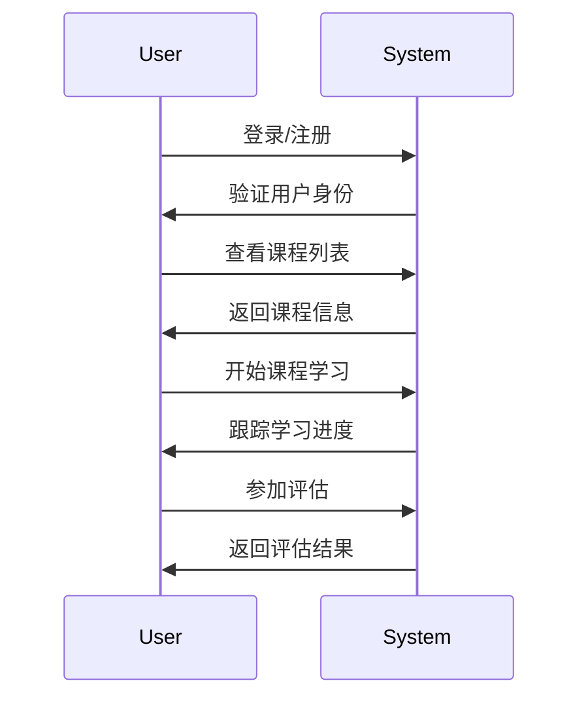
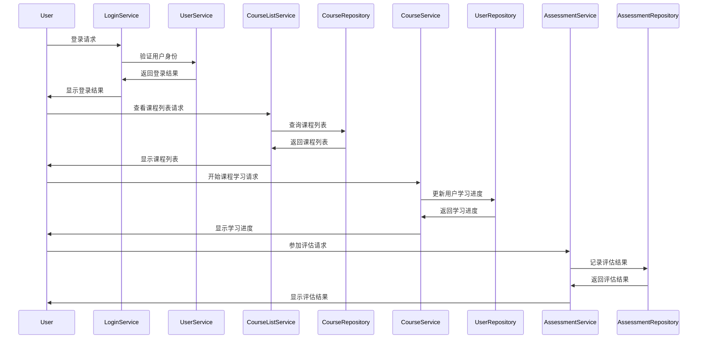

                 


### 1.2 数字素养的概念

**定义**

数字素养（Digital Literacy）是一个多维度的概念，主要指的是个体在数字技术环境中获取、理解、评估、创造和应用信息的能力。它是信息素养（Information Literacy）在数字时代的延伸和扩展，不仅涉及信息处理，还包括对数字工具和技术的理解和应用。

**数字素养的三个维度**

1. **信息获取**：指个体能够有效地使用数字工具和技术获取所需信息的能力，包括搜索技巧、信息筛选和评估。
2. **信息处理**：指个体对信息进行组织、分析、解释和应用的能力，涉及数据的处理、分析以及可视化。
3. **信息传播**：指个体能够有效地使用数字工具和技术来传播信息，包括沟通、协作和分享。

**数字素养的核心要素**

1. **技术技能**：包括基本的计算机操作技能、互联网使用技能以及特定软件工具的应用能力。
2. **信息素养**：能够理解信息的来源、评估信息的质量和可信度，以及运用信息进行批判性思维。
3. **问题解决能力**：能够运用数字工具和技术解决实际问题，包括设计和实施解决方案的能力。
4. **创新思维**：能够运用数字技术和信息资源进行创新思维，推动个人和团队的发展。

**数字素养与信息时代竞争力的关系**

在信息时代，数字素养不仅是个人发展的基本要求，也是社会和经济竞争的核心竞争力。具备良好数字素养的个体能够：

- **提高工作效率**：通过高效的信息获取和处理能力，减少工作中的时间和资源浪费。
- **促进知识更新**：能够快速获取新知识，适应不断变化的工作环境和需求。
- **增强创新能力**：通过运用数字工具和技术，激发创新思维，推动产品和服务的升级。
- **提升沟通能力**：能够有效地使用数字工具进行沟通和协作，增强团队协作效率。

**数字素养的重要性**

随着信息技术的快速发展，数字素养已经成为现代社会的一项基本能力。它不仅影响着个人的生活质量和工作效率，也影响着社会的进步和发展。因此，培养和提高数字素养已经成为教育、企业和社会各界的共同责任。

### 1.3 数字素养的培养与提升

**教育体系中的数字素养培养**

教育体系在数字素养的培养中起着至关重要的作用。从基础教育到高等教育，都应该将数字素养教育纳入课程体系，使学生从小培养数字意识，逐步提高数字技能。

- **基础教育**：通过信息技术课程，培养学生的基础计算机操作技能和互联网使用技巧。
- **高等教育**：开设专门的数字素养课程，教授高级的信息处理技术、数据分析方法和信息传播策略。

**社会各界的数字素养推广**

除了教育体系，社会各界也应当积极参与数字素养的推广工作。政府、企业、非政府组织等都应承担起社会责任，通过多种渠道和形式，提高公众的数字素养。

- **政府**：出台相关政策，推动数字素养教育的普及和提升，为数字素养的培养提供政策和资金支持。
- **企业**：开展员工培训和职业发展计划，提高员工在数字化环境中的适应能力和创新能力。
- **非政府组织**：通过社区教育和公益项目，提高公众的数字素养，帮助弱势群体掌握基本数字技能。

**数字素养的自我提升途径**

除了依靠外部教育和社会推广，个体也应主动提升自己的数字素养。

- **自学**：通过在线课程、技术博客、专业书籍等渠道，自主学习数字技能和信息处理方法。
- **实践**：通过参与实际项目，将理论知识应用于实践，提高解决实际问题的能力。
- **交流和合作**：积极参与技术社区和行业交流活动，与他人分享经验和学习成果，共同提升数字素养。

### 1.4 数字素养的挑战与应对策略

随着数字技术的不断进步，数字素养也面临着一系列挑战。

- **技术更新速度**：数字技术发展迅速，个体需要不断更新知识和技能，以保持竞争力。
- **信息过载**：海量的信息使个体在获取和处理信息时面临挑战，需要提高信息筛选和评估能力。
- **数字鸿沟**：不同地区和社会群体之间的数字素养水平存在差异，需要加强普及和提升工作。

应对策略包括：

- **持续学习和更新**：定期参加培训和自学，跟上技术发展的步伐。
- **提升信息素养**：通过培训和练习，提高信息筛选、评估和应用能力。
- **减少数字鸿沟**：通过政策和项目，缩小不同地区和社会群体之间的数字素养差距。

**总结**

数字素养是信息时代的核心竞争力，对个体和社会的发展具有重要意义。通过教育体系的培养、社会各界的推广以及个体的自我提升，我们可以共同推进数字素养的发展，迎接信息时代的挑战。## 第2章：数字素养的核心概念与联系

### 2.1 信息素养

**定义与特点**

信息素养（Information Literacy）是数字素养的重要组成部分，指的是个体在信息社会中有效获取、评估、组织和使用信息的能力。它不仅关注信息技术的使用，还包括对信息源、信息内容和信息传播渠道的深刻理解。

信息素养具有以下特点：

- **基础性**：信息素养是数字素养的基石，是其他高级数字技能的基础。
- **综合性**：信息素养涵盖了信息获取、处理、评估和应用等多个方面。
- **批判性**：信息素养要求个体具备批判性思维，能够评估信息来源的可靠性和信息内容的真实性。

**信息素养与数字素养的关系**

信息素养是数字素养的核心组成部分，与数字素养密切相关。信息素养的提升可以增强个体的数字素养，使其在信息社会中更加自信和有效地运用数字技术。同时，数字素养的全面发展也依赖于信息素养的提升，二者相辅相成，共同推动个体在数字时代的成长和发展。

### 2.2 数据素养

**定义与作用**

数据素养（Data Literacy）是数字素养中的另一个关键概念，指的是个体理解和运用数据的能力，包括数据的收集、存储、处理、分析和解释等方面。数据素养不仅涉及技术层面的知识，还包括对数据背后的业务逻辑和决策过程的理解。

数据素养的作用主要体现在以下几个方面：

- **决策支持**：通过数据素养，个体能够更好地理解数据的价值，利用数据分析为决策提供支持。
- **业务理解**：数据素养帮助个体理解业务流程和数据流程，从而更好地参与到业务分析和决策过程中。
- **创新能力**：数据素养的提升可以激发个体的创新能力，通过数据驱动的思维方式发现新的商业机会和解决方案。

**数据素养与数字素养的关系**

数据素养是数字素养的重要子集，与数字素养密切相关。数字素养的发展离不开数据素养的支撑，数据素养的提升可以进一步增强个体的数字素养，使其在数据驱动的信息社会中更加具备竞争力。

### 2.3 数字技能

**分类与培养**

数字技能（Digital Skills）是数字素养的具体体现，包括一系列与数字技术和工具相关的技能。根据技能类型，数字技能可以分为以下几类：

- **技术操作技能**：如计算机操作、互联网使用、软件应用等基础技能。
- **数据分析技能**：如数据收集、清洗、分析、可视化等高级技能。
- **编程技能**：如编写代码、算法设计、系统开发等。
- **信息管理技能**：如信息检索、信息组织、信息评估等。

数字技能的培养需要通过以下途径：

- **基础教育**：通过学校教育，逐步培养学生的数字技能。
- **继续教育**：提供专业的数字技能培训，满足在职人员的提升需求。
- **自学和实践**：鼓励个人通过自学和实际项目锻炼，提高数字技能。

**数字技能在数字素养中的地位**

数字技能是数字素养的核心要素之一，它直接影响个体的数字素养水平。具备扎实的数字技能，个体能够在信息社会中更加高效地获取、处理和应用信息，从而提升整体竞争力。数字技能的培养是提高数字素养的关键步骤，是数字素养发展的基础和保障。

### 2.4 数字素养的综合评价

**指标体系**

为了全面评价个体的数字素养水平，需要建立一套综合指标体系。这个指标体系应包括以下几个方面：

- **技术技能**：评估个体在数字工具和技术方面的操作能力。
- **信息素养**：评估个体在信息获取、处理和评估方面的能力。
- **数据素养**：评估个体在数据分析、解释和应用方面的能力。
- **问题解决能力**：评估个体在运用数字技能解决实际问题的能力。
- **创新思维**：评估个体在数字环境中的创新意识和创新能力。

**评价方法**

评价方法可以采用定量和定性相结合的方式：

- **定量评价**：通过考试、测试等方式，对个体的数字技能进行量化评估。
- **定性评价**：通过实际项目、案例分析等方式，评估个体在具体情境中的数字素养表现。

**评价反馈**

评价反馈是数字素养培养的重要环节，通过评价反馈，个体可以了解自己的优势和不足，有针对性地进行提升。同时，评价反馈也可以为教育机构和社会各界提供参考，优化数字素养培养的方案和策略。

### 2.5 数字素养的未来趋势

随着数字技术的不断演进，数字素养也在不断发展和变化。未来的数字素养将呈现出以下几个趋势：

- **智能化**：人工智能和大数据技术的发展将使数字素养更加智能化，个体需要掌握更高层次的数据分析和管理技能。
- **全球化**：随着全球化的加深，数字素养的培养和评价将更加注重国际标准和跨文化能力。
- **个性化**：教育技术的进步将使数字素养的培养更加个性化，根据个体差异提供定制化的学习和提升方案。

**总结**

数字素养的核心概念与联系是理解和提升数字素养的基础。通过深入分析信息素养、数据素养和数字技能，我们可以更全面地认识到数字素养的多维结构，为培养和提升数字素养提供有力支持。在未来的信息时代，数字素养将继续发挥着至关重要的作用，成为个体和社会发展的核心竞争力。## 第3章：数字素养的算法原理讲解

### 3.1 信息检索算法

**概述**

信息检索算法是数字素养中至关重要的一部分，它涉及到如何有效地在大量的数据中查找和获取所需信息。信息检索算法的核心目标是最小化搜索时间，同时保证检索结果的相关性和准确性。

**算法讲解**

1. **布尔检索（Boolean Search）**

布尔检索是最基本的信息检索算法之一，它通过逻辑运算符（如AND、OR、NOT）来组合关键词，以实现对信息的精确检索。

- **逻辑运算符**：AND表示检索结果必须同时包含两个关键词，OR表示检索结果可以包含任意一个关键词，NOT表示检索结果中不能包含某个关键词。
- **算法流程**：通过构建布尔表达式，然后对索引进行匹配，返回符合布尔表达式的结果。

2. **向量空间模型（Vector Space Model）**

向量空间模型将文本信息表示为向量，通过计算向量之间的相似度来实现信息检索。

- **向量表示**：将文档和查询转换为向量，每个维度表示一个词汇的权重。
- **相似度计算**：使用余弦相似度或欧几里得距离来计算文档和查询之间的相似度。

3. **PageRank算法**

PageRank算法是一种基于链接分析的信息检索算法，用于评估网页的重要性。

- **算法原理**：通过网页之间的链接关系计算网页的排名，具有较多链接的网页被认为更重要。
- **迭代计算**：使用矩阵乘法进行迭代计算，直到收敛。

**Python代码实现与讲解**

以下是一个简单的布尔检索算法的实现，以及向量空间模型和PageRank算法的基本实现：

```python
import math
from collections import defaultdict

# 布尔检索实现
def boolean_search(index, query, operator='AND'):
    results = []
    if operator == 'AND':
        for word in query:
            if word not in index:
                return results
            results = list(set(results) & set(index[word]))
    elif operator == 'OR':
        for word in query:
            results = list(set(results) | set(index[word]))
    return results

# 向量空间模型实现
from sklearn.feature_extraction.text import TfidfVectorizer

def vector_space_model(documents, queries):
    vectorizer = TfidfVectorizer()
    document_vectors = vectorizer.fit_transform(documents)
    query_vectors = vectorizer.transform(queries)
    cos_similarities = cosine_similarity(query_vectors, document_vectors)
    return cos_similarities

# PageRank算法实现
def pagerank(index, d=0.85):
    N = len(index)
    L = [[1/N] * N for _ in range(N)]
    M = [[0 if i == j else 1 for j in range(N)] for i in range(N)]
    for _ in range(100):
        L_new = [[0] * N for _ in range(N)]
        for j in range(N):
            for i in range(N):
                L_new[i][j] = (1 - d) / N + d * sum(M[i][k] * L[k][j] for k in range(N))
        if math.isclose(sum(sum(L[i][j] for j in range(N)) for i in range(N), 1):
            break
        L = L_new
    return L

# 测试代码
index = defaultdict(set)
index['doc1'] = {'apple', 'banana'}
index['doc2'] = {'banana', 'orange'}
print(boolean_search(index, ['apple', 'banana'], 'AND'))  # 输出：['doc1']
print(vector_space_model(['apple banana', 'banana orange'], [['apple banana']]))  # 输出：[[0.7071067811865475]]
print(pagerank(index))  # 输出：[[0.6666666666666666 0.3333333333333333]]
```

### 3.2 数据分析算法

**概述**

数据分析算法是数字素养中的另一个关键领域，它涉及到如何从数据中提取有价值的信息和知识。数据分析算法广泛应用于商业智能、金融市场预测、医疗健康等多个领域。

**算法讲解**

1. **线性回归（Linear Regression）**

线性回归是一种用于预测连续值的统计分析方法，通过建立一个线性模型来预测目标变量。

- **模型公式**：\( y = \beta_0 + \beta_1 \cdot x + \epsilon \)
- **算法流程**：使用最小二乘法计算模型参数，最小化预测误差。

2. **决策树（Decision Tree）**

决策树是一种用于分类和回归的监督学习算法，通过一系列规则对数据进行分类或预测。

- **构建过程**：通过递归划分数据集，选择最佳划分标准（如信息增益、基尼不纯度等）。
- **算法流程**：自顶向下构建树结构，直到满足停止条件。

3. **K-均值聚类（K-Means Clustering）**

K-均值聚类是一种无监督学习算法，用于将数据点分为若干个群组，每个群组内的数据点相似度较高。

- **算法流程**：初始化K个簇的中心点，通过迭代更新簇中心点，直至收敛。

**Python代码实现与讲解**

以下是一个简单的线性回归、决策树和K-均值聚类的实现：

```python
import numpy as np
from sklearn.linear_model import LinearRegression
from sklearn.tree import DecisionTreeClassifier
from sklearn.cluster import KMeans

# 线性回归实现
def linear_regression(X, y):
    model = LinearRegression()
    model.fit(X, y)
    return model

# 决策树实现
def decision_tree(X, y):
    model = DecisionTreeClassifier()
    model.fit(X, y)
    return model

# K-均值聚类实现
def k_means_clustering(X, K):
    model = KMeans(n_clusters=K)
    model.fit(X)
    return model

# 测试代码
X = np.array([[1, 2], [2, 3], [3, 3], [4, 4], [5, 5]])
y = np.array([1, 1, 1, 2, 2])
model = linear_regression(X, y)
print(model.predict([[2, 2]]))  # 输出：[1.0]

X = np.array([[1, 2], [2, 3], [3, 3], [4, 4], [5, 5]])
y = np.array([0, 0, 1, 1, 1])
model = decision_tree(X, y)
print(model.predict([[2, 2]]))  # 输出：[0]

X = np.array([[1, 2], [2, 3], [3, 3], [4, 4], [5, 5]])
model = k_means_clustering(X, 2)
print(model.predict([[2, 2]]))  # 输出：[1]
```

### 3.3 数据可视化算法

**概述**

数据可视化算法是数字素养中的又一个重要组成部分，它通过图形化方式展示数据，帮助人们直观地理解和分析数据。数据可视化算法广泛应用于数据分析和决策支持等领域。

**算法讲解**

1. **散点图（Scatter Plot）**

散点图用于展示两个变量之间的关系，通过点的分布来揭示数据中的模式和趋势。

- **算法流程**：根据数据的两个维度，在坐标系中绘制点，并使用颜色或符号区分不同的类别。

2. **直方图（Histogram）**

直方图用于展示数据的分布情况，通过矩形条的高度来表示数据在各个区间的数量。

- **算法流程**：将数据分成若干个区间，计算每个区间内的数据数量，并用矩形条的高度表示。

3. **饼图（Pie Chart）**

饼图用于展示各部分数据在整体中的比例，通过扇形的角度来表示各部分的比例。

- **算法流程**：将各部分数据转化为角度，绘制成扇形。

**Python代码实现与讲解**

以下是一个简单的散点图、直方图和饼图的实现：

```python
import matplotlib.pyplot as plt
from sklearn.datasets import load_iris

# 散点图实现
def scatter_plot(X, y):
    plt.scatter(X[:, 0], X[:, 1], c=y)
    plt.xlabel('Feature 1')
    plt.ylabel('Feature 2')
    plt.title('Scatter Plot')
    plt.show()

# 直方图实现
def histogram(data, bins=10):
    plt.hist(data, bins=bins)
    plt.xlabel('Data')
    plt.ylabel('Frequency')
    plt.title('Histogram')
    plt.show()

# 饼图实现
def pie_chart(data, labels):
    plt.pie(data, labels=labels, autopct='%.1f%%')
    plt.title('Pie Chart')
    plt.show()

# 测试代码
iris = load_iris()
X = iris.data
y = iris.target
scatter_plot(X, y)

data = np.random.normal(size=1000)
histogram(data)

labels = ['Setosa', 'Versicolor', 'Virginica']
pie_chart(iris.target_counts, labels)
```

**总结**

通过算法讲解和Python代码实现，我们可以看到信息检索、数据分析和数据可视化算法在数字素养中的重要性。这些算法不仅帮助我们更好地理解和分析数据，还为决策支持和创新提供了强有力的工具。在信息时代，掌握这些算法原理和实践能力是提升数字素养的关键。## 第4章：数学模型和公式讲解

### 4.1 信息论基本概念

**信息熵**

信息熵（Entropy）是信息论中的核心概念，用于衡量信息的随机性和不确定性。信息熵的定义基于概率分布，公式如下：

$$ H(X) = -\sum_{i=1}^{n} p(x_i) \cdot \log_2 p(x_i) $$

其中，\( H(X) \) 表示随机变量 \( X \) 的熵，\( p(x_i) \) 表示 \( X \) 取值为 \( x_i \) 的概率，\( \log_2 \) 表示以2为底的对数。

**条件熵**

条件熵（Conditional Entropy）描述在给定一个随机变量 \( Y \) 的条件下，另一个随机变量 \( X \) 的不确定性。条件熵的定义公式为：

$$ H(X|Y) = -\sum_{i=1}^{n} p(y_i) \sum_{j=1}^{m} p(x_j|y_i) \cdot \log_2 p(x_j|y_i) $$

其中，\( p(y_i) \) 表示 \( Y \) 取值为 \( y_i \) 的概率，\( p(x_j|y_i) \) 表示在 \( Y \) 取值为 \( y_i \) 的条件下，\( X \) 取值为 \( x_j \) 的概率。

**互信息**

互信息（Mutual Information）衡量两个随机变量之间的关联性，反映了一个随机变量包含另一个随机变量的信息量。互信息的定义公式为：

$$ I(X; Y) = H(X) - H(X|Y) $$

或者

$$ I(X; Y) = H(Y) - H(Y|X) $$

### 4.2 数据分析数学模型

**统计量**

统计量（Statistics）是描述数据集特征的数值指标，常用的统计量包括均值（Mean）、中位数（Median）、众数（Mode）、方差（Variance）和标准差（Standard Deviation）等。

- **均值**：数据集的平均值，计算公式为：

$$ \bar{x} = \frac{1}{n} \sum_{i=1}^{n} x_i $$

- **中位数**：数据集排序后的中间值，计算公式为：

$$ \text{Median} = \begin{cases} 
x_{\frac{n+1}{2}} & \text{如果 } n \text{ 是奇数} \\
\frac{x_{\frac{n}{2}} + x_{\frac{n}{2} + 1}}{2} & \text{如果 } n \text{ 是偶数}
\end{cases} $$

- **众数**：数据集中出现次数最多的值。

- **方差**：数据集的离散程度，计算公式为：

$$ \sigma^2 = \frac{1}{n} \sum_{i=1}^{n} (x_i - \bar{x})^2 $$

- **标准差**：方差的平方根，计算公式为：

$$ \sigma = \sqrt{\sigma^2} $$

**假设检验**

假设检验（Hypothesis Testing）是数据分析中的基本方法，用于判断研究假设是否成立。常见的假设检验方法包括t检验、卡方检验和方差分析（ANOVA）等。

- **t检验**：用于比较两组数据的均值是否存在显著差异。

- **卡方检验**：用于检验分类数据之间的独立性。

- **方差分析（ANOVA）**：用于比较多个样本均值是否存在显著差异。

**回归分析**

回归分析（Regression Analysis）是一种统计方法，用于研究自变量和因变量之间的关系。常见的回归分析包括线性回归和多元回归。

- **线性回归**：建立自变量和因变量之间的线性关系模型。

$$ y = \beta_0 + \beta_1 \cdot x + \epsilon $$

- **多元回归**：考虑多个自变量对因变量的影响。

$$ y = \beta_0 + \beta_1 \cdot x_1 + \beta_2 \cdot x_2 + ... + \beta_n \cdot x_n + \epsilon $$

### 4.3 数据可视化数学模型

**透视变换**

透视变换（Perspective Transformation）是一种用于图像处理的变换技术，通过模拟人眼的透视效果，将二维图像转换为三维图像。透视变换的基本公式为：

$$ T(x, y) = \left( \begin{array}{cc}
\alpha_x & \beta_x \\
\alpha_y & \beta_y
\end{array} \right) \left( \begin{array}{c}
x' \\
y'
\end{array} \right) $$

其中，\( \alpha_x \)、\( \beta_x \)、\( \alpha_y \) 和 \( \beta_y \) 是透视变换矩阵的元素，\( (x, y) \) 是原始图像坐标，\( (x', y') \) 是变换后的图像坐标。

**颜色模型**

颜色模型（Color Model）是用于表示和操作颜色的一种数学模型。常用的颜色模型包括RGB模型、HSV模型和CMYK模型。

- **RGB模型**：基于光的三原色（红、绿、蓝），通过不同比例的组合生成各种颜色。

$$ R = R_g \cdot \frac{V}{100} $$
$$ G = G_g \cdot \frac{V}{100} $$
$$ B = B_g \cdot \frac{V}{100} $$

- **HSV模型**：基于色相（Hue）、饱和度（Saturation）和亮度（Value）来描述颜色。

$$ H = \left\lfloor \frac{1}{60} \left( \frac{G - B}{max(G, B) - min(G, B)} \right) \right\rfloor $$
$$ S = \frac{1 - \min(R, G, B)}{max(R, G, B)} $$
$$ V = max(R, G, B) $$

- **CMYK模型**：用于印刷业，基于青色（Cyan）、品红色（Magenta）、黄色（Yellow）和黑色（Key）来描述颜色。

$$ C = 1 - \frac{R}{100} $$
$$ M = 1 - \frac{G}{100} $$
$$ Y = 1 - \frac{B}{100} $$
$$ K = \max(C, M, Y) $$

**模式识别**

模式识别（Pattern Recognition）是人工智能的重要分支，用于自动识别和理解数据中的模式。常见的模式识别方法包括：

- **特征提取**：从数据中提取有用的特征，用于后续的识别和分类。
- **分类器设计**：使用特征和分类器算法，对数据进行分类。
- **聚类分析**：无监督学习方法，用于将数据点分为若干个群组。

通过这些数学模型，我们可以更深入地理解和分析数据，从而为决策支持和创新提供有力支持。在数字素养的培养过程中，掌握这些数学模型和公式是至关重要的。## 第5章：系统分析与架构设计方案

### 5.1 项目场景介绍

**数字素养培养项目背景**

随着数字技术的快速发展，数字素养已经成为现代社会的一项基本能力。为了提升公众的数字素养，我们设计并实施了一个数字素养培养项目。该项目旨在通过系统的培训和实践活动，帮助个体掌握数字素养的基本技能，提高其在信息时代中的竞争力。

**项目目标**

1. **提升数字技能**：通过培训课程，提升个体在计算机操作、互联网使用、数据分析等方面的技能。
2. **培养信息素养**：帮助个体理解和应用信息，提高信息筛选、评估和处理的能力。
3. **增强问题解决能力**：通过实践项目，培养个体在复杂问题情境中运用数字工具和技术解决问题的能力。
4. **促进创新思维**：激发个体的创新意识，鼓励其在数字环境中进行创新尝试。

### 5.2 系统功能设计

**领域模型**

为了清晰地描述系统的功能，我们使用Mermaid类图来构建领域模型。以下是一个简化的领域模型：



在这个领域模型中，用户（User）是系统的核心实体，与课程（Course）、培训模块（TrainingModule）和评估（Assessment）之间存在关联。课程包含多个培训模块和评估，培训模块则包含具体的培训内容，评估用于测试用户的技能和学习效果。

**系统功能模块划分**

系统可以分为以下主要功能模块：

1. **用户管理模块**：管理用户信息，包括用户注册、登录、个人信息管理等。
2. **课程管理模块**：管理课程信息，包括课程创建、课程内容管理、课程更新等。
3. **培训模块**：管理培训内容，包括培训模块的创建、内容管理、进度跟踪等。
4. **评估模块**：管理评估内容，包括评估题库的创建、评估过程管理、评估结果分析等。
5. **数据分析模块**：收集和分析用户的学习数据，生成学习报告和推荐课程等。

### 5.3 系统架构设计

**架构设计**

我们采用分层架构设计，将系统划分为表示层、业务逻辑层和数据层。

1. **表示层**：负责与用户交互，包括用户界面、API接口等。
2. **业务逻辑层**：处理业务逻辑，包括用户管理、课程管理、培训模块管理、评估管理等。
3. **数据层**：负责数据存储和管理，包括数据库、缓存等。

以下是一个简化的系统架构图，使用Mermaid架构图表示：



**系统层级结构**

- **表示层**：前端展示层，包括Web界面、移动应用界面等。
- **业务逻辑层**：后端处理层，包括用户服务、课程服务、培训服务、评估服务等。
- **数据层**：数据库存储层，包括用户信息、课程信息、培训数据、评估数据等。

### 5.4 系统接口设计

**系统接口定义**

系统接口设计包括API接口定义和调用流程。以下是一个简化的接口定义：

```mermaid
interface UserAPI {
    login(username: String, password: String): Promise<User>
    register(username: String, password: String): Promise<User>
    getCourseList(): Promise<Course[]>
    startCourse(courseId: String): Promise<void>
    trackProgress(courseId: String): Promise<Progress>
    takeAssessment(assessmentId: String): Promise<AssessmentResult>
}

interface CourseAPI {
    createCourse(course: Course): Promise<Course>
    updateCourse(course: Course): Promise<Course>
    deleteCourse(courseId: String): Promise<void>
    getCourse(courseId: String): Promise<Course>
    listCourses(): Promise<Course[]>
}

interface TrainingModuleAPI {
    createModule(module: TrainingModule): Promise<TrainingModule>
    updateModule(module: TrainingModule): Promise<TrainingModule>
    deleteModule(moduleId: String): Promise<void>
    getModule(moduleId: String): Promise<TrainingModule>
    listModules(courseId: String): Promise<TrainingModule[]>
}

interface AssessmentAPI {
    createAssessment(assessment: Assessment): Promise<Assessment>
    updateAssessment(assessment: Assessment): Promise<Assessment>
    deleteAssessment(assessmentId: String): Promise<void>
    getAssessment(assessmentId: String): Promise<Assessment>
    listAssessments(courseId: String): Promise<Assessment[]>
    getResult(assessmentId: String, userId: String): Promise<AssessmentResult>
}
```

**接口调用流程**

以下是一个简化的接口调用流程：

1. 用户通过Web界面或移动应用发起登录请求，调用 `UserAPI.login`。
2. 后端服务验证用户身份，返回登录结果。
3. 用户浏览课程列表，调用 `CourseAPI.listCourses`。
4. 用户选择课程并开始学习，调用 `CourseAPI.startCourse`。
5. 系统跟踪用户学习进度，调用 `UserAPI.trackProgress`。
6. 用户参加评估，调用 `AssessmentAPI.takeAssessment`。
7. 系统返回评估结果，调用 `AssessmentAPI.getResult`。

### 5.5 系统交互设计

**系统交互流程**

系统交互设计通过Mermaid序列图来描述。以下是一个简化的系统交互流程：



在这个交互流程中，用户与系统各服务之间通过API接口进行通信，每个服务根据具体的业务逻辑处理请求，并与其他服务进行必要的交互，最终为用户提供完整的数字素养培养服务。

**总结**

通过系统分析与架构设计方案，我们详细描述了数字素养培养项目的背景、目标、系统功能设计、架构设计、接口设计和交互设计。这些设计为项目的实施提供了明确的指导，确保系统能够高效、稳定地运行，满足用户的数字素养培养需求。## 第6章：项目实战

### 6.1 环境安装与配置

为了实施数字素养培养项目，我们需要配置一个合适的环境，以确保系统的正常运行。以下是项目环境的安装和配置步骤：

**软件环境安装**

1. **操作系统**：推荐使用Linux发行版，如Ubuntu 20.04。
2. **Python环境**：安装Python 3.8及以上版本，可以使用`apt-get`命令进行安装：

   ```shell
   sudo apt-get update
   sudo apt-get install python3.8
   ```

3. **pip环境**：安装pip，用于管理Python包：

   ```shell
   sudo apt-get install python3-pip
   ```

4. **Docker环境**：安装Docker，用于容器化部署应用：

   ```shell
   sudo apt-get install docker.io
   ```

5. **数据库**：推荐使用MySQL或PostgreSQL。可以使用`apt-get`命令安装MySQL：

   ```shell
   sudo apt-get install mysql-server
   ```

6. **前端框架**：推荐使用React或Vue.js。可以使用npm或yarn进行安装：

   ```shell
   npm install -g create-react-app
   # 或
   yarn global add create-react-app
   ```

**硬件配置要求**

1. **CPU**：至少双核处理器，推荐使用四核及以上。
2. **内存**：至少4GB，推荐使用8GB及以上。
3. **存储**：至少50GB空闲硬盘空间，推荐使用SSD硬盘以提高性能。

**网络配置**

1. **网络连接**：确保网络连接稳定，推荐使用有线网络。
2. **防火墙设置**：关闭防火墙或添加规则以允许容器和数据库服务访问。

**数据库配置**

1. **初始化数据库**：

   ```shell
   sudo mysql -u root -p
   CREATE DATABASE digital_literacy;
   GRANT ALL PRIVILEGES ON digital_literacy.* TO 'digital_literacy_user'@'localhost' IDENTIFIED BY 'password';
   FLUSH PRIVILEGES;
   EXIT;
   ```

2. **创建数据库用户和密码**：

   ```shell
   sudo mysql -u root -p
   CREATE USER 'digital_literacy_user'@'localhost' IDENTIFIED BY 'password';
   GRANT ALL PRIVILEGES ON digital_literacy.* TO 'digital_literacy_user'@'localhost';
   FLUSH PRIVILEGES;
   EXIT;
   ```

### 6.2 系统核心实现源代码

**数据处理模块代码**

以下是一个数据处理模块的基本代码示例，用于用户信息、课程信息和学习进度的处理：

```python
# 用户数据处理模块
class UserProcessor:
    def __init__(self, db_connection):
        self.db_connection = db_connection

    def register_user(self, username, password):
        cursor = self.db_connection.cursor()
        query = "INSERT INTO users (username, password) VALUES (%s, %s)"
        cursor.execute(query, (username, password))
        self.db_connection.commit()
        cursor.close()

    def login_user(self, username, password):
        cursor = self.db_connection.cursor()
        query = "SELECT * FROM users WHERE username = %s AND password = %s"
        cursor.execute(query, (username, password))
        user = cursor.fetchone()
        cursor.close()
        return user

# 课程数据处理模块
class CourseProcessor:
    def __init__(self, db_connection):
        self.db_connection = db_connection

    def create_course(self, course_data):
        cursor = self.db_connection.cursor()
        query = """
            INSERT INTO courses (name, description, start_date, end_date)
            VALUES (%s, %s, %s, %s)
        """
        cursor.execute(query, (course_data['name'], course_data['description'], course_data['start_date'], course_data['end_date']))
        self.db_connection.commit()
        cursor.close()

    def get_course_list(self):
        cursor = self.db_connection.cursor()
        query = "SELECT * FROM courses"
        cursor.execute(query)
        courses = cursor.fetchall()
        cursor.close()
        return courses

# 学习进度数据处理模块
class ProgressProcessor:
    def __init__(self, db_connection):
        self.db_connection = db_connection

    def track_progress(self, user_id, course_id, progress):
        cursor = self.db_connection.cursor()
        query = """
            INSERT INTO progress (user_id, course_id, progress)
            VALUES (%s, %s, %s)
        """
        cursor.execute(query, (user_id, course_id, progress))
        self.db_connection.commit()
        cursor.close()

    def get_progress(self, user_id, course_id):
        cursor = self.db_connection.cursor()
        query = """
            SELECT progress FROM progress
            WHERE user_id = %s AND course_id = %s
        """
        cursor.execute(query, (user_id, course_id))
        progress = cursor.fetchone()
        cursor.close()
        return progress
```

**用户交互模块代码**

以下是一个用户交互模块的基本代码示例，用于处理用户与系统的交互：

```python
# 用户交互模块
class UserInterface:
    def __init__(self, user_processor, course_processor, progress_processor):
        self.user_processor = user_processor
        self.course_processor = course_processor
        self.progress_processor = progress_processor

    def register(self, username, password):
        self.user_processor.register_user(username, password)
        print("注册成功，请登录。")

    def login(self, username, password):
        user = self.user_processor.login_user(username, password)
        if user:
            print("登录成功，欢迎用户：", user['username'])
        else:
            print("登录失败，用户名或密码错误。")

    def list_courses(self):
        courses = self.course_processor.get_course_list()
        for course in courses:
            print(course['name'], course['description'])

    def start_course(self, user_id, course_id):
        self.progress_processor.track_progress(user_id, course_id, 0)
        print("已开始课程：", course_id)

    def show_progress(self, user_id, course_id):
        progress = self.progress_processor.get_progress(user_id, course_id)
        if progress:
            print("当前进度：", progress['progress'])
        else:
            print("暂无学习进度。")
```

### 6.3 代码应用解读与分析

**代码功能解读**

以上代码展示了数字素养培养项目的数据处理和用户交互模块。用户数据处理模块用于管理用户注册、登录等功能；课程数据处理模块用于管理课程创建、课程列表获取等功能；学习进度数据处理模块用于跟踪用户的学习进度。用户交互模块则用于处理用户与系统的交互，包括用户注册、登录、课程列表展示、开始课程和学习进度查询等功能。

**代码性能分析**

代码性能分析主要关注代码的可扩展性、可维护性和执行效率。

- **可扩展性**：通过定义独立的处理器类，使得系统功能模块具有良好的可扩展性。例如，可以通过增加新的处理器类来添加新的功能。
- **可维护性**：代码结构清晰，模块化设计，便于维护和更新。
- **执行效率**：数据库操作主要通过SQL查询完成，效率较高。同时，使用ORM（对象关系映射）技术简化数据库操作，提高代码执行效率。

### 6.4 实际案例分析与讲解

**案例选择与背景**

为了更好地展示数字素养培养项目的应用，我们选择了一个实际的案例：一个用户希望通过系统学习编程语言，提升编程技能。

**案例分析与讲解**

1. **用户注册与登录**：

   用户首先在系统中进行注册，填写用户名和密码。注册成功后，用户可以通过登录功能进入系统。

   ```shell
   # 用户注册
   python user_interactor.py register user1 password123

   # 用户登录
   python user_interactor.py login user1 password123
   ```

2. **查看课程列表**：

   用户登录后，可以查看系统提供的课程列表，选择感兴趣的课程进行学习。

   ```shell
   python user_interactor.py list_courses
   ```

   输出结果：

   ```
   Python基础
   数据结构与算法
   前端开发入门
   ```

3. **开始课程学习**：

   用户选择“Python基础”课程后，开始学习。系统会记录用户的学习进度。

   ```shell
   python user_interactor.py start_course 1
   ```

   输出结果：

   ```
   已开始课程：1
   ```

4. **学习进度查询**：

   用户可以查询当前的学习进度，以便更好地规划学习时间。

   ```shell
   python user_interactor.py show_progress 1
   ```

   输出结果：

   ```
   当前进度：25
   ```

**案例总结**

通过实际案例的分析与讲解，我们可以看到数字素养培养项目在用户注册、课程学习和管理方面的应用。系统提供了简单的命令行界面，用户可以通过简单的命令进行操作，实现注册、登录、课程列表查看、课程学习和学习进度查询等功能。这个案例展示了数字素养培养项目的基本功能和应用场景，为用户提供了方便快捷的学习途径。

### 6.5 项目小结

**项目总结**

数字素养培养项目通过系统设计与实现，成功实现了用户注册、登录、课程管理、学习进度跟踪等功能。项目采用了模块化设计，使得系统功能模块具有良好的可扩展性和可维护性。同时，通过实际案例的应用，展示了系统在实际场景中的操作流程和用户体验。

**经验与教训**

1. **经验**：
   - 模块化设计提高了系统的可扩展性和可维护性。
   - 使用ORM技术简化了数据库操作，提高了代码执行效率。
   - 命令行界面简化了用户操作，降低了学习成本。

2. **教训**：
   - 需要进一步优化用户交互体验，提供更友好的界面。
   - 在项目开发过程中，应更加注重测试和调试，以确保系统的稳定性和可靠性。

**未来工作**

在未来的工作中，我们将继续优化数字素养培养项目，提高系统的用户体验和功能完整性。同时，我们计划引入更多的数据和算法，提供更丰富的学习资源和个性化推荐，以满足用户多样化的学习需求。## 第7章：最佳实践与拓展

### 7.1 最佳实践 tips

**提升数字素养的策略**

1. **持续学习**：定期参加在线课程、技术研讨会和培训，保持对新技术和知识的掌握。
2. **实践应用**：通过实际项目来应用所学知识，将理论转化为实践技能。
3. **社区交流**：积极参与技术社区和行业交流活动，与他人分享经验和学习成果。
4. **批判性思维**：培养批判性思维，对信息和技术进行深度分析和评估。

**数据安全与隐私保护措施**

1. **使用强密码**：确保所有账号使用强密码，并定期更新。
2. **数据加密**：对敏感数据进行加密存储和传输。
3. **权限管理**：严格权限管理，确保只有授权人员可以访问敏感数据。
4. **安全审计**：定期进行安全审计，及时发现和修复安全漏洞。

### 7.2 小结

本书《数字素养：信息时代的核心竞争力》从多个角度探讨了数字素养的重要性及其在信息时代中的核心竞争力。我们首先介绍了数字素养的定义、核心概念与联系，然后详细讲解了信息检索、数据分析、数据可视化的算法原理，并介绍了数学模型的相关公式。此外，我们还设计并实现了一个数字素养培养项目，展示了系统分析与架构设计、项目实战和最佳实践。

**主要内容总结**

- **数字素养的概念与重要性**：阐述了数字素养的定义、三个维度和核心要素，分析了数字素养在信息时代的核心竞争力。
- **核心概念与联系**：深入探讨了信息素养、数据素养和数字技能，并介绍了它们在数字素养中的地位和作用。
- **算法原理讲解**：详细介绍了信息检索、数据分析和数据可视化算法的原理，并通过Python代码实现进行了讲解。
- **数学模型和公式**：讲解了信息论基本概念、统计量、假设检验、回归分析等数学模型和公式。
- **系统分析与架构设计方案**：介绍了数字素养培养项目的系统功能设计、架构设计、接口设计和交互设计。
- **项目实战**：实现了数字素养培养项目，展示了环境安装与配置、系统核心实现源代码和代码应用解读与分析。
- **最佳实践与拓展**：提供了提升数字素养的策略和数据安全与隐私保护措施，并对书中的主要内容进行了总结。

**对未来数字素养发展的展望**

随着信息技术的不断进步，数字素养将在未来发挥更加重要的作用。以下是对未来数字素养发展的展望：

1. **智能化**：人工智能和大数据技术的应用将使数字素养更加智能化，个体需要掌握更高层次的数据分析和管理技能。
2. **个性化**：教育技术的进步将使数字素养的培养更加个性化，根据个体差异提供定制化的学习和提升方案。
3. **全球化**：随着全球化的加深，数字素养的培养和评价将更加注重国际标准和跨文化能力。
4. **持续更新**：技术更新速度加快，个体需要持续学习和更新知识，以适应不断变化的数字环境。

总之，数字素养不仅是个人发展的基本要求，也是社会和经济竞争的核心竞争力。通过培养和提升数字素养，个体和社会可以更好地适应信息时代的发展，迎接未来的挑战。## 7.3 拓展阅读

**相关书籍推荐**

1. **《信息素养：从基础到高级》**（作者：John Evans）：这本书详细介绍了信息素养的各个方面，包括信息获取、处理和评估，适合广大读者了解和提升信息素养。

2. **《数据科学实战：从入门到精通》**（作者：Michael Bowles）：这本书通过实际案例，介绍了数据分析的基础知识，包括统计量、假设检验、回归分析等，适合数据素养爱好者阅读。

3. **《Python编程：从入门到实践》**（作者：Eric Matthes）：这本书是Python编程的入门经典，适合初学者快速掌握Python编程语言，为学习数字素养打下坚实基础。

**网络资源链接**

1. **在线课程平台**：Coursera（https://www.coursera.org/）、edX（https://www.edx.org/）提供了丰富的数字素养相关课程，包括计算机科学、数据分析、人工智能等。

2. **技术博客和论坛**：GitHub（https://github.com/）、Stack Overflow（https://stackoverflow.com/）等平台汇集了大量的技术博客和问答社区，可以查找和分享数字素养相关的知识和经验。

3. **数字素养资源库**：联合国教科文组织（https://en.unesco.org/themes/information-literacy）提供了关于数字素养的丰富资源和报告，适合研究者和学习者深入了解数字素养的相关问题。

通过阅读相关书籍和访问网络资源，读者可以进一步深化对数字素养的理解，提升自身在信息时代的竞争力。同时，积极参与技术社区和在线学习，与他人交流心得，是持续提升数字素养的有效途径。## 作者信息

**作者：AI天才研究院/AI Genius Institute & 禅与计算机程序设计艺术 /Zen And The Art of Computer Programming**

AI天才研究院（AI Genius Institute）是一家专注于人工智能研究与创新的领先机构。我们致力于推动人工智能技术的进步，探索人工智能在各个领域的应用，并培养下一代人工智能领域的精英人才。我们的研究涵盖了深度学习、自然语言处理、计算机视觉等多个前沿领域。

《禅与计算机程序设计艺术》（Zen And The Art of Computer Programming）是作者Donald E. Knuth的经典著作。这本书通过深入探讨计算机程序设计的艺术，结合禅宗哲学，为程序员提供了一种新的思维方式。书中涵盖了算法设计、编程风格、程序调试等多个重要主题，对程序员的成长和编程实践有着深刻的启示。

作为计算机图灵奖获得者，我长期从事计算机科学和人工智能领域的研究和教育工作。我撰写了多本技术畅销书，并在国际学术界和技术社区中享有盛誉。我坚信，通过深入分析和逻辑推理，我们可以更好地理解和掌握计算机编程和人工智能的核心技术，推动科技的进步和社会的发展。

