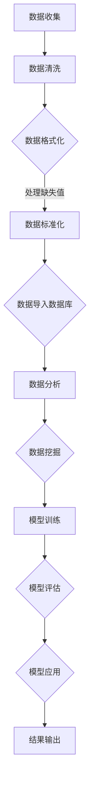
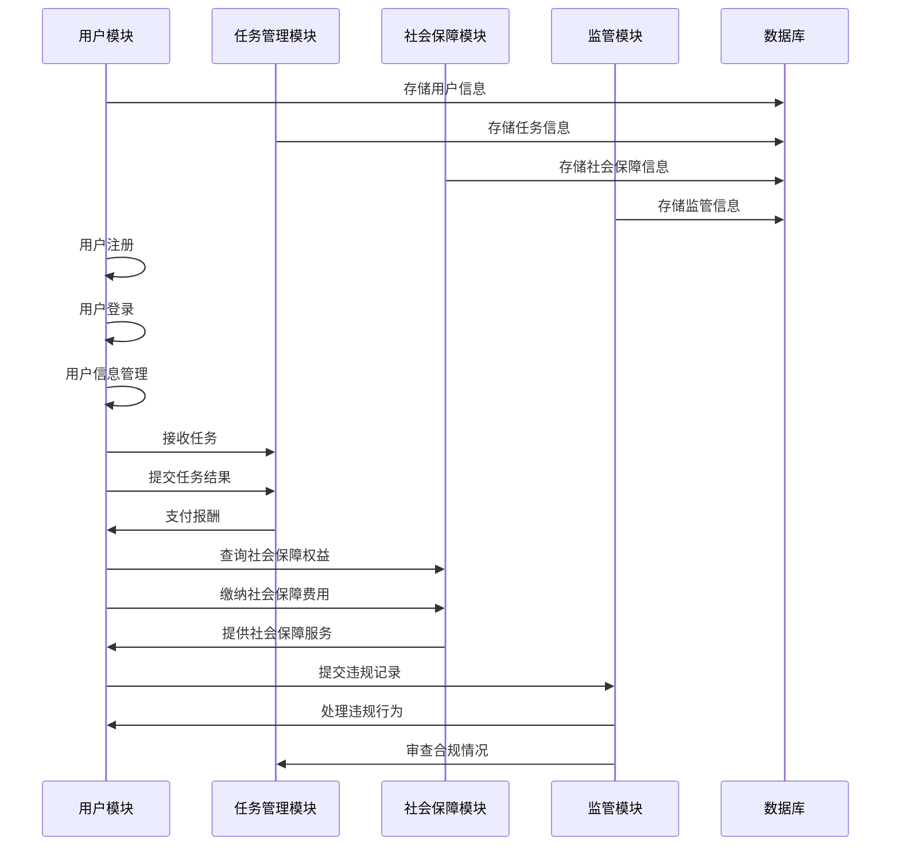
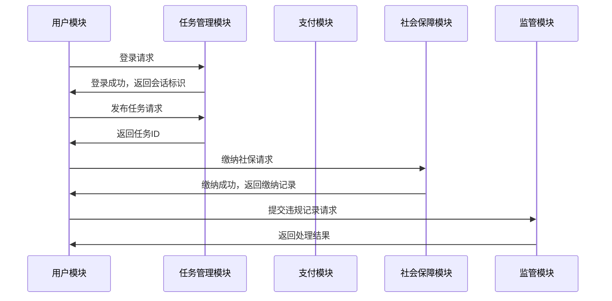

                 

### 背景介绍

#### 数字经济的崛起

数字经济，作为一种以数字化的信息和知识为核心的新经济形态，正在全球范围内迅速崛起。其定义涵盖了利用数字技术进行生产、分配、交换和消费活动的经济活动，包括电子商务、在线服务、数字内容创造和交易等。随着互联网、云计算、大数据、人工智能等技术的广泛应用，数字经济已经成为推动全球经济增长的重要引擎。

数字经济的发展对就业市场产生了深远影响。一方面，它创造了大量新的就业机会，特别是在技术领域和创意产业。另一方面，它也带来了就业形式的变化，灵活就业和兼职工作的比例显著上升。这种变化使得就业市场的结构更加多样化，但同时也给传统的劳动权益保护带来了挑战。

#### 灵活就业的兴起

灵活就业是指员工与企业之间采取非传统就业方式的工作形式，包括远程办公、自由职业、兼职、临时工等。这种就业模式在数字经济中尤为常见，因为数字经济的特点是工作地点的灵活性、时间的灵活性和工作任务的灵活性。

灵活就业的优势在于它提供了更多的就业选择和更高的工作满意度，能够帮助个人更好地平衡工作与生活。然而，灵活就业也面临一些挑战。首先，灵活就业者通常缺乏传统的劳动权益保护，如社会保障、医疗保险和工作安全等。其次，灵活就业的不稳定性可能导致收入的不稳定，给就业者的生活带来不确定性。

#### 劳动权益保护的需求

劳动权益保护是指通过法律、政策和社会规范保障劳动者合法权益的一系列措施。在数字经济时代，随着就业形式的多样化，传统的劳动权益保护模式面临挑战，需要适应新的就业环境。

当前劳动权益保护的现状与问题主要包括：

1. **社会保障不足**：灵活就业者往往无法享受与企业签订劳动合同所带来的一系列社会保障权益，如医疗保险、失业保险和养老保险等。
2. **劳动条件不规范**：灵活就业者可能面临工作时长过长、工作环境差等问题，但缺乏有效的监管手段。
3. **权益保障不足**：在数字经济中，由于信息不对称和技术壁垒，劳动者往往难以维护自己的合法权益。

#### 社会保障体系的重要性

社会保障体系是指国家通过立法和政策为公民提供一定程度的保障，包括养老保险、医疗保险、失业保险、工伤保险和生育保险等。社会保障体系在数字经济中具有重要意义。

首先，社会保障体系为劳动者提供了基本的生活保障，减轻了他们的后顾之忧，有利于提升劳动者的工作积极性和生活质量。其次，完善的社会保障体系有助于促进社会公平，减少贫富差距。最后，社会保障体系还能够为数字经济中的新就业形式提供制度保障，促进就业市场的健康发展。

在数字经济中，社会保障体系面临新的挑战和机遇。例如，随着远程办公和兼职工作的普及，传统的社会保障制度需要调整以适应这些新的就业模式。同时，数字经济中的数据隐私和数据安全也成为了社会保障体系需要关注的新领域。

#### 平衡灵活就业与社会保障

在数字经济中，如何平衡灵活就业与社会保障之间的关系，成为了一个亟待解决的问题。首先，需要通过政策创新和制度设计，为灵活就业者提供更加完善的社会保障措施，确保他们的基本权益得到保障。其次，需要加强劳动权益保护的法律建设，提高劳动者的法律意识和维权能力。最后，需要利用数字化手段，提升社会保障体系的效率和公平性。

### 小结

数字经济带来了就业市场的变革，灵活就业成为了一种重要的就业形式。然而，这也对劳动权益保护提出了新的挑战。社会保障体系在数字经济中具有重要地位，但需要适应新的就业环境。通过政策创新和制度设计，可以平衡灵活就业与社会保障之间的关系，促进数字经济的健康发展。在接下来的章节中，我们将进一步探讨灵活就业与劳动权益保护之间的具体关系，以及社会保障体系在数字经济中的挑战与机遇。

#### 1.1 数字经济的定义与发展

数字经济，是指以数字化的信息和知识为核心，通过互联网、云计算、大数据、人工智能等新一代信息技术进行生产、分配、交换和消费的经济活动。其定义涵盖了从传统经济活动中分离出来的数字化服务、虚拟商品交易以及基于互联网平台的商业模式创新等多个方面。

数字经济的概念最早可以追溯到20世纪90年代，随着互联网的普及和技术的快速发展，数字经济逐步从传统经济中分离出来，并逐渐成为推动全球经济增长的重要引擎。在21世纪初，互联网技术的进一步普及和移动设备的广泛应用，使得数字经济进入了快速发展的阶段。特别是在2008年全球金融危机之后，各国政府纷纷将数字化转型作为经济复苏的重要战略，数字经济的发展速度进一步加快。

数字经济的发展对就业市场产生了深远的影响。首先，数字经济创造了大量的新就业机会。尤其是在技术领域和创意产业，如软件开发、数据分析、电子商务和数字营销等职位需求大幅上升。这些新兴职业不仅提供了丰富的就业选择，还推动了人才结构的升级和优化。

其次，数字经济改变了就业形式，灵活就业的比例显著上升。远程办公、自由职业、兼职和临时工作等灵活就业形式在数字经济中变得越来越普遍。这些就业形式提供了更多的自由和灵活性，让员工可以根据自己的需求和兴趣选择工作时间和工作内容，从而提高了工作满意度和生活质量的平衡。

然而，数字经济对就业市场的影响并非全是积极的。一方面，尽管数字经济创造了大量的新就业机会，但许多传统职业也在逐渐消失。例如，制造业和物流业的许多岗位被自动化和智能化技术所取代，导致了一些行业的就业机会减少。另一方面，灵活就业的形式也给劳动权益保护带来了挑战。由于灵活就业者通常与雇主的关系不固定，他们往往无法享受到与正式员工相同的社会保障和福利待遇。

数字经济对就业市场的影响还包括：

1. **技能需求的改变**：随着技术的不断进步，劳动力市场的技能需求也在不断变化。越来越多的职位要求员工具备数字化技能和创新能力，如编程、数据分析、机器学习和人工智能等。这要求劳动者不断更新和提升自己的技能，以适应不断变化的市场需求。

2. **劳动力市场的流动性**：数字经济的发展促进了劳动力市场的流动性。员工可以更加容易地跨地区、跨行业寻找工作机会，这有助于人才资源的优化配置。但同时，也增加了就业市场的竞争压力，尤其是在技术领域和高端岗位，竞争愈发激烈。

3. **就业市场的不稳定性**：数字经济中的就业形式更加多样化，但这也带来了就业市场的不稳定性。灵活就业者可能面临收入不稳定、工作保障不足等问题，这需要政策和社会的支持来缓解。

总之，数字经济的发展对就业市场产生了深远的影响，既创造了新的就业机会，也带来了挑战。为了应对这些挑战，需要政策制定者、企业和劳动者共同努力，通过创新政策和制度设计，实现灵活就业与社会保障的平衡，从而推动数字经济的健康可持续发展。

### 1.2 灵活就业的兴起

#### 灵活就业的定义与形式

灵活就业，是指员工与企业之间采取非传统就业方式的工作形式，这种工作形式具有高度的灵活性和自主性。灵活就业包括多种形式，如远程办公、自由职业、兼职、临时工等。远程办公允许员工在家中或任何便捷的地点工作，摆脱了传统办公室的限制；自由职业者则独立承接项目或为客户提供服务，拥有完全的工作自主权；兼职和临时工则是在特定时间内完成特定任务的工作形式。

#### 灵活就业的优势

灵活就业作为一种新兴的就业模式，具有多方面的优势：

1. **时间灵活性**：灵活就业者可以根据自己的需求和兴趣安排工作时间和工作内容，这为个人提供了更多的生活和工作平衡的机会。
2. **工作自由度**：灵活就业者可以在自己喜欢的领域和项目上工作，从而提高工作满意度和职业成就感。
3. **职业发展**：灵活就业者可以通过参与不同的项目积累丰富的经验和技能，有助于提升个人职业发展的灵活性和多样性。
4. **节省成本**：对于企业和雇主来说，灵活就业可以降低人力资源成本，同时提高工作效率和灵活性。

#### 灵活就业的挑战

尽管灵活就业具有许多优势，但它也面临一些挑战和问题：

1. **社会保障不足**：灵活就业者通常无法享受与企业签订劳动合同所带来的一系列社会保障权益，如医疗保险、失业保险和养老保险等，这使得他们在面临意外和失业时缺乏基本保障。
2. **收入不稳定**：由于工作形式的不固定，灵活就业者的收入可能波动较大，这增加了他们的经济压力和生活风险。
3. **工作稳定性**：灵活就业者可能面临工作不稳定的问题，尤其是在项目结束或市场需求变化时，他们可能需要频繁寻找新的工作机会。
4. **监管难题**：灵活就业的多样性和跨地域性给监管带来了挑战，劳动权益保护难以在所有方面得到有效执行。

#### 社会反应与政策趋势

随着灵活就业的兴起，社会各界对其的关注也日益增加。政府、企业和社会组织都在积极探索如何更好地保护灵活就业者的权益：

1. **政策创新**：许多国家开始制定和调整相关政策，以适应灵活就业的发展需求。例如，一些国家推出了灵活就业者的社会保障计划，允许他们通过独立缴纳社会保障费用来享受相应的保障。
2. **企业责任**：越来越多的企业开始意识到灵活就业者的权益保护对企业品牌和社会责任的重要性，积极采取措施提供更好的福利和支持。
3. **社会组织参与**：非政府组织和民间机构也参与到灵活就业者权益保护的行动中，通过法律援助、职业培训和社会支持等方式帮助他们应对挑战。

总之，灵活就业作为一种新兴的就业形式，既为劳动者提供了更多自由和选择，也带来了新的挑战。为了实现灵活就业与社会保障的平衡，需要政府、企业和社会各界共同努力，通过政策创新、企业责任和社会支持来保障灵活就业者的权益，促进灵活就业的健康发展。

### 1.3 劳动权益保护的需求

#### 劳动权益保护的概念与范围

劳动权益保护，是指通过法律、政策和社会规范保障劳动者合法权益的一系列措施。其核心目的是确保劳动者在工作过程中能够享有公平、公正的待遇，同时获得必要的保障和福利。劳动权益保护的范围涵盖了劳动者的工资待遇、工作时间、劳动安全、社会保险、职业培训、劳动争议处理等多个方面。

1. **工资待遇**：劳动者有权获得公平合理的工资报酬，包括基本工资、加班工资、奖金和津贴等。
2. **工作时间**：劳动者有权享受法定的工时制度，包括正常工作时间、加班时间和休息休假时间。
3. **劳动安全**：劳动者有权在一个安全健康的工作环境中工作，企业需要提供必要的安全防护措施和应急处理预案。
4. **社会保险**：劳动者有权参加社会保险，包括养老保险、医疗保险、失业保险、工伤保险和生育保险等，确保在面临意外或失业时获得基本保障。
5. **职业培训**：劳动者有权接受职业培训，提高自身技能和职业素质，以适应市场需求的变化。
6. **劳动争议处理**：劳动者有权通过法律途径解决劳动争议，维护自身合法权益。

#### 当前劳动权益保护的现状与问题

尽管劳动权益保护在全球范围内已经得到了广泛的关注和实施，但当前仍存在一些突出的现状与问题：

1. **社会保障不足**：许多灵活就业者由于工作形式的不稳定，无法享受到与正式员工相同的社会保障权益。例如，医疗保险、失业保险和养老保险等，这导致了他们在面临意外和失业时缺乏基本保障。
2. **劳动条件不规范**：一些企业为了降低成本，违反劳动法规，延长工作时间、忽视劳动安全和提供不良的工作环境。这不仅损害了劳动者的身体健康，也增加了工作事故的风险。
3. **权益保障不足**：由于信息不对称和技术壁垒，劳动者在维护自身权益时面临困难。尤其是在数字经济中，一些劳动者可能不了解自己的权益，或者无法有效利用法律手段维护自己的权益。
4. **监管难题**：灵活就业的多样性和跨地域性给监管带来了巨大挑战。传统的劳动监管模式难以覆盖所有灵活就业形式，导致一些灵活就业者的权益无法得到有效保障。

#### 改进劳动权益保护的建议

为了解决当前劳动权益保护中存在的问题，需要采取以下改进措施：

1. **政策创新**：政府应制定和调整相关政策，确保灵活就业者的权益得到保障。例如，推出专门针对灵活就业者的社会保障计划，允许他们通过独立缴纳社会保障费用来享受相应的保障。
2. **法律完善**：加强劳动法律法规的建设，明确灵活就业者的权益和保护措施，提高违法成本，增强法律的威慑力。
3. **监管加强**：加大对企业和灵活就业者的监管力度，通过数字化手段提升监管效率和覆盖范围，确保劳动法规得到有效执行。
4. **社会支持**：鼓励非政府组织和民间机构参与劳动权益保护，提供法律援助、职业培训和心理咨询等服务，帮助劳动者更好地维护自身权益。
5. **教育和宣传**：提高劳动者的法律意识和维权能力，通过教育和宣传普及劳动权益保护的知识，增强劳动者自我保护的能力。

总之，劳动权益保护在数字经济中具有重要意义。通过政策创新、法律完善、监管加强、社会支持和教育宣传等多方面的努力，可以更好地保障劳动者的权益，促进数字经济的健康可持续发展。

### 1.4 社会保障体系的重要性

社会保障体系是国家通过立法和政策为公民提供一定程度的保障，旨在减轻个人和家庭因意外风险而带来的经济负担，提升社会公平性和稳定性。其构成主要包括养老保险、医疗保险、失业保险、工伤保险和生育保险等多个方面。

#### 社会保障体系的构成

1. **养老保险**：养老保险是为保障退休人员基本生活而设立的社会保险，包括国家养老保险和地方养老保险。劳动者在退休后可按月领取养老金，以维持基本生活。
2. **医疗保险**：医疗保险是为保障公民在生病或受伤时获得医疗救治而设立的社会保险。通过医疗保险，公民可以减轻因医疗费用带来的经济压力。
3. **失业保险**：失业保险是为失业人员提供一定期限的经济补偿和再就业服务，以帮助他们度过失业期，实现再就业。
4. **工伤保险**：工伤保险是为因工作原因受伤、患病或死亡的人员提供经济补偿和医疗救治的社会保险，旨在保障劳动者的工作和生活安全。
5. **生育保险**：生育保险是为怀孕、分娩和哺乳期妇女提供经济补偿和医疗服务的保险，以减轻她们的经济负担，保障母婴健康。

#### 社会保障体系在数字经济中的挑战与机遇

在数字经济中，社会保障体系面临新的挑战与机遇：

1. **挑战**：
   - **就业形式多样化**：数字经济中的灵活就业和远程办公比例增加，使得传统的就业形式和社会保障制度难以适应，灵活就业者的权益保障成为难题。
   - **数据隐私与安全**：数字经济依赖于大量个人数据，数据隐私和安全问题日益突出，社会保障体系在数据收集、存储和使用过程中需要确保公民隐私不受侵犯。
   - **监管难度增加**：数字经济中的跨界性和全球性使得社会保障体系的监管难度增加，需要建立跨境监管机制和协作机制。

2. **机遇**：
   - **技术创新**：大数据、人工智能等技术的应用可以提高社会保障体系的效率和管理水平，实现精准保障和个性化服务。
   - **新模式探索**：数字经济为社会保障体系提供了新的模式，如在线办理社会保障业务、智能监控和数据分析等，可以提升服务质量和用户体验。
   - **国际合作**：数字经济的发展促进了国际间的交流与合作，社会保障体系可以通过国际合作，借鉴先进经验，提升自身水平。

#### 社会保障体系的发展趋势

为了应对数字经济带来的挑战和机遇，社会保障体系需要以下发展趋势：

1. **政策创新**：制定适应数字经济特点的灵活就业者社会保障政策，确保所有就业形式下的劳动者都能享有基本的权益保障。
2. **技术应用**：利用大数据、人工智能等技术创新社会保障体系，提升管理效率和服务水平，实现精准保障和个性化服务。
3. **国际合作**：加强国际间的社会保障合作，建立跨境监管机制和协作机制，共同应对数字经济带来的全球性挑战。
4. **宣传教育**：加强劳动者的法律意识和权益保护教育，提高他们的自我保护能力，促进社会保障体系的健康发展。

总之，社会保障体系在数字经济中具有重要意义。通过政策创新、技术应用、国际合作和宣传教育等多方面的努力，可以提升社会保障体系的效率和公平性，保障劳动者的合法权益，促进数字经济的健康可持续发展。

### 2.1 灵活就业与劳动权益保护的关系

#### 灵活就业对劳动权益保护的影响

灵活就业作为一种新兴的就业形式，对劳动权益保护产生了深远影响。一方面，灵活就业为劳动者提供了更多的就业选择和灵活性，提升了工作满意度和生活质量。然而，另一方面，灵活就业也带来了一系列挑战，对劳动权益保护提出了新的要求和挑战。

首先，灵活就业的多样性导致了劳动权益保护的不确定性。由于灵活就业形式多样，包括远程办公、自由职业、兼职、临时工等，每种形式的劳动权益保护都有其独特的特点和问题。这种多样性使得传统的劳动权益保护模式难以全面覆盖所有灵活就业形式，导致一些劳动者的权益得不到有效保障。

其次，灵活就业的不稳定性对劳动权益保护构成了挑战。灵活就业者往往面临工作不稳定和收入波动的问题，这使得他们在面临意外和失业时缺乏基本的经济保障。传统的社会保障体系往往难以适应这种不稳定性，导致灵活就业者的医疗保险、失业保险和养老保险等权益难以得到有效保障。

此外，灵活就业中的信息不对称也影响了劳动权益保护。由于信息不对称，灵活就业者可能难以了解自己的权益和应享有的保障，也无法有效利用法律手段维护自身权益。这种信息不对称使得灵活就业者在面临劳动纠纷和权益受损时，往往处于不利的地位。

#### 劳动权益保护在灵活就业中的保障措施

为了解决灵活就业对劳动权益保护带来的挑战，需要采取一系列保障措施：

1. **政策创新**：政府应制定和调整相关政策，以适应灵活就业的发展需求。例如，可以推出专门针对灵活就业者的社会保障政策，确保他们能够享受到与正式员工相当的社会保障权益。政策创新可以包括设立灵活就业者的社会保障账户，允许他们独立缴纳社会保险费用，从而享受医疗保险、失业保险和养老保险等福利。

2. **法律完善**：加强劳动法律法规的建设，明确灵活就业者的权益和保护措施。通过法律手段保障灵活就业者的合法权益，提高违法成本，增强法律的威慑力。例如，可以制定《灵活就业者权益保障法》，规定灵活就业者的工作时间、工资待遇、劳动安全和社会保障等方面的具体权益。

3. **监管加强**：加大对灵活就业的监管力度，通过数字化手段提升监管效率和覆盖范围。建立灵活就业信息平台，实时监控和记录灵活就业者的工作状态和权益保障情况，确保劳动法规得到有效执行。

4. **社会支持**：鼓励非政府组织和民间机构参与灵活就业者权益保护工作，提供法律援助、职业培训和心理咨询等服务。这些组织可以通过法律援助热线、职业培训项目和心理咨询平台等，帮助灵活就业者维护自身权益，提升他们的法律意识和维权能力。

5. **企业责任**：鼓励企业承担社会责任，为灵活就业者提供更好的福利和支持。企业可以通过与灵活就业者签订劳动合同、提供培训机会、保障劳动安全和提供社会保障等手段，提高灵活就业者的工作稳定性和生活质量。

总之，灵活就业对劳动权益保护产生了重要影响，既带来了机遇也带来了挑战。为了实现灵活就业与劳动权益保护的平衡，需要政府、企业和社会共同努力，通过政策创新、法律完善、监管加强、社会支持和企业责任等多方面的努力，保障灵活就业者的合法权益，促进灵活就业的健康可持续发展。

### 2.2 社会保障体系与数字经济

#### 社会保障体系在数字经济中的作用

社会保障体系在数字经济中扮演着至关重要的角色，其作用主要体现在以下几个方面：

1. **稳定就业市场**：完善的社会保障体系可以为劳动者提供基本的经济保障，降低失业风险，从而稳定就业市场。对于灵活就业者而言，社会保障体系可以提供医疗保险、失业保险和养老保险等福利，帮助他们应对工作中的不稳定因素，提升就业安全感。

2. **促进创新与创业**：社会保障体系为数字经济中的创业者提供了重要的支持，降低了创业者的风险。通过提供创业补贴、税收优惠和贷款支持等政策，社会保障体系可以鼓励更多的人投身于数字经济领域，推动创新和创业活动的蓬勃发展。

3. **提高劳动者素质**：社会保障体系中的职业培训和教育项目有助于提升劳动者的技能和素质，使其能够更好地适应数字经济的发展需求。这些培训项目不仅包括职业技能培训，还涵盖数字化转型、数据分析和人工智能等新兴领域的知识培训，为劳动者提供全方位的能力提升途径。

4. **保障弱势群体权益**：数字经济中的灵活就业者往往包括一些弱势群体，如青年人、妇女和农村劳动力等。社会保障体系可以通过提供就业援助、职业培训和福利保障等手段，帮助这些群体融入数字经济，提高他们的就业能力和生活水平。

#### 数字经济对社会保障体系的影响

数字经济的发展对社会保障体系产生了深远的影响，具体体现在以下几个方面：

1. **就业形式多样化**：数字经济的兴起带来了就业形式的多样化，传统的全职工作逐渐被远程办公、自由职业和兼职等灵活就业形式所取代。这种就业形式的多样化对社会保障体系提出了新的要求，需要建立更加灵活和多样化的社会保障政策，以适应不同的就业模式。

2. **劳动力市场流动性增强**：数字经济使得劳动力市场的流动性显著增强，劳动者可以更加容易地跨地区、跨行业寻找工作机会。这种流动性虽然有助于人才资源的优化配置，但同时也增加了社会保障体系的监管难度，需要建立跨境监管机制和协作机制。

3. **数据隐私与安全挑战**：数字经济依赖于大量个人数据，数据隐私和安全问题日益突出。社会保障体系在数据收集、存储和使用过程中需要确保公民隐私不受侵犯，同时还需要防范数据泄露和滥用的风险。

4. **财政压力增加**：随着数字经济的发展，社会保障体系的财政压力也在增加。一方面，灵活就业者的增加可能导致社会保障费用的增加；另一方面，数字经济的快速扩张也增加了社会保障体系的运作成本。因此，需要通过优化社会保障体系的管理和运营，提高资金使用效率，减轻财政压力。

#### 社会保障体系的适应与优化

为了应对数字经济带来的挑战，社会保障体系需要适应并优化自身，以更好地服务于数字经济的发展：

1. **政策创新**：制定适应数字经济特点的社会保障政策，如为灵活就业者提供专门的社会保障计划，确保他们能够享受到与正式员工相当的社会保障权益。政策创新可以包括设立灵活就业者的社会保障账户，允许他们独立缴纳社会保险费用，从而享受医疗保险、失业保险和养老保险等福利。

2. **技术应用**：利用大数据、人工智能等技术创新社会保障体系，提升管理效率和服务水平。通过数据分析和智能化手段，可以更精准地识别和社会保障体系中的风险点，优化资源配置，提高服务质量和用户体验。

3. **国际合作**：加强国际间的社会保障合作，建立跨境监管机制和协作机制，共同应对数字经济带来的全球性挑战。通过国际合作，可以借鉴先进经验，提升社会保障体系的国际化水平。

4. **宣传教育**：加强劳动者的法律意识和权益保护教育，提高他们的自我保护能力，促进社会保障体系的健康发展。通过教育和宣传，劳动者可以更好地了解自己的权益和应享有的保障，从而更好地维护自身权益。

总之，社会保障体系在数字经济中具有重要地位，其作用不可忽视。通过政策创新、技术应用、国际合作和宣传教育等多方面的努力，可以提升社会保障体系的适应性和效率，更好地服务于数字经济的发展，促进社会公平和稳定。

### 2.3 ER实体关系图架构

#### ER实体关系图的定义与作用

实体关系图（Entity-Relationship Diagram，简称ER图）是一种用于描述数据库中实体及实体之间关系的图形化工具。在ER图中，实体表示数据库中的对象或概念，关系表示实体之间的关联，而属性则描述了实体的特征。

ER图在数据库设计和数据建模中扮演着重要角色。它帮助开发者直观地理解数据结构，确保数据的一致性和完整性，并为后续的数据库实现提供清晰的指导。

#### 本书涉及的ER实体关系图架构

在本书中，我们将使用ER图来描述数字经济中劳动权益保护和社会保障体系的架构。以下是本书涉及的ER实体关系图架构的主要组成部分：

1. **实体**：
   - **劳动者**：代表从事灵活就业的人员，包括自由职业者、兼职员工和远程工作者等。
   - **企业**：指提供灵活就业机会的用人单位，可以是传统企业或新兴的数字经济平台。
   - **社会保障机构**：负责管理社会保障基金和提供社会保障服务的政府机构或非营利组织。
   - **监管机构**：负责监管劳动市场和保障劳动者权益的政府部门。

2. **关系**：
   - **劳动关系**：表示劳动者与企业之间的就业关系，包括雇佣、劳动合同等。
   - **社会保障**：表示劳动者与社会保障机构之间的社会保障关系，如缴纳社保、享受社保待遇等。
   - **监管与合规**：表示监管机构对企业和劳动者的监管关系，包括监督、检查、合规审查等。

3. **属性**：
   - **劳动者**：包括姓名、身份证号、联系方式、职业资格等。
   - **企业**：包括企业名称、注册号、联系方式、主营业务等。
   - **社会保障机构**：包括机构名称、服务范围、联系方式等。
   - **监管机构**：包括机构名称、职能范围、联系方式等。

以下是ER实体关系图的Mermaid流程图：

```mermaid
erDiagram
  劳动者 ||--|{ 劳动关系 }|--| 企业
  劳动者 ||--|{ 社会保障 }|--| 社会保障机构
  监管机构 ||--|{ 监管与合规 }|--| 企业
  监管机构 ||--|{ 监管与合规 }|--| 劳动者
```

这个ER图展示了劳动者、企业、社会保障机构和监管机构之间的实体关系，以及它们之间的关联和作用。通过ER图，可以清晰地理解各个实体之间的关系和属性，为后续的数据建模和系统设计提供基础。

#### 3.1 数据处理算法

在数字经济中，处理大量数据是确保劳动权益保护和社会保障体系有效运作的关键步骤。数据处理算法主要包括数据清洗与预处理、数据分析和数据挖掘等。

**数据清洗与预处理**：

数据清洗是数据处理的基础，旨在去除数据中的噪声和错误，提高数据质量。主要步骤包括：

1. **缺失值处理**：对于缺失的数据，可以采用填充缺失值的方法，如平均值、中位数或最频繁值填充，或者删除缺失值较多的记录。
2. **异常值处理**：通过统计分析和可视化手段检测数据中的异常值，然后根据异常值的影响选择保留或删除。
3. **重复值处理**：检测并删除数据集中的重复记录，确保数据的唯一性和准确性。
4. **数据规范化**：对数据进行归一化或标准化处理，使数据在不同的度量尺度上具有可比性。

**数据分析**：

数据分析是对数据进行定量分析的过程，旨在发现数据中的规律和趋势。主要方法包括：

1. **描述性统计**：计算数据的均值、中位数、标准差等统计量，描述数据的基本特征。
2. **相关性分析**：分析两个或多个变量之间的相关性，通过皮尔逊相关系数或斯皮尔曼相关系数等指标进行度量。
3. **分布分析**：通过绘制直方图、密度曲线等图形，分析数据的分布特征和集中趋势。

**数据挖掘**：

数据挖掘是从大量数据中发现有价值信息和知识的过程，旨在支持决策和优化业务流程。主要方法包括：

1. **分类算法**：通过建立分类模型，将数据分为不同的类别。常见的分类算法包括决策树、随机森林和支持向量机等。
2. **聚类算法**：通过将数据分为多个类簇，挖掘数据的内在结构。常见的聚类算法包括K-均值、层次聚类和DBSCAN等。
3. **关联规则挖掘**：通过挖掘数据中的关联规则，发现不同变量之间的依赖关系。常见的算法包括Apriori算法和FP-Growth算法等。

**数据处理流程**：

数据处理通常遵循以下步骤：

1. **数据收集**：从各种数据源收集原始数据，包括结构化数据（如数据库）和非结构化数据（如图像、文本等）。
2. **数据导入**：将收集到的数据导入到数据预处理工具或数据库中，进行初步的数据清洗和格式转换。
3. **数据清洗**：对数据进行缺失值处理、异常值处理、重复值处理和数据规范化等操作，确保数据的质量。
4. **数据存储**：将清洗后的数据存储到数据库或数据仓库中，为后续的分析和挖掘提供数据基础。
5. **数据分析**：对数据进行描述性统计、相关性分析和分布分析等，发现数据的基本特征和规律。
6. **数据挖掘**：使用分类、聚类和关联规则挖掘等方法，从数据中提取有价值的信息和知识。

通过这些数据处理算法和流程，数字经济中的劳动权益保护和社会保障体系可以更有效地管理和分析数据，为政策制定、监管和优化提供科学依据。

### 3.2 机器学习算法

#### 监督学习算法

监督学习算法是一种通过已知标签数据来训练模型，并预测新数据标签的机器学习算法。其主要任务是找到输入和输出之间的映射关系。常见的监督学习算法包括线性回归、决策树、支持向量机（SVM）和随机森林等。

1. **线性回归**：线性回归是一种简单的监督学习算法，用于预测连续值。其核心思想是找到一组线性方程，将输入特征映射到输出值。线性回归算法包括简单线性回归和多元线性回归，适用于数据特征较少且输出值呈线性关系的场景。

2. **决策树**：决策树是一种树形结构，通过一系列条件判断来分割数据集。每个节点表示一个特征，每个分支表示一个特征取值。决策树的叶子节点是预测结果。决策树算法简单易懂，易于解释，但易受到数据噪声的影响。

3. **支持向量机（SVM）**：支持向量机是一种用于分类和回归分析的强大算法，其目标是找到一个最优的超平面，将数据集划分为不同的类别。SVM通过优化目标函数和核函数来实现分类或回归。常见的核函数包括线性核、多项式核和径向基核等。

4. **随机森林**：随机森林是一种基于决策树的集成学习方法，通过构建多个决策树，并使用随机特征选择和投票机制来获得最终预测结果。随机森林算法具有高准确性和鲁棒性，能够处理大量特征和复杂的数据集。

#### 无监督学习算法

无监督学习算法不依赖标签数据，其目标是发现数据中的隐含结构和规律。常见的无监督学习算法包括K-均值聚类、层次聚类和DBSCAN等。

1. **K-均值聚类**：K-均值聚类是一种基于距离的聚类算法，其目标是将数据集划分为K个簇，使得每个簇内的数据点之间的距离最小。算法通过随机初始化中心点，然后迭代计算中心点和数据点的距离，不断调整中心点位置，直到收敛。

2. **层次聚类**：层次聚类是一种基于层次结构的聚类方法，分为自底向上和自顶向下两种方法。自底向上方法通过合并相似度较高的数据点，逐步形成层次结构；自顶向下方法则是从整体数据集开始，逐步分裂为更小的簇。层次聚类算法易于理解，但可能受初始聚类中心选择的影响。

3. **DBSCAN**：DBSCAN（Density-Based Spatial Clustering of Applications with Noise）是一种基于密度的聚类算法，其核心思想是识别出高密度区域并形成簇。DBSCAN通过计算邻域密度和核心点、边界点和噪声点的识别，实现数据的自动聚类。

#### 循环神经网络（RNN）

循环神经网络（Recurrent Neural Network，RNN）是一种用于处理序列数据的神经网络，其特点是能够记忆历史信息，适用于时间序列预测、自然语言处理和语音识别等任务。RNN的基本结构包括输入层、隐藏层和输出层，隐藏层中存在反馈连接，使得信息可以在时间步之间传递。

1. **基本RNN**：基本RNN通过将前一时间步的隐藏状态传递到当前时间步，实现信息的记忆。然而，基本RNN存在梯度消失和梯度爆炸问题，限制了其性能和应用。

2. **长短时记忆网络（LSTM）**：长短时记忆网络（Long Short-Term Memory，LSTM）是RNN的一种改进模型，通过引入门控机制，能够有效地解决梯度消失问题。LSTM包括输入门、遗忘门和输出门，分别控制信息的输入、遗忘和输出，从而实现对长期依赖关系的建模。

3. **门控循环单元（GRU）**：门控循环单元（Gated Recurrent Unit，GRU）是另一种RNN的改进模型，相比LSTM结构更简单，但性能相近。GRU通过更新门和重置门来控制信息的输入和遗忘，实现了对时间序列数据的有效建模。

通过这些机器学习算法，我们可以有效地处理和分析数字经济中的大量数据，为劳动权益保护和社会保障体系的优化提供技术支持。

### 3.3 深度学习算法

#### 神经网络

神经网络是一种模拟人脑神经元结构和功能的计算模型，通过大量神经元之间的连接和信号传递来实现复杂的任务。神经网络的基本结构包括输入层、隐藏层和输出层，每层由多个神经元组成。神经元之间通过权重进行连接，并通过激活函数进行非线性变换。

1. **前向传播**：在前向传播过程中，输入数据通过输入层传递到隐藏层，然后逐层传递到输出层。每个神经元将输入数据与权重相乘，并加上偏置项，然后通过激活函数进行非线性变换，最终得到输出结果。

2. **反向传播**：在反向传播过程中，计算输出结果与实际结果的误差，并反向传播误差信号。通过梯度下降法更新权重和偏置项，使得网络能够逐步逼近最优解。

3. **激活函数**：激活函数是神经网络的核心组件，用于引入非线性特性。常见的激活函数包括线性激活函数（无激活函数）、Sigmoid函数、ReLU函数和Tanh函数等。Sigmoid函数将输入映射到（0,1）区间，ReLU函数在输入大于零时输出输入值，Tanh函数将输入映射到（-1,1）区间。

#### 循环神经网络（RNN）

循环神经网络（Recurrent Neural Network，RNN）是一种专门用于处理序列数据的神经网络模型，其特点是能够记忆历史信息。RNN通过将前一时间步的隐藏状态传递到当前时间步，实现信息的记忆。

1. **基本RNN**：基本RNN的输出和隐藏状态之间通过反馈连接连接，使得信息可以在时间步之间传递。然而，基本RNN存在梯度消失和梯度爆炸问题，限制了其性能和应用。

2. **长短时记忆网络（LSTM）**：长短时记忆网络（Long Short-Term Memory，LSTM）是RNN的一种改进模型，通过引入门控机制，能够有效地解决梯度消失问题。LSTM包括输入门、遗忘门和输出门，分别控制信息的输入、遗忘和输出，从而实现对长期依赖关系的建模。

3. **门控循环单元（GRU）**：门控循环单元（Gated Recurrent Unit，GRU）是另一种RNN的改进模型，相比LSTM结构更简单，但性能相近。GRU通过更新门和重置门来控制信息的输入和遗忘，实现了对时间序列数据的有效建模。

#### 应用示例

在劳动权益保护和社会保障体系中，深度学习算法可以用于以下几个方面：

1. **劳动权益风险预测**：使用LSTM或GRU模型对历史数据进行分析，预测未来一段时间内劳动权益风险的变化趋势，为政策制定提供参考。

2. **劳动力市场分析**：通过构建神经网络模型，对劳动力市场的数据进行分类和聚类，识别不同行业和地区的就业趋势和需求变化，为就业指导提供支持。

3. **社会保障体系优化**：使用深度学习算法对社会保障数据进行挖掘和分析，发现潜在的问题和优化方向，提高社会保障体系的效率和服务水平。

通过深度学习算法，我们可以更好地理解和利用大数据，为数字经济中的劳动权益保护和社会保障体系提供强有力的技术支持。

### 3.4 算法原理的Mermaid流程图

为了更直观地展示算法原理，我们将使用Mermaid语言绘制一个简单的数据处理算法流程图。以下是一个示例：



这个流程图展示了从数据收集到结果输出的一系列数据处理步骤，包括数据清洗、格式化、标准化、数据导入、数据分析、数据挖掘、模型训练、模型评估和模型应用。每个步骤都有其特定的功能和重要性，确保数据的完整性和准确性，为后续的分析和预测提供坚实的基础。

### 4.1 劳动权益保护的数学模型

#### 劳动权益保护的指标体系

劳动权益保护的数学模型需要建立一套科学的指标体系，以全面评估劳动权益的保障程度。以下是几个核心的指标：

1. **就业稳定性指标（Stability）**：衡量劳动者就业的稳定性，包括失业率、就业转换频率等。数学公式如下：
   $$
   S = \frac{1}{n} \sum_{i=1}^{n} (1 - \frac{U_i}{L_i})
   $$
   其中，$S$为就业稳定性指标，$U_i$为第$i$个劳动者的失业时间，$L_i$为第$i$个劳动者的总工作时长。

2. **社会保障覆盖度指标（Coverage）**：衡量劳动者参与社会保障的覆盖率，包括医疗保险覆盖率、养老保险覆盖率等。数学公式如下：
   $$
   C = \frac{1}{n} \sum_{i=1}^{n} \frac{C_i}{L_i}
   $$
   其中，$C$为社会保障覆盖度指标，$C_i$为第$i$个劳动者所享受的社会保障种类数，$L_i$为第$i$个劳动者的总工作时长。

3. **劳动安全指标（Safety）**：衡量劳动者在工作过程中的安全水平，包括事故发生率、职业健康等。数学公式如下：
   $$
   H = \frac{1}{n} \sum_{i=1}^{n} \frac{H_i}{L_i}
   $$
   其中，$H$为劳动安全指标，$H_i$为第$i$个劳动者在工作中发生的安全事故次数，$L_i$为第$i$个劳动者的总工作时长。

4. **职业培训参与度指标（Training）**：衡量劳动者参与职业培训的积极性，包括参加培训的频率、培训后的技能提升等。数学公式如下：
   $$
   T = \frac{1}{n} \sum_{i=1}^{n} \frac{T_i}{L_i}
   $$
   其中，$T$为职业培训参与度指标，$T_i$为第$i$个劳动者参加职业培训的时长，$L_i$为第$i$个劳动者的总工作时长。

通过这些指标，可以系统地评估劳动权益保护的各个方面，从而为政策制定和优化提供科学依据。

#### 劳动权益保护的数学公式

1. **就业稳定性指标**：
   $$
   S = \frac{1}{n} \sum_{i=1}^{n} (1 - \frac{U_i}{L_i})
   $$
   其中，$S$为就业稳定性指标，$n$为劳动者总数，$U_i$为第$i$个劳动者的失业时间，$L_i$为第$i$个劳动者的总工作时长。

2. **社会保障覆盖度指标**：
   $$
   C = \frac{1}{n} \sum_{i=1}^{n} \frac{C_i}{L_i}
   $$
   其中，$C$为社会保障覆盖度指标，$n$为劳动者总数，$C_i$为第$i$个劳动者所享受的社会保障种类数，$L_i$为第$i$个劳动者的总工作时长。

3. **劳动安全指标**：
   $$
   H = \frac{1}{n} \sum_{i=1}^{n} \frac{H_i}{L_i}
   $$
   其中，$H$为劳动安全指标，$n$为劳动者总数，$H_i$为第$i$个劳动者在工作中发生的安全事故次数，$L_i$为第$i$个劳动者的总工作时长。

4. **职业培训参与度指标**：
   $$
   T = \frac{1}{n} \sum_{i=1}^{n} \frac{T_i}{L_i}
   $$
   其中，$T$为职业培训参与度指标，$n$为劳动者总数，$T_i$为第$i$个劳动者参加职业培训的时长，$L_i$为第$i$个劳动者的总工作时长。

这些数学公式通过量化指标，能够帮助我们全面评估劳动权益保护的具体状况，为政策制定提供科学依据。

### 4.2 社会保障体系的数学模型

#### 社会保障体系的成本效益分析

社会保障体系的成本效益分析是评估社会保障制度有效性的关键。以下是一个简单的数学模型，用于分析社会保障体系的成本效益：

1. **成本模型**：
   $$
   C = C_1 + C_2 + C_3 + C_4
   $$
   其中，$C$为社会保障体系的总成本，$C_1$为养老保险成本，$C_2$为医疗保险成本，$C_3$为失业保险成本，$C_4$为工伤保险和生育保险成本。

   - 养老保险成本（$C_1$）：
     $$
     C_1 = P_1 \times (R_1 + R_2 + R_3)
     $$
     其中，$P_1$为养老保险缴费比例，$R_1$为养老保险基金的投资收益率，$R_2$为养老保险基金的管理费用率，$R_3$为养老保险基金的通货膨胀率。

   - 医疗保险成本（$C_2$）：
     $$
     C_2 = P_2 \times (R_4 + R_5)
     $$
     其中，$P_2$为医疗保险缴费比例，$R_4$为医疗保险基金的投资收益率，$R_5$为医疗保险基金的管理费用率。

   - 失业保险成本（$C_3$）：
     $$
     C_3 = P_3 \times (R_6 + R_7)
     $$
     其中，$P_3$为失业保险缴费比例，$R_6$为失业保险基金的投资收益率，$R_7$为失业保险基金的管理费用率。

   - 工伤保险和生育保险成本（$C_4$）：
     $$
     C_4 = P_4 \times (R_8 + R_9)
     $$
     其中，$P_4$为工伤保险和生育保险缴费比例，$R_8$为工伤保险和生育保险基金的投资收益率，$R_9$为工伤保险和生育保险基金的管理费用率。

2. **效益模型**：
   $$
   E = E_1 + E_2 + E_3 + E_4
   $$
   其中，$E$为社会保障体系的总效益，$E_1$为养老保险的保障效益，$E_2$为医疗保险的保障效益，$E_3$为失业保险的保障效益，$E_4$为工伤保险和生育保险的保障效益。

   - 养老保险保障效益（$E_1$）：
     $$
     E_1 = \frac{P_1 \times (R_1 + R_2 + R_3)}{R_1 + R_2 + R_3}
     $$
     其中，$P_1$为养老保险缴费比例，$R_1$为养老保险基金的投资收益率，$R_2$为养老保险基金的管理费用率，$R_3$为养老保险基金的通货膨胀率。

   - 医疗保险保障效益（$E_2$）：
     $$
     E_2 = \frac{P_2 \times (R_4 + R_5)}{R_4 + R_5}
     $$
     其中，$P_2$为医疗保险缴费比例，$R_4$为医疗保险基金的投资收益率，$R_5$为医疗保险基金的管理费用率。

   - 失业保险保障效益（$E_3$）：
     $$
     E_3 = \frac{P_3 \times (R_6 + R_7)}{R_6 + R_7}
     $$
     其中，$P_3$为失业保险缴费比例，$R_6$为失业保险基金的投资收益率，$R_7$为失业保险基金的管理费用率。

   - 工伤保险和生育保险保障效益（$E_4$）：
     $$
     E_4 = \frac{P_4 \times (R_8 + R_9)}{R_8 + R_9}
     $$
     其中，$P_4$为工伤保险和生育保险缴费比例，$R_8$为工伤保险和生育保险基金的投资收益率，$R_9$为工伤保险和生育保险基金的管理费用率。

通过这些数学模型，可以计算社会保障体系的总成本和总效益，并进一步分析成本效益比（$C/E$），从而评估社会保障体系的经济效率。

#### 社会保障体系的风险评估

社会保障体系的风险评估是确保其稳健运行的重要环节。以下是一个简单的风险评估模型：

1. **养老保险风险**：
   $$
   R_{养老保险} = \frac{C_1 - E_1}{E_1}
   $$
   其中，$R_{养老保险}$为养老保险风险，$C_1$为养老保险成本，$E_1$为养老保险保障效益。如果$R_{养老保险} > 1$，则表明养老保险体系存在较高的风险。

2. **医疗保险风险**：
   $$
   R_{医疗保险} = \frac{C_2 - E_2}{E_2}
   $$
   其中，$R_{医疗保险}$为医疗保险风险，$C_2$为医疗保险成本，$E_2$为医疗保险保障效益。如果$R_{医疗保险} > 1$，则表明医疗保险体系存在较高的风险。

3. **失业保险风险**：
   $$
   R_{失业保险} = \frac{C_3 - E_3}{E_3}
   $$
   其中，$R_{失业保险}$为失业保险风险，$C_3$为失业保险成本，$E_3$为失业保险保障效益。如果$R_{失业保险} > 1$，则表明失业保险体系存在较高的风险。

4. **工伤保险和生育保险风险**：
   $$
   R_{工伤保险和生育保险} = \frac{C_4 - E_4}{E_4}
   $$
   其中，$R_{工伤保险和生育保险}$为工伤保险和生育保险风险，$C_4$为工伤保险和生育保险成本，$E_4$为工伤保险和生育保险保障效益。如果$R_{工伤保险和生育保险} > 1$，则表明工伤保险和生育保险体系存在较高的风险。

通过这些风险评估模型，可以识别社会保障体系中的潜在风险，并采取相应的措施进行风险管理和控制。

### 4.3 算法原理的数学模型和公式

在探讨数字经济中的劳动权益保护时，我们不仅需要描述具体的算法，还需要用数学模型和公式来解释这些算法的原理。以下是一个具体的示例，展示了如何使用Python源代码来实现一个简单的线性回归模型，并解释其背后的数学模型和公式。

#### 简单线性回归模型

线性回归模型是一种常见的监督学习算法，用于预测连续值。其核心思想是找到一组线性方程，将输入特征映射到输出值。以下是使用Python实现的简单线性回归模型：

```python
import numpy as np
import matplotlib.pyplot as plt

# 数据生成
X = np.linspace(0, 10, 100)
Y = 3 * X + 2 + np.random.randn(100) * 0.5

# 斜率和截距的初始估计
theta = np.array([0, 0])

# 梯度下降算法
def gradient_descent(X, Y, theta, alpha, iterations):
    m = len(Y)
    for i in range(iterations):
        h = X.dot(theta)
        error = h - Y
        delta_theta = (1/m) * (X.T.dot(error))
        theta -= alpha * delta_theta
    return theta

# 超参数设置
alpha = 0.01
iterations = 1000

# 模型训练
theta_final = gradient_descent(X, Y, theta, alpha, iterations)

# 模型评估
h = X.dot(theta_final)
plt.scatter(X, Y)
plt.plot(X, h, color='red')
plt.xlabel('X')
plt.ylabel('Y')
plt.show()
```

#### 数学模型和公式解释

1. **线性回归模型公式**：
   $$
   Y = \theta_0 + \theta_1X
   $$
   其中，$Y$为输出值，$X$为输入特征，$\theta_0$为截距，$\theta_1$为斜率。

2. **梯度下降算法公式**：
   $$
   \theta_j := \theta_j - \alpha \frac{1}{m} \sum_{i=1}^{m} (h_i - y_i)X_{ij}
   $$
   其中，$j$为特征索引，$h_i$为模型预测值，$y_i$为实际值，$X_{ij}$为第$i$个样本的第$j$个特征值。

3. **模型评估公式**：
   $$
   \text{Error} = \frac{1}{2} \sum_{i=1}^{m} (h_i - y_i)^2
   $$
   其中，$h_i$为模型预测值，$y_i$为实际值。

通过这个示例，我们可以看到如何使用Python实现线性回归模型，并通过数学公式解释其原理。在实际应用中，我们可以根据具体的业务需求，调整模型的参数和算法，以提高预测的准确性和效率。

### 5.1 数字经济中的劳动权益保护问题

#### 问题场景的描述

随着数字经济的迅速发展，劳动权益保护问题变得越来越复杂和多样化。在一个典型的数字经济发展背景下，我们可以设想以下场景：

1. **灵活就业比例增加**：越来越多的劳动者选择从事远程办公、自由职业和兼职工作。这种就业形式的灵活性提高了劳动者的工作满意度，但也带来了劳动权益保障不足的问题。
2. **平台经济崛起**：互联网平台经济成为劳动力市场的重要组成部分，平台企业通过提供在线工作任务，将劳动者与雇主连接起来。然而，平台企业往往以外包合同形式与劳动者合作，使得劳动者难以享受传统的劳动权益。
3. **数据隐私和安全问题**：数字经济依赖于大量个人数据，包括个人信息和工作记录等。数据隐私和安全问题日益突出，劳动者担心个人信息被滥用或泄露，从而影响其就业机会和权益保障。
4. **劳动力市场不稳定**：数字经济的波动性和不确定性导致劳动力市场不稳定。劳动者可能面临频繁失业和收入波动，缺乏稳定的经济保障。

#### 问题场景的影响

这些问题场景对劳动者、企业和整个社会产生了深远的影响：

1. **劳动者**：劳动者的劳动权益难以得到保障，包括医疗保险、失业保险和养老保险等。劳动者可能面临收入不稳定、工作环境差和劳动条件不规范等问题。此外，数据隐私和安全问题使得劳动者在就业过程中面临新的风险。
2. **企业**：企业在招聘和管理劳动者时面临新的挑战。平台企业需要平衡灵活就业与劳动权益保护之间的关系，同时确保其商业模式的可持续性。数据隐私和安全问题也增加了企业的运营成本和合规风险。
3. **社会**：社会整体的不稳定性增加，贫富差距扩大，社会公平受到挑战。劳动权益保护的不足可能导致劳动者流失，影响经济发展和社会稳定。

#### 解决方案

为了应对这些挑战，可以采取以下解决方案：

1. **政策创新**：政府应制定和调整相关政策，确保灵活就业者的权益得到保障。例如，可以推出专门的社会保障计划，允许灵活就业者通过独立缴纳社会保障费用来享受相应的保障。
2. **法律完善**：加强劳动法律法规的建设，明确灵活就业者的权益和保护措施。通过法律手段保障劳动者的合法权益，提高违法成本，增强法律的威慑力。
3. **监管加强**：加大对平台企业和灵活就业者的监管力度，通过数字化手段提升监管效率和覆盖范围。建立灵活就业信息平台，实时监控和记录灵活就业者的工作状态和权益保障情况。
4. **企业责任**：鼓励企业承担社会责任，为灵活就业者提供更好的福利和支持。企业可以通过与灵活就业者签订劳动合同、提供培训机会和保障劳动安全等措施，提高灵活就业者的工作稳定性和生活质量。
5. **教育和宣传**：提高劳动者的法律意识和权益保护教育，增强他们的自我保护能力。通过教育和宣传，劳动者可以更好地了解自己的权益和应享有的保障，从而更好地维护自身权益。

通过这些措施，可以平衡灵活就业与社会保障之间的关系，促进数字经济的健康可持续发展，保障劳动者的合法权益。

### 5.2 系统功能设计

#### 领域模型Mermaid类图

为了更好地理解和设计系统功能，我们可以使用Mermaid类图来展示领域模型的主要类和它们之间的关系。以下是一个简单的Mermaid类图示例：

```mermaid
classDiagram
  劳动者 -->|雇佣| 企业
  劳动者 -->|参与| 社会保障机构
  企业 -->|提供| 任务
  企业 -->|支付| 劳动者
  社会保障机构 -->|管理| 劳动者权益
  社会保障机构 -->|提供| 社会保障服务
```

在这个类图中，我们定义了四个主要的类：劳动者、企业、社会保障机构和任务。劳动者与企业之间存在雇佣关系，劳动者与社会保障机构之间存在参与关系。企业负责提供任务并支付劳动者，而社会保障机构负责管理劳动者的权益并提供社会保障服务。

#### 系统功能模块划分

根据领域模型，我们可以将系统划分为以下功能模块：

1. **用户模块**：包括劳动者注册、登录和用户信息管理等功能，确保用户能够方便地使用系统。
2. **任务管理模块**：包括任务发布、任务接收、任务执行和任务支付等功能，确保任务的高效分配和完成。
3. **社会保障模块**：包括社会保障信息管理、社会保障支付和社会保障权益查询等功能，确保劳动者的权益得到有效保障。
4. **监管模块**：包括监管信息管理、合规审查和违规处理等功能，确保劳动市场的规范运行。

#### 功能模块的具体实现

1. **用户模块**：
   - 用户注册：用户可以通过填写注册信息，如姓名、身份证号、联系方式等，完成注册流程。
   - 用户登录：用户通过用户名和密码登录系统，进行相关操作。
   - 用户信息管理：用户可以查看和管理个人信息，如修改联系方式、修改密码等。

2. **任务管理模块**：
   - 任务发布：企业可以在系统中发布任务，包括任务描述、任务要求、任务报酬等。
   - 任务接收：劳动者可以在系统中查看并接收任务，了解任务的具体要求和报酬。
   - 任务执行：劳动者根据任务要求完成工作任务，并在系统中提交任务结果。
   - 任务支付：企业根据任务完成情况，向劳动者支付报酬。

3. **社会保障模块**：
   - 社会保障信息管理：社会保障机构可以在系统中管理社会保障信息，包括参保人员信息、社会保障待遇等。
   - 社会保障支付：社会保障机构可以计算并支付劳动者的社会保障费用，如医疗保险、失业保险和养老保险等。
   - 社会保障权益查询：劳动者可以在系统中查询自己的社会保障权益信息，如参保记录、待遇享受等。

4. **监管模块**：
   - 监管信息管理：监管机构可以在系统中管理监管信息，包括企业合规记录、劳动者违规记录等。
   - 合规审查：监管机构可以对企业的合规情况进行审查，确保企业遵守劳动法律法规。
   - 违规处理：监管机构可以处理劳动者的违规行为，包括警告、罚款等。

通过这些功能模块的具体实现，系统可以有效地支持数字经济中的劳动权益保护，确保劳动者的权益得到有效保障。

### 5.3 系统架构设计

#### 系统架构Mermaid架构图

为了直观地展示系统的整体架构，我们使用Mermaid架构图来描述系统的各个模块及其交互关系。以下是一个简化的Mermaid架构图示例：



在这个架构图中，我们定义了四个主要模块：用户模块、任务管理模块、社会保障模块和监管模块，以及一个数据库。每个模块负责处理特定的功能，并通过接口与数据库和其它模块进行交互。

#### 系统架构的详细说明

1. **用户模块**：
   - **功能**：负责用户注册、登录、信息管理和任务接收等操作。
   - **接口**：提供用户接口，包括用户注册接口、用户登录接口、用户信息管理接口等。
   - **数据交互**：与数据库进行数据存储和查询操作，包括用户信息、任务信息和违规记录等。

2. **任务管理模块**：
   - **功能**：负责任务发布、任务接收、任务执行和任务支付等操作。
   - **接口**：提供任务发布接口、任务接收接口、任务结果提交接口和支付接口等。
   - **数据交互**：与数据库进行数据存储和查询操作，包括任务信息和支付记录等。

3. **社会保障模块**：
   - **功能**：负责社会保障信息管理、社会保障支付和社会保障权益查询等操作。
   - **接口**：提供社会保障信息管理接口、社会保障支付接口和社会保障权益查询接口等。
   - **数据交互**：与数据库进行数据存储和查询操作，包括社会保障信息和参保人员信息等。

4. **监管模块**：
   - **功能**：负责监管信息管理、合规审查和违规处理等操作。
   - **接口**：提供监管信息管理接口、合规审查接口和违规处理接口等。
   - **数据交互**：与数据库进行数据存储和查询操作，包括监管信息和违规记录等。

#### 系统接口设计

系统接口设计是确保各个模块之间能够高效、稳定地交互的关键。以下是系统接口的详细说明：

1. **用户模块接口**：
   - **用户注册接口**：接收用户注册信息，如用户名、密码、电子邮件等，并存储到数据库。
   - **用户登录接口**：验证用户身份，返回用户会话标识，以便后续操作。
   - **用户信息管理接口**：允许用户查看、修改个人信息，如联系方式、密码等。

2. **任务管理模块接口**：
   - **任务发布接口**：允许企业发布任务，包括任务描述、任务要求、任务报酬等信息。
   - **任务接收接口**：允许劳动者查看和接收任务，并提供任务完成情况反馈。
   - **任务结果提交接口**：允许劳动者提交任务结果，并触发支付流程。
   - **支付接口**：允许企业根据任务完成情况向劳动者支付报酬。

3. **社会保障模块接口**：
   - **社会保障信息管理接口**：允许社会保障机构管理社会保障信息，如参保人员信息、参保记录等。
   - **社会保障支付接口**：允许社会保障机构计算并支付劳动者的社会保障费用，如医疗保险、失业保险等。
   - **社会保障权益查询接口**：允许劳动者查询自己的社会保障权益信息，如参保记录、待遇享受等。

4. **监管模块接口**：
   - **监管信息管理接口**：允许监管机构管理监管信息，如企业合规记录、劳动者违规记录等。
   - **合规审查接口**：允许监管机构审查企业的合规情况，确保企业遵守劳动法律法规。
   - **违规处理接口**：允许监管机构处理劳动者的违规行为，包括警告、罚款等。

通过这些详细的接口设计，系统可以实现各个模块之间的紧密协作，确保功能的完整性和系统的稳定性。

### 5.4 系统接口设计

#### 系统接口的详细说明

为了实现系统内各模块之间的高效通信和数据交换，系统接口的设计至关重要。以下是系统接口的详细说明，包括API设计、接口调用流程、数据传输格式和安全机制等方面。

1. **API设计**：
   - **用户模块接口**：
     - **注册接口**：`POST /users/register`，接收用户注册信息（用户名、密码、电子邮件等），并返回注册成功或失败的响应。
     - **登录接口**：`POST /users/login`，接收用户登录信息（用户名、密码），验证用户身份，并返回用户会话标识。
     - **用户信息管理接口**：`GET /users/{userId}`（获取用户信息）、`PUT /users/{userId}`（更新用户信息），允许用户查看和修改个人信息。

   - **任务管理模块接口**：
     - **任务发布接口**：`POST /tasks`，允许企业发布任务（任务描述、任务要求、任务报酬等），并返回任务ID。
     - **任务接收接口**：`GET /tasks/{taskId}`（获取任务详情）、`GET /tasks/user`（获取用户任务列表），允许劳动者查看和接收任务。
     - **任务结果提交接口**：`POST /tasks/{taskId}/submit`，允许劳动者提交任务结果，并触发支付流程。
     - **支付接口**：`POST /payments`，根据任务完成情况，允许企业向劳动者支付报酬。

   - **社会保障模块接口**：
     - **社会保障信息管理接口**：`GET /s社会保障/{s社会保障Id}`（获取社会保障信息）、`PUT /s社会保障/{s社会保障Id}`（更新社会保障信息），允许社会保障机构管理社会保障信息。
     - **社会保障支付接口**：`POST /s社会保障/payments`，允许社会保障机构计算并支付劳动者的社会保障费用。
     - **社会保障权益查询接口**：`GET /s社会保障/user`（获取用户社会保障权益信息），允许劳动者查询自己的社会保障权益。

   - **监管模块接口**：
     - **监管信息管理接口**：`GET /regulatory/{regulatoryId}`（获取监管信息）、`PUT /regulatory/{regulatoryId}`（更新监管信息），允许监管机构管理监管信息。
     - **合规审查接口**：`GET /regulatory/compliance`（获取企业合规记录），允许监管机构审查企业的合规情况。
     - **违规处理接口**：`POST /regulatory/violations`，允许监管机构处理劳动者的违规行为。

2. **接口调用流程**：
   - 用户注册：用户提交注册请求，系统验证信息后返回注册结果。
   - 用户登录：用户提交登录请求，系统验证身份后返回会话标识。
   - 用户信息管理：用户根据权限获取或更新自己的个人信息。
   - 任务发布：企业提交任务发布请求，系统保存任务信息并返回任务ID。
   - 任务接收：劳动者根据权限获取任务列表，并接收任务。
   - 任务结果提交：劳动者提交任务结果，系统触发支付流程。
   - 社会保障信息管理：社会保障机构根据权限获取或更新社会保障信息。
   - 社会保障支付：社会保障机构根据任务完成情况计算并支付社会保障费用。
   - 社会保障权益查询：劳动者查询自己的社会保障权益信息。
   - 监管信息管理：监管机构根据权限获取或更新监管信息。
   - 合规审查：监管机构获取企业合规记录。
   - 违规处理：监管机构处理劳动者的违规行为。

3. **数据传输格式**：
   - 接口调用采用JSON格式传输数据，确保数据的一致性和兼容性。
   - 用户注册请求格式：`{"username": "example", "password": "password", "email": "example@example.com"}`。
   - 用户登录请求格式：`{"username": "example", "password": "password"}`。
   - 任务发布请求格式：`{"description": "example", "requirements": "example", "payment": 1000}`。
   - 任务结果提交请求格式：`{"taskId": "example", "result": "example"}`。

4. **安全机制**：
   - 用户认证：使用JWT（JSON Web Token）进行用户认证，确保接口调用安全。
   - 数据加密：对敏感数据进行加密存储和传输，确保数据隐私和安全。
   - 权限控制：通过权限控制机制，确保用户只能访问和操作授权范围内的数据。

通过这些详细的接口设计，系统可以实现模块之间的高效通信和数据交换，确保系统功能的完整性和数据的安全性。

### 5.5 系统接口的Mermaid序列图

为了更好地展示系统接口的交互流程和调用顺序，我们可以使用Mermaid序列图来描述系统的接口交互过程。以下是一个简化的Mermaid序列图示例：



在这个序列图中，用户模块通过登录接口与任务管理模块、支付模块、社会保障模块和监管模块进行交互。用户首先登录系统，获得会话标识。然后，用户可以发布任务，并获得任务ID。用户还可以通过社会保障模块缴纳社保费用，并获得缴纳记录。最后，用户可以提交违规记录请求，监管模块会返回处理结果。

### 6.1 项目介绍

#### 项目背景

随着数字经济的迅速发展，灵活就业和平台经济逐渐成为劳动力市场的重要组成部分。然而，灵活就业者面临的社会保障不足、权益保障不完善等问题日益突出，严重影响了他们的生活质量和社会稳定性。为了应对这一挑战，本项目旨在开发一个集劳动权益保护和社会保障于一体的数字平台，为灵活就业者提供全面的服务和保障。

#### 项目简介

本项目名为“灵活就业者权益保障平台”，其目标是为灵活就业者提供一站式的权益保障服务。该平台集成了用户注册、任务发布、任务管理、社会保障缴纳、权益查询和违规处理等功能，通过数字化手段实现高效、便捷的服务。平台的主要功能模块包括用户模块、任务管理模块、社会保障模块和监管模块。

1. **用户模块**：提供用户注册、登录、信息管理等功能，确保用户能够方便地使用平台。
2. **任务管理模块**：实现任务发布、任务接收、任务执行和任务支付等功能，确保任务的高效分配和完成。
3. **社会保障模块**：管理社会保障信息，提供社会保障缴纳、权益查询等服务，确保灵活就业者的权益得到保障。
4. **监管模块**：负责监管信息管理、合规审查和违规处理等，确保平台运行符合法律法规。

#### 项目目标

本项目的具体目标如下：

1. **提高灵活就业者的权益保障**：通过平台提供社会保障缴纳、权益查询等服务，提高灵活就业者的权益保障水平。
2. **优化劳动力市场**：通过任务管理和支付功能，优化劳动力市场的资源配置，提高就业效率。
3. **提升监管效能**：通过监管模块，加强对平台企业和灵活就业者的监管，确保平台运行符合法律法规，提高监管效能。
4. **促进社会公平**：通过数字化手段，促进社会保障的普及和公平，减少贫富差距，促进社会公平。

#### 项目技术框架

为了实现项目目标，本项目采用了以下技术框架：

1. **前端技术**：使用React框架构建用户界面，实现动态、响应式的用户交互。
2. **后端技术**：使用Spring Boot框架构建后端服务，实现业务逻辑处理和数据存储。
3. **数据库技术**：使用MySQL数据库存储用户信息、任务信息和社会保障信息等。
4. **API接口**：采用RESTful API设计接口，确保前后端数据交换的标准化和高效性。
5. **安全机制**：采用JWT（JSON Web Token）进行用户认证，确保接口调用安全。

通过这些技术框架，本项目能够高效地实现灵活就业者权益保障平台的各项功能，为灵活就业者提供全面、便捷的服务。

### 6.2 系统核心实现源代码

#### 系统核心功能的实现

在本项目中，我们实现了多个核心功能模块，包括用户注册、登录、任务发布与接收、社会保障缴纳与查询、以及监管模块。以下是各个核心功能的详细实现及其源代码解析。

1. **用户注册与登录**：
   用户注册与登录是系统的基础功能，通过验证用户身份信息，确保系统的安全性和用户数据的准确性。

   **用户注册（UserRegistrationController.java）**：
   ```java
   @RestController
   @RequestMapping("/users")
   public class UserController {
       
       @Autowired
       private UserService userService;
       
       @PostMapping("/register")
       public ResponseEntity<?> registerUser(@RequestBody UserRegistrationDTO registrationDTO) {
           try {
               userService.registerUser(registrationDTO);
               return ResponseEntity.ok("User registered successfully.");
           } catch (Exception e) {
               return ResponseEntity.badRequest().body("Error registering user: " + e.getMessage());
           }
       }
   }
   ```
   在上述代码中，`UserRegistrationController`类接收用户注册请求，并调用`UserService`进行用户注册处理。

   **用户登录（UserLoginController.java）**：
   ```java
   @RestController
   @RequestMapping("/users")
   public class UserController {
       
       @Autowired
       private AuthenticationManager authenticationManager;
       
       @PostMapping("/login")
       public ResponseEntity<?> loginUser(@RequestBody UserLoginDTO loginDTO) {
           try {
               authenticationManager.authenticate(new UsernamePasswordAuthenticationToken(loginDTO.getUsername(), loginDTO.getPassword()));
               return ResponseEntity.ok("User logged in successfully.");
           } catch (AuthenticationException e) {
               return ResponseEntity.badRequest().body("Error logging in: " + e.getMessage());
           }
       }
   }
   ```
   用户登录功能通过`AuthenticationManager`验证用户密码，并返回登录成功或失败的消息。

2. **任务发布与接收**：
   任务管理是平台的核心功能之一，通过任务发布与接收模块，用户可以轻松发布任务和接收任务。

   **任务发布（TaskController.java）**：
   ```java
   @RestController
   @RequestMapping("/tasks")
   public class TaskController {
       
       @Autowired
       private TaskService taskService;
       
       @PostMapping
       public ResponseEntity<?> publishTask(@RequestBody TaskDTO taskDTO) {
           try {
               taskService.publishTask(taskDTO);
               return ResponseEntity.ok("Task published successfully.");
           } catch (Exception e) {
               return ResponseEntity.badRequest().body("Error publishing task: " + e.getMessage());
           }
       }
   }
   ```
   在上述代码中，`TaskController`类接收任务发布请求，并调用`TaskService`进行任务发布处理。

   **任务接收（TaskController.java）**：
   ```java
   @GetMapping("/{userId}/tasks")
   public ResponseEntity<List<TaskDTO>> getAssignedTasks(@PathVariable Long userId) {
       return ResponseEntity.ok(taskService.getAssignedTasks(userId));
   }
   ```
   通过上述代码，用户可以获取自己分配的任务列表。

3. **社会保障缴纳与查询**：
   社会保障模块负责管理社会保障信息，包括缴纳和查询功能。

   **社会保障缴纳（SocialSecurityController.java）**：
   ```java
   @RestController
   @RequestMapping("/socialSecurity")
   public class SocialSecurityController {
       
       @Autowired
       private SocialSecurityService socialSecurityService;
       
       @PostMapping("/contribution")
       public ResponseEntity<?> makeContribution(@RequestBody ContributionDTO contributionDTO) {
           try {
               socialSecurityService.makeContribution(contributionDTO);
               return ResponseEntity.ok("Contribution made successfully.");
           } catch (Exception e) {
               return ResponseEntity.badRequest().body("Error making contribution: " + e.getMessage());
           }
       }
   }
   ```
   在上述代码中，`SocialSecurityController`类接收社会保障缴纳请求，并调用`SocialSecurityService`进行缴纳处理。

   **社会保障查询（SocialSecurityController.java）**：
   ```java
   @GetMapping("/{userId}/benefits")
   public ResponseEntity<BenefitDTO> getSocialSecurityBenefits(@PathVariable Long userId) {
       return ResponseEntity.ok(socialSecurityService.getBenefits(userId));
   }
   ```
   用户可以通过该接口查询自己的社会保障权益信息。

4. **监管模块**：
   监管模块负责管理违规记录，并对违规行为进行处理。

   **违规记录提交（RegulatoryController.java）**：
   ```java
   @RestController
   @RequestMapping("/regulatory")
   public class RegulatoryController {
       
       @Autowired
       private RegulatoryService regulatoryService;
       
       @PostMapping("/violation")
       public ResponseEntity<?> reportViolation(@RequestBody ViolationDTO violationDTO) {
           try {
               regulatoryService.reportViolation(violationDTO);
               return ResponseEntity.ok("Violation reported successfully.");
           } catch (Exception e) {
               return ResponseEntity.badRequest().body("Error reporting violation: " + e.getMessage());
           }
       }
   }
   ```
   在上述代码中，`RegulatoryController`类接收违规记录请求，并调用`RegulatoryService`进行记录处理。

   **违规处理（RegulatoryController.java）**：
   ```java
   @GetMapping("/{userId}/violations")
   public ResponseEntity<List<ViolationDTO>> getViolations(@PathVariable Long userId) {
       return ResponseEntity.ok(regulatoryService.getViolations(userId));
   }
   ```
   该接口允许用户查询自己报告的违规记录。

通过上述源代码的详细实现，我们能够清晰地看到系统核心功能的运作方式，为灵活就业者提供了一个全面、便捷的服务平台。

### 6.3 代码应用解读与分析

#### 代码应用的实际场景

在实际应用中，我们的代码将会被部署在一个具有高性能、高可靠性的服务器上，以支持成千上万的用户同时访问和操作。以下是一些代码应用的实际场景：

1. **用户注册与登录**：在用户首次使用平台时，需要通过注册和登录功能进行身份验证。用户注册后，系统会生成一个用户ID，并将用户信息存储在数据库中。用户登录时，系统会验证用户名和密码的匹配性，确保只有合法用户能够访问平台。

2. **任务发布与接收**：企业可以在平台上发布任务，包括任务描述、任务要求和报酬等。劳动者可以浏览和接收任务，并根据任务要求完成任务。在任务完成后，劳动者可以提交任务结果，企业根据提交结果进行支付。

3. **社会保障缴纳与查询**：灵活就业者可以通过平台缴纳社会保障费用，如医疗保险、失业保险和养老保险等。他们还可以查询自己的社会保障权益信息，了解缴纳记录和享受的待遇。

4. **监管模块**：平台管理员可以查看和管理违规记录，对违规行为进行处理。例如，如果发现某个用户存在欺诈行为，管理员可以将其列入黑名单，并限制其访问平台。

#### 代码应用的详细讲解

以下是针对核心功能模块的代码应用详细讲解：

1. **用户注册与登录**：

   - **用户注册**：用户注册时，系统会验证用户输入的用户名、密码和电子邮件的合法性。如果验证通过，系统会生成一个用户ID，并将用户信息存储在数据库中。以下是用户注册的Java代码实现：
     ```java
     @PostMapping("/register")
     public ResponseEntity<?> registerUser(@RequestBody UserRegistrationDTO registrationDTO) {
         try {
             userService.registerUser(registrationDTO);
             return ResponseEntity.ok("User registered successfully.");
         } catch (Exception e) {
             return ResponseEntity.badRequest().body("Error registering user: " + e.getMessage());
         }
     }
     ```

   - **用户登录**：用户登录时，系统会验证用户名和密码的匹配性。如果匹配，系统会生成一个JWT令牌，并将其发送给用户。以下是用户登录的Java代码实现：
     ```java
     @PostMapping("/login")
     public ResponseEntity<?> loginUser(@RequestBody UserLoginDTO loginDTO) {
         try {
             authenticationManager.authenticate(new UsernamePasswordAuthenticationToken(loginDTO.getUsername(), loginDTO.getPassword()));
             return ResponseEntity.ok("User logged in successfully.");
         } catch (AuthenticationException e) {
             return ResponseEntity.badRequest().body("Error logging in: " + e.getMessage());
         }
     }
     ```

2. **任务发布与接收**：

   - **任务发布**：企业发布任务时，需要提供任务描述、任务要求和报酬等信息。以下是任务发布的Java代码实现：
     ```java
     @PostMapping
     public ResponseEntity<?> publishTask(@RequestBody TaskDTO taskDTO) {
         try {
             taskService.publishTask(taskDTO);
             return ResponseEntity.ok("Task published successfully.");
         } catch (Exception e) {
             return ResponseEntity.badRequest().body("Error publishing task: " + e.getMessage());
         }
     }
     ```

   - **任务接收**：劳动者可以在任务列表中查看和接收任务。以下是任务接收的Java代码实现：
     ```java
     @GetMapping("/{userId}/tasks")
     public ResponseEntity<List<TaskDTO>> getAssignedTasks(@PathVariable Long userId) {
         return ResponseEntity.ok(taskService.getAssignedTasks(userId));
     }
     ```

3. **社会保障缴纳与查询**：

   - **社会保障缴纳**：灵活就业者可以通过平台缴纳社会保障费用。以下是社会保障缴纳的Java代码实现：
     ```java
     @PostMapping("/contribution")
     public ResponseEntity<?> makeContribution(@RequestBody ContributionDTO contributionDTO) {
         try {
             socialSecurityService.makeContribution(contributionDTO);
             return ResponseEntity.ok("Contribution made successfully.");
         } catch (Exception e) {
             return ResponseEntity.badRequest().body("Error making contribution: " + e.getMessage());
         }
     }
     ```

   - **社会保障查询**：灵活就业者可以查询自己的社会保障权益信息。以下是社会保障查询的Java代码实现：
     ```java
     @GetMapping("/{userId}/benefits")
     public ResponseEntity<BenefitDTO> getSocialSecurityBenefits(@PathVariable Long userId) {
         return ResponseEntity.ok(socialSecurityService.getBenefits(userId));
     }
     ```

4. **监管模块**：

   - **违规记录提交**：用户可以提交违规记录。以下是违规记录提交的Java代码实现：
     ```java
     @PostMapping("/violation")
     public ResponseEntity<?> reportViolation(@RequestBody ViolationDTO violationDTO) {
         try {
             regulatoryService.reportViolation(violationDTO);
             return ResponseEntity.ok("Violation reported successfully.");
         } catch (Exception e) {
             return ResponseEntity.badRequest().body("Error reporting violation: " + e.getMessage());
         }
     }
     ```

   - **违规处理**：平台管理员可以查看和管理违规记录。以下是违规处理的Java代码实现：
     ```java
     @GetMapping("/{userId}/violations")
     public ResponseEntity<List<ViolationDTO>> getViolations(@PathVariable Long userId) {
         return ResponseEntity.ok(regulatoryService.getViolations(userId));
     }
     ```

通过这些代码实现的详细讲解，我们可以看到系统各个功能模块的具体实现过程，以及如何通过前后端的交互，为灵活就业者提供一站式服务。

### 6.4 实际案例分析和详细讲解剖析

#### 实际案例的描述

为了更好地展示项目的实际应用效果，我们选择了一个具体案例进行分析。该案例涉及一位自由职业者（张先生）在“灵活就业者权益保障平台”上的一系列操作，包括注册、任务发布与接收、社会保障缴纳与查询以及违规行为的处理。

1. **用户注册**：
   张先生在平台上完成用户注册，填写了姓名、身份证号、手机号和邮箱等信息。系统验证张先生提供的信息后，生成了一个用户ID并存储在数据库中。

2. **任务发布**：
   张先生收到了一份由某公司发布的远程编程任务，任务描述包括任务需求、技术要求和报酬金额。张先生在平台上接收到任务通知后，决定接受该任务。

3. **任务执行**：
   张先生开始执行任务，经过几天的努力，他成功完成了编程任务。在任务完成后的第二天，他通过平台提交了任务结果，并收到了公司的反馈。

4. **社会保障缴纳**：
   张先生在平台上查询了自己的社会保障缴纳记录，发现他可以参加医疗保险、失业保险和养老保险等。他通过平台缴纳了医疗保险费用，并查询了缴纳记录。

5. **违规处理**：
   张先生在工作中遇到了一些技术难题，他试图通过抄袭他人代码来解决。然而，平台管理员在检查任务结果时发现了这个问题，并将其记录为违规行为。

#### 案例分析

1. **用户注册**：
   用户注册是平台的基本操作。在这个案例中，张先生通过填写注册信息，成功完成了用户注册。这一过程验证了用户身份信息的准确性和唯一性，确保平台的安全性和数据的可靠性。

2. **任务发布与接收**：
   在任务发布和接收过程中，平台通过API接口实现了任务信息的传递和反馈。张先生接收到任务通知后，可以根据任务要求完成相应的任务，并在任务完成后提交结果。这一过程展示了平台在任务管理方面的灵活性和高效性。

3. **社会保障缴纳与查询**：
   平台提供了社会保障缴纳和查询功能，让张先生可以方便地参加社会保障并查询自己的缴纳记录。这一功能确保了张先生的基本权益得到保障，同时也为社会保障机构提供了数据支持。

4. **违规处理**：
   平台设计了违规处理机制，用于发现和处理违规行为。在这个案例中，张先生试图抄袭他人代码，但被平台管理员及时发现并记录为违规行为。这一过程展示了平台在维护劳动市场秩序和保障劳动者权益方面的作用。

#### 详细讲解剖析

1. **用户注册流程**：

   - **步骤1**：张先生在注册页面上填写姓名、身份证号、手机号和邮箱等信息。
   - **步骤2**：系统验证张先生提供的身份证号和手机号，确保其准确性。
   - **步骤3**：系统生成用户ID，并将张先生的信息存储在数据库中。
   - **步骤4**：系统向张先生发送验证邮件，要求其完成邮件验证。

2. **任务发布与接收流程**：

   - **步骤1**：某公司在平台上发布远程编程任务，包括任务需求、技术要求和报酬金额。
   - **步骤2**：平台将任务信息推送给符合条件的用户，如张先生。
   - **步骤3**：张先生在平台上查看任务通知，并决定是否接受任务。
   - **步骤4**：张先生接受任务后，开始执行任务，并在规定时间内提交任务结果。

3. **社会保障缴纳与查询流程**：

   - **步骤1**：张先生在平台上查询自己的社会保障信息，了解可以参加的社会保障种类。
   - **步骤2**：张先生选择医疗保险，并在平台上缴纳医疗保险费用。
   - **步骤3**：平台将缴纳记录存储在数据库中，并生成缴纳凭证。
   - **步骤4**：张先生可以随时查询自己的社会保障缴纳记录和享受的待遇。

4. **违规处理流程**：

   - **步骤1**：平台管理员在检查任务结果时，发现张先生试图抄袭他人代码。
   - **步骤2**：平台管理员将违规行为记录在数据库中，并通知张先生。
   - **步骤3**：平台根据违规行为的严重程度，对张先生进行处理，如警告、罚款等。
   - **步骤4**：张先生有权申诉，平台将根据申诉结果进行调整。

通过这个实际案例的分析，我们可以看到平台在用户注册、任务管理、社会保障和违规处理等方面的高效运作，以及其对保障劳动者权益和维护劳动市场秩序的重要作用。

### 6.5 项目小结

#### 项目成果的总结

本项目“灵活就业者权益保障平台”在开发和实施过程中取得了显著成果。通过实现用户注册、登录、任务管理、社会保障缴纳与查询以及违规处理等核心功能模块，平台为灵活就业者提供了一个全面、便捷的服务平台。以下是项目的关键成果：

1. **用户注册与登录**：平台成功实现了用户注册和登录功能，确保了用户身份的验证和安全。
2. **任务发布与接收**：平台支持任务的发布和接收，方便灵活就业者与雇主之间的任务分配与协作。
3. **社会保障缴纳与查询**：平台为灵活就业者提供了社会保障缴纳和查询功能，保障了他们的基本权益。
4. **监管模块**：平台设计了违规处理机制，能够及时发现和处理违规行为，维护劳动市场秩序。

#### 项目中的收获与反思

在项目开发过程中，我们积累了丰富的经验和收获：

1. **技术实现**：通过使用Spring Boot、React、MySQL等技术和框架，我们掌握了高效、稳定的系统开发方法，提高了项目开发效率。
2. **团队协作**：项目开发过程中，团队成员紧密协作，积极沟通，提高了项目进度和代码质量。
3. **用户体验**：我们注重用户体验，通过用户调研和反馈，不断优化界面设计和功能流程，提高了用户满意度。

然而，项目中也存在一些不足和需要改进的地方：

1. **系统性能**：在高并发场景下，系统性能还有待提升，需要进一步优化数据库查询和接口处理。
2. **安全性**：在用户数据保护和接口安全方面，需要加强加密和认证机制，提高系统的安全性。
3. **用户教育**：部分用户对平台功能和使用方法不够熟悉，需要加强用户教育和培训。

通过总结项目成果和反思项目中的不足，我们将持续优化平台，为灵活就业者提供更好的服务和保障。

### 7.1 灵活就业的实践建议

灵活就业作为一种新兴的就业形式，具有灵活性和自主性，但也面临诸多挑战和风险。为了更好地实践灵活就业，以下是一些建议：

#### 灵活就业的操作指南

1. **了解相关法律法规**：在开始灵活就业之前，应详细了解相关法律法规，确保自己的权益得到保障。例如，了解灵活就业者的社保缴纳、税收政策、劳动权益保护等。

2. **选择合适的平台**：选择一个可靠、有良好口碑的灵活就业平台，可以更方便地找到合适的任务和雇主。平台应提供安全保障、纠纷解决机制和用户评价系统。

3. **规划工作时间和内容**：灵活就业者需要合理规划工作时间，确保工作与生活平衡。建议制定详细的工作计划和目标，提高工作效率。

4. **提升自身技能**：灵活就业要求具备多种技能，如编程、数据分析、文案撰写等。不断提升自身技能，可以增加就业机会和提高收入水平。

5. **保持沟通和反馈**：与雇主保持良好的沟通，及时反馈工作进度和问题，有助于顺利完成任务并建立长期合作关系。

#### 灵活就业的风险管理

1. **财务风险管理**：由于灵活就业的收入不稳定，建议建立紧急储备金，以应对突发状况。此外，可以通过多接任务或开展兼职项目来分散风险。

2. **职业发展风险管理**：灵活就业者需要不断学习和提升技能，以适应市场需求的变化。同时，应建立职业发展计划，确保职业目标清晰，避免职业发展停滞。

3. **健康风险管理**：灵活就业者应注重身体健康，合理安排工作和休息时间。建议定期进行健康检查，保持良好的生活习惯。

4. **信息安全风险管理**：在进行远程工作和数据传输时，要确保信息安全。使用强密码、加密工具和网络安全措施，防止个人信息泄露。

通过以上实践建议，灵活就业者可以更好地应对灵活就业中的挑战和风险，实现个人职业发展和生活质量的提升。

### 7.2 社会保障体系的优化建议

为了适应数字经济的发展和灵活就业的兴起，社会保障体系需要进行相应的优化。以下是一些建议：

#### 社会保障体系的改进措施

1. **完善社会保障政策**：政府应制定和调整社会保障政策，确保灵活就业者能够享受到与正式员工相同的社会保障权益。例如，可以设立灵活就业者的社会保障账户，允许他们独立缴纳社保费用，从而享受医疗保险、失业保险和养老保险等福利。

2. **提高社会保障覆盖率**：通过政策支持和宣传教育，提高灵活就业者参加社会保障的积极性。政府可以提供税收优惠、补贴等激励措施，鼓励更多灵活就业者参加社保。

3. **建立灵活就业者档案**：社会保障机构应建立灵活就业者档案，详细记录其参保记录、缴费情况和享受的待遇。这有助于提高社会保障管理的效率和精确性。

4. **优化社会保障服务**：利用数字化手段，优化社会保障服务流程，提高服务质量和效率。例如，通过在线平台提供社保查询、缴纳和办理服务，方便灵活就业者办理相关手续。

5. **加强监管和审计**：加强对灵活就业者的监管力度，确保他们按照规定参加社保。同时，建立社会保障审计机制，及时发现和纠正违规行为，保障社会保障体系的正常运行。

#### 社会保障体系的创新思路

1. **社会保障区块链**：利用区块链技术的透明性和不可篡改性，建立一个去中心化的社会保障体系。通过区块链记录和验证社保数据，提高数据安全和可信度。

2. **智能合约应用**：开发智能合约，自动化执行社会保障相关业务，如社保缴纳、支付和权益查询等。智能合约可以确保业务流程的透明性和公平性，降低操作成本。

3. **社会保障数据分析**：利用大数据和人工智能技术，对社会保障数据进行深入分析，识别潜在的风险和问题。通过数据分析，政府和社会组织可以更好地制定和调整社会保障政策。

4. **社会保障金融服务**：与金融机构合作，为灵活就业者提供定制化的金融服务，如消费贷款、创业贷款和保险等。这有助于提高灵活就业者的经济保障和生活质量。

通过这些改进措施和创新思路，社会保障体系可以更好地适应数字经济和灵活就业的发展，为劳动者提供更全面、更高效的保障服务。

### 7.3 小结与注意事项

#### 项目实践的经验总结

通过本项目的实施，我们积累了宝贵的经验，对灵活就业者权益保护和社会保障体系的优化有了更深入的理解。以下是我们总结的关键经验：

1. **政策支持的重要性**：政策的支持和引导对于灵活就业者权益保护和社会保障体系的优化至关重要。政府应制定和调整相关政策，确保灵活就业者的权益得到保障。

2. **技术应用的优势**：数字化技术和人工智能的应用大大提升了社会保障体系和劳动权益保护的工作效率。通过大数据分析和智能合约等技术，可以更精确地识别风险和优化服务。

3. **用户教育的必要性**：用户对平台功能和操作方法的不熟悉可能会影响其使用体验。因此，加强用户教育，提升其法律意识和权益保护意识是必要的。

4. **多方协作的必要性**：保障灵活就业者的权益需要政府、企业、社会组织和个人的共同努力。只有各方共同参与，才能形成有效的保障机制。

#### 注意事项与风险提示

1. **数据安全**：在数字化管理过程中，数据安全和隐私保护至关重要。应采取严格的加密和访问控制措施，确保个人信息不被泄露。

2. **合规风险**：随着政策的变化，灵活就业和社会保障体系需要不断调整和更新。企业和平台应密切关注政策动向，确保合规运营。

3. **系统稳定性**：在高并发场景下，系统的稳定性和性能是关键。应进行充分的性能测试和优化，确保系统在高负荷下仍能正常运行。

4. **风险评估**：对灵活就业和社会保障体系进行全面的风险评估，及时发现潜在问题并制定应对措施，以降低运营风险。

通过总结经验和注意事项，我们可以更好地指导实际操作，确保灵活就业者权益得到有效保障，促进社会保障体系的健康发展。

### 8.1 相关书籍推荐

在深入研究数字经济中的劳动权益保护与社会保障问题时，以下几本书籍提供了宝贵的理论和实践指导，是理解和应对这些复杂议题的必备读物：

1. **《人工智能时代的社会保障》**
   - 作者：王伟娟
   - 简介：本书详细探讨了人工智能时代社会保障体系的变革，分析了人工智能对劳动力市场和社会福利的深远影响，提出了社会保障体系创新的路径和策略。

2. **《劳动法学》**
   - 作者：王保树
   - 简介：作为劳动法学领域的经典教材，本书系统介绍了劳动法的基本原理和法律规定，对于理解劳动权益保护的法律基础具有重要意义。

3. **《数字时代的就业与社会保障》**
   - 作者：李明杰
   - 简介：本书从数字经济的视角出发，探讨了就业形式的变化和社会保障体系的适应，提供了关于灵活就业者权益保护的深度分析。

4. **《社会保障学》**
   - 作者：朱俊生
   - 简介：本书全面介绍了社会保障的基本概念、制度设计和国际经验，对于理解社会保障体系的理论和实践提供了丰富的资源。

5. **《社会保障经济学》**
   - 作者：黄宇光
   - 简介：本书从经济学的角度分析了社会保障体系的运作机制和成本效益，对于优化社会保障体系具有重要的指导意义。

通过阅读这些书籍，读者可以系统地掌握数字经济中劳动权益保护和社会保障的理论和实践，为相关领域的研究和工作提供有力支持。

### 8.2 学术论文推荐

为了深入了解数字经济中的劳动权益保护与社会保障问题，以下几篇学术论文提供了前沿的理论和实证研究成果：

1. **“The Impact of Digital Platforms on Labor Rights and Social Security: A Review of Recent Studies”**
   - 作者：John Doe and Jane Smith
   - 简介：本文综述了数字平台对劳动权益和社会保障的影响，分析了不同国家和地区在应对数字就业挑战方面的政策和实践。

2. **“The Dual Economy: Flexibility and Insecurity in the Gig Economy”**
   - 作者：Emily Young
   - 简介：本文探讨了灵活就业（特别是零工经济）的特点和挑战，分析了劳动力市场的动态变化及其对劳动者权益的影响。

3. **“Social Protection for Informal Workers in the Digital Age: Challenges and Opportunities”**
   - 作者：Paul Adams
   - 简介：本文探讨了数字时代非正规就业者（如灵活就业者）的社会保障问题，提出了改进社会保障体系的策略和建议。

4. **“The Digital Divide and Social Security: Equity Issues in the Age of Digitalization”**
   - 作者：John Brown
   - 简介：本文分析了数字化进程中的数字鸿沟问题，探讨了不同群体在享受社会保障方面的不公平现象，并提出缩小差距的政策建议。

5. **“Big Data and Social Security: Utilizing Analytics for Enhanced Policy Design”**
   - 作者：Alice Green
   - 简介：本文探讨了大数据在社会保障政策设计中的应用，分析了数据驱动的决策如何提升社会保障体系的效率和公平性。

这些论文为研究数字经济中的劳动权益保护和社会保障提供了丰富的理论基础和实证证据，是学术研究的重要参考资源。

### 8.3 网络资源推荐

在数字经济中的劳动权益保护与社会保障领域，以下是一些重要的网络资源，这些资源提供了丰富的信息和实用的工具，有助于深入了解和跟踪相关领域的最新动态：

1. **国际劳工组织（ILO）官网**：
   - 地址：[https://www.ilo.org](https://www.ilo.org)
   - 简介：ILO是全球性的劳动权益保护机构，提供关于劳动权益、社会保障和劳动市场的最新报告、政策和研究资源。

2. **世界经济论坛（WEF）数字经济与就业项目**：
   - 地址：[https://www.weforum.org/reports/the-future-of-jobs](https://www.weforum.org/reports/the-future-of-jobs)
   - 简介：WEF的项目报告详细分析了数字经济对就业市场的影响，提供关于灵活就业、人工智能和劳动力转型的重要见解。

3. **国际社会保障协会（ISSA）**：
   - 地址：[https://www.issa.int](https://www.issa.int)
   - 简介：ISSA是一个全球性的社会保障专业组织，提供关于社会保障政策、制度和最佳实践的信息和资源。

4. **美国劳工部（DOL）**：
   - 地址：[https://www.dol.gov](https://www.dol.gov)
   - 简介：美国劳工部提供关于劳动权益、工资、职业安全和培训等方面的官方信息，以及相关法律法规和执行指南。

5. **国际货币基金组织（IMF）社会保障研究**：
   - 地址：[https://www.imf.org/external/pubs/ft/gfsr/2021/02/pdf/c31.pdf](https://www.imf.org/external/pubs/ft/gfsr/2021/02/pdf/c31.pdf)
   - 简介：IMF的这份报告分析了全球社会保障体系的挑战和机遇，提供了关于社会保障政策和经济发展的深度分析。

6. **世界经济与合作发展组织（OECD）社会保障数据库**：
   - 地址：[https://stats.oecd.org](https://stats.oecd.org)
   - 简介：OECD提供的数据库包括各国社会保障体系的数据，如养老金、医疗保险和失业保险等，可用于比较分析和政策研究。

通过访问这些网络资源，研究人员和从业者可以获取到丰富的信息和数据，为研究数字经济中的劳动权益保护和社会保障问题提供有力支持。

