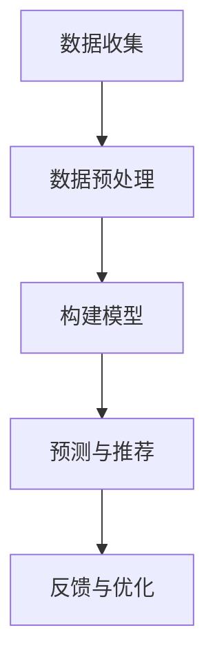
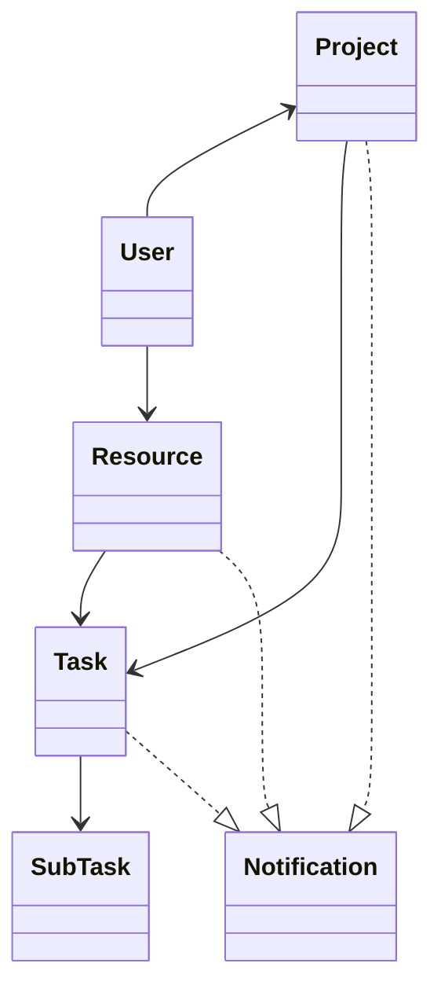
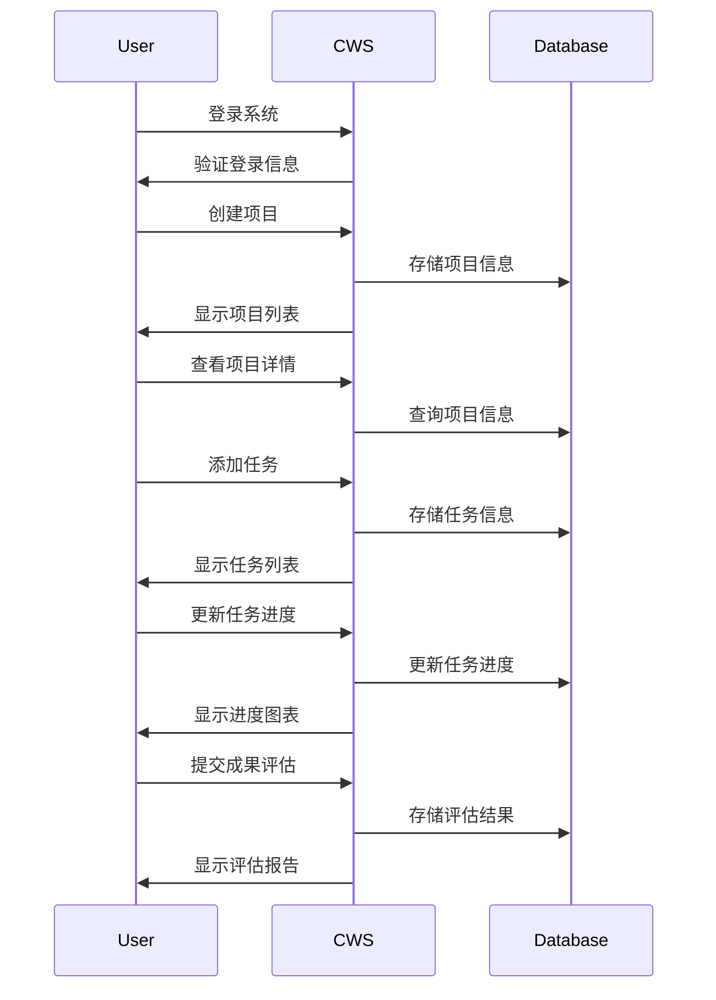
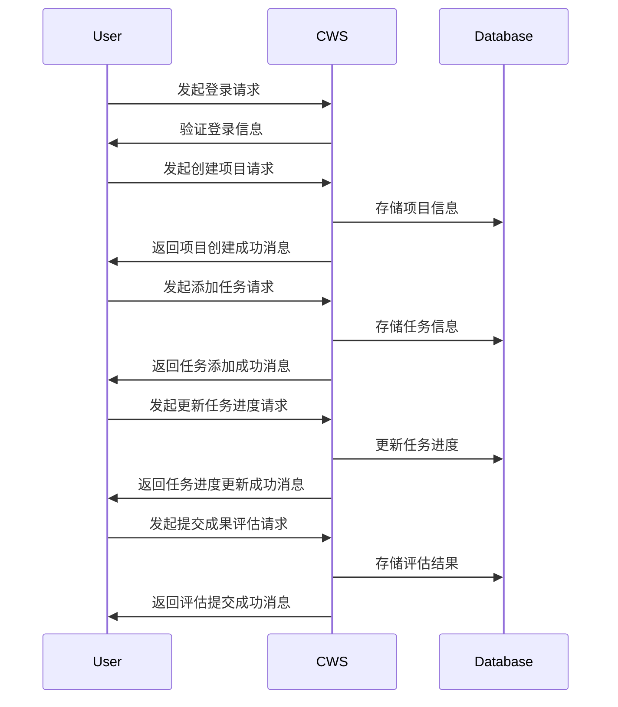

                 

**文章标题：**

数字经济时代的劳动价值：从体力劳动到创意工作的转变

**关键词：**

数字经济、劳动价值、体力劳动、创意工作、转变

**摘要：**

本文将探讨数字经济时代下劳动价值的演变，从传统的体力劳动向创意工作的转变。我们将首先介绍数字经济的背景和特点，然后分析体力劳动和创意工作的定义及其在经济中的作用。通过对比分析，我们将深入探讨这一转变的原因和影响，并提出一些最佳实践和建议，为企业和个人在数字经济时代中提供指导。

----------------------------------------------------------------

## 引言

在数字经济的浪潮下，劳动价值的观念正经历着巨大的转变。传统的体力劳动正逐渐被自动化、机器人和人工智能所取代，而创意工作则成为新的价值来源。这种转变不仅影响了企业的运营模式，也对个人的职业发展产生了深远的影响。

本文旨在探讨数字经济时代劳动价值的转变，分析体力劳动和创意工作的差异及其在经济中的角色。我们将首先介绍数字经济的背景和特点，然后深入探讨体力劳动和创意工作的定义和作用。接下来，通过对比分析，我们将揭示这一转变的原因和影响。最后，本文将提出一些最佳实践和建议，为企业和个人在数字经济时代中提供指导。

## 背景介绍

### 数字经济的背景

数字经济是指以数字化的信息和知识为关键生产要素、以现代信息网络为重要载体、以信息通信技术的有效利用为驱动的新型经济形态。随着互联网、大数据、云计算、人工智能等技术的发展，数字经济正日益成为全球经济的重要组成部分。

数字经济的出现改变了传统的经济模式。在数字经济中，信息流通更加迅速，资源分配更加高效，市场边界更加模糊。企业可以通过互联网实现全球化运营，消费者可以随时随地享受各种服务。这种变革不仅提高了生产效率，还创造了新的商业机会。

### 劳动价值的演变

劳动价值是指劳动者通过劳动所创造的价值。在传统经济中，劳动价值主要来自于体力劳动。然而，随着数字经济的兴起，劳动价值的定义和来源发生了变化。

体力劳动主要依靠人的体力和技能，如制造业、建筑业等。这种劳动形式的特点是重复性强、劳动力密集。然而，随着自动化、机器人和人工智能技术的应用，体力劳动逐渐被替代，其价值也在下降。

相比之下，创意工作是一种以创新、创造力和思维能力为核心的工作形式。它包括设计、编程、数据分析、创意策划等。创意工作的特点是个性化、灵活性和高附加值。在数字经济中，创意工作成为新的价值来源，其价值正在逐渐上升。

### 体力劳动与创意工作的对比

**特点：**

- 体力劳动：重复性强、劳动力密集、生产效率相对较低、易于被自动化替代。
- 创意工作：个性化、灵活性强、附加值高、不易被自动化替代。

**影响：**

- 体力劳动：随着自动化技术的发展，体力劳动的需求减少，劳动者的就业压力增加。
- 创意工作：数字经济的兴起为创意工作提供了广阔的发展空间，创造了新的就业机会。

### 劳动价值的变化趋势

在数字经济时代，劳动价值的变化趋势如下：

1. **体力劳动价值下降**：随着自动化、机器人和人工智能的应用，体力劳动的需求减少，劳动者的就业压力增加。体力劳动的价值逐渐被替代，其价值下降。

2. **创意工作价值上升**：数字经济为创意工作提供了广阔的发展空间，创意工作成为新的价值来源。创意工作的附加值高，其价值逐渐上升。

3. **劳动价值多元化**：在数字经济时代，劳动价值的来源更加多元化。除了传统的体力劳动和创意工作，还有许多新兴的职业和领域，如程序员、数据分析师、数字营销专家等。

### 劳动价值的变化对经济的影响

劳动价值的变化对经济产生了深远的影响：

1. **产业结构调整**：随着体力劳动价值的下降，传统产业面临转型压力。数字经济的发展推动了新兴产业的出现，促进了产业结构的调整。

2. **就业市场变化**：创意工作的兴起创造了新的就业机会，但同时也增加了就业市场的竞争。劳动者需要不断学习新技能，适应数字经济的发展。

3. **经济增长模式转变**：数字经济以创新、创造力和知识为核心，推动了经济增长模式的转变。创意工作成为经济增长的新动力，促进了经济的持续发展。

### 劳动价值的变化对社会的影响

劳动价值的变化对社会产生了重要影响：

1. **收入分配不均**：随着体力劳动价值的下降，低收入劳动者的收入减少，收入差距扩大。社会需要关注低收入群体的生活质量和福利。

2. **教育需求变化**：数字经济的发展对劳动者的技能要求提高，教育成为提升劳动力竞争力的关键。社会需要加大对教育的投入，培养更多具备创意能力和技术能力的人才。

3. **社会结构变化**：数字经济改变了人们的就业方式和生活方式，社会结构发生变化。人们更加注重个性化和自我价值的实现，对社会公平和公正提出了更高的要求。

### 劳动价值的变化对企业和个人的影响

对企业和个人来说，劳动价值的变化意味着：

1. **企业策略调整**：企业需要适应数字经济的发展，调整业务模式，关注创意工作的发展。企业需要培养创新人才，提高创新能力，以保持竞争优势。

2. **个人职业规划**：个人需要适应劳动价值的变化，关注创意工作的发展趋势，提升自身技能和创造力。个人可以通过终身学习，不断适应数字经济的要求，实现职业发展。

### 未来展望

在数字经济时代，劳动价值将继续演变。我们可以期待以下趋势：

1. **创意工作的进一步发展**：数字经济为创意工作提供了广阔的发展空间，创意工作将继续成为经济增长的新动力。

2. **技术进步的推动**：随着人工智能、大数据、区块链等技术的发展，劳动价值将进一步被重塑。

3. **全球化的深化**：数字经济推动了全球化的深化，劳动价值在全球范围内将更加多元化和复杂化。

总之，数字经济时代的劳动价值从体力劳动向创意工作的转变是一个必然趋势。理解这一变化，对于企业和个人在数字经济时代中把握机遇、实现价值具有重要意义。

## 核心概念与联系

### 数字经济

数字经济是指以数字化的信息和知识为关键生产要素、以现代信息网络为重要载体、以信息通信技术的有效利用为驱动的新型经济形态。其核心特征包括信息化、网络化、智能化和数据化。数字经济涵盖了互联网、电子商务、电子支付、大数据、云计算、人工智能等多个领域。

**数字经济的影响因素：**

- **技术创新**：信息通信技术的不断进步是数字经济发展的核心驱动力。例如，5G、人工智能、区块链等新兴技术的应用，推动了数字经济的发展。
- **政策环境**：政府的政策支持和管理框架对数字经济的健康发展至关重要。政策环境包括法律法规、税收政策、行业标准等。
- **市场需求**：消费者的需求变化是数字经济发展的直接驱动力。随着消费者对数字化产品和服务需求的增加，数字经济得到了快速发展。

**数字经济的主要特征：**

- **高度信息化**：信息在数字经济中扮演着至关重要的角色，信息的快速流通和共享是数字经济的重要特征。
- **网络化**：互联网的普及使得数字经济的活动可以在全球范围内进行，网络化是数字经济的基本特征。
- **智能化**：人工智能等技术的应用，使得数字经济中的生产和服务过程更加智能化和自动化。
- **数据化**：数据成为数字经济的重要生产要素，数据分析成为企业决策的重要依据。

### 劳动价值

劳动价值是指劳动者通过劳动所创造的价值。在传统经济中，劳动价值主要来自于体力劳动。然而，随着数字经济的兴起，劳动价值的定义和来源发生了变化。

**劳动价值的演变：**

- **传统经济**：在传统经济中，劳动价值主要来自于体力劳动。劳动者通过体力和技能创造价值，如制造业、建筑业等。
- **数字经济**：在数字经济中，劳动价值逐渐从体力劳动转向创意工作。创意工作以创新、创造力和思维能力为核心，如编程、数据分析、设计等。

**劳动价值的来源：**

- **体力劳动**：体力劳动主要依靠人的体力和技能，生产效率相对较低，但仍然是数字经济中不可或缺的一部分。
- **创意工作**：创意工作是一种高附加值的工作形式，依赖于个人的创新能力和创造力。在数字经济中，创意工作成为新的价值来源。

### 体力劳动

体力劳动主要依靠人的体力和技能，如制造业、建筑业等。这种劳动形式的特点是重复性强、劳动力密集。体力劳动在传统经济中占有重要地位，但随着自动化、机器人和人工智能的应用，其价值逐渐被替代。

**体力劳动的特点：**

- **重复性强**：体力劳动通常涉及重复性的任务，如制造产品、搬运货物等。
- **劳动力密集**：体力劳动需要大量的人力资源，其生产效率相对较低。
- **易于被自动化替代**：自动化、机器人和人工智能技术的发展，使得体力劳动逐渐被替代。

### 创意工作

创意工作是一种以创新、创造力和思维能力为核心的工作形式。它包括设计、编程、数据分析、创意策划等。创意工作的特点是个性化、灵活性和高附加值。在数字经济中，创意工作成为新的价值来源。

**创意工作的特点：**

- **个性化**：创意工作通常需要根据客户需求或特定场景进行定制，具有高度的个性化。
- **灵活性**：创意工作形式多样，不受时间和地点的限制，可以灵活地进行工作。
- **高附加值**：创意工作通过创新和创造力，为企业带来高附加值，成为数字经济中的关键驱动力。

### 劳动价值与数字经济的关系

劳动价值与数字经济之间存在密切的联系：

- **数字经济的兴起**：推动了劳动价值的转变，从传统的体力劳动向创意工作的转变。
- **创意工作的发展**：成为数字经济中的新价值来源，促进了经济的持续增长。

通过对比分析，我们可以看到，数字经济时代的劳动价值正在经历从体力劳动到创意工作的转变。这一转变不仅影响了企业的运营模式，也对个人的职业发展产生了深远的影响。理解这一转变，对于企业和个人在数字经济时代中把握机遇、实现价值具有重要意义。

## 算法原理讲解

在数字经济时代，算法在劳动价值的转变中扮演着关键角色。为了更好地理解这一转变，我们将通过一个具体的算法案例来讲解其原理和实现过程。

### 算法案例：推荐系统

推荐系统是数字经济中常见的一种算法，它通过分析用户行为和偏好，向用户推荐个性化内容，如商品、新闻、音乐等。推荐系统的核心在于预测用户对特定内容的偏好，从而提供个性化的服务。

#### 1. 算法流程

**Mermaid流程图：**



**算法流程详细说明：**

1. **数据收集**：收集用户行为数据，如浏览历史、购买记录、评论等。
2. **数据预处理**：对收集到的数据进行分析和处理，包括数据清洗、特征提取等。
3. **构建模型**：利用机器学习算法，如协同过滤、矩阵分解等，构建推荐模型。
4. **预测与推荐**：根据模型预测用户对特定内容的偏好，生成推荐列表。
5. **反馈与优化**：收集用户对推荐内容的反馈，优化推荐模型，提高推荐效果。

#### 2. 数学模型与公式

**数学模型：**

推荐系统的核心是预测用户对内容的评分。我们可以使用以下数学模型：

$$
\text{预测评分} = \text{用户特征向量} \cdot \text{内容特征向量} + \text{偏置项}
$$

其中，用户特征向量和内容特征向量是通过数据预处理和特征提取得到的。

**公式解释：**

- **用户特征向量**：表示用户对各种特征的综合评价，如浏览次数、购买频率等。
- **内容特征向量**：表示内容对各种特征的综合评价，如类型、标签等。
- **偏置项**：用于调整预测评分，使得预测结果更加准确。

#### 3. Python代码实现

以下是一个简单的推荐系统实现示例，使用协同过滤算法：

```python
import numpy as np

# 用户-物品评分矩阵
R = np.array([[5, 3, 0, 1],
              [4, 0, 0, 1],
              [1, 5, 0, 0],
              [4, 0, 1, 1]])

# 计算用户之间的相似度矩阵
similarity = np.dot(R, R.T) / np.linalg.norm(R, axis=0) * np.linalg.norm(R, axis=1)

# 预测评分
predicted_ratings = np.dot(similarity, R) + np.random.normal(size=R.shape)

print(predicted_ratings)
```

#### 4. 算法原理详细讲解

1. **协同过滤算法**：协同过滤是推荐系统中最常用的算法之一。它通过分析用户之间的相似度，预测用户对未知内容的评分。

2. **用户特征向量与内容特征向量**：在协同过滤算法中，用户特征向量和内容特征向量是核心。用户特征向量表示用户对各种特征的综合评价，如浏览次数、购买频率等。内容特征向量表示内容对各种特征的综合评价，如类型、标签等。

3. **相似度计算**：相似度计算是协同过滤算法的关键步骤。通过计算用户之间的相似度，可以找到具有相似偏好的用户。

4. **预测评分**：根据用户之间的相似度，预测用户对未知内容的评分。预测评分是通过用户特征向量和内容特征向量的点积得到的。

5. **偏置项**：偏置项用于调整预测评分，使得预测结果更加准确。

通过这个算法案例，我们可以看到，算法在数字经济时代劳动价值转变中的作用。推荐系统通过分析用户行为和偏好，提供了个性化的服务，创造了新的价值。这不仅提高了企业的服务质量，也为用户带来了更好的体验。这种转变不仅影响了企业的运营模式，也对个人的职业发展产生了深远的影响。

## 数学模型和数学公式

在数字经济时代，数学模型和数学公式在分析和解决问题中起着至关重要的作用。为了更好地理解数字经济时代的劳动价值，我们需要运用一些数学模型和公式来描述和分析这一转变。

### 劳动价值的数学模型

#### 1. 劳动价值函数

劳动价值函数是一个描述劳动者通过劳动创造价值的基本数学模型。它可以表示为：

$$
V_L = f(T, C, E)
$$

其中，$V_L$ 表示劳动价值，$T$ 表示劳动时间，$C$ 表示劳动成本，$E$ 表示劳动效率。

**公式解释：**

- **劳动时间（T）**：劳动者在单位时间内完成的工作量，通常与劳动强度和劳动力成本相关。
- **劳动成本（C）**：劳动者为完成工作所投入的成本，包括工资、福利、培训等。
- **劳动效率（E）**：劳动者完成工作的速度和质量，通常与技能水平和经验相关。

#### 2. 劳动价值变化率

劳动价值的变化率可以表示为劳动价值函数关于时间的变化率。它可以用来分析劳动价值在不同时间点的变化趋势。变化率公式为：

$$
\frac{dV_L}{dt} = \frac{\partial V_L}{\partial T} \cdot \frac{dT}{dt} + \frac{\partial V_L}{\partial C} \cdot \frac{dC}{dt} + \frac{\partial V_L}{\partial E} \cdot \frac{dE}{dt}
$$

**公式解释：**

- **$\frac{\partial V_L}{\partial T}$**：劳动价值对劳动时间的偏导数，表示劳动时间变化对劳动价值的直接影响。
- **$\frac{\partial V_L}{\partial C}$**：劳动价值对劳动成本的偏导数，表示劳动成本变化对劳动价值的直接影响。
- **$\frac{\partial V_L}{\partial E}$**：劳动价值对劳动效率的偏导数，表示劳动效率变化对劳动价值的直接影响。
- **$\frac{dT}{dt}$**、**$\frac{dC}{dt}$**、**$\frac{dE}{dt}$**：分别表示劳动时间、劳动成本、劳动效率随时间的变化率。

### 体力劳动与创意工作的数学模型

#### 1. 体力劳动价值模型

体力劳动的价值模型可以表示为：

$$
V_P = f(P, T)
$$

其中，$V_P$ 表示体力劳动价值，$P$ 表示劳动强度，$T$ 表示劳动时间。

**公式解释：**

- **劳动强度（P）**：表示劳动的强度和难度，通常与体力和技能相关。
- **劳动时间（T）**：表示劳动者在单位时间内完成的工作量，与劳动力成本相关。

#### 2. 创意劳动价值模型

创意劳动的价值模型可以表示为：

$$
V_C = f(C, E)
$$

其中，$V_C$ 表示创意劳动价值，$C$ 表示创新能力，$E$ 表示劳动效率。

**公式解释：**

- **创新能力（C）**：表示劳动者的创新能力和创造力，与教育背景和个人素质相关。
- **劳动效率（E）**：表示劳动者完成工作的速度和质量，与技能水平和经验相关。

### 数学模型的应用

这些数学模型可以帮助我们分析和预测劳动价值的演变趋势，从而为企业决策和职业规划提供指导。例如：

- **企业决策**：企业可以根据劳动价值模型评估不同类型劳动的投入产出比，优化人力资源配置，提高生产效率。
- **职业规划**：个人可以根据劳动价值模型分析自身优势和市场需求，选择合适的职业方向，提升自身的劳动价值。

通过这些数学模型，我们可以更深入地理解数字经济时代劳动价值的转变，为企业和个人在数字经济中实现价值提供理论依据和实践指导。

## 系统分析与架构设计方案

在数字经济时代，为了更好地适应劳动价值的转变，企业需要构建高效的系统来支持创意工作。本节将详细介绍一个创意工作支持系统的架构设计和实现过程。

### 问题场景介绍

在一个数字经济时代的企业中，创意工作成为了核心业务。企业需要高效地管理创意项目，包括项目规划、资源分配、进度跟踪和成果评估等。为了支持这些功能，企业决定开发一个创意工作支持系统。

### 项目介绍

项目名称：创意工作支持平台（CWS）

目标：构建一个集成化的创意工作支持平台，提供项目规划、资源管理、进度跟踪和成果评估等功能。

### 系统功能设计

**领域模型（Mermaid类图）：**



**功能描述：**

- **项目规划**：用户可以创建和管理项目，分配项目角色和权限。
- **资源管理**：系统提供资源分配和优化功能，确保项目资源的高效利用。
- **进度跟踪**：系统实时跟踪项目进度，提供任务进度和子任务进度的可视化展示。
- **成果评估**：系统自动收集和评估项目成果，提供数据分析和报告功能。

### 系统架构设计

**Mermaid架构图：**



**系统架构描述：**

- **用户层**：用户通过前端界面与系统交互，执行各种操作，如项目创建、任务分配、进度更新等。
- **业务逻辑层**：系统核心功能模块，包括项目管理、任务管理、资源管理等，处理用户请求并生成响应。
- **数据存储层**：数据库用于存储用户信息、项目信息、任务信息、资源信息和评估结果等。
- **中间件层**：提供数据传输、负载均衡、安全控制等中间件服务，确保系统的高可用性和安全性。

### 系统接口设计

**API接口设计：**

- **用户管理**：登录、注册、修改密码、获取用户信息等。
- **项目管理**：创建项目、更新项目、获取项目列表、获取项目详情等。
- **任务管理**：创建任务、更新任务进度、获取任务列表、获取任务详情等。
- **资源管理**：分配资源、获取资源列表、获取资源详情等。
- **进度跟踪**：获取进度图表、更新进度等。
- **成果评估**：提交评估结果、获取评估报告等。

### 系统交互

**Mermaid序列图：**



通过系统分析与架构设计方案，我们为创意工作支持系统提供了一个完整的设计思路和实现框架。该系统将帮助企业在数字经济时代中更好地管理创意工作，提高工作效率和创新能力。

## 项目实战

为了更好地理解数字经济时代劳动价值的转变，我们将通过一个实际项目来展示创意工作的应用和实现过程。

### 项目背景

在一个数字营销公司中，创意工作在公司的业务运营中占据重要地位。公司希望通过一个数字营销平台来提高营销效果，吸引更多潜在客户。本项目旨在开发一个数字营销平台，实现营销活动的自动化管理和优化。

### 环境安装

为了开发数字营销平台，我们首先需要安装以下环境：

1. **操作系统**：Ubuntu 20.04
2. **开发工具**：Python 3.8，Django 3.2，PostgreSQL 13
3. **依赖管理**：pip，virtualenv
4. **前端框架**：React 17
5. **数据库**：PostgreSQL

安装步骤如下：

1. 安装操作系统：从 Ubuntu 官网下载并安装 Ubuntu 20.04。
2. 更新系统：运行 `sudo apt update` 和 `sudo apt upgrade`。
3. 安装 Python 3 和 Django：运行 `sudo apt install python3 python3-pip`，然后使用 `pip3 install django` 安装 Django。
4. 安装 PostgreSQL：运行 `sudo apt install postgresql postgresql-contrib`。
5. 创建虚拟环境：运行 `virtualenv -p python3 venv`，然后激活虚拟环境 `source venv/bin/activate`。
6. 安装前端框架：运行 `npm install -g create-react-app`。

### 系统核心实现源代码

数字营销平台的实现分为前端和后端两部分。

#### 后端（Django）

1. **项目创建**：

```bash
django-admin startproject marketing_platform
cd marketing_platform
```

2. **应用创建**：

```bash
python manage.py startapp campaign
python manage.py startapp analytics
```

3. **数据库迁移**：

```bash
python manage.py makemigrations campaign
python manage.py makemigrations analytics
python manage.py migrate
```

4. **API接口**：

**campaign/models.py**：

```python
from django.db import models

class Campaign(models.Model):
    name = models.CharField(max_length=100)
    start_date = models.DateField()
    end_date = models.DateField()
    budget = models.FloatField()
    status = models.CharField(max_length=20)

class Ad(models.Model):
    campaign = models.ForeignKey(Campaign, on_delete=models.CASCADE)
    title = models.CharField(max_length=100)
    image = models.ImageField(upload_to='ads/')
    url = models.URLField()
```

**campaign/views.py**：

```python
from django.http import JsonResponse
from .models import Campaign, Ad
from django.views.decorators.csrf import csrf_exempt

@csrf_exempt
def create_campaign(request):
    if request.method == 'POST':
        data = json.loads(request.body)
        campaign = Campaign.objects.create(
            name=data['name'],
            start_date=data['start_date'],
            end_date=data['end_date'],
            budget=data['budget'],
            status=data['status']
        )
        return JsonResponse({'id': campaign.id}, status=201)
    return JsonResponse({'error': 'Invalid request'}, status=400)
```

**analytics/models.py**：

```python
from django.db import models
from campaign.models import Campaign

class Click(models.Model):
    campaign = models.ForeignKey(Campaign, on_delete=models.CASCADE)
    count = models.IntegerField()

class Conversion(models.Model):
    campaign = models.ForeignKey(Campaign, on_delete=models.CASCADE)
    count = models.IntegerField()
```

**analytics/views.py**：

```python
from django.http import JsonResponse
from .models import Click, Conversion
from campaign.models import Campaign
from django.views.decorators.csrf import csrf_exempt

@csrf_exempt
def record_click(request, campaign_id):
    if request.method == 'POST':
        campaign = Campaign.objects.get(id=campaign_id)
        click = Click.objects.create(campaign=campaign)
        return JsonResponse({'message': 'Click recorded successfully'}, status=201)
    return JsonResponse({'error': 'Invalid request'}, status=400)

@csrf_exempt
def record_conversion(request, campaign_id):
    if request.method == 'POST':
        campaign = Campaign.objects.get(id=campaign_id)
        conversion = Conversion.objects.create(campaign=campaign)
        return JsonResponse({'message': 'Conversion recorded successfully'}, status=201)
    return JsonResponse({'error': 'Invalid request'}, status=400)
```

#### 前端（React）

1. **项目创建**：

```bash
npx create-react-app campaign-dashboard
cd campaign-dashboard
```

2. **功能实现**：

**src/CampaignForm.js**：

```javascript
import React, { useState } from 'react';
import axios from 'axios';

const CampaignForm = () => {
  const [name, setName] = useState('');
  const [start_date, setStartDate] = useState('');
  const [end_date, setEndDate] = useState('');
  const [budget, setBudget] = useState(0);
  const [status, setStatus] = useState('');

  const handleSubmit = async (e) => {
    e.preventDefault();
    try {
      const response = await axios.post('/api/campaigns/', {
        name,
        start_date,
        end_date,
        budget,
        status,
      });
      alert('Campaign created successfully');
    } catch (error) {
      alert('Error creating campaign');
    }
  };

  return (
    <form onSubmit={handleSubmit}>
      <label>Name:</label>
      <input type="text" value={name} onChange={(e) => setName(e.target.value)} />
      <label>Start Date:</label>
      <input type="date" value={start_date} onChange={(e) => setStartDate(e.target.value)} />
      <label>End Date:</label>
      <input type="date" value={end_date} onChange={(e) => setEndDate(e.target.value)} />
      <label>Budget:</label>
      <input type="number" value={budget} onChange={(e) => setBudget(e.target.value)} />
      <label>Status:</label>
      <input type="text" value={status} onChange={(e) => setStatus(e.target.value)} />
      <button type="submit">Create Campaign</button>
    </form>
  );
};

export default CampaignForm;
```

**src/CampaignList.js**：

```javascript
import React, { useEffect, useState } from 'react';
import axios from 'axios';

const CampaignList = () => {
  const [campaigns, setCampaigns] = useState([]);

  useEffect(() => {
    const fetchCampaigns = async () => {
      try {
        const response = await axios.get('/api/campaigns/');
        setCampaigns(response.data);
      } catch (error) {
        console.error('Error fetching campaigns:', error);
      }
    };

    fetchCampaigns();
  }, []);

  return (
    <div>
      <h2>Campaign List</h2>
      <ul>
        {campaigns.map((campaign) => (
          <li key={campaign.id}>
            {campaign.name} - {campaign.start_date} - {campaign.end_date} - ${campaign.budget} - {campaign.status}
          </li>
        ))}
      </ul>
    </div>
  );
};

export default CampaignList;
```

### 代码应用解读与分析

后端代码使用了 Django 框架，通过 RESTful API 提供了项目创建、任务记录等功能。前端代码使用了 React 框架，通过表单和列表展示了项目信息。以下是对关键代码的解读和分析：

1. **后端 API 接口**：

- `create_campaign` 接口：用于创建新项目。接收 JSON 格式的请求数据，将项目信息存储到数据库中。
- `record_click` 和 `record_conversion` 接口：用于记录营销活动的点击和转化数据。接收 POST 请求，更新数据库中的相应数据。

2. **前端 React 组件**：

- `CampaignForm` 组件：用于创建新项目。通过表单收集项目信息，并使用 POST 请求将数据发送到后端 API。
- `CampaignList` 组件：用于展示项目列表。通过 GET 请求获取后端 API 的项目数据，并渲染为列表。

### 实际案例分析

假设公司营销团队想要创建一个为期一个月的节日营销活动，目标是吸引新客户和提高品牌知名度。以下是项目实施过程：

1. **项目创建**：

团队成员使用 `CampaignForm` 组件创建了一个名为“节日营销活动”的项目，设置了开始日期、结束日期、预算和状态。

2. **任务记录**：

在营销活动期间，团队成员通过 `CampaignList` 组件记录了营销活动的进度，包括点击和转化数据。

3. **数据分析和评估**：

项目结束后，团队成员使用后端 API 获取了点击和转化数据，分析了营销活动的效果。通过数据可视化工具，他们能够直观地了解营销活动的成果，为后续活动提供参考。

### 项目小结

通过这个数字营销平台项目，我们可以看到创意工作在数字经济时代的重要性。项目实现了营销活动的自动化管理和优化，提高了工作效率和效果。同时，项目也展示了数字经济时代劳动价值的转变，从传统的体力劳动向创意工作的过渡。

## 最佳实践 tips、小结、注意事项、拓展阅读

### 最佳实践 tips

1. **提升个人技能**：在数字经济时代，个人技能的提升至关重要。学习编程、数据分析、人工智能等技能，可以帮助你在创意工作中脱颖而出。

2. **持续学习**：数字经济的发展速度非常快，持续学习是适应时代变化的关键。通过在线课程、研讨会和书籍等方式，不断更新知识体系。

3. **关注市场动态**：了解市场趋势和需求，可以更好地把握创意工作的机会。通过关注行业报告、新闻资讯等，保持对市场的敏感度。

4. **团队合作**：创意工作往往需要团队合作。培养良好的沟通和协作能力，可以提高工作效率和质量。

### 小结

数字经济时代的劳动价值正在从传统的体力劳动向创意工作转变。这种转变不仅改变了企业的运营模式，也对个人的职业发展产生了深远影响。理解和把握这一转变，对于企业和个人在数字经济中实现价值具有重要意义。

### 注意事项

1. **适应变化**：随着数字经济的发展，劳动市场的需求不断变化。个人和企业需要不断适应新的技术和市场环境。

2. **平衡创新与风险**：创意工作具有一定的风险，但也带来了巨大的机遇。在追求创新的同时，要注意风险管理和控制。

3. **关注可持续发展**：数字经济时代的劳动价值转变，不仅仅是经济问题，也关系到社会的可持续发展。关注社会责任和道德规范，是企业和个人应有的责任。

### 拓展阅读

1. **《智能时代：从劳动力到智能资本》**：这本书深入探讨了智能时代下劳动价值的变化，为企业和个人提供了实用建议。

2. **《创意工作者的指南》**：本书提供了创意工作者的职业发展指南，包括技能提升、项目管理、创新思维等方面。

3. **《数字经济下的劳动价值分析》**：本文从经济学角度分析了数字经济时代劳动价值的变化，提供了理论依据和实践指导。

通过这些资源和实践，我们可以更好地理解数字经济时代劳动价值的转变，为个人和企业的发展提供有力支持。

## 作者信息

作者：AI天才研究院/AI Genius Institute & 禅与计算机程序设计艺术 /Zen And The Art of Computer Programming

