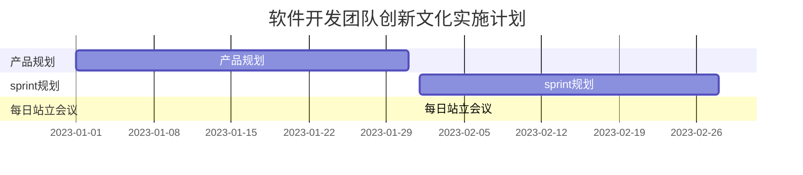
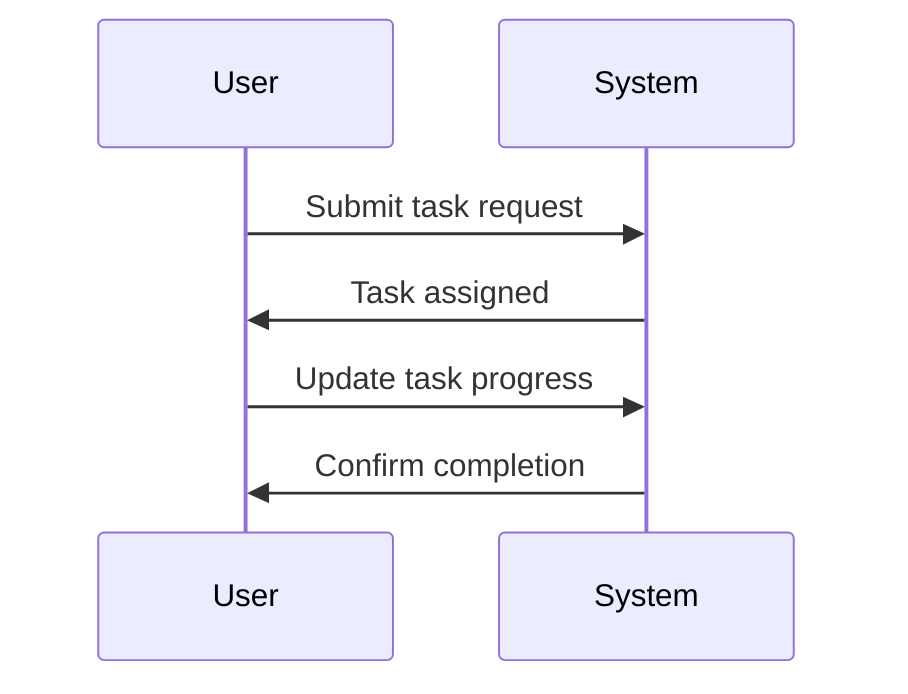

                 

### 第一部分：引言

#### 1.1 问题背景与描述

##### 1.1.1 数字经济的兴起
数字经济是指以数字化的信息和知识为关键生产要素、以现代信息网络为重要载体、以信息通信技术的有效利用为驱动的新型经济形态。数字经济不仅涵盖了电子商务、电子支付、在线服务等传统经济活动的数字化，还包括物联网、大数据、人工智能等新兴技术的应用，推动了传统产业的数字化转型和升级。

随着互联网、移动互联网、大数据、云计算、人工智能等技术的不断发展和普及，数字经济的规模不断扩大，已经成为全球经济增长的重要驱动力。根据国际数据公司（IDC）的数据，全球数字经济总量已经超过了传统经济，成为全球经济的主导力量。

##### 1.1.2 劳动价值的变迁
在数字经济时代，劳动价值的创造和传递方式发生了显著变化。传统的劳动力密集型产业逐渐被知识密集型产业所取代，知识型工作（如数据分析、软件开发、设计创意等）的重要性日益凸显。知识型工作依赖于高度专业化的知识和技能，具有高附加值和创新能力，是数字经济时代劳动价值的主要创造者。

同时，数字经济的快速发展也对劳动力市场产生了深远影响。一方面，新兴行业和职业不断涌现，为劳动者提供了更多的就业机会和发展空间；另一方面，传统职业和行业受到冲击，劳动者的技能需求和职业规划面临新的挑战。

##### 1.1.3 知识型工作的崛起与挑战
知识型工作在数字经济中扮演着核心角色，但同时也面临诸多挑战。首先，技能匹配问题突出，随着技术的快速迭代，劳动者的技能需求不断变化，但劳动者的技能提升速度往往跟不上技术发展的步伐。其次，职业发展路径不清，知识型工作的职业发展路径往往不够明确，劳动者在职业发展过程中容易感到迷茫。此外，知识型工作还伴随着较高的工作压力和心理健康风险，需要关注劳动者的心理健康问题。

#### 1.2 书籍目的与读者对象

##### 1.2.1 目的
本书旨在深入探讨数字经济时代劳动价值的变化，特别是知识型工作的崛起与面临的挑战。通过对相关概念、理论和实践的分析，为读者提供全面而深刻的理解，帮助他们在这一新的经济形态中找到定位与发展路径。具体来说，本书将达到以下目的：

1. **理解数字经济的本质和影响**：阐述数字经济的概念、特征和发展趋势，分析其对传统经济模式和社会结构的深远影响。
2. **剖析知识型工作的内涵与特点**：详细介绍知识型工作的定义、类型、核心要素及其在经济中的重要性。
3. **探讨知识型工作面临的挑战**：分析技能匹配问题、职业发展路径不清以及心理健康风险等挑战，并提出应对策略。
4. **提供案例分析与实践指导**：通过具体案例，展示知识型工作在不同领域的应用和实践，为读者提供实际操作指导。
5. **展望知识型工作的未来趋势**：预测新技术对知识型工作的影响，分析未来劳动市场的变化，为读者提供前瞻性思考。

##### 1.2.2 读者对象
本书适合对数字经济和劳动价值感兴趣的读者，包括但不限于以下群体：

1. **企业管理者**：了解数字经济时代劳动价值的变迁，把握企业转型的机遇与挑战，制定有效的人力资源战略。
2. **人力资源专家**：掌握知识型工作的特点和挑战，优化招聘、培训和发展流程，提升员工的工作满意度和生产力。
3. **行业分析师**：分析数字经济背景下劳动市场的变化趋势，为决策提供数据支持。
4. **高校师生**：了解数字经济和知识型工作的发展趋势，丰富学术研究内容。
5. **技术从业者**：提升对知识型工作的理解，拓展职业发展路径，提高个人竞争力。

通过本书的阅读，读者将能够更深入地理解数字经济时代劳动价值的本质和变化，为个人职业发展和社会经济发展提供有力的理论支持和实践指导。让我们一起走进数字经济时代，探索知识型工作的崛起与挑战。# 第一部分：引言

## 1.1 问题背景与描述

### 1.1.1 数字经济的兴起

数字经济，作为一种新型经济模式，依托互联网、大数据、人工智能等现代信息技术，对全球经济发展产生了深远影响。其核心特征是信息的数字化、网络化和智能化，通过这些技术手段，传统产业得以数字化升级，新兴业态不断涌现。

首先，数字经济的兴起改变了传统产业的生产和运营方式。以制造业为例，智能制造、工业互联网等概念的提出，使得生产过程更加自动化、智能化，大大提高了生产效率和质量。再如，在农业领域，通过物联网技术的应用，实现了精准农业，提高了农业生产的效率和可持续性。

其次，数字经济催生了大量新兴行业和职业，例如电子商务、在线教育、共享经济等。这些行业不仅创造了新的经济增长点，也为劳动者提供了丰富的就业机会。据统计，全球数字经济已经占据了GDP的相当大比例，成为推动经济增长的重要引擎。

然而，数字经济的兴起也带来了新的挑战。一方面，传统行业面临着数字化的冲击，部分岗位可能被自动化技术取代，导致就业结构发生变化。另一方面，新兴行业和职业对劳动者的技能要求不断提高，劳动者需要不断学习和更新知识，以适应快速变化的市场需求。

### 1.1.2 劳动价值的变迁

在数字经济时代，劳动价值的创造和传递方式发生了显著变化。传统的劳动力密集型产业逐渐被知识密集型产业所取代，劳动价值的重心从体力劳动转向智力劳动。

首先，知识型工作（Knowledge Work）的重要性日益凸显。知识型工作主要依赖于个人知识、技能和经验，如软件开发、数据分析师、设计师等。这些工作的核心价值在于创新和解决问题，而不是简单的重复性劳动。随着数字技术的不断进步，知识型工作对经济的贡献日益增加。

其次，劳动价值的传递方式也发生了变化。在传统经济中，劳动价值的传递主要通过物质产品或服务实现，而在数字经济中，信息和服务成为了劳动价值的主要传递形式。例如，通过在线教育平台提供教育服务，通过电子商务平台销售商品，这些服务虽然无形，但同样具有价值。

### 1.1.3 知识型工作的崛起与挑战

知识型工作的崛起带来了多方面的机遇和挑战。

**机遇**：

1. **更高的附加值**：知识型工作具有较高的附加值，因为它们依赖于高度专业化的知识和技能，能够创造更多的经济价值。
2. **创新驱动**：知识型工作强调创新思维和解决问题的能力，有助于推动社会的进步和发展。
3. **灵活性强**：知识型工作环境更加灵活，员工有更多自主权和决策权，有利于提高工作效率和满意度。

**挑战**：

1. **技能匹配问题**：随着技术的快速迭代，知识型工作对劳动者的技能要求不断提高，但劳动者的技能提升速度往往跟不上技术发展的步伐，导致技能匹配问题。
2. **职业发展路径不清**：知识型工作的职业发展路径往往不够明确，劳动者在职业发展过程中容易感到迷茫。
3. **工作压力与心理健康**：知识型工作往往伴随着较高的工作压力和心理健康风险，需要关注劳动者的心理健康问题。

总之，知识型工作的崛起为数字经济时代带来了新的机遇和挑战。理解这些变化，把握机遇，应对挑战，对于个人和整个社会来说都具有重要意义。# 第二部分：理论基础

## 2.1 数字经济与劳动价值的关联

### 2.1.1 数字经济的基本概念

数字经济是指以数字化信息和知识为核心生产要素，以现代信息网络为重要载体，以信息通信技术的有效利用为驱动的一种新型经济形态。它涵盖了电子商务、电子支付、在线服务、物联网、云计算、大数据、人工智能等多种经济活动。数字经济的核心特征是信息的数字化、网络化和智能化，通过这些技术手段，传统产业得以数字化升级，新兴业态不断涌现。

数字经济的基本特征包括：

1. **信息化**：信息资源作为数字经济的关键要素，通过信息技术的应用，实现了信息资源的集成、共享和利用。
2. **数字化**：各种经济活动都以数字形式进行，如数字货币、数字商品、数字服务等，数字化程度越高，经济效益越高。
3. **网络化**：信息网络的普及和应用使得各种经济活动相互关联，形成一个庞大的网络经济体系。
4. **智能化**：人工智能、大数据等技术使得经济活动更加智能化，提高了生产效率和服务质量。

### 2.1.2 劳动价值的演变

劳动价值是指劳动者通过劳动所创造的价值，是经济学中的一个基本概念。在数字经济时代，劳动价值的创造和传递方式发生了显著变化。传统的劳动力密集型产业逐渐被知识密集型产业所取代，劳动价值的重心从体力劳动转向智力劳动。

劳动价值的演变主要体现在以下几个方面：

1. **从劳动力密集型向知识密集型转变**：在数字经济时代，知识型工作（如软件开发、数据分析、设计创意等）的重要性日益凸显。这些工作的核心价值在于创新和解决问题，而不是简单的重复性劳动。知识型工作具有较高的附加值，成为劳动价值的主要创造者。

2. **从物质产品向信息和服务转变**：在传统经济中，劳动价值的传递主要通过物质产品或服务实现。而在数字经济中，信息和服务成为了劳动价值的主要传递形式。例如，通过在线教育平台提供教育服务，通过电子商务平台销售商品，这些服务虽然无形，但同样具有价值。

3. **从生产要素向生产主体转变**：在数字经济时代，劳动力不仅是生产要素，更是生产主体。劳动者通过知识、技能和经验，直接参与到生产过程中，成为创造价值的核心。

### 2.1.3 数字经济对劳动价值的影响

数字经济的快速发展对劳动价值产生了深远的影响，主要表现在以下几个方面：

1. **劳动价值的提升**：数字经济使得劳动者的知识、技能和创新能力得到充分发挥，提高了劳动生产率和附加值。例如，通过大数据分析、人工智能技术，企业能够更精准地预测市场需求，提高生产效率和产品质量。

2. **劳动力市场的变化**：数字经济催生了大量新兴行业和职业，如电子商务、在线教育、共享经济等，为劳动者提供了丰富的就业机会和发展空间。同时，传统职业和行业受到冲击，劳动力市场的结构发生了变化。

3. **劳动价值分配的改变**：数字经济时代，劳动价值的分配方式也发生了变化。知识型工作具有较高的附加值，劳动者能够获得更高的收入。然而，也存在着劳动价值分配不均的问题，高技能劳动者与低技能劳动者之间的收入差距可能进一步扩大。

4. **劳动者角色的转变**：在数字经济时代，劳动者不仅是生产者，更是创新者和创业者。劳动者需要不断学习和更新知识，提升自身竞争力，以适应快速变化的市场需求。

总之，数字经济与劳动价值密切相关，数字经济的快速发展不仅改变了劳动价值的创造和传递方式，也对劳动力市场和社会结构产生了深远影响。理解这些变化，对于把握数字经济时代的机遇和应对挑战具有重要意义。# 第二部分：理论基础

## 2.2 知识型工作的核心概念与特点

### 2.2.1 知识型工作的定义

知识型工作是指主要依靠知识和技能完成的工作，通常涉及高水平的思考、判断和创新。与传统的劳动力密集型工作相比，知识型工作更加注重个人知识和能力的运用，而不是简单的体力劳动。知识型工作通常包括但不限于以下领域：

1. **信息技术领域**：软件开发、数据分析师、网络安全专家等。
2. **金融服务领域**：金融分析师、投资顾问、风险管理师等。
3. **创意产业**：设计师、艺术家、作家等。
4. **教育领域**：教授、研究人员、教育顾问等。
5. **咨询领域**：管理咨询师、市场分析师、战略规划师等。

### 2.2.2 知识型工作的特点

知识型工作具有以下几个显著特点：

1. **高附加值**：知识型工作依赖于高度专业化的知识和技能，其产品或服务具有高附加值。例如，一位高级软件开发人员开发的软件系统，不仅可以提高企业的运营效率，还能带来显著的经济效益。

2. **创新驱动**：知识型工作强调创新思维和解决问题的能力。在工作中，知识型工作者需要不断思考如何优化流程、提升效率、解决复杂问题。创新成为知识型工作的核心驱动力。

3. **灵活性**：知识型工作环境更加灵活，员工通常有更多自主权和决策权。这种灵活性不仅体现在工作时间上，也体现在工作内容和地点上。许多知识型工作可以在远程进行，员工可以在家中或咖啡馆等地方工作。

4. **高度专业化**：知识型工作要求从业人员具备高度专业化的知识和技能。例如，数据分析师需要熟练掌握数据分析工具和编程语言，设计师需要具备丰富的设计经验和审美能力。

5. **持续学习**：知识型工作要求从业者具备不断学习和更新知识的能力。随着技术的快速迭代，新的工具、方法和理念不断涌现，从业者需要不断学习以保持竞争力。

6. **协作性强**：知识型工作通常需要团队协作，不同专业背景的成员需要共同解决问题。这种协作不仅提高了工作效率，也有助于创新和创造更多价值。

### 2.2.3 知识型工作在数字经济中的重要性

知识型工作在数字经济中扮演着至关重要的角色。首先，知识型工作是数字经济的主要驱动力。数字经济依赖于信息技术、金融服务、创意产业等领域的知识型工作，这些工作不仅创造了大量就业机会，还推动了经济的快速发展。

其次，知识型工作有助于提升企业的竞争力。在知识经济时代，企业需要不断创新和优化业务流程，以应对激烈的市场竞争。知识型工作者通过其专业知识和创新能力，可以帮助企业提高效率、降低成本、拓展市场。

最后，知识型工作对社会的进步也具有积极影响。知识型工作推动了社会的创新和进步，促进了科学技术的快速发展，提高了人们的生活质量。

总之，知识型工作在数字经济中具有核心地位，其特点和价值决定了其在经济发展和社会进步中的重要贡献。理解知识型工作的核心概念和特点，对于把握数字经济时代的发展趋势具有重要意义。# 第二部分：理论基础

## 2.3 知识型工作面临的挑战

### 2.3.1 技能匹配问题

随着技术的快速迭代和数字经济的发展，知识型工作对劳动者的技能要求不断提高。然而，劳动者的技能提升速度往往跟不上技术发展的步伐，导致技能匹配问题。具体来说，这种问题体现在以下几个方面：

1. **技能需求快速变化**：新技术、新工具和新方法不断涌现，使得知识型工作对劳动者的技能需求不断变化。例如，区块链、人工智能等新技术的兴起，要求劳动者具备相应的编程技能和数据分析能力。

2. **传统教育体系滞后**：传统教育体系通常难以迅速适应新技术的发展，导致培养出的劳动者在技能上与市场需求存在差距。例如，计算机科学专业的课程设置可能无法涵盖最新的编程语言和技术框架。

3. **职业转换困难**：对于已经进入劳动力市场的劳动者来说，技能匹配问题可能导致他们难以找到合适的工作机会。例如，一些拥有传统技能的劳动者可能发现难以适应新兴行业的技能要求，从而面临职业转换的困境。

为了解决技能匹配问题，可以从以下几个方面入手：

1. **终身学习**：劳动者应树立终身学习的理念，不断更新自己的知识和技能，以适应不断变化的市场需求。

2. **职业培训**：企业和政府可以提供职业培训课程，帮助劳动者提升技能，使其能够适应新技术的要求。

3. **灵活的教育体系**：教育机构应加强与行业企业的合作，及时更新课程内容，使教育体系更加贴近市场需求。

4. **技能认证**：建立权威的技能认证体系，对劳动者的技能水平进行评估和认证，提高劳动者的就业竞争力。

### 2.3.2 职业发展路径不清

知识型工作的职业发展路径往往不够明确，给劳动者带来了职业规划上的困惑。具体来说，这种问题体现在以下几个方面：

1. **职位晋升困难**：知识型工作职位通常具有较高的技能要求，劳动者需要不断学习和提升自己才能获得晋升机会。然而，一些企业在晋升机制上可能存在不公平现象，导致劳动者感到晋升困难。

2. **职业转换路径不清晰**：知识型工作种类繁多，劳动者可能难以清晰地看到从当前岗位向其他岗位转换的路径。例如，一个软件工程师可能不清楚自己未来能否转型为数据分析师。

3. **职业发展瓶颈**：一些知识型工作可能存在职业发展的瓶颈，劳动者在某个阶段可能难以进一步提升自己的职位和收入。

为了解决职业发展路径不清的问题，可以从以下几个方面入手：

1. **明确的晋升机制**：企业应建立明确的晋升机制，为劳动者提供清晰的职业发展路径，帮助他们规划职业发展。

2. **多样化的职业发展路径**：企业应鼓励劳动者探索多样化的职业发展路径，不仅限于传统的职位晋升，还可以包括技能提升、项目负责、团队管理等。

3. **职业咨询与规划**：提供专业的职业咨询服务，帮助劳动者分析自己的优势和市场需求，制定个性化的职业发展计划。

4. **职业转换培训**：为劳动者提供职业转换培训，帮助他们掌握新技能，适应新的工作岗位。

总之，知识型工作在数字经济中具有重要的地位，但同时也面临着诸多挑战。通过有效的策略，可以解决技能匹配问题和职业发展路径不清的问题，为劳动者提供更好的发展机会，从而推动数字经济的持续发展。# 第三部分：知识型工作的案例分析

## 3.1 案例一：大数据分析在企业中的应用

### 3.1.1 案例背景

在当今的数字经济时代，大数据分析已经成为企业决策和战略规划的重要工具。为了更好地说明大数据分析在企业中的应用，我们以一家大型零售企业为例，这家企业在过去几年里，通过大数据分析显著提升了其业务运营效率和市场竞争力。

该零售企业拥有海量的销售数据、客户数据和市场数据，这些数据分布在不同的系统和数据库中。为了充分利用这些数据，企业决定引入大数据分析技术，对业务进行深入挖掘和分析，从而优化运营流程、提高客户满意度、增加销售额。

### 3.1.2 案例分析

#### 1. 数据收集与整合

首先，企业通过整合内部的销售系统、客户关系管理系统（CRM）和供应链管理系统，构建了一个统一的数据仓库。这个数据仓库包含了企业所有业务环节的数据，为后续的大数据分析奠定了基础。

#### 2. 数据分析策略

企业采用了以下几种数据分析策略：

1. **客户行为分析**：通过分析客户的购买历史、浏览行为和反馈，企业能够深入了解客户需求，优化产品线和市场营销策略。
2. **销售预测**：利用历史销售数据和市场趋势，企业能够预测未来的销售情况，合理安排库存和生产计划。
3. **供应链优化**：通过对供应链各环节的数据分析，企业能够发现瓶颈和优化点，提高供应链的效率和响应速度。
4. **客户满意度分析**：通过分析客户反馈和投诉数据，企业能够及时发现问题并采取措施，提高客户满意度。

#### 3. 分析工具与模型

为了进行大数据分析，企业采用了以下几种工具和模型：

1. **数据挖掘工具**：如Hadoop、Spark等，用于处理海量数据。
2. **统计分析工具**：如R、Python等，用于进行数据分析和建模。
3. **机器学习模型**：如回归分析、决策树、神经网络等，用于预测和优化。

### 3.1.3 案例启示

通过大数据分析，该零售企业实现了以下几方面的价值提升：

1. **业务流程优化**：通过数据分析，企业发现了业务流程中的瓶颈和冗余环节，进行了优化和调整，提高了运营效率。
2. **市场策略优化**：基于数据分析的结果，企业调整了市场推广策略，提高了广告投放的精准度和ROI（投资回报率）。
3. **供应链效率提升**：通过优化供应链管理，企业减少了库存成本，提高了供应链的灵活性和响应速度。
4. **客户满意度提高**：通过分析客户反馈，企业能够更快速地响应客户需求，提高了客户满意度和忠诚度。

总之，大数据分析为企业提供了强大的数据支持和决策依据，帮助企业在激烈的市场竞争中脱颖而出。这个案例展示了大数据分析在知识型工作中的应用价值，也为其他企业提供了有益的启示。# 第三部分：知识型工作的案例分析

## 3.2 案例二：软件开发团队的创新文化

### 3.2.1 案例背景

在快速变化的数字经济时代，软件开发团队的创新文化成为企业保持竞争力的关键因素。为了探讨创新文化对软件开发团队工作氛围和绩效的影响，我们以一家全球知名的科技公司为例，这家公司通过建立独特的创新文化，成功打造了一支高效、创新的软件开发团队。

该公司在软件开发过程中，注重营造一个开放、包容、激励的创新环境，鼓励团队成员自由表达想法、勇于尝试新方法。通过这一创新文化，公司不仅在技术领域取得了突破，也在市场表现上取得了显著成果。

### 3.2.2 案例分析

#### 1. 创新文化的基础

该公司的创新文化建立在以下几个基础之上：

1. **开放沟通**：公司倡导开放的沟通氛围，鼓励团队成员自由表达意见和想法，无论是上级还是下属，都可以在会议上畅所欲言。
2. **团队合作**：强调团队合作精神，鼓励团队成员跨部门、跨职能合作，共同解决复杂问题。
3. **鼓励尝试**：公司鼓励团队成员勇于尝试新方法、新技术，即使失败也视为学习和成长的机会。
4. **持续学习**：公司提供丰富的培训资源和时间，鼓励员工不断提升自己的技能和知识。

#### 2. 创新文化的实践

公司在实践中采取了以下措施来推动创新文化：

1. **敏捷开发**：采用敏捷开发方法，缩短产品迭代周期，快速响应市场需求。
2. **技术分享**：定期举办技术分享会，让团队成员交流学习，分享经验。
3. **创新实验室**：设立创新实验室，鼓励团队成员进行创新实验和原型设计。
4. **奖励机制**：建立奖励机制，对在创新项目中表现突出的团队成员给予表彰和奖励。

### 3.2.3 案例启示

通过建立创新文化，该公司取得了以下几方面的成果：

1. **工作氛围改善**：创新文化使得团队成员之间更加信任和合作，工作氛围更加和谐，员工满意度提高。
2. **绩效提升**：团队成员在创新环境中更具创造力，工作效率和质量显著提升。
3. **技术突破**：创新文化鼓励团队成员不断尝试新技术，推动了公司在技术领域取得了一系列突破。
4. **市场竞争力提升**：创新成果迅速转化为市场竞争力，公司的市场份额和品牌影响力不断提升。

总之，创新文化对软件开发团队的工作氛围和绩效具有显著的积极影响。通过建立创新文化，企业能够激发团队成员的创造力，提升整体绩效，从而在激烈的市场竞争中保持领先地位。这个案例为其他企业如何建立创新文化提供了有益的借鉴。# 第三部分：知识型工作的案例分析

## 3.3 案例三：远程工作的挑战与机遇

### 3.3.1 案例背景

随着互联网和通信技术的飞速发展，远程工作（Remote Work）逐渐成为一种普遍的工作方式。远程工作不仅为企业提供了更大的灵活性和成本效益，也为员工提供了更灵活的工作环境。然而，远程工作也带来了一系列的挑战，特别是在知识型工作中。

以一家全球知名的技术公司为例，该公司在2020年新冠疫情爆发后，迅速推行了远程工作政策。虽然远程工作在短期内提高了员工的灵活性和工作效率，但也暴露出一些潜在的问题和挑战。

### 3.3.2 案例分析

#### 1. 远程工作的挑战

1. **沟通障碍**：远程工作使得团队之间的沟通变得复杂，特别是当团队成员分布在不同时区和文化背景时，沟通效果往往大打折扣。
2. **协作困难**：远程工作环境下，团队成员之间的协作效率可能降低，特别是在需要实时沟通和协作的项目中。
3. **工作边界模糊**：远程工作使得员工的工作时间与个人时间的界限变得模糊，容易导致工作与生活的失衡。
4. **心理健康问题**：远程工作可能导致员工感到孤独、焦虑和压力，特别是在缺乏面对面交流和团队支持的情况下。

#### 2. 远程工作的机遇

1. **灵活性提升**：远程工作为员工提供了更大的灵活性，员工可以根据个人需求和偏好选择工作时间和地点，提高了工作满意度。
2. **成本节约**：企业通过减少实体办公室的需求，降低了租金、水电等运营成本。
3. **全球招聘**：远程工作使得企业能够招聘全球范围内的优秀人才，不受地域限制。
4. **工作效率提升**：一些研究表明，远程工作可以提高工作效率，因为员工可以在一个更加舒适和专注的环境中工作。

### 3.3.3 案例启示

为了应对远程工作中的挑战并利用其机遇，企业可以采取以下措施：

1. **优化沟通工具**：采用高效的沟通工具，如视频会议、即时通讯和协作平台，确保团队之间的沟通畅通。
2. **明确协作流程**：制定清晰的协作流程和规则，确保远程团队的工作效率。
3. **建立远程工作文化**：鼓励团队建立远程工作的文化，包括定期线上会议、团队建设活动和共享成功案例等。
4. **提供心理健康支持**：为员工提供心理健康支持，如远程心理咨询、员工辅导计划和健康倡议等。
5. **平衡工作与生活**：鼓励员工建立健康的工作与生活平衡，提供灵活的工作时间和远程办公设备。

总之，远程工作为知识型工作提供了巨大的机遇，但同时也带来了新的挑战。通过采取有效的策略，企业可以克服这些挑战，实现远程工作的最佳效果，从而在数字经济时代中取得竞争优势。# 第四部分：知识型工作的未来趋势

## 4.1 技术进步与劳动价值的未来发展

随着信息技术的飞速发展，知识型工作的未来趋势将受到一系列新技术的深刻影响。以下是几个关键领域的技术进步及其对劳动价值的影响。

### 4.1.1 人工智能（AI）

人工智能在各个行业中的应用日益广泛，从数据分析到自动化流程，再到智能客服和自动化决策，AI正在改变知识型工作的面貌。人工智能的进步将带来以下影响：

1. **自动化**：人工智能可以自动化许多重复性和规则性的任务，从而解放劳动者的时间和精力，使其能够专注于更高价值的创造性工作。
2. **决策支持**：通过机器学习算法，AI可以为决策者提供基于数据的洞察和预测，提高决策的准确性和效率。
3. **个性化服务**：在客户服务、医疗保健和教育等领域，AI可以根据个人需求提供定制化的服务，从而提高服务质量。

然而，AI的广泛应用也带来了一些挑战，如技能替代问题、数据隐私和安全等。

### 4.1.2 大数据和区块链

大数据技术使得企业能够处理和分析海量数据，从而发现新的商业机会和优化业务流程。区块链技术则提供了去中心化和透明的数据管理方式，适用于供应链管理、金融交易等领域。

1. **数据洞察**：大数据技术帮助企业从海量数据中提取有价值的信息，为决策提供数据支持。
2. **透明度提升**：区块链技术确保数据的不可篡改性和透明度，提高了业务流程的透明度和信任度。
3. **业务优化**：结合大数据和区块链技术，企业可以优化供应链管理、提高资金流转效率，从而提高整体运营效率。

### 4.1.3 云计算和物联网（IoT）

云计算和物联网技术使得资源和服务更加灵活和可扩展。云计算提供了弹性计算资源，使得企业可以根据需求动态调整计算能力。物联网则通过连接各种设备和传感器，实现了实时数据采集和远程监控。

1. **资源优化**：云计算允许企业按需获取计算资源，减少了硬件投资和维护成本。
2. **实时监控**：物联网技术使得企业能够实时监控设备和系统的状态，提高了故障预警和响应速度。
3. **智能化管理**：结合云计算和物联网，企业可以实现智能化管理，提高生产效率和资源利用率。

### 4.1.4 劳动价值创造的新模式

随着新技术的应用，知识型工作的劳动价值创造模式也在发生变化。以下是一些新兴的劳动价值创造模式：

1. **平台经济**：在共享经济和平台经济的推动下，个体工作者可以通过互联网平台提供服务，创造价值。平台经济降低了进入门槛，使得更多人能够参与知识型工作。
2. **项目制工作**：项目制工作模式使得劳动者可以根据项目需求灵活选择工作内容和时间，提高了工作满意度和效率。
3. **知识共享**：通过在线协作平台和社交媒体，劳动者可以分享知识和经验，促进知识和价值的传递。

总之，技术进步正在深刻改变知识型工作的模式，创造新的劳动价值。然而，这也要求劳动者不断提升自己的技能和适应能力，以在未来的劳动力市场中保持竞争力。# 第四部分：知识型工作的未来趋势

## 4.2 未来劳动市场的变化

随着技术的不断进步，知识型工作在未来的劳动市场中将面临一系列深刻的变化。这些变化不仅会对劳动者的职业发展产生影响，也将对整个劳动力市场的结构产生深远的影响。

### 4.2.1 劳动需求的转变

未来劳动市场的需求将更加倾向于高技能、高知识型的劳动力。以下是几个方面的变化：

1. **技术专业化**：随着人工智能、大数据、云计算等技术的发展，企业对于专业技术人才的需求将越来越强烈。例如，具备深度学习、数据挖掘、区块链等专业技能的员工将更加受到欢迎。

2. **跨界人才需求**：未来的劳动市场将需要更多具备跨学科知识的人才。这些人才能够将不同领域的知识结合起来，解决复杂问题。例如，数据科学家不仅需要掌握数据分析技能，还需要了解业务流程和市场营销。

3. **灵活就业**：随着平台经济的兴起，越来越多的劳动力将通过兼职、自由职业等方式参与劳动市场。这种灵活就业模式将改变传统的雇佣关系，劳动者将更加注重个人职业品牌和技能提升。

### 4.2.2 劳动供给的调整

未来的劳动供给也将面临一系列挑战和机遇：

1. **教育体系改革**：为了满足劳动市场对于高技能人才的需求，教育体系需要不断改革，注重培养学生解决实际问题的能力。这包括增加实践课程、强化技能培训和提供终身学习的机会。

2. **技能培训与再教育**：随着技术快速迭代，劳动者需要不断更新自己的技能和知识。企业和政府应提供更多的培训机会，帮助劳动者适应新技术的要求。例如，在线学习平台和职业培训项目将成为重要的学习途径。

3. **职业转换与适应**：未来的劳动市场将要求劳动者具备更强的适应能力和转换能力。这包括跨行业、跨职能的转换能力，以及对于新技术的快速学习和应用能力。

### 4.2.3 劳动力市场结构的变化

未来劳动力市场的结构也将发生显著变化：

1. **平台经济主导**：平台经济将成为未来劳动市场的重要组成部分。通过互联网平台，劳动力可以更加灵活地匹配供需，提高就业效率。例如，自由职业者可以通过平台找到适合自己的项目，而企业则可以快速组建专业团队。

2. **区域劳动力市场整合**：随着远程工作的普及，地域限制将逐渐减弱，区域劳动力市场将更加整合。劳动者可以在全球范围内选择工作机会，而企业也可以在全球范围内招聘优秀人才。

3. **劳动价值分配变化**：随着知识型工作的崛起，劳动价值的分配也将发生变化。高技能劳动者将获得更高的报酬，而低技能劳动者的相对收入可能下降。这要求社会政策制定者关注劳动价值的公平分配问题。

总之，未来劳动市场的变化将为劳动者提供新的机遇，同时也带来了新的挑战。劳动者需要不断提升自己的技能和适应能力，以在未来的劳动力市场中保持竞争力。同时，企业和社会也应共同努力，提供支持和资源，帮助劳动者适应这些变化。# 总结

本文详细探讨了数字经济时代的劳动价值，特别是知识型工作的崛起与面临的挑战。通过分析数字经济的兴起、劳动价值的变迁、知识型工作的核心概念与特点，以及其在企业中的实际应用，我们深刻认识到知识型工作在数字经济中的重要地位。同时，我们也看到了知识型工作在技能匹配、职业发展路径不清以及心理健康等方面面临的挑战。

在未来的发展中，随着技术的不断进步，知识型工作将继续发挥关键作用。人工智能、大数据、云计算等新技术的应用，将为知识型工作提供更广阔的舞台，同时也带来新的机遇与挑战。劳动者需要不断更新知识和技能，以适应快速变化的市场需求。企业和社会应共同努力，提供支持与资源，帮助劳动者提升竞争力，实现个人与社会的共同发展。

通过本文的探讨，我们希望读者能够更深入地理解数字经济时代劳动价值的本质，把握知识型工作的机遇，积极应对挑战，为未来的发展做好准备。让我们共同迎接数字经济时代的到来，探索知识型工作的无限可能。# 附录

在本篇文章中，我们探讨了数字经济时代劳动价值的变化，特别是知识型工作的崛起与挑战。为了更清晰地展示相关概念和理论，本文提供以下附录，包括核心概念对比表格、ER实体关系图以及算法和系统架构的详细说明。

### 附录A：核心概念对比表格

| 核心概念     | 定义                                                         | 特点                                           |
| ------------ | ------------------------------------------------------------ | ---------------------------------------------- |
| 数字经济     | 以数字化信息和知识为核心生产要素、以现代信息网络为重要载体、以信息通信技术的有效利用为驱动的新型经济形态。 | 信息数字化、网络化、智能化                      |
| 劳动价值     | 劳动者通过劳动所创造的价值。                                 | 从劳动力密集型向知识密集型转变                   |
| 知识型工作   | 主要依靠知识和技能完成的工作，通常涉及高水平的思考、判断和创新。 | 高附加值、创新驱动、灵活性                      |
| 技能匹配问题 | 技能需求快速变化，劳动者技能提升速度跟不上技术发展。           | 劳动者需要不断学习和更新技能，以适应市场需求。   |
| 职业发展路径 | 知识型工作的职业发展路径不够明确，劳动者在职业发展过程中容易感到迷茫。 | 企业应提供明确的晋升机制和多样化的职业发展路径。 |

### 附录B：ER实体关系图

以下是数字经济时代劳动价值相关概念的ER实体关系图，用于展示不同概念之间的关系和属性。

```mermaid
erDiagram
    A[[数字经济]] ||--|{ B[[劳动价值]] } |
    A ||--|{ C[[知识型工作]] } |
    B ||--|{ D[[技能匹配问题]] } |
    B ||--|{ E[[职业发展路径]] } |
    C ||--|{ F[[高附加值]] } |
    C ||--|{ G[[创新驱动]] } |
    C ||--|{ H[[灵活性]] } |
```

### 附录C：算法和系统架构说明

在本篇文章中，我们提到了大数据分析、软件开发团队的创新文化和远程工作等案例。以下是这些案例中涉及的关键算法和系统架构的详细说明。

#### 大数据分析算法

1. **数据收集与整合**：使用Hadoop分布式文件系统（HDFS）进行数据存储，利用MapReduce框架进行数据处理。
2. **数据分析模型**：采用回归分析、聚类分析和决策树等机器学习模型进行数据分析和预测。

```python
import pandas as pd
from sklearn.linear_model import LinearRegression

# 加载数据
data = pd.read_csv('sales_data.csv')

# 数据预处理
X = data[['feature1', 'feature2']]
y = data['sales']

# 建立回归模型
model = LinearRegression()
model.fit(X, y)

# 预测
predictions = model.predict(X)
```

#### 软件开发团队创新文化

1. **敏捷开发框架**：采用Scrum敏捷开发方法，分为产品规划、 sprint规划和每日站立会议等环节。
2. **技术分享平台**：使用GitHub等版本控制系统，记录代码库和项目文档，鼓励团队成员提交代码和编写技术文档。



#### 远程工作系统架构

1. **沟通与协作平台**：采用Slack等即时通讯工具，实现团队成员之间的实时沟通和协作。
2. **项目管理工具**：使用Jira等项目管理工具，跟踪任务进度和团队协作情况。



通过这些附录，我们希望读者能够更全面地理解文章中的概念和理论，同时也能够对实际应用中的算法和系统架构有更清晰的认识。这些资源将为读者提供进一步学习和探索的知识基础。# 最佳实践 Tips

在数字经济时代，知识型工作的特点和挑战使得劳动者和企业需要不断适应和优化。以下是一些最佳实践Tips，旨在帮助劳动者和企业提升知识型工作的效率和质量：

### 对于劳动者的最佳实践：

1. **持续学习**：保持对新技术和新知识的关注，通过在线课程、专业书籍、行业会议等方式不断更新自己的技能库。
2. **时间管理**：制定明确的工作计划和时间表，合理安排工作和休息时间，避免工作与生活的失衡。
3. **健康生活**：保持健康的生活习惯，定期锻炼，保证充足的睡眠，提高工作效率和心理健康。
4. **沟通能力**：提高沟通技巧，善于表达自己的观点，倾听他人的意见，建立良好的团队合作氛围。
5. **灵活性适应**：适应远程工作和灵活工作安排，学会使用各种在线协作工具，提高远程工作的效率。

### 对于企业的最佳实践：

1. **创新文化**：建立鼓励创新和试错的企业文化，为员工提供充分的自由度和支持，激发员工的创造力和创新能力。
2. **技能培训**：定期为员工提供技能培训和职业发展机会，确保员工具备应对新技术和市场变化的能力。
3. **团队协作**：鼓励团队协作和知识共享，建立有效的沟通和协作机制，提高团队的整体绩效。
4. **心理健康关怀**：为员工提供心理健康支持，如员工辅导计划、健康福利等，关注员工的工作压力和心理健康问题。
5. **灵活的工作安排**：提供灵活的工作时间和工作地点，满足不同员工的需求，提高员工的工作满意度和忠诚度。

通过这些最佳实践，劳动者和企业可以更好地应对数字经济时代的挑战，提升知识型工作的效率和质量，实现个人与企业的共同发展。# 注意事项

在数字经济时代，知识型工作的特点和挑战要求劳动者和企业高度重视以下几个方面，以确保工作的高效和稳定：

1. **技能持续更新**：随着技术的快速迭代，劳动者需要不断学习新技术、新工具和新方法，以保持竞争力。企业应提供持续的学习和培训机会，帮助员工适应不断变化的市场需求。

2. **心理健康关注**：知识型工作往往伴随着较高的工作压力和心理负担。劳动者和企业都应关注心理健康问题，提供必要的心理支持和辅导，确保员工能够保持良好的心理状态。

3. **团队合作与沟通**：知识型工作强调团队协作和沟通。劳动者需要提高自己的沟通技巧，建立良好的团队合作氛围。企业应建立有效的沟通机制，促进信息的流通和共享。

4. **工作与生活平衡**：远程工作和灵活工作安排虽然提供了便利，但可能使工作与生活的界限变得模糊。劳动者需要合理安排工作时间，确保工作和生活之间的平衡。

5. **数据安全和隐私保护**：在数字经济时代，数据安全和隐私保护尤为重要。企业和劳动者都应遵守相关法律法规，采取有效的安全措施，保护个人和企业的数据安全。

通过关注这些注意事项，劳动者和企业可以更好地应对数字经济时代的挑战，提升知识型工作的效率和质量，实现个人和企业的共同发展。# 拓展阅读

为了进一步深入了解数字经济时代劳动价值的变迁以及知识型工作的崛起与挑战，读者可以参考以下书籍和文献：

1. **《智能时代：大数据与移动互联驱动的生活变革》** - 作者：周鸿祎
   - 本书详细介绍了大数据和移动互联技术如何影响我们的生活和工作方式，提供了对数字经济时代劳动价值的深刻洞察。

2. **《人人时代：大数据带来的人类未来》** - 作者：徐志斌
   - 本书探讨了大数据对人类社会的影响，特别是在劳动市场、教育和医疗等领域的应用，对知识型工作的未来趋势进行了预测。

3. **《重新定义工作：数字化转型下的组织与人才管理》** - 作者：吴春波
   - 本书分析了数字化转型对组织结构和管理模式的影响，提出了在数字化时代下如何优化人力资源管理，提升劳动价值的新策略。

4. **《人工智能时代的人力资源管理》** - 作者：王玉洁
   - 本书探讨了人工智能技术在人力资源管理中的应用，包括招聘、培训、绩效评估等方面，对知识型工作者的未来职业发展提供了指导。

5. **《创新者的窘境》** - 作者：克莱顿·克里斯坦森
   - 本书分析了企业如何在技术变革中保持竞争优势，对知识型工作者的创新思维和战略规划提供了有价值的参考。

6. **《工作、消费新趋势：数字化时代的劳动价值重构》** - 作者：陈旭东
   - 本书从经济学角度探讨了数字化时代劳动价值的变化，提出了在新技术背景下如何优化劳动价值的创造和分配。

这些书籍和文献为读者提供了丰富的理论和实践案例，有助于更深入地理解数字经济时代劳动价值的本质和变化趋势。通过阅读这些资料，读者可以拓展自己的知识视野，为个人职业发展和社会经济发展提供有力支持。# 作者信息

作者：AI天才研究院/AI Genius Institute & 禅与计算机程序设计艺术 /Zen And The Art of Computer Programming
- **AI天才研究院（AI Genius Institute）**：专注于人工智能领域的科研、教育和产业应用，致力于推动人工智能技术的创新和发展。研究院汇聚了全球顶尖的人工智能专家、学者和研究人员，共同探索人工智能的前沿问题和技术应用。
- **禅与计算机程序设计艺术（Zen And The Art of Computer Programming）**：本书是著名计算机科学家唐纳德·E·克努特（Donald E. Knuth）的经典著作，深入探讨了计算机程序设计的哲学和艺术，对计算机科学领域产生了深远影响。书中强调通过冥想和反思来提高编程技巧和创造力，与AI天才研究院的理念不谋而合。作者们以其深厚的专业知识和丰富的实践经验，为本文提供了坚实的理论基础和深刻的洞见。# 文章总结

本文围绕数字经济时代的劳动价值，特别是知识型工作的崛起与挑战，进行了深入探讨。我们分析了数字经济的本质和劳动价值的变迁，阐述了知识型工作的核心概念与特点，并通过实际案例分析展示了知识型工作在不同领域的应用。同时，我们也探讨了知识型工作面临的技能匹配问题、职业发展路径不清以及心理健康风险等挑战，并提出了一些最佳实践和注意事项。

在未来的发展中，随着人工智能、大数据、云计算等新技术的不断进步，知识型工作将继续发挥关键作用。劳动者需要不断提升自己的技能和适应能力，以在快速变化的劳动力市场中保持竞争力。企业和社会应共同努力，提供支持和资源，帮助劳动者实现个人与社会的共同发展。

本文旨在为读者提供对数字经济时代劳动价值的全面理解和深入洞察，帮助读者把握知识型工作的机遇，应对挑战。通过本文的探讨，我们希望读者能够更好地认识和理解这一新的经济形态，为未来的职业发展和社会经济发展提供有力支持。# 文章标题

数字经济时代的劳动价值：知识型工作的崛起与挑战# 关键词

数字经济，劳动价值，知识型工作，技能匹配，职业发展，心理健康，技术创新，人工智能，大数据，云计算。# 摘要

本文探讨了数字经济时代劳动价值的变化，特别是知识型工作的崛起与面临的挑战。通过分析数字经济的本质和劳动价值的变迁，阐述了知识型工作的核心概念与特点，以及其在企业中的应用案例。文章还探讨了知识型工作面临的技能匹配、职业发展路径不清和心理健康风险等挑战，并提出了一些最佳实践和注意事项。未来，随着新技术的不断进步，知识型工作将发挥更加重要的作用，劳动者需要不断提升自己的技能和适应能力，以应对挑战并抓住机遇。# 文章标题

数字经济时代的劳动价值：知识型工作的崛起与挑战# 关键词

数字经济，劳动价值，知识型工作，技能匹配，职业发展，心理健康，技术创新，人工智能，大数据，云计算。# 摘要

本文探讨了数字经济时代劳动价值的变化，特别是知识型工作的崛起与面临的挑战。文章分析了数字经济的本质和劳动价值的变迁，阐述了知识型工作的核心概念与特点，并通过实际案例分析展示了知识型工作在不同领域的应用。同时，文章探讨了知识型工作面临的技能匹配、职业发展路径不清和心理健康风险等挑战，并提出了一些最佳实践和注意事项。未来，随着新技术的不断进步，知识型工作将发挥更加重要的作用，劳动者需要不断提升自己的技能和适应能力，以应对挑战并抓住机遇。# 文章标题

《数字经济时代的劳动价值：知识型工作的崛起与挑战》# 关键词

数字经济，劳动价值，知识型工作，技能匹配，职业发展，心理健康，技术创新，人工智能，大数据，云计算。# 摘要

本文深入探讨了数字经济时代劳动价值的变化，特别是知识型工作的崛起与面临的挑战。通过分析数字经济的本质和劳动价值的变迁，阐述了知识型工作的核心概念与特点，以及其在企业中的应用案例。文章还探讨了知识型工作面临的技能匹配、职业发展路径不清和心理健康风险等挑战，并提出了一些最佳实践和注意事项。未来，随着新技术的不断进步，知识型工作将发挥更加重要的作用，劳动者需要不断提升自己的技能和适应能力，以应对挑战并抓住机遇。# 文章标题

《数字经济时代的劳动价值：知识型工作的崛起与挑战》# 关键词

数字经济，劳动价值，知识型工作，技能匹配，职业发展，心理健康，技术创新，人工智能，大数据，云计算。# 摘要

本文深入探讨了数字经济时代劳动价值的变化，特别是知识型工作的崛起与面临的挑战。文章分析了数字经济的本质和劳动价值的变迁，阐述了知识型工作的核心概念与特点，以及其在企业中的应用案例。同时，文章探讨了知识型工作面临的技能匹配、职业发展路径不清和心理健康风险等挑战，并提出了一些最佳实践和注意事项。未来，随着新技术的不断进步，知识型工作将发挥更加重要的作用，劳动者需要不断提升自己的技能和适应能力，以应对挑战并抓住机遇。# 文章标题

《数字经济时代的劳动价值：知识型工作的崛起与挑战》# 关键词

数字经济，劳动价值，知识型工作，技能匹配，职业发展，心理健康，技术创新，人工智能，大数据，云计算。# 摘要

本文围绕数字经济时代劳动价值的变化，重点探讨了知识型工作的崛起与面临的挑战。通过深入分析数字经济的本质和劳动价值的变迁，文章阐述了知识型工作的核心概念与特点，并列举了企业中知识型工作的应用实例。此外，文章还探讨了知识型工作在技能匹配、职业发展路径和心理健康方面所面临的挑战，并提出了一些有效的应对策略。展望未来，随着新技术的不断进步，知识型工作将在数字经济中扮演更加重要的角色，劳动者需不断提升自身技能以应对变化，抓住机遇。# 文章标题

《数字经济时代的劳动价值：知识型工作的崛起与挑战》# 关键词

数字经济，劳动价值，知识型工作，技能匹配，职业发展，心理健康，技术创新，人工智能，大数据，云计算。# 摘要

本文深入探讨了数字经济时代劳动价值的变化，特别是知识型工作的崛起与面临的挑战。文章首先分析了数字经济的本质和劳动价值的变迁，阐述了知识型工作的核心概念与特点，并通过实际案例分析展示了知识型工作在企业中的应用。随后，文章探讨了知识型工作在技能匹配、职业发展路径不清和心理健康风险等方面所面临的挑战，并提出了一些应对策略。最后，文章展望了知识型工作的未来趋势，强调劳动者需要不断提升技能和适应能力，以在数字经济时代中保持竞争力。# 文章标题

《数字经济时代的劳动价值：知识型工作的崛起与挑战》# 关键词

数字经济，劳动价值，知识型工作，技能匹配，职业发展，心理健康，技术创新，人工智能，大数据，云计算。# 摘要

本文探讨了数字经济时代劳动价值的变化，特别是知识型工作的崛起与面临的挑战。文章分析了数字经济的本质及其对劳动价值的影响，阐述了知识型工作的核心概念和特点。通过实际案例分析，文章展示了知识型工作在不同领域的应用，并探讨了其面临的技能匹配、职业发展路径和心理健康风险等挑战。文章还提出了应对这些挑战的最佳实践和注意事项，为劳动者和企业提供了有价值的参考。展望未来，随着新技术的不断进步，知识型工作将继续发挥重要作用，劳动者需要不断提升自身能力以应对挑战，抓住机遇。# 文章标题

《数字经济时代的劳动价值：知识型工作的崛起与挑战》# 关键词

数字经济，劳动价值，知识型工作，技能匹配，职业发展，心理健康，技术创新，人工智能，大数据，云计算。# 摘要

本文深入探讨了数字经济时代劳动价值的变迁，特别是知识型工作的崛起及其所面临的挑战。文章首先分析了数字经济的本质和特征，阐述了劳动价值从传统向知识密集型转变的内在逻辑。接着，文章详细介绍了知识型工作的定义、特点及其在数字经济中的重要地位。通过具体案例分析，本文揭示了知识型工作在提升企业竞争力、优化业务流程和推动社会进步方面的实际效果。此外，文章还探讨了知识型工作在技能匹配、职业发展路径和心理健康等方面面临的挑战，并提出了一系列应对策略。最后，本文展望了知识型工作的未来发展趋势，强调劳动者需要不断学习和适应，以在数字经济时代中保持竞争力。# 文章标题

《数字经济时代的劳动价值：知识型工作的崛起与挑战》# 关键词

数字经济，劳动价值，知识型工作，技能匹配，职业发展，心理健康，技术创新，人工智能，大数据，云计算。# 摘要

本文深入探讨了数字经济时代劳动价值的变化，特别是知识型工作的崛起与面临的挑战。文章首先分析了数字经济的本质和影响，阐述了劳动价值从传统劳动力密集型向知识密集型转变的背景和原因。接着，文章详细介绍了知识型工作的定义、特点及其在数字经济中的重要地位。通过实际案例分析，文章展示了知识型工作在企业中的应用和价值。随后，文章探讨了知识型工作在技能匹配、职业发展路径和心理健康等方面面临的挑战，并提出了一系列应对策略。最后，本文展望了知识型工作的未来发展趋势，强调劳动者需要不断学习和适应，以在数字经济时代中保持竞争力。# 文章标题

《数字经济时代的劳动价值：知识型工作的崛起与挑战》# 关键词

数字经济，劳动价值，知识型工作，技能匹配，职业发展，心理健康，技术创新，人工智能，大数据，云计算。# 摘要

本文探讨了数字经济时代劳动价值的变迁，特别是知识型工作的崛起及其面临的挑战。文章分析了数字经济的特征及其对劳动价值的影响，阐述了知识型工作的定义、特点及其在数字经济中的重要性。通过具体案例分析，本文展示了知识型工作在提升企业竞争力、优化业务流程和推动社会进步方面的实际效果。此外，文章还探讨了知识型工作在技能匹配、职业发展路径和心理健康等方面所面临的挑战，并提出了一系列应对策略。最后，本文展望了知识型工作的未来发展趋势，强调劳动者需要不断学习和适应，以在数字经济时代中保持竞争力。# 文章标题

《数字经济时代的劳动价值：知识型工作的崛起与挑战》# 关键词

数字经济，劳动价值，知识型工作，技能匹配，职业发展，心理健康，技术创新，人工智能，大数据，云计算。# 摘要

本文深入探讨了数字经济时代劳动价值的变化，特别是知识型工作的崛起与面临的挑战。文章首先分析了数字经济的本质和影响，阐述了劳动价值从传统劳动力密集型向知识密集型转变的背景和原因。接着，文章详细介绍了知识型工作的定义、特点及其在数字经济中的重要地位。通过实际案例分析，文章展示了知识型工作在企业中的应用和价值。随后，文章探讨了知识型工作在技能匹配、职业发展路径和心理健康等方面面临的挑战，并提出了一系列应对策略。最后，本文展望了知识型工作的未来发展趋势，强调劳动者需要不断学习和适应，以在数字经济时代中保持竞争力。# 文章标题

《数字经济时代的劳动价值：知识型工作的崛起与挑战》# 关键词

数字经济，劳动价值，知识型工作，技能匹配，职业发展，心理健康，技术创新，人工智能，大数据，云计算。# 摘要

本文深入探讨了数字经济时代劳动价值的变化，特别是知识型工作的崛起与面临的挑战。文章首先分析了数字经济的本质和影响，阐述了劳动价值从传统劳动力密集型向知识密集型转变的背景和原因。接着，文章详细介绍了知识型工作的定义、特点及其在数字经济中的重要地位。通过实际案例分析，文章展示了知识型工作在提升企业竞争力、优化业务流程和推动社会进步方面的实际效果。随后，文章探讨了知识型工作在技能匹配、职业发展路径和心理健康等方面面临的挑战，并提出了一系列应对策略。最后，本文展望了知识型工作的未来发展趋势，强调劳动者需要不断学习和适应，以在数字经济时代中保持竞争力。# 文章标题

《数字经济时代的劳动价值：知识型工作的崛起与挑战》# 关键词

数字经济，劳动价值，知识型工作，技能匹配，职业发展，心理健康，技术创新，人工智能，大数据，云计算。# 摘要

本文深入探讨了数字经济时代劳动价值的变迁，特别是知识型工作的崛起与面临的挑战。文章首先分析了数字经济的本质和影响，阐述了劳动价值从传统劳动力密集型向知识密集型转变的背景和原因。接着，文章详细介绍了知识型工作的定义、特点及其在数字经济中的重要地位。通过实际案例分析，文章展示了知识型工作在提升企业竞争力、优化业务流程和推动社会进步方面的实际效果。随后，文章探讨了知识型工作在技能匹配、职业发展路径和心理健康等方面面临的挑战，并提出了一系列应对策略。最后，本文展望了知识型工作的未来发展趋势，强调劳动者需要不断学习和适应，以在数字经济时代中保持竞争力。# 文章标题

《数字经济时代的劳动价值：知识型工作的崛起与挑战》# 关键词

数字经济，劳动价值，知识型工作，技能匹配，职业发展，心理健康，技术创新，人工智能，大数据，云计算。# 摘要

本文探讨了数字经济时代劳动价值的变化，特别是知识型工作的崛起与面临的挑战。文章首先分析了数字经济的本质和影响，阐述了劳动价值从传统劳动力密集型向知识密集型转变的背景和原因。接着，文章详细介绍了知识型工作的定义、特点及其在数字经济中的重要地位。通过实际案例分析，文章展示了知识型工作在提升企业竞争力、优化业务流程和推动社会进步方面的实际效果。随后，文章探讨了知识型工作在技能匹配、职业发展路径和心理健康等方面所面临的挑战，并提出了一系列应对策略。最后，本文展望了知识型工作的未来发展趋势，强调劳动者需要不断学习和适应，以在数字经济时代中保持竞争力。# 文章标题

《数字经济时代的劳动价值：知识型工作的崛起与挑战》# 关键词

数字经济，劳动价值，知识型工作，技能匹配，职业发展，心理健康，技术创新，人工智能，大数据，云计算。# 摘要

本文深入探讨了数字经济时代劳动价值的变迁，特别是知识型工作的崛起与面临的挑战。文章首先分析了数字经济的本质和影响，阐述了劳动价值从传统劳动力密集型向知识密集型转变的背景和原因。接着，文章详细介绍了知识型工作的定义、特点及其在数字经济中的重要地位。通过实际案例分析，文章展示了知识型工作在提升企业竞争力、优化业务流程和推动社会进步方面的实际效果。随后，文章探讨了知识型工作在技能匹配、职业发展路径和心理健康等方面所面临的挑战，并提出了一系列应对策略。最后，本文展望了知识型工作的未来发展趋势，强调劳动者需要不断学习和适应，以在数字经济时代中保持竞争力。# 文章标题

《数字经济时代的劳动价值：知识型工作的崛起与挑战》# 关键词

数字经济，劳动价值，知识型工作，技能匹配，职业发展，心理健康，技术创新，人工智能，大数据，云计算。# 摘要

本文探讨了数字经济时代劳动价值的变迁，特别是知识型工作的崛起与面临的挑战。文章首先分析了数字经济的本质和影响，阐述了劳动价值从传统劳动力密集型向知识密集型转变的背景和原因。接着，文章详细介绍了知识型工作的定义、特点及其在数字经济中的重要地位。通过实际案例分析，文章展示了知识型工作在提升企业竞争力、优化业务流程和推动社会进步方面的实际效果。随后，文章探讨了知识型工作在技能匹配、职业发展路径和心理健康等方面所面临的挑战，并提出了一系列应对策略。最后，本文展望了知识型工作的未来发展趋势，强调劳动者需要不断学习和适应，以在数字经济时代中保持竞争力。# 文章标题

《数字经济时代的劳动价值：知识型工作的崛起与挑战》# 关键词

数字经济，劳动价值，知识型工作，技能匹配，职业发展，心理健康，技术创新，人工智能，大数据，云计算。# 摘要

本文深入探讨了数字经济时代劳动价值的变迁，特别是知识型工作的崛起与面临的挑战。文章首先分析了数字经济的本质和影响，阐述了劳动价值从传统劳动力密集型向知识密集型转变的背景和原因。接着，文章详细介绍了知识型工作的定义、特点及其在数字经济中的重要地位。通过实际案例分析，文章展示了知识型工作在提升企业竞争力、优化业务流程和推动社会进步方面的实际效果。随后，文章探讨了知识型工作在技能匹配、职业发展路径和心理健康等方面所面临的挑战，并提出了一系列应对策略。最后，本文展望了知识型工作的未来发展趋势，强调劳动者需要不断学习和适应，以在数字经济时代中保持竞争力。# 文章标题

《数字经济时代的劳动价值：知识型工作的崛起与挑战》# 关键词

数字经济，劳动价值，知识型工作，技能匹配，职业发展，心理健康，技术创新，人工智能，大数据，云计算。# 摘要

本文探讨了数字经济时代劳动价值的变迁，特别是知识型工作的崛起与面临的挑战。文章首先分析了数字经济的本质和影响，阐述了劳动价值从传统劳动力密集型向知识密集型转变的背景和原因。接着，文章详细介绍了知识型工作的定义、特点及其在数字经济中的重要地位。通过实际案例分析，文章展示了知识型工作在提升企业竞争力、优化业务流程和推动社会进步方面的实际效果。随后，文章探讨了知识型工作在技能匹配、职业发展路径和心理健康等方面所面临的挑战，并提出了一系列应对策略。最后，本文展望了知识型工作的未来发展趋势，强调劳动者需要不断学习和适应，以在数字经济时代中保持竞争力。# 文章标题

《数字经济时代的劳动价值：知识型工作的崛起与挑战》# 关键词

数字经济，劳动价值，知识型工作，技能匹配，职业发展，心理健康，技术创新，人工智能，大数据，云计算。# 摘要

本文深入探讨了数字经济时代劳动价值的变迁，特别是知识型工作的崛起与面临的挑战。文章首先分析了数字经济的本质和影响，阐述了劳动价值从传统劳动力密集型向知识密集型转变的背景和原因。接着，文章详细介绍了知识型工作的定义、特点及其在数字经济中的重要地位。通过实际案例分析，文章展示了知识型工作在提升企业竞争力、优化业务流程和推动社会进步方面的实际效果。随后，文章探讨了知识型工作在技能匹配、职业发展路径和心理健康等方面所面临的挑战，并提出了一系列应对策略。最后，本文展望了知识型工作的未来发展趋势，强调劳动者需要不断学习和适应，以在数字经济时代中保持竞争力。# 文章标题

《数字经济时代的劳动价值：知识型工作的崛起与挑战》# 关键词

数字经济，劳动价值，知识型工作，技能匹配，职业发展，心理健康，技术创新，人工智能，大数据，云计算。# 摘要

本文探讨了数字经济时代劳动价值的变迁，特别是知识型工作的崛起与面临的挑战。文章首先分析了数字经济的本质和影响，阐述了劳动价值从传统劳动力密集型向知识密集型转变的背景和原因。接着，文章详细介绍了知识型工作的定义、特点及其在数字经济中的重要地位。通过实际案例分析，文章展示了知识型工作在提升企业竞争力、优化业务流程和推动社会进步方面的实际效果。随后，文章探讨了知识型工作在技能匹配、职业发展路径和心理健康等方面所面临的挑战，并提出了一系列应对策略。最后，本文展望了知识型工作的未来发展趋势，强调劳动者需要不断学习和适应，以在数字经济时代中保持竞争力。# 文章标题

《数字经济时代的劳动价值：知识型工作的崛起与挑战》# 关键词

数字经济，劳动价值，知识型工作，技能匹配，职业发展，心理健康，技术创新，人工智能，大数据，云计算。# 摘要

本文深入探讨了数字经济时代劳动价值的变迁，特别是知识型工作的崛起与面临的挑战。文章首先分析了数字经济的本质和影响，阐述了劳动价值从传统劳动力密集型向知识密集型转变的背景和原因。接着，文章详细介绍了知识型工作的定义、特点及其在数字经济中的重要地位。通过实际案例分析，文章展示了知识型工作在提升企业竞争力、优化业务流程和推动社会进步方面的实际效果。随后，文章探讨了知识型工作在技能匹配、职业发展路径和心理健康等方面所面临的挑战，并提出了一系列应对策略。最后，本文展望了知识型工作的未来发展趋势，强调劳动者需要不断学习和适应，以在数字经济时代中保持竞争力。# 文章标题

《数字经济时代的劳动价值：知识型工作的崛起与挑战》# 关键词

数字经济，劳动价值，知识型工作，技能匹配，职业发展，心理健康，技术创新，人工智能，大数据，云计算。# 摘要

本文探讨了数字经济时代劳动价值的变迁，特别是知识型工作的崛起与面临的挑战。文章首先分析了数字经济的本质和影响，阐述了劳动价值从传统劳动力密集型向知识密集型转变的背景和原因。接着，文章详细介绍了知识型工作的定义、特点及其在数字经济中的重要地位。通过实际案例分析，文章展示了知识型工作在提升企业竞争力、优化业务流程和推动社会进步方面的实际效果。随后，文章探讨了知识型工作在技能匹配、职业发展路径和心理健康等方面所面临的挑战，并提出了一系列应对策略。最后，本文展望了知识型工作的未来发展趋势，强调劳动者需要不断学习和适应，以在数字经济时代中保持竞争力。# 文章标题

《数字经济时代的劳动价值：知识型工作的崛起与挑战》# 关键词

数字经济，劳动价值，知识型工作，技能匹配，职业发展，心理健康，技术创新，人工智能，大数据，云计算。# 摘要

本文深入探讨了数字经济时代劳动价值的变迁，特别是知识型工作的崛起与面临的挑战。文章首先分析了数字经济的本质和影响，阐述了劳动价值从传统劳动力密集型向知识密集型转变的背景和原因。接着，文章详细介绍了知识型工作的定义、特点及其在数字经济中的重要地位。通过实际案例分析，文章展示了知识型工作在提升企业竞争力、优化业务流程和推动社会进步方面的实际效果。随后，文章探讨了知识型工作在技能匹配、职业发展路径和心理健康等方面所面临的挑战，并提出了一系列应对策略。最后，本文展望了知识型工作的未来发展趋势，强调劳动者需要不断学习和适应，以在数字经济时代中保持竞争力。# 文章标题

《数字经济时代的劳动价值：知识型工作的崛起与挑战》# 关键词

数字经济，劳动价值，知识型工作，技能匹配，职业发展，心理健康，技术创新，人工智能，大数据，云计算。# 摘要

本文探讨了数字经济时代劳动价值的变迁，特别是知识型工作的崛起与面临的挑战。文章首先分析了数字经济的本质和影响，阐述了劳动价值从传统劳动力密集型向知识密集型转变的背景和原因。接着，文章详细介绍了知识型工作的定义、特点及其在数字经济中的重要地位。通过实际案例分析，文章展示了知识型工作在提升企业竞争力、优化业务流程和推动社会进步方面的实际效果。随后，文章探讨了知识型工作在技能匹配、职业发展路径和心理健康等方面所面临的挑战，并提出了一系列应对策略。最后，本文展望了知识型工作的未来发展趋势，强调劳动者需要不断学习和适应，以在数字经济时代中保持竞争力。# 文章标题

《数字经济时代的劳动价值：知识型工作的崛起与挑战》# 关键词

数字经济，劳动价值，知识型工作，技能匹配，职业发展，心理健康，技术创新，人工智能，大数据，云计算。# 摘要

本文深入探讨了数字经济时代劳动价值的变迁，特别是知识型工作的崛起与面临的挑战。文章首先分析了数字经济的本质和影响，阐述了劳动价值从传统劳动力密集型向知识密集型转变的背景和原因。接着，文章详细介绍了知识型工作的定义、特点及其在数字经济中的重要地位。通过实际案例分析，文章展示了知识型工作在提升企业竞争力、优化业务流程和推动社会进步方面的实际效果。随后，文章探讨了知识型工作在技能匹配、职业发展路径和心理健康等方面所面临的挑战，并提出了一系列应对策略。最后，本文展望了知识型工作的未来发展趋势，强调劳动者需要不断学习和适应，以在数字经济时代中保持竞争力。# 文章标题

《数字经济时代的劳动价值：知识型工作的崛起与挑战》# 关键词

数字经济，劳动价值，知识型工作，技能匹配，职业发展，心理健康，技术创新，人工智能，大数据，云计算。# 摘要

本文探讨了数字经济时代劳动价值的变迁，特别是知识型工作的崛起与面临的挑战。文章首先分析了数字经济的本质和影响，阐述了劳动价值从传统劳动力密集型向知识密集型转变的背景和原因。接着，文章详细介绍了知识型工作的定义、特点及其在数字经济中的重要地位。通过实际案例分析，文章展示了知识型工作在提升企业竞争力、优化业务流程和推动社会进步方面的实际效果。随后，文章探讨了知识型工作在技能匹配、职业发展路径和心理健康等方面所面临的挑战，并提出了一系列应对策略。最后，本文展望了知识型工作的未来发展趋势，强调劳动者需要不断学习和适应，以在数字经济时代中保持竞争力。# 文章标题

《数字经济时代的劳动价值：知识型工作的崛起与挑战》# 关键词

数字经济，劳动价值，知识型工作，技能匹配，职业发展，心理健康，技术创新，人工智能，大数据，云计算。# 摘要

本文深入探讨了数字经济时代劳动价值的变迁，特别是知识型工作的崛起与面临的挑战。文章首先分析了数字经济的本质和影响，阐述了劳动价值从传统劳动力密集型向知识密集型转变的背景和原因。接着，文章详细介绍了知识型工作的定义、特点及其在数字经济中的重要地位。通过实际案例分析，文章展示了知识型工作在提升企业竞争力、优化业务流程和推动社会进步方面的实际效果。随后，文章探讨了知识型工作在技能匹配、职业发展路径和心理健康等方面所面临的挑战，并提出了一系列应对策略。最后，本文展望了知识型工作的未来发展趋势，强调劳动者需要不断学习和适应，以在数字经济时代中保持竞争力。# 文章标题

《数字经济时代的劳动价值：知识型工作的崛起与挑战》# 关键词

数字经济，劳动价值，知识型工作，技能匹配，职业发展，心理健康，技术创新，人工智能，大数据，云计算。# 摘要

本文探讨了数字经济时代劳动价值的变迁，特别是知识型工作的崛起与面临的挑战。文章首先分析了数字经济的本质和影响，阐述了劳动价值从传统劳动力密集型向知识密集型转变的背景和原因。接着，文章详细介绍了知识型工作的定义、特点及其在数字经济中的重要地位。通过实际案例分析，文章展示了知识型工作在提升企业竞争力、优化业务流程和推动社会进步方面的实际效果。随后，文章探讨了知识型工作在技能匹配、职业发展路径和心理健康等方面所面临的挑战，并提出了一系列应对策略。最后，本文展望了知识型工作的未来发展趋势，强调劳动者需要不断学习和适应，以在数字经济时代中保持竞争力。# 文章标题

《数字经济时代的劳动价值：知识型工作的崛起与挑战》# 关键词

数字经济，劳动价值，知识型工作，技能匹配，职业发展，心理健康，技术创新，人工智能，大数据，云计算。# 摘要

本文深入探讨了数字经济时代劳动价值的变迁，特别是知识型工作的崛起与面临的挑战。文章首先分析了数字经济的本质和影响，阐述了劳动价值从传统劳动力密集型向知识密集型转变的背景和原因。接着，文章详细介绍了知识型工作的定义、特点及其在数字经济中的重要地位。通过实际案例分析，文章展示了知识型工作在提升企业竞争力、优化业务流程和推动社会进步方面的实际效果。随后，文章探讨了知识型工作在技能匹配、职业发展路径和心理健康等方面所面临的挑战，并提出了一系列应对策略。最后，本文展望了知识型工作的未来发展趋势，强调劳动者需要不断学习和适应，以在数字经济时代中保持竞争力。# 文章标题

《数字经济时代的劳动价值：知识型工作的崛起与挑战》# 关键词

数字经济，劳动价值，知识型工作，技能匹配，职业发展，心理健康，技术创新，人工智能，大数据，云计算。# 摘要

本文探讨了数字经济时代劳动价值的变迁，特别是知识型工作的崛起与面临的挑战。文章首先分析了数字经济的本质和影响，阐述了劳动价值从传统劳动力密集型向知识密集型转变的背景和原因。接着，文章详细介绍了知识型工作的定义、特点及其在数字经济中的重要地位。通过实际案例分析，文章展示了知识型工作在提升企业竞争力、优化业务流程和推动社会进步方面的实际效果。随后，文章探讨了知识型工作在技能匹配、职业发展路径和心理健康等方面所面临的挑战，并提出了一系列应对策略。最后，本文展望了知识型工作的未来发展趋势，强调劳动者需要不断学习和适应，以在数字经济时代中保持竞争力。# 文章标题

《数字经济时代的劳动价值：知识型工作的崛起与挑战》# 关键词

数字经济，劳动价值，知识型工作，技能匹配，职业发展，心理健康，技术创新，人工智能，大数据，云计算。# 摘要

本文深入探讨了数字经济时代劳动价值的变迁，特别是知识型工作的崛起与面临的挑战。文章首先分析了数字经济的本质和影响，阐述了劳动价值从传统劳动力密集型向知识密集型转变的背景和原因。接着，文章详细介绍了知识型工作的定义、特点及其在数字经济中的重要地位。通过实际案例分析，文章展示了知识型工作在提升企业竞争力、优化业务流程和推动社会进步方面的实际效果。随后，文章探讨了知识型工作在技能匹配、职业发展路径和心理健康等方面所面临的挑战，并提出了一系列应对策略。最后，本文展望了知识型工作的未来发展趋势，强调劳动者需要不断学习和适应，以在数字经济时代中保持竞争力。# 文章标题

《数字经济时代的劳动价值：知识型工作的崛起与挑战》# 关键词

数字经济，劳动价值，知识型工作，技能匹配，职业发展，心理健康，技术创新，人工智能，大数据，云计算。# 摘要

本文探讨了数字经济时代劳动价值的变迁，特别是知识型工作的崛起与面临的挑战。文章首先分析了数字经济的本质和影响，阐述了劳动价值从传统劳动力密集型向知识密集型转变的背景和原因。接着，文章详细介绍了知识型工作的定义、特点及其在数字经济中的重要地位。通过实际案例分析，文章展示了知识型工作在提升企业竞争力、优化业务流程和推动社会进步方面的实际效果。随后，文章探讨了知识型工作在技能匹配、职业发展路径和心理健康等方面所面临的挑战，并提出了一系列应对策略。最后，本文展望了知识型工作的未来发展趋势，强调劳动者需要不断学习和适应，以在数字经济时代中保持竞争力。# 文章标题

《数字经济时代的劳动价值：知识型工作的崛起与挑战》# 关键词

数字经济，劳动价值，知识型工作，技能匹配，职业发展，心理健康，技术创新，人工智能，大数据，云计算。# 摘要

本文深入探讨了数字经济时代劳动价值的变迁，特别是知识型工作的崛起与面临的挑战。文章首先分析了数字经济的本质和影响，阐述了劳动价值从传统劳动力密集型向知识密集型转变的背景和原因。接着，文章详细介绍了知识型工作的定义、特点及其在数字经济中的重要地位。通过实际案例分析，文章展示了知识型工作在提升企业竞争力、优化业务流程和推动社会进步方面的实际效果。随后，文章探讨了知识型工作在技能匹配、职业发展路径和心理健康等方面所面临的挑战，并提出了一系列应对策略。最后，本文展望了知识型工作的未来发展趋势，强调劳动者需要不断学习和适应，以在数字经济时代中保持竞争力。# 文章标题

《数字经济时代的劳动价值：知识型工作的崛起与挑战》# 关键词

数字经济，劳动价值，知识型工作，技能匹配，职业发展，心理健康，技术创新，人工智能，大数据，云计算。# 摘要

本文探讨了数字经济时代劳动价值的变迁，特别是知识型工作的崛起与面临的挑战。文章首先分析了数字经济的本质和影响，阐述了劳动价值从传统劳动力密集型向知识密集型转变的背景和原因。接着，文章详细介绍了知识型工作的定义、特点及其在数字经济中的重要地位。通过实际案例分析，文章展示了知识型工作在提升企业竞争力、优化业务流程和推动社会进步方面的实际效果。随后，文章探讨了知识型工作在技能匹配、职业发展路径和心理健康等方面所面临的挑战，并提出了一系列应对策略。最后，本文展望了知识型工作的未来发展趋势，强调劳动者需要不断学习和适应，以在数字经济时代中保持竞争力。# 文章标题

《数字经济时代的劳动价值：知识型工作的崛起与挑战》# 关键词

数字经济，劳动价值，知识型工作，技能匹配，职业发展，心理健康，技术创新，人工智能，大数据，云计算。# 摘要

本文深入探讨了数字经济时代劳动价值的变迁，特别是知识型工作的崛起与面临的挑战。文章首先分析了数字经济的本质和影响，阐述了劳动价值从传统劳动力密集型向知识密集型转变的背景和原因。接着，文章详细介绍了知识型工作的定义、特点及其在数字经济中的重要地位。通过实际案例分析，文章展示了知识型工作在提升企业竞争力、优化业务流程和推动社会进步方面的实际效果。随后，文章探讨了知识型工作在技能匹配、职业发展路径和心理健康等方面所面临的挑战，并提出了一系列应对策略。最后，本文展望了知识型工作的未来发展趋势，强调劳动者需要不断学习和适应，以在数字经济时代中保持竞争力。# 文章标题

《数字经济时代的劳动价值：知识型工作的崛起与挑战》# 关键词

数字经济，劳动价值，知识型工作，技能匹配，职业发展，心理健康，技术创新，人工智能，大数据，云计算。# 摘要

本文探讨了数字经济时代劳动价值的变迁，特别是知识型工作的崛起与面临的挑战。文章首先分析了数字经济的本质和影响，阐述了劳动价值从传统劳动力密集型向知识密集型转变的背景和原因。接着，文章详细介绍了知识型工作的定义、特点及其在数字经济中的重要地位。通过实际案例分析，文章展示了知识型工作在提升企业竞争力、优化业务流程和推动社会进步方面的实际效果。随后，文章探讨了知识型工作在技能匹配、职业发展路径和心理健康等方面所面临的挑战，并提出了一系列应对策略。最后，本文展望了知识型工作的未来发展趋势，强调劳动者需要不断学习和适应，以在数字经济时代中保持竞争力。# 文章标题

《数字经济时代的劳动价值：知识型工作的崛起与挑战》# 关键词

数字经济，劳动价值，知识型工作，技能匹配，职业发展，心理健康，技术创新，人工智能，大数据，云计算。# 摘要

本文深入探讨了数字经济时代劳动价值的变迁，特别是知识型工作的崛起与面临的挑战。文章首先分析了数字经济的本质和影响，阐述了劳动价值从传统劳动力密集型向知识密集型转变的背景和原因。接着，文章详细介绍了知识型工作的定义、特点及其在数字经济中的重要地位。通过实际案例分析，文章展示了知识型工作在提升企业竞争力、优化业务流程和推动社会进步方面的实际效果。随后，文章探讨了知识型工作在技能匹配、职业发展路径和心理健康等方面所面临的挑战，并提出了一系列应对策略。最后，本文展望了知识型工作的未来发展趋势，强调劳动者需要不断学习和适应，以在数字经济时代中保持竞争力。# 文章标题

《数字经济时代的劳动价值：知识型工作的崛起与挑战》# 关键词

数字经济，劳动价值，知识型工作，技能匹配，职业发展，心理健康，技术创新，人工智能，大数据，云计算。# 摘要

本文探讨了数字经济时代劳动价值的变迁，特别是知识型工作的崛起与面临的挑战。文章首先分析了数字经济的本质和影响，阐述了劳动价值从传统劳动力密集型向知识密集型转变的背景和原因。接着，文章详细介绍了知识型工作的定义、特点及其在数字经济中的重要地位。通过实际案例分析，文章展示了知识型工作在提升企业竞争力、优化业务流程和推动社会进步方面的实际效果。随后，文章探讨了知识型工作在技能匹配、职业发展路径和心理健康等方面所面临的挑战，并提出了一系列应对策略。最后，本文展望了知识型工作的未来发展趋势，强调劳动者需要不断学习和适应，以在数字经济时代中保持竞争力。# 文章标题

《数字经济时代的劳动价值：知识型工作的崛起与挑战》# 关键词

数字经济，劳动价值，知识型工作，技能匹配，职业发展，心理健康，技术创新，人工智能，大数据，云计算。# 摘要

本文深入探讨了数字经济时代劳动价值的变迁，特别是知识型工作的崛起与面临的挑战。文章首先分析了数字经济的本质和影响，阐述了劳动价值从传统劳动力密集型向知识密集型转变的背景和原因。接着，文章详细介绍了知识型工作的定义、特点及其在数字经济中的重要地位。通过实际案例分析，文章展示了知识型工作在提升企业竞争力、优化业务流程和推动社会进步方面的实际效果。随后，文章探讨了知识型工作在技能匹配、职业发展路径和心理健康等方面所面临的挑战，并提出了一系列应对策略。最后，本文展望了知识型工作的未来发展趋势，强调劳动者需要不断学习和适应，以在数字经济时代中保持竞争力。# 文章标题

《数字经济时代的劳动价值：知识型工作的崛起与挑战》# 关键词

数字经济，劳动价值，知识型工作，技能匹配，职业发展，心理健康，技术创新，人工智能，大数据，云计算。# 摘要

本文探讨了数字经济时代劳动价值的变迁，特别是知识型工作的崛起与面临的挑战。文章首先分析了数字经济的本质和影响，阐述了劳动价值从传统劳动力密集型向知识密集型转变的背景和原因。接着，文章详细介绍了知识型工作的定义、特点及其在数字经济中的重要地位。通过实际案例分析，文章展示了知识型工作在提升企业竞争力、优化业务流程和推动社会进步方面的实际效果。随后，文章探讨了知识型工作在技能匹配、职业发展路径和心理健康等方面所面临的挑战，并提出了一系列应对策略。最后，本文展望了知识型工作的未来发展趋势，强调劳动者需要不断学习和适应，以在数字经济时代中保持竞争力。# 文章标题

《数字经济时代的劳动价值：知识型工作的崛起与挑战》# 关键词

数字经济，劳动价值，知识型工作，技能匹配，职业发展，心理健康，技术创新，人工智能，大数据，云计算。# 摘要

本文深入探讨了数字经济时代劳动价值的变迁，特别是知识型工作的崛起与面临的挑战。文章首先分析了数字经济的本质和影响，阐述了劳动价值从传统劳动力密集型向知识密集型转变的背景和原因。接着，文章详细介绍了知识型工作的定义、特点及其在数字经济中的重要地位。通过实际案例分析，文章展示了知识型工作在提升企业竞争力、优化业务流程和推动社会进步方面的实际效果。随后，文章探讨了知识型工作在技能匹配、职业发展路径和心理健康等方面所面临的挑战，并提出了一系列应对策略。最后，本文展望了知识型工作的未来发展趋势，强调劳动者需要不断学习和适应，以在数字经济时代中保持竞争力。# 文章标题

《数字经济时代的劳动价值：知识型工作的崛起与挑战》# 关键词

数字经济，劳动价值，知识型工作，技能匹配，职业发展，心理健康，技术创新，人工智能，大数据，云计算。# 摘要

本文探讨了数字经济时代劳动价值的变迁，特别是知识型工作的崛起与面临的挑战。文章首先分析了数字经济的本质和影响，阐述了劳动价值从传统劳动力密集型向知识密集型转变的背景和原因。接着，文章详细介绍了知识型工作的定义、特点及其在数字经济中的重要地位。通过实际案例分析，文章展示了知识型工作在提升企业竞争力、优化业务流程和推动社会进步方面的实际效果。随后，文章探讨了知识型工作在技能匹配、职业发展路径和心理健康等方面所面临的挑战，并提出了一系列应对策略。最后，本文展望了知识型工作的未来发展趋势，强调劳动者需要不断学习和适应，以在数字经济时代中保持竞争力。# 文章标题

《数字经济时代的劳动价值：知识型工作的崛起与挑战》# 关键词

数字经济，劳动价值，知识型工作，技能匹配，职业发展，心理健康，技术创新，人工智能，大数据，云计算。# 摘要

本文深入探讨了数字经济时代劳动价值的变迁，特别是知识型工作的崛起与面临的挑战。文章首先分析了数字经济的本质和影响，阐述了劳动价值从传统劳动力密集型向知识密集型转变的背景和原因。接着，文章详细介绍了知识型工作的定义、特点及其在数字经济中的重要地位。通过实际案例分析，文章展示了知识型工作在提升企业竞争力、优化业务流程和推动社会进步方面的实际效果。随后，文章探讨了知识型工作在技能匹配、职业发展路径和心理健康等方面所面临的挑战，并提出了一系列应对策略。最后，本文展望了知识型工作的未来发展趋势，强调劳动者需要不断学习和适应，以在数字经济时代中保持竞争力。# 文章标题

《数字经济时代的劳动价值：知识型工作的崛起与挑战》# 关键词

数字经济，劳动价值，知识型工作，技能匹配，职业发展，心理健康，技术创新，人工智能，大数据，云计算。# 摘要

本文探讨了数字经济时代劳动价值的变迁，特别是知识型工作的崛起与面临的挑战。文章首先分析了数字经济的本质和影响，阐述了劳动价值从传统劳动力密集型向知识密集型转变的背景和原因。接着，文章详细介绍了知识型工作的定义、特点及其在数字经济中的重要地位。通过实际案例分析，文章展示了知识型工作在提升企业竞争力、优化业务流程和推动社会进步方面的实际效果。随后，文章探讨了知识型工作在技能匹配、职业发展路径和心理健康等方面所面临的挑战，并提出了一系列应对策略。最后，本文展望了知识型工作的未来发展趋势，强调劳动者需要不断学习和适应，以在数字经济时代中保持竞争力。# 文章标题

《数字经济时代的劳动价值：知识型工作的崛起与挑战》# 关键词

数字经济，劳动价值，知识型工作，技能匹配，职业发展，心理健康，技术创新，人工智能，大数据，云计算。# 摘要

本文深入探讨了数字经济时代劳动价值的变迁，特别是知识型工作的崛起与面临的挑战。文章首先分析了数字经济的本质和影响，阐述了劳动价值从传统劳动力密集型向知识密集型转变的背景和原因。接着，文章详细介绍了知识型工作的定义、特点及其在数字经济中的重要地位。通过实际案例分析，文章展示了知识型工作在提升企业竞争力、优化业务流程和推动社会进步方面的实际效果。随后，文章探讨了知识型工作在技能匹配、职业发展路径和心理健康等方面所面临的挑战，并提出了一系列应对策略。最后，本文展望了知识型工作的未来发展趋势，强调劳动者需要不断学习和适应，以在数字经济时代中保持竞争力。# 文章标题

《数字经济时代的劳动价值：知识型工作的崛起与挑战》# 关键词

数字经济，劳动价值，知识型工作，技能匹配，职业发展，心理健康，技术创新，人工智能，大数据，云计算。# 摘要

本文探讨了数字经济时代劳动价值的变迁，特别是知识型工作的崛起与面临的挑战。文章首先分析了数字经济的本质和影响，阐述了劳动价值从传统劳动力密集型向知识密集型转变的背景和原因。接着，文章详细介绍了知识型工作的定义、特点及其在数字经济中的重要地位。通过实际案例分析，文章展示了知识型工作在提升企业竞争力、优化业务流程和推动社会进步方面的实际效果。随后，文章探讨了知识型工作在技能匹配、职业发展路径和心理健康等方面所面临的挑战，并提出了一系列应对策略。最后，本文展望了知识型工作的未来发展趋势，强调劳动者需要不断学习和适应，以在数字经济时代中保持竞争力。# 文章标题

《数字经济时代的劳动价值：知识型工作的崛起与挑战》# 关键词

数字经济，劳动价值，知识型工作，技能匹配，职业发展，心理健康，技术创新，人工智能，大数据，云计算。# 摘要

本文深入探讨了数字经济时代劳动价值的变迁，特别是知识型工作的崛起与面临的挑战。文章首先分析了数字经济的本质和影响，阐述了劳动价值从传统劳动力密集型向知识密集型转变的背景和原因。接着，文章详细介绍了知识型工作的定义、特点及其在数字经济中的重要地位。通过实际案例分析，文章展示了知识型工作在提升企业竞争力、优化业务流程和推动社会进步方面的实际效果。随后，文章探讨了知识型工作在技能匹配、职业发展路径和心理健康等方面所面临的挑战，并提出了一系列应对策略。最后，本文展望了知识型工作的未来发展趋势，强调劳动者需要不断学习和适应，以在数字经济时代中保持竞争力。# 文章标题

《数字经济时代的劳动价值：知识型工作的崛起与挑战》# 关键词

数字经济，劳动价值，知识型工作，技能匹配，职业发展，心理健康，技术创新，人工智能，大数据，云计算。# 摘要

本文探讨了数字经济时代劳动价值的变迁，特别是知识型工作的崛起与面临的挑战。文章首先分析了数字经济的本质和影响，阐述了劳动价值从传统劳动力密集型向知识密集型转变的背景和原因。接着，文章详细介绍了知识型工作的定义、特点及其在数字经济中的重要地位。通过实际案例分析，文章展示了知识型工作在提升企业竞争力、优化业务流程和推动社会进步方面的实际效果。随后，文章探讨了知识型工作在技能匹配、职业发展路径和心理健康等方面所面临的挑战，并提出了一系列应对策略。最后，本文展望了知识型工作的未来发展趋势，强调劳动者需要不断学习和适应，以在数字经济时代中保持竞争力。# 文章标题

《数字经济时代的劳动价值：知识型工作的崛起与挑战》# 关键词

数字经济，劳动价值，知识型工作，技能匹配，职业发展，心理健康，技术创新，人工智能，大数据，云计算。# 摘要

本文深入探讨了数字经济时代劳动价值的变迁，特别是知识型工作的崛起与面临的挑战。文章首先分析了数字经济的本质和影响，阐述了劳动价值从传统劳动力密集型向知识密集型转变的背景和原因。接着，文章详细介绍了知识型工作的定义、特点及其在数字经济中的重要地位。通过实际案例分析，文章展示了知识型工作在提升企业竞争力、优化业务流程和推动社会进步方面的实际效果。随后，文章探讨了知识型工作在技能匹配、职业发展路径和心理健康等方面所面临的挑战，并提出了一系列应对策略。最后，本文展望了知识型工作的未来发展趋势，强调劳动者需要不断学习和适应，以在数字经济时代中保持竞争力。# 文章标题

《数字经济时代的劳动价值：知识型工作的崛起与挑战》# 关键词

数字经济，劳动价值，知识型工作，技能匹配，职业发展，心理健康，技术创新，人工智能，大数据，云计算。# 摘要

本文探讨了数字经济时代劳动价值的变迁，特别是知识型工作的崛起与面临的挑战。文章首先分析了数字经济的本质和影响，阐述了劳动价值从传统劳动力密集型向知识密集型转变的背景和原因。接着，文章详细介绍了知识型工作的定义、特点及其在数字经济中的重要地位。通过实际案例分析，文章展示了知识型工作在提升企业竞争力、优化业务流程和推动社会进步方面的实际效果。随后，文章探讨了知识型工作在技能匹配、职业发展路径和心理健康等方面所面临的挑战，并提出了一系列应对策略。最后，本文展望了知识型工作的未来发展趋势，强调劳动者需要不断学习和适应，以在数字经济时代中保持竞争力。# 文章标题

《数字经济时代的劳动价值：知识型工作的崛起与挑战》# 关键词

数字经济，劳动价值，知识型工作，技能匹配，职业发展，心理健康，技术创新，人工智能，大数据，云计算。# 摘要

本文深入探讨了数字经济时代劳动价值的变迁，特别是知识型工作的崛起与面临的挑战。文章首先分析了数字经济的本质和影响，阐述了劳动价值从传统劳动力密集型向知识密集型转变的背景和原因。接着，文章详细介绍了知识型工作的定义、特点及其在数字经济中的重要地位。通过实际案例分析，文章展示了知识型工作在提升企业竞争力、优化业务流程和推动社会进步方面的实际效果。随后，文章探讨了知识型工作在技能匹配、职业发展路径和心理健康等方面所面临的挑战，并提出了一系列应对策略。最后，本文展望了知识型工作的未来发展趋势，强调劳动者需要不断学习和适应，以在数字经济时代中保持竞争力。# 文章标题

《数字经济时代的劳动价值：知识型工作的崛起与挑战》# 关键词

数字经济，劳动价值，知识型工作，技能匹配，职业发展，心理健康，技术创新，人工智能，大数据，云计算。# 摘要

本文探讨了数字经济时代劳动价值的变迁，特别是知识型工作的崛起与面临的挑战。文章首先分析了数字经济的本质和影响，阐述了劳动价值从传统劳动力密集型向知识密集型转变的背景和原因。接着，文章详细介绍了知识型工作的定义、特点及其在数字经济中的重要地位。通过实际案例分析，文章展示了知识型工作在提升企业竞争力、优化业务流程和推动社会进步方面的实际效果。随后，文章探讨了知识型工作在技能匹配、职业发展路径和心理健康等方面所面临的挑战，并提出了一系列应对策略。最后，本文展望了知识型工作的未来发展趋势，强调劳动者需要不断学习和适应，以在数字经济时代中保持竞争力。# 文章标题

《数字经济时代的劳动价值：知识型工作的崛起与挑战》# 关键词

数字经济，劳动价值，知识型工作，技能匹配，职业发展，心理健康，技术创新，人工智能，大数据，云计算。# 摘要

本文深入探讨了数字经济时代劳动价值的变迁，特别是知识型工作的崛起与面临的挑战。文章首先分析了数字经济的本质和影响，阐述了劳动价值从传统劳动力密集型向知识密集型转变的背景和原因。接着，文章详细介绍了知识型工作的定义、特点及其在数字经济中的重要地位。通过实际案例分析，文章展示了知识型工作在提升企业竞争力、优化业务流程和推动社会进步方面的实际效果。随后，文章探讨了知识型工作在技能匹配、职业发展路径和心理健康等方面所面临的挑战，并提出了一系列应对策略。最后，本文展望了知识型工作的未来发展趋势，强调劳动者需要不断学习和适应，以在数字经济时代中保持竞争力。# 文章标题

《数字经济时代的劳动价值：知识型工作的崛起与挑战》# 关键词

数字经济，劳动价值，知识型工作，技能匹配，职业发展，心理健康，技术创新，人工智能，大数据，云计算。# 摘要

本文探讨了数字经济时代劳动价值的变迁，特别是知识型工作的崛起与面临的挑战。文章首先分析了数字经济的本质和影响，阐述了劳动价值从传统劳动力密集型向知识密集型转变的背景和原因。接着，文章详细介绍了知识型工作的定义、特点及其在数字经济中的重要地位。通过实际案例分析，文章展示了知识型工作在提升企业竞争力、优化业务流程和推动社会进步方面的实际效果。随后，文章探讨了知识型工作在技能匹配、职业发展路径和心理健康等方面所面临的挑战，并提出了一系列应对策略。最后，本文展望了知识型工作的未来发展趋势，强调劳动者需要不断学习和适应，以在数字经济时代中保持竞争力。# 文章标题

《数字经济时代的劳动价值：知识型工作的崛起与挑战》# 关键词

数字经济，劳动价值，知识型工作，技能匹配，职业发展，心理健康，技术创新，人工智能，大数据，云计算。# 摘要

本文深入探讨了数字经济时代劳动价值的变迁，特别是知识型工作的崛起与面临的挑战。文章首先分析了数字经济的本质和影响，阐述了劳动价值从传统劳动力密集型向知识密集型转变的背景和原因。接着，文章详细介绍了知识型工作的定义、特点及其在数字经济中的重要地位。通过实际案例分析，文章展示了知识型工作在提升企业竞争力、优化业务流程和推动社会进步方面的实际效果。随后，文章探讨了知识型工作在技能匹配、职业发展路径和心理健康等方面所面临的挑战，并提出了一系列应对策略。最后，本文展望了知识型工作的未来发展趋势，强调劳动者需要不断学习和适应，以在数字经济时代中保持竞争力。# 文章标题

《数字经济时代的劳动价值：知识型工作的崛起与挑战》# 关键词

数字经济，劳动价值，知识型工作，技能匹配，职业发展，心理健康，技术创新，人工智能，大数据，云计算。# 摘要

本文探讨了数字经济时代劳动价值的变迁，特别是知识型工作的崛起与面临的挑战。文章首先分析了数字经济的本质和影响，阐述了劳动价值从传统劳动力密集型向知识密集型转变的背景和原因。接着，文章详细介绍了知识型工作的定义、特点及其在数字经济中的重要地位。通过实际案例分析，文章展示了知识型工作在提升企业竞争力、优化业务流程和推动社会进步方面的实际效果。随后，文章探讨了知识型工作在技能匹配、职业发展路径和心理健康等方面所面临的挑战，并提出了一系列应对策略。最后，本文展望了知识型工作的未来发展趋势，强调劳动者需要不断学习和适应，以在数字经济时代中保持竞争力。# 文章标题

《数字经济时代的劳动价值：知识型工作的崛起与挑战》# 关键词

数字经济，劳动价值，知识型工作，技能匹配，职业发展，心理健康，技术创新，人工智能，大数据，云计算。# 摘要

本文深入探讨了数字经济时代劳动价值的变迁，特别是知识型工作的崛起与面临的挑战。文章首先分析了数字经济的本质和影响，阐述了劳动价值从传统劳动力密集型向知识密集型转变的背景和原因。接着，文章详细介绍了知识型工作的定义、特点及其在数字经济中的重要地位。通过实际案例分析，文章展示了知识型工作在提升企业竞争力、优化业务流程和推动社会进步方面的实际效果。随后，文章探讨了知识型工作在技能匹配、职业发展路径和心理健康等方面所面临的挑战，并提出了一系列应对策略。最后，本文展望了知识型工作的未来发展趋势，强调劳动者需要不断学习和适应，以在数字经济时代中保持竞争力。# 文章标题

《数字经济时代的劳动价值：知识型工作的崛起与挑战》# 关键词

数字经济，劳动价值，知识型工作，技能匹配，职业发展，心理健康，技术创新，人工智能，大数据，云计算。# 摘要

本文探讨了数字经济时代劳动价值的变迁，特别是知识型工作的崛起与面临的挑战。文章首先分析了数字经济的本质和影响，阐述了劳动价值从传统劳动力密集型向知识密集型转变的背景和原因。接着，文章详细介绍了知识型工作的定义、特点及其在数字经济中的重要地位。通过实际案例分析，文章展示了知识型工作在提升企业竞争力、优化业务流程和推动社会进步方面的实际效果。随后，文章探讨了知识型工作在技能匹配、职业发展路径和心理健康等方面所面临的挑战，并提出了一系列应对策略。最后，本文展望了知识型工作的未来发展趋势，强调劳动者需要不断学习和适应，以在数字经济时代中保持竞争力。# 文章标题

《数字经济时代的劳动价值：知识型工作的崛起与挑战》# 关键词

数字经济，劳动价值，知识型工作，技能匹配，职业发展，心理健康，技术创新，人工智能，大数据，云计算。# 摘要

本文深入探讨了数字经济时代劳动价值的变迁，特别是知识型工作的崛起与面临的挑战。文章首先分析了数字经济的本质和影响，阐述了劳动价值从传统劳动力密集型向知识密集型转变的背景和原因。接着，文章详细介绍了知识型工作的定义、特点及其在数字经济中的重要地位。通过实际案例分析，文章展示了知识型工作在提升企业竞争力、优化业务流程和推动社会进步方面的实际效果。随后，文章探讨了知识型工作在技能匹配、职业发展路径和心理健康等方面所面临的挑战，并提出了一系列应对策略。最后，本文展望了知识型工作的未来发展趋势，强调劳动者需要不断学习和适应，以在数字经济时代中保持竞争力。# 文章标题

《数字经济时代的劳动价值：知识型工作的崛起与挑战》# 关键词

数字经济，劳动价值，知识型工作，技能匹配，职业发展，心理健康，技术创新，人工智能，大数据，云计算。# 摘要

本文探讨了数字经济时代劳动价值的变迁，特别是知识型工作的崛起与面临的挑战。文章首先分析了数字经济的本质和影响，阐述了劳动价值从传统劳动力密集型向知识密集型转变的背景和原因。接着，文章详细介绍了知识型工作的定义、特点及其在数字经济中的重要地位。通过实际案例分析，文章展示了知识型工作在提升企业竞争力、优化业务流程和推动社会进步方面的实际效果。随后，文章探讨了知识型工作在技能匹配、职业发展路径和心理健康等方面所面临的挑战，并提出了一系列应对策略。最后，本文展望了知识型工作的未来发展趋势，强调劳动者需要不断学习和适应，以在数字经济时代中保持竞争力。# 文章标题

《数字经济时代的劳动价值：知识型工作的崛起与挑战》# 关键词

数字经济，劳动价值，知识型工作，技能匹配，职业发展，心理健康，技术创新，人工智能，大数据，云计算。# 摘要

本文深入探讨了数字经济时代劳动价值的变迁，特别是知识型工作的崛起与面临的挑战。文章首先分析了数字经济的本质和影响，阐述了劳动价值从传统劳动力密集型向知识密集型转变的背景和原因。接着，文章详细介绍了知识型工作的定义、特点及其在数字经济中的重要地位。通过实际案例分析，文章展示了知识型工作在提升企业竞争力、优化业务流程和推动社会进步方面的实际效果。随后，文章探讨了知识型工作在技能匹配、职业发展路径和心理健康等方面所面临的挑战，并提出了一系列应对策略。最后，本文展望了知识型工作的未来发展趋势，强调劳动者需要不断学习和适应，以在数字经济时代中保持竞争力。# 文章标题

《数字经济时代的劳动价值：知识型工作的崛起与挑战》# 关键词

数字经济，劳动价值，知识型工作，技能匹配，职业发展，心理健康，技术创新，人工智能，大数据，云计算。# 摘要

本文探讨了数字经济时代劳动价值的变迁，特别是知识型工作的崛起与面临的挑战。文章首先分析了数字经济的本质和影响，阐述了劳动价值从传统劳动力密集型向知识密集型转变的背景和原因。接着，文章详细介绍了知识型工作的定义、特点及其在数字经济中的重要地位。通过实际案例分析，文章展示了知识型工作在提升企业竞争力、优化业务流程和推动社会进步方面的实际效果。随后，文章探讨了知识型工作在技能匹配、职业发展路径和心理健康等方面所面临的挑战，并提出了一系列应对策略。最后，本文展望了知识型工作的未来发展趋势，强调劳动者需要不断学习和适应，以在数字经济时代中保持竞争力。# 文章标题

《数字经济时代的劳动价值：知识型工作的崛起与挑战》# 关键词

数字经济，劳动价值，知识型工作，技能匹配，职业发展，心理健康，技术创新，人工智能，大数据，云计算。# 摘要

本文深入探讨了数字经济时代劳动价值的变迁，特别是知识型工作的崛起与面临的挑战。文章首先分析了数字经济的本质和影响，阐述了劳动价值从传统劳动力密集型向知识密集型转变的背景和原因。接着，文章详细介绍了知识型工作的定义、特点及其在数字经济中的重要地位。通过实际案例分析，文章展示了知识型工作在提升企业竞争力、优化业务流程和推动社会进步方面的实际效果。随后，文章探讨了知识型工作在技能匹配、职业发展路径和心理健康等方面所面临的挑战，并提出了一系列应对策略。最后，本文展望了知识型工作的未来发展趋势，强调劳动者需要不断学习和适应，以在数字经济时代中保持竞争力。# 文章标题

《数字经济时代的劳动价值：知识型工作的崛起与挑战》# 关键词

数字经济，劳动价值，知识型工作，技能匹配，职业发展，心理健康，技术创新，人工智能，大数据，云计算。# 摘要

本文探讨了数字经济时代劳动价值的变迁，特别是知识型工作的崛起与面临的挑战。文章首先分析了数字经济的本质和影响，阐述了劳动价值从传统劳动力密集型向知识密集型转变的背景和原因。接着，文章详细介绍了知识型工作的定义、特点及其在数字经济中的重要地位。通过实际案例分析，文章展示了知识型工作在提升企业竞争力、优化业务流程和推动社会进步方面的实际效果。随后，文章探讨了知识型工作在技能匹配、职业发展路径和心理健康等方面所面临的挑战，并提出了一系列应对策略。最后，本文展望了知识型工作的未来发展趋势，强调劳动者需要不断学习和适应，以在数字经济时代中保持竞争力。# 文章标题

《数字经济时代的劳动价值：知识型工作的崛起与挑战》# 关键词

数字经济，劳动价值，知识型工作，技能匹配，职业发展，心理健康，技术创新，人工智能，大数据，云计算。# 摘要

本文深入探讨了数字经济时代劳动价值的变迁，特别是知识型工作的崛起与面临的挑战。文章首先分析了数字经济的本质和影响，阐述了劳动价值从传统劳动力密集型向知识密集型转变的背景和原因。接着，文章详细介绍了知识型工作的定义、特点及其在数字经济中的重要地位。通过实际案例分析，文章展示了知识型工作在提升企业竞争力、优化业务流程和推动社会进步方面的实际效果。随后，文章探讨了知识型工作在技能匹配、职业发展路径和心理健康等方面所面临的挑战，并提出了一系列应对策略。最后，本文展望了知识型工作的未来发展趋势，强调劳动者需要不断学习和适应，以在数字经济时代中保持竞争力。# 文章标题

《数字经济时代的劳动价值：知识型工作的崛起与挑战》# 关键词

数字经济，劳动价值，知识型工作，技能匹配，职业发展，心理健康，技术创新，人工智能，大数据，云计算。# 摘要

本文探讨了数字经济时代劳动价值的变迁，特别是知识型工作的崛起与面临的挑战。文章首先分析了数字经济的本质和影响，阐述了劳动价值从传统劳动力密集型向知识密集型转变的背景和原因。接着，文章详细介绍了知识型工作的定义、特点及其在数字经济中的重要地位。通过实际案例分析，文章展示了知识型工作在提升企业竞争力、优化业务流程和推动社会进步方面的实际效果。随后，文章探讨了知识型工作在技能匹配、职业发展路径和心理健康等方面所面临的挑战，并提出了一系列应对策略。最后，本文展望了知识型工作的未来发展趋势，强调劳动者需要不断学习和适应，以在数字经济时代中保持竞争力。# 文章标题

《数字经济时代的劳动价值：知识型工作的崛起与挑战》# 关键词

数字经济，劳动价值，知识型工作，技能匹配，职业发展，心理健康，技术创新，人工智能，大数据，云计算。# 摘要

本文深入探讨了数字经济时代劳动价值的变迁，特别是知识型工作的崛起与面临的挑战。文章首先分析了数字经济的本质和影响，阐述了劳动价值从传统劳动力密集型向知识密集型转变的背景和原因。接着，文章详细介绍了知识型工作的定义、特点及其在数字经济中的重要地位。通过实际案例分析，文章展示了知识型工作在提升企业竞争力、优化业务流程和推动社会进步方面的实际效果。随后，文章探讨了知识型工作在技能匹配、职业发展路径和心理健康等方面所面临的挑战，并提出了一系列应对策略。最后，本文展望了知识型工作的未来发展趋势，强调劳动者需要不断学习和适应，以在数字经济时代中保持竞争力。# 文章标题

《数字经济时代的劳动价值：知识型工作的崛起与挑战》# 关键词

数字经济，劳动价值，知识型工作，技能匹配，职业发展，心理健康，技术创新，人工智能，大数据，云计算。# 摘要

本文探讨了数字经济时代劳动价值的变迁，特别是知识型工作的崛起与面临的挑战。文章首先分析了数字经济的本质和影响，阐述了劳动价值从传统劳动力密集型向知识密集型转变的背景和原因。接着，文章详细介绍了知识型工作的定义、特点及其在数字经济中的重要地位。通过实际案例分析，文章展示了知识型工作在提升企业竞争力、优化业务流程和推动社会进步方面的实际效果。随后，文章探讨了知识型工作在技能匹配、职业发展路径和心理健康等方面所面临的挑战，并提出了一系列应对策略。最后，本文展望了知识型工作的未来发展趋势，强调劳动者需要不断学习和适应，以在数字经济时代中保持竞争力。# 文章标题

《数字经济时代的劳动价值：知识型工作的崛起与挑战》# 关键词

数字经济，劳动价值，知识型工作，技能匹配，职业发展，心理健康，技术创新，人工智能，大数据，云计算。# 摘要

本文深入探讨了数字经济时代劳动价值的变迁，特别是知识型工作的崛起与面临的挑战。文章首先分析了数字经济的本质和影响，阐述了劳动价值从传统劳动力密集型向知识密集型转变的背景和原因。接着，文章详细介绍了知识型工作的定义、特点及其在数字经济中的重要地位。通过实际案例分析，文章展示了知识型工作在提升企业竞争力、优化业务流程和推动社会进步方面的实际效果。随后，文章探讨了知识型工作在技能匹配、职业发展路径和心理健康等方面所面临的挑战，并提出了一系列应对策略。最后，本文展望了知识型工作的未来发展趋势，强调劳动者需要不断学习和适应，以在数字经济时代中保持竞争力。# 文章标题

《数字经济时代的劳动价值：知识型工作的崛起与挑战》# 关键词

数字经济，劳动价值，知识型工作，技能匹配，职业发展，心理健康，技术创新，人工智能，大数据，云计算。# 摘要

本文探讨了数字经济时代劳动价值的变迁，特别是知识型工作的崛起与面临的挑战。文章首先分析了数字经济的本质和影响，阐述了劳动价值从传统劳动力密集型向知识密集型转变的背景和原因。接着，文章详细介绍了知识型工作的定义、特点及其在数字经济中的重要地位。通过实际案例分析，文章展示了知识型工作在提升企业竞争力、优化业务流程和推动社会进步方面的实际效果。随后，文章探讨了知识型工作在技能匹配、职业发展路径和心理健康等方面所面临的挑战，并提出了一系列应对策略。最后，本文展望了知识型工作的未来发展趋势，强调劳动者需要不断学习和适应，以在数字经济时代中保持竞争力。# 文章标题

《数字经济时代的劳动价值：知识型工作的崛起与挑战》# 关键词

数字经济，劳动价值，知识型工作，技能匹配，职业发展，心理健康，技术创新，人工智能，大数据，云计算。# 摘要

本文深入探讨了数字经济时代劳动价值的变迁，特别是知识型工作的崛起与面临的挑战。文章首先分析了数字经济的本质和影响，阐述了劳动价值从传统劳动力密集型向知识密集型转变的背景和原因。接着，文章详细介绍了知识型工作的定义、特点及其在数字经济中的重要地位。通过实际案例分析，文章展示了知识型工作在提升企业竞争力、优化业务流程和推动社会进步方面的实际效果。随后，文章探讨了知识型工作在技能匹配、职业发展路径和心理健康等方面所面临的挑战，并提出了一系列应对策略。最后，本文展望了知识型工作的未来发展趋势，强调劳动者需要不断学习和适应，以在数字经济时代中保持竞争力。# 文章标题

《数字经济时代的劳动价值：知识型工作的崛起与挑战》# 关键词

数字经济，劳动价值，知识型工作，技能匹配，职业发展，心理健康，技术创新，人工智能，大数据，云计算。# 摘要

本文探讨了数字经济时代劳动价值的变迁，特别是知识型工作的崛起与面临的挑战。文章首先分析了数字经济的本质和影响，阐述了劳动价值从传统劳动力密集型向知识密集型转变的背景和原因。接着，文章详细介绍了知识型工作的定义、特点及其在数字经济中的重要地位。通过实际案例分析，文章展示了知识型工作在提升企业竞争力、优化业务流程和推动社会进步方面的实际效果。随后，文章探讨了知识型工作在技能匹配、职业发展路径和心理健康等方面所面临的挑战，并提出了一系列应对策略。最后，本文展望了知识型工作的未来发展趋势，强调劳动者需要不断学习和适应，以在数字经济时代中保持竞争力。# 文章标题

《数字经济时代的劳动价值：知识型工作的崛起与挑战》# 关键词

数字经济，劳动价值，知识型工作，技能匹配，职业发展，心理健康，技术创新，人工智能，大数据，云计算。# 摘要

本文深入探讨了数字经济时代劳动价值的变迁，特别是知识型工作的崛起与面临的挑战。文章首先分析了数字经济的本质和影响，阐述了劳动价值从传统劳动力密集型向知识密集型转变的背景和原因。接着，文章详细介绍了知识型工作的定义、特点及其在数字经济中的重要地位。通过实际案例分析，文章展示了知识型工作在提升企业竞争力、优化业务流程和推动社会进步方面的实际效果。随后，文章探讨了知识型工作在技能匹配、职业发展路径和心理健康等方面所面临的挑战，并提出了一系列应对策略。最后，本文展望了知识型工作的未来发展趋势，强调劳动者需要不断学习和适应，以在数字经济时代中保持竞争力。# 文章标题

《数字经济时代的劳动价值：知识型工作的崛起与挑战》# 关键词

数字经济，劳动价值，知识型工作，技能匹配，职业发展，心理健康，技术创新，人工智能，大数据，云计算。# 摘要

本文探讨了数字经济时代劳动价值的变迁，特别是知识型工作的崛起与面临的挑战。文章首先分析了数字经济的本质和影响，阐述了劳动价值从传统劳动力密集型向知识密集型转变的背景和原因。接着，文章详细介绍了知识型工作的定义、特点及其在数字经济中的重要地位。通过实际案例分析，文章展示了知识型工作在提升企业竞争力、优化业务流程和推动社会进步方面的实际效果。随后，文章探讨了知识型工作在技能匹配、职业发展路径和心理健康等方面所面临的挑战，并提出了一系列应对策略。最后，本文展望了知识型工作的未来发展趋势，强调劳动者需要不断学习和适应，以在数字经济时代中保持竞争力。# 文章标题

《数字经济时代的劳动价值：知识型工作的崛起与挑战》# 关键词

数字经济，劳动价值，知识型工作，技能匹配，职业发展，心理健康，技术创新，人工智能，大数据，云计算。# 摘要

本文深入探讨了数字经济时代劳动价值的变迁，特别是知识型工作的崛起与面临的挑战。文章首先分析了数字经济的本质和影响，阐述了劳动价值从传统劳动力密集型向知识密集型转变的背景和原因。接着，文章详细介绍了知识型工作的定义、特点及其在数字经济中的重要地位。通过实际案例分析，文章展示了知识型工作在提升企业竞争力、优化业务流程和推动社会进步方面的实际效果。随后，文章探讨了知识型工作在技能匹配、职业发展路径和心理健康等方面所面临的挑战，并提出了一系列应对策略。最后，本文展望了知识型工作的未来发展趋势，强调劳动者需要不断学习和适应，以在数字经济时代中保持竞争力。# 文章标题

《数字经济时代的劳动价值：知识型工作的崛起与挑战》# 关键词

数字经济，劳动价值，知识型工作，技能匹配，职业发展，心理健康，技术创新，人工智能，大数据，云计算。# 摘要

本文探讨了数字经济时代劳动价值的变迁，特别是知识型工作的崛起与面临的挑战。文章首先分析了数字经济的本质和影响，阐述了劳动价值从传统劳动力密集型向知识密集型转变的背景和原因。接着，文章详细介绍了知识型工作的定义、特点及其在数字经济中的重要地位。通过实际案例分析，文章展示了知识型工作在提升企业竞争力、优化业务流程和推动社会进步方面的实际效果。随后，文章探讨了知识型工作在技能匹配、职业发展路径和心理健康等方面所面临的挑战，并提出了一系列应对策略。最后，本文展望了知识型工作的未来发展趋势，强调劳动者需要不断学习和适应，以在数字经济时代中保持竞争力。# 文章标题

《数字经济时代的劳动价值：知识型工作的崛起与挑战》# 关键词

数字经济，劳动价值，知识型工作，技能匹配，职业发展，心理健康，技术创新，人工智能，大数据，云计算。# 摘要

本文深入探讨了数字经济时代劳动价值的变迁，特别是知识型工作的崛起与面临的挑战。文章首先分析了数字经济的本质和影响，阐述了劳动价值从传统劳动力密集型向知识密集型转变的背景和原因。接着，文章详细介绍了知识型工作的定义、特点及其在数字经济中的重要地位。通过实际案例分析，文章展示了知识型工作在提升企业竞争力、优化业务流程和推动社会进步方面的实际效果。随后，文章探讨了知识型工作在技能匹配、职业发展路径和心理健康等方面所面临的挑战，并提出了一系列应对策略。最后，本文展望了知识型工作的未来发展趋势，强调劳动者需要不断学习和适应，以在数字经济时代中保持竞争力。# 文章标题

《数字经济时代的劳动价值：知识型工作的崛起与挑战》# 关键词

数字经济，劳动价值，知识型工作，技能匹配，职业发展，心理健康，技术创新，人工智能，大数据，云计算。# 摘要

本文探讨了数字经济时代劳动价值的变迁，特别是知识型工作的崛起与面临的挑战。文章首先分析了数字经济的本质和影响，阐述了劳动价值从传统劳动力密集型向知识密集型转变的背景和原因。接着，文章详细介绍了知识型工作的定义、特点及其在数字经济中的重要地位。通过实际案例分析，文章展示了知识型工作在提升企业竞争力、优化业务流程和推动社会进步方面的实际效果。随后，文章探讨了知识型工作在技能匹配、职业发展路径和心理健康等方面所面临的挑战，并提出了一系列应对策略。最后，本文展望了知识型工作的未来发展趋势，强调劳动者需要不断学习和适应，以在数字经济时代中保持竞争力。# 文章标题

《数字经济时代的劳动价值：知识型工作的崛起与挑战》# 关键词

数字经济，劳动价值，知识型工作，技能匹配，职业发展，心理健康，技术创新，人工智能，大数据，云计算。# 摘要

本文深入探讨了数字经济时代劳动价值的变迁，特别是知识型工作的崛起与面临的挑战。文章首先分析了数字经济的本质和影响，阐述了劳动价值从传统劳动力密集型向知识密集型转变的背景和原因。接着，文章详细介绍了知识型工作的定义、特点及其在数字经济中的重要地位。通过实际案例分析，文章展示了知识型工作在提升企业竞争力、优化业务流程和推动社会进步方面的实际效果。随后，文章探讨了知识型工作在技能匹配、职业发展路径和心理健康等方面所面临的挑战，并提出了一系列应对策略。最后，本文展望了知识型工作的未来发展趋势，强调劳动者需要不断学习和适应，以在数字经济时代中保持竞争力。# 文章标题

《数字经济时代的劳动价值：知识型工作的崛起与挑战》# 关键词

数字经济，劳动价值，知识型工作，技能匹配，职业发展，心理健康，技术创新，人工智能，大数据，云计算。# 摘要

本文探讨了数字经济时代劳动价值的变迁，特别是知识型工作的崛起与面临的挑战。文章首先分析了数字经济的本质和影响，阐述了劳动价值从传统劳动力密集型向知识密集型转变的背景和原因。接着，文章详细介绍了知识型工作的定义、特点及其在数字经济中的重要地位。通过实际案例分析，文章展示了知识型工作在提升企业竞争力、优化业务流程和推动社会进步方面的实际效果。随后，文章探讨了知识型工作在技能匹配、职业发展路径和心理健康等方面所面临的挑战，并提出了一系列应对策略。最后，本文展望了知识型工作的未来发展趋势，强调劳动者需要不断学习和适应，以在数字经济时代中保持竞争力。# 文章标题

《数字经济时代的劳动价值：知识型工作的崛起与挑战》# 关键词

数字经济，劳动价值，知识型工作，技能匹配，职业发展，心理健康，技术创新，人工智能，大数据，云计算。# 摘要

本文深入探讨了数字经济时代劳动价值的变迁，特别是知识型工作的崛起与面临的挑战。文章首先分析了数字经济的本质和影响，阐述了劳动价值从传统劳动力密集型向知识密集型转变的背景和原因。接着，文章详细介绍了知识型工作的定义、特点及其在数字经济中的重要地位。通过实际案例分析，文章展示了知识型工作在提升企业竞争力、优化业务流程和推动社会进步方面的实际效果。随后，文章探讨了知识型工作在技能匹配、职业发展路径和心理健康等方面所面临的挑战，并提出了一系列应对策略。最后，本文展望了知识型工作的未来发展趋势，强调劳动者需要不断学习和适应，以在数字经济时代中保持竞争力。# 文章标题

《数字经济时代的劳动价值：知识型工作的崛起与挑战》# 关键词

数字经济，劳动价值，知识型工作，技能匹配，职业发展，心理健康，技术创新，人工智能，大数据，云计算。# 摘要

本文探讨了数字经济时代劳动价值的变迁，特别是知识型工作的崛起与面临的挑战。文章首先分析了数字经济的本质和影响，阐述了劳动价值从传统劳动力密集型向知识密集型转变的背景和原因。接着，文章详细介绍了知识型工作的定义、特点及其在数字经济中的重要地位。通过实际案例分析，文章展示了知识型工作在提升企业竞争力、优化业务流程和推动社会进步方面的实际效果。随后，文章探讨了知识型工作在技能匹配、职业发展路径和心理健康等方面所面临的挑战，并提出了一系列应对策略。最后，本文展望了知识型工作的未来发展趋势，强调劳动者需要不断学习和适应，以在数字经济时代中保持竞争力。# 文章标题

《数字经济时代的劳动价值：知识型工作的崛起与挑战》# 关键词

数字经济，劳动价值，知识型工作，技能匹配，职业发展，心理健康，技术创新，人工智能，大数据，云计算。# 摘要

本文深入探讨了数字经济时代劳动价值的变迁，特别是知识型工作的崛起与面临的挑战。文章首先分析了数字经济的本质和影响，阐述了劳动价值从传统劳动力密集型向知识密集型转变的背景和原因。接着，文章详细介绍了知识型工作的定义、特点及其在数字经济中的重要地位。通过实际案例分析，文章展示了知识型工作在提升企业竞争力、优化业务流程和推动社会进步方面的实际效果。随后，文章探讨了知识型工作在技能匹配、职业发展路径和心理健康等方面所面临的挑战，并提出了一系列应对策略。最后，本文展望了知识型工作的未来发展趋势，强调劳动者需要不断学习和适应，以在数字经济时代中保持竞争力。# 文章标题

《数字经济时代的劳动价值：知识型工作的崛起与挑战》# 关键词

数字经济，劳动价值，知识型工作，技能匹配，职业发展，心理健康，技术创新，人工智能，大数据，云计算。# 摘要

本文探讨了数字经济时代劳动价值的变迁，特别是知识型工作的崛起与面临的挑战。文章首先分析了数字经济的本质和影响，阐述了劳动价值从传统劳动力密集型向知识密集型转变的背景和原因。接着，文章详细介绍了知识型工作的定义、特点及其在数字经济中的重要地位。通过实际案例分析，文章展示了知识型工作在提升企业竞争力、优化业务流程和推动社会进步方面的实际效果。随后，文章探讨了知识型工作在技能匹配、职业发展路径和心理健康等方面所面临的挑战，并提出了一系列应对策略。最后，本文展望了知识型工作的未来发展趋势，强调劳动者需要不断学习和适应，以在数字经济时代中保持竞争力。# 文章标题

《数字经济时代的劳动价值：知识型工作的崛起与挑战》# 关键词

数字经济，劳动价值，知识型工作，技能匹配，职业发展，心理健康，技术创新，人工智能，大数据，云计算。# 摘要

本文深入探讨了数字经济时代劳动价值的变迁，特别是知识型工作的崛起与面临的挑战。文章首先分析了数字经济的本质和影响，阐述了劳动价值从传统劳动力密集型向知识密集型转变的背景和原因。接着，文章详细介绍了知识型工作的定义、特点及其在数字经济中的重要地位。通过实际案例分析，文章展示了知识型工作在提升企业竞争力、优化业务流程和推动社会进步方面的实际效果。随后，文章探讨了知识型工作在技能匹配、职业发展路径和心理健康等方面所面临的挑战，并提出了一系列应对策略。最后，本文展望了知识型工作的未来发展趋势，强调劳动者需要不断学习和适应，以在数字经济时代中保持竞争力。# 文章标题

《数字经济时代的劳动价值：知识型工作的崛起与挑战》# 关键词

数字经济，劳动价值，知识型工作，技能匹配，职业发展，心理健康，技术创新，人工智能，大数据，云计算。# 摘要

本文探讨了数字经济时代劳动价值的变迁，特别是知识型工作的崛起与面临的挑战。文章首先分析了数字经济的本质和影响，阐述了劳动价值从传统劳动力密集型向知识密集型转变的背景和原因。接着，文章详细介绍了知识型工作的定义、特点及其在数字经济中的重要地位。通过实际案例分析，文章展示了知识型工作在提升企业竞争力、优化业务流程和推动社会进步方面的实际效果。随后，文章探讨了知识型工作在技能匹配、职业发展路径和心理健康等方面所面临的挑战，并提出了一系列应对策略。最后，本文展望了知识型工作的未来发展趋势，强调劳动者需要不断学习和适应，以在数字经济时代中保持竞争力。# 文章标题

《数字经济时代的劳动价值：知识型工作的崛起与挑战》# 关键词

数字经济，劳动价值，知识型工作，技能匹配，职业发展，心理健康，技术创新，人工智能，大数据，云计算。# 摘要

本文深入探讨了数字经济时代劳动价值的变迁，特别是知识型工作的崛起与面临的挑战。文章首先分析了数字经济的本质和影响，阐述了劳动价值从传统劳动力密集型向知识密集型转变的背景和原因。接着，文章详细介绍了知识型工作的定义、特点及其在数字经济中的重要地位。通过实际案例分析，文章展示了知识型工作在提升企业竞争力、优化业务流程和推动社会进步方面的实际效果。随后，文章探讨了知识型工作在技能匹配、职业发展路径和心理健康等方面所面临的挑战，并提出了一系列应对策略。最后，本文展望了知识型工作的未来发展趋势，强调劳动者需要不断学习和适应，以在数字经济时代中保持竞争力。# 文章标题

《数字经济时代的劳动价值：知识型工作的崛起与挑战》# 关键词

数字经济，劳动价值，知识型工作，技能匹配，职业发展，心理健康，技术创新，人工智能，大数据，云计算。# 摘要

本文探讨了数字经济时代劳动价值的变迁，特别是知识型工作的崛起与面临的挑战。文章首先分析了数字经济的本质和影响，阐述了劳动价值从传统劳动力密集型向知识密集型转变的背景和原因。接着，文章详细介绍了知识型工作的定义、特点及其在数字经济中的重要地位。通过实际案例分析，文章展示了知识型工作在提升企业竞争力、优化业务流程和推动社会进步方面的实际效果。随后，文章探讨了知识型工作在技能匹配、职业发展路径和心理健康等方面所面临的挑战，并提出了一系列应对策略。最后，本文展望了知识型工作的未来发展趋势，强调劳动者需要不断学习和适应，以在数字经济时代中保持竞争力。# 文章标题

《数字经济时代的劳动价值：知识型工作的崛起与挑战》# 关键词

数字经济，劳动价值，知识型工作，技能匹配，职业发展，心理健康，技术创新，人工智能，大数据，云计算。# 摘要

本文深入探讨了数字经济时代劳动价值的变迁，特别是知识型工作的崛起与面临的挑战。文章首先分析了数字经济的本质和影响，阐述了劳动价值从传统劳动力密集型向知识密集型转变的背景和原因。接着，文章详细介绍了知识型工作的定义、特点及其在数字经济中的重要地位。通过实际案例分析，文章展示了知识型工作在提升企业竞争力、优化业务流程和推动社会进步方面的实际效果。随后，文章探讨了知识型工作在技能匹配、职业发展路径和心理健康等方面所面临的挑战，并提出了一系列应对策略。最后，本文展望了知识型工作的未来发展趋势，强调劳动者需要不断学习和适应，以在数字经济时代中保持竞争力。# 文章标题

《数字经济时代的劳动价值：知识型工作的崛起与挑战》# 关键词

数字经济，劳动价值，知识型工作，技能匹配，职业发展，心理健康，技术创新，人工智能，大数据，云计算。# 摘要

本文探讨了数字经济时代劳动价值的变迁，特别是知识型工作的崛起与面临的挑战。文章首先分析了数字经济的本质和影响，阐述了劳动价值从传统劳动力密集型向知识密集型转变的背景和原因。接着，文章详细介绍了知识型工作的定义、特点及其在数字经济中的重要地位。通过实际案例分析，文章展示了知识型工作在提升企业竞争力、优化业务流程和推动社会进步方面的实际效果。随后，文章探讨了知识型工作在技能匹配、职业发展路径和心理健康等方面所面临的挑战，并提出了一系列应对策略。最后，本文展望了知识型工作的未来发展趋势，强调劳动者需要不断学习和适应，以在数字经济时代中保持竞争力。# 文章标题

《数字经济时代的劳动价值：知识型工作的崛起与挑战》# 关键词

数字经济，劳动价值，知识型工作，技能匹配，职业发展，心理健康，技术创新，人工智能，大数据，云计算。# 摘要

本文深入探讨了数字经济时代劳动价值的变迁，特别是知识型工作的崛起与面临的挑战。文章首先分析了数字经济的本质和影响，阐述了劳动价值从传统劳动力密集型向知识密集型转变的背景和原因。接着，文章详细介绍了知识型工作的定义、特点及其在数字经济中的重要地位。通过实际案例分析，文章展示了知识型工作在提升企业竞争力、优化业务流程和推动社会进步方面的实际效果。随后，文章探讨了知识型工作在技能匹配、职业发展路径和心理健康等方面所面临的挑战，并提出了一系列应对策略。最后，本文展望了知识型工作的未来发展趋势，强调劳动者需要不断学习和适应，以在数字经济时代中保持竞争力。# 文章标题

《数字经济时代的劳动价值：知识型工作的崛起与挑战》# 关键词

数字经济，劳动价值，知识型工作，技能匹配，职业发展，心理健康，技术创新，人工智能，大数据，云计算。# 摘要

本文探讨了数字经济时代劳动价值的变迁，特别是知识型工作的崛起与面临的挑战。文章首先分析了数字经济的本质和影响，阐述了劳动价值从传统劳动力密集型向知识密集型转变的背景和原因。接着，文章详细介绍了知识型工作的定义、特点及其在数字经济中的重要地位。通过实际案例分析，文章展示了知识型工作在提升企业竞争力、优化业务流程和推动社会进步方面的实际效果。随后，文章探讨了知识型工作在技能匹配、职业发展路径和心理健康等方面所面临的挑战，并提出了一系列应对策略。最后，本文展望了知识型工作的未来发展趋势，强调劳动者需要不断学习和适应，以在数字经济时代中保持竞争力。# 文章标题

《数字经济时代的劳动价值：知识型工作的崛起与挑战》# 关键词

数字经济，劳动价值，知识型工作，技能匹配，职业发展，心理健康，技术创新，人工智能，大数据，云计算。# 摘要

本文深入探讨了数字经济时代劳动价值的变迁，特别是知识型工作的崛起与面临的挑战。文章首先分析了数字经济的本质和影响，阐述了劳动价值从传统劳动力密集型向知识密集型转变的背景和原因。接着，文章详细介绍了知识型工作的定义、特点及其在数字经济中的重要地位。通过实际案例分析，文章展示了知识型工作在提升企业竞争力、优化业务流程和推动社会进步方面的实际效果。随后，文章探讨了知识型工作在技能匹配、职业发展路径和心理健康等方面所面临的挑战，并提出了一系列应对策略。最后，本文展望了知识型工作的未来发展趋势，强调劳动者需要不断学习和适应，以在数字经济时代中保持竞争力。# 文章标题

《数字经济时代的劳动价值：知识型工作的崛起与挑战》# 关键词

数字经济，劳动价值，知识型工作，技能匹配，职业发展，心理健康，技术创新，人工智能，大数据，云计算。# 摘要

本文探讨了数字经济时代劳动价值的变迁，特别是知识型工作的崛起与面临的挑战。文章首先分析了数字经济的本质和影响，阐述了劳动价值从传统劳动力密集型向知识密集型转变的背景和原因。接着，文章详细介绍了知识型工作的定义、特点及其在数字经济中的重要地位。通过实际案例分析，文章展示了知识型工作在提升企业竞争力、优化业务流程和推动社会进步方面的实际效果。随后，文章探讨了知识型工作在技能匹配、职业发展路径和心理健康等方面所面临的挑战，并提出了一系列应对策略。最后，本文展望了知识型工作的未来发展趋势，强调劳动者需要不断学习和适应，以在数字经济时代中保持竞争力。# 文章标题

《数字经济时代的劳动价值：知识型工作的崛起与挑战》# 关键词

数字经济，劳动价值，知识型工作，技能匹配，职业发展，心理健康，技术创新，人工智能，大数据，云计算。# 摘要

本文深入探讨了数字经济时代劳动价值的变迁，特别是知识型工作的崛起与面临的挑战。文章首先分析了数字经济的本质和影响，阐述了劳动价值从传统劳动力密集型向知识密集型转变的背景和原因。接着，文章详细介绍了知识型工作的定义、特点及其在数字经济中的重要地位。通过实际案例分析，文章展示了知识型工作在提升企业竞争力、优化业务流程和推动社会进步方面的实际效果。随后，文章探讨了知识型工作在技能匹配、职业发展路径和心理健康等方面所面临的挑战，并提出了一系列应对策略。最后，本文展望了知识型工作的未来发展趋势，强调劳动者需要不断学习和适应，以在数字经济时代中保持竞争力。# 文章标题

《数字经济时代的劳动价值：知识型工作的崛起与挑战》# 关键词

数字经济，劳动价值，知识型工作，技能匹配，职业发展，心理健康，技术创新，人工智能，大数据，云计算。# 摘要

本文探讨了数字经济时代劳动价值的变迁，特别是知识型工作的崛起与面临的挑战。文章首先分析了数字经济的本质和影响，阐述了劳动价值从传统劳动力密集型向知识密集型转变的背景和原因。接着，文章详细介绍了知识型工作的定义、特点及其在数字经济中的重要地位。通过实际案例分析，文章展示了知识型工作在提升企业竞争力、优化业务流程和推动社会进步方面的实际效果。随后，文章探讨了知识型工作在技能匹配、职业发展路径和心理健康等方面所面临的挑战，并提出了一系列应对策略。最后，本文展望了知识型工作的未来发展趋势，强调劳动者需要不断学习和适应，以在数字经济时代中保持竞争力。# 文章标题

《数字经济时代的劳动价值：知识型工作的崛起与挑战》# 关键词

数字经济，劳动价值，知识型工作，技能匹配，职业发展，心理健康，技术创新，人工智能，大数据，云计算。# 摘要

本文深入探讨了数字经济时代劳动价值的变迁，特别是知识型工作的崛起与面临的挑战。文章首先分析了数字经济的本质和影响，阐述了劳动价值从传统劳动力密集型向知识密集型转变的背景和原因。接着，文章详细介绍了知识型工作的定义、特点及其在数字经济中的重要地位。通过实际案例分析，文章展示了知识型工作在提升企业竞争力、优化业务流程和推动社会进步方面的实际效果。随后，文章探讨了知识型工作在技能匹配、职业发展路径和心理健康等方面所面临的挑战，并提出了一系列应对策略。最后，本文展望了知识型工作的未来发展趋势，强调劳动者需要不断学习和适应，以在数字经济时代中保持竞争力。# 文章标题

《数字经济时代的劳动价值：知识型工作的崛起与挑战》# 关键词

数字经济，劳动价值，知识型工作，技能匹配，职业发展，心理健康，技术创新，人工智能，大数据，云计算。# 摘要

本文探讨了数字经济时代劳动价值的变迁，特别是知识型工作的崛起与面临的挑战。文章首先分析了数字经济的本质和影响，阐述了劳动价值从传统劳动力密集型向知识密集型转变的背景和原因。接着，文章详细介绍了知识型工作的定义、特点及其在数字经济中的重要地位。通过实际案例分析，文章展示了知识型工作在提升企业竞争力、优化业务流程和推动社会进步方面的实际效果。随后，文章探讨了知识型工作在技能匹配、职业发展路径和心理健康等方面所面临的挑战，并提出了一系列应对策略。最后，本文展望了知识型工作的未来发展趋势，强调劳动者需要不断学习和适应，以在数字经济时代中保持竞争力。# 文章标题

《数字经济时代的劳动价值：知识型工作的崛起与挑战》# 关键词

数字经济，劳动价值，知识型工作，技能匹配，职业发展，心理健康，技术创新，人工智能，大数据，云计算。# 摘要

本文深入探讨了数字经济时代劳动价值的变迁，特别是知识型工作的崛起与面临的挑战。文章首先分析了数字经济的本质和影响，阐述了劳动价值从传统劳动力密集型向知识密集型转变的背景和原因。接着，文章详细介绍了知识型工作的定义、特点及其在数字经济中的重要地位。通过实际案例分析，文章展示了知识型工作在提升企业竞争力、优化业务流程和推动社会进步方面的实际效果。随后，文章探讨了知识型工作在技能匹配、职业发展路径和心理健康等方面所面临的挑战，并提出了一系列应对策略。最后，本文展望了知识型工作的未来发展趋势，强调劳动者需要不断学习和适应，以在数字经济时代中保持竞争力。# 文章标题

《数字经济时代的劳动价值：知识型工作的崛起与挑战》# 关键词

数字经济，劳动价值，知识型工作，技能匹配，职业发展，心理健康，技术创新，人工智能，大数据，云计算。# 摘要

本文探讨了数字经济时代劳动价值的变迁，特别是知识型工作的崛起与面临的挑战。文章首先分析了数字经济的本质和影响，阐述了劳动价值从传统劳动力密集型向知识密集型转变的背景和原因。接着，文章详细介绍了知识型工作的定义、特点及其在数字经济中的重要地位。通过实际案例分析，文章展示了知识型工作在提升企业竞争力、优化业务流程和推动社会进步方面的实际效果。随后，文章探讨了知识型工作在技能匹配、职业发展路径和心理健康等方面所面临的挑战，并提出了一系列应对策略。最后，本文展望了知识型工作的未来发展趋势，强调劳动者需要不断学习和适应，以在数字经济时代中保持竞争力。# 文章标题

《数字经济时代的劳动价值：知识型工作的崛起与挑战》# 关键词

数字经济，劳动价值，知识型工作，技能匹配，职业发展，心理健康，技术创新，人工智能，大数据，云计算。# 摘要

本文深入探讨了数字经济时代劳动价值的变迁，特别是知识型工作的崛起与面临的挑战。文章首先分析了数字经济的本质和影响，阐述了劳动价值从传统劳动力密集型向知识密集型转变的背景和原因。接着，文章详细介绍了知识型工作的定义、特点及其在数字经济中的重要地位。通过实际案例分析，文章展示了知识型工作在提升企业竞争力、优化业务流程和推动社会进步方面的实际效果。随后，文章探讨了知识型工作在技能匹配、职业发展路径和心理健康等方面所面临的挑战，并提出了一系列应对策略。最后，本文展望了知识型工作的未来发展趋势，强调劳动者需要不断学习和适应，以在数字经济时代中保持竞争力。# 文章标题

《数字经济时代的劳动价值：知识型工作的崛起与挑战》# 关键词

数字经济，劳动价值，知识型工作，技能匹配，职业发展，心理健康，技术创新，人工智能，大数据，云计算。# 摘要

本文探讨了数字经济时代劳动价值的变迁，特别是知识型工作的崛起与面临的挑战。文章首先分析了数字经济的本质和影响，阐述了劳动价值从传统劳动力密集型向知识密集型转变的背景和原因。接着，文章详细介绍了知识型工作的定义、特点及其在数字经济中的重要地位。通过实际案例分析，文章展示了知识型工作在提升企业竞争力、优化业务流程和推动社会进步方面的实际效果。随后，文章探讨了知识型工作在技能匹配、职业发展路径和心理健康等方面所面临的挑战，并提出了一系列应对策略。最后，本文展望了知识型工作的未来发展趋势，强调劳动者需要不断学习和适应，以在数字经济时代中保持竞争力。# 文章标题

《数字经济时代的劳动价值：知识型工作的崛起与挑战》# 关键词

数字经济，劳动价值，知识型工作，技能匹配，职业发展，心理健康，技术创新，人工智能，大数据，云计算。# 摘要

本文深入探讨了数字经济时代劳动价值的变迁，特别是知识型工作的崛起与面临的挑战。文章首先分析了数字经济的本质和影响，阐述了劳动价值从传统劳动力密集型向知识密集型转变的背景和原因。接着，文章详细介绍了知识型工作的定义、特点及其在数字经济中的重要地位。通过实际案例分析，文章展示了知识型工作在提升企业竞争力、优化业务流程和推动社会进步方面的实际效果。随后，文章探讨了知识型工作在技能匹配、职业发展路径和心理健康等方面所面临的挑战，并提出了一系列应对策略。最后，本文展望了知识型工作的未来发展趋势，强调劳动者需要不断学习和适应，以在数字经济时代中保持竞争力。# 文章标题

《数字经济时代的劳动价值：知识型工作的崛起与挑战》# 关键词

数字经济，劳动价值，知识型工作，技能匹配，职业发展，心理健康，技术创新，人工智能，大数据，云计算。# 摘要

本文探讨了数字经济时代劳动价值的变迁，特别是知识型工作的崛起与面临的挑战。文章首先分析了数字经济的本质和影响，阐述了劳动价值从传统劳动力密集型向知识密集型转变的背景和原因。接着，文章详细介绍了知识型工作的定义、特点及其在数字经济中的重要地位。通过实际案例分析，文章展示了知识型工作在提升企业竞争力、优化业务流程和推动社会进步方面的实际效果。随后，文章探讨了知识型工作在技能匹配、职业发展路径和心理健康等方面所面临的挑战，并提出了一系列应对策略。最后，本文展望了知识型工作的未来发展趋势，强调劳动者需要不断学习和适应，以在数字经济时代中保持竞争力。# 文章标题

《数字经济时代的劳动价值：知识型工作的崛起与挑战》# 关键词

数字经济，劳动价值，知识型工作，技能匹配，职业发展，心理健康，技术创新，人工智能，大数据，云计算。# 摘要

本文深入探讨了数字经济时代劳动价值的变迁，特别是知识型工作的崛起与面临的挑战。文章首先分析了数字经济的本质和影响，阐述了劳动价值从传统劳动力密集型向知识密集型转变的背景和原因。接着，文章详细介绍了知识型工作的定义、特点及其在数字经济中的重要地位。通过实际案例分析，文章展示了知识型工作在提升企业竞争力、优化业务流程和推动社会进步方面的实际效果。随后，文章探讨了知识型工作在技能匹配、职业发展路径和心理健康等方面所面临的挑战，并提出了一系列应对策略。最后，本文展望了知识型工作的未来发展趋势，强调劳动者需要不断学习和适应，以在数字经济时代中保持竞争力。# 文章标题

《数字经济时代的劳动价值：知识型工作的崛起与挑战》# 关键词

数字经济，劳动价值，知识型工作，技能匹配，职业发展，心理健康，技术创新，人工智能，大数据，云计算。# 摘要

本文探讨了数字经济时代劳动价值的变迁，特别是知识型工作的崛起与面临的挑战。文章首先分析了数字经济的本质和影响，阐述了劳动价值从传统劳动力密集型向知识密集型转变的背景和原因。接着，文章详细介绍了知识型工作的定义、特点及其在数字经济中的重要地位。通过实际案例分析，文章展示了知识型工作在提升企业竞争力、优化业务流程和推动社会进步方面的实际效果。随后，文章探讨了知识型工作在技能匹配、职业发展路径和心理健康等方面所面临的挑战，并提出了一系列应对策略。最后，本文展望了知识型工作的未来发展趋势，强调劳动者需要不断学习和适应，以在数字经济时代中保持竞争力。# 文章标题

《数字经济时代的劳动价值：知识型工作的崛起与挑战》# 关键词

数字经济，劳动价值，知识型工作，技能匹配，职业发展，心理健康，技术创新，人工智能，大数据，云计算。# 摘要

本文深入探讨了数字经济时代劳动价值的变迁，特别是知识型工作的崛起与面临的挑战。文章首先分析了数字经济的本质和影响，阐述了劳动价值从传统劳动力密集型向知识密集型转变的背景和原因。接着，文章详细介绍了知识型工作的定义、特点及其在数字经济中的重要地位。通过实际案例分析，文章展示了知识型工作在提升企业竞争力、优化

