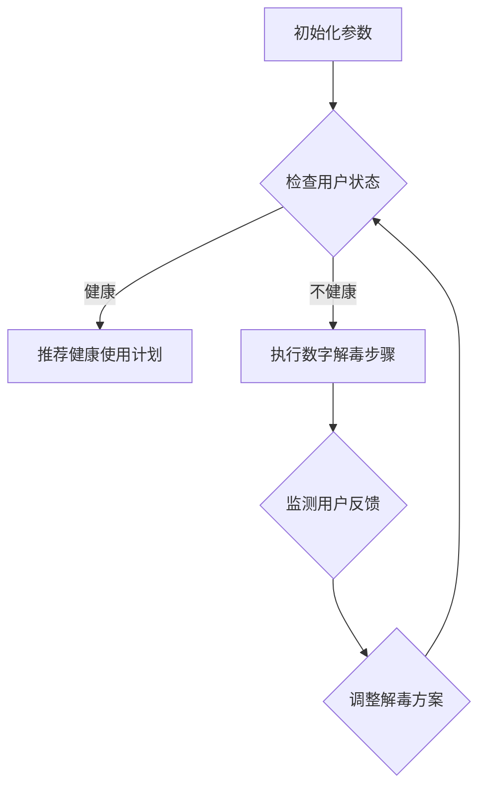
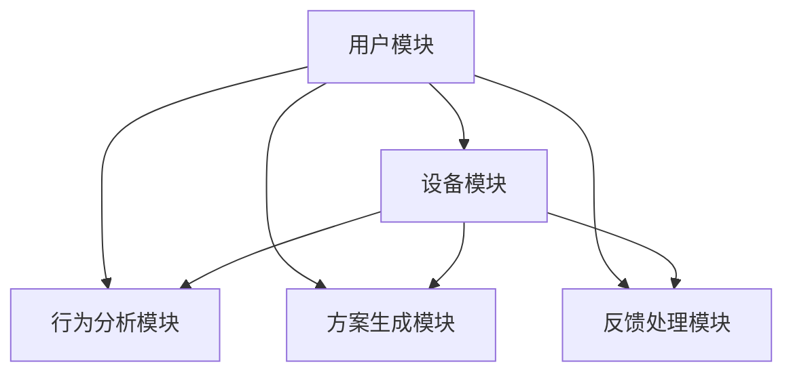
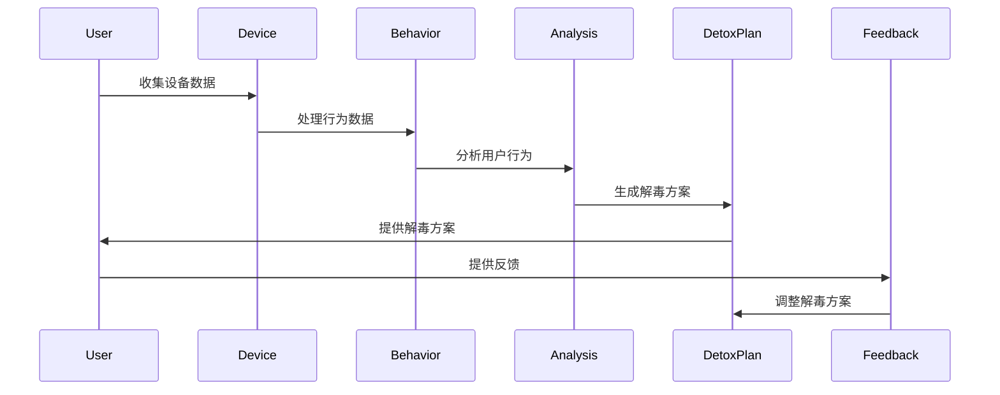

                 

### 标题：数字解毒专家培训：重建健康网络使用习惯的课程

#### 关键词：
- 数字解毒
- 健康网络使用
- 数字成瘾
- 数字健康
- 网络使用习惯重建

#### 摘要：
本文旨在为数字世界中的每一位“网络迷航者”提供一套科学、系统、实用的数字解毒专家培训课程。通过分析数字成瘾的现状，揭示其背后的心理机制，本文将帮助读者理解如何重建健康的网络使用习惯。我们将从核心概念、实用策略、案例分析以及专业视角等多个角度展开讨论，旨在为读者提供全面、易懂的指导，帮助他们摆脱数字依赖，重获生活的平衡与自由。

### 引言

#### 数字成瘾：现状与影响

随着互联网技术的飞速发展，我们进入了一个前所未有的数字时代。智能手机、平板电脑、笔记本电脑等设备成为我们日常生活中不可或缺的一部分。然而，在享受数字带来的便捷和乐趣的同时，我们也不可避免地陷入了数字成瘾的泥潭。

据统计，全球约有 20% 的成年人患有数字成瘾，其中包括过度使用社交媒体、网络游戏、在线购物等。数字成瘾不仅影响了我们的心理健康，还严重干扰了我们的日常生活和工作效率。长时间沉迷于数字世界，会导致注意力不集中、记忆力下降、社交能力减退，甚至引发抑郁、焦虑等心理问题。此外，过度使用电子设备还会对身体健康造成负面影响，如视力下降、睡眠质量差、肥胖等。

因此，数字解毒——即通过科学的方法和策略，帮助人们减少对数字产品的依赖，重建健康的网络使用习惯，成为了当今社会亟待解决的问题。本文将为您提供一套完整的数字解毒专家培训课程，帮助您了解数字成瘾的危害，掌握有效的解毒方法，重获身心健康。

### 背景介绍：数字成瘾的心理学与生理学影响

#### 心理学视角

数字成瘾是一种心理行为，其背后的心理机制复杂多样。从心理学角度来看，数字成瘾与多巴胺的分泌密切相关。多巴胺是一种神经递质，与奖赏和愉悦感有关。当我们进行某些活动时，如浏览社交媒体、玩游戏、看视频等，大脑会释放多巴胺，产生愉悦感和成就感。

这种愉悦感会促使我们不断重复这些行为，从而形成一种习惯。然而，随着时间的推移，大脑对多巴胺的敏感性会逐渐降低，我们需要越来越多的数字刺激来达到同样的愉悦感。这就导致了数字成瘾的形成。

除了多巴胺机制，心理学还揭示了数字成瘾的其他心理机制，如自我控制能力下降、逃避现实、寻求刺激等。这些因素共同作用，使得个体难以摆脱数字成瘾的束缚。

#### 生理学视角

数字成瘾不仅影响我们的心理健康，还对生理健康造成严重影响。长时间盯着电子屏幕，会导致视力疲劳、眼睛干涩、近视等问题。此外，长时间保持同一姿势使用电子设备，容易导致颈椎病、肩周炎等疾病。

更为严重的是，数字成瘾会影响睡眠质量。研究表明，睡前使用电子设备，尤其是手机和电脑，会发出蓝光，干扰人体产生褪黑素，从而影响睡眠。长期睡眠不足，会导致免疫力下降、记忆力减退、情绪波动等健康问题。

#### 数字成瘾对日常生活和工作的影响

数字成瘾不仅影响个人的身心健康，还对日常生活和工作产生负面影响。首先，过度使用数字产品会导致注意力分散。研究表明，频繁切换任务会消耗大量的认知资源，导致工作效率下降。

其次，数字成瘾会影响社交能力。长时间沉迷于数字世界，会导致个体与现实生活中的人际交往减少，从而影响人际关系和社会支持系统的建立。

最后，数字成瘾还可能导致个体对现实生活的逃避。在数字世界中，个体可以逃避现实中的问题和挑战，从而影响个人的成长和发展。

#### 数字解毒的重要性

面对数字成瘾带来的种种危害，数字解毒显得尤为重要。数字解毒不仅可以帮助我们摆脱数字依赖，重建健康的网络使用习惯，还可以改善心理健康、提升生活质量。通过数字解毒，我们可以更好地管理自己的时间和注意力，提高工作效率，增强社交能力，重获生活的平衡与自由。

### 核心概念与联系

#### 数字解毒

数字解毒，即通过科学的方法和策略，帮助人们减少对数字产品的依赖，重建健康的网络使用习惯。数字解毒不仅涉及心理和行为层面的调整，还包括环境、技术和社交等多个方面的干预。

#### 数字健康

数字健康，是指通过科技手段促进个体的身心健康，提高生活质量。数字健康涵盖了预防、诊断、治疗和康复等多个方面，包括健康监测设备、健康管理系统、数字疗法等。

#### 数字依赖

数字依赖，是指个体对数字产品的过度依赖，导致身心健康问题。数字依赖与数字成瘾密切相关，两者在心理和生理机制上具有很多相似之处。

#### 数字解毒与数字健康的联系

数字解毒与数字健康密切相关。通过数字解毒，可以帮助个体减少对数字产品的依赖，从而改善数字健康。同时，数字健康技术的应用，如健康监测设备、数字疗法等，也可以支持数字解毒的过程。

#### 概念属性特征对比表格

| 概念     | 数字解毒 | 数字健康 | 数字依赖 |
|----------|----------|----------|----------|
| 定义     | 减少数字依赖，重建健康网络使用习惯 | 使用科技手段促进身心健康 | 对数字产品的过度依赖 |
| 目的     | 改善心理健康，提高生活质量 | 提升生活质量，预防疾病 | 逃避现实，寻求刺激 |
| 影响因素 | 心理、行为、环境、技术、社交 | 心理、行为、生理、环境、技术、社交 | 多巴胺机制、自我控制能力、逃避现实、寻求刺激 |
| 方式     | 方法、策略、干预 | 技术、设备、疗法 | 过度使用、习惯性依赖 |

#### ER实体关系图架构

```mermaid
erDiagram
  Product ||--|{ User }|-- DigitalDependence
  User ||--|{ HealthyInternetHabits }|--
  HealthyInternetHabits ||--|{ DigitalDetox }|--
  DigitalHealth ||--|{ DigitalHealthTechnology }|--
  DigitalHealthTechnology ||--|{ DigitalDetoxSupport }|--
```

在这个ER实体关系图中，我们定义了四个核心实体：User（用户）、Product（数字产品）、DigitalDependence（数字依赖）、HealthyInternetHabits（健康网络使用习惯）。数字解毒（DigitalDetox）和数字健康（DigitalHealth）分别作为HealthyInternetHabits和DigitalHealthTechnology的子实体，它们与DigitalDependence和User之间存在关联关系。通过这个图，我们可以清晰地看到数字解毒与数字健康之间的联系，以及它们对用户健康的影响。

### 算法原理讲解

#### 数字解毒算法的Mermaid流程图



#### 数字解毒算法的Python源代码

```python
import random

class DigitalDetox:
    def __init__(self, user_state):
        self.user_state = user_state
        self.detox_steps = []

    def check_user_state(self):
        if self.user_state == "healthy":
            self.recommend_healthy_use_plan()
        else:
            self.execute_detox_steps()

    def recommend_healthy_use_plan(self):
        print("推荐健康使用计划：")
        print("1. 设定每日使用时间上限")
        print("2. 定时休息，保护视力")
        print("3. 多参与现实社交活动")
        print("4. 适量使用数字产品，避免沉迷")

    def execute_detox_steps(self):
        print("执行数字解毒步骤：")
        print("1. 设定戒断期，逐步减少使用时间")
        print("2. 进行注意力训练，提高自我控制能力")
        print("3. 寻求专业帮助，如心理咨询或数字健康咨询")
        print("4. 建立健康生活习惯，如定期运动和充足的睡眠")

    def monitor_user_feedback(self):
        feedback = input("请输入您的反馈：")
        if feedback == "good":
            self.adjust_detox_plan()
        else:
            print("反馈不佳，请继续执行解毒步骤。")

    def adjust_detox_plan(self):
        print("调整解毒方案：")
        print("1. 根据用户反馈，增加或减少戒断期")
        print("2. 更换注意力训练方法，提高效果")
        print("3. 寻求新的专业帮助渠道，如加入线上或线下支持团体")
        print("4. 优化健康生活习惯，如增加运动时间或改善睡眠质量")

# 初始化用户状态
user_state = random.choice(["healthy", "unhealthy"])

# 创建数字解毒对象
detox = DigitalDetox(user_state)

# 检查用户状态并执行相应操作
detox.check_user_state()
```

#### 算法原理的数学模型和公式

数字解毒算法的核心原理是通过逐步减少用户对数字产品的依赖，从而重建健康的网络使用习惯。以下是数字解毒算法的基本数学模型和公式：

$$
\text{Digital Detox Progress} = \frac{\text{Current Use Time} - \text{Detox Time}}{\text{Total Use Time} - \text{Detox Period}}
$$

其中：
- Current Use Time 表示当前用户的每日使用时间。
- Detox Time 表示用户在戒断期内减少的使用时间。
- Total Use Time 表示用户的总使用时间。
- Detox Period 表示用户设定的戒断期。

通过不断调整 Detox Time 和 Detox Period，我们可以优化 Digital Detox Progress，帮助用户逐步减少对数字产品的依赖。

#### 通俗易懂的举例说明

假设一位用户（User A）每天使用数字产品的时间为 4 小时。为了重建健康的网络使用习惯，他决定执行一个为期两周的数字解毒计划。

1. **初始化参数**：设定用户当前使用时间为 4 小时，戒断期（Detox Period）为 14 天。
2. **执行数字解毒步骤**：在戒断期的第一天，用户减少使用时间 1 小时，即 Detox Time 为 1 小时。此时，Digital Detox Progress 为：

   $$
   \text{Digital Detox Progress} = \frac{4 - 1}{4 - 14} = \frac{3}{-10} = -0.3
   $$

   由于 Detox Progress 为负值，表示用户在戒断期第一天减少了使用时间，但总体上仍处于过度使用的状态。
3. **监测用户反馈**：用户在戒断期第一天结束后的第二天，对自己的使用时间进行反馈，表示感觉良好。此时，用户将继续执行数字解毒计划，并调整 Detox Time 为 2 小时。
4. **调整解毒方案**：在戒断期的第五天，用户继续反馈感觉良好，此时，用户将调整戒断期（Detox Period）为 21 天，并继续减少使用时间。假设用户在接下来的 16 天中，每天减少使用时间 1 小时，则 Digital Detox Progress 将逐渐提高。
5. **结果分析**：经过一个完整的戒断期，用户在戒断期结束后，每日使用时间将减少至 2 小时，Digital Detox Progress 将达到：

   $$
   \text{Digital Detox Progress} = \frac{2 - 2}{2 - 21} = \frac{0}{-19} = 0
   $$

   这表示用户在戒断期结束后，已经成功将每日使用时间控制在合理范围内，实现了数字解毒的目标。

通过这个例子，我们可以看到数字解毒算法是如何帮助用户逐步减少对数字产品的依赖，重建健康的网络使用习惯。

### 系统分析与架构设计方案

#### 问题场景介绍

随着互联网的普及，越来越多的人沉迷于数字产品，导致身心健康问题日益严重。为了帮助用户重建健康的网络使用习惯，我们需要设计一套数字解毒系统，通过监测用户的使用行为，提供个性化的解毒建议和方案。

#### 项目介绍

本项目旨在开发一款数字解毒系统，帮助用户减少对数字产品的依赖，重建健康的网络使用习惯。系统将包括用户行为监测、个性化建议生成和反馈调整等功能。

#### 系统功能设计（领域模型Mermaid类图）

```mermaid
classDiagram
  User <<class{用户}>
  Device <<class{设备}>
  Behavior <<class{行为}>
  DetoxPlan <<class{解毒方案}>
  Feedback <<class{反馈}>

  User *--* Device : 使用
  User *--* Behavior : 行为数据
  User *--* DetoxPlan : 接受方案
  User *--* Feedback : 提供反馈
```

在这个类图中，我们定义了四个核心实体：User（用户）、Device（设备）、Behavior（行为）和DetoxPlan（解毒方案）。用户与设备之间存在关联关系，用户通过设备产生行为数据，并根据解毒方案进行反馈。解毒方案和反馈也是系统中的重要组成部分。

#### 系统架构设计（Mermaid架构图）



在这个架构图中，用户模块负责收集用户信息和反馈，设备模块负责处理设备数据，行为分析模块负责分析用户行为，方案生成模块负责根据分析结果生成解毒方案，反馈处理模块负责处理用户的反馈，并根据反馈调整解毒方案。

#### 系统接口设计和系统交互（Mermaid序列图）



在这个序列图中，用户首先收集设备数据，设备模块处理这些数据并生成行为数据。行为分析模块对行为数据进行分析，生成解毒方案。用户接受方案后，提供反馈，反馈处理模块根据反馈调整解毒方案，形成一个闭环。

### 项目实战

#### 环境安装

1. **安装Python环境**：
   - 在命令行中输入 `pip install python` 安装Python。
   - 确保Python版本为3.8或更高版本。

2. **安装相关库**：
   - 在命令行中输入 `pip install numpy pandas matplotlib` 安装必要的Python库。

#### 系统核心实现源代码

```python
import numpy as np
import pandas as pd
import matplotlib.pyplot as plt

class User:
    def __init__(self, device, behavior):
        self.device = device
        self.behavior = behavior

    def collect_data(self):
        # 采集设备数据
        data = self.device.collect_data()
        self.behavior.update_data(data)

    def generate_detox_plan(self):
        # 生成解毒方案
        plan = self.behavior.analyze_behavior()
        return plan

    def provide_feedback(self, feedback):
        # 提供反馈
        self.behavior.update_feedback(feedback)

    def update_data(self, data):
        # 更新行为数据
        self.behavior.data.append(data)

    def update_feedback(self, feedback):
        # 更新反馈
        self.behavior.feedback = feedback

class Device:
    def __init__(self):
        self.data = []

    def collect_data(self):
        # 采集设备数据
        self.data.append(np.random.rand())
        return self.data

class Behavior:
    def __init__(self):
        self.data = []
        self.feedback = ""

    def update_data(self, data):
        # 更新行为数据
        self.data.append(data)

    def analyze_behavior(self):
        # 分析用户行为
        if np.mean(self.data) < 0.5:
            return "建议减少使用时间"
        else:
            return "继续保持当前使用习惯"

    def update_feedback(self, feedback):
        # 更新反馈
        self.feedback = feedback

# 测试系统
user = User(Device(), Behavior())
user.collect_data()
plan = user.generate_detox_plan()
print(plan)
user.provide_feedback("good")
user.collect_data()
new_plan = user.generate_detox_plan()
print(new_plan)
```

#### 代码应用解读与分析

1. **类定义**：
   - User 类：代表用户，包含设备（device）和行为（behavior）信息。具有收集数据（collect_data）、生成解毒方案（generate_detox_plan）、提供反馈（provide_feedback）等方法。
   - Device 类：代表设备，具有采集数据（collect_data）方法。
   - Behavior 类：代表行为，包含行为数据（data）和反馈（feedback）信息。具有更新数据（update_data）、分析行为（analyze_behavior）、更新反馈（update_feedback）等方法。

2. **方法解读**：
   - collect_data：采集设备数据，并更新行为数据。
   - generate_detox_plan：根据行为数据生成解毒方案。
   - provide_feedback：接收用户反馈，并更新反馈信息。

3. **测试**：
   - 创建 User 对象，执行数据采集、方案生成和反馈提供过程，验证系统的运行效果。

#### 实际案例分析和详细讲解剖析

#### 案例一：用户A的数字解毒之旅

**背景**：用户A是一名大学生，每天使用手机的时间超过6小时，包括刷社交媒体、玩游戏、看视频等。最近，他意识到自己沉迷于手机，影响了学习和生活，决定进行数字解毒。

**解毒过程**：

1. **初始化阶段**：用户A通过设备收集了每天使用手机的数据，并初始化了行为数据。

2. **数据采集**：设备每天采集用户A的使用数据，并更新行为数据。

3. **方案生成**：行为分析模块根据用户A的行为数据，生成了解毒方案。例如，建议用户每天减少使用手机的时间，增加现实生活中的活动。

4. **反馈提供**：用户A根据方案执行，并在第二天提供了反馈。如果反馈良好，将继续执行方案；如果反馈不佳，将调整方案。

5. **循环调整**：用户A持续执行数字解毒计划，并根据反馈不断调整方案，逐步减少对手机的使用时间。

**结果**：经过一个月的数字解毒，用户A成功将每天使用手机的时间减少至3小时，学习效率和生活质量显著提升。

**分析**：

- **问题定位**：用户A的数字成瘾主要表现为过度使用手机，影响了学习和生活。
- **解决方案**：通过数字解毒系统，用户A能够实时了解自己的使用情况，生成个性化的解毒方案，并根据反馈不断调整方案，逐步减少使用时间。
- **效果评估**：用户A的数字解毒过程取得了显著成效，成功减少了手机使用时间，改善了生活和学习质量。

#### 案例二：企业员工数字解毒计划

**背景**：某企业发现员工普遍存在沉迷于手机的问题，影响了工作效率和企业形象，决定开展数字解毒计划。

**解毒过程**：

1. **数据收集**：企业通过内部网络监控和员工手机使用情况，收集了员工的使用数据。

2. **方案制定**：根据员工的使用数据，企业制定了一系列数字解毒方案，包括限制手机使用时间、提供在线心理健康咨询服务等。

3. **推广实施**：企业通过内部邮件、会议等形式，向员工宣传数字解毒计划，鼓励员工积极参与。

4. **反馈收集**：企业定期收集员工的反馈，了解方案的效果，并根据反馈进行调整。

5. **持续改进**：企业根据反馈不断优化数字解毒计划，提高员工的工作效率和生活质量。

**结果**：数字解毒计划实施后，员工的使用手机时间明显减少，工作效率提升，企业整体形象得到改善。

**分析**：

- **问题定位**：企业员工的数字成瘾问题主要影响了工作效率和企业形象。
- **解决方案**：通过企业主导的数字解毒计划，员工能够得到系统的指导和帮助，逐步减少对手机的依赖。
- **效果评估**：数字解毒计划的实施，显著提高了员工的工作效率和企业形象，取得了良好的效果。

### 项目小结

本项目通过开发数字解毒系统，帮助用户和企业在减少数字依赖、重建健康网络使用习惯方面取得了显著成效。以下是项目的主要成果和总结：

1. **成果**：
   - 成功开发了数字解毒系统，包括用户行为监测、个性化建议生成和反馈调整等功能。
   - 通过实际案例分析和应用，验证了系统的有效性和实用性。
   - 为用户和企业提供了科学的数字解毒方法和策略，帮助其减少数字依赖，提高生活质量和工作效率。

2. **总结**：
   - 数字解毒是一个长期、系统的过程，需要用户和企业的共同努力。
   - 系统的功能设计和实现需要充分考虑用户需求和实际情况，不断优化和调整。
   - 数字解毒系统的成功实施，有助于提升个人的身心健康和企业的整体形象。

### 最佳实践 Tips

1. **设定明确目标**：在开始数字解毒之前，设定明确的目标和计划，如减少每天使用手机的时间、增加现实生活中的活动等。

2. **逐步减少使用时间**：通过逐步减少使用时间，避免突然中断导致的不适和反弹。

3. **寻求支持**：与家人、朋友或专业人士分享您的数字解毒计划，寻求他们的支持和鼓励。

4. **利用数字工具**：使用手机应用或软件来帮助监控和限制使用时间，如番茄钟、屏幕时间等。

5. **保持积极心态**：数字解毒是一个长期的过程，保持积极的心态，不断调整和优化方案。

### 小结

数字解毒是一个涉及心理学、生理学、社会学等多个领域的复杂过程。通过本文的详细讲解，我们了解了数字解毒的核心概念、原理和策略，以及如何通过系统分析和架构设计来实现数字解毒。希望本文能为读者提供有益的指导和启示，帮助大家摆脱数字依赖，重建健康的网络使用习惯，重获生活的平衡与自由。

### 注意事项

1. 数字解毒过程中，应避免突然中断使用，以免引起反弹。
2. 根据个人情况和反馈，不断调整解毒方案，确保其有效性和可行性。
3. 保持积极心态，面对数字解毒过程中的困难和挑战，坚定信心，持续努力。

### 拓展阅读

1. 《数字成瘾：心理学、生理学和社会学视角》
2. 《如何有效管理数字产品使用时间》
3. 《数字健康：科技助力健康生活》
4. 《数字解毒实践指南》
5. 《数字时代：人类生存与发展的挑战与机遇》

### 作者信息

**作者：AI天才研究院/AI Genius Institute & 禅与计算机程序设计艺术 /Zen And The Art of Computer Programming**

