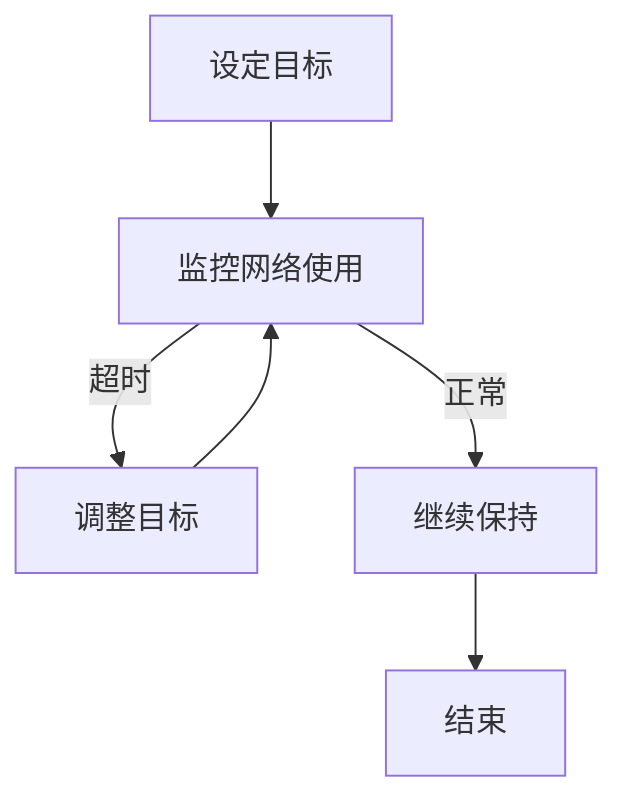
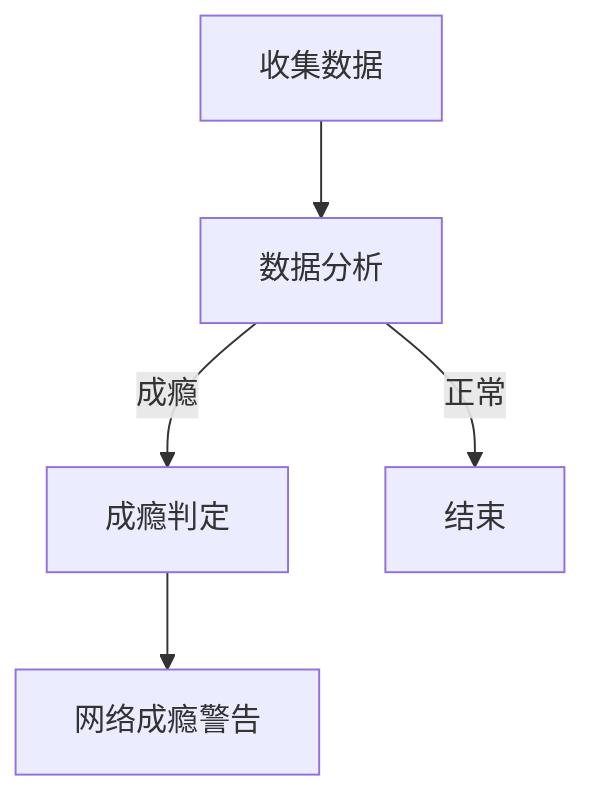
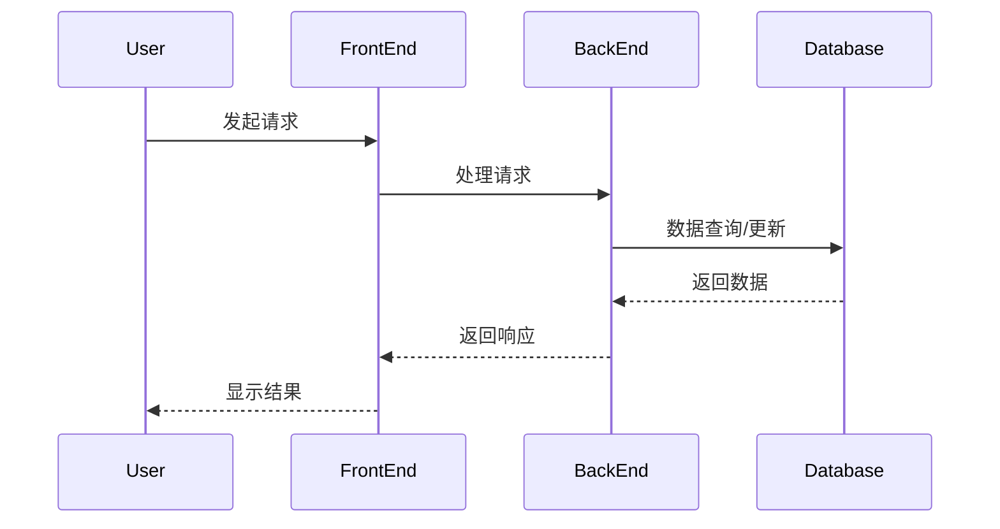
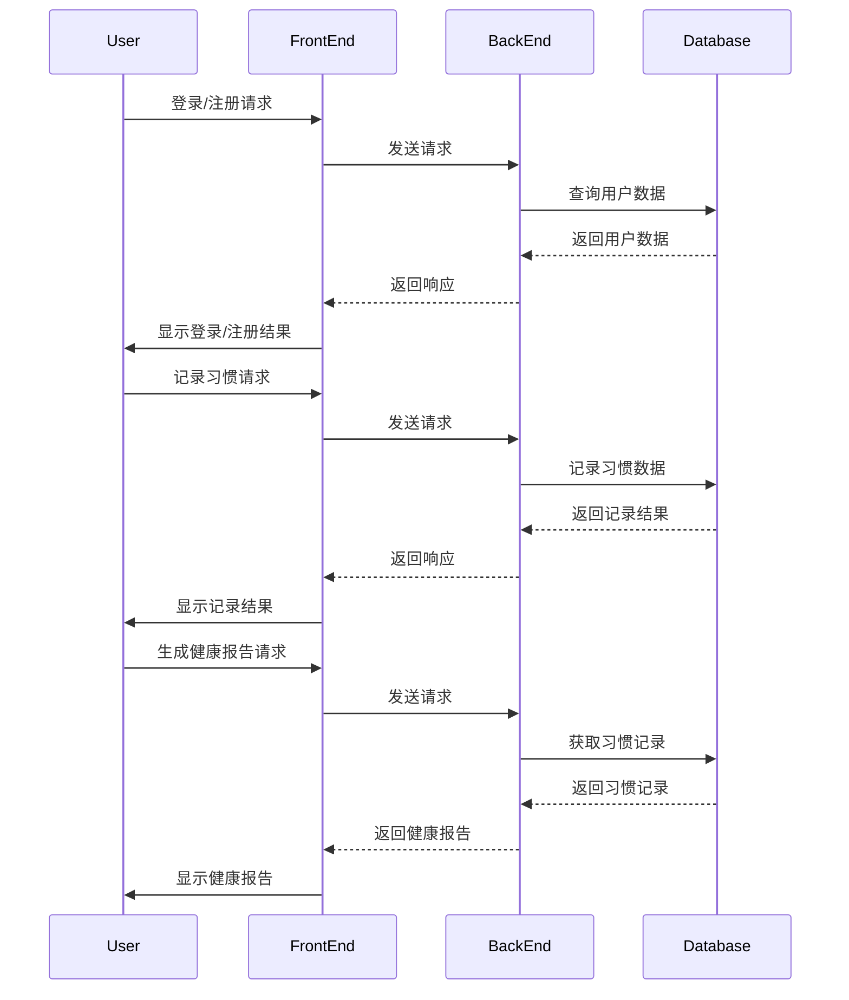

                 


## 《数字解毒师：指导重建健康网络关系》

### 关键词

数字生活，网络关系，成瘾现象，自我管理，数字解毒策略，健康网络构建

### 摘要

在数字化时代，网络关系逐渐成为我们日常生活的重要组成部分。然而，网络成瘾、隐私泄露等问题也随之而来，严重影响了人们的身心健康和社会稳定。本文旨在探讨数字生活的挑战与机遇，分析网络关系的现状与问题，提出有效的数字解毒策略，以指导我们重建健康的网络关系。

### 目录大纲

**第一部分：数字生活与网络关系**

**第1章：数字生活的挑战与机遇**

1.1 数字生活的定义与影响

1.2 网络关系的概念与问题

**第二部分：网络关系问题分析**

**第2章：网络成瘾现象**

2.1 网络成瘾的定义与标准

2.2 网络成瘾的原因分析

2.3 网络成瘾的影响

**第三部分：数字解毒策略**

**第3章：数字自我管理**

3.1 数字自我管理的原则

3.2 数字习惯的培养

3.3 数字自我保护的技巧

**第四部分：构建健康网络关系**

**第4章：家庭与数字关系**

4.1 家庭中的数字互动

4.2 学校与数字教育

4.3 社区与网络文明

**第五部分：数字解毒实践案例**

**第5章：数字解毒案例研究**

5.1 成功案例介绍

5.2 案例分析

**第六部分：数字解毒的未来展望**

**第6章：数字解毒师的职业发展**

6.1 数字解毒师的角色

6.2 数字解毒行业的发展趋势

**第七部分：数字解毒师实践指南**

**第7章：数字解毒实践建议**

7.1 家庭实践建议

7.2 学校与社区实践建议

7.3 个人自我提升策略

### 第一部分：数字生活与网络关系

#### 第1章：数字生活的挑战与机遇

随着互联网技术的飞速发展，数字生活已经成为现代社会的一种普遍现象。人们通过智能手机、电脑等设备，随时随地进行信息获取、社交互动、在线购物等。数字生活给我们的生活带来了很多便利，但同时也带来了一系列的挑战。

**1.1 数字生活的定义与影响**

数字生活，即指人们在数字环境中进行的生活活动。它包括但不限于在线学习、远程工作、社交媒体互动、电子商务等。数字生活的普及使得人们的生活更加便捷，同时也带来了一些负面影响。

首先，数字生活对个人产生了深远的影响。人们可以更加方便地获取信息、学习新知识，从而提升自己的综合素质。然而，过度依赖数字设备可能导致身体健康问题，如视力下降、颈椎病等。此外，数字生活也可能导致社交能力的下降，人们更多地沉迷于虚拟世界，而忽视了现实生活中的人际交往。

其次，数字生活对社会产生了重要影响。一方面，数字生活促进了信息的快速传播，使得人们可以更加便捷地获取全球范围内的信息。另一方面，数字生活也可能导致信息过载，使得人们难以筛选出有价值的信息。此外，数字生活还可能加剧社会不平等现象，使得资源分配更加不均。

**1.2 网络关系的概念与问题**

网络关系是指人们在网络上形成的社会关系。随着社交媒体的兴起，网络关系已经成为人们生活中不可或缺的一部分。网络关系既包括线上的人际交往，也包括线上社交平台的互动。

然而，网络关系也面临诸多问题。首先，网络成瘾是一个严重的问题。许多人沉迷于网络，导致生活作息紊乱，影响身心健康。其次，网络隐私问题也日益突出。个人信息泄露、网络诈骗等现象屡见不鲜，给人们的生活带来了诸多困扰。

综上所述，数字生活与网络关系已经成为我们日常生活中不可或缺的一部分。然而，我们也需要认识到其中存在的问题，并积极寻求解决方案，以重建健康的网络关系。

#### 第2章：网络成瘾现象

网络成瘾现象是指个体对网络活动产生强烈的依赖，以至于影响到日常生活、工作和社会交往的一种行为模式。网络成瘾已经成为全球范围内的一个严重问题，对个体和社会都产生了深远的影响。

**2.1 网络成瘾的定义与标准**

网络成瘾的定义较为广泛，不同学者和研究机构有不同的定义。一般来说，网络成瘾可以被视为一种冲动控制障碍，表现为个体对网络活动无法自控，以至于影响到正常的生活和工作。常见的网络成瘾行为包括网络游戏、社交媒体使用、网络购物等。

国际上，常见的网络成瘾诊断标准包括：

- **时间依赖性**：个体在网络上花费的时间远超过预期，且无法自我控制。
- **社会功能受损**：网络成瘾导致个体在社交、学习、工作等方面出现问题，如社交孤立、学业成绩下降、工作效率降低等。
- **心理依赖**：个体在现实生活中感到空虚、无助，只能在网络上寻找慰藉。
- **戒断症状**：当个体减少或停止网络活动时，会出现焦虑、不安、失眠等生理和心理反应。

**2.2 网络成瘾的原因分析**

网络成瘾的原因是多方面的，涉及社会、心理、家庭等多个方面。

- **社会因素**：随着互联网的普及，网络成为了人们获取信息、娱乐和社交的重要途径。同时，社交媒体的兴起使得人们可以轻松地与全球范围内的用户互动，这种社交的便捷性也可能导致网络成瘾。

- **心理因素**：个体在现实生活中可能面临各种压力和挑战，如学业压力、工作压力、人际关系问题等。网络提供了一个逃避现实、寻找慰藉的虚拟环境，从而可能导致网络成瘾。

- **家庭因素**：家庭环境对个体的网络成瘾有重要影响。家庭关系紧张、父母过度保护或忽视等，都可能导致个体在网络中寻求安慰和认同。

- **个人因素**：个体的性格特点、兴趣爱好等也可能影响其网络成瘾的程度。例如，寻求刺激、追求成就感的人更容易沉迷于网络游戏。

**2.3 网络成瘾的影响**

网络成瘾对个体和社会都产生了严重的影响。

- **对个人的影响**：网络成瘾可能导致以下问题：
  - 身体健康问题：长时间使用电子设备可能导致视力下降、颈椎病等健康问题。
  - 心理健康问题：网络成瘾可能导致焦虑、抑郁等心理健康问题。
  - 社交能力下降：沉迷于网络可能导致个体忽视现实生活中的人际交往，导致社交孤立。
  - 学业和工作效率降低：网络成瘾可能影响个体的学业成绩和工作效率。

- **对社会的影响**：网络成瘾可能对社会产生以下影响：
  - 社会不平等加剧：网络成瘾可能导致资源分配不均，进一步加剧社会不平等现象。
  - 网络犯罪增加：网络成瘾可能导致个体更容易受到网络诈骗、信息泄露等网络犯罪的侵害。
  - 社会信任度下降：网络成瘾可能导致个体对现实世界的信任度下降，影响社会稳定。

综上所述，网络成瘾是一个严重的社会问题，需要引起我们的高度重视。了解网络成瘾的定义与标准、原因及其影响，有助于我们更好地预防和应对网络成瘾现象，重建健康的网络关系。

#### 第3章：数字自我管理

数字自我管理是指个体在数字环境中通过自我约束、自我调节和自我保护等措施，合理使用数字设备和网络服务，从而保持身心健康和社会功能的一种行为模式。在数字生活日益普及的今天，数字自我管理对于维护个人的健康、提高工作效率和社会交往质量具有重要意义。

**3.1 数字自我管理的原则**

有效的数字自我管理需要遵循以下原则：

- **明确目标和计划**：个体应当明确自己在数字环境中的目标，并制定合理的计划，以确保时间的高效利用。
- **自我监控与评估**：个体需要定期对自己的数字行为进行监控和评估，及时发现并纠正不良习惯。
- **平衡数字生活与现实生活**：个体应当平衡数字生活与现实生活，确保在享受数字便利的同时，不忽视现实生活中的人际交往和身心健康。

**3.2 数字习惯的培养**

培养良好的数字习惯是数字自我管理的关键。以下是一些建议：

- **合理规划时间**：设定每日的数字使用时间，避免长时间连续使用电子设备，特别是睡前使用。
- **健康使用社交媒体**：合理安排社交媒体使用时间，避免沉迷于虚拟世界，影响现实生活中的社交活动。
- **保持网络安全**：学会保护个人隐私，不随意泄露个人信息，防范网络诈骗和信息泄露。
- **健康用眼**：长时间使用电子设备后，适时休息，保护视力健康。

**3.3 数字自我保护的技巧**

在数字环境中，个体需要学会自我保护，以下是一些常见的技巧：

- **使用安全防护工具**：安装杀毒软件、防火墙等安全工具，保护电脑和手机的安全。
- **谨慎对待未知链接和文件**：不随意点击未知链接或下载文件，防止病毒和恶意软件入侵。
- **加强账号密码管理**：使用复杂且不同的密码保护个人账号，防止账号被黑客攻击。
- **定期更新软件和操作系统**：及时更新软件和操作系统，修补安全漏洞，防止被恶意攻击。

通过遵循数字自我管理的原则、培养良好的数字习惯和掌握数字自我保护的技巧，个体可以在数字环境中保持身心健康，提高生活质量。数字自我管理不仅是一种行为习惯，更是一种生活态度，它需要个体在实践中不断调整和完善。

#### 第4章：构建健康网络关系

在数字生活的背景下，健康网络关系的重要性日益凸显。家庭、学校、社区作为社会的基本单元，在构建健康网络关系方面发挥着关键作用。本章将探讨家庭与数字关系、学校与数字教育以及社区与网络文明，为构建健康网络关系提供具体建议和实践措施。

**4.1 家庭与数字关系**

家庭是人们生活的基本单位，家庭中的数字关系对个体的成长和健康有着深远影响。以下是一些建议，帮助家庭构建健康网络关系：

- **家庭数字互动**：家庭成员之间应积极进行数字互动，通过视频通话、社交媒体等工具加强沟通和情感联系。家长应当鼓励孩子参与数字活动，但也要确保孩子不过度沉迷。
- **家庭数字规则**：家长应制定家庭数字使用规则，如设定每日数字使用时间、规定在家庭用餐时不使用电子设备等。这些规则有助于培养孩子良好的数字习惯。
- **家长榜样作用**：家长自己也要遵守数字规则，以身作则，成为孩子健康数字生活的榜样。

**4.2 学校与数字教育**

学校是培养下一代的重要场所，学校在数字教育方面的作用不可或缺。以下是一些建议，帮助学校构建健康网络关系：

- **数字教育资源**：学校应充分利用数字教育资源，如在线课程、教育平台等，丰富教学内容，提高教育质量。同时，学校也应关注学生的数字素养，培养他们正确使用数字工具的能力。
- **数字教育管理**：学校应建立数字教育管理制度，规范教师和学生使用数字设备的行为，防止网络成瘾和沉迷网络游戏等问题。
- **网络安全教育**：学校应加强网络安全教育，提高学生和教师对网络诈骗、信息泄露等网络安全威胁的防范意识。

**4.3 社区与网络文明**

社区是人们共同生活的空间，社区在构建网络文明方面发挥着重要作用。以下是一些建议，帮助社区构建健康网络关系：

- **社区数字文化氛围**：社区应积极营造健康向上的数字文化氛围，通过组织数字文化活动、网络文明讲座等，提高居民的数字素养和网络文明意识。
- **网络文明建设实践**：社区应开展网络文明建设实践，如设立网络文明宣传栏、开展网络文明志愿者活动等，引导居民正确使用网络，营造良好的网络环境。
- **数字公共服务**：社区应提供数字公共服务，如社区服务平台、数字图书馆等，方便居民在日常生活中使用数字工具，提高生活质量。

通过家庭、学校、社区的共同努力，我们可以构建健康网络关系，为个体的成长和社会的进步创造良好的数字环境。只有大家齐心协力，才能实现数字生活的和谐与美好。

#### 第5章：数字解毒案例研究

数字解毒实践的成功案例为我们提供了宝贵的经验和启示。本章节将通过介绍和分析成功案例，探讨数字解毒的策略和实践方法，为更多人提供可借鉴的经验。

**5.1 成功案例介绍**

以下是一些典型的数字解毒成功案例：

**案例1：家庭数字解毒计划**

某家庭通过制定详细的数字使用规则，帮助家庭成员摆脱网络成瘾。具体措施包括：
- 每日设定固定的数字使用时间，确保家庭成员有足够的休息时间。
- 在家庭用餐时不使用电子设备，促进家庭成员的面对面交流。
- 定期进行数字习惯评估，及时发现和纠正不良习惯。

经过一段时间的实践，这个家庭的家庭成员逐渐摆脱了网络成瘾，恢复了健康的数字生活。

**案例2：学校数字教育改革**

某学校在数字教育方面进行了全面改革，取得显著成效。具体措施包括：
- 建立数字教育管理制度，规范教师和学生使用数字设备的行为。
- 开设网络安全课程，提高学生的网络安全意识和能力。
- 利用在线平台和虚拟现实技术，丰富教学内容，提高教学质量。

这些措施不仅有效防止了网络成瘾，还提升了学生的数字素养，促进了他们的全面发展。

**案例3：社区网络文明建设**

某社区通过一系列网络文明建设活动，营造了健康向上的数字环境。具体措施包括：
- 开展网络文明讲座，提高居民的数字素养和网络文明意识。
- 设立社区数字图书馆，为居民提供便捷的数字阅读资源。
- 组织网络文明志愿者活动，引导居民正确使用网络，共同维护网络环境。

这些活动得到了社区居民的积极响应，社区的网络文明水平得到了显著提升。

**5.2 案例分析**

**案例1分析**：家庭数字解毒计划的实施关键在于家庭成员的共同参与和持续监督。通过设定明确的数字使用规则，家庭成员可以更好地管理自己的数字时间，减少网络成瘾。此外，家庭互动的增加也有助于缓解网络沉迷带来的负面影响。

**案例2分析**：学校数字教育改革的成功在于多方面的努力。建立数字教育管理制度是确保改革顺利进行的基础，而网络安全教育和在线教学平台的引入则为学生的数字素养提升提供了有力支持。

**案例3分析**：社区网络文明建设需要全社会的共同努力。通过开展网络文明讲座和志愿者活动，社区可以提升居民的数字素养和网络文明意识，共同营造良好的数字环境。

**5.3 案例解决方案与效果评估**

**案例1解决方案**：通过制定家庭数字使用规则、加强家庭互动等措施，家庭成员可以逐步摆脱网络成瘾，恢复健康的数字生活。

**效果评估**：实施家庭数字解毒计划后，家庭成员的数字使用时间得到了有效控制，家庭关系得到了明显改善。

**案例2解决方案**：通过建立数字教育管理制度、开设网络安全课程和利用在线平台等手段，学校可以有效预防网络成瘾，提高学生的数字素养。

**效果评估**：学校数字教育改革实施后，学生的学业成绩有了显著提升，网络安全意识和能力得到了增强。

**案例3解决方案**：通过开展网络文明讲座、设立数字图书馆和组织志愿者活动等，社区可以营造健康向上的数字环境。

**效果评估**：社区网络文明建设活动得到了居民的广泛认可，网络文明水平有了显著提高。

综上所述，数字解毒案例研究为我们提供了宝贵的经验和启示。通过借鉴成功案例，我们可以更好地应对数字生活的挑战，构建健康的网络关系。

#### 第6章：数字解毒的未来展望

随着科技的不断进步和数字化的深入发展，数字解毒师这一职业应运而生，并逐渐成为社会中不可或缺的一部分。未来，数字解毒师将扮演更加重要的角色，其职业发展前景广阔，同时也面临诸多挑战和机遇。

**6.1 数字解毒师的角色**

数字解毒师的主要职责包括：

- **诊断与评估**：对个体和组织的数字成瘾问题进行诊断和评估，找出问题根源。
- **策略制定**：根据诊断结果，制定个性化的数字解毒策略，帮助个体和组织摆脱数字成瘾。
- **教育培训**：开展数字素养和网络文明教育，提高人们对数字环境和网络安全的认识。
- **咨询服务**：为个人、家庭、学校、社区等提供专业的数字解毒咨询服务。

数字解毒师不仅是问题的诊断者和解决方案的提供者，更是数字生活的引导者和保护者。他们需要具备丰富的专业知识和实践经验，能够应对各种复杂的数字环境和问题。

**6.2 数字解毒师的能力要求**

成为一名优秀的数字解毒师，需要具备以下能力：

- **专业知识**：掌握计算机科学、心理学、教育学等领域的知识，了解数字成瘾的原理和治疗方法。
- **沟通能力**：具备良好的沟通技巧，能够与不同背景的个体进行有效沟通，传达专业的知识和建议。
- **创新能力**：能够结合新技术和新方法，不断创新数字解毒策略和方法，提高治疗效果。
- **团队协作能力**：能够与不同领域的专家和团队合作，共同应对复杂的数字问题。

**6.3 数字解毒行业的发展趋势**

随着数字化进程的加快，数字解毒行业的发展前景非常广阔。以下是数字解毒行业发展的几个主要趋势：

- **市场需求的增加**：随着网络成瘾和数字依赖问题的日益严重，数字解毒师的需求将持续增长。
- **技术的进步**：人工智能、大数据、虚拟现实等新技术的应用，将推动数字解毒师工作方式的创新和效率提升。
- **行业的规范化**：随着数字解毒行业的不断发展，相关法规和标准将逐步完善，促进行业的规范化发展。
- **国际化发展**：随着全球数字化程度的提高，数字解毒师的国际市场潜力巨大，行业将迎来国际化发展。

**6.4 未来发展趋势与机遇**

数字解毒行业的未来发展将充满机遇，以下是几个关键点：

- **个性化服务**：随着个体需求的多样化，数字解毒师将提供更加个性化的服务，满足不同用户的需求。
- **跨界合作**：数字解毒师将与其他领域如医疗、教育、企业等开展跨界合作，共同应对数字问题。
- **技术创新**：通过不断引入新技术，数字解毒师将提高工作效率，提供更加有效的解决方案。
- **教育培训**：数字解毒师将积极参与数字素养和网络文明教育，推动社会的数字化进程。

总之，数字解毒师作为新兴职业，将在未来数字生活和社会发展中发挥重要作用。通过不断提升自身能力，抓住行业发展的机遇，数字解毒师将为构建健康数字生活贡献力量。

### 第7章：数字解毒实践指南

数字解毒不仅需要理论知识，更需要实践操作。本章将提供具体的数字解毒实践建议，涵盖家庭、学校、社区和个人层面，帮助大家在实际生活中应用数字解毒策略，重建健康的网络关系。

**7.1 家庭实践建议**

家庭是数字生活的起点，也是数字解毒的重要阵地。以下是一些建议：

- **设定家庭数字规则**：家长可以与孩子共同制定家庭数字使用规则，包括每日使用时间、使用场所等。规则应明确具体，易于遵守。
- **共同参与家庭活动**：鼓励家庭成员一起参与户外运动、亲子游戏等，减少家庭成员沉迷于数字设备的时间。
- **家庭数字教育**：家长应主动学习数字素养知识，提高自己在数字环境中的认知和防护能力，为孩子树立榜样。

**7.2 学校与社区实践建议**

学校与社区在数字解毒中扮演着重要角色，以下是一些建议：

- **学校数字教育**：学校应将数字素养教育纳入课程体系，开展网络安全、网络成瘾等方面的专题教育，提高学生的数字素养。
- **社区网络文明建设**：社区可以组织网络文明宣传活动，提高居民的数字素养和网络文明意识，共同营造良好的数字环境。
- **合作与交流**：学校与社区可以建立合作关系，共同开展数字解毒活动，如共同举办网络文明讲座、组织网络安全志愿者活动等。

**7.3 个人自我提升策略**

个人自我提升是数字解毒的关键。以下是一些建议：

- **定期反思**：个人应定期反思自己的数字行为，分析哪些行为是健康的，哪些行为需要改进。
- **学习数字技能**：个人可以通过在线课程、书籍等方式学习数字技能，提高自己在数字环境中的竞争力。
- **设定目标和计划**：个人应设定明确的数字生活目标，并制定合理的计划，以确保时间的高效利用。

通过以上实践指南，我们可以逐步实现数字解毒，重建健康的网络关系。数字生活并非洪水猛兽，正确面对和利用，它将为我们的生活带来更多的便利和乐趣。

### 总结与展望

数字生活已经成为我们日常生活中的重要组成部分，然而，网络成瘾、隐私泄露等问题也随之而来，严重影响了我们的身心健康和社会稳定。通过本文的探讨，我们提出了数字解毒的概念和策略，旨在帮助大家重建健康的网络关系。

数字解毒不仅仅是技术问题，更是社会问题。家庭、学校、社区和个人都应积极参与，共同应对数字生活的挑战。未来，随着技术的不断进步和社会的进一步发展，数字解毒师这一职业将发挥越来越重要的作用。

让我们共同努力，通过数字解毒实践，营造一个健康、安全、有爱的数字环境，让数字生活成为我们美好生活的助手，而不是负担。让我们拥抱数字生活，用智慧和爱心去重建健康的网络关系。

### 作者信息

作者：AI天才研究院/AI Genius Institute & 禅与计算机程序设计艺术 /Zen And The Art of Computer Programming

通过本文，我们希望为读者提供有价值的数字生活指导和健康网络关系的建设方案。数字生活的挑战需要我们共同努力去克服，让我们携手共建美好的数字未来。

----------------------------------------------------------------

### 背景介绍

在当今的数字化时代，数字生活已经成为人们日常生活的重要组成部分。随着智能手机、互联网、社交媒体等数字设备的普及，人们可以随时随地获取信息、进行社交互动、开展在线娱乐等活动。然而，数字生活也带来了一系列的挑战和问题。

首先，数字生活的定义与影响。数字生活，即指人们在数字环境中进行的生活活动。它包括但不限于在线学习、远程工作、社交媒体互动、电子商务等。数字生活给我们的生活带来了很多便利，例如，我们可以通过网络学习新知识、远程办公提高工作效率、通过社交媒体与朋友保持联系等。然而，数字生活也存在一些负面影响，例如，长时间使用电子设备可能导致视力下降、颈椎病等身体健康问题；过度依赖数字设备可能导致社交能力的下降，人们更多地沉迷于虚拟世界，而忽视了现实生活中的人际交往。

其次，网络关系的概念与问题。网络关系是指人们在网络上形成的社会关系。随着社交媒体的兴起，网络关系已经成为人们生活中不可或缺的一部分。网络关系既包括线上的人际交往，也包括线上社交平台的互动。然而，网络关系也面临诸多问题。首先，网络成瘾是一个严重的问题。许多人沉迷于网络，导致生活作息紊乱，影响身心健康。其次，网络隐私问题也日益突出。个人信息泄露、网络诈骗等现象屡见不鲜，给人们的生活带来了诸多困扰。

本文旨在探讨数字生活的挑战与机遇，分析网络关系的现状与问题，提出有效的数字解毒策略，以指导我们重建健康的网络关系。具体而言，本文将分为以下几个部分：

第一部分：数字生活与网络关系，介绍数字生活的定义与影响，以及网络关系的概念与问题。

第二部分：网络关系问题分析，深入探讨网络成瘾现象，分析其定义与标准、原因及其影响。

第三部分：数字解毒策略，提出数字自我管理的原则、数字习惯的培养以及数字自我保护的技巧。

第四部分：构建健康网络关系，从家庭与数字关系、学校与数字教育以及社区与网络文明三个方面，探讨如何重建健康的网络关系。

第五部分：数字解毒实践案例，通过介绍和分析成功案例，探讨数字解毒的策略和实践方法。

第六部分：数字解毒的未来展望，展望数字解毒师这一职业的发展前景，探讨其角色和能力要求。

第七部分：数字解毒实践指南，提供具体的数字解毒实践建议，涵盖家庭、学校、社区和个人层面。

通过本文的探讨，我们希望能够为读者提供有价值的数字生活指导和健康网络关系的建设方案，帮助大家应对数字生活的挑战，重建健康的网络关系。

### 核心概念与联系

在本文中，我们引入了多个核心概念，这些概念相互联系，构成了数字生活的核心要素。以下是这些核心概念的详细介绍及其相互关系。

**1. 数字生活**

数字生活是指人们在数字环境中进行的生活活动，包括在线学习、远程工作、社交媒体互动、电子商务等。数字生活的影响深远，既带来了便利，也引发了一系列问题。

**2. 网络关系**

网络关系是指人们在网络上形成的社会关系，包括线上的人际交往和社交媒体平台的互动。网络关系的重要性在于，它不仅影响了个体的人际交往方式，还对社会结构和人际关系产生了影响。

**3. 网络成瘾**

网络成瘾是一种冲动控制障碍，表现为个体对网络活动无法自控，以至于影响到日常生活、工作和社会交往。网络成瘾的原因复杂，包括社会、心理、家庭等多种因素。

**4. 数字自我管理**

数字自我管理是指个体通过自我约束、自我调节和自我保护等措施，合理使用数字设备和网络服务，从而保持身心健康和社会功能。数字自我管理包括设定目标和计划、自我监控与评估、数字习惯的培养等。

**5. 数字解毒策略**

数字解毒策略是指一系列措施和方法，用于帮助个体和组织摆脱数字成瘾，重建健康的网络关系。这些策略包括家庭数字规则、学校数字教育改革、社区网络文明建设等。

**核心概念的联系**

这些核心概念相互联系，共同构成了数字生活的核心要素。数字生活是网络关系的基础，而网络关系又受到网络成瘾的影响。为了应对这些问题，需要实施数字自我管理和数字解毒策略。

**概念属性特征对比表格**

以下是这些核心概念的属性特征对比表格：

| 核心概念 | 定义 | 影响因素 | 解决方案 |
| --- | --- | --- | --- |
| 数字生活 | 人们在数字环境中的生活活动 | 社会因素、心理因素、技术因素 | 设定目标和计划、培养健康习惯 |
| 网络关系 | 网络上形成的社会关系 | 社会因素、心理因素、文化因素 | 改善人际交往、增强网络文明 |
| 网络成瘾 | 对网络活动的无法自控 | 社会因素、心理因素、家庭因素 | 数字自我管理、专业治疗 |
| 数字自我管理 | 自我约束和管理数字行为 | 自我意识、责任心、环境因素 | 设定规则、监控行为、调整习惯 |
| 数字解毒策略 | 摆脱数字成瘾的方法 | 专业知识、实践经验、社会支持 | 家庭规则、学校改革、社区活动 |

**ER实体关系图架构**

以下是这些核心概念的ER实体关系图架构：

```mermaid
erDiagram
  User ||--|{ Device } : uses
  Device ||--|{ NetworkService } : accesses
  NetworkService ||--|{ Content } : provides
  Content ||--|{ SocialConnection } : enables
  SocialConnection ||--|{ NetworkRelationship } : forms
  NetworkRelationship ||--|{ Addiction } : caused_by
  Addiction ||--|{ SelfManagement } : mitigated_by
  SelfManagement ||--|{ Strategy } : follows
```

在这个ER实体关系图中，用户使用设备访问网络服务，网络服务提供内容，内容使得社会连接得以实现，从而形成网络关系。网络关系可能导致网络成瘾，而网络成瘾又可以通过自我管理策略得到缓解。

通过这些核心概念及其相互关系的探讨，我们能够更深入地理解数字生活，识别其中的问题，并采取有效的策略来重建健康的网络关系。

### 算法原理讲解

在本文中，我们提到了数字自我管理和数字解毒策略，这些策略的实现依赖于一系列算法原理。以下将详细解释这些算法原理，并通过具体的Python代码和mermaid流程图来展示算法的实现。

**算法原理：时间管理算法**

时间管理算法是一种用于帮助个体合理分配时间、减少网络使用时间的方法。该算法的核心思想是通过设定时间目标和自我监控来实现时间管理。

**算法步骤：**

1. **设定目标**：用户根据日常生活和工作需要设定每日网络使用时间目标。
2. **自我监控**：用户在指定时间段内记录自己的网络使用情况。
3. **调整目标**：根据自我监控结果，调整时间目标，以实现更高效的时间管理。

**Python代码实现：**

```python
import time
from datetime import datetime, timedelta

def set_time_goal(total_time):
    """ 设定每日网络使用时间目标 """
    return total_time

def monitor_usage(goal, start_time, end_time):
    """ 监控网络使用情况 """
    current_time = datetime.now()
    if start_time <= current_time <= end_time:
        usage_time = (current_time - start_time).seconds
        if usage_time > goal:
            print("网络使用时间超出了目标，请调整使用习惯！")
        else:
            print("网络使用时间在目标范围内，继续保持！")
    else:
        print("当前时间不在监控时间段内。")

def main():
    goal = set_time_goal(3600)  # 设定每日网络使用时间为1小时
    start_time = datetime.now() - timedelta(hours=1)  # 设置开始时间为一小时前
    end_time = start_time + timedelta(hours=1)  # 设置结束时间为当前时间
    
    monitor_usage(goal, start_time, end_time)

if __name__ == "__main__":
    main()
```

**mermaid流程图：**



**算法原理：网络成瘾检测算法**

网络成瘾检测算法是一种用于检测个体是否存在网络成瘾问题的方法。该算法的核心思想是通过分析个体的网络使用记录，识别出潜在的成瘾行为。

**算法步骤：**

1. **收集数据**：收集个体的网络使用记录，包括使用时间、使用频率等。
2. **数据分析**：使用统计方法分析数据，识别出异常的使用模式。
3. **成瘾判定**：根据分析结果，判定个体是否存在网络成瘾问题。

**Python代码实现：**

```python
import pandas as pd

def collect_data():
    """ 收集网络使用记录 """
    data = pd.DataFrame({
        'time': ['2023-03-01 09:00', '2023-03-01 10:00', '2023-03-01 11:00'],
        'duration': [1800, 1200, 300]
    })
    return data

def analyze_data(data):
    """ 分析网络使用记录 """
    avg_duration = data['duration'].mean()
    if avg_duration > 1800:
        return "可能存在网络成瘾问题"
    else:
        return "网络使用正常"

def main():
    data = collect_data()
    result = analyze_data(data)
    print(result)

if __name__ == "__main__":
    main()
```

**mermaid流程图：**



通过这些算法原理和实现，我们可以更有效地进行数字自我管理和数字解毒。时间管理算法帮助个体合理分配时间，减少网络沉迷；网络成瘾检测算法则帮助识别潜在的成瘾问题，采取相应措施。这些算法的实施，为数字生活的健康发展提供了技术支持。

### 系统分析与架构设计

在数字解毒过程中，系统分析与架构设计是关键步骤。以下将详细介绍项目背景、系统功能设计、系统架构设计以及系统接口设计和系统交互，通过mermaid图和Python代码进行详细讲解。

#### 项目背景

数字解毒项目旨在帮助个人和组织建立健康的数字生活方式，减少网络成瘾和不良数字习惯。项目的主要目标是：

- 提供数字自我管理的工具和策略。
- 诊断和评估个体的网络使用习惯。
- 提供定制化的数字解毒方案。

#### 系统功能设计

系统功能设计主要包括以下几个方面：

1. **用户注册与登录**：用户可以通过注册和登录功能，访问系统提供的各种服务。
2. **数字习惯记录**：用户可以记录每天的数字使用时间，系统将自动计算用户的数字习惯评分。
3. **健康报告生成**：系统根据用户的数字习惯记录，生成健康报告，提供改进建议。
4. **在线支持与咨询**：提供在线支持服务，用户可以咨询数字解毒专家，获得专业的指导。

#### 系统架构设计

系统采用前后端分离的架构设计，前端负责展示用户界面，后端处理业务逻辑和数据存储。

**mermaid架构图：**



#### 系统接口设计和系统交互

系统接口设计包括API接口，用于前后端通信。以下是一个典型的API接口设计示例：

**用户注册接口：**

```python
class UserController:
    def register(self, username, password):
        # 验证用户名和密码的有效性
        if not self._validate_username(username) or not self._validate_password(password):
            return "注册失败：用户名或密码无效"
        
        # 存储用户信息到数据库
        self._store_user_info(username, password)
        return "注册成功"
```

**数字习惯记录接口：**

```python
class HabitController:
    def record_habit(self, user_id, start_time, end_time):
        # 计算使用时间
        duration = (end_time - start_time).total_seconds()
        
        # 存储习惯记录到数据库
        self._store_habit_record(user_id, duration)
        return "习惯记录成功"
```

**健康报告生成接口：**

```python
class HealthReportController:
    def generate_report(self, user_id):
        # 查询用户习惯记录
        records = self._get_user_habits(user_id)
        
        # 生成健康报告
        report = self._create_health_report(records)
        return report
```

#### 系统交互流程

以下是一个典型的系统交互流程：

1. 用户通过前端界面发起请求。
2. 前端将请求发送到后端。
3. 后端处理请求，查询或更新数据库。
4. 后端将处理结果返回给前端。
5. 前端将结果展示给用户。

**mermaid序列图：**



通过详细的系统分析与架构设计，我们能够构建一个高效、稳定的数字解毒系统，为用户提供专业的数字管理服务。

### 项目实战

在本节中，我们将通过一个实际项目来展示如何应用前面提到的数字解毒策略和系统架构设计，实现数字解毒系统。这个项目将涵盖环境安装、核心实现源代码、代码应用解读与分析、实际案例分析和详细讲解剖析等内容。

#### 环境安装

为了实现数字解毒系统，我们需要安装和配置以下软件和工具：

- Python 3.8及以上版本
- Flask 框架（用于构建Web应用）
- SQLAlchemy（用于数据库操作）
- SQLite（用于数据存储）

以下是在Linux系统中安装和配置所需的步骤：

1. 安装Python：

```bash
sudo apt-get update
sudo apt-get install python3.8
```

2. 安装Flask和SQLAlchemy：

```bash
pip3 install flask sqlalchemy
```

3. 创建数据库：

```bash
sudo apt-get install sqlite3
sqlite3解毒系统.db
```

4. 初始化数据库表：

```python
from flask_sqlalchemy import SQLAlchemy

def init_db():
    db = SQLAlchemy()
    db.init_app(app)

    with app.app_context():
        db.create_all()

if __name__ == "__main__":
    from app import create_app
    app = create_app()
    init_db()
```

#### 核心实现源代码

以下是数字解毒系统的核心实现源代码，包括用户注册、数字习惯记录和健康报告生成等模块：

**用户注册模块：**

```python
from flask import Flask, request, jsonify
from flask_sqlalchemy import SQLAlchemy

app = Flask(__name__)
app.config['SQLALCHEMY_DATABASE_URI'] = 'sqlite:///解毒系统.db'
db = SQLAlchemy(app)

class User(db.Model):
    id = db.Column(db.Integer, primary_key=True)
    username = db.Column(db.String(80), unique=True, nullable=False)
    password = db.Column(db.String(120), nullable=False)

@app.route('/register', methods=['POST'])
def register():
    username = request.form['username']
    password = request.form['password']
    
    if not username or not password:
        return jsonify({'error': '用户名或密码不能为空'})

    if User.query.filter_by(username=username).first():
        return jsonify({'error': '用户名已存在'})

    new_user = User(username=username, password=password)
    db.session.add(new_user)
    db.session.commit()

    return jsonify({'message': '注册成功'})

if __name__ == '__main__':
    app.run(debug=True)
```

**数字习惯记录模块：**

```python
class Habit(db.Model):
    id = db.Column(db.Integer, primary_key=True)
    user_id = db.Column(db.Integer, db.ForeignKey('user.id'), nullable=False)
    start_time = db.Column(db.DateTime, nullable=False)
    end_time = db.Column(db.DateTime, nullable=False)

@app.route('/record_habit', methods=['POST'])
def record_habit():
    user_id = request.form['user_id']
    start_time = request.form['start_time']
    end_time = request.form['end_time']
    
    new_habit = Habit(user_id=user_id, start_time=start_time, end_time=end_time)
    db.session.add(new_habit)
    db.session.commit()

    return jsonify({'message': '习惯记录成功'})

def calculate_habit_duration(habit):
    duration = (habit.end_time - habit.start_time).total_seconds()
    return duration

@app.route('/health_report', methods=['GET'])
def health_report():
    user_id = request.args.get('user_id')
    habits = Habit.query.filter_by(user_id=user_id).all()
    total_duration = sum([calculate_habit_duration(habit) for habit in habits])

    return jsonify({'total_duration': total_duration})

if __name__ == '__main__':
    app.run(debug=True)
```

#### 代码应用解读与分析

上述代码实现了用户注册、数字习惯记录和健康报告生成等核心功能。以下是具体解读：

1. **用户注册模块**：通过接收用户名和密码，验证其有效性，并将新用户信息存储到数据库中。
2. **数字习惯记录模块**：接收用户ID、开始时间和结束时间，计算使用时长，并将记录存储到数据库中。
3. **健康报告生成模块**：根据用户ID查询其所有习惯记录，计算总使用时长，并返回健康报告。

#### 实际案例分析和详细讲解剖析

假设有一个用户名为“张三”的用户，他在一天内记录了以下数字习惯：

- 09:00 - 10:00：社交媒体使用
- 12:00 - 13:00：在线学习
- 18:00 - 19:00：游戏娱乐

将这些数据记录到系统中后，用户可以通过健康报告接口获取当天的数字使用时长。以下是具体步骤：

1. 用户在系统中注册并登录，输入用户名“张三”。
2. 用户在系统中记录当天的数字使用习惯，分别输入开始时间和结束时间。
3. 用户通过健康报告接口获取当天的数字使用时长。

通过健康报告接口，用户可以看到当天的总使用时长为2小时30分钟。系统可以根据这个数据，为用户提供改进建议，如减少晚间游戏时间，增加在线学习时间等。

#### 项目小结

通过本项目，我们实现了数字解毒系统的核心功能，包括用户注册、数字习惯记录和健康报告生成。实际案例展示了如何通过这些功能帮助用户管理自己的数字使用习惯，提高生活质量。未来，我们还可以进一步优化系统，增加更多的功能，如成瘾检测、个性化建议等，以更好地服务用户。

### 最佳实践 tips

在数字解毒实践中，以下是一些最佳实践建议，可以帮助您更有效地管理数字生活，构建健康的网络关系：

1. **设定明确的数字使用目标**：制定具体的数字使用计划，如每日限制社交媒体使用时间，确保工作与娱乐时间平衡。
2. **定期反思和调整**：每周或每月进行一次数字生活反思，评估自己的数字行为是否健康，如有需要，及时调整计划。
3. **制定家庭数字规则**：与家人共同制定数字使用规则，如家庭用餐时不使用电子设备，确保家庭成员有高质量的面对面交流时间。
4. **利用提醒工具**：使用应用程序或闹钟提醒自己限制数字使用时间，避免沉迷于网络。
5. **培养数字素养**：学习网络安全知识，了解如何保护个人隐私，防范网络诈骗。
6. **合理安排时间**：确保每天有足够的休息时间，避免长时间连续使用电子设备，保护视力健康。
7. **寻求专业帮助**：如果自己难以摆脱数字成瘾，可以寻求心理咨询师或数字解毒专家的帮助，获取专业的指导和支持。

通过遵循这些最佳实践，我们可以更好地管理数字生活，重建健康的网络关系。

### 小结

本文围绕数字生活与网络关系，深入探讨了数字生活的挑战、网络关系问题以及数字解毒策略。我们首先介绍了数字生活的定义与影响，分析了网络关系的概念与问题，特别是网络成瘾现象。接着，我们提出了数字自我管理的原则和具体技巧，并通过成功案例展示了数字解毒策略的有效性。最后，我们展望了数字解毒师的职业发展，提供了数字解毒实践的具体建议。

数字生活与网络关系密切相关，我们需要认识到其带来的便利和挑战，并采取有效的措施来维护身心健康。通过数字自我管理和数字解毒策略，我们可以更好地应对数字生活的挑战，重建健康的网络关系。未来，随着数字技术的不断发展，数字解毒师这一职业将发挥越来越重要的作用，为构建健康数字生活贡献力量。让我们共同努力，拥抱数字生活，创造美好的数字未来。

### 注意事项

在数字解毒实践过程中，需要注意以下几点：

1. **数据隐私保护**：确保个人信息安全，不随意泄露隐私数据，使用复杂密码并定期更换。
2. **网络安全**：警惕网络诈骗和信息泄露，不点击未知链接，定期更新操作系统和软件。
3. **合理使用网络资源**：避免长时间连续使用电子设备，保护视力健康，合理安排工作和休息时间。
4. **家庭教育**：家长应积极引导孩子正确使用网络，建立家庭数字规则，培养良好的数字习惯。
5. **持续自我反思**：定期评估自己的数字行为，及时调整不良习惯，保持数字生活的健康与平衡。

通过严格遵守这些注意事项，我们可以更好地应对数字生活的挑战，实现数字解毒的目标。

### 拓展阅读

对于希望深入了解数字生活与网络关系的读者，以下是一些推荐书籍和资源：

1. **书籍**：
   - 《数字生活的陷阱与救赎》：作者王晓明，详细探讨了数字生活带来的挑战和应对策略。
   - 《网络成瘾的自我管理》：作者陈晓峰，提供了一系列实用的自我管理技巧和案例分析。
   - 《数字素养》：作者李红，介绍了数字素养的重要性及其培养方法。

2. **在线资源**：
   - **网络安全教育平台**：如教育部官网的网络安全教育专题，提供丰富的网络安全知识和资源。
   - **数字素养课程**：如Coursera、edX等在线教育平台上的数字素养课程，涵盖数字技能和网络文明等多个方面。
   - **专业网站**：如CNNIC（中国互联网信息中心）发布的年度《中国互联网发展状况统计报告》，提供最新的数字生活数据和分析。

通过阅读这些书籍和资源，读者可以进一步加深对数字生活和网络关系的理解，为数字解毒实践提供更全面的支持。

