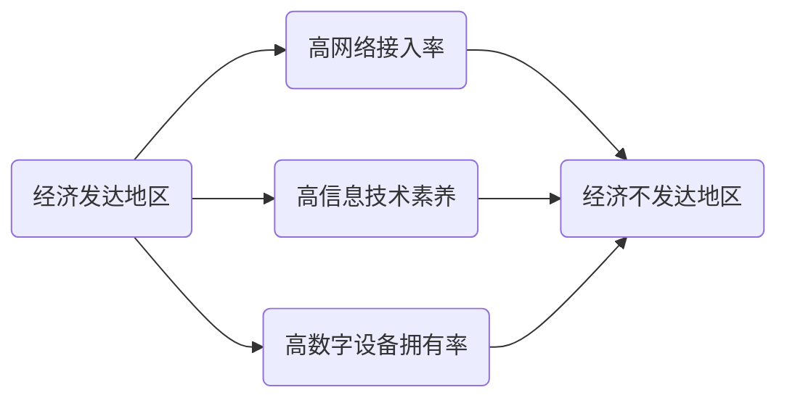

                 

### 数字解毒度假村：科技依赖症的治愈之旅

在现代社会，科技无处不在，已经深深地嵌入到我们生活的方方面面。从智能手机、平板电脑到智能家居、智能汽车，科技为我们的生活带来了前所未有的便利。然而，随着科技的迅猛发展，我们也开始面临一个日益严峻的问题——科技依赖症。许多人沉迷于科技产品，无时无刻不在使用手机、电脑等设备，这不仅影响了我们的工作效率和生活质量，还可能对我们的心理健康造成严重影响。

《数字解毒度假村：科技依赖症的治愈之旅》旨在帮助那些深受科技依赖症困扰的人们找到一种健康的平衡，通过一系列系统的方法和策略，逐步摆脱对科技的过度依赖，找回生活的乐趣和内心的宁静。本文将逐步分析科技依赖症的定义、成因、危害以及解毒方法，希望为读者提供一套完整的科技依赖症治愈指南。

**关键词：** 科技依赖症、数字解毒、治愈之旅、心理健康、平衡生活

**摘要：** 本文将探讨科技依赖症的定义、成因、危害及其对个人和社会的影响，并提出一系列有效的科技解毒方法和策略，帮助读者逐步摆脱对科技的过度依赖，重拾健康的生活方式和心理状态。

### 目录大纲设计思路

为了设计出《数字解毒度假村：科技依赖症的治愈之旅》这本书的完整目录大纲，我们可以遵循以下步骤：

#### 1. 确定核心主题与章节划分

首先，我们需要明确书的核心主题，即“科技依赖症的治愈之旅”。在此基础上，我们可以将全书大致分为以下几个部分：

- **引言与背景介绍**：介绍科技依赖症的定义、现状及其对个人和社会的影响。
- **科技依赖症的成因与核心概念**：分析科技依赖症的成因，介绍相关核心概念。
- **科技解毒方法与策略**：介绍一系列科技解毒的方法和策略，帮助读者逐步减少对科技的依赖。
- **科技解毒实践案例**：分享科技解毒的实际案例，展示成功经验。
- **科技解毒的挑战与未来展望**：探讨科技解毒过程中可能遇到的挑战以及未来的发展趋势。

#### 2. 确定各章节内容

接下来，我们需要为每个部分细化章节内容。以下是具体的章节划分和内容概述：

- **引言与背景介绍**
  - **第1章**：科技依赖症的定义与现状
  - **第2章**：科技依赖症对个人和社会的影响

- **科技依赖症的成因与核心概念**
  - **第3章**：科技依赖症的成因分析
  - **第4章**：核心概念与联系

- **科技解毒方法与策略**
  - **第5章**：科技解毒的初步实践
  - **第6章**：科技解毒的高级策略

- **科技解毒实践案例**
  - **第7章**：科技解毒成功案例分享

- **科技解毒的挑战与未来展望**
  - **第8章**：科技解毒的挑战与应对
  - **第9章**：科技解毒的未来展望

#### 3. 确定章节内细节

最后，我们需要为每个章节添加更详细的子章节，确保每个部分的内容都能全面覆盖主题。

例如，对于**第3章**“科技依赖症的成因分析”，我们可以细化如下：

- **第3.1节**：心理因素
- **第3.2节**：社会文化因素
- **第3.3节**：技术因素

对于**第4章**“核心概念与联系”，我们可以包括以下内容：

- **第4.1节**：数字鸿沟
- **第4.2节**：虚拟现实
- **第4.3节**：人工智能

通过这样的结构设计，我们可以确保书的内容既全面又条理清晰。接下来，我们将按照这个框架，用markdown格式输出目录大纲。

### 目录大纲

```markdown
----------------------------------------------------------------
# 第一部分: 科技依赖症的定义与现状

## 第1章: 科技依赖症的定义与现状

### 1.1 科技依赖症的定义
#### 1.1.1 科技依赖症的概念
#### 1.1.2 科技依赖症的类型

### 1.2 科技依赖症的现状
#### 1.2.1 全球科技依赖症现状
#### 1.2.2 中国科技依赖症现状

### 1.3 科技依赖症的危害
#### 1.3.1 对个人的危害
#### 1.3.2 对社会的危害

## 第2章: 科技依赖症对个人和社会的影响

### 2.1 对个人的影响
#### 2.1.1 心理健康问题
#### 2.1.2 社交问题

### 2.2 对社会的影响
#### 2.2.1 经济成本
#### 2.2.2 教育影响
#### 2.2.3 文化影响

----------------------------------------------------------------

# 第二部分: 科技依赖症的成因与核心概念

## 第3章: 科技依赖症的成因分析

### 3.1 心理因素
#### 3.1.1 逃避现实
#### 3.1.2 恐惧与焦虑

### 3.2 社会文化因素
#### 3.2.1 社会压力
#### 3.2.2 文化认同

### 3.3 技术因素
#### 3.3.1 产品设计
#### 3.3.2 技术便利

## 第4章: 核心概念与联系

### 4.1 数字鸿沟
#### 4.1.1 数字鸿沟的定义
#### 4.1.2 数字鸿沟的影响

### 4.2 虚拟现实
#### 4.2.1 虚拟现实的技术原理
#### 4.2.2 虚拟现实的应用场景

### 4.3 人工智能
#### 4.3.1 人工智能的基本原理
#### 4.3.2 人工智能的应用领域

----------------------------------------------------------------

# 第三部分: 科技解毒方法与策略

## 第5章: 科技解毒的初步实践

### 5.1 

----------------------------------------------------------------

# 数字解毒度假村：科技依赖症的治愈之旅

## 引言：科技时代的阴影

在过去的几十年里，科技的发展速度如同闪电，改变着我们的生活方式和思维模式。从互联网到智能手机，从社交媒体到智能家居，科技已经成为了我们日常生活中不可或缺的一部分。然而，随着科技在我们生活中的无处不在，我们也开始面临一个日益严峻的问题——科技依赖症。

科技依赖症，是指个体对科技产品产生过度依赖，无法自主控制使用时间，甚至出现戒断症状的心理和行为现象。这种依赖不仅仅表现在对手机、电脑的沉迷，还体现在对社交媒体、游戏、电子商务等科技应用的过度使用上。据统计，全球范围内约有10%至20%的人口存在不同程度的科技依赖症，这一比例在年轻人中尤为突出。

科技依赖症不仅影响个人的心理健康，还可能对人际关系、工作、学习产生负面影响。例如，沉迷于手机和社交媒体的个体往往会出现注意力不集中、记忆力下降、睡眠障碍等问题，甚至可能导致抑郁、焦虑等心理疾病。此外，科技依赖症还可能影响个人与家人、朋友之间的互动，导致社交隔离和孤独感。

本文旨在深入探讨科技依赖症的定义、成因、危害，并提出一系列有效的科技解毒方法和策略，帮助那些深受科技依赖症困扰的人们找到一种健康的平衡，找回生活的乐趣和内心的宁静。

## 科技依赖症的定义与现状

### 科技依赖症的概念

科技依赖症，又称为互联网依赖症或网络成瘾症，是一种行为成瘾的现象，其特征是对科技产品（如手机、电脑、网络游戏等）的过度使用，导致个体的日常生活、工作和社交活动受到严重影响。这种依赖与药物依赖和酒精依赖类似，但表现出不同的症状和影响。

科技依赖症的主要症状包括：

1. **过度使用**：个体无法自主控制使用科技产品的时间，往往出现过度沉迷的现象。
2. **戒断症状**：在减少或停止使用科技产品后，个体可能会出现焦虑、烦躁、失眠等戒断症状。
3. **忽视其他活动**：个体对其他日常活动（如工作、学习、运动、社交）的关注度下降，甚至完全忽视。
4. **逃避现实**：个体通过使用科技产品来逃避现实生活中的压力、烦恼和责任。
5. **社交孤立**：长期的过度使用科技产品可能导致个体与现实生活中的人际关系疏远，出现社交孤立现象。

### 科技依赖症的类型

科技依赖症可以分为几种类型，根据依赖的对象和表现不同，主要包括以下几种：

1. **手机依赖症**：这是最常见的类型，个体对智能手机的依赖，包括刷微博、看微信、玩手游等。
2. **网络游戏依赖症**：个体对网络游戏的过度沉迷，导致影响正常的生活和工作。
3. **社交媒体依赖症**：个体对社交媒体的过度使用，如刷朋友圈、微博等，以获取社交认同和满足感。
4. **互联网信息依赖症**：个体对网络信息的过度搜索和获取，导致信息过载和注意力分散。
5. **在线购物依赖症**：个体对在线购物的过度依赖，导致购物成瘾和财务问题。

### 科技依赖症的现状

科技依赖症在全球范围内都呈现出明显的上升趋势。据相关研究显示，全球约有10%至20%的人口存在不同程度的科技依赖症，尤其在年轻人中更为普遍。以下是一些关于科技依赖症现状的数据和事实：

1. **全球范围**：全球约有2.5亿至5亿人患有不同程度的科技依赖症，其中大多数是年轻人。
2. **中国现状**：在中国，科技依赖症的问题也非常突出。据中国青少年研究中心的一项调查显示，超过60%的青少年存在不同程度的科技依赖问题，其中严重依赖的比例高达20%。
3. **年龄差异**：年龄是影响科技依赖症的一个关键因素。研究表明，青少年和年轻人的科技依赖症发生率明显高于中年人和老年人。
4. **性别差异**：在科技依赖症中，男性比女性更易受到影响，尤其是在网络游戏和在线购物方面。
5. **职业差异**：从事IT行业、设计、媒体等与科技密切相关职业的人群，科技依赖症的发生率更高。

科技依赖症已经成为一个全球性的公共健康问题，对个人和社会都产生了深远的影响。了解科技依赖症的定义和现状，有助于我们更好地认识这一问题的严重性，并采取有效的预防和干预措施。

## 科技依赖症的危害

科技依赖症不仅对个人的心理健康和身体健康产生负面影响，还对社交关系、工作和学习产生严重影响。以下是科技依赖症对个人和社会的具体危害：

### 对个人的影响

1. **心理健康问题**：科技依赖症可能导致一系列心理健康问题，如焦虑、抑郁、压力过大等。长时间沉浸在科技产品中，个体可能会对现实生活中的压力和挑战感到逃避，导致心理负担加重。

2. **社交问题**：科技依赖症往往会导致个体与现实生活中的人际关系疏远，出现社交孤立现象。沉迷于科技产品，个体可能会忽视与家人、朋友和同事的互动，导致社交技能退化。

3. **身体健康问题**：长时间使用手机和电脑可能导致眼睛疲劳、颈椎病、肥胖等身体健康问题。此外，缺乏运动和户外活动，也可能导致身体机能下降。

4. **注意力分散**：科技依赖症常常使个体的注意力难以集中，影响工作和学习效率。过度使用科技产品，大脑容易处于兴奋状态，导致难以进入专注的工作或学习状态。

### 对社会的影响

1. **经济成本**：科技依赖症可能导致个体在购买科技产品、游戏、社交媒体等方面的消费增加，对个人和家庭的经济状况产生负面影响。此外，企业也可能因为员工的科技依赖症而遭受经济损失。

2. **教育影响**：科技依赖症对青少年的学习和教育产生严重影响。沉迷于科技产品，青少年可能会忽视学业，导致成绩下降。此外，过度使用科技产品也可能导致青少年对现实世界缺乏关注和探索精神。

3. **文化影响**：科技依赖症可能导致文化价值观的扭曲，影响社会道德和伦理观念。例如，沉迷于虚拟世界，个体可能会对现实世界的人际关系和道德规范产生淡漠和忽视。

4. **社会问题**：科技依赖症还可能导致一系列社会问题，如家庭矛盾、婚姻问题、青少年犯罪等。沉迷于科技产品，个体可能会忽视家庭责任和社会责任，导致家庭和社会关系紧张。

总的来说，科技依赖症对个人和社会都产生了深远的影响。了解这些危害，有助于我们更加重视科技依赖症的问题，并采取有效的预防和干预措施。

## 科技依赖症的成因分析

科技依赖症的形成是一个复杂的过程，涉及多个方面的因素。以下是对科技依赖症成因的分析：

### 心理因素

1. **逃避现实**：许多人使用科技产品来逃避现实生活中的压力和挑战。面对现实中的问题和困难，个体可能会通过沉浸于虚拟世界来获得短暂的解脱和逃避。

2. **恐惧与焦虑**：在现代社会中，个体常常面临各种不确定性和焦虑感。科技产品可以提供一种安全感和控制感，帮助个体减轻恐惧和焦虑。

3. **满足感与奖励机制**：科技产品往往设计有奖励机制，如游戏中的积分、社交媒体中的点赞等，这些奖励可以迅速满足个体的需求和欲望，使其产生依赖。

4. **自尊心和自我认同**：在虚拟世界中，个体可以通过展示自己的成就和才华来获得认同和尊重。这种虚拟的成就感和认同感可能会替代现实生活中缺失的满足感。

### 社会文化因素

1. **社会压力**：在现代社会中，人们面临各种社会压力，如工作压力、竞争压力、人际关系压力等。科技产品提供了一种逃避压力的途径，使个体暂时从现实中的压力中解脱出来。

2. **文化认同**：在某些文化中，科技产品的使用被广泛认同和推崇。年轻人尤其是青少年，为了获得认同感，可能会过度使用科技产品，甚至形成依赖。

3. **社交规范**：随着社交媒体的普及，社交规范也发生了变化。个体在社交媒体上花费大量时间，以维持和扩展社交网络，这种规范可能导致对科技产品的过度依赖。

### 技术因素

1. **产品设计**：许多科技产品的设计和功能都是为了增加用户的粘性和依赖度。例如，游戏中的“沉迷设计”、社交媒体的“点赞机制”等，都旨在让用户产生依赖。

2. **技术便利**：科技的便利性使得人们可以随时随地使用科技产品。智能手机的普及和移动互联网的发展，使科技产品成为人们生活中的必需品，进一步加剧了依赖现象。

3. **信息过载**：随着互联网的普及，信息量急剧增加。个体在处理海量信息时，可能会感到压力和焦虑，进而依赖科技产品来获取和处理信息。

总的来说，科技依赖症的形成是多种因素共同作用的结果。了解这些成因，有助于我们采取更有效的预防和干预措施，帮助那些深受科技依赖症困扰的人们找到健康的平衡。

## 核心概念与联系

在探讨科技依赖症的过程中，了解一系列核心概念是非常重要的。这些概念不仅帮助我们深入理解科技依赖症的成因和影响，也为科技解毒提供了理论基础。以下是一些关键概念及其相互联系：

### 数字鸿沟

**定义**：数字鸿沟指的是不同社会群体在获取、使用和受益于信息技术（IT）方面的差异。这种差异可以体现在经济、教育、地域、性别等多个维度。

**属性特征对比表格**：

| 特征         | 经济发达地区 | 经济不发达地区 |
| ------------ | ------------- | ------------- |
| 网络接入率   | 高           | 低           |
| 信息技术素养 | 高           | 低           |
| 数字设备拥有率 | 高           | 低           |

**ER实体关系图架构**：



**影响**：数字鸿沟导致经济不发达地区的人们难以享受到信息技术带来的便利和机遇，加剧了社会不平等。

### 虚拟现实

**定义**：虚拟现实（VR）是一种通过计算机技术模拟的虚拟环境，用户可以通过头戴式显示器、手柄等设备与虚拟环境进行互动。

**技术原理**：

- **三维建模**：通过计算机软件生成三维模型。
- **头戴式显示器**：提供沉浸式视觉体验。
- **位置追踪**：通过传感器和摄像头追踪用户的位置和动作。
- **声音模拟**：通过耳机提供三维音效，增强沉浸感。

**应用场景**：

- **游戏**：提供沉浸式的游戏体验。
- **教育培训**：模拟复杂操作，如医学手术培训。
- **旅游**：虚拟旅游，体验不同地点的风光。

### 人工智能

**定义**：人工智能（AI）是指使计算机模拟人类智能行为的技术，包括机器学习、深度学习、自然语言处理等。

**技术原理**：

- **机器学习**：通过数据和算法让计算机自主学习。
- **深度学习**：模拟人脑神经网络进行学习。
- **自然语言处理**：让计算机理解和生成人类语言。

**应用领域**：

- **语音识别**：如智能助手。
- **图像识别**：如安防监控、自动驾驶。
- **医疗诊断**：辅助医生进行疾病诊断。
- **金融服务**：风险评估、投资决策。

**联系**：

- **数字鸿沟与虚拟现实**：虚拟现实技术的发展有助于缩小数字鸿沟，使更多人能够享受到科技的便利。
- **人工智能与虚拟现实**：人工智能技术可以优化虚拟现实体验，如通过机器学习预测用户需求，提供个性化的虚拟环境。

通过理解这些核心概念，我们可以更好地把握科技依赖症的成因和影响，为科技解毒提供理论基础。接下来，我们将介绍科技解毒的初步实践方法和高级策略。

## 科技解毒的初步实践

在意识到科技依赖症的危害后，采取积极的解毒措施是至关重要的。以下是一些初步实践方法，帮助个体开始逐步减少对科技产品的依赖。

### 方法1：设定使用时间限制

一个简单而有效的方法是设定每天使用科技产品的时间限制。这可以通过使用手机自带的应用管理功能或第三方应用来实现。例如，可以设置每天使用手机的时间为晚上9点，超出限制后，手机会自动锁定，阻止使用。

**实施步骤**：

1. **确定合理的时间限制**：根据个人情况，确定一个合适的使用时间，例如每天不超过两小时。
2. **使用应用管理功能**：在手机中开启应用管理功能，设置每日使用限制。
3. **监督执行**：定期检查自己的使用情况，确保遵守时间限制。

### 方法2：进行科技排毒

科技排毒是一种在一段时间内完全远离科技产品的实践。这种排毒期可以是一周、两天或几个小时，具体时间根据个人情况而定。在科技排毒期间，可以专注于其他活动，如阅读、锻炼、与家人朋友共度时光。

**实施步骤**：

1. **选择排毒时间**：根据个人日程，选择一个合适的时间段进行科技排毒。
2. **通知他人**：告知家人和朋友自己的科技排毒计划，寻求他们的理解和支持。
3. **调整日程**：规划科技排毒期间的活动，确保有丰富的非科技类活动来填补时间。

### 方法3：培养其他兴趣

培养其他兴趣爱好可以有效地减少对科技产品的依赖。找到自己感兴趣的活动，如绘画、音乐、运动等，可以帮助个体将注意力从科技产品转移到其他更有意义的事物上。

**实施步骤**：

1. **发现兴趣爱好**：思考自己曾经感兴趣但后来放弃的活动，或者尝试新的活动。
2. **安排时间**：为这些活动安排固定的时间，确保能够坚持下去。
3. **寻求支持**：与朋友或家人一起参与这些活动，增加乐趣和动力。

### 方法4：养成健康的生活习惯

养成良好的生活习惯有助于减少对科技产品的依赖。例如，保持规律的作息时间、合理安排工作和休息、定期锻炼身体等。这些习惯不仅可以改善身体健康，还能提高生活质量，减少对科技产品的依赖。

**实施步骤**：

1. **制定计划**：制定一个健康生活习惯的计划，包括作息时间、工作安排、锻炼计划等。
2. **逐步实施**：从小的改变开始，如每天增加运动时间，逐渐形成良好的生活习惯。
3. **持续监督**：定期检查自己的生活习惯，确保在正确轨道上。

通过这些初步实践方法，个体可以逐步减少对科技产品的依赖，找回生活的乐趣和内心的宁静。接下来，我们将探讨更高级的科技解毒策略，帮助个体更彻底地摆脱科技依赖症。

## 科技解毒的高级策略

初步实践虽然有助于个体减少对科技产品的依赖，但要彻底摆脱科技依赖症，需要采取更加系统和深入的措施。以下是一些高级策略，可以帮助个体更有效地进行科技解毒：

### 方法1：认知行为疗法

认知行为疗法（CBT）是一种通过改变思维和行为模式来治疗心理问题的方法。对于科技依赖症，CBT可以帮助个体识别和改变那些导致依赖的负面思维模式和行为习惯。

**实施步骤**：

1. **评估依赖程度**：首先，个体需要评估自己的科技依赖程度，了解依赖的严重性。
2. **识别负面思维模式**：通过自我反思或咨询专业人士，识别那些导致依赖的负面思维模式，如逃避现实、寻求奖励等。
3. **制定改变计划**：针对负面思维模式，制定具体的改变计划，如通过正面思维和新的行为习惯来替代。
4. **持续监督和调整**：定期评估改变效果，根据实际情况调整策略。

### 方法2：正念练习

正念练习是一种通过专注于当前时刻来提高心理和情绪健康的练习。通过正念练习，个体可以学会更好地管理注意力，减少对科技产品的依赖。

**实施步骤**：

1. **开始练习**：每天安排一段固定时间进行正念练习，如早晨起床后或晚上睡前。
2. **专注于呼吸**：坐在舒适的姿势中，将注意力集中在呼吸上，感受呼吸的节奏和变化。
3. **逐步扩展**：在专注于呼吸的基础上，可以逐步扩展到其他感官体验，如观察周围环境、感受身体触觉等。
4. **持续练习**：正念练习需要长期坚持，通过持续练习，个体可以逐步提高注意力集中能力，减少对科技产品的依赖。

### 方法3：社交支持

科技依赖症往往会导致个体与现实生活中的人际关系疏远。通过寻求社交支持，个体可以获得情感上的支持和实际行动上的帮助，从而更有效地进行科技解毒。

**实施步骤**：

1. **与家人和朋友沟通**：与家人和朋友分享自己的科技依赖问题，寻求他们的理解和支持。
2. **参加社交活动**：参加线下社交活动，如兴趣小组、俱乐部等，增加与现实生活中的人互动的机会。
3. **建立支持小组**：如果条件允许，可以参加科技依赖症支持小组，与其他人分享经验，互相鼓励和支持。
4. **定期反馈**：与家人和朋友保持沟通，定期反馈自己的科技解毒进展，获取他们的反馈和建议。

### 方法4：利用科技辅助

虽然科技产品是导致依赖的主要原因，但也可以利用科技来辅助科技解毒。通过使用专门的科技产品或应用程序，个体可以更好地监控自己的科技使用情况，制定和实施科技解毒计划。

**实施步骤**：

1. **下载监控应用**：在手机中下载科技使用监控应用，如使用时间统计、屏幕时间限制等。
2. **设定监控目标**：根据个人情况，设定合理的科技使用目标，如每日使用时间限制、特定应用的使用限制等。
3. **定期回顾和调整**：定期回顾科技使用情况，分析监控数据，根据实际情况调整科技解毒计划。
4. **寻求专业帮助**：如果自我监控和调整效果不佳，可以考虑寻求专业人士的帮助，如心理医生、科技依赖症治疗师等。

通过这些高级策略，个体可以更全面、更深入地进行科技解毒，逐步减少对科技产品的依赖，找回健康的生活方式。接下来，我们将分享一些科技解毒的成功案例，展示实际操作的效果和经验。

## 科技解毒实践案例分享

为了更直观地展示科技解毒的方法和效果，以下是一些成功的科技解毒实践案例，这些案例来自不同背景的个人，但都取得了显著的成果。

### 案例一：李先生的重生

**背景**：李先生是一名35岁的IT工程师，长期沉迷于手机和网络游戏，每天使用手机的时间超过10小时，不仅影响了工作和学习，还导致家庭关系紧张。

**方法**：

1. **设定时间限制**：李先生首先通过手机自带的应用管理功能设定了每日使用手机的时间限制，每晚9点后手机自动锁定。
2. **科技排毒**：每周选择一天进行科技排毒，彻底远离手机和其他科技产品，专注于阅读和户外运动。
3. **培养新兴趣**：李先生开始尝试绘画和园艺，这些活动不仅丰富了他的业余生活，还帮助他转移了对科技的注意力。
4. **正念练习**：每天早晨进行正念冥想，提高自己的注意力集中能力，减少对手机的依赖。

**效果**：经过几个月的实践，李先生逐渐减少了对手机的使用时间，工作效率和睡眠质量都得到了显著提升。家庭关系也变得更加和谐，整体生活质量得到了极大的改善。

### 案例二：王小姐的自我救赎

**背景**：王小姐是一名大学生，沉迷于社交媒体和网络游戏，导致学习成绩下降，与同学的关系疏远。

**方法**：

1. **认知行为疗法**：王小姐在心理咨询师的帮助下，通过认知行为疗法识别和改变了自己沉迷于网络的负面思维模式。
2. **建立支持小组**：王小姐加入了学校的科技解毒支持小组，与其他同学分享经验，互相鼓励和支持。
3. **利用科技辅助**：王小姐下载了屏幕时间统计应用，定期检查自己的科技使用情况，并根据数据调整使用计划。
4. **参加线下活动**：王小姐积极参加各种线下活动，如兴趣小组、社团活动，增加与现实生活中的人互动。

**效果**：经过一段时间的努力，王小姐逐渐减少了对社交媒体和网络游戏的使用，学习成绩也逐步提升，与同学的关系变得更加融洽。

### 案例三：张女士的家庭计划

**背景**：张女士是一名家庭主妇，每天使用手机的时间超过6小时，不仅影响了与家人的互动，还导致家庭矛盾不断。

**方法**：

1. **家庭科技排毒**：张女士与家人一起制定了家庭科技排毒计划，每周选择一天全家共同远离手机和其他科技产品。
2. **共同制定规则**：张女士与家人共同商定了科技使用规则，如晚餐时间不使用手机，睡前一小时不使用科技产品。
3. **培养家庭活动**：张女士和家人一起尝试新的家庭活动，如一起做家务、一起阅读、一起散步等。
4. **相互监督和鼓励**：家庭成员相互监督和鼓励，共同执行科技排毒计划。

**效果**：经过一段时间的实践，张女士与家人的关系得到了显著改善，家庭氛围更加和谐，每个人都能更好地享受生活。

这些案例展示了通过科技解毒实践，个体可以逐步减少对科技产品的依赖，改善生活质量和心理健康。这些成功的经验不仅为其他受科技依赖症困扰的人们提供了宝贵的参考，也激励着更多人采取行动，寻找健康的平衡。

### 科技解毒的挑战与未来展望

尽管科技解毒实践取得了一些成功案例，但在实际操作过程中，仍然面临诸多挑战和困难。以下是科技解毒过程中可能遇到的挑战，以及未来的发展趋势。

#### 挑战1：习惯改变难度大

科技依赖症往往与个体的生活习惯紧密相关，改变这些习惯需要极大的毅力和时间。许多人在开始科技解毒时充满热情，但随着时间的推移，容易因为各种原因而放弃。

**应对策略**：

1. **逐步减少依赖**：通过逐步减少科技产品的使用时间，让个体逐渐适应没有科技的生活。
2. **设定明确目标**：制定具体、可衡量的目标，如每天减少30分钟的手机使用时间，逐步实现彻底戒断。

#### 挑战2：社会文化压力

在现代社会，科技产品已经成为生活的一部分，社交活动、工作沟通等都需要依赖科技。个体在尝试科技解毒时，可能会面临来自家庭、朋友和社会的压力。

**应对策略**：

1. **积极沟通**：与家人和朋友分享自己的科技解毒计划，寻求他们的理解和支持。
2. **建立支持网络**：加入科技解毒小组或社区，与其他有类似目标的人交流经验，互相鼓励。

#### 挑战3：科技产品的设计陷阱

许多科技产品通过设计上的陷阱，如推送通知、奖励机制等，诱导用户过度使用。这些设计目的是增加用户的粘性，但对用户来说却是依赖的源头。

**应对策略**：

1. **限制通知**：关闭不必要的应用通知，减少干扰。
2. **使用限制应用**：使用专门的应用管理工具，如使用时间统计器和屏幕时间限制器，监控和限制科技产品的使用。

#### 挑战4：信息过载和选择困难

随着互联网的普及，信息量呈爆炸式增长。个体在处理海量信息时，可能会感到压力和焦虑，导致对科技产品的依赖。

**应对策略**：

1. **信息管理**：学会筛选和过滤信息，只关注对自己有价值的部分。
2. **分阶段处理**：将任务分解为小的、可管理的部分，逐步完成。

#### 未来展望

科技解毒作为一个新兴领域，未来的发展前景广阔。以下是几个可能的发展方向：

1. **科技辅助工具的发展**：随着人工智能和大数据技术的发展，未来可能会出现更多智能化、个性化的科技辅助工具，帮助个体更好地进行科技解毒。
2. **社交支持网络**：未来的科技解毒将更依赖于社交支持网络，如线上和线下的小组、社区和活动，提供更多的资源和帮助。
3. **政策引导和法规制定**：政府可能会出台相关政策，规范科技产品的设计和使用，减少对用户的诱导和依赖。
4. **跨学科研究**：科技解毒需要心理学、社会学、信息技术等多个领域的共同研究，未来的研究将更加综合和全面。

通过应对挑战和把握未来趋势，科技解毒领域将不断发展，为那些深受科技依赖症困扰的人们提供更有效、更全面的帮助。

## 结论：科技解毒，找回生活的美好

通过本文的探讨，我们深刻认识到科技依赖症对个人和社会的危害。科技产品虽然为我们的生活带来了极大的便利，但过度依赖科技产品不仅影响心理健康，还可能对人际关系、工作和学习产生负面影响。因此，科技解毒显得尤为重要。

科技解毒并非一蹴而就，需要个体采取一系列系统和深入的措施。从初步实践方法到高级策略，再到成功的实践案例，本文提供了一套完整的科技解毒指南。通过设定时间限制、进行科技排毒、培养新兴趣、利用科技辅助以及认知行为疗法等手段，个体可以逐步减少对科技的依赖，找回生活的美好。

我们鼓励读者积极行动，采取科技解毒措施，不仅为了自己的健康，也为社会的和谐。同时，我们也期待科技行业能够更加负责任地设计产品，减少对用户的诱导和依赖，共同营造一个健康、平衡的数字生活环境。

最后，希望《数字解毒度假村：科技依赖症的治愈之旅》能够为读者提供有益的启示和帮助，让我们一起迈向更加健康、平衡的数字生活。

### 作者信息

作者：AI天才研究院/AI Genius Institute & 禅与计算机程序设计艺术 /Zen And The Art of Computer Programming

AI天才研究院致力于推动人工智能技术的研究与应用，致力于培养下一代人工智能领域的顶尖人才。同时，作者还深入探讨计算机科学与人文学科的结合，通过《禅与计算机程序设计艺术》这一著作，为计算机编程和人工智能领域的发展贡献了独特的见解和智慧。希望这些研究成果能够为读者在科技解毒和数字生活平衡方面提供宝贵的参考和指导。

