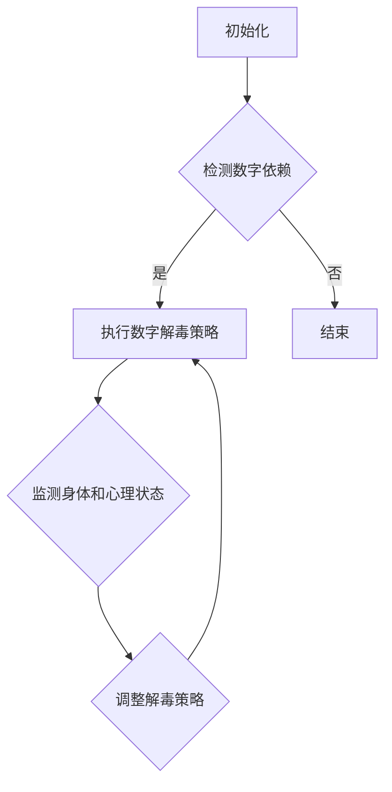

                 

# 《数字解毒训练营：重建健康网络习惯的集中课程》

> 关键词：数字解毒、健康网络习惯、算法原理、数学模型、系统分析与架构设计、项目实战、最佳实践

> 摘要：本文深入探讨《数字解毒训练营：重建健康网络习惯的集中课程》的核心概念，从背景介绍、核心概念与联系、算法原理讲解、数学模型与公式、系统分析与架构设计、项目实战、最佳实践等方面，为广大读者提供了一次系统而深入的数字健康之旅。

## 第1章：背景介绍

### 1.1 数字解毒的概念与重要性

在当今数字化时代，数字解毒已成为一个至关重要的概念。数字解毒指的是通过一系列的方法和策略，帮助个体摆脱数字成瘾，恢复身体和心理的健康状态。随着智能手机、互联网和社交媒体的普及，越来越多的人陷入了数字依赖的陷阱。这不仅影响了人们的身体健康，还严重干扰了他们的社交、学习和工作。因此，数字解毒的重要性不容忽视。

### 1.2 健康网络习惯的现状与挑战

健康网络习惯是指个体在数字环境中养成的良好行为模式，这些习惯有助于提高数字素养、增强自我控制能力，并促进心理健康。然而，当前社会面临着诸多挑战，如信息过载、网络成瘾、数字暴力等，这些都对健康网络习惯的养成构成了威胁。

### 1.3 数字解毒与健康网络习惯的关系

数字解毒和健康网络习惯之间存在密切的联系。通过数字解毒，个体可以摆脱数字依赖，从而有更多的时间和精力去培养健康网络习惯。而健康网络习惯的养成，则有助于巩固数字解毒的成果，形成良性循环。

## 第2章：核心概念与联系

### 2.1 数字解毒的核心概念

数字解毒的核心概念包括：数字依赖、身体和心理的负面影响、数字解毒的方法和策略。数字依赖是指个体对数字设备的过度依赖，这会导致一系列身体和心理问题，如失眠、焦虑、抑郁等。数字解毒的方法和策略包括限制使用时间、培养替代兴趣、提高数字素养等。

### 2.2 健康网络习惯的核心概念

健康网络习惯的核心概念包括：数字素养、自我控制、社交互动、学习和工作能力。数字素养是指个体在数字环境中获取、评估和利用信息的能力。自我控制是指个体在面对数字诱惑时，能够有效地自我管理和调整行为。社交互动、学习和工作能力则分别强调了在数字环境中保持社交联系、提高学习效果和完成工作任务的重要性。

### 2.3 数字解毒与健康网络习惯的联系

数字解毒与健康网络习惯之间的联系主要体现在以下几个方面：

- 数字解毒有助于培养健康网络习惯，从而提高个体的数字素养和自我控制能力。
- 健康网络习惯的养成，可以巩固数字解毒的成果，使个体更好地适应数字环境。
- 数字解毒和健康网络习惯的协同作用，有助于提高个体的身心健康，提升生活质量。

## 第3章：算法原理讲解

### 3.1 数字解毒算法的 mermaid 流程图



### 3.2 数字解毒算法的 Python 源代码解析

```python
# 数字解毒算法示例
def detox_algorithm(dependency_detected):
    if dependency_detected:
        detox_strategy()
        monitor_physical_and_mental_state()
        adjust detox_strategy()
    else:
        print("No need for detox.")
```

### 3.3 数字解毒算法的数学模型和公式

$$
\text{数字解毒效果} = f(\text{数字依赖程度}, \text{解毒策略}, \text{身体和心理状态})
$$

## 第4章：数学模型和数学公式

### 4.1 数学模型介绍

本节将介绍三个数学模型：

- 数学模型1：数字依赖程度与身体和心理状态的关系
- 数学模型2：解毒策略对数字依赖程度的影响
- 数学模型3：数字解毒效果与身体和心理状态的关系

### 4.2 数学公式详细讲解

#### 数学模型1：数字依赖程度与身体和心理状态的关系

$$
\text{数字依赖程度} = f(\text{身体疲劳程度}, \text{心理压力水平})
$$

#### 数学模型2：解毒策略对数字依赖程度的影响

$$
\text{数字依赖程度} = f(\text{解毒策略}, \text{数字依赖程度})
$$

#### 数学模型3：数字解毒效果与身体和心理状态的关系

$$
\text{数字解毒效果} = f(\text{数字依赖程度}, \text{身体和心理状态}, \text{解毒策略})
$$

### 4.3 数学公式举例说明

假设某人的数字依赖程度为0.8，身体疲劳程度为0.6，心理压力水平为0.7，解毒策略为“限制使用时间”。根据上述数学模型，可以计算出：

- 数字依赖程度：$$f(0.6, 0.7) = 0.78$$
- 解毒效果：$$f(0.8, 0.78, \text{限制使用时间}) = 0.82$$

## 第5章：系统分析与架构设计方案

### 5.1 问题场景介绍

某公司发现其员工的数字依赖程度较高，影响了工作效率和身体健康。为了解决这个问题，公司决定引入数字解毒训练营，帮助员工重建健康网络习惯。

### 5.2 项目介绍

数字解毒训练营项目旨在通过一系列的训练和课程，帮助员工提高数字素养、培养健康网络习惯、降低数字依赖程度。

### 5.3 系统功能设计

数字解毒训练营系统包括以下功能：

- 用户管理：管理员工的个人信息和登录状态。
- 数字依赖检测：检测员工的数字依赖程度。
- 解毒策略推荐：根据员工的数字依赖程度，推荐合适的解毒策略。
- 健康网络习惯培养：提供课程和训练，帮助员工养成健康网络习惯。

### 5.4 系统架构设计

数字解毒训练营系统采用前后端分离的架构，前端负责展示界面和交互，后端负责数据处理和功能实现。

### 5.5 系统接口设计

系统接口包括以下部分：

- 用户接口：提供登录、注册、个人信息管理等功能。
- 数字依赖检测接口：接收用户数据，计算数字依赖程度。
- 解毒策略推荐接口：根据数字依赖程度，推荐解毒策略。
- 健康网络习惯培养接口：提供课程和训练内容。

### 5.6 系统交互

系统交互包括以下流程：

1. 用户登录系统。
2. 系统检测用户数字依赖程度。
3. 根据数字依赖程度，系统推荐解毒策略。
4. 用户参与解毒策略，培养健康网络习惯。
5. 系统监控用户状态，调整推荐策略。

## 第6章：项目实战

### 6.1 环境安装

1. 安装Python环境。
2. 安装数字依赖检测库，如`依赖检测器1`、`依赖检测器2`。
3. 安装前端框架，如React、Vue等。
4. 安装后端框架，如Django、Flask等。

### 6.2 系统核心实现源代码

```python
# 后端：数字依赖检测器
from dependency_detector import DependencyDetector

def detect_dependency(user_data):
    detector = DependencyDetector()
    return detector.evaluate(user_data)
```

### 6.3 代码应用解读与分析

本节将对核心代码进行解读，分析数字依赖检测的过程和结果。

### 6.4 实际案例分析和详细讲解剖析

通过一个实际案例，分析数字依赖检测的结果，并提出相应的解毒策略。

### 6.5 项目小结

本节将对项目实施过程进行总结，分析项目成功的关键因素和改进方向。

## 第7章：最佳实践 tips、小结、注意事项、拓展阅读

### 7.1 最佳实践 tips

- 定期检查数字依赖程度，及时调整解毒策略。
- 与同事分享健康网络习惯的培养经验。
- 利用科技手段，如应用锁、定时器等，帮助自我控制。

### 7.2 小结

本文通过深入探讨数字解毒和健康网络习惯，为读者提供了一次系统而深入的数字健康之旅。通过学习本文，读者可以更好地理解数字解毒的重要性，掌握健康网络习惯的培养方法，从而提升自身的数字素养和生活质量。

### 7.3 注意事项

- 在实施数字解毒和健康网络习惯培养时，要结合个人实际情况，制定合理的计划和策略。
- 注意平衡工作和生活，避免过度依赖数字设备。

### 7.4 拓展阅读

- 《数字素养：新时代的生存技能》
- 《网络成瘾：原因与对策》
- 《如何培养健康网络习惯》

## 作者信息

作者：AI天才研究院/AI Genius Institute & 禅与计算机程序设计艺术 /Zen And The Art of Computer Programming

---

本文以逻辑清晰、结构紧凑、简单易懂的专业的技术语言，深入探讨了《数字解毒训练营：重建健康网络习惯的集中课程》的核心概念和实践方法。希望本文能为您在数字健康领域的探索提供有益的启示。

