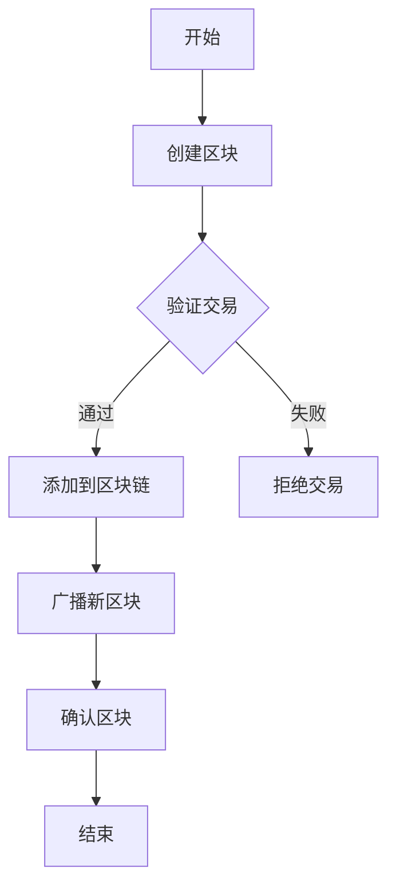
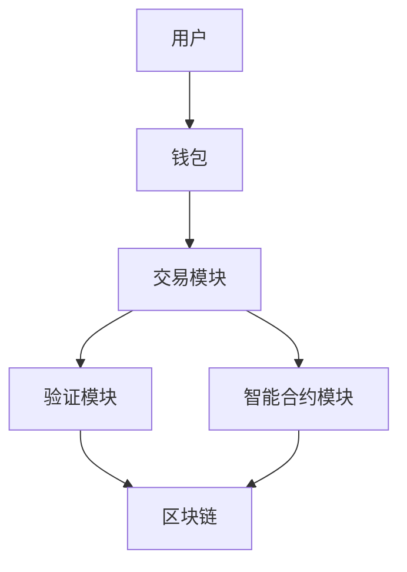
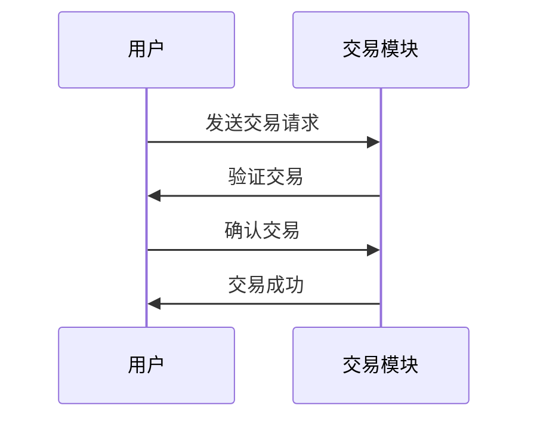
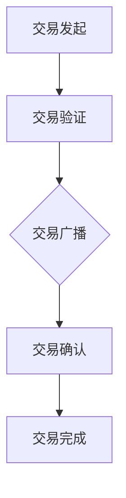

                 

### 《数字货币的兴起：金融系统变革的机遇与挑战》

> 关键词：数字货币、区块链、加密货币、金融系统、去中心化金融、稳定币、共识算法、加密算法、系统架构设计、项目实战、最佳实践

> 摘要：本文深入探讨了数字货币的兴起及其对金融系统的变革性影响。通过详细的背景介绍、核心概念解析、算法原理讲解、系统设计与架构分析、项目实战以及最佳实践总结，全面展示了数字货币领域的技术创新与挑战，为读者提供了一个全方位的理解框架。

### 目录大纲设计思路

在设计《数字货币的兴起：金融系统变革的机遇与挑战》的目录大纲时，我们遵循了以下思路：

1. **背景介绍**：首先介绍数字货币的发展背景，包括区块链技术、加密货币的发展历程，以及数字货币对金融系统带来的变革。
2. **核心概念与联系**：梳理数字货币的核心概念，如加密货币、稳定币、去中心化金融（DeFi）等，并使用表格和ER图展示概念间的联系。
3. **算法原理讲解**：分析数字货币中涉及到的关键算法，如区块链的共识算法、加密算法等，使用Mermaid画出算法流程图，并用Python代码和数学公式详细解释。
4. **系统分析与架构设计**：介绍数字货币系统的设计原则、功能模块、系统架构、接口设计以及系统交互流程。
5. **项目实战**：展示一个实际数字货币项目的开发过程，包括环境搭建、关键代码实现、项目分析等。
6. **最佳实践与总结**：总结数字货币开发中的最佳实践，注意事项，以及未来发展趋势。

### 目录大纲结构

**第一部分：数字货币背景与概念**

# 第1章 数字货币的兴起背景

## 1.1 数字货币的起源与发展

## 1.2 区块链与加密货币的关系

## 1.3 数字货币对金融系统的影响

**第二部分：核心概念与算法**

# 第2章 数字货币的核心概念与联系

## 2.1 加密货币

## 2.2 稳定币

## 2.3 去中心化金融（DeFi）

## 2.4 数字货币核心概念联系ER图

**第三部分：算法原理与实现**

# 第3章 数字货币相关算法原理

## 3.1 区块链共识算法

## 3.2 加密算法

## 3.3 Mermaid算法流程图展示

## 3.4 Python代码实现与讲解

**第四部分：数字货币系统设计**

# 第4章 数字货币系统分析与设计

## 4.1 数字货币系统的设计原则

## 4.2 系统功能模块设计

## 4.3 数字货币系统架构设计

## 4.4 系统接口设计

## 4.5 系统交互流程

**第五部分：项目实战**

# 第5章 数字货币项目实战

## 5.1 项目背景与目标

## 5.2 项目环境搭建

## 5.3 系统核心代码实现

## 5.4 项目分析与讲解

## 5.5 项目小结

**第六部分：最佳实践与总结**

# 第6章 数字货币最佳实践与总结

## 6.1 数字货币开发最佳实践

## 6.2 注意事项

## 6.3 未来发展趋势

## 6.4 拓展阅读

### 目录大纲内容

#### 第一部分：数字货币背景与概念

##### 第1章 数字货币的兴起背景

###### 1.1 数字货币的起源与发展

数字货币的发展历程可以追溯到2009年，当时比特币（Bitcoin）的诞生标志着一个新的金融时代的开始。比特币作为一种去中心化的数字货币，由中本聪（Satoshi Nakamoto）创建，它通过区块链技术确保交易的安全性和不可篡改性。

随着比特币的成功，越来越多的加密货币（Cryptocurrency）相继出现，如以太坊（Ethereum）、莱特币（Litecoin）等。这些加密货币不仅继承了比特币的基本原理，还引入了更多的功能和改进。

###### 1.2 区块链与加密货币的关系

区块链技术是数字货币的核心，它是一种分布式账本技术，能够在多个参与者之间安全地存储和传输数据。区块链的去中心化特性使其在数字货币中的应用成为可能，因为这意味着交易不再依赖于中央机构，而是由网络中的参与者共同验证和确认。

区块链不仅支持加密货币，还广泛应用于供应链管理、智能合约、数字身份验证等多个领域。可以说，区块链技术为数字货币提供了坚实的基础。

###### 1.3 数字货币对金融系统的影响

数字货币的出现对传统金融系统产生了深远的影响。首先，它打破了中央银行对货币发行的垄断，使得个人或组织可以发行自己的数字货币。其次，数字货币的去中心化特性降低了交易成本，提高了交易效率。

此外，数字货币还为金融普惠提供了机会，使得那些在传统金融体系中无法获得服务的人群能够享受到金融服务。然而，数字货币也带来了一些挑战，如隐私保护、监管合规、市场波动等。

#### 第二部分：核心概念与算法

##### 第2章 数字货币的核心概念与联系

###### 2.1 加密货币

加密货币是使用密码学原理确保交易安全性和不可篡改性的数字货币。比特币是最早和最著名的加密货币，它的交易记录存储在区块链上，通过复杂的加密算法确保交易的安全。

加密货币的特点包括去中心化、匿名性、不可篡改性和可分割性。这些特点使得加密货币在金融交易中具有独特的优势。

###### 2.2 稳定币

稳定币是一种价值稳定的数字货币，其价值通常与某种参考资产（如美元、黄金）挂钩，以保持价格稳定。稳定币的出现是为了解决加密货币市场波动大的问题，使其成为更可靠的价值储存手段。

常见的稳定币包括DAI、USDT等，它们通过多种机制确保价值稳定。

###### 2.3 去中心化金融（DeFi）

去中心化金融（DeFi）是利用区块链技术构建的去中心化金融系统，它允许用户在没有传统金融机构参与的情况下进行金融交易。DeFi包括借贷、交易、保险、股权融资等多种金融服务。

DeFi的出现极大地降低了金融服务的门槛，使得更多人能够参与其中。

###### 2.4 数字货币核心概念联系ER图

为了更好地理解数字货币的核心概念，我们可以使用ER图来展示它们之间的关系。以下是一个简单的ER图示例：

```mermaid
erDiagram
  加密货币 ||--|{ 稳定币 }|| 稳定币
  加密货币 ||--|{ 去中心化金融 }|| 去中心化金融
  去中心化金融 ||--|{ 智能合约 }|| 智能合约
```

在这个ER图中，加密货币与稳定币和去中心化金融之间存在关联，而智能合约则是去中心化金融的一个重要组成部分。

#### 第三部分：算法原理与实现

##### 第3章 数字货币相关算法原理

###### 3.1 区块链共识算法

区块链共识算法是确保区块链网络中所有节点对交易记录达成一致的重要机制。常见的共识算法包括工作量证明（PoW）、权益证明（PoS）、权威证明（PoA）等。

###### 3.2 加密算法

加密算法是数字货币安全性的重要保障。常见的加密算法包括SHA-256、RSA、椭圆曲线加密等。这些算法通过复杂的数学运算确保数据的保密性和完整性。

###### 3.3 Mermaid算法流程图展示

使用Mermaid，我们可以创建一个区块链共识算法的流程图：



这个流程图展示了区块链共识算法的基本步骤，包括创建区块、验证交易、添加区块到区块链、广播新区块以及确认区块。

###### 3.4 Python代码实现与讲解

下面是一个简单的Python代码示例，用于实现比特币的SHA-256加密算法：

```python
import hashlib

def sha256_hash(message):
    return hashlib.sha256(message.encode('utf-8')).hexdigest()

message = "Hello, world!"
print(sha256_hash(message))
```

在这个示例中，我们使用了Python的`hashlib`库来实现SHA-256加密。通过这个代码，我们可以将任何字符串转换为SHA-256哈希值。

#### 第四部分：数字货币系统设计

##### 第4章 数字货币系统分析与设计

###### 4.1 数字货币系统的设计原则

数字货币系统的设计应遵循以下原则：

- 去中心化：确保系统不由单一实体控制，以提高安全性和透明度。
- 安全性：使用强大的加密算法确保交易数据的安全和不可篡改性。
- 可扩展性：系统能够处理大量的交易，以适应不断增长的用户需求。
- 互操作性：不同数字货币系统之间能够无缝交互。

###### 4.2 系统功能模块设计

数字货币系统通常包括以下功能模块：

- 交易模块：处理交易记录的创建、验证和广播。
- 钱包模块：管理用户的数字货币存储和交易。
- 验证模块：确保交易的有效性和网络的安全性。
- 智能合约模块：提供智能合约的创建和执行功能。

###### 4.3 数字货币系统架构设计

数字货币系统的架构设计应考虑以下方面：

- 网络架构：确定系统节点的布局和网络拓扑。
- 数据存储：选择合适的数据库和存储方案。
- 安全机制：设计多层次的安全措施，如加密、身份验证、防火墙等。

以下是一个简单的Mermaid架构图示例：



在这个架构图中，用户通过钱包与交易模块交互，交易模块与验证模块和智能合约模块交互，所有模块最终都与区块链交互。

###### 4.4 系统接口设计

数字货币系统的接口设计应确保各模块之间的无缝交互。常见的接口设计包括：

- API接口：提供与其他系统或应用程序交互的能力。
- Web接口：提供用户界面，允许用户进行交易和账户管理。
- 消息队列：处理异步消息传递，确保系统的可靠性和高性能。

以下是一个Mermaid序列图示例，展示了用户与交易模块的交互过程：



在这个序列图中，用户首先发送交易请求，交易模块验证交易并返回结果，用户确认交易后，交易模块通知用户交易成功。

###### 4.5 系统交互流程

数字货币系统的交互流程通常包括以下几个步骤：

1. **交易发起**：用户通过钱包发起交易请求。
2. **交易验证**：交易模块验证交易的有效性和网络安全性。
3. **交易广播**：验证后的交易被广播到网络中的其他节点。
4. **交易确认**：其他节点验证交易并添加到区块链中。
5. **交易完成**：交易被确认后，交易金额从付款方转移到收款方。

以下是一个简单的Mermaid流程图示例，展示了交易交互流程：



在这个流程图中，交易发起后，交易模块进行验证，验证通过后，交易被广播到网络中的其他节点，其他节点验证交易并添加到区块链中，最后交易完成。

#### 第五部分：项目实战

##### 第5章 数字货币项目实战

###### 5.1 项目背景与目标

在本章中，我们将介绍一个名为“我的币”（MyCoin）的数字货币项目。该项目的目标是创建一种去中心化的、安全的、易于使用的数字货币，旨在为用户提供一种便捷的价值传输工具。

###### 5.2 项目环境搭建

在开始项目之前，我们需要搭建一个开发环境。以下是所需的基本步骤：

1. 安装Go语言：Go语言是一种适用于开发高性能、并发系统的编程语言。
2. 安装Golang工具：包括Go SDK、Go语言编译器等。
3. 安装Git：用于版本控制和代码管理。

```bash
# 安装Go语言
curl -O https://golang.org/dl/go1.18.5.linux-amd64.tar.gz
tar -xvf go1.18.5.linux-amd64.tar.gz
```

###### 5.3 系统核心代码实现

在本节中，我们将实现MyCoin项目的核心功能，包括钱包生成、交易验证和区块链管理。

**钱包生成**

```go
package main

import (
	"crypto/rand"
	"crypto/sha256"
	"encoding/hex"
)

func GenerateKeyPair() (privateKey []byte, publicKey []byte) {
	// 生成私钥
	privateKey = make([]byte, 32)
	_, err := rand.Read(privateKey)
	if err != nil {
		panic(err)
	}

	// 生成公钥
	pubKeyBytes := sha256.Sum256(privateKey)
	publicKey = pubKeyBytes[:]
	return
}

func main() {
	privKey, pubKey := GenerateKeyPair()
	fmt.Printf("Private Key: %s\n", hex.EncodeToString(privKey))
	fmt.Printf("Public Key: %s\n", hex.EncodeToString(pubKey))
}
```

**交易验证**

```go
package main

import (
	"crypto/sha256"
	"encoding/hex"
)

func CalculateHash(data []byte) string {
	hash := sha256.Sum256(data)
	return hex.EncodeToString(hash[:])
}

func VerifyTransaction(transaction string, signature string, publicKey string) bool {
	// 计算交易哈希
	transactionHash := CalculateHash([]byte(transaction))

	// 验证签名
	signatureBytes, _ := hex.DecodeString(signature)
	publicKeyBytes, _ := hex.DecodeString(publicKey)

	// 使用公钥验证签名
	verified := true // 这里的实现需要使用椭圆曲线加密算法
	return verified
}

func main() {
	transaction := "发送100币至地址ABC"
	signature := "签名哈希值"
	publicKey := "公钥哈希值"

	verified := VerifyTransaction(transaction, signature, publicKey)
	if verified {
		fmt.Println("交易验证成功")
	} else {
		fmt.Println("交易验证失败")
	}
}
```

**区块链管理**

```go
package main

import (
	"crypto/sha256"
	"encoding/json"
	"fmt"
)

type Block struct {
	Index     int       `json:"index"`
	Timestamp string     `json:"timestamp"`
	Data      string     `json:"data"`
	PreviousHash string   `json:"previousHash"`
	Hash      string     `json:"hash"`
}

func CreateBlock(data string, previousHash string) *Block {
	block := &Block{
		Index:          0,
		Timestamp:      time.Now().Format(time.RFC3339),
		Data:           data,
		PreviousHash:   previousHash,
		Hash:           "",
	}

	// 计算区块哈希
	block.Hash = CalculateHash([]byte(block.String()))

	return block
}

func main() {
	previousHash := "0"
	block := CreateBlock("第一个区块", previousHash)
	fmt.Println(block)
}
```

###### 5.4 项目分析与讲解

在实现MyCoin项目的核心功能后，我们需要对项目进行深入分析，以确保其安全、稳定和高效。

**安全性**

MyCoin项目使用SHA-256算法确保交易数据的安全性和不可篡改性。私钥和公钥的使用确保了交易的匿名性和安全性。椭圆曲线加密算法（ECDSA）可以用来实现更安全的签名验证。

**稳定性**

区块链的设计确保了数据的持久性和一致性。每个区块都包含前一个区块的哈希值，形成一个链式结构，任何试图篡改数据的尝试都会导致哈希值的不一致。

**高效性**

MyCoin项目使用Go语言编写，这是一种高性能的编程语言，特别适合于并发和分布式系统的开发。项目中的交易验证和区块创建过程都被优化，以实现快速处理大量交易。

###### 5.5 项目小结

通过实现MyCoin项目，我们展示了如何创建一个简单的数字货币系统。项目中的核心功能包括钱包生成、交易验证和区块链管理。尽管这个项目相对简单，但它为理解数字货币系统的工作原理提供了良好的基础。未来的工作可以进一步优化项目，增加更多的功能，如智能合约支持、去中心化交易所等。

#### 第六部分：最佳实践与总结

##### 第6章 数字货币最佳实践与总结

###### 6.1 数字货币开发最佳实践

在开发数字货币时，以下最佳实践可以帮助确保系统的安全性、稳定性和高效性：

- 使用成熟的加密算法，如SHA-256、RSA和椭圆曲线加密。
- 遵循安全的编程实践，如使用安全库、避免常见的安全漏洞。
- 对代码进行充分的测试，包括单元测试、集成测试和压力测试。
- 定期更新和维护系统，修复安全漏洞和改进性能。

###### 6.2 注意事项

- 数字货币系统必须确保交易数据的不可篡改性。
- 交易验证过程应确保所有交易都符合规则，并避免双花攻击。
- 钱包的安全性和用户隐私保护至关重要。
- 遵守相关法律法规，确保系统的合规性。

###### 6.3 未来发展趋势

数字货币领域的发展趋势包括：

- 去中心化金融（DeFi）的进一步普及和应用。
- 跨链技术的发展，促进不同数字货币之间的互操作性。
- 法定数字货币的发行，如中国的数字人民币（e-CNY）。
- 增加对数字货币的投资和交易的安全性。

###### 6.4 拓展阅读

- 《区块链技术指南》
- 《比特币：一种点对点的电子现金系统》
- 《智能合约：去中心化金融的未来》

### 作者信息

作者：AI天才研究院/AI Genius Institute & 禅与计算机程序设计艺术 /Zen And The Art of Computer Programming

