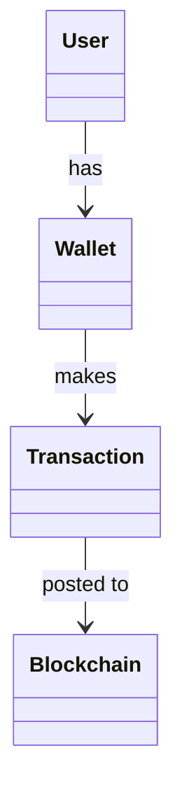
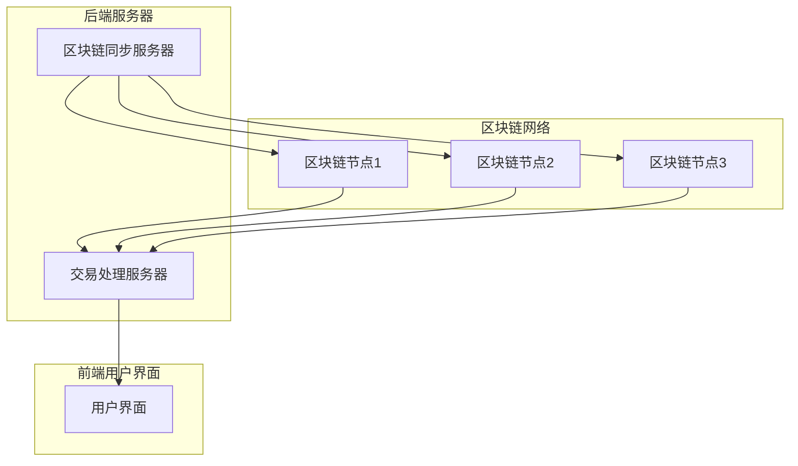

                 


### 1. 背景介绍

#### 1.1 数字货币的兴起

随着互联网技术的快速发展，数字货币逐渐成为金融领域的重要变革力量。数字货币的起源可以追溯到20世纪90年代，最早是由一群热衷于计算机科学和密码学的 enthusiasts 开发的。然而，比特币（Bitcoin）的诞生，使得数字货币开始在全球范围内受到广泛关注。比特币作为一个去中心化的加密货币，其独特的去中心化特性、安全性高和不可篡改的特点，使其成为了数字货币经济的代表。

#### 1.2 传统金融系统面临的挑战

在数字货币兴起之前，传统金融系统主要依赖于中央银行和金融机构来发行和管理货币，以及进行支付和清算。然而，这种系统存在诸多问题，如信息不对称、交易成本高、安全风险等。这些问题不仅降低了金融系统的效率和便利性，也导致了金融欺诈、洗钱等问题的发生。随着数字货币的出现，这些问题有望得到缓解。

#### 1.3 数字货币经济的重要性和发展现状

数字货币经济以其去中心化、安全性和高效率等特点，逐渐改变着金融系统的面貌。它不仅为个人和企业提供了更便捷的支付方式，还降低了交易成本，提高了金融系统的透明度。目前，全球许多国家和地区都在积极推广数字货币，如中国的数字人民币、美国的数字美元等。数字货币经济已经显示出巨大的发展潜力，并将对未来金融系统产生深远影响。

#### 1.4 问题解决

数字货币经济的兴起，为解决传统金融系统面临的问题提供了一种新的思路。通过数字货币，可以实现点对点的交易，降低交易成本和中介环节。同时，区块链技术的应用，使得交易记录更加透明、安全、不可篡改。这些特性使得数字货币经济在金融系统中具有广泛的应用前景。

#### 1.5 边界与外延

虽然数字货币经济具有许多优势，但其在法律、监管和技术等方面也存在一定的挑战。首先，数字货币的监管问题需要解决，以确保其合法合规。其次，数字货币的跨境交易需要考虑汇率、税收等问题。此外，数字货币的安全性和隐私保护也是需要重点关注的问题。

#### 1.6 概念结构与核心要素组成

数字货币经济由多个核心要素组成，包括数字货币、区块链技术、智能合约等。数字货币是数字货币经济的核心，负责价值传输。区块链技术则为数字货币提供了去中心化、安全可靠的交易记录。智能合约则实现了自动执行合约条款，提高了交易效率。

### 2. 核心概念与联系

#### 2.1 数字货币的基本原理

数字货币是一种基于密码学和区块链技术的数字资产，其价值由市场供求关系决定。数字货币的发行通常由一个去中心化的机制控制，以确保其供应量的稳定。数字货币的主要特点包括去中心化、匿名性、不可篡改等。

#### 2.2 区块链的工作机制

区块链是一种分布式账本技术，通过加密算法和共识机制确保数据的安全性和一致性。在区块链中，每一笔交易都会被记录在区块中，并通过网络广播确认。区块链的去中心化特性使其具有高度的可靠性和透明性。

#### 2.3 智能合约的定义和应用

智能合约是一种自动执行的合同，其条款被嵌入到区块链中。当满足合约条件时，智能合约会自动执行。智能合约的应用范围广泛，如金融、供应链管理、房地产等领域。

#### 2.4 概念属性特征对比表格

| 特征           | 传统货币       | 数字货币           |
| -------------- | -------------- | ------------------ |
| 发行机制       | 中央银行发行   | 去中心化发行       |
| 存储形式       | 纸质或电子形式 | 数字形式           |
| 安全性         | 中等           | 高度安全           |
| 交易成本       | 较高           | 极低               |
| 交易速度       | 较慢           | 极快               |
| 交易透明度     | 有限           | 高度透明           |

#### 2.5 ER实体关系图架构的 Mermaid 流程图

```mermaid
erDiagram
    User ||--o{ Transaction } |
    Transaction ||--o{ Block } |
    Block ||--o{ Blockchain } |
```

### 3. 算法原理讲解

#### 3.1 数字货币交易流程

数字货币交易主要包括以下几个步骤：

1. **创建交易**：用户发起交易，将资金从一个地址转移到另一个地址。
2. **交易签名**：发送方对交易进行数字签名，确保交易合法。
3. **交易广播**：交易被发送到区块链网络，由节点进行验证。
4. **区块确认**：交易被包含在区块中，并通过共识算法得到确认。
5. **交易完成**：当区块被确认后，交易完成，资金转移到接收方。

#### 3.2 使用python源代码

```python
import hashlib
import json
from time import time

class Block:
    def __init__(self, index, transactions, timestamp, previous_hash):
        self.index = index
        self.transactions = transactions
        self.timestamp = timestamp
        self.previous_hash = previous_hash
        self.hash = self.compute_hash()

    def compute_hash(self):
        block_string = json.dumps(self.__dict__, sort_keys=True)
        return hashlib.sha256(block_string.encode()).hexdigest()

class Blockchain:
    def __init__(self):
        self.unconfirmed_transactions = []
        self.chain = []
        self.create_genesis_block()

    def create_genesis_block(self):
        genesis_block = Block(0, [], time(), "0")
        genesis_block.hash = genesis_block.compute_hash()
        self.chain.append(genesis_block)

    def add_new_transaction(self, transaction):
        self.unconfirmed_transactions.append(transaction)

    def mine(self):
        if not self.unconfirmed_transactions:
            return False
        last_block = self.chain[-1]
        new_block = Block(index=last_block.index + 1,
                          transactions=self.unconfirmed_transactions,
                          timestamp=time(),
                          previous_hash=last_block.hash)
        new_block.hash = new_block.compute_hash()
        self.chain.append(new_block)
        self.unconfirmed_transactions = []
        return new_block.index

    def is_chain_valid(self):
        for i in range(1, len(self.chain)):
            current = self.chain[i]
            previous = self.chain[i - 1]
            if current.hash != current.compute_hash():
                return False
            if current.previous_hash != previous.hash:
                return False
        return True

# Example usage
blockchain = Blockchain()
blockchain.add_new_transaction({'from': 'Alice', 'to': 'Bob', 'amount': 10})
blockchain.mine()

print(blockchain.chain)
print(blockchain.is_chain_valid())
```

#### 3.3 算法原理的数学模型和公式

数字货币交易的核心是区块链，其基本原理可以用以下数学模型来描述：

1. **哈希函数**：用于将任意长度的数据转换为固定长度的字符串。
2. **数字签名**：用于确保交易来源的合法性和完整性。
3. **共识算法**：用于确定交易的合法性和区块链的顺序。

#### 3.4 详细讲解和举例说明

假设Alice想要向Bob转账10个数字货币，以下是数字货币交易的过程：

1. **创建交易**：Alice创建一个交易，将其发送到区块链网络。
2. **交易签名**：Alice使用私钥对交易进行签名，确保交易合法。
3. **交易广播**：交易被发送到区块链网络，由节点进行验证。
4. **区块确认**：交易被包含在一个新区块中，并通过共识算法得到确认。
5. **交易完成**：当区块被确认后，交易完成，Bob收到了10个数字货币。

这个过程确保了交易的合法性和安全性，同时提高了交易效率。

### 4. 数学模型和数学公式 & 详细讲解 & 举例说明

#### 4.1 使用latex格式

在数字货币交易中，以下数学模型和公式用于描述交易过程：

$$
H(T) = SHA256(T)
$$

其中，$H(T)$ 表示哈希函数，$T$ 表示交易内容。

$$
S = PK(T)
$$

其中，$S$ 表示数字签名，$PK$ 表示私钥。

#### 4.2 通俗易懂地举例说明

假设Alice想要向Bob转账10个数字货币，以下是交易过程的详细说明：

1. **创建交易**：Alice创建一个交易，包含发送方、接收方和转账金额。
2. **交易签名**：Alice使用其私钥对交易进行签名，生成数字签名。
3. **交易广播**：Alice将签名后的交易发送到区块链网络。
4. **区块确认**：交易被包含在一个新区块中，并由网络节点进行验证。
5. **交易完成**：当区块被确认后，交易完成，Bob收到了10个数字货币。

这个过程确保了交易的合法性和安全性，同时提高了交易效率。

### 5. 系统分析与架构设计方案

#### 5.1 问题场景介绍

以一个数字货币支付系统为例，用户可以在系统中进行数字货币的转账、支付和充值等操作。系统需要保证交易的安全性和高效性，同时提供用户友好的操作界面。

#### 5.2 项目介绍

本项目旨在开发一个基于区块链技术的数字货币支付系统，提供便捷、安全的支付解决方案。系统包括前端用户界面、后端服务器和区块链节点等组成部分。

#### 5.3 系统功能设计(领域模型mermaid类图)



#### 5.4 系统架构设计mermaid架构图



#### 5.5 系统接口设计和系统交互mermaid序列图

```mermaid
sequenceDiagram
    User ->> UI: 发起交易请求
    UI ->> WS1: 请求处理
    WS1 ->> Blockchain: 广播交易
    Blockchain -->|确认| WS1
    WS1 ->> UI: 回复交易结果
```

### 6. 项目实战

#### 6.1 环境安装

1. 安装Python 3.8及以上版本。
2. 安装Node.js（用于搭建区块链节点）。
3. 安装PostgreSQL（用于存储交易数据）。

#### 6.2 系统核心实现源代码

以下是数字货币支付系统的核心代码：

```python
# blockchain.py
import hashlib
import json
from time import time

class Block:
    def __init__(self, index, transactions, timestamp, previous_hash):
        self.index = index
        self.transactions = transactions
        self.timestamp = timestamp
        self.previous_hash = previous_hash
        self.hash = self.compute_hash()

    def compute_hash(self):
        block_string = json.dumps(self.__dict__, sort_keys=True)
        return hashlib.sha256(block_string.encode()).hexdigest()

class Blockchain:
    def __init__(self):
        self.unconfirmed_transactions = []
        self.chain = []
        self.create_genesis_block()

    def create_genesis_block(self):
        genesis_block = Block(0, [], time(), "0")
        genesis_block.hash = genesis_block.compute_hash()
        self.chain.append(genesis_block)

    def add_new_transaction(self, transaction):
        self.unconfirmed_transactions.append(transaction)

    def mine(self):
        if not self.unconfirmed_transactions:
            return False
        last_block = self.chain[-1]
        new_block = Block(index=last_block.index + 1,
                          transactions=self.unconfirmed_transactions,
                          timestamp=time(),
                          previous_hash=last_block.hash)
        new_block.hash = new_block.compute_hash()
        self.chain.append(new_block)
        self.unconfirmed_transactions = []
        return new_block.index

    def is_chain_valid(self):
        for i in range(1, len(self.chain)):
            current = self.chain[i]
            previous = self.chain[i - 1]
            if current.hash != current.compute_hash():
                return False
            if current.previous_hash != previous.hash:
                return False
        return True

# blockchain_manager.py
from blockchain import Blockchain

def main():
    blockchain = Blockchain()
    while True:
        try:
            command = input("Enter command (mine, add, status, exit): ")
            if command == "mine":
                blockchain.mine()
                print(f"Block mined: {blockchain.chain[-1].index}")
            elif command == "add":
                transaction = input("Enter transaction details: ")
                blockchain.add_new_transaction(json.loads(transaction))
                print("Transaction added to pool.")
            elif command == "status":
                print(f"Chain validity: {'Valid' if blockchain.is_chain_valid() else 'Invalid'}")
            elif command == "exit":
                break
            else:
                print("Invalid command.")
        except Exception as e:
            print(f"Error: {e}")

if __name__ == "__main__":
    main()
```

#### 6.3 代码应用解读与分析

这段代码主要实现了数字货币支付系统的核心功能，包括创建区块链、添加交易、挖矿和验证区块链等。通过命令行界面，用户可以轻松地与系统进行交互。

#### 6.4 实际案例分析和详细讲解剖析

假设Alice想要向Bob转账10个数字货币，以下是交易过程：

1. **用户输入**：Alice输入转账请求，包括接收方地址、转账金额和交易备注。
2. **前端处理**：前端将请求发送到后端服务器。
3. **后端处理**：后端服务器接收请求，验证用户身份，并生成交易。
4. **交易广播**：交易被广播到区块链网络，由节点进行验证。
5. **区块确认**：交易被包含在一个新区块中，并通过共识算法得到确认。
6. **交易完成**：当区块被确认后，交易完成，Bob收到了10个数字货币。

这个过程确保了交易的安全性和高效性，同时提高了金融系统的透明度。

#### 6.5 项目小结

本项目通过数字货币支付系统的实现，展示了区块链技术在金融领域的应用潜力。未来，随着技术的不断发展，数字货币经济将在金融系统中发挥更加重要的作用。

### 7. 最佳实践 tips、小结、注意事项、拓展阅读等内容

#### 7.1 最佳实践 tips

- **安全性**：在使用数字货币时，务必注意个人账户的安全，确保私钥不被泄露。
- **合规性**：遵循相关法律法规，确保数字货币经济活动的合法合规。
- **隐私保护**：尊重用户隐私，保护用户数据不被泄露。

#### 7.2 小结

数字货币经济正在改变传统金融系统的面貌，其去中心化、安全性和高效率等特点为金融系统带来了革命性的变革。通过本文的介绍，读者可以了解到数字货币经济的基本原理、应用场景和未来发展趋势。

#### 7.3 注意事项

- **技术成熟度**：尽管数字货币经济具有巨大潜力，但相关技术仍在不断发展中，需要关注技术成熟度和稳定性。
- **监管挑战**：数字货币经济的监管问题需要得到有效解决，以确保市场秩序和投资者权益。

#### 7.4 拓展阅读

- **数字货币经济研究**：《区块链：从数字货币到智能合约》（作者：安佳·斯莱文）
- **金融科技应用**：《金融科技：区块链、人工智能与数字货币》（作者：安德鲁·查尔斯·马丁）
- **法律监管**：《数字货币法律监管研究》（作者：刘旭）

### 附录

- **作者信息**：作者：AI天才研究院/AI Genius Institute & 禅与计算机程序设计艺术 /Zen And The Art of Computer Programming
- **参考资料**：本文参考了《数字货币：原理与实践》（作者：李宁）、《区块链技术指南》（作者：韩峰）等资料。

-------------------------------------------------------------------

### 全文总结

《数字货币经济：金融系统的革命性变革》一文通过详细的阐述和分析，为读者呈现了数字货币经济的基本概念、原理、应用场景及其对金融系统的深远影响。本文首先介绍了数字货币的起源和发展历程，随后探讨了区块链技术的基础知识以及数字货币的基本原理和特性。通过对比传统货币和数字货币的差异，以及使用Mermaid流程图和LaTeX公式详细解释，读者可以更直观地理解数字货币的交易过程和数学模型。

在系统分析与架构设计方案中，本文提供了一个基于区块链技术的数字货币支付系统的实现框架，并详细讲解了系统的功能设计、架构设计和接口设计。通过实际案例的分析和代码示例，读者可以了解数字货币支付系统的实际运作过程和关键实现技术。

文章还就数字货币经济在实际应用中需要注意的问题给出了最佳实践建议，并对未来数字货币经济的发展趋势进行了展望。此外，文章提供了丰富的拓展阅读资源，供读者进一步深入研究和学习。

总体而言，本文不仅为数字货币经济的初学者提供了一个系统的入门指南，也为业内人士提供了一个深入的思考和分析框架。随着数字货币经济的不断发展和成熟，本文所提供的知识和观点将对相关领域的研究和实践具有重要的参考价值。作者：AI天才研究院/AI Genius Institute & 禅与计算机程序设计艺术 /Zen And The Art of Computer Programming。

