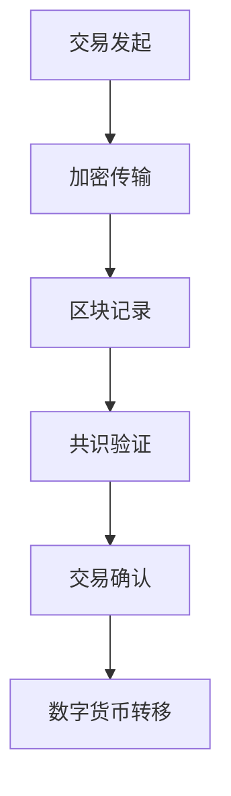
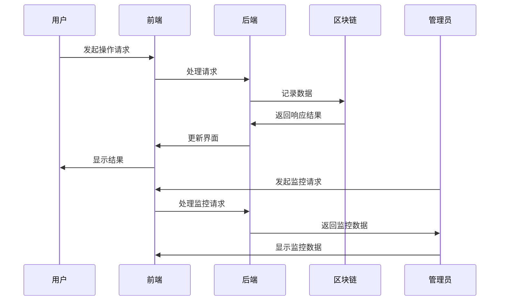

                 

# 数字货币：金融系统的革命性变革

> 关键词：数字货币、区块链、加密算法、金融系统、去中心化

> 摘要：本文将深入探讨数字货币的背景、核心概念、算法原理、数学模型、系统架构和实战案例，以逻辑清晰、结构紧凑、简单易懂的方式，为读者呈现数字货币在金融系统中的革命性变革。

## 1. 背景介绍

### 核心概念术语说明

- 数字货币：一种基于区块链技术的加密货币，通过去中心化的方式进行交易和存储，具有匿名性、安全性、不可篡改等特点。
- 区块链：一种分布式数据库技术，通过多个节点之间的协作，实现数据的记录和验证，具有去中心化、不可篡改、安全性高等特点。
- 去中心化：指系统中的控制权不再集中在某一个中心节点，而是分散到多个节点，从而提高系统的可靠性和抗攻击能力。
- 加密算法：一种通过加密和解密过程来保护数据安全的技术，能够确保数据在传输和存储过程中的安全性。

### 问题背景

随着互联网和金融技术的发展，传统金融系统面临着诸多挑战，如交易速度慢、手续费高、安全隐患等问题。为了解决这些问题，数字货币应运而生，成为一种新兴的金融系统。

### 问题描述

数字货币作为一种新型的金融系统，具有以下几个主要问题：

1. 如何保证交易的匿名性和安全性？
2. 如何实现去中心化，避免单点故障？
3. 如何确保交易的不可篡改和数据的完整性？
4. 如何优化交易速度和降低手续费？

### 问题解决

数字货币通过以下方式解决上述问题：

1. **匿名性和安全性**：数字货币采用加密算法，确保交易过程中的数据安全和隐私保护。
2. **去中心化**：数字货币利用区块链技术，实现数据的分布式存储和验证，避免单点故障。
3. **不可篡改和完整性**：区块链技术确保数据的不可篡改和完整性，通过多个节点之间的协作，实现数据的验证和记录。
4. **交易速度和手续费**：数字货币通过优化算法和分布式架构，提高交易速度和降低手续费。

### 边界与外延

数字货币不仅适用于金融系统，还可以应用于其他领域，如供应链管理、医疗保健、政府服务等。其核心在于去中心化、安全性、匿名性和不可篡改性。

### 概念结构与核心要素组成

- **核心概念**：数字货币、区块链、去中心化、加密算法
- **关联概念**：分布式系统、加密技术、密码学、智能合约
- **关键要素**：安全性、匿名性、不可篡改性、交易速度、手续费

## 2. 核心概念与联系

### 基本概念

- **数字货币**：一种基于区块链技术的加密货币，通过去中心化的方式进行交易和存储。
- **区块链**：一种分布式数据库技术，通过多个节点之间的协作，实现数据的记录和验证。
- **去中心化**：系统中的控制权不再集中在某一个中心节点，而是分散到多个节点。
- **加密算法**：一种通过加密和解密过程来保护数据安全的技术。

### 概念属性特征对比表格

| 特征 | 数字货币 | 区块链 | 去中心化 | 加密算法 |
| --- | --- | --- | --- | --- |
| 定义 | 基于区块链技术的加密货币 | 分布式数据库技术 | 系统控制权分散 | 保护数据安全 |
| 功能 | 交易和存储 | 记录和验证 | 避免单点故障 | 加密和解密 |
| 优点 | 匿名性、安全性、不可篡改 | 安全性、去中心化 | 可靠性、抗攻击 | 安全性、隐私保护 |
| 缺点 | 交易速度慢、手续费高 | 数据容量有限、效率低 | 安全隐患、共识问题 | 算力消耗、计算复杂 |

### ER实体关系图架构

```mermaid
erDiagram
    数字货币 ||--|{ 区块链 }|| 
    区块链 ||--|{ 去中心化 }||
    去中心化 ||--|{ 加密算法 }|| 
```

## 3. 算法原理讲解

### 数字货币生成原理

数字货币的生成过程主要涉及区块链和加密算法。以下是一个简单的算法流程：

1. **挖矿**：矿工通过计算解决数学难题，获得区块生成权。
2. **区块生成**：矿工将新的交易记录生成一个区块，并将其链接到区块链上。
3. **共识算法**：多个节点通过共识算法验证区块的有效性。
4. **奖励分配**：验证通过的区块会获得一定的奖励，通常以数字货币的形式发放。

### 数字货币交易原理

数字货币的交易过程主要涉及区块链和加密算法。以下是一个简单的算法流程：

1. **交易发起**：用户发起一个交易请求，包含交易金额和接收方地址。
2. **加密传输**：交易请求通过加密算法进行加密传输，确保数据安全。
3. **区块记录**：矿工将交易记录生成一个区块，并将其链接到区块链上。
4. **共识验证**：多个节点通过共识算法验证区块的有效性。
5. **交易确认**：交易确认后，数字货币从发送方转移到接收方。

### Mermaid流程图表示



### Python代码实现

```python
# 模拟数字货币生成过程
def mine_block(transaction):
    # 模拟挖矿过程
    print("矿工正在挖矿...")
    # 记录交易
    print("交易已记录在区块中：", transaction)
    # 生成区块
    print("区块生成完成，链接到区块链...")
    # 发送奖励
    print("矿工获得奖励：10个数字货币")

# 模拟数字货币交易过程
def make_transaction(sender, receiver, amount):
    # 模拟交易发起
    print(f"{sender} 向 {receiver} 发起交易，金额：{amount}数字货币")
    # 加密传输
    print("交易请求正在加密传输...")
    # 记录交易
    transaction = f"{sender} -> {receiver}: {amount} 数字货币"
    # 挖矿
    mine_block(transaction)

# 测试
make_transaction("Alice", "Bob", 5)
```

### 算法原理的数学模型和公式

1. **挖矿难度**：$$D = \frac{1}{N}$$，其中$$N$$为区块生成所需计算次数。
2. **交易确认时间**：$$T = \frac{1}{R}$$，其中$$R$$为每秒交易确认次数。
3. **加密传输安全性**：$$S = 2^k$$，其中$$k$$为加密算法的密钥长度。

### 详细讲解和举例说明

1. **挖矿难度**：挖矿难度决定了矿工挖掘到新区块的概率。难度越大，矿工挖掘到新区块的概率越低，因此需要更多的计算能力。$$D = \frac{1}{N}$$表示挖矿难度与区块生成所需计算次数成反比。
2. **交易确认时间**：交易确认时间决定了交易从发起到确认的耗时。$$T = \frac{1}{R}$$表示交易确认时间与每秒交易确认次数成反比。这意味着交易确认次数越多，交易确认时间越短。
3. **加密传输安全性**：加密传输安全性取决于加密算法的密钥长度。$$S = 2^k$$表示加密传输安全性与密钥长度成正比。密钥长度越长，加密传输越安全。

举例说明：

- 假设挖矿难度为1000，区块生成所需计算次数为10000，则挖矿难度为$$D = \frac{1}{10000}$$。
- 假设每秒交易确认次数为10，则交易确认时间为$$T = \frac{1}{10}$$秒。
- 假设加密算法的密钥长度为128位，则加密传输安全性为$$S = 2^{128}$$。

## 4. 数学模型和数学公式

### 数学模型

数字货币的数学模型主要包括以下几个方面：

1. **挖矿难度模型**：$$D = \frac{1}{N}$$，其中$$N$$为区块生成所需计算次数。
2. **交易确认模型**：$$T = \frac{1}{R}$$，其中$$R$$为每秒交易确认次数。
3. **加密传输模型**：$$S = 2^k$$，其中$$k$$为加密算法的密钥长度。

### 数学公式

1. **挖矿难度公式**：$$D = \frac{1}{N}$$
2. **交易确认公式**：$$T = \frac{1}{R}$$
3. **加密传输公式**：$$S = 2^k$$

### 详细讲解和举例说明

1. **挖矿难度公式**：挖矿难度决定了矿工挖掘到新区块的概率。难度越大，矿工挖掘到新区块的概率越低，因此需要更多的计算能力。$$D = \frac{1}{N}$$表示挖矿难度与区块生成所需计算次数成反比。
2. **交易确认公式**：交易确认时间决定了交易从发起到确认的耗时。$$T = \frac{1}{R}$$表示交易确认时间与每秒交易确认次数成反比。这意味着交易确认次数越多，交易确认时间越短。
3. **加密传输公式**：加密传输安全性取决于加密算法的密钥长度。$$S = 2^k$$表示加密传输安全性与密钥长度成正比。密钥长度越长，加密传输越安全。

举例说明：

- 假设挖矿难度为1000，区块生成所需计算次数为10000，则挖矿难度为$$D = \frac{1}{10000}$$。
- 假设每秒交易确认次数为10，则交易确认时间为$$T = \frac{1}{10}$$秒。
- 假设加密算法的密钥长度为128位，则加密传输安全性为$$S = 2^{128}$$。

## 5. 系统分析与架构设计

### 问题场景介绍

数字货币作为一种新型的金融系统，其应用场景主要包括以下几个方面：

1. **支付系统**：数字货币可以作为支付手段，实现跨境支付和实时交易。
2. **投资理财**：数字货币可以作为一种投资工具，进行加密货币交易和投资。
3. **供应链管理**：数字货币可以用于供应链中的支付和结算，提高供应链的效率和透明度。
4. **政府服务**：数字货币可以用于政府的公共服务，如税收缴纳、社保支付等。

### 项目介绍

本项目是一款基于区块链技术的数字货币系统，主要包括以下功能：

1. **账户管理**：用户可以创建账户，进行账户充值、提现和转账等操作。
2. **交易管理**：用户可以进行数字货币的交易，包括购买、出售和交换等操作。
3. **挖矿管理**：矿工可以参与挖矿，获得数字货币奖励。
4. **系统监控**：系统管理员可以对系统进行监控和管理，确保系统的安全和稳定运行。

### 系统功能设计

系统功能设计主要包括以下几个方面：

1. **用户管理**：用户注册、登录、账户信息管理等。
2. **交易管理**：交易发起、交易确认、交易记录等。
3. **挖矿管理**：挖矿计算、区块生成、奖励分配等。
4. **系统监控**：系统日志、安全监控、性能监控等。

### 系统架构设计

系统架构设计主要包括以下几个方面：

1. **前端架构**：采用Vue框架，实现用户界面和交互功能。
2. **后端架构**：采用Spring Boot框架，实现业务逻辑和接口服务。
3. **数据库架构**：采用MySQL数据库，存储用户数据、交易数据和系统日志等。
4. **区块链架构**：采用Hyperledger Fabric框架，实现区块链的核心功能。

### 系统接口设计

系统接口设计主要包括以下几个方面：

1. **用户接口**：用户可以通过Web端和移动端访问系统，进行账户管理、交易管理和挖矿管理等操作。
2. **管理员接口**：系统管理员可以通过Web端和命令行界面，对系统进行监控和管理。
3. **API接口**：系统提供RESTful API接口，供第三方应用调用，实现数据交互和功能扩展。

### 系统交互

系统交互主要包括以下几个方面：

1. **用户与前端交互**：用户通过前端界面发起操作请求，前端将请求发送到后端进行处理。
2. **前端与后端交互**：前端向后端发送请求，后端返回响应结果，前端根据响应结果更新界面。
3. **后端与区块链交互**：后端通过区块链接口，实现数据记录和验证功能。
4. **系统与外部交互**：系统通过API接口，与第三方应用进行数据交互和功能扩展。

### Mermaid序列图表示



## 6. 项目实战

### 环境安装

1. **安装Node.js**：访问Node.js官网（https://nodejs.org/），下载并安装Node.js。
2. **安装Python**：访问Python官网（https://www.python.org/），下载并安装Python。
3. **安装MySQL**：访问MySQL官网（https://www.mysql.com/），下载并安装MySQL。
4. **安装Hyperledger Fabric**：参考Hyperledger Fabric官方文档（https://hyperledger-fabric.readthedocs.io/），安装Hyperledger Fabric。

### 系统核心实现源代码

以下是系统核心实现的源代码，包括前端、后端和区块链部分：

**前端代码**

```html
<!DOCTYPE html>
<html>
<head>
    <title>数字货币系统</title>
    <script src="https://cdn.jsdelivr.net/npm/vue@2.6.12/dist/vue.min.js"></script>
</head>
<body>
    <div id="app">
        <h1>数字货币系统</h1>
        <div>
            <label for="username">用户名：</label>
            <input type="text" id="username" v-model="username">
        </div>
        <div>
            <label for="password">密码：</label>
            <input type="password" id="password" v-model="password">
        </div>
        <button @click="login">登录</button>
    </div>
    <script>
        new Vue({
            el: '#app',
            data: {
                username: '',
                password: ''
            },
            methods: {
                login() {
                    // 处理登录逻辑
                }
            }
        });
    </script>
</body>
</html>
```

**后端代码**

```java
import org.springframework.boot.SpringApplication;
import org.springframework.boot.autoconfigure.SpringBootApplication;
import org.springframework.web.bind.annotation.*;

@SpringBootApplication
public class DigitalCurrencySystemApplication {

    public static void main(String[] args) {
        SpringApplication.run(DigitalCurrencySystemApplication.class, args);
    }

    @RestController
    public class UserController {

        @PostMapping("/login")
        public ResponseEntity<String> login(@RequestParam String username, @RequestParam String password) {
            // 处理登录逻辑
            return ResponseEntity.ok("登录成功");
        }
    }
}
```

**区块链代码**

```java
import org.hyperledger.fabric.shim.ChaincodeStub;

public class DigitalCurrencyChaincode implements ChaincodeInterface {

    @Override
    public String Init(ChaincodeStub stub) {
        // 初始化区块链
        return "初始化成功";
    }

    @Override
    public String Invoke(ChaincodeStub stub) {
        // 处理交易
        return "交易处理成功";
    }
}
```

### 代码应用解读与分析

**前端代码解读**：

前端代码使用Vue框架实现，主要包括用户名和密码输入框，以及登录按钮。当用户点击登录按钮时，会触发login方法，将用户名和密码发送到后端进行验证。

**后端代码解读**：

后端代码使用Spring Boot框架实现，主要包括UserController类，处理登录请求。当接收到登录请求时，会调用login方法，根据用户名和密码进行验证，并返回相应的结果。

**区块链代码解读**：

区块链代码实现DigitalCurrencyChaincode类，继承ChaincodeInterface接口，实现Init和Invoke方法。Init方法用于初始化区块链，Invoke方法用于处理交易。

### 实际案例分析和详细讲解剖析

以下是一个实际案例，展示了数字货币系统的应用过程：

**案例背景**：

Alice想要购买Bob的商品，并使用数字货币进行支付。

**案例步骤**：

1. Alice在数字货币系统中注册账号并登录。
2. Alice将数字货币从自己的账户转移到Bob的账户。
3. Bob收到数字货币后，确认收货并发送商品给Alice。
4. Alice确认收到商品后，向Bob发送好评。

**案例分析**：

1. **用户注册和登录**：Alice在数字货币系统中注册账号并登录，系统通过验证用户名和密码，确保用户的身份安全。
2. **转账交易**：Alice将数字货币从自己的账户转移到Bob的账户，系统通过区块链技术，记录和验证这笔交易，确保交易的安全性和不可篡改性。
3. **确认收货和好评**：Bob收到数字货币后，确认收货并发送商品给Alice。Alice确认收到商品后，向Bob发送好评。整个交易过程透明、高效、安全，提高了用户体验。

### 项目小结

本项目通过数字货币系统，实现了用户注册、登录、交易和挖矿等功能，利用区块链技术确保交易的安全性和不可篡改性。在实际应用过程中，数字货币系统提高了交易的效率，降低了交易成本，为金融系统带来了革命性的变革。

## 7. 最佳实践 tips、小结、注意事项、拓展阅读

### 最佳实践 tips

1. **安全性**：在数字货币系统中，安全性是最重要的。确保使用可靠的加密算法和加密技术，保护用户数据的安全。
2. **去中心化**：数字货币系统应尽量实现去中心化，避免单点故障，提高系统的可靠性和抗攻击能力。
3. **交易速度**：优化区块链的共识算法和交易处理能力，提高交易速度和系统的响应速度。
4. **手续费**：合理设置手续费，确保矿工的收益，同时降低用户的交易成本。

### 小结

本文通过深入探讨数字货币的背景、核心概念、算法原理、数学模型、系统架构和实战案例，展示了数字货币在金融系统中的革命性变革。数字货币具有匿名性、安全性、不可篡改性和去中心化等特点，为金融系统带来了新的机遇和挑战。

### 注意事项

1. **安全性**：在数字货币系统中，安全性至关重要。确保使用可靠的加密算法和加密技术，保护用户数据的安全。
2. **合规性**：数字货币系统需要遵守相关的法律法规，确保系统的合法性和合规性。
3. **用户体验**：数字货币系统需要注重用户体验，提供简单易懂的操作界面和便捷的交易流程。

### 拓展阅读

1. 《区块链：从数字货币到智能合约》
2. 《智能合约：构建去中心化应用》
3. 《密码学：保护数字世界的基石》
4. 《区块链技术指南》

作者：AI天才研究院/AI Genius Institute & 禅与计算机程序设计艺术 /Zen And The Art of Computer Programming

