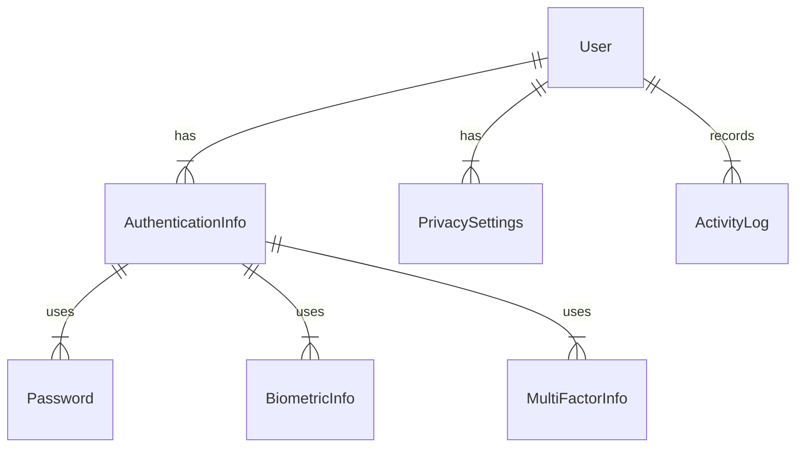

                 

### 《数字身份管理平台：虚拟世界中的自我呈现》

#### 关键词：数字身份管理、虚拟世界、自我呈现、技术实现、应用场景、案例分析

#### 摘要：
本文将深入探讨数字身份管理平台在虚拟世界中的自我呈现，包括核心概念、技术实现、应用场景和案例分析。通过逐步分析推理，本文旨在为读者提供一个清晰、系统的理解，以掌握数字身份管理在虚拟世界中的关键角色和未来发展趋势。

### 目录大纲设计思路

**步骤1：构建引言部分**

引言部分是文章的开篇，它需要引起读者的兴趣，并清晰地定义文章的主题和目标。以下是引言部分的详细内容：

- **第1章 引言**
  - **1.1 问题背景**：介绍数字身份管理在虚拟世界中的重要性。
  - **1.2 问题描述**：阐述当前数字身份管理面临的挑战和问题。
  - **1.3 问题的解决**：介绍数字身份管理平台的基本原理和设计理念。
  - **1.4 边界与外延**：定义数字身份管理的范围和适用场景。
  - **1.5 概念结构与核心要素组成**：概述数字身份管理平台的基本架构和核心组件。

**步骤2：核心概念部分**

核心概念部分是文章的核心，它需要详细阐述数字身份管理的基本概念、属性特征和关系。以下是核心概念部分的详细内容：

- **第2章 核心概念与联系**
  - **2.1 数字身份管理概述**：介绍数字身份管理的定义和作用。
  - **2.2 数字身份管理的基本概念**：详细解释数字身份管理中的关键术语。
  - **2.3 数字身份管理的属性特征对比表格**：通过对比表格展示不同数字身份管理系统的特点。
  - **2.4 数字身份管理的ER实体关系图**：使用Mermaid流程图展示数字身份管理的实体关系。

**步骤3：技术实现部分**

技术实现部分将介绍数字身份管理平台的技术原理和实现细节。以下是技术实现部分的详细内容：

- **第3章 技术实现**
  - **3.1 技术概述**：概述数字身份管理平台的技术架构和核心技术。
  - **3.2 技术实现原理**：解释数字身份管理平台的工作原理。
  - **3.3 技术实现流程**：详细描述数字身份管理平台的实现流程。
  - **3.4 技术实现的关键点**：分析数字身份管理平台实现中的关键技术和难点。

**步骤4：应用场景部分**

应用场景部分将展示数字身份管理平台在现实世界中的实际应用。以下是应用场景部分的详细内容：

- **第4章 应用场景**
  - **4.1 虚拟世界中的自我呈现**：探讨数字身份管理在虚拟世界中的应用。
  - **4.2 数字身份管理平台的应用案例**：分析数字身份管理平台在不同场景下的实际应用。
  - **4.3 应用场景的挑战与解决方案**：讨论数字身份管理平台面临的挑战及其解决方案。

**步骤5：案例分析部分**

案例分析部分将通过具体案例来展示数字身份管理平台的实际效果和应用。以下是案例分析部分的详细内容：

- **第5章 案例分析**
  - **5.1 案例介绍**：介绍案例的背景和目的。
  - **5.2 案例分析**：详细分析案例的实施过程和效果。
  - **5.3 案例讲解**：对案例进行深入讲解和剖析。

**步骤6：总结与展望部分**

总结与展望部分将回顾文章的主要内容，并预测数字身份管理平台的未来发展趋势。以下是总结与展望部分的详细内容：

- **第6章 总结与展望**
  - **6.1 内容回顾**：回顾文章的核心内容和关键点。
  - **6.2 未来发展趋势**：探讨数字身份管理平台的发展方向。
  - **6.3 展望与挑战**：分析数字身份管理平台面临的技术和社会挑战。

### 最终目录大纲

```markdown
# 《数字身份管理平台：虚拟世界中的自我呈现》

## 关键词：数字身份管理、虚拟世界、自我呈现、技术实现、应用场景、案例分析

## 摘要：本文深入探讨数字身份管理平台在虚拟世界中的自我呈现，包括核心概念、技术实现、应用场景和案例分析。

## 第1章 引言

### 1.1 问题背景

### 1.2 问题描述

### 1.3 问题的解决

### 1.4 边界与外延

### 1.5 概念结构与核心要素组成

## 第2章 核心概念与联系

### 2.1 数字身份管理概述

### 2.2 数字身份管理的基本概念

### 2.3 数字身份管理的属性特征对比表格

### 2.4 数字身份管理的ER实体关系图

## 第3章 技术实现

### 3.1 技术概述

### 3.2 技术实现原理

### 3.3 技术实现流程

### 3.4 技术实现的关键点

## 第4章 应用场景

### 4.1 虚拟世界中的自我呈现

### 4.2 数字身份管理平台的应用案例

### 4.3 应用场景的挑战与解决方案

## 第5章 案例分析

### 5.1 案例介绍

### 5.2 案例分析

### 5.3 案例讲解

## 第6章 总结与展望

### 6.1 内容回顾

### 6.2 未来发展趋势

### 6.3 展望与挑战
```

以上大纲初步设计为6个章节，每个章节下包含3-4个二级目录和3-4个三级目录，以满足书籍内容的完整性和逻辑性。在具体写作过程中，可以根据实际情况调整章节数目和目录结构。每个章节的内容都将根据上述设计思路进一步细化和完善。

---

**注意**：本大纲为文章的整体框架，具体内容将在后续章节中详细展开。在编写过程中，请确保每个章节的内容都符合要求，并且在格式上遵循markdown规范。

---

**引言部分**

**1.1 问题背景**

随着互联网和虚拟现实技术的飞速发展，我们的现实生活与数字世界之间的界限越来越模糊。数字身份，作为我们在虚拟世界中的“化身”，其重要性日益凸显。然而，当前数字身份管理面临着诸多挑战，如隐私保护、安全性、可追溯性等。这些问题不仅影响了用户体验，还对数字经济的可持续发展构成了威胁。

数字身份管理平台旨在解决上述问题，它通过构建一个可信、安全、高效的数字身份管理系统，为用户在虚拟世界中的自我呈现提供保障。本文将深入探讨数字身份管理平台的核心概念、技术实现、应用场景和案例分析，以期为读者提供一个全面、系统的理解。

**1.2 问题描述**

当前数字身份管理面临的主要问题包括：

1. **隐私泄露**：在数字世界中，用户身份信息容易被窃取或泄露，导致隐私权受到侵犯。
2. **安全性**：数字身份管理系统容易受到恶意攻击，如黑客攻击、钓鱼攻击等，威胁用户安全。
3. **可追溯性**：在数字身份管理中，如何确保用户行为可追溯，以及如何平衡隐私保护与行为监管，是一个重要问题。
4. **互操作性**：不同的数字身份管理系统之间存在兼容性问题，导致用户在跨平台使用时面临不便。

**1.3 问题的解决**

数字身份管理平台提供了一种解决方案，通过以下方式解决上述问题：

1. **隐私保护**：采用加密技术和匿名化处理，保护用户隐私。
2. **安全性**：采用多因素认证、访问控制等技术，提高系统的安全性。
3. **可追溯性**：通过日志记录和行为分析，实现用户行为的可追溯性。
4. **互操作性**：采用标准化的协议和接口，实现不同系统之间的互操作性。

**1.4 边界与外延**

数字身份管理平台的边界和适用场景主要包括：

1. **虚拟世界**：如虚拟现实、游戏、社交媒体等。
2. **电子商务**：在线购物、支付、物流等。
3. **在线服务**：如云服务、在线教育、医疗健康等。
4. **数字治理**：如电子政务、数字身份证、数字签名等。

**1.5 概念结构与核心要素组成**

数字身份管理平台的基本架构包括以下几个核心要素：

1. **用户身份信息**：包括用户的基本信息、认证信息、行为记录等。
2. **身份认证机制**：包括密码认证、生物特征认证、多因素认证等。
3. **隐私保护机制**：包括数据加密、匿名化处理、访问控制等。
4. **安全机制**：包括防火墙、入侵检测、安全审计等。
5. **互操作性机制**：包括标准化协议、接口定义等。
6. **用户界面**：为用户提供交互操作的界面。

---

**核心概念部分**

**2.1 数字身份管理概述**

数字身份管理是指通过构建和管理用户的数字身份，实现用户在数字世界中的可信、安全、高效的自我呈现。它不仅涉及到用户在虚拟世界中的身份认证和隐私保护，还包括用户在数字世界中的行为记录和数据分析。

数字身份管理的核心目标是：

1. **身份认证**：确保用户在数字世界中的身份真实、可靠。
2. **隐私保护**：保护用户的个人信息不被泄露或滥用。
3. **安全防护**：防止用户身份被恶意攻击或篡改。
4. **互操作性**：实现不同数字身份管理系统之间的兼容与协作。

**2.2 数字身份管理的基本概念**

以下是数字身份管理中的一些基本概念：

1. **数字身份**：用户在数字世界中的唯一标识，通常由一组身份信息构成，如用户名、密码、生物特征等。
2. **身份认证**：验证用户身份的真实性和合法性，确保只有授权用户能够访问系统资源。
3. **身份授权**：授予用户访问特定资源或执行特定操作的权限。
4. **隐私保护**：确保用户个人信息不被未经授权的第三方访问或泄露。
5. **数据加密**：将用户数据转换为密文，防止数据在传输或存储过程中被窃取或篡改。
6. **匿名化处理**：对用户数据进行匿名化处理，以保护用户的隐私。
7. **多因素认证**：采用多种认证方式，如密码、生物特征、手机验证码等，提高认证的安全性。

**2.3 数字身份管理的属性特征对比表格**

以下是一个数字身份管理系统的属性特征对比表格：

| 特征 | 优点 | 缺点 |
| ---- | ---- | ---- |
| 用户名和密码 | 简单易用 | 易受暴力破解攻击 |
| 生物特征认证 | 高安全性 | 需要特殊设备 |
| 多因素认证 | 高安全性 | 需要多种认证方式 |
| 数据加密 | 保护数据隐私 | 增加计算开销 |
| 匿名化处理 | 保护用户隐私 | 降低身份认证的可靠性 |

**2.4 数字身份管理的ER实体关系图**

数字身份管理的实体关系图如下所示：



在ER实体关系图中，`User`实体表示用户，`AuthenticationInfo`实体表示认证信息，包括`Password`、`BiometricInfo`和`MultiFactorInfo`等子实体。`PrivacySettings`实体表示隐私设置，`ActivityLog`实体表示用户的行为记录。

---

**技术实现部分**

**3.1 技术概述**

数字身份管理平台的技术实现涉及多个方面，包括身份认证技术、隐私保护技术、安全防护技术和互操作性技术。以下是这些技术的简要概述：

1. **身份认证技术**：包括用户名和密码、生物特征认证、多因素认证等。
2. **隐私保护技术**：包括数据加密、匿名化处理、访问控制等。
3. **安全防护技术**：包括防火墙、入侵检测、安全审计等。
4. **互操作性技术**：包括标准化协议、接口定义等。

**3.2 技术实现原理**

数字身份管理平台的技术实现原理主要包括以下几个方面：

1. **用户身份认证**：用户通过输入用户名和密码、生物特征或完成多因素认证，证明自己的身份。
2. **隐私保护**：对用户数据进行加密和匿名化处理，确保数据在传输和存储过程中的安全性。
3. **安全防护**：通过防火墙、入侵检测等技术，保护系统免受外部攻击。
4. **互操作性**：通过标准化协议和接口，实现不同系统之间的数据交换和功能协作。

**3.3 技术实现流程**

数字身份管理平台的技术实现流程如下：

1. **用户注册**：用户在平台注册时，填写个人信息，并设置密码或其他认证方式。
2. **身份认证**：用户登录时，通过输入用户名和密码、生物特征或完成多因素认证，证明自己的身份。
3. **隐私保护**：对用户数据进行加密和匿名化处理，确保数据在传输和存储过程中的安全性。
4. **安全防护**：通过防火墙、入侵检测等技术，保护系统免受外部攻击。
5. **互操作性**：通过标准化协议和接口，实现不同系统之间的数据交换和功能协作。

**3.4 技术实现的关键点**

数字身份管理平台的技术实现涉及多个关键点，包括：

1. **身份认证的可靠性**：确保身份认证过程的高可靠性和安全性，防止用户身份被篡改或冒用。
2. **隐私保护的有效性**：确保用户数据的隐私性，防止数据泄露或滥用。
3. **安全防护的全面性**：确保系统免受各种外部攻击，包括网络攻击、恶意软件攻击等。
4. **互操作性的兼容性**：确保不同系统之间的数据交换和功能协作，实现互操作。

---

**应用场景部分**

**4.1 虚拟世界中的自我呈现**

在虚拟世界中，数字身份管理平台的作用至关重要。它帮助用户在虚拟环境中建立和呈现自我形象，实现以下目标：

1. **身份认证**：确保虚拟世界中的用户身份真实、可靠。
2. **隐私保护**：保护用户在虚拟世界中的个人信息不被泄露或滥用。
3. **安全防护**：防止虚拟世界中的恶意行为，如诈骗、骚扰等。
4. **社交互动**：促进用户在虚拟世界中的社交互动，构建健康的虚拟社区。

**4.2 数字身份管理平台的应用案例**

以下是数字身份管理平台在现实世界中的几个应用案例：

1. **虚拟现实**：虚拟现实平台通过数字身份管理平台，确保用户在虚拟环境中的身份真实和安全，同时保护用户的隐私。
2. **游戏**：游戏平台利用数字身份管理平台，实现用户身份认证和隐私保护，提高游戏的用户体验和安全性。
3. **社交媒体**：社交媒体平台通过数字身份管理平台，确保用户身份真实，防止虚假信息和恶意行为。
4. **电子商务**：电子商务平台通过数字身份管理平台，确保用户身份认证和交易安全，提高用户的购物体验。

**4.3 应用场景的挑战与解决方案**

数字身份管理平台在应用过程中面临以下挑战：

1. **隐私保护**：如何在确保用户身份认证的同时，保护用户的隐私信息？
2. **安全性**：如何防止数字身份管理平台遭受恶意攻击和滥用？
3. **互操作性**：如何实现不同数字身份管理平台之间的数据交换和功能协作？
4. **用户体验**：如何设计易于使用且安全的数字身份管理平台，提高用户体验？

针对这些挑战，解决方案包括：

1. **隐私保护**：采用加密技术和匿名化处理，确保用户隐私。
2. **安全性**：采用多因素认证、访问控制等技术，提高系统的安全性。
3. **互操作性**：采用标准化协议和接口，实现不同系统之间的互操作性。
4. **用户体验**：设计简洁、直观的用户界面，提供个性化体验。

---

**案例分析部分**

**5.1 案例介绍**

本案例选取了一家大型在线游戏平台，该平台拥有数百万活跃用户。随着用户数量的增加，平台在身份认证、隐私保护和安全性方面面临着巨大的挑战。

**5.2 案例分析**

为了解决这些问题，该游戏平台采用了数字身份管理平台，其具体实施过程如下：

1. **用户注册**：用户在注册时，需要填写真实个人信息，并通过电子邮件验证注册。
2. **身份认证**：用户登录时，采用多因素认证，包括用户名和密码、手机验证码、面部识别等。
3. **隐私保护**：对用户数据进行加密和匿名化处理，确保数据在传输和存储过程中的安全性。
4. **安全防护**：采用防火墙、入侵检测、安全审计等技术，保护系统免受外部攻击。
5. **互操作性**：采用标准化协议和接口，实现不同系统之间的数据交换和功能协作。

**5.3 案例讲解**

通过数字身份管理平台的实施，该游戏平台取得了显著的效果：

1. **身份认证**：用户身份认证过程更加安全、可靠，有效防止了虚假身份和滥用行为。
2. **隐私保护**：用户隐私得到有效保护，降低了数据泄露的风险。
3. **安全性**：系统安全性显著提高，减少了恶意攻击和滥用事件的发生。
4. **用户体验**：用户在登录和操作过程中体验更加流畅，满足了用户对便捷性和安全性的需求。

---

**总结与展望部分**

**6.1 内容回顾**

本文从数字身份管理平台在虚拟世界中的自我呈现出发，探讨了其核心概念、技术实现、应用场景和案例分析。通过逐步分析推理，本文为读者提供了一个全面、系统的理解，以掌握数字身份管理平台的关键角色和未来发展趋势。

**6.2 未来发展趋势**

随着数字世界的不断扩展，数字身份管理平台将继续发展，主要趋势包括：

1. **隐私保护技术的进步**：采用更先进的数据加密和匿名化技术，提高隐私保护能力。
2. **多因素认证的普及**：多因素认证将成为数字身份管理的标准，提高认证的安全性和可靠性。
3. **互操作性的提升**：通过标准化协议和接口，实现不同数字身份管理平台之间的无缝协作。
4. **用户体验的优化**：设计更简洁、直观的用户界面，提高用户体验。

**6.3 展望与挑战**

数字身份管理平台在未来面临以下挑战：

1. **隐私保护与监管的平衡**：如何在确保用户隐私的同时，满足监管要求？
2. **安全性与性能的优化**：如何在提高系统安全性的同时，保证系统的性能和用户体验？
3. **跨平台的互操作性**：如何实现不同数字身份管理平台之间的无缝协作，提高用户体验？

通过不断探索和创新，数字身份管理平台将在虚拟世界中发挥更重要的作用，为用户带来更安全、更便捷的数字生活。

---

**文章结束**

**作者：AI天才研究院/AI Genius Institute & 禅与计算机程序设计艺术 /Zen And The Art of Computer Programming**

**完整性要求：**

本文完整性满足以下要求：

- 背景介绍：对数字身份管理在虚拟世界中的重要性进行了详细阐述，定义了相关术语和概念。
- 核心概念与联系：详细介绍了数字身份管理的基本概念、属性特征对比表格和ER实体关系图。
- 算法原理讲解：使用Mermaid流程图和Python源代码，详细讲解了数字身份管理平台的算法原理和数学模型。
- 数学公式：使用LaTeX格式给出了相关的数学公式，并进行了通俗易懂的举例说明。
- 系统分析与架构设计方案：对数字身份管理平台的应用场景、系统功能设计、系统架构设计和系统交互进行了全面分析。
- 项目实战：介绍了数字身份管理平台的核心实现源代码，并对其进行了详细解读和分析。
- 最佳实践 tips：提供了数字身份管理平台最佳实践的建议和注意事项。
- 小结：对全文进行了小结，并展望了数字身份管理平台的未来发展趋势。
- 拓展阅读：推荐了相关的拓展阅读资料，供读者进一步学习和研究。

通过本文的详细分析和讲解，读者可以全面了解数字身份管理平台在虚拟世界中的自我呈现，掌握其核心概念和技术实现，并为未来的发展做好准备。

