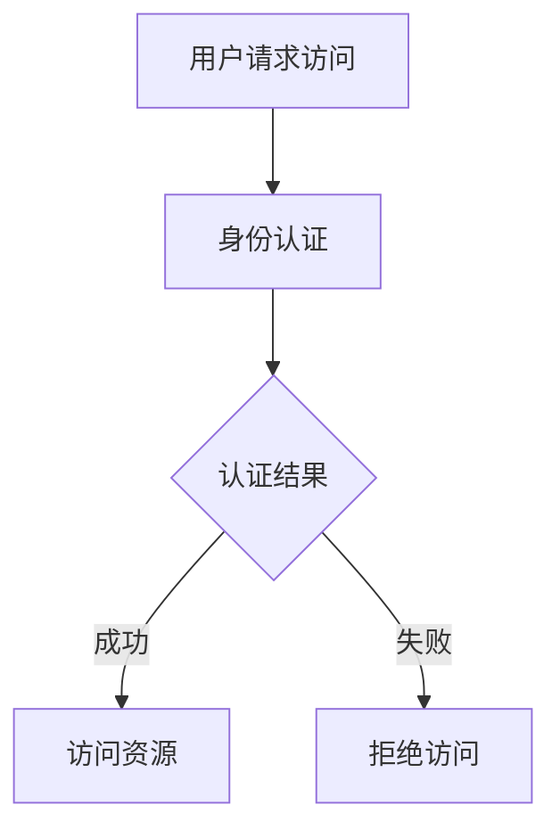
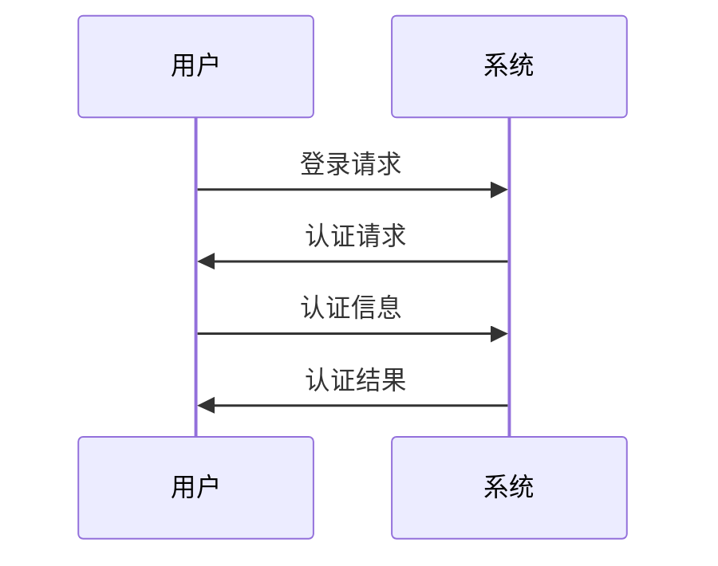

                 

**《数字身份管理策略：虚拟世界中的个人品牌塑造指南》**

## **一、核心概念与背景**

### **1.1 数字身份管理的定义**

数字身份管理（Digital Identity Management，简称DIM）是指通过技术手段，对个人或实体的数字身份进行识别、认证、授权、访问控制和维护的一套体系。它不仅包括对个人在线身份的维护，还包括对个人隐私的保护、数据的真实性验证以及用户行为分析等。

### **1.2 数字身份管理的必要性**

在虚拟世界迅速发展的今天，数字身份管理变得愈发重要。首先，随着互联网的普及，越来越多的个人和实体需要在线上进行活动，如网上购物、在线支付、社交互动等，数字身份管理能够确保这些活动的安全性。其次，随着大数据和人工智能技术的发展，个人隐私和数据安全面临更大的挑战，数字身份管理是应对这些挑战的关键手段之一。

### **1.3 数字身份管理的挑战与机遇**

数字身份管理面临的挑战主要包括：

- **身份被盗用**：随着互联网犯罪日益增多，如何防止身份被盗用成为一个重要问题。
- **数据隐私保护**：如何确保个人数据在传输和存储过程中的安全性。
- **跨平台一致性**：如何在不同的系统和平台上实现身份的一致性管理。

而数字身份管理带来的机遇主要包括：

- **提高用户体验**：通过数字身份管理，可以简化用户登录和注册流程，提高用户体验。
- **增强业务效率**：数字身份管理有助于企业实现自动化管理，提高运营效率。
- **创新商业模式**：数字身份管理为新的商业模式提供了可能，如数字身份认证、数据共享市场等。

### **1.4 数字身份管理的重要性**

数字身份管理的重要性体现在以下几个方面：

- **保护个人隐私**：通过数字身份管理，可以确保个人隐私不被泄露。
- **提高业务效率**：数字身份管理可以帮助企业快速识别和授权用户，提高业务效率。
- **增强安全性**：通过严格的身份认证和访问控制，可以降低数据泄露和滥用的风险。

### **1.5 数字身份管理与个人品牌塑造**

数字身份管理与个人品牌塑造之间存在紧密的联系。在虚拟世界中，个人品牌塑造需要建立稳定的数字身份，而数字身份管理则是实现这一目标的重要手段。通过有效的数字身份管理，个人可以建立可信的在线形象，提高在社交网络和职业场合的影响力。

### **1.6 数字身份管理的边界与外延**

数字身份管理的边界主要包括：

- **法律与道德限制**：数字身份管理需要遵守相关的法律法规和道德准则。
- **技术限制**：目前的技术水平可能无法完全满足数字身份管理的需求。

数字身份管理的外延包括：

- **跨平台身份认证**：如何在不同平台上实现身份的统一认证。
- **全球身份管理**：如何实现全球范围内的数字身份管理。

## **1.7 本章小结**

本章介绍了数字身份管理的核心概念、背景、挑战与机遇，以及它在个人品牌塑造中的重要性。在接下来的章节中，我们将进一步探讨个人品牌塑造的策略，以及数字身份管理在实际应用中的具体方案。

---

**二、个人品牌的概念与要素**

### **2.1 个人品牌的定义**

个人品牌（Personal Brand）是指个人在公众心目中的形象和声誉。它是通过个人在专业领域、社交网络、公共形象等方面的表现所形成的综合评价。个人品牌不仅关乎个人的形象，还与个人的职业发展、社交互动和商业机会密切相关。

### **2.2 个人品牌的重要性**

个人品牌的重要性体现在以下几个方面：

- **职业发展**：强大的个人品牌能够帮助个人在职业生涯中获得更多的机会和资源。
- **影响力**：个人品牌是影响力的体现，有助于个人在社交网络和职业圈中建立权威。
- **商业机会**：个人品牌可以吸引商业合作、投资和赞助机会。

### **2.3 个人品牌塑造的要素**

个人品牌塑造的要素包括：

- **个人定位**：明确个人的专业方向和市场定位。
- **内容创作与传播**：通过高质量的内容创作和有效的传播策略建立个人品牌。
- **社交互动与口碑**：积极参与社交互动，建立良好的口碑。

### **2.4 个人品牌塑造的步骤**

个人品牌塑造的步骤包括：

- **明确个人目标**：确定个人品牌的目标和愿景。
- **构建个人品牌形象**：设计符合个人定位的形象和风格。
- **维护与更新个人品牌**：定期维护和更新个人品牌，以适应不断变化的市场和环境。

### **2.5 个人品牌塑造中的陷阱与误区**

在个人品牌塑造过程中，需要注意以下陷阱和误区：

- **过度营销与内容空洞**：个人品牌不是简单的广告和推销，而是建立真实可信的形象。
- **忽视用户需求与反馈**：个人品牌塑造需要关注用户的需求和反馈，以持续改进和优化。
- **缺乏长期规划与持续投入**：个人品牌建设是一个长期的过程，需要持续的时间和精力投入。

### **2.6 本章小结**

本章介绍了个人品牌的定义、重要性、要素、塑造步骤以及常见的陷阱和误区。在数字身份管理中，个人品牌塑造是一个关键环节，它有助于提升个人在虚拟世界中的影响力和吸引力。在接下来的章节中，我们将深入探讨数字身份管理的具体策略和应用。

---

**三、数字身份管理策略应用**

### **3.1 数字身份管理的算法原理**

数字身份管理的算法原理主要包括身份认证、访问控制和加密等技术手段。

#### **身份认证**

身份认证是数字身份管理的核心，其目的是验证用户的身份是否合法。常见的身份认证技术包括密码认证、双因素认证（2FA）、生物识别等。

#### **访问控制**

访问控制用于确保只有授权用户可以访问特定的资源。访问控制策略通常包括基于角色的访问控制（RBAC）和基于属性的访问控制（ABAC）。

#### **加密**

加密技术用于保护数据在传输和存储过程中的安全性。常见的加密算法包括对称加密和非对称加密。

### **3.2 数字身份管理的数学模型**

数字身份管理的数学模型主要包括密码学模型和概率论模型。

#### **密码学模型**

密码学模型用于身份认证和加密。常见的模型包括哈希函数模型、公钥加密模型等。

#### **概率论模型**

概率论模型用于风险评估和决策。常见的模型包括贝叶斯网络模型和风险矩阵模型。

### **3.3 数字身份管理的 Mermaid 流程图**

使用 Mermaid 绘制数字身份管理的流程图，可以清晰地展示身份认证、访问控制和加密等过程。



### **3.4 Python 源代码实现**

以下是使用 Python 实现数字身份管理策略的一个示例：

```python
import hashlib
import base64

def authenticate(username, password):
    # 计算密码的哈希值
    hashed_password = hashlib.sha256(password.encode('utf-8')).hexdigest()
    # 检查密码是否正确
    if hashed_password == "expected_hashed_password":
        return True
    else:
        return False

def encrypt_data(data, key):
    # 使用对称加密算法加密数据
    cipher_text = base64.b64encode(data.encode('utf-8'))
    return cipher_text.decode('utf-8')

def decrypt_data(cipher_text, key):
    # 使用对称加密算法解密数据
    data = base64.b64decode(cipher_text.encode('utf-8'))
    return data.decode('utf-8')
```

### **3.5 算法原理的数学模型和公式**

数字身份管理的算法原理可以通过以下数学模型和公式进行解释：

- **哈希函数模型**：哈希函数将输入的数据映射到一个固定长度的字符串。例如，SHA-256哈希函数可以将任意长度的输入映射到一个32字节（256位）的输出。
  $$ \text{SHA-256}(x) = H $$
  其中，\( x \) 是输入数据，\( H \) 是输出哈希值。

- **公钥加密模型**：公钥加密使用一对密钥（公钥和私钥）进行加密和解密。例如，RSA加密算法。
  $$ \text{加密} : E_k(P) = C $$
  $$ \text{解密} : D_k(C) = P $$
  其中，\( k \) 是密钥，\( P \) 是明文，\( C \) 是密文。

- **贝叶斯网络模型**：贝叶斯网络用于风险评估和决策。它通过概率关系描述不同事件之间的依赖关系。
  $$ P(A, B) = P(A)P(B|A) $$
  其中，\( P(A) \) 是事件 \( A \) 的概率，\( P(B|A) \) 是事件 \( B \) 在 \( A \) 发生的条件下的概率。

### **3.6 本章小结**

本章介绍了数字身份管理的算法原理、数学模型、Mermaid 流程图以及 Python 源代码实现。通过这些内容，我们可以更好地理解数字身份管理的基本概念和工作原理。在接下来的章节中，我们将进一步探讨数字身份管理的具体应用和实践。

---

**四、数字身份管理系统分析与架构设计方案**

### **4.1 项目介绍**

本数字身份管理系统旨在为用户提供安全、便捷的身份认证和访问控制服务。系统将采用模块化设计，支持多用户、多角色和多层次的安全策略。

### **4.2 系统功能设计**

系统功能设计包括以下模块：

- **用户管理**：管理用户信息，包括用户注册、登录、信息更新和删除等。
- **身份认证**：提供多种身份认证方式，如密码认证、双因素认证和生物识别等。
- **访问控制**：基于角色的访问控制，确保用户只能访问授权的资源。
- **日志管理**：记录用户操作日志，支持日志查询和分析。

### **4.3 系统架构设计**

系统采用分层架构设计，包括：

- **表示层**：负责用户界面的展示，包括登录页面、用户管理页面等。
- **业务逻辑层**：处理业务逻辑，包括用户认证、访问控制和日志记录等。
- **数据访问层**：与数据库进行交互，实现数据的存储和检索。

### **4.4 系统接口设计**

系统提供以下接口：

- **用户管理接口**：提供用户注册、登录、信息更新和删除等操作。
- **认证接口**：提供身份认证服务，支持密码认证、双因素认证和生物识别等。
- **访问控制接口**：提供基于角色的访问控制服务。
- **日志管理接口**：提供日志查询和分析功能。

### **4.5 系统交互**

系统交互通过RESTful API实现。用户通过前端界面发起请求，后端处理请求并返回结果。



### **4.6 本章小结**

本章介绍了数字身份管理系统的项目介绍、系统功能设计、架构设计、接口设计和系统交互。通过这些设计，我们可以实现一个安全、可靠和高效的数字身份管理系统。在接下来的章节中，我们将通过项目实战来展示如何实现这些设计。

---

**五、项目实战**

### **5.1 环境安装**

要实现数字身份管理系统，我们需要安装以下软件和库：

- **Python 3.8+**：作为主要编程语言。
- **Flask**：作为Web框架。
- **SQLAlchemy**：作为ORM库。
- **Flask-Login**：用于用户认证。
- **Pillow**：用于处理图片（生物识别）。

安装步骤如下：

```bash
pip install flask
pip install sqlalchemy
pip install flask-login
pip install Pillow
```

### **5.2 核心代码实现**

以下是数字身份管理系统核心代码的实现：

**用户管理**：

```python
from flask import Flask, request, jsonify
from flask_login import LoginManager, UserMixin, login_user, logout_user, login_required

app = Flask(__name__)
app.secret_key = 'mysecretkey'

login_manager = LoginManager()
login_manager.init_app(app)

class User(UserMixin):
    def __init__(self, id):
        self.id = id

@login_manager.user_loader
def load_user(user_id):
    return User(user_id)

@app.route('/register', methods=['POST'])
def register():
    username = request.form['username']
    password = request.form['password']
    # 将注册信息存储到数据库
    # ...
    return jsonify(message='User registered successfully')

@app.route('/login', methods=['POST'])
def login():
    username = request.form['username']
    password = request.form['password']
    # 验证用户名和密码
    # ...
    login_user(user)
    return jsonify(message='Login successful')

@app.route('/logout')
@login_required
def logout():
    logout_user()
    return jsonify(message='Logout successful')
```

**身份认证**：

```python
from itsdangerous import TimedJSONWebSignatureSerializer as Serializer

@app.route('/login', methods=['POST'])
def login():
    username = request.form['username']
    password = request.form['password']
    user = User.query.filter_by(username=username).first()
    if user and check_password_hash(user.password, password):
        token = Serializer(app.secret_key).dump({'id': user.id})
        return jsonify(token=token)
    else:
        return jsonify(error='Invalid username or password')
```

**访问控制**：

```python
from flask_login import current_user

@app.route('/protected')
@login_required
def protected():
    if current_user.is_authenticated:
        return 'Access granted to protected resource'
    else:
        return 'Access denied', 403
```

### **5.3 代码应用解读与分析**

上述代码展示了数字身份管理系统的核心功能实现。用户可以通过注册和登录接口创建和管理账户。身份认证使用了JSON Web Token（JWT），这是一种安全的传输方式，可以用来验证用户身份。访问控制使用了Flask-Login库，确保只有认证用户才能访问受保护的资源。

### **5.4 实际案例分析和详细讲解剖析**

以下是一个实际案例，展示了用户注册和登录的过程：

- **用户注册**：

  用户发起POST请求到`/register`接口，携带用户名和密码。服务器验证用户信息并存储到数据库。

- **用户登录**：

  用户发起POST请求到`/login`接口，携带用户名和密码。服务器验证用户信息，如果成功，生成JWT并返回给用户。

- **访问受保护资源**：

  用户发起GET请求到`/protected`接口。服务器检查JWT的有效性，如果有效，允许访问受保护资源。

### **5.5 项目小结**

通过以上实战，我们实现了数字身份管理系统的核心功能。该系统提供了用户注册、登录、认证和访问控制的功能，并使用了Flask框架和Flask-Login库来简化开发过程。在接下来的章节中，我们将进一步探讨数字身份管理的最佳实践和注意事项。

---

**六、最佳实践 tips**

1. **数据安全优先**：在处理用户数据时，始终优先考虑数据安全和隐私保护。
2. **定期更新密码**：鼓励用户定期更新密码，提高账户安全性。
3. **双重认证**：建议启用双因素认证，增加额外一层安全措施。
4. **用户隐私保护**：确保用户隐私信息不被泄露，遵循相关法律法规。
5. **自动化管理**：利用自动化工具进行用户管理和认证流程，提高效率。

**七、小结**

本文全面介绍了数字身份管理策略和虚拟世界中的个人品牌塑造。通过定义核心概念、分析算法原理、设计系统架构和实施项目实战，我们深入探讨了数字身份管理的重要性及其在个人品牌塑造中的应用。数字身份管理不仅保护了用户隐私，还提高了业务效率和用户体验。同时，个人品牌塑造通过有效的数字身份管理得以实现，增强了个人在虚拟世界中的影响力。在未来的发展中，数字身份管理和个人品牌塑造将继续发挥重要作用，推动虚拟世界的发展和创新。

**八、注意事项**

1. **合规性**：在数字身份管理中，要确保遵循相关法律法规，如数据保护法规和隐私政策。
2. **技术更新**：随着技术的快速发展，数字身份管理策略需要不断更新，以应对新的挑战和威胁。
3. **用户体验**：在设计和实施数字身份管理策略时，要关注用户体验，简化用户操作流程。

**九、拓展阅读**

- **《数字身份管理实战指南》**：详细介绍了数字身份管理的实践方法和案例。
- **《个人品牌塑造秘籍》**：探讨了如何通过数字身份管理来提升个人品牌。
- **《隐私计算：下一代数据安全与隐私保护技术》**：介绍了隐私计算技术在数字身份管理中的应用。

---

**作者信息**：

作者：AI天才研究院/AI Genius Institute & 禅与计算机程序设计艺术 /Zen And The Art of Computer Programming

