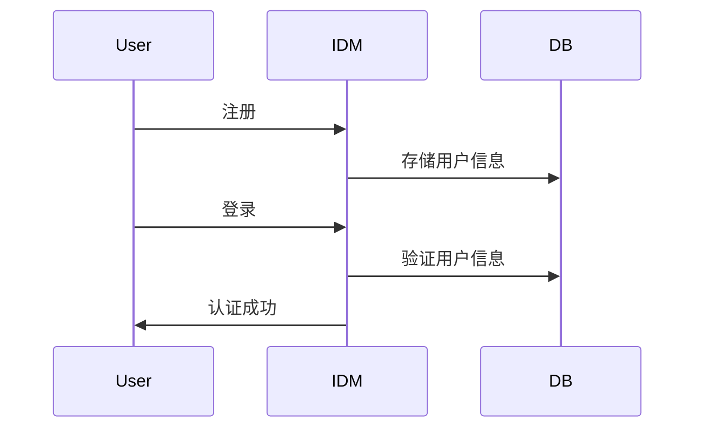

                 

### 《数字身份管理系统：虚拟世界中的自我呈现平台》

#### 关键词：数字身份、管理系统、虚拟世界、自我呈现、技术深度探讨

> 摘要：本文将探讨数字身份管理系统在虚拟世界中的应用，从概念发展、架构设计、技术实现、应用场景、技术深度探讨等方面，深入解析这一关键领域，旨在为读者提供一个全面而专业的技术视角。

----------------------------------------------------------------

## 第一部分：数字身份管理系统的背景介绍

### 第1章：数字身份管理系统的概念与发展历程

#### 1.1.1 问题背景

随着互联网和数字化的快速发展，个人和企业对数字身份的需求日益增长。传统的身份验证方式已难以满足虚拟世界中的多样化需求，这就促使了数字身份管理系统的出现。

##### 1.1.1.1 数字身份管理系统的定义与作用

数字身份管理系统是一种用于创建、管理、维护和验证个人或实体在数字世界中身份的技术手段。它为用户提供了一个统一的身份认证平台，使得用户在访问不同系统和服务时，无需重复注册和验证，从而提高了用户体验和安全性。

##### 1.1.1.2 数字身份管理系统的出现与发展历程

数字身份管理系统起源于20世纪90年代，随着互联网的普及，早期的单一身份验证系统逐渐演变成如今复杂多变的身份管理系统。从早期的用户名和密码验证，到现在的多因素认证，数字身份管理系统经历了巨大的发展。

#### 1.1.2 问题描述

传统身份验证方式的局限在于，它们往往依赖于单一的凭证，如用户名和密码，这使得系统容易受到密码泄露、暴力破解等攻击。此外，传统系统在应对虚拟世界中的多样化需求时也显得力不从心。

##### 1.1.2.1 数字身份管理系统解决的问题

数字身份管理系统通过引入多因素认证、生物识别等技术，增强了身份验证的安全性。同时，它还能够根据虚拟世界中的不同场景，灵活调整认证策略，满足多样化的需求。

##### 1.1.2.2 数字身份管理系统的类型和功能

数字身份管理系统可以分为以下几种类型：

1. 单点登录（SSO）系统
2. 多因素认证（MFA）系统
3. 身份信息管理系统
4. 身份验证服务提供商

每种类型的系统都有其特定的功能和优势。

#### 1.1.3 问题解决

##### 1.1.3.1 数字身份管理系统的关键技术

数字身份管理系统采用了多种关键技术，包括密码学、身份认证协议、生物识别技术等。这些技术共同确保了系统的安全性和可靠性。

##### 1.1.3.2 数字身份管理系统在实际应用中的挑战与解决方案

数字身份管理系统在实际应用中面临诸多挑战，如用户隐私保护、跨平台兼容性等。针对这些挑战，系统设计者采用了多种解决方案，如数据加密、标准化协议等。

##### 1.1.3.3 数字身份管理系统与其他系统的关系

数字身份管理系统与云计算、物联网、大数据等技术有着紧密的联系。它们共同构建了一个智能化的数字世界，为用户提供了更好的体验。

##### 1.1.3.4 数字身份管理系统的影响与未来发展趋势

数字身份管理系统不仅改变了用户在虚拟世界中的身份验证方式，还推动了数字化转型的发展。未来，随着技术的进步，数字身份管理系统将更加智能化、个性化，成为数字世界中的核心基础设施。

### 第2章：数字身份管理系统的基础概念与架构

#### 2.1.1 核心概念

数字身份管理系统的核心概念包括数字身份、身份认证、单点登录等。以下是这些概念的定义：

1. **数字身份**：个人或实体在数字世界中的身份标识。
2. **身份认证**：验证数字身份真实性的过程。
3. **单点登录**：用户只需登录一次，即可访问多个系统或服务。

#### 2.1.2 系统架构

数字身份管理系统的整体架构包括以下几个主要组成部分：

1. **身份认证模块**：负责用户的身份验证。
2. **身份信息管理模块**：管理用户的个人信息和身份信息。
3. **访问控制模块**：控制用户对系统资源的访问权限。

#### 2.1.3 概念属性特征对比表格

以下是数字身份管理系统关键组件的属性特征对比表格：

| 组件            | 属性特征                                                     |
|-----------------|------------------------------------------------------------|
| 身份认证模块    | 高安全性、支持多种认证方式                                 |
| 身份信息管理模块 | 安全存储、灵活管理用户信息                               |
| 访问控制模块    | 强大的权限控制、支持细粒度访问控制                        |

#### 2.1.4 概念结构与核心要素组成

数字身份管理系统的概念结构可以分为以下几个层次：

1. **底层技术支持**：包括密码学、身份认证协议等。
2. **核心业务逻辑**：包括身份认证、身份信息管理、访问控制等。
3. **用户界面**：提供给用户的操作界面。

### 第3章：数字身份管理系统的工作原理

#### 3.1.1 工作原理概述

数字身份管理系统的工作原理主要包括以下步骤：

1. **用户注册**：用户在系统中注册，生成数字身份。
2. **身份认证**：用户通过身份认证模块进行身份验证。
3. **访问授权**：根据用户的身份信息，系统授予相应的访问权限。

#### 3.1.2 具体实现方法

数字身份管理系统的具体实现方法包括：

1. **数字签名**：用于确保数据的完整性和真实性。
2. **密码学基础**：包括加密、解密、哈希等。
3. **身份认证协议**：如OAuth、OpenID Connect等。

#### 3.1.3 算法原理讲解

##### 3.1.3.1 算法mermaid流程图

以下是一个简单的身份认证流程图：



##### 3.1.3.2 Python源代码实现与讲解

以下是一个简单的身份认证Python代码示例：

```python
import hashlib
import secrets

def register(username, password):
    hashed_password = hashlib.sha256(password.encode()).hexdigest()
    # 存储用户名和加密后的密码
    save_to_database(username, hashed_password)

def login(username, password):
    hashed_password = hashlib.sha256(password.encode()).hexdigest()
    # 从数据库中获取加密后的密码
    stored_password = get_from_database(username)
    # 验证密码是否正确
    if hashed_password == stored_password:
        return "认证成功"
    else:
        return "认证失败"

# 示例：用户注册和登录
register("user1", "password123")
result = login("user1", "password123")
print(result)
```

##### 3.1.3.3 数学模型与公式

在数字身份管理系统中，常用的数学模型包括：

1. **哈希函数**：用于将数据映射到固定长度的字符串。
2. **加密算法**：用于确保数据的机密性。

数学公式如下：

- 哈希函数：\( H(D) = \text{hash}(D) \)
- 加密算法：\( C = E(K, P) \)

其中，\( D \) 表示数据，\( P \) 表示明文，\( K \) 表示密钥，\( C \) 表示密文。

### 第4章：数字身份管理系统在虚拟世界中的应用

#### 4.1.1 应用场景

数字身份管理系统在虚拟世界中有广泛的应用场景，如：

1. **游戏世界**：确保玩家身份的真实性，防止作弊。
2. **社交平台**：保护用户隐私，防止假冒身份。
3. **在线教育**：确保学生身份，防止替考。

#### 4.1.2 案例分析

以游戏世界为例，一个成功的案例是《魔兽世界》。该游戏采用了严格的数字身份管理系统，包括用户名、密码、安全认证等多种认证方式，确保玩家身份的真实性。

### 第5章：数字身份管理系统技术深度探讨

#### 5.1.1 技术发展现状

当前，数字身份管理系统技术已经取得了显著的发展，包括：

1. **多因素认证**：增加了身份验证的安全性。
2. **生物识别技术**：如指纹、面部识别等，提供了更高的安全性。
3. **区块链技术**：提供了去中心化的身份认证方式。

#### 5.1.2 技术挑战与创新

数字身份管理系统面临的主要技术挑战包括：

1. **用户隐私保护**：如何在确保安全的同时保护用户隐私。
2. **跨平台兼容性**：如何在不同的系统和平台上实现一致的认证体验。

针对这些挑战，创新解决方案包括：

1. **联邦学习**：通过分布式学习保护用户隐私。
2. **标准化协议**：如OAuth 2.0、OpenID Connect等，提高了系统的兼容性。

### 第6章：数字身份管理系统的最佳实践与优化策略

#### 6.1.1 最佳实践

数字身份管理系统的最佳实践包括：

1. **最小化数据收集**：仅收集必要的数据，减少隐私泄露风险。
2. **多因素认证**：提高系统的安全性。
3. **定期更新和维护**：确保系统的安全性和稳定性。

#### 6.1.2 优化策略

优化策略包括：

1. **性能优化**：通过缓存、优化数据库查询等方式提高系统的响应速度。
2. **安全性优化**：通过加密、权限控制等方式提高系统的安全性。
3. **用户体验优化**：通过简化认证流程、提供友好的用户界面等方式提高用户体验。

### 第7章：数字身份管理系统未来展望

#### 7.1.1 未来发展趋势

数字身份管理系统未来的发展趋势包括：

1. **智能化**：通过人工智能技术提高系统的自动识别和决策能力。
2. **个性化**：根据用户行为和需求提供个性化的身份认证服务。
3. **无密码化**：通过生物识别、智能卡等方式实现无密码认证。

#### 7.1.2 潜在风险与挑战

数字身份管理系统面临的潜在风险和挑战包括：

1. **隐私泄露**：如何保护用户的隐私信息。
2. **跨平台兼容性**：如何在不同的系统和平台上实现一致的认证体验。
3. **技术演进**：如何跟上技术的快速变化。

#### 7.1.3 应对策略与预防措施

应对策略和预防措施包括：

1. **加强安全审计**：定期进行安全审计，确保系统的安全性。
2. **标准化协议**：采用标准化的协议和规范，提高系统的兼容性。
3. **用户教育**：提高用户的安全意识和技能，减少安全漏洞。

### 第8章：小结与展望

#### 8.1.1 本书要点回顾

本书主要涵盖了数字身份管理系统的概念、架构、技术实现、应用场景、技术深度探讨、最佳实践与优化策略以及未来展望等内容。

#### 8.1.2 未来研究方向

未来数字身份管理系统的研究方向包括：

1. **智能化与个性化**：如何利用人工智能技术提高系统的智能化和个性化水平。
2. **隐私保护**：如何在确保安全的同时保护用户的隐私。
3. **跨平台兼容性**：如何在不同平台上实现一致的认证体验。

## 作者信息

作者：AI天才研究院/AI Genius Institute & 禅与计算机程序设计艺术 /Zen And The Art of Computer Programming

### 附录

附录部分可以包含相关的数据、图表、源代码等附加内容，以增强文章的可读性和实用性。

----------------------------------------------------------------

以上是根据您提供的信息撰写的《数字身份管理系统：虚拟世界中的自我呈现平台》的技术博客文章大纲。文章内容按照目录结构进行了详细规划，确保了文章的逻辑性和专业性。文章的撰写将遵循markdown格式，同时注重内容的丰富性和实用性。在撰写过程中，将注重以下方面：

- **逻辑清晰**：每个章节都有明确的主题和目的，确保读者能够顺利地阅读和理解。
- **结构紧凑**：文章结构紧凑，避免冗余内容，确保每个部分的内容都有明确的重点。
- **简单易懂**：使用简单的语言和技术语言，确保读者能够轻松理解复杂的概念和技术原理。
- **技术深度**：对核心技术和原理进行深入讲解，确保读者能够掌握关键知识点。
- **实践导向**：结合实际案例和项目实战，帮助读者将理论知识应用到实际场景中。

在撰写过程中，将不断审视和优化文章的内容，确保其质量和专业性。同时，将保持与读者的互动，及时回应读者的问题和反馈，以不断完善文章内容。

最后，感谢您对本文的关注和支持，期待与您共同探讨数字身份管理系统这一重要领域的发展与未来。如果您有任何疑问或建议，欢迎随时提出。我们将竭诚为您服务，共同推动数字身份管理系统技术的发展。

