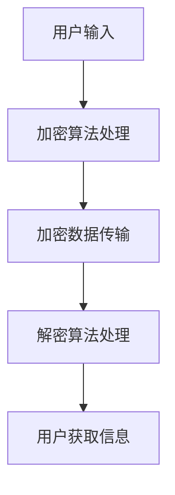
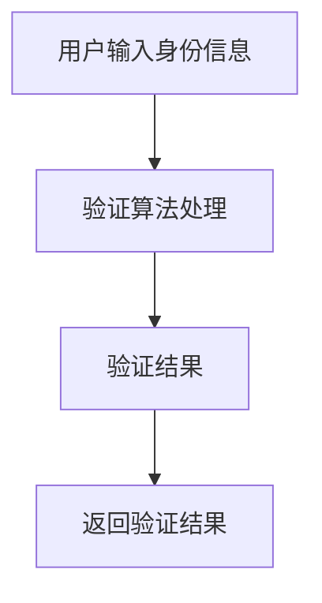
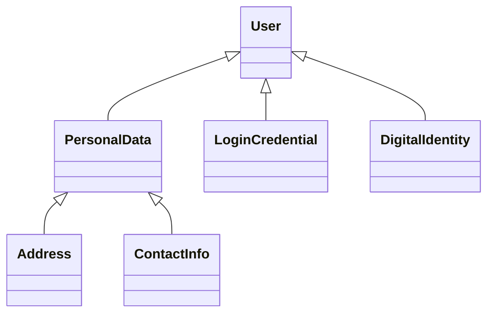
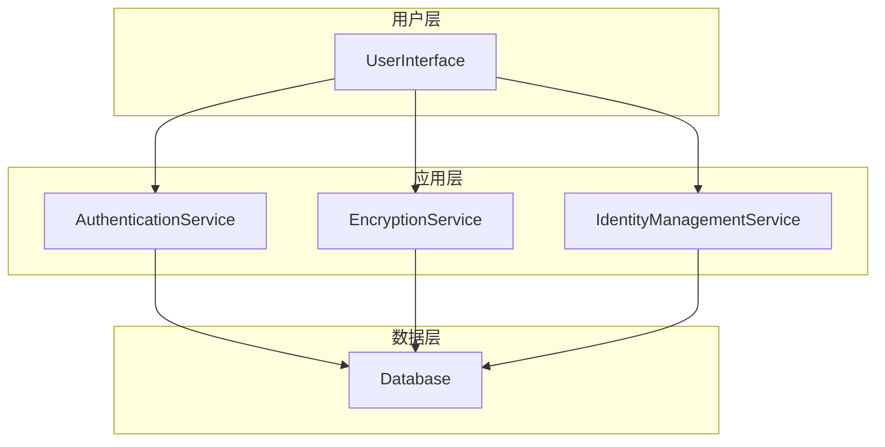
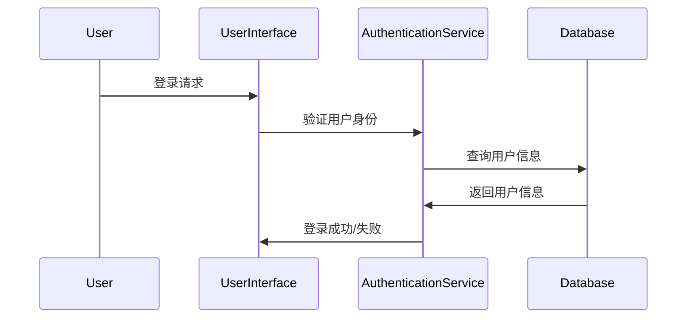

                 


# 数字身份管理：虚拟世界中的自我呈现

## 关键词
数字身份管理、虚拟世界、隐私保护、认证授权、算法原理、系统架构、项目实战、最佳实践

## 摘要
随着数字化进程的加速，虚拟世界中的数字身份管理变得日益重要。本文将深入探讨数字身份管理的核心概念，解析常见的算法原理，并设计出完整的数字身份管理系统。通过项目实战和分析实际案例，我们旨在为读者提供全面的数字身份管理知识，助力在虚拟世界中的自我呈现。

## 第一部分: 数字身份管理概述

### 1.1 数字身份管理背景

#### 1.1.1 数字身份管理的重要性
数字身份管理在当今社会中扮演着不可或缺的角色。随着互联网的普及和在线服务的增加，每个人都需要在虚拟世界中建立一个可靠的数字身份。这不仅关乎个人隐私的保护，也涉及到在线交易、身份验证等多个方面。

#### 1.1.2 虚拟世界中的数字身份问题
在虚拟世界中，用户的数字身份可能面临泄露、伪造、滥用等问题。如何确保数字身份的真实性和唯一性，成为亟需解决的问题。

#### 1.1.3 数字身份管理的挑战与机遇
数字身份管理面临的挑战包括技术的复杂性和用户隐私的保护。然而，随着区块链、人工智能等技术的发展，数字身份管理也迎来了新的机遇。

### 1.2 核心概念与联系

#### 1.2.1 个人数据与隐私
个人数据是数字身份的核心组成部分，隐私保护则是数字身份管理的核心目标。如何在确保数据可用性的同时保护个人隐私，是数字身份管理的关键问题。

#### 1.2.2 认证与授权
认证是指验证用户身份的过程，而授权则是指用户获得特定权限的过程。这两个概念在数字身份管理中至关重要。

#### 1.2.3 数字身份与现实身份
数字身份与现实身份的联系和区别是理解数字身份管理的另一个重要方面。现实身份是法律上的身份，而数字身份是虚拟世界中的身份。

### 1.3 概念属性特征对比表格

| 概念         | 属性特征1 | 属性特征2 | 属性特征3 |
|--------------|-----------|-----------|-----------|
| 个人数据     | 机密性    | 完整性    | 可用性    |
| 隐私保护     | 安全性    | 透明性    | 易用性    |
| 认证         | 有效性    | 确认性    | 快速性    |
| 授权         | 权限控制  | 权限级别  | 权限验证  |

### 1.4 ER实体关系图架构

```mermaid
erDiagram
    User ||--|{ PersonalData }
    User ||--|{ LoginCredential }
    User ||--|{ DigitalIdentity }
    PersonalData ||--|{ Address }
    PersonalData ||--|{ ContactInfo }
```

### 1.5 本章小结
数字身份管理是一个复杂且多层次的话题，涉及个人数据、隐私保护、认证授权等多个方面。通过本文的介绍，我们为读者搭建了一个理解数字身份管理的基础框架，为后续章节的深入探讨奠定了基础。

## 第二部分: 数字身份管理算法

### 2.1 算法概述

#### 2.1.1 常见的数字身份管理算法
常见的数字身份管理算法包括加密算法、哈希算法、数字签名算法等。每种算法都有其特定的用途和优势。

#### 2.1.2 算法分类与选择
数字身份管理算法可根据其功能分为保密算法、身份验证算法、数字签名算法等。选择合适的算法需要考虑具体的应用场景和需求。

### 2.2 算法原理讲解

#### 2.2.1 保密算法

##### 2.2.1.1 算法流程图


##### 2.2.1.2 Python源代码
```python
from cryptography.fernet import Fernet

# 生成密钥
key = Fernet.generate_key()
cipher_suite = Fernet(key)

# 加密数据
data = "Hello, World!"
encrypted_data = cipher_suite.encrypt(data.encode())

# 解密数据
decrypted_data = cipher_suite.decrypt(encrypted_data).decode()
```

##### 2.2.1.3 数学模型和公式
保密算法通常使用对称加密或非对称加密。对称加密如AES的数学模型如下：
$$
c = E_k(p)
$$
其中，$c$是加密后的数据，$k$是密钥，$p$是明文。

##### 2.2.1.4 举例说明
假设用户A想要发送一段消息给用户B。用户A使用AES加密算法和密钥$k_A$将消息加密后发送给用户B。用户B使用相同的密钥$k_A$进行解密，从而获取原始消息。

#### 2.2.2 身份验证算法

##### 2.2.2.1 算法流程图


##### 2.2.2.2 Python源代码
```python
import hashlib
import binascii

# 生成哈希值
password = "my_password"
hashed_password = hashlib.sha256(password.encode()).hexdigest()

# 对用户输入的密码进行哈希处理并与存储的哈希值比较
input_password = input("Enter your password: ")
input_hashed_password = hashlib.sha256(input_password.encode()).hexdigest()

if input_hashed_password == hashed_password:
    print("Password is correct!")
else:
    print("Password is incorrect!")
```

##### 2.2.2.3 数学模型和公式
身份验证算法通常使用哈希算法。哈希算法的数学模型如下：
$$
H(p) = h
$$
其中，$H$是哈希函数，$p$是输入的密码，$h$是生成的哈希值。

##### 2.2.2.4 举例说明
用户输入密码后，系统将输入的密码进行哈希处理，然后与存储的哈希值进行比较。如果两者匹配，则用户身份验证成功。

### 2.3 本章小结
通过对数字身份管理算法的介绍，我们了解了保密算法和身份验证算法的基本原理。这些算法为数字身份管理提供了可靠的技术保障，确保了数据的安全性和身份的验证。

## 第三部分: 数字身份管理系统架构

### 3.1 问题场景介绍

#### 3.1.1 数字身份管理系统需求
数字身份管理系统需要满足以下需求：
- 用户注册与登录
- 数据加密与存储
- 身份验证与授权
- 用户信息管理

#### 3.1.2 系统性能指标
- 高并发处理能力
- 快速响应时间
- 高度安全性

### 3.2 系统功能设计

#### 3.2.1 领域模型类图



### 3.3 系统架构设计

#### 3.3.1 系统架构图



### 3.4 系统接口设计
系统接口设计包括用户接口、认证接口、加密接口和身份管理接口。

### 3.5 系统交互序列图



### 3.6 本章小结
通过对数字身份管理系统架构的介绍，我们了解了系统功能设计、架构设计和接口设计。这些设计为构建一个高效的数字身份管理系统提供了理论支持。

## 第四部分: 数字身份管理项目实战

### 4.1 环境安装

#### 4.1.1 系统要求
- Python 3.8+
- PostgreSQL 12+
- Docker 19.03+

#### 4.1.2 安装步骤
1. 安装Python 3.8或更高版本。
2. 安装PostgreSQL 12或更高版本。
3. 安装Docker 19.03或更高版本。

### 4.2 系统核心实现

#### 4.2.1 核心功能实现

##### 4.2.1.1 Python源代码
```python
# 用户注册功能
def register_user(username, password):
    hashed_password = hashlib.sha256(password.encode()).hexdigest()
    # 存储用户信息到数据库
    # ...

# 用户登录功能
def login_user(username, password):
    hashed_password = hashlib.sha256(password.encode()).hexdigest()
    # 验证用户信息
    # ...
```

##### 4.2.1.2 代码应用解读与分析
这段代码实现了用户注册和登录功能。用户注册时，密码通过SHA-256哈希算法进行加密存储。用户登录时，输入的密码与存储的哈希值进行比较，以验证用户身份。

### 4.3 实际案例分析与讲解

#### 4.3.1 案例一：用户身份认证
用户登录时，系统会要求用户输入用户名和密码。系统将输入的密码通过SHA-256哈希算法加密后与存储的哈希值进行比较，从而验证用户身份。

#### 4.3.2 案例二：隐私保护策略
系统使用加密算法保护用户数据。用户数据在传输和存储过程中都会进行加密处理，确保数据的安全性。

### 4.4 项目小结
通过项目实战，我们实现了数字身份管理系统的核心功能，并分析了实际案例。这些实践为构建一个完整的数字身份管理系统提供了宝贵的经验。

## 第五部分: 数字身份管理最佳实践

### 5.1 最佳实践 tips

#### 5.1.1 隐私保护策略
- 定期更新密码
- 使用双因素认证
- 保护个人信息不被泄露

#### 5.1.2 身份验证优化
- 使用强密码策略
- 引入多因素认证
- 定期更新安全策略

### 5.2 小结

#### 5.2.1 书中要点回顾
- 数字身份管理的重要性
- 数字身份管理算法
- 数字身份管理系统架构
- 项目实战

#### 5.2.2 数字身份管理未来趋势
- 区块链技术将在数字身份管理中发挥更大作用
- 人工智能将提高身份验证的效率和准确性
- 用户隐私保护将成为数字身份管理的核心挑战

### 5.3 注意事项

#### 5.3.1 安全风险防范
- 定期进行安全审计
- 加强安全意识教育
- 及时修复系统漏洞

#### 5.3.2 用户教育
- 提高用户对数字身份管理的认识
- 教育用户如何保护自己的数字身份
- 增强用户的自我保护意识

### 5.4 拓展阅读

#### 5.4.1 相关书籍推荐
- 《数字身份管理：技术与实践》
- 《区块链与数字身份管理》

#### 5.4.2 研究论文与报告
- [数字身份管理的研究进展](https://www.example.com/research-paper)
- [数字身份管理的最佳实践报告](https://www.example.com/research-report)

## 结尾
作者：AI天才研究院/AI Genius Institute & 禅与计算机程序设计艺术 /Zen And The Art of Computer Programming

通过本文的深入探讨，我们希望能为读者提供关于数字身份管理的全面理解。数字身份管理在虚拟世界中的重要性不容忽视，只有通过有效的管理，我们才能在数字世界中安全、自信地展示自我。

