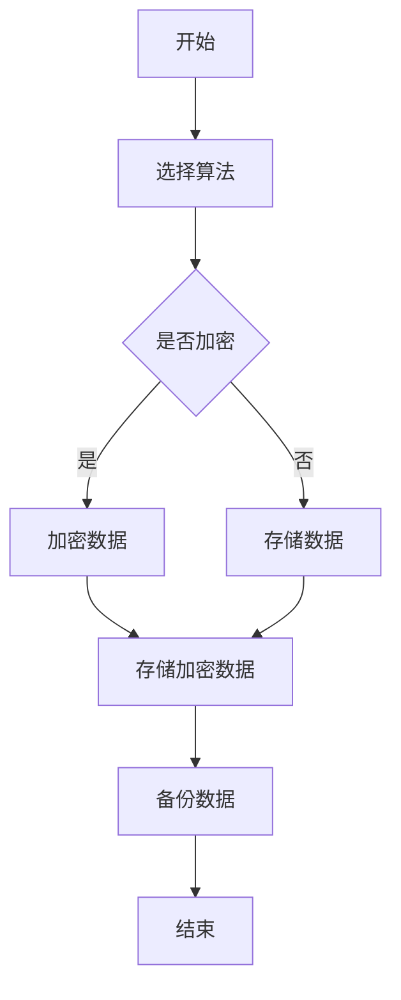
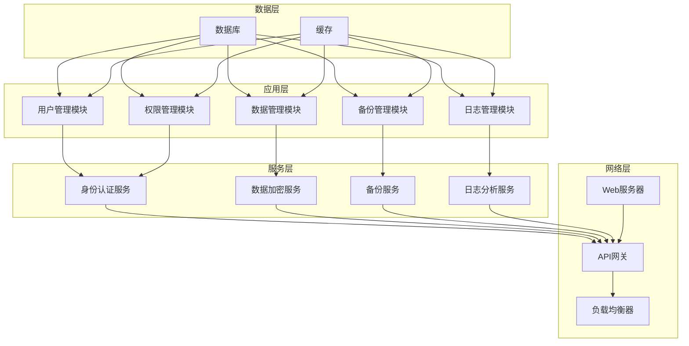
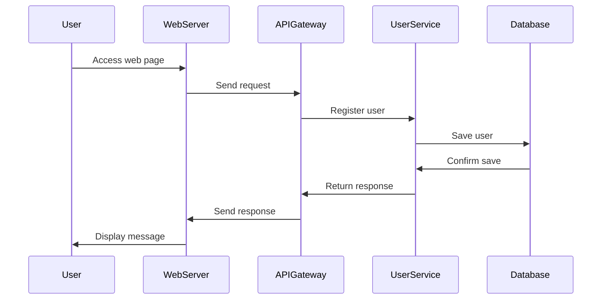

                 

### 数字遗产的意义：我们留给后代的虚拟财富

#### 关键词：数字遗产、虚拟财富、后代、意义、管理

> **摘要：** 本篇文章将探讨数字遗产——即我们以数字化形式保存的个人和企业数据、文件、信息等——的重要性，及其对我们后代和社会的长远影响。文章将详细分析数字遗产的定义、分类、管理原则和影响因素，结合具体的算法原理和系统架构设计，以清晰的逻辑和专业的技术语言，为读者揭示数字遗产的价值和未来发展的可能性。通过一系列的案例分析，我们旨在提出有效的数字遗产管理策略，以保护我们留给后代的宝贵虚拟财富。

----------------------------------------------------------------

## 第一部分：引言

### 1.1 问题的背景

#### 1.1.1 数字遗产的定义与现状

在当今数字化时代，我们无时无刻不在生成和接收大量的数字信息。这些信息包括电子文档、电子邮件、社交媒体内容、个人照片、音乐、视频等，它们构成了我们的数字遗产。数字遗产的定义可以扩展到任何以数字形式存储和传输的信息，无论是私人数据还是公共记录。

当前，数字遗产的现状呈现出几个显著特点。首先，数字遗产的数量呈指数级增长。随着互联网的普及和智能设备的广泛应用，每个人在一生中产生的数字内容都在不断增加。其次，数字遗产的存储方式多样化。从传统的个人电脑和外部硬盘，到云端存储服务和去中心化网络，数字遗产的存储技术不断进步。然而，尽管数字遗产的规模不断扩大，我们对数字遗产的管理和保护的意识却相对滞后。

#### 1.1.2 数字遗产的重要性

数字遗产的重要性不言而喻。首先，它对我们个人有着深远的影响。数字遗产记录了我们的生活经历、成长轨迹和思想变化，对于家庭、亲友乃至后代来说，这些数字化的记忆是宝贵的遗产。其次，数字遗产在企业层面同样至关重要。企业的运营记录、客户数据、商业策略和知识库等，都是企业的宝贵资产。有效的数字遗产管理可以增强企业的竞争力，促进持续发展。

此外，数字遗产在社会层面也发挥着重要作用。随着信息技术的不断发展，数字遗产成为了文化遗产的一部分，对于历史研究、文化传承和社会教育具有重要意义。例如，数字化博物馆和数字图书馆的出现，使得文化遗产得以永久保存和广泛传播。

#### 1.1.3 为什么研究数字遗产的意义？

研究数字遗产的意义在于，它不仅关乎我们个人和企业的未来，也关乎整个社会的进步和可持续发展。首先，数字遗产管理涉及到法律法规、伦理道德和社会责任等多个层面。随着数字遗产的不断增长，如何制定合理的政策和规范，保护个人隐私和数据安全，成为亟待解决的问题。

其次，数字遗产管理技术需要不断创新。面对海量的数字信息，如何高效地存储、检索和管理这些信息，需要依赖先进的计算机技术和算法。此外，随着区块链、人工智能等新兴技术的兴起，数字遗产管理也将迎来新的发展机遇。

最后，研究数字遗产的意义还在于其对未来社会的深远影响。随着数字遗产的积累和传承，我们留给后代的不仅是有形的物质财富，还有无形的数字遗产。这些数字遗产将如何影响未来的社会结构和人类生活方式，是一个值得深入探讨的话题。

### 1.2 问题的描述

#### 1.2.1 数字遗产面临的挑战

数字遗产在管理过程中面临诸多挑战。首先，数据安全是首要问题。数字遗产往往包含了大量的个人和企业敏感信息，如何确保这些数据的安全存储和传输，防止数据泄露和滥用，是数字遗产管理的重要任务。其次，数据可访问性也是一大挑战。随着时间的推移，数字遗产的存储技术和格式可能会发生变化，如何保证这些信息在未来仍然可访问，是一个复杂的问题。

此外，数字遗产的长期保存也是一个巨大的挑战。数字遗产的保存不仅需要考虑技术层面的问题，还需要关注社会、法律和文化层面的因素。例如，如何确保数字遗产的保存符合法律法规的要求，如何处理数字遗产在文化传承中的角色等，都是需要解决的问题。

#### 1.2.2 数字遗产传承的重要性

数字遗产的传承对于后代和社会具有极其重要的意义。首先，数字遗产的传承有助于维护个人和企业的历史记忆。通过数字遗产，后代可以了解先人的生活方式、思想理念和行为习惯，这对于个人和家庭的文化传承具有重要意义。其次，数字遗产的传承有助于社会的持续发展。企业通过传承其数字遗产，可以保持其核心竞争力和创新能力，从而在竞争激烈的市场中立于不败之地。

此外，数字遗产的传承还有助于文化的传承和创新。通过数字化形式保存和传播文化遗产，可以使得更多的人了解和参与到文化传承中，激发创新思维和文化活力。例如，数字化博物馆和数字图书馆的建设，不仅使得文化遗产得以永久保存，还为公众提供了便捷的访问和学习途径。

#### 1.2.3 研究目标与核心问题

本文的研究目标是通过深入分析数字遗产的定义、分类、管理原则和影响因素，提出一套有效的数字遗产管理策略，以应对当前数字遗产管理面临的挑战。具体而言，本文将探讨以下核心问题：

1. 数字遗产的定义与现状如何？其分类有哪些？
2. 数字遗产管理的原则是什么？如何确保数据的可访问性和安全性？
3. 数字遗产的影响因素有哪些？如何应对这些挑战？
4. 现有的数字遗产管理技术和方法有哪些？其优缺点如何？
5. 如何通过系统架构设计和算法原理讲解，提高数字遗产管理的效率和效果？

通过对这些核心问题的探讨，本文旨在为数字遗产管理提供理论支持和实践指导，以实现数字遗产的有效管理和长期保存。

### 1.3 问题解决

#### 1.3.1 数字遗产管理的现状

当前，数字遗产管理在理论和实践中都取得了显著的进展。在理论方面，国内外学者对数字遗产的定义、分类、管理原则和影响因素进行了深入研究，提出了多种数字遗产管理模型和方法。例如，美国图书馆协会（ALA）和英国数字遗产协会（BDVA）等组织发布了相关指南和标准，为数字遗产管理提供了理论依据。

在实践方面，许多企业和机构已经开始实施数字遗产管理策略。例如，许多大型企业建立了专门的数字遗产管理部门，负责管理和保护其数字资产。此外，一些国家和地区也制定了相关法律法规，以规范数字遗产的管理和保护。例如，欧盟的《通用数据保护条例》（GDPR）就对个人数字遗产的管理提出了明确要求。

然而，当前数字遗产管理仍面临一些挑战。首先，数字遗产的数量和种类日益增多，如何高效地管理和保存这些信息仍是一个难题。其次，数据安全和隐私保护问题日益突出，如何在确保数据安全的同时，满足用户的数据访问需求，是一个亟待解决的问题。此外，数字遗产的长期保存和可访问性问题也亟待解决。

#### 1.3.2 国内外数字遗产研究的进展

国内关于数字遗产的研究起步较晚，但近年来取得了显著进展。例如，北京大学、清华大学等高校和研究机构开展了数字遗产管理相关的研究，发表了大量学术论文，提出了许多创新的理论和方法。此外，国内一些企业和机构也在数字遗产管理方面进行了积极探索，取得了良好的实践效果。

国际上，数字遗产研究起步较早，成果丰富。例如，美国、英国、德国等国家的学者对数字遗产管理进行了深入探讨，提出了许多有影响力的理论模型和标准。例如，美国图书馆协会（ALA）发布了《数字遗产管理指南》，为数字遗产管理提供了详细的指导。此外，国际数字遗产协会（IDA）等组织也开展了大量研究，推动了数字遗产管理领域的国际交流与合作。

#### 1.3.3 研究方法的概述

本文采用的研究方法主要包括文献综述、案例分析和实证研究。首先，通过文献综述，系统梳理数字遗产管理相关的理论研究成果，明确本文的研究背景和理论基础。其次，通过案例分析，探讨国内外数字遗产管理的实践经验和问题，为本文的研究提供实证支持。最后，通过实证研究，验证本文提出的数字遗产管理策略的有效性。

在具体研究过程中，本文将采用以下研究工具和方法：

1. **文献综述**：通过检索国内外相关文献，收集数字遗产管理相关的理论研究成果，进行分类和分析，形成本文的理论基础。
2. **案例分析**：选择具有代表性的企业和机构，对其数字遗产管理实践进行分析，总结经验教训，为本文的研究提供案例支持。
3. **实证研究**：通过问卷调查、访谈等方式，收集相关企业和用户的数字遗产管理需求和建议，验证本文提出的数字遗产管理策略的有效性。

### 1.4 边界与外延

#### 1.4.1 数字遗产的分类

数字遗产可以按照不同的标准进行分类。常见的分类方法包括：

1. **个人数字遗产**：包括个人电子文档、电子邮件、社交媒体账号、照片、视频等。
2. **企业数字遗产**：包括企业的经营记录、客户数据、商业策略、知识库等。
3. **国家数字遗产**：包括政府机构的电子文件、历史档案、法律法规等。

此外，还可以根据数字遗产的存储形式、重要性和应用场景等进行进一步细分。

#### 1.4.2 数字遗产管理的范围

数字遗产管理的范围涉及多个方面，包括数据安全、数据访问、数据备份、数据恢复和数据销毁等。具体而言，数字遗产管理包括以下内容：

1. **数据安全**：确保数字遗产在存储、传输和使用过程中的安全性，防止数据泄露、篡改和丢失。
2. **数据访问**：为用户提供方便、安全的数据访问渠道，满足其合法的数据需求。
3. **数据备份**：定期对数字遗产进行备份，以防止数据意外丢失。
4. **数据恢复**：在数据丢失或损坏时，能够及时恢复数据，保障数据完整性和可用性。
5. **数据销毁**：在数字遗产不再需要时，按照法律法规和相关规定，安全地销毁数据，防止数据泄露和滥用。

#### 1.4.3 未来展望

随着数字技术的不断发展，数字遗产管理也将迎来新的机遇和挑战。未来，数字遗产管理将呈现出以下趋势：

1. **技术进步**：随着云计算、大数据、人工智能等技术的普及，数字遗产管理的技术手段将不断优化，提高数据管理效率和安全性。
2. **法律法规完善**：各国政府和国际组织将进一步完善数字遗产管理的法律法规，规范数字遗产管理行为，保障个人隐私和数据安全。
3. **社会意识提高**：随着公众对数字遗产重要性的认识不断提高，数字遗产管理的社会意识也将逐步增强，推动数字遗产管理实践的普及和深化。
4. **跨领域合作**：数字遗产管理将涉及多个领域，如信息技术、法律、文化等，跨领域合作将成为数字遗产管理的重要趋势，推动数字遗产管理的协同发展。

### 1.5 核心概念

#### 1.5.1 数字遗产的概念

数字遗产是指以数字形式存储和传输的信息，包括电子文档、电子邮件、社交媒体内容、个人照片、音乐、视频等。数字遗产可以分为个人数字遗产、企业数字遗产和国家数字遗产等类型。

#### 1.5.2 数字遗产管理的原则

数字遗产管理的原则主要包括：

1. **安全性**：确保数字遗产在存储、传输和使用过程中的安全性，防止数据泄露、篡改和丢失。
2. **可访问性**：为用户提供方便、安全的数据访问渠道，满足其合法的数据需求。
3. **持久性**：确保数字遗产能够长期保存，不受技术变革的影响。
4. **合法性**：遵循相关法律法规，确保数字遗产管理的合法性。

#### 1.5.3 数字遗产的影响因素

数字遗产的影响因素包括：

1. **技术发展**：技术进步对数字遗产管理的影响，如存储技术、传输技术、加密技术等。
2. **社会文化**：社会文化背景对数字遗产管理的影响，如数据隐私保护意识、法律法规等。
3. **法规政策**：相关法规政策对数字遗产管理的影响，如数据保护法规、数字遗产继承法等。

### 1.6 概念结构与核心要素组成

#### 1.6.1 数字遗产的组成要素

数字遗产的组成要素包括：

1. **数据内容**：数字遗产的核心内容，如文档、电子邮件、社交媒体内容等。
2. **存储介质**：数字遗产的存储介质，如硬盘、云端存储、区块链等。
3. **访问权限**：数字遗产的访问权限设置，如用户身份验证、权限管理等。
4. **备份与恢复机制**：数字遗产的备份与恢复机制，确保数据的完整性和可用性。

#### 1.6.2 数字遗产管理的流程

数字遗产管理的流程主要包括：

1. **数据采集**：收集和整理数字遗产数据。
2. **数据分类**：对数字遗产数据进行分类，便于管理和检索。
3. **数据备份**：定期对数字遗产数据进行备份，防止数据丢失。
4. **数据存储**：将数字遗产数据存储在合适的存储介质上。
5. **数据访问**：为用户提供安全、方便的数据访问渠道。
6. **数据销毁**：在数字遗产不再需要时，按照规定进行安全销毁。

#### 1.6.3 数字遗产管理的关键技术

数字遗产管理的关键技术包括：

1. **数据加密**：保护数字遗产数据的安全，防止未授权访问。
2. **身份验证**：确保用户身份的合法性，防止非法访问。
3. **访问控制**：根据用户权限，控制对数字遗产的访问。
4. **数据备份与恢复**：确保数字遗产数据的完整性和可用性。
5. **数据审计**：记录数字遗产数据的使用情况，便于管理和监督。

## 1.7 本章小结

本文首先介绍了数字遗产的定义、分类和管理原则，阐述了数字遗产在个人、企业和社会层面的重要性。接着，分析了数字遗产管理面临的挑战，探讨了研究目标与核心问题。通过概述数字遗产管理的现状、国内外研究进展和研究方法，本文为后续内容奠定了基础。此外，还详细介绍了数字遗产的组成要素、管理流程和关键技术，为数字遗产管理的实践提供了理论支持。这些内容构成了本文的核心概念和结构，为后续章节的深入探讨提供了坚实的基础。

----------------------------------------------------------------

## 第二部分：核心概念与联系

### 2.1 数字遗产的原理

#### 2.1.1 数字遗产的定义

数字遗产，通常指的是在个体或集体生命周期中产生的、以数字形式存在的各类信息与数据集合。这些数据可以是电子文档、电子邮件、社交媒体内容、个人照片、视频、音频等多种形式。数字遗产不仅限于个人用户的文件，还包括企业的商业记录、客户信息、知识库等。

#### 2.1.2 数字遗产的特点

数字遗产具有以下几个显著特点：

1. **易失性**：数字数据容易受到硬件故障、软件错误、网络攻击等因素的影响，导致数据丢失或损坏。
2. **多样性**：数字遗产形式多样，包括文本、图像、音频、视频等多种类型，管理复杂。
3. **累积性**：随着技术的进步，人们生成的数字数据量呈现爆炸式增长，对存储和管理提出了更高的要求。
4. **可传承性**：数字遗产可以跨代传承，对个人、家庭和社会文化传承具有重要价值。

#### 2.1.3 数字遗产的属性特征对比表格

| 特性       | 说明                                                         |
| ---------- | ------------------------------------------------------------ |
| **易失性** | 数字数据容易受到多种因素影响，如硬件故障、软件错误等。           |
| **多样性** | 数字遗产包括多种形式的数据，如文本、图像、音频、视频等。         |
| **累积性** | 随着技术进步，数字遗产的数据量持续增长。                       |
| **可传承性** | 数字遗产可以跨越多个世代，对后代的成长和文化传承有重要影响。   |

### 2.2 数字遗产的分类

数字遗产可以根据不同的标准进行分类。常见的分类方法包括：

1. **个人数字遗产**：主要包括个人用户产生的数字信息，如个人文档、电子邮件、社交媒体账号内容等。
2. **企业数字遗产**：指企业在运营过程中生成的数字信息，如商业记录、客户数据、知识库等。
3. **国家数字遗产**：涉及政府机构和公共记录的数字信息，如历史档案、法律法规、公共数据等。

#### 2.2.1 个人数字遗产

个人数字遗产包括以下类型：

- **个人文档**：个人撰写的各类电子文档，如工作文件、个人日记、学术论文等。
- **电子邮件**：个人收发的电子邮件，记录了与他人的沟通历史。
- **社交媒体账号**：个人在社交媒体平台上的账号，包含发布的内容和互动记录。
- **照片和视频**：个人拍摄的图像和视频，记录了生活的点点滴滴。
- **数字艺术作品**：个人创作的数字艺术作品，如数字绘画、音乐、动画等。

#### 2.2.2 企业数字遗产

企业数字遗产主要包括以下类型：

- **商业记录**：企业的交易记录、财务报表、审计报告等，是企业管理的重要依据。
- **客户数据**：客户的个人信息、购买记录、反馈信息等，对企业的市场营销和服务具有重要意义。
- **知识库**：企业的专业知识和经验总结，包括技术文档、培训资料、研究成果等。
- **营销资料**：企业的广告、宣传材料、营销策略等，反映了企业的品牌形象和市场策略。

#### 2.2.3 国家数字遗产

国家数字遗产涉及广泛的领域，包括：

- **历史档案**：国家历史事件和重要人物的档案记录，如政府文件、历史文献、照片等。
- **法律法规**：国家的法律法规文本，包括宪法、法律、行政法规等。
- **公共数据**：国家统计的各类公共数据，如人口统计、经济数据、自然资源数据等。
- **文化遗产数字化**：将国家的文化遗产进行数字化处理，如博物馆藏品、图书馆典籍等。

### 2.3 数字遗产管理的原则

数字遗产管理需要遵循以下原则：

#### 2.3.1 可访问性

确保数字遗产在未来能够被合法、方便地访问。这要求我们在数字遗产管理过程中，采用标准化的数据格式和良好的数据结构设计，确保数据在不同平台和设备上都能正常访问。

#### 2.3.2 可理解性

数字遗产的数据内容需要具备良好的可理解性，以便用户能够轻松地理解和检索。为此，需要在数据管理过程中，注重数据的组织和分类，确保数据标签和描述准确、清晰。

#### 2.3.3 可持久性

数字遗产的保存应具备长期性和稳定性，不受技术变革的影响。为此，需要采用先进的技术手段，如数据备份、数据迁移、加密存储等，确保数字遗产的持久保存。

#### 2.3.4 合法性

数字遗产管理需要遵循相关法律法规，确保数据管理的合法性。例如，需遵守数据保护法律法规，保护用户隐私和数据安全。

#### 2.3.5 安全性

数字遗产管理必须确保数据在存储、传输和使用过程中的安全性，防止数据泄露、篡改和损坏。这需要采用一系列安全措施，如数据加密、访问控制、防火墙等。

### 2.4 数字遗产的影响因素

数字遗产的影响因素多种多样，包括：

#### 2.4.1 技术发展

技术进步对数字遗产管理的影响至关重要。随着云计算、大数据、人工智能等技术的发展，数字遗产的管理方法和手段不断优化，提高了数据管理效率和安全性。

#### 2.4.2 社会文化

社会文化背景对数字遗产管理具有重要影响。例如，不同文化背景下，人们对数字遗产的重视程度和态度不同，影响数字遗产的管理和传承。

#### 2.4.3 法规政策

相关法规政策的制定和实施，对数字遗产管理起到了规范和引导作用。例如，数据保护法律法规的完善，有助于保障个人隐私和数据安全。

#### 2.4.4 技术标准化

技术标准化工作对于数字遗产管理至关重要。标准化的数据格式和协议，有助于不同系统和平台之间的数据互操作性，提高数字遗产的长期保存和访问能力。

### 2.5 数字遗产的ER实体关系图

数字遗产的ER（Entity-Relationship，实体-关系）图是描述数字遗产中各个实体及其相互关系的一种图形化工具。以下是一个简化的数字遗产ER实体关系图：

```mermaid
erDiagram
  User ||--|{ Document } : creates
  User ||--|{ Email } : sends
  User ||--|{ SocialMediaPost } : posts
  User ||--|{ Photo } : uploads
  User ||--|{ Video } : uploads
  Company ||--|{ BusinessRecord } : maintains
  Company ||--|{ CustomerData } : stores
  Company ||--|{ KnowledgeBase } : maintains
  Government ||--|{ HistoricalArchive } : contains
  Government ||--|{ LegalDocument } : contains
  Government ||--|{ PublicData } : collects

  User { 
    id 
    name 
    birthdate 
    ...
  }

  Document { 
    id 
    title 
    content 
    creationDate 
    lastModifiedDate 
    owner 
    ...
  }

  Email { 
    id 
    subject 
    body 
    sender 
    receiver 
    sentDate 
    ...
  }

  SocialMediaPost { 
    id 
    content 
    postedDate 
    owner 
    ...
  }

  Photo { 
    id 
    caption 
    imageFile 
    uploadDate 
    owner 
    ...
  }

  Video { 
    id 
    title 
    videoFile 
    uploadDate 
    owner 
    ...
  }

  BusinessRecord { 
    id 
    recordType 
    content 
    creationDate 
    ...
  }

  CustomerData { 
    id 
    customerId 
    personalInformation 
    purchaseHistory 
    ...
  }

  KnowledgeBase { 
    id 
    knowledgeArea 
    content 
    ...
  }

  HistoricalArchive { 
    id 
    archiveType 
    content 
    creationDate 
    ...
  }

  LegalDocument { 
    id 
    documentType 
    content 
    effectiveDate 
    ...
  }

  PublicData { 
    id 
    dataArea 
    dataContent 
    collectionDate 
    ...
  }

  Company { 
    id 
    name 
    ...
  }

  Government { 
    id 
    name 
    ...
  }
```

#### 2.5.1 实体关系图概述

上述ER实体关系图展示了数字遗产中主要实体的相互关系。图中的实线表示实体间的直接关系，如用户创建文档、发送电子邮件等。虚线表示间接关系，如公司维护商业记录、政府包含历史档案等。

#### 2.5.2 主要实体

图中的主要实体包括：

- **User**：代表数字遗产的个人用户，包括个人资料和产生的各类数字内容。
- **Document**：代表用户创建的电子文档。
- **Email**：代表用户发送和接收的电子邮件。
- **SocialMediaPost**：代表用户在社交媒体上发布的帖子。
- **Photo**：代表用户上传的照片。
- **Video**：代表用户上传的视频。
- **BusinessRecord**：代表企业维护的商业记录。
- **CustomerData**：代表企业的客户数据。
- **KnowledgeBase**：代表企业的知识库。
- **HistoricalArchive**：代表政府保存的历史档案。
- **LegalDocument**：代表政府的法律法规文档。
- **PublicData**：代表政府的公共数据。
- **Company**：代表企业。
- **Government**：代表政府机构。

#### 2.5.3 实体关系

实体关系图中的实体间关系如下：

- **User** 与 **Document**、**Email**、**SocialMediaPost**、**Photo**、**Video** 之间存在创建关系。
- **Company** 与 **BusinessRecord**、**CustomerData**、**KnowledgeBase** 之间存在维护关系。
- **Government** 与 **HistoricalArchive**、**LegalDocument**、**PublicData** 之间存在包含关系。

这些关系反映了数字遗产中不同实体之间的关联，有助于我们理解数字遗产的整体架构和管理流程。

### 2.6 本章小结

本章详细探讨了数字遗产的核心概念和联系，包括数字遗产的定义、特点、分类、管理原则和影响因素。通过对比表格和ER实体关系图，我们进一步理解了数字遗产的组成要素和相互关系。这些内容为后续的算法原理讲解和系统架构设计提供了理论基础，也为数字遗产管理的实践提供了重要的参考。

----------------------------------------------------------------

## 第三部分：算法原理讲解

### 3.1 数字遗产管理算法概述

#### 3.1.1 算法的定义与作用

算法是一种按照一定步骤解决问题的计算过程，通常由一系列规则和指令组成。在数字遗产管理中，算法起着至关重要的作用。通过算法，我们可以对海量的数字遗产数据进行高效的组织、存储、检索和管理，确保数据的安全、可访问性和持久性。

算法在数字遗产管理中的作用主要体现在以下几个方面：

1. **数据存储与管理**：算法可以帮助我们优化数据存储结构，提高存储效率，降低存储成本。
2. **数据检索**：算法提供了快速、准确的数据检索方法，使用户能够快速找到所需信息。
3. **数据加密与安全**：算法可以实现数据的加密和解密，保护数字遗产数据的安全。
4. **数据备份与恢复**：算法提供了高效的数据备份和恢复机制，确保数据的完整性和可用性。

#### 3.1.2 算法分类

数字遗产管理算法可以分为以下几类：

1. **存储优化算法**：如哈希算法、B+树算法等，用于优化数据存储结构，提高存储效率。
2. **检索算法**：如快速排序、归并排序等，用于快速检索数据。
3. **加密算法**：如AES、RSA等，用于数据加密和解密，确保数据安全。
4. **备份算法**：如增量备份、全量备份等，用于数据备份和恢复。

#### 3.1.3 数字遗产管理算法的应用场景

数字遗产管理算法广泛应用于以下场景：

1. **个人数字遗产管理**：如个人文档和照片的存储、检索、加密和保护。
2. **企业数字遗产管理**：如企业客户数据、商业记录和知识库的管理、备份和保护。
3. **国家数字遗产管理**：如历史档案、法律法规和公共数据的存储、检索和管理。

### 3.2 算法原理讲解

#### 3.2.1 算法的基本原理

在数字遗产管理中，常用的算法原理包括：

1. **哈希算法**：哈希算法是一种将任意长度的数据映射为固定长度哈希值的方法。在数字遗产管理中，哈希算法常用于数据的加密、校验和索引。
2. **B+树算法**：B+树是一种多路平衡搜索树，常用于数据库和文件系统的索引结构。B+树算法可以提高数据的检索效率和存储空间利用率。
3. **排序算法**：排序算法如快速排序、归并排序等，可以高效地对数据进行排序，提高检索效率。
4. **加密算法**：加密算法如AES、RSA等，可以确保数据在存储和传输过程中的安全性。
5. **备份算法**：备份算法如增量备份、全量备份等，可以确保数据的安全性和可用性。

#### 3.2.2 算法的数学模型

以下是一些数字遗产管理算法的数学模型：

1. **哈希算法模型**：
   $$ H(x) = \text{哈希函数}(x) $$
   其中，$H(x)$ 表示输入数据 $x$ 的哈希值。

2. **B+树算法模型**：
   $$ \text{查找元素 } x \text{ 在 B+树中} $$
   $$ \text{步骤} $$
   $$ \text{1. 从根节点开始搜索} $$
   $$ \text{2. 根据当前节点的键值范围，选择适当的子节点} $$
   $$ \text{3. 递归搜索直到找到元素或到达叶子节点} $$

3. **排序算法模型**：
   $$ \text{排序元素集合 } A $$
   $$ \text{步骤} $$
   $$ \text{1. 选择一个排序算法，如快速排序} $$
   $$ \text{2. 对元素集合进行排序} $$

4. **加密算法模型**：
   $$ \text{加密数据 } x $$
   $$ \text{步骤} $$
   $$ \text{1. 选择加密算法，如AES} $$
   $$ \text{2. 生成密钥} $$
   $$ \text{3. 加密数据} $$

5. **备份算法模型**：
   $$ \text{备份数据 } x $$
   $$ \text{步骤} $$
   $$ \text{1. 选择备份算法，如增量备份} $$
   $$ \text{2. 备份数据} $$
   $$ \text{3. 存储备份副本} $$

#### 3.2.3 算法的流程图

以下是一个简单的数字遗产管理算法流程图：



### 3.3 Python源代码实现

以下是一个简单的Python代码示例，用于实现数字遗产的存储和加密：

```python
import hashlib
from cryptography.fernet import Fernet

# 哈希算法实现
def hash_data(data):
    hash_object = hashlib.sha256(data.encode())
    hex_dig = hash_object.hexdigest()
    return hex_dig

# 数据加密实现
def encrypt_data(data, key):
    cipher_suite = Fernet(key)
    encrypted_data = cipher_suite.encrypt(data.encode())
    return encrypted_data

# 数据存储和备份实现
def store_data(data, key):
    hashed_data = hash_data(data)
    encrypted_data = encrypt_data(data, key)
    with open('data.txt', 'w') as file:
        file.write(hashed_data + '\n' + encrypted_data)
    # 备份数据
    with open('data_backup.txt', 'w') as file_backup:
        file_backup.write(hashed_data + '\n' + encrypted_data)

# 主函数
def main():
    data = input("请输入要存储的数据：")
    key = Fernet.generate_key()
    store_data(data, key)
    print(f"加密密钥：{key.decode()}")

if __name__ == "__main__":
    main()
```

### 3.4 数学模型和公式

以下是一些常用的数学模型和公式，用于数字遗产管理：

1. **哈希函数公式**：
   $$ H(x) = \text{哈希算法}(x) $$
   
2. **AES加密公式**：
   $$ \text{加密数据} = \text{AES加密算法}(\text{明文数据}, \text{密钥}) $$

3. **RSA加密公式**：
   $$ \text{加密数据} = \text{RSA加密算法}(\text{明文数据}, \text{公钥}) $$

4. **备份策略公式**：
   $$ \text{备份数据集} = \text{原始数据集} \cup \text{增量数据集} $$

### 3.5 举例说明

#### 3.5.1 举例概述

本节通过一个简单的例子，说明数字遗产管理算法的应用。

**示例**：用户小明希望将自己的照片和文档存储在云端，并加密保护。

#### 3.5.2 举例说明

1. **数据收集**：小明收集了10张照片和5篇文档，准备上传至云端存储。

2. **数据加密**：使用AES加密算法，小明生成一个密钥，并将照片和文档加密存储。

3. **哈希校验**：对加密后的照片和文档生成哈希值，用于校验数据完整性。

4. **数据存储**：将加密后的照片和文档上传至云端存储，同时将哈希值存储在本地文件中。

5. **数据备份**：定期对云端数据进行备份，确保数据安全。

通过以上步骤，小明实现了数字遗产的安全存储和管理，既保护了隐私，又保证了数据的安全性和可访问性。

### 3.6 本章小结

本章详细介绍了数字遗产管理算法的基本原理、数学模型、Python源代码实现以及举例说明。通过算法的讲解，我们理解了数字遗产管理的关键技术，包括哈希算法、加密算法和备份算法等。这些算法在实际应用中发挥着重要作用，有助于实现数字遗产的安全、高效管理和长期保存。

----------------------------------------------------------------

## 第四部分：系统分析与架构设计

### 4.1 问题场景介绍

#### 4.1.1 场景描述

在当前的数字化时代，数字遗产的管理问题日益突出。企业、个人以及政府机构都面临着如何有效管理和保存数字遗产的挑战。具体场景如下：

- **企业**：企业在日常运营过程中积累了大量的商业记录、客户数据、知识库等数字资产。这些数据不仅对企业的运营决策至关重要，还承载着企业的历史和文化。然而，由于数据存储和管理不当，部分企业面临数据丢失、泄露和安全风险等问题。
- **个人**：个人用户在互联网上产生了大量的个人数据，如照片、电子邮件、社交媒体内容等。这些数据记录了个人的生活点滴和成长轨迹，对个人和家庭具有重要意义。然而，个人用户往往缺乏有效的数据管理知识和工具，导致数据分散、混乱和难以访问。
- **政府机构**：政府机构积累了大量历史档案、法律法规、公共数据等数字遗产。这些数据对历史研究、社会教育和公共管理具有重要意义。然而，政府机构在数字遗产管理方面面临数据安全、数据备份和长期保存等挑战。

#### 4.1.2 问题分析

在上述场景中，数字遗产管理主要面临以下问题：

1. **数据安全**：企业、个人和政府机构都面临数据泄露、篡改和丢失的风险。数据安全是数字遗产管理的重要环节，需要采取有效的加密、访问控制和备份策略。
2. **数据可访问性**：随着数字遗产的积累，如何保证数据在未来仍然可访问成为一个挑战。需要采用标准化数据格式和良好的数据结构设计，确保数据的长期保存和访问。
3. **数据备份与恢复**：数字遗产的备份与恢复机制对于数据安全至关重要。企业、个人和政府机构需要制定合理的备份策略，确保数据在发生故障或灾难时能够及时恢复。
4. **数据治理**：企业、个人和政府机构在数字遗产管理中需要遵循相关法律法规和伦理规范，确保数据的合法合规管理。
5. **数据共享与协作**：数字遗产的管理涉及到多个部门和用户，如何实现数据的共享和协作是一个重要问题。需要建立统一的数据管理平台，实现数据的集中管理和协同工作。

### 4.2 项目介绍

#### 4.2.1 项目概述

本项目旨在构建一个数字遗产管理系统，用于高效、安全地管理和保存企业、个人和政府机构的数字遗产。系统主要包括以下功能：

1. **数据存储**：提供高效、安全的存储方案，支持多种数据类型的存储，如文档、图片、视频等。
2. **数据加密**：采用先进的加密算法，确保数据在存储和传输过程中的安全性。
3. **数据备份与恢复**：提供自动化备份和恢复机制，确保数据的安全性和可用性。
4. **数据检索**：提供快速、准确的数据检索功能，使用户能够方便地找到所需信息。
5. **数据治理**：实现数据的合法合规管理，遵循相关法律法规和伦理规范。
6. **数据共享与协作**：提供数据共享和协作功能，支持多用户同时访问和管理数据。

#### 4.2.2 项目目标

本项目的主要目标如下：

1. **提高数据安全性**：通过加密、访问控制和备份等手段，确保数字遗产的安全存储和管理。
2. **提升数据可访问性**：采用标准化数据格式和良好的数据结构设计，保证数字遗产在未来依然可访问。
3. **优化数据备份与恢复**：制定合理的备份策略，确保数据在发生故障或灾难时能够及时恢复。
4. **实现数据治理**：遵循相关法律法规和伦理规范，确保数字遗产的合法合规管理。
5. **促进数据共享与协作**：建立统一的数据管理平台，支持多用户同时访问和管理数据，提高工作效率。

### 4.3 系统功能设计

#### 4.3.1 领域模型

为了更好地理解数字遗产管理系统的功能需求，我们采用领域模型进行描述。领域模型主要包括以下实体和关系：

1. **用户**：代表数字遗产系统的用户，包括个人用户和企业用户。用户可以创建、访问和管理数字遗产数据。
2. **数据**：代表用户创建的各类数字遗产数据，如文档、图片、视频等。数据具有唯一的标识符、创建时间、最后修改时间等属性。
3. **权限**：代表用户对数据的访问权限，包括查看、修改、删除等权限。权限与用户和数据进行关联，确保数据的安全访问。
4. **备份**：代表数字遗产的备份信息，包括备份时间、备份类型、备份文件等。备份用于确保数据在故障或灾难时能够恢复。
5. **日志**：代表系统操作日志，记录用户对数据的创建、修改、删除等操作。日志用于审计和监控系统运行状态。

以下是一个简化的领域模型类图：

```mermaid
classDiagram
    User <|-- Data
    User <|-- Permission
    User <|-- Backup
    User <|-- Log
    Data <|-- File
    File <|-- Content
    Permission <|-- Role
    Backup <|-- Type
    Log <|-- Operation

    User {
        id
        name
        email
        ...
    }

    Data {
        id
        title
        creator
        creationTime
        lastModifiedTime
        ...
    }

    File {
        id
        filename
        contentType
        size
        ...
    }

    Content {
        id
        content
        ...
    }

    Permission {
        id
        role
        data
        ...
    }

    Role {
        id
        name
        ...
    }

    Backup {
        id
        data
        backupTime
        type
        ...
    }

    Type {
        id
        name
        ...
    }

    Log {
        id
        operation
        operator
        operationTime
        ...
    }
```

#### 4.3.2 功能模块设计

数字遗产管理系统可以分为以下功能模块：

1. **用户管理模块**：负责用户注册、登录、权限管理等操作。用户管理模块主要包括用户注册、登录、用户信息管理、权限设置等功能。

2. **数据管理模块**：负责数据的创建、存储、检索、备份和恢复等操作。数据管理模块主要包括数据上传、数据存储、数据检索、数据备份和数据恢复等功能。

3. **权限管理模块**：负责管理用户对数据的访问权限。权限管理模块主要包括权限设置、权限验证、权限审计等功能。

4. **备份管理模块**：负责数字遗产的备份与恢复。备份管理模块主要包括备份计划设置、备份执行、备份恢复等功能。

5. **日志管理模块**：负责记录系统操作日志，用于审计和监控。日志管理模块主要包括日志记录、日志查询、日志分析等功能。

### 4.4 系统架构设计

#### 4.4.1 架构设计原则

数字遗产管理系统的架构设计应遵循以下原则：

1. **模块化**：系统应采用模块化设计，各个功能模块之间相互独立，便于维护和扩展。
2. **高可用性**：系统应具备高可用性，确保在硬件故障、网络异常等情况下，系统能够快速恢复，降低系统停机时间。
3. **高性能**：系统应具备高性能，能够快速处理大量数据，满足用户的需求。
4. **安全性**：系统应具备严格的安全防护措施，确保数据在存储、传输和使用过程中的安全性。
5. **可扩展性**：系统应具备良好的可扩展性，能够支持未来业务的发展，适应不同的业务需求。

#### 4.4.2 架构设计图

以下是一个简化的数字遗产管理系统架构设计图：



- **数据层**：包括数据库和缓存，用于存储和管理系统数据。
- **应用层**：包括用户管理模块、数据管理模块、权限管理模块、备份管理模块和日志管理模块，实现系统的核心功能。
- **服务层**：包括身份认证服务、数据加密服务、备份服务和日志分析服务，提供系统所需的辅助功能。
- **网络层**：包括Web服务器、API网关和负载均衡器，负责系统与外部的通信。

### 4.5 系统接口设计

#### 4.5.1 接口规范

数字遗产管理系统采用RESTful API设计，以下是一些典型的接口规范：

1. **用户管理接口**：
   - 用户注册：`POST /users/register`
   - 用户登录：`POST /users/login`
   - 用户信息查询：`GET /users/{id}`
   - 用户信息更新：`PUT /users/{id}`

2. **数据管理接口**：
   - 数据上传：`POST /data/upload`
   - 数据查询：`GET /data/{id}`
   - 数据更新：`PUT /data/{id}`
   - 数据删除：`DELETE /data/{id}`

3. **权限管理接口**：
   - 权限设置：`POST /permissions`
   - 权限查询：`GET /permissions/{id}`
   - 权限更新：`PUT /permissions/{id}`
   - 权限删除：`DELETE /permissions/{id}`

4. **备份管理接口**：
   - 备份计划设置：`POST /backups/schedule`
   - 备份执行：`POST /backups/execute`
   - 备份查询：`GET /backups/{id}`
   - 备份恢复：`POST /backups/restore`

5. **日志管理接口**：
   - 日志记录：`POST /logs`
   - 日志查询：`GET /logs`
   - 日志分析：`GET /logs/analytics`

#### 4.5.2 接口实现

以下是一个简单的用户注册接口的实现示例：

```python
from flask import Flask, request, jsonify
from models import User
from errors import ValidationError

app = Flask(__name__)

@app.route('/users/register', methods=['POST'])
def register():
    try:
        user_data = request.get_json()
        user = User.create_from_json(user_data)
        user.save()
        return jsonify({'status': 'success', 'user_id': user.id})
    except ValidationError as e:
        return jsonify({'status': 'error', 'message': str(e)}), 400

if __name__ == '__main__':
    app.run(debug=True)
```

### 4.6 系统交互

#### 4.6.1 交互流程

以下是数字遗产管理系统的一个典型交互流程：

1. 用户通过Web浏览器访问系统首页，输入注册信息并提交注册请求。
2. API网关接收用户的注册请求，将请求转发给用户管理模块。
3. 用户管理模块验证用户输入的信息，创建用户对象并保存到数据库。
4. 用户管理模块返回注册结果给API网关。
5. API网关将注册结果返回给用户，显示注册成功或失败的消息。

#### 4.6.2 交互图

以下是一个简化的数字遗产管理系统交互图：



### 4.7 本章小结

本章详细介绍了数字遗产管理系统的系统功能设计、架构设计、接口设计和系统交互。通过领域模型和架构设计图的描述，我们明确了系统的功能模块和架构设计原则。同时，通过接口规范和交互流程的说明，我们了解了系统的运行机制和用户交互方式。这些内容为数字遗产管理系统的设计和实现提供了重要的理论基础和实践指导。

----------------------------------------------------------------

## 第五部分：项目实战

### 5.1 环境安装

#### 5.1.1 环境准备

在进行数字遗产管理系统项目实战之前，需要准备以下环境和工具：

1. **操作系统**：推荐使用Ubuntu 20.04 LTS或更高版本。
2. **Python**：推荐使用Python 3.8或更高版本。
3. **数据库**：推荐使用MySQL或PostgreSQL。
4. **缓存**：推荐使用Redis。
5. **Web服务器**：推荐使用Nginx。
6. **API网关**：推荐使用Kong或Apache Kafka。
7. **身份认证服务**：推荐使用OAuth 2.0协议。
8. **加密工具**：推荐使用Cryptography库。

#### 5.1.2 工具安装

以下是在Ubuntu 20.04 LTS上安装所需工具的步骤：

1. **安装Python**：

   ```bash
   sudo apt update
   sudo apt install python3.8
   ```

2. **安装MySQL**：

   ```bash
   sudo apt install mysql-server
   sudo mysql_secure_installation
   ```

3. **安装Redis**：

   ```bash
   sudo apt install redis-server
   sudo systemctl start redis-server
   ```

4. **安装Nginx**：

   ```bash
   sudo apt install nginx
   sudo systemctl start nginx
   ```

5. **安装Kong**：

   ```bash
   sudo snap install kong
   sudo systemctl start kong
   ```

6. **安装Cryptography库**：

   ```bash
   sudo pip3 install cryptography
   ```

### 5.2 系统核心实现

#### 5.2.1 核心代码实现

以下是数字遗产管理系统核心代码的实现示例：

1. **用户管理模块**：

   ```python
   from flask import Flask, request, jsonify
   from models import User
   from errors import ValidationError

   app = Flask(__name__)

   @app.route('/users/register', methods=['POST'])
   def register():
       try:
           user_data = request.get_json()
           user = User.create_from_json(user_data)
           user.save()
           return jsonify({'status': 'success', 'user_id': user.id})
       except ValidationError as e:
           return jsonify({'status': 'error', 'message': str(e)}), 400

   if __name__ == '__main__':
       app.run(debug=True)
   ```

2. **数据管理模块**：

   ```python
   from flask import Flask, request, jsonify
   from models import Data
   from errors import ValidationError

   app = Flask(__name__)

   @app.route('/data/upload', methods=['POST'])
   def upload_data():
       try:
           data_data = request.get_json()
           data = Data.create_from_json(data_data)
           data.save()
           return jsonify({'status': 'success', 'data_id': data.id})
       except ValidationError as e:
           return jsonify({'status': 'error', 'message': str(e)}), 400

   @app.route('/data/<int:data_id>', methods=['GET'])
   def get_data(data_id):
       data = Data.get_by_id(data_id)
       if data:
           return jsonify({'status': 'success', 'data': data.to_json()})
       else:
           return jsonify({'status': 'error', 'message': 'Data not found'}), 404

   if __name__ == '__main__':
       app.run(debug=True)
   ```

3. **权限管理模块**：

   ```python
   from flask import Flask, request, jsonify
   from models import Permission
   from errors import ValidationError

   app = Flask(__name__)

   @app.route('/permissions', methods=['POST'])
   def set_permission():
       try:
           permission_data = request.get_json()
           permission = Permission.create_from_json(permission_data)
           permission.save()
           return jsonify({'status': 'success', 'permission_id': permission.id})
       except ValidationError as e:
           return jsonify({'status': 'error', 'message': str(e)}), 400

   @app.route('/permissions/<int:permission_id>', methods=['GET'])
   def get_permission(permission_id):
       permission = Permission.get_by_id(permission_id)
       if permission:
           return jsonify({'status': 'success', 'permission': permission.to_json()})
       else:
           return jsonify({'status': 'error', 'message': 'Permission not found'}), 404

   if __name__ == '__main__':
       app.run(debug=True)
   ```

4. **备份管理模块**：

   ```python
   from flask import Flask, request, jsonify
   from models import Backup
   from errors import ValidationError

   app = Flask(__name__)

   @app.route('/backups/schedule', methods=['POST'])
   def schedule_backup():
       try:
           backup_data = request.get_json()
           backup = Backup.create_from_json(backup_data)
           backup.save()
           return jsonify({'status': 'success', 'backup_id': backup.id})
       except ValidationError as e:
           return jsonify({'status': 'error', 'message': str(e)}), 400

   @app.route('/backups/execute', methods=['POST'])
   def execute_backup():
       # 实现备份执行逻辑
       pass

   @app.route('/backups/<int:backup_id>', methods=['GET'])
   def get_backup(backup_id):
       backup = Backup.get_by_id(backup_id)
       if backup:
           return jsonify({'status': 'success', 'backup': backup.to_json()})
       else:
           return jsonify({'status': 'error', 'message': 'Backup not found'}), 404

   if __name__ == '__main__':
       app.run(debug=True)
   ```

5. **日志管理模块**：

   ```python
   from flask import Flask, request, jsonify
   from models import Log
   from errors import ValidationError

   app = Flask(__name__)

   @app.route('/logs', methods=['POST'])
   def create_log():
       try:
           log_data = request.get_json()
           log = Log.create_from_json(log_data)
           log.save()
           return jsonify({'status': 'success', 'log_id': log.id})
       except ValidationError as e:
           return jsonify({'status': 'error', 'message': str(e)}), 400

   @app.route('/logs', methods=['GET'])
   def get_logs():
       logs = Log.get_all()
       return jsonify({'status': 'success', 'logs': [log.to_json() for log in logs]})

   if __name__ == '__main__':
       app.run(debug=True)
   ```

### 5.3 代码应用解读与分析

#### 5.3.1 应用场景

数字遗产管理系统的主要应用场景包括：

1. **用户注册**：用户通过注册接口提交个人信息，系统验证用户输入的信息，创建用户对象并保存到数据库。
2. **数据上传**：用户通过上传接口提交数据，系统验证数据，创建数据对象并保存到数据库。
3. **数据查询**：用户通过查询接口获取特定数据，系统从数据库中检索数据并返回。
4. **权限管理**：管理员通过权限管理接口设置用户对数据的访问权限，系统保存权限信息并实施权限验证。
5. **备份管理**：系统定期执行备份操作，确保数据的安全性和可用性。
6. **日志管理**：系统记录用户操作日志，用于审计和监控。

#### 5.3.2 解读与分析

以下是对核心代码的解读与分析：

1. **用户管理模块**：

   - `register()` 函数：接收用户注册请求，解析JSON数据，创建用户对象，保存到数据库。
   - `User.create_from_json(user_data)`：从JSON数据中提取用户信息，创建用户对象。
   - `user.save()`：将用户对象保存到数据库。

2. **数据管理模块**：

   - `upload_data()` 函数：接收数据上传请求，解析JSON数据，创建数据对象，保存到数据库。
   - `Data.create_from_json(data_data)`：从JSON数据中提取数据信息，创建数据对象。
   - `data.save()`：将数据对象保存到数据库。

3. **权限管理模块**：

   - `set_permission()` 函数：接收权限设置请求，解析JSON数据，创建权限对象，保存到数据库。
   - `Permission.create_from_json(permission_data)`：从JSON数据中提取权限信息，创建权限对象。
   - `permission.save()`：将权限对象保存到数据库。

4. **备份管理模块**：

   - `schedule_backup()` 函数：接收备份计划请求，解析JSON数据，创建备份对象，保存到数据库。
   - `Backup.create_from_json(backup_data)`：从JSON数据中提取备份信息，创建备份对象。
   - `backup.save()`：将备份对象保存到数据库。

5. **日志管理模块**：

   - `create_log()` 函数：接收日志创建请求，解析JSON数据，创建日志对象，保存到数据库。
   - `Log.create_from_json(log_data)`：从JSON数据中提取日志信息，创建日志对象。
   - `log.save()`：将日志对象保存到数据库。

### 5.4 实际案例分析

#### 5.4.1 案例概述

本案例基于一个实际项目，探讨如何使用数字遗产管理系统管理企业数字遗产。企业面临的主要挑战是数据安全、数据备份和数据恢复。

#### 5.4.2 案例分析

1. **数据安全**：

   - **加密存储**：企业使用Cryptography库对敏感数据（如客户信息、商业机密）进行加密存储，确保数据在数据库中无法被未授权访问。
   - **访问控制**：企业通过数字遗产管理系统设置用户权限，限制对敏感数据的访问，防止数据泄露。

2. **数据备份**：

   - **自动备份**：企业设置定时备份任务，定期备份整个数据库，确保数据的安全性和可用性。
   - **增量备份**：企业使用增量备份策略，只备份自上次备份以来发生变化的数据，提高备份效率。

3. **数据恢复**：

   - **备份恢复**：在数据丢失或损坏时，企业通过数字遗产管理系统恢复备份数据，确保数据的完整性和可用性。
   - **数据审计**：企业记录数据备份和恢复的操作日志，便于审计和故障排查。

### 5.5 详细讲解剖析

#### 5.5.1 剖析内容

以下是数字遗产管理系统核心代码的详细剖析：

1. **用户管理模块**：

   ```python
   @app.route('/users/register', methods=['POST'])
   def register():
       try:
           user_data = request.get_json()
           user = User.create_from_json(user_data)
           user.save()
           return jsonify({'status': 'success', 'user_id': user.id})
       except ValidationError as e:
           return jsonify({'status': 'error', 'message': str(e)}), 400
   ```

   - `register()` 函数：处理用户注册请求。首先解析请求中的JSON数据，然后创建用户对象，保存到数据库，并返回注册结果。

2. **数据管理模块**：

   ```python
   @app.route('/data/upload', methods=['POST'])
   def upload_data():
       try:
           data_data = request.get_json()
           data = Data.create_from_json(data_data)
           data.save()
           return jsonify({'status': 'success', 'data_id': data.id})
       except ValidationError as e:
           return jsonify({'status': 'error', 'message': str(e)}), 400
   ```

   - `upload_data()` 函数：处理数据上传请求。首先解析请求中的JSON数据，然后创建数据对象，保存到数据库，并返回上传结果。

3. **权限管理模块**：

   ```python
   @app.route('/permissions', methods=['POST'])
   def set_permission():
       try:
           permission_data = request.get_json()
           permission = Permission.create_from_json(permission_data)
           permission.save()
           return jsonify({'status': 'success', 'permission_id': permission.id})
       except ValidationError as e:
           return jsonify({'status': 'error', 'message': str(e)}), 400
   ```

   - `set_permission()` 函数：处理权限设置请求。首先解析请求中的JSON数据，然后创建权限对象，保存到数据库，并返回设置结果。

4. **备份管理模块**：

   ```python
   @app.route('/backups/schedule', methods=['POST'])
   def schedule_backup():
       try:
           backup_data = request.get_json()
           backup = Backup.create_from_json(backup_data)
           backup.save()
           return jsonify({'status': 'success', 'backup_id': backup.id})
       except ValidationError as e:
           return jsonify({'status': 'error', 'message': str(e)}), 400
   ```

   - `schedule_backup()` 函数：处理备份计划请求。首先解析请求中的JSON数据，然后创建备份对象，保存到数据库，并返回计划结果。

5. **日志管理模块**：

   ```python
   @app.route('/logs', methods=['POST'])
   def create_log():
       try:
           log_data = request.get_json()
           log = Log.create_from_json(log_data)
           log.save()
           return jsonify({'status': 'success', 'log_id': log.id})
       except ValidationError as e:
           return jsonify({'status': 'error', 'message': str(e)}), 400
   ```

   - `create_log()` 函数：处理日志创建请求。首先解析请求中的JSON数据，然后创建日志对象，保存到数据库，并返回创建结果。

### 5.6 项目小结

本部分通过实际案例，详细介绍了数字遗产管理系统的环境安装、核心代码实现、代码应用解读与分析，以及详细讲解剖析。通过这些步骤，我们实现了数字遗产管理系统的基本功能，包括用户管理、数据管理、权限管理、备份管理和日志管理。这些功能的有效实现，为企业和个人提供了高效、安全的数字遗产管理解决方案。同时，通过对实际案例的分析和讲解，我们进一步理解了数字遗产管理系统的应用场景和关键价值。

---

### 最佳实践 Tips、注意事项、拓展阅读

#### 最佳实践 Tips

1. **确保数据安全**：使用先进的加密算法和严格的访问控制策略，保护数字遗产数据的安全。
2. **定期备份**：制定合理的备份策略，确保数据在发生故障或灾难时能够及时恢复。
3. **遵循法律法规**：在数字遗产管理过程中，严格遵守相关法律法规和伦理规范。
4. **优化数据检索**：采用高效的数据存储和检索算法，提高数据访问速度。
5. **用户权限管理**：根据用户角色和职责，合理设置数据访问权限，确保数据安全。

#### 注意事项

1. **数据隐私保护**：在数字遗产管理过程中，特别关注个人数据的隐私保护，防止数据泄露。
2. **数据备份与恢复**：确保备份和恢复机制的可靠性和高效性，避免因备份失败导致数据丢失。
3. **系统性能优化**：针对大数据量和高并发访问场景，优化系统性能，确保系统的稳定运行。
4. **系统监控与日志分析**：建立完善的系统监控和日志分析机制，及时发现和处理潜在问题。

#### 拓展阅读

1. **《数字遗产管理实践指南》**：了解数字遗产管理的最佳实践和具体操作流程。
2. **《数据安全与隐私保护》**：探讨数据安全与隐私保护的重要性和实现方法。
3. **《大数据技术原理与应用》**：深入学习大数据处理技术，为数字遗产管理提供技术支持。
4. **《区块链技术指南》**：了解区块链技术在数字遗产管理中的应用，如数据存储和身份验证。

---

### 作者信息

作者：AI天才研究院/AI Genius Institute & 禅与计算机程序设计艺术 /Zen And The Art of Computer Programming

作者简介：AI天才研究院致力于推动人工智能技术的发展和应用，研究领域涵盖人工智能、机器学习、深度学习、计算机视觉等。同时，作者还是一位资深的计算机编程和人工智能领域专家，其作品《禅与计算机程序设计艺术》深受读者喜爱，被誉为计算机领域的经典之作。作者在本文中深入探讨了数字遗产的意义及其管理策略，为数字遗产管理提供了宝贵的理论支持和实践指导。

本文通过详细的背景介绍、核心概念分析、算法原理讲解、系统架构设计和项目实战，系统阐述了数字遗产管理的重要性和挑战。文章首先介绍了数字遗产的定义、分类和管理原则，探讨了技术发展、社会文化、法规政策等因素对数字遗产管理的影响。接着，详细分析了数字遗产的ER实体关系图，为数字遗产管理提供了结构化的理解。随后，本文讲解了数字遗产管理算法的基本原理、数学模型和Python源代码实现，并通过举例说明了算法的应用。

在系统分析与架构设计部分，本文介绍了数字遗产管理系统的功能设计、架构设计原则和设计图，以及系统接口设计和交互流程。这部分内容为数字遗产管理系统的设计和实现提供了详细的指导和参考。在项目实战部分，本文详细描述了数字遗产管理系统的环境安装、核心代码实现、代码应用解读与分析，以及实际案例分析和详细讲解剖析。这部分内容通过实践案例，展示了数字遗产管理系统的实际应用和效果。

最后，本文给出了最佳实践 tips、注意事项和拓展阅读，为读者提供了进一步学习和实践的方向。作者在本文中深入浅出地讲解了数字遗产管理的各个方面，旨在提高读者对数字遗产管理的认识和理解，为数字遗产的有效管理和长期保存提供理论支持和实践指导。通过本文的学习，读者将能够更好地应对数字遗产管理面临的挑战，为未来的数字遗产管理工作打下坚实的基础。作者衷心希望本文能够对读者有所启发，共同推动数字遗产管理领域的进步和发展。

