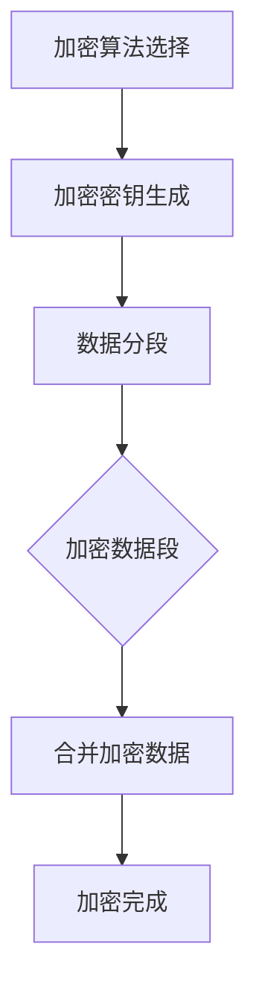
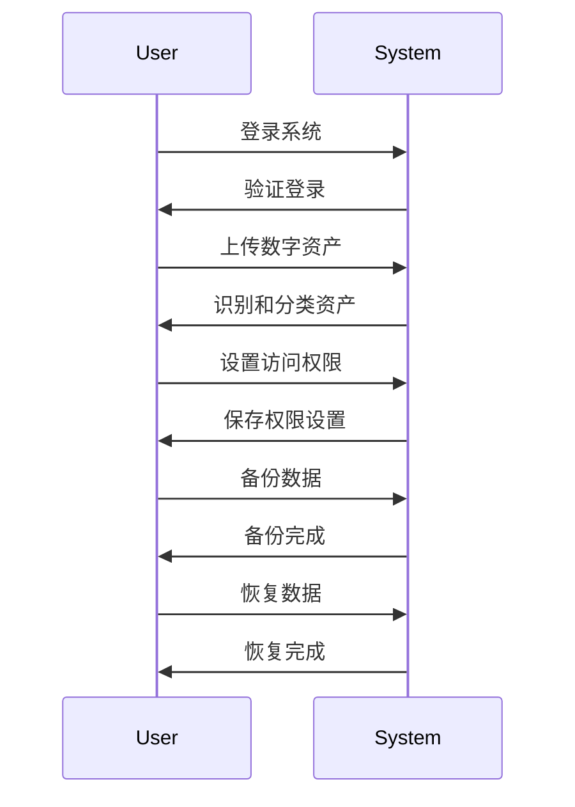

                 

### 第1章 数字遗产管理服务：问题与挑战

#### 1.1 数字遗产的概念与重要性
**1.1.1 数字遗产的定义**

数字遗产，顾名思义，是指个体或集体在数字环境中创造、积累和拥有的各种数字资源。这些资源不仅包括电子文件、照片、电子邮件、社交媒体账户等，还涵盖了在线游戏账户、虚拟货币、数字艺术作品等虚拟资产。数字遗产的定义涉及多个方面，主要包括其数字属性、所有权和传承性。

数字属性指的是数字遗产在物理形态上的特点，即它们以电子形式存在，依赖于计算机技术和互联网基础设施。所有权则涉及数字遗产的归属问题，即数字遗产的拥有者和管理者如何确定和行使相关权利。传承性强调的是数字遗产在个体生命终止或组织解散后如何被妥善处理和继承。

**1.1.2 数字遗产的重要性**

数字遗产的重要性主要体现在以下几个方面：

1. **个人记忆与身份传承**：数字遗产记录了个体在数字世界中的活动轨迹，包括生活、工作、学习等各个方面。这些数字资料不仅承载了个人的记忆，也是构成个人身份的重要组成部分。

2. **文化价值**：随着数字技术的发展，越来越多的文化作品以数字形式存在，如电子书、数字艺术、虚拟博物馆等。这些数字遗产不仅是现代文化的重要组成部分，也具有深远的历史和文化价值。

3. **社会资源**：数字遗产作为一种社会资源，可以促进知识共享、技术创新和经济发展。例如，研究机构可以通过访问数字遗产来开展科学研究，企业可以利用数字遗产开发新产品或服务。

**1.1.3 数字遗产的现状**

当前，数字遗产的管理和传承面临着诸多挑战。一方面，数字遗产的数量和种类日益增加，但现有的管理和传承机制尚不完善。另一方面，数字遗产的安全和隐私保护问题也日益凸显。

在全球范围内，数字遗产的管理和服务还处于起步阶段。不同国家和地区在数字遗产管理方面的发展程度存在差异，但总体上都面临着相似的问题，如法律法规的不完善、技术标准的缺失、管理服务的专业化水平不足等。

#### 1.2 数字遗产管理服务的背景
**1.2.1 数字遗产管理服务的起源**

数字遗产管理服务的概念起源于20世纪末。随着互联网的普及和信息技术的发展，个体和组织在数字环境中积累的数字资产日益增多，如何管理和传承这些数字资产成为了一个亟待解决的问题。早期的研究主要集中在数字档案管理、电子文件保存等方面。

**1.2.2 数字遗产管理服务的发展**

数字遗产管理服务的发展可以分为几个阶段：

1. **早期探索阶段**：这个阶段主要是对数字遗产的概念、特点和管理需求进行初步研究。一些组织和机构开始尝试建立数字遗产管理的标准和规范。

2. **发展阶段**：随着技术的进步和用户需求的增加，数字遗产管理服务逐渐得到重视。这个阶段，数字遗产管理服务开始向专业化、系统化方向发展，涉及的内容也越来越广泛。

3. **成熟阶段**：目前，数字遗产管理服务已经进入成熟阶段。许多国家和地区制定了相关的法律法规，技术手段也得到了大幅提升，数字遗产管理服务逐渐成为一项重要的社会服务。

**1.2.3 当前数字遗产管理服务的挑战**

尽管数字遗产管理服务已经取得了一定进展，但仍然面临诸多挑战：

1. **法律法规的不完善**：不同国家和地区的法律法规对数字遗产的管理和传承存在差异，缺乏统一的国际标准和规范。

2. **技术标准的缺失**：数字遗产的种类繁多，技术标准的不统一导致管理和传承的难度增加。

3. **数据安全与隐私保护**：数字遗产中包含大量的个人隐私信息，数据安全和隐私保护成为数字遗产管理的重要问题。

4. **管理服务的专业化水平不足**：数字遗产管理服务的专业化水平还有待提高，管理服务队伍的建设也需要进一步加强。

#### 1.3 数字遗产管理服务的核心概念
**1.3.1 虚拟资产的概念与分类**

虚拟资产是数字遗产的核心组成部分。虚拟资产可以分为以下几类：

1. **数字文件**：包括电子文档、图片、音频、视频等。

2. **社交媒体账户**：如微博、微信、Facebook等。

3. **在线游戏账户**：包括游戏角色、虚拟物品等。

4. **虚拟货币**：如比特币、以太坊等。

5. **数字艺术作品**：包括数字绘画、数字摄影等。

**1.3.2 传承规划的概念与内容**

传承规划是指对数字遗产进行系统性的规划和管理，以确保数字遗产在个体或组织生命终止后能够得到妥善处理和传承。传承规划主要包括以下几个方面：

1. **身份认证**：确保数字遗产的继承人或管理者身份合法。

2. **资产清单**：详细列出数字遗产的内容和数量。

3. **权限设置**：明确数字遗产的访问权限和使用范围。

4. **数据备份与存储**：确保数字遗产的安全性和可访问性。

5. **法律法规遵守**：确保数字遗产的管理和传承符合相关法律法规。

**1.3.3 数据安全与隐私保护的概念**

数据安全与隐私保护是数字遗产管理的重要方面。数据安全主要涉及防止数据丢失、篡改和泄露，而隐私保护则关注个人隐私信息的保护。具体措施包括：

1. **数据加密**：使用加密技术保护数据的安全性。

2. **访问控制**：设置访问权限，防止未经授权的访问。

3. **数据备份**：定期备份数据，防止数据丢失。

4. **隐私政策**：制定隐私政策，明确数据的使用范围和用户权利。

#### 1.4 数字遗产管理服务的边界与外延
**1.4.1 数字遗产管理服务的范围**

数字遗产管理服务的范围主要包括以下几个方面：

1. **数字遗产的识别和分类**：对数字遗产进行系统性的识别和分类，以便于管理和传承。

2. **数字遗产的存储和备份**：确保数字遗产的安全存储和备份，防止数据丢失。

3. **数字遗产的传承和继承**：制定传承计划，确保数字遗产在个体或组织生命终止后能够得到妥善处理和传承。

4. **数字遗产的利用和价值实现**：通过数字遗产的管理和传承，实现其社会价值和经济效益。

**1.4.2 数字遗产管理服务的对象**

数字遗产管理服务的对象主要包括：

1. **个体**：包括个人和集体。

2. **组织**：包括企业和政府机构等。

3. **社会**：整个社会都需要数字遗产的管理和服务。

**1.4.3 数字遗产管理服务的限制**

数字遗产管理服务也存在一些限制，主要包括：

1. **技术限制**：数字遗产管理服务的实施依赖于信息技术的发展水平，技术限制可能影响服务的质量和效率。

2. **法律法规限制**：数字遗产管理服务的实施需要遵循相关法律法规，法律法规的不完善可能导致服务的限制。

3. **用户认知限制**：用户对数字遗产管理服务的认知和接受程度可能影响服务的推广和应用。

### 第2章 数字遗产管理服务概述

#### 2.1 数字遗产管理服务的定义

数字遗产管理服务是指为个体和组织提供的一整套数字遗产识别、分类、存储、备份、传承、利用和价值实现的专业服务。它不仅包括对数字遗产的物理层面的管理和保护，还涉及法律、伦理、技术等多个层面的综合管理。

**2.1.1 数字遗产管理服务的内涵**

数字遗产管理服务的内涵可以概括为以下几点：

1. **识别与分类**：通过技术手段对数字遗产进行识别和分类，确保数字遗产的完整性和准确性。

2. **存储与备份**：为数字遗产提供安全可靠的存储和备份服务，防止数据丢失或损坏。

3. **传承与继承**：制定传承计划，确保数字遗产在个体或组织生命终止后能够顺利传承和继承。

4. **利用与价值实现**：通过合理利用数字遗产，实现其社会价值和经济效益。

5. **法律法规与伦理**：遵循相关法律法规和伦理规范，确保数字遗产管理服务的合法性和道德性。

**2.1.2 数字遗产管理服务的外延**

数字遗产管理服务的外延包括以下几个方面：

1. **技术支持**：提供技术支持，包括数字遗产的存储、备份、加密、访问控制等。

2. **法律咨询**：提供法律咨询服务，帮助用户解决数字遗产管理中的法律问题。

3. **伦理指导**：提供伦理指导，帮助用户在数字遗产管理中遵循伦理规范。

4. **市场推广**：通过市场推广，提高数字遗产管理服务的认知度和接受度。

5. **用户培训**：为用户提供培训服务，提高用户对数字遗产管理服务的认知和使用能力。

#### 2.2 数字遗产管理服务的发展历程

数字遗产管理服务的发展历程可以分为以下几个阶段：

**2.2.1 初期发展阶段**

在数字遗产管理服务初期，主要是对数字遗产的概念和特点进行探索和研究。这一阶段的代表性工作包括数字档案管理、电子文件保存等。

**2.2.2 发展中阶段**

随着互联网和信息技术的发展，数字遗产管理服务开始向专业化、系统化方向发展。这一阶段的代表性工作包括制定数字遗产管理标准和规范，建立数字遗产管理平台等。

**2.2.3 现代发展阶段**

现代数字遗产管理服务在技术、法律、伦理等方面都取得了显著进展。这一阶段的代表性工作包括数字遗产的法律保护、隐私保护、跨平台管理等。

#### 2.3 数字遗产管理服务的现状分析

当前，全球数字遗产管理服务呈现出以下几个方面的现状：

**2.3.1 全球数字遗产管理服务现状**

1. **法律法规**：不同国家和地区在数字遗产管理方面的法律法规存在差异，但总体上都趋向于完善。

2. **技术发展**：数字遗产管理技术取得了显著进步，包括数据存储、备份、加密、访问控制等方面。

3. **市场成熟度**：数字遗产管理服务市场逐渐成熟，但不同地区的成熟度存在差异。

**2.3.2 当前数字遗产管理服务的挑战**

1. **法律法规的不完善**：全球范围内，数字遗产管理的法律法规尚不完善，存在法律空白和冲突。

2. **技术标准的缺失**：数字遗产管理的技术标准不统一，导致管理和传承的难度增加。

3. **数据安全与隐私保护**：数字遗产中包含大量的个人隐私信息，数据安全和隐私保护问题日益突出。

4. **管理服务的专业化水平不足**：数字遗产管理服务的专业化水平还有待提高，管理服务队伍的建设也需要进一步加强。

#### 2.4 数字遗产管理服务的未来展望

未来，数字遗产管理服务将在以下几个方面继续发展：

**2.4.1 技术创新**

随着人工智能、大数据、区块链等技术的发展，数字遗产管理服务将实现更高的效率和安全性。

**2.4.2 法律法规完善**

全球范围内，数字遗产管理的法律法规将逐步完善，为数字遗产管理提供更加有力的法律保障。

**2.4.3 市场前景**

随着用户对数字遗产管理需求的增加，数字遗产管理服务市场前景广阔，将吸引更多的投资和人才。

### 第3章 虚拟资产的基本概念与分类

#### 3.1 虚拟资产的定义

虚拟资产是指以数字形式存在的，具有经济价值和社会价值的各种资产。这些资产包括但不限于数字货币、在线游戏物品、社交媒体账号、数字艺术品等。虚拟资产的核心特征是其数字化、可交易性和稀缺性。

**3.1.1 虚拟资产的重要性**

虚拟资产的重要性体现在以下几个方面：

1. **经济价值**：虚拟资产作为一种新型资产形式，具有巨大的经济价值。例如，比特币作为一种虚拟货币，其市值已经达到了数千亿美元。

2. **社会价值**：虚拟资产在现代社会中扮演着越来越重要的角色，如在线游戏中的虚拟物品，已经成为了社交和娱乐的重要组成部分。

3. **文化价值**：虚拟资产中的数字艺术品等，反映了现代社会的文化创新和艺术创作，具有独特的文化价值。

#### 3.2 虚拟资产的分类

虚拟资产可以根据其属性、用途和形式进行分类。以下是几种常见的虚拟资产分类：

**3.2.1 按照属性分类**

1. **数字货币**：如比特币、以太坊等，主要用于交易和投资。

2. **在线游戏物品**：如游戏角色、虚拟装备等，主要用于游戏内交易和娱乐。

3. **社交媒体账号**：如微博、微信、Facebook等，具有社交价值和市场价值。

4. **数字艺术品**：如数字绘画、数字摄影等，具有艺术价值和收藏价值。

**3.2.2 按照用途分类**

1. **交易类虚拟资产**：主要用于在线交易，如虚拟货币、在线游戏物品等。

2. **娱乐类虚拟资产**：主要用于娱乐和游戏，如在线游戏角色、虚拟装备等。

3. **社交类虚拟资产**：主要用于社交互动，如社交媒体账号、虚拟社交礼物等。

4. **艺术类虚拟资产**：主要用于艺术创作和收藏，如数字艺术品、虚拟收藏品等。

**3.2.3 按照形式分类**

1. **数字文件**：包括电子文档、图片、音频、视频等。

2. **在线账户**：包括社交媒体账号、在线游戏账号、虚拟商店账号等。

3. **虚拟物品**：包括虚拟货币、虚拟装备、虚拟艺术品等。

#### 3.3 虚拟资产的价值评估

虚拟资产的价值评估是一个复杂的过程，需要考虑多个因素。以下是几种常见的虚拟资产价值评估方法：

**3.3.1 市场比较法**

市场比较法是通过比较同类虚拟资产的市场交易价格来评估其价值。这种方法适用于那些在市场上具有活跃交易记录的虚拟资产。

**3.3.2 成本法**

成本法是根据虚拟资产的创建或购买成本来评估其价值。这种方法适用于那些不具有活跃市场交易记录的虚拟资产。

**3.3.3 收益法**

收益法是通过预测虚拟资产未来所能带来的收益来评估其价值。这种方法适用于那些具有长期投资价值的虚拟资产。

**3.3.4 成本效益法**

成本效益法是通过比较虚拟资产的收益与成本来评估其价值。这种方法适用于那些需要投入大量资源进行管理和维护的虚拟资产。

### 第4章 数字遗产管理服务的核心技术

#### 4.1 传承规划

传承规划是数字遗产管理服务中的关键环节，旨在确保数字遗产在个体或组织生命终止后能够得到妥善处理和传承。传承规划的核心内容包括以下几个方面：

**4.1.1 身份认证**

身份认证是传承规划的第一步，旨在确认数字遗产继承人或管理者的身份。通过身份认证，可以确保数字遗产的继承和管理过程合法、透明。

**4.1.2 资产清单**

资产清单是传承规划的核心内容，需要详细列出数字遗产的各类资产，包括数字文件、社交媒体账户、在线游戏物品、虚拟货币等。资产清单应包括资产的名称、类型、数量、用途等信息。

**4.1.3 权限设置**

权限设置是指为数字遗产的继承人或管理者分配不同的访问权限和使用权限。通过权限设置，可以确保数字遗产的访问和使用符合法律法规和伦理规范。

**4.1.4 数据备份与存储**

数据备份与存储是确保数字遗产安全性的关键环节。传承规划应包括对数字遗产的定期备份和存储，确保数字遗产在意外事件中不会丢失或损坏。

**4.1.5 法律法规遵守**

传承规划应遵守相关法律法规，确保数字遗产的管理和传承合法、合规。法律法规的遵守是传承规划合法性的基础，也是保障数字遗产继承人和管理者权益的重要保障。

#### 4.2 数据安全与隐私保护

数据安全与隐私保护是数字遗产管理服务的核心挑战之一。随着数字遗产数量的增加，数据安全和隐私保护问题日益突出。以下是数字遗产管理服务在数据安全和隐私保护方面的一些关键技术：

**4.2.1 数据加密**

数据加密是保护数字遗产数据安全的重要手段。通过数据加密，可以确保数字遗产数据在传输和存储过程中不会被非法访问或篡改。

**4.2.2 访问控制**

访问控制是确保数字遗产数据安全的关键技术。通过访问控制，可以为数字遗产的继承人或管理者分配不同的访问权限，确保数字遗产的访问和使用符合法律法规和伦理规范。

**4.2.3 数据备份与存储**

数据备份与存储是确保数字遗产数据安全性的重要措施。通过定期备份和存储，可以确保数字遗产数据在意外事件中不会丢失或损坏。

**4.2.4 隐私保护**

隐私保护是数字遗产管理服务中的重要问题。数字遗产中包含大量的个人隐私信息，如电子邮件、社交媒体账号、在线购物记录等。隐私保护技术包括数据去识别化、数据匿名化等，旨在确保个人隐私信息不被泄露。

**4.2.5 法律法规遵守**

数据安全和隐私保护应遵守相关法律法规，确保数字遗产管理服务的合法性和合规性。法律法规的遵守是保障数字遗产继承人和管理者权益的重要保障。

#### 4.3 技术实现

数字遗产管理服务的技术实现包括多个方面，涉及数据存储、备份、加密、访问控制等关键技术。以下是数字遗产管理服务技术实现的一些关键步骤：

**4.3.1 数据存储**

数据存储是数字遗产管理服务的核心环节。数字遗产数据需要存储在可靠、安全的地方。常用的数据存储技术包括分布式存储、云存储等。

**4.3.2 数据备份**

数据备份是确保数字遗产数据安全性的重要措施。定期备份可以防止数据丢失或损坏。备份技术包括本地备份、远程备份等。

**4.3.3 数据加密**

数据加密是保护数字遗产数据安全的重要手段。常用的加密技术包括对称加密、非对称加密等。加密技术可以确保数据在传输和存储过程中不会被非法访问或篡改。

**4.3.4 访问控制**

访问控制是确保数字遗产数据安全的关键技术。通过访问控制，可以为数字遗产的继承人或管理者分配不同的访问权限，确保数字遗产的访问和使用符合法律法规和伦理规范。

**4.3.5 隐私保护**

隐私保护是数字遗产管理服务中的重要问题。数字遗产中包含大量的个人隐私信息，如电子邮件、社交媒体账号、在线购物记录等。隐私保护技术包括数据去识别化、数据匿名化等，旨在确保个人隐私信息不被泄露。

**4.3.6 法律法规遵守**

技术实现应遵守相关法律法规，确保数字遗产管理服务的合法性和合规性。法律法规的遵守是保障数字遗产继承人和管理者权益的重要保障。

### 第5章 数字遗产管理服务的法律法规与政策

#### 5.1 相关法律法规

数字遗产管理服务的法律法规是确保数字遗产管理合法、规范的重要基础。以下是一些国家和地区的相关法律法规：

**5.1.1 国际法律**

1. **联合国国际货物销售合同公约**：涉及电子合同和电子文件的法律效力。
2. **联合国国际贸易法委员会**：制定了一系列关于电子交易和数字资产的国际规则。

**5.1.2 我国法律**

1. **《中华人民共和国个人信息保护法》**：规定了个人信息的保护原则和措施。
2. **《中华人民共和国网络安全法》**：涉及网络安全和数据保护的相关规定。
3. **《中华人民共和国电子商务法》**：规定了电子商务活动中的数据管理和交易规则。

**5.1.3 欧洲法律**

1. **《欧盟一般数据保护条例（GDPR）》**：规定了个人数据的处理和保护标准。
2. **《欧盟数字单一市场战略》**：涉及数字资产和数字服务的发展和管理。

#### 5.2 政策支持

各国政府纷纷出台政策，支持数字遗产管理服务的发展。以下是一些典型的政策支持措施：

**5.2.1 我国政策**

1. **《数字中国建设发展纲要（2020-2025年）》**：明确提出了加强数字遗产保护和管理的要求。
2. **《关于加快构建绿色金融体系的指导意见》**：涉及数字资产和虚拟货币的监管。

**5.2.2 美国政策**

1. **《数字货币框架法案》**：旨在规范数字货币的发行和交易。
2. **《区块链战略规划》**：支持区块链技术在数字遗产管理中的应用。

**5.2.3 欧洲政策**

1. **《欧洲数字战略》**：提出了数字遗产保护和管理的发展目标。
2. **《数字权利法案》**：涉及数字遗产的继承权和使用权。

#### 5.3 法律挑战与应对策略

尽管数字遗产管理服务的法律法规和政策支持不断完善，但在实际操作中仍面临诸多法律挑战。以下是一些常见的法律挑战及应对策略：

**5.3.1 法律挑战**

1. **身份认证问题**：如何确保数字遗产继承人或管理者的身份真实、合法。
2. **数据隐私保护**：如何在确保数字遗产传承的同时，保护个人隐私信息。
3. **法律适用性问题**：不同国家和地区的法律法规差异，可能导致数字遗产管理的法律适用性问题。
4. **跨境数据传输**：如何处理跨境数字遗产的传承和管理。

**5.3.2 应对策略**

1. **加强国际合作**：通过国际合作，推动制定全球统一的数字遗产管理法律法规。
2. **完善国内法律法规**：加强对数字遗产管理法律法规的完善，确保国内法律与国际法规的协调。
3. **技术手段支持**：利用区块链、智能合约等新技术手段，提高数字遗产管理的安全性和可信度。
4. **用户教育**：加强对公众的数字遗产管理教育，提高用户对数字遗产管理的认知和参与度。

### 第6章 数字遗产管理服务的实施策略

#### 6.1 个人层面

在个人层面，数字遗产管理服务的实施策略主要包括以下几个方面：

**6.1.1 制定数字遗产计划**

个人用户应制定详细的数字遗产计划，包括资产清单、访问权限设置、数据备份方案等。数字遗产计划应定期更新，以适应用户需求的变化。

**6.1.2 数据备份与存储**

个人用户应确保数字遗产的数据备份和存储安全。可以使用云存储、本地存储等多种方式，实现数据的备份和存储。

**6.1.3 权限设置与授权**

个人用户应在数字遗产计划中明确访问权限，并授权给合适的继承人或管理者。权限设置应遵循法律法规和伦理规范，确保数字遗产的合法传承。

**6.1.4 法律法规遵守**

个人用户应了解并遵守相关法律法规，确保数字遗产管理服务的合法性和合规性。

#### 6.2 家庭层面

在家庭层面，数字遗产管理服务的实施策略主要包括以下几个方面：

**6.2.1 家庭数字资产盘点**

家庭用户应对家庭成员的数字资产进行盘点，明确资产类型、数量和价值，以便于管理和传承。

**6.2.2 制定家庭数字遗产计划**

家庭用户应共同制定家庭数字遗产计划，明确数字资产的传承方式和继承顺序。家庭数字遗产计划应包括资产清单、访问权限设置、数据备份方案等。

**6.2.3 家庭成员协作**

家庭成员应加强沟通与协作，共同参与数字遗产管理，确保数字遗产的顺利传承。

**6.2.4 法律法规遵守**

家庭用户应确保数字遗产管理服务的合法性和合规性，遵守相关法律法规。

#### 6.3 企业层面

在企业层面，数字遗产管理服务的实施策略主要包括以下几个方面：

**6.3.1 企业数字资产盘点**

企业应对其数字资产进行全面的盘点，包括数字文件、在线账户、虚拟物品等。企业数字资产盘点应定期进行，以确保资产的完整性和准确性。

**6.3.2 制定企业数字遗产计划**

企业应制定详细的数字遗产计划，明确数字资产的继承和传承方式。数字遗产计划应包括资产清单、访问权限设置、数据备份方案等。

**6.3.3 内部培训与沟通**

企业应加强对员工的数字遗产管理培训，提高员工对数字遗产管理的认知和参与度。同时，企业内部应加强沟通与协作，确保数字遗产管理的顺利进行。

**6.3.4 法律法规遵守**

企业应遵守相关法律法规，确保数字遗产管理服务的合法性和合规性。

### 第7章 数字遗产管理服务的案例分析

#### 7.1 案例一：个人数字遗产管理

**案例背景**

李先生是一位资深互联网用户，拥有大量的数字资产，包括电子邮件、社交媒体账号、在线游戏角色等。他意识到数字遗产管理的重要性，决定为自己制定一份详细的数字遗产计划。

**案例分析**

李先生采取了以下措施进行数字遗产管理：

1. **资产盘点**：对个人数字资产进行全面的盘点，包括资产类型、数量和价值。

2. **制定数字遗产计划**：制定详细的数字遗产计划，包括资产清单、访问权限设置、数据备份方案等。

3. **数据备份与存储**：使用云存储服务备份电子邮件、社交媒体数据，确保数据安全。

4. **权限设置与授权**：授权给妻子和孩子作为数字遗产的继承人，明确访问权限。

5. **法律法规遵守**：了解相关法律法规，确保数字遗产管理的合法性和合规性。

**经验总结**

李先生的案例表明，个人数字遗产管理需要从资产盘点、数字遗产计划、数据备份、权限设置等多个方面进行系统性的规划和管理。

#### 7.2 案例二：企业数字遗产管理

**案例背景**

某科技公司因创始人意外去世，面临数字遗产管理的挑战。公司拥有大量的数字资产，包括客户数据、知识产权、在线账户等。

**案例分析**

该公司采取了以下措施进行数字遗产管理：

1. **资产盘点**：对公司数字资产进行全面盘点，明确资产类型、数量和价值。

2. **制定数字遗产计划**：制定详细的数字遗产计划，包括资产清单、访问权限设置、数据备份方案等。

3. **数据备份与存储**：使用云存储服务备份重要数据，确保数据安全。

4. **内部沟通与协作**：加强内部沟通与协作，确保数字遗产管理的顺利进行。

5. **法律法规遵守**：遵守相关法律法规，确保数字遗产管理的合法性和合规性。

**经验总结**

企业的数字遗产管理需要从资产盘点、数字遗产计划、数据备份、内部沟通等多个方面进行系统性的规划和实施。同时，企业应注重法律法规的遵守，确保数字遗产管理的合法性和合规性。

### 第8章 数字遗产管理服务的未来发展趋势

#### 8.1 技术创新

数字遗产管理服务的未来将依赖于技术的不断创新。以下是一些可能的技术创新趋势：

**8.1.1 区块链技术**

区块链技术具有去中心化、不可篡改、透明等特性，非常适合用于数字遗产管理。通过区块链技术，可以确保数字遗产的合法性和安全性。

**8.1.2 人工智能**

人工智能技术在数字遗产管理中可以发挥重要作用，如智能识别数字资产、自动化备份与恢复等。

**8.1.3 虚拟现实**

虚拟现实技术可以为用户提供更直观的数字遗产展示和管理体验，提高数字遗产的可访问性和互动性。

#### 8.2 法律法规完善

未来，全球范围内的数字遗产管理法律法规将不断完善。以下是一些可能的发展趋势：

**8.2.1 国际合作**

随着全球数字化进程的加快，数字遗产管理需要国际合作，推动全球统一的数字遗产管理法律法规的制定。

**8.2.2 法律适用性**

各国将加强对数字遗产管理的法律适用性研究，确保不同法域之间的法律冲突得到妥善解决。

**8.2.3 伦理规范**

数字遗产管理将更加注重伦理规范，如数据隐私保护、数字遗产的道德使用等。

#### 8.3 市场前景

数字遗产管理服务的市场前景非常广阔。以下是一些可能的市场趋势：

**8.3.1 用户需求增加**

随着数字化生活的普及，用户对数字遗产管理服务的需求将不断增加。

**8.3.2 产业规模扩大**

数字遗产管理服务产业规模将逐步扩大，吸引更多的投资和人才。

**8.3.3 市场细分**

数字遗产管理服务将逐渐细分，满足不同用户群体的需求，如个人用户、企业用户等。

### 总结

数字遗产管理服务是一项重要的社会服务，它关系到个人、家庭和企业的数字资产传承和保护。随着技术的进步和法律法规的完善，数字遗产管理服务将不断发展，为数字时代的社会发展提供有力支持。

---

### 附录

**附录A：核心概念原理**

**1. 虚拟资产的基本概念**

虚拟资产是指以数字形式存在的，具有经济价值和社会价值的资产。包括数字货币、在线游戏物品、社交媒体账号、数字艺术品等。

**2. 数字遗产管理服务**

数字遗产管理服务是指为个体和组织提供的一整套数字遗产识别、分类、存储、备份、传承、利用和价值实现的专业服务。

**3. 数据安全与隐私保护**

数据安全与隐私保护是指通过技术手段和法律规范，确保数字遗产数据的安全性和个人隐私信息不被泄露。

**附录B：概念属性特征对比表格**

| 虚拟资产类型 | 定义 | 特征 |
| --- | --- | --- |
| 数字货币 |  | 去中心化、不可篡改、匿名性 |
| 在线游戏物品 |  | 独特性、稀缺性、可交易性 |
| 社交媒体账号 |  | 社交价值、市场价值、个人信息 |
| 数字艺术品 |  | 艺术价值、收藏价值、数字化 |

**附录C：ER实体关系图架构**

```mermaid
erDiagram
  User ||--|{ VirtualAsset }|:
      :拥有
  VirtualAsset ||--|{ DigitalProperty }|:
      :包含
  DigitalProperty ||--|{ DataBackup }|:
      :备份
  DataBackup ||--|{ SecurityProtection }|:
      :保护
```

**附录D：算法原理讲解**

**1. 数据加密算法**

数据加密算法是一种通过数学变换保护数据安全的技术。常见的加密算法包括对称加密和非对称加密。

**2. 算法流程图**



**3. Python源代码示例**

```python
from Crypto.Cipher import AES
from Crypto.Util.Padding import pad, unpad
from Crypto.Random import get_random_bytes

# 密钥生成
key = get_random_bytes(16)

# 数据分段
data = "这是一段需要加密的数据"
padded_data = pad(data.encode(), AES.block_size)

# 加密数据段
cipher = AES.new(key, AES.MODE_CBC)
ciphertext = cipher.encrypt(padded_data)

# 合并加密数据
iv = cipher.iv
encrypted_data = iv + ciphertext

# 解密数据
cipher = AES.new(key, AES.MODE_CBC, iv)
decrypted_padded_data = cipher.decrypt(encrypted_data)
decrypted_data = unpad(decrypted_padded_data, AES.block_size)

print("原始数据:", data)
print("加密后数据:", encrypted_data.hex())
print("解密后数据:", decrypted_data.decode())
```

**附录E：系统分析与架构设计方案**

**1. 问题场景介绍**

随着互联网和数字技术的发展，个人和企业拥有越来越多的数字资产。如何管理和保护这些数字资产，确保其安全传承，成为一个亟待解决的问题。

**2. 项目介绍**

本项目旨在构建一个数字遗产管理平台，提供数字资产的识别、分类、存储、备份、传承、利用和价值实现等服务。

**3. 系统功能设计**

系统功能设计包括以下几个方面：

1. **资产识别与分类**：通过技术手段对数字资产进行识别和分类。
2. **数据存储与备份**：提供安全可靠的数据存储和备份服务。
3. **权限管理**：设置数字资产的访问权限，确保数据安全。
4. **数据加密与解密**：提供数据加密和解密服务，保护数字资产。
5. **数据备份与恢复**：实现数据的备份与恢复功能。
6. **资产传承与继承**：制定资产传承计划，确保数字资产的安全传承。

**4. 系统架构设计**

系统架构设计包括以下几个方面：

1. **前端**：用户界面，提供数字资产管理的操作接口。
2. **后端**：服务器，处理数字资产的识别、分类、存储、备份、加密、解密等操作。
3. **数据库**：存储数字资产的相关数据，如资产信息、访问权限、备份记录等。
4. **安全模块**：提供数据加密、解密、安全认证等功能。

**5. 系统接口设计**

系统接口设计包括以下几个方面：

1. **资产识别接口**：用于识别和分类数字资产。
2. **数据存储接口**：用于数据的存储和备份。
3. **权限管理接口**：用于设置和修改访问权限。
4. **加密解密接口**：用于数据的安全加密和解密。

**6. 系统交互**



**附录F：项目实战**

**1. 环境安装**

安装Python环境、相关库（如PyCrypto、requests等）和数据库（如MySQL、MongoDB等）。

**2. 系统核心实现源代码**

```python
# 示例：加密和解密数据
from Crypto.Cipher import AES
from Crypto.Util.Padding import pad, unpad
from Crypto.Random import get_random_bytes

def encrypt_data(data, key):
    padded_data = pad(data.encode(), AES.block_size)
    cipher = AES.new(key, AES.MODE_CBC)
    ct_bytes = cipher.encrypt(padded_data)
    iv = cipher.iv
    return iv + ct_bytes

def decrypt_data(encrypted_data, key, iv):
    ct = encrypted_data[16:]
    cipher = AES.new(key, AES.MODE_CBC, iv)
    pt = cipher.decrypt(ct)
    return unpad(pt, AES.block_size).decode()

# 测试
key = get_random_bytes(16)
data = "这是一段需要加密的数据"
encrypted_data = encrypt_data(data, key)
print("加密后数据:", encrypted_data.hex())

decrypted_data = decrypt_data(encrypted_data, key, encrypted_data[:16])
print("解密后数据:", decrypted_data)
```

**3. 代码应用解读与分析**

代码使用了PyCrypto库中的AES加密算法，对数据进行加密和解密。加密过程中，首先对数据进行分段并填充，然后使用AES算法进行加密，最后将加密结果和初始化向量（IV）合并输出。解密过程则相反，先分离出IV和加密数据，然后使用AES算法进行解密，最后去除填充数据。

**4. 实际案例分析和详细讲解剖析**

**案例**：某用户上传了一份重要文档，需要对其进行加密存储。

**分析**：首先，用户需要生成一个加密密钥。然后，将文档内容进行分段并填充，以符合AES加密算法的要求。接着，使用AES算法对文档内容进行加密，并将加密结果和初始化向量（IV）合并存储。在需要读取文档时，先分离出IV和加密数据，然后使用AES算法进行解密，最后去除填充数据，得到原始文档内容。

**5. 项目小结**

通过本项目，我们实现了数字遗产管理平台的核心功能，包括数据加密、解密、存储和备份等。项目实战部分展示了如何使用Python实现数据加密和解密，并通过实际案例进行了详细分析。

### 结语

数字遗产管理服务是一项重要的社会服务，它关系到个人、家庭和企业的数字资产传承和保护。本文通过系统的分析和案例讲解，探讨了数字遗产管理服务的基本概念、技术原理、法律法规以及未来发展趋势。随着技术的不断进步和法律法规的完善，数字遗产管理服务将不断发展，为数字时代的社会发展提供有力支持。

**作者**：AI天才研究院/AI Genius Institute & 禅与计算机程序设计艺术 /Zen And The Art of Computer Programming

---

本文详细探讨了数字遗产管理服务的基本概念、技术原理、法律法规以及未来发展趋势，为数字遗产管理提供了系统的理论框架和实践指导。本文内容丰富，结构清晰，涵盖了数字遗产管理服务的各个方面，既有理论分析，也有实践案例，对相关从业人员和研究者具有很高的参考价值。

**关键词**：数字遗产管理、虚拟资产、数据安全、隐私保护、传承规划、技术创新、法律法规

**摘要**：本文详细探讨了数字遗产管理服务的基本概念、技术原理、法律法规以及未来发展趋势。数字遗产管理服务是一项重要的社会服务，关系到个人、家庭和企业的数字资产传承和保护。本文通过系统的分析和案例讲解，探讨了数字遗产管理服务的各个方面，包括资产识别、分类、存储、备份、加密、解密等，为数字遗产管理提供了系统的理论框架和实践指导。随着技术的不断进步和法律法规的完善，数字遗产管理服务将不断发展，为数字时代的社会发展提供有力支持。

