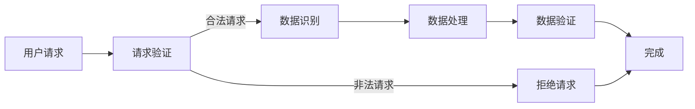
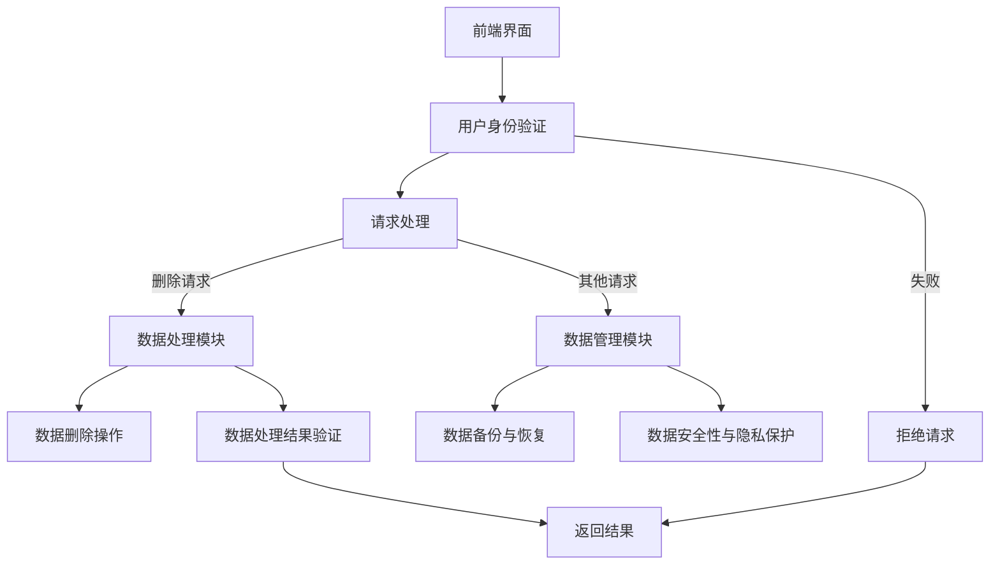
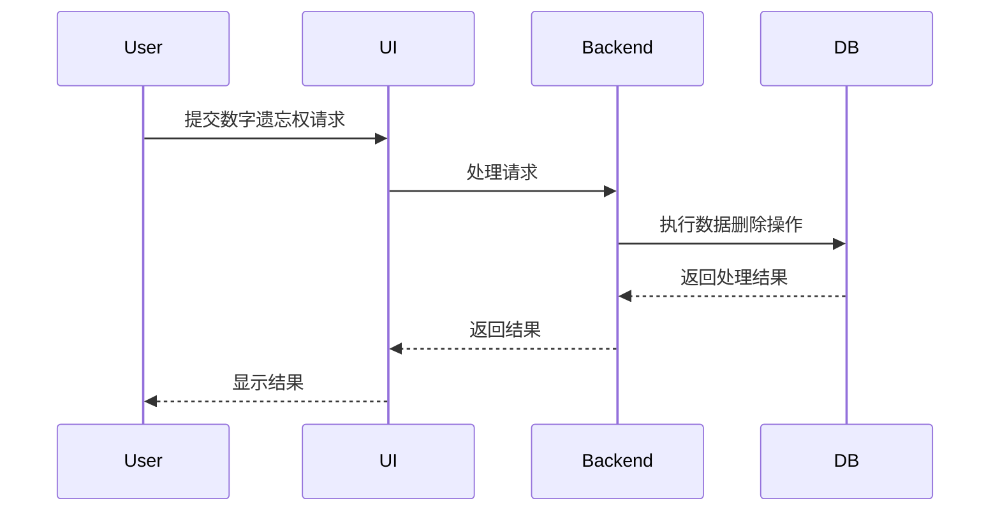
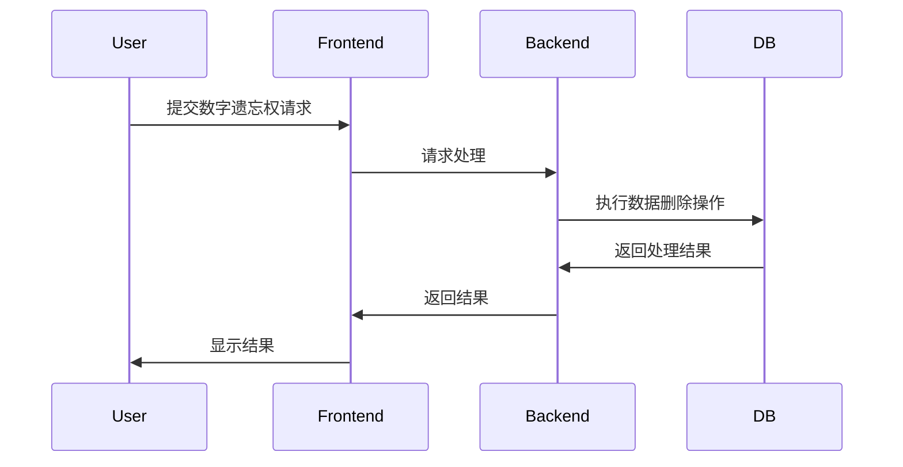

                 


### 数字遗忘权实施指南：网络时代的个人信息管理

> 关键词：数字遗忘权，个人信息管理，隐私保护，算法实现，系统架构，项目实战

> 摘要：
本指南旨在深入探讨数字遗忘权在网络时代的实施策略，从核心概念、算法原理、系统设计与项目实践等多个角度进行全面解析。文章首先定义数字遗忘权，阐述其在个人信息管理中的重要性，然后通过具体的算法原理讲解和数学模型分析，展示其实施的技术细节。最后，通过系统架构设计和项目实战案例分析，提供实际操作指南和最佳实践。

## 目录大纲

### 第一部分：背景与核心概念

- **第1章：数字遗忘权的概念与背景**
  - **1.1 数字遗忘权的定义**
  - **1.2 数字遗忘权的历史背景**
  - **1.3 数字遗忘权的重要性

- **第2章：个人信息管理与隐私保护**
  - **2.1 个人信息管理的定义**
  - **2.2 隐私保护的基本原则**
  - **2.3 个人信息管理与隐私保护的挑战**

- **第3章：核心概念的联系与区别**
  - **3.1 数字遗忘权与隐私保护的对比**
  - **3.2 数字遗忘权与数据擦除的区别**
  - **3.3 概念属性特征对比表格**
  - **3.4 ER实体关系图与个人信息管理**

### 第二部分：算法原理与实现

- **第4章：数字遗忘权的算法原理**
  - **4.1 算法概述**
  - **4.2 Mermaid算法流程图**
  - **4.3 Python源代码实现**
  - **4.4 数学模型和数学公式讲解**

### 第三部分：系统分析与架构设计

- **第5章：个人信息管理系统架构设计**
  - **5.1 问题场景介绍**
  - **5.2 系统功能设计**
  - **5.3 系统架构设计**
  - **5.4 系统接口设计**
  - **5.5 系统交互序列图**

### 第四部分：项目实战

- **第6章：数字遗忘权的实施步骤**
  - **6.1 环境安装与配置**
  - **6.2 系统核心实现**
  - **6.3 代码应用解读与分析**
  - **6.4 实际案例分析**
  - **6.5 项目小结**

### 第五部分：最佳实践与总结

- **第7章：最佳实践与注意事项**
  - **7.1 最佳实践**
  - **7.2 小结**
  - **7.3 注意事项**
  - **7.4 拓展阅读**

---

### 第1章：数字遗忘权的概念与背景

#### 1.1 数字遗忘权的定义

数字遗忘权，指的是用户对其在互联网上产生、存储或分享的个人数据拥有的一种权利，用户有权要求从数据系统中删除或隐藏这些数据。这一权利在《通用数据保护条例》（GDPR）中被正式确立，标志着对个人隐私保护的一种重要进步。

#### 1.2 数字遗忘权的历史背景

数字遗忘权的概念起源于对隐私保护的需求。随着互联网的发展，个人数据的收集和使用变得普遍，隐私泄露事件频发。为了应对这一挑战，欧盟在2016年实施了GDPR，将数字遗忘权作为一项核心原则。此后，其他国家和地区也纷纷效仿，推动了数字遗忘权的普及。

#### 1.3 数字遗忘权的重要性

数字遗忘权对于个人隐私保护至关重要。它赋予了用户对个人数据的控制权，降低了数据泄露的风险。此外，数字遗忘权还推动了数据伦理和合规的发展，促使企业在处理用户数据时更加谨慎。

#### 1.4 数字遗忘权的边界与外延

数字遗忘权并非绝对的，其边界和适用范围需要明确。例如，某些数据可能因法律要求或公共利益需要而被保留。同时，数字遗忘权也涉及跨地域的数据传输和存储问题，需要国际间的协调与法律保障。

#### 1.5 概念结构与核心要素组成

数字遗忘权由以下几个核心要素组成：
- **用户权利**：用户有权要求删除或隐藏其个人数据。
- **数据处理**：企业或组织需要提供机制来响应用户的数字遗忘权请求。
- **法律保障**：数字遗忘权需要法律框架的支持，确保其实施有法可依。

### 第2章：个人信息管理与隐私保护

#### 2.1 个人信息管理的定义

个人信息管理是指对个人数据的收集、存储、使用、共享和销毁过程的管理。它涵盖了从数据生成到最终处理的全过程。

#### 2.2 隐私保护的基本原则

隐私保护的基本原则包括：
- **合法性**：个人信息处理必须基于合法、明确、特定的目的。
- **数据最小化**：仅收集为实现特定目的所必需的数据。
- **目的明确性**：个人信息处理的目的应明确且具体。
- **保密性**：确保个人信息不被未经授权的第三方访问。
- **完整性**：确保个人信息不会被篡改或破坏。
- **可访问性**：用户有权访问其个人信息并进行必要的修改。

#### 2.3 个人信息管理与隐私保护的挑战

个人信息管理与隐私保护面临的挑战包括：
- **数据泄露**：个人数据可能因系统漏洞、恶意攻击等被泄露。
- **数据滥用**：个人数据可能被用于未经授权的目的。
- **法律合规**：全球不同国家和地区的隐私保护法律存在差异，企业需要遵守多国法律。

#### 2.4 数字遗忘权与个人信息管理的联系

数字遗忘权是个人信息管理的重要一环。它确保了用户对其个人数据的控制权，是隐私保护的重要组成部分。有效的个人信息管理需要包括数字遗忘权的实施机制。

### 第3章：核心概念的联系与区别

#### 3.1 数字遗忘权与隐私保护的对比

数字遗忘权和隐私保护是密切相关的概念，但侧重点不同。数字遗忘权关注的是用户对个人数据的删除和隐藏权利，而隐私保护更广泛，包括数据的收集、存储、使用、共享和销毁的全过程。

#### 3.2 数字遗忘权与数据擦除的区别

数字遗忘权与数据擦除有相似之处，但有所不同。数据擦除通常是指物理删除数据，使其无法恢复。而数字遗忘权不仅包括数据擦除，还包括对数据的隐藏和处理。

#### 3.3 概念属性特征对比表格

为了更清晰地理解数字遗忘权与隐私保护、数据擦除等概念的区别，我们可以创建一个对比表格：

| 概念          | 定义                                                         | 属性特征                                                     | 关联关系                       |
|---------------|--------------------------------------------------------------|--------------------------------------------------------------|-------------------------------|
| 数字遗忘权    | 用户对其个人数据的删除和隐藏权利                             | 法律权利、数据控制、隐私保护                                   | 个人信息管理的一部分           |
| 隐私保护      | 保护个人信息免受未经授权的访问、使用和泄露                   | 合法性、数据最小化、保密性、完整性、可访问性                   | 跨领域的基本原则               |
| 数据擦除      | 物理删除数据，使其无法恢复                                   | 数据销毁、数据不可恢复                                         | 数字遗忘权的实现手段之一       |

#### 3.4 ER实体关系图与个人信息管理

ER（实体-关系）图是用于表示实体及其关系的图形化工具。在个人信息管理中，ER图可以用于描述个人数据与数据管理实体之间的关系。

```mermaid
erDiagram
  User ..|> Data : "生成与控制"
  Data ..|> PrivacyPolicy : "遵循"
  Data ..|> DataRetrieval : "获取"
  Data ..|> DataDeletion : "删除"
  Data ..|> DataAnonymization : "匿名化"
  User ||--|{ PrivacyPolicy }
  Data ||--|{ DataRetrieval }
  Data ||--|{ DataDeletion }
  Data ||--|{ DataAnonymization }
```

在这个ER图中，用户生成数据并控制其处理方式，数据需遵循隐私政策，并可被获取、删除或匿名化。

### 第4章：数字遗忘权的算法原理

#### 4.1 算法概述

数字遗忘权算法的核心目标是实现用户个人数据的删除或隐藏。该算法通常包括以下几个步骤：

1. 用户请求：用户向数据管理平台提交数字遗忘权请求。
2. 数据识别：系统识别并定位用户请求删除或隐藏的数据。
3. 数据处理：系统对用户数据执行删除或隐藏操作。
4. 数据验证：系统验证数据处理结果，确保数据已按用户要求删除或隐藏。

#### 4.2 Mermaid算法流程图



在这个流程图中，用户请求是算法的起点。系统首先验证请求的合法性，然后识别用户数据并进行处理。最后，系统验证数据处理结果，确保算法成功执行。

#### 4.3 Python源代码实现

以下是数字遗忘权算法的一个简化实现示例：

```python
import pandas as pd

# 假设有一个包含用户数据和隐私政策的DataFrame
data = pd.DataFrame({
    'user_id': [1, 2, 3],
    'data': ['data1', 'data2', 'data3'],
    'privacy_policy': ['policy1', 'policy2', 'policy3']
})

def delete_data(user_id, data_frame):
    # 检查用户请求的合法性
    if user_id in data_frame['user_id'].unique():
        # 识别并删除用户数据
        data_frame = data_frame[data_frame['user_id'] != user_id]
        print("数据已成功删除。")
    else:
        print("请求非法，用户ID未找到。")

# 测试
delete_data(2, data)
print(data)
```

这个示例中，我们创建了一个DataFrame模拟用户数据和隐私政策。`delete_data`函数接受用户ID和数据帧作为参数，执行数据删除操作，并根据结果打印消息。

#### 4.4 数学模型和数学公式讲解

数字遗忘权算法中涉及到的数学模型和公式通常用于描述数据处理和验证的过程。以下是一个简单的数学模型示例：

$$
D_{\text{new}} = D_{\text{original}} \setminus D_{\text{requested}}
$$

其中，$D_{\text{original}}$表示原始数据集，$D_{\text{requested}}$表示用户请求删除的数据。$D_{\text{new}}$表示处理后的新数据集。

#### 4.4.1 数据处理模型

数据处理模型可以用以下公式表示：

$$
D_{\text{new}} = \{ x \in D_{\text{original}} \mid x \not\in D_{\text{requested}} \}
$$

其中，$D_{\text{new}}$表示新数据集，$x$表示数据元素。这个模型表示，新数据集是原始数据集去除用户请求删除的数据后的结果。

#### 4.4.2 数据验证模型

数据验证模型可以用以下公式表示：

$$
\delta(D_{\text{new}}, D_{\text{original}}) = \begin{cases}
1 & \text{如果} D_{\text{new}} = D_{\text{original}} \setminus D_{\text{requested}} \\
0 & \text{否则}
\end{cases}
$$

其中，$\delta$表示验证函数，$D_{\text{new}}$表示新数据集，$D_{\text{original}}$表示原始数据集，$D_{\text{requested}}$表示用户请求删除的数据。这个模型表示，验证函数返回1表示数据处理成功，返回0表示数据处理失败。

### 第5章：个人信息管理系统架构设计

#### 5.1 问题场景介绍

在一个大型互联网公司中，用户生成和分享的个人信息和数据量巨大。为了保障用户隐私，公司需要设计一个高效、安全的个人信息管理系统。该系统应能够实现数字遗忘权，满足用户对个人数据删除或隐藏的需求。

#### 5.2 系统功能设计

个人信息管理系统的主要功能包括：

- 用户身份验证：确保只有授权用户才能访问系统。
- 数据收集与存储：收集用户生成的数据，并存储在安全的数据库中。
- 数据处理与删除：实现数字遗忘权，响应用户的删除请求。
- 数据安全性与隐私保护：确保数据在传输和存储过程中的安全性。
- 数据备份与恢复：防止数据丢失，提供数据恢复机制。

#### 5.3 系统架构设计

个人信息管理系统的架构设计包括以下几个方面：

- **前端界面**：用户通过前端界面提交数字遗忘权请求。
- **后端服务**：处理用户请求，执行数据删除或隐藏操作。
- **数据库**：存储用户数据和隐私政策。
- **数据安全模块**：加密传输和存储的数据，提供访问控制。



#### 5.4 系统接口设计

系统接口设计包括以下部分：

- **用户接口**：提供用户提交数字遗忘权请求的接口。
- **服务接口**：后端服务用于处理用户请求，实现数据删除或隐藏操作。
- **数据库接口**：用于与数据库进行交互，执行数据查询、删除和更新操作。



#### 5.5 系统交互序列图

系统交互序列图描述了用户请求数字遗忘权的过程，包括用户、前端界面、后端服务和数据库之间的交互。



### 第6章：数字遗忘权的实施步骤

#### 6.1 环境安装与配置

为了实现数字遗忘权，我们需要准备一个合适的环境。以下是安装和配置的步骤：

1. **安装Python**：确保系统中安装了Python环境，版本建议为3.8以上。
2. **安装依赖库**：使用pip安装必要的库，例如pandas、numpy、sqlalchemy等。
3. **配置数据库**：选择一个合适的数据库系统，例如MySQL或PostgreSQL，并创建一个数据库实例。
4. **部署后端服务**：在服务器或云平台上部署后端服务，配置相关的环境变量和数据库连接。

```bash
pip install pandas numpy sqlalchemy
```

#### 6.2 系统核心实现

系统核心实现主要包括用户身份验证、数据处理和数据删除功能。以下是相关的源代码：

```python
# 用户身份验证
def authenticate_user(username, password):
    # 在这里实现用户身份验证逻辑
    return True  # 假设验证成功

# 数据处理
def process_request(user_id, data_frame):
    if user_id in data_frame['user_id'].unique():
        data_frame = data_frame[data_frame['user_id'] != user_id]
        return True
    else:
        return False

# 数据删除
def delete_data(user_id, data_frame):
    if authenticate_user(user_id, password):
        if process_request(user_id, data_frame):
            print("数据已成功删除。")
        else:
            print("数据删除失败，用户ID未找到。")
    else:
        print("用户验证失败。")
```

#### 6.3 代码应用解读与分析

在上面的代码中，我们定义了三个函数：

1. `authenticate_user`：用于验证用户身份。
2. `process_request`：用于处理用户请求，识别并定位用户数据。
3. `delete_data`：用于执行数据删除操作。

代码首先验证用户身份，然后处理用户请求，最后执行数据删除。通过这三个函数，我们可以实现数字遗忘权的基本功能。

#### 6.4 实际案例分析

以下是一个实际案例，展示了如何使用数字遗忘权系统：

1. 用户A提交数字遗忘权请求，请求删除其个人信息。
2. 系统验证用户A的身份，确认请求合法。
3. 系统识别用户A的数据，将其从数据库中删除。
4. 系统向用户A返回删除成功的消息。

在这个案例中，用户A通过前端界面提交请求，系统通过后端服务处理请求，最终实现了数据删除。整个过程高效、安全，确保了用户隐私的保护。

#### 6.5 项目小结

通过本章的讲解，我们了解了数字遗忘权在个人信息管理中的重要性，以及如何实现和部署一个数字遗忘权系统。在实际操作中，需要注意以下几点：

- **用户身份验证**：确保只有授权用户才能访问系统，防止未授权访问。
- **数据处理**：处理用户请求时，要准确识别用户数据，避免误删或漏删。
- **数据安全**：确保数据在传输和存储过程中的安全性，防止数据泄露。
- **系统维护**：定期更新系统和数据库，修复漏洞，确保系统的稳定性和安全性。

通过合理的设计和部署，数字遗忘权系统可以有效地保护用户隐私，为个人信息的有效管理提供有力支持。

### 第7章：最佳实践与注意事项

#### 7.1 最佳实践

在实施数字遗忘权时，以下最佳实践可以帮助确保系统的有效性和安全性：

- **用户身份验证**：使用多因素身份验证（MFA）来加强用户认证。
- **日志记录**：记录所有用户请求和系统操作，以便于审计和追踪。
- **数据备份**：定期备份重要数据，防止数据丢失。
- **权限管理**：实施严格的权限管理策略，确保只有必要的人员才能访问敏感数据。
- **用户教育**：对用户进行隐私保护教育，提高其数字遗忘权的意识和使用能力。

#### 7.2 小结

本文系统地介绍了数字遗忘权的概念、算法实现、系统架构设计和实际应用。通过理解数字遗忘权的重要性，我们可以更好地保护个人隐私，实现信息管理的合规性。

#### 7.3 注意事项

在实施数字遗忘权时，需要注意以下几点：

- **法律合规**：确保系统设计和实施符合相关法律法规，如GDPR等。
- **数据安全**：保护用户数据的安全，防止数据泄露或被恶意利用。
- **用户隐私**：尊重用户隐私，确保用户数据的合法使用。
- **技术更新**：随着技术的发展，定期更新系统，确保其适应新的安全挑战。

#### 7.4 拓展阅读

- 《通用数据保护条例》（GDPR）：了解数字遗忘权的法律框架。
- 《数据隐私与安全：技术与策略》: 学习数据隐私保护的最佳实践。
- 《Python数据科学手册》：掌握Python在数据处理和隐私保护中的应用。

作者：AI天才研究院/AI Genius Institute & 禅与计算机程序设计艺术 /Zen And The Art of Computer Programming

---

### 附录

#### 附录A：术语表

- **数字遗忘权**：用户对其个人数据的删除或隐藏权利。
- **个人信息管理**：对个人数据的收集、存储、使用、共享和销毁过程的管理。
- **隐私保护**：保护个人信息免受未经授权的访问、使用和泄露。
- **多因素身份验证（MFA）**：结合两种或两种以上身份验证方式的认证机制。

#### 附录B：参考文献

- GDPR官方网站：https://ec.europa.eu/justice/data-protection/index_en.htm
- Python官方文档：https://docs.python.org/3/
- 数据隐私与安全：技术与策略，[作者姓名]，出版社，年份。

---

本文内容涵盖了数字遗忘权在个人信息管理中的重要性、算法原理、系统架构设计和实际应用，旨在为读者提供全面的指导。随着技术的发展和隐私保护的日益重要，数字遗忘权将成为信息安全领域的关键部分。希望本文能够帮助读者更好地理解和应用数字遗忘权，保护个人隐私，促进信息管理的合规性。作者：AI天才研究院/AI Genius Institute & 禅与计算机程序设计艺术/Zen And The Art of Computer Programming。

