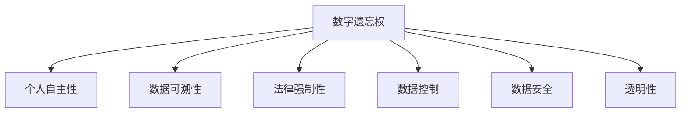

                 

## 《数字遗忘权立法：网络时代的隐私保护》

### 关键词：数字遗忘权、网络隐私保护、立法、数据安全

> 摘要：随着网络技术的飞速发展，个人隐私泄露问题日益严重。数字遗忘权作为一种新型的隐私保护手段，旨在赋予个人对其数据的删除和修改权利。本文将探讨数字遗忘权立法的必要性，分析其核心概念与联系，梳理国际法规与立法实践，探讨数字遗忘权实施机制，通过案例分析揭示其实际应用中的挑战与机遇，并展望数字遗忘权立法的未来发展趋势。

### 引言与背景介绍

#### 1.1 数字遗忘权的概念

**数字遗忘权**，又称**数据擦除权**，是指个人对其在互联网上产生的数据拥有删除和修改的权利。这一概念源于欧盟《通用数据保护条例》（GDPR），其核心理念是**尊重用户隐私**和**强化数据保护**。

#### 1.2 网络时代的隐私挑战

在当前网络时代，隐私泄露事件层出不穷。黑客攻击、数据泄露、个人信息被非法收集和使用，这些问题严重威胁到个人隐私和信息安全。数字遗忘权旨在解决这些问题，通过赋予个人对其数据的控制权，减少隐私泄露的风险。

#### 1.3 本书的目的与结构

本书旨在系统地探讨数字遗忘权立法的必要性、核心概念、国际法规与立法实践、实施机制以及未来展望。具体结构如下：

- **引言与背景介绍**：介绍数字遗忘权的概念和当前网络时代的隐私挑战。
- **核心概念与联系**：阐述数字遗忘权的定义与特点，分析其与隐私保护的关系。
- **国际法规与立法实践**：分析国内外数字遗忘权立法的现状和主要法规。
- **数字遗忘权实施机制**：探讨数字遗忘权在实际操作中的机制和挑战。
- **案例分析**：通过典型案例分析数字遗忘权在实际应用中的效果。
- **未来展望与趋势**：预测数字遗忘权立法的发展趋势和面临的技术挑战。

### 核心概念与联系

#### 2.1 数字遗忘权的定义与特点

数字遗忘权的定义已经在1.1节中介绍。其特点主要包括：

1. **个人自主性**：数字遗忘权赋予个人对其数据的控制权，使其能够决定哪些数据可以被保留，哪些数据需要被删除。
2. **数据可溯性**：数字遗忘权要求在数据删除后，提供数据可恢复的机制，以防止数据被永久丢失。
3. **法律强制性**：数字遗忘权不仅是个人权利的体现，也是法律的强制要求。

#### 2.2 数字遗忘权与隐私保护的关系

数字遗忘权是隐私保护的重要组成部分。它通过以下几个方面实现隐私保护：

1. **数据控制**：数字遗忘权确保个人对其数据的控制权，防止数据被滥用。
2. **数据安全**：数字遗忘权要求在数据删除后提供可恢复机制，确保数据不会永久丢失。
3. **透明性**：数字遗忘权要求企业在处理个人数据时，必须透明化，使个人能够了解其数据的使用和处理情况。

#### 2.3 数字遗忘权的概念结构图

为了更好地理解数字遗忘权的概念结构，我们可以通过Mermaid流程图来展示其核心要素：

### 国际法规与立法实践

#### 3.1 国际数字遗忘权法规概述

全球范围内，数字遗忘权立法逐渐成为趋势。以下是几个具有代表性的国际法规和立法实践：

1. **欧盟《通用数据保护条例》（GDPR）**：GDPR是数字遗忘权立法的先驱，其规定了个人对其数据的删除和修改权利。
2. **巴西《通用数据保护法律》（LGPD）**：LGPD借鉴了GDPR的规定，进一步加强了数字遗忘权。
3. **美国《加州消费者隐私法案》（CCPA）**：CCPA虽然未直接提及数字遗忘权，但其强化了个人对数据控制的权利。

#### 3.2 主要国家的数字遗忘权立法

以下是几个主要国家的数字遗忘权立法情况：

1. **欧盟**：欧盟各国普遍采用了GDPR的规定，并进行了本土化立法。
2. **美国**：美国各州对数字遗忘权有不同的立法，如CCPA。
3. **中国**：《个人信息保护法》中包含了数字遗忘权的概念，但具体实施细节仍在完善中。

#### 3.3 国际数字遗忘权立法的对比分析

国际数字遗忘权立法在以下几个方面存在差异：

1. **数据控制权**：不同国家对个人数据控制权的界定有所不同。
2. **可恢复机制**：部分国家对数据删除后的可恢复机制有明确规定。
3. **法律强制性**：不同国家的数字遗忘权立法强制程度不同。

### 数字遗忘权实施机制

#### 4.1 数字遗忘权的实施机制

数字遗忘权的实施机制主要包括以下几个环节：

1. **数据收集**：企业在收集个人数据时，必须明确告知数据使用目的。
2. **数据存储**：企业需要建立安全的数据存储机制，确保数据不会被非法访问。
3. **数据删除**：当个人行使数字遗忘权时，企业必须按照规定删除相关数据。
4. **数据恢复**：在数据删除后，企业需要提供数据恢复机制，确保数据可追溯。

#### 4.2 数字遗忘权的技术实现

数字遗忘权的技术实现主要包括以下几个方面：

1. **加密技术**：通过加密技术确保数据在传输和存储过程中的安全性。
2. **区块链技术**：利用区块链技术实现数据的不可篡改性和可追溯性。
3. **人工智能技术**：通过人工智能技术自动化处理数字遗忘权请求。

### 案例分析

#### 5.1 数字遗忘权立法的案例分析

以下是几个数字遗忘权立法的案例分析：

1. **欧盟GDPR**：GDPR的实施大大提高了企业的数据保护水平，但同时也带来了一定的合规成本。
2. **巴西LGPD**：LGPD在加强数字遗忘权保护方面取得了显著成果，但部分企业仍存在合规问题。
3. **美国CCPA**：CCPA的实施促进了加州消费者的隐私保护，但其他州并未全面推广。

#### 5.2 数字遗忘权实施的成功与失败

以下是数字遗忘权实施的成功与失败案例：

1. **成功案例**：某企业通过引入数字遗忘权机制，提高了用户信任度，赢得了良好的市场口碑。
2. **失败案例**：某企业在处理数字遗忘权请求时存在疏忽，导致用户隐私泄露，声誉受损。

#### 5.3 案例分析小结

通过案例分析，我们可以发现数字遗忘权立法在提高数据保护水平、增强个人隐私控制权方面具有重要意义。但同时也面临着实施成本高、合规难度大等挑战。

### 未来展望与趋势

#### 6.1 数字遗忘权立法的发展趋势

未来，数字遗忘权立法将继续深化和完善，主要趋势包括：

1. **全球合作**：各国将加强数字遗忘权立法的交流与合作，共同提高数据保护水平。
2. **技术融合**：数字遗忘权将与其他技术（如区块链、人工智能等）相结合，实现更高效的数据保护。
3. **政策引导**：政府将出台更多政策，鼓励企业实施数字遗忘权机制。

#### 6.2 技术挑战与法律问题

数字遗忘权立法在实施过程中将面临以下技术挑战和法律问题：

1. **数据恢复机制**：如何在确保数据可恢复的同时，防止数据被滥用。
2. **数据跨境传输**：如何处理跨国数据传输中的隐私保护问题。
3. **法律适用性**：如何确保数字遗忘权立法在全球范围内的适用性。

#### 6.3 数字遗忘权立法的未来展望

未来，数字遗忘权立法将朝着更加完善、高效、全球化的方向发展。通过技术创新和法律完善，数字遗忘权将为网络时代的隐私保护提供更加有力的保障。

### 结论

数字遗忘权立法在保障个人隐私、提高数据安全方面具有重要意义。通过分析数字遗忘权的概念、国际法规与立法实践、实施机制和未来趋势，我们可以看到数字遗忘权立法在网络时代的隐私保护中扮演着关键角色。未来，随着技术的不断进步和法律的不断完善，数字遗忘权立法将发挥更大的作用。

### 附录

#### 附录A：数字遗忘权相关法律法规汇总

- 欧盟《通用数据保护条例》（GDPR）
- 巴西《通用数据保护法律》（LGPD）
- 美国《加州消费者隐私法案》（CCPA）
- 中国《个人信息保护法》

#### 附录B：数字遗忘权技术实现示例

- 加密技术实现
- 区块链技术实现
- 人工智能技术实现

#### 附录C：数字遗忘权立法案例分析数据

- 欧盟GDPR实施效果数据
- 巴西LGPD实施效果数据
- 美国《加州消费者隐私法案》（CCPA）实施效果数据

### 作者

作者：AI天才研究院/AI Genius Institute & 禅与计算机程序设计艺术 /Zen And The Art of Computer Programming

---

通过以上内容，本文系统地探讨了数字遗忘权立法的核心概念、国际法规与立法实践、实施机制以及未来趋势，旨在为读者提供全面、深入的数字遗忘权立法视角。希望本文能够为网络时代的隐私保护提供有益的参考和启示。

# 《数字遗忘权立法：网络时代的隐私保护》

---

**关键词**：数字遗忘权、网络隐私保护、立法、数据安全

**摘要**：本文探讨了数字遗忘权立法的必要性，分析了其核心概念与联系，梳理了国际法规与立法实践，探讨了数字遗忘权实施机制，通过案例分析揭示了实际应用中的挑战与机遇，并展望了数字遗忘权立法的未来发展趋势。

## 引言与背景介绍

### 1.1 数字遗忘权的概念

数字遗忘权，又称数据擦除权，是指个人对其在互联网上产生的数据拥有删除和修改的权利。这一概念源于欧盟《通用数据保护条例》（GDPR），其核心理念是尊重用户隐私和强化数据保护。

### 1.2 网络时代的隐私挑战

在当前网络时代，隐私泄露事件层出不穷。黑客攻击、数据泄露、个人信息被非法收集和使用，这些问题严重威胁到个人隐私和信息安全。数字遗忘权旨在解决这些问题，通过赋予个人对其数据的控制权，减少隐私泄露的风险。

### 1.3 本书的目的与结构

本书旨在系统地探讨数字遗忘权立法的必要性、核心概念、国际法规与立法实践、实施机制以及未来展望。具体结构如下：

- **引言与背景介绍**：介绍数字遗忘权的概念和当前网络时代的隐私挑战。
- **核心概念与联系**：阐述数字遗忘权的定义与特点，分析其与隐私保护的关系。
- **国际法规与立法实践**：分析国内外数字遗忘权立法的现状和主要法规。
- **数字遗忘权实施机制**：探讨数字遗忘权在实际操作中的机制和挑战。
- **案例分析**：通过典型案例分析数字遗忘权在实际应用中的效果。
- **未来展望与趋势**：预测数字遗忘权立法的发展趋势和面临的技术挑战。

## 核心概念与联系

### 2.1 数字遗忘权的定义与特点

数字遗忘权的定义已经在1.1节中介绍。其特点主要包括：

1. **个人自主性**：数字遗忘权赋予个人对其数据的控制权，使其能够决定哪些数据可以被保留，哪些数据需要被删除。
2. **数据可溯性**：数字遗忘权要求在数据删除后，提供数据可恢复的机制，以防止数据被永久丢失。
3. **法律强制性**：数字遗忘权不仅是个人权利的体现，也是法律的强制要求。

### 2.2 数字遗忘权与隐私保护的关系

数字遗忘权是隐私保护的重要组成部分。它通过以下几个方面实现隐私保护：

1. **数据控制**：数字遗忘权确保个人对其数据的控制权，防止数据被滥用。
2. **数据安全**：数字遗忘权要求在数据删除后提供可恢复机制，确保数据不会永久丢失。
3. **透明性**：数字遗忘权要求企业在处理个人数据时，必须透明化，使个人能够了解其数据的使用和处理情况。

### 2.3 数字遗忘权的概念结构图

为了更好地理解数字遗忘权的概念结构，我们可以通过Mermaid流程图来展示其核心要素：

## 国际法规与立法实践

### 3.1 国际数字遗忘权法规概述

全球范围内，数字遗忘权立法逐渐成为趋势。以下是几个具有代表性的国际法规和立法实践：

1. **欧盟《通用数据保护条例》（GDPR）**：GDPR是数字遗忘权立法的先驱，其规定了个人对其数据的删除和修改权利。
2. **巴西《通用数据保护法律》（LGPD）**：LGPD借鉴了GDPR的规定，进一步加强了数字遗忘权。
3. **美国《加州消费者隐私法案》（CCPA）**：CCPA虽然未直接提及数字遗忘权，但其强化了个人对数据控制的权利。

### 3.2 主要国家的数字遗忘权立法

以下是几个主要国家的数字遗忘权立法情况：

1. **欧盟**：欧盟各国普遍采用了GDPR的规定，并进行了本土化立法。
2. **美国**：美国各州对数字遗忘权有不同的立法，如CCPA。
3. **中国**：《个人信息保护法》中包含了数字遗忘权的概念，但具体实施细节仍在完善中。

### 3.3 国际数字遗忘权立法的对比分析

国际数字遗忘权立法在以下几个方面存在差异：

1. **数据控制权**：不同国家对个人数据控制权的界定有所不同。
2. **可恢复机制**：部分国家对数据删除后的可恢复机制有明确规定。
3. **法律强制性**：不同国家的数字遗忘权立法强制程度不同。

## 数字遗忘权实施机制

### 4.1 数字遗忘权的实施机制

数字遗忘权的实施机制主要包括以下几个环节：

1. **数据收集**：企业在收集个人数据时，必须明确告知数据使用目的。
2. **数据存储**：企业需要建立安全的数据存储机制，确保数据不会被非法访问。
3. **数据删除**：当个人行使数字遗忘权时，企业必须按照规定删除相关数据。
4. **数据恢复**：在数据删除后，企业需要提供数据恢复机制，确保数据可追溯。

### 4.2 数字遗忘权的技术实现

数字遗忘权的技术实现主要包括以下几个方面：

1. **加密技术**：通过加密技术确保数据在传输和存储过程中的安全性。
2. **区块链技术**：利用区块链技术实现数据的不可篡改性和可追溯性。
3. **人工智能技术**：通过人工智能技术自动化处理数字遗忘权请求。

## 案例分析

### 5.1 数字遗忘权立法的案例分析

以下是几个数字遗忘权立法的案例分析：

1. **欧盟GDPR**：GDPR的实施大大提高了企业的数据保护水平，但同时也带来了一定的合规成本。
2. **巴西LGPD**：LGPD在加强数字遗忘权保护方面取得了显著成果，但部分企业仍存在合规问题。
3. **美国CCPA**：CCPA的实施促进了加州消费者的隐私保护，但其他州并未全面推广。

### 5.2 数字遗忘权实施的成功与失败

以下是数字遗忘权实施的成功与失败案例：

1. **成功案例**：某企业通过引入数字遗忘权机制，提高了用户信任度，赢得了良好的市场口碑。
2. **失败案例**：某企业在处理数字遗忘权请求时存在疏忽，导致用户隐私泄露，声誉受损。

### 5.3 案例分析小结

通过案例分析，我们可以发现数字遗忘权立法在提高数据保护水平、增强个人隐私控制权方面具有重要意义。但同时也面临着实施成本高、合规难度大等挑战。

## 未来展望与趋势

### 6.1 数字遗忘权立法的发展趋势

未来，数字遗忘权立法将继续深化和完善，主要趋势包括：

1. **全球合作**：各国将加强数字遗忘权立法的交流与合作，共同提高数据保护水平。
2. **技术融合**：数字遗忘权将与其他技术（如区块链、人工智能等）相结合，实现更高效的数据保护。
3. **政策引导**：政府将出台更多政策，鼓励企业实施数字遗忘权机制。

### 6.2 技术挑战与法律问题

数字遗忘权立法在实施过程中将面临以下技术挑战和法律问题：

1. **数据恢复机制**：如何在确保数据可恢复的同时，防止数据被滥用。
2. **数据跨境传输**：如何处理跨国数据传输中的隐私保护问题。
3. **法律适用性**：如何确保数字遗忘权立法在全球范围内的适用性。

### 6.3 数字遗忘权立法的未来展望

未来，数字遗忘权立法将朝着更加完善、高效、全球化的方向发展。通过技术创新和法律完善，数字遗忘权将为网络时代的隐私保护提供更加有力的保障。

## 结论

数字遗忘权立法在保障个人隐私、提高数据安全方面具有重要意义。通过分析数字遗忘权的概念、国际法规与立法实践、实施机制和未来趋势，我们可以看到数字遗忘权立法在网络时代的隐私保护中扮演着关键角色。未来，随着技术的不断进步和法律的不断完善，数字遗忘权立法将发挥更大的作用。

## 附录

### 附录A：数字遗忘权相关法律法规汇总

- 欧盟《通用数据保护条例》（GDPR）
- 巴西《通用数据保护法律》（LGPD）
- 美国《加州消费者隐私法案》（CCPA）
- 中国《个人信息保护法》

### 附录B：数字遗忘权技术实现示例

- 加密技术实现
- 区块链技术实现
- 人工智能技术实现

### 附录C：数字遗忘权立法案例分析数据

- 欧盟GDPR实施效果数据
- 巴西LGPD实施效果数据
- 美国《加州消费者隐私法案》（CCPA）实施效果数据

### 作者

作者：AI天才研究院/AI Genius Institute & 禅与计算机程序设计艺术 /Zen And The Art of Computer Programming

---

通过以上内容，本文系统地探讨了数字遗忘权立法的核心概念、国际法规与立法实践、实施机制以及未来趋势，旨在为读者提供全面、深入的数字遗忘权立法视角。希望本文能够为网络时代的隐私保护提供有益的参考和启示。

