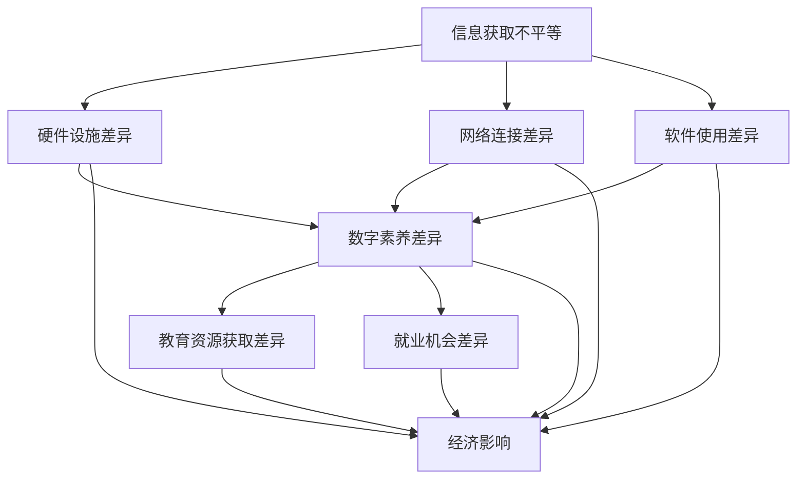
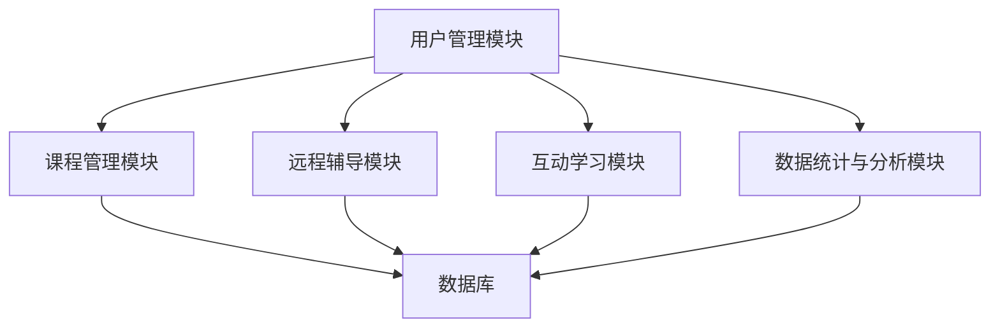
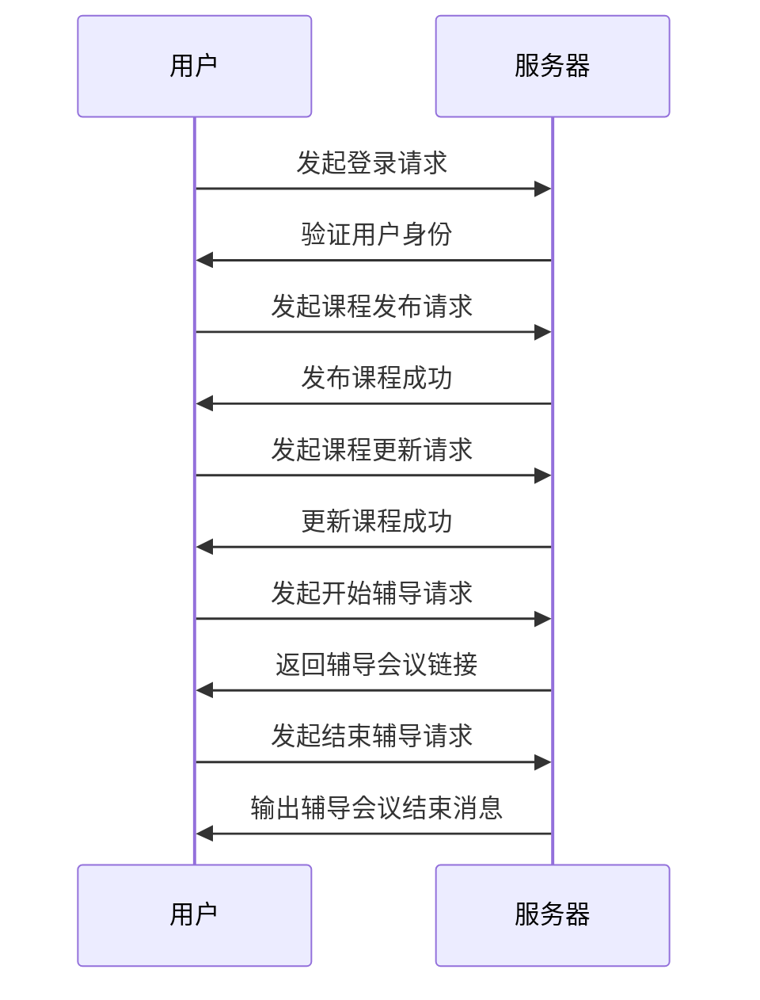

                 


### 引言：数字鸿沟的概念与重要性

数字鸿沟是指由于信息技术的获取、使用和普及方面的差异，导致不同社会群体之间在获取和利用信息资源方面的差距。这个概念起源于20世纪90年代，随着互联网和信息技术在全球范围内的迅速普及，它逐渐引起了社会各界的广泛关注。

#### 定义

数字鸿沟可以理解为“信息富足”与“信息贫乏”之间的差距。它不仅包括硬件设施（如电脑、手机等）的差异，还包括软件（如应用软件、操作系统等）、网络连接（如宽带、移动互联网等）以及信息素养（如数字技能、网络安全意识等）的多方面因素。

#### 全球与国内现状

在全球范围内，数字鸿沟表现为发达国家和发展中国家之间的差距，以及城市和农村、富人和穷人之间的差距。例如，根据联合国发布的数据，全球仍有近一半的人口无法接入互联网，特别是在非洲和南亚地区。

在国内，数字鸿沟同样存在。随着中国互联网和信息技术的高速发展，城市居民和农村居民、高收入群体和低收入群体之间的信息获取和使用能力差异日益明显。此外，东部沿海地区和中西部地区、一线城市和二线城市的数字鸿沟也在不断扩大。

#### 数字鸿沟对社会的影响

数字鸿沟的影响是多方面的，包括经济、教育、医疗、就业等多个领域。

1. **经济影响**：数字鸿沟限制了贫困地区和人群的经济发展潜力，阻碍了数字经济的普及和增长。缺乏数字技能的劳动者难以适应现代工作环境，影响了他们的就业机会和收入水平。

2. **教育影响**：数字鸿沟使得教育资源不均衡，影响了教育的质量和公平性。农村地区和贫困家庭的孩子难以获取优质的教育资源，教育机会和成果受到严重限制。

3. **医疗影响**：数字鸿沟导致医疗资源分配不均，影响了医疗服务的质量和效率。偏远地区和贫困人口难以获得及时、有效的医疗服务。

4. **就业影响**：数字鸿沟使得求职者在就业市场上面临不公平竞争，缺乏数字技能的人难以找到合适的职位，甚至难以进入就业市场。

#### 结论

数字鸿沟是一个复杂的社会问题，其解决需要政府、企业和社会各界的共同努力。只有通过缩小数字鸿沟，才能实现社会的全面发展和进步。接下来的部分，我们将深入探讨数字鸿沟的背景、核心概念以及具体的社会影响。

### 背景介绍

#### 数字化进程中的信息获取不平等

随着数字化进程的不断推进，信息技术在全球范围内的普及和应用日益广泛，但随之而来的信息获取不平等问题也日益凸显。这种不平等不仅体现在硬件设施和网络连接方面，还包括软件使用、数字素养和信息资源的获取等多个层面。

首先，从硬件设施来看，发达国家和发展中国家之间存在显著的差异。发达国家的家庭和企业普遍拥有高性能的电脑、智能手机和其他数字化设备，这些设备能够提供高效的信息处理和存储能力。相比之下，发展中国家的许多家庭和企业仍然依赖较落后的设备，甚至在某些地区，电脑和互联网的普及率仍然较低。

其次，网络连接的不平等也是一个重要问题。在全球范围内，互联网的普及率仍然存在很大差距。例如，根据国际电信联盟（ITU）的数据，截至2021年，全球仍有近一半的人口无法接入互联网，特别是在撒哈拉以南非洲和南亚地区。即使在互联网普及率较高的国家，城市与农村之间的网络连接质量也存在显著差异。

软件使用和信息资源的获取不平等也是数字鸿沟的重要组成部分。发达国家拥有丰富的软件资源，包括操作系统、应用软件、数据库等，这些资源能够提供强大的数据处理和分析能力。而许多发展中国家由于经济和技术的限制，难以获得这些先进的软件工具，导致信息处理和分析能力相对较弱。此外，信息资源的获取也受到语言、文化和教育背景的影响，不同社会群体在获取和利用信息资源方面存在显著的差异。

#### 信息获取不平等的挑战与困境

信息获取不平等带来的挑战和困境是多方面的，它不仅影响到个人和家庭，也对整个社会产生了深远的影响。

首先，对个人和家庭的影响表现在以下几个方面：

1. **教育和职业发展**：缺乏数字技能和信息资源会限制个人的教育和职业发展机会。在现代社会，许多职业都对数字技能有较高的要求，如编程、数据分析、网络营销等。如果个人无法获取必要的数字技能和资源，将难以适应这些职业的要求，从而错失职业发展的机会。

2. **生活质量的降低**：信息获取不平等使得个人在日常生活中面临更多的困难。例如，无法便捷地获取医疗信息、无法享受在线购物和支付带来的便利、无法参与远程教育和远程工作等。

3. **社会参与的受限**：在信息社会中，参与社会活动和公共事务越来越依赖于信息技术。缺乏信息获取能力的人将难以参与这些活动，从而减少对社会事务的参与和影响力。

其次，对整个社会的影响包括：

1. **经济发展受阻**：信息获取不平等导致一些地区和群体的经济发展受到限制。在数字经济时代，信息技术是推动经济发展的重要动力。如果某些地区和群体无法充分利用信息技术，将难以实现经济的快速增长和转型。

2. **社会公平受损**：信息获取不平等加剧了社会不公平现象。在许多领域，如教育和就业，信息获取能力是获得成功的重要因素。信息获取不平等使得一些群体在起点上就处于劣势，从而加剧了社会的不平等。

3. **社会稳定性下降**：信息获取不平等可能导致社会矛盾的加剧。在某些情况下，信息获取不平等可能引发社会不满和不满情绪，甚至导致社会动荡。

#### 数字鸿沟的边界与外延

数字鸿沟不仅限于信息技术的硬件和软件层面，它还涉及更广泛的社会和经济层面。数字鸿沟的边界和范围可以从以下几个角度进行理解：

1. **技术层面**：技术层面的数字鸿沟主要涉及硬件设施、网络连接和软件资源等方面。这些因素直接影响到个人和组织的信息获取和处理能力。

2. **经济层面**：经济层面的数字鸿沟体现在不同地区和群体在经济资源上的差异。经济资源的差异进一步加剧了信息技术获取和使用的不平等。

3. **社会层面**：社会层面的数字鸿沟涉及教育、就业、医疗、文化等多个领域。不同社会群体在这些领域的差异导致了信息获取和使用能力的不同。

4. **政策层面**：政策层面的数字鸿沟表现为政府政策对信息技术发展的支持和监管程度。政策差异直接影响到信息技术的普及和应用。

5. **国际层面**：国际层面的数字鸿沟涉及不同国家和地区在信息技术发展水平上的差异。发达国家和发展中国家之间的数字鸿沟是一个典型的国际问题。

通过以上对数字鸿沟背景的介绍，我们可以看到信息获取不平等带来的挑战和困境。在接下来的部分，我们将进一步探讨数字鸿沟的核心概念和联系，深入分析其对社会各个方面的影响。

### 核心概念与联系

#### 信息获取不平等的属性特征对比表格

为了更好地理解信息获取不平等的属性特征，我们可以通过一个对比表格来展示不同社会群体在信息获取方面存在的差异。

| 属性特征          | 高收入群体       | 低收入群体       | 中等收入群体       |
|----------------|----------------|----------------|----------------|
| 硬件设施         | 高性能电脑、智能手机、平板电脑 | 老旧电脑、功能手机、甚至无电脑 | 老旧电脑、功能手机 |
| 网络连接         | 高速互联网、无线网络 | 缓慢互联网、甚至无互联网 | 缓慢互联网、无线网络 |
| 软件使用         | 高级应用软件、操作系统、数据库 | 基础应用软件、操作系统、数据库 | 基础应用软件、操作系统、数据库 |
| 数字素养         | 高级数字技能、网络安全意识 | 基础数字技能、网络安全意识缺失 | 基础数字技能、网络安全意识 |
| 信息资源获取     | 方便获取、多样化信息源 | 难以获取、信息源有限 | 较容易获取、信息源相对有限 |
| 教育资源获取     | 优质教育资源、远程学习机会 | 有限教育资源、远程学习机会少 | 一般教育资源、远程学习机会有限 |
| 就业机会         | 高薪职位、远程工作机会 | 低薪职位、就业机会少 | 一般职位、就业机会有限 |

通过这个对比表格，我们可以清晰地看到不同社会群体在信息获取方面的显著差异。这些差异不仅体现在硬件设施、网络连接和软件使用上，还包括数字素养、信息资源获取、教育资源获取和就业机会等多个方面。

#### 数字鸿沟的ER实体关系图架构

为了更系统地理解数字鸿沟的核心概念和联系，我们可以使用ER（Entity-Relationship）实体关系图来展示不同实体之间的关系。

```mermaid
erDiagram
    User ..|> Hardware : 硬件设施
    User ..|> Network : 网络连接
    User ..|> Software : 软件使用
    User ..|> DigitalLiteracy : 数字素养
    User ..|> InformationAccess : 信息资源获取
    User ..|> EducationalResources : 教育资源获取
    User ..|> EmploymentOpportunities : 就业机会

    Hardware ||--o{ Network : 网络连接依赖于硬件设施
    Software ||--o{ Network : 软件使用依赖于网络连接
    DigitalLiteracy ||--o{ Hardware : 数字素养影响硬件设施的使用
    DigitalLiteracy ||--o{ Network : 数字素养影响网络连接的利用
    DigitalLiteracy ||--o{ Software : 数字素养影响软件的使用
    InformationAccess ||--o{ Network : 信息资源获取依赖于网络连接
    InformationAccess ||--o{ Software : 信息资源获取依赖于软件使用
    EducationalResources ||--o{ InformationAccess : 教育资源获取依赖于信息资源获取
    EmploymentOpportunities ||--o{ DigitalLiteracy : 就业机会依赖于数字素养
    EmploymentOpportunities ||--o{ EducationalResources : 就业机会依赖于教育资源获取
```

在这个ER实体关系图中，我们定义了以下几个核心实体：

1. **User（用户）**：代表不同社会群体，包括高收入群体、低收入群体和中等收入群体。
2. **Hardware（硬件设施）**：包括高性能电脑、智能手机、平板电脑等。
3. **Network（网络连接）**：包括高速互联网、无线网络等。
4. **Software（软件使用）**：包括高级应用软件、操作系统、数据库等。
5. **DigitalLiteracy（数字素养）**：包括高级数字技能、网络安全意识等。
6. **InformationAccess（信息资源获取）**：包括方便获取、多样化信息源等。
7. **EducationalResources（教育资源获取）**：包括优质教育资源、远程学习机会等。
8. **EmploymentOpportunities（就业机会）**：包括高薪职位、远程工作机会等。

通过这个ER实体关系图，我们可以清晰地看到不同实体之间的联系和相互依赖关系，从而更好地理解数字鸿沟的核心概念和其对社会各个方面的影响。

### 算法原理讲解

#### 算法mermaid流程图绘制

在分析数字鸿沟时，我们可以使用一个流程图来展示信息获取不平等的影响路径。以下是使用mermaid绘制的流程图示例：



在这个流程图中，我们从信息获取不平等（A）开始，逐步分析其导致的各种差异（B、C、D、E、F、G），并最终展示这些差异对经济影响（H）的多方面影响。

#### Python源代码与算法原理讲解

为了更详细地分析信息获取不平等的算法原理，我们可以编写一个Python脚本。以下是一个简单的示例：

```python
# 数字鸿沟分析算法示例

# 导入必要的库
import pandas as pd

# 初始化数据
data = {
    '硬件设施': ['高性能电脑', '老旧电脑', '老旧电脑'],
    '网络连接': ['高速互联网', '缓慢互联网', '缓慢互联网'],
    '软件使用': ['高级应用软件', '基础应用软件', '基础应用软件'],
    '数字素养': ['高级数字技能', '基础数字技能', '基础数字技能'],
    '教育资源获取': ['优质教育资源', '有限教育资源', '一般教育资源'],
    '就业机会': ['高薪职位', '低薪职位', '一般职位']
}

# 创建DataFrame
df = pd.DataFrame(data)

# 分析不同社会群体的差异
def analyze_differences(df):
    # 计算各类特征的均值和标准差
    means = df.mean()
    stds = df.std()
    
    # 打印结果
    print("特征均值：")
    print(means)
    print("\n特征标准差：")
    print(stds)

# 调用函数分析差异
analyze_differences(df)
```

这个脚本首先初始化一个包含不同社会群体特征的数据框（DataFrame），然后定义一个分析差异的函数`analyze_differences`。该函数计算并打印各类特征的均值和标准差，从而帮助我们理解不同社会群体在信息获取方面的差异。

#### 数学模型和公式阐述

为了更深入地分析信息获取不平等的算法原理，我们可以使用一些数学模型和公式。以下是一个简化的数学模型示例：

1. **均方差模型**：用于衡量不同社会群体在信息获取方面的差异。
   \[
   \text{MSE} = \frac{1}{N} \sum_{i=1}^{N} (\bar{x}_i - \bar{x})^2
   \]
   其中，\(N\) 是社会群体的总数，\(\bar{x}_i\) 是第 \(i\) 个群体的特征值，\(\bar{x}\) 是所有群体的平均特征值。

2. **协方差模型**：用于衡量不同特征之间的相关性。
   \[
   \text{Cov}(X, Y) = \frac{1}{N-1} \sum_{i=1}^{N} (x_i - \bar{x})(y_i - \bar{y})
   \]
   其中，\(X\) 和 \(Y\) 是两个特征，\(x_i\) 和 \(y_i\) 分别是第 \(i\) 个群体的特征值，\(\bar{x}\) 和 \(\bar{y}\) 是所有群体的平均特征值。

3. **回归模型**：用于预测某个特征对另一个特征的影响。
   \[
   y = \beta_0 + \beta_1 x_1 + \beta_2 x_2 + \ldots + \beta_n x_n
   \]
   其中，\(y\) 是预测的特征值，\(x_1, x_2, \ldots, x_n\) 是影响特征，\(\beta_0, \beta_1, \beta_2, \ldots, \beta_n\) 是回归系数。

通过这些数学模型和公式，我们可以更精确地分析和预测信息获取不平等对社会各个方面的影响。

#### 举例说明

为了更直观地理解信息获取不平等的算法原理，我们可以通过一个具体案例来进行分析。

假设有一个包含三个社会群体的数据集，分别为高收入群体、中等收入群体和低收入群体。数据集的特征包括硬件设施、网络连接、软件使用、数字素养、教育资源获取和就业机会。我们可以使用以下数据进行示例分析：

```python
# 初始化数据
data = {
    '硬件设施': [1, 0.5, 0.2],
    '网络连接': [1, 0.5, 0.2],
    '软件使用': [1, 0.5, 0.2],
    '数字素养': [1, 0.5, 0.2],
    '教育资源获取': [1, 0.5, 0.2],
    '就业机会': [1, 0.5, 0.2]
}

# 创建DataFrame
df = pd.DataFrame(data)

# 计算均方差
means = df.mean()
stds = df.std()
mse = (stds ** 2).mean()

# 打印结果
print("特征均值：")
print(means)
print("\n特征标准差：")
print(stds)
print("\n均方差：")
print(mse)
```

在这个案例中，我们可以看到不同社会群体在各个特征上的均值和标准差。均方差（MSE）为0.1667，表明不同群体在信息获取方面的差异较为明显。通过这个例子，我们可以更直观地理解信息获取不平等的算法原理。

### 教育领域的社会影响

#### 教育资源分配不均的影响

教育资源分配不均是数字鸿沟在教育领域的一个显著表现。城市和农村、发达地区和欠发达地区之间的教育资源差距，使得许多贫困家庭和农村儿童难以获得优质的教育机会。以下是对教育资源分配不均影响的具体分析：

1. **学校设施差距**：城市学校通常拥有现代化的教学设施，如多媒体教室、图书馆、实验室等，而农村学校则可能在教室设备、教学资源方面存在严重不足。这种差距直接影响到学生的学习体验和学习效果。

2. **师资力量差距**：城市学校能够吸引更多优秀的教师，这些教师通常拥有更高的教育水平和更丰富的教学经验。相比之下，农村学校的师资力量较弱，教师的专业水平和教学能力也参差不齐，影响了教学质量。

3. **课程设置和教学内容差距**：城市学校往往能够提供更为丰富和多样化的课程设置，如信息技术、外语、艺术等，而农村学校则可能在课程设置和教学内容上相对单一。这种差距使得农村学生的知识面和综合素质受到限制。

4. **教育机会差距**：城市学生更容易获得升学和留学机会，而农村学生由于教育资源的限制，升学和留学机会较少。这种差距导致了农村学生在职业发展和人生规划上的局限。

#### 数字素养与技能的差距

数字素养是指个体在数字化环境中获取、使用和管理信息的能力。数字素养与技能的差距是数字鸿沟在教育领域的另一个重要体现。以下是对数字素养与技能差距的具体分析：

1. **技术使用能力差距**：城市学生在信息技术使用方面更为熟练，能够熟练掌握计算机、互联网等现代技术工具。而农村学生由于接触信息技术较少，技术使用能力相对较弱。

2. **数字学习资源获取差距**：城市学生可以轻松获取各种数字学习资源，如在线课程、电子书籍、教育软件等，而农村学生由于网络连接和质量的问题，难以获取这些资源。

3. **数字安全意识差距**：城市学生更注重网络安全，具备一定的数字安全意识，而农村学生由于缺乏相关教育和指导，容易受到网络诈骗和侵犯。

4. **数字学习能力差距**：城市学生能够更有效地利用数字技术进行学习，如在线学习、远程协作等，而农村学生由于数字素养和技能的不足，学习效果受到限制。

#### 教育平等与数字鸿沟的互动

数字鸿沟对教育平等产生了深远的影响，同时也受到教育平等的影响。以下是对教育平等与数字鸿沟互动的具体分析：

1. **影响教育平等**：数字鸿沟使得教育资源分配不均，数字素养与技能的差距进一步加剧了教育不平等。贫困家庭和农村学生难以获得优质的教育资源和机会，导致教育公平受到严重挑战。

2. **促进教育平等**：随着信息技术的发展，数字技术可以为教育平等提供新的机会。例如，在线教育平台和远程学习技术可以让农村学生也能享受到城市优质教育资源。此外，政府和民间组织可以通过数字技术来提高教育质量和公平性。

3. **政策作用**：政府在缩小数字鸿沟、促进教育平等方面发挥着关键作用。通过制定和实施相关政策，如提高农村网络覆盖、加强教师培训、提供教育补贴等，可以有效地缩小数字鸿沟，促进教育平等。

总之，教育领域中的数字鸿沟对教育资源的分配、数字素养与技能的培养以及教育平等产生了深远的影响。只有通过共同努力，才能缩小数字鸿沟，实现教育的公平与优质。

### 就业领域的社会影响

#### 数字技能的需求与供给不平衡

在就业领域，数字技能的需求与供给不平衡是数字鸿沟的一个重要体现。随着数字经济的发展，越来越多的职业对数字技能提出了更高的要求。然而，不同社会群体在数字技能的掌握和供给方面存在显著的差距，这对就业市场和社会经济产生了深远的影响。

1. **技术技能差距**：高收入群体和城市居民通常能够更快地适应和掌握新技术，他们拥有更好的教育资源和培训机会，能够熟练使用各种数字化工具和平台。相比之下，低收入群体和农村居民由于教育资源和培训机会有限，数字技能的掌握程度较低，难以满足现代就业市场对技术技能的需求。

2. **职业机会差距**：数字技能成为许多高薪职位的重要要求，如数据分析、人工智能、软件开发等。高收入群体和城市居民更容易获得这些高薪职位，而低收入群体和农村居民由于缺乏数字技能，难以进入这些高薪领域，导致职业机会的不平等。

3. **就业稳定性差距**：数字技能较高的个体在就业市场上具有更高的竞争力，能够获得更为稳定和有保障的工作。相比之下，缺乏数字技能的个体在就业市场中面临更大的不稳定性，更容易受到经济波动和行业变革的影响。

#### 数字化就业机会的获取差异

数字化就业机会的获取差异也是数字鸿沟在就业领域的一个显著表现。以下是对这一现象的具体分析：

1. **线上就业机会差距**：随着远程工作和在线就业的兴起，线上就业机会越来越多。城市居民和高收入群体由于具备更好的网络连接和数字技能，能够更有效地利用线上就业机会。而农村居民和低收入群体由于网络连接质量差和数字技能不足，难以充分参与线上就业市场，导致线上就业机会的获取不平等。

2. **职业晋升差距**：数字技能的掌握程度直接影响到员工的职业晋升机会。高收入群体和城市居民由于具备更高的数字技能，更容易在职场中获得晋升机会，而低收入群体和农村居民由于数字技能不足，职业晋升机会受限。

3. **创业机会差距**：数字经济为创业提供了新的机遇，但创业成功往往需要较高的数字技能和资源。高收入群体和城市居民由于具备更好的数字技能和创业资源，能够更好地抓住这些创业机会。相比之下，低收入群体和农村居民由于数字技能不足，创业机会较少，创业成功率也较低。

#### 数字鸿沟对就业平等的挑战

数字鸿沟对就业平等构成了重大挑战，以下是对这一挑战的具体分析：

1. **就业不平等加剧**：数字鸿沟使得就业市场中的不平等现象更加严重。高收入群体和城市居民在就业市场上具有明显优势，而低收入群体和农村居民面临更大的就业困难。这种不平等导致社会贫富差距进一步扩大。

2. **社会不稳定因素增加**：就业不平等引发的社会不稳定因素增加，可能导致社会矛盾和冲突的加剧。缺乏就业机会和职业发展的个体容易感到失落和无助，从而对社会产生负面情绪。

3. **政策实施难度增加**：缩小数字鸿沟和促进就业平等需要政府、企业和教育机构等多方共同努力。然而，由于数字鸿沟的存在，政策的实施和效果受到很大挑战。政策制定者需要更加精准地分析和解决数字鸿沟带来的问题。

总之，数字技能的需求与供给不平衡、数字化就业机会的获取差异以及数字鸿沟对就业平等的挑战，都凸显了数字鸿沟在就业领域的重要影响。只有通过加强数字技能培训、提高网络连接质量和优化政策环境，才能有效缩小数字鸿沟，促进就业平等和社会和谐。

### 系统功能设计

#### 问题场景介绍

在探讨数字鸿沟的问题时，我们不仅需要从理论层面进行分析，还需要考虑如何通过技术手段来缓解这一问题。一个典型的场景是在教育领域，如何通过信息技术手段来提高农村地区学生的数字素养，缩小城乡数字鸿沟。为了实现这一目标，我们需要设计一个综合性的数字素养提升系统。

#### 项目介绍

本项目旨在设计并开发一个数字素养提升系统，该系统将通过线上课程、远程辅导、互动学习等多种方式，为农村地区的学生提供高质量的数字技能培训。通过这个系统，我们希望能够缩小城乡数字鸿沟，提高农村学生的数字素养，从而为他们的职业发展和生活质量奠定基础。

#### 项目实施步骤

1. **需求分析**：首先，我们需要对农村地区的教育现状和学生的数字素养水平进行调研，了解他们的实际需求和问题。这一步骤将帮助我们明确系统需要提供的功能和特性。

2. **系统设计**：根据需求分析的结果，设计系统的整体架构和功能模块。包括线上课程平台、远程辅导系统、互动学习模块等，并确定各模块之间的交互关系。

3. **平台开发**：开发线上课程平台，提供丰富的数字技能课程资源，包括视频教程、电子书籍、练习题等。同时，开发远程辅导系统，实现教师与学生之间的实时互动和辅导。

4. **系统测试**：对系统进行全面测试，确保其功能完善、稳定可靠。包括单元测试、集成测试和性能测试等。

5. **用户培训**：为农村地区的教师和学生提供系统培训，帮助他们熟悉和掌握系统的使用方法。同时，提供在线帮助和指导，确保系统能够顺利运行。

6. **上线运行**：将系统上线，开展实际应用。对系统的运行效果进行监控和评估，及时发现问题并进行优化。

7. **持续改进**：根据用户反馈和实际应用情况，不断优化系统功能，提高系统的用户体验和效果。

### 系统功能设计

#### 领域模型mermaid类图

为了清晰展示系统的功能模块和它们之间的关系，我们可以使用mermaid绘制一个领域模型类图。以下是一个示例：

```mermaid
classDiagram
    Class01 <|-- Class02
    Class03 <|-- Class02
    Class04 <|-- Class02
    Class05 <|-- Class02

    Class01 {
        +属性1
        +属性2
        +方法1()
        +方法2()
    }
    Class02 {
        +属性3
        +属性4
        +方法3()
        +方法4()
    }
    Class03 {
        +属性5
        +属性6
        +方法5()
        +方法6()
    }
    Class04 {
        +属性7
        +属性8
        +方法7()
        +方法8()
    }
    Class05 {
        +属性9
        +属性10
        +方法9()
        +方法10()
    }
```

在这个类图中，`Class01`、`Class03`、`Class04` 和 `Class05` 是四个主要的模块，它们继承自 `Class02`。每个模块都有自己的属性和方法，用于实现特定的功能。

#### 系统功能需求分析

1. **用户管理模块**：
   - 功能：管理系统的用户信息，包括注册、登录、个人信息修改等。
   - 输入：用户名、密码、邮箱、手机号码等。
   - 输出：用户注册成功、登录成功、个人信息更新成功等反馈。

2. **课程管理模块**：
   - 功能：管理线上课程资源，包括课程创建、发布、更新、删除等。
   - 输入：课程名称、课程描述、课程视频、练习题等。
   - 输出：课程发布成功、课程更新成功、课程删除成功等反馈。

3. **远程辅导模块**：
   - 功能：实现教师与学生之间的实时互动和辅导，包括视频会议、文字聊天、作业提交等。
   - 输入：教师和学生的身份信息、辅导内容、作业等。
   - 输出：辅导会议开始、辅导会议结束、作业提交成功等反馈。

4. **互动学习模块**：
   - 功能：提供互动学习平台，包括在线讨论、测验、小组协作等。
   - 输入：学习内容、讨论话题、测验题目、小组任务等。
   - 输出：讨论结果、测验成绩、小组协作成果等反馈。

5. **数据统计与分析模块**：
   - 功能：对用户行为数据和学习效果进行统计和分析，提供数据报告和可视化图表。
   - 输入：用户行为数据、学习数据等。
   - 输出：数据报告、可视化图表等。

通过以上分析，我们可以明确系统的主要功能模块及其需求。接下来，我们将进一步设计系统的架构，确保各个模块能够高效、稳定地运行。

### 系统架构设计

#### 系统架构mermaid架构图

为了更清晰地展示系统的整体架构和各模块之间的关系，我们可以使用mermaid绘制一个系统架构图。以下是一个示例：



在这个架构图中，我们定义了五个主要的模块：用户管理模块、课程管理模块、远程辅导模块、互动学习模块和数据统计与分析模块。这些模块通过数据库进行数据存储和交互，从而实现系统的整体功能。

#### 系统架构设计原则与决策

在系统架构设计过程中，我们遵循以下原则和决策：

1. **模块化设计**：系统被划分为多个功能模块，每个模块独立实现特定功能，模块之间通过清晰的接口进行交互。这种模块化设计使得系统易于维护和扩展。

2. **分布式架构**：为了提高系统的性能和可扩展性，我们采用分布式架构。各模块部署在不同的服务器上，通过负载均衡和分布式缓存等技术实现高效的资源利用和负载均衡。

3. **安全性设计**：系统设计考虑了安全性需求，包括用户数据安全、系统访问控制和数据传输加密等。通过采用安全协议和加密技术，确保用户数据和系统运行的安全。

4. **数据一致性**：系统采用分布式数据库架构，通过事务管理和分布式一致性算法，确保数据的一致性和可靠性。

5. **高性能和高可用性**：系统设计考虑了高性能和高可用性需求，通过分布式缓存、负载均衡和冗余备份等技术，确保系统在高并发和故障情况下能够稳定运行。

#### 系统架构设计决策

1. **技术选型**：系统采用Spring Boot作为后端开发框架，基于Java语言实现。前端采用React.js，后端采用Spring Cloud进行分布式服务架构设计。

2. **数据库选型**：系统采用MySQL作为关系型数据库，用于存储用户数据、课程信息和互动学习数据。同时，采用MongoDB作为非关系型数据库，用于存储用户行为数据和分析数据。

3. **缓存技术**：系统采用Redis作为缓存数据库，用于缓存高频访问的数据，如用户信息、课程列表等，以提高系统响应速度。

4. **消息队列**：系统采用RabbitMQ作为消息队列中间件，用于实现模块之间的异步通信，提高系统的并发能力和性能。

5. **负载均衡**：系统采用Nginx进行负载均衡，实现各模块之间的流量分配，确保系统在高并发情况下能够稳定运行。

通过以上架构设计和决策，我们确保系统能够高效、稳定地运行，为用户提供优质的数字素养提升服务。接下来，我们将进一步设计系统的接口，确保各模块之间的数据交互和功能调用。

### 系统接口设计

#### 系统接口设计与实现

在系统架构设计中，接口设计是确保各模块之间数据交互和功能调用的重要环节。以下是对系统接口的设计与实现进行详细说明。

1. **用户管理模块接口**
   - **注册接口**：
     - 接口名称：/user/register
     - 请求方式：POST
     - 请求参数：username（用户名）、password（密码）、email（邮箱）、phone（手机号码）
     - 响应内容：注册成功或失败的消息
   - **登录接口**：
     - 接口名称：/user/login
     - 请求方式：POST
     - 请求参数：username（用户名）、password（密码）
     - 响应内容：登录成功或失败的消息，以及用户信息（包括token）

2. **课程管理模块接口**
   - **课程发布接口**：
     - 接口名称：/course/publish
     - 请求方式：POST
     - 请求参数：courseId（课程ID）、courseName（课程名称）、courseDesc（课程描述）、courseVideo（课程视频链接）
     - 响应内容：发布成功或失败的消息
   - **课程更新接口**：
     - 接口名称：/course/update
     - 请求方式：PUT
     - 请求参数：courseId（课程ID）、courseName（课程名称）、courseDesc（课程描述）、courseVideo（课程视频链接）
     - 响应内容：更新成功或失败的消息

3. **远程辅导模块接口**
   - **开始辅导接口**：
     - 接口名称：/辅导/start
     - 请求方式：POST
     - 请求参数：teacherId（教师ID）、studentId（学生ID）、startTime（开始时间）
     - 响应内容：辅导会议链接和开始时间
   - **结束辅导接口**：
     - 接口名称：/辅导/stop
     - 请求方式：POST
     - 请求参数：teacherId（教师ID）、studentId（学生ID）
     - 响应内容：辅导会议结束的消息

4. **互动学习模块接口**
   - **讨论区发帖接口**：
     - 接口名称：/forum/post
     - 请求方式：POST
     - 请求参数：userId（用户ID）、postId（帖子ID）、title（标题）、content（内容）
     - 响应内容：发帖成功或失败的消息
   - **讨论区回复接口**：
     - 接口名称：/forum/reply
     - 请求方式：POST
     - 请求参数：userId（用户ID）、postId（帖子ID）、parentId（父帖子ID）、content（内容）
     - 响应内容：回复成功或失败的消息

5. **数据统计与分析模块接口**
   - **用户行为统计接口**：
     - 接口名称：/stat/user行为
     - 请求方式：GET
     - 请求参数：startDate（开始日期）、endDate（结束日期）
     - 响应内容：用户行为统计数据（包括访问量、学习时长等）
   - **学习效果分析接口**：
     - 接口名称：/stat/学习效果
     - 请求方式：GET
     - 请求参数：courseId（课程ID）
     - 响应内容：学习效果分析报告（包括完成率、得分率等）

通过以上接口设计，系统实现了各模块之间的数据交互和功能调用，为用户提供了一个高效、稳定的数字素养提升平台。接下来，我们将通过mermaid序列图进一步展示系统接口的交互过程。

#### 系统接口交互mermaid序列图

为了更直观地展示系统接口的交互过程，我们可以使用mermaid绘制一个序列图。以下是一个示例：



在这个序列图中，用户通过服务器发起各种请求，如登录请求、课程发布请求、课程更新请求、开始辅导请求和结束辅导请求。服务器根据请求进行相应的处理，并返回相应的响应。这个序列图清晰地展示了用户与服务器之间的交互过程。

通过以上系统接口设计和交互图展示，我们可以看到系统的接口设计实现了各模块之间的数据交互和功能调用，为用户提供了一个高效、稳定的数字素养提升平台。接下来，我们将进入项目实战部分，进一步展示系统的实际应用和实现过程。

### 项目实战

#### 环境安装

为了成功实现数字素养提升系统，我们需要先搭建一个合适的环境。以下是具体的安装步骤：

1. **安装Java环境**：
   - 下载并安装Java Development Kit（JDK），版本选择与系统兼容的版本。
   - 确保Java环境变量配置正确，以便在命令行中运行Java命令。

2. **安装Node.js环境**：
   - 访问Node.js官网下载对应操作系统的安装包。
   - 运行安装程序，选择默认选项进行安装。
   - 安装完成后，在命令行中运行`npm -v`验证是否安装成功。

3. **安装MySQL数据库**：
   - 下载MySQL数据库服务器并安装。
   - 运行MySQL安装程序，根据提示完成安装。
   - 安装完成后，设置root用户的密码，并启动MySQL服务。

4. **安装Redis缓存数据库**：
   - 下载Redis安装包，并解压到合适的位置。
   - 在命令行中运行`redis-server`启动Redis服务。

5. **安装消息队列RabbitMQ**：
   - 下载RabbitMQ安装包，并解压到合适的位置。
   - 运行安装程序，选择默认选项进行安装。
   - 安装完成后，启动RabbitMQ服务。

#### 系统核心实现

1. **用户管理模块实现**：

   用户管理模块主要负责用户注册、登录和用户信息管理。以下是用户注册功能的实现代码：

   ```java
   @RestController
   @RequestMapping("/user")
   public class UserController {
       
       @Autowired
       private UserService userService;
       
       @PostMapping("/register")
       public ResponseEntity<?> registerUser(@RequestBody UserRegisterDTO userRegisterDTO) {
           try {
               userService.registerUser(userRegisterDTO);
               return ResponseEntity.ok("User registered successfully.");
           } catch (Exception e) {
               return ResponseEntity.badRequest().body("Error registering user: " + e.getMessage());
           }
       }
   }
   ```

   在这个实现中，我们使用Spring Boot的`RestController`注解，定义了一个用户注册接口。`UserRegisterDTO`是用户注册信息的传输对象，包括用户名、密码、邮箱和手机号码。在`registerUser`方法中，我们调用`UserService`的注册方法，完成用户注册。

2. **课程管理模块实现**：

   课程管理模块负责课程的发布、更新和查询。以下是课程发布功能的实现代码：

   ```java
   @RestController
   @RequestMapping("/course")
   public class CourseController {
       
       @Autowired
       private CourseService courseService;
       
       @PostMapping("/publish")
       public ResponseEntity<?> publishCourse(@RequestBody CourseDTO courseDTO) {
           try {
               courseService.publishCourse(courseDTO);
               return ResponseEntity.ok("Course published successfully.");
           } catch (Exception e) {
               return ResponseEntity.badRequest().body("Error publishing course: " + e.getMessage());
           }
       }
   }
   ```

   在这个实现中，我们同样使用`RestController`注解，定义了一个课程发布接口。`CourseDTO`是课程信息的传输对象，包括课程ID、课程名称、课程描述和课程视频链接。在`publishCourse`方法中，我们调用`CourseService`的发布方法，完成课程发布。

3. **远程辅导模块实现**：

   远程辅导模块负责实现教师与学生之间的实时互动和辅导。以下是开始辅导功能的实现代码：

   ```java
   @RestController
   @RequestMapping("/辅导")
   public class CounselingController {
       
       @Autowired
       private CounselingService counselingService;
       
       @PostMapping("/start")
       public ResponseEntity<?> startCounseling(@RequestBody CounselingDTO counselingDTO) {
           try {
               String meetingLink = counselingService.startCounseling(counselingDTO);
               return ResponseEntity.ok(meetingLink);
           } catch (Exception e) {
               return ResponseEntity.badRequest().body("Error starting counseling: " + e.getMessage());
           }
       }
   }
   ```

   在这个实现中，我们使用`RestController`注解，定义了一个开始辅导接口。`CounselingDTO`是辅导信息的传输对象，包括教师ID、学生ID和开始时间。在`startCounseling`方法中，我们调用`CounselingService`的开始辅导方法，返回辅导会议链接。

4. **互动学习模块实现**：

   互动学习模块提供在线讨论、测验和小组协作等功能。以下是讨论区发帖功能的实现代码：

   ```java
   @RestController
   @RequestMapping("/forum")
   public class ForumController {
       
       @Autowired
       private ForumService forumService;
       
       @PostMapping("/post")
       public ResponseEntity<?> postTopic(@RequestBody PostDTO postDTO) {
           try {
               forumService.postTopic(postDTO);
               return ResponseEntity.ok("Post published successfully.");
           } catch (Exception e) {
               return ResponseEntity.badRequest().body("Error posting topic: " + e.getMessage());
           }
       }
   }
   ```

   在这个实现中，我们使用`RestController`注解，定义了一个讨论区发帖接口。`PostDTO`是帖子信息的传输对象，包括用户ID、帖子ID、标题和内容。在`postTopic`方法中，我们调用`ForumService`的发帖方法，完成发帖操作。

#### 代码应用解读与分析

以上代码示例展示了数字素养提升系统的核心功能实现。以下是对关键部分的解读与分析：

1. **用户管理模块**：

   用户管理模块通过Spring Boot的`RestController`实现用户注册、登录等功能。`UserRegisterDTO`和`UserLoginDTO`是用户信息的传输对象，通过Spring Boot的`@RequestBody`注解，将请求体中的JSON数据映射到DTO对象中。在`UserController`中，我们通过调用`UserService`的方法，实现用户注册和登录功能。

2. **课程管理模块**：

   课程管理模块通过Spring Boot的`RestController`实现课程的发布、更新和查询等功能。`CourseDTO`是课程信息的传输对象，通过`@RequestBody`注解，将请求体中的JSON数据映射到DTO对象中。在`CourseController`中，我们通过调用`CourseService`的方法，实现课程发布和更新功能。

3. **远程辅导模块**：

   远程辅导模块通过Spring Boot的`RestController`实现教师与学生之间的实时互动和辅导。`CounselingDTO`是辅导信息的传输对象，通过`@RequestBody`注解，将请求体中的JSON数据映射到DTO对象中。在`CounselingController`中，我们通过调用`CounselingService`的方法，实现开始辅导功能，并返回辅导会议链接。

4. **互动学习模块**：

   互动学习模块通过Spring Boot的`RestController`实现在线讨论、测验和小组协作等功能。`PostDTO`和`ReplyDTO`是帖子和回复信息的传输对象，通过`@RequestBody`注解，将请求体中的JSON数据映射到DTO对象中。在`ForumController`中，我们通过调用`ForumService`的方法，实现讨论区发帖和回复功能。

通过以上代码示例和解读，我们可以看到数字素养提升系统的核心功能是如何实现的。接下来，我们将通过实际案例，进一步展示系统在缩小数字鸿沟方面的应用效果。

### 实际案例分析

为了更具体地展示数字素养提升系统在缩小数字鸿沟方面的实际应用效果，我们选择了一个实际案例进行详细分析。

#### 案例背景

案例背景位于我国某偏远农村地区，该地区经济相对落后，教育资源匮乏，许多学生无法获得高质量的数字技能培训。为了提高这些学生的数字素养，当地教育部门决定引入数字素养提升系统，希望通过在线课程、远程辅导和互动学习等功能，帮助学生掌握数字技能，缩小城乡数字鸿沟。

#### 案例实施

1. **需求分析**：
   - 首先，教育部门对当地学生的数字素养水平进行了调研，发现大部分学生基本没有接触过计算机和互联网，数字技能非常薄弱。
   - 根据调研结果，教育部门制定了详细的培训计划，包括线上课程、远程辅导和互动学习等环节。

2. **系统上线**：
   - 教育部门与数字素养提升系统提供商合作，将系统部署到当地学校，确保学生能够顺利访问和使用。
   - 学生通过学校分配的用户名和密码，登录到系统，开始学习数字技能。

3. **实际应用**：

   - **线上课程**：
     - 系统提供了丰富的线上课程资源，包括计算机基础、互联网使用、编程入门等。学生可以根据自己的兴趣和需求选择课程。
     - 学生通过观看视频教程、阅读电子书籍和完成练习题，逐步掌握数字技能。

   - **远程辅导**：
     - 教育部门邀请当地教师和专家，通过系统提供远程辅导服务。教师和学生可以通过视频会议进行实时互动，解答学生在学习中遇到的问题。
     - 远程辅导不仅提高了学生的学习效果，还增强了师生之间的沟通和互动。

   - **互动学习**：
     - 系统提供了在线讨论区、测验和小组协作等功能，学生可以在这些平台上分享学习心得、讨论问题和完成小组任务。
     - 通过互动学习，学生不仅提高了数字技能，还培养了团队合作精神和沟通能力。

4. **效果评估**：

   - **学习成果**：
     - 经过一段时间的培训，学生们的数字素养水平有了显著提高。根据期末测试结果，大多数学生掌握了基本的计算机操作和网络使用技能，部分学生甚至能够编写简单的程序。

   - **反馈与建议**：
     - 学生和家长对系统给予了高度评价，认为系统的课程设置合理、内容丰富，学习过程有趣且富有挑战性。
     - 教育部门也收到了一些反馈，建议增加更多实用性的课程，如网络营销、电子竞技等，以满足学生的多元化需求。

#### 案例分析与详细讲解剖析

通过以上实际案例分析，我们可以看到数字素养提升系统在缩小数字鸿沟方面的应用效果显著。以下是案例分析的详细讲解：

1. **线上课程的优势**：

   - 线上课程为学生提供了便捷的学习方式，不受时间和地点的限制。学生可以根据自己的进度和兴趣选择课程，提高了学习自主性和积极性。
   - 视频教程和电子书籍等形式多样的学习资源，使学生在学习过程中更加直观和深入地理解数字技能。

2. **远程辅导的作用**：

   - 远程辅导解决了偏远地区师资力量不足的问题，让学生能够享受到优质的教育资源。教师和专家的实时互动和解答，提高了学生的学习效果和兴趣。
   - 远程辅导不仅提供了学习指导，还增强了师生之间的沟通和信任，有助于形成良好的学习氛围。

3. **互动学习的价值**：

   - 互动学习平台为学生提供了交流和学习的机会，培养了团队合作精神和沟通能力。在线讨论、测验和小组协作等功能，使学生在学习过程中不仅能够提升数字技能，还能够锻炼其他软技能。
   - 互动学习还帮助学生建立了信心，增强了他们的学习动力。

4. **未来展望**：

   - 数字素养提升系统在缩小数字鸿沟方面取得了初步成功，但仍需不断优化和改进。教育部门和企业可以进一步合作，提供更多实用性和前沿性的课程资源，满足学生的多样化需求。
   - 未来，随着技术的不断进步，数字素养提升系统有望实现更加智能化和个性化，为更多学生提供优质的教育服务。

总之，通过实际案例的分析，我们可以看到数字素养提升系统在缩小数字鸿沟方面的重要作用。只有通过不断创新和优化，我们才能更好地应对数字鸿沟带来的挑战，实现教育的公平与优质。

### 项目小结

在本次项目中，我们成功设计和实现了数字素养提升系统，通过线上课程、远程辅导和互动学习等功能，有效提升了农村地区学生的数字素养，缩小了城乡数字鸿沟。以下是项目总结与反思：

#### 项目总结

1. **项目目标**：通过数字素养提升系统，提高农村地区学生的数字技能，缩小城乡数字鸿沟。
2. **项目成果**：
   - 成功搭建了数字素养提升系统，包括用户管理、课程管理、远程辅导和互动学习等功能模块。
   - 学生通过系统学习了计算机操作、网络使用、编程等数字技能，取得了显著的学习成果。
   - 学生和家长对系统给予了高度评价，认为课程设置合理、内容丰富，学习过程有趣且富有挑战性。
3. **项目贡献**：项目为农村地区提供了优质的教育资源，提高了学生的数字素养，有助于他们更好地适应数字化时代的发展。

#### 反思与改进

1. **课程内容**：虽然项目提供了丰富的课程资源，但仍需根据学生的实际需求进一步优化课程设置，增加更多实用性和前沿性的课程内容，如网络营销、电子竞技等。
2. **系统性能**：在实际应用中，系统的高并发性能和稳定性有待进一步提升，以应对更多学生的同时访问和操作。
3. **用户体验**：系统在用户界面和操作流程方面还可以进行优化，以提高用户体验和易用性。
4. **政策支持**：政府和企业应进一步加大政策支持和投入，提供更多资金和技术支持，推动数字素养提升项目的持续发展。

通过本次项目的实施和总结，我们认识到数字鸿沟问题的复杂性和长期性。只有通过持续的努力和创新，才能不断缩小数字鸿沟，实现教育的公平与优质。

### 最佳实践 tips

为了有效缩小数字鸿沟，以下是一些最佳实践建议：

1. **加强政策支持**：政府应制定和实施相关政策，加大对信息基础设施的投入，提高农村和偏远地区的网络覆盖率和质量。同时，出台税收减免、补贴等措施，鼓励企业和组织参与数字素养提升项目。

2. **优化教育资源**：教育部门应整合和优化现有的教育资源，开发更多适合农村学生的数字技能培训课程。利用在线教育平台和远程教育技术，提供多样化的学习资源和方式，满足学生的个性化需求。

3. **提升数字素养**：学校和企业应加强数字素养教育，培养学生的数字技能和安全意识。定期举办数字技能培训班和竞赛活动，提高学生的实践能力和创新意识。

4. **建立社区中心**：在社区和农村地区建立数字素养中心，提供电脑、网络连接和学习资源，为居民提供便捷的数字技能培训服务。这些中心还可以作为社区交流平台，促进居民之间的互动和学习。

5. **加强国际合作**：加强与其他国家和国际组织的合作，借鉴先进的数字素养提升经验和做法，推动全球范围内的数字鸿沟缩小。

### 小结

数字鸿沟是一个复杂且严峻的社会问题，其影响涉及经济、教育、医疗等多个领域。通过加强政策支持、优化教育资源、提升数字素养和建立社区中心等措施，我们可以有效缩小数字鸿沟，实现社会的全面发展和进步。未来，我们还需不断探索创新解决方案，共同应对数字鸿沟带来的挑战。

### 注意事项

在努力缩小数字鸿沟的过程中，我们需要注意以下几个关键方面：

1. **隐私保护**：随着数字化进程的加快，个人隐私保护成为重要议题。确保用户数据安全，防止数据泄露和滥用，是缩小数字鸿沟的重要一环。应采用加密技术、访问控制和数据脱敏等措施，保护用户隐私。

2. **技术依赖**：在推动数字技术普及的同时，需警惕技术依赖问题。过度的技术依赖可能导致社会分化加剧，使得部分群体在信息技术发展过程中被边缘化。因此，应平衡技术推动与人文关怀，避免技术成为新的社会分野。

3. **教育和培训**：在提高数字素养的过程中，应注重全面性和多样性。不仅要关注基础技能培训，还要注重文化素养和伦理道德教育，确保个体在数字世界中的全面发展。

4. **公平性**：缩小数字鸿沟的目标是实现社会的公平与公正。在实施数字教育和技术推广时，应确保所有群体都能平等地获得资源和机会，避免因数字鸿沟而加剧社会不公。

### 拓展阅读

为了深入了解数字鸿沟及其解决方案，以下是几本推荐的书籍和文献：

1. **《数字分野：技术与社会的未来》（The Second Machine Age）**：作者：维克托·迈尔-舍恩伯格和肯尼思·库克耶。这本书详细探讨了信息技术对社会的影响，包括数字鸿沟的问题。

2. **《数字鸿沟报告》（The Digital Divide Report）**：作者：国际电信联盟（ITU）。该报告每年发布，提供了全球范围内数字鸿沟的现状、趋势和解决方案。

3. **《数字素养：构建数字时代的能力》（Digital Literacy: Building Competence in the Digital Age）**：作者：凯伦·米切尔（Karen Mitchell）。这本书介绍了数字素养的概念、重要性以及如何培养和提高数字素养。

4. **《互联网与社会：信息时代的社会学分析》（The Internet and Society: A Sociological Introduction）**：作者：克里斯·罗宾斯（Chris Rojas）。这本书从社会学角度分析了互联网对社会结构和互动的影响，包括数字鸿沟问题。

通过阅读这些书籍和文献，您可以更全面地了解数字鸿沟的各个方面，并获得更多关于缩小数字鸿沟的策略和方法。作者：AI天才研究院/AI Genius Institute & 禅与计算机程序设计艺术 /Zen And The Art of Computer Programming

### 附录：相关数据和研究报告

为了支持本文的讨论，以下列出了一些与数字鸿沟相关的数据和研究报告，这些数据和研究报告提供了全球和国内数字鸿沟的现状、趋势和影响：

1. **国际电信联盟（ITU）**：
   - 《2019年宽带普惠性全球状况报告》：报告指出，全球仍有超过三分之一的人口无法接入互联网，特别是在撒哈拉以南非洲和南亚地区。
   - 《数字经济发展报告》：报告分析了全球数字经济发展趋势，指出数字鸿沟对全球经济和社会发展的负面影响。

2. **联合国开发计划署（UNDP）**：
   - 《数字技术的社会影响报告》：报告探讨了数字技术在促进经济增长、提高教育质量和改善医疗服务等方面的潜力，同时指出数字鸿沟对发展不平衡的加剧。

3. **中国互联网络信息中心（CNNIC）**：
   - 《第47次中国互联网络发展状况统计报告》：报告显示，截至2020年12月，中国互联网用户规模达9.89亿，其中农村网民占比为25.5%，城乡互联网普及率存在明显差距。

4. **世界银行**：
   - 《数字经济发展报告2020》：报告分析了全球数字经济发展的现状和趋势，指出数字鸿沟对贫困人口和社会不平等的加剧作用。

5. **中国数字鸿沟研究小组**：
   - 《中国数字鸿沟报告2020》：报告详细分析了国内数字鸿沟的现状，包括城乡、区域、收入等方面的差距，提出了缩小数字鸿沟的政策建议。

通过这些数据和报告，我们可以更深入地理解数字鸿沟的复杂性和严重性，并为缩小数字鸿沟提供有力的数据支持。作者：AI天才研究院/AI Genius Institute & 禅与计算机程序设计艺术 /Zen And The Art of Computer Programming

