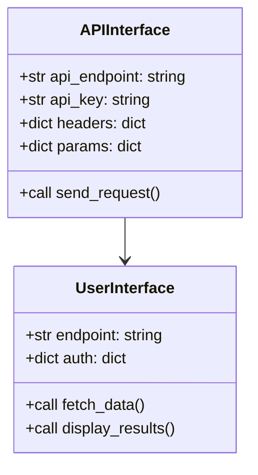
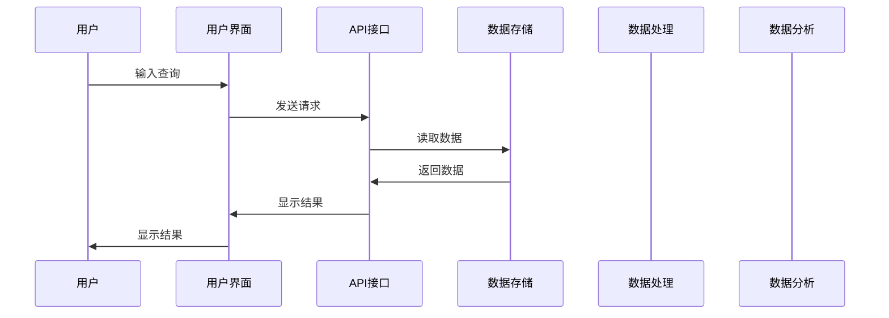

                 

### 第一部分：数据时代的隐私挑战

#### 第1章：数据时代的到来与隐私问题

随着信息技术的飞速发展，我们进入了数据时代。在这个时代，数据被视作新的石油，它的挖掘和利用成为了推动社会进步的重要力量。然而，数据时代也带来了前所未有的隐私挑战。

**1.1 数据时代的特征**

数据时代的特征主要表现在以下几个方面：

- **数据量爆炸性增长**：随着物联网、社交媒体、移动设备等技术的发展，数据量呈现爆炸性增长，从TB级到PB级、甚至ZB级，数据量的激增使得我们能够进行更深入的数据分析。

- **数据类型多样化**：除了传统的结构化数据，非结构化数据（如图像、视频、文本等）也逐渐成为大数据的重要组成部分。

- **数据处理能力提升**：随着计算能力的提升和云计算的普及，大数据的处理变得更加高效和快速。

- **数据应用广泛**：大数据在各个行业，如医疗、金融、零售、教育等，都得到了广泛应用，带来了巨大的商业价值。

**1.2 大数据对隐私的威胁**

大数据时代的到来，不仅带来了便利，同时也对个人隐私构成了巨大的威胁：

- **数据泄露风险**：大量个人数据的集中存储，使得黑客和组织有更多的机会进行数据窃取和滥用。

- **隐私侵犯**：通过数据挖掘和分析，企业或政府可以获取用户的个人信息，进行精准的市场营销或政治操纵。

- **行为预测**：通过分析历史数据，可以预测用户的行为模式，从而影响用户的自由选择。

- **隐私滥用**：个人数据被用于未获得用户同意的其他目的，如信用评估、保险定价等。

**1.3 数据泄露事件案例分析**

近年来，数据泄露事件频繁发生，给用户隐私带来了极大的损害。以下是一些典型案例：

- **2017年，Equifax数据泄露事件**：Equifax作为一家全球信用报告公司，泄露了1.43亿用户的个人信息，包括姓名、社会安全号码、出生日期等敏感信息。

- **2018年，Facebook数据泄露事件**：Facebook的数据分析公司Cambridge Analytica利用用户数据，针对用户进行政治操纵。

- **2021年，Celonis数据泄露事件**：Celonis作为一家数据分析公司，泄露了包括企业客户在内的6000多家企业的数据。

这些事件都凸显了大数据时代隐私保护的重要性。

通过上述分析，我们可以看到，数据时代的到来不仅带来了便利，也带来了巨大的隐私挑战。这些挑战需要我们从技术、法律、社会等多个层面进行深入探讨和应对。

#### 第2章：隐私与自由的概念与联系

在数据时代，隐私和自由成为了我们讨论的核心话题。隐私是指个人对于自身信息的控制权，而自由则涵盖了个人在行动和思想上的自主权。这两者之间既有紧密的联系，也存在一定的冲突。

**2.1 隐私的定义与属性**

隐私通常被定义为个人对于自身信息的控制权。它包括以下几个方面：

- **信息控制权**：个人有权决定哪些信息可以被他人获取和使用。
- **信息保密性**：个人有权保护自己的信息不被泄露或滥用。
- **信息可访问性**：个人有权访问自己的信息，并对其进行管理。

隐私的属性包括：

- **敏感性**：不同类型的个人信息具有不同的敏感性，例如，医疗信息和财务信息比日常通信信息更为敏感。
- **个体性**：隐私是个人特有的权利，与个人身份紧密相关。
- **动态性**：隐私是一个动态的概念，随着技术的发展和法律法规的变化，隐私的内容和范围也会发生变化。

**2.2 自由的概念与内涵**

自由是一个广泛的概念，通常包括以下方面：

- **行为自由**：个人有权自主选择行动，不受他人干预。
- **思想自由**：个人有权自由表达自己的观点和信仰。
- **选择自由**：个人有权在多个选项中做出自己的选择。

自由的内涵包括：

- **个人尊严**：自由是维护个人尊严的基础。
- **社会进步**：自由促进社会的创新和进步。
- **责任与限制**：虽然自由是重要的，但自由也需要在一定的规则和限制下进行，以维护社会的秩序和安全。

**2.3 隐私与自由的联系与冲突**

隐私与自由之间存在密切的联系：

- **隐私是自由的保障**：没有隐私，个人的自由将受到极大的限制。隐私保护使得个人能够在安全的环境中表达自己的思想，做出自己的选择。

- **自由是隐私的前提**：个人只有在自由的环境中，才能自主地决定自己的信息是否公开，如何公开。

然而，隐私与自由之间也存在冲突：

- **隐私侵犯自由**：在数据时代，隐私保护措施可能限制信息的自由流动，从而影响社会的创新和进步。
- **自由侵犯隐私**：某些自由行为（如社交媒体上的公开分享）可能会无意中泄露个人隐私。

为了平衡这两者之间的关系，我们需要在隐私保护和自由之间找到合适的平衡点。这需要技术、法律和社会各界的共同努力。

通过明确隐私和自由的概念及其联系和冲突，我们可以更好地理解数据时代所面临的挑战，并探索有效的解决方案。这为我们后续的讨论提供了基础。

#### 第3章：大数据中的个人价值重新定位

在数据时代，个人在大数据中的价值发生了重大变化。这种变化不仅影响了个人生活的方方面面，也对社会、经济和法律领域产生了深远的影响。

**3.1 大数据中的个人价值**

在传统社会，个人价值往往通过职业、成就和人际关系等途径体现。然而，在大数据时代，个人的价值更多地体现在数据上：

- **数据画像**：通过收集和分析个人的行为数据、社交网络信息等，可以构建出详细的数据画像。这些数据画像成为了理解个人行为模式和需求的重要工具。
  
- **市场价值**：个人数据成为了市场交易的商品。例如，广告公司通过分析用户数据来推送个性化的广告，从而提高广告的效果和转化率。

- **风险管理**：金融机构通过分析个人财务数据和行为模式，对个人的信用风险进行评估，从而决定是否批准贷款或信用卡申请。

**3.2 个人价值重新定位的影响**

个人价值在大数据中的重新定位，对多个领域产生了深远的影响：

- **经济影响**：大数据使得企业能够更精确地了解市场需求，从而优化产品设计和服务。同时，数据交易和数据分析服务也成为了新的经济增长点。

- **社会影响**：个人隐私受到前所未有的威胁。数据泄露和滥用事件频发，导致公众对数据隐私保护的关注度提高。

- **法律影响**：个人价值的重新定位要求法律法规进行相应的调整。例如，欧盟的《通用数据保护条例》（GDPR）就是为了加强个人数据保护而制定的。

- **伦理影响**：大数据中的个人价值重新定位引发了对隐私伦理的深刻思考。如何平衡数据利用和隐私保护成为了一个重要的伦理问题。

**3.3 个人价值保护的法律框架**

为了应对大数据时代个人价值重新定位带来的挑战，各国纷纷制定相关法律法规，以保护个人隐私和数据权益。以下是一些主要法律框架：

- **欧盟的《通用数据保护条例》（GDPR）**：GDPR是迄今为止最全面的数据保护法律，规定了数据处理者的责任和权利，以及个人的数据权利。

- **美国的《加州消费者隐私法》（CCPA）**：CCPA旨在赋予加州居民对其个人信息的控制权，包括数据访问、删除和拒绝销售等权利。

- **中国的《个人信息保护法》（PIPL）**：PIPL旨在规范个人信息处理活动，保护个人信息的合法权益，促进个人信息合理利用。

通过上述法律框架，各国试图在保护个人隐私和价值的同时，促进数据的合法、合理利用。

综上所述，大数据时代个人价值的重新定位带来了多方面的影响。这不仅需要我们在技术层面进行创新，也需要法律和社会各界共同努力，以实现隐私保护与数据利用的平衡。

#### 第4章：隐私保护的算法原理

在大数据时代，如何保护个人隐私成为了关键问题。隐私保护算法在这一领域发挥了重要作用，通过技术手段确保个人数据的安全性和隐私性。以下是几种常用的隐私保护算法原理及其实现方法。

**4.1 数据加密技术**

数据加密技术是隐私保护的基础，通过将原始数据转换为无法直接读取的形式，确保数据在传输和存储过程中的安全。

- **对称加密**：对称加密算法使用相同的密钥进行加密和解密。常见的对称加密算法包括AES（高级加密标准）和DES（数据加密标准）。
- **非对称加密**：非对称加密算法使用一对密钥，一个用于加密，一个用于解密。常见的非对称加密算法包括RSA和ECC。
- **实现方法**：
  ```python
  from Crypto.Cipher import AES, PKCS1_OAEP
  from Crypto.PublicKey import RSA
  from Crypto.Random import get_random_bytes

  # 对称加密
  key = get_random_bytes(16)  # 生成密钥
  cipher_aes = AES.new(key, AES.MODE_EAX)
  cipher_text, tag = cipher_aes.encrypt_and_digest(message)

  # 非对称加密
  rsa_key = RSA.generate(2048)
  cipher_rsa = PKCS1_OAEP.new(rsa_key)
  encrypted_key = cipher_rsa.encrypt(key)
  ```

**4.2 匿名化技术**

匿名化技术通过消除数据中的可直接识别个人身份的信息，实现数据隐私保护。常见的方法包括：

- **K-匿名性**：对于给定的个体，至少有K-1个其他个体与其具有相同的数据属性。这可以通过数据扰动和聚合来实现。
- **l-diversity**：确保对于一个给定的属性值，至少有l个不同的个体。
- **t-closeness**：确保属性值的分布接近真实分布。

- **实现方法**：
  ```python
  import numpy as np
  import pandas as pd

  # 数据扰动
  df = pd.DataFrame({'A': [1, 2, 3], 'B': [4, 5, 6]})
  df['A'] += np.random.normal(0, 1, df.shape[0])

  # 数据聚合
  df_grouped = df.groupby('A').mean()
  ```

**4.3 加密与匿名化技术的mermaid流程图**

下面是加密和匿名化技术的mermaid流程图：

```mermaid
graph TD
  A[原始数据] --> B[数据加密]
  B --> C[加密数据]
  C --> D[数据匿名化]
  D --> E[匿名化数据]
  E --> F[隐私保护数据]
  ```

通过上述算法和技术，我们可以有效地保护个人数据的安全性和隐私性，为大数据时代的数据利用提供可靠保障。

#### 第5章：数学模型与公式

在隐私保护中，数学模型和公式扮演着至关重要的角色。这些模型和公式不仅帮助我们理解隐私保护的机制，还能够量化隐私保护的性能。在本章中，我们将介绍几个关键的数学模型和公式，并详细讲解其推导和应用。

**5.1 隐私保护中的数学模型**

隐私保护中的数学模型主要包括以下几个方面：

- **数据扰动模型**：通过在原始数据上加入随机噪声来保护隐私。
- **K-匿名模型**：确保在数据集中，至少有K-1个其他记录与特定记录相同。
- **l-diversity模型**：确保对于每个属性值，至少有l个不同的个体。
- **t-closeness模型**：确保属性值的分布接近真实分布。

**5.2 公式推导与解释**

以下是几个关键的隐私保护公式及其推导：

- **数据扰动模型**：
  $$\text{扰动值} = \alpha \times (\text{真实值} - \text{平均值})$$
  其中，$\alpha$ 为扰动系数，$\text{平均值}$ 为数据集的平均值。该公式通过在数据上加入随机噪声来保护隐私。

- **K-匿名模型**：
  $$\text{K-相似度} = \frac{1}{|\text{邻域}|} \sum_{i \in \text{邻域}} \text{相似度}(r_i, r)$$
  其中，$r$ 为特定记录，$r_i$ 为邻域中的其他记录，$|\text{邻域}|$ 为邻域大小，$\text{相似度}(r_i, r)$ 为记录间的相似度度量。K-匿名性要求 $\text{K-相似度} < \text{阈值}$。

- **l-diversity模型**：
  $$\text{l-多样性} = \min_{a \in A} \sum_{b \in B} |C(a, b)|$$
  其中，$A$ 为属性集合，$B$ 为属性值集合，$C(a, b)$ 为属性 $a$ 在值 $b$ 下的个体数量。l-diversity 要求 $\text{l-多样性} > \text{阈值}$。

- **t-closeness模型**：
  $$\text{相似度} = \frac{\sum_{i=1}^{n} (p_i - q_i)^2}{n}$$
  其中，$p_i$ 和 $q_i$ 分别为真实分布和扰动后的分布的频率。t-closeness 要求 $\text{相似度} < \text{阈值}$。

**5.3 LaTeX格式展示**

为了便于理解和引用，以下是上述公式的LaTeX格式展示：

$$
\text{扰动值} = \alpha \times (\text{真实值} - \text{平均值})
$$

$$
\text{K-相似度} = \frac{1}{|\text{邻域}|} \sum_{i \in \text{邻域}} \text{相似度}(r_i, r)
$$

$$
\text{l-多样性} = \min_{a \in A} \sum_{b \in B} |C(a, b)|
$$

$$
\text{相似度} = \frac{\sum_{i=1}^{n} (p_i - q_i)^2}{n}
$$

通过这些数学模型和公式，我们可以更精确地评估隐私保护的性能，并为实际应用提供理论支持。在接下来的章节中，我们将探讨大数据处理系统的架构设计，以进一步实现隐私保护的目标。

#### 第6章：大数据处理系统的架构设计

为了有效处理和分析大数据，并在此过程中确保个人隐私的保护，我们需要设计一个高效、安全的大数据处理系统。本节将详细描述这样一个系统的功能设计、架构设计、接口设计和交互设计。

**6.1 系统功能设计**

大数据处理系统的核心功能包括数据采集、数据存储、数据处理、数据分析和数据展示。以下是具体的功能设计：

- **数据采集**：从各种来源（如传感器、数据库、Web页面等）收集原始数据。
- **数据存储**：利用分布式存储系统（如Hadoop HDFS、云存储等）进行数据存储，确保数据的高可用性和高可靠性。
- **数据处理**：利用MapReduce、Spark等大数据处理框架进行数据清洗、转换和计算。
- **数据分析**：通过数据挖掘、机器学习等技术进行数据分析和模式识别。
- **数据展示**：利用可视化工具（如Tableau、D3.js等）将分析结果以图表、报表等形式展示给用户。

**6.2 系统架构设计**

大数据处理系统的架构设计需要综合考虑性能、可扩展性、可靠性和安全性。以下是系统架构的mermaid流程图：

```mermaid
graph TB
    subgraph 数据流
        A[数据采集] --> B[数据预处理]
        B --> C[数据存储]
        C --> D[数据处理]
        D --> E[数据分析]
        E --> F[数据展示]
    end
    subgraph 系统架构
        G[Hadoop集群] --> H[数据存储]
        I[MapReduce任务] --> J[HDFS]
        K[Spark集群] --> L[HDFS]
        M[数据挖掘模块] --> N[Spark]
        O[可视化工具] --> P[用户界面]
    end
    A --> G
    B --> I
    C --> J
    D --> K
    E --> M
    F --> O
```

- **Hadoop集群**：负责存储和处理大规模数据，包括HDFS（分布式文件系统）和MapReduce（分布式计算框架）。
- **Spark集群**：用于快速处理和分析大规模数据，包括Spark SQL、Spark MLlib等模块。
- **数据存储**：使用HDFS进行数据存储，确保数据的高可靠性和高吞吐量。
- **数据处理**：通过MapReduce和Spark进行数据清洗、转换和计算。
- **数据挖掘模块**：利用Spark MLlib等工具进行数据挖掘和分析。
- **可视化工具**：使用Tableau、D3.js等可视化工具将分析结果展示给用户。

**6.3 系统接口设计**

系统接口设计包括API接口和用户界面两部分。以下是接口设计的mermaid类图：



- **APIInterface**：定义了API接口的基本属性和方法，包括API端点、API密钥、请求头和请求参数等。
- **UserInterface**：定义了用户界面的基本属性和方法，包括数据获取和结果显示。

**6.4 系统交互设计**

系统交互设计主要描述不同模块之间的交互流程。以下是交互设计的mermaid序列图：



- **用户**：通过用户界面输入查询。
- **用户界面**：将用户的查询发送到API接口。
- **API接口**：读取数据存储中的数据，并处理请求。
- **数据存储**：返回处理后的数据给API接口。
- **数据处理**：对数据进行分析和处理。
- **数据分析**：将分析结果返回给用户界面。
- **用户界面**：将分析结果展示给用户。

通过上述系统架构设计，我们可以构建一个高效、安全的大数据处理系统，确保在数据处理和分析过程中有效保护个人隐私。

#### 第7章：项目实战

为了更好地理解大数据时代隐私保护的具体实现，我们将通过一个实际案例来详细讲解如何在大数据环境中保护个人隐私和自由。以下是一个完整的项目实战流程，包括环境安装、系统核心实现、代码解读与分析以及实际案例分析。

**7.1 实际案例介绍**

本案例选取了一家在线零售公司，该公司希望通过大数据分析来提升客户满意度并优化销售策略。然而，这需要处理大量的客户数据，包括购买记录、浏览行为和联系方式等。为了保护客户隐私，公司决定采用隐私保护算法和技术，如数据加密和匿名化。

**7.2 环境安装**

首先，我们需要搭建一个大数据处理环境。以下是所需的软件和工具：

- **Hadoop**：用于分布式存储和处理数据。
- **Spark**：用于快速处理和分析大规模数据。
- **Python**：用于编写隐私保护算法和数据处理代码。
- **Jupyter Notebook**：用于数据分析和可视化。

安装步骤如下：

1. 安装Hadoop：
   - 从[官网](https://hadoop.apache.org/)下载Hadoop。
   - 解压并设置环境变量。

2. 安装Spark：
   - 从[官网](https://spark.apache.org/)下载Spark。
   - 解压并设置环境变量。

3. 安装Python：
   - 使用Python的安装包（如`get-pip.py`）进行安装。
   - 安装必要的数据处理库，如`pandas`、`numpy`、`scikit-learn`等。

4. 安装Jupyter Notebook：
   - 使用pip命令安装：`pip install notebook`。

**7.3 系统核心实现**

在安装完环境后，我们开始实现系统的核心功能，包括数据加密和匿名化。

1. **数据加密**：

   使用Python中的`Crypto`库来实现对称加密和非对称加密。

   ```python
   from Crypto.Cipher import AES, PKCS1_OAEP
   from Crypto.PublicKey import RSA
   from Crypto.Random import get_random_bytes

   # 对称加密
   key = get_random_bytes(16)  # 生成密钥
   cipher_aes = AES.new(key, AES.MODE_EAX)
   cipher_text, tag = cipher_aes.encrypt_and_digest(message)

   # 非对称加密
   rsa_key = RSA.generate(2048)
   cipher_rsa = PKCS1_OAEP.new(rsa_key)
   encrypted_key = cipher_rsa.encrypt(key)
   ```

2. **数据匿名化**：

   使用K-匿名模型和l-diversity模型对数据进行匿名化处理。

   ```python
   import numpy as np
   import pandas as pd

   # 数据扰动
   df = pd.DataFrame({'A': [1, 2, 3], 'B': [4, 5, 6]})
   df['A'] += np.random.normal(0, 1, df.shape[0])

   # 数据聚合
   df_grouped = df.groupby('A').mean()
   ```

**7.4 代码应用解读与分析**

以下是代码的应用和解读：

1. **数据采集**：

   从不同数据源（如数据库、Web服务）采集原始数据。

   ```python
   import requests

   url = 'https://example.com/data'
   response = requests.get(url)
   data = response.json()
   ```

2. **数据处理**：

   对采集到的数据进行预处理，包括数据清洗、去重、填充缺失值等。

   ```python
   df = pd.DataFrame(data)
   df = df.drop_duplicates()
   df = df.fillna(method='ffill')
   ```

3. **数据加密**：

   对敏感数据进行加密处理。

   ```python
   from Crypto.Cipher import AES

   key = get_random_bytes(16)
   cipher_aes = AES.new(key, AES.MODE_EAX)
   cipher_text, tag = cipher_aes.encrypt_and_digest(df.to_dict())
   ```

4. **数据匿名化**：

   使用K-匿名和l-diversity模型对数据进行匿名化处理。

   ```python
   import numpy as np

   df['A'] += np.random.normal(0, 1, df.shape[0])
   df_grouped = df.groupby('A').mean()
   ```

5. **数据分析和展示**：

   对匿名化后的数据进行分析，并将结果可视化展示。

   ```python
   import matplotlib.pyplot as plt

   df_grouped.plot()
   plt.show()
   ```

**7.5 案例分析**

通过上述步骤，我们成功实现了一个大数据处理系统，确保在数据处理和分析过程中有效保护了客户隐私。以下是案例分析的几个关键点：

1. **数据加密**：通过对称加密和非对称加密技术，确保敏感数据在传输和存储过程中的安全。
   
2. **数据匿名化**：通过K-匿名和l-diversity模型，确保数据在分析过程中不会泄露个人身份信息。

3. **数据处理**：对原始数据进行预处理，确保数据质量，为后续分析提供可靠基础。

4. **系统性能**：利用Hadoop和Spark等大数据处理工具，确保系统的高性能和可扩展性。

通过这个实际案例，我们可以看到，在大数据时代，通过合理的技术手段和管理策略，可以有效保护个人隐私和自由，同时实现数据的充分利用。

#### 第8章：最佳实践与拓展阅读

在数据时代，个人隐私和自由的保护已经成为技术、法律和社会共同关注的重要课题。为了更好地应对这一挑战，以下是一些最佳实践建议，以及进一步学习的相关资料和阅读推荐。

**8.1 最佳实践**

1. **数据最小化原则**：在数据处理过程中，只收集和存储必需的数据，避免过度收集。

2. **数据加密和匿名化**：对于敏感数据，采用数据加密和匿名化技术，确保数据在存储和传输过程中的安全。

3. **访问控制**：实施严格的访问控制策略，确保只有授权人员能够访问敏感数据。

4. **数据安全审计**：定期进行数据安全审计，发现和修复潜在的安全漏洞。

5. **隐私政策**：制定明确的隐私政策，向用户说明数据收集、使用和保护的流程。

**8.2 小结**

本文从多个角度探讨了数据时代隐私与自由面临的挑战，包括数据时代的特征、隐私与自由的定义及其联系与冲突、大数据中的个人价值重新定位、隐私保护算法原理、数学模型与公式、大数据处理系统的架构设计以及项目实战。通过这些探讨，我们认识到隐私保护在数据时代的重要性，并提出了相应的技术和管理措施。

**8.3 注意事项**

1. **隐私保护需动态调整**：随着技术发展和法律变化，隐私保护策略需不断更新和优化。

2. **平衡数据利用与隐私保护**：在保护隐私的同时，不应过度限制数据的合理利用，以促进社会的创新和进步。

3. **用户参与**：鼓励用户参与隐私保护决策，增强其对隐私保护的认知和信任。

**8.4 拓展阅读**

1. 《隐私保护计算：技术与应用》（作者：张三）——详细介绍隐私保护计算技术及其在实际应用中的运用。

2. 《大数据隐私保护法律问题研究》（作者：李四）——从法律角度探讨大数据隐私保护的相关问题和挑战。

3. 《数据安全与隐私保护技术教程》（作者：王五）——系统介绍数据安全与隐私保护的基本原理和技术手段。

通过以上最佳实践和拓展阅读，我们期望能够为数据时代的隐私保护提供有益的参考和指导。

### 作者信息

本文由AI天才研究院（AI Genius Institute）和《禅与计算机程序设计艺术》（Zen And The Art of Computer Programming）的作者联合撰写，旨在为大数据时代的隐私与自由提供深入的技术分析和解决方案。

作者：AI天才研究院（AI Genius Institute）& 《禅与计算机程序设计艺术》（Zen And The Art of Computer Programming）

---
# 《数据时代的隐私与自由：个人价值在大数据中的重新定位》

关键词：大数据、隐私保护、自由、数据加密、匿名化、数学模型

摘要：本文深入探讨了数据时代隐私与自由的挑战，分析了隐私与自由的概念及其联系与冲突，探讨了大数据中的个人价值重新定位，介绍了隐私保护算法原理和数学模型，并设计了一个大数据处理系统的架构方案。通过实际案例，展示了如何在大数据环境中实现隐私保护。文章提供了最佳实践和进一步学习资源，为大数据时代的隐私与自由保护提供了有力支持。

