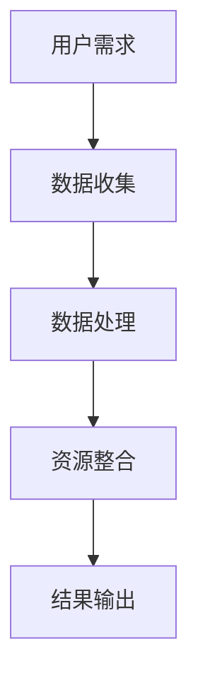

                 

```<sop>
# 整合与碎片：现代生活中的意义困境

> 关键词：整合、碎片化、现代生活、意义困境、技术优化、心理影响

> 摘要：随着现代社会的发展和技术的进步，整合与碎片化已成为现代生活中的重要现象。本文将深入探讨整合与碎片化的背景、困境及其解决策略，旨在帮助读者在复杂多变的现代生活中找到整合与碎片化的平衡点，提升生活质量。

---

### 第1章：整合与碎片：现代生活的背景与挑战

#### 1.1 问题背景与现象描述

##### 1.1.1 现代社会的变迁

- **城市化与数字化**：随着城市化进程的加快，人们的生活越来越依赖数字技术。从手机、电脑到智能家居，数字技术已经成为现代生活的核心。
- **信息爆炸**：互联网、社交媒体、智能设备等，使信息获取变得异常便捷，但同时也带来了信息过载。每天，我们都被大量的信息所包围，难以有效处理。

##### 1.1.2 整合与碎片化的生活状态

- **整合**：人们在追求工作效率和资源优化时，倾向于整合各种工具、平台和应用，以提高生活质量和效率。例如，使用一站式服务平台来管理日常事务。
- **碎片化**：另一方面，快节奏的生活和不断变化的需求，导致人们习惯于分散的信息获取和短暂的关注。例如，使用不同的社交媒体应用来获取信息。

#### 1.2 问题描述与意义困境

##### 1.2.1 整合的困境

- **资源整合难度**：信息和技术资源的整合并非易事，往往涉及到技术兼容性、数据安全等问题。这使得整合变得复杂且成本高昂。
- **认知负担**：整合过程中的复杂性和细节，可能导致人们的认知负担加重。人们需要在多个平台和应用之间切换，难以形成统一的整体认知。

##### 1.2.2 碎片化的困境

- **信息碎片化**：过多零散信息容易导致注意力分散，难以形成深度思考和系统性理解。人们可能在细节上花费大量时间，但难以把握全局。
- **心理困境**：碎片化的生活方式可能导致焦虑、不安等心理问题。人们在面对信息过载时，往往感到无助和压力。

#### 1.3 问题解决：整合与碎片化的平衡

##### 1.3.1 整合的策略

- **技术整合**：利用现有技术手段，如大数据分析、人工智能等，实现资源的高效整合。通过技术手段，可以降低整合的难度和成本。
- **认知整合**：培养深度学习和系统思维的能力，提高对碎片化信息的整合能力。通过提高自身认知水平，可以更好地处理和利用碎片化信息。

##### 1.3.2 碎片化的优化

- **信息筛选**：通过有效筛选，获取高质量、有价值的信息。人们需要学会如何从大量信息中识别出真正重要的部分。
- **碎片化利用**：合理利用碎片时间，进行学习、思考和创意工作。碎片化时间可以用于进行一些简单的任务，如阅读、思考或规划。

#### 1.4 边界与外延

##### 1.4.1 整合与碎片化的边界

- **度**：如何在整合与碎片化之间找到平衡，是关键所在。过度整合可能导致复杂性增加，而过度碎片化则可能导致效率降低。
- **个体差异**：不同的人在不同的生活阶段，对于整合与碎片化的需求有所不同。例如，年轻人在追求创新和灵活性时，可能更倾向于碎片化，而年长者则可能更倾向于整合。

##### 1.4.2 外延影响

- **社会层面**：整合与碎片化现象对教育、工作、社交等方面的影响。整合有助于提高整体社会的效率和创新能力，而碎片化则可能导致个体之间的隔阂和孤立。
- **科技发展**：新技术的出现可能会改变整合与碎片化的现状。例如，5G技术的普及可能会使信息传输更加高效，从而促进整合；而人工智能的进步则可能使碎片化信息更容易被处理和利用。

#### 1.5 本章小结

本章介绍了现代生活中整合与碎片化的背景、问题及其解决策略，为后续章节的深入探讨奠定了基础。

---

### 第2章：核心概念与联系

#### 2.1 核心概念定义

##### 2.1.1 整合

整合指的是将分散的资源、信息或要素有机结合，形成一个整体，以实现更高的效率和效果。在技术领域，整合通常涉及系统、平台或数据的整合，以提供更全面的解决方案。

##### 2.1.2 碎片化

碎片化是指信息、资源或活动的分散化、片段化，通常表现为信息的碎片化、时间的碎片化等。在技术领域，碎片化可能导致信息的过载和处理的复杂性。

#### 2.2 概念属性特征对比表格

| 特征           | 整合                         | 碎片化                       |
| -------------- | ---------------------------- | ---------------------------- |
| 效率           | 高                          | 低                          |
| 知识深度       | 较深                         | 较浅                         |
| 注意力管理     | 需要集中                     | 需要分散                     |
| 认知负担       | 较大                         | 较小                         |
| 适应能力       | 对变化适应能力较弱           | 对变化适应能力较强           |

#### 2.3 ER实体关系图架构

```mermaid
erDiagram
  User ||--|{ Device }|>
  Device ||--|{ Application }|>
  Application ||--|{ Content }|>
  Content ||--|{ Interaction }|>
  User ||--|{ Interaction }|>
```

#### 2.4 整合与碎片化的联系

- 整合与碎片化是现代生活中相互交织的两个方面，二者之间存在动态的平衡关系。
- 通过有效的整合策略，可以优化碎片化带来的负面影响；通过合理的碎片化利用，可以提高整合的效果。

#### 2.5 整合与碎片化的平衡

在整合与碎片化之间找到平衡，是现代生活的重要挑战。以下是一些策略：

- **技术整合**：利用现有技术手段，如大数据分析、人工智能等，实现资源的高效整合。通过技术手段，可以降低整合的难度和成本。
- **认知整合**：培养深度学习和系统思维的能力，提高对碎片化信息的整合能力。通过提高自身认知水平，可以更好地处理和利用碎片化信息。
- **信息筛选**：通过有效筛选，获取高质量、有价值的信息。人们需要学会如何从大量信息中识别出真正重要的部分。
- **碎片化利用**：合理利用碎片时间，进行学习、思考和创意工作。碎片化时间可以用于进行一些简单的任务，如阅读、思考或规划。

#### 2.6 边界与外延

- **边界**：整合与碎片化的边界在于如何平衡效率与认知负担。过度整合可能导致复杂性增加，而过度碎片化则可能导致效率降低。
- **外延影响**：整合与碎片化现象对教育、工作、社交等方面的影响。整合有助于提高整体社会的效率和创新能力，而碎片化则可能导致个体之间的隔阂和孤立。新技术的出现可能会改变整合与碎片化的现状。

#### 2.7 本章小结

本章介绍了整合与碎片化的核心概念及其特征，并通过ER实体关系图和对比表格，探讨了整合与碎片化的联系和平衡策略。这些概念和策略为理解现代生活中的整合与碎片化提供了理论基础。

---

### 第3章：算法原理讲解

#### 3.1 整合算法的mermaid流程图



#### 3.2 整合算法的Python源代码

```python
# 整合算法的Python实现

def integrate_data(user需求):
    # 数据收集
    data = collect_data(user需求)
    
    # 数据处理
    processed_data = process_data(data)
    
    # 资源整合
    integrated_data = integrate_resources(processed_data)
    
    # 结果输出
    output_result(integrated_data)

# 数据收集函数
def collect_data(user需求):
    # 根据用户需求收集数据
    data = []
    for需

