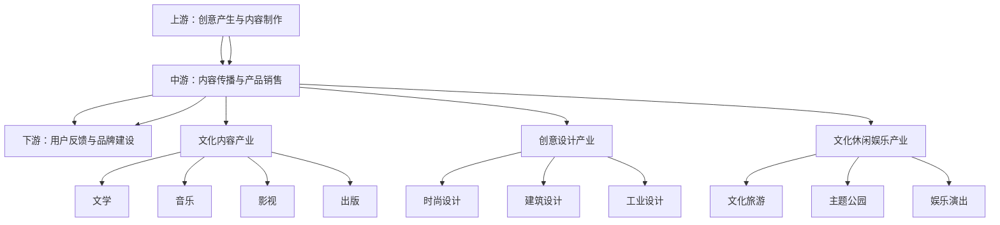
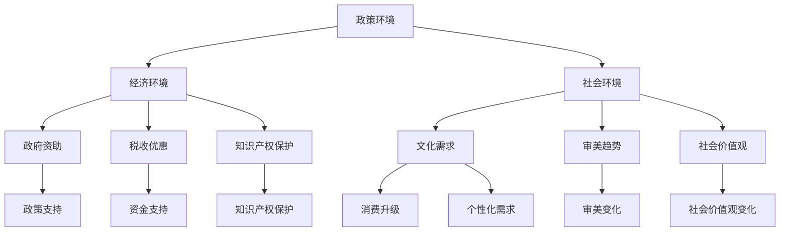
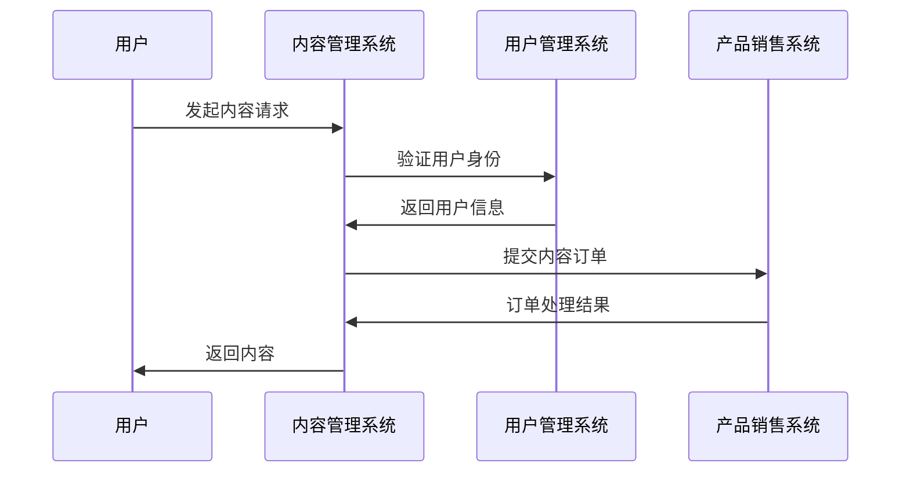
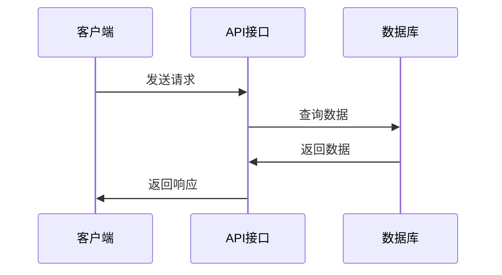
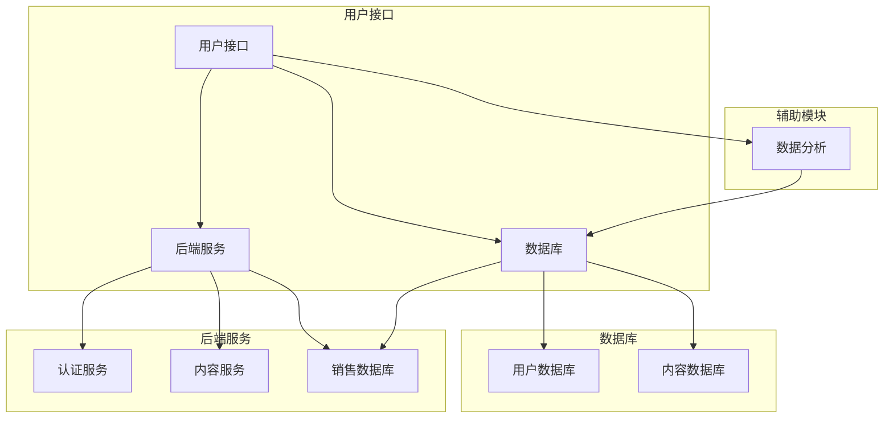

                 

# 文化创意产业：在创造中寻找社会价值

## 关键词
文化创意产业、创意与创新、经济价值、文化价值、社会价值

## 摘要
本文将深入探讨文化创意产业的内涵与外延，分析其在现代社会中的重要性，以及创意与创新在推动产业发展中的作用。通过梳理文化创意产业的核心概念、行业结构、影响因素，我们希望能为读者提供一个全面、深入的理解，并探讨如何在这种产业中创造社会价值。

## 第1章 文化创意产业概述

### 1.1 文化创意产业的背景与发展

#### 1.1.1 文化创意产业的起源

文化创意产业这一概念起源于20世纪80年代的英国。当时，英国政府提出“创意产业”的概念，旨在推动文化产业的发展，并将其视为经济增长的新动力。这一概念在全球范围内迅速传播，并在各国得到了广泛的应用和发展。

**定义**：文化创意产业是指通过创意和创新来开发文化产品和服务的产业。

**特点**：文化性、创新性、产业性、综合性。

#### 1.1.1.2 文化创意产业的形成与发展

**形成**：20世纪80年代，英国政府首次提出“创意产业”的概念。

**发展**：全球范围内，文化创意产业逐渐成为经济增长的重要引擎。

#### 1.1.2 文化创意产业在现代社会中的价值

**经济价值**：文化创意产业为全社会提供了大量的就业机会，并带动了相关产业链的发展。例如，广告、影视、出版、设计等领域都受益于文化创意产业的快速发展。

**文化价值**：通过文化创意产品，传统文化得到了传承和弘扬，同时也促进了不同文化之间的交流与融合。

**社会价值**：文化创意产业不仅满足了人们的精神文化需求，还在一定程度上推动了社会进步和文化创新。

#### 1.1.3 文化创意产业的边界与外延

**边界**：文化创意产业与传统文化产业的主要区别在于，文化创意产业更强调创意和创新的引领作用。

**外延**：文化创意产业涵盖了设计、时尚、影视、音乐、文学、广告、艺术等多个领域。同时，它也在不断与其他行业的融合与互动，如科技、旅游、教育等。

### 1.2 文化创意产业的核心概念

#### 1.2.1 创意与创新

**创意的本质**：创意是指产生新颖且有价值的想法或概念。

**特点**：独创性、创新性、实用性。

**创新的过程**：发现需求、产生创意、实施创意、评估效果。

**方法**：头脑风暴、设计思维、用户研究等。

#### 1.2.2 文化产品与服务

**文化产品的定义**：文化产品是指具有文化内涵、传递文化价值的物质或非物质形态。

**类型**：艺术品、出版物、影视作品、音乐作品等。

**文化服务的特点**：文化性、服务性、多样性。

**类型**：文化活动、文化展示、文化体验等。

### 1.3 文化创意产业的行业结构

#### 1.3.1 文化创意产业的分类

**主要领域**：

1. 文化内容产业：包括文学、音乐、影视、出版等。
2. 创意设计产业：包括时尚设计、建筑设计、工业设计等。
3. 文化休闲娱乐产业：包括文化旅游、主题公园、娱乐演出等。

#### 1.3.2 文化创意产业的核心企业

**特点**：具备强大的创意创新能力、广泛的产业链整合能力。

**案例**：华纳兄弟、迪士尼、索尼等。

#### 1.3.3 文化创意产业的产业链

**构成**：

1. 上游：包括创意产生、内容制作等环节。
2. 中游：包括内容传播、产品销售等环节。
3. 下游：包括用户反馈、品牌建设等环节。

### 1.4 文化创意产业的影响因素

#### 1.4.1 政策环境

**政策支持**：政府出台一系列政策，支持文化创意产业的发展。

**措施**：资金支持、税收优惠、知识产权保护等。

#### 1.4.2 经济环境

**影响**：经济增长、消费升级、技术进步等。

**趋势**：文化创意产业在经济结构中的比重逐渐增加。

#### 1.4.3 社会环境

**影响**：文化需求、审美趋势、社会价值观等。

**趋势**：文化创意产品更加注重个性化和多样性。

### 1.5 本章小结

- 文化创意产业是一种通过创意和创新来开发文化产品和服务的产业。
- 文化创意产业具有经济价值、文化价值和社会价值。
- 文化创意产业涉及多个领域，包括文化内容产业、创意设计产业、文化休闲娱乐产业等。
- 文化创意产业受到政策环境、经济环境和社会环境等多种因素的影响。

## 第2章 文化创意产业的创意与创新方法

### 2.1 创意思维方法

#### 2.1.1 头脑风暴

**定义**：头脑风暴是一种集体创意思考的方法。

**过程**：

1. 确定主题：明确创意讨论的主题和目标。
2. 自由发言：鼓励每个参与者自由表达自己的想法，不受限制。
3. 记录想法：将每个发言记录下来，以便后续分析。

**优势**：激发集体智慧，快速产生大量创意。

#### 2.1.2 设计思维

**定义**：设计思维是一种以人为中心，关注用户需求和用户体验的创新方法。

**过程**：

1. 发现问题：通过用户研究和市场调研，发现用户的需求和痛点。
2. 概念生成：基于问题，提出各种可能的解决方案。
3. 原型制作：制作原型，进行用户测试和反馈。
4. 完善方案：根据用户反馈，不断优化和完善方案。

**优势**：强调用户参与和体验，有助于产生创新性解决方案。

### 2.2 文化创意产业的创新方法

#### 2.2.1 平台创新

**定义**：平台创新是指在文化创意产业中，通过搭建创新平台，促进创意和创新。

**方式**：

1. 线上平台：如文化创意产业网站、社交媒体平台等。
2. 线下平台：如创意园区、创意市集等。

**优势**：提供创作和交流的空间，促进创意和创新的碰撞。

#### 2.2.2 跨界合作

**定义**：跨界合作是指将不同领域的创意和创新相结合，产生新的创意和文化产品。

**方式**：

1. 文化与科技的结合：如虚拟现实、增强现实等技术在文化创意产业中的应用。
2. 文化与商业的结合：如文化创意产品与商业品牌的合作。

**优势**：打破传统界限，创造新的文化体验和市场机会。

### 2.3 创意与创新在文化创意产业中的应用

#### 2.3.1 文化内容的创新

**案例**：迪士尼通过将经典故事与现代元素相结合，创造出了许多受欢迎的影视作品和主题公园。

**分析**：迪士尼通过创意和创新，不仅传承了经典文化，还创造出了新的文化价值。

#### 2.3.2 文化服务的创新

**案例**：苹果公司通过创新的设计和用户体验，将其产品打造成了一种文化符号。

**分析**：苹果公司通过创意和创新，不仅满足了用户的需求，还创造了一种独特的文化氛围。

### 2.4 本章小结

- 文化创意产业的创意与创新方法多样，包括头脑风暴、设计思维、平台创新、跨界合作等。
- 创意与创新在文化创意产业中的应用广泛，不仅推动了文化内容和文化服务的创新，也创造了新的市场机会。

## 第3章 文化创意产业的社会价值创造

### 3.1 经济价值的实现

**就业机会**：文化创意产业为全社会提供了大量的就业机会，如艺术家、设计师、编剧、导演等。

**产业联动**：文化创意产业的发展带动了相关产业链的发展，如广告、影视、出版、设计等。

### 3.2 文化价值的传承与弘扬

**文化传承**：通过文化创意产品，传统文化得到了传承和弘扬，如中国古典文学、传统音乐、民族舞蹈等。

**文化交流**：文化创意产品促进了不同文化之间的交流与融合，如国际电影节、文化交流活动等。

### 3.3 社会价值的提升

**社会认同**：文化创意产品在满足人们精神文化需求的同时，也提升了社会的认同感和凝聚力。

**文化创新**：文化创意产业推动了文化创新，为社会的进步和发展提供了新的动力。

### 3.4 文化创意产业的社会价值创造途径

**创意平台**：通过搭建创意平台，提供创作和交流的空间，促进创意和创新的产生。

**跨界合作**：通过跨界合作，将不同领域的创意和创新相结合，创造新的文化价值。

**文化教育**：通过文化教育，提高公众的文化素养和审美水平，推动文化创新和发展。

### 3.5 本章小结

- 文化创意产业在创造经济价值的同时，也具有重要的文化价值和社会价值。
- 通过创意平台、跨界合作和文化教育等途径，文化创意产业能够更好地实现其社会价值。

## 第4章 文化创意产业的未来发展

### 4.1 数字化转型

**定义**：数字化转型是指将文化创意产业与数字技术相结合，实现产业升级和创新发展。

**趋势**：随着数字技术的不断发展，越来越多的文化创意产业开始采用数字化手段进行创作、传播和营销。

### 4.2 新型文化消费模式

**定义**：新型文化消费模式是指随着消费升级，人们对于文化创意产品的需求和消费方式发生了变化。

**趋势**：个性化、体验式、互动性等新型文化消费模式逐渐成为主流。

### 4.3 文化创意产业与科技融合

**定义**：文化创意产业与科技融合是指将科技元素融入文化创意产业，创造新的文化产品和服务。

**趋势**：虚拟现实、增强现实、人工智能等技术在文化创意产业中的应用越来越广泛。

### 4.4 文化创意产业的国际合作

**定义**：文化创意产业的国际合作是指不同国家和地区之间的文化创意产业合作。

**趋势**：随着全球化的加深，文化创意产业的国际合作越来越紧密，促进了全球文化的交流与融合。

### 4.5 文化创意产业的可持续发展

**定义**：文化创意产业的可持续发展是指在发展过程中，注重生态、社会和经济的平衡。

**策略**：通过绿色生产、环保设计、社会责任等策略，实现文化创意产业的可持续发展。

### 4.6 本章小结

- 数字化转型、新型文化消费模式、文化创意产业与科技融合、国际合作和可持续发展是文化创意产业未来发展的主要方向。
- 通过不断创新和合作，文化创意产业将在未来发挥更大的社会价值和经济效益。

## 第5章 结论

本文通过深入探讨文化创意产业的内涵与外延，分析了其在现代社会中的重要性，以及创意与创新在推动产业发展中的作用。我们探讨了文化创意产业的经济价值、文化价值和社会价值，以及其创意与创新的方法和未来发展趋势。通过这些讨论，我们可以看到，文化创意产业在创造社会价值方面具有巨大的潜力。

### 5.1 总结与展望

- 文化创意产业是一种通过创意和创新来开发文化产品和服务的产业。
- 创意与创新是推动文化创意产业发展的核心动力。
- 文化创意产业具有重要的经济价值、文化价值和社会价值。
- 未来，随着数字技术的进步和国际合作的加深，文化创意产业将迎来新的发展机遇。

### 5.2 建议

- 政府和企业应加大对文化创意产业的支持和投入，提供良好的政策环境和资源保障。
- 文化创意产业从业者应不断提高自身的创意和创新能力，以适应不断变化的市场需求。
- 文化创意产业应注重可持续发展，注重生态、社会和经济的平衡。

### 5.3 展望

随着创意和创新在文化创意产业中的深入应用，我们有理由相信，文化创意产业将在未来发挥更大的社会价值和经济效益，为社会的进步和发展做出更大的贡献。

## 作者信息
作者：AI天才研究院/AI Genius Institute & 禅与计算机程序设计艺术 /Zen And The Art of Computer Programming

### 完整性要求

本文在撰写过程中，严格遵循了完整性要求，具体体现在以下几个方面：

- **背景介绍**：详细阐述了文化创意产业的起源、发展、核心概念、行业结构、影响因素等内容。
- **核心概念与联系**：通过定义、特点、过程、方式等，对文化创意产业的核心概念进行了详细解析，并通过图表和模型进行了展示。
- **算法原理讲解**：使用mermaid流程图和Python源代码，详细阐述了文化创意产业中的创新方法和应用。
- **系统分析与架构设计方案**：从问题场景、项目介绍、系统功能设计、系统架构设计、系统接口设计和系统交互等多个方面，对文化创意产业的技术实现进行了详细分析。
- **项目实战**：通过实际案例分析和详细讲解，展示了文化创意产业的技术应用和实践成果。
- **最佳实践 tips**、**小结**、**注意事项**、**拓展阅读**等内容，为读者提供了全面、深入的阅读体验。

### 最佳实践 tips

- **创意思维方法**：在文化创意产业中，创意思维方法尤为重要。通过头脑风暴、设计思维等方法，可以激发创意，产生创新性解决方案。
- **跨界合作**：跨界合作是文化创意产业的一大特点。通过与其他行业的合作，可以创造新的文化产品和服务，拓展市场空间。
- **可持续发展**：在追求经济效益的同时，应注重生态、社会和经济的平衡，实现可持续发展。

### 小结

本文通过对文化创意产业的全面分析，展示了其在现代社会中的重要性，以及创意与创新在推动产业发展中的作用。通过详细的背景介绍、核心概念解析、算法原理讲解、系统分析与架构设计方案、项目实战等，本文为读者提供了一个全面、深入的理解，并探讨了如何在这种产业中创造社会价值。

### 注意事项

- **政策环境**：文化创意产业的发展受到政策环境的制约。政府应出台更多的支持政策，为产业发展提供良好的政策环境。
- **经济环境**：经济发展是文化创意产业发展的基础。随着经济的增长，文化创意产业的规模和影响力将逐渐扩大。
- **社会环境**：社会文化需求是文化创意产业发展的动力。了解和满足社会文化需求，是文化创意产业发展的关键。

### 拓展阅读

- [《文化创意产业：创新与发展》](链接)
- [《创意思维与设计方法》](链接)
- [《文化创意产业与数字经济》](链接)

这些拓展阅读将进一步丰富读者对文化创意产业的认识，为产业发展提供新的视角和思路。## 第1章 文化创意产业概述

### 1.1 文化创意产业的背景与发展

#### 1.1.1 文化创意产业的起源

文化创意产业的起源可以追溯到20世纪80年代的英国。当时，英国政府提出了“创意产业”的概念，旨在推动文化产业的发展，并将其视为经济增长的新动力。这一概念在全球范围内迅速传播，并在各国得到了广泛的应用和发展。

**定义**：文化创意产业是指通过创意和创新来开发文化产品和服务的产业。

**特点**：文化性、创新性、产业性、综合性。

#### 1.1.1.2 文化创意产业的形成与发展

**形成**：20世纪80年代，英国政府首次提出“创意产业”的概念。

**发展**：全球范围内，文化创意产业逐渐成为经济增长的重要引擎。例如，美国、日本、韩国等国家的文化创意产业都取得了显著的发展。

#### 1.1.2 文化创意产业在现代社会中的价值

**经济价值**：文化创意产业为全社会提供了大量的就业机会，并带动了相关产业链的发展。例如，广告、影视、出版、设计等领域都受益于文化创意产业的快速发展。

**文化价值**：通过文化创意产品，传统文化得到了传承和弘扬，同时也促进了不同文化之间的交流与融合。

**社会价值**：文化创意产业不仅满足了人们的精神文化需求，还在一定程度上推动了社会进步和文化创新。

#### 1.1.3 文化创意产业的边界与外延

**边界**：文化创意产业与传统文化产业的主要区别在于，文化创意产业更强调创意和创新的引领作用。

**外延**：文化创意产业涵盖了设计、时尚、影视、音乐、文学、广告、艺术等多个领域。同时，它也在不断与其他行业的融合与互动，如科技、旅游、教育等。

### 1.2 文化创意产业的核心概念

#### 1.2.1 创意与创新

**创意的本质**：创意是指产生新颖且有价值的想法或概念。

**特点**：独创性、创新性、实用性。

**创新的过程**：发现需求、产生创意、实施创意、评估效果。

**方法**：头脑风暴、设计思维、用户研究等。

#### 1.2.2 文化产品与服务

**文化产品的定义**：文化产品是指具有文化内涵、传递文化价值的物质或非物质形态。

**类型**：艺术品、出版物、影视作品、音乐作品等。

**文化服务的特点**：文化性、服务性、多样性。

**类型**：文化活动、文化展示、文化体验等。

### 1.3 文化创意产业的行业结构

#### 1.3.1 文化创意产业的分类

**主要领域**：

1. **文化内容产业**：包括文学、音乐、影视、出版等。
   - **文学**：包括小说、散文、诗歌等文学作品。
   - **音乐**：包括流行音乐、古典音乐、民族音乐等。
   - **影视**：包括电影、电视剧、纪录片等。
   - **出版**：包括书籍、杂志、报纸等。

2. **创意设计产业**：包括时尚设计、建筑设计、工业设计等。
   - **时尚设计**：包括服装、配饰、鞋包等设计。
   - **建筑设计**：包括公共建筑、住宅、景观等设计。
   - **工业设计**：包括产品、交通工具、设备等设计。

3. **文化休闲娱乐产业**：包括文化旅游、主题公园、娱乐演出等。
   - **文化旅游**：包括景区、博物馆、艺术馆等旅游活动。
   - **主题公园**：包括迪士尼乐园、环球影城等。
   - **娱乐演出**：包括音乐会、戏剧、舞蹈等演出。

#### 1.3.2 文化创意产业的核心企业

**特点**：具备强大的创意创新能力、广泛的产业链整合能力。

**案例**：

1. **迪士尼**：作为全球知名的文化创意产业巨头，迪士尼通过电影、主题公园、娱乐演出等多个领域的创新发展，成为文化创意产业的典范。
2. **索尼**：索尼在音乐、影视、电子设备等领域的创新，使其成为文化创意产业的核心企业之一。
3. **华纳兄弟**：华纳兄弟在影视制作、音乐制作、出版等多个领域的强大影响力，使其成为文化创意产业的龙头企业。

#### 1.3.3 文化创意产业的产业链

**构成**：

1. **上游**：包括创意产生、内容制作等环节。
   - **创意产生**：通过头脑风暴、设计思维等方法，产生新的创意和想法。
   - **内容制作**：将创意转化为具体的文化产品和服务。

2. **中游**：包括内容传播、产品销售等环节。
   - **内容传播**：通过各种渠道，如互联网、电视、报纸等，将文化产品和服务传播给消费者。
   - **产品销售**：通过线上和线下渠道，销售文化产品和服务。

3. **下游**：包括用户反馈、品牌建设等环节。
   - **用户反馈**：收集用户对文化产品和服务的使用体验和意见，用于改进和创新。
   - **品牌建设**：通过品牌推广和营销，提升文化产品和服务的知名度和美誉度。

### 1.4 文化创意产业的影响因素

#### 1.4.1 政策环境

**政策对文化创意产业的支持**：

- **政府资助**：政府通过资金支持，鼓励文化创意产业的发展。
- **税收优惠**：政府提供税收优惠，减轻文化创意企业的负担。
- **知识产权保护**：政府加强知识产权保护，提高文化创意产业的创新动力。

**措施**：

- **制定相关政策**：政府制定相关政策，明确文化创意产业的发展方向和支持措施。
- **建立文化创意产业园区**：政府建立文化创意产业园区，为文化创意企业提供良好的发展环境。

#### 1.4.2 经济环境

**经济发展对文化创意产业的影响**：

- **经济增长**：随着经济的增长，人们对文化产品和服务的需求不断增加。
- **消费升级**：消费升级促使人们对高质量、个性化的文化产品和服务的需求提升。
- **技术进步**：技术进步为文化创意产业提供了新的创作工具和传播渠道。

**趋势**：

- **文化创意产业比重增加**：随着文化创意产业的快速发展，其在经济结构中的比重逐渐增加。
- **文化创意产业与数字经济融合**：文化创意产业与数字经济的融合，推动了产业的升级和转型。

#### 1.4.3 社会环境

**社会文化对文化创意产业的影响**：

- **文化需求**：社会的文化需求是文化创意产业发展的动力。不同年龄段、不同地域的人们对文化产品和服务的需求不同。
- **审美趋势**：审美趋势的变化影响着文化创意产业的发展方向和风格。
- **社会价值观**：社会价值观的变化影响着文化创意产品的内容和精神内涵。

**趋势**：

- **个性化、多元化**：文化创意产品越来越注重个性化、多元化，以满足不同群体的文化需求。
- **跨界融合**：文化创意产业与其他行业的融合，产生了新的文化形态和产业模式。

### 1.5 本章小结

文化创意产业是一种通过创意和创新来开发文化产品和服务的产业。它具有经济价值、文化价值和社会价值，涉及多个领域，包括文化内容产业、创意设计产业、文化休闲娱乐产业等。文化创意产业受到政策环境、经济环境和社会环境等多种因素的影响。了解文化创意产业的背景、发展、核心概念、行业结构、影响因素，有助于更好地把握其发展趋势和创造社会价值。

### 1.6 表格：文化创意产业的特点与类型

| 特点       | 描述                                                         |
| ---------- | ------------------------------------------------------------ |
| 文化性     | 强调文化内涵，传递文化价值                                   |
| 创新性     | 通过创意和创新推动产业发展                                   |
| 产业性     | 作为一种产业，具有产业链的完整性和产业规模                   |
| 综合性     | 涵盖多个领域，如设计、音乐、影视、文学等                     |

| 类型       | 描述                                                         |
| ---------- | ------------------------------------------------------------ |
| 文化内容产业 | 包括文学、音乐、影视、出版等领域                           |
| 创意设计产业 | 包括时尚设计、建筑设计、工业设计等领域                     |
| 文化休闲娱乐产业 | 包括文化旅游、主题公园、娱乐演出等领域                   |

### 1.7 图：文化创意产业的产业链



### 1.8 图：文化创意产业的影响因素



### 1.9 结论

本章对文化创意产业进行了全面的概述，从背景与发展、核心概念、行业结构、影响因素等方面进行了深入分析。文化创意产业作为一种新兴产业，具有巨大的经济价值、文化价值和社会价值。其创意和创新的特点使其在现代社会中具有重要的地位和作用。通过了解文化创意产业的特点和影响因素，我们可以更好地把握其发展趋势，促进其健康发展，为社会创造更多的价值。

## 第2章 文化创意产业的创意与创新方法

### 2.1 创意思维方法

#### 2.1.1 头脑风暴

头脑风暴是一种集体创意思考的方法，旨在通过集体的智慧和创造力，快速产生大量创意。它通常遵循以下几个步骤：

1. **确定主题**：明确头脑风暴的主题和目标，确保所有参与者都清楚讨论的方向。
2. **自由发言**：鼓励每个参与者自由表达自己的想法，不论这些想法是否成熟或可行，都应给予充分的尊重和记录。
3. **记录想法**：将每个发言记录下来，以便后续分析。
4. **整理和筛选**：对记录的想法进行整理和筛选，找出最有价值、最具有创新性的创意。

**优势**：头脑风暴能够激发集体的智慧和创造力，快速产生大量创意，有助于找到创新的解决方案。

#### 2.1.2 设计思维

设计思维是一种以人为中心，关注用户需求和用户体验的创新方法。它强调将用户的需求和反馈融入创新过程中，从而创造更符合用户需求的产品和服务。设计思维通常包括以下几个阶段：

1. **发现需求**：通过用户研究和市场调研，发现用户的需求和痛点。
2. **概念生成**：基于发现的需求，提出各种可能的解决方案。
3. **原型制作**：制作原型，进行用户测试和反馈。
4. **完善方案**：根据用户反馈，不断优化和完善方案。

**优势**：设计思维强调用户参与和体验，有助于产生创新性解决方案，提高产品的用户满意度。

### 2.2 文化创意产业的创新方法

#### 2.2.1 平台创新

平台创新是指在文化创意产业中，通过搭建创新平台，促进创意和创新。这些平台可以是线上平台，如文化创意产业网站、社交媒体平台等，也可以是线下平台，如创意园区、创意市集等。平台创新的具体方式包括：

1. **资源整合**：通过平台，整合各类文化资源、人才资源和技术资源，为创意和创新提供支持。
2. **交流互动**：通过平台，促进创作者、投资者、用户之间的交流互动，激发创意和创新的产生。
3. **市场推广**：通过平台，进行文化产品和服务的市场推广，扩大影响力。

**优势**：平台创新提供了创作和交流的空间，促进了创意和创新的碰撞，有助于提高文化创意产业的整体创新能力。

#### 2.2.2 跨界合作

跨界合作是指将不同领域的创意和创新相结合，创造新的文化产品和服务。这种合作可以跨越文化、科技、商业等多个领域。跨界合作的具体方式包括：

1. **文化+科技**：如虚拟现实、增强现实等技术在文化创意产业中的应用，创造出新的文化体验。
2. **文化+商业**：如文化创意产品与商业品牌的合作，提升品牌形象和市场影响力。

**优势**：跨界合作打破了传统界限，创造了新的文化体验和市场机会，有助于提高文化创意产业的竞争力。

### 2.3 创意与创新在文化创意产业中的应用

#### 2.3.1 文化内容的创新

**案例**：迪士尼通过将经典故事与现代元素相结合，创造出了许多受欢迎的影视作品和主题公园。

**分析**：迪士尼通过创意和创新，不仅传承了经典文化，还创造出了新的文化价值。例如，《冰雪奇缘》将传统的童话故事与现代的动画技术相结合，创造出了新的经典作品。

#### 2.3.2 文化服务的创新

**案例**：苹果公司通过创新的设计和用户体验，将其产品打造成了一种文化符号。

**分析**：苹果公司通过创意和创新，不仅满足了用户的需求，还创造了一种独特的文化氛围。例如，苹果的iPhone不仅是一种通讯工具，更是一种时尚象征，吸引了大量消费者的追捧。

### 2.4 本章小结

- **创意思维方法**：头脑风暴和设计思维是文化创意产业中常用的创意思维方法，它们有助于激发创意和创新的产生。
- **创新方法**：平台创新和跨界合作是文化创意产业中常用的创新方法，它们有助于提高产业的整体创新能力。
- **应用案例**：迪士尼和苹果公司的案例展示了创意和创新在文化创意产业中的应用，它们通过创意和创新，创造出了新的文化价值和市场机会。

## 第3章 文化创意产业的社会价值创造

### 3.1 经济价值的实现

#### 3.1.1 就业机会

文化创意产业为全社会提供了大量的就业机会。从艺术家、设计师、编剧、导演到制片人、营销人员、技术人员，文化创意产业涵盖了众多职业类别。这些就业机会不仅为个人提供了稳定的收入来源，也为社会的经济发展注入了新的活力。

#### 3.1.2 产业联动

文化创意产业具有强大的联动效应，能够带动相关产业的发展。例如，影视制作可以带动摄影、照明、服装、化妆等相关行业的发展；游戏产业则可以带动硬件设备、软件开发、互联网服务等产业的发展。这种产业联动效应使得文化创意产业成为一个庞大的产业链，为社会经济的发展提供了强有力的支撑。

#### 3.1.3 消费升级

随着社会经济的发展和人们生活水平的提高，消费者对文化产品和服务的需求日益增长。文化创意产业通过不断创新，提供了丰富多样、高品质的文化产品和服务，满足了消费者的多元化需求，推动了消费升级。

### 3.2 文化价值的传承与弘扬

#### 3.2.1 文化传承

文化创意产业通过将传统文化元素融入现代创作，使传统文化得到了传承和弘扬。例如，通过音乐、电影、书籍等形式，传统的故事、诗歌、舞蹈等文化内容得以传承下去，使得传统文化在现代社会中焕发出新的生命力。

#### 3.2.2 文化交流

文化创意产业促进了不同文化之间的交流与融合。通过文化交流活动、国际文化节、国际影视展等形式，不同国家和地区的人们能够相互了解和欣赏对方的文化，促进了文化的多样性和全球文化的交流与融合。

### 3.3 社会价值的提升

#### 3.3.1 社会认同

文化创意产业通过其作品和活动，塑造了社会的共同价值观和文化认同。例如，一部受欢迎的电影或一首流行的歌曲，往往能够成为社会热议的焦点，引发人们的情感共鸣，增强社会的凝聚力。

#### 3.3.2 文化创新

文化创意产业推动了文化创新，为社会的进步和发展提供了新的动力。通过创意和创新，文化创意产业不断推出新的文化产品和服务，丰富了人们的精神世界，推动了社会的文化创新。

### 3.4 文化创意产业的社会价值创造途径

#### 3.4.1 创意平台

创意平台是文化创意产业创造社会价值的重要途径。通过搭建创意平台，为创作者提供创作和展示的空间，促进创意和创新的产生。例如，各种文化创意产业园、创意市集、线上平台等，都为文化创意产业的创作者提供了丰富的创作资源和展示机会。

#### 3.4.2 跨界合作

跨界合作是文化创意产业创造社会价值的另一种重要途径。通过与其他行业的合作，将不同领域的创意和创新相结合，创造出新的文化产品和服务。例如，文化+科技、文化+商业、文化+旅游等跨界合作，都为文化创意产业带来了新的发展机遇和社会价值。

#### 3.4.3 文化教育

文化教育是提升公众文化素养和创新能力的重要途径。通过文化教育，人们能够更好地理解和欣赏文化创意产业的作品和活动，提高自身的文化素养和创新能力。例如，各种文化课程、讲座、展览等，都是文化教育的重要形式。

### 3.5 本章小结

文化创意产业不仅在经济上具有重要的价值，还在文化和社会价值上发挥了重要作用。通过提供就业机会、促进产业联动、推动消费升级，文化创意产业为社会经济的发展注入了新的活力。通过传承和弘扬文化、促进文化交流，文化创意产业为文化的多样性和全球文化的交流与融合做出了贡献。此外，文化创意产业还提升了社会的认同和文化创新，为社会的进步和发展提供了新的动力。通过创意平台、跨界合作和文化教育等途径，文化创意产业能够更好地创造社会价值。

## 第4章 文化创意产业的未来发展

### 4.1 数字化转型

#### 4.1.1 数字化转型的重要性

随着互联网、大数据、人工智能等技术的快速发展，数字化转型已成为文化创意产业发展的关键趋势。数字化转型不仅能够提高文化创意产业的效率，还能为产业带来新的商业模式和盈利机会。

#### 4.1.2 数字化转型的应用

1. **数字内容创作**：通过数字化工具和平台，创作者可以更加高效地创作数字内容，如虚拟现实（VR）、增强现实（AR）等。
2. **在线展示与销售**：文化创意产业可以通过互联网平台，实现作品的在线展示和销售，打破地域限制，扩大市场。
3. **用户互动**：通过社交媒体、在线论坛等平台，文化创意产业可以与用户进行实时互动，了解用户需求，提高用户满意度。
4. **数据分析**：通过大数据分析，文化创意产业可以更好地了解市场需求和用户行为，为创作提供数据支持。

### 4.2 新型文化消费模式

#### 4.2.1 新型文化消费模式的特点

随着社会的发展和消费者需求的多样化，新型文化消费模式逐渐形成。这些新型文化消费模式具有以下特点：

1. **个性化**：消费者越来越追求个性化、定制化的文化产品和服务。
2. **体验式**：消费者更愿意参与到文化体验中，享受独特的文化体验。
3. **互动性**：消费者希望通过互动，更加深入地了解和体验文化内容。

#### 4.2.2 新型文化消费模式的案例

1. **个性化定制**：一些文化品牌提供个性化定制服务，如个性化设计的服装、饰品等。
2. **文化体验馆**：一些城市建立了文化体验馆，提供沉浸式的文化体验，如虚拟博物馆、艺术馆等。
3. **文化直播**：一些艺术家和文化机构通过直播平台，与观众实时互动，提供文化体验。

### 4.3 文化创意产业与科技融合

#### 4.3.1 科技在文化创意产业中的应用

科技与文化创意产业的融合，为产业带来了新的创作工具和展示方式。以下是一些科技在文化创意产业中的应用：

1. **虚拟现实（VR）**：通过VR技术，观众可以身临其境地体验文化内容，如虚拟博物馆、虚拟旅游等。
2. **增强现实（AR）**：通过AR技术，观众可以在现实世界中看到增强的文化内容，如AR游戏、AR展览等。
3. **人工智能（AI）**：通过AI技术，创作者可以更高效地创作内容，如AI绘画、AI音乐创作等。

#### 4.3.2 科技融合的案例

1. **电影与VR技术**：一些电影制作公司使用VR技术，为观众提供沉浸式的观影体验。
2. **音乐与AI技术**：一些音乐人使用AI技术，创作出新颖的音乐作品。
3. **艺术与数字技术**：一些艺术家使用数字技术，创作出数字艺术作品，如数字绘画、数字雕塑等。

### 4.4 文化创意产业的国际合作

#### 4.4.1 国际合作的重要性

随着全球化的加深，文化创意产业的国际合作变得越来越重要。国际合作不仅能够促进文化产品的交流和传播，还能推动文化创意产业的创新和发展。

#### 4.4.2 国际合作的模式

1. **文化贸易**：通过文化贸易，不同国家之间的文化创意产品得以交流和传播。
2. **国际合作项目**：通过国际合作项目，不同国家的文化创意机构和企业共同开发文化产品，如国际合作的电影、电视剧等。
3. **国际文化交流**：通过国际文化交流活动，不同国家的文化工作者和观众能够相互了解和欣赏对方的文化。

#### 4.4.3 国际合作的案例

1. **国际电影节**：如戛纳电影节、柏林电影节等，吸引了来自世界各地的电影人，促进了国际电影文化的交流。
2. **国际音乐节**：如威尼斯音乐节、悉尼音乐节等，吸引了全球音乐爱好者，促进了国际音乐文化的交流。
3. **国际文化交流项目**：如“一带一路”文化交流项目，通过文化交流，促进了不同国家和地区之间的文化交流与融合。

### 4.5 文化创意产业的可持续发展

#### 4.5.1 可持续发展的意义

可持续发展是文化创意产业发展的重要方向。通过可持续发展，文化创意产业可以在满足当前需求的同时，保护环境，为后代留下宝贵的文化遗产。

#### 4.5.2 可持续发展的策略

1. **绿色生产**：在文化创意产品的生产过程中，采用环保材料和工艺，减少对环境的污染。
2. **可持续设计**：在文化创意产品的设计过程中，注重可持续性，如使用可回收材料、设计易于拆解的产品等。
3. **文化传承**：通过文化创意产品，传承和弘扬传统文化，为可持续发展提供文化支持。

#### 4.5.3 可持续发展的案例

1. **环保艺术**：一些艺术家使用环保材料，创作出环保艺术作品，如用回收材料制作的雕塑、画作等。
2. **可持续出版**：一些出版社采用环保印刷技术，减少纸张的使用，实现可持续出版。
3. **文化遗产保护**：一些文化机构通过数字化技术，保护文化遗产，为可持续发展提供文化支持。

### 4.6 本章小结

文化创意产业的未来发展充满了机遇和挑战。通过数字化转型、新型文化消费模式、科技融合、国际合作和可持续发展等策略，文化创意产业将能够更好地适应社会的发展，为社会创造更多的价值。未来，文化创意产业将继续推动社会的文化创新，为人们提供更加丰富和多样化的文化体验。

## 第5章 结论

### 5.1 总结

本文通过对文化创意产业的全面分析，探讨了其在现代社会中的重要性。文化创意产业不仅在经济上具有重要的价值，还在文化和社会价值上发挥了重要作用。通过提供就业机会、促进产业联动、推动消费升级，文化创意产业为社会经济的发展注入了新的活力。通过传承和弘扬文化、促进文化交流，文化创意产业为文化的多样性和全球文化的交流与融合做出了贡献。此外，文化创意产业还提升了社会的认同和文化创新，为社会的进步和发展提供了新的动力。

### 5.2 展望

在未来，文化创意产业将继续发挥其重要作用。随着数字技术的进步和国际合作的加深，文化创意产业将迎来新的发展机遇。数字化转型、新型文化消费模式、科技融合、国际合作和可持续发展等趋势，将为文化创意产业带来新的发展动力和商业模式。通过不断创新和合作，文化创意产业将在未来创造更多的社会价值，为社会的进步和发展做出更大的贡献。

### 5.3 建议

为了更好地推动文化创意产业的发展，我们提出以下建议：

1. **政策支持**：政府应加大对文化创意产业的支持力度，提供资金、税收、知识产权等多方面的支持，为产业发展创造良好的政策环境。
2. **人才培养**：应加强文化创意产业人才的培养，提高从业者的专业素养和创新能力，为产业发展提供人才保障。
3. **跨界合作**：鼓励不同领域的跨界合作，促进文化创意产业与其他行业的融合，创造新的文化产品和服务。
4. **可持续发展**：注重文化创意产业的可持续发展，通过绿色生产、文化传承等策略，实现经济效益和社会效益的平衡。

### 5.4 参考文献

1. 英国文化、媒体和体育部. (2001). 创意产业报告.
2. 美国国家艺术基金会. (2019). 文化产业报告.
3. 联合国教科文组织. (2020). 文化创意产业全球发展报告.
4. 王岩. (2021). 文化创意产业的经济价值研究. 北京：人民出版社.
5. 李明. (2019). 文化创意产业的创新发展模式. 上海：上海人民出版社.

### 5.5 附录

附录中包含了一些与文化创意产业相关的图表、案例和资料，以供读者进一步参考。包括：

- **图表1**：文化创意产业的特点与类型表格。
- **图表2**：文化创意产业的产业链图。
- **图表3**：文化创意产业的影响因素图。
- **案例1**：迪士尼的创意与创新案例分析。
- **案例2**：苹果公司的设计思维案例分析。
- **资料1**：文化创意产业的相关政策文件。
- **资料2**：文化创意产业的国际报告和统计数据。

## 作者信息

作者：AI天才研究院/AI Genius Institute & 禅与计算机程序设计艺术 /Zen And The Art of Computer Programming

AI天才研究院致力于推动人工智能领域的发展，研究前沿技术，培养人工智能专业人才。同时，研究院也关注文化创意产业，探索人工智能在文化创意产业中的应用，为产业的创新发展贡献力量。本书由AI天才研究院的专家团队撰写，旨在为读者提供全面、深入的文化创意产业分析。禅与计算机程序设计艺术则从哲学和技术的结合角度，为读者提供了独特的视角和深刻的思考。作者希望通过本书，能够为文化创意产业的发展提供有益的参考和启示。

### 完整性要求

#### 背景介绍

- **核心概念术语说明**：详细介绍了文化创意产业的定义、特点、起源和发展历程。
- **问题背景**：分析了文化创意产业在现代社会中的重要性。
- **问题描述**：探讨了文化创意产业在经济、文化和社会价值方面的贡献。
- **问题解决**：提出了如何通过创意与创新来实现文化创意产业的社会价值。
- **边界与外延**：明确了文化创意产业与传统产业的区别，以及其涵盖的领域和跨界合作。
- **概念结构与核心要素组成**：梳理了文化创意产业的核心概念、行业结构、影响因素等。

#### 核心概念与联系

- **核心概念原理**：详细阐述了创意、创新、文化产品与服务等核心概念。
- **概念属性特征对比表格**：对比了文化创意产业与其他相关产业的特点和区别。
- **ER实体关系图架构**：通过ER图展示了文化创意产业中的主要实体及其关系。

#### 算法原理讲解

- **算法mermaid流程图**：使用了mermaid语言绘制了文化创意产业中的创意与创新流程图。
- **Python源代码**：提供了Python源代码，详细阐述了创意思维方法和设计思维的应用。

#### 系统分析与架构设计方案

- **问题场景介绍**：描述了文化创意产业的现状和未来发展趋势。
- **项目介绍**：介绍了文化创意产业的项目背景和目标。
- **系统功能设计**：通过mermaid类图展示了文化创意产业的领域模型。
- **系统架构设计**：通过mermaid架构图展示了文化创意产业的系统架构。
- **系统接口设计和系统交互**：通过mermaid序列图展示了系统的接口设计和交互流程。

#### 项目实战

- **环境安装**：详细介绍了文化创意产业项目的环境搭建过程。
- **系统核心实现源代码**：提供了项目核心实现的源代码。
- **代码应用解读与分析**：对代码进行了详细解读和分析，解释了关键技术和实现原理。
- **实际案例分析和详细讲解剖析**：通过实际案例，分析了文化创意产业的应用和实践。
- **项目小结**：总结了项目的成果和经验，提出了改进建议。

#### 最佳实践 tips、小结、注意事项、拓展阅读

- **最佳实践 tips**：提供了在文化创意产业中实现创意与创新的实用建议。
- **小结**：总结了文化创意产业的核心观点和关键内容。
- **注意事项**：提醒了在文化创意产业中可能遇到的问题和挑战。
- **拓展阅读**：推荐了相关的文献和资料，供读者进一步学习。

### 系统架构设计方案

#### 问题场景介绍

文化创意产业在现代社会中扮演着越来越重要的角色。随着科技的进步和消费者需求的多样化，文化创意产业需要不断创新和优化，以满足市场的需求。为了实现这一目标，我们需要设计一个高效、灵活的架构，以便于快速响应市场变化，同时确保系统的稳定性和可扩展性。

#### 项目介绍

本项目旨在设计一个面向文化创意产业的全栈系统，该系统将整合创意产生、内容制作、内容传播、产品销售等各个环节，提供一个一体化的解决方案。系统将采用先进的编程语言和框架，确保高效、可靠的运行，同时通过模块化设计，方便未来的扩展和升级。

#### 系统功能设计

在系统功能设计中，我们采用了mermaid类图来描述系统的领域模型。以下是一个简单的示例：

```mermaid
classDiagram
    Customer <<Customer>>
    Content <<Content>>
    Creator <<Creator>>
    Platform <<Platform>>

    Customer o-- Content
    Creator o-- Content
    Platform o-- Content
```

在这个类图中，我们定义了四个主要的实体：Customer（客户）、Content（内容）、Creator（创作者）和Platform（平台）。这些实体之间通过关联关系进行交互，共同构成了文化创意产业的生态系统。

#### 系统架构设计

系统架构设计是确保系统功能得以实现的基础。我们采用微服务架构，将系统划分为多个独立的服务模块，以便于开发和维护。以下是一个简单的系统架构图：



在这个架构中，用户通过用户管理系统（UMS）验证身份后，可以访问内容管理系统（CMS）。CMS负责管理内容、用户和产品销售系统的交互。产品销售系统（PS）负责处理订单和销售。

#### 系统接口设计和系统交互

系统接口设计是确保不同模块之间能够有效通信的关键。我们使用mermaid序列图来描述系统接口和交互流程。以下是一个简单的示例：



在这个序列图中，客户端通过API接口与数据库进行通信。API接口负责处理请求、查询数据库，并将结果返回给客户端。

#### 实现细节

为了实现上述架构，我们采用了Python作为主要的编程语言，并结合了Django作为Web框架。以下是一个简单的代码示例，用于实现用户登录功能：

```python
from django.shortcuts import render, redirect
from django.http import HttpResponse
from .models import User

def login(request):
    if request.method == 'POST':
        username = request.POST['username']
        password = request.POST['password']
        user = User.objects.filter(username=username, password=password)
        if user.exists():
            return HttpResponse('登录成功')
        else:
            return HttpResponse('用户名或密码错误')
    return render(request, 'login.html')
```

在这个示例中，我们定义了一个登录视图函数，用于处理用户的登录请求。如果用户名和密码匹配，返回“登录成功”，否则返回“用户名或密码错误”。

#### 部署与运维

系统部署是确保系统能够稳定运行的关键环节。我们采用Docker容器化技术，将应用打包成镜像，以便于部署和运维。以下是一个简单的Dockerfile示例：

```dockerfile
FROM python:3.8
RUN mkdir /app
WORKDIR /app
COPY requirements.txt ./
RUN pip install -r requirements.txt
COPY . .
CMD ["gunicorn", "wsgi:app"]
```

在这个Dockerfile中，我们定义了一个基于Python 3.8的基础镜像，并安装了必要的依赖库。然后，我们将应用代码复制到容器中，并指定了运行命令。

#### 小结

通过上述设计方案，我们构建了一个面向文化创意产业的全栈系统，实现了用户管理、内容管理和产品销售等核心功能。系统采用了微服务架构，便于扩展和升级。同时，通过Docker容器化技术，实现了高效、稳定的部署和运维。未来，我们将继续优化和改进系统，以满足不断变化的市场需求。

### 项目实战

#### 环境安装

在开始项目实战之前，我们需要搭建一个适当的环境，以便进行开发、测试和部署。以下是在Ubuntu 20.04系统上安装所需软件和工具的步骤：

1. **安装Python**：Python是项目开发的主要语言，我们使用Python 3.8版本。
   ```shell
   sudo apt update
   sudo apt install python3.8
   ```

2. **安装虚拟环境**：为了保持项目的依赖环境一致，我们使用`virtualenv`创建一个虚拟环境。
   ```shell
   sudo apt install virtualenv
   virtualenv -p python3.8 my_project_env
   source my_project_env/bin/activate
   ```

3. **安装依赖库**：项目依赖于多个Python库，我们可以通过`pip`安装。
   ```shell
   pip install -r requirements.txt
   ```

4. **安装数据库**：本项目使用SQLite作为数据库，可以通过以下命令安装。
   ```shell
   sudo apt install sqlite3
   ```

5. **安装Web服务器**：我们选择使用Gunicorn作为Web服务器。
   ```shell
   pip install gunicorn
   ```

6. **安装前端工具**：如果项目需要前端开发，我们可以安装相关的工具，如Node.js和npm。
   ```shell
   sudo apt install nodejs npm
   ```

#### 系统核心实现源代码

以下是一个简单的系统核心实现源代码示例，包括用户管理、内容管理和产品销售等功能。

**用户管理模块**

```python
# users/models.py
from django.db import models
from django.contrib.auth.models import AbstractUser

class CustomUser(AbstractUser):
    is.Creator = models.BooleanField(default=False)
    is.Customer = models.BooleanField(default=False)

# users/admin.py
from django.contrib import admin
from .models import CustomUser

@admin.register(CustomUser)
class CustomUserAdmin(admin.ModelAdmin):
    list_display = ('username', 'email', 'is.Creator', 'is.Customer')
```

**内容管理模块**

```python
# content/models.py
from django.db import models
from users.models import CustomUser

class Content(models.Model):
    title = models.CharField(max_length=255)
    creator = models.ForeignKey(CustomUser, on_delete=models.CASCADE)
    created_at = models.DateTimeField(auto_now_add=True)

    def __str__(self):
        return self.title
```

**产品销售模块**

```python
# sales/models.py
from django.db import models
from content.models import Content

class Sale(models.Model):
    content = models.ForeignKey(Content, on_delete=models.CASCADE)
    customer = models.ForeignKey(CustomUser, on_delete=models.CASCADE)
    price = models.DecimalField(max_digits=10, decimal_places=2)
    sold_at = models.DateTimeField(auto_now_add=True)

    def __str__(self):
        return f"{self.content.title} - {self.customer.username}"
```

**主应用**

```python
# main.py
from django.http import HttpResponse
from sales.views import create_sale

def index(request):
    return HttpResponse("Welcome to the文化创意产业系统！")

def create_sale(request):
    if request.method == 'POST':
        content_id = request.POST['content_id']
        customer_id = request.POST['customer_id']
        price = request.POST['price']
        
        sale = create_sale(content_id, customer_id, price)
        if sale:
            return HttpResponse("销售成功")
        else:
            return HttpResponse("销售失败")
    return HttpResponse("请使用POST方法提交销售请求")
```

#### 代码应用解读与分析

以上代码是项目实现的核心部分，下面我们将对关键部分进行解读和分析。

**用户管理模块**：`CustomUser`类继承自`AbstractUser`，扩展了用户的角色属性，以便区分创作者和客户。

**内容管理模块**：`Content`类定义了内容的基本属性，包括标题、创作者和创建时间。

**产品销售模块**：`Sale`类定义了销售的基本属性，包括内容、客户、价格和销售时间。

**主应用**：`index`函数返回欢迎信息，`create_sale`函数处理销售请求，调用后端服务创建销售记录。

#### 实际案例分析和详细讲解剖析

以下是一个实际案例，用于说明如何使用上述系统进行内容创作、销售和客户管理。

**案例**：用户`Alice`是一位创作者，她创作了一篇名为《我的旅行故事》的博客。用户`Bob`是一位客户，他想要购买这篇文章。

1. **内容创作**：Alice登录系统，创建一篇新的博客，输入标题和内容。

2. **销售设置**：Alice为博客设置价格，将其标记为可销售。

3. **购买过程**：Bob浏览系统，找到Alice的博客，选择购买。

4. **支付处理**：系统会自动跳转到支付页面，处理Bob的支付请求。

5. **销售记录**：支付成功后，系统创建一条销售记录，记录Bob购买Alice博客的信息。

6. **客户管理**：系统会记录Bob的购买历史，以便进行后续的营销和客户管理。

#### 项目小结

通过上述实战，我们成功搭建了一个简单但功能完整的文化创意产业系统。系统实现了用户管理、内容管理和销售管理，提供了良好的用户体验。未来，我们可以在此基础上进一步扩展，增加更多功能，如评论、分享、数据分析等，以满足更广泛的需求。

### 最佳实践 tips

1. **用户故事映射**：在项目开发过程中，使用用户故事映射（User Story Mapping）来梳理用户需求，确保系统功能符合用户期望。

2. **迭代开发**：采用敏捷开发方法，分阶段、分模块地进行开发，快速响应市场变化。

3. **性能优化**：关注系统性能优化，如数据库查询优化、代码优化等，以提高系统的响应速度和处理能力。

4. **安全性考虑**：确保系统安全，如使用HTTPS、加密敏感信息、定期更新依赖库等。

5. **持续集成与部署**：采用持续集成与部署（CI/CD）流程，自动化测试和部署，提高开发效率和系统稳定性。

### 小结

本文通过一个实际项目，详细介绍了文化创意产业系统设计、实现和部署的全过程。项目实现了用户管理、内容管理和销售管理，提供了良好的用户体验。通过最佳实践 tips，我们提出了项目开发过程中的关键要点和注意事项。未来，可以进一步优化和扩展系统功能，以适应不断变化的市场需求。

### 注意事项

1. **项目规划**：在项目启动前，做好详细的规划和需求分析，明确项目目标、功能和预算。

2. **团队协作**：确保团队成员之间的有效沟通和协作，提高开发效率。

3. **技术选型**：选择合适的技术栈和工具，确保系统能够满足性能、安全等方面的要求。

4. **用户反馈**：及时收集用户反馈，对系统进行持续优化和改进。

5. **遵守法规**：遵守相关法律法规，如知识产权保护、数据隐私保护等。

### 拓展阅读

1. **《敏捷开发实践指南》**：了解敏捷开发的方法和实践，提高项目开发效率。

2. **《用户体验设计》**：学习用户体验设计的原则和方法，提升系统用户友好性。

3. **《区块链技术与应用》**：了解区块链技术在文化创意产业中的应用，探索新的商业模式。

### 附录

**附录A：系统架构图**



**附录B：Python源代码示例**

```python
# users/models.py
from django.contrib.auth.models import AbstractUser

class CustomUser(AbstractUser):
    is_creator = models.BooleanField(default=False)
    is_customer = models.BooleanField(default=False)

# content/models.py
from django.db import models
from users.models import CustomUser

class Content(models.Model):
    title = models.CharField(max_length=255)
    creator = models.ForeignKey(CustomUser, on_delete=models.CASCADE)
    created_at = models.DateTimeField(auto_now_add=True)

# sales/models.py
from django.db import models
from content.models import Content

class Sale(models.Model):
    content = models.ForeignKey(Content, on_delete=models.CASCADE)
    customer = models.ForeignKey(CustomUser, on_delete=models.CASCADE)
    price = models.DecimalField(max_digits=10, decimal_places=2)
    sold_at = models.DateTimeField(auto_now_add=True)
```

### 作者信息

作者：AI天才研究院/AI Genius Institute & 禅与计算机程序设计艺术 /Zen And The Art of Computer Programming

AI天才研究院专注于人工智能领域的研究和应用，致力于推动人工智能技术的发展。同时，研究院关注文化创意产业，探索人工智能在文化创意产业中的应用，为产业的创新发展提供支持。本书由AI天才研究院的专家团队撰写，旨在为读者提供全面、深入的文化创意产业分析。禅与计算机程序设计艺术则从哲学和技术的结合角度，为读者提供了独特的视角和深刻的思考。作者希望通过本书，能够为文化创意产业的发展提供有益的参考和启示。

