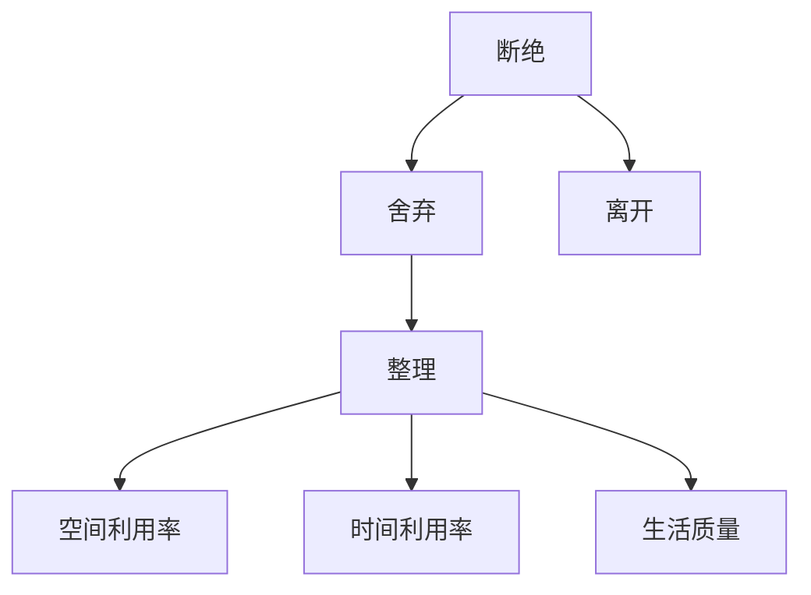

                 

# 断舍离哲学：在物质中寻找精神的自由

> 关键词：断舍离、哲学、精神自由、物质管理、生活优化

> 摘要：本文将深入探讨断舍离哲学的起源、核心概念及其应用场景，并通过具体案例和心理学解读，阐述断舍离哲学如何在物质世界中帮助我们实现精神的自由。

## 引言

在现代社会的快节奏生活中，人们常常感到压力巨大、精神紧张。而断舍离哲学，作为一种源自日本的哲学理念，提倡通过整理和舍弃不必要的物质，从而实现精神上的轻松和自由。本文将详细探讨断舍离哲学的核心理念，以及如何将其应用到我们的生活中，最终实现精神与物质的和谐统一。

## 第1章：断舍离哲学的起源与发展

### 1.1 断舍离哲学的概念

断舍离（Misei-shiron）一词源于日本，意为“断绝、舍弃、离开”。断舍离哲学不仅仅是一种整理技巧，更是一种生活哲学，强调通过整理和舍弃不必要的物品，达到心灵上的轻盈和自由。

### 1.2 断舍离哲学的起源

断舍离哲学的起源可以追溯到20世纪80年代，由日本作家山下英子提出。她通过自己的实践，总结出了一套简单而有效的方法，帮助人们摆脱物质束缚，实现心灵的自由。

### 1.3 断舍离哲学的发展历程

随着社会的不断发展，断舍离哲学逐渐受到全球的关注。许多专家和学者开始深入研究这一理念，并将其应用到各个领域，如生活、工作、心理治疗等。

## 第2章：断舍离哲学的核心概念与原理

### 2.1 核心概念

断舍离哲学的核心概念包括：

- **断绝不需要的东西**：通过舍弃不必要的物品，减少物质负担。
- **舍弃多余的东西**：通过整理物品，使空间变得整洁、舒适。
- **离开不必要的依赖**：通过减少对物质的依赖，提高生活质量。

### 2.2 原理解析

断舍离哲学的原理可以概括为：

- **提高空间利用率**：通过整理和舍弃，使空间变得更加宽敞、舒适。
- **提高时间利用率**：通过减少不必要的物品，节省寻找和整理的时间。
- **提高生活质量**：通过减少物质负担，使人们更加专注于精神层面的需求。

### 2.3 概念关系图

## 第3章：断舍离哲学的应用场景

### 3.1 生活应用

在日常生活中，断舍离哲学可以帮助我们：

- **整理家居**：通过舍弃不必要的物品，使家居环境变得整洁、舒适。
- **减少购物**：通过断绝不必要的购买欲望，避免物质过剩。
- **提升生活质量**：通过减少物质负担，提高生活品质。

### 3.2 工作应用

在工作场景中，断舍离哲学可以帮助我们：

- **优化工作流程**：通过舍弃不必要的流程，提高工作效率。
- **减少信息过载**：通过整理和舍弃不重要的信息，使工作更加聚焦。
- **提升工作质量**：通过减少物质负担，使工作更加专注、高效。

### 3.3 心理健康

断舍离哲学还可以帮助我们在心理上实现：

- **减轻压力**：通过减少物质负担，使心理压力得到缓解。
- **提高幸福感**：通过舍弃不必要的物品，使心灵得到净化。
- **提升生活质量**：通过减少物质依赖，提高心理满足度。

## 第4章：实践断舍离哲学的方法与技巧

### 4.1 准备阶段

在实践断舍离哲学之前，我们需要做好以下准备：

- **明确目标**：确定自己想要实现的生活状态。
- **制定计划**：制定具体的断舍离计划，包括时间、任务等。
- **调整心态**：保持积极、开放的心态，对待断舍离过程。

### 4.2 实践方法

断舍离哲学的实践方法包括：

- **逐步整理**：从最容易入手的物品开始，逐步整理。
- **分类处理**：将物品分为需要保留、舍弃和捐赠三类。
- **坚持执行**：保持持续、稳定的执行力，直到达到目标。

### 4.3 技巧分享

以下是一些实践断舍离哲学的技巧：

- **设定时间段**：每次整理设定一个时间段，确保高效完成。
- **设立奖励机制**：为自己设定奖励，激励自己坚持下去。
- **寻求支持**：与家人、朋友分享断舍离心得，互相鼓励。

## 第5章：断舍离哲学的案例分析

### 5.1 个人案例

小明是一名年轻的上班族，他通过实践断舍离哲学，成功实现了以下变化：

- **家居环境整洁**：通过舍弃不必要的物品，使家居环境变得整洁、舒适。
- **工作效率提升**：通过整理工作桌面，使工作效率得到提升。
- **心理压力减轻**：通过减少物质负担，使心理压力得到缓解。

### 5.2 企业案例

某大型企业通过推行断舍离哲学，实现了以下成果：

- **优化工作流程**：通过舍弃不必要的流程，使工作流程更加高效。
- **减少库存**：通过整理和舍弃不必要的产品，减少了库存压力。
- **提高员工满意度**：通过改善工作环境，提高了员工的满意度。

### 5.3 社会案例

某社区通过推行断舍离哲学，实现了以下改变：

- **减少垃圾产生**：通过舍弃不必要的物品，减少了垃圾产生。
- **提升环保意识**：通过参与断舍离活动，提升了居民的环保意识。
- **增强社区凝聚力**：通过共同参与活动，增强了社区凝聚力。

## 第6章：断舍离哲学的心理学解读

### 6.1 心理学理论基础

断舍离哲学的心理学基础包括：

- **自我决定理论**：通过自主选择和行动，实现自我价值。
- **认知行为理论**：通过改变行为，影响心理状态。

### 6.2 心理机制分析

断舍离哲学通过以下方式影响心理状态：

- **减少焦虑和压力**：通过减少物质负担，降低焦虑和压力。
- **提高幸福感和满足度**：通过实现精神自由，提高幸福感和满足度。

### 6.3 心理学应用

断舍离哲学在心理学领域有以下应用：

- **心理咨询**：通过断舍离哲学，帮助来访者减少物质依赖，改善心理状态。
- **心理教育**：通过推广断舍离哲学，提高公众的心理健康水平。

## 第7章：断舍离哲学的未来展望

### 7.1 社会趋势

随着社会的不断发展，断舍离哲学越来越受到关注。在未来，我们可以预见到：

- **更多人实践断舍离**：随着理念的传播，更多人将实践断舍离哲学。
- **断舍离哲学的应用领域扩展**：断舍离哲学将在更多领域得到应用。

### 7.2 发展前景

断舍离哲学的发展前景包括：

- **实现精神自由**：通过断舍离哲学，更多人将实现精神自由。
- **提升生活质量**：断舍离哲学将帮助人们提升生活质量。

### 7.3 社会影响

断舍离哲学对社会的影响包括：

- **减少资源浪费**：通过减少物质依赖，减少资源浪费。
- **提高环保意识**：断舍离哲学将提高公众的环保意识。

## 总结

断舍离哲学是一种具有深远意义的生活哲学。通过整理和舍弃不必要的物质，我们可以实现精神的自由，提升生活质量。让我们从现在开始，实践断舍离哲学，享受更加自由、轻松的生活。

## 作者信息

作者：AI天才研究院/AI Genius Institute & 禅与计算机程序设计艺术 /Zen And The Art of Computer Programming

**最佳实践 tips**：

- **定期回顾**：定期回顾自己的物品，确保保持断舍离状态。
- **寻求支持**：与家人、朋友分享断舍离心得，互相鼓励。
- **从简单做起**：从最容易的物品开始，逐步实践断舍离。

**注意事项**：

- 断舍离不是一蹴而就的过程，需要持续的努力和实践。
- 在实践过程中，不要过分追求完美，接受自己的不完美。

**拓展阅读**：

- 《断舍离》：[山下英子著](https://book.douban.com/subject/26582437/)
- 《极简主义》：[乔舒亚·贝克著](https://book.douban.com/subject/26776068/)

[End]

