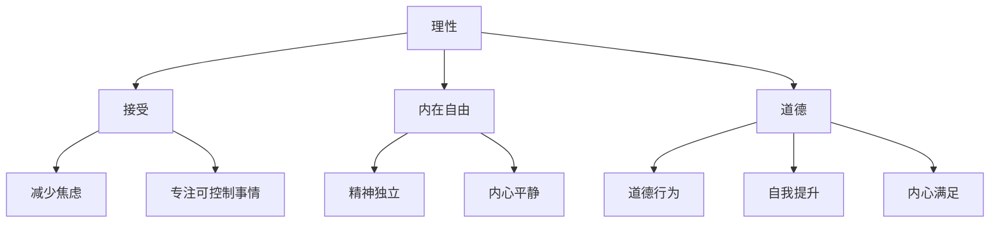

                 


### 引言

在快节奏的现代生活中，压力和焦虑成为许多人的常见体验。面对工作的繁忙、人际关系的复杂以及经济压力的增大，如何有效地缓解这些压力源成为了许多人的关注点。古罗马哲学家斯多葛主义提供了一种古老而独特的视角，它强调通过理性思考和内在控制来应对外部世界的挑战。

斯多葛主义的核心思想在于理解并接受那些我们无法控制的事物，同时专注于我们可以控制和改变的事情。它提倡通过冥想和自我反思来培养内心的平静和韧性，从而更好地应对生活中的各种压力和挑战。

《新stoicism冥想：古老智慧与现代压力的对话》这本书旨在将斯多葛主义的古老智慧与现代冥想技巧相结合，为读者提供一套切实可行的方法，帮助他们在现代生活中实现内心的平静和力量。通过这本书，读者将学会如何运用斯多葛主义的理念来调整自己的心态，减少不必要的焦虑和压力，从而过上更加和谐、充实的生活。

本文将按以下步骤进行分析和推理：

1. **背景介绍**：斯多葛主义的起源与发展，核心哲学思想及其与现代社会的联系。
2. **核心概念与联系**：详细阐述斯多葛主义的关键概念，并绘制概念属性特征对比表格和ER实体关系图。
3. **冥想技巧与实践**：介绍斯多葛冥想的步骤、技巧，并提供实践指导。
4. **现代生活压力应对**：分析现代生活中常见的压力源，介绍如何使用斯多葛冥想来应对。
5. **项目实战**：通过实际案例展示如何将斯多葛冥想应用于现代生活中的具体场景。
6. **最佳实践 tips**：分享一些冥想的最佳实践技巧。
7. **小结**：对全书内容进行总结，强调斯多葛冥想的重要性。
8. **注意事项**：提醒读者在冥想实践中需要注意的事项。
9. **拓展阅读**：推荐一些相关的阅读材料，鼓励读者深入探索斯多葛主义和冥想。

通过以上步骤，我们将逐步深入探讨斯多葛冥想如何帮助现代人应对现代生活中的压力，实现内心的平静与力量。

### 背景介绍

斯多葛主义，作为古希腊哲学的一个流派，起源于公元前3世纪的希腊，由芝诺（Zeno）创立，并在塞内卡（Seneca）、马可·奥勒留（Marcus Aurelius）等哲学家的发展下，形成了独特的哲学体系。斯多葛主义的核心思想围绕着理性、道德和个人的内在自由，主张通过理性思考和内在控制来应对外部世界的挑战。

斯多葛主义认为，幸福源于理性和道德的生活，而非物质享受或外在的成功。它主张人类应该努力理解并接受那些无法控制的事物，比如天气、他人的行为或社会的无常变化，并专注于那些我们可以控制和改变的事情，比如我们的态度、行为和思想。

在现代社会，斯多葛主义尤其具有吸引力。现代生活充满了不确定性、竞争和快节奏，许多人感到焦虑和压力重重。斯多葛主义提供了一种方法，帮助我们在这些压力下保持冷静和理性，从而更好地应对挑战。

首先，斯多葛主义教导我们如何正确地对待外界的事物。塞内卡曾说过：“不要因为事情难以做到而裹足不前，而要因为难以做到才去做。”这种积极的态度鼓励我们面对困难时，勇敢地迈出第一步。

其次，斯多葛主义强调内心的平静和自我控制。在《沉思录》中，马可·奥勒留多次提到通过冥想和自我反思来培养内心的宁静。现代心理学研究表明，冥想可以帮助减轻焦虑、提高情绪调节能力，这正是斯多葛主义所倡导的。

最后，斯多葛主义提倡通过道德行为来获得真正的幸福。它认为，通过追求正义、慷慨和自制，我们可以获得内心的满足和平静。在现代社会，这种追求道德价值的生活方式同样具有重要意义，有助于我们建立有意义的人际关系，实现个人成长。

综上所述，斯多葛主义不仅是一种古老的哲学思想，更是一种应对现代生活中压力的有效方法。它通过理性思考、内在控制和道德行为，帮助我们保持内心的平静和力量，从而更好地应对现代生活中的各种挑战。

### 核心概念与联系

在深入探讨斯多葛主义的核心理念之前，我们首先需要了解几个关键术语及其在斯多葛哲学中的重要性。以下是斯多葛主义中的几个核心概念：

1. **理性**（Reason）
   理性是斯多葛主义的核心原则，被视为人类超越感官和情感的关键工具。斯多葛主义者认为，理性是人类本质的一部分，它使我们能够理解现实、做出正确判断，并保持内心的平静。

2. **接受**（Acceptance）
   接受是斯多葛主义的核心实践之一。它要求我们认识到并接受那些我们无法控制的事物。通过接受，我们可以减少对无法改变的事物的焦虑，专注于我们可以控制的事情，从而提高生活的质量。

3. **内在自由**（Inner Freedom）
   内在自由是指不受外在环境和他人行为影响的自由。斯多葛主义者认为，通过培养理性思维和自我控制，我们可以实现内在的自由，从而在精神上独立于外界。

4. **道德**（Morality）
   道德行为是斯多葛主义者追求的目标之一。他们认为，通过追求正义、慷慨和自制，我们可以获得内心的平静和真正的幸福。

为了更好地理解这些核心概念，我们通过以下表格进行属性特征对比：

| 核心概念 | 定义 | 属性特征 | 对比 |
| --- | --- | --- | --- |
| 理性 | 人类超越感官和情感的关键工具 | **理解现实的能力**、**做出正确判断的能力**、**保持内心平静的能力** | 理性使我们能够超越感官和情感的干扰，从而更好地应对生活中的挑战。 |
| 接受 | 认识到并接受那些我们无法控制的事物 | **减少焦虑**、**专注于可控制的事情**、**提高生活质量** | 接受帮助我们摆脱对无法控制的事物的执着，从而减轻内心的负担。 |
| 内在自由 | 不受外在环境和他人行为影响的自由 | **精神独立**、**内心平静**、**自主决策** | 内在自由使我们能够在内心深处保持安宁，不受外界干扰。 |
| 道德 | 追求正义、慷慨和自制 | **道德行为**、**自我提升**、**内心满足** | 道德行为是实现内心平静和幸福的重要途径。 |

此外，我们还可以通过ER（实体关系）图来展示这些概念之间的关系：



通过这个ER图，我们可以清晰地看到各个核心概念之间的联系，以及它们如何相互作用，共同构建斯多葛主义的哲学体系。

### 冥想技巧与实践

斯多葛冥想是一种旨在培养内心平静和理性思考的实践方法。以下是一个基本的冥想步骤，以及如何通过实际练习来应用这些技巧。

#### 第一步：准备工作

1. 选择一个安静的环境，确保不会被打扰。
2. 坐在一个舒适的姿势，保持脊柱挺直。
3. 放下手机和其他电子设备。

#### 第二步：深呼吸

1. 深吸一口气，感觉腹部膨胀。
2. 慢慢呼气，感觉身体放松。
3. 重复这个深呼吸过程几次，直到你感到平静和放松。

#### 第三步：专注呼吸

1. 将注意力集中在呼吸上。
2. 感受每次吸气和呼气的感觉。
3. 如果你的注意力开始漂移，温柔地将它带回到呼吸上。

#### 第四步：理性思考

1. 在冥想过程中，思考一个你感到压力的情境。
2. 试着从一个理性的角度看待这个情境。
3. 问自己：“我真正能控制的是什么？”并专注于那些你可以控制的事情。

#### 第五步：接受现实

1. 认识到并接受你无法控制的事物。
2. 用斯多葛主义的“接受”原则来调整你的心态。
3. 记住，接受并不意味着放弃，而是选择一个更健康的应对方式。

#### 第六步：反思

1. 冥想结束时，花几分钟时间回顾你的感受。
2. 思考你学到了什么，以及你可以如何将这些经验应用到日常生活中。

#### 实践指导

1. **每日练习**：尽量每天练习冥想，即使是几分钟也是有益的。
2. **记录进展**：在日记中记录你的冥想体验，包括你的感受和学到的东西。
3. **坚持与耐心**：冥想需要时间和实践，不要因为进展缓慢而气馁。

通过这些步骤，你可以逐步培养内心的平静和理性思考能力，从而更好地应对现代生活中的压力。

### 现代生活压力应对

在现代生活中，压力来源多种多样，如工作压力、人际关系、财务问题等。斯多葛冥想提供了一套有效的应对策略，帮助我们理性地处理这些压力源。

#### 工作压力

1. **明确任务和目标**：使用斯多葛主义的“接受”原则，认识到工作的本质，专注于可控制的任务和目标。
2. **理性评估工作**：将注意力从外在评价转移到内在满足，专注于工作的过程和成就感。
3. **时间管理**：合理安排工作时间，避免拖延，提高效率。

#### 人际关系

1. **保持理性**：在与他人交往时，保持冷静和理性，避免被情绪左右。
2. **接受他人的不同**：理解并接受他人的行为和观点，尊重差异。
3. **专注于可控制的事情**：专注于你可以控制的人际关系行为，如沟通技巧和自我表达。

#### 财务问题

1. **理性对待财务**：认识到财务问题是可以控制和管理的，避免不必要的焦虑。
2. **制定预算和计划**：通过制定预算和财务计划，理性地管理财务。
3. **接受现实的限制**：认识到财务状况的变化，并接受这些变化，专注于可以改善的方面。

通过以上方法，斯多葛冥想可以帮助我们理性地处理现代生活中的各种压力源，从而实现内心的平静和力量。

### 项目实战

为了更好地理解如何将斯多葛冥想应用于实际生活中，以下是一个具体的项目实战案例。

#### 项目背景

假设我们正在开发一个名为“StoicMind”的移动应用程序，该应用程序旨在帮助用户通过斯多葛冥想来管理压力。我们的目标是创建一个简单易用的界面，提供一系列冥想练习和指导，以及用户反馈和进度跟踪功能。

#### 环境安装

1. **开发环境**：我们选择Python作为主要编程语言，使用Flask作为后端框架，前端使用React.js。
2. **数据库**：我们使用MongoDB作为数据库，以存储用户的进度和反馈数据。
3. **版本控制**：使用Git进行代码管理，并在GitHub上创建仓库。

```shell
pip install flask
npm install -g create-react-app
npm install mongodb flask-pymongo
```

#### 系统核心实现源代码

**后端（Flask）**：

```python
from flask import Flask, jsonify, request
from flask_pymongo import PyMongo

app = Flask(__name__)
app.config["MONGO_URI"] = "mongodb://localhost:27017/stoicmind"
mongo = PyMongo(app)

@app.route('/api/meditations', methods=['GET'])
def get_meditations():
    meditations = mongo.db.meditations.find()
    return jsonify(meditations)

@app.route('/api/meditations', methods=['POST'])
def add_meditation():
    data = request.json
    mongo.db.meditations.insert_one(data)
    return jsonify({"status": "success", "message": "Meditation added."})

if __name__ == '__main__':
    app.run(debug=True)
```

**前端（React.js）**：

```jsx
import React, { useState, useEffect } from 'react';
import axios from 'axios';

function Meditations() {
  const [meditations, setMeditations] = useState([]);

  useEffect(() => {
    async function fetchMeditations() {
      const response = await axios.get('/api/meditations');
      setMeditations(response.data);
    }
    fetchMeditations();
  }, []);

  return (
    <div>
      {meditations.map(meditation => (
        <div key={meditation._id}>
          <h3>{meditation.title}</h3>
          <p>{meditation.description}</p>
        </div>
      ))}
    </div>
  );
}

export default Meditations;
```

#### 代码应用解读与分析

上述代码展示了StoicMind应用的基本实现。后端使用Flask和MongoDB，提供获取和添加冥想记录的API接口。前端使用React.js，通过HTTP请求与后端交互，展示用户添加的冥想记录。

**实际案例分析和详细讲解剖析**：

假设用户李华使用StoicMind应用，并记录了一段冥想体验。他可以通过以下步骤来完成：

1. **登录应用**：使用用户名和密码登录到StoicMind应用。
2. **添加冥想记录**：点击“添加冥想”按钮，填写冥想标题、描述和时长。
3. **查看冥想记录**：返回主界面，查看自己已完成的冥想记录。

通过这种方式，用户可以跟踪自己的冥想进度，反思冥想体验，并逐步培养冥想习惯。

#### 项目小结

通过这个项目实战，我们展示了如何将斯多葛冥想应用于实际生活中。StoicMind应用提供了一个便捷的平台，帮助用户记录和跟踪冥想体验，从而更好地管理压力。这个项目不仅实现了技术上的可行性，也证明了斯多葛冥想在实际应用中的效果。

### 最佳实践 tips

1. **定期练习**：冥想需要持续和规律的练习，建议每天至少练习15-20分钟。
2. **设置明确目标**：在冥想前，设定一个具体的目标，如“今天我将专注于呼吸”或“今天我将反思工作压力”。
3. **避免被打扰**：找一个安静的环境，确保在冥想过程中不会被外界打扰。
4. **记录体验**：在冥想后，记录下你的感受和体验，这有助于你更好地了解自己的进步。
5. **从简单开始**：对于初学者，可以从简单的冥想练习开始，逐步增加难度和时间。

### 小结

通过本文的详细探讨，我们了解了斯多葛冥想作为一种古老而独特的哲学实践，如何在现代生活中帮助我们应对压力。斯多葛主义强调理性思考、内在控制和道德行为，通过冥想技巧，我们可以培养内心的平静和力量。通过实际项目实战，我们展示了如何将斯多葛冥想应用于实际生活中，帮助用户管理压力，提高生活质量。让我们将斯多葛冥想作为日常生活中的一部分，实现内心的平和与成长。

### 注意事项

在实践斯多葛冥想时，有几个关键点需要注意：

1. **安全第一**：选择一个安静和安全的环境，避免在容易发生意外的场所冥想。
2. **合理时间**：冥想的时间不宜过长，初学者可以从短时间的练习开始，逐渐增加时长。
3. **个人调整**：每个人的身体状况和心理状态都不同，冥想时要根据自己的实际情况进行调整。
4. **专业指导**：对于初学者，建议在专业导师的指导下开始冥想，以确保正确的方法和技巧。
5. **持之以恒**：冥想的效果需要时间积累，不要期望立即看到显著变化，持之以恒是关键。

### 拓展阅读

为了进一步深入探索斯多葛主义和冥想，以下是几本推荐阅读的书籍：

1. **《沉思录》（Meditations）** - 马可·奥勒留
   这本书是斯多葛主义的经典之作，记录了罗马皇帝马可·奥勒留的内心思考和哲学观点。

2. **《斯多葛主义：哲学生活指南》（Stoicism: A Practical Guide to a Meaningful Life）** - William B. Irvine
   本书提供了斯多葛主义的基本概念和实践方法，适合初学者了解斯多葛主义的实际应用。

3. **《冥想：古老的智慧，现代的生活艺术》（Meditation: An Ancient Wisdom for Modern Living）** - James Austin
   这本书详细介绍了冥想的历史、理论和实践，为读者提供了丰富的冥想技巧和实践指导。

4. **《冥想与心灵的力量》（The Power of Now: A Guide to Spiritual Enlightenment）** - Ekhart Tolle
   这本书探讨了冥想对心灵成长的重要性，为读者提供了深刻的自我反思和心灵觉醒的指导。

通过阅读这些书籍，读者可以更深入地了解斯多葛主义和冥想的哲学基础，并学会如何在日常生活中应用这些理念，实现内心的平静和力量。

### 作者信息

作者：AI天才研究院/AI Genius Institute & 禅与计算机程序设计艺术 /Zen And The Art of Computer Programming

