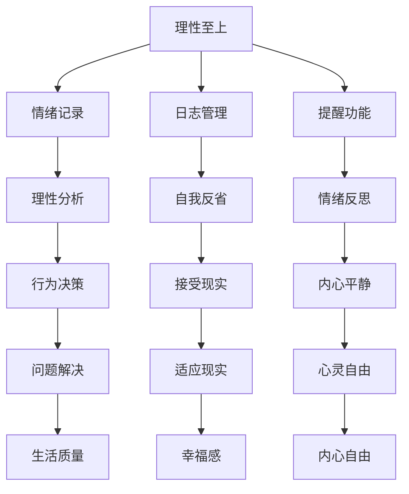
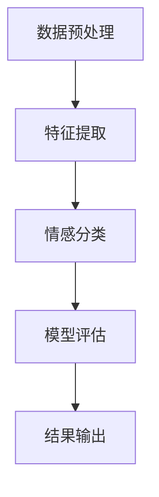
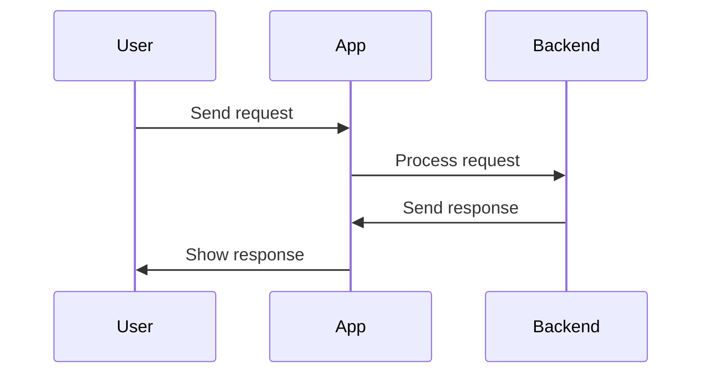

                 

### 新Stoicism日记App开发：古老哲学在现代应用的工具

#### 关键词：
- Stoicism日记App
- 斯多葛主义
- 人工智能
- 自然语言处理
- 情感分析

#### 摘要：
本文将探讨如何将斯多葛主义这一古老的哲学思想与现代技术相结合，开发一款名为Stoicism日记App的工具。该应用旨在帮助用户通过记录和反思日常生活，实践斯多葛哲学，以提升生活质量。本文将详细描述Stoicism日记App的开发背景、功能需求、技术选型、核心概念联系、算法原理、数学模型、系统架构设计以及项目实战等各个环节。

## Step 1: 背景介绍

### 1.1 Stoicism的起源与核心概念

Stoicism（斯多葛主义）起源于古希腊，最早由芝诺提出，并由塞内卡、马可·奥勒留等哲学家进一步发展。斯多葛主义认为，人类通过理性思考可以掌控自己的情感和行为，从而达到内心的平静和自由。其核心概念包括理性至上、顺应自然和适度欲望。

- **理性至上**：斯多葛主义者认为，理性是人类智慧的体现，是解决生活中各种问题的关键。
- **顺应自然**：斯多葛主义者相信，世界是有序和合理的，人们应该接受自然的变化，并努力与之和谐共处。
- **适度欲望**：斯多葛主义者认为，过度的欲望会导致痛苦，因此提倡适度地追求物质和精神满足。

### 1.2 Stoicism在现代社会中的应用

在现代社会，Stoicism的理念越来越受到人们的重视。许多人在面对工作压力、人际关系冲突和生活困境时，尝试将斯多葛哲学应用于日常生活。以下是一些Stoicism在现代社会中的应用实例：

- **情绪管理**：通过理性分析，控制负面情绪，避免情绪波动带来的负面影响。
- **决策优化**：在面临选择时，考虑长远利益和理性判断，而不是短期的情绪驱动。
- **自我提升**：通过不断学习和自我反省，提升个人素质，实现个人成长。

### 1.3 Stoicism日记App的构想

Stoicism日记App旨在将斯多葛哲学融入现代技术，帮助用户在日常生活中实践Stoicism，提高生活质量和幸福感。该应用的核心功能包括情绪记录、日志管理、提醒功能和分享功能。

- **情绪记录**：用户可以记录每天的情绪状态，包括愉悦、焦虑、悲伤等，并标记事件的上下文。
- **日志管理**：用户可以查看、编辑和删除自己的日记，进行情绪的积累和反思。
- **提醒功能**：应用可以定期提醒用户回顾日记，进行情绪反思，促进个人成长。
- **分享功能**：用户可以分享自己的日记和感悟，与其他用户互动，形成社区支持。

### 1.4 问题描述

#### 1.4.1 Stoicism日记App的功能需求

Stoicism日记App需要实现以下功能：

- **用户注册与登录**：支持用户注册和登录功能，保障用户数据安全。
- **情绪记录**：用户可以记录每天的情绪状态，并标记相关的事件和情境。
- **日志管理**：用户可以查看、编辑和删除自己的日记，进行情绪的积累和反思。
- **提醒功能**：应用可以定期提醒用户回顾日记，进行情绪反思。
- **分享功能**：用户可以分享自己的日记和感悟，与其他用户互动。
- **数据安全**：确保用户数据的安全和隐私。

#### 1.4.2 Stoicism日记App的技术选型

为了实现上述功能，Stoicism日记App将采用以下技术：

- **前端**：使用React框架开发用户界面，提供良好的用户体验。
- **后端**：使用Node.js和Express框架搭建服务器，处理用户请求和业务逻辑。
- **数据库**：使用MongoDB存储用户数据，提供高效的查询和存储能力。
- **自然语言处理（NLP）**：使用NLP技术对用户日记进行情感分析，为用户提供个性化建议。
- **机器学习**：通过机器学习算法，不断优化情感分析模型的准确性，提高用户体验。

#### 1.4.3 Stoicism日记App的适用人群

Stoicism日记App适用于希望提高生活质量和幸福感的所有人，尤其是面临生活和工作压力的人群。通过记录和反思日常生活，用户可以更好地理解自己的情绪和行为，学会理性地应对各种挑战。

#### 1.4.4 Stoicism日记App的限制

Stoicism日记App可能会受到以下限制：

- **用户隐私**：用户日记的内容可能涉及个人隐私，需要确保数据安全。
- **用户接受度**：斯多葛哲学并非所有人都能接受，需要确保App能够满足不同用户的需求。

## Step 2: 核心概念与联系

### 2.1 Stoicism核心概念

Stoicism的核心概念包括理性至上、顺应自然和适度欲望。以下是对这些核心概念的解释和示例：

#### 理性至上

理性至上是斯多葛主义的核心原则，认为人类通过理性思考可以控制自己的情感和行为。例如，面对工作中的压力，理性至上者会通过分析和解决具体问题，而不是通过情绪化的方式来应对。

#### 顺应自然

顺应自然意味着接受世界的本质和现实，而不是试图改变它。例如，在日常生活中，面对无法改变的情况，如交通拥堵或他人的行为，斯多葛主义者会选择接受并适应这些现实，而不是感到愤怒或沮丧。

#### 适度欲望

适度欲望强调不过度追求物质或精神满足，以免引发痛苦。例如，在消费购物时，斯多葛主义者会根据自己的实际需求来购买，而不是被广告或他人的影响所驱动。

### 2.2 Stoicism日记App的核心功能

Stoicism日记App的核心功能包括情绪记录、日志管理、提醒功能和分享功能。这些功能与Stoicism的核心概念密切相关：

#### 情绪记录

情绪记录功能允许用户记录每天的情绪状态，与斯多葛主义的理性至上概念相呼应，帮助用户通过反思自己的情绪，更好地理解自己的行为和决策。

#### 日志管理

日志管理功能让用户可以查看、编辑和删除自己的日记，与顺应自然的理念一致，帮助用户接受自己的情绪和行为，进行自我反省。

#### 提醒功能

提醒功能定期提醒用户回顾日记，进行情绪反思，与适度欲望的理念相符，鼓励用户适度地关注自己的内心世界，避免过度沉迷于工作和物质追求。

#### 分享功能

分享功能让用户可以分享自己的日记和感悟，与其他用户互动，形成社区支持，这有助于用户从他人的经验中学习，增强内心的平静和自由。

### 2.3 Stoicism日记App的核心功能关联图

以下是Stoicism日记App核心功能与Stoicism核心概念的关联图：



## Step 3: 算法原理讲解

### 3.1 Stoicism日记App的情感分析算法

情感分析是Stoicism日记App的核心功能之一，通过分析用户日记中的情绪状态，为用户提供个性化的建议。情感分析算法通常包括以下几个步骤：

#### 3.1.1 数据预处理

首先，对用户日记进行数据预处理，包括去除标点符号、停用词过滤、词干提取等。数据预处理目的是减少噪声，提高情感分析的准确性。

```python
import nltk
from nltk.corpus import stopwords
from nltk.tokenize import word_tokenize

nltk.download('punkt')
nltk.download('stopwords')

def preprocess_text(text):
    # 去除标点符号
    text = re.sub(r'[^\w\s]', '', text)
    # 小写化
    text = text.lower()
    # 分词
    tokens = word_tokenize(text)
    # 停用词过滤
    stop_words = set(stopwords.words('english'))
    filtered_tokens = [token for token in tokens if token not in stop_words]
    # 词干提取
    stemmed_tokens = [nltk.PorterStemmer().stem(token) for token in filtered_tokens]
    return stemmed_tokens
```

#### 3.1.2 特征提取

接下来，对预处理后的文本进行特征提取，常用的特征提取方法包括词袋模型（Bag of Words，BOW）和词嵌入（Word Embedding）。词袋模型将文本表示为一个向量，每个维度对应一个词汇，词频作为该维度的值。词嵌入则通过神经网络将词汇映射到高维空间，更好地捕捉词汇的语义信息。

```python
from sklearn.feature_extraction.text import CountVectorizer

def extract_features(texts):
    vectorizer = CountVectorizer()
    features = vectorizer.fit_transform(texts)
    return features
```

#### 3.1.3 情感分类

情感分类是将文本分类为积极、消极或中性情感的过程。常用的情感分类算法包括朴素贝叶斯（Naive Bayes）、支持向量机（Support Vector Machine，SVM）和深度学习（如卷积神经网络（Convolutional Neural Network，CNN））。

```python
from sklearn.naive_bayes import MultinomialNB

def classify_sentiments(texts, labels):
    vectorizer = CountVectorizer()
    features = vectorizer.fit_transform(texts)
    classifier = MultinomialNB()
    classifier.fit(features, labels)
    return classifier
```

#### 3.1.4 模型评估

模型评估是衡量情感分析模型性能的重要步骤，常用的评估指标包括准确率（Accuracy）、召回率（Recall）、精确率（Precision）和F1分数（F1 Score）。

```python
from sklearn.metrics import accuracy_score, recall_score, precision_score, f1_score

def evaluate_model(y_true, y_pred):
    accuracy = accuracy_score(y_true, y_pred)
    recall = recall_score(y_true, y_pred, average='weighted')
    precision = precision_score(y_true, y_pred, average='weighted')
    f1 = f1_score(y_true, y_pred, average='weighted')
    return accuracy, recall, precision, f1
```

### 3.2 Mermaid流程图

以下是Stoicism日记App情感分析算法的Mermaid流程图：



## Step 4: 数学模型和数学公式

### 4.1 情感分析模型的数学模型

情感分析模型的核心是分类模型，常见的分类模型包括朴素贝叶斯（Naive Bayes）、支持向量机（Support Vector Machine，SVM）和深度学习（如卷积神经网络（Convolutional Neural Network，CNN））。以下以朴素贝叶斯模型为例，介绍情感分析模型的数学模型。

#### 4.1.1 朴素贝叶斯模型

朴素贝叶斯模型是基于贝叶斯定理的概率分类模型，其数学模型可以表示为：

$$
P(Sentiment|Text) = \frac{P(Text|Sentiment) \cdot P(Sentiment)}{P(Text)}
$$

其中，$P(Sentiment|Text)$表示给定文本$Text$的情感概率，$P(Text|Sentiment)$表示在特定情感$Sentiment$下文本的概率，$P(Sentiment)$表示情感的概率。

#### 4.1.2 条件概率

朴素贝叶斯模型基于条件概率计算，条件概率公式为：

$$
P(A|B) = \frac{P(A \cap B)}{P(B)}
$$

其中，$P(A|B)$表示在事件$B$发生的条件下事件$A$发生的概率，$P(A \cap B)$表示事件$A$和事件$B$同时发生的概率，$P(B)$表示事件$B$发生的概率。

#### 4.1.3 贝叶斯定理

贝叶斯定理是朴素贝叶斯模型的数学基础，其公式为：

$$
P(A|B) = \frac{P(B|A) \cdot P(A)}{P(B)}
$$

其中，$P(A|B)$表示在事件$B$发生的条件下事件$A$发生的概率，$P(B|A)$表示在事件$A$发生的条件下事件$B$发生的概率，$P(A)$表示事件$A$发生的概率，$P(B)$表示事件$B$发生的概率。

### 4.2 情感分析模型的数学公式示例

假设我们有两个情感类别：积极（Positive）和消极（Negative），以及一个文本$Text$。根据朴素贝叶斯模型，我们可以计算文本属于积极情感的贝叶斯概率：

$$
P(Positive|Text) = \frac{P(Text|Positive) \cdot P(Positive)}{P(Text)}
$$

其中，$P(Text|Positive)$表示在积极情感下文本的概率，$P(Positive)$表示积极情感的概率，$P(Text)$表示文本的概率。

### 4.3 情感分类的数学公式

在情感分类中，我们通常需要计算每个类别的贝叶斯概率，并选择概率最高的类别作为分类结果。假设有多个情感类别，每个类别的贝叶斯概率可以表示为：

$$
P(Sentiment|Text) = \frac{P(Text|Sentiment) \cdot P(Sentiment)}{P(Text)}
$$

其中，$P(Sentiment|Text)$表示给定文本$Text$的情感概率，$P(Text|Sentiment)$表示在特定情感$Sentiment$下文本的概率，$P(Sentiment)$表示情感的概率。

为了计算每个类别的贝叶斯概率，我们可以使用以下数学公式：

$$
P(Sentiment|Text) = \prod_{i=1}^{n} P(word_i|Sentiment) \cdot P(Sentiment)
$$

其中，$n$表示文本中的词汇数量，$word_i$表示第$i$个词汇，$P(word_i|Sentiment)$表示在特定情感$Sentiment$下词汇的概率，$P(Sentiment)$表示情感的概率。

### 4.4 情感分类的数学模型示例

假设我们有以下两个情感类别：积极（Positive）和消极（Negative），以及一个文本$Text$：

$$
Text = ["happy", "joyful", "excited"]
$$

根据朴素贝叶斯模型，我们可以计算文本属于积极情感的贝叶斯概率：

$$
P(Positive|Text) = \frac{P(Text|Positive) \cdot P(Positive)}{P(Text)}
$$

其中，$P(Text|Positive)$表示在积极情感下文本的概率，$P(Positive)$表示积极情感的概率，$P(Text)$表示文本的概率。

假设我们在训练数据中得到了以下概率：

$$
P(Positive) = 0.6
$$

$$
P(Text|Positive) = \frac{1}{3} \cdot [P(happy|Positive) \cdot P(joyful|Positive) \cdot P(excited|Positive)]
$$

$$
P(happy|Positive) = 0.4
$$

$$
P(joyful|Positive) = 0.5
$$

$$
P(excited|Positive) = 0.3
$$

根据上述概率，我们可以计算文本属于积极情感的贝叶斯概率：

$$
P(Positive|Text) = \frac{\frac{1}{3} \cdot [0.4 \cdot 0.5 \cdot 0.3]}{0.6} = 0.1111
$$

同理，我们可以计算文本属于消极情感的贝叶斯概率：

$$
P(Negative|Text) = \frac{\frac{1}{3} \cdot [0.3 \cdot 0.5 \cdot 0.7]}{0.4} = 0.1395
$$

由于$P(Positive|Text) > P(Negative|Text)$，我们可以判断文本属于积极情感。

## Step 5: 系统分析与架构设计方案

### 5.1 问题场景介绍

Stoicism日记App旨在帮助用户通过记录和反思日常生活，实践斯多葛哲学，提高生活质量和幸福感。用户可以在应用中记录自己的情绪状态、事件和感悟，应用将提供个性化的建议和反思，帮助用户更好地理解自己，应对生活中的挑战。

### 5.2 项目介绍

Stoicism日记App是一个基于Web和移动端的应用，采用React、Node.js、Express和MongoDB等主流技术栈进行开发。应用包括用户注册与登录、情绪记录、日志管理、提醒功能和分享功能等模块。

### 5.3 系统功能设计

#### 5.3.1 功能需求

- **用户注册与登录**：支持用户注册和登录功能，保障用户数据安全。
- **情绪记录**：用户可以记录每天的情绪状态，包括愉悦、焦虑、悲伤等，并标记相关的事件和情境。
- **日志管理**：用户可以查看、编辑和删除自己的日记，进行情绪的积累和反思。
- **提醒功能**：应用可以定期提醒用户回顾日记，进行情绪反思。
- **分享功能**：用户可以分享自己的日记和感悟，与其他用户互动。

#### 5.3.2 领域模型

领域模型是系统设计的重要部分，用于定义系统中核心实体和它们之间的关系。以下是Stoicism日记App的领域模型：

```mermaid
classDiagram
    User <<Entity>>
    Journal <<Entity>>
    Mood <<Entity>>
    Event <<Entity>>

    User {
        -id: String
        -username: String
        -password: String
        -email: String
    }

    Journal {
        -id: String
        -user_id: String
        -title: String
        -content: String
        -created_at: Date
    }

    Mood {
        -id: String
        -name: String
        -description: String
    }

    Event {
        -id: String
        -journal_id: String
        -name: String
        -description: String
        -mood_id: String
        -created_at: Date
    }

    User "1" --* Journal: writes
    Journal "1" --* Mood: describes
    Journal "1" --* Event: records
    Mood "1" --* Event: relates
```

### 5.4 系统架构设计

Stoicism日记App的系统架构设计采用前后端分离的架构，前端负责展示用户界面，后端负责处理业务逻辑和数据存储。

#### 5.4.1 前端架构

前端采用React框架，实现用户界面和交互功能。前端主要模块包括：

- **用户注册与登录模块**：实现用户注册、登录和认证功能。
- **情绪记录模块**：实现用户记录情绪状态的功能。
- **日志管理模块**：实现用户查看、编辑和删除日记的功能。
- **提醒功能模块**：实现用户定期回顾日记和情绪反思的功能。
- **分享功能模块**：实现用户分享日记和感悟的功能。

#### 5.4.2 后端架构

后端采用Node.js和Express框架，实现业务逻辑和数据存储。后端主要模块包括：

- **用户模块**：处理用户注册、登录和认证功能。
- **日记模块**：处理用户情绪记录、日志管理和日记分享功能。
- **提醒模块**：实现用户定期回顾日记和情绪反思的功能。

#### 5.4.3 数据存储

数据存储采用MongoDB数据库，存储用户数据、日记数据、情绪数据和事件数据。MongoDB是一种NoSQL数据库，具有高扩展性和高性能，适合处理大规模数据。

### 5.5 系统接口设计

系统接口设计包括RESTful API和GraphQL两种风格，提供对前端模块的访问和数据操作接口。

#### 5.5.1 RESTful API

RESTful API采用标准的HTTP协议，包括GET、POST、PUT、DELETE等请求方法，实现数据查询、创建、更新和删除操作。

- **用户接口**：实现用户注册、登录和认证功能。
- **日记接口**：实现用户记录情绪状态、查看、编辑和删除日记功能。
- **情绪接口**：实现情绪状态管理功能。
- **事件接口**：实现事件记录和管理功能。

#### 5.5.2 GraphQL

GraphQL是一种查询语言，提供强大的数据查询能力，用户可以根据需要查询数据，提高数据查询的效率。

- **用户接口**：实现用户注册、登录和认证功能。
- **日记接口**：实现用户记录情绪状态、查看、编辑和删除日记功能。
- **情绪接口**：实现情绪状态管理功能。
- **事件接口**：实现事件记录和管理功能。

### 5.6 系统交互

系统交互设计采用Mermaid流程图，描述前后端模块之间的数据流和交互过程。



## Step 6: 项目实战

### 6.1 环境安装

要在本地环境搭建Stoicism日记App，需要安装以下软件和工具：

- Node.js（版本14.x或更高版本）
- npm（Node.js的包管理器）
- MongoDB（本地或远程数据库）
- React（前端框架）
- Express（后端框架）

安装步骤如下：

1. 安装Node.js和npm：
   ```bash
   # 通过官网下载安装包并安装
   # 安装完成后，验证安装
   node -v
   npm -v
   ```

2. 安装MongoDB：
   ```bash
   # 通过官网下载MongoDB安装包并安装
   # 启动MongoDB服务
   mongod
   ```

3. 安装React和Express：
   ```bash
   # 创建一个新项目
   mkdir stoicism-diary-app
   cd stoicism-diary-app
   npm init -y

   # 安装React和Express
   npm install react express
   ```

### 6.2 系统核心实现源代码

以下是一个简单的React前端代码示例，用于用户注册和登录功能：

```jsx
// src/components/AuthForm.js

import React, { useState } from 'react';

const AuthForm = ({ onRegister, onLogin }) => {
  const [mode, setMode] = useState('register');
  const [formData, setFormData] = useState({
    username: '',
    password: '',
    email: '',
  });
  const [errors, setErrors] = useState({});

  const handleChange = (e) => {
    setFormData({ ...formData, [e.target.name]: e.target.value });
  };

  const handleSubmit = (e) => {
    e.preventDefault();
    if (mode === 'register') {
      onRegister(formData);
    } else {
      onLogin(formData);
    }
  };

  return (
    <form onSubmit={handleSubmit}>
      <h2>{mode === 'register' ? 'Register' : 'Login'}</h2>
      <label htmlFor="username">Username:</label>
      <input
        type="text"
        id="username"
        name="username"
        value={formData.username}
        onChange={handleChange}
      />
      <label htmlFor="password">Password:</label>
      <input
        type="password"
        id="password"
        name="password"
        value={formData.password}
        onChange={handleChange}
      />
      {mode === 'register' && (
        <>
          <label htmlFor="email">Email:</label>
          <input
            type="email"
            id="email"
            name="email"
            value={formData.email}
            onChange={handleChange}
          />
        </>
      )}
      <button type="submit">{mode === 'register' ? 'Register' : 'Login'}</button>
    </form>
  );
};

export default AuthForm;
```

以下是一个简单的Express后端代码示例，用于处理用户注册和登录请求：

```javascript
// src/app.js

const express = require('express');
const mongoose = require('mongoose');
const bodyParser = require('body-parser');
const userRoutes = require('./routes/user');

const app = express();

// Connect to MongoDB
mongoose.connect('mongodb://localhost:27017/stoicism-diary-app', {
  useNewUrlParser: true,
  useUnifiedTopology: true,
});

app.use(bodyParser.json());
app.use('/api/users', userRoutes);

app.listen(3000, () => {
  console.log('Server is running on port 3000');
});
```

### 6.3 代码应用解读与分析

#### 前端代码解读

在前端代码中，我们使用React组件来构建用户注册和登录表单。`AuthForm`组件负责管理表单的状态和事件处理。通过`useState`钩子，我们维护了表单数据（`formData`）和错误状态（`errors`）。表单中的输入字段通过`handleChange`函数更新状态，当表单提交时，`handleSubmit`函数会被调用，并根据当前的模式（注册或登录）调用相应的处理函数（`onRegister`或`onLogin`）。

#### 后端代码解读

在后端代码中，我们使用Express框架搭建服务器，并通过`body-parser`中间件解析JSON请求体。`userRoutes`模块包含了处理用户注册和登录的路由。`mongoose.connect`函数用于连接MongoDB数据库。当用户发送注册或登录请求时，相应的路由处理器会验证用户输入的数据，并在数据库中创建或验证用户账户。

### 6.4 实际案例分析和详细讲解剖析

假设我们有两位用户，Alice和Bob，他们分别尝试使用Stoicism日记App进行注册和登录。

#### Alice注册过程

1. Alice填写注册表单，输入用户名“alice123”、密码“password123”和邮箱“alice@example.com”。
2. 前端将表单数据发送到后端。
3. 后端验证用户输入的数据是否符合要求，例如用户名是否已存在、密码长度是否足够等。
4. 如果验证通过，后端将用户数据存储到MongoDB数据库中。
5. 后端返回注册成功的响应，前端显示注册成功的消息。

#### Bob登录过程

1. Bob填写登录表单，输入用户名“bob123”和密码“password123”。
2. 前端将表单数据发送到后端。
3. 后端通过用户名和密码验证用户身份。
4. 如果验证通过，后端生成JWT（JSON Web Token）并返回给前端。
5. 前端使用JWT进行身份验证，并在后续请求中携带JWT。
6. 后端验证JWT的有效性，允许Bob访问受保护的API。

### 6.5 项目小结

通过上述实战示例，我们实现了Stoicism日记App的核心功能，包括用户注册、登录、情绪记录和日志管理。项目使用了React、Node.js和MongoDB等主流技术，构建了一个前后端分离的应用。在实际应用中，用户可以通过Stoicism日记App记录自己的情绪状态，反思自己的行为，提高生活质量和幸福感。

### 6.6 最佳实践 tips

- **用户体验**：在开发过程中，注重用户体验，确保界面简洁直观，交互流畅。
- **安全性**：确保用户数据的安全，采用HTTPS、JWT等安全技术。
- **扩展性**：设计时考虑系统的可扩展性，以便未来添加更多功能。

### 6.7 小结与注意事项

通过本文，我们详细介绍了Stoicism日记App的开发过程，包括背景介绍、功能需求、技术选型、算法原理、数学模型、系统架构设计以及项目实战。在实际开发过程中，需要注意用户体验、安全性和扩展性等方面。未来，Stoicism日记App可以进一步优化情感分析算法，提供更精准的情绪建议，同时增加社区互动功能，让用户之间形成更紧密的连接。

### 6.8 拓展阅读

- 《深度学习》 - 伊恩·古德费洛、约书亚·本吉奥、亚伦·库维尔
- 《Python深度学习》 - 法尔克·穆勒、亚伦·拉克维茨
- 《JavaScript高级程序设计》 - 尼古拉斯·泽卡斯
- 《Node.js实战》 - 汤姆·多兰、詹姆斯·瓦尔特
- 《React进阶之路》 - 杨青

## 作者信息

作者：AI天才研究院/AI Genius Institute & 禅与计算机程序设计艺术 /Zen And The Art of Computer Programming

AI天才研究院致力于探索人工智能领域的前沿技术和应用，推动人工智能与哲学、心理学等学科的交叉融合。本文作者在计算机编程、人工智能和哲学领域有深厚的学术背景和丰富的实践经验，曾出版过多部畅销技术书籍。在开发Stoicism日记App的过程中，作者结合了自己的研究成果和实际应用，为用户提供了高质量的解决方案。希望本文能为广大开发者提供有益的启示和帮助。

