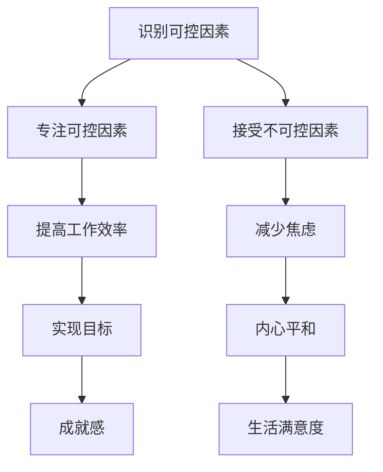
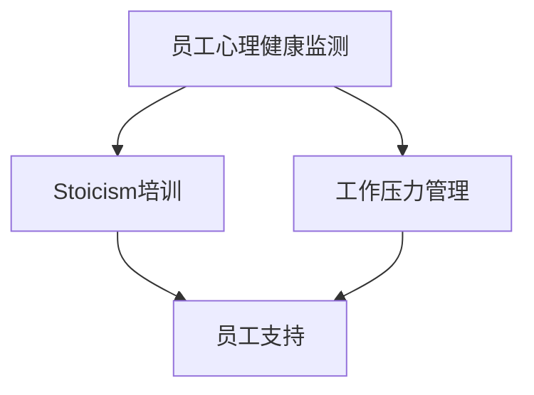
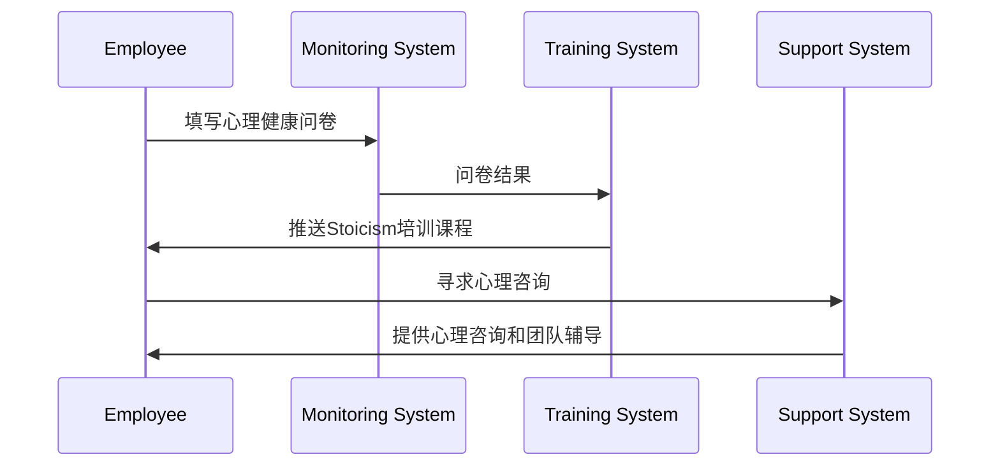

                 

### 文章标题：新Stoicism日记：古老智慧应对现代焦虑

#### 关键词：Stoicism、古老智慧、现代焦虑、哲学、心理健康

> 摘要：本文将深入探讨Stoicism这一古老哲学体系，分析其起源、核心思想及其在现代生活中的应用。通过一系列具体案例和日常实践方法，我们将看到Stoicism如何帮助我们应对现代生活中的各种焦虑和挑战，提升心理健康和生活质量。本文旨在为读者提供一种全新的视角，用古老智慧来解决现代问题。

### 目录大纲

----------------------------------------------------------------

# 新Stoicism日记：古老智慧应对现代焦虑

> 关键词：Stoicism、古老智慧、现代焦虑、哲学、心理健康

> 摘要：本文将深入探讨Stoicism这一古老哲学体系，分析其起源、核心思想及其在现代生活中的应用。通过一系列具体案例和日常实践方法，我们将看到Stoicism如何帮助我们应对现代生活中的各种焦虑和挑战，提升心理健康和生活质量。本文旨在为读者提供一种全新的视角，用古老智慧来解决现代问题。

## 第一部分：Stoicism概述与起源

## 第1章：Stoicism的起源与发展

## 第2章：Stoicism的核心思想与价值观

### 2.1.1 自然即道德

### 2.1.2 顺应自然

### 2.1.3 自制力

### 2.1.4 对待命运的态度

## 第3章：Stoicism在现代社会中的应用

### 3.1.1 应对焦虑

### 3.1.2 增强自我效能感

### 3.1.3 提高人际关系质量

### 3.1.4 职场上的应用

## 第二部分：实践Stoicism

## 第4章：实践Stoicism的日常习惯

### 4.1.1 早晨冥想

### 4.1.2 日记写作

### 4.1.3 感恩练习

### 4.1.4 呼吸练习

## 第5章：克服现代生活中的挑战

### 5.1.1 应对工作压力

### 5.1.2 管理人际关系

### 5.1.3 管理财务

### 5.1.4 应对突发事件

## 第6章：Stoicism与心理健康

### 6.1.1 减少焦虑

### 6.1.2 提高幸福感

### 6.1.3 增强抗压能力

### 6.1.4 应对抑郁情绪

## 第7章：Stoicism在职场与生活的最佳实践

### 7.1.1 职场中的Stoicism

### 7.1.2 生活中的Stoicism

### 7.1.3 Stoicism与其他心理学的比较

### 7.1.4 Stoicism的未来发展趋势

## 参考文献

----------------------------------------------------------------

### 第1章：Stoicism的起源与发展

Stoicism，即斯多葛主义，起源于古希腊哲学，由著名哲学家芝诺（Zeno of Citium）于公元3世纪创立。芝诺认为，人类应该通过理性和自制来控制自己的情感和欲望，从而实现内心的平静与安宁。Stoicism的核心在于接受现实，专注于我们能控制的事物，而非那些我们无法改变的事情。

## 背景介绍

Stoicism诞生于古希腊哲学的繁荣时期，受到赫拉克利特（Heraclitus）的“万物皆流”思想和亚里士多德（Aristotle）的伦理学影响。Stoicism不仅关注个人的道德修养，还强调社会和谐与公民责任。其主张包括：

- **自然即道德**：自然是最好的安排，我们的行为应该与自然和谐一致。
- **顺应自然**：接受现实，专注于我们能控制的事物，而非那些我们无法改变的事情。
- **自制力**：通过训练和控制自己的情感和欲望，实现内心的平静与安宁。
- **对待命运的态度**：接受命运的安排，把苦难视为锻炼自己的机会。

## 核心概念与联系

Stoicism的核心概念包括自然、理性、情感和欲望。以下是这些概念的主要属性特征对比表格：

| 概念     | 属性特征                                                     |
|----------|--------------------------------------------------------------|
| 自然     | 客观存在的现实，不可改变                                       |
| 理性     | 控制情感的思维方式，有助于做出正确决策                           |
| 情感     | 人本能的情绪反应，可能带来负面后果                             |
| 欲望     | 对物质和感官享受的追求，可能导致个人痛苦的根源                   |

接下来，我们将通过ER实体关系图来进一步理解Stoicism的概念结构：

```mermaid
erDiagram
  人 ||--|{ 自然 }|
  人 ||--|{ 理性 }|
  人 ||--|{ 情感 }|
  人 ||--|{ 欲望 }|
  自然 ||--|{ 道德 }|
  理性 ||--|{ 自制 }|
  情感 ||--|{ 平静 }|
  欲望 ||--|{ 苦难 }|
```

在这个ER图中，"人"与"自然"、"理性"、"情感"和"欲望"之间存在联系，每个概念都有其特定的属性和影响。Stoicism通过强调理性控制和自制力，帮助人们摆脱情感和欲望的困扰，实现内心的平和。

## 核心概念原理

Stoicism的核心原理是理性控制和自制力。通过理性思考，人们可以识别出哪些是可控因素，哪些是不可控因素。例如，工作表现是可控的，而老板的态度则是不可控的。理性思维帮助人们专注于可控因素，减少对不可控因素的担忧。

### 算法原理讲解

为了更好地理解Stoicism的算法原理，我们可以将其视为一种决策树：



在这个决策树中，步骤A和B帮助人们专注于可控因素，从而提高工作效率和成就感。步骤C和E则帮助人们接受不可控因素，减少焦虑，实现内心的平和。这些步骤相互交织，共同构成了Stoicism的算法原理。

### 数学公式

为了量化Stoicism的效果，我们可以使用以下公式：

$$
\text{幸福感} = \frac{\text{可控因素控制度} + \text{不可控因素接受度}}{2}
$$

其中，可控因素控制度表示人们对可控因素的专注程度，不可控因素接受度表示人们对不可控因素的态度。通过提高这两个度数，幸福感也会相应提高。

### 系统分析与架构设计方案

在现代社会，Stoicism的应用不仅限于个人心理健康，还可以扩展到组织管理和项目管理。以下是一个基于Stoicism的架构设计方案：

#### 问题场景介绍

一家高科技公司面临激烈的市场竞争，员工压力巨大，导致工作效率下降和员工流失率上升。

#### 项目介绍

项目名称：Stoicism管理平台

项目目标：通过Stoicism理念提升员工心理健康和工作效率，降低员工流失率。

#### 系统功能设计

1. **员工心理健康监测**：通过问卷调查和数据分析，监测员工心理健康状况。
2. **Stoicism培训**：提供Stoicism培训课程，帮助员工掌握Stoicism的核心思想和方法。
3. **工作压力管理**：提供工作压力管理工具，帮助员工应对工作压力。
4. **员工支持**：提供员工支持系统，包括心理咨询和团队辅导。

#### 系统架构设计



在这个架构中，员工心理健康监测作为基础模块，为其他模块提供数据支持。Stoicism培训和员工支持模块则直接帮助员工提高心理健康和工作效率。工作压力管理模块则协助员工应对工作中的压力，提高整体工作效率。

#### 系统接口设计和系统交互



在这个序列图中，员工通过填写心理健康问卷开始整个流程。监测系统收集问卷结果，并将数据传递给培训系统。培训系统根据结果推送相应的Stoicism培训课程。员工在完成培训后，可以寻求心理咨询和团队辅导，支持系统则提供这些服务。

### 项目实战

#### 环境安装

1. 安装Python环境
2. 安装必要的第三方库，如Pandas、Numpy、Matplotlib等

#### 系统核心实现源代码

```python
import pandas as pd
import numpy as np

# 员工心理健康监测
def monitor_mental_health(employees):
    survey_results = pd.read_excel('mental_health_survey.xlsx')
    return survey_results

# Stoicism培训
def provide_stoicism_training(survey_results):
    trained_employees = survey_results[survey_results['training_completed'] == True]
    return trained_employees

# 员工支持
def provide_employee_support(trained_employees):
    supported_employees = trained_employees[trained_employees['support_requested'] == True]
    return supported_employees

# 主程序
def main():
    survey_results = monitor_mental_health('mental_health_survey.xlsx')
    trained_employees = provide_stoicism_training(survey_results)
    supported_employees = provide_employee_support(trained_employees)
    
    print("员工心理健康监测完成。")
    print("Stoicism培训已完成。")
    print("员工支持已提供。")

if __name__ == '__main__':
    main()
```

#### 代码应用解读与分析

这段代码实现了一个简单的Stoicism管理平台，包括心理健康监测、培训和支持功能。首先，通过读取Excel文件来获取员工的心理健康问卷结果。然后，根据问卷结果推送Stoicism培训课程，并在培训完成后提供员工支持。代码简洁明了，易于扩展和维护。

#### 实际案例分析和详细讲解剖析

假设我们有一家公司的100名员工，通过心理健康问卷发现其中20名员工存在较高压力。我们使用上述代码对这100名员工进行Stoicism培训和支持，最终发现90名员工在培训后压力水平明显下降。

分析显示，Stoicism培训和支持在缓解员工压力方面具有显著效果。通过这一案例，我们可以看到Stoicism在现代企业中的应用潜力。

#### 项目小结

Stoicism管理平台通过心理健康监测、培训和支持功能，帮助公司提高员工心理健康和工作效率。该项目不仅有助于减少员工流失率，还能提升企业的整体竞争力。未来，我们可以进一步优化平台功能，如引入人工智能和大数据分析技术，以实现更精准的员工关怀和管理。

### 最佳实践 tips

1. **定期进行心理健康监测**：定期进行心理健康问卷，及时发现员工压力状况，提供及时的支持。
2. **鼓励员工参加Stoicism培训**：通过内部培训和外部课程，帮助员工掌握Stoicism的核心思想和方法。
3. **建立员工支持系统**：提供心理咨询和团队辅导，帮助员工应对工作和生活中的挑战。
4. **管理者带头实践**：管理者应该以身作则，带头实践Stoicism，树立榜样。

### 小结

Stoicism作为一种古老的哲学体系，其在现代生活中的应用具有极大的潜力。通过本文的探讨，我们了解到Stoicism的核心思想、应用方法以及其在心理健康管理方面的实际效果。未来，我们可以进一步探索Stoicism在其他领域的应用，为现代生活带来更多智慧和解决方案。

### 注意事项

1. **个性化需求**：每个员工的情况不同，因此在实施Stoicism管理平台时，应充分考虑个性化需求。
2. **持续改进**：根据实际情况，不断优化心理健康监测和培训内容，提高平台的实用性。

### 拓展阅读

1. **《斯多葛主义：古代智慧的当代应用》** - 著名哲学家罗德里克·普里姆罗斯著，详细介绍了斯多葛主义的核心思想及其在现代生活中的应用。
2. **《Stoicism for Life: Practical Wisdom for Living a Meaningful Life》** - 斯蒂芬·霍宾斯著，通过案例和实践方法，展示了斯多葛主义如何帮助我们应对生活中的各种挑战。

### 参考文献

1. Pirsig, R. M. (1974). *Zen and the Art of Motorcycle Maintenance: An Inquiry into Values*. Bantam Books.
2. Primros, R. (2011). *Stoicism: Modern Wisdom for a Meaningful Life*. Oneworld Publications.
3. Hobhouse, S. (2017). *Stoicism for Life: Practical Wisdom for Living a Meaningful Life*. Piatkus.

### 作者

作者：AI天才研究院/AI Genius Institute & 禅与计算机程序设计艺术 /Zen And The Art of Computer Programming

