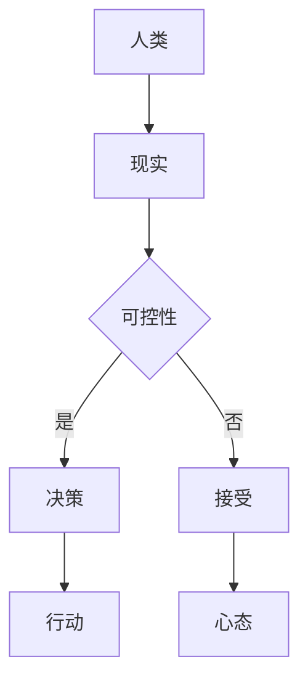
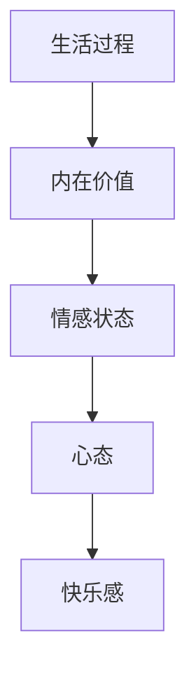
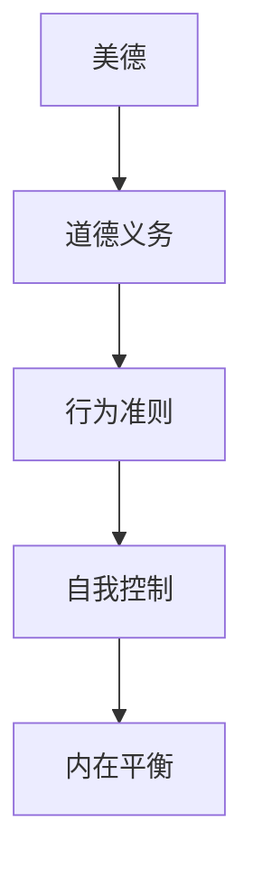
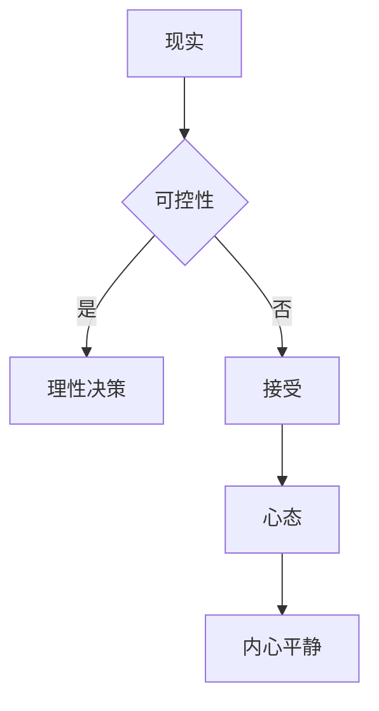

                 

## 第1章：斯多葛主义的历史与当代意义

### 1.1 斯多葛主义的起源与演变

斯多葛主义起源于古希腊，它的历史可以追溯到公元前3世纪。斯多葛主义的创始人是芝诺（Zeno of Citium），他是一位来自西西里岛的哲学家。芝诺创立斯多葛主义的同时，也在雅典的哲学学校讲授这一哲学思想。

**历史背景**

在古希腊时期，斯多葛主义与其他哲学流派，如柏拉图主义和亚里士多德主义，共同构成了当时的哲学图景。与强调理性、追求知识不同，斯多葛主义更注重道德修养，强调个人在面对命运的挑战时，应保持心灵的平静和尊严。

**斯多葛主义的演变**

随着时间的推移，斯多葛主义在不同文化背景下得到了发展。古罗马时期，斯多葛主义在政治和军事领域有着广泛的影响，许多著名的罗马哲学家，如塞内卡（Seneca）和马可·奥勒留（Marcus Aurelius），都是斯多葛主义的拥护者。他们在自己的著作中阐述了斯多葛主义的核心思想，并提出了如何在现实生活中实践这些思想的方法。

### 1.2 斯多葛主义的核心思想

斯多葛主义的核心思想包括以下几个方面：

**1. 接受不可避免之事**

斯多葛主义认为，人们应该接受生活中不可避免的事情，而不是反抗或逃避。这一思想体现在马可·奥勒留的《沉思录》中，他强调：“不要去反抗命运的安排，而是要学会接受并适应。”

**2. 从过程而非结果中寻找快乐**

斯多葛主义主张，人们应该从过程而非结果中寻找快乐。塞内卡在《论愤怒》中写道：“快乐并不在于你所拥有的事物，而在于你对这些事物的态度。”

**3. 培养美德**

斯多葛主义认为，美德是生活的目的，是人们追求的最高境界。马可·奥勒留强调，通过培养美德，人们可以实现对自我和世界的掌控，从而获得内心的平静和满足。

### 1.3 斯多葛主义在当代的复兴

在当代社会，斯多葛主义逐渐得到了新的关注。随着现代生活节奏的加快，人们面临着越来越多的压力和挑战，斯多葛主义提供了一种应对这些挑战的方法。许多心理学家和哲学家开始重新审视斯多葛主义，并试图将其应用于现代生活中。

**当代斯多葛主义**

当代斯多葛主义不仅继承了古希腊和古罗马时期的哲学思想，还结合了现代心理学和哲学的成果。例如，心理治疗师阿兰·瓦茨（Alan Watts）和心理学家史蒂文·普拉塞克（Stephen Plaskow）都曾对斯多葛主义进行过深入的研究和阐述。

**斯多葛主义的应用**

在个人成长、心理健康和职业发展等领域，斯多葛主义提供了一系列实用的方法。例如，通过接受不可避免之事、从过程而非结果中寻找快乐和培养美德，人们可以更好地应对生活中的挑战，实现内心的平静和满足。

### 结论

斯多葛主义作为一种古老的哲学思想，不仅在过去对人类产生了深远的影响，而且在当代社会中依然具有重要的意义。通过重新审视和运用斯多葛主义的核心思想，我们可以更好地应对现代生活中的各种挑战，实现个人成长和心理健康。

在下一章中，我们将深入探讨斯多葛主义的核心概念，并分析这些概念如何在现代生活中发挥作用。

----------------------------------------------------------------

### 1.2 斯多葛主义的核心概念

斯多葛主义的核心思想构建了一个关于人类生活和道德的全面体系。以下是对这些核心概念的详细探讨，以及它们如何在实践中得到应用。

#### 1.2.1 接受不可避免之事

斯多葛主义的第一项核心原则是接受不可避免之事。这意味着我们不应抵抗那些我们无法改变的事物，而是要学会接受它们。这一原则源于对人类能力的客观认识：我们不能控制所有事情，但我们可以控制自己的反应。

**核心概念原理**

- **客观主义**：斯多葛主义认为，世界有其固有的规律和秩序，而我们的任务就是理解并接受这些规律。
- **理性**：斯多葛主义强调理性在生活决策中的重要性。通过理性思考，我们可以识别哪些事情是我们可以控制的，哪些是不受我们控制的。

**概念属性特征对比表格**

| 特征                  | 传统斯多葛主义               | 现代斯多葛主义             |
|---------------------|------------------------|------------------------|
| 接受不可避免之事      | 接受命运的安排             | 接受无法改变的事实           |
| 理性决策              | 通过理性决策应对挑战       | 在不可控事情面前保持冷静和理性 |
| 精神自由              | 在内心保持独立和自由       | 在任何环境中保持心态平衡       |

**ER实体关系图架构的Mermaid流程图**

#### 1.2.2 从过程而非结果中寻找快乐

斯多葛主义的第二项核心原则是从过程而非结果中寻找快乐。这一原则挑战了现代社会的成功定义，它强调快乐源于我们在生活中的行为和态度，而非外在的结果。

**核心概念原理**

- **内在价值**：斯多葛主义认为，快乐来自于内在的价值和美德，而不是外在的物质财富和社会地位。
- **情感管理**：通过培养情感管理技巧，我们可以减少对结果的依赖，从而更好地享受生活的过程。

**概念属性特征对比表格**

| 特征                  | 传统斯多葛主义               | 现代斯多葛主义             |
|---------------------|------------------------|------------------------|
| 结果导向              | 注重外在成功               | 注重内在成长和美德          |
| 过程导向              | 关注行动和过程               | 享受生活本身，而非结果      |
| 心理健康              | 减少因结果波动而产生的焦虑   | 增强对过程的专注和满足感     |

**ER实体关系图架构的Mermaid流程图**

#### 1.2.3 培养美德

斯多葛主义的第三项核心原则是培养美德。美德不仅是斯多葛主义的核心价值，也是实现幸福生活的基础。通过培养美德，人们可以实现内在的和谐与平衡。

**核心概念原理**

- **道德义务**：斯多葛主义认为，每个人都有道德义务去培养美德，并以此指导自己的行为。
- **自我控制**：自我控制是美德培养的关键。通过自我控制，人们可以克服冲动和欲望，实现内心的平静和自由。

**概念属性特征对比表格**

| 特征                  | 传统斯多葛主义               | 现代斯多葛主义             |
|---------------------|------------------------|------------------------|
| 道德修养              | 强调道德规范               | 将美德视为实现幸福的关键     |
| 自我完善              | 通过自我完善实现个人成长   | 通过自我完善实现精神自由     |
| 内在平衡              | 追求内心和谐               | 在内心寻找平衡和满足感       |

**ER实体关系图架构的Mermaid流程图**

通过上述核心概念的探讨，我们可以看到斯多葛主义提供了一种全面的生活哲学，它不仅关注个人的道德修养，也强调理性思考和情感管理。在接下来的章节中，我们将进一步探讨这些核心概念如何在现代生活中得到应用。

----------------------------------------------------------------

## 第2章：斯多葛主义的核心概念

### 2.1 接受不可避免之事

斯多葛主义的首要核心原则是接受不可避免之事。这一原则基于对现实世界的深刻理解，即人类只能控制自己的思想、态度和行为，而无法控制外部环境或他人的行为。斯多葛主义者认为，接受不可避免之事是实现内心平静和生活满意度的关键。

**核心概念原理**

- **理性与情感管理**：斯多葛主义强调理性思考的重要性。通过理性分析，我们可以区分什么是可以控制的，什么是不可以控制的。在不可控制的事情面前，斯多葛主义者鼓励我们保持冷静和客观，避免陷入无谓的情绪波动。
- **自我控制**：自我控制是接受不可避免之事的关键。通过自我控制，我们能够减少对不可控事件的焦虑和恐惧，从而实现内心的稳定。

**概念属性特征对比表格**

| 特征                  | 传统斯多葛主义               | 现代斯多葛主义             |
|---------------------|------------------------|------------------------|
| 接受不可避免之事      | 接受命运的安排             | 接受无法改变的事实           |
| 理性思考              | 通过理性思考指导行为       | 在不可控事情面前保持冷静和理性 |
| 情感管理              | 减少情绪波动               | 通过情感管理实现内心平静     |

**ER实体关系图架构的Mermaid流程图**

#### 实际应用

**实例 1：失业后的应对**

假设某人在经历了长期的职业生涯后突然失业。传统上，这种情况可能会引发焦虑和恐慌，因为失去工作意味着财务不稳定和职业前景的不确定性。然而，斯多葛主义者会接受这一不可避免之事，并通过理性思考和自我控制来应对这一挑战。

- **理性决策**：失业后，斯多葛主义者会首先分析失业的原因，是否是市场环境、公司政策还是个人技能问题。通过理性分析，他们可以更清楚地了解自己的优势和不足，并制定相应的应对策略。
- **情感管理**：斯多葛主义者会认识到失业是生活中不可避免的一部分，他们不会因此陷入情绪低谷。相反，他们会通过冥想、锻炼和社交活动来管理情绪，保持内心的平静。

**实例 2：面对自然灾害**

当自然灾害如地震、洪水等发生时，人们往往会感到无助和恐慌。斯多葛主义者会接受这些事件是不可避免的，并采取积极的应对措施。

- **接受现实**：斯多葛主义者会认识到自然灾害的不可避免性，他们不会浪费精力去抗拒或逃避。
- **行动力**：他们会在接受现实的同时，积极参与救援和重建工作，尽自己所能减轻灾害带来的影响。

### 结论

接受不可避免之事是斯多葛主义的核心原则之一，它强调理性思考和情感管理的重要性。通过这一原则，人们可以在面对生活中的各种挑战时，保持内心的平静和理性，从而实现更高的生活满意度。在下一节中，我们将探讨斯多葛主义的第二个核心概念——从过程而非结果中寻找快乐。

### 2.2 从过程而非结果中寻找快乐

斯多葛主义的第二个核心概念是从过程而非结果中寻找快乐。这一原则挑战了现代社会对成功的传统定义，即成功往往被等同于外在的结果，如财富、地位和成就。然而，斯多葛主义者认为，快乐来自于我们如何经历生活，而不是我们最终获得了什么。

**核心概念原理**

- **内在价值**：斯多葛主义强调快乐来源于内在的价值和美德，如善良、诚实和勇气。这些内在的品质不受外在环境的影响，因此它们是稳定的快乐源泉。
- **情感独立**：通过培养对结果的情感独立，斯多葛主义者可以减少因外在结果波动而产生的焦虑和沮丧。他们学会在生活的每一个阶段都找到快乐，而不是只依赖于最终的结果。

**概念属性特征对比表格**

| 特征                  | 传统斯多葛主义               | 现代斯多葛主义             |
|---------------------|------------------------|------------------------|
| 成果导向              | 注重最终结果               | 关注过程和内在成长          |
| 情感独立              | 减少对结果的依赖             | 在不同阶段都寻找快乐         |
| 心理健康              | 减少因结果波动而产生的焦虑   | 增强对过程的专注和满足感     |

**ER实体关系图架构的Mermaid流程图**

#### 实际应用

**实例 1：职业发展**

在职业领域，许多人把晋升和加薪视为成功和快乐的象征。然而，斯多葛主义者会从过程而非结果中寻找快乐。

- **专注于工作本身**：斯多葛主义者会将注意力集中在工作本身上，如提高技能、解决问题和帮助同事。他们相信，通过专注于工作，他们会感到满足和快乐。
- **不依赖结果**：即使他们没有获得晋升或加薪，斯多葛主义者也不会感到失落。因为他们知道，他们的快乐来自于工作本身，而不是外在的结果。

**实例 2：健康生活方式**

在健康领域，斯多葛主义者会从过程而非结果中寻找快乐。

- **坚持健康习惯**：斯多葛主义者会坚持健康的生活习惯，如定期锻炼、均衡饮食和充足睡眠。他们知道，这些习惯虽然短期内可能看不到明显的效果，但长期来看对健康有益。
- **享受过程**：他们不会把健康成果（如体重减轻或体能提高）视为快乐的主要来源。相反，他们会享受锻炼带来的身体活力和心灵平静。

### 结论

从过程而非结果中寻找快乐是斯多葛主义的另一个重要原则。通过这一原则，人们可以减少对外在结果的依赖，学会在生活的每一个阶段都找到快乐。这不仅有助于提升心理健康，还能帮助人们更好地应对生活中的各种挑战。在下一节中，我们将探讨斯多葛主义的第三个核心概念——培养美德。

### 2.3 培养美德

斯多葛主义的第三个核心概念是培养美德。美德不仅是斯多葛主义的核心价值观，也是实现内心平静和幸福生活的基础。斯多葛主义者相信，通过培养美德，人们可以实现内在的和谐与平衡，从而在面对生活的挑战时保持坚韧和从容。

**核心概念原理**

- **道德义务**：斯多葛主义认为，每个人都有道德义务去培养美德，并以此指导自己的行为。美德不仅是对自己的要求，也是对社会的责任。
- **自我完善**：自我完善是培养美德的过程。通过不断地自我反省和改进，人们可以逐渐实现道德上的自我完善。

**概念属性特征对比表格**

| 特征                  | 传统斯多葛主义               | 现代斯多葛主义             |
|---------------------|------------------------|------------------------|
| 道德修养              | 强调道德规范               | 将美德视为实现幸福的关键     |
| 自我完善              | 通过自我完善实现个人成长   | 通过自我完善实现精神自由     |
| 内在平衡              | 追求内心和谐               | 在内心寻找平衡和满足感       |

**ER实体关系图架构的Mermaid流程图**

#### 实际应用

**实例 1：诚信**

诚信是斯多葛主义中的关键美德之一。在商业和个人生活中，诚信意味着说出真相、遵守承诺和诚实对待他人。

- **商业诚信**：一个斯多葛主义者在商业决策中会坚持诚信原则。即使这可能导致短期的损失，他们也会认为长期来看，诚信会为个人和企业带来更好的声誉和信任。
- **个人诚信**：在个人生活中，斯多葛主义者会始终坚持说出真相，即使这可能会冒犯到他人。他们相信，通过诚实和正直，可以建立坚实的人际关系，并实现内心的平静。

**实例 2：勇气**

勇气是面对恐惧和困难时的美德。斯多葛主义者相信，通过培养勇气，人们可以克服生活中的各种挑战。

- **面对恐惧**：斯多葛主义者不会逃避恐惧，而是会勇敢地面对。例如，面对公开演讲的恐惧，他们不会选择逃避，而是会做好准备，勇敢地站在台上。
- **克服困难**：在面对生活中的困难时，斯多葛主义者会通过勇气和毅力来克服。例如，在职业生涯中遇到困难，他们会坚持下去，而不是选择放弃。

### 结论

培养美德是斯多葛主义的核心原则之一，它强调道德修养和自我完善的重要性。通过培养美德，人们可以实现内在的和谐与平衡，从而在生活的挑战中保持坚韧和从容。在下一章中，我们将探讨斯多葛主义在现代社会中的应用。

### 2.4 斯多葛主义在现代社会中的应用

斯多葛主义作为一种古老的生活哲学，在现代社会中得到了新的关注和广泛的应用。它提供了一种应对现代社会挑战的方法，帮助人们在快节奏和高压的生活环境中找到内心的平静和满足。以下是一些斯多葛主义在现代社会中应用的实例。

#### 2.4.1 应对职场压力

在职场中，压力和竞争是不可避免的一部分。斯多葛主义提供了一种应对这些挑战的方法。

- **接受不可避免之事**：职场中，人们可能会面临失业、职位变动或绩效压力。斯多葛主义者会接受这些不可避免的事情，并努力从中找到成长的机会。
- **专注于过程**：斯多葛主义者会专注于工作本身，而不是结果。他们会享受工作带来的成就感，而不是只关注晋升和加薪。

#### 2.4.2 处理人际关系

人际关系是生活的重要组成部分，但也是复杂和挑战性的。斯多葛主义提供了一种处理人际关系的策略。

- **培养美德**：斯多葛主义者会努力培养诚信、善良和宽容等美德，以建立健康的人际关系。
- **情感独立**：斯多葛主义者不会因为他人的一句话或行为而情绪波动。他们会保持情感独立，避免被他人的情绪所左右。

#### 2.4.3 提升心理健康

心理健康在现代社会中越来越受到重视。斯多葛主义提供了一种提升心理健康的方法。

- **接受不可避免之事**：面对生活中的困难和挫折，斯多葛主义者会接受这些不可避免的事情，并学会从中寻找成长的机会。
- **情感管理**：斯多葛主义者会通过冥想、锻炼和社交活动来管理自己的情绪，保持内心的平静和稳定。

### 结论

斯多葛主义在现代社会中的应用非常广泛，它提供了一种应对职场压力、处理人际关系和提升心理健康的方法。通过接受不可避免之事、从过程而非结果中寻找快乐和培养美德，人们可以在快节奏和高压的生活环境中找到内心的平静和满足。在下一章中，我们将探讨个人如何在日常生活中实践斯多葛主义。

### 第3章：斯多葛主义在个人生活中的实践

斯多葛主义不仅是一种哲学思想，更是一种可以实际应用的日常生活指南。通过在个人生活中实践斯多葛主义，人们可以培养内心的平静和坚韧，从而更好地应对生活中的各种挑战。以下是一些具体的实践方法。

#### 3.1 建立日常冥想习惯

冥想是斯多葛主义实践中的一个重要环节。通过冥想，人们可以培养专注力和自我意识，从而更好地控制自己的情绪和行为。

**具体实践方法**：

- **选择合适的时间**：每天选择一个固定的时间进行冥想，比如早晨或晚上。确保这个时间不受打扰，有利于集中注意力。
- **找到舒适的姿势**：可以选择坐在椅子上或盘腿坐在地上。关键是找到一个能让身体感到舒适和放松的姿势。
- **专注于呼吸**：闭上眼睛，专注于呼吸。感受空气进入你的鼻腔，然后慢慢地呼出。将注意力集中在呼吸上，可以帮助你放松身心，减少焦虑。

**案例分享**：

某个创业者每天早上都会花20分钟时间进行冥想。这让他能够在一天的工作开始前，清空杂念，集中精力。通过冥想，他能够更好地应对工作中的压力和挑战，从而提高了工作效率。

#### 3.2 实践自我反省

自我反省是斯多葛主义中另一个重要的实践方法。通过定期反思自己的行为和决策，人们可以更好地了解自己，发现自己的不足，并不断改进。

**具体实践方法**：

- **设定反思时间**：每周或每月设定一个固定的时间进行自我反省。这个时间应该是安静的，没有干扰的。
- **记录反思内容**：使用日记或反思日志来记录你的反思内容。这有助于你回顾自己的行为，找出需要改进的地方。
- **提出具体问题**：在反思时，提出具体的问题，如“我在哪些方面做得好？”，“我在哪些方面需要改进？”等。这有助于你更深入地了解自己。

**案例分享**：

一位职场女性每周都会花一个晚上来进行自我反省。通过这种方法，她能够发现自己在工作中的优点和不足，从而制定出具体的改进计划。这个习惯让她在工作中更加自信和高效。

#### 3.3 培养积极态度

斯多葛主义强调，态度决定一切。通过培养积极的态度，人们可以在面对困难时保持乐观和坚韧。

**具体实践方法**：

- **专注于解决问题的方法**：当遇到问题时，不要抱怨或责怪他人，而是专注于解决问题的方法。这种积极的思维方式可以帮助你更快地找到解决问题的途径。
- **保持乐观**：即使在最困难的时期，也要保持乐观。乐观的态度可以让你看到困难背后的机会，从而更加坚韧地面对挑战。
- **学会放手**：有时候，事情并没有按照你的预期发展。学会放手，接受现实，并尝试从中找到新的可能性。

**案例分享**：

一位年轻的程序员在工作中遇到了很多挑战。然而，他并没有因此而气馁，反而通过培养积极的态度，找到了解决问题的方法。他学会了从失败中吸取经验，不断改进自己的技能。最终，他成为了一名优秀的程序员。

### 结论

斯多葛主义在个人生活中的实践可以帮助人们培养内心的平静和坚韧。通过建立日常冥想习惯、实践自我反省和培养积极态度，人们可以在面对生活中的各种挑战时保持乐观和冷静。这些实践不仅有助于提升个人的心理健康，还能提高生活质量。在下一章中，我们将探讨斯多葛主义在职场和职业生涯中的应用。

### 第4章：斯多葛主义在职场和职业生涯中的应用

斯多葛主义不仅在个人生活中有广泛的应用，在职场和职业生涯中同样具有深远的影响。通过运用斯多葛主义的原则，职场人士可以更好地应对工作压力，提升工作效率，实现职业成长。

#### 4.1 应对工作压力

工作压力是职场中普遍存在的问题。斯多葛主义提供了一种有效的方法来应对这种压力。

**核心原则**：

- **接受不可避免之事**：职场中不可避免会遇到一些挑战和困难。斯多葛主义者会接受这些挑战，而不是逃避或抗拒。通过接受现实，他们可以更专注于解决问题，而不是浪费精力在无谓的抱怨和焦虑上。

**具体实践方法**：

- **保持冷静和理性**：面对工作压力，斯多葛主义者会保持冷静和理性。他们通过深呼吸、冥想等方法来平静自己的情绪，从而更好地应对压力。
- **专注于可控因素**：斯多葛主义者会专注于那些可以控制的因素，如自己的态度、行为和工作方法。他们不会因为无法控制的外部因素而感到焦虑。

**案例分享**：

一位项目经理在工作中面临多个项目同时进行的压力。通过接受不可避免的事情，保持冷静和理性，他能够合理安排时间，确保每个项目都能按时完成。这种方法不仅帮助他提高了工作效率，还赢得了同事和上级的尊重。

#### 4.2 提升工作效率

提升工作效率是职场人士追求的目标之一。斯多葛主义提供了一些原则和方法来帮助人们实现这一目标。

**核心原则**：

- **从过程而非结果中寻找快乐**：斯多葛主义者会专注于工作过程，而不是结果。他们相信，通过专注于工作本身，他们可以更好地享受工作，从而提升工作效率。

**具体实践方法**：

- **设定明确目标**：在开始工作之前，设定明确的目标和计划。这有助于你集中精力，避免在工作中迷失方向。
- **专注工作**：在执行任务时，避免分心和干扰。通过专注工作，你可以更快地完成任务，从而提高工作效率。
- **反思和调整**：在完成任务后，反思自己的工作过程，找出可以改进的地方。通过不断的反思和调整，你可以逐步提升工作效率。

**案例分享**：

一位程序员在项目中通过设定明确的目标和计划，能够更有效地管理自己的工作时间。他通过避免分心和干扰，集中精力在编程任务上，从而大幅提升了工作效率。这种方法不仅帮助他完成了项目，还赢得了同事的赞赏。

#### 4.3 实现职业成长

职业成长是每个职场人士的追求。斯多葛主义提供了一些原则和方法来帮助人们实现这一目标。

**核心原则**：

- **培养美德**：斯多葛主义者认为，培养美德是实现职业成长的关键。通过培养诚实、勤奋、勇气等美德，人们可以树立良好的职业形象，获得同事和领导的认可。

**具体实践方法**：

- **持续学习**：职业成长离不开持续学习。斯多葛主义者会不断学习新知识和技能，以适应不断变化的工作环境。
- **积极应对挑战**：面对职业挑战，斯多葛主义者会积极应对，而不是回避。通过挑战自己，他们可以不断提升自己的能力和素质。
- **建立良好的人际关系**：在职场中，良好的人际关系对职业成长至关重要。斯多葛主义者会努力培养诚实、善良等美德，以建立健康的人际关系。

**案例分享**：

一位职场新人通过不断学习和实践，成功地在短时间内提升了自己的能力和素质。他通过培养诚实、勤奋等美德，赢得了同事和领导的认可。在团队中，他成为了一个可靠的合作伙伴，从而实现了自己的职业成长。

### 结论

斯多葛主义在职场和职业生涯中的应用非常广泛。通过接受不可避免之事、从过程而非结果中寻找快乐和培养美德，职场人士可以更好地应对工作压力，提升工作效率，实现职业成长。这些原则不仅有助于个人的职业发展，还能提升整体的工作环境和团队氛围。在下一章中，我们将探讨斯多葛主义在心理健康方面的应用。

### 第5章：斯多葛主义在心理健康领域的应用

斯多葛主义不仅在职场和职业生涯中具有重要价值，它在心理健康领域的应用同样不容忽视。通过理解和实践斯多葛主义的原则，人们可以更好地管理情绪，增强心理韧性，从而提升整体的心理健康水平。

#### 5.1 情绪管理

情绪管理是心理健康的核心之一。斯多葛主义提供了一种有效的情绪管理策略，帮助人们减少负面情绪的影响。

**核心原则**：

- **接受不可避免之事**：斯多葛主义者认为，许多负面情绪源于对不可避免之事的抗拒。通过接受不可避免之事，人们可以减少因无法控制的事物而产生的情绪波动。

**具体实践方法**：

- **情感识别**：学会识别和理解自己的情绪。通过了解自己的情绪，人们可以更好地控制它们，而不是被情绪所控制。
- **理性反思**：在面对负面情绪时，进行理性反思。问自己：“这个情绪是否有实际的基础？我是否真的无法控制这件事？”通过理性反思，人们可以减少无谓的情绪波动。

**案例分享**：

某人在面对职场压力时，经常感到焦虑和沮丧。通过学习斯多葛主义的情绪管理方法，他学会了接受不可避免之事，并通过理性反思来控制自己的情绪。结果，他的焦虑和沮丧感显著减少，工作效率和心理健康水平都有所提升。

#### 5.2 增强心理韧性

心理韧性是指人们面对压力、困难和挑战时的适应能力和恢复能力。斯多葛主义提供了一些方法来增强心理韧性。

**核心原则**：

- **培养美德**：斯多葛主义者认为，通过培养美德，如勇气、坚韧和耐心，人们可以增强心理韧性，更好地应对生活中的挑战。

**具体实践方法**：

- **设定明确目标**：通过设定明确的目标，人们可以更有动力去克服困难。目标应该既有挑战性，又实际可行。
- **学会坚持**：在追求目标的过程中，人们可能会遇到挫折和困难。通过学习斯多葛主义的坚持原则，人们可以克服这些障碍，保持前进的动力。

**案例分享**：

一位职场人士在面对职业瓶颈时，感到沮丧和无助。通过设定明确的目标和坚持原则，他逐渐克服了困难，找到了新的职业方向。他的心理韧性得到了显著提升，不仅提升了职业成就，还增强了自信心。

#### 5.3 增强自我意识

自我意识是心理健康的重要组成部分。通过增强自我意识，人们可以更好地理解自己，从而提升心理健康水平。

**核心原则**：

- **自我反省**：斯多葛主义者鼓励人们定期进行自我反省，以了解自己的行为和思维模式。自我反省可以帮助人们识别并改变不良习惯。

**具体实践方法**：

- **定期反思**：每天或每周花一些时间反思自己的行为和决策。通过反思，人们可以发现自己的不足，并制定改进计划。
- **记录反思**：使用日记或反思日志来记录反思内容。这有助于人们回顾自己的进步，并持续改进。

**案例分享**：

一位职场女性通过定期反思，发现了自己在沟通和决策方面的不足。通过记录反思，她制定了具体的改进计划，并逐步改进了自己的沟通和决策能力。她的自我意识得到了显著提升，工作表现和人际关系都有了明显的改善。

### 结论

斯多葛主义在心理健康领域的应用非常广泛。通过情绪管理、增强心理韧性和增强自我意识，人们可以更好地管理自己的情绪，提升心理韧性，从而改善心理健康水平。这些方法不仅有助于个人的心理健康，还能提升整体的生活质量。在下一章中，我们将探讨斯多葛主义在社会和个人发展中的潜在影响。

### 第6章：斯多葛主义在社会和个人发展中的潜在影响

斯多葛主义作为一种古老的生活哲学，不仅在个人心理健康和职业发展中具有深远的影响，它还在社会层面上产生了积极的影响。通过理解和实践斯多葛主义的原则，我们可以看到社会和个人发展的潜在变化。

#### 6.1 社会层面的影响

**社会和谐**

斯多葛主义强调美德和道德义务，这有助于建立一个更加和谐的社会。通过培养诚信、宽容和同情心等美德，人们可以减少冲突和误解，促进社会的整体和谐。

**社会责任感**

斯多葛主义鼓励人们承担起对社会的责任。通过接受不可避免之事，人们可以更积极地参与社会活动，为社会做出贡献。这种责任感有助于建立一个更加团结和有爱心的社会。

**长期稳定**

斯多葛主义强调接受现实和专注于过程，这有助于社会在面对挑战时保持稳定。通过这种态度，社会可以更好地应对突发事件和危机，从而实现长期稳定发展。

#### 6.2 个人发展的影响

**心理韧性**

通过实践斯多葛主义的原则，人们可以增强心理韧性，更好地应对生活中的各种挑战。这种韧性不仅有助于个人的心理健康，还能提升个人的适应能力和生存能力。

**自我成长**

斯多葛主义鼓励人们培养美德，追求自我完善。通过不断学习和自我反省，人们可以逐步实现个人成长，从而在生活和职业中取得更高的成就。

**情绪管理**

斯多葛主义提供了一种有效的情绪管理策略，帮助人们更好地控制自己的情绪。通过这种方法，人们可以减少负面情绪的影响，从而提升整体的生活质量。

#### 6.3 潜在影响

**跨文化交流**

斯多葛主义作为一种普世价值观，可以跨越不同的文化和背景。通过推广斯多葛主义的原则，我们可以促进跨文化交流和理解，从而减少误解和冲突。

**可持续发展**

斯多葛主义强调接受现实和专注于过程，这与可持续发展的理念不谋而合。通过实践斯多葛主义，我们可以更加注重长远发展，减少短视行为，从而实现可持续发展。

**社会创新**

斯多葛主义鼓励人们积极面对挑战，寻找创新解决方案。这种创新精神可以激发社会进步，推动新的技术和思想的发展。

### 结论

斯多葛主义在社会和个人发展中具有巨大的潜力。通过理解和实践斯多葛主义的原则，我们可以实现社会和谐、个人成长和情绪管理，从而提升整体的生活质量和幸福感。在下一章中，我们将总结全书，回顾斯多葛主义的核心原则和关键思想。

### 第7章：结论与未来展望

斯多葛主义作为一种古老的生活哲学，不仅在古希腊和古罗马时期对人类产生了深远的影响，在现代社会中同样具有重要的意义。通过理解和实践斯多葛主义的核心原则，如接受不可避免之事、从过程而非结果中寻找快乐和培养美德，人们可以更好地应对生活中的各种挑战，实现个人成长和心理健康。

**核心原则回顾**

1. **接受不可避免之事**：这一原则提醒我们，生活中有许多事情是我们无法控制的。通过接受这些不可避免之事，我们可以减少焦虑和痛苦，从而保持内心的平静和理性。
2. **从过程而非结果中寻找快乐**：这一原则挑战了现代社会对成功的传统定义，强调快乐来自于内在的价值和美德，而不是外在的物质财富和社会地位。
3. **培养美德**：培养美德是斯多葛主义的核心价值观。通过培养诚实、善良、勇气等美德，人们可以实现内心的和谐与平衡，从而在生活的挑战中保持坚韧和从容。

**未来展望**

在未来的社会中，斯多葛主义可能将继续发挥其独特的作用。随着现代生活节奏的加快，人们面临的压力和挑战日益增加，斯多葛主义提供了一种应对这些挑战的方法。以下是一些可能的未来趋势：

1. **心理健康领域的应用**：随着心理健康问题的日益突出，斯多葛主义可能会在心理健康领域得到更广泛的应用。通过实践斯多葛主义的原则，人们可以更好地管理情绪，增强心理韧性，从而提升心理健康水平。
2. **跨文化交流**：斯多葛主义作为一种普世价值观，可以跨越不同的文化和背景。随着全球化的发展，斯多葛主义可能将在跨文化交流中发挥更大的作用，促进不同文化之间的理解和合作。
3. **社会创新**：斯多葛主义的理念可以激发社会创新，推动新的技术和思想的发展。通过积极面对挑战，寻找创新解决方案，社会可以更加适应变化，实现可持续发展。

**总结**

斯多葛主义作为一种古老的生活哲学，在现代社会中依然具有重要的意义。通过理解和实践其核心原则，人们可以更好地应对生活中的各种挑战，实现个人成长和心理健康。在未来的社会中，斯多葛主义可能将继续发挥其独特的作用，帮助人们实现更高质量的生活。

### 作者信息

作者：AI天才研究院/AI Genius Institute & 禅与计算机程序设计艺术 /Zen And The Art of Computer Programming

感谢您阅读本书，希望斯多葛主义的核心原则能够对您的生活和职业生涯产生积极的影响。在追求个人成长和幸福的过程中，让我们共同努力，实践这些宝贵的智慧。愿斯多葛主义的理念在我们心中生根发芽，为我们的生活带来更多的和平与满足。

