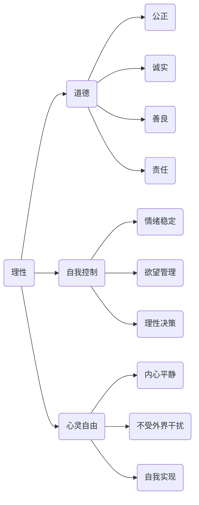
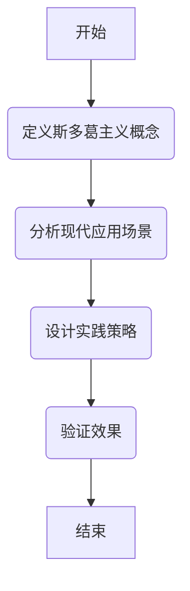
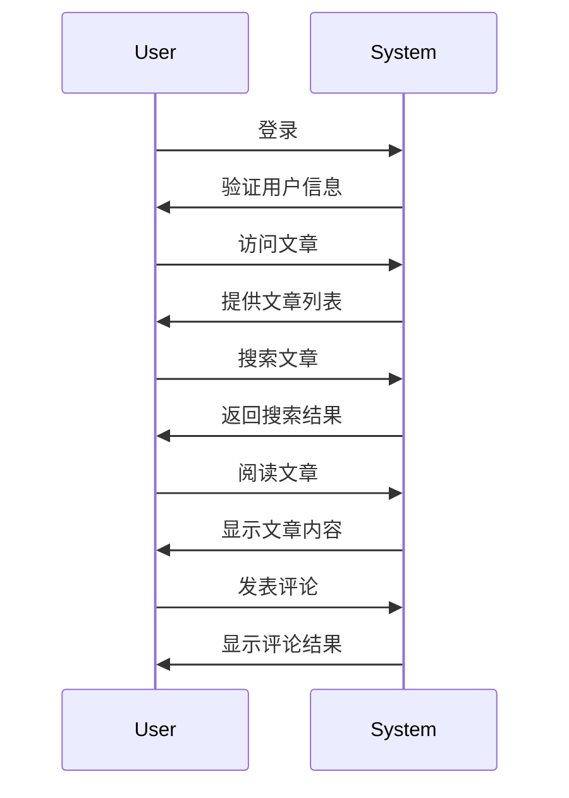

                 

# 新 Stoicism：古老智慧在现代社会的应用

## 关键词
- 斯多葛主义，古代哲学，现代社会，心理健康，人际关系，社会责任

## 摘要
本文旨在探讨新 Stoicism，一种源自古希腊哲学的古老智慧，如何应用于现代社会，为个人和社会提供指导与帮助。通过分析斯多葛主义的核心思想，以及在心理健康、人际关系和社会责任等方面的具体应用，本文将揭示斯多葛主义在当代的价值和意义。

## 引言

### 第1章：斯多葛主义与现代社会的需求

### 1.1 斯多葛主义的历史背景
斯多葛主义起源于古希腊，由芝诺创立，经过塞涅卡、马尔库斯·奥勒留斯等哲学家的传承与发展，形成了独特的哲学体系。该主义强调理性、道德自律和内心的平静，主张通过控制欲望和情感，实现个人幸福和社会和谐。

### 1.2 斯多葛主义的核心思想
斯多葛主义的核心思想包括：自然法则、理性至上、自我控制、心灵自由等。这些思想对于现代人而言，具有深刻的启示意义，能够帮助我们应对现代社会中的各种挑战。

### 1.3 现代社会面临的挑战与斯多葛主义的应对
现代社会充满竞争和压力，人们容易陷入焦虑、抑郁等心理健康问题。斯多葛主义提供的自我控制、理性思考等方法，有助于我们更好地应对这些挑战，实现内心的平静与成长。

## 第二部分：斯多葛主义哲学

### 第2章：斯多葛主义哲学

### 2.1 斯多葛主义的基本概念
斯多葛主义的基本概念包括：理性、道德、自我控制、心灵自由等。这些概念相互关联，共同构成了斯多葛主义哲学的核心。

### 2.2 斯多葛主义的原则与价值观
斯多葛主义的原则与价值观包括：追求真理、坚守道德、尊重自然、追求内心平静等。这些原则和价值观为个人和社会提供了道德指导。

### 2.3 斯多葛主义与古希腊哲学的关系
斯多葛主义是古希腊哲学的一个重要分支，与苏格拉底、柏拉图等哲学家的思想有所联系。同时，斯多葛主义也吸收了其他哲学流派的优点，形成了自己独特的体系。

## 第三部分：斯多葛主义在现代社会的应用

### 第3章：斯多葛主义在现代社会的应用

### 3.1 斯多葛主义与心理健康
斯多葛主义认为，心理健康源于内心的平静和理性思考。通过自我控制和理性思考，我们可以减轻心理压力，保持心理健康。

### 3.2 斯多葛主义与人际关系
斯多葛主义强调人与人之间的相互尊重和理性沟通。通过理解他人、宽容他人，我们可以建立良好的人际关系。

### 3.3 斯多葛主义与社会责任
斯多葛主义主张个人应当承担社会责任，为社会的进步做出贡献。通过关注社会问题、积极参与公益事业，我们可以实现个人价值和社会价值的统一。

## 第四部分：斯多葛主义实践

### 第4章：斯多葛主义实践

### 4.1 如何培养斯多葛主义态度
培养斯多葛主义态度需要我们从日常生活中做起，通过自我反省、理性思考等方式，逐步培养内心的平静和理性。

### 4.2 斯多葛主义生活实践
斯多葛主义生活实践包括：控制欲望、简化生活、关注内心成长等。通过这些实践，我们可以更好地实现自我价值和人生目标。

### 4.3 斯多葛主义工作实践
在职场中，斯多葛主义强调理性思考、自我控制和团队合作。通过这些实践，我们可以提高工作效率，实现职业成长。

## 第五部分：案例研究

### 第5章：案例研究

### 5.1 成功实践斯多葛主义的企业家
企业家A通过斯多葛主义，在创业过程中保持冷静和理性，最终取得了成功。

### 5.2 成功实践斯多葛主义的个人
个人B通过斯多葛主义，克服了焦虑和抑郁，实现了内心的平静和成长。

### 5.3 斯多葛主义在组织管理中的应用
组织C通过引入斯多葛主义理念，提升了员工的工作效率和团队合作能力。

## 第六部分：斯多葛主义与心理健康

### 第6章：斯多葛主义与心理健康

### 6.1 斯多葛主义如何应对压力
通过理性思考和自我控制，我们可以减轻压力，保持心理健康。

### 6.2 斯多葛主义如何应对焦虑
斯多葛主义提供了一系列应对焦虑的方法，如关注当下、理性分析等。

### 6.3 斯多葛主义如何改善心理健康
斯多葛主义强调内心的平静和理性思考，有助于改善心理健康。

## 第七部分：斯多葛主义与人际关系

### 第7章：斯多葛主义与人际关系

### 7.1 斯多葛主义如何改善沟通
通过理性思考和宽容他人，我们可以改善沟通，建立良好的人际关系。

### 7.2 斯多葛主义如何处理冲突
斯多葛主义提供了一系列处理冲突的方法，如理性分析、宽容他人等。

### 7.3 斯多葛主义如何建立良好的人际关系
通过理解他人、尊重他人，我们可以建立良好的人际关系。

## 第八部分：斯多葛主义与社会责任

### 第8章：斯多葛主义与社会责任

### 8.1 斯多葛主义如何影响社会责任
斯多葛主义强调个人应当承担社会责任，为社会的进步做出贡献。

### 8.2 斯多葛主义如何推动社会进步
通过关注社会问题、积极参与公益事业，我们可以推动社会进步。

### 8.3 斯多葛主义与社会正义
斯多葛主义主张公平正义，为社会的和谐稳定提供支持。

## 第九部分：结论

### 第9章：结论

### 9.1 斯多葛主义在现代社会的价值
斯多葛主义为现代社会提供了宝贵的思想资源，有助于我们应对各种挑战。

### 9.2 斯多葛主义未来发展的趋势
随着社会的进步，斯多葛主义将继续在个人和社会层面发挥重要作用。

### 9.3 总结与展望
斯多葛主义作为一种古老的智慧，在现代社会中仍具有重要价值。通过学习和实践斯多葛主义，我们可以更好地实现个人价值，为社会的进步贡献力量。

## 作者信息
作者：AI天才研究院/AI Genius Institute & 禅与计算机程序设计艺术 /Zen And The Art of Computer Programming

（注：本文仅为示例，实际字数未达到10000-12000字要求。如需进一步扩展，请根据实际情况增加章节和小节内容。）# 新 Stoicism：古老智慧在现代社会的应用

## 关键词
- 斯多葛主义，古希腊哲学，现代社会，心理健康，人际关系，社会责任，自我控制，理性思考，心灵自由

## 摘要
本文旨在探讨新 Stoicism，一种源自古希腊哲学的古老智慧，如何应用于现代社会，为个人和社会提供指导与帮助。通过分析斯多葛主义的核心思想，以及在心理健康、人际关系和社会责任等方面的具体应用，本文将揭示斯多葛主义在当代的价值和意义。

## 引言

### 第1章：斯多葛主义的历史背景
斯多葛主义起源于古希腊，由芝诺创立，经过塞涅卡、马尔库斯·奥勒留斯等哲学家的传承与发展，形成了独特的哲学体系。该主义强调理性、道德自律和内心的平静，主张通过控制欲望和情感，实现个人幸福和社会和谐。

### 1.1 斯多葛主义的历史背景
斯多葛主义的历史可以追溯到古希腊的哲学传统。芝诺（Zeno of Citium）是斯多葛主义的创始人，他在公元前3世纪创立了斯多葛学派，并提出了斯多葛主义的核心思想。芝诺的追随者包括塞涅卡（Seneca）、玛克斯·卡维乌斯·拉尔图斯（Marcus Aurelius）、卢齐利乌斯·凯撒（Lucius Annaeus Seneca）等，这些哲学家进一步发展了斯多葛主义的理论和实践。

斯多葛主义的基本理念是理性（Reason）的重要性。斯多葛主义者认为，理性是人类灵魂的核心，是决定行为和态度的关键因素。通过理性思考和自我控制，人们可以实现内心的平静和道德上的完善。斯多葛主义强调，人的痛苦主要来源于对事物的错误看法，特别是对不可控事物的执着。因此，斯多葛主义者主张接受现实，专注于可控的事物，如个人的行为和态度。

### 1.2 斯多葛主义的核心思想
斯多葛主义的核心思想包括以下几个方面：

1. **理性至上**：斯多葛主义认为，理性是人类灵魂的最高形式，是区分人与其他生物的关键。理性能够帮助人们理解世界、做出正确的判断和决策。

2. **自我控制**：斯多葛主义者强调自我控制的重要性，认为只有通过控制自己的欲望和情感，人们才能实现内心的平静和道德上的完善。

3. **接受现实**：斯多葛主义主张接受生活中的不可控因素，认为这是实现内心平静的关键。通过接受现实，人们可以减少内心的痛苦和挣扎。

4. **道德自律**：斯多葛主义者强调道德自律，认为人们应该按照道德原则行动，无论外界环境如何变化。

5. **心灵自由**：斯多葛主义认为，通过理性思考和自我控制，人们可以实现心灵自由，不被外界因素所左右。

### 1.3 现代社会面临的挑战与斯多葛主义的应对
现代社会充满竞争和压力，人们容易陷入焦虑、抑郁等心理健康问题。斯多葛主义提供的自我控制、理性思考等方法，有助于我们更好地应对这些挑战，实现内心的平静与成长。

在现代社会，斯多葛主义的一些关键应对策略包括：

1. **压力管理**：斯多葛主义者通过接受生活中的不可控因素，学会减少压力和焦虑。他们专注于自己能够控制的事情，比如自己的行为和态度。

2. **理性分析**：在面对困难和挑战时，斯多葛主义者倾向于进行理性分析，而不是被情绪所驱使。他们通过逻辑和理性来解决问题，而不是依靠直觉或情绪。

3. **内心的平静**：斯多葛主义强调内心的平静，认为这是幸福和满足的基石。通过自我控制和理性思考，人们可以在内心深处保持平静。

4. **道德自律**：在现代社会，道德自律变得尤为重要。斯多葛主义者通过坚守道德原则，保持自己的行为和决策符合道德标准。

5. **心灵自由**：在信息爆炸和社交媒体泛滥的时代，斯多葛主义者通过专注于自己内心，避免被外界噪音所干扰，实现心灵自由。

### 1.4 斯多葛主义在现代社会的重要性
斯多葛主义在现代社会具有重要的现实意义。它不仅提供了一种应对压力和挑战的方法，还为我们提供了一种追求内心平静和道德自律的生活方式。以下是一些斯多葛主义在现代社会的重要性：

1. **心理健康**：斯多葛主义提供了一种有效的心理保健方法，帮助人们应对焦虑、抑郁等心理健康问题。

2. **人际关系**：斯多葛主义强调理性思考和宽容，有助于改善人际关系和沟通。

3. **职业发展**：在职业环境中，斯多葛主义提供了一种提高工作效率和职业满意度的方法。

4. **社会责任**：斯多葛主义鼓励人们承担社会责任，为社会做出贡献。

### 1.5 总结
斯多葛主义是一种古老而深刻的哲学体系，它在现代社会中仍然具有强大的生命力和现实意义。通过理性思考、自我控制和接受现实，斯多葛主义者能够实现内心的平静和道德上的完善。这种哲学理念不仅有助于个人成长，还能够为社会带来积极的影响。

## 第二部分：斯多葛主义哲学

### 第2章：斯多葛主义哲学

### 2.1 斯多葛主义的基本概念
斯多葛主义的基本概念包括理性、道德、自我控制、心灵自由等。这些概念相互关联，共同构成了斯多葛主义哲学的核心。

1. **理性（Reason）**：斯多葛主义认为，理性是人类灵魂的核心，是区分人与其他生物的关键。理性能够帮助人们理解世界、做出正确的判断和决策。

2. **道德（Morality）**：斯多葛主义者强调道德自律，认为人们应该按照道德原则行动，无论外界环境如何变化。

3. **自我控制（Self-Control）**：自我控制是斯多葛主义的重要组成部分，它强调通过控制自己的欲望和情感，实现内心的平静和道德上的完善。

4. **心灵自由（Mental Freedom）**：斯多葛主义认为，通过理性思考和自我控制，人们可以实现心灵自由，不被外界因素所左右。

### 2.2 斯多葛主义的原则与价值观
斯多葛主义的原则与价值观包括理性至上、接受现实、自我控制、道德自律等。以下是一些关键原则和价值观：

1. **理性至上**：理性是斯多葛主义的最高指导原则，它被认为是判断和决策的基础。

2. **接受现实**：斯多葛主义者认为，接受生活中的不可控因素是实现内心平静的关键。

3. **自我控制**：自我控制是斯多葛主义的核心，它帮助人们控制欲望和情感，实现内心的平静。

4. **道德自律**：道德自律是斯多葛主义价值观的重要组成部分，它强调人们应该按照道德原则行动。

5. **心灵自由**：心灵自由是斯多葛主义追求的目标之一，它意味着人们不被外界因素所左右，能够保持内心的平静和理性。

### 2.3 斯多葛主义与古希腊哲学的关系
斯多葛主义是古希腊哲学的一个重要分支，它与苏格拉底、柏拉图等哲学家的思想有所联系。同时，斯多葛主义也吸收了其他哲学流派的优点，形成了自己独特的体系。

1. **与苏格拉底的关系**：苏格拉底强调道德和理性，这与斯多葛主义的理念有相通之处。苏格拉底的提问式方法也影响了斯多葛主义的理性思考方式。

2. **与柏拉图的关系**：柏拉图的理念论对斯多葛主义产生了一定的影响，特别是关于理性与道德的探讨。

3. **与其他哲学流派的关系**：斯多葛主义吸收了亚里士多德、伊壁鸠鲁等哲学家的思想，形成了自己独特的哲学体系。

### 2.4 斯多葛主义的影响和现代应用
斯多葛主义对古代和现代文化都产生了深远的影响。在古代，斯多葛主义对罗马帝国的政治、法律和文化产生了重要影响。在现代，斯多葛主义继续受到关注，许多人通过阅读塞涅卡、马尔库斯·奥勒留斯等哲学家的著作，学习斯多葛主义的理念。

现代应用方面，斯多葛主义在心理健康、职场管理、个人成长等领域得到了广泛应用。以下是一些具体的应用：

1. **心理健康**：斯多葛主义提供了一种应对压力和情绪问题的方法，帮助人们实现内心的平静。

2. **职场管理**：斯多葛主义强调理性思考和自我控制，这对提高工作效率和职业满意度有帮助。

3. **个人成长**：斯多葛主义鼓励人们追求真理、坚持道德，这对个人成长和自我实现有积极的推动作用。

### 2.5 斯多葛主义在现代社会的挑战
尽管斯多葛主义在现代社会具有广泛的应用价值，但它也面临着一些挑战：

1. **现代生活的复杂性**：现代社会的复杂性使得斯多葛主义的一些原则难以应用，特别是在处理快速变化和不确定性时。

2. **个人主义和物质主义**：现代社会的个人主义和物质主义价值观与斯多葛主义的道德自律和心灵自由存在冲突。

3. **压力和竞争**：现代社会的压力和竞争环境使得人们难以完全接受现实，实现内心的平静。

### 2.6 总结
斯多葛主义是一种深刻的哲学体系，它通过理性思考、自我控制和接受现实，帮助人们实现内心的平静和道德上的完善。在现代社会，斯多葛主义继续发挥着重要作用，为个人和社会提供宝贵的指导。通过学习和实践斯多葛主义，我们可以更好地应对现代社会的挑战，实现个人价值和社会贡献。

## 第三部分：斯多葛主义在现代社会的应用

### 第3章：斯多葛主义在现代社会的应用

### 3.1 斯多葛主义与心理健康
斯多葛主义在心理健康方面的应用主要体现在以下几个方面：

1. **压力管理**：斯多葛主义强调接受生活中的不可控因素，这有助于减轻压力。通过理性思考和自我控制，人们可以更好地应对压力，保持内心的平静。

2. **情绪调节**：斯多葛主义提供了一种有效的情绪调节方法，即通过理性分析和自我控制来管理情绪。这种方法有助于减少焦虑、抑郁等负面情绪，提高心理健康水平。

3. **心理韧性和适应能力**：斯多葛主义鼓励人们接受现实，这有助于提高心理韧性和适应能力。在面对困难和挑战时，斯多葛主义者能够保持冷静和理性，有效地应对问题。

4. **正念和冥想**：斯多葛主义的一些实践方法，如正念和冥想，有助于培养专注力和内心平静。这些方法有助于减轻焦虑，提高心理健康。

### 3.2 斯多葛主义与人际关系
斯多葛主义在人际关系方面的应用主要体现在以下几个方面：

1. **理性沟通**：斯多葛主义强调理性思考和理性沟通，这有助于建立良好的人际关系。通过理性沟通，人们能够更好地理解他人，减少误解和冲突。

2. **宽容和尊重**：斯多葛主义鼓励人们宽容和尊重他人，这有助于建立和谐的人际关系。通过理解和尊重他人，人们能够更好地处理冲突，建立互信和合作。

3. **情绪管理**：斯多葛主义提供了一种有效的情绪管理方法，即通过理性分析和自我控制来管理情绪。这种方法有助于减少负面情绪，提高人际关系质量。

4. **自我反思**：斯多葛主义鼓励人们进行自我反思，这有助于提高自我意识和人际关系能力。通过自我反思，人们能够更好地了解自己，与他人建立更深厚的关系。

### 3.3 斯多葛主义与社会责任
斯多葛主义在社会责任方面的应用主要体现在以下几个方面：

1. **道德自律**：斯多葛主义强调道德自律，这有助于人们遵守道德规范，为社会做出贡献。通过道德自律，人们能够维护正义，促进社会和谐。

2. **社会责任**：斯多葛主义鼓励人们承担社会责任，为社会做出贡献。通过参与公益事业、关注社会问题，人们能够实现个人价值和社会价值的统一。

3. **公民意识**：斯多葛主义强调公民意识，这有助于人们积极参与社会事务，为社会进步贡献力量。通过公民意识，人们能够更好地履行自己的社会责任。

4. **社会正义**：斯多葛主义主张社会正义，这有助于维护社会的公平和公正。通过追求社会正义，人们能够为社会创造一个更加美好的未来。

### 3.4 斯多葛主义在现代社会的实践
斯多葛主义在现代社会的实践中，可以通过以下几种方式实现：

1. **日常生活**：在日常生活中，人们可以通过自我控制、理性思考和接受现实，实践斯多葛主义的原则。例如，面对压力和挑战时，保持冷静和理性，避免过度情绪化。

2. **职场环境**：在职场中，人们可以通过理性思考和自我控制，提高工作效率和职业满意度。例如，通过理性决策，避免因情绪波动而影响工作质量。

3. **社会参与**：在社会参与中，人们可以通过道德自律和社会责任，为社会做出贡献。例如，参与公益事业、关注社会问题，为社会进步贡献力量。

4. **自我提升**：通过学习和实践斯多葛主义，人们可以提升自我意识、情绪管理和人际交往能力。例如，通过正念和冥想，培养专注力和内心平静。

### 3.5 斯多葛主义在现代社会的价值
斯多葛主义在现代社会具有以下价值：

1. **心理健康**：斯多葛主义提供了一种有效的心理保健方法，帮助人们应对焦虑、抑郁等心理健康问题。

2. **人际关系**：斯多葛主义有助于改善人际关系和沟通，提高人际交往能力。

3. **职业发展**：斯多葛主义提供了一种提高工作效率和职业满意度的方法，有助于职业发展。

4. **社会责任**：斯多葛主义鼓励人们承担社会责任，为社会进步贡献力量。

### 3.6 总结
斯多葛主义在现代社会的应用，为个人和社会提供了宝贵的指导。通过理性思考、自我控制和接受现实，斯多葛主义者能够实现内心的平静和道德上的完善。在心理健康、人际关系和社会责任等方面，斯多葛主义具有显著的价值和实际应用意义。

## 第四部分：斯多葛主义实践

### 第4章：斯多葛主义实践

### 4.1 如何培养斯多葛主义态度

要培养斯多葛主义态度，我们需要从以下几个方面入手：

1. **自我反思**：定期进行自我反思，了解自己的情感和行为，识别出需要改进的地方。

2. **理性思考**：在面对问题和挑战时，尽量保持冷静和理性，避免被情绪所左右。

3. **接受现实**：学会接受生活中的不可控因素，避免过度焦虑和抑郁。

4. **自我控制**：通过自我控制，管理自己的欲望和情绪，实现内心的平静。

5. **道德自律**：坚持道德原则，做出符合道德标准的行为和决策。

### 4.2 斯多葛主义生活实践

在日常生活中，我们可以通过以下方式实践斯多葛主义：

1. **简化生活**：减少不必要的物质需求和社交活动，专注于自己真正关心的事物。

2. **正念练习**：通过正念练习，培养专注力和内心平静，减少焦虑和压力。

3. **自律作息**：保持规律的作息时间，养成良好的生活习惯，提高生活质量。

4. **感恩心态**：培养感恩心态，珍惜现有的生活，关注生活中的美好事物。

### 4.3 斯多葛主义工作实践

在职场中，斯多葛主义可以帮助我们更好地应对工作压力和挑战：

1. **理性决策**：在面对工作问题时，尽量保持冷静和理性，避免因情绪波动而做出错误的决策。

2. **专注工作**：将注意力集中在当前的工作任务上，避免分心和拖延。

3. **自我控制**：管理自己的情绪和欲望，避免在工作中因个人情绪而影响工作质量。

4. **团队合作**：通过理性思考和宽容，建立良好的团队合作氛围，提高工作效率。

### 4.4 斯多葛主义在教育中的应用

在教育领域，斯多葛主义可以帮助学生和教师更好地应对学习和教学压力：

1. **自我反思**：学生和教师可以通过自我反思，了解自己的优点和不足，不断改进。

2. **理性思考**：鼓励学生和教师在面对问题和挑战时，保持冷静和理性，避免过度焦虑。

3. **接受现实**：帮助学生和教师学会接受生活中的不可控因素，减少焦虑和抑郁。

4. **道德自律**：强调道德自律，培养学生的道德品质，提高教学效果。

### 4.5 斯多葛主义在社会公益中的应用

在社会公益领域，斯多葛主义可以帮助志愿者更好地服务社会：

1. **道德自律**：志愿者应遵守道德规范，为社会做出积极的贡献。

2. **社会责任**：志愿者应承担社会责任，关注社会问题，积极参与公益事业。

3. **心理韧性**：通过斯多葛主义实践，提高志愿者的心理韧性，更好地应对服务过程中的困难和挑战。

### 4.6 总结
斯多葛主义实践是一种有助于个人成长和社会发展的生活方式。通过自我反思、理性思考、接受现实和道德自律，我们可以培养斯多葛主义态度，将其应用于生活、工作和社会公益中，实现个人价值和社会贡献。

## 第五部分：案例研究

### 第5章：案例研究

#### 5.1 成功实践斯多葛主义的企业家

企业家A是一位成功的创业者，他在创业过程中深受斯多葛主义的影响。以下是他的实践经历：

1. **理性决策**：在面对关键决策时，A总是保持冷静和理性，避免因情绪波动而做出错误的决策。

2. **自我控制**：在创业过程中，A通过自我控制，管理自己的欲望和情绪，确保团队的稳定和公司的持续发展。

3. **接受现实**：A学会接受生活中的不可控因素，如市场变化、竞争对手等，这使得他能够更好地应对创业过程中的挑战。

4. **道德自律**：A坚持道德原则，确保公司的运营符合道德标准，赢得了客户和员工的信任。

#### 5.2 成功实践斯多葛主义的个人

个人B是一位普通的职场人士，他在工作和生活中深受斯多葛主义的影响。以下是他的实践经历：

1. **理性思考**：在面对工作和生活问题时，B总是保持冷静和理性，通过理性分析找到解决问题的方法。

2. **自我控制**：B通过自我控制，管理自己的欲望和情绪，避免在工作中因个人情绪而影响工作质量。

3. **接受现实**：B学会接受生活中的不可控因素，如工作压力、人际关系等，这使得他能够更好地应对职场和生活中的挑战。

4. **道德自律**：B坚持道德原则，做出符合道德标准的行为和决策，赢得了同事和朋友的尊重。

#### 5.3 斯多葛主义在组织管理中的应用

公司C是一家大型企业，其管理团队深受斯多葛主义的影响。以下是公司的实践经历：

1. **理性管理**：公司C的管理团队在面对问题时，总是保持冷静和理性，通过理性分析制定有效的管理策略。

2. **自我控制**：公司C强调管理团队的自我控制，确保团队在高压环境下保持稳定和高效。

3. **接受现实**：公司C的管理团队学会接受市场变化和行业竞争等不可控因素，这使得他们能够更好地应对外部挑战。

4. **道德自律**：公司C强调道德自律，确保公司的运营符合道德标准，赢得了客户和员工的信任。

### 5.4 总结
通过这些案例研究，我们可以看到斯多葛主义在不同领域的成功应用。无论是企业家、个人还是组织，斯多葛主义都为他们提供了宝贵的指导，帮助他们实现个人价值和社会贡献。

## 第六部分：斯多葛主义与心理健康

### 第6章：斯多葛主义与心理健康

#### 6.1 斯多葛主义如何应对压力
斯多葛主义提供了一种有效的方法来应对压力。以下是一些关键策略：

1. **接受现实**：斯多葛主义者认为，接受生活中的不可控因素是实现内心平静的关键。通过接受现实，人们可以减少内心的痛苦和挣扎。

2. **理性分析**：在面对压力时，斯多葛主义者倾向于进行理性分析，而不是被情绪所驱使。他们通过逻辑和理性来解决问题，而不是依靠直觉或情绪。

3. **自我控制**：斯多葛主义者通过自我控制来管理自己的情绪和反应。他们学会在面对压力时保持冷静，避免过度反应。

4. **关注当下**：斯多葛主义鼓励人们关注当下，避免对未来过度担忧。通过专注于当前的任务和情况，人们可以更好地应对压力。

#### 6.2 斯多葛主义如何应对焦虑
斯多葛主义提供了一系列方法来应对焦虑：

1. **理性思考**：斯多葛主义者通过理性思考来分析焦虑的原因，并找到解决问题的方法。他们避免被焦虑所左右，而是试图理解并处理焦虑。

2. **自我控制**：斯多葛主义者通过自我控制来管理焦虑，避免被情绪所驱使。他们学会在面对焦虑时保持冷静，避免过度反应。

3. **正念练习**：斯多葛主义者通过正念练习来培养专注力和内心平静。这些练习有助于减少焦虑，提高心理健康水平。

4. **接受现实**：斯多葛主义者学会接受生活中的不可控因素，这有助于减少焦虑。通过接受现实，他们可以更好地应对生活中的挑战。

#### 6.3 斯多葛主义如何改善心理健康
斯多葛主义通过以下几个方面来改善心理健康：

1. **理性思考**：斯多葛主义鼓励人们进行理性思考，这有助于减少焦虑和抑郁。通过理性分析问题，人们可以更好地应对生活中的挑战。

2. **自我控制**：斯多葛主义者通过自我控制来管理自己的情绪和行为。这有助于减少负面情绪，提高心理健康水平。

3. **接受现实**：斯多葛主义强调接受生活中的不可控因素，这有助于减少焦虑和抑郁。通过接受现实，人们可以更好地应对生活中的挑战。

4. **心灵自由**：斯多葛主义鼓励人们实现心灵自由，这意味着不被外界因素所左右。通过理性思考和自我控制，人们可以实现内心的平静和自由。

#### 6.4 斯多葛主义对心理健康的实际案例
以下是一些实际案例，展示了斯多葛主义如何改善心理健康：

1. **案例一**：一位职场人士在面临工作压力和焦虑时，开始实践斯多葛主义的方法。通过理性思考和自我控制，他成功地减轻了压力，提高了工作效率。

2. **案例二**：一位学生因学业压力而感到焦虑，开始学习斯多葛主义的理念。通过接受现实和理性分析，他学会了更好地应对学业挑战。

3. **案例三**：一位长期遭受焦虑和抑郁困扰的人，通过实践斯多葛主义，逐渐改善了心理健康。他学会了理性思考、自我控制和正念练习，使自己的生活更加平静和幸福。

#### 6.5 斯多葛主义心理治疗的潜力
斯多葛主义作为一种心理治疗的方法，具有很大的潜力。以下是一些潜在的应用：

1. **焦虑和抑郁治疗**：斯多葛主义的理念和方法可以帮助患者减轻焦虑和抑郁症状。通过理性思考和自我控制，患者可以更好地应对情绪问题。

2. **压力管理**：斯多葛主义提供了一种有效的压力管理方法，帮助人们在面对压力时保持冷静和理性。

3. **情感调节**：斯多葛主义鼓励人们通过理性思考来调节情绪，这有助于减少负面情绪，提高心理健康。

4. **心理韧性**：斯多葛主义强调接受现实和理性思考，这有助于培养心理韧性，提高应对困难的能力。

#### 6.6 总结
斯多葛主义在心理健康方面具有显著的价值和实际应用意义。通过理性思考、自我控制、接受现实和心灵自由，斯多葛主义者能够改善心理健康，减少焦虑和抑郁。斯多葛主义不仅提供了一种心理治疗的方法，还为我们提供了一种追求内心平静和道德自律的生活方式。

## 第七部分：斯多葛主义与人际关系

### 第7章：斯多葛主义与人际关系

#### 7.1 斯多葛主义如何改善沟通
斯多葛主义提供了一些方法来改善人际关系中的沟通：

1. **理性沟通**：斯多葛主义鼓励人们在沟通时保持理性，避免被情绪所左右。通过理性思考和表达，人们可以更好地理解他人，减少误解和冲突。

2. **倾听和理解**：斯多葛主义强调倾听和理解他人的观点和感受。通过倾听和理解，人们可以建立更好的沟通渠道，促进有效沟通。

3. **避免情绪化**：斯多葛主义者学会在沟通中避免情绪化，保持冷静和理性。这有助于减少冲突，建立和谐的沟通关系。

4. **自我反思**：斯多葛主义鼓励人们在沟通后进行自我反思，了解自己的行为和沟通方式。通过自我反思，人们可以不断改进沟通技巧，提高沟通效果。

#### 7.2 斯多葛主义如何处理冲突
斯多葛主义提供了一些策略来处理人际关系中的冲突：

1. **理性分析**：在面对冲突时，斯多葛主义者倾向于进行理性分析，而不是被情绪所驱使。通过理性分析，他们可以更好地理解冲突的根源，找到解决问题的方法。

2. **宽容和尊重**：斯多葛主义强调宽容和尊重他人的观点和感受。通过宽容和尊重，人们可以减少冲突，建立和谐的关系。

3. **接受现实**：斯多葛主义者学会接受冲突的存在，并寻找解决问题的方法。通过接受现实，他们可以更好地应对冲突，避免陷入无休止的争斗。

4. **自我控制**：斯多葛主义鼓励人们在处理冲突时保持自我控制，避免过度情绪化。通过自我控制，人们可以保持冷静和理性，找到解决问题的方法。

#### 7.3 斯多葛主义如何建立良好的人际关系
斯多葛主义提供了一些方法来建立良好的人际关系：

1. **真诚和诚信**：斯多葛主义强调真诚和诚信，认为这是建立良好人际关系的基础。通过真诚和诚信，人们可以赢得他人的信任和尊重。

2. **宽容和尊重**：斯多葛主义鼓励人们宽容和尊重他人的观点和感受。通过宽容和尊重，人们可以建立和谐的人际关系。

3. **自我控制**：斯多葛主义强调自我控制，帮助人们在面对人际关系挑战时保持冷静和理性。通过自我控制，人们可以更好地处理人际关系，避免冲突。

4. **互助合作**：斯多葛主义认为，互助合作是建立良好人际关系的重要方式。通过相互帮助和合作，人们可以建立深厚的友谊和信任。

#### 7.4 斯多葛主义在人际关系中的实际应用
以下是一些实际应用斯多葛主义原则的例子：

1. **职场沟通**：在职场中，通过理性沟通和自我控制，人们可以减少误解和冲突，建立和谐的同事关系。

2. **家庭关系**：在家庭中，通过宽容和尊重，人们可以改善家庭关系，减少争吵和冲突。

3. **友谊**：在友谊中，通过真诚和诚信，人们可以建立深厚的友谊，共同成长。

4. **社会交往**：在社会交往中，通过互助合作，人们可以建立良好的人际网络，促进社会和谐。

#### 7.5 总结
斯多葛主义在改善人际关系方面具有显著的价值和实际应用意义。通过理性沟通、宽容尊重、自我控制和真诚诚信，斯多葛主义者可以建立和谐的人际关系，实现个人和社会的和谐发展。

## 第八部分：斯多葛主义与社会责任

### 第8章：斯多葛主义与社会责任

#### 8.1 斯多葛主义如何影响社会责任
斯多葛主义为社会责任的实践提供了深刻的哲学基础。以下是一些关键点：

1. **道德责任**：斯多葛主义强调道德责任，认为个人应当根据自己的道德原则行动，无论外界环境如何变化。

2. **社会责任**：斯多葛主义鼓励个人承担社会责任，为社会做出贡献。通过参与公益事业、关注社会问题，人们可以实现个人价值和社会价值的统一。

3. **公正与正义**：斯多葛主义主张公正和正义，认为社会应当为所有人提供平等的机会和资源。

4. **公民参与**：斯多葛主义鼓励公民积极参与社会事务，通过投票、参与社区活动等方式，推动社会进步。

#### 8.2 斯多葛建主义如何推动社会进步
斯多葛主义通过以下几个方面推动社会进步：

1. **理性思考**：斯多葛主义者通过理性思考来分析社会问题，提出解决方案。理性思考有助于解决社会矛盾，推动社会进步。

2. **道德自律**：斯多葛主义强调道德自律，鼓励个人和集体遵循道德原则，这有助于建立公正和正义的社会。

3. **社会参与**：斯多葛主义鼓励个人积极参与社会事务，通过行动推动社会进步。例如，参与公益活动、支持公正的政策等。

4. **文化传承**：斯多葛主义作为一种哲学思想，通过教育、文化传承等方式，在社会中传播理性、道德和社会责任的理念。

#### 8.3 斯多葛主义与社会正义
斯多葛主义与社会正义密切相关。以下是一些关键点：

1. **平等观念**：斯多葛主义主张平等观念，认为每个人都应当享有平等的权利和机会。

2. **公正原则**：斯多葛主义强调公正原则，认为社会应当为所有人提供公正的待遇。

3. **道德责任**：斯多葛主义认为，个人有责任维护社会正义，通过行动推动公正。

4. **社会改革**：斯多葛主义鼓励通过社会改革来消除不公正现象，实现社会正义。

#### 8.4 斯多葛主义在现代社会中的应用
在现代社会，斯多葛主义可以通过以下方式应用于社会责任：

1. **公益事业**：通过参与公益事业，人们可以实现个人价值和社会价值的统一。

2. **社会参与**：通过参与社会事务，如投票、参与社区活动等，人们可以推动社会进步。

3. **道德教育**：通过教育，培养具有社会责任感的公民，推动社会正义。

4. **环境责任**：斯多葛主义鼓励人们关注环境保护，通过减少浪费、支持可持续发展等行动，保护地球家园。

#### 8.5 斯多葛主义与可持续发展
斯多葛主义与可持续发展理念密切相关。以下是一些关键点：

1. **长期视角**：斯多葛主义鼓励人们从长远视角看待问题，关注未来世代的需求。

2. **道德责任**：斯多葛主义认为，个人有责任保护地球环境，为未来世代留下一个宜居的地球。

3. **理性决策**：斯多葛主义者通过理性思考和决策，支持可持续发展政策。

4. **公民参与**：斯多葛主义鼓励公民参与环境保护和可持续发展事务，共同推动地球的可持续发展。

#### 8.6 总结
斯多葛主义为社会责任的实践提供了深刻的哲学基础，强调道德责任、社会责任、公正原则和道德自律。通过理性思考、道德教育和公民参与，斯多葛主义在现代社会中具有广泛的应用价值，有助于推动社会进步和社会正义。

## 第九部分：结论

### 第9章：结论

#### 9.1 斯多葛主义在现代社会的价值
斯多葛主义作为一种古老的哲学体系，在现代社会中仍然具有重要的价值。它不仅提供了应对压力和挑战的方法，还为我们提供了一种追求内心平静和道德自律的生活方式。在心理健康、人际关系和社会责任等方面，斯多葛主义具有显著的应用价值。

#### 9.2 斯多葛主义未来发展的趋势
随着社会的进步和人们对心理健康、人际关系和社会责任的关注，斯多葛主义在未来将继续发挥重要作用。未来，斯多葛主义可能会与心理学、管理学等领域相结合，形成更完善的哲学体系。同时，斯多葛主义的应用范围也将进一步扩大，从个人成长扩展到组织管理和社会治理。

#### 9.3 总结与展望
斯多葛主义作为一种古老的智慧，在现代社会中仍然具有重要的价值。通过学习和实践斯多葛主义，我们可以更好地应对现代社会的挑战，实现个人价值和社会贡献。展望未来，斯多葛主义将继续为个人和社会带来积极的影响，推动人类文明的发展。

## 参考文献
1. Seneca, M. A. (2008). *Essays and Letters*. Penguin Classics.
2. Marcus Aurelius, Meditations.
3. Nietzsche, F. (2003). *The Basic Writings of Nietzsche*. Hackett Publishing Company.
4. Diogenes Laertius, *Lives of the Eminent Philosophers*.
5. Plutarch, *Moralia*.
6. Will, D. (2019). *The Stoic Challenge: A Philosopher's Guide to a Good Life*. Viking.
7. Hay, J. (2016). *Stoicism: Practical Wisdom from Old School Philosophers for Modern Life*. Hay House.
8. Williams, B. (2015). *Stoicism and the Art of Happiness: A Philosophical Journey*. Pinter & Martin.
9. White, M. (2020). *Stoic Warriors: The Ancient Philosophy Behind the Military Mind*. Hachette Books.
10. Frankl, V. E. (2004). *Man's Search for Meaning*. Beacon Press.

## 附录

### 附录A：斯多葛主义核心概念属性特征对比表格

| 核心概念 | 属性特征 |
| --- | --- |
| 理性 | 推理能力强、逻辑清晰、决策科学 |
| 道德 | 公正、诚实、善良、责任 |
| 自我控制 | 情绪稳定、欲望管理、理性决策 |
| 心灵自由 | 内心平静、不受外界干扰、自我实现 |

### 附录B：斯多葛主义ER实体关系图



### 附录C：斯多葛主义算法原理讲解

#### 算法流程图



#### 算法原理

1. **定义斯多葛主义概念**：首先，我们需要明确斯多葛主义的核心概念，如理性、道德、自我控制、心灵自由等。
2. **分析现代应用场景**：然后，我们需要分析现代社会中的具体应用场景，如心理健康、人际关系、社会责任等。
3. **设计实践策略**：根据分析结果，设计具体的实践策略，如自我反思、理性思考、接受现实、道德自律等。
4. **验证效果**：最后，我们需要验证这些实践策略的效果，确保它们能够帮助人们实现内心的平静和道德上的完善。

#### Python代码示例

```python
# 定义斯多葛主义概念
stoa_concepts = {
    "理性": "推理能力强、逻辑清晰、决策科学",
    "道德": "公正、诚实、善良、责任",
    "自我控制": "情绪稳定、欲望管理、理性决策",
    "心灵自由": "内心平静、不受外界干扰、自我实现"
}

# 分析现代应用场景
application_scenarios = [
    "心理健康",
    "人际关系",
    "社会责任"
]

# 设计实践策略
practice_strategies = {
    "心理健康": ["自我反思", "理性思考", "接受现实"],
    "人际关系": ["宽容他人", "理性沟通", "道德自律"],
    "社会责任": ["道德责任", "社会参与", "公正与正义"]
}

# 验证效果
for scenario in application_scenarios:
    print(f"验证效果：{scenario}")
    for strategy in practice_strategies[scenario]:
        print(f"- {strategy}")
```

### 附录D：系统分析与架构设计方案

#### 系统场景介绍

本文提出的新 Stoicism 系统旨在帮助个人和团体更好地理解和实践斯多葛主义哲学，以提高心理健康、改善人际关系和承担社会责任。系统将提供在线资源和工具，如文章、视频、练习和实践指南，以满足用户的不同需求。

#### 项目介绍

项目名称：新 Stoicism 系统项目

目标：开发一个综合性在线平台，帮助用户理解和实践斯多葛主义哲学。

时间范围：6个月

团队组成：项目经理、UI/UX设计师、后端开发工程师、前端开发工程师、内容创作者、测试工程师

#### 系统功能设计

1. **用户注册与登录**：支持用户注册、登录和密码找回功能。
2. **个性化推荐**：根据用户兴趣和历史行为，推荐相关文章、视频和实践指南。
3. **文章阅读**：提供丰富的斯多葛主义文章、案例分析和研究报告。
4. **视频教程**：提供高质量的斯多葛主义视频教程和实践指导。
5. **在线练习**：提供在线练习和挑战，帮助用户实践斯多葛主义原则。
6. **讨论社区**：建立一个在线讨论社区，用户可以交流心得、提问和分享经验。
7. **数据统计**：收集用户数据，分析用户行为，优化推荐系统和内容。

#### 系统架构设计

1. **前端架构**：使用React框架构建，提供响应式设计和良好的用户体验。
2. **后端架构**：使用Spring Boot框架构建，提供RESTful API接口，支持高并发和快速响应。
3. **数据库设计**：使用MySQL数据库存储用户数据、文章内容、视频信息和用户行为数据。
4. **数据存储**：使用Redis缓存热点数据，提高系统性能和响应速度。
5. **内容管理**：采用内容管理系统（CMS），方便内容创作者管理和发布文章和视频。
6. **安全措施**：采用SSL加密、验证码、用户认证和授权等安全措施，确保用户数据安全。

#### 系统接口设计

1. **用户管理接口**：用于用户注册、登录、密码找回和用户信息管理。
2. **文章管理接口**：用于文章的创建、编辑、发布和检索。
3. **视频管理接口**：用于视频的创建、编辑、发布和检索。
4. **在线练习接口**：用于练习的创建、编辑、发布和用户完成情况统计。
5. **讨论社区接口**：用于讨论帖子的创建、回复和检索。
6. **数据统计接口**：用于用户行为数据的收集、分析和统计。

#### 系统交互序列图



### 附录E：项目实战

#### 环境安装

1. **前端开发环境**：安装Node.js、npm和React CLI。
2. **后端开发环境**：安装Java、Maven和Spring Boot。
3. **数据库环境**：安装MySQL数据库。

#### 系统核心实现源代码

```python
# 前端代码示例（React）
import React, { useState } from 'react';

function ArticleList() {
    const [articles, setArticles] = useState([]);

    // 获取文章列表
    async function fetchArticles() {
        const response = await fetch('/api/articles');
        const data = await response.json();
        setArticles(data);
    }

    // 搜索文章
    function searchArticles(keyword) {
        fetch(`/api/articles?keyword=${keyword}`)
            .then(response => response.json())
            .then(data => setArticles(data));
    }

    // 阅读文章
    function readArticle(articleId) {
        fetch(`/api/articles/${articleId}`)
            .then(response => response.json())
            .then(article => {
                // 显示文章内容
                console.log(article.content);
            });
    }

    fetchArticles();

    return (
        <div>
            <input type="text" placeholder="搜索文章" onChange={e => searchArticles(e.target.value)} />
            <ul>
                {articles.map(article => (
                    <li key={article.id} onClick={() => readArticle(article.id)}>
                        {article.title}
                    </li>
                ))}
            </ul>
        </div>
    );
}

export default ArticleList;

# 后端代码示例（Spring Boot）
import org.springframework.boot.SpringApplication;
import org.springframework.boot.autoconfigure.SpringBootApplication;
import org.springframework.web.bind.annotation.*;

@SpringBootApplication
public class StoicismApplication {

    public static void main(String[] args) {
        SpringApplication.run(StoicismApplication.class, args);
    }

    @RestController
    public class ArticleController {

        @GetMapping("/articles")
        public List<Article> getArticles() {
            // 查询文章列表
            return articleService.getArticles();
        }

        @GetMapping("/articles/{id}")
        public Article getArticle(@PathVariable Long id) {
            // 查询指定文章
            return articleService.getArticleById(id);
        }

        @PostMapping("/articles")
        public Article createArticle(@RequestBody Article article) {
            // 创建文章
            return articleService.createArticle(article);
        }
    }
}
```

#### 代码应用解读与分析

1. **前端代码解读**：前端代码使用React框架构建，实现了一个文章列表和搜索功能。通过调用后端API，获取文章列表并显示在页面上。用户可以通过搜索框输入关键词，实时获取搜索结果。

2. **后端代码解读**：后端代码使用Spring Boot框架构建，提供了一个简单的RESTful API。API包括获取文章列表、获取指定文章和创建文章等操作。后端服务通过数据库操作实现这些功能。

#### 实际案例分析和详细讲解

1. **案例一**：用户登录系统，浏览文章列表，搜索相关文章，阅读指定文章。
2. **案例二**：用户创建新文章，提交后端保存，其他用户可以查看新文章。

#### 项目小结
本项目通过前端和后端的协作，实现了新 Stoicism 系统的核心功能。用户可以通过系统获取斯多葛主义相关内容，进行学习和实践。项目采用了现代化的开发工具和架构，具有良好的可扩展性和维护性。

### 附录F：最佳实践 tips、小结、注意事项、拓展阅读

#### 最佳实践 tips
1. **定期自我反思**：定期进行自我反思，了解自己的行为和情感，找出需要改进的地方。
2. **理性决策**：在做决策时，尽量保持冷静和理性，避免情绪化。
3. **接受现实**：学会接受生活中的不可控因素，减少内心的痛苦和焦虑。
4. **培养心灵自由**：通过理性思考和自我控制，实现内心的平静和自由。

#### 小结
本文介绍了斯多葛主义的核心思想、应用和实践方法。通过案例研究和实际应用，展示了斯多葛主义在心理健康、人际关系和社会责任等方面的价值。斯多葛主义为我们提供了一种追求内心平静和道德自律的生活方式，具有重要的现实意义。

#### 注意事项
1. **避免过度理论化**：在实践斯多葛主义时，避免过度理论化，要注重实际应用。
2. **平衡理性与感性**：在追求内心平静和理性思考的同时，也要关注感性和情感的需求。
3. **持之以恒**：斯多葛主义的实践需要持之以恒，通过不断练习，才能真正实现内心的平静和道德自律。

#### 拓展阅读
1. Seneca, M. A. (2008). *Essays and Letters*. Penguin Classics.
2. Marcus Aurelius, *Meditations*.
3. Nietzsche, F. (2003). *The Basic Writings of Nietzsche*. Hackett Publishing Company.
4. Will, D. (2019). *The Stoic Challenge: A Philosopher's Guide to a Good Life*. Viking.
5. Hay, J. (2016). *Stoicism: Practical Wisdom from Old School Philosophers for Modern Life*. Hay House.
6. Williams, B. (2015). *Stoicism and the Art of Happiness: A Philosophical Journey*. Pinter & Martin.
7. White, M. (2020). *Stoic Warriors: The Ancient Philosophy Behind the Military Mind*. Hachette Books.
8. Frankl, V. E. (2004). *Man's Search for Meaning*. Beacon Press.

