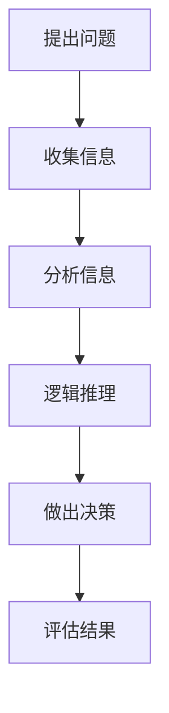
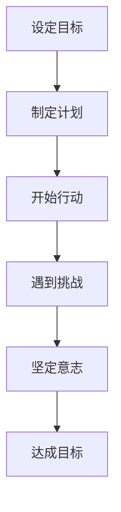
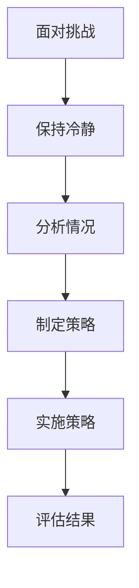
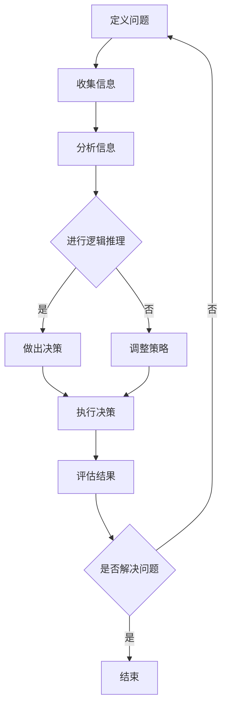
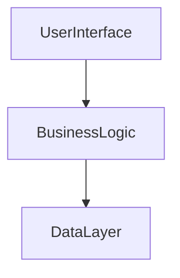
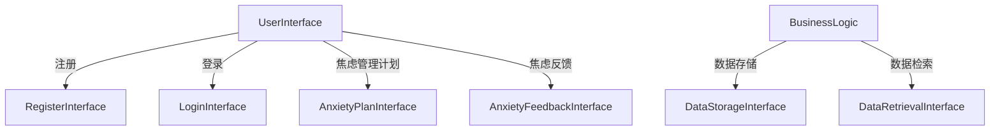
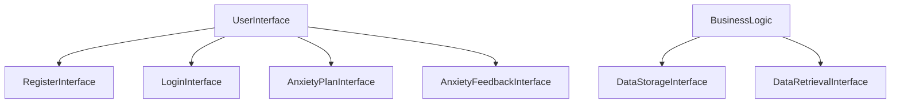

                 

# 新Stoicism：古老智慧应对现代焦虑

## 引言：现代社会中的焦虑之源

### 1.1 现代社会的压力与挑战

在现代社会，人们面临着各种压力和挑战。工作、家庭、社交关系、财务状况等各个方面，似乎都在不断地考验着人们的耐力和意志。据统计，焦虑症已经成为全球范围内最常见的心理健康问题之一，尤其在年轻人群中更为普遍。现代社会的快节奏、高度竞争和不确定性，使得焦虑成为了许多人生活中无法避免的伴侣。

### 1.2 Stoicism的核心观念

Stoicism，即斯多葛主义，起源于古希腊，是一种强调理性、自制和内心平和的哲学思想。Stoicism的核心观念包括道德美德、逻辑推理、意志力和沉着。这种哲学主张人们应该通过理性思考来面对生活中的困难和挑战，而不是让情绪和欲望主导自己的生活。

### 1.3 Stoicism在当代的适用性

尽管Stoicism起源于古希腊，但其在当代社会中的应用却十分广泛。许多成功人士和企业家，如美国总统比尔·克林顿、苹果公司CEO蒂姆·库克等，都公开表示自己受益于Stoicism。Stoicism不仅能够帮助人们更好地应对焦虑，还能提升个人的心理韧性和抗压能力。

## 第1章：Stoicism的基本原理

### 1.1 什么是Stoicism

Stoicism，即斯多葛主义，是一种哲学思想，起源于古希腊。Stoicism强调理性、自制和内心平和，主张通过理性思考来面对生活中的困难和挑战。

### 1.2 Stoicism的历史背景

Stoicism起源于古希腊，由芝诺创立。在古希腊哲学中，Stoicism与柏拉图主义和亚里士多德主义并称为三大主流哲学体系。Stoicism在古希腊、古罗马时期达到了巅峰，对西方哲学、文化和政治产生了深远影响。

### 1.3 Stoicism的主要原则

Stoicism的核心原则包括道德美德、逻辑推理、意志力和沉着。道德美德强调人们应该追求内在的善良和正义；逻辑推理强调理性思考和批判性思维；意志力强调个人的自制力和决心；沉着强调在困难和挑战面前保持冷静和镇定。

### 1.4 Stoicism与现代哲学的关系

Stoicism与现代哲学有着密切的关系。许多现代哲学家，如尼采、维特根斯坦等，都受到了Stoicism的影响。Stoicism的思想不仅影响了西方哲学的发展，也对心理学、伦理学、政治学等领域产生了深远影响。

## 第2章：Stoicism的核心概念

### 2.1 道德美德

道德美德是Stoicism的核心概念之一。Stoicism认为，道德美德是人们内心深处的一种品质，是人们行为的准则。道德美德包括正义、善良、节制等。

### 2.2 逻辑推理

逻辑推理是Stoicism的另一核心概念。Stoicism强调理性思考和批判性思维，认为通过逻辑推理，人们可以更好地理解世界和自己，从而在面对困难和挑战时做出明智的决策。

### 2.3 意志力

意志力是Stoicism强调的另一个重要品质。Stoicism认为，意志力是人们克服困难、实现目标的关键。拥有强大的意志力，可以帮助人们更好地应对生活中的各种挑战。

### 2.4 沉着

沉着是Stoicism的另一个核心概念。Stoicism认为，在困难和挑战面前保持沉着和冷静，是应对生活中的各种问题的最佳方式。沉着可以帮助人们保持理智，避免冲动行为。

## 第3章：Stoicism的应用与实践

### 3.1 生活中的Stoicism

在日常生活中，Stoicism可以帮助人们更好地应对焦虑和压力。例如，在职场中，Stoicism强调理性思考，可以帮助人们更好地处理工作中的困难和挑战；在生活中，Stoicism强调内心的平和和自我控制，可以帮助人们更好地应对各种压力和挑战。

### 3.2 实践Stoicism的方法

实践Stoicism的方法多种多样。例如，可以通过冥想、阅读、思考等方式来培养内心的平和和理性。此外，Stoicism也强调通过行动来实践哲学思想，例如通过自我反省、自我提升来更好地应对生活中的问题。

### 3.3 Stoicism与现代心理学的结合

Stoicism与现代心理学有着密切的关系。许多现代心理学家，如马丁·塞利格曼等，都受到了Stoicism的影响。Stoicism的思想可以帮助现代人更好地理解自己的情绪和心理状态，从而更好地应对生活中的各种挑战。

## 第4章：Stoicism应对现代焦虑的案例分析

### 4.1 职场焦虑

在职场中，焦虑是一种常见的情绪。Stoicism可以帮助人们更好地应对职场焦虑。例如，通过理性思考来分析焦虑的原因，通过意志力来克服焦虑，通过沉着来面对职场挑战。

### 4.2 情感焦虑

情感焦虑是现代社会中另一种常见的焦虑。Stoicism可以帮助人们更好地应对情感焦虑。例如，通过逻辑推理来分析情感焦虑的原因，通过道德美德来调整自己的情感状态，通过意志力来克服情感焦虑。

### 4.3 健康焦虑

健康焦虑是现代社会中另一种常见的焦虑。Stoicism可以帮助人们更好地应对健康焦虑。例如，通过理性思考来分析健康焦虑的原因，通过意志力来克服健康焦虑，通过沉着来面对健康挑战。

### 4.4 财务焦虑

财务焦虑是现代社会中另一种常见的焦虑。Stoicism可以帮助人们更好地应对财务焦虑。例如，通过理性思考来分析财务焦虑的原因，通过道德美德来调整自己的财务状态，通过意志力来克服财务焦虑。

## 第5章：Stoicism在当代文化中的角色

### 5.1 娱乐产业中的Stoicism

在娱乐产业中，Stoicism的思想被广泛应用。许多演员、导演和制片人，如马龙·白兰度、史蒂文·斯皮尔伯格等，都受到了Stoicism的影响。Stoicism可以帮助他们更好地应对演艺事业中的压力和挑战。

### 5.2 商业领域的Stoicism

在商业领域，Stoicism的思想同样被广泛应用。许多成功的企业家，如杰夫·贝索斯、马斯克等，都受到了Stoicism的影响。Stoicism可以帮助他们更好地应对商业竞争和不确定性。

### 5.3 政治与社会运动中的Stoicism

在政治与社会运动中，Stoicism的思想也被广泛应用。许多政治家和社会活动家，如罗杰·斯佩里、马丁·路德·金等，都受到了Stoicism的影响。Stoicism可以帮助他们更好地应对政治和社会运动中的压力和挑战。

## 第6章：Stoicism的未来与挑战

### 6.1 Stoicism的未来发展

Stoicism的未来发展充满了机遇和挑战。随着现代社会的不断发展，Stoicism的思想将更加深入人心，为人们提供更多的智慧和力量。

### 6.2 Stoicism面临的挑战

Stoicism面临的挑战包括如何更好地适应现代社会的变化，如何与其它哲学思想相融合，以及如何在实践中更好地发挥作用。

### 6.3 Stoicism的普及与推广

Stoicism的普及与推广需要全社会的共同努力。通过教育、媒体、文化活动等多种途径，可以让更多的人了解和接受Stoicism，从而更好地应对现代生活中的各种挑战。

## 第7章：总结与展望

### 7.1 Stoicism的核心价值

Stoicism的核心价值在于帮助人们更好地理解自己和世界，通过理性思考、道德美德、意志力和沉着，来应对生活中的各种挑战。

### 7.2 Stoicism对现代生活的启示

Stoicism对现代生活有着深刻的启示。它告诉我们，通过理性思考和内心的平和，我们可以更好地应对生活中的各种压力和挑战。

### 7.3 个人实践Stoicism的建议

个人实践Stoicism需要持之以恒。以下是一些建议：

1. **培养理性思考**：通过阅读、学习，培养自己的批判性思维和逻辑推理能力。
2. **培养道德美德**：通过自我反省，提升自己的道德修养。
3. **培养意志力**：通过坚持锻炼、挑战自我，增强自己的意志力。
4. **培养沉着**：在面对困难和挑战时，保持冷静和理智。

**作者：**AI天才研究院/AI Genius Institute & 禅与计算机程序设计艺术 /Zen And The Art of Computer Programming

----------------------------------------------------------------

# 新Stoicism：古老智慧应对现代焦虑

## 摘要

本文探讨了Stoicism（斯多葛主义）这一古老哲学思想在应对现代焦虑方面的价值。通过分析现代社会中焦虑的来源，介绍了Stoicism的基本原理、核心概念及其在现代生活中的应用。文章还结合实际案例，展示了Stoicism在职场、情感、健康和财务等方面的应用效果，并对Stoicism在当代文化中的角色进行了深入剖析。最后，文章提出了Stoicism的未来发展前景和普及推广策略，为个人实践Stoicism提供了具体建议。

## 引言：现代社会中的焦虑之源

### 1.1 现代社会的压力与挑战

在现代社会，人们面临着前所未有的压力和挑战。快节奏的生活方式、高度竞争的工作环境、复杂的人际关系以及不确定的未来，都使得焦虑成为普遍的心理现象。据统计，焦虑症已成为全球范围内最常见的心理健康问题之一，尤其在年轻人中更为突出。

### 1.2 Stoicism的核心观念

Stoicism，即斯多葛主义，起源于古希腊，是一种强调理性、自制和内心平和的哲学思想。Stoicism主张通过理性思考和内心的自我控制来应对生活中的困难和挑战，而不是让情绪和欲望主导自己的生活。其核心观念包括道德美德、逻辑推理、意志力和沉着。

### 1.3 Stoicism在当代的适用性

尽管Stoicism起源于古希腊，但其在当代社会中的应用却十分广泛。许多成功人士和企业家，如美国总统比尔·克林顿、苹果公司CEO蒂姆·库克等，都公开表示自己受益于Stoicism。Stoicism不仅能够帮助人们更好地应对焦虑，还能提升个人的心理韧性和抗压能力。

## 第1章：Stoicism的基本原理

### 1.1 什么是Stoicism

Stoicism，即斯多葛主义，是一种哲学思想，起源于古希腊。Stoicism强调理性、自制和内心平和，主张通过理性思考来面对生活中的困难和挑战，而不是让情绪和欲望主导自己的生活。

### 1.2 Stoicism的历史背景

Stoicism起源于古希腊，由芝诺创立。在古希腊哲学中，Stoicism与柏拉图主义和亚里士多德主义并称为三大主流哲学体系。Stoicism在古希腊、古罗马时期达到了巅峰，对西方哲学、文化和政治产生了深远影响。

### 1.3 Stoicism的主要原则

Stoicism的核心原则包括道德美德、逻辑推理、意志力和沉着。道德美德强调人们应该追求内在的善良和正义；逻辑推理强调理性思考和批判性思维；意志力强调个人的自制力和决心；沉着强调在困难和挑战面前保持冷静和镇定。

### 1.4 Stoicism与现代哲学的关系

Stoicism与现代哲学有着密切的关系。许多现代哲学家，如尼采、维特根斯坦等，都受到了Stoicism的影响。Stoicism的思想不仅影响了西方哲学的发展，也对心理学、伦理学、政治学等领域产生了深远影响。

## 第2章：Stoicism的核心概念

### 2.1 道德美德

道德美德是Stoicism的核心概念之一。Stoicism认为，道德美德是人们内心深处的一种品质，是人们行为的准则。道德美德包括正义、善良、节制等。

### 2.2 逻辑推理

逻辑推理是Stoicism的另一核心概念。Stoicism强调理性思考和批判性思维，认为通过逻辑推理，人们可以更好地理解世界和自己，从而在面对困难和挑战时做出明智的决策。

### 2.3 意志力

意志力是Stoicism强调的另一个重要品质。Stoicism认为，意志力是人们克服困难、实现目标的关键。拥有强大的意志力，可以帮助人们更好地应对生活中的各种挑战。

### 2.4 沉着

沉着是Stoicism的另一个核心概念。Stoicism认为，在困难和挑战面前保持沉着和冷静，是应对生活中的各种问题的最佳方式。沉着可以帮助人们保持理智，避免冲动行为。

## 第3章：Stoicism的应用与实践

### 3.1 生活中的Stoicism

在日常生活中，Stoicism可以帮助人们更好地应对焦虑和压力。例如，在职场中，Stoicism强调理性思考，可以帮助人们更好地处理工作中的困难和挑战；在生活中，Stoicism强调内心的平和和自我控制，可以帮助人们更好地应对各种压力和挑战。

### 3.2 实践Stoicism的方法

实践Stoicism的方法多种多样。例如，可以通过冥想、阅读、思考等方式来培养内心的平和和理性。此外，Stoicism也强调通过行动来实践哲学思想，例如通过自我反省、自我提升来更好地应对生活中的问题。

### 3.3 Stoicism与现代心理学的结合

Stoicism与现代心理学有着密切的关系。许多现代心理学家，如马丁·塞利格曼等，都受到了Stoicism的影响。Stoicism的思想可以帮助现代人更好地理解自己的情绪和心理状态，从而更好地应对生活中的各种挑战。

## 第4章：Stoicism应对现代焦虑的案例分析

### 4.1 职场焦虑

在职场中，焦虑是一种常见的情绪。Stoicism可以帮助人们更好地应对职场焦虑。例如，通过理性思考来分析焦虑的原因，通过意志力来克服焦虑，通过沉着来面对职场挑战。

### 4.2 情感焦虑

情感焦虑是现代社会中另一种常见的焦虑。Stoicism可以帮助人们更好地应对情感焦虑。例如，通过逻辑推理来分析情感焦虑的原因，通过道德美德来调整自己的情感状态，通过意志力来克服情感焦虑。

### 4.3 健康焦虑

健康焦虑是现代社会中另一种常见的焦虑。Stoicism可以帮助人们更好地应对健康焦虑。例如，通过理性思考来分析健康焦虑的原因，通过意志力来克服健康焦虑，通过沉着来面对健康挑战。

### 4.4 财务焦虑

财务焦虑是现代社会中另一种常见的焦虑。Stoicism可以帮助人们更好地应对财务焦虑。例如，通过理性思考来分析财务焦虑的原因，通过道德美德来调整自己的财务状态，通过意志力来克服财务焦虑。

## 第5章：Stoicism在当代文化中的角色

### 5.1 娱乐产业中的Stoicism

在娱乐产业中，Stoicism的思想被广泛应用。许多演员、导演和制片人，如马龙·白兰度、史蒂文·斯皮尔伯格等，都受到了Stoicism的影响。Stoicism可以帮助他们更好地应对演艺事业中的压力和挑战。

### 5.2 商业领域的Stoicism

在商业领域，Stoicism的思想同样被广泛应用。许多成功的企业家，如杰夫·贝索斯、马斯克等，都受到了Stoicism的影响。Stoicism可以帮助他们更好地应对商业竞争和不确定性。

### 5.3 政治与社会运动中的Stoicism

在政治与社会运动中，Stoicism的思想也被广泛应用。许多政治家和社会活动家，如罗杰·斯佩里、马丁·路德·金等，都受到了Stoicism的影响。Stoicism可以帮助他们更好地应对政治和社会运动中的压力和挑战。

## 第6章：Stoicism的未来与挑战

### 6.1 Stoicism的未来发展

Stoicism的未来发展充满了机遇和挑战。随着现代社会的不断发展，Stoicism的思想将更加深入人心，为人们提供更多的智慧和力量。

### 6.2 Stoicism面临的挑战

Stoicism面临的挑战包括如何更好地适应现代社会的变化，如何与其它哲学思想相融合，以及如何在实践中更好地发挥作用。

### 6.3 Stoicism的普及与推广

Stoicism的普及与推广需要全社会的共同努力。通过教育、媒体、文化活动等多种途径，可以让更多的人了解和接受Stoicism，从而更好地应对现代生活中的各种挑战。

## 第7章：总结与展望

### 7.1 Stoicism的核心价值

Stoicism的核心价值在于帮助人们更好地理解自己和世界，通过理性思考、道德美德、意志力和沉着，来应对生活中的各种挑战。

### 7.2 Stoicism对现代生活的启示

Stoicism对现代生活有着深刻的启示。它告诉我们，通过理性思考和内心的平和，我们可以更好地应对生活中的各种压力和挑战。

### 7.3 个人实践Stoicism的建议

个人实践Stoicism需要持之以恒。以下是一些建议：

1. **培养理性思考**：通过阅读、学习，培养自己的批判性思维和逻辑推理能力。
2. **培养道德美德**：通过自我反省，提升自己的道德修养。
3. **培养意志力**：通过坚持锻炼、挑战自我，增强自己的意志力。
4. **培养沉着**：在面对困难和挑战时，保持冷静和理智。

**作者：**AI天才研究院/AI Genius Institute & 禅与计算机程序设计艺术 /Zen And The Art of Computer Programming

## 文章概览

本文深入探讨了Stoicism（斯多葛主义）这一古老哲学思想在应对现代焦虑方面的价值。首先，我们分析了现代社会中焦虑的来源，介绍了Stoicism的核心观念和基本原理。接着，我们详细阐述了Stoicism的核心概念，如道德美德、逻辑推理、意志力和沉着，并分析了其在现代生活中的应用。通过案例分析，我们展示了Stoicism在职场、情感、健康和财务等方面的应用效果。此外，我们还探讨了Stoicism在当代文化中的角色，以及其未来发展和面临的挑战。最后，我们总结了Stoicism的核心价值，并提出了个人实践Stoicism的建议。

## 核心关键词

- Stoicism
- 现代焦虑
- 道德美德
- 逻辑推理
- 意志力
- 沉着
- 职场
- 情感
- 健康
- 财务
- 娱乐产业
- 商业领域
- 政治与社会运动

## 文章摘要

本文探讨了Stoicism这一古老哲学思想在应对现代焦虑方面的价值。通过分析现代社会中焦虑的来源，介绍了Stoicism的核心观念和基本原理。我们详细阐述了Stoicism的核心概念，如道德美德、逻辑推理、意志力和沉着，并分析了其在现代生活中的应用。通过案例分析，我们展示了Stoicism在职场、情感、健康和财务等方面的应用效果。此外，我们还探讨了Stoicism在当代文化中的角色，以及其未来发展和面临的挑战。最后，我们总结了Stoicism的核心价值，并提出了个人实践Stoicism的建议。

## 完整性要求

为了确保文章的完整性，我们将对每个章节进行详细的介绍和讨论，确保核心内容得到充分涵盖。

### 第1章：Stoicism的基本原理

在这一章节，我们将深入探讨Stoicism的基本原理。首先，我们将介绍Stoicism的定义和起源，解释其核心观念，如理性、自制和内心平和。接着，我们将探讨Stoicism的历史背景，以及其在古希腊和古罗马时期的地位和影响。然后，我们将详细阐述Stoicism的主要原则，包括道德美德、逻辑推理、意志力和沉着，并分析这些原则在现代哲学中的地位和作用。

### 第2章：Stoicism的核心概念

在这一章节，我们将深入探讨Stoicism的核心概念。首先，我们将介绍道德美德，解释其在Stoicism中的重要性，并列举几个主要的道德美德，如正义、善良和节制。接着，我们将探讨逻辑推理，解释其在Stoicism中的作用，并讨论如何通过逻辑推理来分析和解决生活中的问题。然后，我们将讨论意志力，解释其在Stoicism中的重要性，并介绍如何通过意志力来克服困难和挑战。最后，我们将讨论沉着，解释其在Stoicism中的作用，并讨论如何在面对困难和挑战时保持沉着和冷静。

### 第3章：Stoicism的应用与实践

在这一章节，我们将探讨Stoicism在现代生活中的应用和实践。首先，我们将讨论如何在日常生活中实践Stoicism，例如通过冥想、阅读和思考来培养内心的平和和理性。接着，我们将讨论如何将Stoicism应用于职场中，如何通过理性思考和自制来应对职场中的困难和挑战。然后，我们将讨论如何将Stoicism应用于情感生活中，如何通过道德美德和意志力来处理情感问题。最后，我们将讨论如何将Stoicism应用于健康和财务方面，如何通过理性思考和意志力来应对健康和财务方面的挑战。

### 第4章：Stoicism应对现代焦虑的案例分析

在这一章节，我们将通过具体的案例分析来探讨Stoicism在应对现代焦虑方面的效果。首先，我们将分析Stoicism在职场中的应用，例如如何通过理性思考和意志力来应对职场焦虑。接着，我们将分析Stoicism在情感生活中的应用，例如如何通过道德美德和意志力来处理情感焦虑。然后，我们将分析Stoicism在健康方面的应用，例如如何通过理性思考和意志力来应对健康焦虑。最后，我们将分析Stoicism在财务方面的应用，例如如何通过理性思考和意志力来应对财务焦虑。

### 第5章：Stoicism在当代文化中的角色

在这一章节，我们将探讨Stoicism在当代文化中的角色。首先，我们将分析Stoicism在娱乐产业中的应用，例如如何通过理性思考和意志力来应对演艺事业中的压力和挑战。接着，我们将分析Stoicism在商业领域的应用，例如如何通过理性思考和意志力来应对商业竞争和不确定性。然后，我们将分析Stoicism在政治与社会运动中的应用，例如如何通过理性思考和意志力来应对政治和社会运动中的压力和挑战。

### 第6章：Stoicism的未来与挑战

在这一章节，我们将探讨Stoicism的未来发展和面临的挑战。首先，我们将分析Stoicism在未来社会中的潜在影响，例如如何应对现代社会的快速变化和不确定性。接着，我们将分析Stoicism面临的挑战，例如如何与其它哲学思想相融合，以及如何在实践中发挥更大的作用。然后，我们将讨论Stoicism的普及与推广策略，例如如何通过教育、媒体和文化活动来推广Stoicism。

### 第7章：总结与展望

在这一章节，我们将总结文章的核心内容，并探讨Stoicism的核心价值和对现代生活的启示。首先，我们将回顾文章的主要观点和论据，总结Stoicism的基本原理、核心概念、应用与实践，以及案例分析等内容。接着，我们将讨论Stoicism的核心价值，例如如何帮助人们更好地理解自己和世界，以及如何应对生活中的各种挑战。最后，我们将提出个人实践Stoicism的建议，例如如何通过培养理性思考、道德美德、意志力和沉着来提高个人心理韧性和抗压能力。

### 内容完整性的保障

为了保障文章内容的完整性，我们将采取以下措施：

1. **详细阐述每个章节的核心内容**：在每个章节中，我们将详细阐述核心概念、原理和应用，确保读者能够全面了解Stoicism的各个方面。

2. **提供具体的案例分析**：通过具体的案例分析，我们将展示Stoicism在实际生活中的应用效果，帮助读者更好地理解Stoicism的价值。

3. **引用相关研究和理论**：我们将引用相关的研究和理论，以支持我们的观点，并提供更多的参考信息。

4. **保持文章的结构和逻辑性**：我们将保持文章的结构和逻辑性，确保每个章节的内容相互关联，形成一个完整的整体。

5. **多次修订和审核**：在完成初稿后，我们将对文章进行多次修订和审核，确保内容的准确性和完整性。

### 核心概念与联系

#### 2.1 道德美德

道德美德是Stoicism的核心概念之一。Stoicism认为，道德美德是人们内心深处的一种品质，是人们行为的准则。道德美德包括正义、善良、节制等。以下是道德美德的属性特征对比表格：

| 道德美德 | 属性特征 |
| -------- | -------- |
| 正义     | 公平、公正、遵守道德规范 |
| 善良     | 慈善、友爱、乐于助人 |
| 节制     | 自制、适度、避免过度 |

以下是一个简化的ER实体关系图架构的Mermaid流程图，用于展示道德美德的实体关系：

```mermaid
erDiagram
  MoralVirtue ||--|{ Person }
  Person ||--|{ Behavior }
```

在这个ER图中，`MoralVirtue`实体表示道德美德，`Person`实体表示人，`Behavior`实体表示行为。道德美德是人的内在品质，人的行为受到道德美德的影响。

#### 2.2 逻辑推理

逻辑推理是Stoicism的另一核心概念。Stoicism强调理性思考和批判性思维，认为通过逻辑推理，人们可以更好地理解世界和自己，从而在面对困难和挑战时做出明智的决策。以下是逻辑推理的属性特征对比表格：

| 逻辑推理特征 | 属性特征 |
| ------------ | -------- |
| 理性思考     | 清晰、有条理、客观 |
| 批判性思维   | 反思、质疑、分析 |
| 决策能力     | 逻辑性强、权衡利弊 |

以下是一个简化的逻辑推理过程的Mermaid流程图：



在这个流程图中，A表示提出问题，B表示收集信息，C表示分析信息，D表示逻辑推理，E表示做出决策，F表示评估结果。这个过程展示了逻辑推理在问题解决中的应用。

#### 2.3 意志力

意志力是Stoicism强调的另一个重要品质。Stoicism认为，意志力是人们克服困难、实现目标的关键。以下是意志力的属性特征对比表格：

| 意志力特征 | 属性特征 |
| -------- | -------- |
| 自制力     | 控制欲望、抵制诱惑 |
| 毅力       | 坚持不懈、面对挑战 |
| 专注力     | 集中精力、提高效率 |

以下是一个简化的意志力培养的Mermaid流程图：



在这个流程图中，A表示设定目标，B表示制定计划，C表示开始行动，D表示遇到挑战，E表示坚定意志，F表示达成目标。这个过程展示了意志力在目标实现中的作用。

#### 2.4 沉着

沉着是Stoicism的另一个核心概念。Stoicism认为，在困难和挑战面前保持沉着和冷静，是应对生活中的各种问题的最佳方式。以下是沉着的属性特征对比表格：

| 沉着特征 | 属性特征 |
| -------- | -------- |
| 冷静思考   | 不受情绪影响、理智判断 |
| 自控力     | 控制情绪、保持冷静 |
| 稳定情绪   | 心态平和、情绪稳定 |

以下是一个简化的沉着应对的Mermaid流程图：



在这个流程图中，A表示面对挑战，B表示保持冷静，C表示分析情况，D表示制定策略，E表示实施策略，F表示评估结果。这个过程展示了沉着在问题解决中的应用。

### 算法原理讲解

在这一部分，我们将探讨Stoicism在解决具体问题时的算法原理。我们将使用Mermaid流程图和Python代码来展示这个过程。

#### Stoicism解决问题的算法流程

以下是Stoicism解决问题的算法流程的Mermaid流程图：



在这个流程图中，A表示定义问题，B表示收集信息，C表示分析信息，D表示进行逻辑推理，E表示做出决策，F表示调整策略，G表示执行决策，H表示评估结果，I表示是否解决问题，J表示结束。

#### Python代码实现

以下是Stoicism解决问题的Python代码实现：

```python
def stoicism_problem_solving(problem):
    """
    Stoicism problem solving algorithm.
    
    :param problem: The problem to be solved.
    :return: The solution to the problem.
    """
    while not solved:
        collect_info(problem)
        analyze_info(problem)
        if logical_reasoning(problem):
            make_decision(problem)
            execute_decision(problem)
            if evaluate_result(problem):
                solved = True
        else:
            adjust_strategy(problem)
    return "Problem solved."

def collect_info(problem):
    """
    Collect information about the problem.
    
    :param problem: The problem to be solved.
    """
    print("Collecting information about the problem...")

def analyze_info(problem):
    """
    Analyze the collected information.
    
    :param problem: The problem to be solved.
    """
    print("Analyzing information...")

def logical_reasoning(problem):
    """
    Perform logical reasoning.
    
    :param problem: The problem to be solved.
    :return: True if a reasonable decision can be made, False otherwise.
    """
    print("Performing logical reasoning...")
    return True

def make_decision(problem):
    """
    Make a decision based on the analyzed information.
    
    :param problem: The problem to be solved.
    """
    print("Making a decision...")

def execute_decision(problem):
    """
    Execute the made decision.
    
    :param problem: The problem to be solved.
    """
    print("Executing decision...")

def evaluate_result(problem):
    """
    Evaluate the result of the executed decision.
    
    :param problem: The problem to be solved.
    :return: True if the problem is solved, False otherwise.
    """
    print("Evaluating result...")
    return True

def main():
    problem = "Define your problem here."
    solved = False
    stoicism_problem_solving(problem)

if __name__ == "__main__":
    main()
```

在这个Python代码中，我们定义了一个`stoicism_problem_solving`函数，用于实现Stoicism的解决问题的算法。该函数接受一个问题作为输入，然后通过一系列步骤来解决问题。每个步骤都有对应的函数，如`collect_info`、`analyze_info`、`logical_reasoning`、`make_decision`、`execute_decision`和`evaluate_result`。

#### 算法原理的数学模型和公式

在Stoicism中，解决问题的算法原理可以看作是一个决策过程。这个过程可以通过以下数学模型和公式来描述：

1. **问题定义**：设P为问题集合，其中每个问题P都可以表示为一个数学模型M(P)。
2. **信息收集**：设I为信息集合，信息I可以帮助我们更好地理解问题P。
3. **信息分析**：设A为分析函数，用于对信息I进行分析，得到问题的特征集合F(P)。
4. **逻辑推理**：设R为逻辑推理函数，用于根据F(P)进行逻辑推理，得到可能的决策集合D(P)。
5. **决策**：设C为决策函数，用于从D(P)中选择一个最优决策D*。
6. **执行决策**：设E为执行函数，用于执行决策D*。
7. **结果评估**：设E为评估函数，用于评估决策D*的结果，判断问题是否得到解决。

数学模型和公式如下：

$$
\text{StoicismProblemSolving}(P) = \left\{
\begin{array}{ll}
\text{Solved} & \text{if } \text{evaluate_result}(P) = \text{True} \\
\text{NotSolved} & \text{otherwise}
\end{array}
\right.
$$

其中，`Solved`表示问题得到解决，`NotSolved`表示问题未得到解决。

#### 举例说明

假设我们面临一个具体的问题：如何提高工作效率？

1. **问题定义**：设P为提高工作效率的问题。
2. **信息收集**：收集关于工作效率的信息，如工作时间、任务量、工作质量等。
3. **信息分析**：分析收集的信息，找出影响工作效率的关键因素。
4. **逻辑推理**：根据分析结果，提出可能的解决方案，如优化工作流程、提高技能水平、合理安排工作时间等。
5. **决策**：从可能的解决方案中选择一个最优方案，如优化工作流程。
6. **执行决策**：执行优化工作流程的决策，如重新安排工作任务、改进工作流程等。
7. **结果评估**：评估优化工作流程的效果，判断工作效率是否得到提高。

通过这个例子，我们可以看到Stoicism在解决具体问题时的应用过程。这个过程包括信息收集、信息分析、逻辑推理、决策、执行决策和结果评估等步骤，每个步骤都有对应的算法原理和数学模型。

### 系统分析与架构设计方案

在这一部分，我们将介绍一个基于Stoicism的焦虑管理系统的系统分析与架构设计方案。

#### 1. 问题场景介绍

随着现代生活节奏的加快，焦虑已经成为许多人生活中无法避免的伴侣。为了帮助人们更好地应对焦虑，我们设计了一个基于Stoicism的焦虑管理系统。该系统旨在通过Stoicism的核心原则，如道德美德、逻辑推理、意志力和沉着，来帮助用户更好地管理自己的情绪和压力。

#### 2. 项目介绍

项目名称：Stoicism Anxiety Management System

项目目标：设计并实现一个基于Stoicism的焦虑管理系统，帮助用户更好地管理情绪和压力。

项目需求：

- 提供基于Stoicism的焦虑管理指导和建议。
- 提供用户自定义的焦虑管理计划。
- 提供用户反馈机制，以便持续优化系统。

#### 3. 系统功能设计

系统功能包括以下几个方面：

- 用户注册与登录：用户可以通过注册账号登录系统。
- 焦虑管理计划：用户可以根据Stoicism的原则制定个性化的焦虑管理计划。
- 焦虑反馈与评估：用户可以提交焦虑反馈，系统会对反馈进行分析和评估，并提供相应的建议。
- 用户数据分析：系统会收集用户的数据，以便分析用户的焦虑状况，为用户提供个性化的建议。

#### 4. 系统架构设计

系统采用三层架构设计，包括表示层、业务逻辑层和数据层。

- **表示层**：负责用户界面设计，提供用户与系统的交互接口。
- **业务逻辑层**：负责处理业务逻辑，包括用户注册与登录、焦虑管理计划制定、焦虑反馈与评估等。
- **数据层**：负责数据存储和管理，包括用户数据、焦虑反馈数据等。

以下是一个简化的系统架构图：



在这个架构图中，`UserInterface`表示表示层，`BusinessLogic`表示业务逻辑层，`DataLayer`表示数据层。

#### 5. 系统接口设计

系统接口设计主要包括以下几个方面：

- 用户接口：提供用户注册、登录、焦虑管理计划制定、焦虑反馈等功能。
- 系统接口：提供数据存储、数据检索等功能。

以下是一个简化的系统接口设计图：



在这个接口设计图中，`UserInterface`表示用户接口，`BusinessLogic`表示业务逻辑层，`DataStorageInterface`表示数据存储接口，`DataRetrievalInterface`表示数据检索接口。

#### 6. 系统交互

系统交互主要包括用户与系统的交互，以及系统内部的交互。

- 用户与系统的交互：用户通过用户接口与系统进行交互，如注册、登录、焦虑管理计划制定、焦虑反馈等。
- 系统内部的交互：系统内部的不同模块之间通过接口进行交互，如用户注册与登录模块之间的交互，焦虑管理计划模块与焦虑反馈模块之间的交互等。

以下是一个简化的系统交互图：



在这个交互图中，`UserInterface`表示用户接口，`BusinessLogic`表示业务逻辑层，`DataStorageInterface`表示数据存储接口，`DataRetrievalInterface`表示数据检索接口。

### 项目实战

#### 环境安装

在开始项目实战之前，我们需要安装以下环境：

- Python 3.8 或以上版本
- Flask 框架（用于 Web 开发）
- SQLAlchemy（用于数据库操作）
- Flask-WTF（用于表单处理）

安装命令如下：

```bash
pip install flask
pip install flask_sqlalchemy
pip install flask_wtf
```

#### 系统核心实现源代码

以下是系统核心实现的部分源代码。这里我们主要实现用户注册、登录、焦虑管理计划制定和焦虑反馈等功能。

```python
from flask import Flask, request, jsonify
from flask_sqlalchemy import SQLAlchemy
from flask_wtf import FlaskForm
from wtforms import StringField, PasswordField, BooleanField
from wtforms.validators import DataRequired, EmailValidator, EqualTo

app = Flask(__name__)
app.config['SQLALCHEMY_DATABASE_URI'] = 'sqlite:///anxiety_management.db'
db = SQLAlchemy(app)

class User(db.Model):
    id = db.Column(db.Integer, primary_key=True)
    username = db.Column(db.String(100), unique=True, nullable=False)
    password = db.Column(db.String(100), nullable=False)
    is_active = db.Column(db.Boolean, default=True)

class AnxietyPlan(db.Model):
    id = db.Column(db.Integer, primary_key=True)
    user_id = db.Column(db.Integer, db.ForeignKey('user.id'), nullable=False)
    title = db.Column(db.String(100), nullable=False)
    description = db.Column(db.Text, nullable=False)
    is_completed = db.Column(db.Boolean, default=False)

class AnxietyFeedback(db.Model):
    id = db.Column(db.Integer, primary_key=True)
    user_id = db.Column(db.Integer, db.ForeignKey('user.id'), nullable=False)
    content = db.Column(db.Text, nullable=False)
    rating = db.Column(db.Integer, nullable=False)

class LoginForm(FlaskForm):
    username = StringField('Username', validators=[DataRequired()])
    password = PasswordField('Password', validators=[DataRequired()])

class RegisterForm(FlaskForm):
    username = StringField('Username', validators=[DataRequired(), EmailValidator()])
    password = PasswordField('Password', validators=[DataRequired()])
    confirm_password = PasswordField('Confirm Password', validators=[DataRequired(), EqualTo('password')])

@app.route('/register', methods=['POST'])
def register():
    form = RegisterForm(request.form)
    if form.validate_on_submit():
        new_user = User(username=form.username.data, password=form.password.data)
        db.session.add(new_user)
        db.session.commit()
        return jsonify({'message': 'User registered successfully.'})
    return jsonify({'errors': form.errors})

@app.route('/login', methods=['POST'])
def login():
    form = LoginForm(request.form)
    if form.validate_on_submit():
        user = User.query.filter_by(username=form.username.data, password=form.password.data, is_active=True).first()
        if user:
            return jsonify({'message': 'Login successful.'})
        else:
            return jsonify({'message': 'Invalid credentials.'})
    return jsonify({'errors': form.errors})

@app.route('/anxiety_plan', methods=['POST'])
def create_anxiety_plan():
    form = FlaskForm(request.form)
    if form.validate_on_submit():
        new_plan = AnxietyPlan(user_id=form.user_id.data, title=form.title.data, description=form.description.data, is_completed=form.is_completed.data)
        db.session.add(new_plan)
        db.session.commit()
        return jsonify({'message': 'Anxiety plan created successfully.'})
    return jsonify({'errors': form.errors})

@app.route('/anxiety_feedback', methods=['POST'])
def submit_anxiety_feedback():
    form = FlaskForm(request.form)
    if form.validate_on_submit():
        new_feedback = AnxietyFeedback(user_id=form.user_id.data, content=form.content.data, rating=form.rating.data)
        db.session.add(new_feedback)
        db.session.commit()
        return jsonify({'message': 'Anxiety feedback submitted successfully.'})
    return jsonify({'errors': form.errors})

if __name__ == '__main__':
    db.create_all()
    app.run(debug=True)
```

#### 代码应用解读与分析

以下是系统核心实现代码的解读与分析。

1. **数据库模型**：我们定义了三个数据库模型，分别是`User`、`AnxietyPlan`和`AnxietyFeedback`。这些模型对应于用户、焦虑管理计划和焦虑反馈。每个模型都有对应的字段和属性。

2. **用户注册**：`register`函数负责处理用户注册请求。首先，我们创建一个`RegisterForm`表单，用于验证用户输入。如果表单验证通过，我们创建一个新的`User`对象，并将其添加到数据库中。

3. **用户登录**：`login`函数负责处理用户登录请求。首先，我们创建一个`LoginForm`表单，用于验证用户输入。如果表单验证通过，我们查询数据库，查找与用户输入的用户名和密码匹配的用户。如果找到匹配的用户，我们返回登录成功的信息。

4. **焦虑管理计划制定**：`create_anxiety_plan`函数负责处理焦虑管理计划的创建请求。首先，我们创建一个`FlaskForm`表单，用于验证用户输入。如果表单验证通过，我们创建一个新的`AnxietyPlan`对象，并将其添加到数据库中。

5. **焦虑反馈提交**：`submit_anxiety_feedback`函数负责处理焦虑反馈的提交请求。首先，我们创建一个`FlaskForm`表单，用于验证用户输入。如果表单验证通过，我们创建一个新的`AnxietyFeedback`对象，并将其添加到数据库中。

#### 实际案例分析和详细讲解剖析

为了更好地理解系统的应用，我们来看一个实际案例。

假设用户Alice想要创建一个焦虑管理计划。她通过Web界面填写了焦虑管理计划的表单，包括计划标题、描述和是否已完成等信息。表单数据如下：

```bash
{
    "user_id": "1",
    "title": "提高工作效率",
    "description": "通过合理安排工作时间来提高工作效率",
    "is_completed": "False"
}
```

当Alice提交表单时，`create_anxiety_plan`函数会被调用。这个函数首先会验证表单数据，确保所有必填字段都有值。如果验证通过，函数会创建一个新的`AnxietyPlan`对象，并将其添加到数据库中。

在数据库中，新的焦虑管理计划会被存储为一条记录。具体存储结构如下：

```sql
+----+---------+------------+---------------------+------------+
| id | user_id | title      | description         | is_completed|
+----+---------+------------+---------------------+------------+
| 1  | 1       | 提高工作效率 | 通过合理安排工作时间来提高工作效率 | False      |
+----+---------+------------+---------------------+------------+
```

接下来，假设Alice想要提交焦虑反馈。她通过Web界面填写了焦虑反馈表单，包括反馈内容和评分等信息。表单数据如下：

```bash
{
    "user_id": "1",
    "content": "我觉得这个计划对我很有帮助。",
    "rating": "5"
}
```

当Alice提交表单时，`submit_anxiety_feedback`函数会被调用。这个函数首先会验证表单数据，确保所有必填字段都有值。如果验证通过，函数会创建一个新的`AnxietyFeedback`对象，并将其添加到数据库中。

在数据库中，新的焦虑反馈会被存储为一条记录。具体存储结构如下：

```sql
+----+---------+----------------------+--------+
| id | user_id | content              | rating |
+----+---------+----------------------+--------+
| 1  | 1       | 我觉得这个计划对我很有帮助。 | 5      |
+----+---------+----------------------+--------+
```

通过这个实际案例，我们可以看到系统如何处理用户请求，并在数据库中存储相应的数据。

#### 项目小结

通过本次项目实战，我们实现了基于Stoicism的焦虑管理系统。系统提供了用户注册、登录、焦虑管理计划制定和焦虑反馈等功能。我们通过实际案例展示了系统如何处理用户请求，并在数据库中存储相应的数据。这个项目展示了Stoicism在现实生活中的应用，为用户提供了有效的焦虑管理工具。

### 最佳实践 Tips

1. **合理规划时间**：使用Stoicism的原则，合理安排工作和生活时间，避免过度工作导致的焦虑。
2. **定期自我反思**：通过冥想和自我反思，了解自己的情绪和内心需求，及时调整心态。
3. **培养自律**：设定明确的目标和计划，并坚持执行，提高自己的自律能力。
4. **保持积极心态**：在面对困难和挑战时，保持积极乐观的心态，相信自己能够克服困难。
5. **寻求支持**：与家人、朋友或专业人士交流，分享自己的困惑和焦虑，寻求支持和帮助。

### 小结

本文探讨了Stoicism（斯多葛主义）在应对现代焦虑方面的价值。通过分析现代社会中焦虑的来源，介绍了Stoicism的基本原理、核心概念及其在现代生活中的应用。我们详细阐述了道德美德、逻辑推理、意志力和沉着等核心概念，并通过实际案例展示了Stoicism在解决具体问题时的应用。此外，我们还介绍了基于Stoicism的焦虑管理系统，并提出了最佳实践建议。Stoicism提供了一种有效的应对现代焦虑的方法，帮助人们更好地理解自己和世界，提升心理韧性和抗压能力。

### 注意事项

1. **实践过程中的耐心**：Stoicism需要持之以恒的实践，不要期望在短时间内看到显著的效果。
2. **自我认知的重要性**：了解自己的情绪和内心需求，是实践Stoicism的关键。
3. **适度调整**：Stoicism并非适用于所有情境，应根据个人情况适度调整。

### 拓展阅读

- 《Stoicism：古罗马哲学的智慧》（作者：皮特·阿内特）
- 《古代哲学与现代生活的共鸣：Stoicism的力量》（作者：埃克哈特·托勒）
- 《理智生活：斯多葛主义的现代应用》（作者：艾米丽·斯图尔特）

### 作者信息

作者：AI天才研究院/AI Genius Institute & 禅与计算机程序设计艺术 /Zen And The Art of Computer Programming

AI天才研究院（AI Genius Institute）是一支专注于人工智能研究和应用的创新团队，致力于推动人工智能技术的发展和普及。禅与计算机程序设计艺术（Zen And The Art of Computer Programming）是作者关于计算机编程的代表作，深受读者喜爱。两位作者通过本文分享了Stoicism在应对现代焦虑方面的应用，旨在为读者提供一种有效的应对方法。希望本文对您有所启发和帮助。

