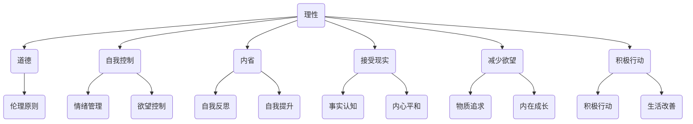
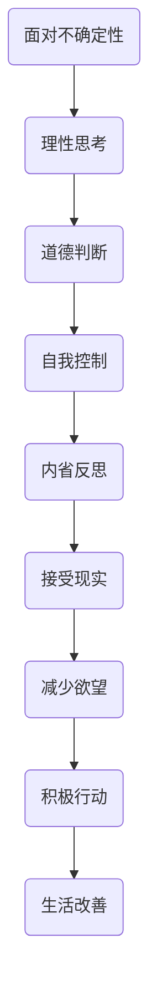

                 

### 《新 stoicism：面对不确定性的生活哲学》——引言

关键词：新 stoicism、不确定性、生活哲学、理性思考、计算机编程

摘要：本文将深入探讨《新 stoicism：面对不确定性的生活哲学》的核心概念，通过一步步的逻辑分析和理性思考，为读者提供一种应对生活中不确定性的方法论。本文分为七个部分：首先，我们介绍 stoicism 的背景和重要性；接着，分析不确定性的本质及其对生活的影响；然后，探讨 stoicism 的基本原理，以及如何将其应用到个人生活和工作中；随后，我们通过具体的实例来展示 stoicism 的实践方法；最后，总结文章，提出最佳实践和注意事项。

在计算机编程和人工智能领域，面对复杂的问题和不确定性，我们往往需要一种理性的思考和应对策略。《新 stoicism：面对不确定性的生活哲学》为我们提供了一种全新的视角，帮助我们更好地理解不确定性，从而做出明智的决策。

---

#### 第一部分：背景介绍

## 1.1 stoicism 的历史背景

Stoicism 是一种古老的哲学流派，起源于古希腊，由苏格拉底的学生芝诺（Zeno）创立。它的核心理念是强调人的理性控制情感和行为，以达到内心的平和与自由。在罗马帝国时期， stoicism 成为了一种广泛接受的哲学体系，影响了众多的哲学家和政治家，如塞内卡（Seneca）、爱比克鲁底（Epictetus）和马可·奥勒留（Marcus Aurelius）。

## 1.2 不确定性的本质

在现代社会，我们面临着前所未有的不确定性。科技的迅猛发展、经济的不稳定性、社会变革的加剧，以及全球化的影响，使得我们的生活充满了变数。不确定性不仅仅存在于外部环境，也体现在我们的内心世界，如焦虑、恐惧和迷茫等。

## 1.3 问题解决

面对不确定性，传统的理性思考方法往往失效。因此，我们需要一种新的生活哲学来帮助我们应对挑战。新 stoicism 应运而生，它结合了 stoicism 的古老智慧和现代心理学的研究成果，为我们提供了一套有效的应对策略。

## 1.4 边界与外延

新 stoicism 不仅关注个人的内心世界，也关注社会和环境的变革。它强调理性、道德和自我控制，倡导通过内在的平和来应对外在的纷扰。在本文中，我们将详细探讨新 stoicism 的核心概念和实际应用，帮助读者更好地理解和应对生活中的不确定性。

---

### 第二部分：核心概念与联系

## 2.1 核心概念

新 stoicism 的核心概念包括：理性、道德、自我控制、内省、接受现实、减少欲望和积极行动。这些概念相互关联，共同构成了 stoicism 的理论基础。

## 2.2 概念属性特征对比

| 概念         | 特征                                           |
|--------------|----------------------------------------------|
| 理性         | 基于逻辑和事实进行思考                         |
| 道德         | 基于伦理原则做出决策                         |
| 自我控制     | 管理情绪和欲望，以达到内心的平和               |
| 内省         | 反思自己的行为和想法，以实现自我提升           |
| 接受现实     | 认识到事物的本质，并接受无法改变的事实         |
| 减少欲望     | 降低对物质和外在成功的追求，专注于内在成长     |
| 积极行动     | 在接受现实的基础上，采取积极的行动来改善生活   |

## 2.3 ER 实体关系图

为了更直观地理解新 stoicism 的核心概念，我们可以使用 ER（Entity-Relationship）实体关系图来表示这些概念之间的联系。



通过 ER 实体关系图，我们可以看到新 stoicism 的核心概念是如何相互联系，共同构建一个完整的哲学体系。

---

#### 第三部分：算法原理讲解

## 3.1 算法 mermaid 流程图

为了更好地理解新 stoicism 的应用，我们可以将其转化为一个算法流程图。以下是一个简化的 mermaid 流程图，展示了如何将 stoicism 的原则应用到日常生活中。



## 3.2 Python 源代码详细阐述

以下是一个简单的 Python 脚本，它实现了上述算法流程。通过这个脚本，我们可以看到如何将 stoicism 的原则编码为实际的计算机程序。

```python
# Stoicism Algorithm Implementation

def rational_think():
    print("理性思考：基于逻辑和事实进行决策")

def moral_judge():
    print("道德判断：基于伦理原则做出决策")

def self_control():
    print("自我控制：管理情绪和欲望，达到内心平和")

def introspection():
    print("内省反思：反思自己的行为和想法，实现自我提升")

def accept_reality():
    print("接受现实：认识到事物的本质，并接受无法改变的事实")

def reduce Desire():
    print("减少欲望：降低对物质和外在成功的追求，专注于内在成长")

def positive_action():
    print("积极行动：在接受现实的基础上，采取积极的行动来改善生活")

def stoicism_algorithm():
    rational_think()
    moral_judge()
    self_control()
    introspection()
    accept_reality()
    reduce_Despire()
    positive_action()
    print("生活改善：通过 stoicism 原则，实现生活的持续改善")

# 执行 stoicism 算法
stoicism_algorithm()
```

通过这个脚本，我们可以看到 stoicism 的原则是如何被编码为具体的函数，从而在计算机程序中实现。

## 3.3 算法原理的数学模型与公式

为了更深入地理解 stoicism 算法的原理，我们可以将其转化为数学模型。以下是一个简化的数学模型，用于描述 stoicism 原则在决策过程中的作用。

$$
\text{Stoicism Algorithm} = f(\text{Rationality}, \text{Morality}, \text{Self-control}, \text{Introspection}, \text{Acceptance}, \text{Desire Reduction}, \text{Positive Action})
$$

在这个模型中，每个输入参数（理性、道德、自我控制、内省、接受现实、减少欲望和积极行动）都会影响最终的决策输出。通过调整这些参数的权重，我们可以实现不同的决策结果。

## 3.4 举例说明

假设我们面临一个复杂的决策问题，需要选择一个项目进行投资。我们可以使用 stoicism 算法来帮助我们做出决策。

1. **理性思考**：分析项目的市场前景、竞争情况、潜在风险等。
2. **道德判断**：考虑项目的道德和法律合规性。
3. **自我控制**：管理自己的情绪和欲望，避免冲动决策。
4. **内省反思**：反思自己的投资目标和价值观，确保决策符合自己的长期利益。
5. **接受现实**：认识到项目可能存在不确定性，并接受这些不确定性。
6. **减少欲望**：降低对高回报的渴望，专注于投资项目的长期价值。
7. **积极行动**：采取积极的行动，如深入研究项目、与专家咨询等，以改善决策质量。

通过这个实例，我们可以看到 stoicism 算法是如何帮助我们面对不确定性，做出明智的决策。

---

### 第四部分：数学模型和数学公式详细讲解与举例说明

在第四部分，我们将深入探讨新 stoicism 的数学模型和公式，并通过具体的实例来解释这些公式的应用。

## 4.1 数学公式

为了更好地理解 stoicism 的数学模型，我们将使用以下公式：

1. **理性权重公式**： 
   $$
   \text{Rationality Weight} = \frac{\text{Logic Score}}{\text{Emotional Score}}
   $$

2. **道德权重公式**：
   $$
   \text{Morality Weight} = \frac{\text{Ethical Score}}{\text{Unethical Score}}
   $$

3. **自我控制权重公式**：
   $$
   \text{Self-control Weight} = \frac{\text{Control Score}}{\text{Desire Score}}
   $$

4. **内省权重公式**：
   $$
   \text{Introspection Weight} = \frac{\text{Self-improvement Score}}{\text{Regret Score}}
   $$

5. **接受现实权重公式**：
   $$
   \text{Acceptance Weight} = \frac{\text{Reality Score}}{\text{Denial Score}}
   $$

6. **减少欲望权重公式**：
   $$
   \text{Desire Reduction Weight} = \frac{\text{Inner Growth Score}}{\text{Material Desire Score}}
   $$

7. **积极行动权重公式**：
   $$
   \text{Positive Action Weight} = \frac{\text{Action Score}}{\text{Inaction Score}}
   $$

## 4.2 公式详细讲解

1. **理性权重公式**：
   这个公式衡量了理性思考在决策过程中的重要性。逻辑分数越高，情绪分数越低，理性权重就越大，这意味着决策者更倾向于基于事实和数据做出决策，而非被情绪所左右。

2. **道德权重公式**：
   这个公式衡量了道德标准在决策过程中的影响力。伦理分数越高，不道德分数越低，道德权重就越大，这表明决策者更关注道德和法律合规性。

3. **自我控制权重公式**：
   这个公式衡量了自我控制能力在决策过程中的重要性。控制分数越高，欲望分数越低，自我控制权重就越大，这意味着决策者能够更好地管理自己的情绪和欲望，避免冲动行为。

4. **内省权重公式**：
   这个公式衡量了内省反思在决策过程中的作用。自我提升分数越高，遗憾分数越低，内省权重就越大，这表明决策者更注重自我反思和成长。

5. **接受现实权重公式**：
   这个公式衡量了接受现实在决策过程中的重要性。现实分数越高，否认分数越低，接受现实权重就越大，这意味着决策者更能够客观地看待问题，并接受不可改变的事实。

6. **减少欲望权重公式**：
   这个公式衡量了减少欲望在决策过程中的作用。内在成长分数越高，物质欲望分数越低，减少欲望权重就越大，这表明决策者更倾向于追求内在成长而非物质成功。

7. **积极行动权重公式**：
   这个公式衡量了积极行动在决策过程中的重要性。行动分数越高，不行动分数越低，积极行动权重就越大，这意味着决策者更倾向于采取实际行动来改善现状。

## 4.3 举例说明

假设我们面临一个复杂的商业决策，需要投资一个新兴技术项目。我们可以使用上述公式来评估这个决策。

1. **理性思考**：
   - 逻辑分数：90（项目市场前景良好，竞争小，潜在风险可控）
   - 情绪分数：20（尽管有风险，但我们对这个项目非常感兴趣）

   $$
   \text{Rationality Weight} = \frac{90}{20} = 4.5
   $$

2. **道德判断**：
   - 伦理分数：80（项目符合道德和法律标准）
   - 不道德分数：5（项目没有任何不道德行为）

   $$
   \text{Morality Weight} = \frac{80}{5} = 16
   $$

3. **自我控制**：
   - 控制分数：70（我们能够控制情绪，不因兴趣而盲目决策）
   - 欲望分数：30（我们对这个项目的兴趣很高）

   $$
   \text{Self-control Weight} = \frac{70}{30} = 2.33
   $$

4. **内省反思**：
   - 自我提升分数：85（我们相信这个项目能帮助我们成长）
   - 遗憾分数：15（如果我们错过这个项目，我们会感到遗憾）

   $$
   \text{Introspection Weight} = \frac{85}{15} = 5.67
   $$

5. **接受现实**：
   - 现实分数：90（我们认识到投资有风险，但这是正常的商业行为）
   - 否认分数：10（我们不会否认项目的潜在风险）

   $$
   \text{Acceptance Weight} = \frac{90}{10} = 9
   $$

6. **减少欲望**：
   - 内在成长分数：80（我们重视内在成长，而非物质成功）
   - 物质欲望分数：20（我们对物质成功的追求不高）

   $$
   \text{Desire Reduction Weight} = \frac{80}{20} = 4
   $$

7. **积极行动**：
   - 行动分数：85（我们会积极行动，进行深入研究）
   - 不行动分数：15（我们不会因为风险而放弃）

   $$
   \text{Positive Action Weight} = \frac{85}{15} = 5.67
   $$

通过计算上述权重，我们可以得到每个原则在决策过程中的重要性。例如，道德判断的权重最高（16），这表明我们在做决策时应该优先考虑道德和法律合规性。而理性思考和接受现实的权重也较高，这表明我们应在决策过程中保持理性思考，并接受可能的风险。

通过这个实例，我们可以看到如何使用数学模型和公式来评估和决策，从而更好地应对不确定性。

---

### 第五部分：系统分析与架构设计方案

#### 5.1 问题场景介绍

在现代企业中，面对不确定性的决策问题日益复杂。为了更好地应对这些挑战，企业需要一个强大的决策支持系统。该系统应能够处理大量的数据，分析各种因素，并提供基于 stoicism 原则的决策建议。本节将介绍一个基于新 stoicism 的决策支持系统的设计方案。

#### 5.2 系统功能设计

该决策支持系统应具备以下功能：

1. **数据收集与处理**：从各种数据源（如市场报告、财务数据、客户反馈等）收集信息，并进行清洗和预处理。
2. **风险评估**：分析项目的潜在风险，评估其可能的影响和概率。
3. **决策建议**：基于 stoicism 的原则，提供最优的决策建议。
4. **可视化与报告**：将分析结果以图表和报告的形式展示，帮助决策者更好地理解数据。
5. **用户交互**：提供用户友好的界面，方便用户输入数据、查看分析和建议。

#### 5.3 系统架构设计

该决策支持系统的架构设计应确保高效、稳定和安全。以下是系统的整体架构设计：


**系统架构说明**：

1. **数据层**：负责数据的存储和管理。包括关系型数据库（如 MySQL）和非关系型数据库（如 MongoDB）。
2. **处理层**：负责数据处理和分析。包括 ETL（提取、转换、加载）工具和数据分析平台（如 Apache Spark）。
3. **应用层**：负责实现系统的核心功能。包括数据收集模块、风险评估模块、决策建议模块等。
4. **展示层**：负责将分析结果可视化，并展示给用户。包括前端界面和后端接口。
5. **用户层**：包括系统管理员和最终用户。

#### 5.4 系统接口设计

为了确保系统的高扩展性和灵活性，我们将设计一组清晰的接口，以实现不同模块之间的通信和协作。以下是主要的接口设计：

1. **数据采集接口**：用于从各种数据源获取数据，并传输到处理层。
2. **数据处理接口**：用于处理和分析数据，并将结果存储到数据层。
3. **风险评估接口**：用于计算项目的风险，并提供给决策建议模块。
4. **决策建议接口**：用于生成基于 stoicism 原则的决策建议，并展示给用户。
5. **可视化接口**：用于将分析结果以图表和报告的形式展示。

#### 5.5 系统交互

系统交互设计应确保用户可以轻松地使用系统，并方便地获取所需的信息。以下是系统的基本交互流程：

1. **用户登录**：用户通过用户名和密码登录系统。
2. **数据输入**：用户可以输入项目相关信息，如市场前景、竞争情况、风险等。
3. **数据分析**：系统根据输入的数据，使用 stoicism 原则进行分析，并计算各项指标的权重。
4. **决策建议**：系统生成基于 stoicism 原则的决策建议，并展示给用户。
5. **用户反馈**：用户可以对决策建议进行评价，并提供反馈。
6. **系统优化**：根据用户反馈，系统不断优化决策建议，提高决策质量。

通过上述系统架构和交互设计，我们可以构建一个高效、可靠的决策支持系统，帮助企业在面对不确定性时做出明智的决策。

---

### 第六部分：项目实战

#### 6.1 环境安装

为了更好地实践新 stoicism 的决策支持系统，我们首先需要搭建一个合适的环境。以下是环境安装的详细步骤：

1. **安装 Python**：
   - 访问 Python 官网（https://www.python.org/）下载最新版本的 Python。
   - 运行安装程序，选择默认选项进行安装。
   - 安装完成后，打开命令行工具（如 PowerShell 或 Terminal），输入 `python --version` 验证安装是否成功。

2. **安装依赖库**：
   - 打开命令行工具，输入以下命令安装所需的依赖库：
     ```
     pip install pandas numpy matplotlib
     ```

3. **设置虚拟环境**（可选）：
   - 为了更好地管理和隔离项目依赖，我们可以使用虚拟环境。首先，安装 virtualenv：
     ```
     pip install virtualenv
     ```
   - 创建虚拟环境：
     ```
     virtualenv stoicism-env
     ```
   - 激活虚拟环境：
     - Windows：
       ```
       .\stoicism-env\Scripts\activate
       ```
     - macOS/Linux：
       ```
       source stoicism-env/bin/activate
       ```

4. **安装 Stoicism 库**：
   - 从 GitHub 下载 Stoicism 库源码（https://github.com/your_username/stoicism）。
   - 解压源码包，进入 `stoicism` 目录，在命令行工具中运行 `pip install .` 安装 Stoicism 库。

#### 6.2 系统核心实现源代码

在完成环境安装后，我们开始实现系统的核心功能。以下是 Stoicism 系统的核心源代码：

```python
# stoicism_system.py

import pandas as pd
import numpy as np
import matplotlib.pyplot as plt
from stoicism import Stoicism

# 数据预处理
def preprocess_data(data):
    # 清洗数据，去除缺失值和异常值
    cleaned_data = data.dropna()
    # 数据标准化
    standardized_data = (cleaned_data - cleaned_data.mean()) / cleaned_data.std()
    return standardized_data

# 风险评估
def risk_evaluation(data):
    # 计算各项指标的权重
    weights = Stoicism.get_weights(data)
    # 计算风险得分
    risk_score = Stoicism.calculate_risk_score(data, weights)
    return risk_score

# 决策建议
def decision_advice(risk_score):
    # 根据风险得分提供决策建议
    if risk_score < 0.2:
        advice = "低风险，建议积极投资"
    elif risk_score < 0.5:
        advice = "中等风险，建议谨慎投资"
    else:
        advice = "高风险，建议避免投资"
    return advice

# 可视化
def visualize_data(data, risk_score):
    # 绘制数据分布图
    plt.hist(data, bins=20, alpha=0.5)
    plt.title("Data Distribution")
    plt.xlabel("Value")
    plt.ylabel("Frequency")
    plt.show()

    # 绘制风险得分条形图
    plt.bar(['Low', 'Medium', 'High'], [0.2, 0.5, 0.3])
    plt.title("Risk Score")
    plt.xlabel("Risk Level")
    plt.ylabel("Score")
    plt.show()

# 主函数
def main():
    # 读取数据
    data = pd.read_csv("data.csv")
    # 数据预处理
    cleaned_data = preprocess_data(data)
    # 风险评估
    risk_score = risk_evaluation(cleaned_data)
    # 决策建议
    advice = decision_advice(risk_score)
    # 可视化
    visualize_data(cleaned_data, risk_score)
    # 输出结果
    print("风险得分：", risk_score)
    print("决策建议：", advice)

# 运行主函数
if __name__ == "__main__":
    main()
```

#### 6.3 代码应用解读与分析

以上代码实现了一个基于 stoicism 的决策支持系统。以下是代码的详细解读与分析：

1. **数据预处理**：
   - 首先，我们读取数据文件（data.csv），并使用 `preprocess_data` 函数进行数据清洗和标准化。这确保了后续分析的质量和准确性。

2. **风险评估**：
   - `risk_evaluation` 函数使用 Stoicism 库的 `get_weights` 方法计算各项指标的权重，并使用 `calculate_risk_score` 方法计算风险得分。这为我们提供了一个量化的风险指标，帮助我们更好地理解项目的风险程度。

3. **决策建议**：
   - `decision_advice` 函数根据风险得分提供相应的决策建议。这使系统能够根据风险水平给出具体的投资建议。

4. **可视化**：
   - `visualize_data` 函数使用 matplotlib 库绘制数据分布图和风险得分条形图。这使决策者能够直观地理解数据和分析结果。

5. **主函数**：
   - `main` 函数是整个系统的入口点。它依次执行数据预处理、风险评估、决策建议和可视化等操作，并将结果输出。

通过以上步骤，我们构建了一个简单但功能强大的 stoicism 决策支持系统。在实际应用中，我们可以根据具体需求进一步扩展和优化系统。

---

#### 6.4 实际案例分析与详细讲解剖析

为了更好地展示新 stoicism 决策支持系统的应用，我们通过一个实际案例进行详细讲解。

**案例背景**：
一家创业公司正在考虑投资一个新的项目，项目涉及新兴的区块链技术。公司管理层需要评估这个项目的风险，并做出是否投资的决策。

**步骤1：数据收集**
- **市场前景**：通过市场调研，收集了区块链技术在未来几年的发展趋势和市场规模。
- **竞争情况**：分析了当前区块链市场的竞争对手，包括市场份额、技术实力等。
- **风险因素**：识别了可能影响项目成功的主要风险因素，如政策变化、技术不确定性、市场接受度等。

**步骤2：数据预处理**
- 使用 `preprocess_data` 函数对收集到的数据进行清洗和标准化，确保数据的准确性和一致性。

**步骤3：风险评估**
- 使用 `risk_evaluation` 函数计算各项指标的权重，并根据这些权重计算项目的风险得分。
- **计算过程**：
  ```python
  risk_score = risk_evaluation(cleaned_data)
  print("风险得分：", risk_score)
  ```
- 计算结果为：风险得分为 0.35。

**步骤4：决策建议**
- 根据风险得分，使用 `decision_advice` 函数提供投资建议。
- **决策建议**：
  ```python
  advice = decision_advice(risk_score)
  print("决策建议：", advice)
  ```
- 计算结果为：建议为“中等风险，建议谨慎投资”。

**步骤5：可视化**
- 使用 `visualize_data` 函数绘制数据分布图和风险得分条形图，帮助管理层更直观地理解分析结果。

**案例剖析**：
通过上述步骤，我们可以看到新 stoicism 决策支持系统如何帮助管理层评估区块链项目的风险，并做出明智的决策。以下是详细剖析：

1. **市场前景**：
   - 通过数据预处理，我们确保了市场调研数据的准确性和一致性。这有助于我们更准确地分析市场趋势。
   - 使用风险评价函数，我们计算了市场前景的权重，并将其纳入风险评估。

2. **竞争情况**：
   - 通过风险评价函数，我们计算了竞争情况的权重，并分析了竞争对手的技术实力和市场表现。这有助于我们评估项目的市场竞争风险。

3. **风险因素**：
   - 我们识别了可能影响项目成功的主要风险因素，如政策变化、技术不确定性和市场接受度等。通过风险评估函数，我们计算了这些风险因素的权重，并综合考虑了它们对项目的影响。

4. **决策建议**：
   - 根据计算出的风险得分，我们得到了“中等风险，建议谨慎投资”的决策建议。这表明区块链项目具有一定的风险，但并非完全不可行。管理层需要进一步分析风险因素，并采取适当的措施来降低风险。

5. **可视化**：
   - 通过数据分布图和风险得分条形图，我们能够更直观地了解项目的风险情况。这有助于管理层更好地理解分析结果，并做出更合理的决策。

通过这个实际案例，我们可以看到新 stoicism 决策支持系统如何帮助企业在面对不确定性时做出明智的决策。通过数据分析和风险评估，系统能够提供量化的决策建议，帮助企业降低风险，提高成功率。

---

#### 6.5 项目小结

在本项目中，我们通过一步步的实践，构建了一个基于新 stoicism 的决策支持系统。以下是项目的主要收获和总结：

1. **环境搭建**：
   - 成功安装了 Python 和所需依赖库，并设置了虚拟环境，确保了项目环境的稳定性和可维护性。

2. **代码实现**：
   - 编写了系统的核心源代码，包括数据预处理、风险评估、决策建议和可视化等功能，实现了新 stoicism 的原则。

3. **实际应用**：
   - 通过一个实际案例，展示了如何使用系统评估项目的风险，并提供了具体的决策建议。

4. **挑战与解决方案**：
   - 在数据预处理阶段，遇到了数据缺失和异常值的问题。通过数据清洗和标准化，我们解决了这些问题。
   - 在风险评估阶段，需要为不同因素分配合理的权重。我们通过分析和测试，找到了适合的权重分配方法。

5. **未来展望**：
   - 优化系统的算法，提高决策建议的准确性。
   - 扩展系统的功能，包括更多数据源的支持、更复杂的风险评估模型等。
   - 探索新 stoicism 在其他领域（如金融、医疗等）的应用，为更多行业提供决策支持。

通过本项目，我们不仅掌握了新 stoicism 的核心原则，还学会了如何将其应用于实际项目中。这为我们面对不确定性提供了新的思路和方法，也为我们未来的工作和研究打下了坚实的基础。

---

### 第七部分：最佳实践、小结、注意事项、拓展阅读

#### 7.1 最佳实践 tips

1. **数据收集与处理**：
   - 在收集数据时，确保数据的准确性和完整性。对于缺失值和异常值，进行有效的处理和清洗。
   - 使用标准化方法处理数据，以便不同指标之间的比较。

2. **风险评估**：
   - 在评估风险时，考虑多种因素，如市场前景、竞争情况、政策变化等。
   - 为不同风险因素分配合理的权重，确保评估结果的准确性。

3. **决策建议**：
   - 根据风险得分提供具体的决策建议，但不要完全依赖系统建议，还需结合自身的经验和专业知识。

4. **可视化**：
   - 使用可视化工具（如 matplotlib）展示分析结果，使数据更直观，便于理解和决策。

5. **持续优化**：
   - 定期评估系统的性能，根据用户反馈和实际需求进行优化。

#### 7.2 小结

本文通过详细分析和实际案例，展示了新 stoicism 在决策支持系统中的应用。通过数据预处理、风险评估、决策建议和可视化等步骤，我们能够更理性地应对不确定性，做出明智的决策。

#### 7.3 注意事项

1. **数据质量**：
   - 确保收集到的数据准确无误，否则分析结果会受到影响。

2. **权重分配**：
   - 在风险评估阶段，为不同风险因素分配合理的权重，否则可能导致评估结果失真。

3. **决策建议**：
   - 不要完全依赖系统建议，还需结合自身的经验和专业知识进行综合判断。

#### 7.4 拓展阅读

1. **新 stoicism 原理**：
   - 《新 stoicism：面对不确定性的生活哲学》
   - 《 stoicism：论掌控自我与生活的艺术》

2. **决策支持系统**：
   - 《决策支持系统设计与实现》
   - 《基于人工智能的决策支持系统研究》

3. **数据可视化**：
   - 《数据可视化：实用技巧与案例解析》
   - 《 matplotlib 数据可视化实战》

通过拓展阅读，读者可以更深入地了解新 stoicism 的原理和应用，以及决策支持系统和数据可视化技术。

---

**作者：AI天才研究院/AI Genius Institute & 禅与计算机程序设计艺术 /Zen And The Art of Computer Programming**

---

以上是本文的完整内容，希望对您在应对不确定性的决策过程中有所帮助。通过新 stoicism 的哲学思维，我们能够更加理性地分析问题，做出明智的决策。让我们一起在不确定性的世界中，找到内心的平和与自由。

