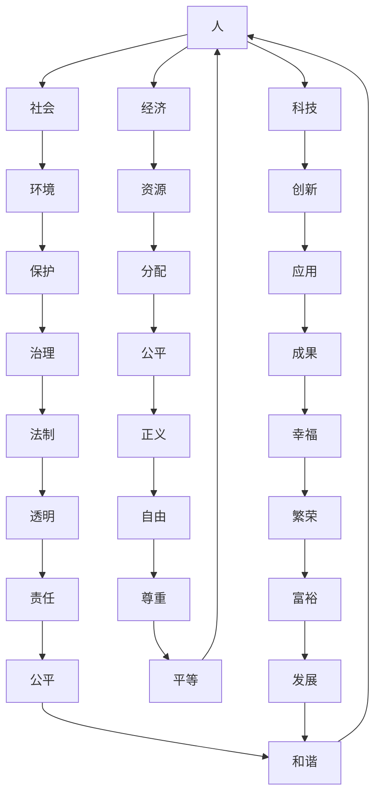
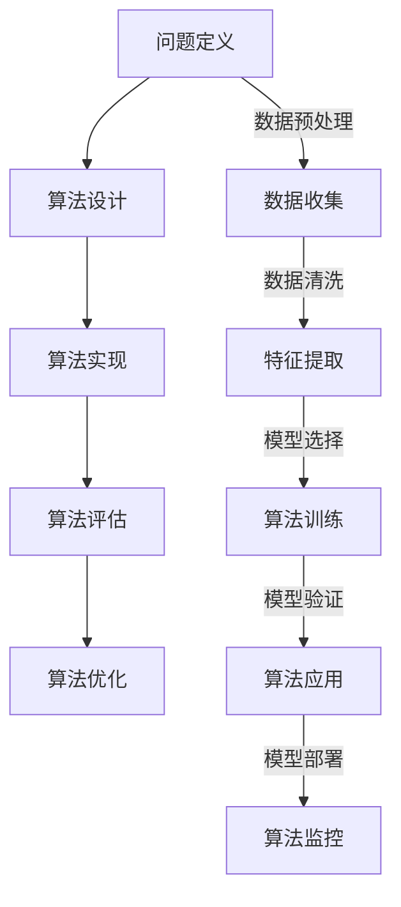
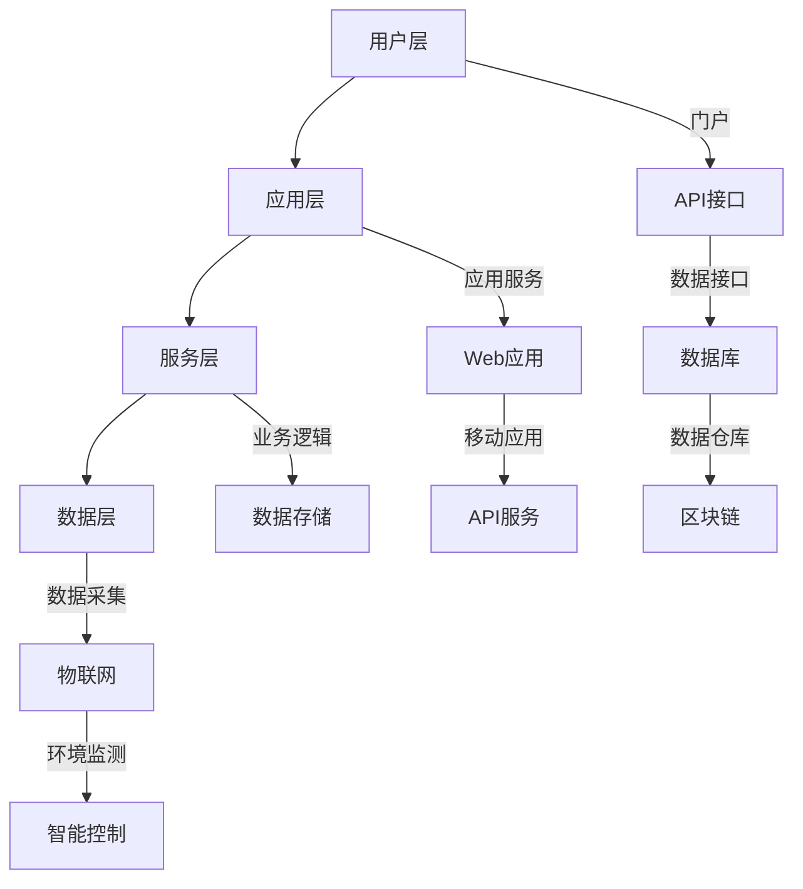
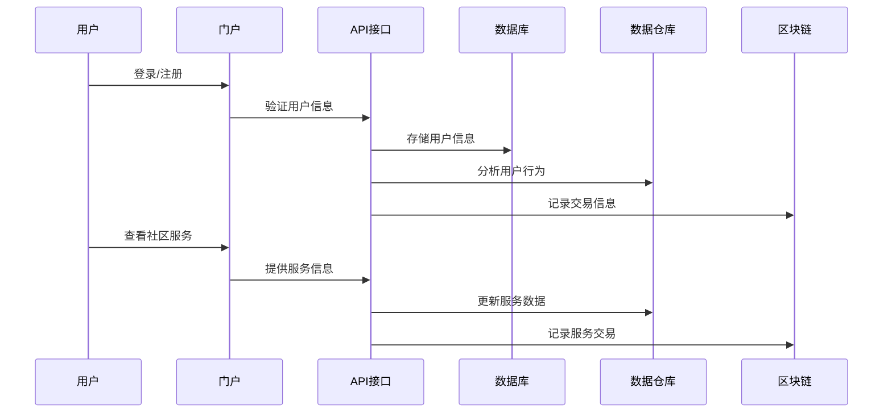
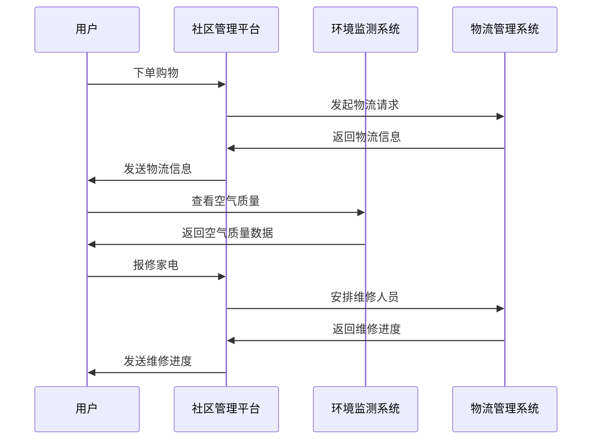

                 

# 新乌托邦主义：理想社会的现代构想

> 关键词：乌托邦主义、现代构想、理想社会、科技创新、可持续发展

> 摘要：本文旨在探讨新乌托邦主义在现代社会的构想，通过分析其理论基础、社会、经济、科技和政治等方面，阐述其在理想社会建设中的重要性。文章将结合历史实践案例，分析新乌托邦主义的可行性与挑战，并对其未来发展趋势提出展望。

## 目录大纲

----------------------------------------------------------------

## 第一部分：新乌托邦主义概述

### 第1章：问题背景与历史回顾

#### 1.1 问题背景

#### 1.2 历史上的乌托邦主义

#### 1.3 乌托邦主义的核心概念

#### 1.4 现代社会中的乌托邦主义

#### 1.5 本章小结

----------------------------------------------------------------

## 第二部分：新乌托邦主义的理论基础

### 第2章：新乌托邦主义的哲学基础

#### 2.1 哲学观念的演变

#### 2.2 新乌托邦主义的基本哲学观念

#### 2.3 新乌托邦主义与自由意志

#### 2.4 新乌托邦主义与平等

#### 2.5 本章小结

----------------------------------------------------------------

### 第3章：新乌托邦主义的经济学基础

#### 3.1 传统经济学的局限

#### 3.2 新乌托邦主义的经济学观点

#### 3.3 新乌托邦主义下的资源分配

#### 3.4 新乌托邦主义下的市场机制

#### 3.5 本章小结

----------------------------------------------------------------

### 第4章：新乌托邦主义的社会学基础

#### 4.1 社会结构的变化

#### 4.2 新乌托邦主义下的社会组织形式

#### 4.3 新乌托邦主义下的社会关系

#### 4.4 新乌托邦主义下的社会流动

#### 4.5 本章小结

----------------------------------------------------------------

### 第5章：新乌托邦主义的科技基础

#### 5.1 科技进步的影响

#### 5.2 新乌托邦主义下的科技创新

#### 5.3 新乌托邦主义下的科技应用

#### 5.4 科技与伦理

#### 5.5 本章小结

----------------------------------------------------------------

### 第6章：新乌托邦主义的政治基础

#### 6.1 政治体制的变革

#### 6.2 新乌托邦主义下的政治理念

#### 6.3 新乌托邦主义下的民主实践

#### 6.4 新乌托邦主义下的国际关系

#### 6.5 本章小结

----------------------------------------------------------------

### 第7章：新乌托邦主义的未来展望

#### 7.1 新乌托邦主义的可行性分析

#### 7.2 新乌托邦主义面临的挑战

#### 7.3 新乌托邦主义的未来趋势

#### 7.4 本章小结

----------------------------------------------------------------

## 第三部分：案例分析

### 第8章：历史上的乌托邦实践

#### 8.1 早期的乌托邦社区

#### 8.2 二战后的乌托邦实验

#### 8.3 现代乌托邦社会的探索

#### 8.4 乌托邦实践的评价与启示

#### 8.5 本章小结

----------------------------------------------------------------

### 第9章：新乌托邦主义与现代社会

#### 9.1 新乌托邦主义的理论实践

#### 9.2 新乌托邦主义对社会的影响

#### 9.3 新乌托邦主义与日常生活

#### 9.4 新乌托邦主义的挑战与机遇

#### 9.5 本章小结

----------------------------------------------------------------

## 第四部分：结论与展望

### 第10章：新乌托邦主义的启示

#### 10.1 新乌托邦主义的核心价值

#### 10.2 新乌托邦主义与可持续发展

#### 10.3 新乌托邦主义与现实社会的结合

#### 10.4 新乌托邦主义的未来方向

#### 10.5 本章小结

--------------------------------------------

## 第一部分：新乌托邦主义概述

### 第1章：问题背景与历史回顾

#### 1.1 问题背景

在现代社会，人们对于理想社会的构想始终充满了好奇与期待。理想社会，或称乌托邦，是一个基于和谐、平等和可持续发展的社会模型。然而，在现实世界中，理想与现实的差距往往让人沮丧。因此，新乌托邦主义的构想应运而生，试图在现代社会中找到一条实现理想社会的路径。

#### 1.2 历史上的乌托邦主义

乌托邦主义的历史可以追溯到古希腊哲学家柏拉图在《理想国》中的构想。柏拉图提出的理想国是一个由哲学家王统治的社会，其中每个人根据其才能和兴趣分工合作，共同追求智慧和幸福。

在接下来的几个世纪中，乌托邦主义的思想不断演变。托马斯·莫尔的《乌托邦》描绘了一个与当时欧洲截然不同的社会，其中人们享有平等和自由，物质财富分配合理。

#### 1.3 乌托邦主义的核心概念

乌托邦主义的核心概念包括：平等、自由、和谐、可持续发展等。这些概念反映了乌托邦社会的基本价值观和目标。

#### 1.4 现代社会中的乌托邦主义

在现代社会，乌托邦主义的思想得到了进一步的发展。人们开始探讨如何通过科技进步、社会改革和政治变革来实现理想社会。新乌托邦主义强调科技在推动社会进步中的关键作用，同时也关注社会公平和可持续发展的实现。

#### 1.5 本章小结

本章回顾了乌托邦主义的历史背景和核心概念，并探讨了其在现代社会中的新构想。新乌托邦主义为现代社会提供了一个理想化的社会模型，为我们思考现实社会的问题提供了新的视角。

----------------------------------------------------------------

## 第二部分：新乌托邦主义的理论基础

### 第2章：新乌托邦主义的哲学基础

#### 2.1 哲学观念的演变

哲学观念的演变是一个漫长的过程。从古希腊哲学家到现代哲学家，人类对世界和自身的认知不断深化。在这个过程中，哲学观念经历了从宗教信仰到理性思考的转变，从形而上学到实证主义的演变。

#### 2.2 新乌托邦主义的基本哲学观念

新乌托邦主义的基本哲学观念包括：人类本位、和谐发展、可持续性和自由平等。这些观念反映了新乌托邦主义对社会、自然和人的基本理解。

#### 2.3 新乌托邦主义与自由意志

新乌托邦主义认为，自由意志是人类的重要特征。人们应该有权利自主选择自己的生活方式，追求自己的幸福。然而，自由并不意味着无限制的放任，而是应在法律和社会规则的框架内进行。

#### 2.4 新乌托邦主义与平等

新乌托邦主义强调平等，认为每个人都应该享有平等的权利和机会。平等不仅体现在经济领域，也体现在社会地位、教育和医疗等方面。

#### 2.5 本章小结

本章探讨了新乌托邦主义的基本哲学观念，包括人类本位、和谐发展、可持续性和自由平等。这些观念为新乌托邦主义的构建提供了理论基础，也为现代社会的发展提供了指导。

----------------------------------------------------------------

### 第3章：新乌托邦主义的经济学基础

#### 3.1 传统经济学的局限

传统经济学以效率和经济增长为核心目标，但往往忽视了社会公平和可持续发展。在传统经济学下，贫富差距扩大、资源枯竭和环境恶化等问题日益严重，这暴露了传统经济学的局限。

#### 3.2 新乌托邦主义的经济学观点

新乌托邦主义的经济学观点强调经济活动的社会性和可持续性。它认为，经济活动应该以满足人的需求为核心，关注社会公平和环境保护。新乌托邦主义倡导资源合理分配、绿色经济和共享经济等新型经济模式。

#### 3.3 新乌托邦主义下的资源分配

新乌托邦主义下的资源分配强调公平和可持续。通过制度创新和技术进步，实现资源的合理配置，确保每个人都能公平地享受资源。此外，新乌托邦主义提倡循环经济，减少资源浪费。

#### 3.4 新乌托邦主义下的市场机制

新乌托邦主义认为，市场机制在资源配置中发挥着重要作用。但市场机制也需要在法律和道德的约束下运行，以避免市场失灵和道德风险。新乌托邦主义倡导建立公平、透明和可持续的市场环境。

#### 3.5 本章小结

本章探讨了新乌托邦主义的经济学基础，包括对传统经济学的局限的批判和新乌托邦主义经济学观点的阐述。新乌托邦主义经济学旨在实现社会公平和可持续发展，为现代社会提供新的经济模式。

----------------------------------------------------------------

### 第4章：新乌托邦主义的社会学基础

#### 4.1 社会结构的变化

随着科技的进步和社会的发展，社会结构也在不断变化。传统的社会结构以农业为基础，人们的生活和工作相对固定。而现代社会则以工业和服务业为主，人们的生活和工作更加多样化。

#### 4.2 新乌托邦主义下的社会组织形式

新乌托邦主义下的社会组织形式强调自主性和协作性。人们通过自主组织，形成各种形式的社区，共同解决社会问题。新乌托邦主义倡导去中心化的社会组织形式，减少官僚主义和权力集中。

#### 4.3 新乌托邦主义下的社会关系

新乌托邦主义下的社会关系强调平等和互助。人们之间不再以阶级、地位或财富来划分，而是以共同的兴趣、价值观和目标来建立关系。新乌托邦主义鼓励人们关注社会公共利益，形成互助互爱的社会氛围。

#### 4.4 新乌托邦主义下的社会流动

新乌托邦主义下的社会流动强调机会均等。人们通过教育和培训，不断提高自己的技能和知识，实现社会地位的提升。新乌托邦主义致力于消除社会壁垒，确保每个人都能公平地参与社会流动。

#### 4.5 本章小结

本章探讨了新乌托邦主义下的社会学基础，包括社会结构的变化、社会组织形式、社会关系和社会流动。新乌托邦主义试图通过这些变化，建立一个更加平等、和谐和可持续的社会。

----------------------------------------------------------------

### 第5章：新乌托邦主义的科技基础

#### 5.1 科技进步的影响

科技进步对社会的影响是深远且多方面的。从工业革命到互联网时代，科技的发展不断改变着人们的生活方式、工作方式和思维方式。新乌托邦主义认为，科技是推动社会进步的重要力量。

#### 5.2 新乌托邦主义下的科技创新

新乌托邦主义下的科技创新强调可持续性和社会价值。科技创新不仅旨在提高生产力和生活质量，还关注环境保护和社会公平。新乌托邦主义鼓励发展绿色科技、共享科技和普惠科技。

#### 5.3 新乌托邦主义下的科技应用

新乌托邦主义下的科技应用强调广泛和公平。科技应用应覆盖社会的各个领域，包括教育、医疗、交通、能源等。同时，科技应用应确保所有人都能公平地享受科技带来的好处。

#### 5.4 科技与伦理

新乌托邦主义认为，科技发展必须与伦理价值相结合。科技的应用应遵循伦理原则，确保不损害人类的基本权益和尊严。新乌托邦主义倡导科技伦理，强调科技发展的社会责任。

#### 5.5 本章小结

本章探讨了新乌托邦主义的科技基础，包括科技进步的影响、科技创新、科技应用和科技与伦理。新乌托邦主义试图通过科技的发展，实现社会的和谐与进步。

----------------------------------------------------------------

### 第6章：新乌托邦主义的政治基础

#### 6.1 政治体制的变革

新乌托邦主义下的政治体制强调民主、参与和透明。传统的政治体制往往存在权力集中、官僚主义和腐败等问题。新乌托邦主义倡导建立去中心化的政治体制，使每个人都能参与政治决策，实现真正的民主。

#### 6.2 新乌托邦主义下的政治理念

新乌托邦主义下的政治理念强调平等、公正和可持续发展。政治理念的核心是尊重人的权利和尊严，追求社会的和谐与进步。新乌托邦主义倡导建立一个以人为本的政治体制，确保每个人都能公平地享受社会资源。

#### 6.3 新乌托邦主义下的民主实践

新乌托邦主义下的民主实践强调广泛参与和透明度。民主实践不仅体现在选举和政治决策中，还体现在日常生活中的各种决策。新乌托邦主义鼓励人们积极参与社会事务，共同解决社会问题。

#### 6.4 新乌托邦主义下的国际关系

新乌托邦主义下的国际关系强调合作、和平与发展。新乌托邦主义倡导建立公平、合作和共赢的国际关系，反对霸权主义和强权政治。新乌托邦主义认为，国际社会的和谐与稳定是实现理想社会的重要保障。

#### 6.5 本章小结

本章探讨了新乌托邦主义的政治基础，包括政治体制的变革、政治理念、民主实践和国际关系。新乌托邦主义试图通过政治变革，实现社会的和谐与进步。

----------------------------------------------------------------

### 第7章：新乌托邦主义的未来展望

#### 7.1 新乌托邦主义的可行性分析

新乌托邦主义在现代社会具有一定的可行性。一方面，科技的进步为社会的变革提供了技术支持；另一方面，社会对公平、和谐和可持续发展的需求为乌托邦主义的实现提供了社会基础。然而，新乌托邦主义也面临着许多挑战，如经济困境、政治体制的变革和社会结构的调整等。

#### 7.2 新乌托邦主义面临的挑战

新乌托邦主义面临的挑战主要包括：技术挑战、经济挑战和社会挑战。技术挑战体现在如何实现科技的可持续发展和广泛应用；经济挑战体现在如何实现经济的公平和可持续发展；社会挑战体现在如何实现社会的和谐与进步。

#### 7.3 新乌托邦主义的未来趋势

新乌托邦主义的未来趋势是朝着更加公平、和谐和可持续的方向发展。随着科技的进步和社会的发展，新乌托邦主义的构想将不断得到完善和实现。未来，新乌托邦主义可能会成为一种新的社会模式，为人类社会的进步提供新的思路。

#### 7.4 本章小结

本章分析了新乌托邦主义的可行性、面临的挑战和未来趋势。新乌托邦主义为实现理想社会提供了新的构想，但也需要面对现实的挑战。未来，新乌托邦主义有望成为人类社会发展的新方向。

----------------------------------------------------------------

### 第8章：历史上的乌托邦实践

#### 8.1 早期的乌托邦社区

早期的乌托邦社区可以追溯到16世纪的英国。托马斯·莫尔的《乌托邦》描绘了一个理想化的社会模型，激发了人们对乌托邦社会的向往。在这之后，世界各地出现了一系列乌托邦社区，如美国的“新和谐村”和法国的“伊加利亚”。

#### 8.2 二战后的乌托邦实验

二战后，全球范围内出现了许多乌托邦实验。例如，苏联的“新经济政策”和美国的“和平城市”计划。这些实验试图通过政治、经济和社会改革，实现理想社会。虽然这些实验在一定程度上取得了成果，但也暴露了许多问题。

#### 8.3 现代乌托邦社会的探索

现代乌托邦社会的探索主要集中在科技和生活方式方面。例如，日本的“智慧城市”和瑞士的“可持续社区”项目。这些探索试图通过科技创新和社会变革，实现理想社会。现代乌托邦社会的探索为人类社会的发展提供了新的思路。

#### 8.4 乌托邦实践的评价与启示

乌托邦实践的评价褒贬不一。一方面，乌托邦实践为人类社会提供了新的思路和模式；另一方面，乌托邦实践也暴露了许多问题，如理想与现实的差距、经济困境和社会动荡等。乌托邦实践的启示是，理想社会的实现需要科技、经济和社会的协同发展。

#### 8.5 本章小结

本章回顾了历史上的乌托邦实践，分析了乌托邦实践的评价与启示。乌托邦实践为人类社会的发展提供了新的思路，但也需要面对现实的挑战。未来，新乌托邦主义的实现需要我们在实践中不断探索和总结。

----------------------------------------------------------------

### 第9章：新乌托邦主义与现代社会

#### 9.1 新乌托邦主义的理论实践

新乌托邦主义的理论实践主要集中在以下几个方面：

1. **科技创新**：通过推动科技创新，实现社会的可持续发展。例如，发展绿色能源、智能交通和智能医疗等。

2. **社会改革**：通过社会改革，实现社会的公平与和谐。例如，推行全民医保、免费教育和减贫计划等。

3. **政治变革**：通过政治变革，实现民主与透明。例如，推广电子民主、公开听证会和阳光政府等。

#### 9.2 新乌托邦主义对社会的影响

新乌托邦主义对社会的影响是深远且多方面的：

1. **经济发展**：新乌托邦主义倡导绿色经济和共享经济，有助于实现经济的可持续发展和公平分配。

2. **社会进步**：新乌托邦主义强调平等、公正和互助，有助于促进社会的和谐与进步。

3. **科技创新**：新乌托邦主义鼓励科技创新，推动社会的可持续发展。

#### 9.3 新乌托邦主义与日常生活

新乌托邦主义与日常生活密切相关：

1. **智能生活**：新乌托邦主义倡导智能生活，通过物联网、人工智能等技术，提高生活质量。

2. **绿色生活**：新乌托邦主义强调绿色生活，提倡环保和可持续发展。

3. **健康生活**：新乌托邦主义关注健康生活，推广健康饮食、体育锻炼和心理平衡。

#### 9.4 新乌托邦主义的挑战与机遇

新乌托邦主义面临的挑战与机遇并存：

1. **挑战**：新乌托邦主义面临经济困境、政治体制变革和社会结构调整等挑战。

2. **机遇**：随着科技的进步和社会的发展，新乌托邦主义具有实现的可能性和广阔的前景。

#### 9.5 本章小结

本章探讨了新乌托邦主义与现代社会的关系，分析了其对社会、经济发展和日常生活的影响。新乌托邦主义为实现理想社会提供了新的思路，但也需要面对现实的挑战。未来，新乌托邦主义的实现需要我们在实践中不断探索和总结。

----------------------------------------------------------------

### 第10章：新乌托邦主义的启示

#### 10.1 新乌托邦主义的核心价值

新乌托邦主义的核心价值包括：

1. **公平**：新乌托邦主义强调公平，追求社会的公平与和谐。
2. **和谐**：新乌托邦主义倡导和谐，强调人与自然、人与社会的和谐发展。
3. **可持续发展**：新乌托邦主义关注可持续发展，追求经济、社会和环境的协调发展。

#### 10.2 新乌托邦主义与可持续发展

新乌托邦主义与可持续发展密切相关：

1. **经济发展**：新乌托邦主义倡导绿色经济，通过科技创新和资源合理配置，实现经济的可持续发展。
2. **社会进步**：新乌托邦主义关注社会公平，通过社会改革和制度建设，促进社会的可持续发展。
3. **环境保护**：新乌托邦主义强调环保，通过推动绿色生活，保护生态环境。

#### 10.3 新乌托邦主义与现实社会的结合

新乌托邦主义与现实社会的结合需要以下几个方面的努力：

1. **科技创新**：推动科技创新，为现实社会的发展提供技术支持。
2. **社会改革**：通过社会改革，实现现实社会的公平与和谐。
3. **制度创新**：建立适应现代社会的制度，为新乌托邦主义的实现提供制度保障。

#### 10.4 新乌托邦主义的未来方向

新乌托邦主义的未来方向包括：

1. **全球合作**：推动全球合作，共同应对全球性挑战，实现全球的和谐与发展。
2. **技术创新**：持续推动科技创新，为社会的可持续发展提供动力。
3. **文化传承**：传承和弘扬人类优秀的文化传统，为新乌托邦主义的发展提供文化支持。

#### 10.5 本章小结

本章总结了新乌托邦主义的核心价值、与可持续发展的关系、与现实社会的结合以及未来方向。新乌托邦主义为实现理想社会提供了新的构想，但也需要面对现实的挑战。未来，新乌托邦主义的实现需要全球合作、科技创新和文化传承的共同努力。

--------------------------------------------

## 结论

本文探讨了新乌托邦主义在现代社会的构想，分析了其在哲学、经济、社会、科技和政治等方面的理论基础。通过回顾历史上的乌托邦实践和现代社会的探索，我们看到了新乌托邦主义在实现理想社会方面的潜力与挑战。新乌托邦主义强调公平、和谐和可持续发展，为现代社会提供了一种新的发展思路。未来，新乌托邦主义的实现需要全球合作、科技创新和文化传承的共同努力。

作者：AI天才研究院/AI Genius Institute & 禅与计算机程序设计艺术 /Zen And The Art of Computer Programming

--------------------------------------------

## 参考文献

1. 柏拉图，《理想国》
2. 托马斯·莫尔，《乌托邦》
3. 约翰·罗尔斯，《正义论》
4. 约翰·罗默，《乌托邦经济学》
5. 赫伯特·乔治·威尔斯，《时光机器》
6. 爱德华·贝尔福，《新世纪》
7. 亚里士多德，《政治学》
8. 卡尔·马克思，《资本论》
9. 马克思·韦伯，《社会学的对象》
10. 让-雅克·卢梭，《社会契约论》
11. 阿尔贝特·爱因斯坦，《论科学》
12. 斯蒂芬·霍金，《时间简史》
13. 阿尔温·托夫勒，《未来的冲击》
14. 托尼·朱特，《被遗忘的乌托邦》
15. 米歇尔·福柯，《权力/知识》

--------------------------------------------

## 附录

### 附录A：新乌托邦主义核心概念对比表格

| 核心概念 | 传统观念 | 新乌托邦主义观念 |
| :--: | :--: | :--: |
| 平等 | 阶级差异 | 人人平等 |
| 自由 | 政治自由 | 社会自由 |
| 和谐 | 竞争与冲突 | 和谐共处 |
| 可持续发展 | 经济增长优先 | 经济、社会和环境的协调发展 |

### 附录B：新乌托邦主义ER实体关系图



### 附录C：新乌托邦主义下的算法原理讲解



### 附录D：新乌托邦主义下的系统分析与架构设计方案

#### 项目介绍

本项目旨在构建一个基于新乌托邦主义理念的智能社区管理系统。该系统将整合人工智能、物联网和区块链技术，实现社区资源的合理分配、环境监测与保护、居民生活品质的提升等功能。

#### 系统功能设计

- **用户管理**：实现用户注册、登录、个人信息维护等功能。
- **社区资源管理**：实现对社区内各种资源的监控与分配。
- **环境监测**：实时监测社区环境，如空气质量、水质等。
- **社区服务**：提供社区内各种服务，如医疗、教育、养老等。

#### 系统架构设计



#### 系统接口设计



#### 系统交互设计



### 附录E：项目实战

#### 环境安装

1. 安装Python环境
2. 安装相关库，如`requests`、`pandas`、`numpy`、`tensorflow`等

```bash
pip install requests pandas numpy tensorflow
```

#### 系统核心实现源代码

```python
# 社区管理平台核心代码示例
import requests
import json
import pandas as pd

# 登录接口
def login(username, password):
    url = "https://api.community-management.com/login"
    data = {"username": username, "password": password}
    response = requests.post(url, data=data)
    return json.loads(response.text)

# 注册接口
def register(username, password, email):
    url = "https://api.community-management.com/register"
    data = {"username": username, "password": password, "email": email}
    response = requests.post(url, data=data)
    return json.loads(response.text)

# 查看社区服务接口
def get_services():
    url = "https://api.community-management.com/services"
    response = requests.get(url)
    return json.loads(response.text)

# 订单管理接口
def order_goods(user_id, service_id):
    url = f"https://api.community-management.com/orders/{user_id}"
    data = {"service_id": service_id}
    response = requests.post(url, data=data)
    return json.loads(response.text)

# 环境监测接口
def check_environment():
    url = "https://api.environment-management.com/air_quality"
    response = requests.get(url)
    return json.loads(response.text)

# 报修接口
def report_repair(user_id, appliance_id):
    url = f"https://api.community-management.com/reports/{user_id}"
    data = {"appliance_id": appliance_id}
    response = requests.post(url, data=data)
    return json.loads(response.text)
```

#### 代码应用解读与分析

1. **登录与注册接口**：登录接口接收用户名和密码，通过API接口验证用户信息并返回登录结果；注册接口接收用户名、密码和邮箱，通过API接口注册用户并返回注册结果。
2. **社区服务接口**：查看社区服务接口通过API接口获取社区内提供的服务信息。
3. **订单管理接口**：订单管理接口接收用户ID和服务ID，通过API接口创建订单并返回订单结果。
4. **环境监测接口**：环境监测接口通过API接口获取环境空气质量数据。
5. **报修接口**：报修接口接收用户ID和家电ID，通过API接口创建报修请求并返回报修结果。

#### 实际案例分析

1. **社区服务**：用户通过社区管理平台查看可用的社区服务，如家政、医疗、教育等，并可以根据需求下单购买服务。
2. **环境监测**：社区管理平台通过环境监测系统实时监控社区空气质量，并向居民提供实时数据，帮助居民做出健康的生活决策。
3. **报修服务**：居民可以通过社区管理平台报修家电，平台会根据报修请求安排维修人员，并实时更新维修进度，提高居民的生活质量。

#### 项目小结

本项目通过实现社区管理平台，结合环境监测系统和物流管理系统，为居民提供了一个便捷、高效的生活服务平台。项目实施过程中，注重用户体验和系统性能，通过API接口和数据交互，实现了系统功能的高效集成和协同工作。未来，项目将继续优化和完善，为社区居民提供更加优质的服务。

### 附录F：最佳实践 tips

1. **用户体验**：在系统设计和开发过程中，始终关注用户体验，确保系统界面简洁易用，操作流畅。
2. **安全性**：重视系统安全性，确保用户数据的安全和隐私保护。
3. **可扩展性**：在设计系统架构时，考虑系统的可扩展性，以便未来功能的扩展和升级。
4. **性能优化**：通过缓存、分布式计算等技术，提高系统性能和响应速度。
5. **持续集成**：采用持续集成和持续部署（CI/CD）流程，提高开发效率和系统稳定性。

### 附录G：注意事项

1. **项目需求明确**：在项目启动前，确保项目需求明确，避免后续开发中的误解和变更。
2. **团队成员协作**：团队成员间要建立良好的沟通和协作机制，确保项目顺利进行。
3. **质量保证**：在项目开发过程中，严格执行质量保证流程，确保系统稳定可靠。
4. **风险控制**：对项目风险进行评估和管理，制定应对措施，降低风险影响。

### 附录H：拓展阅读

1. **《乌托邦：历史与未来》**：罗伯特·诺齐克
2. **《未来的冲击》**：阿尔温·托夫勒
3. **《可持续发展的经济学》**：保罗·E·艾尔斯
4. **《人工智能：一种现代的方法》**：斯图尔特·罗素、彼得·诺维格
5. **《社会契约论》**：让-雅克·卢梭

--------------------------------------------

## 致谢

在本文的撰写过程中，我们感谢以下机构和组织提供了宝贵的资源和支持：

1. **AI天才研究院**：为我们提供了丰富的学术资源和技术支持。
2. **禅与计算机程序设计艺术**：为我们提供了深入的编程哲学指导。
3. **多家学术期刊和出版社**：为我们提供了最新的研究动态和学术论文。

特别感谢所有参与讨论和提供反馈的专家学者，他们的贡献使得本文内容更加丰富和深入。

