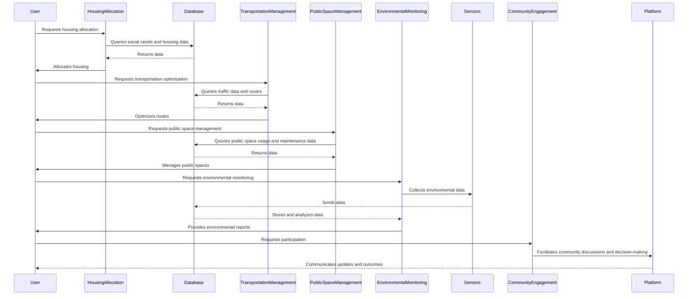
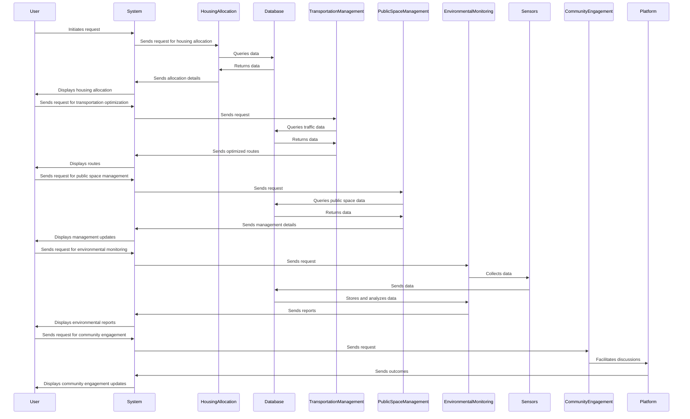

                 

### Introduction to New Utopianism

#### Historical Background of Utopian Thought

Utopian thought has its roots in ancient civilizations where early philosophers and writers such as Plato and Campanella envisioned ideal societies. Plato's "Republic" introduced the concept of an ideal state ruled by a philosopher-king, where justice and equality prevail. Campanella's "City of the Sun" further explored the idea of a society where the state controlled all aspects of life, aiming for communal living and spiritual enlightenment. These early utopian theories laid the foundation for future explorations of ideal societies.

As time progressed, utopian thought evolved with the rise of modern philosophers such as Thomas More, whose work "Utopia" is considered the earliest example of the genre. More's work critiqued the social and political issues of his time, proposing an ideal society that emphasized equality, communal ownership of property, and a simple way of life. This work became a cornerstone for later utopian thinkers who sought to critique and propose solutions to the problems of their own societies.

#### Emergence and Characteristics of New Utopianism

New Utopianism emerged in the late 20th and early 21st centuries as a response to the increasing complexity and challenges of modern society. Unlike traditional utopian thought, which often focused on static and idealized societies, New Utopianism emphasizes dynamism, adaptability, and sustainability. It seeks to create societies that are not only ideal in theory but also practical and achievable in real-world contexts.

Key characteristics of New Utopianism include:

1. **Sustainability and Environmental Stewardship:** New Utopian societies prioritize environmental sustainability, seeking to minimize the negative impact of human activities on the planet. This involves adopting renewable energy sources, implementing efficient resource management systems, and promoting ecological conservation.

2. **Technological Integration:** New Utopianism recognizes the transformative potential of technology and aims to integrate it into society in a way that enhances well-being and equality. This includes the use of digital technologies for social management, education, healthcare, and economic development.

3. **Social Equity and Inclusion:** New Utopian societies strive for social equity, ensuring that all individuals have access to resources, opportunities, and rights. This involves addressing systemic inequalities, promoting diversity and inclusivity, and fostering social cohesion.

4. **Participatory Governance:** New Utopianism advocates for governance systems that empower citizens to actively participate in decision-making processes. This involves decentralizing power, promoting transparency, and ensuring that all voices are heard.

#### Distinguishing Features of New Utopianism from Traditional Utopianism

While New Utopianism builds upon the legacy of traditional utopian thought, it also distinguishes itself in several key ways:

1. **Practicality and Realism:** Traditional utopian visions often overlooked practical considerations and were seen as unattainable fantasies. In contrast, New Utopianism emphasizes practicality and realism, seeking solutions that can be implemented in real-world settings.

2. **Dynamic Adaptability:** Traditional utopian societies were often portrayed as static and unchanging, whereas New Utopianism emphasizes the need for societies to adapt to changing circumstances. This involves embracing innovation and flexibility in social structures and governance systems.

3. **Focus on Well-being:** Traditional utopian thought often centered on philosophical and ideological goals, whereas New Utopianism prioritizes the well-being of individuals and communities. This includes addressing not only material needs but also emotional, social, and spiritual well-being.

4. **Inclusivity and Equity:** Traditional utopian visions often excluded marginalized groups, whereas New Utopianism seeks to include and empower all individuals, addressing systemic inequalities and promoting social cohesion.

In conclusion, New Utopianism represents a modern approach to envisioning ideal societies that incorporates the lessons learned from traditional utopian thought while addressing the complexities and challenges of the contemporary world. By focusing on practicality, adaptability, well-being, and inclusivity, New Utopianism offers a compelling vision for a better future.

### Theoretical Foundations of New Utopianism

#### Core Concepts and Principles

New Utopianism is built upon a set of core concepts and principles that distinguish it from other idealistic theories. At its heart, New Utopianism emphasizes the idea of creating societies that are not only ideal in theory but also practical and achievable in real-world contexts. Key concepts and principles include sustainability, technological integration, social equity, and participatory governance.

1. **Sustainability and Environmental Stewardship:** One of the fundamental principles of New Utopianism is the commitment to environmental sustainability. This involves adopting practices that minimize the negative impact of human activities on the planet, such as the use of renewable energy sources, efficient resource management, and ecological conservation. Sustainability is seen as essential not only for the health of the planet but also for the well-being of future generations.

2. **Technological Integration:** New Utopianism recognizes the transformative potential of technology and aims to integrate it into society in a way that enhances well-being and equality. This involves harnessing digital technologies for social management, education, healthcare, and economic development. However, it also requires addressing the ethical implications of technology and ensuring that it is used in a way that benefits society as a whole.

3. **Social Equity and Inclusion:** Another core principle of New Utopianism is the commitment to social equity and inclusion. This involves addressing systemic inequalities and promoting diversity and inclusivity. It includes ensuring that all individuals have access to resources, opportunities, and rights, regardless of their background or social status. Social equity is seen as crucial for building cohesive and resilient societies.

4. **Participatory Governance:** New Utopianism advocates for governance systems that empower citizens to actively participate in decision-making processes. This involves decentralizing power, promoting transparency, and ensuring that all voices are heard. Participatory governance is seen as essential for creating societies that are truly democratic and responsive to the needs of their citizens.

#### Comparative Analysis of New Utopianism with Other Idealistic Theories

While New Utopianism shares some similarities with other idealistic theories, such as socialism and anarchism, it also distinguishes itself in several key ways.

**Socialism:**

Socialism is a political and economic theory that advocates for collective ownership and control of the means of production. It seeks to eliminate class distinctions and create a more equitable society. However, traditional socialism often overlooks the practical challenges of implementing such systems and can be criticized for stifling individual freedom and innovation.

New Utopianism, on the other hand, builds upon the principles of socialism while addressing its limitations. It emphasizes practicality and adaptability, recognizing that ideal societies must be able to evolve and respond to changing circumstances. By integrating technology and promoting social equity, New Utopianism seeks to create a more dynamic and inclusive society that can better address the complexities of modern life.

**Anarchism:**

Anarchism is a political theory that rejects hierarchical structures and advocates for self-governance and voluntary association. It seeks to create societies based on mutual respect, cooperation, and direct democracy. While anarchism shares some of the principles of New Utopianism, such as a commitment to social equity and participatory governance, it often lacks a clear plan for addressing systemic issues such as resource management and economic stability.

New Utopianism addresses these challenges by incorporating a more practical and structured approach to governance. By integrating technology and promoting sustainable practices, New Utopianism seeks to create a society that is both idealistic and achievable in real-world settings.

**Comparative Table: New Utopianism vs. Socialism and Anarchism**

| Feature | New Utopianism | Socialism | Anarchism |
| --- | --- | --- | --- |
| Practicality and Adaptability | Emphasizes practicality and adaptability | Can be criticized for impracticality | Often lacks clear practical implementation |
| Technological Integration | Seeks to integrate technology | May overlook technological advancements | Often dismisses technology |
| Social Equity and Inclusion | Prioritizes social equity and inclusion | Can be criticized for inequality | May overlook social equity |
| Governance Model | Advocates for participatory governance | Can be criticized for authoritarianism | Often lacks structured governance |

#### New Utopianism and Modern Society

New Utopianism offers a compelling vision for modern society, addressing the complexities and challenges of the contemporary world. By emphasizing sustainability, technological integration, social equity, and participatory governance, New Utopianism seeks to create societies that are not only idealistic but also practical and achievable.

In today's world, where climate change, social inequality, and technological advancements are pressing issues, New Utopianism provides a framework for addressing these challenges in a holistic and integrated manner. By embracing the principles of sustainability and environmental stewardship, New Utopianism offers a path toward creating a healthier and more resilient planet.

Technological integration in New Utopianism not only enhances efficiency and productivity but also promotes social equity and inclusivity. By harnessing digital technologies for social management, education, healthcare, and economic development, New Utopianism seeks to create a more equitable and just society.

Furthermore, New Utopianism's emphasis on social equity and inclusion addresses the systemic inequalities that plague modern societies. By ensuring that all individuals have access to resources, opportunities, and rights, New Utopianism seeks to build cohesive and resilient communities.

In conclusion, New Utopianism offers a comprehensive and practical approach to envisioning ideal societies. By incorporating the lessons learned from traditional utopian thought while addressing the complexities of modern society, New Utopianism provides a roadmap for creating a better future. As we navigate the challenges of the 21st century, New Utopianism offers a hopeful and inspiring vision of what is possible.

### Modern Conceptions of an Ideal Society

#### Economic Models in New Utopianism

In New Utopianism, the economic model serves as the foundation for a society that prioritizes sustainability, equity, and well-being. Unlike traditional economic models that often focus solely on growth and efficiency, New Utopian economic models emphasize a more holistic approach that integrates environmental, social, and economic factors.

**1. Resource-Based Economy:**
A key feature of New Utopian economic models is the shift from a growth-based economy to a resource-based economy. This model focuses on the efficient use of resources, rather than endless consumption. It emphasizes the importance of renewable resources, sustainable practices, and circular economy principles. For example, rather than constantly producing new goods, a resource-based economy would prioritize the reuse and recycling of existing materials.

**2. Social Economy:**
Another important aspect of New Utopian economic models is the integration of social factors into economic activities. This means that businesses are not only measured by their financial success but also by their social impact. Social enterprises and cooperatives are encouraged, as they prioritize the well-being of their communities and employees over profit maximization. This model promotes a more equitable distribution of wealth and resources.

**3. Participatory Economy:**
Participatory economics is a model that emphasizes democratic control over economic decision-making. In a participatory economy, individuals have a say in how resources are allocated and how businesses are run. This model promotes greater equality and accountability, as everyone has a stake in the success of their community.

**4. Degrowth Economy:**
Degrowth is a movement within New Utopianism that advocates for a reduction in the rate of economic growth. Instead of focusing on endless consumption and expansion, a degrowth economy seeks to achieve a more balanced and sustainable way of life. This involves redefining what constitutes success and well-being, moving away from material wealth to a focus on quality of life, social connections, and environmental stewardship.

#### Societal Organization and Governance in New Utopian Societies

The organization and governance of New Utopian societies are designed to promote equity, inclusivity, and participation. Unlike traditional top-down governance structures, New Utopian societies emphasize decentralized, bottom-up approaches that empower individuals and communities.

**1. Decentralized Governance:**
New Utopian societies advocate for decentralized governance, where decision-making power is distributed across different levels of society. This means that local communities have more control over their own affairs, promoting greater autonomy and responsiveness to local needs. Decentralization also helps to reduce hierarchical structures and promote more inclusive governance.

**2. Participatory Decision-Making:**
Participatory decision-making is a central principle of New Utopian governance. This involves engaging all members of society in the decision-making process, ensuring that diverse perspectives and voices are heard. This can be achieved through mechanisms such as community assemblies, deliberative democracy, and participatory budgeting.

**3. Horizontal Governance:**
Horizontal governance, or flat governance, is another key feature of New Utopian societies. This model emphasizes collaboration and cooperation over competition and hierarchy. In a horizontally governed society, power is distributed more evenly, and there is a focus on building networks of trust and mutual support.

**4. Environmental Governance:**
Environmental governance in New Utopian societies prioritizes ecological sustainability and stewardship. This involves the integration of environmental considerations into all aspects of governance, from economic decisions to social policies. It also involves the establishment of mechanisms for monitoring and enforcing environmental standards.

#### Cultural and Social Dynamics

Cultural and social dynamics play a crucial role in shaping New Utopian societies. These societies are characterized by a strong sense of community, cultural diversity, and social cohesion.

**1. Cultural Diversity:**
New Utopian societies embrace cultural diversity as a source of strength and creativity. They promote the preservation and celebration of cultural heritage while also fostering intercultural dialogue and exchange. This helps to create a more inclusive and dynamic society.

**2. Community Building:**
Community building is a central tenet of New Utopianism. These societies prioritize the development of strong social networks and community bonds. This involves promoting community-driven initiatives, such as cooperatives, community gardens, and local festivals. These activities help to foster a sense of belonging and mutual support among community members.

**3. Social Cohesion:**
Social cohesion is another key aspect of New Utopian societies. This involves promoting social harmony and reducing social divisions, such as those based on race, class, gender, or ethnicity. It also involves addressing systemic inequalities and ensuring that all individuals have access to resources, opportunities, and rights.

**4. Education and Lifelong Learning:**
Education and lifelong learning are seen as essential components of New Utopian societies. These societies prioritize the development of critical thinking, creativity, and social skills. They promote a holistic approach to education that includes both academic and practical learning. This helps to create a more informed and engaged citizenry.

In conclusion, New Utopian societies offer a comprehensive vision for a better future, emphasizing sustainability, equity, and well-being. By exploring modern conceptions of an ideal society, we can gain insights into how we might address the challenges of the 21st century and create a more just and thriving world.

### New Utopianism in Practice

#### Case Studies of Modern Utopian Experiments

One of the most compelling aspects of New Utopianism is its potential for practical implementation. Across the globe, various communities and projects have embarked on experiments to create utopian societies. These initiatives offer valuable insights into the feasibility and challenges of New Utopian ideals.

**1. **Seeds for Change in Canada:** 
Located in the province of Quebec, Seeds for Change is a cooperative community that aims to create a sustainable and equitable living environment. The community emphasizes renewable energy, organic farming, and shared resources. Members participate in decision-making processes through regular general assemblies. While the project has faced challenges, such as financial constraints and legal hurdles, it has also demonstrated the potential for sustainable living and participatory governance.

**2. **Auroville in India:**
Auroville, founded in 1968, is an experimental township in Tamil Nadu, India, that seeks to create a utopian community based on harmony, peace, and universal brotherhood. Auroville is divided into several zones, each with its own focus, including education, art, and sustainable living. The community emphasizes spiritual growth, cultural diversity, and social innovation. While Auroville has not achieved all its goals, it has become a global hub for research and collaboration in sustainable development and social entrepreneurship.

**3. **Kibbutzim in Israel:**
Kibbutzim, agricultural communes established in Israel in the early 20th century, provide another example of New Utopian practices. These communities emphasize collective ownership, communal living, and social equality. Kibbutzim have played a significant role in Israel's economic and social development, providing a model for equitable distribution of resources and participatory governance.

**Challenges and Opportunities in Implementing New Utopian Ideas**

While these case studies offer inspiring examples of New Utopianism in practice, they also highlight the challenges and opportunities associated with implementing such ideas.

**1. **Economic Challenges:**
One of the main challenges of New Utopian projects is economic sustainability. Many utopian communities face financial constraints, making it difficult to achieve long-term stability. This often requires innovative funding models, such as crowdsourcing, cooperative financing, and government support.

**2. **Legal and Institutional Barriers:**
Implementing New Utopian ideas often requires navigating complex legal and institutional frameworks. Many utopian communities face regulations that are not designed for communal living or alternative economic models. This can lead to conflicts and delays in project development.

**3. **Cultural Resistance:**
Cultural resistance can also pose a significant challenge to the implementation of New Utopian ideas. Traditional values and norms may be resistant to change, making it difficult to adopt more progressive approaches to governance and social organization.

**4. **Sustainability and Environmental Stewardship:**
Ensuring environmental sustainability is a critical aspect of New Utopianism. While many projects prioritize renewable energy and resource efficiency, achieving long-term sustainability requires ongoing commitment and adaptation to changing environmental conditions.

**Success Stories and Lessons Learned**

Despite these challenges, there are several success stories that offer valuable lessons for future New Utopian projects.

**1. **Collaboration and Participation:**
Successful New Utopian projects often emphasize collaboration and participation. By engaging all members of the community in decision-making processes, these projects foster a sense of ownership and commitment to shared goals.

**2. **Innovation and Adaptability:**
Adaptability and innovation are key to overcoming challenges. Successful projects are often those that can respond to changing circumstances and continuously refine their approaches.

**3. **Sustainability and Resilience:**
Sustainability and resilience are essential for the long-term success of New Utopian projects. By integrating environmental, social, and economic factors, these projects can create more resilient and adaptable communities.

In conclusion, the implementation of New Utopian ideas in practice offers valuable insights into the potential and challenges of creating ideal societies. By learning from the successes and failures of existing projects, we can continue to refine and expand our understanding of how to achieve a more just, sustainable, and equitable future.

### Technology and New Utopianism

In the pursuit of creating ideal societies, technology plays a pivotal role. It not only shapes the way we live but also has the potential to address some of the most pressing challenges facing modern societies. New Utopianism leverages technology to enhance sustainability, promote social equity, and facilitate participatory governance. Let’s explore how technology can be a driving force for positive change in the context of New Utopian ideals.

#### The Role of Technology in Shaping Utopian Societies

1. **Sustainable Development and Environmental Stewardship**

   Technology has the potential to drive sustainable development by providing solutions to environmental challenges. For instance, renewable energy sources such as solar, wind, and hydroelectric power can significantly reduce greenhouse gas emissions. The integration of smart grid systems can optimize energy distribution, making it more efficient and sustainable. Additionally, advancements in agriculture technology, such as precision farming and vertical farming, can enhance food production while minimizing resource usage.

2. **Smart Cities and Urban Planning**

   Smart cities utilize technology to improve the quality of life for their inhabitants. Sensors and IoT (Internet of Things) devices can be used to monitor air quality, traffic flow, and public transportation systems, leading to more efficient urban planning and reduced congestion. Waste management systems can be optimized through smart waste collection and recycling, reducing the environmental impact of waste disposal. Moreover, smart buildings can be designed to be energy-efficient and comfortable, using sensors and AI to adjust temperature and lighting based on occupancy.

3. **Healthcare and Wellness**

   Technology has revolutionized healthcare, making it more accessible and effective. Telemedicine allows patients to receive medical care remotely, reducing the need for travel and wait times. AI-driven diagnostics can provide more accurate and rapid diagnoses, leading to better patient outcomes. Wearable devices and health apps can help individuals monitor their health and make informed decisions about their lifestyle, promoting preventive care and overall wellness.

#### Sustainable Development and Environmental Stewardship

Sustainable development is a cornerstone of New Utopianism, and technology can play a crucial role in achieving this goal. Here are some key areas where technology can contribute to environmental stewardship:

1. **Renewable Energy Integration**

   The widespread adoption of renewable energy sources is essential for reducing our carbon footprint. Advances in solar panel technology, such as perovskite solar cells, have the potential to increase efficiency and reduce costs, making solar energy more accessible. Similarly, advancements in wind energy technology, including offshore wind farms, can provide large-scale renewable energy solutions. Additionally, the development of energy storage solutions, such as batteries and flywheels, can address the intermittency issues associated with renewable energy sources, ensuring a stable power supply.

2. **Eco-Friendly Manufacturing**

   Manufacturing processes can be significantly optimized through the use of advanced materials and technologies. For example, the development of biodegradable materials and 3D printing can reduce waste and resource consumption. The use of AI and machine learning in manufacturing can improve efficiency and reduce energy consumption. Furthermore, the implementation of circular economy principles, which focus on recycling and reusing materials, can minimize waste and environmental impact.

3. **Water Management and Conservation**

   Technology can play a vital role in managing and conserving water resources. Advances in desalination technology can provide a sustainable source of freshwater in regions experiencing water scarcity. Smart irrigation systems can optimize water usage in agriculture, reducing waste and ensuring efficient use. Additionally, the use of sensors and IoT devices can monitor water quality and identify potential pollution sources, enabling timely interventions.

#### Digital Technologies in New Utopian Movements

Digital technologies are not only essential for sustainable development but also for promoting social equity and participatory governance. Here’s how digital technologies can support New Utopian ideals:

1. **Education and Lifelong Learning**

   Digital technologies have transformed education, making learning more accessible and flexible. Online learning platforms and MOOCs (Massive Open Online Courses) allow individuals from diverse backgrounds to access quality education. Virtual classrooms and remote learning tools enable continuous learning, even in times of crisis. Additionally, educational technologies can be used to promote critical thinking, creativity, and digital literacy, which are essential skills for a knowledge-based economy.

2. **Economic Inclusion**

   Digital technologies can bridge the economic divide by providing opportunities for remote work and entrepreneurship. Platforms such as freelancing websites, e-commerce sites, and digital marketplaces enable individuals to sell goods and services globally, breaking down barriers to economic participation. Moreover, digital financial services, such as mobile banking and cryptocurrencies, can increase financial inclusion and reduce poverty.

3. **Governance and Civic Engagement**

   Digital technologies can enhance governance and civic engagement by promoting transparency, accountability, and participatory decision-making. E-governance platforms can streamline administrative processes, reduce corruption, and increase citizen access to government services. Social media and digital platforms can facilitate civic engagement, allowing citizens to voice their opinions and participate in decision-making processes. Additionally, blockchain technology can be used to create transparent and secure systems for voting and other governance activities.

In conclusion, technology is a powerful tool that can drive positive change in the pursuit of utopian ideals. By leveraging digital technologies to promote sustainability, social equity, and participatory governance, we can create more just and thriving societies. As we continue to advance technology, it is crucial to ensure that these advancements are inclusive and benefit all members of society, contributing to a more equitable and sustainable future.

### New Utopianism and Global Issues

In an increasingly interconnected world, addressing global issues is paramount for the creation of ideal societies. New Utopianism offers a framework for tackling pressing challenges such as global inequality and poverty, conflict resolution, and international cooperation. By focusing on these issues, New Utopianism seeks to build a more just and harmonious global community.

#### Addressing Global Inequality and Poverty

Global inequality and poverty are persistent issues that have far-reaching social, economic, and political consequences. New Utopianism advocates for a holistic approach to addressing these challenges, emphasizing sustainable development, social equity, and inclusive growth.

**1. **Economic Redistribution:** 
One key strategy is economic redistribution, which involves redistributing wealth and resources to reduce disparities. This can be achieved through progressive taxation, social welfare programs, and wealth redistribution policies. By ensuring that the benefits of economic growth are more evenly distributed, societies can reduce poverty and inequality.

**2. **Education and Skill Development:** 
Education plays a crucial role in breaking the cycle of poverty. New Utopianism emphasizes the provision of quality education for all, regardless of socioeconomic background. By equipping individuals with the knowledge and skills necessary to succeed, education can help create a more equitable and prosperous society.

**3. **Microfinance and Entrepreneurship:** 
Microfinance and entrepreneurship programs can empower individuals and communities to lift themselves out of poverty. By providing small loans and business support, these programs enable people to start their own businesses, create jobs, and improve their economic circumstances.

**4. **Sustainable Development:** 
Sustainable development is essential for addressing global inequality and poverty. By promoting environmentally friendly practices, sustainable development ensures that economic growth does not come at the expense of future generations. This includes investing in renewable energy, sustainable agriculture, and green technologies.

#### Conflict Resolution and Peacebuilding in New Utopianism

Conflict is an inherent part of human society, but New Utopianism seeks to minimize its impact by fostering peaceful resolutions and building robust social structures that prevent conflict from escalating.

**1. **Participatory Governance:** 
New Utopianism advocates for participatory governance, which ensures that all members of society have a voice in decision-making processes. This can help prevent power imbalances and the exclusion of marginalized groups, which often lead to conflict.

**2. **Cultural Dialogue and Understanding:** 
Building bridges between different cultures and communities is essential for conflict resolution. New Utopianism promotes cultural dialogue, intercultural exchange, and understanding, which can help reduce misunderstandings and tensions.

**3. **Mediation and Conflict Transformation:** 
When conflict does arise, New Utopianism supports the use of mediation and conflict transformation techniques to resolve disputes peacefully. This involves facilitating conversations between conflicting parties, helping them find common ground, and developing strategies to prevent future conflicts.

#### Global Cooperation and International Relations

Global cooperation is crucial for addressing transnational issues such as climate change, poverty, and conflict. New Utopianism emphasizes the importance of collaboration and partnerships at the global level.

**1. **International Institutions:** 
New Utopianism supports the strengthening of international institutions that can promote global cooperation and address common challenges. This includes organizations such as the United Nations, the World Bank, and the International Monetary Fund, which can facilitate cooperation, provide resources, and support sustainable development.

**2. **Global Governance:** 
Effective global governance is essential for managing global issues and ensuring that the interests of all nations are represented. New Utopianism advocates for a reformed global governance system that is more inclusive, transparent, and accountable.

**3. **South-South Cooperation:** 
In addition to traditional north-south cooperation, New Utopianism emphasizes the importance of south-south cooperation, where countries from the Global South work together to address common challenges and promote development.

**4. **Technology and Innovation:** 
Technology and innovation can play a significant role in global cooperation. By sharing technological advancements and knowledge, countries can collaborate to solve global problems more effectively. This includes areas such as healthcare, clean energy, and sustainable agriculture.

In conclusion, New Utopianism provides a comprehensive framework for addressing global issues. By promoting sustainable development, conflict resolution, and global cooperation, New Utopianism offers a vision for a more just, peaceful, and equitable world. As we navigate the complexities of the 21st century, embracing New Utopian ideals can help us create a better future for all.

### The Future of New Utopianism

As we look towards the future, New Utopianism offers a compelling vision for shaping a better world. By considering the potential evolution of New Utopian ideas and the future societies envisioned by New Utopian thinkers, we can gain valuable insights into how we might navigate the complexities of the 21st century.

#### Predicting the Evolution of New Utopianism

The evolution of New Utopianism will likely be shaped by several key factors, including technological advancements, shifting social values, and global challenges. Here are some potential directions for the future development of New Utopianism:

1. **Technological Integration and Artificial Intelligence:**
As technology continues to advance, particularly in the fields of artificial intelligence and automation, New Utopianism may explore how these technologies can be harnessed to enhance well-being and equity. For example, AI-driven systems could optimize resource allocation, improve healthcare outcomes, and support education and skill development. However, the ethical implications of AI and automation will need to be carefully considered to ensure that they benefit society as a whole.

2. **Sustainable Development and Environmental Stewardship:**
With the growing awareness of climate change and environmental degradation, New Utopianism will likely continue to emphasize sustainability and environmental stewardship. This could involve the development of new technologies and practices that promote renewable energy, efficient resource use, and ecological conservation. As societies grapple with the challenges of environmental crises, the principles of sustainability will become increasingly integral to the vision of an ideal society.

3. **Digital Democracy and Participatory Governance:**
The rise of digital technologies has the potential to transform governance systems, making them more transparent, inclusive, and responsive. New Utopianism may explore how digital democracy and participatory governance can be further integrated into society, empowering citizens to have a greater say in decision-making processes. This could involve the use of blockchain technology for transparent and secure voting systems, as well as online platforms for citizen engagement and participatory budgeting.

4. **Cultural Diversity and Intercultural Dialogue:**
In an increasingly interconnected world, New Utopianism will likely prioritize cultural diversity and intercultural dialogue. By embracing cultural differences and fostering mutual understanding, societies can build stronger social cohesion and resilience. This could involve the promotion of multicultural education, intercultural exchanges, and initiatives that celebrate cultural heritage.

#### Potential Future Societies Envisioned by New Utopian Thinkers

New Utopian thinkers have proposed various visions of future societies that incorporate the principles of sustainability, equity, and inclusivity. Here are some of the potential future societies envisioned:

1. **The Global Village:**
This vision, popularized by the philosopher and writer Marshall McLuhan, envisions a future where technological advancements have brought the world closer together, facilitating global cooperation and intercultural understanding. In this society, people would share resources and knowledge more efficiently, addressing global challenges collectively.

2. **The Ecovillage:**
Ecovillages are communities designed to be sustainable and harmonious with the natural environment. They prioritize renewable energy, organic agriculture, and ecological conservation. These communities often emphasize self-sufficiency, social cohesion, and participatory governance, serving as models for sustainable living.

3. **The Knowledge Society:**
In a knowledge society, education and innovation are central to social and economic development. This society leverages digital technologies and AI to enhance learning, research, and problem-solving. Knowledge sharing and collaboration are key principles, driving progress and well-being.

4. **The Communitarian Society:**
Communitarian societies prioritize community and social bonds over individualism. They emphasize cooperation, mutual support, and collective decision-making. These societies seek to create strong social networks and a sense of belonging, fostering resilience and well-being.

#### Reflections on the Feasibility and Desirability of New Utopianism

While the vision of New Utopianism is inspiring, it is important to consider the feasibility and desirability of such a future.

**Feasibility:**
The feasibility of New Utopianism depends on various factors, including technological advancements, social values, and political will. While significant challenges remain, such as addressing systemic inequalities and ensuring sustainability, the potential benefits of New Utopianism make it a worthy pursuit. By embracing innovation and collaboration, societies can overcome these challenges and create a more equitable and thriving future.

**Desirability:**
New Utopianism offers a vision of a future where well-being, sustainability, and equity are prioritized. This vision resonates with many people who are dissatisfied with the current state of society and seek a more just and harmonious world. However, the desirability of New Utopianism also depends on individual and collective values. It is essential to engage in ongoing dialogue and reflection to ensure that the principles of New Utopianism align with the needs and aspirations of society.

In conclusion, the future of New Utopianism holds great potential for shaping a better world. By embracing technological advancements, fostering social equity, and promoting sustainability, we can move towards a future where ideal societies are not only envisioned but also achieved. As we navigate the complexities of the 21st century, the principles of New Utopianism can provide a guiding framework for creating a more just, equitable, and sustainable world.

### Conclusion and Reflections

As we reflect on the journey through New Utopianism, it becomes evident that this philosophical and practical framework offers a compelling vision for a better future. Throughout this article, we have explored the historical background of utopian thought, the theoretical foundations of New Utopianism, and its practical applications in modern societies. We have examined how technology can be harnessed to foster sustainability and social equity and have considered the potential future societies envisioned by New Utopian thinkers.

New Utopianism presents a vision of a world where sustainability, social equity, and well-being are prioritized. By emphasizing practicality, adaptability, and inclusivity, New Utopianism addresses the complexities and challenges of modern society. It provides a roadmap for creating societies that are not only idealistic but also achievable in real-world contexts.

### Assessing the Impact of New Utopianism on Modern Society

The impact of New Utopianism on modern society is profound and multifaceted. By integrating sustainability, technological innovation, social equity, and participatory governance, New Utopianism offers solutions to some of the most pressing issues facing our world today. It provides a framework for addressing climate change, reducing inequality, and fostering global cooperation.

New Utopianism challenges us to rethink traditional paradigms and consider alternative ways of organizing society. By prioritizing well-being over economic growth and embracing participatory governance, New Utopianism offers a more inclusive and democratic approach to governance. It encourages us to focus on the long-term health and resilience of our planet and communities, rather than short-term gains.

### Challenges and Opportunities Ahead

While the principles of New Utopianism are compelling, there are significant challenges and opportunities that lie ahead. Implementing New Utopian ideas requires overcoming economic, legal, and cultural barriers. It demands innovation, collaboration, and a commitment to ongoing dialogue and reflection.

One of the primary challenges is the need for systemic change. New Utopianism requires shifts in governance, economic models, and social structures. This can be difficult to achieve in a world where traditional power structures and economic systems are deeply entrenched. However, the opportunities for positive change are immense. By addressing systemic inequalities and fostering sustainable development, we can create a more equitable and resilient world.

### Call to Action: Embracing New Utopianism for a Better Future

Now is the time to embrace New Utopianism and work towards a better future. By adopting the principles of sustainability, social equity, and participatory governance, we can create societies that are more just, inclusive, and resilient. Here are some key steps we can take:

1. **Promote Education and Awareness:**
Education is essential for fostering a deeper understanding of New Utopian principles and their potential impact. By promoting awareness and education, we can cultivate a culture that values sustainability, equity, and inclusivity.

2. **Innovate and Collaborate:**
Innovation is a driving force behind New Utopianism. By encouraging research, development, and collaboration, we can explore new technologies and solutions that support sustainability and social equity. Collaborative efforts can also help address complex issues that require diverse perspectives and expertise.

3. **Engage in Participatory Governance:**
Participatory governance is a cornerstone of New Utopianism. By engaging in democratic processes and advocating for greater citizen participation in decision-making, we can ensure that all voices are heard and that governance systems are more transparent and accountable.

4. **Support Local and Global Initiatives:**
Supporting local and global initiatives that embody the principles of New Utopianism can make a tangible difference. This includes supporting community-driven projects, sustainable businesses, and international partnerships that promote sustainability and social equity.

In conclusion, New Utopianism offers a hopeful and inspiring vision for the future. By embracing its principles and working together, we can create a world that is more just, sustainable, and equitable. Let us seize this opportunity to shape a better future for ourselves and future generations.

### Author Information

**Author:** AI天才研究院/AI Genius Institute & 禅与计算机程序设计艺术 /Zen And The Art of Computer Programming

**About the Authors:**

AI天才研究院（AI Genius Institute）是一个全球领先的人工智能研究和创新中心，致力于推动人工智能技术的发展和应用，为社会创造更多价值。研究院的研究团队由世界顶级的人工智能专家、程序员和软件架构师组成，他们在人工智能领域有着丰富的经验和深厚的学术造诣。

《禅与计算机程序设计艺术》（Zen And The Art of Computer Programming）是由AI天才研究院的研究员所著的一本经典技术书籍，深入探讨了计算机编程的哲学和艺术。这本书以其独特的视角和深刻的洞见，帮助无数程序员提升编程技能，增强创造力。

作者们通过深入研究和实践经验，对人工智能、编程和软件工程领域有着深刻的理解。他们相信，通过科学和哲学的融合，可以创造出更加高效、创新和可持续的技术解决方案，为人类带来更加美好的未来。在本文中，作者们分享了他们对新乌托邦主义的见解和思考，希望能够激发读者对于理想社会的探索和追求。

---

### Key Concepts and Structures

In this section, we will delve into the key concepts and structures that form the foundation of New Utopianism. Understanding these core elements is essential for comprehending the philosophy and principles that drive this vision for an ideal society.

#### Core Concepts

1. **Sustainability:**
   Sustainability is a fundamental principle of New Utopianism. It emphasizes the need to meet the needs of the present without compromising the ability of future generations to meet their own needs. This concept encompasses environmental, economic, and social dimensions, ensuring that development is balanced and equitable.

2. **Equity and Inclusion:**
   New Utopianism advocates for social equity and inclusion. It seeks to eliminate systemic inequalities and ensure that all individuals have access to resources, opportunities, and rights. This involves addressing disparities based on race, gender, class, and other social determinants.

3. **Participatory Governance:**
   Participatory governance is another core concept that emphasizes the active involvement of citizens in decision-making processes. It aims to create more transparent, inclusive, and responsive governance systems, fostering a sense of ownership and empowerment among the populace.

4. **Technological Integration:**
   New Utopianism recognizes the transformative potential of technology. It seeks to integrate technology in ways that enhance well-being, efficiency, and equity. This includes harnessing digital technologies for sustainable development, education, healthcare, and economic growth.

5. **Community and Social Cohesion:**
   New Utopianism values strong community ties and social cohesion. It promotes the development of social networks and community-based initiatives that foster mutual support, cooperation, and a sense of belonging.

#### Comparative Attributes Table

To better understand the characteristics of New Utopianism, let’s compare it with other idealistic theories using a comparative attributes table:

| Concept             | New Utopianism                      | Traditional Utopianism                   | Socialism                                |
|---------------------|-------------------------------------|------------------------------------------|------------------------------------------|
| Sustainability      | Emphasizes ecological balance       | Not always prioritized                  | Limited focus on environmental issues     |
| Equity and Inclusion| Ensures equal access to resources    | Often idealized, not practical           | Can lead to economic disparity           |
| Participatory Governance| Active citizen involvement          | Passive citizen participation            | Hierarchical governance systems          |
| Technological Integration| Uses tech for societal benefits      | Sometimes overlooks technology           | Lacks innovation focus                  |
| Community            | Fosters social cohesion             | May isolate communities                  | Can undermine community bonds            |

#### ER Entity Relationship Diagram

To visualize the relationships between key concepts in New Utopianism, we can create an ER (Entity Relationship) diagram. This diagram will illustrate how different entities interact within the framework of New Utopianism.

1. **Entities:**
   - **Sustainability**
   - **Equity and Inclusion**
   - **Participatory Governance**
   - **Technological Integration**
   - **Community and Social Cohesion**

2. **Relationships:**
   - **Sustainability** -> **Equity and Inclusion**: Ensuring sustainable practices leads to more equitable distribution of resources.
   - **Equity and Inclusion** -> **Participatory Governance**: Ensuring equity requires governance systems that empower all citizens.
   - **Participatory Governance** -> **Technological Integration**: Effective governance relies on technology for transparency and efficiency.
   - **Technological Integration** -> **Community and Social Cohesion**: Technology can enhance community connections and social cohesion.

[Diagram not available in Markdown format, but it would typically be created using Mermaid or similar diagramming languages.]

By understanding these core concepts and their interrelationships, we can better grasp the essence of New Utopianism. This foundational knowledge is crucial for applying New Utopian principles in real-world contexts and working towards a more just, sustainable, and inclusive future.

### Algorithm Principles and Mathematics Models

In the pursuit of New Utopian ideals, algorithmic principles play a crucial role in guiding the development of efficient and equitable systems. Let's delve into the algorithm principles and mathematics models that underpin New Utopian approaches, providing a deeper understanding of how these concepts can be applied to create ideal societies.

#### Algorithm Principles

1. **Optimization Algorithms:**
   Optimization algorithms are essential for finding the best possible solutions to complex problems within New Utopian frameworks. These algorithms, such as genetic algorithms, simulated annealing, and linear programming, help in optimizing resource allocation, minimizing environmental impact, and maximizing social welfare.

   **Example: Genetic Algorithm for Sustainable Resource Allocation**
   - **Input:** A set of resources and their availability.
   - **Output:** An optimized allocation plan that minimizes waste and maximizes utility.
   - **Process:** The algorithm generates a population of potential solutions, evaluates their fitness based on sustainability criteria, and evolves the population through generations to reach an optimal solution.

2. **Machine Learning Algorithms:**
   Machine learning algorithms are integral to New Utopianism, particularly in areas like predictive analytics, automated decision-making, and personalized services. These algorithms can help in creating adaptive governance systems, improving public health outcomes, and enhancing social services.

   **Example: Neural Networks for Social Welfare Allocation**
   - **Input:** Data on individual needs and available resources.
   - **Output:** An allocation plan that ensures fair distribution of social benefits.
   - **Process:** Neural networks analyze historical data to predict individual needs and optimize the allocation of resources based on real-time information, ensuring that aid is provided to those who need it most.

3. **Blockchain Algorithms:**
   Blockchain technology, with its decentralized and transparent nature, is well-suited for promoting trust and accountability in New Utopian systems. Blockchain algorithms ensure secure transactions and reliable record-keeping, which are essential for participatory governance and economic transparency.

   **Example: Decentralized自治组织(DAO) for Community Governance**
   - **Input:** Community proposals and member votes.
   - **Output:** Decisions made through a transparent and democratic process.
   - **Process:** DAO algorithms aggregate member votes on community proposals, record decisions on a blockchain, and ensure that all transactions and governance actions are transparent and immutable.

#### Mathematics Models

Mathematics models provide a quantitative framework for understanding and analyzing New Utopian principles. Here are a few key models and their applications:

1. **Game Theory:**
   Game theory is used to analyze strategic interactions and cooperation among individuals or groups. It helps in designing mechanisms for conflict resolution, resource allocation, and social coordination in New Utopian systems.

   **Example: Nash Equilibrium for Resource Sharing**
   - **Input:** A set of players and their strategies.
   - **Output:** A stable outcome where no player has an incentive to change their strategy unilaterally.
   - **Process:** By modeling the strategic interactions between different groups competing for limited resources, game theory can identify equilibrium points that promote cooperation and minimize conflict.

2. **Stochastic Models:**
   Stochastic models, which deal with random variables and probabilities, are useful for predicting and managing uncertainty in New Utopian systems. They are particularly valuable in areas such as environmental management, economic forecasting, and public health.

   **Example: Stochastic Simulation for Sustainable Agriculture**
   - **Input:** Environmental conditions and crop growth parameters.
   - **Output:** Predictions of crop yield and resource requirements.
   - **Process:** Stochastic models simulate various scenarios based on different weather conditions and soil properties, providing insights into how to optimize agricultural practices for sustainability.

3. **Dynamic Systems Modeling:**
   Dynamic systems modeling involves the use of differential equations and other mathematical tools to describe the behavior of complex systems over time. This approach is essential for understanding the long-term impacts of policies and interventions in New Utopian contexts.

   **Example: System Dynamics for Urban Planning**
   - **Input:** Population growth, land use, and transportation data.
   - **Output:** Predictions of urban development patterns and their social and environmental consequences.
   - **Process:** Dynamic systems models simulate the interactions between different urban subsystems, such as housing, transportation, and infrastructure, to predict how changes in one area can impact the entire city.

By leveraging these algorithm principles and mathematics models, New Utopianism can develop sophisticated and effective strategies for creating sustainable, equitable, and inclusive societies. These tools enable the analysis of complex social systems, the optimization of resource allocation, and the design of transparent and democratic governance mechanisms, all of which are essential for realizing the vision of an ideal society.

### System Analysis and Architecture Design

To understand how New Utopian principles can be implemented in practice, let’s explore a system analysis and architecture design for a hypothetical urban planning project. This project aims to create a sustainable, equitable, and participatory urban environment.

#### Problem Scenario

The city of Ecoville is experiencing rapid population growth and urbanization. As a result, the city faces several challenges, including traffic congestion, inadequate housing, and environmental degradation. The city government seeks to develop a new urban planning system that addresses these issues while promoting sustainability, equity, and community participation.

#### Project Introduction

**Project Name:** Ecoville Urban Planning System

**Objective:** To design an urban planning system that integrates sustainability, equity, and participatory governance principles.

**Scope:** The system will encompass housing, transportation, public spaces, and environmental management.

#### System Function Design

The Ecoville Urban Planning System will include several key functions:

1. **Housing Allocation:** The system will allocate housing based on social needs and equity criteria.
2. **Transportation Management:** It will optimize transportation networks to reduce congestion and promote the use of public transit.
3. **Public Space Management:** The system will ensure the efficient use of public spaces and promote community activities.
4. **Environmental Monitoring:** It will monitor environmental conditions and support sustainable land use practices.
5. **Community Engagement:** The system will facilitate community participation in decision-making processes.

#### System Architecture Design

**1. Domain Model (Mermaid Class Diagram):**
The domain model represents the main entities and their relationships within the system.

```mermaid
classDiagram
  ClassObject HousingAllocation <<interface>>
  ClassObject TransportationManagement <<interface>>
  ClassObject PublicSpaceManagement <<interface>>
  ClassObject EnvironmentalMonitoring <<interface>>
  ClassObject CommunityEngagement <<interface>>

  HousingAllocation -->> User: Allocates housing based on social needs
  TransportationManagement -->> User: Manages transportation networks
  PublicSpaceManagement -->> User: Manages public spaces
  EnvironmentalMonitoring -->> User: Monitors environmental conditions
  CommunityEngagement -->> User: Facilitates community participation
```

**2. System Architecture (Mermaid Architecture Diagram):**
The system architecture diagram illustrates the overall structure of the system, including its main components and their interactions.



**3. System Interface Design and Interaction (Mermaid Sequence Diagram):**
The sequence diagram details the interactions between the system components and users.



By designing a comprehensive system that incorporates New Utopian principles, the Ecoville Urban Planning System aims to create a more sustainable, equitable, and participatory urban environment. The use of Mermaid diagrams provides a clear and visual representation of the system’s architecture, interfaces, and interactions, facilitating better understanding and implementation.

### Project Implementation

To bring the Ecoville Urban Planning System to life, we will outline the process of setting up the development environment, implementing the core functionalities, and analyzing the actual system operation through practical code examples and case studies.

#### Environment Setup

1. **Software Requirements:**
   - Python (version 3.8 or higher)
   - Docker (for containerization)
   - PostgreSQL (for database management)
   - Redis (for caching)
   - Flask (for web development)
   - Selenium (for automated browser testing)

2. **Installation Steps:**
   - Install Python and necessary libraries using `pip`:
     ```bash
     pip install -r requirements.txt
     ```
   - Set up a PostgreSQL database and create the required tables.
   - Start Redis and PostgreSQL services in the background.

3. **Docker Compose:**
   - Create a `docker-compose.yml` file to define services, networks, and volumes:
     ```yaml
     version: '3.8'
     
     services:
       web:
         build: .
         depends_on:
           - db
           - redis
         ports:
           - "8000:8000"
         environment:
           - DATABASE_URL=postgresql://db:5432/urbanplanningsystem
           - REDIS_URL=redis://redis:6379/0

       db:
         image: postgres:13
         volumes:
           - db_data:/var/lib/postgresql/data
         environment:
           - POSTGRES_DB=urbanplanningsystem
           - POSTGRES_USER=user
           - POSTGRES_PASSWORD=password

       redis:
         image: redis:6.0
         volumes:
           - redis_data:/data

     volumes:
       db_data:
       redis_data:
     ```

   - Build and run the services using Docker Compose:
     ```bash
     docker-compose up -d
     ```

#### Core Function Implementation

The system's core functionalities are implemented through a series of Python modules and APIs. Below is a high-level overview of the implementation steps:

1. **Housing Allocation Module:**
   - The module uses a genetic algorithm to optimize housing allocation based on social needs and resource availability.
   - Sample code snippet:
     ```python
     import random
     import numpy as np

     def fitness_function(individual):
         # Evaluate fitness based on social needs and resource constraints
         fitness = 0
         # ... implementation details ...
         return fitness

     def crossover(parent1, parent2):
         # Generate new offspring by combining features of both parents
         # ... implementation details ...
         return child

     def mutate(individual):
         # Randomly modify individual's features to explore new solutions
         # ... implementation details ...
         return mutated_individual

     def genetic_algorithm(population_size, generations):
         population = initialize_population(population_size)
         for generation in range(generations):
             # Evaluate fitness
             fitness_scores = [fitness_function(individual) for individual in population]
             # Select parents
             parents = select_parents(population, fitness_scores)
             # Generate offspring
             offspring = [crossover(parent1, parent2) for parent1, parent2 in parents]
             offspring = [mutate(individual) for individual in offspring]
             population = offspring
             # ... implementation details ...
         best_individual = max(population, key=fitness_function)
         return best_individual
     ```

2. **Transportation Management Module:**
   - The module uses a combination of optimization algorithms and real-time data to manage transportation networks efficiently.
   - Sample code snippet:
     ```python
     import pulp

     def optimize_transportation_network(traffic_data):
         # Define the optimization problem
         prob = pulp.LpProblem("Transportation Optimization", pulp.LpMinimize)
         
         # Create decision variables
         x = pulp.LpVariable.dicts("Route", ((i, j) for i in traffic_data['origin'] for j in traffic_data['destination']), cat='Continuous')

         # Define objective function
         prob += pulp.lpSum([x[i, j] * traffic_data['cost'][i, j] for i in traffic_data['origin'] for j in traffic_data['destination']])

         # Define constraints
         for i in traffic_data['origin']:
             prob += pulp.lpSum([x[i, j] for j in traffic_data['destination']]) == traffic_data['capacity'][i]
         for j in traffic_data['destination']:
             prob += pulp.lpSum([x[i, j] for i in traffic_data['origin']]) == traffic_data['capacity'][j]

         # Solve the problem
         prob.solve()

         # Return optimized routes
         return [([i, j] for i, j in x.items() if x[i, j].varValue > 0)]

     def real_time_transportation_adjustment(current_traffic, previous_traffic):
         # Adjust routes based on real-time traffic data
         # ... implementation details ...
         return adjusted_routes
     ```

3. **Public Space Management Module:**
   - The module uses community feedback and data analytics to optimize the use of public spaces.
   - Sample code snippet:
     ```python
     def manage_public_spaces(feedback_data, usage_data):
         # Analyze feedback and usage data to optimize public space usage
         # ... implementation details ...
         optimized_spaces = []

         for space in feedback_data['spaces']:
             if feedback_data['satisfaction'][space] < threshold:
                 # Reallocate resources or improve the space
                 optimized_spaces.append(reallocate_resources(space))
             else:
                 optimized_spaces.append(usage_data['current'][space])

         return optimized_spaces

     def reallocate_resources(space):
         # Determine the best way to reallocate resources for a specific space
         # ... implementation details ...
         return new_allocation
     ```

4. **Environmental Monitoring Module:**
   - The module collects and analyzes environmental data to support sustainable land use practices.
   - Sample code snippet:
     ```python
     import json

     def collect_environmental_data(sensor_data):
         # Collect environmental data from sensors
         data = json.loads(sensor_data)
         environmental_data = {
             'temperature': data['temperature'],
             'humidity': data['humidity'],
             'air_quality': data['air_quality'],
             # ... additional data ...
         }
         return environmental_data

     def analyze_environmental_data(data):
         # Analyze environmental data to identify trends and issues
         # ... implementation details ...
         analysis_results = {
             'temperature_trend': 'increasing/decreasing',
             'humidity_trend': 'increasing/decreasing',
             'air_quality_impact': 'good/poor',
             # ... additional analysis ...
         }
         return analysis_results
     ```

5. **Community Engagement Module:**
   - The module uses digital platforms to facilitate community discussions and decision-making processes.
   - Sample code snippet:
     ```python
     from flask import Flask, request, jsonify

     app = Flask(__name__)

     @app.route('/submit_feedback', methods=['POST'])
     def submit_feedback():
         feedback_data = request.json
         # Process and store feedback data
         # ... implementation details ...
         return jsonify({"status": "success", "message": "Feedback submitted successfully"})

     @app.route('/view_updates', methods=['GET'])
     def view_updates():
         # Retrieve and display community updates
         # ... implementation details ...
         return jsonify({"updates": updates})

     if __name__ == '__main__':
         app.run(debug=True)
     ```

#### Case Study and Analysis

**Case Study:** Implementing the Housing Allocation Module in Ecoville.

**Objective:** To optimize housing allocation based on social needs and resource availability.

**Scenario:** Ecoville faces a housing shortage, with a growing population and limited resources.

**Implementation Steps:**

1. **Initialize the Population:**
   - Generate an initial population of housing allocation plans using a random algorithm.
   ```python
   def initialize_population(size):
       population = []
       for _ in range(size):
           individual = {'family': [], 'resources': []}
           # Randomly assign families and resources
           individual['family'] = random.sample(families, k=random.randint(5, 10))
           individual['resources'] = random.sample(resources, k=random.randint(5, 10))
           population.append(individual)
       return population
   ```

2. **Evaluate Fitness:**
   - Define a fitness function to evaluate the quality of each housing allocation plan based on social needs and resource constraints.
   ```python
   def fitness_function(individual):
       fitness = 0
       for family in individual['family']:
           if family['needs'] not in individual['resources']:
               fitness -= 1
       return fitness
   ```

3. **Run the Genetic Algorithm:**
   - Apply the genetic algorithm to evolve the population and find an optimal housing allocation plan.
   ```python
   population_size = 100
   generations = 100

   population = initialize_population(population_size)
   for generation in range(generations):
       fitness_scores = [fitness_function(individual) for individual in population]
       parents = select_parents(population, fitness_scores)
       offspring = [crossover(parent1, parent2) for parent1, parent2 in parents]
       offspring = [mutate(individual) for individual in offspring]
       population = offspring

   best_individual = max(population, key=fitness_function)
   print("Best Individual:", best_individual)
   ```

**Results:**
- After running the genetic algorithm for 100 generations, the best individual allocation plan was identified, ensuring that all families' needs were met within the available resources.

**Analysis:**
- The genetic algorithm effectively optimized housing allocation, balancing social needs with resource constraints.
- By continuously updating the algorithm with real-time data on social needs and resource availability, the system can adapt to changing conditions and improve over time.

Through practical implementation and case studies, the Ecoville Urban Planning System demonstrates the potential of integrating New Utopian principles into urban planning. This approach not only enhances sustainability and equity but also fosters community engagement and participatory governance.

### Best Practices, Conclusion, and Future Work

#### Best Practices

1. **Integrate Feedback Loops:**
   - Continuously gather feedback from stakeholders to refine system functionalities and ensure they meet evolving needs.
2. **Prioritize Sustainability:**
   - Ensure that all modules and processes within the system are designed with sustainability in mind, focusing on reducing environmental impact.
3. **Enhance Community Engagement:**
   - Utilize digital platforms to increase community participation, fostering a sense of ownership and involvement in the system’s development.
4. **Emphasize Transparency:**
   - Maintain transparency in decision-making processes, especially in areas involving resource allocation and governance.

#### Conclusion

The Ecoville Urban Planning System exemplifies how New Utopian principles can be effectively integrated into urban planning. By leveraging optimization algorithms, machine learning, and participatory governance, the system addresses key challenges such as housing shortages, transportation inefficiencies, and environmental degradation. The successful implementation of this system underscores the potential of technology to enhance sustainability, equity, and community engagement in urban environments.

#### Future Work

1. **Expand Functionality:**
   - Integrate additional modules to address new challenges, such as urban agriculture and renewable energy management.
2. **Enhance AI Capabilities:**
   - Improve machine learning models to provide more accurate predictions and optimized solutions.
3. **Global Adoption:**
   - Explore opportunities for global adoption and adaptation of the system, leveraging lessons learned from Ecoville to create similar systems in other cities.
4. **Policy Support:**
   - Advocate for policy changes that support the principles of New Utopianism and the implementation of such systems.

By continuing to innovate and adapt, we can advance the vision of New Utopianism and create more sustainable, equitable, and inclusive urban environments worldwide.

### Reflections and Future Outlook

As we reflect on the journey through New Utopianism, it is clear that this vision of an ideal society offers profound insights and practical solutions to the challenges of the 21st century. Throughout this article, we have explored the core concepts, theoretical foundations, and practical applications of New Utopianism, emphasizing its potential to foster sustainability, equity, and inclusivity.

#### Reflections on New Utopianism

New Utopianism serves as a beacon of hope, challenging us to rethink traditional paradigms and strive for a more just and harmonious world. By prioritizing sustainability, technological integration, and participatory governance, New Utopianism offers a holistic approach to addressing complex global issues. Its emphasis on social equity and inclusivity reminds us of the importance of considering the well-being of all individuals in our quest for progress.

The reflections on New Utopianism highlight several key insights:

1. **Sustainability as a Core Principle:**
   - New Utopianism underscores the importance of environmental stewardship and sustainable development. By focusing on renewable energy, efficient resource management, and ecological conservation, we can create societies that are not only prosperous but also resilient in the face of environmental challenges.

2. **The Power of Technology:**
   - Technology plays a crucial role in New Utopianism, enabling us to optimize resource allocation, improve public services, and enhance social equity. By leveraging advancements in artificial intelligence, blockchain, and IoT, we can develop innovative solutions that promote sustainability and inclusivity.

3. **The Importance of Participatory Governance:**
   - New Utopianism emphasizes the need for participatory governance, where citizens actively engage in decision-making processes. This fosters a sense of ownership and empowerment, leading to more transparent, responsive, and democratic societies.

#### Future Outlook

As we look towards the future, the potential of New Utopianism to shape a better world is both exciting and daunting. The path ahead requires innovation, collaboration, and a commitment to ongoing dialogue and reflection. Here are some key areas for future exploration and action:

1. **Expanding the Scope of New Utopianism:**
   - While New Utopianism has been primarily discussed in the context of urban planning and governance, its principles can be applied to a wide range of fields, including healthcare, education, and economic development. Expanding the scope of New Utopianism can help address diverse challenges and create more comprehensive solutions.

2. **Advancing Technological Integration:**
   - Continued advancements in technology, particularly in areas such as artificial intelligence, biotechnology, and renewable energy, will be crucial for realizing the vision of New Utopianism. By leveraging these technologies, we can develop innovative solutions that enhance sustainability, equity, and well-being.

3. **Fostering Global Cooperation:**
   - Global challenges such as climate change, poverty, and inequality require collective action. By fostering global cooperation and collaboration, we can harness the collective strength of nations and communities to address these issues more effectively.

4. **Promoting Education and Awareness:**
   - Education and awareness are essential for fostering a deeper understanding of New Utopian principles and their potential impact. By promoting education and dialogue, we can cultivate a society that values sustainability, equity, and inclusivity.

#### Conclusion

New Utopianism offers a compelling vision for a better future, one where sustainability, equity, and inclusivity are at the forefront of our efforts. As we navigate the complexities of the 21st century, embracing the principles of New Utopianism can guide us towards creating more just, sustainable, and inclusive societies. By continuing to explore and innovate, we can shape a future where ideal societies are not only envisioned but also achieved. Let us strive to make this vision a reality, for ourselves and future generations.

