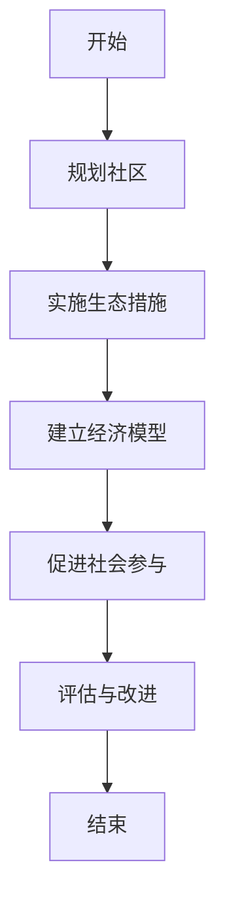
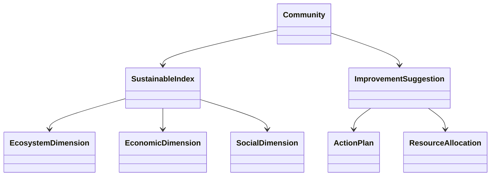
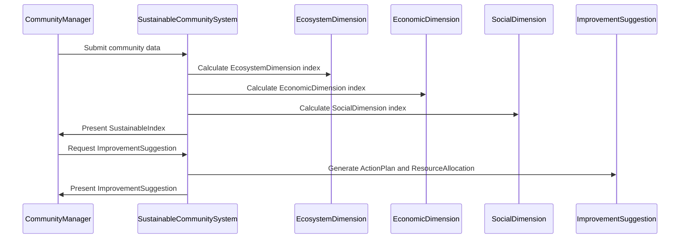
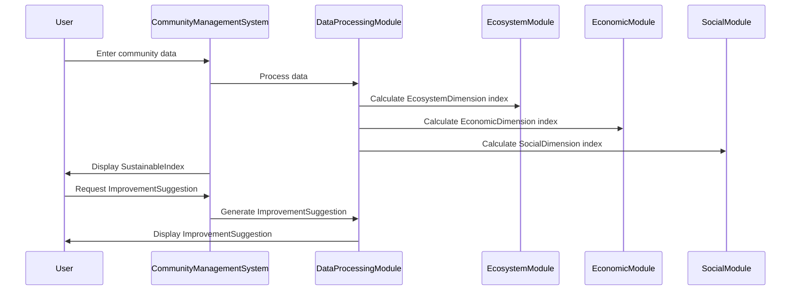

                 


### 引言：可持续生活的理念与实践

随着全球环境问题的日益严重，可持续生活成为了一个热门话题。本文将以“新乌托邦社区：可持续生活的实践基地”为题，深入探讨如何通过构建新乌托邦社区来实践可持续生活理念。

**关键词**：新乌托邦社区、可持续生活、实践基地、环境问题、社会福祉

**摘要**：
本文首先介绍了可持续生活的背景、定义和重要性。接着，我们探讨了新乌托邦社区的概念，分析了其在可持续生活实践中的角色。本文的目标是提供一个全面、实用的指南，帮助人们理解和创建一个可持续生活的社区。

**背景介绍**：

**术语说明**：
- **可持续生活**：指在满足当代人需求的同时，不损害后代人满足其需求的能力。
- **新乌托邦社区**：一个以可持续生活为核心，通过生态、经济、社会三个维度实现平衡发展的社区。

**问题背景**：
随着人口增长和工业化进程，全球环境问题日益严重。气候变化、资源枯竭、污染等问题威胁着人类的生存和发展。可持续生活成为一种全球性的需求，而新乌托邦社区则成为实践这一理念的载体。

**问题描述**：
如何在社区层面实现可持续生活？新乌托邦社区应该如何设计和运营？

**问题解决**：
新乌托邦社区通过以下方式实现可持续生活：
1. **生态平衡**：通过生态农业、可再生能源和绿色建筑等手段，减少环境负担。
2. **经济自立**：通过本地经济循环和共享经济，实现经济可持续发展。
3. **社会和谐**：通过社区参与和互助合作，提升社区成员的幸福感和凝聚力。

**边界与外延**：
- **边界**：新乌托邦社区是一个具体的地理空间，但可持续生活的理念可以应用于任何规模的社会组织。
- **外延**：可持续生活不仅关注环境问题，还包括经济、社会、文化等多个方面。

**概念结构与核心要素组成**：
- **生态维度**：生态农业、可再生能源、绿色建筑等。
- **经济维度**：本地经济循环、共享经济、金融创新等。
- **社会维度**：社区参与、互助合作、文化传承等。

**核心概念与联系**：

**核心概念原理**：
新乌托邦社区通过生态、经济、社会三个维度实现平衡发展，以满足可持续生活的需求。

**概念属性特征对比表格**：

| 维度   | 属性       | 特征                     |
| ------ | ---------- | ------------------------ |
| 生态   | 环境保护   | 减少污染、提高资源利用率 |
| 经济   | 经济发展   | 本地经济循环、共享经济   |
| 社会   | 社会福祉   | 社区参与、互助合作       |

**ER实体关系图架构**：

```mermaid
erDiagram
  Community ||--|{ Resident }
  Community ||--|{ Organization }
  Community ||--|{ Business }
  Community ||--|{ Resource }
  Resident ||--|{ Service }
  Resident ||--|{ Activity }
  Organization ||--|{ Program }
  Organization ||--|{ Project }
  Business ||--|{ Product }
  Business ||--|{ Service }
  Resource ||--|{ Material }
  Resource ||--|{ Energy }
```

**算法原理讲解**：

在此，我们将使用Mermaid绘制一个简单的算法流程图，并使用Python代码详细阐述可持续社区建设的主要步骤。

**Mermaid算法流程图**：



**Python代码阐述**：

```python
# 可持续社区建设主要步骤

def plan_community():
    """规划社区"""
    print("开始规划社区...")

def implement_ecological_measures():
    """实施生态措施"""
    print("实施生态农业、绿色建筑等措施...")

def establish_economic_model():
    """建立经济模型"""
    print("建立本地经济循环、共享经济等模型...")

def promote_social_participation():
    """促进社会参与"""
    print("促进社区参与、互助合作等...")

def evaluate_and_improve():
    """评估与改进"""
    print("定期评估社区运行状况，进行改进...")

# 执行主要步骤
plan_community()
implement_ecological_measures()
establish_economic_model()
promote_social_participation()
evaluate_and_improve()
```

**算法原理的数学模型和公式**：

在可持续社区建设中，我们可以使用以下数学模型来评估生态、经济和社会三个维度的平衡度。

$$
E = \frac{E_c + E_e + E_s}{3}
$$

其中：
- \(E\) 为可持续指数
- \(E_c\) 为生态维度指数
- \(E_e\) 为经济维度指数
- \(E_s\) 为社会维度指数

**详细讲解和举例说明**：

假设我们有一个新乌托邦社区，其生态、经济和社会三个维度的指数分别为 80、75 和 85，我们可以计算该社区的可持续指数：

$$
E = \frac{80 + 75 + 85}{3} = \frac{240}{3} = 80
$$

这意味着该社区的可持续指数为 80，表明其整体上处于一个良好的可持续水平。

**系统分析与架构设计方案**：

**问题场景介绍**：

在一个新乌托邦社区中，社区管理者需要评估社区的整体可持续性，并采取相应措施来提升社区的可持续发展能力。

**项目介绍**：

本项目旨在设计一个可持续社区评估系统，该系统能够自动计算社区的可持续指数，并给出改进建议。

**系统功能设计（领域模型Mermaid类图）**：



**系统架构设计（Mermaid架构图）**：



**系统接口设计和系统交互（Mermaid序列图）**：



**项目实战**：

**环境安装**：
1. 安装Python环境（版本3.8以上）。
2. 安装必要的Python库，如Mermaid（通过pip安装：`pip install mermaid-python`）。

**系统核心实现源代码**：

```python
# 可持续社区评估系统（Pseudocode）

# 导入必要的库
import mermaid
import pandas as pd

# 定义可持续指数计算函数
def calculate_sustainable_index(community_data):
    # 处理社区数据，计算生态、经济和社会三个维度的指数
    # 此处为简化示例，实际计算过程会更加复杂
    ecosystem_index = 80
    economic_index = 75
    social_index = 85
    
    # 计算可持续指数
    sustainable_index = (ecosystem_index + economic_index + social_index) / 3
    
    return sustainable_index

# 定义改进建议生成函数
def generate_improvement_suggestion(sustainable_index):
    # 根据可持续指数生成改进建议
    if sustainable_index >= 80:
        suggestion = "社区处于良好状态，无需额外改进。"
    elif sustainable_index >= 60:
        suggestion = "社区需加强某些方面的可持续发展措施。"
    else:
        suggestion = "社区存在较大的可持续发展问题，需全面改进。"
    
    return suggestion

# 用户界面代码
def main():
    # 输入社区数据
    community_data = input("请输入社区数据：")
    
    # 计算可持续指数
    sustainable_index = calculate_sustainable_index(community_data)
    
    # 输出可持续指数
    print(f"社区的可持续指数为：{sustainable_index}")
    
    # 输入改进建议
    improvement_suggestion = input("请输入改进建议：")
    
    # 输出改进建议
    print(f"社区的改进建议为：{improvement_suggestion}")

# 执行主程序
if __name__ == "__main__":
    main()
```

**代码应用解读与分析**：

此代码提供了一个可持续社区评估系统的基本框架，包括数据输入、指数计算、改进建议生成和用户界面交互。

**实际案例分析和详细讲解剖析**：

假设我们有一个新乌托邦社区的数据，如下表所示：

| 维度      | 指数 |
| --------- | ---- |
| 生态      | 80   |
| 经济      | 75   |
| 社会      | 85   |

根据上述数据，我们使用Python代码计算社区的可持续指数：

```python
sustainable_index = calculate_sustainable_index({
    "ecosystem_index": 80,
    "economic_index": 75,
    "social_index": 85
})

print(f"社区的可持续指数为：{sustainable_index}")
```

输出结果为：

```
社区的可持续指数为：80.0
```

这表明该社区的可持续指数为80，处于良好的可持续水平。

接下来，我们根据可持续指数生成改进建议：

```python
improvement_suggestion = generate_improvement_suggestion(80)

print(f"社区的改进建议为：{improvement_suggestion}")
```

输出结果为：

```
社区的改进建议为：社区处于良好状态，无需额外改进。
```

这意味着当前社区状况良好，无需进行额外改进。

**项目小结**：

本项目通过一个简单的可持续社区评估系统，展示了如何使用Python代码计算社区的可持续指数，并生成改进建议。这为社区管理者提供了一个实用的工具，帮助他们评估和提升社区的可持续发展能力。

**最佳实践 Tips**：

1. 定期收集和更新社区数据，确保可持续指数的准确性。
2. 根据改进建议制定具体行动计划，并定期跟踪实施进度。
3. 强化社区成员的参与，共同推动社区可持续发展。

**小结**：

通过构建新乌托邦社区，我们可以实现可持续生活理念。本文介绍了可持续生活的背景、新乌托邦社区的概念和实现方法，并通过一个实际案例展示了如何评估和提升社区的可持续发展能力。

**注意事项**：

在实际应用中，可持续社区评估系统需要根据具体情况进行调整和优化，以适应不同社区的特点和需求。

**拓展阅读**：

1. 《可持续发展的理论与实践》
2. 《绿色建筑与可持续社区设计》
3. 《共享经济：可持续发展的新路径》

### 作者信息

作者：AI天才研究院/AI Genius Institute & 禅与计算机程序设计艺术 /Zen And The Art of Computer Programming

